cola Report for Consensus Partitioning
==================

**Date**: 2019-12-04 05:40:38 CET, **cola version**: 1.3.2

----------------------------------------------------------------

<style type='text/css'>

body, td, th {
   font-family: Arial,Helvetica,sans-serif;
   background-color: white;
   font-size: 13px;
  max-width: 800px;
  margin: auto;
  margin-left:210px;
  padding: 0px 10px 0px 10px;
  border-left: 1px solid #EEEEEE;
  line-height: 150%;
}

tt, code, pre {
   font-family: 'DejaVu Sans Mono', 'Droid Sans Mono', 'Lucida Console', Consolas, Monaco, 

monospace;
}

h1 {
   font-size:2.2em;
}

h2 {
   font-size:1.8em;
}

h3 {
   font-size:1.4em;
}

h4 {
   font-size:1.0em;
}

h5 {
   font-size:0.9em;
}

h6 {
   font-size:0.8em;
}

a {
  text-decoration: none;
  color: #0366d6;
}

a:hover {
  text-decoration: underline;
}

a:visited {
   color: #0366d6;
}

pre, img {
  max-width: 100%;
}
pre {
  overflow-x: auto;
}
pre code {
   display: block; padding: 0.5em;
}

code {
  font-size: 92%;
  border: 1px solid #ccc;
}

code[class] {
  background-color: #F8F8F8;
}

table, td, th {
  border: 1px solid #ccc;
}

blockquote {
   color:#666666;
   margin:0;
   padding-left: 1em;
   border-left: 0.5em #EEE solid;
}

hr {
   height: 0px;
   border-bottom: none;
   border-top-width: thin;
   border-top-style: dotted;
   border-top-color: #999999;
}

@media print {
   * {
      background: transparent !important;
      color: black !important;
      filter:none !important;
      -ms-filter: none !important;
   }

   body {
      font-size:12pt;
      max-width:100%;
   }

   a, a:visited {
      text-decoration: underline;
   }

   hr {
      visibility: hidden;
      page-break-before: always;
   }

   pre, blockquote {
      padding-right: 1em;
      page-break-inside: avoid;
   }

   tr, img {
      page-break-inside: avoid;
   }

   img {
      max-width: 100% !important;
   }

   @page :left {
      margin: 15mm 20mm 15mm 10mm;
   }

   @page :right {
      margin: 15mm 10mm 15mm 20mm;
   }

   p, h2, h3 {
      orphans: 3; widows: 3;
   }

   h2, h3 {
      page-break-after: avoid;
   }
}
</style>


## Summary


All available functions which can be applied to this `res_list` object:


```r
res_list
```

```
#> A 'ConsensusPartitionList' object with 24 methods.
#>   On a matrix with 11993 rows and 173 columns.
#>   Top rows are extracted by 'SD, CV, MAD, ATC' methods.
#>   Subgroups are detected by 'hclust, kmeans, skmeans, pam, mclust, NMF' method.
#>   Number of partitions are tried for k = 2, 3, 4, 5, 6.
#>   Performed in total 30000 partitions by row resampling.
#> 
#> Following methods can be applied to this 'ConsensusPartitionList' object:
#>  [1] "cola_report"           "collect_classes"       "collect_plots"         "collect_stats"        
#>  [5] "colnames"              "functional_enrichment" "get_anno_col"          "get_anno"             
#>  [9] "get_classes"           "get_matrix"            "get_membership"        "get_stats"            
#> [13] "is_best_k"             "is_stable_k"           "ncol"                  "nrow"                 
#> [17] "rownames"              "show"                  "suggest_best_k"        "test_to_known_factors"
#> [21] "top_rows_heatmap"      "top_rows_overlap"     
#> 
#> You can get result for a single method by, e.g. object["SD", "hclust"] or object["SD:hclust"]
#> or a subset of methods by object[c("SD", "CV")], c("hclust", "kmeans")]
```

The call of `run_all_consensus_partition_methods()` was:


```
#> run_all_consensus_partition_methods(data = mat, mc.cores = 4, anno = anno)
```

Dimension of the input matrix:


```r
mat = get_matrix(res_list)
dim(mat)
```

```
#> [1] 11993   173
```

### Density distribution

The density distribution for each sample is visualized as in one column in the
following heatmap. The clustering is based on the distance which is the
Kolmogorov-Smirnov statistic between two distributions.


```r
library(ComplexHeatmap)
densityHeatmap(mat, top_annotation = HeatmapAnnotation(df = get_anno(res_list), 
    col = get_anno_col(res_list)), ylab = "value", cluster_columns = TRUE, show_column_names = FALSE,
    mc.cores = 4)
```


### Suggest the best k


Folowing table shows the best `k` (number of partitions) for each combination
of top-value methods and partition methods. Clicking on the method name in
the table goes to the section for a single combination of methods.

[The cola vignette](http://bioconductor.org/packages/devel/bioc/vignettes/cola/inst/doc/cola.html#toc_13)
explains the definition of the metrics used for determining the best
number of partitions.


```r
suggest_best_k(res_list)
```


|                            | The best k| 1-PAC| Mean silhouette| Concordance|   |
|:---------------------------|----------:|-----:|---------------:|-----------:|:--|
|[ATC:skmeans](#ATC-skmeans) |          2| 0.928|           0.931|       0.972|*  |
|[ATC:kmeans](#ATC-kmeans)   |          2| 0.917|           0.948|       0.977|*  |
|[ATC:NMF](#ATC-NMF)         |          2| 0.894|           0.924|       0.969|   |
|[ATC:mclust](#ATC-mclust)   |          2| 0.756|           0.916|       0.955|   |
|[ATC:pam](#ATC-pam)         |          6| 0.700|           0.608|       0.779|   |
|[MAD:mclust](#MAD-mclust)   |          4| 0.680|           0.723|       0.874|   |
|[SD:skmeans](#SD-skmeans)   |          2| 0.616|           0.834|       0.924|   |
|[MAD:NMF](#MAD-NMF)         |          2| 0.615|           0.832|       0.919|   |
|[MAD:skmeans](#MAD-skmeans) |          2| 0.596|           0.807|       0.914|   |
|[SD:mclust](#SD-mclust)     |          4| 0.596|           0.613|       0.820|   |
|[MAD:kmeans](#MAD-kmeans)   |          3| 0.577|           0.676|       0.836|   |
|[SD:NMF](#SD-NMF)           |          2| 0.573|           0.823|       0.911|   |
|[CV:skmeans](#CV-skmeans)   |          2| 0.541|           0.798|       0.905|   |
|[CV:mclust](#CV-mclust)     |          4| 0.520|           0.521|       0.754|   |
|[CV:NMF](#CV-NMF)           |          2| 0.500|           0.809|       0.898|   |
|[SD:pam](#SD-pam)           |          3| 0.439|           0.740|       0.851|   |
|[CV:pam](#CV-pam)           |          2| 0.340|           0.792|       0.847|   |
|[MAD:pam](#MAD-pam)         |          2| 0.316|           0.787|       0.869|   |
|[CV:kmeans](#CV-kmeans)     |          2| 0.231|           0.711|       0.837|   |
|[SD:kmeans](#SD-kmeans)     |          2| 0.213|           0.694|       0.833|   |
|[ATC:hclust](#ATC-hclust)   |          2| 0.178|           0.646|       0.812|   |
|[SD:hclust](#SD-hclust)     |          6| 0.176|           0.270|       0.476|   |
|[CV:hclust](#CV-hclust)     |          6| 0.147|           0.298|       0.541|   |
|[MAD:hclust](#MAD-hclust)   |          5| 0.144|           0.333|       0.529|   |

\*\*: 1-PAC > 0.95, \*: 1-PAC > 0.9


### CDF of consensus matrices

Cumulative distribution function curves of consensus matrix for all methods.


```r
collect_plots(res_list, fun = plot_ecdf)
```

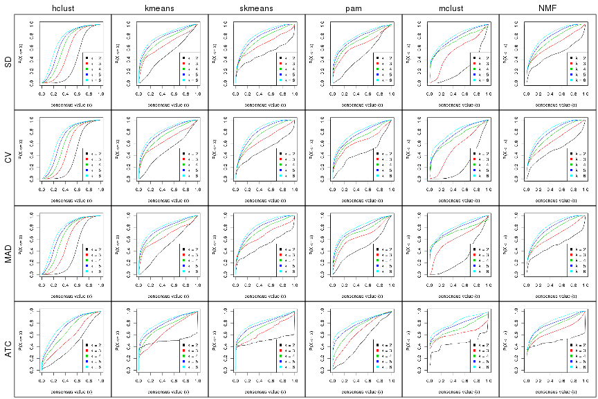


### Consensus heatmap

Consensus heatmaps for all methods. ([What is a consensus heatmap?](http://bioconductor.org/packages/devel/bioc/vignettes/cola/inst/doc/cola.html#toc_9))


<style type='text/css'>


.ui-helper-hidden {
	display: none;
}
.ui-helper-hidden-accessible {
	border: 0;
	clip: rect(0 0 0 0);
	height: 1px;
	margin: -1px;
	overflow: hidden;
	padding: 0;
	position: absolute;
	width: 1px;
}
.ui-helper-reset {
	margin: 0;
	padding: 0;
	border: 0;
	outline: 0;
	line-height: 1.3;
	text-decoration: none;
	font-size: 100%;
	list-style: none;
}
.ui-helper-clearfix:before,
.ui-helper-clearfix:after {
	content: "";
	display: table;
	border-collapse: collapse;
}
.ui-helper-clearfix:after {
	clear: both;
}
.ui-helper-zfix {
	width: 100%;
	height: 100%;
	top: 0;
	left: 0;
	position: absolute;
	opacity: 0;
	filter:Alpha(Opacity=0); 
}

.ui-front {
	z-index: 100;
}


.ui-state-disabled {
	cursor: default !important;
	pointer-events: none;
}


.ui-icon {
	display: inline-block;
	vertical-align: middle;
	margin-top: -.25em;
	position: relative;
	text-indent: -99999px;
	overflow: hidden;
	background-repeat: no-repeat;
}

.ui-widget-icon-block {
	left: 50%;
	margin-left: -8px;
	display: block;
}


.ui-widget-overlay {
	position: fixed;
	top: 0;
	left: 0;
	width: 100%;
	height: 100%;
}
.ui-accordion .ui-accordion-header {
	display: block;
	cursor: pointer;
	position: relative;
	margin: 2px 0 0 0;
	padding: .5em .5em .5em .7em;
	font-size: 100%;
}
.ui-accordion .ui-accordion-content {
	padding: 1em 2.2em;
	border-top: 0;
	overflow: auto;
}
.ui-autocomplete {
	position: absolute;
	top: 0;
	left: 0;
	cursor: default;
}
.ui-menu {
	list-style: none;
	padding: 0;
	margin: 0;
	display: block;
	outline: 0;
}
.ui-menu .ui-menu {
	position: absolute;
}
.ui-menu .ui-menu-item {
	margin: 0;
	cursor: pointer;
	
	list-style-image: url("data:image/gif;base64,R0lGODlhAQABAIAAAAAAAP///yH5BAEAAAAALAAAAAABAAEAAAIBRAA7");
}
.ui-menu .ui-menu-item-wrapper {
	position: relative;
	padding: 3px 1em 3px .4em;
}
.ui-menu .ui-menu-divider {
	margin: 5px 0;
	height: 0;
	font-size: 0;
	line-height: 0;
	border-width: 1px 0 0 0;
}
.ui-menu .ui-state-focus,
.ui-menu .ui-state-active {
	margin: -1px;
}


.ui-menu-icons {
	position: relative;
}
.ui-menu-icons .ui-menu-item-wrapper {
	padding-left: 2em;
}


.ui-menu .ui-icon {
	position: absolute;
	top: 0;
	bottom: 0;
	left: .2em;
	margin: auto 0;
}


.ui-menu .ui-menu-icon {
	left: auto;
	right: 0;
}
.ui-button {
	padding: .4em 1em;
	display: inline-block;
	position: relative;
	line-height: normal;
	margin-right: .1em;
	cursor: pointer;
	vertical-align: middle;
	text-align: center;
	-webkit-user-select: none;
	-moz-user-select: none;
	-ms-user-select: none;
	user-select: none;

	
	overflow: visible;
}

.ui-button,
.ui-button:link,
.ui-button:visited,
.ui-button:hover,
.ui-button:active {
	text-decoration: none;
}


.ui-button-icon-only {
	width: 2em;
	box-sizing: border-box;
	text-indent: -9999px;
	white-space: nowrap;
}


input.ui-button.ui-button-icon-only {
	text-indent: 0;
}


.ui-button-icon-only .ui-icon {
	position: absolute;
	top: 50%;
	left: 50%;
	margin-top: -8px;
	margin-left: -8px;
}

.ui-button.ui-icon-notext .ui-icon {
	padding: 0;
	width: 2.1em;
	height: 2.1em;
	text-indent: -9999px;
	white-space: nowrap;

}

input.ui-button.ui-icon-notext .ui-icon {
	width: auto;
	height: auto;
	text-indent: 0;
	white-space: normal;
	padding: .4em 1em;
}


input.ui-button::-moz-focus-inner,
button.ui-button::-moz-focus-inner {
	border: 0;
	padding: 0;
}
.ui-controlgroup {
	vertical-align: middle;
	display: inline-block;
}
.ui-controlgroup > .ui-controlgroup-item {
	float: left;
	margin-left: 0;
	margin-right: 0;
}
.ui-controlgroup > .ui-controlgroup-item:focus,
.ui-controlgroup > .ui-controlgroup-item.ui-visual-focus {
	z-index: 9999;
}
.ui-controlgroup-vertical > .ui-controlgroup-item {
	display: block;
	float: none;
	width: 100%;
	margin-top: 0;
	margin-bottom: 0;
	text-align: left;
}
.ui-controlgroup-vertical .ui-controlgroup-item {
	box-sizing: border-box;
}
.ui-controlgroup .ui-controlgroup-label {
	padding: .4em 1em;
}
.ui-controlgroup .ui-controlgroup-label span {
	font-size: 80%;
}
.ui-controlgroup-horizontal .ui-controlgroup-label + .ui-controlgroup-item {
	border-left: none;
}
.ui-controlgroup-vertical .ui-controlgroup-label + .ui-controlgroup-item {
	border-top: none;
}
.ui-controlgroup-horizontal .ui-controlgroup-label.ui-widget-content {
	border-right: none;
}
.ui-controlgroup-vertical .ui-controlgroup-label.ui-widget-content {
	border-bottom: none;
}


.ui-controlgroup-vertical .ui-spinner-input {

	
	width: 75%;
	width: calc( 100% - 2.4em );
}
.ui-controlgroup-vertical .ui-spinner .ui-spinner-up {
	border-top-style: solid;
}

.ui-checkboxradio-label .ui-icon-background {
	box-shadow: inset 1px 1px 1px #ccc;
	border-radius: .12em;
	border: none;
}
.ui-checkboxradio-radio-label .ui-icon-background {
	width: 16px;
	height: 16px;
	border-radius: 1em;
	overflow: visible;
	border: none;
}
.ui-checkboxradio-radio-label.ui-checkboxradio-checked .ui-icon,
.ui-checkboxradio-radio-label.ui-checkboxradio-checked:hover .ui-icon {
	background-image: none;
	width: 8px;
	height: 8px;
	border-width: 4px;
	border-style: solid;
}
.ui-checkboxradio-disabled {
	pointer-events: none;
}
.ui-datepicker {
	width: 17em;
	padding: .2em .2em 0;
	display: none;
}
.ui-datepicker .ui-datepicker-header {
	position: relative;
	padding: .2em 0;
}
.ui-datepicker .ui-datepicker-prev,
.ui-datepicker .ui-datepicker-next {
	position: absolute;
	top: 2px;
	width: 1.8em;
	height: 1.8em;
}
.ui-datepicker .ui-datepicker-prev-hover,
.ui-datepicker .ui-datepicker-next-hover {
	top: 1px;
}
.ui-datepicker .ui-datepicker-prev {
	left: 2px;
}
.ui-datepicker .ui-datepicker-next {
	right: 2px;
}
.ui-datepicker .ui-datepicker-prev-hover {
	left: 1px;
}
.ui-datepicker .ui-datepicker-next-hover {
	right: 1px;
}
.ui-datepicker .ui-datepicker-prev span,
.ui-datepicker .ui-datepicker-next span {
	display: block;
	position: absolute;
	left: 50%;
	margin-left: -8px;
	top: 50%;
	margin-top: -8px;
}
.ui-datepicker .ui-datepicker-title {
	margin: 0 2.3em;
	line-height: 1.8em;
	text-align: center;
}
.ui-datepicker .ui-datepicker-title select {
	font-size: 1em;
	margin: 1px 0;
}
.ui-datepicker select.ui-datepicker-month,
.ui-datepicker select.ui-datepicker-year {
	width: 45%;
}
.ui-datepicker table {
	width: 100%;
	font-size: .9em;
	border-collapse: collapse;
	margin: 0 0 .4em;
}
.ui-datepicker th {
	padding: .7em .3em;
	text-align: center;
	font-weight: bold;
	border: 0;
}
.ui-datepicker td {
	border: 0;
	padding: 1px;
}
.ui-datepicker td span,
.ui-datepicker td a {
	display: block;
	padding: .2em;
	text-align: right;
	text-decoration: none;
}
.ui-datepicker .ui-datepicker-buttonpane {
	background-image: none;
	margin: .7em 0 0 0;
	padding: 0 .2em;
	border-left: 0;
	border-right: 0;
	border-bottom: 0;
}
.ui-datepicker .ui-datepicker-buttonpane button {
	float: right;
	margin: .5em .2em .4em;
	cursor: pointer;
	padding: .2em .6em .3em .6em;
	width: auto;
	overflow: visible;
}
.ui-datepicker .ui-datepicker-buttonpane button.ui-datepicker-current {
	float: left;
}


.ui-datepicker.ui-datepicker-multi {
	width: auto;
}
.ui-datepicker-multi .ui-datepicker-group {
	float: left;
}
.ui-datepicker-multi .ui-datepicker-group table {
	width: 95%;
	margin: 0 auto .4em;
}
.ui-datepicker-multi-2 .ui-datepicker-group {
	width: 50%;
}
.ui-datepicker-multi-3 .ui-datepicker-group {
	width: 33.3%;
}
.ui-datepicker-multi-4 .ui-datepicker-group {
	width: 25%;
}
.ui-datepicker-multi .ui-datepicker-group-last .ui-datepicker-header,
.ui-datepicker-multi .ui-datepicker-group-middle .ui-datepicker-header {
	border-left-width: 0;
}
.ui-datepicker-multi .ui-datepicker-buttonpane {
	clear: left;
}
.ui-datepicker-row-break {
	clear: both;
	width: 100%;
	font-size: 0;
}


.ui-datepicker-rtl {
	direction: rtl;
}
.ui-datepicker-rtl .ui-datepicker-prev {
	right: 2px;
	left: auto;
}
.ui-datepicker-rtl .ui-datepicker-next {
	left: 2px;
	right: auto;
}
.ui-datepicker-rtl .ui-datepicker-prev:hover {
	right: 1px;
	left: auto;
}
.ui-datepicker-rtl .ui-datepicker-next:hover {
	left: 1px;
	right: auto;
}
.ui-datepicker-rtl .ui-datepicker-buttonpane {
	clear: right;
}
.ui-datepicker-rtl .ui-datepicker-buttonpane button {
	float: left;
}
.ui-datepicker-rtl .ui-datepicker-buttonpane button.ui-datepicker-current,
.ui-datepicker-rtl .ui-datepicker-group {
	float: right;
}
.ui-datepicker-rtl .ui-datepicker-group-last .ui-datepicker-header,
.ui-datepicker-rtl .ui-datepicker-group-middle .ui-datepicker-header {
	border-right-width: 0;
	border-left-width: 1px;
}


.ui-datepicker .ui-icon {
	display: block;
	text-indent: -99999px;
	overflow: hidden;
	background-repeat: no-repeat;
	left: .5em;
	top: .3em;
}
.ui-dialog {
	position: absolute;
	top: 0;
	left: 0;
	padding: .2em;
	outline: 0;
}
.ui-dialog .ui-dialog-titlebar {
	padding: .4em 1em;
	position: relative;
}
.ui-dialog .ui-dialog-title {
	float: left;
	margin: .1em 0;
	white-space: nowrap;
	width: 90%;
	overflow: hidden;
	text-overflow: ellipsis;
}
.ui-dialog .ui-dialog-titlebar-close {
	position: absolute;
	right: .3em;
	top: 50%;
	width: 20px;
	margin: -10px 0 0 0;
	padding: 1px;
	height: 20px;
}
.ui-dialog .ui-dialog-content {
	position: relative;
	border: 0;
	padding: .5em 1em;
	background: none;
	overflow: auto;
}
.ui-dialog .ui-dialog-buttonpane {
	text-align: left;
	border-width: 1px 0 0 0;
	background-image: none;
	margin-top: .5em;
	padding: .3em 1em .5em .4em;
}
.ui-dialog .ui-dialog-buttonpane .ui-dialog-buttonset {
	float: right;
}
.ui-dialog .ui-dialog-buttonpane button {
	margin: .5em .4em .5em 0;
	cursor: pointer;
}
.ui-dialog .ui-resizable-n {
	height: 2px;
	top: 0;
}
.ui-dialog .ui-resizable-e {
	width: 2px;
	right: 0;
}
.ui-dialog .ui-resizable-s {
	height: 2px;
	bottom: 0;
}
.ui-dialog .ui-resizable-w {
	width: 2px;
	left: 0;
}
.ui-dialog .ui-resizable-se,
.ui-dialog .ui-resizable-sw,
.ui-dialog .ui-resizable-ne,
.ui-dialog .ui-resizable-nw {
	width: 7px;
	height: 7px;
}
.ui-dialog .ui-resizable-se {
	right: 0;
	bottom: 0;
}
.ui-dialog .ui-resizable-sw {
	left: 0;
	bottom: 0;
}
.ui-dialog .ui-resizable-ne {
	right: 0;
	top: 0;
}
.ui-dialog .ui-resizable-nw {
	left: 0;
	top: 0;
}
.ui-draggable .ui-dialog-titlebar {
	cursor: move;
}
.ui-draggable-handle {
	-ms-touch-action: none;
	touch-action: none;
}
.ui-resizable {
	position: relative;
}
.ui-resizable-handle {
	position: absolute;
	font-size: 0.1px;
	display: block;
	-ms-touch-action: none;
	touch-action: none;
}
.ui-resizable-disabled .ui-resizable-handle,
.ui-resizable-autohide .ui-resizable-handle {
	display: none;
}
.ui-resizable-n {
	cursor: n-resize;
	height: 7px;
	width: 100%;
	top: -5px;
	left: 0;
}
.ui-resizable-s {
	cursor: s-resize;
	height: 7px;
	width: 100%;
	bottom: -5px;
	left: 0;
}
.ui-resizable-e {
	cursor: e-resize;
	width: 7px;
	right: -5px;
	top: 0;
	height: 100%;
}
.ui-resizable-w {
	cursor: w-resize;
	width: 7px;
	left: -5px;
	top: 0;
	height: 100%;
}
.ui-resizable-se {
	cursor: se-resize;
	width: 12px;
	height: 12px;
	right: 1px;
	bottom: 1px;
}
.ui-resizable-sw {
	cursor: sw-resize;
	width: 9px;
	height: 9px;
	left: -5px;
	bottom: -5px;
}
.ui-resizable-nw {
	cursor: nw-resize;
	width: 9px;
	height: 9px;
	left: -5px;
	top: -5px;
}
.ui-resizable-ne {
	cursor: ne-resize;
	width: 9px;
	height: 9px;
	right: -5px;
	top: -5px;
}
.ui-progressbar {
	height: 2em;
	text-align: left;
	overflow: hidden;
}
.ui-progressbar .ui-progressbar-value {
	margin: -1px;
	height: 100%;
}
.ui-progressbar .ui-progressbar-overlay {
	background: url("data:image/gif;base64,R0lGODlhKAAoAIABAAAAAP///yH/C05FVFNDQVBFMi4wAwEAAAAh+QQJAQABACwAAAAAKAAoAAACkYwNqXrdC52DS06a7MFZI+4FHBCKoDeWKXqymPqGqxvJrXZbMx7Ttc+w9XgU2FB3lOyQRWET2IFGiU9m1frDVpxZZc6bfHwv4c1YXP6k1Vdy292Fb6UkuvFtXpvWSzA+HycXJHUXiGYIiMg2R6W459gnWGfHNdjIqDWVqemH2ekpObkpOlppWUqZiqr6edqqWQAAIfkECQEAAQAsAAAAACgAKAAAApSMgZnGfaqcg1E2uuzDmmHUBR8Qil95hiPKqWn3aqtLsS18y7G1SzNeowWBENtQd+T1JktP05nzPTdJZlR6vUxNWWjV+vUWhWNkWFwxl9VpZRedYcflIOLafaa28XdsH/ynlcc1uPVDZxQIR0K25+cICCmoqCe5mGhZOfeYSUh5yJcJyrkZWWpaR8doJ2o4NYq62lAAACH5BAkBAAEALAAAAAAoACgAAAKVDI4Yy22ZnINRNqosw0Bv7i1gyHUkFj7oSaWlu3ovC8GxNso5fluz3qLVhBVeT/Lz7ZTHyxL5dDalQWPVOsQWtRnuwXaFTj9jVVh8pma9JjZ4zYSj5ZOyma7uuolffh+IR5aW97cHuBUXKGKXlKjn+DiHWMcYJah4N0lYCMlJOXipGRr5qdgoSTrqWSq6WFl2ypoaUAAAIfkECQEAAQAsAAAAACgAKAAAApaEb6HLgd/iO7FNWtcFWe+ufODGjRfoiJ2akShbueb0wtI50zm02pbvwfWEMWBQ1zKGlLIhskiEPm9R6vRXxV4ZzWT2yHOGpWMyorblKlNp8HmHEb/lCXjcW7bmtXP8Xt229OVWR1fod2eWqNfHuMjXCPkIGNileOiImVmCOEmoSfn3yXlJWmoHGhqp6ilYuWYpmTqKUgAAIfkECQEAAQAsAAAAACgAKAAAApiEH6kb58biQ3FNWtMFWW3eNVcojuFGfqnZqSebuS06w5V80/X02pKe8zFwP6EFWOT1lDFk8rGERh1TTNOocQ61Hm4Xm2VexUHpzjymViHrFbiELsefVrn6XKfnt2Q9G/+Xdie499XHd2g4h7ioOGhXGJboGAnXSBnoBwKYyfioubZJ2Hn0RuRZaflZOil56Zp6iioKSXpUAAAh+QQJAQABACwAAAAAKAAoAAACkoQRqRvnxuI7kU1a1UU5bd5tnSeOZXhmn5lWK3qNTWvRdQxP8qvaC+/yaYQzXO7BMvaUEmJRd3TsiMAgswmNYrSgZdYrTX6tSHGZO73ezuAw2uxuQ+BbeZfMxsexY35+/Qe4J1inV0g4x3WHuMhIl2jXOKT2Q+VU5fgoSUI52VfZyfkJGkha6jmY+aaYdirq+lQAACH5BAkBAAEALAAAAAAoACgAAAKWBIKpYe0L3YNKToqswUlvznigd4wiR4KhZrKt9Upqip61i9E3vMvxRdHlbEFiEXfk9YARYxOZZD6VQ2pUunBmtRXo1Lf8hMVVcNl8JafV38aM2/Fu5V16Bn63r6xt97j09+MXSFi4BniGFae3hzbH9+hYBzkpuUh5aZmHuanZOZgIuvbGiNeomCnaxxap2upaCZsq+1kAACH5BAkBAAEALAAAAAAoACgAAAKXjI8By5zf4kOxTVrXNVlv1X0d8IGZGKLnNpYtm8Lr9cqVeuOSvfOW79D9aDHizNhDJidFZhNydEahOaDH6nomtJjp1tutKoNWkvA6JqfRVLHU/QUfau9l2x7G54d1fl995xcIGAdXqMfBNadoYrhH+Mg2KBlpVpbluCiXmMnZ2Sh4GBqJ+ckIOqqJ6LmKSllZmsoq6wpQAAAh+QQJAQABACwAAAAAKAAoAAAClYx/oLvoxuJDkU1a1YUZbJ59nSd2ZXhWqbRa2/gF8Gu2DY3iqs7yrq+xBYEkYvFSM8aSSObE+ZgRl1BHFZNr7pRCavZ5BW2142hY3AN/zWtsmf12p9XxxFl2lpLn1rseztfXZjdIWIf2s5dItwjYKBgo9yg5pHgzJXTEeGlZuenpyPmpGQoKOWkYmSpaSnqKileI2FAAACH5BAkBAAEALAAAAAAoACgAAAKVjB+gu+jG4kORTVrVhRlsnn2dJ3ZleFaptFrb+CXmO9OozeL5VfP99HvAWhpiUdcwkpBH3825AwYdU8xTqlLGhtCosArKMpvfa1mMRae9VvWZfeB2XfPkeLmm18lUcBj+p5dnN8jXZ3YIGEhYuOUn45aoCDkp16hl5IjYJvjWKcnoGQpqyPlpOhr3aElaqrq56Bq7VAAAOw==");
	height: 100%;
	filter: alpha(opacity=25); 
	opacity: 0.25;
}
.ui-progressbar-indeterminate .ui-progressbar-value {
	background-image: none;
}
.ui-selectable {
	-ms-touch-action: none;
	touch-action: none;
}
.ui-selectable-helper {
	position: absolute;
	z-index: 100;
	border: 1px dotted black;
}
.ui-selectmenu-menu {
	padding: 0;
	margin: 0;
	position: absolute;
	top: 0;
	left: 0;
	display: none;
}
.ui-selectmenu-menu .ui-menu {
	overflow: auto;
	overflow-x: hidden;
	padding-bottom: 1px;
}
.ui-selectmenu-menu .ui-menu .ui-selectmenu-optgroup {
	font-size: 1em;
	font-weight: bold;
	line-height: 1.5;
	padding: 2px 0.4em;
	margin: 0.5em 0 0 0;
	height: auto;
	border: 0;
}
.ui-selectmenu-open {
	display: block;
}
.ui-selectmenu-text {
	display: block;
	margin-right: 20px;
	overflow: hidden;
	text-overflow: ellipsis;
}
.ui-selectmenu-button.ui-button {
	text-align: left;
	white-space: nowrap;
	width: 14em;
}
.ui-selectmenu-icon.ui-icon {
	float: right;
	margin-top: 0;
}
.ui-slider {
	position: relative;
	text-align: left;
}
.ui-slider .ui-slider-handle {
	position: absolute;
	z-index: 2;
	width: 1.2em;
	height: 1.2em;
	cursor: default;
	-ms-touch-action: none;
	touch-action: none;
}
.ui-slider .ui-slider-range {
	position: absolute;
	z-index: 1;
	font-size: .7em;
	display: block;
	border: 0;
	background-position: 0 0;
}


.ui-slider.ui-state-disabled .ui-slider-handle,
.ui-slider.ui-state-disabled .ui-slider-range {
	filter: inherit;
}

.ui-slider-horizontal {
	height: .8em;
}
.ui-slider-horizontal .ui-slider-handle {
	top: -.3em;
	margin-left: -.6em;
}
.ui-slider-horizontal .ui-slider-range {
	top: 0;
	height: 100%;
}
.ui-slider-horizontal .ui-slider-range-min {
	left: 0;
}
.ui-slider-horizontal .ui-slider-range-max {
	right: 0;
}

.ui-slider-vertical {
	width: .8em;
	height: 100px;
}
.ui-slider-vertical .ui-slider-handle {
	left: -.3em;
	margin-left: 0;
	margin-bottom: -.6em;
}
.ui-slider-vertical .ui-slider-range {
	left: 0;
	width: 100%;
}
.ui-slider-vertical .ui-slider-range-min {
	bottom: 0;
}
.ui-slider-vertical .ui-slider-range-max {
	top: 0;
}
.ui-sortable-handle {
	-ms-touch-action: none;
	touch-action: none;
}
.ui-spinner {
	position: relative;
	display: inline-block;
	overflow: hidden;
	padding: 0;
	vertical-align: middle;
}
.ui-spinner-input {
	border: none;
	background: none;
	color: inherit;
	padding: .222em 0;
	margin: .2em 0;
	vertical-align: middle;
	margin-left: .4em;
	margin-right: 2em;
}
.ui-spinner-button {
	width: 1.6em;
	height: 50%;
	font-size: .5em;
	padding: 0;
	margin: 0;
	text-align: center;
	position: absolute;
	cursor: default;
	display: block;
	overflow: hidden;
	right: 0;
}

.ui-spinner a.ui-spinner-button {
	border-top-style: none;
	border-bottom-style: none;
	border-right-style: none;
}
.ui-spinner-up {
	top: 0;
}
.ui-spinner-down {
	bottom: 0;
}
.ui-tabs {
	position: relative;
	padding: .2em;
}
.ui-tabs .ui-tabs-nav {
	margin: 0;
	padding: .2em .2em 0;
}
.ui-tabs .ui-tabs-nav li {
	list-style: none;
	float: left;
	position: relative;
	top: 0;
	margin: 1px .2em 0 0;
	border-bottom-width: 0;
	padding: 0;
	white-space: nowrap;
}
.ui-tabs .ui-tabs-nav .ui-tabs-anchor {
	float: left;
	padding: .5em 1em;
	text-decoration: none;
}
.ui-tabs .ui-tabs-nav li.ui-tabs-active {
	margin-bottom: -1px;
	padding-bottom: 1px;
}
.ui-tabs .ui-tabs-nav li.ui-tabs-active .ui-tabs-anchor,
.ui-tabs .ui-tabs-nav li.ui-state-disabled .ui-tabs-anchor,
.ui-tabs .ui-tabs-nav li.ui-tabs-loading .ui-tabs-anchor {
	cursor: text;
}
.ui-tabs-collapsible .ui-tabs-nav li.ui-tabs-active .ui-tabs-anchor {
	cursor: pointer;
}
.ui-tabs .ui-tabs-panel {
	display: block;
	border-width: 0;
	padding: 1em 1.4em;
	background: none;
}
.ui-tooltip {
	padding: 8px;
	position: absolute;
	z-index: 9999;
	max-width: 300px;
}
body .ui-tooltip {
	border-width: 2px;
}

.ui-widget {
	font-family: Arial,Helvetica,sans-serif;
	font-size: 1em;
}
.ui-widget .ui-widget {
	font-size: 1em;
}
.ui-widget input,
.ui-widget select,
.ui-widget textarea,
.ui-widget button {
	font-family: Arial,Helvetica,sans-serif;
	font-size: 1em;
}
.ui-widget.ui-widget-content {
	border: 1px solid #c5c5c5;
}
.ui-widget-content {
	border: 1px solid #dddddd;
	background: #ffffff;
	color: #333333;
}
.ui-widget-content a {
	color: #333333;
}
.ui-widget-header {
	border: 1px solid #dddddd;
	background: #e9e9e9;
	color: #333333;
	font-weight: bold;
}
.ui-widget-header a {
	color: #333333;
}


.ui-state-default,
.ui-widget-content .ui-state-default,
.ui-widget-header .ui-state-default,
.ui-button,


html .ui-button.ui-state-disabled:hover,
html .ui-button.ui-state-disabled:active {
	border: 1px solid #c5c5c5;
	background: #f6f6f6;
	font-weight: normal;
	color: #454545;
}
.ui-state-default a,
.ui-state-default a:link,
.ui-state-default a:visited,
a.ui-button,
a:link.ui-button,
a:visited.ui-button,
.ui-button {
	color: #454545;
	text-decoration: none;
}
.ui-state-hover,
.ui-widget-content .ui-state-hover,
.ui-widget-header .ui-state-hover,
.ui-state-focus,
.ui-widget-content .ui-state-focus,
.ui-widget-header .ui-state-focus,
.ui-button:hover,
.ui-button:focus {
	border: 1px solid #cccccc;
	background: #ededed;
	font-weight: normal;
	color: #2b2b2b;
}
.ui-state-hover a,
.ui-state-hover a:hover,
.ui-state-hover a:link,
.ui-state-hover a:visited,
.ui-state-focus a,
.ui-state-focus a:hover,
.ui-state-focus a:link,
.ui-state-focus a:visited,
a.ui-button:hover,
a.ui-button:focus {
	color: #2b2b2b;
	text-decoration: none;
}

.ui-visual-focus {
	box-shadow: 0 0 3px 1px rgb(94, 158, 214);
}
.ui-state-active,
.ui-widget-content .ui-state-active,
.ui-widget-header .ui-state-active,
a.ui-button:active,
.ui-button:active,
.ui-button.ui-state-active:hover {
	border: 1px solid #003eff;
	background: #007fff;
	font-weight: normal;
	color: #ffffff;
}
.ui-icon-background,
.ui-state-active .ui-icon-background {
	border: #003eff;
	background-color: #ffffff;
}
.ui-state-active a,
.ui-state-active a:link,
.ui-state-active a:visited {
	color: #ffffff;
	text-decoration: none;
}


.ui-state-highlight,
.ui-widget-content .ui-state-highlight,
.ui-widget-header .ui-state-highlight {
	border: 1px solid #dad55e;
	background: #fffa90;
	color: #777620;
}
.ui-state-checked {
	border: 1px solid #dad55e;
	background: #fffa90;
}
.ui-state-highlight a,
.ui-widget-content .ui-state-highlight a,
.ui-widget-header .ui-state-highlight a {
	color: #777620;
}
.ui-state-error,
.ui-widget-content .ui-state-error,
.ui-widget-header .ui-state-error {
	border: 1px solid #f1a899;
	background: #fddfdf;
	color: #5f3f3f;
}
.ui-state-error a,
.ui-widget-content .ui-state-error a,
.ui-widget-header .ui-state-error a {
	color: #5f3f3f;
}
.ui-state-error-text,
.ui-widget-content .ui-state-error-text,
.ui-widget-header .ui-state-error-text {
	color: #5f3f3f;
}
.ui-priority-primary,
.ui-widget-content .ui-priority-primary,
.ui-widget-header .ui-priority-primary {
	font-weight: bold;
}
.ui-priority-secondary,
.ui-widget-content .ui-priority-secondary,
.ui-widget-header .ui-priority-secondary {
	opacity: .7;
	filter:Alpha(Opacity=70); 
	font-weight: normal;
}
.ui-state-disabled,
.ui-widget-content .ui-state-disabled,
.ui-widget-header .ui-state-disabled {
	opacity: .35;
	filter:Alpha(Opacity=35); 
	background-image: none;
}
.ui-state-disabled .ui-icon {
	filter:Alpha(Opacity=35); 
}


.ui-icon {
	width: 16px;
	height: 16px;
}
.ui-icon,
.ui-widget-content .ui-icon {
	background-image: url("images/ui-icons_444444_256x240.png");
}
.ui-widget-header .ui-icon {
	background-image: url("images/ui-icons_444444_256x240.png");
}
.ui-state-hover .ui-icon,
.ui-state-focus .ui-icon,
.ui-button:hover .ui-icon,
.ui-button:focus .ui-icon {
	background-image: url("images/ui-icons_555555_256x240.png");
}
.ui-state-active .ui-icon,
.ui-button:active .ui-icon {
	background-image: url("images/ui-icons_ffffff_256x240.png");
}
.ui-state-highlight .ui-icon,
.ui-button .ui-state-highlight.ui-icon {
	background-image: url("images/ui-icons_777620_256x240.png");
}
.ui-state-error .ui-icon,
.ui-state-error-text .ui-icon {
	background-image: url("images/ui-icons_cc0000_256x240.png");
}
.ui-button .ui-icon {
	background-image: url("images/ui-icons_777777_256x240.png");
}


.ui-icon-blank { background-position: 16px 16px; }
.ui-icon-caret-1-n { background-position: 0 0; }
.ui-icon-caret-1-ne { background-position: -16px 0; }
.ui-icon-caret-1-e { background-position: -32px 0; }
.ui-icon-caret-1-se { background-position: -48px 0; }
.ui-icon-caret-1-s { background-position: -65px 0; }
.ui-icon-caret-1-sw { background-position: -80px 0; }
.ui-icon-caret-1-w { background-position: -96px 0; }
.ui-icon-caret-1-nw { background-position: -112px 0; }
.ui-icon-caret-2-n-s { background-position: -128px 0; }
.ui-icon-caret-2-e-w { background-position: -144px 0; }
.ui-icon-triangle-1-n { background-position: 0 -16px; }
.ui-icon-triangle-1-ne { background-position: -16px -16px; }
.ui-icon-triangle-1-e { background-position: -32px -16px; }
.ui-icon-triangle-1-se { background-position: -48px -16px; }
.ui-icon-triangle-1-s { background-position: -65px -16px; }
.ui-icon-triangle-1-sw { background-position: -80px -16px; }
.ui-icon-triangle-1-w { background-position: -96px -16px; }
.ui-icon-triangle-1-nw { background-position: -112px -16px; }
.ui-icon-triangle-2-n-s { background-position: -128px -16px; }
.ui-icon-triangle-2-e-w { background-position: -144px -16px; }
.ui-icon-arrow-1-n { background-position: 0 -32px; }
.ui-icon-arrow-1-ne { background-position: -16px -32px; }
.ui-icon-arrow-1-e { background-position: -32px -32px; }
.ui-icon-arrow-1-se { background-position: -48px -32px; }
.ui-icon-arrow-1-s { background-position: -65px -32px; }
.ui-icon-arrow-1-sw { background-position: -80px -32px; }
.ui-icon-arrow-1-w { background-position: -96px -32px; }
.ui-icon-arrow-1-nw { background-position: -112px -32px; }
.ui-icon-arrow-2-n-s { background-position: -128px -32px; }
.ui-icon-arrow-2-ne-sw { background-position: -144px -32px; }
.ui-icon-arrow-2-e-w { background-position: -160px -32px; }
.ui-icon-arrow-2-se-nw { background-position: -176px -32px; }
.ui-icon-arrowstop-1-n { background-position: -192px -32px; }
.ui-icon-arrowstop-1-e { background-position: -208px -32px; }
.ui-icon-arrowstop-1-s { background-position: -224px -32px; }
.ui-icon-arrowstop-1-w { background-position: -240px -32px; }
.ui-icon-arrowthick-1-n { background-position: 1px -48px; }
.ui-icon-arrowthick-1-ne { background-position: -16px -48px; }
.ui-icon-arrowthick-1-e { background-position: -32px -48px; }
.ui-icon-arrowthick-1-se { background-position: -48px -48px; }
.ui-icon-arrowthick-1-s { background-position: -64px -48px; }
.ui-icon-arrowthick-1-sw { background-position: -80px -48px; }
.ui-icon-arrowthick-1-w { background-position: -96px -48px; }
.ui-icon-arrowthick-1-nw { background-position: -112px -48px; }
.ui-icon-arrowthick-2-n-s { background-position: -128px -48px; }
.ui-icon-arrowthick-2-ne-sw { background-position: -144px -48px; }
.ui-icon-arrowthick-2-e-w { background-position: -160px -48px; }
.ui-icon-arrowthick-2-se-nw { background-position: -176px -48px; }
.ui-icon-arrowthickstop-1-n { background-position: -192px -48px; }
.ui-icon-arrowthickstop-1-e { background-position: -208px -48px; }
.ui-icon-arrowthickstop-1-s { background-position: -224px -48px; }
.ui-icon-arrowthickstop-1-w { background-position: -240px -48px; }
.ui-icon-arrowreturnthick-1-w { background-position: 0 -64px; }
.ui-icon-arrowreturnthick-1-n { background-position: -16px -64px; }
.ui-icon-arrowreturnthick-1-e { background-position: -32px -64px; }
.ui-icon-arrowreturnthick-1-s { background-position: -48px -64px; }
.ui-icon-arrowreturn-1-w { background-position: -64px -64px; }
.ui-icon-arrowreturn-1-n { background-position: -80px -64px; }
.ui-icon-arrowreturn-1-e { background-position: -96px -64px; }
.ui-icon-arrowreturn-1-s { background-position: -112px -64px; }
.ui-icon-arrowrefresh-1-w { background-position: -128px -64px; }
.ui-icon-arrowrefresh-1-n { background-position: -144px -64px; }
.ui-icon-arrowrefresh-1-e { background-position: -160px -64px; }
.ui-icon-arrowrefresh-1-s { background-position: -176px -64px; }
.ui-icon-arrow-4 { background-position: 0 -80px; }
.ui-icon-arrow-4-diag { background-position: -16px -80px; }
.ui-icon-extlink { background-position: -32px -80px; }
.ui-icon-newwin { background-position: -48px -80px; }
.ui-icon-refresh { background-position: -64px -80px; }
.ui-icon-shuffle { background-position: -80px -80px; }
.ui-icon-transfer-e-w { background-position: -96px -80px; }
.ui-icon-transferthick-e-w { background-position: -112px -80px; }
.ui-icon-folder-collapsed { background-position: 0 -96px; }
.ui-icon-folder-open { background-position: -16px -96px; }
.ui-icon-document { background-position: -32px -96px; }
.ui-icon-document-b { background-position: -48px -96px; }
.ui-icon-note { background-position: -64px -96px; }
.ui-icon-mail-closed { background-position: -80px -96px; }
.ui-icon-mail-open { background-position: -96px -96px; }
.ui-icon-suitcase { background-position: -112px -96px; }
.ui-icon-comment { background-position: -128px -96px; }
.ui-icon-person { background-position: -144px -96px; }
.ui-icon-print { background-position: -160px -96px; }
.ui-icon-trash { background-position: -176px -96px; }
.ui-icon-locked { background-position: -192px -96px; }
.ui-icon-unlocked { background-position: -208px -96px; }
.ui-icon-bookmark { background-position: -224px -96px; }
.ui-icon-tag { background-position: -240px -96px; }
.ui-icon-home { background-position: 0 -112px; }
.ui-icon-flag { background-position: -16px -112px; }
.ui-icon-calendar { background-position: -32px -112px; }
.ui-icon-cart { background-position: -48px -112px; }
.ui-icon-pencil { background-position: -64px -112px; }
.ui-icon-clock { background-position: -80px -112px; }
.ui-icon-disk { background-position: -96px -112px; }
.ui-icon-calculator { background-position: -112px -112px; }
.ui-icon-zoomin { background-position: -128px -112px; }
.ui-icon-zoomout { background-position: -144px -112px; }
.ui-icon-search { background-position: -160px -112px; }
.ui-icon-wrench { background-position: -176px -112px; }
.ui-icon-gear { background-position: -192px -112px; }
.ui-icon-heart { background-position: -208px -112px; }
.ui-icon-star { background-position: -224px -112px; }
.ui-icon-link { background-position: -240px -112px; }
.ui-icon-cancel { background-position: 0 -128px; }
.ui-icon-plus { background-position: -16px -128px; }
.ui-icon-plusthick { background-position: -32px -128px; }
.ui-icon-minus { background-position: -48px -128px; }
.ui-icon-minusthick { background-position: -64px -128px; }
.ui-icon-close { background-position: -80px -128px; }
.ui-icon-closethick { background-position: -96px -128px; }
.ui-icon-key { background-position: -112px -128px; }
.ui-icon-lightbulb { background-position: -128px -128px; }
.ui-icon-scissors { background-position: -144px -128px; }
.ui-icon-clipboard { background-position: -160px -128px; }
.ui-icon-copy { background-position: -176px -128px; }
.ui-icon-contact { background-position: -192px -128px; }
.ui-icon-image { background-position: -208px -128px; }
.ui-icon-video { background-position: -224px -128px; }
.ui-icon-script { background-position: -240px -128px; }
.ui-icon-alert { background-position: 0 -144px; }
.ui-icon-info { background-position: -16px -144px; }
.ui-icon-notice { background-position: -32px -144px; }
.ui-icon-help { background-position: -48px -144px; }
.ui-icon-check { background-position: -64px -144px; }
.ui-icon-bullet { background-position: -80px -144px; }
.ui-icon-radio-on { background-position: -96px -144px; }
.ui-icon-radio-off { background-position: -112px -144px; }
.ui-icon-pin-w { background-position: -128px -144px; }
.ui-icon-pin-s { background-position: -144px -144px; }
.ui-icon-play { background-position: 0 -160px; }
.ui-icon-pause { background-position: -16px -160px; }
.ui-icon-seek-next { background-position: -32px -160px; }
.ui-icon-seek-prev { background-position: -48px -160px; }
.ui-icon-seek-end { background-position: -64px -160px; }
.ui-icon-seek-start { background-position: -80px -160px; }

.ui-icon-seek-first { background-position: -80px -160px; }
.ui-icon-stop { background-position: -96px -160px; }
.ui-icon-eject { background-position: -112px -160px; }
.ui-icon-volume-off { background-position: -128px -160px; }
.ui-icon-volume-on { background-position: -144px -160px; }
.ui-icon-power { background-position: 0 -176px; }
.ui-icon-signal-diag { background-position: -16px -176px; }
.ui-icon-signal { background-position: -32px -176px; }
.ui-icon-battery-0 { background-position: -48px -176px; }
.ui-icon-battery-1 { background-position: -64px -176px; }
.ui-icon-battery-2 { background-position: -80px -176px; }
.ui-icon-battery-3 { background-position: -96px -176px; }
.ui-icon-circle-plus { background-position: 0 -192px; }
.ui-icon-circle-minus { background-position: -16px -192px; }
.ui-icon-circle-close { background-position: -32px -192px; }
.ui-icon-circle-triangle-e { background-position: -48px -192px; }
.ui-icon-circle-triangle-s { background-position: -64px -192px; }
.ui-icon-circle-triangle-w { background-position: -80px -192px; }
.ui-icon-circle-triangle-n { background-position: -96px -192px; }
.ui-icon-circle-arrow-e { background-position: -112px -192px; }
.ui-icon-circle-arrow-s { background-position: -128px -192px; }
.ui-icon-circle-arrow-w { background-position: -144px -192px; }
.ui-icon-circle-arrow-n { background-position: -160px -192px; }
.ui-icon-circle-zoomin { background-position: -176px -192px; }
.ui-icon-circle-zoomout { background-position: -192px -192px; }
.ui-icon-circle-check { background-position: -208px -192px; }
.ui-icon-circlesmall-plus { background-position: 0 -208px; }
.ui-icon-circlesmall-minus { background-position: -16px -208px; }
.ui-icon-circlesmall-close { background-position: -32px -208px; }
.ui-icon-squaresmall-plus { background-position: -48px -208px; }
.ui-icon-squaresmall-minus { background-position: -64px -208px; }
.ui-icon-squaresmall-close { background-position: -80px -208px; }
.ui-icon-grip-dotted-vertical { background-position: 0 -224px; }
.ui-icon-grip-dotted-horizontal { background-position: -16px -224px; }
.ui-icon-grip-solid-vertical { background-position: -32px -224px; }
.ui-icon-grip-solid-horizontal { background-position: -48px -224px; }
.ui-icon-gripsmall-diagonal-se { background-position: -64px -224px; }
.ui-icon-grip-diagonal-se { background-position: -80px -224px; }


.ui-corner-all,
.ui-corner-top,
.ui-corner-left,
.ui-corner-tl {
	border-top-left-radius: 3px;
}
.ui-corner-all,
.ui-corner-top,
.ui-corner-right,
.ui-corner-tr {
	border-top-right-radius: 3px;
}
.ui-corner-all,
.ui-corner-bottom,
.ui-corner-left,
.ui-corner-bl {
	border-bottom-left-radius: 3px;
}
.ui-corner-all,
.ui-corner-bottom,
.ui-corner-right,
.ui-corner-br {
	border-bottom-right-radius: 3px;
}


.ui-widget-overlay {
	background: #aaaaaa;
	opacity: .3;
	filter: Alpha(Opacity=30); 
}
.ui-widget-shadow {
	-webkit-box-shadow: 0px 0px 5px #666666;
	box-shadow: 0px 0px 5px #666666;
} 
</style>
<script src='js/jquery-1.12.4.js'></script>
<script src='js/jquery-ui.js'></script>

<script>
$( function() {
	$( '#tabs-collect-consensus-heatmap' ).tabs();
} );
</script>
<div id='tabs-collect-consensus-heatmap'>
<ul>
<li><a href='#tab-collect-consensus-heatmap-1'>k = 2</a></li>
<li><a href='#tab-collect-consensus-heatmap-2'>k = 3</a></li>
<li><a href='#tab-collect-consensus-heatmap-3'>k = 4</a></li>
<li><a href='#tab-collect-consensus-heatmap-4'>k = 5</a></li>
<li><a href='#tab-collect-consensus-heatmap-5'>k = 6</a></li>
</ul>
<div id='tab-collect-consensus-heatmap-1'>
<pre><code class="r">collect_plots(res_list, k = 2, fun = consensus_heatmap, mc.cores = 4)
</code></pre>

<p></p>

</div>
<div id='tab-collect-consensus-heatmap-2'>
<pre><code class="r">collect_plots(res_list, k = 3, fun = consensus_heatmap, mc.cores = 4)
</code></pre>

<p></p>

</div>
<div id='tab-collect-consensus-heatmap-3'>
<pre><code class="r">collect_plots(res_list, k = 4, fun = consensus_heatmap, mc.cores = 4)
</code></pre>

<p></p>

</div>
<div id='tab-collect-consensus-heatmap-4'>
<pre><code class="r">collect_plots(res_list, k = 5, fun = consensus_heatmap, mc.cores = 4)
</code></pre>

<p></p>

</div>
<div id='tab-collect-consensus-heatmap-5'>
<pre><code class="r">collect_plots(res_list, k = 6, fun = consensus_heatmap, mc.cores = 4)
</code></pre>

<p></p>

</div>
</div>


### Membership heatmap

Membership heatmaps for all methods. ([What is a membership heatmap?](http://bioconductor.org/packages/devel/bioc/vignettes/cola/inst/doc/cola.html#toc_12))


<script>
$( function() {
	$( '#tabs-collect-membership-heatmap' ).tabs();
} );
</script>
<div id='tabs-collect-membership-heatmap'>
<ul>
<li><a href='#tab-collect-membership-heatmap-1'>k = 2</a></li>
<li><a href='#tab-collect-membership-heatmap-2'>k = 3</a></li>
<li><a href='#tab-collect-membership-heatmap-3'>k = 4</a></li>
<li><a href='#tab-collect-membership-heatmap-4'>k = 5</a></li>
<li><a href='#tab-collect-membership-heatmap-5'>k = 6</a></li>
</ul>
<div id='tab-collect-membership-heatmap-1'>
<pre><code class="r">collect_plots(res_list, k = 2, fun = membership_heatmap, mc.cores = 4)
</code></pre>

<p></p>

</div>
<div id='tab-collect-membership-heatmap-2'>
<pre><code class="r">collect_plots(res_list, k = 3, fun = membership_heatmap, mc.cores = 4)
</code></pre>

<p></p>

</div>
<div id='tab-collect-membership-heatmap-3'>
<pre><code class="r">collect_plots(res_list, k = 4, fun = membership_heatmap, mc.cores = 4)
</code></pre>

<p></p>

</div>
<div id='tab-collect-membership-heatmap-4'>
<pre><code class="r">collect_plots(res_list, k = 5, fun = membership_heatmap, mc.cores = 4)
</code></pre>

<p></p>

</div>
<div id='tab-collect-membership-heatmap-5'>
<pre><code class="r">collect_plots(res_list, k = 6, fun = membership_heatmap, mc.cores = 4)
</code></pre>

<p></p>

</div>
</div>


### Signature heatmap

Signature heatmaps for all methods. ([What is a signature heatmap?](http://bioconductor.org/packages/devel/bioc/vignettes/cola/inst/doc/cola.html#toc_22))


Note in following heatmaps, rows are scaled.


<script>
$( function() {
	$( '#tabs-collect-get-signatures' ).tabs();
} );
</script>
<div id='tabs-collect-get-signatures'>
<ul>
<li><a href='#tab-collect-get-signatures-1'>k = 2</a></li>
<li><a href='#tab-collect-get-signatures-2'>k = 3</a></li>
<li><a href='#tab-collect-get-signatures-3'>k = 4</a></li>
<li><a href='#tab-collect-get-signatures-4'>k = 5</a></li>
<li><a href='#tab-collect-get-signatures-5'>k = 6</a></li>
</ul>
<div id='tab-collect-get-signatures-1'>
<pre><code class="r">collect_plots(res_list, k = 2, fun = get_signatures, mc.cores = 4)
</code></pre>

<p></p>

</div>
<div id='tab-collect-get-signatures-2'>
<pre><code class="r">collect_plots(res_list, k = 3, fun = get_signatures, mc.cores = 4)
</code></pre>

<p></p>

</div>
<div id='tab-collect-get-signatures-3'>
<pre><code class="r">collect_plots(res_list, k = 4, fun = get_signatures, mc.cores = 4)
</code></pre>

<p></p>

</div>
<div id='tab-collect-get-signatures-4'>
<pre><code class="r">collect_plots(res_list, k = 5, fun = get_signatures, mc.cores = 4)
</code></pre>

<p></p>

</div>
<div id='tab-collect-get-signatures-5'>
<pre><code class="r">collect_plots(res_list, k = 6, fun = get_signatures, mc.cores = 4)
</code></pre>

<p></p>

</div>
</div>


### Statistics table

The statistics used for measuring the stability of consensus partitioning.
([How are they
defined?](http://bioconductor.org/packages/devel/bioc/vignettes/cola/inst/doc/cola.html#toc_13))


<script>
$( function() {
	$( '#tabs-get-stats-from-consensus-partition-list' ).tabs();
} );
</script>
<div id='tabs-get-stats-from-consensus-partition-list'>
<ul>
<li><a href='#tab-get-stats-from-consensus-partition-list-1'>k = 2</a></li>
<li><a href='#tab-get-stats-from-consensus-partition-list-2'>k = 3</a></li>
<li><a href='#tab-get-stats-from-consensus-partition-list-3'>k = 4</a></li>
<li><a href='#tab-get-stats-from-consensus-partition-list-4'>k = 5</a></li>
<li><a href='#tab-get-stats-from-consensus-partition-list-5'>k = 6</a></li>
</ul>
<div id='tab-get-stats-from-consensus-partition-list-1'>
<pre><code class="r">get_stats(res_list, k = 2)
</code></pre>

<pre><code>#&gt;             k  1-PAC mean_silhouette concordance area_increased  Rand Jaccard
#&gt; SD:NMF      2 0.5731           0.823       0.911          0.500 0.498   0.498
#&gt; CV:NMF      2 0.5001           0.809       0.898          0.498 0.498   0.498
#&gt; MAD:NMF     2 0.6152           0.832       0.919          0.501 0.497   0.497
#&gt; ATC:NMF     2 0.8942           0.924       0.969          0.495 0.506   0.506
#&gt; SD:skmeans  2 0.6163           0.834       0.924          0.502 0.499   0.499
#&gt; CV:skmeans  2 0.5411           0.798       0.905          0.503 0.497   0.497
#&gt; MAD:skmeans 2 0.5961           0.807       0.914          0.503 0.498   0.498
#&gt; ATC:skmeans 2 0.9280           0.931       0.972          0.503 0.497   0.497
#&gt; SD:mclust   2 0.3095           0.700       0.846          0.252 0.785   0.785
#&gt; CV:mclust   2 0.2104           0.582       0.772          0.252 0.933   0.933
#&gt; MAD:mclust  2 0.2358           0.542       0.770          0.298 0.911   0.911
#&gt; ATC:mclust  2 0.7559           0.916       0.955          0.463 0.541   0.541
#&gt; SD:kmeans   2 0.2135           0.694       0.833          0.493 0.502   0.502
#&gt; CV:kmeans   2 0.2310           0.711       0.837          0.493 0.498   0.498
#&gt; MAD:kmeans  2 0.2060           0.621       0.799          0.495 0.499   0.499
#&gt; ATC:kmeans  2 0.9173           0.948       0.977          0.498 0.503   0.503
#&gt; SD:pam      2 0.1523           0.641       0.801          0.471 0.523   0.523
#&gt; CV:pam      2 0.3403           0.792       0.847          0.453 0.548   0.548
#&gt; MAD:pam     2 0.3165           0.787       0.869          0.465 0.544   0.544
#&gt; ATC:pam     2 0.2033           0.512       0.798          0.484 0.515   0.515
#&gt; SD:hclust   2 0.0200           0.282       0.677          0.387 0.966   0.966
#&gt; CV:hclust   2 0.0175           0.231       0.616          0.409 0.794   0.794
#&gt; MAD:hclust  2 0.0148           0.438       0.694          0.401 0.675   0.675
#&gt; ATC:hclust  2 0.1781           0.646       0.812          0.431 0.501   0.501
</code></pre>

</div>
<div id='tab-get-stats-from-consensus-partition-list-2'>
<pre><code class="r">get_stats(res_list, k = 3)
</code></pre>

<pre><code>#&gt;             k  1-PAC mean_silhouette concordance area_increased  Rand Jaccard
#&gt; SD:NMF      3 0.4926           0.667       0.797          0.332 0.699   0.469
#&gt; CV:NMF      3 0.4327           0.605       0.795          0.336 0.718   0.492
#&gt; MAD:NMF     3 0.4780           0.639       0.821          0.333 0.695   0.463
#&gt; ATC:NMF     3 0.6136           0.759       0.881          0.341 0.658   0.421
#&gt; SD:skmeans  3 0.5704           0.715       0.858          0.333 0.701   0.469
#&gt; CV:skmeans  3 0.4713           0.668       0.832          0.331 0.727   0.504
#&gt; MAD:skmeans 3 0.5829           0.680       0.859          0.332 0.682   0.444
#&gt; ATC:skmeans 3 0.5787           0.609       0.771          0.314 0.744   0.530
#&gt; SD:mclust   3 0.1601           0.707       0.749          1.212 0.449   0.347
#&gt; CV:mclust   3 0.0830           0.626       0.719          1.135 0.376   0.350
#&gt; MAD:mclust  3 0.4253           0.732       0.826          1.077 0.375   0.337
#&gt; ATC:mclust  3 0.7939           0.864       0.937          0.349 0.771   0.601
#&gt; SD:kmeans   3 0.5155           0.661       0.821          0.346 0.734   0.516
#&gt; CV:kmeans   3 0.5086           0.668       0.832          0.347 0.731   0.511
#&gt; MAD:kmeans  3 0.5769           0.676       0.836          0.346 0.712   0.484
#&gt; ATC:kmeans  3 0.3941           0.491       0.727          0.324 0.721   0.499
#&gt; SD:pam      3 0.4391           0.740       0.851          0.385 0.704   0.493
#&gt; CV:pam      3 0.4627           0.765       0.853          0.411 0.734   0.546
#&gt; MAD:pam     3 0.4555           0.776       0.849          0.398 0.723   0.528
#&gt; ATC:pam     3 0.2952           0.500       0.736          0.351 0.652   0.421
#&gt; SD:hclust   3 0.0199           0.220       0.557          0.443 0.486   0.475
#&gt; CV:hclust   3 0.0156           0.259       0.510          0.356 0.493   0.441
#&gt; MAD:hclust  3 0.0235           0.202       0.526          0.431 0.736   0.641
#&gt; ATC:hclust  3 0.2182           0.601       0.744          0.327 0.729   0.545
</code></pre>

</div>
<div id='tab-get-stats-from-consensus-partition-list-3'>
<pre><code class="r">get_stats(res_list, k = 4)
</code></pre>

<pre><code>#&gt;             k  1-PAC mean_silhouette concordance area_increased  Rand Jaccard
#&gt; SD:NMF      4 0.4313           0.499       0.700          0.120 0.842   0.577
#&gt; CV:NMF      4 0.4196           0.481       0.693          0.121 0.873   0.646
#&gt; MAD:NMF     4 0.4383           0.513       0.701          0.121 0.847   0.585
#&gt; ATC:NMF     4 0.5688           0.659       0.809          0.128 0.790   0.469
#&gt; SD:skmeans  4 0.4725           0.556       0.718          0.120 0.860   0.615
#&gt; CV:skmeans  4 0.4168           0.482       0.672          0.121 0.839   0.566
#&gt; MAD:skmeans 4 0.4844           0.518       0.716          0.121 0.868   0.631
#&gt; ATC:skmeans 4 0.5740           0.627       0.782          0.130 0.796   0.483
#&gt; SD:mclust   4 0.5961           0.613       0.820          0.298 0.832   0.575
#&gt; CV:mclust   4 0.5204           0.521       0.754          0.320 0.842   0.613
#&gt; MAD:mclust  4 0.6802           0.723       0.874          0.184 0.820   0.545
#&gt; ATC:mclust  4 0.6359           0.714       0.820          0.137 0.918   0.790
#&gt; SD:kmeans   4 0.4940           0.576       0.740          0.117 0.869   0.636
#&gt; CV:kmeans   4 0.4410           0.491       0.709          0.113 0.865   0.630
#&gt; MAD:kmeans  4 0.5252           0.548       0.737          0.119 0.843   0.575
#&gt; ATC:kmeans  4 0.5245           0.634       0.739          0.134 0.798   0.484
#&gt; SD:pam      4 0.5059           0.617       0.786          0.115 0.892   0.704
#&gt; CV:pam      4 0.4608           0.628       0.788          0.104 0.952   0.865
#&gt; MAD:pam     4 0.4969           0.710       0.787          0.118 0.898   0.722
#&gt; ATC:pam     4 0.4179           0.395       0.638          0.127 0.759   0.421
#&gt; SD:hclust   4 0.0420           0.234       0.487          0.166 0.810   0.623
#&gt; CV:hclust   4 0.0349           0.287       0.512          0.143 0.736   0.539
#&gt; MAD:hclust  4 0.0592           0.288       0.500          0.172 0.650   0.412
#&gt; ATC:hclust  4 0.2963           0.322       0.608          0.195 0.819   0.613
</code></pre>

</div>
<div id='tab-get-stats-from-consensus-partition-list-4'>
<pre><code class="r">get_stats(res_list, k = 5)
</code></pre>

<pre><code>#&gt;             k  1-PAC mean_silhouette concordance area_increased  Rand Jaccard
#&gt; SD:NMF      5 0.4753           0.440       0.633         0.0670 0.889   0.613
#&gt; CV:NMF      5 0.4637           0.425       0.616         0.0656 0.881   0.596
#&gt; MAD:NMF     5 0.4844           0.431       0.645         0.0651 0.886   0.604
#&gt; ATC:NMF     5 0.6131           0.646       0.792         0.0631 0.875   0.569
#&gt; SD:skmeans  5 0.5135           0.501       0.658         0.0644 0.910   0.675
#&gt; CV:skmeans  5 0.4591           0.423       0.614         0.0657 0.898   0.634
#&gt; MAD:skmeans 5 0.5093           0.465       0.673         0.0644 0.880   0.590
#&gt; ATC:skmeans 5 0.6550           0.629       0.803         0.0639 0.855   0.511
#&gt; SD:mclust   5 0.5061           0.451       0.687         0.0610 0.882   0.611
#&gt; CV:mclust   5 0.4752           0.423       0.679         0.0697 0.849   0.545
#&gt; MAD:mclust  5 0.5801           0.562       0.738         0.0625 0.908   0.682
#&gt; ATC:mclust  5 0.6468           0.616       0.775         0.0908 0.867   0.601
#&gt; SD:kmeans   5 0.5546           0.566       0.713         0.0651 0.899   0.644
#&gt; CV:kmeans   5 0.5159           0.464       0.630         0.0701 0.912   0.689
#&gt; MAD:kmeans  5 0.5593           0.565       0.707         0.0623 0.906   0.664
#&gt; ATC:kmeans  5 0.5991           0.447       0.645         0.0659 0.926   0.725
#&gt; SD:pam      5 0.5467           0.542       0.752         0.0642 0.898   0.658
#&gt; CV:pam      5 0.5069           0.506       0.729         0.0758 0.908   0.717
#&gt; MAD:pam     5 0.5517           0.607       0.749         0.0658 0.940   0.792
#&gt; ATC:pam     5 0.6139           0.607       0.757         0.0701 0.745   0.286
#&gt; SD:hclust   5 0.0982           0.216       0.475         0.0885 0.768   0.460
#&gt; CV:hclust   5 0.0705           0.267       0.524         0.1005 0.890   0.727
#&gt; MAD:hclust  5 0.1439           0.333       0.529         0.0853 0.876   0.638
#&gt; ATC:hclust  5 0.3704           0.397       0.610         0.0915 0.791   0.461
</code></pre>

</div>
<div id='tab-get-stats-from-consensus-partition-list-5'>
<pre><code class="r">get_stats(res_list, k = 6)
</code></pre>

<pre><code>#&gt;             k 1-PAC mean_silhouette concordance area_increased  Rand Jaccard
#&gt; SD:NMF      6 0.536           0.389       0.593         0.0409 0.943   0.755
#&gt; CV:NMF      6 0.521           0.395       0.593         0.0427 0.918   0.663
#&gt; MAD:NMF     6 0.529           0.374       0.589         0.0403 0.904   0.610
#&gt; ATC:NMF     6 0.620           0.519       0.718         0.0419 0.928   0.688
#&gt; SD:skmeans  6 0.553           0.388       0.596         0.0411 0.935   0.724
#&gt; CV:skmeans  6 0.504           0.321       0.542         0.0410 0.931   0.697
#&gt; MAD:skmeans 6 0.548           0.366       0.592         0.0410 0.931   0.713
#&gt; ATC:skmeans 6 0.685           0.642       0.785         0.0407 0.915   0.631
#&gt; SD:mclust   6 0.553           0.418       0.633         0.0457 0.884   0.556
#&gt; CV:mclust   6 0.575           0.405       0.656         0.0551 0.852   0.456
#&gt; MAD:mclust  6 0.604           0.480       0.690         0.0399 0.927   0.711
#&gt; ATC:mclust  6 0.707           0.508       0.735         0.0597 0.824   0.367
#&gt; SD:kmeans   6 0.594           0.491       0.671         0.0424 0.979   0.901
#&gt; CV:kmeans   6 0.574           0.444       0.622         0.0391 0.935   0.723
#&gt; MAD:kmeans  6 0.611           0.472       0.647         0.0403 0.925   0.682
#&gt; ATC:kmeans  6 0.655           0.525       0.716         0.0416 0.854   0.445
#&gt; SD:pam      6 0.592           0.520       0.733         0.0397 0.939   0.740
#&gt; CV:pam      6 0.545           0.513       0.711         0.0472 0.933   0.738
#&gt; MAD:pam     6 0.606           0.523       0.708         0.0454 0.944   0.781
#&gt; ATC:pam     6 0.700           0.608       0.779         0.0430 0.906   0.603
#&gt; SD:hclust   6 0.176           0.270       0.476         0.0654 0.820   0.475
#&gt; CV:hclust   6 0.147           0.298       0.541         0.0661 0.875   0.647
#&gt; MAD:hclust  6 0.239           0.262       0.531         0.0575 0.947   0.810
#&gt; ATC:hclust  6 0.440           0.409       0.621         0.0520 0.950   0.792
</code></pre>

</div>
</div>

Following heatmap plots the partition for each combination of methods and the
lightness correspond to the silhouette scores for samples in each method. On
top the consensus subgroup is inferred from all methods by taking the mean
silhouette scores as weight.


<script>
$( function() {
	$( '#tabs-collect-stats-from-consensus-partition-list' ).tabs();
} );
</script>
<div id='tabs-collect-stats-from-consensus-partition-list'>
<ul>
<li><a href='#tab-collect-stats-from-consensus-partition-list-1'>k = 2</a></li>
<li><a href='#tab-collect-stats-from-consensus-partition-list-2'>k = 3</a></li>
<li><a href='#tab-collect-stats-from-consensus-partition-list-3'>k = 4</a></li>
<li><a href='#tab-collect-stats-from-consensus-partition-list-4'>k = 5</a></li>
<li><a href='#tab-collect-stats-from-consensus-partition-list-5'>k = 6</a></li>
</ul>
<div id='tab-collect-stats-from-consensus-partition-list-1'>
<pre><code class="r">collect_stats(res_list, k = 2)
</code></pre>

<p></p>

</div>
<div id='tab-collect-stats-from-consensus-partition-list-2'>
<pre><code class="r">collect_stats(res_list, k = 3)
</code></pre>

<p></p>

</div>
<div id='tab-collect-stats-from-consensus-partition-list-3'>
<pre><code class="r">collect_stats(res_list, k = 4)
</code></pre>

<p></p>

</div>
<div id='tab-collect-stats-from-consensus-partition-list-4'>
<pre><code class="r">collect_stats(res_list, k = 5)
</code></pre>

<p></p>

</div>
<div id='tab-collect-stats-from-consensus-partition-list-5'>
<pre><code class="r">collect_stats(res_list, k = 6)
</code></pre>

<p></p>

</div>
</div>

### Partition from all methods


Collect partitions from all methods:


<script>
$( function() {
	$( '#tabs-collect-classes-from-consensus-partition-list' ).tabs();
} );
</script>
<div id='tabs-collect-classes-from-consensus-partition-list'>
<ul>
<li><a href='#tab-collect-classes-from-consensus-partition-list-1'>k = 2</a></li>
<li><a href='#tab-collect-classes-from-consensus-partition-list-2'>k = 3</a></li>
<li><a href='#tab-collect-classes-from-consensus-partition-list-3'>k = 4</a></li>
<li><a href='#tab-collect-classes-from-consensus-partition-list-4'>k = 5</a></li>
<li><a href='#tab-collect-classes-from-consensus-partition-list-5'>k = 6</a></li>
</ul>
<div id='tab-collect-classes-from-consensus-partition-list-1'>
<pre><code class="r">collect_classes(res_list, k = 2)
</code></pre>

<p></p>

</div>
<div id='tab-collect-classes-from-consensus-partition-list-2'>
<pre><code class="r">collect_classes(res_list, k = 3)
</code></pre>

<p></p>

</div>
<div id='tab-collect-classes-from-consensus-partition-list-3'>
<pre><code class="r">collect_classes(res_list, k = 4)
</code></pre>

<p></p>

</div>
<div id='tab-collect-classes-from-consensus-partition-list-4'>
<pre><code class="r">collect_classes(res_list, k = 5)
</code></pre>

<p></p>

</div>
<div id='tab-collect-classes-from-consensus-partition-list-5'>
<pre><code class="r">collect_classes(res_list, k = 6)
</code></pre>

<p></p>

</div>
</div>


### Top rows overlap


Overlap of top rows from different top-row methods:


<script>
$( function() {
	$( '#tabs-top-rows-overlap-by-euler' ).tabs();
} );
</script>
<div id='tabs-top-rows-overlap-by-euler'>
<ul>
<li><a href='#tab-top-rows-overlap-by-euler-1'>top_n = 1000</a></li>
<li><a href='#tab-top-rows-overlap-by-euler-2'>top_n = 2000</a></li>
<li><a href='#tab-top-rows-overlap-by-euler-3'>top_n = 3000</a></li>
<li><a href='#tab-top-rows-overlap-by-euler-4'>top_n = 4000</a></li>
<li><a href='#tab-top-rows-overlap-by-euler-5'>top_n = 5000</a></li>
</ul>
<div id='tab-top-rows-overlap-by-euler-1'>
<pre><code class="r">top_rows_overlap(res_list, top_n = 1000, method = &quot;euler&quot;)
</code></pre>

<p></p>

</div>
<div id='tab-top-rows-overlap-by-euler-2'>
<pre><code class="r">top_rows_overlap(res_list, top_n = 2000, method = &quot;euler&quot;)
</code></pre>

<p></p>

</div>
<div id='tab-top-rows-overlap-by-euler-3'>
<pre><code class="r">top_rows_overlap(res_list, top_n = 3000, method = &quot;euler&quot;)
</code></pre>

<p></p>

</div>
<div id='tab-top-rows-overlap-by-euler-4'>
<pre><code class="r">top_rows_overlap(res_list, top_n = 4000, method = &quot;euler&quot;)
</code></pre>

<p></p>

</div>
<div id='tab-top-rows-overlap-by-euler-5'>
<pre><code class="r">top_rows_overlap(res_list, top_n = 5000, method = &quot;euler&quot;)
</code></pre>

<p>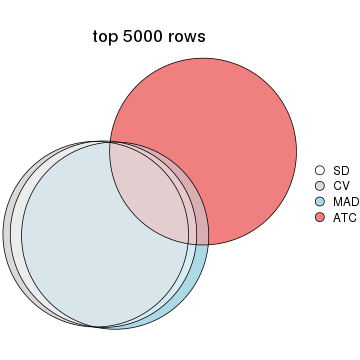</p>

</div>
</div>

Also visualize the correspondance of rankings between different top-row methods:


<script>
$( function() {
	$( '#tabs-top-rows-overlap-by-correspondance' ).tabs();
} );
</script>
<div id='tabs-top-rows-overlap-by-correspondance'>
<ul>
<li><a href='#tab-top-rows-overlap-by-correspondance-1'>top_n = 1000</a></li>
<li><a href='#tab-top-rows-overlap-by-correspondance-2'>top_n = 2000</a></li>
<li><a href='#tab-top-rows-overlap-by-correspondance-3'>top_n = 3000</a></li>
<li><a href='#tab-top-rows-overlap-by-correspondance-4'>top_n = 4000</a></li>
<li><a href='#tab-top-rows-overlap-by-correspondance-5'>top_n = 5000</a></li>
</ul>
<div id='tab-top-rows-overlap-by-correspondance-1'>
<pre><code class="r">top_rows_overlap(res_list, top_n = 1000, method = &quot;correspondance&quot;)
</code></pre>

<p></p>

</div>
<div id='tab-top-rows-overlap-by-correspondance-2'>
<pre><code class="r">top_rows_overlap(res_list, top_n = 2000, method = &quot;correspondance&quot;)
</code></pre>

<p></p>

</div>
<div id='tab-top-rows-overlap-by-correspondance-3'>
<pre><code class="r">top_rows_overlap(res_list, top_n = 3000, method = &quot;correspondance&quot;)
</code></pre>

<p>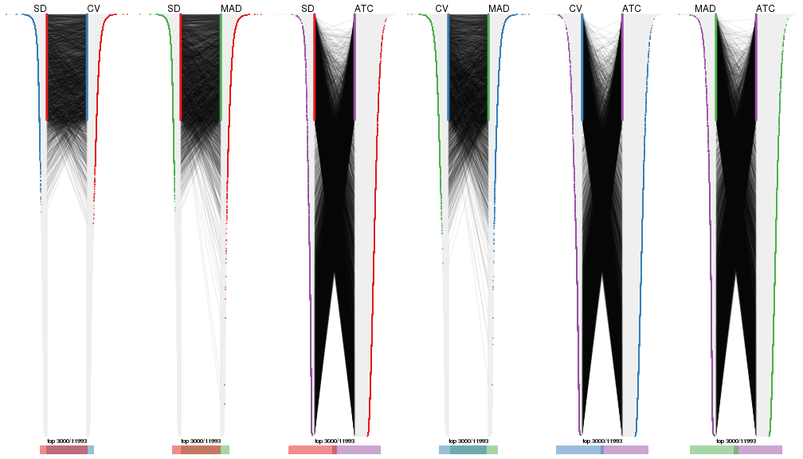</p>

</div>
<div id='tab-top-rows-overlap-by-correspondance-4'>
<pre><code class="r">top_rows_overlap(res_list, top_n = 4000, method = &quot;correspondance&quot;)
</code></pre>

<p></p>

</div>
<div id='tab-top-rows-overlap-by-correspondance-5'>
<pre><code class="r">top_rows_overlap(res_list, top_n = 5000, method = &quot;correspondance&quot;)
</code></pre>

<p></p>

</div>
</div>


Heatmaps of the top rows:


<script>
$( function() {
	$( '#tabs-top-rows-heatmap' ).tabs();
} );
</script>
<div id='tabs-top-rows-heatmap'>
<ul>
<li><a href='#tab-top-rows-heatmap-1'>top_n = 1000</a></li>
<li><a href='#tab-top-rows-heatmap-2'>top_n = 2000</a></li>
<li><a href='#tab-top-rows-heatmap-3'>top_n = 3000</a></li>
<li><a href='#tab-top-rows-heatmap-4'>top_n = 4000</a></li>
<li><a href='#tab-top-rows-heatmap-5'>top_n = 5000</a></li>
</ul>
<div id='tab-top-rows-heatmap-1'>
<pre><code class="r">top_rows_heatmap(res_list, top_n = 1000)
</code></pre>

<p></p>

</div>
<div id='tab-top-rows-heatmap-2'>
<pre><code class="r">top_rows_heatmap(res_list, top_n = 2000)
</code></pre>

<p></p>

</div>
<div id='tab-top-rows-heatmap-3'>
<pre><code class="r">top_rows_heatmap(res_list, top_n = 3000)
</code></pre>

<p></p>

</div>
<div id='tab-top-rows-heatmap-4'>
<pre><code class="r">top_rows_heatmap(res_list, top_n = 4000)
</code></pre>

<p></p>

</div>
<div id='tab-top-rows-heatmap-5'>
<pre><code class="r">top_rows_heatmap(res_list, top_n = 5000)
</code></pre>

<p></p>

</div>
</div>


### Test to known annotations


Test correlation between subgroups and known annotations. If the known
annotation is numeric, one-way ANOVA test is applied, and if the known
annotation is discrete, chi-squared contingency table test is applied.


<script>
$( function() {
	$( '#tabs-test-to-known-factors-from-consensus-partition-list' ).tabs();
} );
</script>
<div id='tabs-test-to-known-factors-from-consensus-partition-list'>
<ul>
<li><a href='#tab-test-to-known-factors-from-consensus-partition-list-1'>k = 2</a></li>
<li><a href='#tab-test-to-known-factors-from-consensus-partition-list-2'>k = 3</a></li>
<li><a href='#tab-test-to-known-factors-from-consensus-partition-list-3'>k = 4</a></li>
<li><a href='#tab-test-to-known-factors-from-consensus-partition-list-4'>k = 5</a></li>
<li><a href='#tab-test-to-known-factors-from-consensus-partition-list-5'>k = 6</a></li>
</ul>
<div id='tab-test-to-known-factors-from-consensus-partition-list-1'>
<pre><code class="r">test_to_known_factors(res_list, k = 2)
</code></pre>

<pre><code>#&gt;               n disease.state(p) k
#&gt; SD:NMF      162           0.0121 2
#&gt; CV:NMF      163           0.0635 2
#&gt; MAD:NMF     158           0.0188 2
#&gt; ATC:NMF     168           0.1729 2
#&gt; SD:skmeans  163           0.0657 2
#&gt; CV:skmeans  158           0.1427 2
#&gt; MAD:skmeans 154           0.0600 2
#&gt; ATC:skmeans 166           0.2629 2
#&gt; SD:mclust   158           0.2769 2
#&gt; CV:mclust   140           0.4443 2
#&gt; MAD:mclust  149           0.8120 2
#&gt; ATC:mclust  171           0.1332 2
#&gt; SD:kmeans   153           0.0993 2
#&gt; CV:kmeans   151           0.4262 2
#&gt; MAD:kmeans  139           0.0421 2
#&gt; ATC:kmeans  172           0.1751 2
#&gt; SD:pam      147           0.0154 2
#&gt; CV:pam      164           0.0345 2
#&gt; MAD:pam     159           0.0114 2
#&gt; ATC:pam     114           0.0733 2
#&gt; SD:hclust    69           0.5631 2
#&gt; CV:hclust    20               NA 2
#&gt; MAD:hclust   97           1.0000 2
#&gt; ATC:hclust  141           0.1253 2
</code></pre>

</div>
<div id='tab-test-to-known-factors-from-consensus-partition-list-2'>
<pre><code class="r">test_to_known_factors(res_list, k = 3)
</code></pre>

<pre><code>#&gt;               n disease.state(p) k
#&gt; SD:NMF      141           0.1295 3
#&gt; CV:NMF      128           0.0908 3
#&gt; MAD:NMF     137           0.0959 3
#&gt; ATC:NMF     155           0.2155 3
#&gt; SD:skmeans  147           0.1316 3
#&gt; CV:skmeans  140           0.3385 3
#&gt; MAD:skmeans 137           0.1327 3
#&gt; ATC:skmeans 147           0.4449 3
#&gt; SD:mclust   155           0.1473 3
#&gt; CV:mclust   143           0.1486 3
#&gt; MAD:mclust  153           0.3903 3
#&gt; ATC:mclust  162           0.1517 3
#&gt; SD:kmeans   136           0.1552 3
#&gt; CV:kmeans   138           0.2589 3
#&gt; MAD:kmeans  142           0.1374 3
#&gt; ATC:kmeans  107           0.0864 3
#&gt; SD:pam      162           0.0349 3
#&gt; CV:pam      163           0.0278 3
#&gt; MAD:pam     162           0.0167 3
#&gt; ATC:pam     119           0.2231 3
#&gt; SD:hclust     5               NA 3
#&gt; CV:hclust     0               NA 3
#&gt; MAD:hclust    0               NA 3
#&gt; ATC:hclust  131           0.2457 3
</code></pre>

</div>
<div id='tab-test-to-known-factors-from-consensus-partition-list-3'>
<pre><code class="r">test_to_known_factors(res_list, k = 4)
</code></pre>

<pre><code>#&gt;               n disease.state(p) k
#&gt; SD:NMF      107          0.01681 4
#&gt; CV:NMF       99          0.03941 4
#&gt; MAD:NMF     111          0.00897 4
#&gt; ATC:NMF     143          0.24934 4
#&gt; SD:skmeans  116          0.01986 4
#&gt; CV:skmeans   97          0.00670 4
#&gt; MAD:skmeans  95          0.02303 4
#&gt; ATC:skmeans 144          0.49627 4
#&gt; SD:mclust   123          0.06081 4
#&gt; CV:mclust   115          0.22430 4
#&gt; MAD:mclust  147          0.06394 4
#&gt; ATC:mclust  154          0.11563 4
#&gt; SD:kmeans   121          0.02574 4
#&gt; CV:kmeans    86          0.05696 4
#&gt; MAD:kmeans  100          0.00139 4
#&gt; ATC:kmeans  145          0.09258 4
#&gt; SD:pam      135          0.12056 4
#&gt; CV:pam      137          0.06168 4
#&gt; MAD:pam     156          0.12774 4
#&gt; ATC:pam      83          0.27535 4
#&gt; SD:hclust     9          0.90560 4
#&gt; CV:hclust    24               NA 4
#&gt; MAD:hclust   21          0.37824 4
#&gt; ATC:hclust   67          0.50620 4
</code></pre>

</div>
<div id='tab-test-to-known-factors-from-consensus-partition-list-4'>
<pre><code class="r">test_to_known_factors(res_list, k = 5)
</code></pre>

<pre><code>#&gt;               n disease.state(p) k
#&gt; SD:NMF       82          0.00870 5
#&gt; CV:NMF       78          0.07727 5
#&gt; MAD:NMF      85          0.12391 5
#&gt; ATC:NMF     141          0.08728 5
#&gt; SD:skmeans  105          0.00584 5
#&gt; CV:skmeans   82          0.01211 5
#&gt; MAD:skmeans 103          0.01782 5
#&gt; ATC:skmeans 134          0.09517 5
#&gt; SD:mclust    83          0.16225 5
#&gt; CV:mclust    79          0.29903 5
#&gt; MAD:mclust  120          0.19935 5
#&gt; ATC:mclust  128          0.40024 5
#&gt; SD:kmeans   118          0.00228 5
#&gt; CV:kmeans    95          0.02358 5
#&gt; MAD:kmeans  125          0.01047 5
#&gt; ATC:kmeans   83          0.28050 5
#&gt; SD:pam      116          0.06052 5
#&gt; CV:pam      108          0.48822 5
#&gt; MAD:pam     131          0.25883 5
#&gt; ATC:pam     126          0.28054 5
#&gt; SD:hclust    21          1.00000 5
#&gt; CV:hclust    44          0.63644 5
#&gt; MAD:hclust   34          1.00000 5
#&gt; ATC:hclust   67          0.77543 5
</code></pre>

</div>
<div id='tab-test-to-known-factors-from-consensus-partition-list-5'>
<pre><code class="r">test_to_known_factors(res_list, k = 6)
</code></pre>

<pre><code>#&gt;               n disease.state(p) k
#&gt; SD:NMF       59          0.05516 6
#&gt; CV:NMF       64          0.01651 6
#&gt; MAD:NMF      54          0.24352 6
#&gt; ATC:NMF     112          0.33093 6
#&gt; SD:skmeans   62          0.05659 6
#&gt; CV:skmeans   43          0.06676 6
#&gt; MAD:skmeans  67          0.01708 6
#&gt; ATC:skmeans 140          0.50028 6
#&gt; SD:mclust    90          0.00799 6
#&gt; CV:mclust    71          0.42619 6
#&gt; MAD:mclust  102          0.16942 6
#&gt; ATC:mclust  106          0.21050 6
#&gt; SD:kmeans    97          0.00112 6
#&gt; CV:kmeans    88          0.00176 6
#&gt; MAD:kmeans   98          0.00849 6
#&gt; ATC:kmeans  117          0.43185 6
#&gt; SD:pam      108          0.27675 6
#&gt; CV:pam      108          0.67953 6
#&gt; MAD:pam     123          0.53705 6
#&gt; ATC:pam     133          0.27755 6
#&gt; SD:hclust    41          0.06032 6
#&gt; CV:hclust    29          0.75564 6
#&gt; MAD:hclust    1               NA 6
#&gt; ATC:hclust   74          0.85084 6
</code></pre>

</div>
</div>


 
## Results for each method


---------------------------------------------------


### SD:hclust


The object with results only for a single top-value method and a single partition method 
can be extracted as:

```r
res = res_list["SD", "hclust"]
# you can also extract it by
# res = res_list["SD:hclust"]
```

A summary of `res` and all the functions that can be applied to it:

```r
res
```

```
#> A 'ConsensusPartition' object with k = 2, 3, 4, 5, 6.
#>   On a matrix with 11993 rows and 173 columns.
#>   Top rows (1000, 2000, 3000, 4000, 5000) are extracted by 'SD' method.
#>   Subgroups are detected by 'hclust' method.
#>   Performed in total 1250 partitions by row resampling.
#>   Best k for subgroups seems to be 6.
#> 
#> Following methods can be applied to this 'ConsensusPartition' object:
#>  [1] "cola_report"             "collect_classes"         "collect_plots"          
#>  [4] "collect_stats"           "colnames"                "compare_signatures"     
#>  [7] "consensus_heatmap"       "dimension_reduction"     "functional_enrichment"  
#> [10] "get_anno_col"            "get_anno"                "get_classes"            
#> [13] "get_consensus"           "get_matrix"              "get_membership"         
#> [16] "get_param"               "get_signatures"          "get_stats"              
#> [19] "is_best_k"               "is_stable_k"             "membership_heatmap"     
#> [22] "ncol"                    "nrow"                    "plot_ecdf"              
#> [25] "rownames"                "select_partition_number" "show"                   
#> [28] "suggest_best_k"          "test_to_known_factors"
```

`collect_plots()` function collects all the plots made from `res` for all `k` (number of partitions)
into one single page to provide an easy and fast comparison between different `k`.

```r
collect_plots(res)
```


The plots are:

- The first row: a plot of the ECDF (Empirical cumulative distribution
  function) curves of the consensus matrix for each `k` and the heatmap of
  predicted classes for each `k`.
- The second row: heatmaps of the consensus matrix for each `k`.
- The third row: heatmaps of the membership matrix for each `k`.
- The fouth row: heatmaps of the signatures for each `k`.

All the plots in panels can be made by individual functions and they are
plotted later in this section.

`select_partition_number()` produces several plots showing different
statistics for choosing "optimized" `k`. There are following statistics:

- ECDF curves of the consensus matrix for each `k`;
- 1-PAC. [The PAC
  score](https://en.wikipedia.org/wiki/Consensus_clustering#Over-interpretation_potential_of_consensus_clustering)
  measures the proportion of the ambiguous subgrouping.
- Mean silhouette score.
- Concordance. The mean probability of fiting the consensus class ids in all
  partitions.
- Area increased. Denote $A_k$ as the area under the ECDF curve for current
  `k`, the area increased is defined as $A_k - A_{k-1}$.
- Rand index. The percent of pairs of samples that are both in a same cluster
  or both are not in a same cluster in the partition of k and k-1.
- Jaccard index. The ratio of pairs of samples are both in a same cluster in
  the partition of k and k-1 and the pairs of samples are both in a same
  cluster in the partition k or k-1.

The detailed explanations of these statistics can be found in [the cola
vignette](http://bioconductor.org/packages/devel/bioc/vignettes/cola/inst/doc/cola.html#toc_13).

Generally speaking, lower PAC score, higher mean silhouette score or higher
concordance corresponds to better partition. Rand index and Jaccard index
measure how similar the current partition is compared to partition with `k-1`.
If they are too similar, we won't accept `k` is better than `k-1`.

```r
select_partition_number(res)
```


The numeric values for all these statistics can be obtained by `get_stats()`.

```r
get_stats(res)
```

```
#>   k  1-PAC mean_silhouette concordance area_increased  Rand Jaccard
#> 2 2 0.0200           0.282       0.677         0.3875 0.966   0.966
#> 3 3 0.0199           0.220       0.557         0.4432 0.486   0.475
#> 4 4 0.0420           0.234       0.487         0.1660 0.810   0.623
#> 5 5 0.0982           0.216       0.475         0.0885 0.768   0.460
#> 6 6 0.1761           0.270       0.476         0.0654 0.820   0.475
```

`suggest_best_k()` suggests the best $k$ based on these statistics. The rules are as follows:

- All $k$ with Jaccard index larger than 0.95 are removed because the increase of
  the partition number does not provides enough extra information. If all $k$ are removed,
  the best $k$ is assigned by `NA`.
- For $k$ with 1-PAC larger than 0.9, the maximal $k$ is taken as the "best k". Other $k$ is called "optional k".
- If it does not fit the second rule. The $k$ with the highest vote of highest
  1-PAC, mean silhouette and concordance is taken as the "best k".

```r
suggest_best_k(res)
```

```
#> [1] 6
```


Following shows the table of the partitions (You need to click the **show/hide
code output** link to see it). The membership matrix (columns with name `p*`)
is inferred by
[`clue::cl_consensus()`](https://www.rdocumentation.org/link/cl_consensus?package=clue)
function with the `SE` method. Basically the value in the membership matrix
represents the probability to belong to a certain group. The finall class
label for an item is determined with the group with highest probability it
belongs to.

In `get_classes()` function, the entropy is calculated from the membership
matrix and the silhouette score is calculated from the consensus matrix.


<script>
$( function() {
	$( '#tabs-SD-hclust-get-classes' ).tabs();
} );
</script>
<div id='tabs-SD-hclust-get-classes'>
<ul>
<li><a href='#tab-SD-hclust-get-classes-1'>k = 2</a></li>
<li><a href='#tab-SD-hclust-get-classes-2'>k = 3</a></li>
<li><a href='#tab-SD-hclust-get-classes-3'>k = 4</a></li>
<li><a href='#tab-SD-hclust-get-classes-4'>k = 5</a></li>
<li><a href='#tab-SD-hclust-get-classes-5'>k = 6</a></li>
</ul>

<div id='tab-SD-hclust-get-classes-1'>
<p><a id='tab-SD-hclust-get-classes-1-a' style='color:#0366d6' href='#'>show/hide code output</a></p>
<pre><code class="r">cbind(get_classes(res, k = 2), get_membership(res, k = 2))
</code></pre>

<pre><code>#&gt;          class entropy silhouette    p1    p2
#&gt; GSM11437     1   0.975    0.41045 0.592 0.408
#&gt; GSM11438     1   0.943   -0.24477 0.640 0.360
#&gt; GSM11439     1   0.788    0.52913 0.764 0.236
#&gt; GSM11440     1   0.680    0.54045 0.820 0.180
#&gt; GSM11441     1   0.833    0.51969 0.736 0.264
#&gt; GSM11442     1   0.745    0.48265 0.788 0.212
#&gt; GSM11443     1   0.913   -0.08410 0.672 0.328
#&gt; GSM11444     1   0.697    0.53304 0.812 0.188
#&gt; GSM11445     1   0.671    0.53735 0.824 0.176
#&gt; GSM11446     1   0.827    0.52487 0.740 0.260
#&gt; GSM11447     1   0.781    0.53254 0.768 0.232
#&gt; GSM11448     1   0.745    0.55324 0.788 0.212
#&gt; GSM11449     1   0.760    0.50895 0.780 0.220
#&gt; GSM11450     1   0.844    0.52639 0.728 0.272
#&gt; GSM11451     1   0.850    0.13470 0.724 0.276
#&gt; GSM11452     1   0.781    0.34548 0.768 0.232
#&gt; GSM11453     1   0.821    0.52158 0.744 0.256
#&gt; GSM11454     1   0.814    0.52388 0.748 0.252
#&gt; GSM11455     1   0.895    0.16370 0.688 0.312
#&gt; GSM11456     1   0.625    0.52286 0.844 0.156
#&gt; GSM11457     1   0.871    0.01073 0.708 0.292
#&gt; GSM11458     1   0.844    0.51413 0.728 0.272
#&gt; GSM11459     1   0.788    0.51944 0.764 0.236
#&gt; GSM11460     1   0.981    0.39882 0.580 0.420
#&gt; GSM11461     1   0.871    0.50799 0.708 0.292
#&gt; GSM11462     1   0.788    0.53476 0.764 0.236
#&gt; GSM11463     1   0.827    0.33534 0.740 0.260
#&gt; GSM11464     1   0.952    0.47562 0.628 0.372
#&gt; GSM11465     1   0.644    0.53236 0.836 0.164
#&gt; GSM11466     1   0.730    0.54247 0.796 0.204
#&gt; GSM11467     1   0.980    0.40874 0.584 0.416
#&gt; GSM11468     1   0.644    0.54221 0.836 0.164
#&gt; GSM11469     1   0.644    0.54221 0.836 0.164
#&gt; GSM11470     1   0.936    0.45570 0.648 0.352
#&gt; GSM11471     1   0.680    0.51710 0.820 0.180
#&gt; GSM11472     1   0.943    0.23753 0.640 0.360
#&gt; GSM11473     1   0.904    0.38284 0.680 0.320
#&gt; GSM11474     1   0.917   -0.08677 0.668 0.332
#&gt; GSM11475     1   0.706    0.53272 0.808 0.192
#&gt; GSM11476     1   0.995   -0.70463 0.540 0.460
#&gt; GSM11477     1   0.821    0.15263 0.744 0.256
#&gt; GSM11478     1   0.891   -0.08351 0.692 0.308
#&gt; GSM11479     1   0.913    0.17607 0.672 0.328
#&gt; GSM11480     1   0.943   -0.33287 0.640 0.360
#&gt; GSM11481     1   0.932   -0.19208 0.652 0.348
#&gt; GSM11482     1   0.973   -0.28622 0.596 0.404
#&gt; GSM11483     1   0.990   -0.48892 0.560 0.440
#&gt; GSM11484     1   0.973   -0.39622 0.596 0.404
#&gt; GSM11485     2   0.997    0.86070 0.468 0.532
#&gt; GSM11486     1   0.939   -0.05525 0.644 0.356
#&gt; GSM11487     1   0.839    0.51272 0.732 0.268
#&gt; GSM11488     1   0.981   -0.44473 0.580 0.420
#&gt; GSM11489     1   0.821    0.41324 0.744 0.256
#&gt; GSM11490     1   0.802    0.52609 0.756 0.244
#&gt; GSM11491     1   0.839    0.50719 0.732 0.268
#&gt; GSM11492     1   0.952   -0.28415 0.628 0.372
#&gt; GSM11493     1   0.995   -0.53212 0.540 0.460
#&gt; GSM11494     1   0.844    0.34561 0.728 0.272
#&gt; GSM11495     1   0.909    0.30444 0.676 0.324
#&gt; GSM11496     1   0.881    0.44468 0.700 0.300
#&gt; GSM11497     1   0.844    0.54528 0.728 0.272
#&gt; GSM11498     1   0.839    0.33168 0.732 0.268
#&gt; GSM11499     1   0.996   -0.59817 0.536 0.464
#&gt; GSM11500     1   0.943   -0.10178 0.640 0.360
#&gt; GSM11501     1   1.000   -0.81361 0.504 0.496
#&gt; GSM11502     1   0.781    0.24442 0.768 0.232
#&gt; GSM11503     1   0.925   -0.14988 0.660 0.340
#&gt; GSM11504     1   0.980    0.36950 0.584 0.416
#&gt; GSM11505     1   0.895   -0.09232 0.688 0.312
#&gt; GSM11506     2   0.988    0.84707 0.436 0.564
#&gt; GSM11507     2   1.000    0.85089 0.492 0.508
#&gt; GSM11508     1   0.745    0.52628 0.788 0.212
#&gt; GSM11509     1   0.788    0.50778 0.764 0.236
#&gt; GSM11510     1   0.871    0.27978 0.708 0.292
#&gt; GSM11511     1   0.904    0.48440 0.680 0.320
#&gt; GSM11512     1   0.980    0.40064 0.584 0.416
#&gt; GSM11513     1   0.775    0.52442 0.772 0.228
#&gt; GSM11514     1   0.971   -0.35494 0.600 0.400
#&gt; GSM11515     1   0.745    0.50343 0.788 0.212
#&gt; GSM11516     1   0.866    0.53828 0.712 0.288
#&gt; GSM11517     1   0.781    0.55259 0.768 0.232
#&gt; GSM11518     1   0.808    0.53475 0.752 0.248
#&gt; GSM11519     1   0.814    0.51471 0.748 0.252
#&gt; GSM11520     1   0.904    0.49588 0.680 0.320
#&gt; GSM11521     1   1.000   -0.80742 0.504 0.496
#&gt; GSM11522     1   0.697    0.55347 0.812 0.188
#&gt; GSM11523     1   0.978    0.41386 0.588 0.412
#&gt; GSM11524     1   0.697    0.54100 0.812 0.188
#&gt; GSM11525     1   0.881   -0.02091 0.700 0.300
#&gt; GSM11526     1   0.981    0.39882 0.580 0.420
#&gt; GSM11527     1   0.871    0.00796 0.708 0.292
#&gt; GSM11528     1   0.861    0.28104 0.716 0.284
#&gt; GSM11529     1   0.844    0.22579 0.728 0.272
#&gt; GSM11530     1   0.644    0.53788 0.836 0.164
#&gt; GSM11531     1   0.821    0.20876 0.744 0.256
#&gt; GSM11532     1   0.671    0.54626 0.824 0.176
#&gt; GSM11533     1   0.760    0.43619 0.780 0.220
#&gt; GSM11534     1   0.909    0.48277 0.676 0.324
#&gt; GSM11535     1   0.814    0.35472 0.748 0.252
#&gt; GSM11536     1   0.963   -0.37765 0.612 0.388
#&gt; GSM11537     1   0.850    0.10624 0.724 0.276
#&gt; GSM11538     1   0.980    0.19152 0.584 0.416
#&gt; GSM11539     1   0.839    0.30663 0.732 0.268
#&gt; GSM11540     1   0.895   -0.13635 0.688 0.312
#&gt; GSM11541     1   0.981    0.39552 0.580 0.420
#&gt; GSM11542     1   0.861    0.28104 0.716 0.284
#&gt; GSM11543     1   0.971    0.06036 0.600 0.400
#&gt; GSM11544     1   0.808    0.51824 0.752 0.248
#&gt; GSM11545     1   0.788    0.52648 0.764 0.236
#&gt; GSM11546     1   0.917    0.42167 0.668 0.332
#&gt; GSM11547     1   0.850    0.49205 0.724 0.276
#&gt; GSM11548     1   0.844    0.50323 0.728 0.272
#&gt; GSM11549     1   0.909    0.50888 0.676 0.324
#&gt; GSM11550     1   0.861    0.52303 0.716 0.284
#&gt; GSM11551     1   0.891    0.49464 0.692 0.308
#&gt; GSM11552     1   0.788    0.53476 0.764 0.236
#&gt; GSM11553     1   0.781    0.37311 0.768 0.232
#&gt; GSM11554     1   0.775    0.35486 0.772 0.228
#&gt; GSM11555     1   0.939   -0.21604 0.644 0.356
#&gt; GSM11556     1   0.939   -0.21604 0.644 0.356
#&gt; GSM11557     1   0.808    0.23299 0.752 0.248
#&gt; GSM11558     1   0.998   -0.78711 0.524 0.476
#&gt; GSM11559     1   0.738    0.47783 0.792 0.208
#&gt; GSM11560     1   0.932    0.46479 0.652 0.348
#&gt; GSM11561     1   0.998   -0.78711 0.524 0.476
#&gt; GSM11562     1   0.850    0.10841 0.724 0.276
#&gt; GSM11563     1   0.781    0.53930 0.768 0.232
#&gt; GSM11564     1   0.929    0.36027 0.656 0.344
#&gt; GSM11565     1   0.886    0.51761 0.696 0.304
#&gt; GSM11566     1   0.946   -0.34671 0.636 0.364
#&gt; GSM11567     1   0.991   -0.49506 0.556 0.444
#&gt; GSM11568     1   0.814    0.53508 0.748 0.252
#&gt; GSM11569     1   0.850    0.07863 0.724 0.276
#&gt; GSM11570     1   0.788    0.53476 0.764 0.236
#&gt; GSM11571     1   0.814    0.52342 0.748 0.252
#&gt; GSM11572     1   0.753    0.49023 0.784 0.216
#&gt; GSM11573     1   0.788    0.52648 0.764 0.236
#&gt; GSM11574     1   0.767    0.35663 0.776 0.224
#&gt; GSM11575     1   0.775    0.52064 0.772 0.228
#&gt; GSM11576     1   0.961    0.43734 0.616 0.384
#&gt; GSM11577     1   0.827    0.52030 0.740 0.260
#&gt; GSM11578     1   0.788    0.38759 0.764 0.236
#&gt; GSM11579     1   0.963   -0.46796 0.612 0.388
#&gt; GSM11580     1   0.821    0.50823 0.744 0.256
#&gt; GSM11581     1   0.671    0.53936 0.824 0.176
#&gt; GSM11582     1   0.983    0.39160 0.576 0.424
#&gt; GSM11583     1   0.886    0.47702 0.696 0.304
#&gt; GSM11584     1   0.995   -0.70463 0.540 0.460
#&gt; GSM11585     1   0.795    0.22579 0.760 0.240
#&gt; GSM11586     1   0.936    0.48268 0.648 0.352
#&gt; GSM11587     1   0.978    0.41386 0.588 0.412
#&gt; GSM11588     1   0.808    0.51890 0.752 0.248
#&gt; GSM11589     1   0.900    0.38755 0.684 0.316
#&gt; GSM11590     1   0.850    0.49829 0.724 0.276
#&gt; GSM11591     1   0.781    0.26086 0.768 0.232
#&gt; GSM11592     1   0.917    0.50979 0.668 0.332
#&gt; GSM11593     1   0.850    0.49829 0.724 0.276
#&gt; GSM11594     1   0.850    0.50719 0.724 0.276
#&gt; GSM11595     1   0.644    0.53538 0.836 0.164
#&gt; GSM11596     1   0.802    0.48784 0.756 0.244
#&gt; GSM11597     1   0.634    0.54567 0.840 0.160
#&gt; GSM11598     1   0.802    0.51783 0.756 0.244
#&gt; GSM11599     1   0.706    0.53349 0.808 0.192
#&gt; GSM11600     1   0.932   -0.19208 0.652 0.348
#&gt; GSM11601     1   0.644    0.54483 0.836 0.164
#&gt; GSM11602     1   0.975    0.41711 0.592 0.408
#&gt; GSM11603     1   0.975    0.41711 0.592 0.408
#&gt; GSM11604     1   0.697    0.54100 0.812 0.188
#&gt; GSM11605     1   0.946    0.34913 0.636 0.364
#&gt; GSM11606     1   0.781    0.35781 0.768 0.232
#&gt; GSM11607     1   0.802    0.51783 0.756 0.244
#&gt; GSM11608     1   0.788    0.53476 0.764 0.236
#&gt; GSM11609     1   0.999   -0.76339 0.520 0.480
</code></pre>

<script>
$('#tab-SD-hclust-get-classes-1-a').parent().next().next().hide();
$('#tab-SD-hclust-get-classes-1-a').click(function(){
  $('#tab-SD-hclust-get-classes-1-a').parent().next().next().toggle();
  return(false);
});
</script>
</div>

<div id='tab-SD-hclust-get-classes-2'>
<p><a id='tab-SD-hclust-get-classes-2-a' style='color:#0366d6' href='#'>show/hide code output</a></p>
<pre><code class="r">cbind(get_classes(res, k = 3), get_membership(res, k = 3))
</code></pre>

<pre><code>#&gt;          class entropy silhouette    p1    p2    p3
#&gt; GSM11437     1   0.973   0.297927 0.448 0.256 0.296
#&gt; GSM11438     2   0.770   0.083086 0.084 0.644 0.272
#&gt; GSM11439     1   0.923   0.261283 0.436 0.412 0.152
#&gt; GSM11440     1   0.902   0.348076 0.448 0.420 0.132
#&gt; GSM11441     2   0.943  -0.199834 0.404 0.420 0.176
#&gt; GSM11442     2   0.947   0.006499 0.332 0.472 0.196
#&gt; GSM11443     2   0.587   0.245181 0.056 0.784 0.160
#&gt; GSM11444     1   0.926   0.329576 0.432 0.412 0.156
#&gt; GSM11445     1   0.914   0.353060 0.448 0.408 0.144
#&gt; GSM11446     1   0.912   0.372971 0.496 0.352 0.152
#&gt; GSM11447     1   0.919   0.255002 0.436 0.416 0.148
#&gt; GSM11448     2   0.862  -0.233715 0.420 0.480 0.100
#&gt; GSM11449     2   0.812   0.146910 0.292 0.608 0.100
#&gt; GSM11450     1   0.814   0.451589 0.572 0.344 0.084
#&gt; GSM11451     2   0.388   0.335704 0.044 0.888 0.068
#&gt; GSM11452     2   0.493   0.433050 0.120 0.836 0.044
#&gt; GSM11453     1   0.778   0.439940 0.576 0.364 0.060
#&gt; GSM11454     1   0.933   0.370023 0.480 0.344 0.176
#&gt; GSM11455     2   0.873   0.271493 0.176 0.588 0.236
#&gt; GSM11456     2   0.841  -0.037330 0.332 0.564 0.104
#&gt; GSM11457     2   0.489   0.303140 0.048 0.840 0.112
#&gt; GSM11458     1   0.900   0.439155 0.532 0.312 0.156
#&gt; GSM11459     1   0.956   0.314144 0.432 0.372 0.196
#&gt; GSM11460     1   0.975   0.276010 0.444 0.264 0.292
#&gt; GSM11461     1   0.904   0.420874 0.524 0.320 0.156
#&gt; GSM11462     1   0.909   0.420572 0.496 0.356 0.148
#&gt; GSM11463     2   0.720   0.369907 0.180 0.712 0.108
#&gt; GSM11464     1   0.875   0.425572 0.588 0.224 0.188
#&gt; GSM11465     2   0.849  -0.084504 0.348 0.548 0.104
#&gt; GSM11466     2   0.927  -0.200184 0.384 0.456 0.160
#&gt; GSM11467     1   0.960   0.308244 0.476 0.248 0.276
#&gt; GSM11468     1   0.911   0.338174 0.440 0.420 0.140
#&gt; GSM11469     1   0.911   0.338174 0.440 0.420 0.140
#&gt; GSM11470     1   0.695   0.465353 0.732 0.156 0.112
#&gt; GSM11471     2   0.916  -0.134298 0.368 0.480 0.152
#&gt; GSM11472     2   0.958   0.181412 0.272 0.480 0.248
#&gt; GSM11473     2   0.973   0.094756 0.316 0.440 0.244
#&gt; GSM11474     2   0.640   0.238303 0.060 0.748 0.192
#&gt; GSM11475     2   0.923  -0.332241 0.420 0.428 0.152
#&gt; GSM11476     3   0.782   0.734505 0.052 0.444 0.504
#&gt; GSM11477     2   0.357   0.379273 0.040 0.900 0.060
#&gt; GSM11478     2   0.455   0.238004 0.020 0.840 0.140
#&gt; GSM11479     2   0.898   0.293966 0.208 0.564 0.228
#&gt; GSM11480     2   0.497   0.000337 0.012 0.800 0.188
#&gt; GSM11481     2   0.846   0.004611 0.108 0.564 0.328
#&gt; GSM11482     2   0.896  -0.417865 0.136 0.504 0.360
#&gt; GSM11483     2   0.892  -0.105517 0.136 0.516 0.348
#&gt; GSM11484     2   0.843  -0.098658 0.100 0.552 0.348
#&gt; GSM11485     2   0.729  -0.579937 0.028 0.492 0.480
#&gt; GSM11486     2   0.826   0.255346 0.124 0.616 0.260
#&gt; GSM11487     1   0.862   0.402656 0.536 0.352 0.112
#&gt; GSM11488     2   0.836  -0.142596 0.096 0.556 0.348
#&gt; GSM11489     2   0.923   0.185081 0.280 0.524 0.196
#&gt; GSM11490     1   0.922   0.268250 0.440 0.408 0.152
#&gt; GSM11491     1   0.738   0.452671 0.616 0.336 0.048
#&gt; GSM11492     2   0.847  -0.040528 0.100 0.540 0.360
#&gt; GSM11493     3   0.879   0.611798 0.112 0.436 0.452
#&gt; GSM11494     2   0.939   0.272190 0.240 0.512 0.248
#&gt; GSM11495     2   0.974   0.162461 0.284 0.448 0.268
#&gt; GSM11496     2   0.970  -0.028057 0.348 0.428 0.224
#&gt; GSM11497     2   0.829  -0.151460 0.408 0.512 0.080
#&gt; GSM11498     2   0.744   0.397486 0.164 0.700 0.136
#&gt; GSM11499     2   0.900  -0.362471 0.132 0.472 0.396
#&gt; GSM11500     2   0.875   0.180231 0.148 0.568 0.284
#&gt; GSM11501     2   0.729  -0.581844 0.028 0.508 0.464
#&gt; GSM11502     2   0.380   0.397924 0.056 0.892 0.052
#&gt; GSM11503     2   0.742  -0.028021 0.080 0.672 0.248
#&gt; GSM11504     1   0.992   0.162530 0.380 0.276 0.344
#&gt; GSM11505     2   0.442   0.229809 0.020 0.848 0.132
#&gt; GSM11506     3   0.729   0.539500 0.028 0.468 0.504
#&gt; GSM11507     2   0.676  -0.579592 0.012 0.552 0.436
#&gt; GSM11508     1   0.954   0.338562 0.440 0.364 0.196
#&gt; GSM11509     1   0.960   0.250889 0.432 0.364 0.204
#&gt; GSM11510     2   0.727   0.379231 0.156 0.712 0.132
#&gt; GSM11511     1   0.691   0.477128 0.696 0.248 0.056
#&gt; GSM11512     1   0.981   0.265550 0.428 0.264 0.308
#&gt; GSM11513     1   0.953   0.309282 0.432 0.376 0.192
#&gt; GSM11514     2   0.836  -0.048618 0.112 0.588 0.300
#&gt; GSM11515     2   0.957  -0.111551 0.360 0.440 0.200
#&gt; GSM11516     1   0.694   0.344597 0.524 0.460 0.016
#&gt; GSM11517     1   0.915   0.414177 0.504 0.336 0.160
#&gt; GSM11518     1   0.915   0.258192 0.440 0.416 0.144
#&gt; GSM11519     1   0.746   0.447136 0.600 0.352 0.048
#&gt; GSM11520     1   0.694   0.498594 0.680 0.272 0.048
#&gt; GSM11521     2   0.739  -0.594817 0.032 0.504 0.464
#&gt; GSM11522     1   0.889   0.394909 0.484 0.392 0.124
#&gt; GSM11523     1   0.533   0.463940 0.812 0.144 0.044
#&gt; GSM11524     1   0.922   0.373146 0.468 0.376 0.156
#&gt; GSM11525     2   0.475   0.307634 0.040 0.844 0.116
#&gt; GSM11526     1   0.977   0.273798 0.440 0.264 0.296
#&gt; GSM11527     2   0.471   0.302956 0.044 0.848 0.108
#&gt; GSM11528     2   0.733   0.366978 0.156 0.708 0.136
#&gt; GSM11529     2   0.484   0.394956 0.076 0.848 0.076
#&gt; GSM11530     1   0.915   0.332188 0.432 0.424 0.144
#&gt; GSM11531     2   0.325   0.407650 0.052 0.912 0.036
#&gt; GSM11532     1   0.909   0.362906 0.460 0.400 0.140
#&gt; GSM11533     2   0.575   0.379751 0.180 0.780 0.040
#&gt; GSM11534     1   0.937   0.192513 0.452 0.376 0.172
#&gt; GSM11535     2   0.585   0.422940 0.180 0.776 0.044
#&gt; GSM11536     2   0.825  -0.119946 0.088 0.560 0.352
#&gt; GSM11537     2   0.389   0.376625 0.048 0.888 0.064
#&gt; GSM11538     2   0.990  -0.208047 0.276 0.396 0.328
#&gt; GSM11539     2   0.582   0.431978 0.156 0.788 0.056
#&gt; GSM11540     2   0.468   0.278358 0.028 0.840 0.132
#&gt; GSM11541     1   0.975   0.278506 0.444 0.260 0.296
#&gt; GSM11542     2   0.733   0.366978 0.156 0.708 0.136
#&gt; GSM11543     2   0.976   0.040621 0.244 0.432 0.324
#&gt; GSM11544     1   0.787   0.416959 0.552 0.388 0.060
#&gt; GSM11545     1   0.813   0.332077 0.492 0.440 0.068
#&gt; GSM11546     2   0.950   0.040386 0.324 0.472 0.204
#&gt; GSM11547     2   0.970  -0.149006 0.364 0.416 0.220
#&gt; GSM11548     1   0.949   0.306847 0.464 0.340 0.196
#&gt; GSM11549     1   0.852   0.432562 0.584 0.288 0.128
#&gt; GSM11550     1   0.892   0.382036 0.524 0.336 0.140
#&gt; GSM11551     1   0.940   0.308332 0.484 0.324 0.192
#&gt; GSM11552     1   0.909   0.420572 0.496 0.356 0.148
#&gt; GSM11553     2   0.556   0.419781 0.152 0.800 0.048
#&gt; GSM11554     2   0.547   0.436743 0.140 0.808 0.052
#&gt; GSM11555     2   0.841  -0.005900 0.100 0.556 0.344
#&gt; GSM11556     2   0.841  -0.005900 0.100 0.556 0.344
#&gt; GSM11557     2   0.445   0.406584 0.100 0.860 0.040
#&gt; GSM11558     2   0.662  -0.515540 0.012 0.600 0.388
#&gt; GSM11559     2   0.852   0.197387 0.272 0.592 0.136
#&gt; GSM11560     1   0.854   0.434767 0.604 0.236 0.160
#&gt; GSM11561     2   0.665  -0.529260 0.012 0.592 0.396
#&gt; GSM11562     2   0.409   0.378566 0.052 0.880 0.068
#&gt; GSM11563     1   0.907   0.237128 0.436 0.428 0.136
#&gt; GSM11564     2   0.935   0.104148 0.328 0.488 0.184
#&gt; GSM11565     1   0.913   0.384944 0.516 0.320 0.164
#&gt; GSM11566     2   0.671  -0.066291 0.056 0.716 0.228
#&gt; GSM11567     2   0.869  -0.608439 0.104 0.456 0.440
#&gt; GSM11568     1   0.745   0.390373 0.532 0.432 0.036
#&gt; GSM11569     2   0.386   0.364239 0.040 0.888 0.072
#&gt; GSM11570     1   0.909   0.420572 0.496 0.356 0.148
#&gt; GSM11571     2   0.712   0.143832 0.324 0.636 0.040
#&gt; GSM11572     2   0.896   0.061337 0.312 0.536 0.152
#&gt; GSM11573     1   0.813   0.332077 0.492 0.440 0.068
#&gt; GSM11574     2   0.534   0.439982 0.132 0.816 0.052
#&gt; GSM11575     2   0.787   0.035830 0.348 0.584 0.068
#&gt; GSM11576     1   0.816   0.429927 0.644 0.196 0.160
#&gt; GSM11577     2   0.756   0.138998 0.336 0.608 0.056
#&gt; GSM11578     2   0.563   0.422720 0.164 0.792 0.044
#&gt; GSM11579     2   0.710  -0.212115 0.052 0.668 0.280
#&gt; GSM11580     2   0.744   0.194913 0.316 0.628 0.056
#&gt; GSM11581     1   0.928   0.353995 0.452 0.388 0.160
#&gt; GSM11582     1   0.977   0.273252 0.440 0.268 0.292
#&gt; GSM11583     1   0.986   0.193096 0.392 0.352 0.256
#&gt; GSM11584     3   0.782   0.734505 0.052 0.444 0.504
#&gt; GSM11585     2   0.347   0.401129 0.056 0.904 0.040
#&gt; GSM11586     1   0.685   0.492192 0.720 0.208 0.072
#&gt; GSM11587     1   0.533   0.463940 0.812 0.144 0.044
#&gt; GSM11588     1   0.775   0.396399 0.544 0.404 0.052
#&gt; GSM11589     2   0.807   0.293053 0.244 0.636 0.120
#&gt; GSM11590     1   0.703   0.470921 0.660 0.296 0.044
#&gt; GSM11591     2   0.378   0.407733 0.064 0.892 0.044
#&gt; GSM11592     1   0.825   0.454274 0.620 0.252 0.128
#&gt; GSM11593     1   0.703   0.470921 0.660 0.296 0.044
#&gt; GSM11594     1   0.754   0.453349 0.612 0.332 0.056
#&gt; GSM11595     2   0.846  -0.102933 0.356 0.544 0.100
#&gt; GSM11596     2   0.676   0.281133 0.252 0.700 0.048
#&gt; GSM11597     2   0.900  -0.228374 0.396 0.472 0.132
#&gt; GSM11598     1   0.753   0.413148 0.564 0.392 0.044
#&gt; GSM11599     1   0.941   0.360603 0.460 0.360 0.180
#&gt; GSM11600     2   0.846   0.004611 0.108 0.564 0.328
#&gt; GSM11601     2   0.899  -0.218026 0.392 0.476 0.132
#&gt; GSM11602     1   0.539   0.466412 0.808 0.148 0.044
#&gt; GSM11603     1   0.539   0.466412 0.808 0.148 0.044
#&gt; GSM11604     1   0.922   0.373146 0.468 0.376 0.156
#&gt; GSM11605     2   0.969   0.056864 0.324 0.444 0.232
#&gt; GSM11606     2   0.554   0.434058 0.144 0.804 0.052
#&gt; GSM11607     1   0.753   0.413148 0.564 0.392 0.044
#&gt; GSM11608     1   0.909   0.420572 0.496 0.356 0.148
#&gt; GSM11609     3   0.766   0.710445 0.048 0.404 0.548
</code></pre>

<script>
$('#tab-SD-hclust-get-classes-2-a').parent().next().next().hide();
$('#tab-SD-hclust-get-classes-2-a').click(function(){
  $('#tab-SD-hclust-get-classes-2-a').parent().next().next().toggle();
  return(false);
});
</script>
</div>

<div id='tab-SD-hclust-get-classes-3'>
<p><a id='tab-SD-hclust-get-classes-3-a' style='color:#0366d6' href='#'>show/hide code output</a></p>
<pre><code class="r">cbind(get_classes(res, k = 4), get_membership(res, k = 4))
</code></pre>

<pre><code>#&gt;          class entropy silhouette    p1    p2    p3    p4
#&gt; GSM11437     4   0.850    0.18096 0.340 0.104 0.092 0.464
#&gt; GSM11438     2   0.838    0.08681 0.064 0.524 0.176 0.236
#&gt; GSM11439     1   0.949    0.20794 0.344 0.292 0.108 0.256
#&gt; GSM11440     1   0.855    0.37186 0.388 0.308 0.028 0.276
#&gt; GSM11441     4   0.945   -0.15055 0.308 0.264 0.100 0.328
#&gt; GSM11442     4   0.950   -0.08216 0.216 0.332 0.120 0.332
#&gt; GSM11443     2   0.583    0.39903 0.044 0.744 0.156 0.056
#&gt; GSM11444     1   0.866    0.35122 0.364 0.296 0.032 0.308
#&gt; GSM11445     1   0.857    0.37119 0.384 0.296 0.028 0.292
#&gt; GSM11446     1   0.900    0.27417 0.384 0.216 0.068 0.332
#&gt; GSM11447     1   0.951    0.19876 0.328 0.300 0.108 0.264
#&gt; GSM11448     1   0.889    0.16591 0.384 0.384 0.100 0.132
#&gt; GSM11449     2   0.825    0.12544 0.260 0.504 0.040 0.196
#&gt; GSM11450     1   0.793    0.42417 0.568 0.248 0.068 0.116
#&gt; GSM11451     2   0.360    0.44815 0.040 0.880 0.040 0.040
#&gt; GSM11452     2   0.448    0.50909 0.132 0.816 0.032 0.020
#&gt; GSM11453     1   0.699    0.43204 0.604 0.268 0.016 0.112
#&gt; GSM11454     1   0.857    0.24305 0.380 0.204 0.040 0.376
#&gt; GSM11455     2   0.917    0.12840 0.120 0.440 0.172 0.268
#&gt; GSM11456     2   0.839   -0.00594 0.312 0.480 0.056 0.152
#&gt; GSM11457     2   0.498    0.44182 0.060 0.804 0.104 0.032
#&gt; GSM11458     1   0.852    0.29633 0.468 0.172 0.056 0.304
#&gt; GSM11459     4   0.857   -0.25559 0.348 0.240 0.032 0.380
#&gt; GSM11460     4   0.830    0.21355 0.320 0.100 0.084 0.496
#&gt; GSM11461     1   0.908    0.28050 0.448 0.228 0.096 0.228
#&gt; GSM11462     1   0.862    0.33998 0.436 0.224 0.044 0.296
#&gt; GSM11463     2   0.726    0.44104 0.160 0.656 0.108 0.076
#&gt; GSM11464     1   0.823    0.09975 0.496 0.096 0.080 0.328
#&gt; GSM11465     2   0.842   -0.02052 0.324 0.472 0.060 0.144
#&gt; GSM11466     2   0.920   -0.20635 0.300 0.340 0.072 0.288
#&gt; GSM11467     4   0.826    0.17070 0.364 0.092 0.080 0.464
#&gt; GSM11468     1   0.845    0.34473 0.364 0.296 0.020 0.320
#&gt; GSM11469     1   0.845    0.34473 0.364 0.296 0.020 0.320
#&gt; GSM11470     1   0.661    0.34378 0.708 0.092 0.072 0.128
#&gt; GSM11471     2   0.918   -0.13377 0.332 0.376 0.088 0.204
#&gt; GSM11472     4   0.969    0.07218 0.252 0.300 0.136 0.312
#&gt; GSM11473     2   0.978    0.05235 0.244 0.312 0.288 0.156
#&gt; GSM11474     2   0.654    0.36656 0.044 0.700 0.156 0.100
#&gt; GSM11475     1   0.854    0.33377 0.356 0.312 0.024 0.308
#&gt; GSM11476     3   0.857    0.58863 0.028 0.280 0.376 0.316
#&gt; GSM11477     2   0.406    0.47784 0.028 0.856 0.052 0.064
#&gt; GSM11478     2   0.459    0.39305 0.008 0.812 0.112 0.068
#&gt; GSM11479     2   0.922    0.21127 0.140 0.452 0.172 0.236
#&gt; GSM11480     2   0.491    0.23198 0.004 0.788 0.112 0.096
#&gt; GSM11481     4   0.714    0.11505 0.044 0.360 0.052 0.544
#&gt; GSM11482     2   0.917   -0.46357 0.080 0.388 0.240 0.292
#&gt; GSM11483     2   0.910   -0.14350 0.076 0.388 0.312 0.224
#&gt; GSM11484     4   0.683    0.07123 0.024 0.348 0.060 0.568
#&gt; GSM11485     4   0.819   -0.45610 0.008 0.328 0.316 0.348
#&gt; GSM11486     2   0.847    0.25060 0.092 0.536 0.216 0.156
#&gt; GSM11487     1   0.755    0.37378 0.552 0.260 0.016 0.172
#&gt; GSM11488     4   0.695    0.02102 0.020 0.340 0.076 0.564
#&gt; GSM11489     2   0.949    0.13461 0.220 0.412 0.152 0.216
#&gt; GSM11490     1   0.946    0.21204 0.348 0.292 0.104 0.256
#&gt; GSM11491     1   0.642    0.43284 0.652 0.240 0.008 0.100
#&gt; GSM11492     4   0.655    0.11337 0.028 0.344 0.040 0.588
#&gt; GSM11493     3   0.912    0.54222 0.064 0.292 0.336 0.308
#&gt; GSM11494     2   0.952    0.04599 0.160 0.352 0.160 0.328
#&gt; GSM11495     4   0.973   -0.07875 0.184 0.312 0.180 0.324
#&gt; GSM11496     2   0.990   -0.04596 0.268 0.308 0.204 0.220
#&gt; GSM11497     2   0.775   -0.05624 0.416 0.456 0.072 0.056
#&gt; GSM11498     2   0.770    0.40253 0.136 0.628 0.112 0.124
#&gt; GSM11499     2   0.915   -0.34261 0.072 0.364 0.308 0.256
#&gt; GSM11500     2   0.920    0.09092 0.120 0.440 0.184 0.256
#&gt; GSM11501     4   0.826   -0.44016 0.012 0.348 0.284 0.356
#&gt; GSM11502     2   0.350    0.49498 0.060 0.876 0.056 0.008
#&gt; GSM11503     2   0.723    0.17769 0.072 0.624 0.240 0.064
#&gt; GSM11504     4   0.859    0.20783 0.280 0.092 0.132 0.496
#&gt; GSM11505     2   0.492    0.38073 0.024 0.792 0.144 0.040
#&gt; GSM11506     3   0.712    0.35586 0.004 0.384 0.496 0.116
#&gt; GSM11507     2   0.707   -0.36932 0.000 0.488 0.384 0.128
#&gt; GSM11508     4   0.869   -0.25464 0.344 0.236 0.040 0.380
#&gt; GSM11509     1   0.956    0.25628 0.356 0.240 0.124 0.280
#&gt; GSM11510     2   0.740    0.41020 0.132 0.652 0.120 0.096
#&gt; GSM11511     1   0.658    0.44817 0.700 0.160 0.056 0.084
#&gt; GSM11512     4   0.847    0.21982 0.312 0.100 0.100 0.488
#&gt; GSM11513     4   0.855   -0.26010 0.348 0.236 0.032 0.384
#&gt; GSM11514     4   0.746    0.02959 0.036 0.376 0.080 0.508
#&gt; GSM11515     4   0.927   -0.13970 0.268 0.308 0.080 0.344
#&gt; GSM11516     1   0.615    0.25448 0.544 0.416 0.020 0.020
#&gt; GSM11517     1   0.840    0.35917 0.432 0.232 0.028 0.308
#&gt; GSM11518     1   0.968    0.21576 0.348 0.272 0.144 0.236
#&gt; GSM11519     1   0.665    0.43578 0.632 0.256 0.012 0.100
#&gt; GSM11520     1   0.594    0.46820 0.716 0.196 0.024 0.064
#&gt; GSM11521     4   0.827   -0.44665 0.012 0.328 0.292 0.368
#&gt; GSM11522     1   0.869    0.37765 0.440 0.308 0.056 0.196
#&gt; GSM11523     1   0.361    0.42507 0.868 0.088 0.012 0.032
#&gt; GSM11524     1   0.855    0.37179 0.408 0.248 0.032 0.312
#&gt; GSM11525     2   0.486    0.44235 0.028 0.812 0.084 0.076
#&gt; GSM11526     4   0.829    0.21568 0.316 0.100 0.084 0.500
#&gt; GSM11527     2   0.485    0.43839 0.052 0.812 0.100 0.036
#&gt; GSM11528     2   0.756    0.39361 0.132 0.640 0.120 0.108
#&gt; GSM11529     2   0.443    0.48765 0.060 0.840 0.056 0.044
#&gt; GSM11530     1   0.852    0.35987 0.368 0.308 0.024 0.300
#&gt; GSM11531     2   0.356    0.50440 0.056 0.880 0.032 0.032
#&gt; GSM11532     1   0.884    0.35187 0.404 0.320 0.056 0.220
#&gt; GSM11533     2   0.473    0.45442 0.192 0.772 0.028 0.008
#&gt; GSM11534     1   0.890    0.23797 0.464 0.268 0.092 0.176
#&gt; GSM11535     2   0.575    0.47960 0.188 0.732 0.052 0.028
#&gt; GSM11536     4   0.707    0.03592 0.024 0.348 0.076 0.552
#&gt; GSM11537     2   0.449    0.47295 0.048 0.836 0.044 0.072
#&gt; GSM11538     4   0.978   -0.08622 0.204 0.232 0.204 0.360
#&gt; GSM11539     2   0.571    0.50254 0.160 0.748 0.056 0.036
#&gt; GSM11540     2   0.546    0.39215 0.020 0.768 0.100 0.112
#&gt; GSM11541     4   0.822    0.21434 0.324 0.092 0.084 0.500
#&gt; GSM11542     2   0.756    0.39361 0.132 0.640 0.120 0.108
#&gt; GSM11543     3   0.971    0.13632 0.144 0.268 0.336 0.252
#&gt; GSM11544     1   0.713    0.41757 0.592 0.276 0.020 0.112
#&gt; GSM11545     1   0.756    0.34856 0.528 0.340 0.036 0.096
#&gt; GSM11546     2   0.922    0.10995 0.308 0.412 0.132 0.148
#&gt; GSM11547     2   0.960   -0.08405 0.328 0.332 0.144 0.196
#&gt; GSM11548     1   0.901    0.26541 0.384 0.220 0.068 0.328
#&gt; GSM11549     1   0.833    0.38235 0.552 0.196 0.084 0.168
#&gt; GSM11550     1   0.895    0.33366 0.472 0.240 0.100 0.188
#&gt; GSM11551     1   0.945    0.27375 0.400 0.224 0.128 0.248
#&gt; GSM11552     1   0.862    0.33998 0.436 0.224 0.044 0.296
#&gt; GSM11553     2   0.591    0.47713 0.156 0.740 0.048 0.056
#&gt; GSM11554     2   0.547    0.49505 0.152 0.764 0.040 0.044
#&gt; GSM11555     4   0.653    0.12572 0.028 0.360 0.036 0.576
#&gt; GSM11556     4   0.653    0.12572 0.028 0.360 0.036 0.576
#&gt; GSM11557     2   0.465    0.49745 0.092 0.824 0.044 0.040
#&gt; GSM11558     2   0.685   -0.28527 0.000 0.540 0.344 0.116
#&gt; GSM11559     2   0.837    0.21528 0.260 0.524 0.076 0.140
#&gt; GSM11560     1   0.791    0.23254 0.580 0.128 0.068 0.224
#&gt; GSM11561     2   0.688   -0.30114 0.000 0.532 0.352 0.116
#&gt; GSM11562     2   0.501    0.46437 0.048 0.808 0.060 0.084
#&gt; GSM11563     1   0.882    0.22729 0.424 0.336 0.076 0.164
#&gt; GSM11564     2   0.913   -0.02476 0.324 0.380 0.080 0.216
#&gt; GSM11565     1   0.888    0.33598 0.496 0.228 0.132 0.144
#&gt; GSM11566     2   0.683    0.12412 0.036 0.672 0.132 0.160
#&gt; GSM11567     3   0.904    0.52689 0.056 0.312 0.320 0.312
#&gt; GSM11568     1   0.664    0.30765 0.556 0.376 0.044 0.024
#&gt; GSM11569     2   0.448    0.46504 0.040 0.836 0.052 0.072
#&gt; GSM11570     1   0.862    0.33998 0.436 0.224 0.044 0.296
#&gt; GSM11571     2   0.686    0.26193 0.324 0.588 0.036 0.052
#&gt; GSM11572     2   0.892    0.06198 0.284 0.456 0.096 0.164
#&gt; GSM11573     1   0.756    0.34856 0.528 0.340 0.036 0.096
#&gt; GSM11574     2   0.498    0.49841 0.140 0.788 0.056 0.016
#&gt; GSM11575     2   0.729    0.19273 0.328 0.560 0.044 0.068
#&gt; GSM11576     1   0.752    0.24583 0.628 0.108 0.076 0.188
#&gt; GSM11577     2   0.690    0.25155 0.332 0.580 0.048 0.040
#&gt; GSM11578     2   0.534    0.48472 0.164 0.764 0.044 0.028
#&gt; GSM11579     2   0.724    0.01968 0.032 0.628 0.180 0.160
#&gt; GSM11580     2   0.674    0.30051 0.312 0.604 0.044 0.040
#&gt; GSM11581     1   0.865    0.36252 0.396 0.260 0.036 0.308
#&gt; GSM11582     4   0.820    0.21715 0.320 0.096 0.080 0.504
#&gt; GSM11583     1   0.974    0.12939 0.348 0.268 0.168 0.216
#&gt; GSM11584     3   0.857    0.58863 0.028 0.280 0.376 0.316
#&gt; GSM11585     2   0.320    0.49939 0.048 0.896 0.032 0.024
#&gt; GSM11586     1   0.642    0.45835 0.716 0.132 0.052 0.100
#&gt; GSM11587     1   0.361    0.42507 0.868 0.088 0.012 0.032
#&gt; GSM11588     1   0.696    0.39946 0.588 0.300 0.016 0.096
#&gt; GSM11589     2   0.825    0.27238 0.256 0.536 0.072 0.136
#&gt; GSM11590     1   0.591    0.44593 0.692 0.228 0.008 0.072
#&gt; GSM11591     2   0.372    0.50434 0.060 0.872 0.044 0.024
#&gt; GSM11592     1   0.805    0.41662 0.588 0.160 0.088 0.164
#&gt; GSM11593     1   0.591    0.44593 0.692 0.228 0.008 0.072
#&gt; GSM11594     1   0.653    0.43250 0.644 0.240 0.008 0.108
#&gt; GSM11595     2   0.845   -0.06523 0.332 0.460 0.056 0.152
#&gt; GSM11596     2   0.641    0.37637 0.268 0.652 0.036 0.044
#&gt; GSM11597     2   0.904   -0.20354 0.336 0.360 0.064 0.240
#&gt; GSM11598     1   0.679    0.41156 0.604 0.288 0.012 0.096
#&gt; GSM11599     1   0.849    0.31574 0.384 0.240 0.028 0.348
#&gt; GSM11600     4   0.714    0.11505 0.044 0.360 0.052 0.544
#&gt; GSM11601     2   0.903   -0.19338 0.332 0.364 0.064 0.240
#&gt; GSM11602     1   0.357    0.41881 0.872 0.080 0.012 0.036
#&gt; GSM11603     1   0.354    0.42318 0.872 0.084 0.012 0.032
#&gt; GSM11604     1   0.855    0.37179 0.408 0.248 0.032 0.312
#&gt; GSM11605     1   0.946   -0.07859 0.332 0.292 0.100 0.276
#&gt; GSM11606     2   0.533    0.48908 0.148 0.772 0.048 0.032
#&gt; GSM11607     1   0.679    0.41156 0.604 0.288 0.012 0.096
#&gt; GSM11608     1   0.862    0.33998 0.436 0.224 0.044 0.296
#&gt; GSM11609     3   0.809    0.56882 0.024 0.256 0.496 0.224
</code></pre>

<script>
$('#tab-SD-hclust-get-classes-3-a').parent().next().next().hide();
$('#tab-SD-hclust-get-classes-3-a').click(function(){
  $('#tab-SD-hclust-get-classes-3-a').parent().next().next().toggle();
  return(false);
});
</script>
</div>

<div id='tab-SD-hclust-get-classes-4'>
<p><a id='tab-SD-hclust-get-classes-4-a' style='color:#0366d6' href='#'>show/hide code output</a></p>
<pre><code class="r">cbind(get_classes(res, k = 5), get_membership(res, k = 5))
</code></pre>

<pre><code>#&gt;          class entropy silhouette    p1    p2    p3    p4    p5
#&gt; GSM11437     1   0.838   0.245983 0.508 0.064 0.152 0.164 0.112
#&gt; GSM11438     2   0.803  -0.074005 0.032 0.472 0.140 0.280 0.076
#&gt; GSM11439     3   0.884  -0.135619 0.108 0.196 0.404 0.052 0.240
#&gt; GSM11440     3   0.630   0.359749 0.080 0.276 0.600 0.040 0.004
#&gt; GSM11441     3   0.916  -0.134438 0.124 0.188 0.372 0.072 0.244
#&gt; GSM11442     3   0.902  -0.073953 0.048 0.248 0.368 0.132 0.204
#&gt; GSM11443     2   0.544   0.423350 0.012 0.732 0.052 0.152 0.052
#&gt; GSM11444     3   0.596   0.374929 0.052 0.240 0.656 0.036 0.016
#&gt; GSM11445     3   0.592   0.377415 0.068 0.264 0.636 0.020 0.012
#&gt; GSM11446     3   0.691   0.151357 0.084 0.124 0.648 0.040 0.104
#&gt; GSM11447     3   0.875  -0.111788 0.092 0.200 0.416 0.056 0.236
#&gt; GSM11448     2   0.906  -0.234582 0.192 0.320 0.236 0.028 0.224
#&gt; GSM11449     2   0.759   0.086145 0.092 0.468 0.348 0.060 0.032
#&gt; GSM11450     1   0.878  -0.038199 0.300 0.204 0.296 0.012 0.188
#&gt; GSM11451     2   0.351   0.482645 0.028 0.864 0.024 0.068 0.016
#&gt; GSM11452     2   0.400   0.523394 0.076 0.836 0.048 0.028 0.012
#&gt; GSM11453     1   0.707   0.380682 0.480 0.248 0.252 0.012 0.008
#&gt; GSM11454     3   0.683   0.267741 0.120 0.132 0.648 0.036 0.064
#&gt; GSM11455     2   0.890  -0.040204 0.052 0.404 0.180 0.236 0.128
#&gt; GSM11456     2   0.802   0.033808 0.104 0.452 0.292 0.016 0.136
#&gt; GSM11457     2   0.452   0.460148 0.016 0.804 0.048 0.100 0.032
#&gt; GSM11458     3   0.783   0.063082 0.388 0.128 0.400 0.032 0.052
#&gt; GSM11459     3   0.653   0.293737 0.064 0.156 0.668 0.036 0.076
#&gt; GSM11460     1   0.824   0.222099 0.524 0.060 0.140 0.160 0.116
#&gt; GSM11461     1   0.871   0.015224 0.424 0.184 0.224 0.040 0.128
#&gt; GSM11462     3   0.767   0.225006 0.276 0.180 0.480 0.024 0.040
#&gt; GSM11463     2   0.718   0.426391 0.100 0.636 0.112 0.080 0.072
#&gt; GSM11464     1   0.767   0.309224 0.576 0.088 0.184 0.072 0.080
#&gt; GSM11465     2   0.810   0.026928 0.108 0.440 0.296 0.016 0.140
#&gt; GSM11466     3   0.897   0.157054 0.108 0.288 0.388 0.088 0.128
#&gt; GSM11467     1   0.795   0.269360 0.552 0.056 0.152 0.144 0.096
#&gt; GSM11468     3   0.551   0.388969 0.032 0.264 0.660 0.040 0.004
#&gt; GSM11469     3   0.551   0.388969 0.032 0.264 0.660 0.040 0.004
#&gt; GSM11470     1   0.718   0.359396 0.584 0.104 0.220 0.024 0.068
#&gt; GSM11471     3   0.856   0.084607 0.072 0.340 0.360 0.048 0.180
#&gt; GSM11472     3   0.977  -0.115596 0.200 0.236 0.252 0.208 0.104
#&gt; GSM11473     5   0.932   0.271412 0.056 0.240 0.256 0.152 0.296
#&gt; GSM11474     2   0.626   0.382300 0.016 0.668 0.080 0.180 0.056
#&gt; GSM11475     3   0.620   0.382398 0.064 0.272 0.612 0.048 0.004
#&gt; GSM11476     4   0.709   0.636166 0.052 0.236 0.116 0.576 0.020
#&gt; GSM11477     2   0.385   0.495134 0.008 0.844 0.056 0.064 0.028
#&gt; GSM11478     2   0.431   0.435043 0.004 0.800 0.036 0.128 0.032
#&gt; GSM11479     2   0.883  -0.015893 0.036 0.372 0.280 0.176 0.136
#&gt; GSM11480     2   0.391   0.304019 0.004 0.776 0.004 0.200 0.016
#&gt; GSM11481     3   0.908  -0.324023 0.116 0.292 0.296 0.248 0.048
#&gt; GSM11482     4   0.830   0.476814 0.092 0.316 0.152 0.412 0.028
#&gt; GSM11483     2   0.865  -0.198419 0.012 0.320 0.188 0.316 0.164
#&gt; GSM11484     3   0.911  -0.369614 0.112 0.276 0.292 0.268 0.052
#&gt; GSM11485     4   0.727   0.542985 0.020 0.256 0.124 0.548 0.052
#&gt; GSM11486     2   0.812   0.154374 0.012 0.468 0.196 0.204 0.120
#&gt; GSM11487     1   0.752   0.353827 0.476 0.236 0.236 0.044 0.008
#&gt; GSM11488     4   0.904   0.354303 0.100 0.272 0.280 0.296 0.052
#&gt; GSM11489     2   0.874  -0.084431 0.028 0.352 0.308 0.132 0.180
#&gt; GSM11490     3   0.888  -0.130218 0.104 0.208 0.400 0.056 0.232
#&gt; GSM11491     1   0.699   0.400530 0.512 0.220 0.244 0.008 0.016
#&gt; GSM11492     3   0.905  -0.317687 0.108 0.272 0.328 0.240 0.052
#&gt; GSM11493     4   0.809   0.577610 0.108 0.236 0.128 0.496 0.032
#&gt; GSM11494     3   0.929  -0.061409 0.060 0.288 0.304 0.196 0.152
#&gt; GSM11495     3   0.877  -0.120686 0.016 0.256 0.352 0.184 0.192
#&gt; GSM11496     3   0.907  -0.268892 0.064 0.220 0.344 0.100 0.272
#&gt; GSM11497     2   0.865   0.100265 0.208 0.424 0.232 0.056 0.080
#&gt; GSM11498     2   0.761   0.386003 0.052 0.584 0.160 0.116 0.088
#&gt; GSM11499     4   0.798   0.368657 0.008 0.296 0.160 0.436 0.100
#&gt; GSM11500     2   0.890  -0.094796 0.040 0.360 0.228 0.256 0.116
#&gt; GSM11501     4   0.725   0.579748 0.024 0.284 0.108 0.536 0.048
#&gt; GSM11502     2   0.321   0.514713 0.024 0.884 0.028 0.040 0.024
#&gt; GSM11503     2   0.677   0.250113 0.048 0.604 0.044 0.252 0.052
#&gt; GSM11504     1   0.838   0.121693 0.464 0.044 0.152 0.244 0.096
#&gt; GSM11505     2   0.426   0.427546 0.012 0.796 0.020 0.148 0.024
#&gt; GSM11506     4   0.701   0.261424 0.032 0.360 0.012 0.484 0.112
#&gt; GSM11507     2   0.604  -0.258882 0.008 0.472 0.004 0.440 0.076
#&gt; GSM11508     3   0.655   0.312455 0.076 0.156 0.668 0.048 0.052
#&gt; GSM11509     3   0.727   0.031631 0.024 0.132 0.588 0.072 0.184
#&gt; GSM11510     2   0.748   0.394175 0.060 0.600 0.140 0.128 0.072
#&gt; GSM11511     1   0.824  -0.001914 0.384 0.112 0.312 0.008 0.184
#&gt; GSM11512     1   0.831   0.214848 0.512 0.060 0.144 0.176 0.108
#&gt; GSM11513     3   0.666   0.289299 0.072 0.152 0.660 0.036 0.080
#&gt; GSM11514     2   0.900  -0.433334 0.096 0.312 0.256 0.284 0.052
#&gt; GSM11515     3   0.901   0.067201 0.092 0.236 0.408 0.096 0.168
#&gt; GSM11516     2   0.768  -0.109456 0.316 0.424 0.208 0.012 0.040
#&gt; GSM11517     3   0.727   0.330948 0.184 0.200 0.556 0.032 0.028
#&gt; GSM11518     5   0.919   0.145202 0.164 0.208 0.244 0.048 0.336
#&gt; GSM11519     1   0.690   0.388477 0.500 0.236 0.248 0.008 0.008
#&gt; GSM11520     1   0.747   0.321152 0.448 0.184 0.324 0.016 0.028
#&gt; GSM11521     4   0.706   0.592338 0.028 0.280 0.124 0.544 0.024
#&gt; GSM11522     3   0.816   0.252496 0.136 0.268 0.476 0.048 0.072
#&gt; GSM11523     1   0.699   0.256562 0.528 0.080 0.296 0.000 0.096
#&gt; GSM11524     3   0.536   0.352603 0.044 0.176 0.728 0.020 0.032
#&gt; GSM11525     2   0.451   0.466455 0.008 0.800 0.060 0.100 0.032
#&gt; GSM11526     1   0.827   0.219543 0.520 0.060 0.140 0.164 0.116
#&gt; GSM11527     2   0.464   0.453587 0.016 0.796 0.052 0.104 0.032
#&gt; GSM11528     2   0.762   0.372155 0.052 0.584 0.148 0.132 0.084
#&gt; GSM11529     2   0.427   0.508191 0.048 0.828 0.048 0.056 0.020
#&gt; GSM11530     3   0.580   0.377497 0.048 0.280 0.632 0.036 0.004
#&gt; GSM11531     2   0.315   0.519507 0.012 0.884 0.048 0.024 0.032
#&gt; GSM11532     3   0.761   0.311402 0.092 0.284 0.520 0.048 0.056
#&gt; GSM11533     2   0.471   0.500323 0.116 0.780 0.076 0.016 0.012
#&gt; GSM11534     3   0.983  -0.001306 0.212 0.228 0.264 0.164 0.132
#&gt; GSM11535     2   0.621   0.495822 0.088 0.704 0.104 0.036 0.068
#&gt; GSM11536     4   0.902   0.355692 0.104 0.276 0.276 0.296 0.048
#&gt; GSM11537     2   0.454   0.482669 0.024 0.808 0.072 0.072 0.024
#&gt; GSM11538     1   0.889  -0.239541 0.340 0.188 0.076 0.324 0.072
#&gt; GSM11539     2   0.572   0.508408 0.088 0.740 0.080 0.040 0.052
#&gt; GSM11540     2   0.524   0.399153 0.016 0.736 0.076 0.156 0.016
#&gt; GSM11541     1   0.821   0.225359 0.524 0.056 0.144 0.164 0.112
#&gt; GSM11542     2   0.762   0.372155 0.052 0.584 0.148 0.132 0.084
#&gt; GSM11543     5   0.839   0.287558 0.052 0.176 0.116 0.160 0.496
#&gt; GSM11544     1   0.751   0.374179 0.464 0.256 0.236 0.032 0.012
#&gt; GSM11545     1   0.780   0.319366 0.416 0.316 0.212 0.036 0.020
#&gt; GSM11546     2   0.875   0.032576 0.316 0.388 0.132 0.088 0.076
#&gt; GSM11547     1   0.934  -0.128087 0.316 0.284 0.200 0.092 0.108
#&gt; GSM11548     3   0.748   0.198482 0.072 0.148 0.600 0.064 0.116
#&gt; GSM11549     3   0.924  -0.108088 0.276 0.160 0.324 0.056 0.184
#&gt; GSM11550     3   0.936  -0.131515 0.216 0.200 0.328 0.060 0.196
#&gt; GSM11551     3   0.910  -0.111202 0.136 0.176 0.400 0.072 0.216
#&gt; GSM11552     3   0.767   0.225006 0.276 0.180 0.480 0.024 0.040
#&gt; GSM11553     2   0.567   0.494198 0.064 0.736 0.116 0.028 0.056
#&gt; GSM11554     2   0.531   0.512824 0.056 0.756 0.120 0.024 0.044
#&gt; GSM11555     3   0.901  -0.310477 0.108 0.284 0.320 0.240 0.048
#&gt; GSM11556     3   0.901  -0.310477 0.108 0.284 0.320 0.240 0.048
#&gt; GSM11557     2   0.451   0.506389 0.036 0.816 0.068 0.040 0.040
#&gt; GSM11558     2   0.573  -0.167472 0.004 0.528 0.000 0.392 0.076
#&gt; GSM11559     2   0.823   0.204747 0.072 0.484 0.256 0.064 0.124
#&gt; GSM11560     1   0.687   0.272084 0.632 0.100 0.176 0.032 0.060
#&gt; GSM11561     2   0.574  -0.183662 0.004 0.520 0.000 0.400 0.076
#&gt; GSM11562     2   0.499   0.468774 0.024 0.776 0.084 0.092 0.024
#&gt; GSM11563     3   0.909   0.053840 0.144 0.312 0.320 0.052 0.172
#&gt; GSM11564     2   0.924   0.000925 0.256 0.332 0.212 0.140 0.060
#&gt; GSM11565     5   0.904   0.140331 0.256 0.168 0.244 0.028 0.304
#&gt; GSM11566     2   0.609   0.170895 0.048 0.640 0.028 0.256 0.028
#&gt; GSM11567     4   0.838   0.569114 0.084 0.248 0.136 0.472 0.060
#&gt; GSM11568     2   0.825  -0.120572 0.308 0.356 0.224 0.004 0.108
#&gt; GSM11569     2   0.450   0.476438 0.020 0.808 0.068 0.080 0.024
#&gt; GSM11570     3   0.767   0.225006 0.276 0.180 0.480 0.024 0.040
#&gt; GSM11571     2   0.761   0.356409 0.208 0.560 0.124 0.048 0.060
#&gt; GSM11572     2   0.879   0.067559 0.116 0.416 0.256 0.056 0.156
#&gt; GSM11573     1   0.780   0.319366 0.416 0.316 0.212 0.036 0.020
#&gt; GSM11574     2   0.494   0.516745 0.060 0.784 0.096 0.032 0.028
#&gt; GSM11575     2   0.757   0.252635 0.192 0.544 0.172 0.020 0.072
#&gt; GSM11576     1   0.711   0.267775 0.612 0.092 0.184 0.032 0.080
#&gt; GSM11577     2   0.730   0.346835 0.220 0.580 0.104 0.040 0.056
#&gt; GSM11578     2   0.543   0.512207 0.080 0.748 0.104 0.016 0.052
#&gt; GSM11579     2   0.632   0.053234 0.044 0.592 0.040 0.304 0.020
#&gt; GSM11580     2   0.712   0.378928 0.196 0.604 0.108 0.036 0.056
#&gt; GSM11581     3   0.569   0.349897 0.048 0.188 0.704 0.024 0.036
#&gt; GSM11582     1   0.824   0.221305 0.520 0.056 0.148 0.164 0.112
#&gt; GSM11583     1   0.945  -0.080427 0.348 0.228 0.192 0.120 0.112
#&gt; GSM11584     4   0.709   0.636166 0.052 0.236 0.116 0.576 0.020
#&gt; GSM11585     2   0.294   0.520424 0.028 0.896 0.036 0.024 0.016
#&gt; GSM11586     1   0.847   0.127861 0.376 0.108 0.348 0.036 0.132
#&gt; GSM11587     1   0.699   0.256562 0.528 0.080 0.296 0.000 0.096
#&gt; GSM11588     1   0.749   0.366223 0.456 0.280 0.224 0.020 0.020
#&gt; GSM11589     2   0.834   0.246358 0.228 0.484 0.116 0.124 0.048
#&gt; GSM11590     1   0.718   0.393354 0.496 0.220 0.252 0.008 0.024
#&gt; GSM11591     2   0.328   0.525137 0.028 0.880 0.044 0.028 0.020
#&gt; GSM11592     3   0.886  -0.120740 0.248 0.096 0.392 0.056 0.208
#&gt; GSM11593     1   0.718   0.393354 0.496 0.220 0.252 0.008 0.024
#&gt; GSM11594     1   0.699   0.399855 0.512 0.220 0.244 0.008 0.016
#&gt; GSM11595     2   0.813  -0.015780 0.108 0.428 0.308 0.016 0.140
#&gt; GSM11596     2   0.693   0.420305 0.152 0.628 0.136 0.044 0.040
#&gt; GSM11597     3   0.865   0.057869 0.112 0.296 0.380 0.032 0.180
#&gt; GSM11598     1   0.732   0.373020 0.468 0.268 0.232 0.020 0.012
#&gt; GSM11599     3   0.562   0.361925 0.056 0.172 0.712 0.012 0.048
#&gt; GSM11600     3   0.908  -0.324023 0.116 0.292 0.296 0.248 0.048
#&gt; GSM11601     3   0.862   0.056180 0.108 0.300 0.380 0.032 0.180
#&gt; GSM11602     1   0.716   0.238738 0.512 0.072 0.308 0.004 0.104
#&gt; GSM11603     1   0.705   0.243450 0.516 0.076 0.304 0.000 0.104
#&gt; GSM11604     3   0.536   0.352603 0.044 0.176 0.728 0.020 0.032
#&gt; GSM11605     1   0.908   0.000652 0.304 0.252 0.188 0.228 0.028
#&gt; GSM11606     2   0.497   0.506687 0.052 0.776 0.116 0.024 0.032
#&gt; GSM11607     1   0.732   0.373020 0.468 0.268 0.232 0.020 0.012
#&gt; GSM11608     3   0.767   0.225006 0.276 0.180 0.480 0.024 0.040
#&gt; GSM11609     4   0.705   0.562277 0.044 0.212 0.064 0.608 0.072
</code></pre>

<script>
$('#tab-SD-hclust-get-classes-4-a').parent().next().next().hide();
$('#tab-SD-hclust-get-classes-4-a').click(function(){
  $('#tab-SD-hclust-get-classes-4-a').parent().next().next().toggle();
  return(false);
});
</script>
</div>

<div id='tab-SD-hclust-get-classes-5'>
<p><a id='tab-SD-hclust-get-classes-5-a' style='color:#0366d6' href='#'>show/hide code output</a></p>
<pre><code class="r">cbind(get_classes(res, k = 6), get_membership(res, k = 6))
</code></pre>

<pre><code>#&gt;          class entropy silhouette    p1    p2    p3    p4    p5    p6
#&gt; GSM11437     3   0.572    0.51259 0.124 0.028 0.640 0.196 0.008 0.004
#&gt; GSM11438     2   0.830   -0.13373 0.012 0.364 0.040 0.260 0.180 0.144
#&gt; GSM11439     5   0.671    0.50678 0.128 0.136 0.052 0.072 0.608 0.004
#&gt; GSM11440     1   0.847   -0.03866 0.316 0.224 0.044 0.276 0.124 0.016
#&gt; GSM11441     5   0.801    0.45695 0.140 0.108 0.068 0.192 0.476 0.016
#&gt; GSM11442     5   0.783    0.45210 0.060 0.184 0.028 0.204 0.476 0.048
#&gt; GSM11443     2   0.537    0.43893 0.012 0.708 0.016 0.032 0.080 0.152
#&gt; GSM11444     4   0.847    0.07250 0.276 0.188 0.044 0.300 0.184 0.008
#&gt; GSM11445     1   0.851   -0.08166 0.300 0.208 0.056 0.284 0.144 0.008
#&gt; GSM11446     5   0.770    0.25150 0.204 0.080 0.056 0.216 0.444 0.000
#&gt; GSM11447     5   0.682    0.50470 0.120 0.136 0.052 0.088 0.600 0.004
#&gt; GSM11448     1   0.845    0.13630 0.352 0.256 0.080 0.048 0.232 0.032
#&gt; GSM11449     2   0.831    0.19622 0.216 0.444 0.068 0.152 0.084 0.036
#&gt; GSM11450     1   0.732    0.31975 0.548 0.168 0.064 0.044 0.156 0.020
#&gt; GSM11451     2   0.347    0.50171 0.028 0.860 0.020 0.032 0.016 0.044
#&gt; GSM11452     2   0.353    0.53191 0.112 0.828 0.000 0.012 0.020 0.028
#&gt; GSM11453     1   0.591    0.50221 0.608 0.204 0.060 0.128 0.000 0.000
#&gt; GSM11454     4   0.850   -0.12058 0.236 0.096 0.092 0.304 0.268 0.004
#&gt; GSM11455     2   0.872   -0.15463 0.028 0.328 0.068 0.212 0.260 0.104
#&gt; GSM11456     2   0.816    0.09946 0.228 0.412 0.032 0.096 0.204 0.028
#&gt; GSM11457     2   0.459    0.47323 0.012 0.776 0.016 0.028 0.056 0.112
#&gt; GSM11458     3   0.826    0.24427 0.256 0.088 0.388 0.160 0.104 0.004
#&gt; GSM11459     4   0.818   -0.06118 0.232 0.104 0.048 0.324 0.288 0.004
#&gt; GSM11460     3   0.508    0.50996 0.092 0.020 0.688 0.192 0.008 0.000
#&gt; GSM11461     3   0.774    0.21318 0.232 0.140 0.440 0.028 0.156 0.004
#&gt; GSM11462     3   0.868    0.14736 0.252 0.136 0.292 0.224 0.092 0.004
#&gt; GSM11463     2   0.704    0.40942 0.052 0.604 0.112 0.024 0.120 0.088
#&gt; GSM11464     3   0.624    0.30528 0.336 0.064 0.516 0.076 0.008 0.000
#&gt; GSM11465     2   0.820    0.10330 0.240 0.400 0.032 0.088 0.208 0.032
#&gt; GSM11466     2   0.947   -0.30097 0.180 0.248 0.104 0.196 0.220 0.052
#&gt; GSM11467     3   0.579    0.51160 0.172 0.024 0.616 0.180 0.008 0.000
#&gt; GSM11468     4   0.841    0.07415 0.280 0.208 0.048 0.316 0.140 0.008
#&gt; GSM11469     4   0.841    0.07415 0.280 0.208 0.048 0.316 0.140 0.008
#&gt; GSM11470     1   0.515    0.14673 0.580 0.080 0.332 0.000 0.008 0.000
#&gt; GSM11471     2   0.884   -0.08734 0.244 0.284 0.036 0.108 0.268 0.060
#&gt; GSM11472     4   0.890   -0.01854 0.180 0.152 0.040 0.368 0.188 0.072
#&gt; GSM11473     5   0.791    0.31389 0.084 0.176 0.044 0.032 0.488 0.176
#&gt; GSM11474     2   0.607    0.39237 0.016 0.656 0.012 0.060 0.108 0.148
#&gt; GSM11475     4   0.875    0.05953 0.284 0.220 0.052 0.292 0.120 0.032
#&gt; GSM11476     6   0.786    0.58802 0.008 0.180 0.080 0.308 0.040 0.384
#&gt; GSM11477     2   0.356    0.51518 0.016 0.848 0.004 0.032 0.052 0.048
#&gt; GSM11478     2   0.421    0.45176 0.004 0.784 0.004 0.036 0.044 0.128
#&gt; GSM11479     2   0.901   -0.14402 0.072 0.320 0.040 0.168 0.248 0.152
#&gt; GSM11480     2   0.436    0.33534 0.000 0.768 0.012 0.076 0.016 0.128
#&gt; GSM11481     4   0.406    0.28492 0.024 0.168 0.016 0.776 0.004 0.012
#&gt; GSM11482     6   0.899    0.52073 0.040 0.264 0.124 0.236 0.064 0.272
#&gt; GSM11483     5   0.837   -0.10430 0.020 0.256 0.016 0.176 0.296 0.236
#&gt; GSM11484     4   0.397    0.27141 0.016 0.148 0.024 0.792 0.004 0.016
#&gt; GSM11485     4   0.769   -0.41269 0.004 0.176 0.024 0.388 0.100 0.308
#&gt; GSM11486     2   0.766    0.08571 0.028 0.432 0.004 0.108 0.264 0.164
#&gt; GSM11487     1   0.686    0.45424 0.540 0.184 0.064 0.192 0.012 0.008
#&gt; GSM11488     4   0.491    0.22417 0.012 0.156 0.036 0.740 0.016 0.040
#&gt; GSM11489     2   0.906   -0.13242 0.124 0.300 0.036 0.136 0.284 0.120
#&gt; GSM11490     5   0.700    0.50735 0.136 0.140 0.052 0.080 0.584 0.008
#&gt; GSM11491     1   0.576    0.49221 0.644 0.184 0.072 0.096 0.004 0.000
#&gt; GSM11492     4   0.345    0.30225 0.012 0.144 0.016 0.816 0.012 0.000
#&gt; GSM11493     6   0.849    0.58374 0.024 0.188 0.140 0.248 0.040 0.360
#&gt; GSM11494     5   0.843    0.31524 0.052 0.188 0.036 0.252 0.388 0.084
#&gt; GSM11495     5   0.909    0.21370 0.104 0.172 0.040 0.228 0.332 0.124
#&gt; GSM11496     5   0.778    0.46480 0.100 0.164 0.032 0.076 0.532 0.096
#&gt; GSM11497     2   0.761    0.08071 0.348 0.416 0.040 0.032 0.120 0.044
#&gt; GSM11498     2   0.798    0.35939 0.100 0.524 0.044 0.096 0.144 0.092
#&gt; GSM11499     6   0.861    0.32771 0.020 0.216 0.032 0.232 0.204 0.296
#&gt; GSM11500     5   0.858    0.06829 0.028 0.264 0.028 0.244 0.288 0.148
#&gt; GSM11501     4   0.763   -0.39342 0.008 0.196 0.036 0.420 0.060 0.280
#&gt; GSM11502     2   0.278    0.52698 0.044 0.884 0.000 0.004 0.028 0.040
#&gt; GSM11503     2   0.668    0.25162 0.052 0.572 0.028 0.052 0.036 0.260
#&gt; GSM11504     3   0.594    0.43448 0.084 0.008 0.624 0.220 0.004 0.060
#&gt; GSM11505     2   0.409    0.44469 0.004 0.780 0.008 0.020 0.032 0.156
#&gt; GSM11506     6   0.567    0.34500 0.000 0.328 0.016 0.052 0.032 0.572
#&gt; GSM11507     6   0.565    0.24577 0.000 0.448 0.008 0.080 0.012 0.452
#&gt; GSM11508     4   0.831   -0.02976 0.216 0.108 0.056 0.352 0.260 0.008
#&gt; GSM11509     5   0.885    0.22269 0.232 0.108 0.044 0.184 0.360 0.072
#&gt; GSM11510     2   0.780    0.36445 0.104 0.544 0.036 0.100 0.112 0.104
#&gt; GSM11511     1   0.607    0.34341 0.684 0.064 0.068 0.028 0.124 0.032
#&gt; GSM11512     3   0.554    0.50483 0.092 0.028 0.672 0.188 0.008 0.012
#&gt; GSM11513     4   0.820   -0.07588 0.228 0.108 0.048 0.320 0.292 0.004
#&gt; GSM11514     4   0.585    0.18070 0.020 0.204 0.040 0.660 0.024 0.052
#&gt; GSM11515     5   0.850    0.40164 0.132 0.164 0.048 0.228 0.396 0.032
#&gt; GSM11516     1   0.491    0.22576 0.544 0.412 0.016 0.000 0.020 0.008
#&gt; GSM11517     1   0.812   -0.06552 0.340 0.152 0.044 0.316 0.144 0.004
#&gt; GSM11518     5   0.866    0.40992 0.148 0.144 0.132 0.084 0.440 0.052
#&gt; GSM11519     1   0.566    0.50450 0.636 0.196 0.056 0.112 0.000 0.000
#&gt; GSM11520     1   0.568    0.49591 0.676 0.156 0.052 0.092 0.024 0.000
#&gt; GSM11521     4   0.744   -0.38083 0.008 0.196 0.040 0.436 0.040 0.280
#&gt; GSM11522     1   0.867    0.20768 0.372 0.208 0.044 0.176 0.164 0.036
#&gt; GSM11523     1   0.351    0.38766 0.840 0.040 0.076 0.000 0.036 0.008
#&gt; GSM11524     1   0.870   -0.04736 0.308 0.148 0.056 0.304 0.156 0.028
#&gt; GSM11525     2   0.455    0.48569 0.016 0.780 0.004 0.044 0.064 0.092
#&gt; GSM11526     3   0.511    0.50873 0.092 0.020 0.684 0.196 0.008 0.000
#&gt; GSM11527     2   0.464    0.46782 0.008 0.776 0.024 0.032 0.056 0.104
#&gt; GSM11528     2   0.786    0.35169 0.092 0.540 0.044 0.100 0.128 0.096
#&gt; GSM11529     2   0.377    0.51924 0.044 0.840 0.008 0.020 0.048 0.040
#&gt; GSM11530     4   0.839    0.01907 0.292 0.232 0.040 0.296 0.128 0.012
#&gt; GSM11531     2   0.377    0.53538 0.024 0.840 0.016 0.020 0.064 0.036
#&gt; GSM11532     1   0.893    0.08675 0.320 0.216 0.056 0.204 0.168 0.036
#&gt; GSM11533     2   0.411    0.52273 0.160 0.776 0.008 0.004 0.036 0.016
#&gt; GSM11534     1   0.823    0.18139 0.460 0.180 0.028 0.168 0.088 0.076
#&gt; GSM11535     2   0.576    0.52170 0.116 0.700 0.032 0.016 0.092 0.044
#&gt; GSM11536     4   0.451    0.21473 0.012 0.168 0.028 0.752 0.004 0.036
#&gt; GSM11537     2   0.446    0.49803 0.028 0.796 0.008 0.064 0.068 0.036
#&gt; GSM11538     3   0.843   -0.13063 0.084 0.172 0.416 0.148 0.012 0.168
#&gt; GSM11539     2   0.564    0.51009 0.064 0.716 0.064 0.008 0.092 0.056
#&gt; GSM11540     2   0.560    0.41319 0.012 0.704 0.012 0.104 0.076 0.092
#&gt; GSM11541     3   0.527    0.50978 0.100 0.024 0.672 0.196 0.008 0.000
#&gt; GSM11542     2   0.786    0.35169 0.092 0.540 0.044 0.100 0.128 0.096
#&gt; GSM11543     5   0.932    0.10712 0.092 0.088 0.144 0.116 0.316 0.244
#&gt; GSM11544     1   0.640    0.50049 0.592 0.204 0.052 0.132 0.012 0.008
#&gt; GSM11545     1   0.687    0.46281 0.532 0.264 0.056 0.116 0.016 0.016
#&gt; GSM11546     2   0.872    0.01119 0.136 0.348 0.288 0.036 0.116 0.076
#&gt; GSM11547     3   0.908    0.06055 0.140 0.244 0.328 0.048 0.160 0.080
#&gt; GSM11548     5   0.906    0.15497 0.236 0.120 0.068 0.236 0.292 0.048
#&gt; GSM11549     1   0.848    0.12865 0.452 0.116 0.128 0.068 0.184 0.052
#&gt; GSM11550     1   0.894   -0.00558 0.372 0.136 0.124 0.076 0.232 0.060
#&gt; GSM11551     5   0.935    0.19922 0.264 0.136 0.104 0.132 0.292 0.072
#&gt; GSM11552     3   0.868    0.14736 0.252 0.136 0.292 0.224 0.092 0.004
#&gt; GSM11553     2   0.555    0.51409 0.144 0.704 0.016 0.040 0.076 0.020
#&gt; GSM11554     2   0.509    0.52396 0.140 0.728 0.004 0.032 0.076 0.020
#&gt; GSM11555     4   0.342    0.30851 0.012 0.152 0.016 0.812 0.008 0.000
#&gt; GSM11556     4   0.342    0.30851 0.012 0.152 0.016 0.812 0.008 0.000
#&gt; GSM11557     2   0.488    0.51301 0.028 0.772 0.044 0.016 0.076 0.064
#&gt; GSM11558     2   0.558   -0.22478 0.000 0.508 0.012 0.068 0.012 0.400
#&gt; GSM11559     2   0.817    0.24519 0.192 0.444 0.020 0.084 0.192 0.068
#&gt; GSM11560     3   0.686    0.25035 0.396 0.060 0.432 0.072 0.036 0.004
#&gt; GSM11561     2   0.559   -0.24404 0.000 0.500 0.012 0.068 0.012 0.408
#&gt; GSM11562     2   0.490    0.48500 0.028 0.768 0.012 0.080 0.068 0.044
#&gt; GSM11563     1   0.858    0.10743 0.344 0.272 0.036 0.084 0.208 0.056
#&gt; GSM11564     2   0.894   -0.10561 0.272 0.276 0.060 0.248 0.080 0.064
#&gt; GSM11565     1   0.810    0.16902 0.504 0.112 0.092 0.044 0.164 0.084
#&gt; GSM11566     2   0.664    0.18046 0.028 0.612 0.040 0.160 0.028 0.132
#&gt; GSM11567     6   0.868    0.57618 0.020 0.188 0.120 0.248 0.076 0.348
#&gt; GSM11568     1   0.641    0.25824 0.512 0.340 0.036 0.008 0.088 0.016
#&gt; GSM11569     2   0.453    0.49224 0.028 0.792 0.008 0.068 0.060 0.044
#&gt; GSM11570     3   0.868    0.14736 0.252 0.136 0.292 0.224 0.092 0.004
#&gt; GSM11571     2   0.634    0.36263 0.288 0.572 0.060 0.028 0.028 0.024
#&gt; GSM11572     2   0.883    0.10656 0.224 0.364 0.052 0.080 0.200 0.080
#&gt; GSM11573     1   0.687    0.46281 0.532 0.264 0.056 0.116 0.016 0.016
#&gt; GSM11574     2   0.449    0.52741 0.128 0.776 0.008 0.020 0.044 0.024
#&gt; GSM11575     2   0.717    0.24806 0.284 0.500 0.068 0.032 0.104 0.012
#&gt; GSM11576     3   0.638    0.22061 0.432 0.064 0.436 0.036 0.028 0.004
#&gt; GSM11577     2   0.611    0.31446 0.304 0.572 0.040 0.008 0.028 0.048
#&gt; GSM11578     2   0.493    0.52548 0.148 0.740 0.012 0.020 0.060 0.020
#&gt; GSM11579     2   0.714    0.05145 0.024 0.552 0.044 0.172 0.036 0.172
#&gt; GSM11580     2   0.598    0.36065 0.284 0.596 0.040 0.008 0.028 0.044
#&gt; GSM11581     1   0.876   -0.04790 0.304 0.156 0.052 0.304 0.148 0.036
#&gt; GSM11582     3   0.526    0.50862 0.096 0.024 0.672 0.200 0.008 0.000
#&gt; GSM11583     3   0.926    0.13943 0.152 0.180 0.348 0.068 0.156 0.096
#&gt; GSM11584     6   0.786    0.58802 0.008 0.180 0.080 0.308 0.040 0.384
#&gt; GSM11585     2   0.269    0.53393 0.036 0.888 0.004 0.000 0.048 0.024
#&gt; GSM11586     1   0.575    0.42137 0.720 0.076 0.044 0.040 0.080 0.040
#&gt; GSM11587     1   0.351    0.38766 0.840 0.040 0.076 0.000 0.036 0.008
#&gt; GSM11588     1   0.626    0.50079 0.592 0.224 0.048 0.120 0.012 0.004
#&gt; GSM11589     2   0.810    0.24989 0.220 0.460 0.104 0.112 0.016 0.088
#&gt; GSM11590     1   0.502    0.50611 0.700 0.176 0.060 0.064 0.000 0.000
#&gt; GSM11591     2   0.312    0.53737 0.048 0.868 0.004 0.004 0.048 0.028
#&gt; GSM11592     1   0.778    0.23856 0.540 0.072 0.064 0.068 0.168 0.088
#&gt; GSM11593     1   0.502    0.50611 0.700 0.176 0.060 0.064 0.000 0.000
#&gt; GSM11594     1   0.584    0.49272 0.636 0.184 0.072 0.104 0.004 0.000
#&gt; GSM11595     2   0.822    0.07237 0.248 0.392 0.032 0.088 0.208 0.032
#&gt; GSM11596     2   0.649    0.45485 0.232 0.604 0.048 0.036 0.052 0.028
#&gt; GSM11597     5   0.845    0.34735 0.208 0.240 0.052 0.112 0.368 0.020
#&gt; GSM11598     1   0.610    0.50518 0.608 0.212 0.048 0.120 0.008 0.004
#&gt; GSM11599     4   0.845    0.05398 0.272 0.128 0.052 0.332 0.204 0.012
#&gt; GSM11600     4   0.406    0.28492 0.024 0.168 0.016 0.776 0.004 0.012
#&gt; GSM11601     5   0.845    0.35058 0.204 0.244 0.052 0.112 0.368 0.020
#&gt; GSM11602     1   0.369    0.38641 0.828 0.040 0.084 0.000 0.040 0.008
#&gt; GSM11603     1   0.357    0.38937 0.836 0.040 0.080 0.000 0.036 0.008
#&gt; GSM11604     1   0.870   -0.04736 0.308 0.148 0.056 0.304 0.156 0.028
#&gt; GSM11605     4   0.901   -0.03441 0.268 0.184 0.160 0.272 0.020 0.096
#&gt; GSM11606     2   0.470    0.52263 0.136 0.756 0.008 0.016 0.064 0.020
#&gt; GSM11607     1   0.610    0.50518 0.608 0.212 0.048 0.120 0.008 0.004
#&gt; GSM11608     3   0.868    0.14736 0.252 0.136 0.292 0.224 0.092 0.004
#&gt; GSM11609     6   0.744    0.59045 0.008 0.160 0.092 0.184 0.040 0.516
</code></pre>

<script>
$('#tab-SD-hclust-get-classes-5-a').parent().next().next().hide();
$('#tab-SD-hclust-get-classes-5-a').click(function(){
  $('#tab-SD-hclust-get-classes-5-a').parent().next().next().toggle();
  return(false);
});
</script>
</div>
</div>

Heatmaps for the consensus matrix. It visualizes the probability of two
samples to be in a same group.


<script>
$( function() {
	$( '#tabs-SD-hclust-consensus-heatmap' ).tabs();
} );
</script>
<div id='tabs-SD-hclust-consensus-heatmap'>
<ul>
<li><a href='#tab-SD-hclust-consensus-heatmap-1'>k = 2</a></li>
<li><a href='#tab-SD-hclust-consensus-heatmap-2'>k = 3</a></li>
<li><a href='#tab-SD-hclust-consensus-heatmap-3'>k = 4</a></li>
<li><a href='#tab-SD-hclust-consensus-heatmap-4'>k = 5</a></li>
<li><a href='#tab-SD-hclust-consensus-heatmap-5'>k = 6</a></li>
</ul>
<div id='tab-SD-hclust-consensus-heatmap-1'>
<pre><code class="r">consensus_heatmap(res, k = 2)
</code></pre>

<p></p>

</div>
<div id='tab-SD-hclust-consensus-heatmap-2'>
<pre><code class="r">consensus_heatmap(res, k = 3)
</code></pre>

<p></p>

</div>
<div id='tab-SD-hclust-consensus-heatmap-3'>
<pre><code class="r">consensus_heatmap(res, k = 4)
</code></pre>

<p></p>

</div>
<div id='tab-SD-hclust-consensus-heatmap-4'>
<pre><code class="r">consensus_heatmap(res, k = 5)
</code></pre>

<p></p>

</div>
<div id='tab-SD-hclust-consensus-heatmap-5'>
<pre><code class="r">consensus_heatmap(res, k = 6)
</code></pre>

<p></p>

</div>
</div>

Heatmaps for the membership of samples in all partitions to see how consistent they are:


<script>
$( function() {
	$( '#tabs-SD-hclust-membership-heatmap' ).tabs();
} );
</script>
<div id='tabs-SD-hclust-membership-heatmap'>
<ul>
<li><a href='#tab-SD-hclust-membership-heatmap-1'>k = 2</a></li>
<li><a href='#tab-SD-hclust-membership-heatmap-2'>k = 3</a></li>
<li><a href='#tab-SD-hclust-membership-heatmap-3'>k = 4</a></li>
<li><a href='#tab-SD-hclust-membership-heatmap-4'>k = 5</a></li>
<li><a href='#tab-SD-hclust-membership-heatmap-5'>k = 6</a></li>
</ul>
<div id='tab-SD-hclust-membership-heatmap-1'>
<pre><code class="r">membership_heatmap(res, k = 2)
</code></pre>

<p></p>

</div>
<div id='tab-SD-hclust-membership-heatmap-2'>
<pre><code class="r">membership_heatmap(res, k = 3)
</code></pre>

<p></p>

</div>
<div id='tab-SD-hclust-membership-heatmap-3'>
<pre><code class="r">membership_heatmap(res, k = 4)
</code></pre>

<p></p>

</div>
<div id='tab-SD-hclust-membership-heatmap-4'>
<pre><code class="r">membership_heatmap(res, k = 5)
</code></pre>

<p></p>

</div>
<div id='tab-SD-hclust-membership-heatmap-5'>
<pre><code class="r">membership_heatmap(res, k = 6)
</code></pre>

<p></p>

</div>
</div>

As soon as we have had the classes for columns, we can look for signatures
which are significantly different between classes which can be candidate marks
for certain classes. Following are the heatmaps for signatures.


Signature heatmaps where rows are scaled:


<script>
$( function() {
	$( '#tabs-SD-hclust-get-signatures' ).tabs();
} );
</script>
<div id='tabs-SD-hclust-get-signatures'>
<ul>
<li><a href='#tab-SD-hclust-get-signatures-1'>k = 2</a></li>
<li><a href='#tab-SD-hclust-get-signatures-2'>k = 3</a></li>
<li><a href='#tab-SD-hclust-get-signatures-3'>k = 4</a></li>
<li><a href='#tab-SD-hclust-get-signatures-4'>k = 5</a></li>
<li><a href='#tab-SD-hclust-get-signatures-5'>k = 6</a></li>
</ul>
<div id='tab-SD-hclust-get-signatures-1'>
<pre><code class="r">get_signatures(res, k = 2)
</code></pre>

<p></p>

</div>
<div id='tab-SD-hclust-get-signatures-2'>
<pre><code class="r">get_signatures(res, k = 3)
</code></pre>

<p></p>

</div>
<div id='tab-SD-hclust-get-signatures-3'>
<pre><code class="r">get_signatures(res, k = 4)
</code></pre>

<p></p>

</div>
<div id='tab-SD-hclust-get-signatures-4'>
<pre><code class="r">get_signatures(res, k = 5)
</code></pre>

<p></p>

</div>
<div id='tab-SD-hclust-get-signatures-5'>
<pre><code class="r">get_signatures(res, k = 6)
</code></pre>

<p></p>

</div>
</div>


Signature heatmaps where rows are not scaled:


<script>
$( function() {
	$( '#tabs-SD-hclust-get-signatures-no-scale' ).tabs();
} );
</script>
<div id='tabs-SD-hclust-get-signatures-no-scale'>
<ul>
<li><a href='#tab-SD-hclust-get-signatures-no-scale-1'>k = 2</a></li>
<li><a href='#tab-SD-hclust-get-signatures-no-scale-2'>k = 3</a></li>
<li><a href='#tab-SD-hclust-get-signatures-no-scale-3'>k = 4</a></li>
<li><a href='#tab-SD-hclust-get-signatures-no-scale-4'>k = 5</a></li>
<li><a href='#tab-SD-hclust-get-signatures-no-scale-5'>k = 6</a></li>
</ul>
<div id='tab-SD-hclust-get-signatures-no-scale-1'>
<pre><code class="r">get_signatures(res, k = 2, scale_rows = FALSE)
</code></pre>

<p></p>

</div>
<div id='tab-SD-hclust-get-signatures-no-scale-2'>
<pre><code class="r">get_signatures(res, k = 3, scale_rows = FALSE)
</code></pre>

<p></p>

</div>
<div id='tab-SD-hclust-get-signatures-no-scale-3'>
<pre><code class="r">get_signatures(res, k = 4, scale_rows = FALSE)
</code></pre>

<p></p>

</div>
<div id='tab-SD-hclust-get-signatures-no-scale-4'>
<pre><code class="r">get_signatures(res, k = 5, scale_rows = FALSE)
</code></pre>

<p></p>

</div>
<div id='tab-SD-hclust-get-signatures-no-scale-5'>
<pre><code class="r">get_signatures(res, k = 6, scale_rows = FALSE)
</code></pre>

<p></p>

</div>
</div>


Compare the overlap of signatures from different k:

```r
compare_signatures(res)
```


`get_signature()` returns a data frame invisibly. TO get the list of signatures, the function
call should be assigned to a variable explicitly. In following code, if `plot` argument is set
to `FALSE`, no heatmap is plotted while only the differential analysis is performed.

```r
# code only for demonstration
tb = get_signature(res, k = ..., plot = FALSE)
```

An example of the output of `tb` is:

```
#>   which_row         fdr    mean_1    mean_2 scaled_mean_1 scaled_mean_2 km
#> 1        38 0.042760348  8.373488  9.131774    -0.5533452     0.5164555  1
#> 2        40 0.018707592  7.106213  8.469186    -0.6173731     0.5762149  1
#> 3        55 0.019134737 10.221463 11.207825    -0.6159697     0.5749050  1
#> 4        59 0.006059896  5.921854  7.869574    -0.6899429     0.6439467  1
#> 5        60 0.018055526  8.928898 10.211722    -0.6204761     0.5791110  1
#> 6        98 0.009384629 15.714769 14.887706     0.6635654    -0.6193277  2
...
```

The columns in `tb` are:

1. `which_row`: row indices corresponding to the input matrix.
2. `fdr`: FDR for the differential test. 
3. `mean_x`: The mean value in group x.
4. `scaled_mean_x`: The mean value in group x after rows are scaled.
5. `km`: Row groups if k-means clustering is applied to rows.


UMAP plot which shows how samples are separated.


<script>
$( function() {
	$( '#tabs-SD-hclust-dimension-reduction' ).tabs();
} );
</script>
<div id='tabs-SD-hclust-dimension-reduction'>
<ul>
<li><a href='#tab-SD-hclust-dimension-reduction-1'>k = 2</a></li>
<li><a href='#tab-SD-hclust-dimension-reduction-2'>k = 3</a></li>
<li><a href='#tab-SD-hclust-dimension-reduction-3'>k = 4</a></li>
<li><a href='#tab-SD-hclust-dimension-reduction-4'>k = 5</a></li>
<li><a href='#tab-SD-hclust-dimension-reduction-5'>k = 6</a></li>
</ul>
<div id='tab-SD-hclust-dimension-reduction-1'>
<pre><code class="r">dimension_reduction(res, k = 2, method = &quot;UMAP&quot;)
</code></pre>

<p></p>

</div>
<div id='tab-SD-hclust-dimension-reduction-2'>
<pre><code class="r">dimension_reduction(res, k = 3, method = &quot;UMAP&quot;)
</code></pre>

<p></p>

</div>
<div id='tab-SD-hclust-dimension-reduction-3'>
<pre><code class="r">dimension_reduction(res, k = 4, method = &quot;UMAP&quot;)
</code></pre>

<p></p>

</div>
<div id='tab-SD-hclust-dimension-reduction-4'>
<pre><code class="r">dimension_reduction(res, k = 5, method = &quot;UMAP&quot;)
</code></pre>

<p></p>

</div>
<div id='tab-SD-hclust-dimension-reduction-5'>
<pre><code class="r">dimension_reduction(res, k = 6, method = &quot;UMAP&quot;)
</code></pre>

<p></p>

</div>
</div>


Following heatmap shows how subgroups are split when increasing `k`:

```r
collect_classes(res)
```


Test correlation between subgroups and known annotations. If the known
annotation is numeric, one-way ANOVA test is applied, and if the known
annotation is discrete, chi-squared contingency table test is applied.

```r
test_to_known_factors(res)
```

```
#>            n disease.state(p) k
#> SD:hclust 69           0.5631 2
#> SD:hclust  5               NA 3
#> SD:hclust  9           0.9056 4
#> SD:hclust 21           1.0000 5
#> SD:hclust 41           0.0603 6
```


If matrix rows can be associated to genes, consider to use `GO_Enrichment(res,
...)` to perform function enrichment for the signature genes.


 

---------------------------------------------------


### SD:kmeans


The object with results only for a single top-value method and a single partition method 
can be extracted as:

```r
res = res_list["SD", "kmeans"]
# you can also extract it by
# res = res_list["SD:kmeans"]
```

A summary of `res` and all the functions that can be applied to it:

```r
res
```

```
#> A 'ConsensusPartition' object with k = 2, 3, 4, 5, 6.
#>   On a matrix with 11993 rows and 173 columns.
#>   Top rows (1000, 2000, 3000, 4000, 5000) are extracted by 'SD' method.
#>   Subgroups are detected by 'kmeans' method.
#>   Performed in total 1250 partitions by row resampling.
#>   Best k for subgroups seems to be 2.
#> 
#> Following methods can be applied to this 'ConsensusPartition' object:
#>  [1] "cola_report"             "collect_classes"         "collect_plots"          
#>  [4] "collect_stats"           "colnames"                "compare_signatures"     
#>  [7] "consensus_heatmap"       "dimension_reduction"     "functional_enrichment"  
#> [10] "get_anno_col"            "get_anno"                "get_classes"            
#> [13] "get_consensus"           "get_matrix"              "get_membership"         
#> [16] "get_param"               "get_signatures"          "get_stats"              
#> [19] "is_best_k"               "is_stable_k"             "membership_heatmap"     
#> [22] "ncol"                    "nrow"                    "plot_ecdf"              
#> [25] "rownames"                "select_partition_number" "show"                   
#> [28] "suggest_best_k"          "test_to_known_factors"
```

`collect_plots()` function collects all the plots made from `res` for all `k` (number of partitions)
into one single page to provide an easy and fast comparison between different `k`.

```r
collect_plots(res)
```


The plots are:

- The first row: a plot of the ECDF (Empirical cumulative distribution
  function) curves of the consensus matrix for each `k` and the heatmap of
  predicted classes for each `k`.
- The second row: heatmaps of the consensus matrix for each `k`.
- The third row: heatmaps of the membership matrix for each `k`.
- The fouth row: heatmaps of the signatures for each `k`.

All the plots in panels can be made by individual functions and they are
plotted later in this section.

`select_partition_number()` produces several plots showing different
statistics for choosing "optimized" `k`. There are following statistics:

- ECDF curves of the consensus matrix for each `k`;
- 1-PAC. [The PAC
  score](https://en.wikipedia.org/wiki/Consensus_clustering#Over-interpretation_potential_of_consensus_clustering)
  measures the proportion of the ambiguous subgrouping.
- Mean silhouette score.
- Concordance. The mean probability of fiting the consensus class ids in all
  partitions.
- Area increased. Denote $A_k$ as the area under the ECDF curve for current
  `k`, the area increased is defined as $A_k - A_{k-1}$.
- Rand index. The percent of pairs of samples that are both in a same cluster
  or both are not in a same cluster in the partition of k and k-1.
- Jaccard index. The ratio of pairs of samples are both in a same cluster in
  the partition of k and k-1 and the pairs of samples are both in a same
  cluster in the partition k or k-1.

The detailed explanations of these statistics can be found in [the cola
vignette](http://bioconductor.org/packages/devel/bioc/vignettes/cola/inst/doc/cola.html#toc_13).

Generally speaking, lower PAC score, higher mean silhouette score or higher
concordance corresponds to better partition. Rand index and Jaccard index
measure how similar the current partition is compared to partition with `k-1`.
If they are too similar, we won't accept `k` is better than `k-1`.

```r
select_partition_number(res)
```


The numeric values for all these statistics can be obtained by `get_stats()`.

```r
get_stats(res)
```

```
#>   k 1-PAC mean_silhouette concordance area_increased  Rand Jaccard
#> 2 2 0.213           0.694       0.833         0.4933 0.502   0.502
#> 3 3 0.515           0.661       0.821         0.3461 0.734   0.516
#> 4 4 0.494           0.576       0.740         0.1170 0.869   0.636
#> 5 5 0.555           0.566       0.713         0.0651 0.899   0.644
#> 6 6 0.594           0.491       0.671         0.0424 0.979   0.901
```

`suggest_best_k()` suggests the best $k$ based on these statistics. The rules are as follows:

- All $k$ with Jaccard index larger than 0.95 are removed because the increase of
  the partition number does not provides enough extra information. If all $k$ are removed,
  the best $k$ is assigned by `NA`.
- For $k$ with 1-PAC larger than 0.9, the maximal $k$ is taken as the "best k". Other $k$ is called "optional k".
- If it does not fit the second rule. The $k$ with the highest vote of highest
  1-PAC, mean silhouette and concordance is taken as the "best k".

```r
suggest_best_k(res)
```

```
#> [1] 2
```


Following shows the table of the partitions (You need to click the **show/hide
code output** link to see it). The membership matrix (columns with name `p*`)
is inferred by
[`clue::cl_consensus()`](https://www.rdocumentation.org/link/cl_consensus?package=clue)
function with the `SE` method. Basically the value in the membership matrix
represents the probability to belong to a certain group. The finall class
label for an item is determined with the group with highest probability it
belongs to.

In `get_classes()` function, the entropy is calculated from the membership
matrix and the silhouette score is calculated from the consensus matrix.


<script>
$( function() {
	$( '#tabs-SD-kmeans-get-classes' ).tabs();
} );
</script>
<div id='tabs-SD-kmeans-get-classes'>
<ul>
<li><a href='#tab-SD-kmeans-get-classes-1'>k = 2</a></li>
<li><a href='#tab-SD-kmeans-get-classes-2'>k = 3</a></li>
<li><a href='#tab-SD-kmeans-get-classes-3'>k = 4</a></li>
<li><a href='#tab-SD-kmeans-get-classes-4'>k = 5</a></li>
<li><a href='#tab-SD-kmeans-get-classes-5'>k = 6</a></li>
</ul>

<div id='tab-SD-kmeans-get-classes-1'>
<p><a id='tab-SD-kmeans-get-classes-1-a' style='color:#0366d6' href='#'>show/hide code output</a></p>
<pre><code class="r">cbind(get_classes(res, k = 2), get_membership(res, k = 2))
</code></pre>

<pre><code>#&gt;          class entropy silhouette    p1    p2
#&gt; GSM11437     1  0.7674     0.7397 0.776 0.224
#&gt; GSM11438     2  0.2948     0.8174 0.052 0.948
#&gt; GSM11439     1  0.9977     0.2882 0.528 0.472
#&gt; GSM11440     1  0.7528     0.7029 0.784 0.216
#&gt; GSM11441     1  0.5408     0.7470 0.876 0.124
#&gt; GSM11442     2  0.9866     0.1464 0.432 0.568
#&gt; GSM11443     2  0.0376     0.8356 0.004 0.996
#&gt; GSM11444     1  0.7674     0.6849 0.776 0.224
#&gt; GSM11445     1  0.8661     0.6133 0.712 0.288
#&gt; GSM11446     1  0.7376     0.6950 0.792 0.208
#&gt; GSM11447     1  0.9866     0.3136 0.568 0.432
#&gt; GSM11448     2  0.7745     0.6650 0.228 0.772
#&gt; GSM11449     1  0.6438     0.7441 0.836 0.164
#&gt; GSM11450     1  0.6048     0.7490 0.852 0.148
#&gt; GSM11451     2  0.2778     0.8384 0.048 0.952
#&gt; GSM11452     2  0.8499     0.5877 0.276 0.724
#&gt; GSM11453     1  0.8608     0.6470 0.716 0.284
#&gt; GSM11454     1  0.6887     0.7152 0.816 0.184
#&gt; GSM11455     2  0.5519     0.7663 0.128 0.872
#&gt; GSM11456     2  0.1184     0.8391 0.016 0.984
#&gt; GSM11457     2  0.1843     0.8412 0.028 0.972
#&gt; GSM11458     1  0.3431     0.7594 0.936 0.064
#&gt; GSM11459     1  0.5408     0.7479 0.876 0.124
#&gt; GSM11460     1  0.0376     0.7630 0.996 0.004
#&gt; GSM11461     1  0.7453     0.7558 0.788 0.212
#&gt; GSM11462     1  0.0376     0.7620 0.996 0.004
#&gt; GSM11463     2  0.1843     0.8387 0.028 0.972
#&gt; GSM11464     1  0.1184     0.7637 0.984 0.016
#&gt; GSM11465     2  0.6887     0.7336 0.184 0.816
#&gt; GSM11466     1  0.4939     0.7583 0.892 0.108
#&gt; GSM11467     1  0.4298     0.7636 0.912 0.088
#&gt; GSM11468     1  0.5737     0.7408 0.864 0.136
#&gt; GSM11469     1  0.1843     0.7656 0.972 0.028
#&gt; GSM11470     1  0.6712     0.7328 0.824 0.176
#&gt; GSM11471     1  0.5519     0.7563 0.872 0.128
#&gt; GSM11472     1  0.5842     0.7720 0.860 0.140
#&gt; GSM11473     2  0.4161     0.8032 0.084 0.916
#&gt; GSM11474     2  0.0376     0.8356 0.004 0.996
#&gt; GSM11475     1  0.8144     0.6526 0.748 0.252
#&gt; GSM11476     2  0.6887     0.7040 0.184 0.816
#&gt; GSM11477     2  0.2236     0.8402 0.036 0.964
#&gt; GSM11478     2  0.0938     0.8379 0.012 0.988
#&gt; GSM11479     2  0.3733     0.8040 0.072 0.928
#&gt; GSM11480     2  0.2778     0.8407 0.048 0.952
#&gt; GSM11481     1  0.5629     0.7423 0.868 0.132
#&gt; GSM11482     2  0.8661     0.5828 0.288 0.712
#&gt; GSM11483     2  0.3879     0.8005 0.076 0.924
#&gt; GSM11484     1  0.9552     0.4822 0.624 0.376
#&gt; GSM11485     2  0.5629     0.7574 0.132 0.868
#&gt; GSM11486     2  0.2236     0.8257 0.036 0.964
#&gt; GSM11487     1  0.7299     0.7244 0.796 0.204
#&gt; GSM11488     1  0.9795     0.3867 0.584 0.416
#&gt; GSM11489     2  0.3879     0.8169 0.076 0.924
#&gt; GSM11490     1  0.9248     0.5280 0.660 0.340
#&gt; GSM11491     1  0.8327     0.6667 0.736 0.264
#&gt; GSM11492     1  0.8661     0.6135 0.712 0.288
#&gt; GSM11493     2  0.9993    -0.0572 0.484 0.516
#&gt; GSM11494     1  0.9686     0.4203 0.604 0.396
#&gt; GSM11495     2  0.6531     0.7151 0.168 0.832
#&gt; GSM11496     2  0.4815     0.7944 0.104 0.896
#&gt; GSM11497     2  0.3431     0.8254 0.064 0.936
#&gt; GSM11498     2  0.2423     0.8398 0.040 0.960
#&gt; GSM11499     2  0.5408     0.7702 0.124 0.876
#&gt; GSM11500     2  0.5946     0.7433 0.144 0.856
#&gt; GSM11501     2  0.6801     0.7158 0.180 0.820
#&gt; GSM11502     2  0.2603     0.8386 0.044 0.956
#&gt; GSM11503     2  0.1184     0.8390 0.016 0.984
#&gt; GSM11504     1  0.5519     0.7448 0.872 0.128
#&gt; GSM11505     2  0.0376     0.8356 0.004 0.996
#&gt; GSM11506     2  0.0938     0.8343 0.012 0.988
#&gt; GSM11507     2  0.1843     0.8408 0.028 0.972
#&gt; GSM11508     1  0.7376     0.6955 0.792 0.208
#&gt; GSM11509     1  0.9323     0.5147 0.652 0.348
#&gt; GSM11510     2  0.2236     0.8331 0.036 0.964
#&gt; GSM11511     1  0.7745     0.7287 0.772 0.228
#&gt; GSM11512     1  0.9248     0.5421 0.660 0.340
#&gt; GSM11513     1  0.6973     0.7125 0.812 0.188
#&gt; GSM11514     1  0.9970     0.2358 0.532 0.468
#&gt; GSM11515     1  1.0000     0.0928 0.500 0.500
#&gt; GSM11516     2  0.9170     0.4724 0.332 0.668
#&gt; GSM11517     1  0.2423     0.7590 0.960 0.040
#&gt; GSM11518     1  0.9248     0.6523 0.660 0.340
#&gt; GSM11519     1  0.8327     0.6649 0.736 0.264
#&gt; GSM11520     1  0.6048     0.7474 0.852 0.148
#&gt; GSM11521     2  0.6887     0.7040 0.184 0.816
#&gt; GSM11522     1  0.4815     0.7610 0.896 0.104
#&gt; GSM11523     1  0.6712     0.7388 0.824 0.176
#&gt; GSM11524     1  0.2603     0.7606 0.956 0.044
#&gt; GSM11525     2  0.0376     0.8356 0.004 0.996
#&gt; GSM11526     1  0.8207     0.6513 0.744 0.256
#&gt; GSM11527     2  0.2236     0.8258 0.036 0.964
#&gt; GSM11528     2  0.2043     0.8415 0.032 0.968
#&gt; GSM11529     2  0.3431     0.8271 0.064 0.936
#&gt; GSM11530     1  0.3584     0.7697 0.932 0.068
#&gt; GSM11531     2  0.2043     0.8391 0.032 0.968
#&gt; GSM11532     1  0.3584     0.7646 0.932 0.068
#&gt; GSM11533     2  0.4431     0.8088 0.092 0.908
#&gt; GSM11534     2  0.9850     0.1273 0.428 0.572
#&gt; GSM11535     2  0.2603     0.8364 0.044 0.956
#&gt; GSM11536     2  0.9963     0.1450 0.464 0.536
#&gt; GSM11537     2  0.2948     0.8373 0.052 0.948
#&gt; GSM11538     1  0.8144     0.6581 0.748 0.252
#&gt; GSM11539     2  0.1414     0.8403 0.020 0.980
#&gt; GSM11540     2  0.1633     0.8408 0.024 0.976
#&gt; GSM11541     1  0.0672     0.7634 0.992 0.008
#&gt; GSM11542     2  0.2778     0.8384 0.048 0.952
#&gt; GSM11543     2  0.9000     0.3814 0.316 0.684
#&gt; GSM11544     1  0.7453     0.7137 0.788 0.212
#&gt; GSM11545     1  0.8661     0.6488 0.712 0.288
#&gt; GSM11546     2  0.5737     0.7471 0.136 0.864
#&gt; GSM11547     2  0.6343     0.7405 0.160 0.840
#&gt; GSM11548     1  0.7950     0.6677 0.760 0.240
#&gt; GSM11549     1  0.6531     0.7465 0.832 0.168
#&gt; GSM11550     1  0.6148     0.7474 0.848 0.152
#&gt; GSM11551     1  0.8207     0.7302 0.744 0.256
#&gt; GSM11552     1  0.1843     0.7656 0.972 0.028
#&gt; GSM11553     2  0.3879     0.8240 0.076 0.924
#&gt; GSM11554     2  0.2778     0.8384 0.048 0.952
#&gt; GSM11555     1  0.6343     0.7360 0.840 0.160
#&gt; GSM11556     1  0.0376     0.7620 0.996 0.004
#&gt; GSM11557     2  0.2423     0.8378 0.040 0.960
#&gt; GSM11558     2  0.2603     0.8413 0.044 0.956
#&gt; GSM11559     2  0.3431     0.8323 0.064 0.936
#&gt; GSM11560     1  0.4939     0.7620 0.892 0.108
#&gt; GSM11561     2  0.2603     0.8413 0.044 0.956
#&gt; GSM11562     2  0.2778     0.8384 0.048 0.952
#&gt; GSM11563     1  0.8763     0.6304 0.704 0.296
#&gt; GSM11564     1  0.9491     0.5707 0.632 0.368
#&gt; GSM11565     1  0.7453     0.7137 0.788 0.212
#&gt; GSM11566     2  0.2778     0.8407 0.048 0.952
#&gt; GSM11567     1  0.9775     0.3585 0.588 0.412
#&gt; GSM11568     2  0.9661     0.3192 0.392 0.608
#&gt; GSM11569     2  0.2778     0.8384 0.048 0.952
#&gt; GSM11570     1  0.1843     0.7656 0.972 0.028
#&gt; GSM11571     1  0.9661     0.3980 0.608 0.392
#&gt; GSM11572     2  0.5408     0.7860 0.124 0.876
#&gt; GSM11573     1  0.9286     0.5597 0.656 0.344
#&gt; GSM11574     2  0.4690     0.8065 0.100 0.900
#&gt; GSM11575     2  0.9833     0.1752 0.424 0.576
#&gt; GSM11576     1  0.6712     0.7328 0.824 0.176
#&gt; GSM11577     2  0.9358     0.4275 0.352 0.648
#&gt; GSM11578     2  0.8909     0.5220 0.308 0.692
#&gt; GSM11579     2  0.6887     0.7040 0.184 0.816
#&gt; GSM11580     2  0.8499     0.5794 0.276 0.724
#&gt; GSM11581     1  0.6247     0.7292 0.844 0.156
#&gt; GSM11582     1  0.0672     0.7637 0.992 0.008
#&gt; GSM11583     1  0.6531     0.7357 0.832 0.168
#&gt; GSM11584     1  0.9087     0.5382 0.676 0.324
#&gt; GSM11585     2  0.3114     0.8357 0.056 0.944
#&gt; GSM11586     1  0.6973     0.7298 0.812 0.188
#&gt; GSM11587     1  0.6712     0.7388 0.824 0.176
#&gt; GSM11588     1  0.9170     0.5805 0.668 0.332
#&gt; GSM11589     1  0.9909     0.3101 0.556 0.444
#&gt; GSM11590     1  0.7299     0.7174 0.796 0.204
#&gt; GSM11591     2  0.4161     0.8200 0.084 0.916
#&gt; GSM11592     1  0.5059     0.7607 0.888 0.112
#&gt; GSM11593     1  0.7299     0.7174 0.796 0.204
#&gt; GSM11594     1  0.5946     0.7498 0.856 0.144
#&gt; GSM11595     1  0.9522     0.5436 0.628 0.372
#&gt; GSM11596     2  0.7139     0.7104 0.196 0.804
#&gt; GSM11597     1  0.5059     0.7530 0.888 0.112
#&gt; GSM11598     1  0.7376     0.7144 0.792 0.208
#&gt; GSM11599     1  0.4431     0.7564 0.908 0.092
#&gt; GSM11600     1  0.2236     0.7671 0.964 0.036
#&gt; GSM11601     2  0.3431     0.8249 0.064 0.936
#&gt; GSM11602     1  0.6712     0.7388 0.824 0.176
#&gt; GSM11603     1  0.6712     0.7388 0.824 0.176
#&gt; GSM11604     1  0.0938     0.7619 0.988 0.012
#&gt; GSM11605     1  0.1633     0.7662 0.976 0.024
#&gt; GSM11606     2  0.4939     0.8027 0.108 0.892
#&gt; GSM11607     1  0.7376     0.7144 0.792 0.208
#&gt; GSM11608     1  0.0376     0.7620 0.996 0.004
#&gt; GSM11609     2  0.9881     0.2877 0.436 0.564
</code></pre>

<script>
$('#tab-SD-kmeans-get-classes-1-a').parent().next().next().hide();
$('#tab-SD-kmeans-get-classes-1-a').click(function(){
  $('#tab-SD-kmeans-get-classes-1-a').parent().next().next().toggle();
  return(false);
});
</script>
</div>

<div id='tab-SD-kmeans-get-classes-2'>
<p><a id='tab-SD-kmeans-get-classes-2-a' style='color:#0366d6' href='#'>show/hide code output</a></p>
<pre><code class="r">cbind(get_classes(res, k = 3), get_membership(res, k = 3))
</code></pre>

<pre><code>#&gt;          class entropy silhouette    p1    p2    p3
#&gt; GSM11437     1  0.6721    0.27644 0.604 0.016 0.380
#&gt; GSM11438     2  0.4047    0.79838 0.004 0.848 0.148
#&gt; GSM11439     3  0.5760    0.70294 0.064 0.140 0.796
#&gt; GSM11440     3  0.3780    0.77314 0.064 0.044 0.892
#&gt; GSM11441     3  0.3454    0.77049 0.104 0.008 0.888
#&gt; GSM11442     3  0.1525    0.76971 0.004 0.032 0.964
#&gt; GSM11443     2  0.2636    0.84853 0.020 0.932 0.048
#&gt; GSM11444     3  0.3272    0.77241 0.080 0.016 0.904
#&gt; GSM11445     3  0.1989    0.77890 0.048 0.004 0.948
#&gt; GSM11446     3  0.3459    0.76933 0.096 0.012 0.892
#&gt; GSM11447     3  0.3669    0.76803 0.064 0.040 0.896
#&gt; GSM11448     2  0.7030    0.21269 0.396 0.580 0.024
#&gt; GSM11449     1  0.5905    0.66852 0.772 0.044 0.184
#&gt; GSM11450     1  0.2918    0.77645 0.924 0.032 0.044
#&gt; GSM11451     2  0.1170    0.85798 0.008 0.976 0.016
#&gt; GSM11452     2  0.6513   -0.04976 0.476 0.520 0.004
#&gt; GSM11453     1  0.3091    0.77632 0.912 0.072 0.016
#&gt; GSM11454     3  0.3607    0.76814 0.112 0.008 0.880
#&gt; GSM11455     2  0.5815    0.58722 0.004 0.692 0.304
#&gt; GSM11456     2  0.2680    0.84752 0.008 0.924 0.068
#&gt; GSM11457     2  0.0424    0.85857 0.008 0.992 0.000
#&gt; GSM11458     3  0.6209    0.46405 0.368 0.004 0.628
#&gt; GSM11459     3  0.3682    0.76643 0.116 0.008 0.876
#&gt; GSM11460     1  0.5656    0.51890 0.728 0.008 0.264
#&gt; GSM11461     1  0.7283   -0.04158 0.512 0.028 0.460
#&gt; GSM11462     3  0.6299    0.17993 0.476 0.000 0.524
#&gt; GSM11463     2  0.2187    0.85376 0.024 0.948 0.028
#&gt; GSM11464     1  0.2448    0.74849 0.924 0.000 0.076
#&gt; GSM11465     2  0.5355    0.75888 0.036 0.804 0.160
#&gt; GSM11466     3  0.3272    0.77638 0.080 0.016 0.904
#&gt; GSM11467     1  0.1905    0.77345 0.956 0.016 0.028
#&gt; GSM11468     3  0.3532    0.77012 0.108 0.008 0.884
#&gt; GSM11469     3  0.5202    0.68924 0.220 0.008 0.772
#&gt; GSM11470     1  0.1636    0.77332 0.964 0.016 0.020
#&gt; GSM11471     1  0.5940    0.64907 0.760 0.036 0.204
#&gt; GSM11472     1  0.6587    0.16267 0.568 0.008 0.424
#&gt; GSM11473     2  0.4519    0.80536 0.032 0.852 0.116
#&gt; GSM11474     2  0.1315    0.85847 0.008 0.972 0.020
#&gt; GSM11475     3  0.3293    0.78018 0.088 0.012 0.900
#&gt; GSM11476     3  0.6647    0.22597 0.012 0.396 0.592
#&gt; GSM11477     2  0.1015    0.85847 0.012 0.980 0.008
#&gt; GSM11478     2  0.1860    0.85199 0.000 0.948 0.052
#&gt; GSM11479     2  0.6200    0.58808 0.012 0.676 0.312
#&gt; GSM11480     2  0.1525    0.85603 0.004 0.964 0.032
#&gt; GSM11481     3  0.6668    0.56854 0.264 0.040 0.696
#&gt; GSM11482     3  0.5639    0.62183 0.016 0.232 0.752
#&gt; GSM11483     2  0.6229    0.55774 0.008 0.652 0.340
#&gt; GSM11484     3  0.3973    0.75588 0.088 0.032 0.880
#&gt; GSM11485     2  0.6247    0.48268 0.004 0.620 0.376
#&gt; GSM11486     2  0.2749    0.84593 0.012 0.924 0.064
#&gt; GSM11487     1  0.3253    0.77277 0.912 0.036 0.052
#&gt; GSM11488     3  0.3554    0.76251 0.064 0.036 0.900
#&gt; GSM11489     2  0.3826    0.81570 0.008 0.868 0.124
#&gt; GSM11490     3  0.3669    0.76852 0.064 0.040 0.896
#&gt; GSM11491     1  0.3091    0.77632 0.912 0.072 0.016
#&gt; GSM11492     3  0.3295    0.76222 0.096 0.008 0.896
#&gt; GSM11493     3  0.3886    0.74164 0.024 0.096 0.880
#&gt; GSM11494     3  0.2846    0.76407 0.020 0.056 0.924
#&gt; GSM11495     3  0.6467    0.21209 0.008 0.388 0.604
#&gt; GSM11496     2  0.7278    0.21785 0.028 0.516 0.456
#&gt; GSM11497     2  0.5058    0.76095 0.148 0.820 0.032
#&gt; GSM11498     2  0.1620    0.85962 0.012 0.964 0.024
#&gt; GSM11499     2  0.6209    0.49911 0.004 0.628 0.368
#&gt; GSM11500     2  0.6865    0.44179 0.020 0.596 0.384
#&gt; GSM11501     2  0.6737    0.42477 0.016 0.600 0.384
#&gt; GSM11502     2  0.1015    0.85847 0.012 0.980 0.008
#&gt; GSM11503     2  0.1315    0.85721 0.008 0.972 0.020
#&gt; GSM11504     3  0.3120    0.76639 0.080 0.012 0.908
#&gt; GSM11505     2  0.2050    0.85416 0.020 0.952 0.028
#&gt; GSM11506     2  0.2845    0.84269 0.012 0.920 0.068
#&gt; GSM11507     2  0.1411    0.85515 0.000 0.964 0.036
#&gt; GSM11508     3  0.2096    0.77853 0.052 0.004 0.944
#&gt; GSM11509     3  0.3669    0.77084 0.064 0.040 0.896
#&gt; GSM11510     2  0.4654    0.72924 0.000 0.792 0.208
#&gt; GSM11511     1  0.3276    0.75619 0.908 0.024 0.068
#&gt; GSM11512     3  0.3499    0.76059 0.072 0.028 0.900
#&gt; GSM11513     3  0.3295    0.77165 0.096 0.008 0.896
#&gt; GSM11514     3  0.7748    0.58710 0.096 0.252 0.652
#&gt; GSM11515     3  0.1453    0.77152 0.008 0.024 0.968
#&gt; GSM11516     1  0.6587    0.31668 0.568 0.424 0.008
#&gt; GSM11517     3  0.3267    0.76774 0.116 0.000 0.884
#&gt; GSM11518     3  0.7159    0.51816 0.288 0.052 0.660
#&gt; GSM11519     1  0.3091    0.77632 0.912 0.072 0.016
#&gt; GSM11520     1  0.2050    0.77653 0.952 0.028 0.020
#&gt; GSM11521     3  0.6848    0.16394 0.016 0.416 0.568
#&gt; GSM11522     1  0.5967    0.62146 0.752 0.032 0.216
#&gt; GSM11523     1  0.1647    0.76753 0.960 0.004 0.036
#&gt; GSM11524     3  0.3213    0.77309 0.092 0.008 0.900
#&gt; GSM11525     2  0.2173    0.85198 0.008 0.944 0.048
#&gt; GSM11526     3  0.3272    0.77504 0.080 0.016 0.904
#&gt; GSM11527     2  0.2845    0.84269 0.012 0.920 0.068
#&gt; GSM11528     2  0.1267    0.85767 0.004 0.972 0.024
#&gt; GSM11529     2  0.5627    0.69493 0.188 0.780 0.032
#&gt; GSM11530     3  0.6018    0.57363 0.308 0.008 0.684
#&gt; GSM11531     2  0.2050    0.85457 0.020 0.952 0.028
#&gt; GSM11532     3  0.5268    0.69537 0.212 0.012 0.776
#&gt; GSM11533     2  0.5315    0.64363 0.216 0.772 0.012
#&gt; GSM11534     1  0.6956    0.54237 0.660 0.300 0.040
#&gt; GSM11535     2  0.1781    0.85572 0.020 0.960 0.020
#&gt; GSM11536     3  0.7576    0.52816 0.076 0.276 0.648
#&gt; GSM11537     2  0.1482    0.85737 0.012 0.968 0.020
#&gt; GSM11538     1  0.8409    0.42393 0.580 0.112 0.308
#&gt; GSM11539     2  0.1491    0.85726 0.016 0.968 0.016
#&gt; GSM11540     2  0.1170    0.85945 0.008 0.976 0.016
#&gt; GSM11541     1  0.5797    0.49993 0.712 0.008 0.280
#&gt; GSM11542     2  0.1267    0.85767 0.004 0.972 0.024
#&gt; GSM11543     3  0.9921    0.10075 0.308 0.296 0.396
#&gt; GSM11544     1  0.3141    0.77784 0.912 0.068 0.020
#&gt; GSM11545     1  0.3272    0.77425 0.904 0.080 0.016
#&gt; GSM11546     2  0.4379    0.81600 0.072 0.868 0.060
#&gt; GSM11547     2  0.4569    0.81255 0.072 0.860 0.068
#&gt; GSM11548     3  0.3618    0.76873 0.104 0.012 0.884
#&gt; GSM11549     1  0.1643    0.76604 0.956 0.000 0.044
#&gt; GSM11550     1  0.1643    0.76771 0.956 0.000 0.044
#&gt; GSM11551     3  0.7793    0.25236 0.424 0.052 0.524
#&gt; GSM11552     3  0.6297    0.48153 0.352 0.008 0.640
#&gt; GSM11553     2  0.1636    0.85677 0.016 0.964 0.020
#&gt; GSM11554     2  0.1337    0.85787 0.012 0.972 0.016
#&gt; GSM11555     3  0.7919    0.00666 0.464 0.056 0.480
#&gt; GSM11556     1  0.6252    0.03196 0.556 0.000 0.444
#&gt; GSM11557     2  0.1781    0.85572 0.020 0.960 0.020
#&gt; GSM11558     2  0.1647    0.85505 0.004 0.960 0.036
#&gt; GSM11559     2  0.1636    0.85674 0.016 0.964 0.020
#&gt; GSM11560     1  0.1267    0.76952 0.972 0.004 0.024
#&gt; GSM11561     2  0.1647    0.85505 0.004 0.960 0.036
#&gt; GSM11562     2  0.1482    0.85737 0.012 0.968 0.020
#&gt; GSM11563     1  0.4636    0.74967 0.848 0.116 0.036
#&gt; GSM11564     1  0.4095    0.76376 0.880 0.064 0.056
#&gt; GSM11565     1  0.3530    0.77760 0.900 0.068 0.032
#&gt; GSM11566     2  0.2063    0.85177 0.008 0.948 0.044
#&gt; GSM11567     3  0.6537    0.65033 0.064 0.196 0.740
#&gt; GSM11568     1  0.6811    0.35754 0.580 0.404 0.016
#&gt; GSM11569     2  0.1337    0.85787 0.012 0.972 0.016
#&gt; GSM11570     3  0.6339    0.45971 0.360 0.008 0.632
#&gt; GSM11571     1  0.3690    0.76043 0.884 0.100 0.016
#&gt; GSM11572     2  0.3998    0.82372 0.060 0.884 0.056
#&gt; GSM11573     1  0.4930    0.74490 0.836 0.120 0.044
#&gt; GSM11574     2  0.2176    0.85138 0.032 0.948 0.020
#&gt; GSM11575     1  0.7169    0.10336 0.520 0.456 0.024
#&gt; GSM11576     1  0.1267    0.76952 0.972 0.004 0.024
#&gt; GSM11577     1  0.6566    0.47252 0.636 0.348 0.016
#&gt; GSM11578     1  0.6608    0.28444 0.560 0.432 0.008
#&gt; GSM11579     2  0.6264    0.45483 0.004 0.616 0.380
#&gt; GSM11580     2  0.6608    0.12056 0.432 0.560 0.008
#&gt; GSM11581     3  0.2955    0.77464 0.080 0.008 0.912
#&gt; GSM11582     1  0.6664   -0.01331 0.528 0.008 0.464
#&gt; GSM11583     3  0.6994    0.47237 0.360 0.028 0.612
#&gt; GSM11584     3  0.2918    0.77007 0.044 0.032 0.924
#&gt; GSM11585     2  0.0983    0.85680 0.016 0.980 0.004
#&gt; GSM11586     1  0.2434    0.77505 0.940 0.024 0.036
#&gt; GSM11587     1  0.1647    0.76753 0.960 0.004 0.036
#&gt; GSM11588     1  0.4121    0.75763 0.868 0.108 0.024
#&gt; GSM11589     1  0.5408    0.73142 0.812 0.136 0.052
#&gt; GSM11590     1  0.2902    0.77773 0.920 0.064 0.016
#&gt; GSM11591     2  0.1129    0.85583 0.020 0.976 0.004
#&gt; GSM11592     1  0.1643    0.76842 0.956 0.000 0.044
#&gt; GSM11593     1  0.2998    0.77718 0.916 0.068 0.016
#&gt; GSM11594     1  0.1129    0.77102 0.976 0.004 0.020
#&gt; GSM11595     1  0.9706    0.32407 0.456 0.272 0.272
#&gt; GSM11596     2  0.3499    0.83788 0.072 0.900 0.028
#&gt; GSM11597     3  0.3989    0.76576 0.124 0.012 0.864
#&gt; GSM11598     1  0.2998    0.77718 0.916 0.068 0.016
#&gt; GSM11599     3  0.3425    0.76915 0.112 0.004 0.884
#&gt; GSM11600     1  0.6672   -0.01126 0.520 0.008 0.472
#&gt; GSM11601     2  0.5580    0.66425 0.008 0.736 0.256
#&gt; GSM11602     1  0.1525    0.76848 0.964 0.004 0.032
#&gt; GSM11603     1  0.1525    0.76848 0.964 0.004 0.032
#&gt; GSM11604     3  0.5988    0.45462 0.368 0.000 0.632
#&gt; GSM11605     1  0.5864    0.50937 0.704 0.008 0.288
#&gt; GSM11606     2  0.2297    0.84949 0.036 0.944 0.020
#&gt; GSM11607     1  0.2998    0.77718 0.916 0.068 0.016
#&gt; GSM11608     1  0.6302   -0.05853 0.520 0.000 0.480
#&gt; GSM11609     3  0.7104    0.36518 0.032 0.360 0.608
</code></pre>

<script>
$('#tab-SD-kmeans-get-classes-2-a').parent().next().next().hide();
$('#tab-SD-kmeans-get-classes-2-a').click(function(){
  $('#tab-SD-kmeans-get-classes-2-a').parent().next().next().toggle();
  return(false);
});
</script>
</div>

<div id='tab-SD-kmeans-get-classes-3'>
<p><a id='tab-SD-kmeans-get-classes-3-a' style='color:#0366d6' href='#'>show/hide code output</a></p>
<pre><code class="r">cbind(get_classes(res, k = 4), get_membership(res, k = 4))
</code></pre>

<pre><code>#&gt;          class entropy silhouette    p1    p2    p3    p4
#&gt; GSM11437     4   0.770     0.2205 0.240 0.040 0.144 0.576
#&gt; GSM11438     2   0.502     0.6429 0.000 0.724 0.036 0.240
#&gt; GSM11439     3   0.676     0.4352 0.016 0.060 0.536 0.388
#&gt; GSM11440     3   0.298     0.5745 0.016 0.004 0.888 0.092
#&gt; GSM11441     3   0.585     0.5282 0.040 0.004 0.624 0.332
#&gt; GSM11442     3   0.547     0.4928 0.000 0.024 0.612 0.364
#&gt; GSM11443     2   0.323     0.7781 0.004 0.868 0.012 0.116
#&gt; GSM11444     3   0.419     0.6232 0.004 0.016 0.796 0.184
#&gt; GSM11445     3   0.185     0.6277 0.000 0.012 0.940 0.048
#&gt; GSM11446     3   0.439     0.6051 0.004 0.012 0.768 0.216
#&gt; GSM11447     3   0.563     0.5129 0.004 0.028 0.628 0.340
#&gt; GSM11448     1   0.804     0.2912 0.460 0.316 0.016 0.208
#&gt; GSM11449     1   0.645     0.5285 0.636 0.040 0.288 0.036
#&gt; GSM11450     1   0.359     0.7631 0.880 0.036 0.036 0.048
#&gt; GSM11451     2   0.203     0.7959 0.028 0.936 0.000 0.036
#&gt; GSM11452     2   0.534     0.2995 0.384 0.600 0.000 0.016
#&gt; GSM11453     1   0.357     0.7624 0.860 0.048 0.000 0.092
#&gt; GSM11454     3   0.299     0.6476 0.012 0.000 0.876 0.112
#&gt; GSM11455     2   0.639     0.1951 0.000 0.488 0.064 0.448
#&gt; GSM11456     2   0.604     0.6156 0.028 0.664 0.032 0.276
#&gt; GSM11457     2   0.158     0.8021 0.012 0.952 0.000 0.036
#&gt; GSM11458     3   0.553     0.5707 0.136 0.000 0.732 0.132
#&gt; GSM11459     3   0.284     0.6500 0.020 0.000 0.892 0.088
#&gt; GSM11460     1   0.736     0.1285 0.464 0.000 0.164 0.372
#&gt; GSM11461     3   0.846     0.3478 0.216 0.032 0.416 0.336
#&gt; GSM11462     3   0.509     0.5094 0.180 0.000 0.752 0.068
#&gt; GSM11463     2   0.288     0.7890 0.008 0.892 0.008 0.092
#&gt; GSM11464     1   0.546     0.6210 0.716 0.000 0.072 0.212
#&gt; GSM11465     2   0.739     0.5258 0.072 0.616 0.076 0.236
#&gt; GSM11466     3   0.528     0.4574 0.020 0.008 0.688 0.284
#&gt; GSM11467     1   0.547     0.6330 0.712 0.008 0.044 0.236
#&gt; GSM11468     3   0.126     0.6263 0.008 0.000 0.964 0.028
#&gt; GSM11469     3   0.220     0.6305 0.048 0.000 0.928 0.024
#&gt; GSM11470     1   0.292     0.7562 0.884 0.000 0.016 0.100
#&gt; GSM11471     1   0.680     0.5578 0.644 0.036 0.244 0.076
#&gt; GSM11472     1   0.786     0.0992 0.444 0.004 0.244 0.308
#&gt; GSM11473     2   0.681     0.4810 0.012 0.576 0.084 0.328
#&gt; GSM11474     2   0.234     0.7954 0.000 0.912 0.008 0.080
#&gt; GSM11475     3   0.231     0.6087 0.004 0.008 0.920 0.068
#&gt; GSM11476     4   0.748     0.4885 0.000 0.252 0.244 0.504
#&gt; GSM11477     2   0.118     0.8006 0.016 0.968 0.000 0.016
#&gt; GSM11478     2   0.241     0.7867 0.000 0.896 0.000 0.104
#&gt; GSM11479     2   0.660     0.3822 0.000 0.540 0.088 0.372
#&gt; GSM11480     2   0.267     0.7807 0.008 0.892 0.000 0.100
#&gt; GSM11481     4   0.720     0.3849 0.112 0.008 0.380 0.500
#&gt; GSM11482     4   0.731     0.4637 0.000 0.164 0.348 0.488
#&gt; GSM11483     2   0.632     0.3057 0.000 0.500 0.060 0.440
#&gt; GSM11484     4   0.599     0.3841 0.020 0.012 0.440 0.528
#&gt; GSM11485     4   0.644     0.2758 0.000 0.356 0.080 0.564
#&gt; GSM11486     2   0.489     0.6766 0.004 0.728 0.020 0.248
#&gt; GSM11487     1   0.349     0.7523 0.864 0.020 0.008 0.108
#&gt; GSM11488     4   0.595     0.4283 0.008 0.028 0.392 0.572
#&gt; GSM11489     2   0.492     0.6589 0.008 0.728 0.016 0.248
#&gt; GSM11490     3   0.649     0.4637 0.020 0.040 0.560 0.380
#&gt; GSM11491     1   0.330     0.7637 0.876 0.048 0.000 0.076
#&gt; GSM11492     4   0.559     0.3313 0.020 0.000 0.452 0.528
#&gt; GSM11493     4   0.685     0.4263 0.000 0.108 0.376 0.516
#&gt; GSM11494     4   0.606    -0.2309 0.000 0.044 0.436 0.520
#&gt; GSM11495     4   0.666     0.3295 0.000 0.220 0.160 0.620
#&gt; GSM11496     4   0.813    -0.0287 0.012 0.360 0.232 0.396
#&gt; GSM11497     2   0.545     0.6942 0.148 0.752 0.008 0.092
#&gt; GSM11498     2   0.377     0.7862 0.040 0.852 0.004 0.104
#&gt; GSM11499     4   0.693     0.2855 0.000 0.372 0.116 0.512
#&gt; GSM11500     2   0.724     0.3132 0.000 0.508 0.160 0.332
#&gt; GSM11501     4   0.727     0.4369 0.000 0.312 0.172 0.516
#&gt; GSM11502     2   0.162     0.8010 0.028 0.952 0.000 0.020
#&gt; GSM11503     2   0.255     0.7921 0.000 0.900 0.008 0.092
#&gt; GSM11504     4   0.542     0.4299 0.024 0.000 0.352 0.624
#&gt; GSM11505     2   0.273     0.7893 0.004 0.896 0.008 0.092
#&gt; GSM11506     2   0.373     0.7640 0.004 0.824 0.008 0.164
#&gt; GSM11507     2   0.286     0.7768 0.008 0.880 0.000 0.112
#&gt; GSM11508     3   0.187     0.6153 0.000 0.000 0.928 0.072
#&gt; GSM11509     3   0.436     0.6058 0.000 0.020 0.772 0.208
#&gt; GSM11510     2   0.515     0.6588 0.016 0.696 0.008 0.280
#&gt; GSM11511     1   0.505     0.7198 0.796 0.032 0.052 0.120
#&gt; GSM11512     4   0.540     0.4433 0.012 0.008 0.348 0.632
#&gt; GSM11513     3   0.305     0.6479 0.016 0.000 0.876 0.108
#&gt; GSM11514     4   0.827     0.4867 0.076 0.124 0.272 0.528
#&gt; GSM11515     3   0.496     0.5475 0.000 0.016 0.684 0.300
#&gt; GSM11516     1   0.511     0.5790 0.684 0.292 0.000 0.024
#&gt; GSM11517     3   0.147     0.6384 0.012 0.004 0.960 0.024
#&gt; GSM11518     3   0.802     0.3603 0.092 0.060 0.468 0.380
#&gt; GSM11519     1   0.323     0.7644 0.880 0.048 0.000 0.072
#&gt; GSM11520     1   0.249     0.7660 0.916 0.004 0.016 0.064
#&gt; GSM11521     4   0.753     0.4880 0.000 0.268 0.240 0.492
#&gt; GSM11522     1   0.622     0.5056 0.632 0.024 0.308 0.036
#&gt; GSM11523     1   0.264     0.7581 0.908 0.000 0.032 0.060
#&gt; GSM11524     3   0.215     0.5783 0.000 0.000 0.912 0.088
#&gt; GSM11525     2   0.227     0.7946 0.000 0.916 0.008 0.076
#&gt; GSM11526     4   0.573     0.2883 0.028 0.000 0.428 0.544
#&gt; GSM11527     2   0.364     0.7639 0.000 0.820 0.008 0.172
#&gt; GSM11528     2   0.333     0.7740 0.024 0.864 0.000 0.112
#&gt; GSM11529     2   0.538     0.6688 0.184 0.740 0.004 0.072
#&gt; GSM11530     3   0.280     0.6233 0.068 0.000 0.900 0.032
#&gt; GSM11531     2   0.266     0.7897 0.012 0.904 0.004 0.080
#&gt; GSM11532     3   0.400     0.5930 0.060 0.000 0.836 0.104
#&gt; GSM11533     2   0.477     0.6126 0.232 0.740 0.000 0.028
#&gt; GSM11534     1   0.573     0.6895 0.744 0.128 0.016 0.112
#&gt; GSM11535     2   0.271     0.7918 0.016 0.904 0.004 0.076
#&gt; GSM11536     4   0.744     0.5237 0.036 0.112 0.268 0.584
#&gt; GSM11537     2   0.230     0.7905 0.048 0.924 0.000 0.028
#&gt; GSM11538     4   0.828     0.4516 0.216 0.060 0.188 0.536
#&gt; GSM11539     2   0.224     0.7975 0.004 0.920 0.004 0.072
#&gt; GSM11540     2   0.189     0.7996 0.008 0.936 0.000 0.056
#&gt; GSM11541     4   0.757     0.2972 0.312 0.000 0.216 0.472
#&gt; GSM11542     2   0.346     0.7712 0.032 0.860 0.000 0.108
#&gt; GSM11543     4   0.837     0.2848 0.236 0.148 0.080 0.536
#&gt; GSM11544     1   0.241     0.7731 0.920 0.040 0.000 0.040
#&gt; GSM11545     1   0.426     0.7413 0.816 0.056 0.000 0.128
#&gt; GSM11546     2   0.562     0.7095 0.036 0.756 0.056 0.152
#&gt; GSM11547     2   0.619     0.6498 0.032 0.688 0.052 0.228
#&gt; GSM11548     3   0.339     0.6426 0.016 0.000 0.852 0.132
#&gt; GSM11549     1   0.340     0.7496 0.868 0.000 0.040 0.092
#&gt; GSM11550     1   0.331     0.7540 0.872 0.000 0.036 0.092
#&gt; GSM11551     3   0.918     0.1779 0.312 0.076 0.364 0.248
#&gt; GSM11552     3   0.439     0.5504 0.116 0.000 0.812 0.072
#&gt; GSM11553     2   0.238     0.7890 0.052 0.920 0.000 0.028
#&gt; GSM11554     2   0.191     0.7966 0.020 0.940 0.000 0.040
#&gt; GSM11555     4   0.832     0.3413 0.216 0.024 0.352 0.408
#&gt; GSM11556     3   0.791    -0.2305 0.300 0.000 0.356 0.344
#&gt; GSM11557     2   0.253     0.7912 0.008 0.908 0.004 0.080
#&gt; GSM11558     2   0.280     0.7765 0.008 0.884 0.000 0.108
#&gt; GSM11559     2   0.258     0.7882 0.052 0.912 0.000 0.036
#&gt; GSM11560     1   0.360     0.7394 0.848 0.000 0.028 0.124
#&gt; GSM11561     2   0.280     0.7765 0.008 0.884 0.000 0.108
#&gt; GSM11562     2   0.213     0.7936 0.036 0.932 0.000 0.032
#&gt; GSM11563     1   0.472     0.7351 0.816 0.080 0.020 0.084
#&gt; GSM11564     1   0.583     0.5938 0.684 0.068 0.004 0.244
#&gt; GSM11565     1   0.359     0.7594 0.876 0.052 0.016 0.056
#&gt; GSM11566     2   0.330     0.7520 0.008 0.848 0.000 0.144
#&gt; GSM11567     4   0.795     0.4883 0.040 0.136 0.304 0.520
#&gt; GSM11568     1   0.549     0.5928 0.680 0.280 0.004 0.036
#&gt; GSM11569     2   0.200     0.7965 0.020 0.936 0.000 0.044
#&gt; GSM11570     3   0.460     0.5264 0.112 0.000 0.800 0.088
#&gt; GSM11571     1   0.389     0.7533 0.860 0.080 0.020 0.040
#&gt; GSM11572     2   0.732     0.4272 0.104 0.596 0.036 0.264
#&gt; GSM11573     1   0.559     0.6737 0.720 0.100 0.000 0.180
#&gt; GSM11574     2   0.274     0.7813 0.076 0.900 0.000 0.024
#&gt; GSM11575     1   0.752     0.0621 0.444 0.436 0.028 0.092
#&gt; GSM11576     1   0.249     0.7590 0.912 0.000 0.020 0.068
#&gt; GSM11577     1   0.500     0.5626 0.676 0.308 0.000 0.016
#&gt; GSM11578     1   0.500     0.5587 0.676 0.308 0.000 0.016
#&gt; GSM11579     4   0.752     0.2917 0.000 0.396 0.184 0.420
#&gt; GSM11580     2   0.579     0.2620 0.384 0.580 0.000 0.036
#&gt; GSM11581     3   0.215     0.5783 0.000 0.000 0.912 0.088
#&gt; GSM11582     4   0.764     0.2872 0.212 0.000 0.356 0.432
#&gt; GSM11583     3   0.711     0.5130 0.128 0.024 0.620 0.228
#&gt; GSM11584     3   0.526    -0.1858 0.000 0.008 0.548 0.444
#&gt; GSM11585     2   0.248     0.7933 0.032 0.916 0.000 0.052
#&gt; GSM11586     1   0.259     0.7739 0.920 0.020 0.016 0.044
#&gt; GSM11587     1   0.264     0.7581 0.908 0.000 0.032 0.060
#&gt; GSM11588     1   0.407     0.7537 0.832 0.064 0.000 0.104
#&gt; GSM11589     1   0.749     0.5142 0.600 0.144 0.036 0.220
#&gt; GSM11590     1   0.191     0.7735 0.940 0.040 0.000 0.020
#&gt; GSM11591     2   0.238     0.7862 0.068 0.916 0.000 0.016
#&gt; GSM11592     1   0.355     0.7519 0.864 0.000 0.068 0.068
#&gt; GSM11593     1   0.172     0.7744 0.948 0.032 0.000 0.020
#&gt; GSM11594     1   0.278     0.7547 0.896 0.000 0.020 0.084
#&gt; GSM11595     1   0.927     0.2981 0.444 0.192 0.136 0.228
#&gt; GSM11596     2   0.349     0.7911 0.028 0.884 0.048 0.040
#&gt; GSM11597     3   0.539     0.5734 0.040 0.000 0.680 0.280
#&gt; GSM11598     1   0.289     0.7678 0.896 0.036 0.000 0.068
#&gt; GSM11599     3   0.117     0.6291 0.012 0.000 0.968 0.020
#&gt; GSM11600     4   0.764     0.2873 0.208 0.000 0.380 0.412
#&gt; GSM11601     3   0.828     0.0995 0.012 0.312 0.364 0.312
#&gt; GSM11602     1   0.264     0.7583 0.908 0.000 0.032 0.060
#&gt; GSM11603     1   0.264     0.7581 0.908 0.000 0.032 0.060
#&gt; GSM11604     3   0.335     0.5917 0.160 0.000 0.836 0.004
#&gt; GSM11605     4   0.779     0.2247 0.356 0.000 0.248 0.396
#&gt; GSM11606     2   0.292     0.7798 0.080 0.892 0.000 0.028
#&gt; GSM11607     1   0.193     0.7739 0.940 0.024 0.000 0.036
#&gt; GSM11608     3   0.585     0.3828 0.272 0.000 0.660 0.068
#&gt; GSM11609     4   0.779     0.5172 0.020 0.208 0.236 0.536
</code></pre>

<script>
$('#tab-SD-kmeans-get-classes-3-a').parent().next().next().hide();
$('#tab-SD-kmeans-get-classes-3-a').click(function(){
  $('#tab-SD-kmeans-get-classes-3-a').parent().next().next().toggle();
  return(false);
});
</script>
</div>

<div id='tab-SD-kmeans-get-classes-4'>
<p><a id='tab-SD-kmeans-get-classes-4-a' style='color:#0366d6' href='#'>show/hide code output</a></p>
<pre><code class="r">cbind(get_classes(res, k = 5), get_membership(res, k = 5))
</code></pre>

<pre><code>#&gt;          class entropy silhouette    p1    p2    p3    p4    p5
#&gt; GSM11437     4  0.7671     0.2465 0.148 0.012 0.060 0.432 0.348
#&gt; GSM11438     2  0.6306    -0.1246 0.000 0.480 0.016 0.100 0.404
#&gt; GSM11439     5  0.4833     0.4763 0.000 0.024 0.284 0.016 0.676
#&gt; GSM11440     3  0.3517     0.7610 0.016 0.004 0.844 0.112 0.024
#&gt; GSM11441     5  0.5349     0.2882 0.008 0.000 0.440 0.036 0.516
#&gt; GSM11442     5  0.6006     0.3410 0.000 0.004 0.400 0.100 0.496
#&gt; GSM11443     2  0.3821     0.7015 0.000 0.764 0.000 0.020 0.216
#&gt; GSM11444     3  0.3317     0.6707 0.000 0.004 0.804 0.004 0.188
#&gt; GSM11445     3  0.2989     0.7728 0.000 0.000 0.868 0.072 0.060
#&gt; GSM11446     3  0.4121     0.5159 0.000 0.004 0.720 0.012 0.264
#&gt; GSM11447     5  0.4895     0.3697 0.000 0.004 0.376 0.024 0.596
#&gt; GSM11448     5  0.7004     0.0700 0.348 0.152 0.012 0.016 0.472
#&gt; GSM11449     3  0.6277     0.1453 0.384 0.008 0.500 0.004 0.104
#&gt; GSM11450     1  0.4718     0.6719 0.772 0.016 0.040 0.020 0.152
#&gt; GSM11451     2  0.1596     0.7906 0.012 0.948 0.000 0.028 0.012
#&gt; GSM11452     2  0.4524     0.5953 0.236 0.720 0.000 0.004 0.040
#&gt; GSM11453     1  0.3326     0.6841 0.836 0.004 0.004 0.140 0.016
#&gt; GSM11454     3  0.2795     0.7305 0.000 0.000 0.872 0.028 0.100
#&gt; GSM11455     5  0.6735     0.3455 0.000 0.268 0.020 0.188 0.524
#&gt; GSM11456     5  0.5470     0.2813 0.032 0.388 0.000 0.020 0.560
#&gt; GSM11457     2  0.1549     0.7928 0.000 0.944 0.000 0.016 0.040
#&gt; GSM11458     3  0.5115     0.6758 0.096 0.000 0.752 0.052 0.100
#&gt; GSM11459     3  0.1701     0.7507 0.000 0.000 0.936 0.016 0.048
#&gt; GSM11460     4  0.7372     0.0691 0.332 0.000 0.076 0.460 0.132
#&gt; GSM11461     5  0.7392     0.3268 0.120 0.032 0.232 0.056 0.560
#&gt; GSM11462     3  0.4969     0.6931 0.104 0.000 0.764 0.068 0.064
#&gt; GSM11463     2  0.3093     0.7465 0.000 0.824 0.000 0.008 0.168
#&gt; GSM11464     1  0.6298     0.4547 0.580 0.000 0.052 0.300 0.068
#&gt; GSM11465     5  0.7429     0.2648 0.104 0.364 0.048 0.024 0.460
#&gt; GSM11466     5  0.7198     0.1869 0.024 0.004 0.368 0.188 0.416
#&gt; GSM11467     1  0.5845     0.4243 0.584 0.000 0.020 0.328 0.068
#&gt; GSM11468     3  0.2407     0.7767 0.004 0.000 0.896 0.088 0.012
#&gt; GSM11469     3  0.3097     0.7775 0.024 0.000 0.876 0.068 0.032
#&gt; GSM11470     1  0.3876     0.6888 0.824 0.000 0.020 0.108 0.048
#&gt; GSM11471     1  0.7022     0.1862 0.432 0.016 0.364 0.004 0.184
#&gt; GSM11472     1  0.8387    -0.0374 0.356 0.000 0.224 0.252 0.168
#&gt; GSM11473     5  0.4632     0.4746 0.004 0.264 0.028 0.004 0.700
#&gt; GSM11474     2  0.3141     0.7548 0.000 0.832 0.000 0.016 0.152
#&gt; GSM11475     3  0.3691     0.7701 0.004 0.004 0.832 0.104 0.056
#&gt; GSM11476     4  0.6925     0.4597 0.000 0.112 0.068 0.544 0.276
#&gt; GSM11477     2  0.1764     0.7927 0.012 0.940 0.000 0.012 0.036
#&gt; GSM11478     2  0.2370     0.7774 0.000 0.904 0.000 0.056 0.040
#&gt; GSM11479     5  0.6791     0.4557 0.000 0.240 0.068 0.116 0.576
#&gt; GSM11480     2  0.2632     0.7746 0.000 0.888 0.000 0.072 0.040
#&gt; GSM11481     4  0.4795     0.6109 0.116 0.000 0.120 0.752 0.012
#&gt; GSM11482     4  0.6927     0.5071 0.000 0.068 0.128 0.560 0.244
#&gt; GSM11483     5  0.7198     0.3961 0.000 0.244 0.064 0.168 0.524
#&gt; GSM11484     4  0.4662     0.6188 0.024 0.000 0.140 0.768 0.068
#&gt; GSM11485     4  0.7094     0.2404 0.000 0.168 0.036 0.464 0.332
#&gt; GSM11486     5  0.5208     0.1835 0.000 0.420 0.012 0.024 0.544
#&gt; GSM11487     1  0.2930     0.6682 0.832 0.004 0.000 0.164 0.000
#&gt; GSM11488     4  0.4882     0.6173 0.012 0.012 0.120 0.764 0.092
#&gt; GSM11489     2  0.6395     0.0312 0.016 0.492 0.004 0.096 0.392
#&gt; GSM11490     5  0.4650     0.4470 0.000 0.008 0.304 0.020 0.668
#&gt; GSM11491     1  0.2548     0.6952 0.876 0.004 0.000 0.116 0.004
#&gt; GSM11492     4  0.4891     0.6117 0.024 0.000 0.140 0.752 0.084
#&gt; GSM11493     4  0.6534     0.5078 0.000 0.032 0.132 0.568 0.268
#&gt; GSM11494     5  0.5957     0.4226 0.000 0.004 0.232 0.160 0.604
#&gt; GSM11495     5  0.6880     0.2517 0.000 0.060 0.124 0.264 0.552
#&gt; GSM11496     5  0.5025     0.5503 0.000 0.124 0.108 0.024 0.744
#&gt; GSM11497     2  0.4621     0.7059 0.076 0.744 0.000 0.004 0.176
#&gt; GSM11498     2  0.4977     0.6866 0.040 0.688 0.000 0.016 0.256
#&gt; GSM11499     4  0.6980     0.3156 0.000 0.168 0.032 0.488 0.312
#&gt; GSM11500     5  0.7250     0.4485 0.000 0.276 0.112 0.096 0.516
#&gt; GSM11501     4  0.7154     0.4013 0.004 0.148 0.052 0.524 0.272
#&gt; GSM11502     2  0.1710     0.7932 0.024 0.944 0.000 0.012 0.020
#&gt; GSM11503     2  0.3123     0.7540 0.000 0.828 0.000 0.012 0.160
#&gt; GSM11504     4  0.4632     0.6014 0.012 0.000 0.092 0.764 0.132
#&gt; GSM11505     2  0.3304     0.7448 0.000 0.816 0.000 0.016 0.168
#&gt; GSM11506     2  0.4369     0.6935 0.000 0.740 0.000 0.052 0.208
#&gt; GSM11507     2  0.2726     0.7733 0.000 0.884 0.000 0.064 0.052
#&gt; GSM11508     3  0.2362     0.7638 0.000 0.000 0.900 0.076 0.024
#&gt; GSM11509     3  0.3819     0.5866 0.000 0.004 0.772 0.016 0.208
#&gt; GSM11510     2  0.6849     0.3774 0.016 0.496 0.000 0.240 0.248
#&gt; GSM11511     1  0.5704     0.5648 0.604 0.008 0.024 0.036 0.328
#&gt; GSM11512     4  0.4499     0.6020 0.004 0.000 0.096 0.764 0.136
#&gt; GSM11513     3  0.2036     0.7420 0.000 0.000 0.920 0.024 0.056
#&gt; GSM11514     4  0.6910     0.5552 0.112 0.092 0.060 0.656 0.080
#&gt; GSM11515     3  0.5583    -0.1800 0.000 0.000 0.504 0.072 0.424
#&gt; GSM11516     1  0.5986     0.4701 0.596 0.296 0.004 0.012 0.092
#&gt; GSM11517     3  0.2036     0.7770 0.000 0.000 0.920 0.056 0.024
#&gt; GSM11518     5  0.4920     0.5078 0.028 0.016 0.240 0.008 0.708
#&gt; GSM11519     1  0.2338     0.6952 0.884 0.004 0.000 0.112 0.000
#&gt; GSM11520     1  0.2291     0.7136 0.908 0.000 0.008 0.072 0.012
#&gt; GSM11521     4  0.7087     0.4536 0.000 0.128 0.076 0.540 0.256
#&gt; GSM11522     1  0.6713     0.0471 0.432 0.008 0.412 0.008 0.140
#&gt; GSM11523     1  0.4480     0.6859 0.788 0.000 0.040 0.048 0.124
#&gt; GSM11524     3  0.2329     0.7623 0.000 0.000 0.876 0.124 0.000
#&gt; GSM11525     2  0.1965     0.7909 0.000 0.924 0.000 0.024 0.052
#&gt; GSM11526     4  0.5598     0.5462 0.016 0.000 0.148 0.680 0.156
#&gt; GSM11527     2  0.4599     0.6853 0.000 0.744 0.000 0.100 0.156
#&gt; GSM11528     2  0.4635     0.7264 0.024 0.772 0.000 0.072 0.132
#&gt; GSM11529     2  0.3785     0.7505 0.092 0.832 0.008 0.004 0.064
#&gt; GSM11530     3  0.3120     0.7794 0.032 0.000 0.876 0.064 0.028
#&gt; GSM11531     2  0.2813     0.7570 0.000 0.832 0.000 0.000 0.168
#&gt; GSM11532     3  0.4816     0.7336 0.028 0.000 0.764 0.092 0.116
#&gt; GSM11533     2  0.3651     0.7355 0.108 0.828 0.000 0.004 0.060
#&gt; GSM11534     1  0.6732     0.5779 0.628 0.112 0.020 0.052 0.188
#&gt; GSM11535     2  0.2966     0.7526 0.000 0.816 0.000 0.000 0.184
#&gt; GSM11536     4  0.4985     0.6273 0.032 0.048 0.068 0.788 0.064
#&gt; GSM11537     2  0.2943     0.7720 0.036 0.888 0.000 0.036 0.040
#&gt; GSM11538     4  0.6103     0.6105 0.104 0.036 0.072 0.712 0.076
#&gt; GSM11539     2  0.2358     0.7762 0.000 0.888 0.000 0.008 0.104
#&gt; GSM11540     2  0.1668     0.7913 0.000 0.940 0.000 0.028 0.032
#&gt; GSM11541     4  0.5629     0.5571 0.148 0.000 0.068 0.708 0.076
#&gt; GSM11542     2  0.4643     0.7176 0.028 0.776 0.000 0.076 0.120
#&gt; GSM11543     5  0.7613     0.3479 0.148 0.048 0.092 0.128 0.584
#&gt; GSM11544     1  0.1788     0.7146 0.932 0.004 0.000 0.056 0.008
#&gt; GSM11545     1  0.4272     0.6206 0.752 0.020 0.000 0.212 0.016
#&gt; GSM11546     2  0.5878     0.5800 0.024 0.652 0.040 0.028 0.256
#&gt; GSM11547     5  0.6478     0.1384 0.028 0.404 0.036 0.032 0.500
#&gt; GSM11548     3  0.2407     0.7267 0.000 0.004 0.896 0.012 0.088
#&gt; GSM11549     1  0.5377     0.6558 0.704 0.000 0.044 0.056 0.196
#&gt; GSM11550     1  0.5281     0.6609 0.712 0.000 0.044 0.052 0.192
#&gt; GSM11551     5  0.7994     0.2791 0.196 0.048 0.292 0.028 0.436
#&gt; GSM11552     3  0.5046     0.7012 0.084 0.000 0.760 0.092 0.064
#&gt; GSM11553     2  0.3445     0.7620 0.060 0.860 0.000 0.032 0.048
#&gt; GSM11554     2  0.2067     0.7879 0.004 0.924 0.000 0.044 0.028
#&gt; GSM11555     4  0.5480     0.5718 0.180 0.000 0.108 0.692 0.020
#&gt; GSM11556     4  0.6627     0.3767 0.260 0.000 0.156 0.556 0.028
#&gt; GSM11557     2  0.2806     0.7628 0.000 0.844 0.000 0.004 0.152
#&gt; GSM11558     2  0.2719     0.7725 0.000 0.884 0.000 0.068 0.048
#&gt; GSM11559     2  0.3379     0.7567 0.076 0.860 0.000 0.024 0.040
#&gt; GSM11560     1  0.4917     0.6582 0.756 0.000 0.040 0.140 0.064
#&gt; GSM11561     2  0.2719     0.7721 0.000 0.884 0.000 0.068 0.048
#&gt; GSM11562     2  0.2940     0.7734 0.032 0.888 0.000 0.040 0.040
#&gt; GSM11563     1  0.6376     0.5976 0.660 0.108 0.016 0.048 0.168
#&gt; GSM11564     1  0.5818     0.4333 0.608 0.036 0.004 0.312 0.040
#&gt; GSM11565     1  0.4263     0.6735 0.784 0.024 0.012 0.012 0.168
#&gt; GSM11566     2  0.3289     0.7461 0.000 0.844 0.000 0.108 0.048
#&gt; GSM11567     4  0.6787     0.5162 0.008 0.044 0.112 0.572 0.264
#&gt; GSM11568     1  0.6381     0.4643 0.568 0.276 0.004 0.012 0.140
#&gt; GSM11569     2  0.1682     0.7893 0.004 0.940 0.000 0.044 0.012
#&gt; GSM11570     3  0.5093     0.7007 0.080 0.000 0.756 0.100 0.064
#&gt; GSM11571     1  0.5858     0.6676 0.724 0.100 0.036 0.040 0.100
#&gt; GSM11572     2  0.7853     0.3450 0.148 0.508 0.008 0.156 0.180
#&gt; GSM11573     1  0.5952     0.4888 0.616 0.060 0.004 0.288 0.032
#&gt; GSM11574     2  0.3423     0.7548 0.080 0.856 0.000 0.020 0.044
#&gt; GSM11575     2  0.8044    -0.0423 0.276 0.364 0.032 0.028 0.300
#&gt; GSM11576     1  0.3510     0.6901 0.856 0.000 0.032 0.048 0.064
#&gt; GSM11577     1  0.5098     0.2526 0.564 0.404 0.000 0.012 0.020
#&gt; GSM11578     1  0.5154     0.3787 0.596 0.364 0.000 0.012 0.028
#&gt; GSM11579     4  0.7472     0.2609 0.000 0.280 0.056 0.456 0.208
#&gt; GSM11580     2  0.6246     0.4865 0.244 0.616 0.004 0.028 0.108
#&gt; GSM11581     3  0.2488     0.7601 0.000 0.000 0.872 0.124 0.004
#&gt; GSM11582     4  0.5888     0.5351 0.128 0.000 0.108 0.692 0.072
#&gt; GSM11583     3  0.7353     0.1368 0.084 0.004 0.444 0.096 0.372
#&gt; GSM11584     4  0.6583     0.4720 0.000 0.012 0.228 0.536 0.224
#&gt; GSM11585     2  0.1970     0.7872 0.012 0.924 0.000 0.004 0.060
#&gt; GSM11586     1  0.3225     0.7135 0.876 0.004 0.024 0.048 0.048
#&gt; GSM11587     1  0.4480     0.6859 0.788 0.000 0.040 0.048 0.124
#&gt; GSM11588     1  0.4744     0.6579 0.764 0.048 0.004 0.156 0.028
#&gt; GSM11589     1  0.7092     0.3188 0.508 0.216 0.004 0.244 0.028
#&gt; GSM11590     1  0.1093     0.7177 0.968 0.004 0.004 0.020 0.004
#&gt; GSM11591     2  0.2075     0.7852 0.040 0.924 0.000 0.004 0.032
#&gt; GSM11592     1  0.5100     0.6662 0.732 0.000 0.076 0.028 0.164
#&gt; GSM11593     1  0.0609     0.7180 0.980 0.000 0.000 0.020 0.000
#&gt; GSM11594     1  0.3394     0.6955 0.844 0.000 0.028 0.116 0.012
#&gt; GSM11595     5  0.7809     0.3087 0.236 0.184 0.072 0.016 0.492
#&gt; GSM11596     2  0.1917     0.7916 0.004 0.936 0.036 0.008 0.016
#&gt; GSM11597     5  0.4450     0.1732 0.000 0.004 0.488 0.000 0.508
#&gt; GSM11598     1  0.2678     0.7012 0.880 0.004 0.000 0.100 0.016
#&gt; GSM11599     3  0.1768     0.7777 0.000 0.000 0.924 0.072 0.004
#&gt; GSM11600     4  0.5598     0.5739 0.152 0.000 0.112 0.700 0.036
#&gt; GSM11601     5  0.5880     0.5482 0.008 0.148 0.196 0.004 0.644
#&gt; GSM11602     1  0.4571     0.6840 0.780 0.000 0.040 0.048 0.132
#&gt; GSM11603     1  0.4480     0.6859 0.788 0.000 0.040 0.048 0.124
#&gt; GSM11604     3  0.2547     0.7632 0.068 0.000 0.900 0.016 0.016
#&gt; GSM11605     4  0.5633     0.4851 0.236 0.000 0.080 0.660 0.024
#&gt; GSM11606     2  0.3463     0.7495 0.088 0.852 0.000 0.020 0.040
#&gt; GSM11607     1  0.1638     0.7127 0.932 0.000 0.000 0.064 0.004
#&gt; GSM11608     3  0.5097     0.6789 0.120 0.000 0.752 0.068 0.060
#&gt; GSM11609     4  0.6811     0.5317 0.008 0.080 0.084 0.596 0.232
</code></pre>

<script>
$('#tab-SD-kmeans-get-classes-4-a').parent().next().next().hide();
$('#tab-SD-kmeans-get-classes-4-a').click(function(){
  $('#tab-SD-kmeans-get-classes-4-a').parent().next().next().toggle();
  return(false);
});
</script>
</div>

<div id='tab-SD-kmeans-get-classes-5'>
<p><a id='tab-SD-kmeans-get-classes-5-a' style='color:#0366d6' href='#'>show/hide code output</a></p>
<pre><code class="r">cbind(get_classes(res, k = 6), get_membership(res, k = 6))
</code></pre>

<pre><code>#&gt;          class entropy silhouette    p1    p2    p3    p4    p5    p6
#&gt; GSM11437     6  0.7822    0.66964 0.120 0.008 0.028 0.292 0.148 0.404
#&gt; GSM11438     2  0.7114   -0.05912 0.000 0.464 0.028 0.092 0.312 0.104
#&gt; GSM11439     5  0.3315    0.58563 0.000 0.012 0.140 0.012 0.824 0.012
#&gt; GSM11440     3  0.3596    0.74985 0.020 0.008 0.844 0.076 0.020 0.032
#&gt; GSM11441     5  0.4755    0.55338 0.008 0.000 0.216 0.024 0.704 0.048
#&gt; GSM11442     5  0.4973    0.52207 0.000 0.004 0.236 0.068 0.672 0.020
#&gt; GSM11443     2  0.4266    0.63907 0.000 0.736 0.000 0.004 0.172 0.088
#&gt; GSM11444     3  0.3437    0.72425 0.000 0.004 0.792 0.020 0.180 0.004
#&gt; GSM11445     3  0.2365    0.77240 0.000 0.000 0.888 0.040 0.072 0.000
#&gt; GSM11446     3  0.4753    0.34699 0.000 0.004 0.572 0.012 0.388 0.024
#&gt; GSM11447     5  0.4061    0.56104 0.000 0.008 0.188 0.016 0.760 0.028
#&gt; GSM11448     5  0.7153    0.22581 0.192 0.088 0.000 0.012 0.468 0.240
#&gt; GSM11449     3  0.6839    0.35739 0.252 0.016 0.528 0.004 0.072 0.128
#&gt; GSM11450     1  0.6165    0.49147 0.588 0.012 0.036 0.000 0.172 0.192
#&gt; GSM11451     2  0.3681    0.71694 0.020 0.816 0.000 0.020 0.020 0.124
#&gt; GSM11452     2  0.5264    0.58788 0.192 0.648 0.000 0.000 0.016 0.144
#&gt; GSM11453     1  0.2508    0.54624 0.884 0.016 0.000 0.084 0.000 0.016
#&gt; GSM11454     3  0.3506    0.73727 0.004 0.004 0.828 0.008 0.104 0.052
#&gt; GSM11455     5  0.7086    0.41918 0.000 0.196 0.040 0.156 0.532 0.076
#&gt; GSM11456     5  0.5384    0.50007 0.012 0.236 0.016 0.008 0.656 0.072
#&gt; GSM11457     2  0.1837    0.73059 0.004 0.932 0.000 0.012 0.020 0.032
#&gt; GSM11458     3  0.4211    0.64496 0.028 0.000 0.728 0.004 0.016 0.224
#&gt; GSM11459     3  0.2774    0.74469 0.000 0.000 0.872 0.012 0.076 0.040
#&gt; GSM11460     6  0.7453    0.68962 0.216 0.000 0.064 0.300 0.028 0.392
#&gt; GSM11461     5  0.7061    0.24247 0.048 0.028 0.152 0.004 0.480 0.288
#&gt; GSM11462     3  0.3702    0.68797 0.024 0.000 0.784 0.008 0.008 0.176
#&gt; GSM11463     2  0.3501    0.68917 0.000 0.804 0.000 0.000 0.116 0.080
#&gt; GSM11464     1  0.7074   -0.50204 0.388 0.000 0.060 0.268 0.004 0.280
#&gt; GSM11465     5  0.7022    0.40757 0.104 0.232 0.016 0.012 0.536 0.100
#&gt; GSM11466     5  0.7263    0.41828 0.036 0.004 0.248 0.136 0.500 0.076
#&gt; GSM11467     1  0.6964   -0.51118 0.420 0.000 0.040 0.244 0.012 0.284
#&gt; GSM11468     3  0.1325    0.78097 0.004 0.000 0.956 0.016 0.012 0.012
#&gt; GSM11469     3  0.1705    0.78005 0.008 0.000 0.940 0.016 0.012 0.024
#&gt; GSM11470     1  0.4108    0.45540 0.708 0.000 0.012 0.016 0.004 0.260
#&gt; GSM11471     1  0.8300    0.18544 0.328 0.024 0.256 0.012 0.176 0.204
#&gt; GSM11472     1  0.7883    0.02255 0.452 0.000 0.180 0.148 0.160 0.060
#&gt; GSM11473     5  0.5222    0.49874 0.000 0.192 0.008 0.008 0.660 0.132
#&gt; GSM11474     2  0.3576    0.68584 0.000 0.812 0.000 0.008 0.096 0.084
#&gt; GSM11475     3  0.3059    0.76668 0.012 0.000 0.872 0.048 0.036 0.032
#&gt; GSM11476     4  0.6594    0.50776 0.000 0.048 0.048 0.592 0.156 0.156
#&gt; GSM11477     2  0.2492    0.72724 0.004 0.888 0.000 0.008 0.020 0.080
#&gt; GSM11478     2  0.3103    0.70550 0.000 0.856 0.000 0.064 0.020 0.060
#&gt; GSM11479     5  0.6394    0.48034 0.000 0.152 0.020 0.112 0.612 0.104
#&gt; GSM11480     2  0.3360    0.70381 0.004 0.836 0.000 0.080 0.008 0.072
#&gt; GSM11481     4  0.3972    0.34447 0.100 0.000 0.084 0.796 0.008 0.012
#&gt; GSM11482     4  0.6767    0.50671 0.000 0.036 0.072 0.572 0.180 0.140
#&gt; GSM11483     5  0.6708    0.43583 0.000 0.148 0.020 0.148 0.576 0.108
#&gt; GSM11484     4  0.2905    0.44207 0.024 0.000 0.048 0.880 0.036 0.012
#&gt; GSM11485     4  0.7373    0.37229 0.000 0.136 0.028 0.496 0.180 0.160
#&gt; GSM11486     5  0.5492    0.16654 0.000 0.388 0.000 0.012 0.508 0.092
#&gt; GSM11487     1  0.2404    0.52568 0.872 0.000 0.000 0.112 0.000 0.016
#&gt; GSM11488     4  0.2633    0.45003 0.004 0.000 0.044 0.888 0.052 0.012
#&gt; GSM11489     5  0.7848    0.20914 0.008 0.320 0.012 0.164 0.344 0.152
#&gt; GSM11490     5  0.3406    0.58571 0.000 0.012 0.140 0.012 0.820 0.016
#&gt; GSM11491     1  0.2002    0.54873 0.908 0.012 0.000 0.076 0.000 0.004
#&gt; GSM11492     4  0.3594    0.41360 0.024 0.000 0.068 0.836 0.060 0.012
#&gt; GSM11493     4  0.6194    0.50302 0.000 0.008 0.068 0.604 0.180 0.140
#&gt; GSM11494     5  0.5160    0.54789 0.000 0.008 0.116 0.104 0.716 0.056
#&gt; GSM11495     5  0.6714    0.25375 0.000 0.028 0.044 0.272 0.520 0.136
#&gt; GSM11496     5  0.3588    0.57170 0.000 0.056 0.028 0.016 0.840 0.060
#&gt; GSM11497     2  0.5774    0.64935 0.056 0.628 0.000 0.000 0.140 0.176
#&gt; GSM11498     2  0.6677    0.55725 0.048 0.528 0.000 0.016 0.220 0.188
#&gt; GSM11499     4  0.7115    0.37198 0.000 0.120 0.012 0.500 0.204 0.164
#&gt; GSM11500     5  0.6813    0.33593 0.000 0.308 0.044 0.056 0.504 0.088
#&gt; GSM11501     4  0.6878    0.46807 0.000 0.092 0.032 0.564 0.156 0.156
#&gt; GSM11502     2  0.2890    0.72772 0.020 0.864 0.000 0.004 0.016 0.096
#&gt; GSM11503     2  0.3529    0.69582 0.000 0.816 0.000 0.008 0.088 0.088
#&gt; GSM11504     4  0.5498    0.16358 0.016 0.000 0.048 0.656 0.056 0.224
#&gt; GSM11505     2  0.3493    0.68220 0.000 0.812 0.000 0.004 0.112 0.072
#&gt; GSM11506     2  0.4995    0.62571 0.000 0.708 0.000 0.040 0.132 0.120
#&gt; GSM11507     2  0.3577    0.68093 0.000 0.816 0.000 0.088 0.012 0.084
#&gt; GSM11508     3  0.2546    0.76209 0.000 0.000 0.888 0.040 0.060 0.012
#&gt; GSM11509     3  0.4882    0.56601 0.000 0.004 0.672 0.020 0.248 0.056
#&gt; GSM11510     2  0.7472    0.38052 0.016 0.476 0.004 0.188 0.156 0.160
#&gt; GSM11511     1  0.5935    0.40565 0.472 0.004 0.000 0.000 0.200 0.324
#&gt; GSM11512     4  0.5341    0.21261 0.016 0.000 0.052 0.676 0.048 0.208
#&gt; GSM11513     3  0.3147    0.73054 0.000 0.000 0.844 0.012 0.100 0.044
#&gt; GSM11514     4  0.6041    0.28135 0.124 0.064 0.028 0.688 0.040 0.056
#&gt; GSM11515     5  0.5643    0.41836 0.000 0.012 0.344 0.040 0.560 0.044
#&gt; GSM11516     1  0.7056    0.31009 0.400 0.260 0.000 0.000 0.076 0.264
#&gt; GSM11517     3  0.2068    0.77522 0.000 0.000 0.916 0.016 0.048 0.020
#&gt; GSM11518     5  0.3720    0.57919 0.004 0.000 0.120 0.008 0.804 0.064
#&gt; GSM11519     1  0.1901    0.54855 0.912 0.008 0.000 0.076 0.000 0.004
#&gt; GSM11520     1  0.2537    0.55893 0.880 0.000 0.008 0.024 0.000 0.088
#&gt; GSM11521     4  0.6910    0.48842 0.000 0.100 0.048 0.576 0.120 0.156
#&gt; GSM11522     3  0.7339    0.22385 0.260 0.008 0.460 0.008 0.108 0.156
#&gt; GSM11523     1  0.4482    0.48246 0.644 0.000 0.016 0.000 0.024 0.316
#&gt; GSM11524     3  0.2755    0.74965 0.008 0.000 0.864 0.108 0.004 0.016
#&gt; GSM11525     2  0.2307    0.72482 0.000 0.904 0.000 0.016 0.048 0.032
#&gt; GSM11526     4  0.6747   -0.11936 0.032 0.000 0.088 0.556 0.092 0.232
#&gt; GSM11527     2  0.5037    0.64395 0.000 0.716 0.000 0.092 0.072 0.120
#&gt; GSM11528     2  0.6763    0.60115 0.024 0.588 0.008 0.104 0.100 0.176
#&gt; GSM11529     2  0.4442    0.69484 0.056 0.752 0.000 0.000 0.044 0.148
#&gt; GSM11530     3  0.2333    0.77394 0.028 0.000 0.912 0.016 0.020 0.024
#&gt; GSM11531     2  0.4083    0.69602 0.000 0.752 0.000 0.000 0.132 0.116
#&gt; GSM11532     3  0.5192    0.65619 0.016 0.000 0.720 0.052 0.120 0.092
#&gt; GSM11533     2  0.4824    0.67585 0.080 0.724 0.000 0.000 0.048 0.148
#&gt; GSM11534     1  0.7627    0.43642 0.476 0.084 0.016 0.032 0.152 0.240
#&gt; GSM11535     2  0.4710    0.69119 0.008 0.704 0.000 0.000 0.144 0.144
#&gt; GSM11536     4  0.2655    0.48144 0.016 0.008 0.020 0.900 0.020 0.036
#&gt; GSM11537     2  0.4497    0.69436 0.040 0.768 0.000 0.020 0.040 0.132
#&gt; GSM11538     4  0.6478    0.22484 0.116 0.012 0.052 0.568 0.008 0.244
#&gt; GSM11539     2  0.3086    0.71502 0.004 0.852 0.000 0.004 0.068 0.072
#&gt; GSM11540     2  0.2299    0.72244 0.004 0.908 0.000 0.020 0.020 0.048
#&gt; GSM11541     4  0.6217   -0.15235 0.108 0.000 0.068 0.568 0.004 0.252
#&gt; GSM11542     2  0.6758    0.59386 0.036 0.596 0.008 0.100 0.084 0.176
#&gt; GSM11543     5  0.7111    0.40704 0.080 0.008 0.032 0.100 0.516 0.264
#&gt; GSM11544     1  0.1760    0.57147 0.936 0.012 0.000 0.028 0.004 0.020
#&gt; GSM11545     1  0.3942    0.47758 0.796 0.028 0.000 0.136 0.012 0.028
#&gt; GSM11546     2  0.5844    0.54327 0.004 0.608 0.028 0.004 0.128 0.228
#&gt; GSM11547     2  0.6510    0.09985 0.004 0.424 0.020 0.000 0.324 0.228
#&gt; GSM11548     3  0.3598    0.73182 0.000 0.004 0.816 0.012 0.116 0.052
#&gt; GSM11549     1  0.5602    0.44547 0.536 0.000 0.012 0.000 0.116 0.336
#&gt; GSM11550     1  0.5824    0.45263 0.540 0.000 0.012 0.008 0.120 0.320
#&gt; GSM11551     5  0.7988    0.22210 0.104 0.028 0.164 0.016 0.364 0.324
#&gt; GSM11552     3  0.3753    0.68650 0.020 0.000 0.780 0.012 0.008 0.180
#&gt; GSM11553     2  0.5449    0.66459 0.088 0.700 0.000 0.028 0.044 0.140
#&gt; GSM11554     2  0.3430    0.71962 0.020 0.848 0.000 0.020 0.040 0.072
#&gt; GSM11555     4  0.4559    0.30249 0.124 0.004 0.084 0.760 0.016 0.012
#&gt; GSM11556     4  0.5919   -0.05400 0.208 0.000 0.112 0.620 0.008 0.052
#&gt; GSM11557     2  0.3307    0.70000 0.000 0.820 0.000 0.000 0.108 0.072
#&gt; GSM11558     2  0.3759    0.67903 0.004 0.804 0.000 0.104 0.008 0.080
#&gt; GSM11559     2  0.5484    0.64089 0.112 0.680 0.000 0.008 0.052 0.148
#&gt; GSM11560     1  0.5642    0.34600 0.640 0.000 0.060 0.068 0.008 0.224
#&gt; GSM11561     2  0.3899    0.67157 0.004 0.792 0.000 0.112 0.008 0.084
#&gt; GSM11562     2  0.4457    0.69982 0.040 0.772 0.000 0.020 0.040 0.128
#&gt; GSM11563     1  0.6952    0.46309 0.544 0.076 0.004 0.024 0.148 0.204
#&gt; GSM11564     1  0.5493    0.31596 0.640 0.016 0.004 0.256 0.028 0.056
#&gt; GSM11565     1  0.5457    0.53126 0.656 0.024 0.000 0.008 0.124 0.188
#&gt; GSM11566     2  0.4466    0.63691 0.004 0.748 0.000 0.140 0.016 0.092
#&gt; GSM11567     4  0.6399    0.50215 0.004 0.008 0.068 0.592 0.172 0.156
#&gt; GSM11568     1  0.7302    0.33200 0.392 0.224 0.000 0.000 0.120 0.264
#&gt; GSM11569     2  0.2510    0.72578 0.020 0.896 0.000 0.024 0.004 0.056
#&gt; GSM11570     3  0.3810    0.68844 0.020 0.000 0.780 0.016 0.008 0.176
#&gt; GSM11571     1  0.6201    0.38203 0.484 0.088 0.020 0.000 0.028 0.380
#&gt; GSM11572     2  0.8943    0.07210 0.164 0.268 0.012 0.196 0.100 0.260
#&gt; GSM11573     1  0.5231    0.37860 0.692 0.052 0.000 0.192 0.016 0.048
#&gt; GSM11574     2  0.4904    0.65785 0.104 0.716 0.000 0.000 0.040 0.140
#&gt; GSM11575     2  0.7685    0.08711 0.140 0.328 0.008 0.000 0.228 0.296
#&gt; GSM11576     1  0.3736    0.48153 0.756 0.000 0.016 0.004 0.008 0.216
#&gt; GSM11577     1  0.5975    0.12156 0.480 0.364 0.000 0.004 0.012 0.140
#&gt; GSM11578     1  0.6114    0.27511 0.528 0.292 0.000 0.000 0.036 0.144
#&gt; GSM11579     4  0.7384    0.30688 0.000 0.276 0.036 0.452 0.076 0.160
#&gt; GSM11580     2  0.6317    0.44452 0.176 0.504 0.000 0.004 0.028 0.288
#&gt; GSM11581     3  0.2755    0.75035 0.008 0.000 0.864 0.108 0.004 0.016
#&gt; GSM11582     4  0.6509   -0.22498 0.092 0.000 0.088 0.548 0.012 0.260
#&gt; GSM11583     3  0.7394    0.01806 0.020 0.012 0.360 0.032 0.268 0.308
#&gt; GSM11584     4  0.6596    0.49280 0.004 0.004 0.120 0.576 0.152 0.144
#&gt; GSM11585     2  0.3406    0.71730 0.024 0.832 0.000 0.000 0.044 0.100
#&gt; GSM11586     1  0.3605    0.57240 0.808 0.004 0.000 0.016 0.032 0.140
#&gt; GSM11587     1  0.4482    0.48246 0.644 0.000 0.016 0.000 0.024 0.316
#&gt; GSM11588     1  0.3573    0.52750 0.832 0.036 0.000 0.084 0.004 0.044
#&gt; GSM11589     1  0.7854    0.00443 0.432 0.172 0.028 0.192 0.004 0.172
#&gt; GSM11590     1  0.0964    0.57818 0.968 0.012 0.000 0.000 0.004 0.016
#&gt; GSM11591     2  0.3849    0.70452 0.060 0.804 0.000 0.000 0.032 0.104
#&gt; GSM11592     1  0.6023    0.49719 0.596 0.000 0.028 0.016 0.132 0.228
#&gt; GSM11593     1  0.0972    0.57804 0.964 0.008 0.000 0.000 0.000 0.028
#&gt; GSM11594     1  0.2920    0.53311 0.864 0.000 0.016 0.080 0.000 0.040
#&gt; GSM11595     5  0.6920    0.41688 0.160 0.128 0.024 0.012 0.580 0.096
#&gt; GSM11596     2  0.4760    0.70169 0.008 0.760 0.080 0.012 0.032 0.108
#&gt; GSM11597     5  0.4236    0.48206 0.000 0.000 0.308 0.000 0.656 0.036
#&gt; GSM11598     1  0.2282    0.55288 0.900 0.012 0.000 0.068 0.000 0.020
#&gt; GSM11599     3  0.1686    0.77998 0.004 0.000 0.940 0.024 0.016 0.016
#&gt; GSM11600     4  0.4893    0.25005 0.124 0.000 0.092 0.736 0.012 0.036
#&gt; GSM11601     5  0.5000    0.57806 0.000 0.128 0.112 0.000 0.712 0.048
#&gt; GSM11602     1  0.4593    0.47513 0.632 0.000 0.020 0.000 0.024 0.324
#&gt; GSM11603     1  0.4498    0.47961 0.640 0.000 0.016 0.000 0.024 0.320
#&gt; GSM11604     3  0.2495    0.77450 0.048 0.000 0.900 0.020 0.008 0.024
#&gt; GSM11605     4  0.5805    0.21801 0.200 0.000 0.064 0.632 0.004 0.100
#&gt; GSM11606     2  0.5265    0.63639 0.124 0.684 0.000 0.000 0.048 0.144
#&gt; GSM11607     1  0.0972    0.56981 0.964 0.008 0.000 0.028 0.000 0.000
#&gt; GSM11608     3  0.3920    0.67812 0.036 0.000 0.772 0.008 0.008 0.176
#&gt; GSM11609     4  0.6409    0.51905 0.012 0.024 0.052 0.624 0.136 0.152
</code></pre>

<script>
$('#tab-SD-kmeans-get-classes-5-a').parent().next().next().hide();
$('#tab-SD-kmeans-get-classes-5-a').click(function(){
  $('#tab-SD-kmeans-get-classes-5-a').parent().next().next().toggle();
  return(false);
});
</script>
</div>
</div>

Heatmaps for the consensus matrix. It visualizes the probability of two
samples to be in a same group.


<script>
$( function() {
	$( '#tabs-SD-kmeans-consensus-heatmap' ).tabs();
} );
</script>
<div id='tabs-SD-kmeans-consensus-heatmap'>
<ul>
<li><a href='#tab-SD-kmeans-consensus-heatmap-1'>k = 2</a></li>
<li><a href='#tab-SD-kmeans-consensus-heatmap-2'>k = 3</a></li>
<li><a href='#tab-SD-kmeans-consensus-heatmap-3'>k = 4</a></li>
<li><a href='#tab-SD-kmeans-consensus-heatmap-4'>k = 5</a></li>
<li><a href='#tab-SD-kmeans-consensus-heatmap-5'>k = 6</a></li>
</ul>
<div id='tab-SD-kmeans-consensus-heatmap-1'>
<pre><code class="r">consensus_heatmap(res, k = 2)
</code></pre>

<p></p>

</div>
<div id='tab-SD-kmeans-consensus-heatmap-2'>
<pre><code class="r">consensus_heatmap(res, k = 3)
</code></pre>

<p></p>

</div>
<div id='tab-SD-kmeans-consensus-heatmap-3'>
<pre><code class="r">consensus_heatmap(res, k = 4)
</code></pre>

<p></p>

</div>
<div id='tab-SD-kmeans-consensus-heatmap-4'>
<pre><code class="r">consensus_heatmap(res, k = 5)
</code></pre>

<p></p>

</div>
<div id='tab-SD-kmeans-consensus-heatmap-5'>
<pre><code class="r">consensus_heatmap(res, k = 6)
</code></pre>

<p></p>

</div>
</div>

Heatmaps for the membership of samples in all partitions to see how consistent they are:


<script>
$( function() {
	$( '#tabs-SD-kmeans-membership-heatmap' ).tabs();
} );
</script>
<div id='tabs-SD-kmeans-membership-heatmap'>
<ul>
<li><a href='#tab-SD-kmeans-membership-heatmap-1'>k = 2</a></li>
<li><a href='#tab-SD-kmeans-membership-heatmap-2'>k = 3</a></li>
<li><a href='#tab-SD-kmeans-membership-heatmap-3'>k = 4</a></li>
<li><a href='#tab-SD-kmeans-membership-heatmap-4'>k = 5</a></li>
<li><a href='#tab-SD-kmeans-membership-heatmap-5'>k = 6</a></li>
</ul>
<div id='tab-SD-kmeans-membership-heatmap-1'>
<pre><code class="r">membership_heatmap(res, k = 2)
</code></pre>

<p></p>

</div>
<div id='tab-SD-kmeans-membership-heatmap-2'>
<pre><code class="r">membership_heatmap(res, k = 3)
</code></pre>

<p></p>

</div>
<div id='tab-SD-kmeans-membership-heatmap-3'>
<pre><code class="r">membership_heatmap(res, k = 4)
</code></pre>

<p></p>

</div>
<div id='tab-SD-kmeans-membership-heatmap-4'>
<pre><code class="r">membership_heatmap(res, k = 5)
</code></pre>

<p></p>

</div>
<div id='tab-SD-kmeans-membership-heatmap-5'>
<pre><code class="r">membership_heatmap(res, k = 6)
</code></pre>

<p></p>

</div>
</div>

As soon as we have had the classes for columns, we can look for signatures
which are significantly different between classes which can be candidate marks
for certain classes. Following are the heatmaps for signatures.


Signature heatmaps where rows are scaled:


<script>
$( function() {
	$( '#tabs-SD-kmeans-get-signatures' ).tabs();
} );
</script>
<div id='tabs-SD-kmeans-get-signatures'>
<ul>
<li><a href='#tab-SD-kmeans-get-signatures-1'>k = 2</a></li>
<li><a href='#tab-SD-kmeans-get-signatures-2'>k = 3</a></li>
<li><a href='#tab-SD-kmeans-get-signatures-3'>k = 4</a></li>
<li><a href='#tab-SD-kmeans-get-signatures-4'>k = 5</a></li>
<li><a href='#tab-SD-kmeans-get-signatures-5'>k = 6</a></li>
</ul>
<div id='tab-SD-kmeans-get-signatures-1'>
<pre><code class="r">get_signatures(res, k = 2)
</code></pre>

<p></p>

</div>
<div id='tab-SD-kmeans-get-signatures-2'>
<pre><code class="r">get_signatures(res, k = 3)
</code></pre>

<p></p>

</div>
<div id='tab-SD-kmeans-get-signatures-3'>
<pre><code class="r">get_signatures(res, k = 4)
</code></pre>

<p>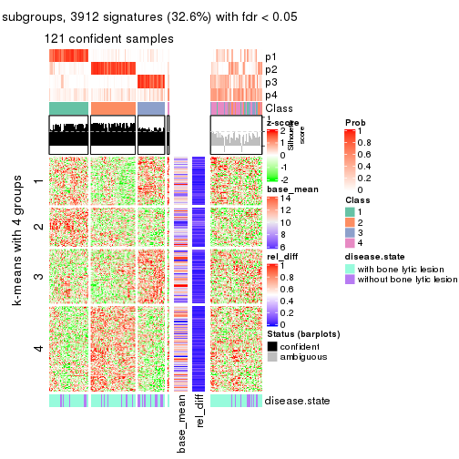</p>

</div>
<div id='tab-SD-kmeans-get-signatures-4'>
<pre><code class="r">get_signatures(res, k = 5)
</code></pre>

<p></p>

</div>
<div id='tab-SD-kmeans-get-signatures-5'>
<pre><code class="r">get_signatures(res, k = 6)
</code></pre>

<p></p>

</div>
</div>


Signature heatmaps where rows are not scaled:


<script>
$( function() {
	$( '#tabs-SD-kmeans-get-signatures-no-scale' ).tabs();
} );
</script>
<div id='tabs-SD-kmeans-get-signatures-no-scale'>
<ul>
<li><a href='#tab-SD-kmeans-get-signatures-no-scale-1'>k = 2</a></li>
<li><a href='#tab-SD-kmeans-get-signatures-no-scale-2'>k = 3</a></li>
<li><a href='#tab-SD-kmeans-get-signatures-no-scale-3'>k = 4</a></li>
<li><a href='#tab-SD-kmeans-get-signatures-no-scale-4'>k = 5</a></li>
<li><a href='#tab-SD-kmeans-get-signatures-no-scale-5'>k = 6</a></li>
</ul>
<div id='tab-SD-kmeans-get-signatures-no-scale-1'>
<pre><code class="r">get_signatures(res, k = 2, scale_rows = FALSE)
</code></pre>

<p></p>

</div>
<div id='tab-SD-kmeans-get-signatures-no-scale-2'>
<pre><code class="r">get_signatures(res, k = 3, scale_rows = FALSE)
</code></pre>

<p></p>

</div>
<div id='tab-SD-kmeans-get-signatures-no-scale-3'>
<pre><code class="r">get_signatures(res, k = 4, scale_rows = FALSE)
</code></pre>

<p></p>

</div>
<div id='tab-SD-kmeans-get-signatures-no-scale-4'>
<pre><code class="r">get_signatures(res, k = 5, scale_rows = FALSE)
</code></pre>

<p></p>

</div>
<div id='tab-SD-kmeans-get-signatures-no-scale-5'>
<pre><code class="r">get_signatures(res, k = 6, scale_rows = FALSE)
</code></pre>

<p></p>

</div>
</div>


Compare the overlap of signatures from different k:

```r
compare_signatures(res)
```


`get_signature()` returns a data frame invisibly. TO get the list of signatures, the function
call should be assigned to a variable explicitly. In following code, if `plot` argument is set
to `FALSE`, no heatmap is plotted while only the differential analysis is performed.

```r
# code only for demonstration
tb = get_signature(res, k = ..., plot = FALSE)
```

An example of the output of `tb` is:

```
#>   which_row         fdr    mean_1    mean_2 scaled_mean_1 scaled_mean_2 km
#> 1        38 0.042760348  8.373488  9.131774    -0.5533452     0.5164555  1
#> 2        40 0.018707592  7.106213  8.469186    -0.6173731     0.5762149  1
#> 3        55 0.019134737 10.221463 11.207825    -0.6159697     0.5749050  1
#> 4        59 0.006059896  5.921854  7.869574    -0.6899429     0.6439467  1
#> 5        60 0.018055526  8.928898 10.211722    -0.6204761     0.5791110  1
#> 6        98 0.009384629 15.714769 14.887706     0.6635654    -0.6193277  2
...
```

The columns in `tb` are:

1. `which_row`: row indices corresponding to the input matrix.
2. `fdr`: FDR for the differential test. 
3. `mean_x`: The mean value in group x.
4. `scaled_mean_x`: The mean value in group x after rows are scaled.
5. `km`: Row groups if k-means clustering is applied to rows.


UMAP plot which shows how samples are separated.


<script>
$( function() {
	$( '#tabs-SD-kmeans-dimension-reduction' ).tabs();
} );
</script>
<div id='tabs-SD-kmeans-dimension-reduction'>
<ul>
<li><a href='#tab-SD-kmeans-dimension-reduction-1'>k = 2</a></li>
<li><a href='#tab-SD-kmeans-dimension-reduction-2'>k = 3</a></li>
<li><a href='#tab-SD-kmeans-dimension-reduction-3'>k = 4</a></li>
<li><a href='#tab-SD-kmeans-dimension-reduction-4'>k = 5</a></li>
<li><a href='#tab-SD-kmeans-dimension-reduction-5'>k = 6</a></li>
</ul>
<div id='tab-SD-kmeans-dimension-reduction-1'>
<pre><code class="r">dimension_reduction(res, k = 2, method = &quot;UMAP&quot;)
</code></pre>

<p></p>

</div>
<div id='tab-SD-kmeans-dimension-reduction-2'>
<pre><code class="r">dimension_reduction(res, k = 3, method = &quot;UMAP&quot;)
</code></pre>

<p></p>

</div>
<div id='tab-SD-kmeans-dimension-reduction-3'>
<pre><code class="r">dimension_reduction(res, k = 4, method = &quot;UMAP&quot;)
</code></pre>

<p></p>

</div>
<div id='tab-SD-kmeans-dimension-reduction-4'>
<pre><code class="r">dimension_reduction(res, k = 5, method = &quot;UMAP&quot;)
</code></pre>

<p></p>

</div>
<div id='tab-SD-kmeans-dimension-reduction-5'>
<pre><code class="r">dimension_reduction(res, k = 6, method = &quot;UMAP&quot;)
</code></pre>

<p></p>

</div>
</div>


Following heatmap shows how subgroups are split when increasing `k`:

```r
collect_classes(res)
```


Test correlation between subgroups and known annotations. If the known
annotation is numeric, one-way ANOVA test is applied, and if the known
annotation is discrete, chi-squared contingency table test is applied.

```r
test_to_known_factors(res)
```

```
#>             n disease.state(p) k
#> SD:kmeans 153          0.09931 2
#> SD:kmeans 136          0.15517 3
#> SD:kmeans 121          0.02574 4
#> SD:kmeans 118          0.00228 5
#> SD:kmeans  97          0.00112 6
```


If matrix rows can be associated to genes, consider to use `GO_Enrichment(res,
...)` to perform function enrichment for the signature genes.


 

---------------------------------------------------


### SD:skmeans


The object with results only for a single top-value method and a single partition method 
can be extracted as:

```r
res = res_list["SD", "skmeans"]
# you can also extract it by
# res = res_list["SD:skmeans"]
```

A summary of `res` and all the functions that can be applied to it:

```r
res
```

```
#> A 'ConsensusPartition' object with k = 2, 3, 4, 5, 6.
#>   On a matrix with 11993 rows and 173 columns.
#>   Top rows (1000, 2000, 3000, 4000, 5000) are extracted by 'SD' method.
#>   Subgroups are detected by 'skmeans' method.
#>   Performed in total 1250 partitions by row resampling.
#>   Best k for subgroups seems to be 2.
#> 
#> Following methods can be applied to this 'ConsensusPartition' object:
#>  [1] "cola_report"             "collect_classes"         "collect_plots"          
#>  [4] "collect_stats"           "colnames"                "compare_signatures"     
#>  [7] "consensus_heatmap"       "dimension_reduction"     "functional_enrichment"  
#> [10] "get_anno_col"            "get_anno"                "get_classes"            
#> [13] "get_consensus"           "get_matrix"              "get_membership"         
#> [16] "get_param"               "get_signatures"          "get_stats"              
#> [19] "is_best_k"               "is_stable_k"             "membership_heatmap"     
#> [22] "ncol"                    "nrow"                    "plot_ecdf"              
#> [25] "rownames"                "select_partition_number" "show"                   
#> [28] "suggest_best_k"          "test_to_known_factors"
```

`collect_plots()` function collects all the plots made from `res` for all `k` (number of partitions)
into one single page to provide an easy and fast comparison between different `k`.

```r
collect_plots(res)
```


The plots are:

- The first row: a plot of the ECDF (Empirical cumulative distribution
  function) curves of the consensus matrix for each `k` and the heatmap of
  predicted classes for each `k`.
- The second row: heatmaps of the consensus matrix for each `k`.
- The third row: heatmaps of the membership matrix for each `k`.
- The fouth row: heatmaps of the signatures for each `k`.

All the plots in panels can be made by individual functions and they are
plotted later in this section.

`select_partition_number()` produces several plots showing different
statistics for choosing "optimized" `k`. There are following statistics:

- ECDF curves of the consensus matrix for each `k`;
- 1-PAC. [The PAC
  score](https://en.wikipedia.org/wiki/Consensus_clustering#Over-interpretation_potential_of_consensus_clustering)
  measures the proportion of the ambiguous subgrouping.
- Mean silhouette score.
- Concordance. The mean probability of fiting the consensus class ids in all
  partitions.
- Area increased. Denote $A_k$ as the area under the ECDF curve for current
  `k`, the area increased is defined as $A_k - A_{k-1}$.
- Rand index. The percent of pairs of samples that are both in a same cluster
  or both are not in a same cluster in the partition of k and k-1.
- Jaccard index. The ratio of pairs of samples are both in a same cluster in
  the partition of k and k-1 and the pairs of samples are both in a same
  cluster in the partition k or k-1.

The detailed explanations of these statistics can be found in [the cola
vignette](http://bioconductor.org/packages/devel/bioc/vignettes/cola/inst/doc/cola.html#toc_13).

Generally speaking, lower PAC score, higher mean silhouette score or higher
concordance corresponds to better partition. Rand index and Jaccard index
measure how similar the current partition is compared to partition with `k-1`.
If they are too similar, we won't accept `k` is better than `k-1`.

```r
select_partition_number(res)
```


The numeric values for all these statistics can be obtained by `get_stats()`.

```r
get_stats(res)
```

```
#>   k 1-PAC mean_silhouette concordance area_increased  Rand Jaccard
#> 2 2 0.616           0.834       0.924         0.5025 0.499   0.499
#> 3 3 0.570           0.715       0.858         0.3330 0.701   0.469
#> 4 4 0.473           0.556       0.718         0.1199 0.860   0.615
#> 5 5 0.513           0.501       0.658         0.0644 0.910   0.675
#> 6 6 0.553           0.388       0.596         0.0411 0.935   0.724
```

`suggest_best_k()` suggests the best $k$ based on these statistics. The rules are as follows:

- All $k$ with Jaccard index larger than 0.95 are removed because the increase of
  the partition number does not provides enough extra information. If all $k$ are removed,
  the best $k$ is assigned by `NA`.
- For $k$ with 1-PAC larger than 0.9, the maximal $k$ is taken as the "best k". Other $k$ is called "optional k".
- If it does not fit the second rule. The $k$ with the highest vote of highest
  1-PAC, mean silhouette and concordance is taken as the "best k".

```r
suggest_best_k(res)
```

```
#> [1] 2
```


Following shows the table of the partitions (You need to click the **show/hide
code output** link to see it). The membership matrix (columns with name `p*`)
is inferred by
[`clue::cl_consensus()`](https://www.rdocumentation.org/link/cl_consensus?package=clue)
function with the `SE` method. Basically the value in the membership matrix
represents the probability to belong to a certain group. The finall class
label for an item is determined with the group with highest probability it
belongs to.

In `get_classes()` function, the entropy is calculated from the membership
matrix and the silhouette score is calculated from the consensus matrix.


<script>
$( function() {
	$( '#tabs-SD-skmeans-get-classes' ).tabs();
} );
</script>
<div id='tabs-SD-skmeans-get-classes'>
<ul>
<li><a href='#tab-SD-skmeans-get-classes-1'>k = 2</a></li>
<li><a href='#tab-SD-skmeans-get-classes-2'>k = 3</a></li>
<li><a href='#tab-SD-skmeans-get-classes-3'>k = 4</a></li>
<li><a href='#tab-SD-skmeans-get-classes-4'>k = 5</a></li>
<li><a href='#tab-SD-skmeans-get-classes-5'>k = 6</a></li>
</ul>

<div id='tab-SD-skmeans-get-classes-1'>
<p><a id='tab-SD-skmeans-get-classes-1-a' style='color:#0366d6' href='#'>show/hide code output</a></p>
<pre><code class="r">cbind(get_classes(res, k = 2), get_membership(res, k = 2))
</code></pre>

<pre><code>#&gt;          class entropy silhouette    p1    p2
#&gt; GSM11437     1  0.2778     0.8884 0.952 0.048
#&gt; GSM11438     2  0.0000     0.9312 0.000 1.000
#&gt; GSM11439     2  1.0000    -0.0416 0.496 0.504
#&gt; GSM11440     1  0.3584     0.8775 0.932 0.068
#&gt; GSM11441     1  0.0376     0.9032 0.996 0.004
#&gt; GSM11442     2  0.8267     0.6415 0.260 0.740
#&gt; GSM11443     2  0.0000     0.9312 0.000 1.000
#&gt; GSM11444     1  0.1843     0.8969 0.972 0.028
#&gt; GSM11445     1  0.4298     0.8641 0.912 0.088
#&gt; GSM11446     1  0.0672     0.9026 0.992 0.008
#&gt; GSM11447     1  0.9998     0.0661 0.508 0.492
#&gt; GSM11448     2  0.5737     0.8308 0.136 0.864
#&gt; GSM11449     1  0.0938     0.9017 0.988 0.012
#&gt; GSM11450     1  0.0672     0.9026 0.992 0.008
#&gt; GSM11451     2  0.0000     0.9312 0.000 1.000
#&gt; GSM11452     2  0.4298     0.8721 0.088 0.912
#&gt; GSM11453     1  0.5737     0.8253 0.864 0.136
#&gt; GSM11454     1  0.0672     0.9026 0.992 0.008
#&gt; GSM11455     2  0.0000     0.9312 0.000 1.000
#&gt; GSM11456     2  0.0000     0.9312 0.000 1.000
#&gt; GSM11457     2  0.0000     0.9312 0.000 1.000
#&gt; GSM11458     1  0.0000     0.9034 1.000 0.000
#&gt; GSM11459     1  0.0000     0.9034 1.000 0.000
#&gt; GSM11460     1  0.0000     0.9034 1.000 0.000
#&gt; GSM11461     1  0.3733     0.8722 0.928 0.072
#&gt; GSM11462     1  0.0000     0.9034 1.000 0.000
#&gt; GSM11463     2  0.0000     0.9312 0.000 1.000
#&gt; GSM11464     1  0.0000     0.9034 1.000 0.000
#&gt; GSM11465     2  0.4022     0.8804 0.080 0.920
#&gt; GSM11466     1  0.0672     0.9033 0.992 0.008
#&gt; GSM11467     1  0.0376     0.9033 0.996 0.004
#&gt; GSM11468     1  0.0376     0.9033 0.996 0.004
#&gt; GSM11469     1  0.0000     0.9034 1.000 0.000
#&gt; GSM11470     1  0.0376     0.9033 0.996 0.004
#&gt; GSM11471     1  0.0672     0.9026 0.992 0.008
#&gt; GSM11472     1  0.2043     0.8948 0.968 0.032
#&gt; GSM11473     2  0.3431     0.8934 0.064 0.936
#&gt; GSM11474     2  0.0000     0.9312 0.000 1.000
#&gt; GSM11475     1  0.2948     0.8872 0.948 0.052
#&gt; GSM11476     2  0.1414     0.9236 0.020 0.980
#&gt; GSM11477     2  0.0000     0.9312 0.000 1.000
#&gt; GSM11478     2  0.0000     0.9312 0.000 1.000
#&gt; GSM11479     2  0.0938     0.9272 0.012 0.988
#&gt; GSM11480     2  0.0000     0.9312 0.000 1.000
#&gt; GSM11481     1  0.4298     0.8605 0.912 0.088
#&gt; GSM11482     2  0.1633     0.9224 0.024 0.976
#&gt; GSM11483     2  0.0376     0.9299 0.004 0.996
#&gt; GSM11484     1  0.6148     0.8144 0.848 0.152
#&gt; GSM11485     2  0.0672     0.9286 0.008 0.992
#&gt; GSM11486     2  0.0000     0.9312 0.000 1.000
#&gt; GSM11487     1  0.1184     0.9015 0.984 0.016
#&gt; GSM11488     1  0.8955     0.6039 0.688 0.312
#&gt; GSM11489     2  0.0000     0.9312 0.000 1.000
#&gt; GSM11490     1  0.9000     0.5587 0.684 0.316
#&gt; GSM11491     1  0.3879     0.8726 0.924 0.076
#&gt; GSM11492     1  0.2603     0.8894 0.956 0.044
#&gt; GSM11493     2  0.8955     0.5363 0.312 0.688
#&gt; GSM11494     1  0.9552     0.4374 0.624 0.376
#&gt; GSM11495     2  0.1414     0.9236 0.020 0.980
#&gt; GSM11496     2  0.1843     0.9197 0.028 0.972
#&gt; GSM11497     2  0.1184     0.9250 0.016 0.984
#&gt; GSM11498     2  0.0000     0.9312 0.000 1.000
#&gt; GSM11499     2  0.0938     0.9272 0.012 0.988
#&gt; GSM11500     2  0.1184     0.9261 0.016 0.984
#&gt; GSM11501     2  0.0376     0.9299 0.004 0.996
#&gt; GSM11502     2  0.0000     0.9312 0.000 1.000
#&gt; GSM11503     2  0.0000     0.9312 0.000 1.000
#&gt; GSM11504     1  0.0672     0.9026 0.992 0.008
#&gt; GSM11505     2  0.0000     0.9312 0.000 1.000
#&gt; GSM11506     2  0.0376     0.9299 0.004 0.996
#&gt; GSM11507     2  0.0000     0.9312 0.000 1.000
#&gt; GSM11508     1  0.0672     0.9026 0.992 0.008
#&gt; GSM11509     1  0.8955     0.5665 0.688 0.312
#&gt; GSM11510     2  0.0000     0.9312 0.000 1.000
#&gt; GSM11511     1  0.5294     0.8346 0.880 0.120
#&gt; GSM11512     1  0.4939     0.8538 0.892 0.108
#&gt; GSM11513     1  0.0000     0.9034 1.000 0.000
#&gt; GSM11514     1  1.0000     0.1039 0.504 0.496
#&gt; GSM11515     2  0.9460     0.4192 0.364 0.636
#&gt; GSM11516     2  0.5294     0.8424 0.120 0.880
#&gt; GSM11517     1  0.0000     0.9034 1.000 0.000
#&gt; GSM11518     1  0.8327     0.6528 0.736 0.264
#&gt; GSM11519     1  0.4939     0.8495 0.892 0.108
#&gt; GSM11520     1  0.0376     0.9033 0.996 0.004
#&gt; GSM11521     2  0.0938     0.9274 0.012 0.988
#&gt; GSM11522     1  0.0672     0.9026 0.992 0.008
#&gt; GSM11523     1  0.0376     0.9033 0.996 0.004
#&gt; GSM11524     1  0.0000     0.9034 1.000 0.000
#&gt; GSM11525     2  0.0000     0.9312 0.000 1.000
#&gt; GSM11526     1  0.2043     0.8946 0.968 0.032
#&gt; GSM11527     2  0.0672     0.9286 0.008 0.992
#&gt; GSM11528     2  0.0000     0.9312 0.000 1.000
#&gt; GSM11529     2  0.1184     0.9247 0.016 0.984
#&gt; GSM11530     1  0.0000     0.9034 1.000 0.000
#&gt; GSM11531     2  0.0000     0.9312 0.000 1.000
#&gt; GSM11532     1  0.0376     0.9035 0.996 0.004
#&gt; GSM11533     2  0.0376     0.9299 0.004 0.996
#&gt; GSM11534     2  0.7674     0.7077 0.224 0.776
#&gt; GSM11535     2  0.0000     0.9312 0.000 1.000
#&gt; GSM11536     2  0.8763     0.5617 0.296 0.704
#&gt; GSM11537     2  0.0000     0.9312 0.000 1.000
#&gt; GSM11538     1  0.8909     0.5869 0.692 0.308
#&gt; GSM11539     2  0.0000     0.9312 0.000 1.000
#&gt; GSM11540     2  0.0000     0.9312 0.000 1.000
#&gt; GSM11541     1  0.0000     0.9034 1.000 0.000
#&gt; GSM11542     2  0.0000     0.9312 0.000 1.000
#&gt; GSM11543     2  0.8386     0.6454 0.268 0.732
#&gt; GSM11544     1  0.1633     0.8985 0.976 0.024
#&gt; GSM11545     1  0.6887     0.7807 0.816 0.184
#&gt; GSM11546     2  0.5408     0.8386 0.124 0.876
#&gt; GSM11547     2  0.6048     0.8097 0.148 0.852
#&gt; GSM11548     1  0.4690     0.8547 0.900 0.100
#&gt; GSM11549     1  0.0000     0.9034 1.000 0.000
#&gt; GSM11550     1  0.0000     0.9034 1.000 0.000
#&gt; GSM11551     1  0.4939     0.8458 0.892 0.108
#&gt; GSM11552     1  0.0000     0.9034 1.000 0.000
#&gt; GSM11553     2  0.0000     0.9312 0.000 1.000
#&gt; GSM11554     2  0.0000     0.9312 0.000 1.000
#&gt; GSM11555     1  0.4690     0.8545 0.900 0.100
#&gt; GSM11556     1  0.0000     0.9034 1.000 0.000
#&gt; GSM11557     2  0.0000     0.9312 0.000 1.000
#&gt; GSM11558     2  0.0000     0.9312 0.000 1.000
#&gt; GSM11559     2  0.0000     0.9312 0.000 1.000
#&gt; GSM11560     1  0.0000     0.9034 1.000 0.000
#&gt; GSM11561     2  0.0000     0.9312 0.000 1.000
#&gt; GSM11562     2  0.0000     0.9312 0.000 1.000
#&gt; GSM11563     1  0.8813     0.6157 0.700 0.300
#&gt; GSM11564     1  0.9850     0.3086 0.572 0.428
#&gt; GSM11565     1  0.5408     0.8362 0.876 0.124
#&gt; GSM11566     2  0.0000     0.9312 0.000 1.000
#&gt; GSM11567     2  0.9922     0.1508 0.448 0.552
#&gt; GSM11568     2  0.7139     0.7564 0.196 0.804
#&gt; GSM11569     2  0.0000     0.9312 0.000 1.000
#&gt; GSM11570     1  0.0000     0.9034 1.000 0.000
#&gt; GSM11571     1  0.9866     0.2570 0.568 0.432
#&gt; GSM11572     2  0.2236     0.9143 0.036 0.964
#&gt; GSM11573     1  0.9358     0.5049 0.648 0.352
#&gt; GSM11574     2  0.0376     0.9298 0.004 0.996
#&gt; GSM11575     2  0.8499     0.6232 0.276 0.724
#&gt; GSM11576     1  0.0376     0.9033 0.996 0.004
#&gt; GSM11577     2  0.8016     0.6754 0.244 0.756
#&gt; GSM11578     2  0.3733     0.8874 0.072 0.928
#&gt; GSM11579     2  0.1184     0.9256 0.016 0.984
#&gt; GSM11580     2  0.3274     0.8964 0.060 0.940
#&gt; GSM11581     1  0.0938     0.9018 0.988 0.012
#&gt; GSM11582     1  0.0000     0.9034 1.000 0.000
#&gt; GSM11583     1  0.5946     0.8084 0.856 0.144
#&gt; GSM11584     1  0.8555     0.6387 0.720 0.280
#&gt; GSM11585     2  0.0000     0.9312 0.000 1.000
#&gt; GSM11586     1  0.0376     0.9033 0.996 0.004
#&gt; GSM11587     1  0.0376     0.9033 0.996 0.004
#&gt; GSM11588     1  0.8661     0.6252 0.712 0.288
#&gt; GSM11589     1  0.9970     0.1715 0.532 0.468
#&gt; GSM11590     1  0.1184     0.9007 0.984 0.016
#&gt; GSM11591     2  0.0376     0.9298 0.004 0.996
#&gt; GSM11592     1  0.0000     0.9034 1.000 0.000
#&gt; GSM11593     1  0.1184     0.9007 0.984 0.016
#&gt; GSM11594     1  0.0000     0.9034 1.000 0.000
#&gt; GSM11595     1  0.9970     0.1750 0.532 0.468
#&gt; GSM11596     2  0.5178     0.8509 0.116 0.884
#&gt; GSM11597     1  0.0000     0.9034 1.000 0.000
#&gt; GSM11598     1  0.1414     0.8994 0.980 0.020
#&gt; GSM11599     1  0.0000     0.9034 1.000 0.000
#&gt; GSM11600     1  0.0376     0.9033 0.996 0.004
#&gt; GSM11601     2  0.2236     0.9127 0.036 0.964
#&gt; GSM11602     1  0.0000     0.9034 1.000 0.000
#&gt; GSM11603     1  0.0376     0.9033 0.996 0.004
#&gt; GSM11604     1  0.0000     0.9034 1.000 0.000
#&gt; GSM11605     1  0.0000     0.9034 1.000 0.000
#&gt; GSM11606     2  0.0672     0.9281 0.008 0.992
#&gt; GSM11607     1  0.1633     0.8985 0.976 0.024
#&gt; GSM11608     1  0.0000     0.9034 1.000 0.000
#&gt; GSM11609     2  0.7950     0.6754 0.240 0.760
</code></pre>

<script>
$('#tab-SD-skmeans-get-classes-1-a').parent().next().next().hide();
$('#tab-SD-skmeans-get-classes-1-a').click(function(){
  $('#tab-SD-skmeans-get-classes-1-a').parent().next().next().toggle();
  return(false);
});
</script>
</div>

<div id='tab-SD-skmeans-get-classes-2'>
<p><a id='tab-SD-skmeans-get-classes-2-a' style='color:#0366d6' href='#'>show/hide code output</a></p>
<pre><code class="r">cbind(get_classes(res, k = 3), get_membership(res, k = 3))
</code></pre>

<pre><code>#&gt;          class entropy silhouette    p1    p2    p3
#&gt; GSM11437     1  0.8393     0.1508 0.516 0.088 0.396
#&gt; GSM11438     2  0.3340     0.8323 0.000 0.880 0.120
#&gt; GSM11439     3  0.6012     0.6028 0.032 0.220 0.748
#&gt; GSM11440     3  0.2050     0.8138 0.028 0.020 0.952
#&gt; GSM11441     3  0.3412     0.7548 0.124 0.000 0.876
#&gt; GSM11442     3  0.0424     0.8126 0.000 0.008 0.992
#&gt; GSM11443     2  0.0892     0.8833 0.000 0.980 0.020
#&gt; GSM11444     3  0.0475     0.8139 0.004 0.004 0.992
#&gt; GSM11445     3  0.0424     0.8126 0.000 0.008 0.992
#&gt; GSM11446     3  0.0983     0.8156 0.016 0.004 0.980
#&gt; GSM11447     3  0.0829     0.8144 0.004 0.012 0.984
#&gt; GSM11448     1  0.6244     0.2990 0.560 0.440 0.000
#&gt; GSM11449     1  0.3983     0.7181 0.852 0.004 0.144
#&gt; GSM11450     1  0.1170     0.8149 0.976 0.008 0.016
#&gt; GSM11451     2  0.0424     0.8842 0.008 0.992 0.000
#&gt; GSM11452     1  0.6299     0.2104 0.524 0.476 0.000
#&gt; GSM11453     1  0.1525     0.8118 0.964 0.032 0.004
#&gt; GSM11454     3  0.1529     0.8137 0.040 0.000 0.960
#&gt; GSM11455     2  0.5497     0.6397 0.000 0.708 0.292
#&gt; GSM11456     2  0.0892     0.8834 0.000 0.980 0.020
#&gt; GSM11457     2  0.0000     0.8844 0.000 1.000 0.000
#&gt; GSM11458     3  0.5650     0.5791 0.312 0.000 0.688
#&gt; GSM11459     3  0.1753     0.8120 0.048 0.000 0.952
#&gt; GSM11460     1  0.5216     0.5428 0.740 0.000 0.260
#&gt; GSM11461     1  0.7931     0.0941 0.528 0.060 0.412
#&gt; GSM11462     3  0.6204     0.3712 0.424 0.000 0.576
#&gt; GSM11463     2  0.0475     0.8844 0.004 0.992 0.004
#&gt; GSM11464     1  0.2261     0.7891 0.932 0.000 0.068
#&gt; GSM11465     2  0.5608     0.7640 0.072 0.808 0.120
#&gt; GSM11466     3  0.1774     0.8144 0.024 0.016 0.960
#&gt; GSM11467     1  0.0892     0.8090 0.980 0.000 0.020
#&gt; GSM11468     3  0.1529     0.8135 0.040 0.000 0.960
#&gt; GSM11469     3  0.4750     0.6935 0.216 0.000 0.784
#&gt; GSM11470     1  0.0424     0.8131 0.992 0.000 0.008
#&gt; GSM11471     1  0.4953     0.6915 0.808 0.016 0.176
#&gt; GSM11472     1  0.5929     0.4832 0.676 0.004 0.320
#&gt; GSM11473     2  0.3965     0.8247 0.008 0.860 0.132
#&gt; GSM11474     2  0.0424     0.8850 0.000 0.992 0.008
#&gt; GSM11475     3  0.1964     0.8090 0.056 0.000 0.944
#&gt; GSM11476     3  0.5678     0.4327 0.000 0.316 0.684
#&gt; GSM11477     2  0.0424     0.8837 0.008 0.992 0.000
#&gt; GSM11478     2  0.0592     0.8843 0.000 0.988 0.012
#&gt; GSM11479     2  0.5397     0.6655 0.000 0.720 0.280
#&gt; GSM11480     2  0.0237     0.8843 0.004 0.996 0.000
#&gt; GSM11481     3  0.5656     0.6409 0.264 0.008 0.728
#&gt; GSM11482     3  0.3267     0.7677 0.000 0.116 0.884
#&gt; GSM11483     2  0.5465     0.6513 0.000 0.712 0.288
#&gt; GSM11484     3  0.1877     0.8124 0.032 0.012 0.956
#&gt; GSM11485     2  0.5859     0.5594 0.000 0.656 0.344
#&gt; GSM11486     2  0.2165     0.8702 0.000 0.936 0.064
#&gt; GSM11487     1  0.0424     0.8123 0.992 0.000 0.008
#&gt; GSM11488     3  0.1636     0.8131 0.016 0.020 0.964
#&gt; GSM11489     2  0.3038     0.8432 0.000 0.896 0.104
#&gt; GSM11490     3  0.1399     0.8109 0.004 0.028 0.968
#&gt; GSM11491     1  0.0424     0.8147 0.992 0.008 0.000
#&gt; GSM11492     3  0.1878     0.8096 0.044 0.004 0.952
#&gt; GSM11493     3  0.1267     0.8112 0.004 0.024 0.972
#&gt; GSM11494     3  0.0983     0.8137 0.004 0.016 0.980
#&gt; GSM11495     3  0.6079     0.2284 0.000 0.388 0.612
#&gt; GSM11496     2  0.6373     0.4340 0.004 0.588 0.408
#&gt; GSM11497     2  0.5292     0.6288 0.228 0.764 0.008
#&gt; GSM11498     2  0.3456     0.8556 0.060 0.904 0.036
#&gt; GSM11499     2  0.5859     0.5620 0.000 0.656 0.344
#&gt; GSM11500     2  0.5733     0.5976 0.000 0.676 0.324
#&gt; GSM11501     2  0.6180     0.4013 0.000 0.584 0.416
#&gt; GSM11502     2  0.0424     0.8837 0.008 0.992 0.000
#&gt; GSM11503     2  0.0592     0.8845 0.000 0.988 0.012
#&gt; GSM11504     3  0.0747     0.8156 0.016 0.000 0.984
#&gt; GSM11505     2  0.0747     0.8837 0.000 0.984 0.016
#&gt; GSM11506     2  0.2066     0.8710 0.000 0.940 0.060
#&gt; GSM11507     2  0.0237     0.8850 0.000 0.996 0.004
#&gt; GSM11508     3  0.0000     0.8131 0.000 0.000 1.000
#&gt; GSM11509     3  0.1399     0.8108 0.004 0.028 0.968
#&gt; GSM11510     2  0.4682     0.7687 0.004 0.804 0.192
#&gt; GSM11511     1  0.1781     0.8137 0.960 0.020 0.020
#&gt; GSM11512     3  0.1170     0.8151 0.016 0.008 0.976
#&gt; GSM11513     3  0.1411     0.8145 0.036 0.000 0.964
#&gt; GSM11514     3  0.8321     0.5436 0.140 0.240 0.620
#&gt; GSM11515     3  0.0747     0.8129 0.000 0.016 0.984
#&gt; GSM11516     1  0.5926     0.4997 0.644 0.356 0.000
#&gt; GSM11517     3  0.2066     0.8086 0.060 0.000 0.940
#&gt; GSM11518     3  0.7710     0.2955 0.368 0.056 0.576
#&gt; GSM11519     1  0.0747     0.8138 0.984 0.016 0.000
#&gt; GSM11520     1  0.0237     0.8129 0.996 0.000 0.004
#&gt; GSM11521     3  0.5785     0.3920 0.000 0.332 0.668
#&gt; GSM11522     1  0.4409     0.6781 0.824 0.004 0.172
#&gt; GSM11523     1  0.0592     0.8124 0.988 0.000 0.012
#&gt; GSM11524     3  0.0592     0.8150 0.012 0.000 0.988
#&gt; GSM11525     2  0.1031     0.8830 0.000 0.976 0.024
#&gt; GSM11526     3  0.0983     0.8166 0.016 0.004 0.980
#&gt; GSM11527     2  0.3116     0.8442 0.000 0.892 0.108
#&gt; GSM11528     2  0.0829     0.8856 0.004 0.984 0.012
#&gt; GSM11529     2  0.6322     0.5296 0.276 0.700 0.024
#&gt; GSM11530     3  0.6106     0.6881 0.200 0.044 0.756
#&gt; GSM11531     2  0.0475     0.8844 0.004 0.992 0.004
#&gt; GSM11532     3  0.3941     0.7472 0.156 0.000 0.844
#&gt; GSM11533     2  0.5363     0.5428 0.276 0.724 0.000
#&gt; GSM11534     1  0.6254     0.6986 0.756 0.188 0.056
#&gt; GSM11535     2  0.0592     0.8828 0.012 0.988 0.000
#&gt; GSM11536     3  0.6678     0.6290 0.060 0.216 0.724
#&gt; GSM11537     2  0.0424     0.8837 0.008 0.992 0.000
#&gt; GSM11538     1  0.7442     0.3191 0.604 0.048 0.348
#&gt; GSM11539     2  0.0237     0.8847 0.000 0.996 0.004
#&gt; GSM11540     2  0.0237     0.8847 0.000 0.996 0.004
#&gt; GSM11541     1  0.5678     0.4542 0.684 0.000 0.316
#&gt; GSM11542     2  0.0475     0.8851 0.004 0.992 0.004
#&gt; GSM11543     1  0.9239     0.2768 0.500 0.172 0.328
#&gt; GSM11544     1  0.0592     0.8140 0.988 0.012 0.000
#&gt; GSM11545     1  0.1163     0.8126 0.972 0.028 0.000
#&gt; GSM11546     2  0.3921     0.8354 0.080 0.884 0.036
#&gt; GSM11547     2  0.3272     0.8409 0.080 0.904 0.016
#&gt; GSM11548     3  0.1753     0.8122 0.048 0.000 0.952
#&gt; GSM11549     1  0.0892     0.8109 0.980 0.000 0.020
#&gt; GSM11550     1  0.0747     0.8115 0.984 0.000 0.016
#&gt; GSM11551     1  0.7752     0.0847 0.496 0.048 0.456
#&gt; GSM11552     3  0.5560     0.5921 0.300 0.000 0.700
#&gt; GSM11553     2  0.0747     0.8813 0.016 0.984 0.000
#&gt; GSM11554     2  0.0237     0.8843 0.004 0.996 0.000
#&gt; GSM11555     3  0.7377     0.2455 0.452 0.032 0.516
#&gt; GSM11556     3  0.6309     0.1946 0.496 0.000 0.504
#&gt; GSM11557     2  0.0237     0.8848 0.000 0.996 0.004
#&gt; GSM11558     2  0.0237     0.8843 0.004 0.996 0.000
#&gt; GSM11559     2  0.0592     0.8827 0.012 0.988 0.000
#&gt; GSM11560     1  0.0592     0.8124 0.988 0.000 0.012
#&gt; GSM11561     2  0.0237     0.8843 0.004 0.996 0.000
#&gt; GSM11562     2  0.0424     0.8837 0.008 0.992 0.000
#&gt; GSM11563     1  0.3539     0.7801 0.888 0.100 0.012
#&gt; GSM11564     1  0.3670     0.7810 0.888 0.092 0.020
#&gt; GSM11565     1  0.1289     0.8125 0.968 0.032 0.000
#&gt; GSM11566     2  0.0661     0.8847 0.008 0.988 0.004
#&gt; GSM11567     3  0.4007     0.7751 0.084 0.036 0.880
#&gt; GSM11568     1  0.5926     0.4991 0.644 0.356 0.000
#&gt; GSM11569     2  0.0237     0.8843 0.004 0.996 0.000
#&gt; GSM11570     3  0.5560     0.5913 0.300 0.000 0.700
#&gt; GSM11571     1  0.2384     0.8046 0.936 0.056 0.008
#&gt; GSM11572     2  0.5595     0.6430 0.228 0.756 0.016
#&gt; GSM11573     1  0.3031     0.7930 0.912 0.076 0.012
#&gt; GSM11574     2  0.1163     0.8755 0.028 0.972 0.000
#&gt; GSM11575     1  0.6865     0.4059 0.596 0.384 0.020
#&gt; GSM11576     1  0.0592     0.8124 0.988 0.000 0.012
#&gt; GSM11577     1  0.5178     0.6539 0.744 0.256 0.000
#&gt; GSM11578     1  0.5810     0.5342 0.664 0.336 0.000
#&gt; GSM11579     2  0.6247     0.4814 0.004 0.620 0.376
#&gt; GSM11580     1  0.6274     0.2516 0.544 0.456 0.000
#&gt; GSM11581     3  0.0592     0.8150 0.012 0.000 0.988
#&gt; GSM11582     3  0.6225     0.3586 0.432 0.000 0.568
#&gt; GSM11583     3  0.5733     0.5613 0.324 0.000 0.676
#&gt; GSM11584     3  0.0661     0.8147 0.008 0.004 0.988
#&gt; GSM11585     2  0.0424     0.8837 0.008 0.992 0.000
#&gt; GSM11586     1  0.0237     0.8140 0.996 0.000 0.004
#&gt; GSM11587     1  0.0592     0.8124 0.988 0.000 0.012
#&gt; GSM11588     1  0.3120     0.7900 0.908 0.080 0.012
#&gt; GSM11589     1  0.2384     0.8055 0.936 0.056 0.008
#&gt; GSM11590     1  0.0424     0.8139 0.992 0.008 0.000
#&gt; GSM11591     2  0.0424     0.8837 0.008 0.992 0.000
#&gt; GSM11592     1  0.1964     0.7996 0.944 0.000 0.056
#&gt; GSM11593     1  0.0237     0.8138 0.996 0.004 0.000
#&gt; GSM11594     1  0.0424     0.8123 0.992 0.000 0.008
#&gt; GSM11595     1  0.8770     0.5357 0.584 0.236 0.180
#&gt; GSM11596     2  0.5237     0.7921 0.120 0.824 0.056
#&gt; GSM11597     3  0.3272     0.7893 0.104 0.004 0.892
#&gt; GSM11598     1  0.0237     0.8138 0.996 0.004 0.000
#&gt; GSM11599     3  0.1163     0.8149 0.028 0.000 0.972
#&gt; GSM11600     3  0.6476     0.3172 0.448 0.004 0.548
#&gt; GSM11601     2  0.5541     0.6865 0.008 0.740 0.252
#&gt; GSM11602     1  0.0592     0.8124 0.988 0.000 0.012
#&gt; GSM11603     1  0.0592     0.8124 0.988 0.000 0.012
#&gt; GSM11604     3  0.5363     0.6331 0.276 0.000 0.724
#&gt; GSM11605     1  0.5327     0.5141 0.728 0.000 0.272
#&gt; GSM11606     2  0.1643     0.8658 0.044 0.956 0.000
#&gt; GSM11607     1  0.0237     0.8138 0.996 0.004 0.000
#&gt; GSM11608     3  0.6302     0.2248 0.480 0.000 0.520
#&gt; GSM11609     3  0.6895     0.6319 0.064 0.228 0.708
</code></pre>

<script>
$('#tab-SD-skmeans-get-classes-2-a').parent().next().next().hide();
$('#tab-SD-skmeans-get-classes-2-a').click(function(){
  $('#tab-SD-skmeans-get-classes-2-a').parent().next().next().toggle();
  return(false);
});
</script>
</div>

<div id='tab-SD-skmeans-get-classes-3'>
<p><a id='tab-SD-skmeans-get-classes-3-a' style='color:#0366d6' href='#'>show/hide code output</a></p>
<pre><code class="r">cbind(get_classes(res, k = 4), get_membership(res, k = 4))
</code></pre>

<pre><code>#&gt;          class entropy silhouette    p1    p2    p3    p4
#&gt; GSM11437     4   0.890     0.1161 0.324 0.060 0.220 0.396
#&gt; GSM11438     2   0.572     0.5799 0.000 0.680 0.068 0.252
#&gt; GSM11439     3   0.650     0.4843 0.012 0.076 0.624 0.288
#&gt; GSM11440     3   0.425     0.5579 0.016 0.000 0.776 0.208
#&gt; GSM11441     3   0.576     0.5527 0.048 0.008 0.680 0.264
#&gt; GSM11442     3   0.511     0.4906 0.000 0.012 0.636 0.352
#&gt; GSM11443     2   0.347     0.7593 0.000 0.868 0.060 0.072
#&gt; GSM11444     3   0.280     0.6545 0.000 0.016 0.892 0.092
#&gt; GSM11445     3   0.326     0.6351 0.000 0.004 0.844 0.152
#&gt; GSM11446     3   0.341     0.6345 0.004 0.016 0.860 0.120
#&gt; GSM11447     3   0.509     0.5306 0.000 0.024 0.688 0.288
#&gt; GSM11448     1   0.781     0.4595 0.584 0.184 0.048 0.184
#&gt; GSM11449     1   0.600     0.2342 0.552 0.008 0.412 0.028
#&gt; GSM11450     1   0.335     0.7227 0.872 0.000 0.084 0.044
#&gt; GSM11451     2   0.226     0.7849 0.020 0.924 0.000 0.056
#&gt; GSM11452     2   0.558     0.0886 0.448 0.532 0.000 0.020
#&gt; GSM11453     1   0.392     0.7122 0.828 0.016 0.008 0.148
#&gt; GSM11454     3   0.241     0.6573 0.016 0.004 0.920 0.060
#&gt; GSM11455     4   0.706     0.1629 0.000 0.344 0.136 0.520
#&gt; GSM11456     2   0.691     0.5254 0.016 0.608 0.104 0.272
#&gt; GSM11457     2   0.111     0.7902 0.004 0.968 0.000 0.028
#&gt; GSM11458     3   0.429     0.5918 0.164 0.000 0.800 0.036
#&gt; GSM11459     3   0.194     0.6574 0.012 0.000 0.936 0.052
#&gt; GSM11460     1   0.719     0.2958 0.536 0.000 0.172 0.292
#&gt; GSM11461     3   0.830     0.4229 0.224 0.060 0.532 0.184
#&gt; GSM11462     3   0.546     0.4998 0.228 0.000 0.708 0.064
#&gt; GSM11463     2   0.284     0.7729 0.000 0.900 0.052 0.048
#&gt; GSM11464     1   0.493     0.6796 0.776 0.000 0.092 0.132
#&gt; GSM11465     2   0.896     0.2268 0.084 0.456 0.224 0.236
#&gt; GSM11466     3   0.626     0.4843 0.040 0.016 0.600 0.344
#&gt; GSM11467     1   0.446     0.6823 0.792 0.000 0.044 0.164
#&gt; GSM11468     3   0.320     0.6192 0.008 0.000 0.856 0.136
#&gt; GSM11469     3   0.373     0.6304 0.056 0.000 0.852 0.092
#&gt; GSM11470     1   0.128     0.7382 0.964 0.000 0.012 0.024
#&gt; GSM11471     1   0.626     0.3807 0.592 0.012 0.352 0.044
#&gt; GSM11472     1   0.810     0.0601 0.408 0.008 0.280 0.304
#&gt; GSM11473     2   0.758     0.4323 0.016 0.556 0.192 0.236
#&gt; GSM11474     2   0.277     0.7796 0.000 0.900 0.028 0.072
#&gt; GSM11475     3   0.496     0.5756 0.036 0.004 0.748 0.212
#&gt; GSM11476     4   0.568     0.5070 0.000 0.136 0.144 0.720
#&gt; GSM11477     2   0.193     0.7895 0.024 0.940 0.000 0.036
#&gt; GSM11478     2   0.233     0.7845 0.000 0.908 0.004 0.088
#&gt; GSM11479     2   0.752     0.1353 0.000 0.424 0.184 0.392
#&gt; GSM11480     2   0.303     0.7650 0.008 0.868 0.000 0.124
#&gt; GSM11481     4   0.662     0.4855 0.096 0.012 0.260 0.632
#&gt; GSM11482     4   0.569     0.4917 0.000 0.080 0.224 0.696
#&gt; GSM11483     4   0.731    -0.1280 0.000 0.420 0.152 0.428
#&gt; GSM11484     4   0.531     0.4881 0.028 0.004 0.280 0.688
#&gt; GSM11485     4   0.618     0.2942 0.000 0.308 0.076 0.616
#&gt; GSM11486     2   0.596     0.5980 0.000 0.676 0.096 0.228
#&gt; GSM11487     1   0.372     0.6952 0.812 0.000 0.008 0.180
#&gt; GSM11488     4   0.427     0.5191 0.004 0.004 0.232 0.760
#&gt; GSM11489     2   0.716     0.3608 0.004 0.528 0.132 0.336
#&gt; GSM11490     3   0.553     0.5173 0.000 0.040 0.656 0.304
#&gt; GSM11491     1   0.333     0.7171 0.856 0.008 0.004 0.132
#&gt; GSM11492     4   0.584     0.4313 0.036 0.004 0.348 0.612
#&gt; GSM11493     4   0.456     0.4290 0.000 0.004 0.296 0.700
#&gt; GSM11494     3   0.551     0.2330 0.000 0.016 0.492 0.492
#&gt; GSM11495     4   0.669     0.2550 0.000 0.128 0.276 0.596
#&gt; GSM11496     3   0.826     0.0891 0.012 0.292 0.372 0.324
#&gt; GSM11497     2   0.575     0.6818 0.156 0.748 0.040 0.056
#&gt; GSM11498     2   0.627     0.6942 0.132 0.720 0.036 0.112
#&gt; GSM11499     4   0.570     0.3778 0.000 0.292 0.052 0.656
#&gt; GSM11500     2   0.768     0.2232 0.000 0.456 0.252 0.292
#&gt; GSM11501     4   0.603     0.4879 0.000 0.236 0.096 0.668
#&gt; GSM11502     2   0.183     0.7880 0.024 0.944 0.000 0.032
#&gt; GSM11503     2   0.265     0.7891 0.004 0.912 0.028 0.056
#&gt; GSM11504     4   0.571     0.4487 0.048 0.000 0.308 0.644
#&gt; GSM11505     2   0.247     0.7804 0.000 0.916 0.028 0.056
#&gt; GSM11506     2   0.432     0.7417 0.000 0.804 0.044 0.152
#&gt; GSM11507     2   0.261     0.7783 0.008 0.896 0.000 0.096
#&gt; GSM11508     3   0.344     0.6052 0.000 0.000 0.816 0.184
#&gt; GSM11509     3   0.384     0.6287 0.000 0.016 0.816 0.168
#&gt; GSM11510     2   0.620     0.3223 0.004 0.532 0.044 0.420
#&gt; GSM11511     1   0.498     0.6960 0.808 0.040 0.088 0.064
#&gt; GSM11512     4   0.524     0.4792 0.024 0.004 0.284 0.688
#&gt; GSM11513     3   0.216     0.6571 0.008 0.004 0.928 0.060
#&gt; GSM11514     4   0.736     0.5092 0.068 0.108 0.184 0.640
#&gt; GSM11515     3   0.492     0.5565 0.004 0.012 0.700 0.284
#&gt; GSM11516     1   0.550     0.4978 0.652 0.312 0.000 0.036
#&gt; GSM11517     3   0.292     0.6336 0.008 0.000 0.876 0.116
#&gt; GSM11518     3   0.751     0.4478 0.096 0.044 0.572 0.288
#&gt; GSM11519     1   0.317     0.7229 0.868 0.016 0.000 0.116
#&gt; GSM11520     1   0.264     0.7361 0.904 0.000 0.020 0.076
#&gt; GSM11521     4   0.604     0.5127 0.000 0.156 0.156 0.688
#&gt; GSM11522     1   0.610     0.3490 0.592 0.004 0.356 0.048
#&gt; GSM11523     1   0.198     0.7312 0.936 0.000 0.048 0.016
#&gt; GSM11524     3   0.383     0.5551 0.004 0.000 0.792 0.204
#&gt; GSM11525     2   0.259     0.7864 0.000 0.912 0.040 0.048
#&gt; GSM11526     3   0.607    -0.1459 0.028 0.008 0.492 0.472
#&gt; GSM11527     2   0.500     0.6979 0.000 0.748 0.052 0.200
#&gt; GSM11528     2   0.377     0.7549 0.004 0.820 0.008 0.168
#&gt; GSM11529     2   0.537     0.6553 0.192 0.748 0.028 0.032
#&gt; GSM11530     3   0.397     0.6375 0.056 0.016 0.856 0.072
#&gt; GSM11531     2   0.333     0.7732 0.008 0.884 0.044 0.064
#&gt; GSM11532     3   0.581     0.5698 0.080 0.004 0.700 0.216
#&gt; GSM11533     2   0.479     0.6328 0.220 0.752 0.008 0.020
#&gt; GSM11534     1   0.682     0.5977 0.676 0.124 0.040 0.160
#&gt; GSM11535     2   0.350     0.7750 0.044 0.884 0.032 0.040
#&gt; GSM11536     4   0.585     0.5525 0.028 0.060 0.184 0.728
#&gt; GSM11537     2   0.234     0.7822 0.020 0.920 0.000 0.060
#&gt; GSM11538     4   0.744     0.4921 0.204 0.044 0.136 0.616
#&gt; GSM11539     2   0.104     0.7900 0.000 0.972 0.008 0.020
#&gt; GSM11540     2   0.202     0.7895 0.000 0.932 0.012 0.056
#&gt; GSM11541     4   0.727     0.2671 0.344 0.000 0.160 0.496
#&gt; GSM11542     2   0.419     0.7416 0.016 0.796 0.004 0.184
#&gt; GSM11543     4   0.857     0.2486 0.300 0.060 0.172 0.468
#&gt; GSM11544     1   0.205     0.7405 0.928 0.008 0.000 0.064
#&gt; GSM11545     1   0.482     0.6870 0.772 0.044 0.004 0.180
#&gt; GSM11546     2   0.644     0.6574 0.044 0.708 0.152 0.096
#&gt; GSM11547     2   0.717     0.5915 0.048 0.652 0.148 0.152
#&gt; GSM11548     3   0.251     0.6544 0.008 0.012 0.916 0.064
#&gt; GSM11549     1   0.311     0.7210 0.884 0.000 0.080 0.036
#&gt; GSM11550     1   0.250     0.7314 0.916 0.000 0.040 0.044
#&gt; GSM11551     3   0.826     0.2346 0.328 0.056 0.484 0.132
#&gt; GSM11552     3   0.512     0.5714 0.124 0.000 0.764 0.112
#&gt; GSM11553     2   0.330     0.7750 0.048 0.876 0.000 0.076
#&gt; GSM11554     2   0.194     0.7849 0.012 0.936 0.000 0.052
#&gt; GSM11555     4   0.774     0.4403 0.212 0.020 0.224 0.544
#&gt; GSM11556     1   0.790    -0.1678 0.360 0.000 0.296 0.344
#&gt; GSM11557     2   0.202     0.7818 0.000 0.936 0.024 0.040
#&gt; GSM11558     2   0.261     0.7774 0.008 0.896 0.000 0.096
#&gt; GSM11559     2   0.294     0.7785 0.040 0.900 0.004 0.056
#&gt; GSM11560     1   0.389     0.7163 0.844 0.000 0.064 0.092
#&gt; GSM11561     2   0.292     0.7675 0.008 0.876 0.000 0.116
#&gt; GSM11562     2   0.278     0.7823 0.020 0.896 0.000 0.084
#&gt; GSM11563     1   0.581     0.6713 0.756 0.096 0.040 0.108
#&gt; GSM11564     1   0.697     0.4799 0.592 0.068 0.032 0.308
#&gt; GSM11565     1   0.250     0.7324 0.924 0.016 0.020 0.040
#&gt; GSM11566     2   0.411     0.6973 0.008 0.788 0.004 0.200
#&gt; GSM11567     4   0.587     0.5270 0.044 0.032 0.208 0.716
#&gt; GSM11568     1   0.597     0.5123 0.644 0.304 0.012 0.040
#&gt; GSM11569     2   0.210     0.7847 0.012 0.928 0.000 0.060
#&gt; GSM11570     3   0.548     0.5433 0.124 0.000 0.736 0.140
#&gt; GSM11571     1   0.383     0.7086 0.856 0.100 0.024 0.020
#&gt; GSM11572     2   0.824     0.0827 0.180 0.408 0.028 0.384
#&gt; GSM11573     1   0.664     0.5349 0.616 0.076 0.016 0.292
#&gt; GSM11574     2   0.293     0.7749 0.052 0.896 0.000 0.052
#&gt; GSM11575     1   0.845     0.2470 0.460 0.348 0.112 0.080
#&gt; GSM11576     1   0.194     0.7356 0.940 0.000 0.028 0.032
#&gt; GSM11577     1   0.542     0.5483 0.676 0.284 0.000 0.040
#&gt; GSM11578     1   0.548     0.4415 0.628 0.344 0.000 0.028
#&gt; GSM11579     4   0.710     0.3011 0.000 0.344 0.140 0.516
#&gt; GSM11580     1   0.586     0.0353 0.492 0.480 0.004 0.024
#&gt; GSM11581     3   0.349     0.5733 0.000 0.000 0.812 0.188
#&gt; GSM11582     4   0.747     0.3594 0.204 0.000 0.304 0.492
#&gt; GSM11583     3   0.691     0.5224 0.164 0.008 0.620 0.208
#&gt; GSM11584     4   0.513     0.3003 0.000 0.008 0.388 0.604
#&gt; GSM11585     2   0.160     0.7886 0.020 0.956 0.004 0.020
#&gt; GSM11586     1   0.194     0.7366 0.936 0.000 0.012 0.052
#&gt; GSM11587     1   0.171     0.7326 0.948 0.000 0.036 0.016
#&gt; GSM11588     1   0.524     0.6759 0.748 0.064 0.004 0.184
#&gt; GSM11589     1   0.776     0.3593 0.512 0.144 0.024 0.320
#&gt; GSM11590     1   0.159     0.7390 0.952 0.004 0.004 0.040
#&gt; GSM11591     2   0.238     0.7811 0.052 0.920 0.000 0.028
#&gt; GSM11592     1   0.396     0.7122 0.836 0.000 0.112 0.052
#&gt; GSM11593     1   0.149     0.7389 0.956 0.004 0.004 0.036
#&gt; GSM11594     1   0.327     0.7216 0.868 0.000 0.024 0.108
#&gt; GSM11595     1   0.975    -0.0541 0.312 0.148 0.292 0.248
#&gt; GSM11596     2   0.684     0.6470 0.112 0.692 0.124 0.072
#&gt; GSM11597     3   0.531     0.5912 0.044 0.008 0.732 0.216
#&gt; GSM11598     1   0.253     0.7285 0.896 0.000 0.004 0.100
#&gt; GSM11599     3   0.277     0.6274 0.004 0.000 0.880 0.116
#&gt; GSM11600     4   0.726     0.4035 0.204 0.000 0.256 0.540
#&gt; GSM11601     3   0.823     0.2419 0.020 0.260 0.452 0.268
#&gt; GSM11602     1   0.198     0.7317 0.936 0.000 0.048 0.016
#&gt; GSM11603     1   0.171     0.7324 0.948 0.000 0.036 0.016
#&gt; GSM11604     3   0.404     0.6150 0.136 0.000 0.824 0.040
#&gt; GSM11605     4   0.719     0.3426 0.300 0.000 0.168 0.532
#&gt; GSM11606     2   0.314     0.7679 0.072 0.884 0.000 0.044
#&gt; GSM11607     1   0.212     0.7367 0.924 0.000 0.008 0.068
#&gt; GSM11608     3   0.599     0.4018 0.296 0.000 0.636 0.068
#&gt; GSM11609     4   0.530     0.5439 0.004 0.072 0.176 0.748
</code></pre>

<script>
$('#tab-SD-skmeans-get-classes-3-a').parent().next().next().hide();
$('#tab-SD-skmeans-get-classes-3-a').click(function(){
  $('#tab-SD-skmeans-get-classes-3-a').parent().next().next().toggle();
  return(false);
});
</script>
</div>

<div id='tab-SD-skmeans-get-classes-4'>
<p><a id='tab-SD-skmeans-get-classes-4-a' style='color:#0366d6' href='#'>show/hide code output</a></p>
<pre><code class="r">cbind(get_classes(res, k = 5), get_membership(res, k = 5))
</code></pre>

<pre><code>#&gt;          class entropy silhouette    p1    p2    p3    p4    p5
#&gt; GSM11437     4   0.873     0.2210 0.224 0.032 0.100 0.328 0.316
#&gt; GSM11438     2   0.677     0.2602 0.000 0.500 0.016 0.192 0.292
#&gt; GSM11439     5   0.492     0.3861 0.000 0.024 0.300 0.016 0.660
#&gt; GSM11440     3   0.401     0.7081 0.012 0.008 0.820 0.112 0.048
#&gt; GSM11441     5   0.643     0.1455 0.060 0.004 0.404 0.040 0.492
#&gt; GSM11442     5   0.616     0.1167 0.000 0.000 0.424 0.132 0.444
#&gt; GSM11443     2   0.417     0.6190 0.000 0.712 0.004 0.012 0.272
#&gt; GSM11444     3   0.328     0.6775 0.000 0.008 0.832 0.012 0.148
#&gt; GSM11445     3   0.310     0.7172 0.000 0.004 0.864 0.044 0.088
#&gt; GSM11446     3   0.423     0.5549 0.000 0.004 0.724 0.020 0.252
#&gt; GSM11447     5   0.524     0.1766 0.000 0.008 0.412 0.032 0.548
#&gt; GSM11448     5   0.704    -0.0127 0.356 0.144 0.012 0.020 0.468
#&gt; GSM11449     3   0.686     0.1680 0.372 0.024 0.492 0.020 0.092
#&gt; GSM11450     1   0.478     0.6386 0.748 0.008 0.060 0.008 0.176
#&gt; GSM11451     2   0.308     0.7112 0.008 0.872 0.000 0.056 0.064
#&gt; GSM11452     2   0.564     0.1981 0.372 0.544 0.000 0.000 0.084
#&gt; GSM11453     1   0.584     0.5868 0.672 0.040 0.004 0.208 0.076
#&gt; GSM11454     3   0.275     0.7130 0.008 0.004 0.880 0.008 0.100
#&gt; GSM11455     5   0.742     0.2517 0.000 0.188 0.052 0.320 0.440
#&gt; GSM11456     5   0.605     0.3498 0.012 0.300 0.036 0.044 0.608
#&gt; GSM11457     2   0.224     0.7245 0.000 0.908 0.000 0.024 0.068
#&gt; GSM11458     3   0.376     0.6828 0.088 0.000 0.828 0.008 0.076
#&gt; GSM11459     3   0.144     0.7310 0.000 0.000 0.948 0.012 0.040
#&gt; GSM11460     4   0.795     0.1900 0.320 0.000 0.172 0.396 0.112
#&gt; GSM11461     3   0.821     0.0948 0.172 0.044 0.384 0.048 0.352
#&gt; GSM11462     3   0.388     0.6702 0.108 0.000 0.820 0.012 0.060
#&gt; GSM11463     2   0.367     0.6704 0.004 0.788 0.008 0.004 0.196
#&gt; GSM11464     1   0.650     0.4916 0.616 0.000 0.084 0.216 0.084
#&gt; GSM11465     5   0.845     0.2562 0.100 0.320 0.096 0.064 0.420
#&gt; GSM11466     3   0.759     0.1343 0.036 0.016 0.448 0.184 0.316
#&gt; GSM11467     1   0.685     0.4050 0.576 0.008 0.064 0.260 0.092
#&gt; GSM11468     3   0.194     0.7328 0.000 0.000 0.924 0.056 0.020
#&gt; GSM11469     3   0.222     0.7308 0.000 0.000 0.912 0.052 0.036
#&gt; GSM11470     1   0.181     0.6832 0.940 0.000 0.020 0.016 0.024
#&gt; GSM11471     1   0.774     0.2054 0.428 0.044 0.340 0.020 0.168
#&gt; GSM11472     4   0.878     0.0752 0.304 0.020 0.184 0.328 0.164
#&gt; GSM11473     5   0.602     0.1984 0.004 0.348 0.040 0.040 0.568
#&gt; GSM11474     2   0.410     0.6891 0.000 0.768 0.000 0.048 0.184
#&gt; GSM11475     3   0.489     0.6934 0.028 0.008 0.768 0.128 0.068
#&gt; GSM11476     4   0.560     0.4070 0.000 0.064 0.048 0.688 0.200
#&gt; GSM11477     2   0.341     0.7190 0.016 0.844 0.000 0.024 0.116
#&gt; GSM11478     2   0.388     0.6974 0.000 0.804 0.000 0.124 0.072
#&gt; GSM11479     5   0.711     0.3946 0.000 0.256 0.048 0.180 0.516
#&gt; GSM11480     2   0.337     0.6941 0.000 0.824 0.000 0.148 0.028
#&gt; GSM11481     4   0.522     0.5613 0.088 0.004 0.144 0.736 0.028
#&gt; GSM11482     4   0.594     0.4544 0.000 0.052 0.108 0.676 0.164
#&gt; GSM11483     5   0.689     0.3359 0.000 0.232 0.020 0.248 0.500
#&gt; GSM11484     4   0.366     0.5650 0.016 0.000 0.116 0.832 0.036
#&gt; GSM11485     4   0.666     0.1095 0.000 0.204 0.012 0.516 0.268
#&gt; GSM11486     2   0.571     0.1639 0.000 0.484 0.028 0.032 0.456
#&gt; GSM11487     1   0.487     0.5784 0.708 0.008 0.008 0.240 0.036
#&gt; GSM11488     4   0.425     0.5465 0.004 0.008 0.100 0.800 0.088
#&gt; GSM11489     5   0.752     0.1656 0.000 0.360 0.048 0.212 0.380
#&gt; GSM11490     5   0.520     0.3486 0.008 0.012 0.324 0.024 0.632
#&gt; GSM11491     1   0.453     0.6342 0.768 0.036 0.000 0.164 0.032
#&gt; GSM11492     4   0.543     0.5108 0.020 0.000 0.204 0.688 0.088
#&gt; GSM11493     4   0.527     0.4869 0.000 0.016 0.104 0.708 0.172
#&gt; GSM11494     5   0.644     0.3329 0.000 0.008 0.196 0.252 0.544
#&gt; GSM11495     5   0.655     0.1601 0.000 0.052 0.068 0.392 0.488
#&gt; GSM11496     5   0.613     0.5229 0.008 0.148 0.120 0.048 0.676
#&gt; GSM11497     2   0.628     0.4376 0.212 0.560 0.000 0.004 0.224
#&gt; GSM11498     2   0.735     0.3630 0.128 0.484 0.004 0.068 0.316
#&gt; GSM11499     4   0.666     0.2122 0.000 0.176 0.024 0.548 0.252
#&gt; GSM11500     5   0.742     0.1403 0.000 0.356 0.092 0.112 0.440
#&gt; GSM11501     4   0.562     0.3418 0.000 0.132 0.012 0.668 0.188
#&gt; GSM11502     2   0.216     0.7165 0.008 0.916 0.000 0.012 0.064
#&gt; GSM11503     2   0.381     0.7001 0.008 0.812 0.012 0.016 0.152
#&gt; GSM11504     4   0.508     0.5536 0.016 0.000 0.156 0.728 0.100
#&gt; GSM11505     2   0.346     0.6840 0.000 0.800 0.000 0.016 0.184
#&gt; GSM11506     2   0.535     0.5980 0.000 0.660 0.000 0.120 0.220
#&gt; GSM11507     2   0.372     0.6894 0.000 0.804 0.000 0.152 0.044
#&gt; GSM11508     3   0.293     0.7139 0.000 0.000 0.868 0.092 0.040
#&gt; GSM11509     3   0.450     0.5517 0.000 0.008 0.716 0.028 0.248
#&gt; GSM11510     2   0.739     0.1575 0.020 0.400 0.008 0.340 0.232
#&gt; GSM11511     1   0.487     0.5735 0.668 0.020 0.012 0.004 0.296
#&gt; GSM11512     4   0.385     0.5652 0.004 0.000 0.100 0.816 0.080
#&gt; GSM11513     3   0.240     0.7190 0.004 0.000 0.904 0.024 0.068
#&gt; GSM11514     4   0.668     0.4902 0.084 0.076 0.064 0.676 0.100
#&gt; GSM11515     3   0.578     0.1821 0.000 0.000 0.552 0.104 0.344
#&gt; GSM11516     1   0.632     0.4750 0.568 0.276 0.008 0.004 0.144
#&gt; GSM11517     3   0.291     0.7363 0.024 0.000 0.888 0.052 0.036
#&gt; GSM11518     5   0.612     0.4156 0.072 0.028 0.216 0.024 0.660
#&gt; GSM11519     1   0.386     0.6534 0.816 0.020 0.000 0.132 0.032
#&gt; GSM11520     1   0.337     0.6748 0.856 0.000 0.028 0.092 0.024
#&gt; GSM11521     4   0.598     0.3904 0.000 0.112 0.052 0.672 0.164
#&gt; GSM11522     1   0.715    -0.0296 0.420 0.008 0.412 0.040 0.120
#&gt; GSM11523     1   0.319     0.6695 0.848 0.000 0.040 0.000 0.112
#&gt; GSM11524     3   0.322     0.6926 0.000 0.000 0.824 0.160 0.016
#&gt; GSM11525     2   0.403     0.7001 0.000 0.788 0.004 0.048 0.160
#&gt; GSM11526     4   0.692     0.4040 0.044 0.000 0.308 0.512 0.136
#&gt; GSM11527     2   0.617     0.5200 0.000 0.600 0.012 0.216 0.172
#&gt; GSM11528     2   0.595     0.5692 0.004 0.608 0.000 0.220 0.168
#&gt; GSM11529     2   0.579     0.5452 0.176 0.664 0.020 0.000 0.140
#&gt; GSM11530     3   0.288     0.7327 0.032 0.008 0.896 0.020 0.044
#&gt; GSM11531     2   0.366     0.6592 0.004 0.744 0.000 0.000 0.252
#&gt; GSM11532     3   0.546     0.6493 0.032 0.000 0.712 0.132 0.124
#&gt; GSM11533     2   0.514     0.5379 0.208 0.684 0.000 0.000 0.108
#&gt; GSM11534     1   0.706     0.5425 0.588 0.064 0.012 0.140 0.196
#&gt; GSM11535     2   0.417     0.6622 0.044 0.756 0.000 0.000 0.200
#&gt; GSM11536     4   0.185     0.5641 0.004 0.008 0.028 0.940 0.020
#&gt; GSM11537     2   0.359     0.6895 0.024 0.844 0.000 0.036 0.096
#&gt; GSM11538     4   0.606     0.5534 0.124 0.052 0.064 0.712 0.048
#&gt; GSM11539     2   0.261     0.7086 0.000 0.868 0.000 0.008 0.124
#&gt; GSM11540     2   0.364     0.7140 0.000 0.824 0.000 0.100 0.076
#&gt; GSM11541     4   0.665     0.4903 0.212 0.000 0.108 0.604 0.076
#&gt; GSM11542     2   0.586     0.5652 0.008 0.624 0.000 0.232 0.136
#&gt; GSM11543     5   0.832     0.1991 0.208 0.056 0.056 0.220 0.460
#&gt; GSM11544     1   0.333     0.6780 0.860 0.016 0.000 0.080 0.044
#&gt; GSM11545     1   0.671     0.4839 0.580 0.084 0.004 0.264 0.068
#&gt; GSM11546     2   0.659     0.4804 0.028 0.572 0.072 0.024 0.304
#&gt; GSM11547     2   0.673     0.2474 0.048 0.492 0.068 0.008 0.384
#&gt; GSM11548     3   0.351     0.6918 0.008 0.012 0.828 0.008 0.144
#&gt; GSM11549     1   0.454     0.6472 0.764 0.000 0.084 0.008 0.144
#&gt; GSM11550     1   0.505     0.6401 0.732 0.004 0.064 0.020 0.180
#&gt; GSM11551     3   0.836     0.0104 0.252 0.036 0.340 0.048 0.324
#&gt; GSM11552     3   0.342     0.6960 0.064 0.000 0.856 0.016 0.064
#&gt; GSM11553     2   0.499     0.6610 0.064 0.760 0.000 0.060 0.116
#&gt; GSM11554     2   0.299     0.7092 0.000 0.868 0.000 0.064 0.068
#&gt; GSM11555     4   0.655     0.4863 0.172 0.020 0.140 0.636 0.032
#&gt; GSM11556     4   0.741     0.3010 0.236 0.000 0.272 0.448 0.044
#&gt; GSM11557     2   0.281     0.6883 0.000 0.832 0.000 0.000 0.168
#&gt; GSM11558     2   0.381     0.6767 0.000 0.788 0.000 0.176 0.036
#&gt; GSM11559     2   0.431     0.6707 0.056 0.804 0.004 0.024 0.112
#&gt; GSM11560     1   0.583     0.6004 0.696 0.000 0.124 0.112 0.068
#&gt; GSM11561     2   0.403     0.6721 0.000 0.776 0.000 0.176 0.048
#&gt; GSM11562     2   0.419     0.7011 0.024 0.808 0.000 0.068 0.100
#&gt; GSM11563     1   0.718     0.5690 0.604 0.096 0.028 0.088 0.184
#&gt; GSM11564     1   0.797     0.1497 0.400 0.072 0.028 0.376 0.124
#&gt; GSM11565     1   0.452     0.6611 0.780 0.028 0.020 0.016 0.156
#&gt; GSM11566     2   0.489     0.5588 0.004 0.668 0.000 0.284 0.044
#&gt; GSM11567     4   0.548     0.4982 0.020 0.020 0.072 0.720 0.168
#&gt; GSM11568     1   0.607     0.5118 0.592 0.220 0.004 0.000 0.184
#&gt; GSM11569     2   0.327     0.7079 0.004 0.856 0.000 0.076 0.064
#&gt; GSM11570     3   0.394     0.6847 0.080 0.000 0.828 0.028 0.064
#&gt; GSM11571     1   0.541     0.6264 0.712 0.144 0.028 0.000 0.116
#&gt; GSM11572     4   0.904     0.0516 0.168 0.312 0.044 0.320 0.156
#&gt; GSM11573     1   0.700     0.3280 0.488 0.088 0.000 0.348 0.076
#&gt; GSM11574     2   0.415     0.6623 0.064 0.812 0.004 0.016 0.104
#&gt; GSM11575     1   0.780     0.1204 0.368 0.316 0.064 0.000 0.252
#&gt; GSM11576     1   0.315     0.6718 0.876 0.000 0.040 0.028 0.056
#&gt; GSM11577     1   0.568     0.4820 0.616 0.300 0.000 0.020 0.064
#&gt; GSM11578     1   0.628     0.2933 0.500 0.384 0.004 0.008 0.104
#&gt; GSM11579     4   0.720     0.1506 0.000 0.288 0.064 0.504 0.144
#&gt; GSM11580     1   0.597     0.0766 0.452 0.440 0.000 0.000 0.108
#&gt; GSM11581     3   0.306     0.7053 0.000 0.000 0.848 0.128 0.024
#&gt; GSM11582     4   0.696     0.5086 0.136 0.000 0.196 0.580 0.088
#&gt; GSM11583     3   0.705     0.4584 0.092 0.012 0.588 0.092 0.216
#&gt; GSM11584     4   0.590     0.4204 0.000 0.008 0.252 0.612 0.128
#&gt; GSM11585     2   0.276     0.7053 0.024 0.872 0.000 0.000 0.104
#&gt; GSM11586     1   0.358     0.6793 0.848 0.000 0.020 0.064 0.068
#&gt; GSM11587     1   0.316     0.6695 0.852 0.000 0.044 0.000 0.104
#&gt; GSM11588     1   0.599     0.5725 0.656 0.056 0.004 0.224 0.060
#&gt; GSM11589     1   0.862     0.0512 0.368 0.184 0.040 0.320 0.088
#&gt; GSM11590     1   0.241     0.6843 0.916 0.020 0.004 0.040 0.020
#&gt; GSM11591     2   0.253     0.6998 0.032 0.892 0.000 0.000 0.076
#&gt; GSM11592     1   0.525     0.6476 0.736 0.000 0.080 0.048 0.136
#&gt; GSM11593     1   0.137     0.6849 0.956 0.008 0.000 0.028 0.008
#&gt; GSM11594     1   0.470     0.6354 0.768 0.004 0.048 0.152 0.028
#&gt; GSM11595     5   0.830     0.3099 0.200 0.140 0.152 0.028 0.480
#&gt; GSM11596     2   0.693     0.5387 0.080 0.640 0.116 0.032 0.132
#&gt; GSM11597     3   0.552     0.1696 0.020 0.008 0.556 0.020 0.396
#&gt; GSM11598     1   0.448     0.6415 0.780 0.024 0.004 0.152 0.040
#&gt; GSM11599     3   0.191     0.7338 0.000 0.000 0.924 0.060 0.016
#&gt; GSM11600     4   0.637     0.5163 0.140 0.000 0.176 0.632 0.052
#&gt; GSM11601     5   0.611     0.4908 0.004 0.136 0.204 0.020 0.636
#&gt; GSM11602     1   0.391     0.6582 0.808 0.000 0.064 0.004 0.124
#&gt; GSM11603     1   0.353     0.6628 0.828 0.000 0.056 0.000 0.116
#&gt; GSM11604     3   0.224     0.7302 0.056 0.000 0.916 0.012 0.016
#&gt; GSM11605     4   0.656     0.4808 0.180 0.000 0.132 0.620 0.068
#&gt; GSM11606     2   0.421     0.6482 0.080 0.796 0.004 0.004 0.116
#&gt; GSM11607     1   0.289     0.6747 0.880 0.016 0.000 0.084 0.020
#&gt; GSM11608     3   0.470     0.6139 0.168 0.000 0.752 0.016 0.064
#&gt; GSM11609     4   0.499     0.5033 0.000 0.028 0.088 0.748 0.136
</code></pre>

<script>
$('#tab-SD-skmeans-get-classes-4-a').parent().next().next().hide();
$('#tab-SD-skmeans-get-classes-4-a').click(function(){
  $('#tab-SD-skmeans-get-classes-4-a').parent().next().next().toggle();
  return(false);
});
</script>
</div>

<div id='tab-SD-skmeans-get-classes-5'>
<p><a id='tab-SD-skmeans-get-classes-5-a' style='color:#0366d6' href='#'>show/hide code output</a></p>
<pre><code class="r">cbind(get_classes(res, k = 6), get_membership(res, k = 6))
</code></pre>

<pre><code>#&gt;          class entropy silhouette    p1    p2    p3    p4    p5    p6
#&gt; GSM11437     6   0.890  -0.000694 0.168 0.024 0.060 0.264 0.220 0.264
#&gt; GSM11438     2   0.756   0.122471 0.004 0.416 0.028 0.124 0.316 0.112
#&gt; GSM11439     5   0.337   0.344448 0.004 0.004 0.132 0.004 0.824 0.032
#&gt; GSM11440     3   0.403   0.709536 0.016 0.004 0.812 0.096 0.040 0.032
#&gt; GSM11441     5   0.668   0.171086 0.044 0.000 0.272 0.024 0.520 0.140
#&gt; GSM11442     5   0.605   0.282558 0.000 0.004 0.324 0.084 0.536 0.052
#&gt; GSM11443     2   0.531   0.463468 0.000 0.552 0.000 0.012 0.356 0.080
#&gt; GSM11444     3   0.393   0.623404 0.000 0.004 0.736 0.008 0.232 0.020
#&gt; GSM11445     3   0.343   0.712597 0.000 0.004 0.824 0.064 0.104 0.004
#&gt; GSM11446     3   0.443   0.389120 0.000 0.000 0.604 0.004 0.364 0.028
#&gt; GSM11447     5   0.395   0.324661 0.000 0.000 0.256 0.012 0.716 0.016
#&gt; GSM11448     5   0.802  -0.269009 0.220 0.112 0.024 0.012 0.376 0.256
#&gt; GSM11449     3   0.664   0.325270 0.216 0.024 0.552 0.004 0.036 0.168
#&gt; GSM11450     1   0.616   0.337307 0.588 0.004 0.044 0.004 0.144 0.216
#&gt; GSM11451     2   0.332   0.634252 0.044 0.848 0.000 0.028 0.004 0.076
#&gt; GSM11452     2   0.606   0.262669 0.292 0.540 0.000 0.004 0.028 0.136
#&gt; GSM11453     1   0.499   0.456245 0.728 0.012 0.012 0.168 0.040 0.040
#&gt; GSM11454     3   0.369   0.676210 0.000 0.000 0.796 0.008 0.136 0.060
#&gt; GSM11455     5   0.765   0.262223 0.008 0.196 0.036 0.144 0.488 0.128
#&gt; GSM11456     5   0.644   0.248090 0.028 0.220 0.024 0.016 0.592 0.120
#&gt; GSM11457     2   0.349   0.649415 0.000 0.828 0.000 0.024 0.052 0.096
#&gt; GSM11458     3   0.454   0.660480 0.036 0.000 0.752 0.016 0.036 0.160
#&gt; GSM11459     3   0.313   0.711258 0.000 0.000 0.856 0.024 0.056 0.064
#&gt; GSM11460     4   0.762   0.021823 0.240 0.000 0.076 0.364 0.028 0.292
#&gt; GSM11461     5   0.814  -0.111364 0.084 0.028 0.208 0.032 0.396 0.252
#&gt; GSM11462     3   0.374   0.674857 0.048 0.000 0.804 0.024 0.000 0.124
#&gt; GSM11463     2   0.522   0.546544 0.004 0.636 0.004 0.008 0.260 0.088
#&gt; GSM11464     1   0.750   0.100275 0.428 0.000 0.068 0.252 0.036 0.216
#&gt; GSM11465     5   0.865   0.053690 0.068 0.252 0.084 0.036 0.356 0.204
#&gt; GSM11466     5   0.871  -0.033117 0.060 0.016 0.264 0.168 0.308 0.184
#&gt; GSM11467     1   0.678   0.183626 0.492 0.000 0.040 0.236 0.016 0.216
#&gt; GSM11468     3   0.250   0.727239 0.000 0.000 0.892 0.060 0.016 0.032
#&gt; GSM11469     3   0.252   0.728020 0.008 0.000 0.896 0.028 0.012 0.056
#&gt; GSM11470     1   0.354   0.503145 0.772 0.000 0.004 0.016 0.004 0.204
#&gt; GSM11471     3   0.814  -0.260767 0.268 0.040 0.316 0.008 0.092 0.276
#&gt; GSM11472     1   0.891  -0.216337 0.296 0.008 0.176 0.240 0.128 0.152
#&gt; GSM11473     5   0.549   0.249654 0.008 0.148 0.020 0.008 0.672 0.144
#&gt; GSM11474     2   0.496   0.588335 0.000 0.676 0.000 0.028 0.224 0.072
#&gt; GSM11475     3   0.499   0.698064 0.012 0.020 0.752 0.104 0.080 0.032
#&gt; GSM11476     4   0.700   0.403051 0.000 0.076 0.048 0.556 0.152 0.168
#&gt; GSM11477     2   0.305   0.652252 0.000 0.852 0.000 0.008 0.076 0.064
#&gt; GSM11478     2   0.441   0.631882 0.000 0.768 0.000 0.056 0.076 0.100
#&gt; GSM11479     5   0.690   0.287320 0.000 0.152 0.024 0.108 0.556 0.160
#&gt; GSM11480     2   0.425   0.632301 0.000 0.776 0.000 0.100 0.036 0.088
#&gt; GSM11481     4   0.462   0.476538 0.084 0.000 0.120 0.756 0.012 0.028
#&gt; GSM11482     4   0.729   0.416390 0.000 0.084 0.100 0.536 0.092 0.188
#&gt; GSM11483     5   0.713   0.280865 0.000 0.188 0.028 0.128 0.528 0.128
#&gt; GSM11484     4   0.390   0.505129 0.048 0.000 0.064 0.820 0.056 0.012
#&gt; GSM11485     4   0.793   0.097105 0.000 0.208 0.032 0.388 0.228 0.144
#&gt; GSM11486     5   0.603   0.011041 0.000 0.352 0.020 0.028 0.524 0.076
#&gt; GSM11487     1   0.530   0.388956 0.640 0.000 0.016 0.256 0.012 0.076
#&gt; GSM11488     4   0.456   0.500508 0.024 0.012 0.060 0.784 0.096 0.024
#&gt; GSM11489     5   0.848   0.151686 0.008 0.204 0.052 0.212 0.348 0.176
#&gt; GSM11490     5   0.384   0.332118 0.004 0.004 0.176 0.004 0.776 0.036
#&gt; GSM11491     1   0.399   0.482906 0.784 0.028 0.004 0.148 0.000 0.036
#&gt; GSM11492     4   0.521   0.470285 0.044 0.000 0.108 0.728 0.088 0.032
#&gt; GSM11493     4   0.700   0.443930 0.004 0.032 0.100 0.556 0.112 0.196
#&gt; GSM11494     5   0.636   0.280300 0.000 0.004 0.132 0.156 0.592 0.116
#&gt; GSM11495     5   0.736   0.142138 0.000 0.032 0.076 0.272 0.452 0.168
#&gt; GSM11496     5   0.331   0.336401 0.000 0.032 0.060 0.012 0.856 0.040
#&gt; GSM11497     2   0.740   0.274257 0.160 0.428 0.000 0.004 0.212 0.196
#&gt; GSM11498     5   0.846  -0.168416 0.088 0.324 0.016 0.096 0.332 0.144
#&gt; GSM11499     4   0.742   0.208342 0.000 0.156 0.008 0.436 0.232 0.168
#&gt; GSM11500     5   0.725   0.257189 0.000 0.256 0.072 0.080 0.504 0.088
#&gt; GSM11501     4   0.719   0.318354 0.004 0.152 0.028 0.540 0.136 0.140
#&gt; GSM11502     2   0.303   0.645752 0.020 0.864 0.000 0.004 0.036 0.076
#&gt; GSM11503     2   0.562   0.554565 0.000 0.616 0.008 0.016 0.228 0.132
#&gt; GSM11504     4   0.647   0.452943 0.036 0.000 0.088 0.608 0.088 0.180
#&gt; GSM11505     2   0.450   0.589385 0.000 0.700 0.000 0.008 0.224 0.068
#&gt; GSM11506     2   0.616   0.502675 0.000 0.564 0.000 0.064 0.248 0.124
#&gt; GSM11507     2   0.438   0.628676 0.000 0.772 0.000 0.092 0.064 0.072
#&gt; GSM11508     3   0.341   0.711868 0.000 0.000 0.824 0.100 0.068 0.008
#&gt; GSM11509     3   0.538   0.496786 0.008 0.000 0.632 0.028 0.264 0.068
#&gt; GSM11510     4   0.856  -0.059909 0.052 0.252 0.016 0.296 0.264 0.120
#&gt; GSM11511     1   0.657   0.213173 0.484 0.012 0.028 0.000 0.188 0.288
#&gt; GSM11512     4   0.572   0.488811 0.024 0.004 0.052 0.676 0.076 0.168
#&gt; GSM11513     3   0.327   0.693434 0.000 0.000 0.840 0.016 0.092 0.052
#&gt; GSM11514     4   0.743   0.302933 0.132 0.124 0.048 0.572 0.044 0.080
#&gt; GSM11515     3   0.616  -0.056957 0.000 0.000 0.452 0.096 0.400 0.052
#&gt; GSM11516     1   0.663   0.135744 0.452 0.272 0.000 0.004 0.032 0.240
#&gt; GSM11517     3   0.351   0.724652 0.040 0.004 0.852 0.052 0.020 0.032
#&gt; GSM11518     5   0.641   0.197646 0.048 0.016 0.148 0.008 0.600 0.180
#&gt; GSM11519     1   0.322   0.503418 0.844 0.008 0.004 0.112 0.008 0.024
#&gt; GSM11520     1   0.473   0.519725 0.756 0.004 0.024 0.088 0.016 0.112
#&gt; GSM11521     4   0.694   0.378841 0.000 0.132 0.044 0.568 0.096 0.160
#&gt; GSM11522     3   0.756   0.032717 0.240 0.012 0.416 0.028 0.048 0.256
#&gt; GSM11523     1   0.492   0.427900 0.652 0.000 0.036 0.000 0.040 0.272
#&gt; GSM11524     3   0.339   0.681318 0.000 0.000 0.796 0.176 0.016 0.012
#&gt; GSM11525     2   0.519   0.611859 0.000 0.688 0.008 0.028 0.180 0.096
#&gt; GSM11526     4   0.766   0.293268 0.044 0.000 0.156 0.472 0.144 0.184
#&gt; GSM11527     2   0.684   0.414940 0.000 0.512 0.000 0.160 0.188 0.140
#&gt; GSM11528     2   0.743   0.408039 0.016 0.484 0.004 0.176 0.152 0.168
#&gt; GSM11529     2   0.713   0.472272 0.112 0.556 0.020 0.016 0.124 0.172
#&gt; GSM11530     3   0.376   0.724143 0.028 0.008 0.840 0.024 0.044 0.056
#&gt; GSM11531     2   0.546   0.487426 0.000 0.536 0.000 0.004 0.340 0.120
#&gt; GSM11532     3   0.550   0.649843 0.008 0.004 0.688 0.104 0.052 0.144
#&gt; GSM11533     2   0.628   0.456545 0.148 0.600 0.000 0.004 0.100 0.148
#&gt; GSM11534     1   0.832   0.053646 0.384 0.084 0.024 0.128 0.080 0.300
#&gt; GSM11535     2   0.617   0.482454 0.052 0.556 0.000 0.000 0.248 0.144
#&gt; GSM11536     4   0.240   0.521615 0.020 0.012 0.016 0.912 0.008 0.032
#&gt; GSM11537     2   0.381   0.614979 0.036 0.808 0.000 0.016 0.016 0.124
#&gt; GSM11538     4   0.670   0.401780 0.140 0.028 0.048 0.560 0.004 0.220
#&gt; GSM11539     2   0.442   0.627944 0.004 0.748 0.000 0.012 0.140 0.096
#&gt; GSM11540     2   0.422   0.638099 0.000 0.788 0.004 0.056 0.100 0.052
#&gt; GSM11541     4   0.646   0.370793 0.108 0.000 0.076 0.584 0.020 0.212
#&gt; GSM11542     2   0.684   0.466534 0.012 0.532 0.000 0.176 0.088 0.192
#&gt; GSM11543     6   0.879   0.133567 0.140 0.048 0.080 0.096 0.292 0.344
#&gt; GSM11544     1   0.307   0.521319 0.868 0.008 0.004 0.044 0.012 0.064
#&gt; GSM11545     1   0.609   0.330135 0.604 0.044 0.000 0.220 0.016 0.116
#&gt; GSM11546     2   0.740   0.276260 0.008 0.420 0.060 0.016 0.280 0.216
#&gt; GSM11547     5   0.723  -0.125643 0.016 0.352 0.052 0.008 0.400 0.172
#&gt; GSM11548     3   0.453   0.654925 0.004 0.008 0.756 0.020 0.144 0.068
#&gt; GSM11549     1   0.596   0.301840 0.512 0.000 0.072 0.000 0.060 0.356
#&gt; GSM11550     1   0.625   0.302189 0.504 0.000 0.068 0.020 0.048 0.360
#&gt; GSM11551     6   0.802   0.279923 0.188 0.016 0.216 0.008 0.196 0.376
#&gt; GSM11552     3   0.404   0.674178 0.036 0.000 0.788 0.056 0.000 0.120
#&gt; GSM11553     2   0.555   0.563783 0.052 0.692 0.000 0.036 0.064 0.156
#&gt; GSM11554     2   0.338   0.634069 0.008 0.844 0.000 0.032 0.028 0.088
#&gt; GSM11555     4   0.518   0.435116 0.140 0.008 0.080 0.720 0.008 0.044
#&gt; GSM11556     4   0.675   0.223620 0.216 0.000 0.176 0.524 0.008 0.076
#&gt; GSM11557     2   0.457   0.576767 0.004 0.684 0.004 0.000 0.248 0.060
#&gt; GSM11558     2   0.408   0.609501 0.000 0.776 0.000 0.140 0.024 0.060
#&gt; GSM11559     2   0.484   0.600443 0.036 0.732 0.004 0.016 0.040 0.172
#&gt; GSM11560     1   0.606   0.367044 0.608 0.000 0.132 0.088 0.000 0.172
#&gt; GSM11561     2   0.431   0.615534 0.000 0.772 0.000 0.104 0.040 0.084
#&gt; GSM11562     2   0.485   0.597465 0.028 0.748 0.000 0.068 0.032 0.124
#&gt; GSM11563     1   0.841   0.074419 0.412 0.124 0.032 0.116 0.064 0.252
#&gt; GSM11564     1   0.795   0.001607 0.368 0.052 0.024 0.344 0.052 0.160
#&gt; GSM11565     1   0.597   0.398149 0.604 0.032 0.012 0.020 0.060 0.272
#&gt; GSM11566     2   0.579   0.516821 0.012 0.628 0.000 0.224 0.044 0.092
#&gt; GSM11567     4   0.698   0.426351 0.024 0.032 0.068 0.548 0.072 0.256
#&gt; GSM11568     1   0.684   0.136098 0.420 0.212 0.000 0.000 0.060 0.308
#&gt; GSM11569     2   0.265   0.644071 0.000 0.884 0.000 0.028 0.024 0.064
#&gt; GSM11570     3   0.427   0.674752 0.036 0.000 0.780 0.072 0.004 0.108
#&gt; GSM11571     1   0.588   0.344788 0.556 0.092 0.020 0.000 0.016 0.316
#&gt; GSM11572     2   0.804   0.066876 0.116 0.348 0.004 0.224 0.032 0.276
#&gt; GSM11573     1   0.656   0.267153 0.540 0.072 0.004 0.268 0.008 0.108
#&gt; GSM11574     2   0.486   0.555471 0.100 0.716 0.000 0.004 0.024 0.156
#&gt; GSM11575     6   0.839   0.172548 0.196 0.180 0.044 0.004 0.264 0.312
#&gt; GSM11576     1   0.362   0.491733 0.796 0.000 0.032 0.016 0.000 0.156
#&gt; GSM11577     1   0.642   0.196694 0.512 0.272 0.004 0.016 0.012 0.184
#&gt; GSM11578     1   0.617   0.073126 0.468 0.348 0.000 0.000 0.024 0.160
#&gt; GSM11579     2   0.797   0.002878 0.000 0.344 0.056 0.328 0.100 0.172
#&gt; GSM11580     2   0.721   0.000385 0.312 0.392 0.012 0.008 0.040 0.236
#&gt; GSM11581     3   0.361   0.676695 0.000 0.000 0.792 0.164 0.016 0.028
#&gt; GSM11582     4   0.677   0.348260 0.080 0.000 0.152 0.544 0.016 0.208
#&gt; GSM11583     3   0.778   0.222273 0.048 0.016 0.452 0.064 0.168 0.252
#&gt; GSM11584     4   0.676   0.393796 0.000 0.016 0.216 0.540 0.076 0.152
#&gt; GSM11585     2   0.440   0.624639 0.020 0.752 0.000 0.000 0.112 0.116
#&gt; GSM11586     1   0.405   0.490556 0.752 0.000 0.008 0.056 0.000 0.184
#&gt; GSM11587     1   0.446   0.440402 0.672 0.000 0.032 0.000 0.016 0.280
#&gt; GSM11588     1   0.553   0.406237 0.668 0.048 0.000 0.188 0.012 0.084
#&gt; GSM11589     1   0.810  -0.077979 0.344 0.128 0.032 0.268 0.004 0.224
#&gt; GSM11590     1   0.226   0.522886 0.908 0.008 0.004 0.016 0.004 0.060
#&gt; GSM11591     2   0.421   0.619045 0.048 0.784 0.000 0.004 0.048 0.116
#&gt; GSM11592     1   0.712   0.302391 0.516 0.008 0.072 0.056 0.072 0.276
#&gt; GSM11593     1   0.161   0.525840 0.936 0.000 0.000 0.016 0.004 0.044
#&gt; GSM11594     1   0.358   0.498950 0.812 0.000 0.024 0.128 0.000 0.036
#&gt; GSM11595     5   0.850  -0.014523 0.144 0.116 0.076 0.028 0.416 0.220
#&gt; GSM11596     2   0.776   0.405290 0.044 0.488 0.088 0.044 0.080 0.256
#&gt; GSM11597     5   0.584   0.167169 0.016 0.000 0.388 0.004 0.484 0.108
#&gt; GSM11598     1   0.361   0.494984 0.820 0.004 0.004 0.108 0.008 0.056
#&gt; GSM11599     3   0.267   0.725081 0.000 0.000 0.884 0.048 0.020 0.048
#&gt; GSM11600     4   0.543   0.433774 0.088 0.000 0.136 0.688 0.004 0.084
#&gt; GSM11601     5   0.593   0.325435 0.008 0.072 0.160 0.012 0.660 0.088
#&gt; GSM11602     1   0.491   0.415466 0.624 0.000 0.056 0.004 0.008 0.308
#&gt; GSM11603     1   0.468   0.424853 0.640 0.000 0.044 0.000 0.012 0.304
#&gt; GSM11604     3   0.391   0.706611 0.068 0.000 0.816 0.020 0.020 0.076
#&gt; GSM11605     4   0.609   0.410060 0.136 0.000 0.096 0.608 0.000 0.160
#&gt; GSM11606     2   0.540   0.523593 0.100 0.672 0.000 0.008 0.036 0.184
#&gt; GSM11607     1   0.259   0.518807 0.888 0.000 0.008 0.060 0.004 0.040
#&gt; GSM11608     3   0.447   0.632478 0.088 0.000 0.752 0.032 0.000 0.128
#&gt; GSM11609     4   0.638   0.472081 0.004 0.060 0.068 0.624 0.056 0.188
</code></pre>

<script>
$('#tab-SD-skmeans-get-classes-5-a').parent().next().next().hide();
$('#tab-SD-skmeans-get-classes-5-a').click(function(){
  $('#tab-SD-skmeans-get-classes-5-a').parent().next().next().toggle();
  return(false);
});
</script>
</div>
</div>

Heatmaps for the consensus matrix. It visualizes the probability of two
samples to be in a same group.


<script>
$( function() {
	$( '#tabs-SD-skmeans-consensus-heatmap' ).tabs();
} );
</script>
<div id='tabs-SD-skmeans-consensus-heatmap'>
<ul>
<li><a href='#tab-SD-skmeans-consensus-heatmap-1'>k = 2</a></li>
<li><a href='#tab-SD-skmeans-consensus-heatmap-2'>k = 3</a></li>
<li><a href='#tab-SD-skmeans-consensus-heatmap-3'>k = 4</a></li>
<li><a href='#tab-SD-skmeans-consensus-heatmap-4'>k = 5</a></li>
<li><a href='#tab-SD-skmeans-consensus-heatmap-5'>k = 6</a></li>
</ul>
<div id='tab-SD-skmeans-consensus-heatmap-1'>
<pre><code class="r">consensus_heatmap(res, k = 2)
</code></pre>

<p></p>

</div>
<div id='tab-SD-skmeans-consensus-heatmap-2'>
<pre><code class="r">consensus_heatmap(res, k = 3)
</code></pre>

<p></p>

</div>
<div id='tab-SD-skmeans-consensus-heatmap-3'>
<pre><code class="r">consensus_heatmap(res, k = 4)
</code></pre>

<p></p>

</div>
<div id='tab-SD-skmeans-consensus-heatmap-4'>
<pre><code class="r">consensus_heatmap(res, k = 5)
</code></pre>

<p></p>

</div>
<div id='tab-SD-skmeans-consensus-heatmap-5'>
<pre><code class="r">consensus_heatmap(res, k = 6)
</code></pre>

<p></p>

</div>
</div>

Heatmaps for the membership of samples in all partitions to see how consistent they are:


<script>
$( function() {
	$( '#tabs-SD-skmeans-membership-heatmap' ).tabs();
} );
</script>
<div id='tabs-SD-skmeans-membership-heatmap'>
<ul>
<li><a href='#tab-SD-skmeans-membership-heatmap-1'>k = 2</a></li>
<li><a href='#tab-SD-skmeans-membership-heatmap-2'>k = 3</a></li>
<li><a href='#tab-SD-skmeans-membership-heatmap-3'>k = 4</a></li>
<li><a href='#tab-SD-skmeans-membership-heatmap-4'>k = 5</a></li>
<li><a href='#tab-SD-skmeans-membership-heatmap-5'>k = 6</a></li>
</ul>
<div id='tab-SD-skmeans-membership-heatmap-1'>
<pre><code class="r">membership_heatmap(res, k = 2)
</code></pre>

<p></p>

</div>
<div id='tab-SD-skmeans-membership-heatmap-2'>
<pre><code class="r">membership_heatmap(res, k = 3)
</code></pre>

<p></p>

</div>
<div id='tab-SD-skmeans-membership-heatmap-3'>
<pre><code class="r">membership_heatmap(res, k = 4)
</code></pre>

<p></p>

</div>
<div id='tab-SD-skmeans-membership-heatmap-4'>
<pre><code class="r">membership_heatmap(res, k = 5)
</code></pre>

<p>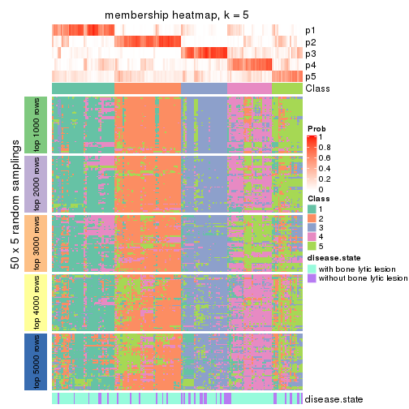</p>

</div>
<div id='tab-SD-skmeans-membership-heatmap-5'>
<pre><code class="r">membership_heatmap(res, k = 6)
</code></pre>

<p></p>

</div>
</div>

As soon as we have had the classes for columns, we can look for signatures
which are significantly different between classes which can be candidate marks
for certain classes. Following are the heatmaps for signatures.


Signature heatmaps where rows are scaled:


<script>
$( function() {
	$( '#tabs-SD-skmeans-get-signatures' ).tabs();
} );
</script>
<div id='tabs-SD-skmeans-get-signatures'>
<ul>
<li><a href='#tab-SD-skmeans-get-signatures-1'>k = 2</a></li>
<li><a href='#tab-SD-skmeans-get-signatures-2'>k = 3</a></li>
<li><a href='#tab-SD-skmeans-get-signatures-3'>k = 4</a></li>
<li><a href='#tab-SD-skmeans-get-signatures-4'>k = 5</a></li>
<li><a href='#tab-SD-skmeans-get-signatures-5'>k = 6</a></li>
</ul>
<div id='tab-SD-skmeans-get-signatures-1'>
<pre><code class="r">get_signatures(res, k = 2)
</code></pre>

<p></p>

</div>
<div id='tab-SD-skmeans-get-signatures-2'>
<pre><code class="r">get_signatures(res, k = 3)
</code></pre>

<p></p>

</div>
<div id='tab-SD-skmeans-get-signatures-3'>
<pre><code class="r">get_signatures(res, k = 4)
</code></pre>

<p></p>

</div>
<div id='tab-SD-skmeans-get-signatures-4'>
<pre><code class="r">get_signatures(res, k = 5)
</code></pre>

<p></p>

</div>
<div id='tab-SD-skmeans-get-signatures-5'>
<pre><code class="r">get_signatures(res, k = 6)
</code></pre>

<p></p>

</div>
</div>


Signature heatmaps where rows are not scaled:


<script>
$( function() {
	$( '#tabs-SD-skmeans-get-signatures-no-scale' ).tabs();
} );
</script>
<div id='tabs-SD-skmeans-get-signatures-no-scale'>
<ul>
<li><a href='#tab-SD-skmeans-get-signatures-no-scale-1'>k = 2</a></li>
<li><a href='#tab-SD-skmeans-get-signatures-no-scale-2'>k = 3</a></li>
<li><a href='#tab-SD-skmeans-get-signatures-no-scale-3'>k = 4</a></li>
<li><a href='#tab-SD-skmeans-get-signatures-no-scale-4'>k = 5</a></li>
<li><a href='#tab-SD-skmeans-get-signatures-no-scale-5'>k = 6</a></li>
</ul>
<div id='tab-SD-skmeans-get-signatures-no-scale-1'>
<pre><code class="r">get_signatures(res, k = 2, scale_rows = FALSE)
</code></pre>

<p></p>

</div>
<div id='tab-SD-skmeans-get-signatures-no-scale-2'>
<pre><code class="r">get_signatures(res, k = 3, scale_rows = FALSE)
</code></pre>

<p></p>

</div>
<div id='tab-SD-skmeans-get-signatures-no-scale-3'>
<pre><code class="r">get_signatures(res, k = 4, scale_rows = FALSE)
</code></pre>

<p></p>

</div>
<div id='tab-SD-skmeans-get-signatures-no-scale-4'>
<pre><code class="r">get_signatures(res, k = 5, scale_rows = FALSE)
</code></pre>

<p></p>

</div>
<div id='tab-SD-skmeans-get-signatures-no-scale-5'>
<pre><code class="r">get_signatures(res, k = 6, scale_rows = FALSE)
</code></pre>

<p></p>

</div>
</div>


Compare the overlap of signatures from different k:

```r
compare_signatures(res)
```


`get_signature()` returns a data frame invisibly. TO get the list of signatures, the function
call should be assigned to a variable explicitly. In following code, if `plot` argument is set
to `FALSE`, no heatmap is plotted while only the differential analysis is performed.

```r
# code only for demonstration
tb = get_signature(res, k = ..., plot = FALSE)
```

An example of the output of `tb` is:

```
#>   which_row         fdr    mean_1    mean_2 scaled_mean_1 scaled_mean_2 km
#> 1        38 0.042760348  8.373488  9.131774    -0.5533452     0.5164555  1
#> 2        40 0.018707592  7.106213  8.469186    -0.6173731     0.5762149  1
#> 3        55 0.019134737 10.221463 11.207825    -0.6159697     0.5749050  1
#> 4        59 0.006059896  5.921854  7.869574    -0.6899429     0.6439467  1
#> 5        60 0.018055526  8.928898 10.211722    -0.6204761     0.5791110  1
#> 6        98 0.009384629 15.714769 14.887706     0.6635654    -0.6193277  2
...
```

The columns in `tb` are:

1. `which_row`: row indices corresponding to the input matrix.
2. `fdr`: FDR for the differential test. 
3. `mean_x`: The mean value in group x.
4. `scaled_mean_x`: The mean value in group x after rows are scaled.
5. `km`: Row groups if k-means clustering is applied to rows.


UMAP plot which shows how samples are separated.


<script>
$( function() {
	$( '#tabs-SD-skmeans-dimension-reduction' ).tabs();
} );
</script>
<div id='tabs-SD-skmeans-dimension-reduction'>
<ul>
<li><a href='#tab-SD-skmeans-dimension-reduction-1'>k = 2</a></li>
<li><a href='#tab-SD-skmeans-dimension-reduction-2'>k = 3</a></li>
<li><a href='#tab-SD-skmeans-dimension-reduction-3'>k = 4</a></li>
<li><a href='#tab-SD-skmeans-dimension-reduction-4'>k = 5</a></li>
<li><a href='#tab-SD-skmeans-dimension-reduction-5'>k = 6</a></li>
</ul>
<div id='tab-SD-skmeans-dimension-reduction-1'>
<pre><code class="r">dimension_reduction(res, k = 2, method = &quot;UMAP&quot;)
</code></pre>

<p></p>

</div>
<div id='tab-SD-skmeans-dimension-reduction-2'>
<pre><code class="r">dimension_reduction(res, k = 3, method = &quot;UMAP&quot;)
</code></pre>

<p></p>

</div>
<div id='tab-SD-skmeans-dimension-reduction-3'>
<pre><code class="r">dimension_reduction(res, k = 4, method = &quot;UMAP&quot;)
</code></pre>

<p></p>

</div>
<div id='tab-SD-skmeans-dimension-reduction-4'>
<pre><code class="r">dimension_reduction(res, k = 5, method = &quot;UMAP&quot;)
</code></pre>

<p></p>

</div>
<div id='tab-SD-skmeans-dimension-reduction-5'>
<pre><code class="r">dimension_reduction(res, k = 6, method = &quot;UMAP&quot;)
</code></pre>

<p></p>

</div>
</div>


Following heatmap shows how subgroups are split when increasing `k`:

```r
collect_classes(res)
```


Test correlation between subgroups and known annotations. If the known
annotation is numeric, one-way ANOVA test is applied, and if the known
annotation is discrete, chi-squared contingency table test is applied.

```r
test_to_known_factors(res)
```

```
#>              n disease.state(p) k
#> SD:skmeans 163          0.06565 2
#> SD:skmeans 147          0.13155 3
#> SD:skmeans 116          0.01986 4
#> SD:skmeans 105          0.00584 5
#> SD:skmeans  62          0.05659 6
```


If matrix rows can be associated to genes, consider to use `GO_Enrichment(res,
...)` to perform function enrichment for the signature genes.


 

---------------------------------------------------


### SD:pam


The object with results only for a single top-value method and a single partition method 
can be extracted as:

```r
res = res_list["SD", "pam"]
# you can also extract it by
# res = res_list["SD:pam"]
```

A summary of `res` and all the functions that can be applied to it:

```r
res
```

```
#> A 'ConsensusPartition' object with k = 2, 3, 4, 5, 6.
#>   On a matrix with 11993 rows and 173 columns.
#>   Top rows (1000, 2000, 3000, 4000, 5000) are extracted by 'SD' method.
#>   Subgroups are detected by 'pam' method.
#>   Performed in total 1250 partitions by row resampling.
#>   Best k for subgroups seems to be 3.
#> 
#> Following methods can be applied to this 'ConsensusPartition' object:
#>  [1] "cola_report"             "collect_classes"         "collect_plots"          
#>  [4] "collect_stats"           "colnames"                "compare_signatures"     
#>  [7] "consensus_heatmap"       "dimension_reduction"     "functional_enrichment"  
#> [10] "get_anno_col"            "get_anno"                "get_classes"            
#> [13] "get_consensus"           "get_matrix"              "get_membership"         
#> [16] "get_param"               "get_signatures"          "get_stats"              
#> [19] "is_best_k"               "is_stable_k"             "membership_heatmap"     
#> [22] "ncol"                    "nrow"                    "plot_ecdf"              
#> [25] "rownames"                "select_partition_number" "show"                   
#> [28] "suggest_best_k"          "test_to_known_factors"
```

`collect_plots()` function collects all the plots made from `res` for all `k` (number of partitions)
into one single page to provide an easy and fast comparison between different `k`.

```r
collect_plots(res)
```


The plots are:

- The first row: a plot of the ECDF (Empirical cumulative distribution
  function) curves of the consensus matrix for each `k` and the heatmap of
  predicted classes for each `k`.
- The second row: heatmaps of the consensus matrix for each `k`.
- The third row: heatmaps of the membership matrix for each `k`.
- The fouth row: heatmaps of the signatures for each `k`.

All the plots in panels can be made by individual functions and they are
plotted later in this section.

`select_partition_number()` produces several plots showing different
statistics for choosing "optimized" `k`. There are following statistics:

- ECDF curves of the consensus matrix for each `k`;
- 1-PAC. [The PAC
  score](https://en.wikipedia.org/wiki/Consensus_clustering#Over-interpretation_potential_of_consensus_clustering)
  measures the proportion of the ambiguous subgrouping.
- Mean silhouette score.
- Concordance. The mean probability of fiting the consensus class ids in all
  partitions.
- Area increased. Denote $A_k$ as the area under the ECDF curve for current
  `k`, the area increased is defined as $A_k - A_{k-1}$.
- Rand index. The percent of pairs of samples that are both in a same cluster
  or both are not in a same cluster in the partition of k and k-1.
- Jaccard index. The ratio of pairs of samples are both in a same cluster in
  the partition of k and k-1 and the pairs of samples are both in a same
  cluster in the partition k or k-1.

The detailed explanations of these statistics can be found in [the cola
vignette](http://bioconductor.org/packages/devel/bioc/vignettes/cola/inst/doc/cola.html#toc_13).

Generally speaking, lower PAC score, higher mean silhouette score or higher
concordance corresponds to better partition. Rand index and Jaccard index
measure how similar the current partition is compared to partition with `k-1`.
If they are too similar, we won't accept `k` is better than `k-1`.

```r
select_partition_number(res)
```


The numeric values for all these statistics can be obtained by `get_stats()`.

```r
get_stats(res)
```

```
#>   k 1-PAC mean_silhouette concordance area_increased  Rand Jaccard
#> 2 2 0.152           0.641       0.801         0.4715 0.523   0.523
#> 3 3 0.439           0.740       0.851         0.3847 0.704   0.493
#> 4 4 0.506           0.617       0.786         0.1153 0.892   0.704
#> 5 5 0.547           0.542       0.752         0.0642 0.898   0.658
#> 6 6 0.592           0.520       0.733         0.0397 0.939   0.740
```

`suggest_best_k()` suggests the best $k$ based on these statistics. The rules are as follows:

- All $k$ with Jaccard index larger than 0.95 are removed because the increase of
  the partition number does not provides enough extra information. If all $k$ are removed,
  the best $k$ is assigned by `NA`.
- For $k$ with 1-PAC larger than 0.9, the maximal $k$ is taken as the "best k". Other $k$ is called "optional k".
- If it does not fit the second rule. The $k$ with the highest vote of highest
  1-PAC, mean silhouette and concordance is taken as the "best k".

```r
suggest_best_k(res)
```

```
#> [1] 3
```


Following shows the table of the partitions (You need to click the **show/hide
code output** link to see it). The membership matrix (columns with name `p*`)
is inferred by
[`clue::cl_consensus()`](https://www.rdocumentation.org/link/cl_consensus?package=clue)
function with the `SE` method. Basically the value in the membership matrix
represents the probability to belong to a certain group. The finall class
label for an item is determined with the group with highest probability it
belongs to.

In `get_classes()` function, the entropy is calculated from the membership
matrix and the silhouette score is calculated from the consensus matrix.


<script>
$( function() {
	$( '#tabs-SD-pam-get-classes' ).tabs();
} );
</script>
<div id='tabs-SD-pam-get-classes'>
<ul>
<li><a href='#tab-SD-pam-get-classes-1'>k = 2</a></li>
<li><a href='#tab-SD-pam-get-classes-2'>k = 3</a></li>
<li><a href='#tab-SD-pam-get-classes-3'>k = 4</a></li>
<li><a href='#tab-SD-pam-get-classes-4'>k = 5</a></li>
<li><a href='#tab-SD-pam-get-classes-5'>k = 6</a></li>
</ul>

<div id='tab-SD-pam-get-classes-1'>
<p><a id='tab-SD-pam-get-classes-1-a' style='color:#0366d6' href='#'>show/hide code output</a></p>
<pre><code class="r">cbind(get_classes(res, k = 2), get_membership(res, k = 2))
</code></pre>

<pre><code>#&gt;          class entropy silhouette    p1    p2
#&gt; GSM11437     1  0.7056     0.6769 0.808 0.192
#&gt; GSM11438     2  0.5294     0.7726 0.120 0.880
#&gt; GSM11439     2  0.9209     0.7043 0.336 0.664
#&gt; GSM11440     1  0.8327     0.6148 0.736 0.264
#&gt; GSM11441     1  0.9944     0.1671 0.544 0.456
#&gt; GSM11442     2  0.2778     0.7289 0.048 0.952
#&gt; GSM11443     2  0.4298     0.7716 0.088 0.912
#&gt; GSM11444     1  0.5519     0.7205 0.872 0.128
#&gt; GSM11445     1  0.7376     0.6847 0.792 0.208
#&gt; GSM11446     1  0.6623     0.6867 0.828 0.172
#&gt; GSM11447     2  0.9983     0.4688 0.476 0.524
#&gt; GSM11448     2  0.8608     0.7486 0.284 0.716
#&gt; GSM11449     1  0.6623     0.6807 0.828 0.172
#&gt; GSM11450     1  0.6801     0.6132 0.820 0.180
#&gt; GSM11451     2  0.6438     0.7691 0.164 0.836
#&gt; GSM11452     2  0.7056     0.7662 0.192 0.808
#&gt; GSM11453     1  0.9944    -0.2778 0.544 0.456
#&gt; GSM11454     1  0.8555     0.6699 0.720 0.280
#&gt; GSM11455     2  0.1184     0.7366 0.016 0.984
#&gt; GSM11456     2  0.8713     0.7270 0.292 0.708
#&gt; GSM11457     2  0.5842     0.7791 0.140 0.860
#&gt; GSM11458     1  0.8386     0.6777 0.732 0.268
#&gt; GSM11459     1  0.8386     0.6760 0.732 0.268
#&gt; GSM11460     1  0.8555     0.6699 0.720 0.280
#&gt; GSM11461     1  0.9129     0.4785 0.672 0.328
#&gt; GSM11462     1  0.0000     0.7303 1.000 0.000
#&gt; GSM11463     2  0.5946     0.7761 0.144 0.856
#&gt; GSM11464     1  0.5946     0.6516 0.856 0.144
#&gt; GSM11465     2  0.7139     0.7819 0.196 0.804
#&gt; GSM11466     2  0.8955     0.7304 0.312 0.688
#&gt; GSM11467     1  0.5946     0.6690 0.856 0.144
#&gt; GSM11468     1  0.6343     0.7085 0.840 0.160
#&gt; GSM11469     1  0.5408     0.7088 0.876 0.124
#&gt; GSM11470     1  0.2236     0.7235 0.964 0.036
#&gt; GSM11471     1  0.9323     0.1518 0.652 0.348
#&gt; GSM11472     2  0.9998     0.2573 0.492 0.508
#&gt; GSM11473     2  0.8443     0.7512 0.272 0.728
#&gt; GSM11474     2  0.2603     0.7565 0.044 0.956
#&gt; GSM11475     1  0.7219     0.7178 0.800 0.200
#&gt; GSM11476     2  0.6343     0.7020 0.160 0.840
#&gt; GSM11477     2  0.8443     0.7357 0.272 0.728
#&gt; GSM11478     2  0.1184     0.7364 0.016 0.984
#&gt; GSM11479     2  0.6048     0.7105 0.148 0.852
#&gt; GSM11480     2  0.0938     0.7395 0.012 0.988
#&gt; GSM11481     1  0.2043     0.7316 0.968 0.032
#&gt; GSM11482     2  0.4022     0.7435 0.080 0.920
#&gt; GSM11483     2  0.0938     0.7428 0.012 0.988
#&gt; GSM11484     2  0.8144     0.6069 0.252 0.748
#&gt; GSM11485     2  0.6531     0.6951 0.168 0.832
#&gt; GSM11486     2  0.7950     0.7642 0.240 0.760
#&gt; GSM11487     1  0.7745     0.5542 0.772 0.228
#&gt; GSM11488     2  0.9460     0.3129 0.364 0.636
#&gt; GSM11489     2  0.8813     0.7184 0.300 0.700
#&gt; GSM11490     2  0.9815     0.6051 0.420 0.580
#&gt; GSM11491     2  1.0000     0.0985 0.500 0.500
#&gt; GSM11492     1  1.0000     0.2122 0.504 0.496
#&gt; GSM11493     2  0.3879     0.7192 0.076 0.924
#&gt; GSM11494     2  0.9170     0.2571 0.332 0.668
#&gt; GSM11495     2  0.8443     0.7134 0.272 0.728
#&gt; GSM11496     2  0.9044     0.7140 0.320 0.680
#&gt; GSM11497     2  0.8327     0.6988 0.264 0.736
#&gt; GSM11498     2  0.8386     0.7532 0.268 0.732
#&gt; GSM11499     2  0.3879     0.7396 0.076 0.924
#&gt; GSM11500     2  0.2043     0.7327 0.032 0.968
#&gt; GSM11501     2  0.7219     0.6731 0.200 0.800
#&gt; GSM11502     2  0.6148     0.7736 0.152 0.848
#&gt; GSM11503     2  0.6343     0.7780 0.160 0.840
#&gt; GSM11504     1  0.6801     0.7152 0.820 0.180
#&gt; GSM11505     2  0.5946     0.7743 0.144 0.856
#&gt; GSM11506     2  0.1843     0.7312 0.028 0.972
#&gt; GSM11507     2  0.1633     0.7513 0.024 0.976
#&gt; GSM11508     1  0.7528     0.7046 0.784 0.216
#&gt; GSM11509     1  0.9896    -0.2734 0.560 0.440
#&gt; GSM11510     2  0.9087     0.7098 0.324 0.676
#&gt; GSM11511     1  0.2778     0.7246 0.952 0.048
#&gt; GSM11512     2  0.9358     0.3421 0.352 0.648
#&gt; GSM11513     1  0.8267     0.6818 0.740 0.260
#&gt; GSM11514     2  0.6623     0.7753 0.172 0.828
#&gt; GSM11515     2  0.9170     0.1486 0.332 0.668
#&gt; GSM11516     2  0.8016     0.7636 0.244 0.756
#&gt; GSM11517     1  0.1184     0.7327 0.984 0.016
#&gt; GSM11518     2  0.7299     0.7700 0.204 0.796
#&gt; GSM11519     1  0.9248     0.2379 0.660 0.340
#&gt; GSM11520     1  0.0938     0.7284 0.988 0.012
#&gt; GSM11521     2  0.4161     0.7360 0.084 0.916
#&gt; GSM11522     1  0.2423     0.7314 0.960 0.040
#&gt; GSM11523     1  0.2236     0.7230 0.964 0.036
#&gt; GSM11524     1  0.6048     0.7135 0.852 0.148
#&gt; GSM11525     2  0.5737     0.7746 0.136 0.864
#&gt; GSM11526     2  0.7453     0.5755 0.212 0.788
#&gt; GSM11527     2  0.2043     0.7349 0.032 0.968
#&gt; GSM11528     2  0.5842     0.7827 0.140 0.860
#&gt; GSM11529     2  0.6887     0.7671 0.184 0.816
#&gt; GSM11530     1  0.7950     0.6266 0.760 0.240
#&gt; GSM11531     2  0.6048     0.7778 0.148 0.852
#&gt; GSM11532     1  0.6531     0.7135 0.832 0.168
#&gt; GSM11533     2  0.6623     0.7679 0.172 0.828
#&gt; GSM11534     1  0.9963    -0.2514 0.536 0.464
#&gt; GSM11535     2  0.8327     0.7510 0.264 0.736
#&gt; GSM11536     2  0.7139     0.6737 0.196 0.804
#&gt; GSM11537     2  0.8327     0.7405 0.264 0.736
#&gt; GSM11538     2  0.9580     0.1188 0.380 0.620
#&gt; GSM11539     2  0.5408     0.7799 0.124 0.876
#&gt; GSM11540     2  0.0672     0.7386 0.008 0.992
#&gt; GSM11541     1  0.6343     0.7159 0.840 0.160
#&gt; GSM11542     2  0.8267     0.7526 0.260 0.740
#&gt; GSM11543     2  0.7139     0.7635 0.196 0.804
#&gt; GSM11544     1  0.8661     0.4821 0.712 0.288
#&gt; GSM11545     2  0.8955     0.7173 0.312 0.688
#&gt; GSM11546     2  0.1843     0.7304 0.028 0.972
#&gt; GSM11547     2  0.6048     0.7767 0.148 0.852
#&gt; GSM11548     2  0.9209     0.1871 0.336 0.664
#&gt; GSM11549     1  0.5946     0.7236 0.856 0.144
#&gt; GSM11550     1  0.7815     0.7160 0.768 0.232
#&gt; GSM11551     2  0.4298     0.7051 0.088 0.912
#&gt; GSM11552     1  0.8443     0.6756 0.728 0.272
#&gt; GSM11553     2  0.5737     0.7773 0.136 0.864
#&gt; GSM11554     2  0.6343     0.7823 0.160 0.840
#&gt; GSM11555     2  0.9996     0.0759 0.488 0.512
#&gt; GSM11556     1  0.6148     0.7232 0.848 0.152
#&gt; GSM11557     2  0.5842     0.7735 0.140 0.860
#&gt; GSM11558     2  0.0672     0.7409 0.008 0.992
#&gt; GSM11559     2  0.6438     0.7813 0.164 0.836
#&gt; GSM11560     1  0.3733     0.7407 0.928 0.072
#&gt; GSM11561     2  0.0672     0.7386 0.008 0.992
#&gt; GSM11562     2  0.8763     0.7223 0.296 0.704
#&gt; GSM11563     2  0.8955     0.7130 0.312 0.688
#&gt; GSM11564     2  0.6712     0.7879 0.176 0.824
#&gt; GSM11565     1  0.9710    -0.0464 0.600 0.400
#&gt; GSM11566     2  0.0000     0.7418 0.000 1.000
#&gt; GSM11567     2  0.3584     0.7202 0.068 0.932
#&gt; GSM11568     2  0.7883     0.7689 0.236 0.764
#&gt; GSM11569     2  0.5842     0.7784 0.140 0.860
#&gt; GSM11570     1  0.5519     0.7166 0.872 0.128
#&gt; GSM11571     1  0.7883     0.6519 0.764 0.236
#&gt; GSM11572     2  0.9358     0.6948 0.352 0.648
#&gt; GSM11573     2  0.9044     0.7104 0.320 0.680
#&gt; GSM11574     2  0.8207     0.7569 0.256 0.744
#&gt; GSM11575     2  0.6343     0.7695 0.160 0.840
#&gt; GSM11576     1  0.6623     0.6824 0.828 0.172
#&gt; GSM11577     2  0.9427     0.5764 0.360 0.640
#&gt; GSM11578     2  0.7056     0.7721 0.192 0.808
#&gt; GSM11579     2  0.2603     0.7377 0.044 0.956
#&gt; GSM11580     2  0.6712     0.7750 0.176 0.824
#&gt; GSM11581     1  0.8763     0.6214 0.704 0.296
#&gt; GSM11582     1  0.7745     0.7028 0.772 0.228
#&gt; GSM11583     1  0.8713     0.6648 0.708 0.292
#&gt; GSM11584     2  0.7219     0.6809 0.200 0.800
#&gt; GSM11585     2  0.6048     0.7736 0.148 0.852
#&gt; GSM11586     1  0.9323     0.1540 0.652 0.348
#&gt; GSM11587     1  0.0938     0.7284 0.988 0.012
#&gt; GSM11588     2  0.9580     0.6572 0.380 0.620
#&gt; GSM11589     2  0.9896    -0.0325 0.440 0.560
#&gt; GSM11590     1  0.6887     0.6056 0.816 0.184
#&gt; GSM11591     2  0.6438     0.7694 0.164 0.836
#&gt; GSM11592     1  0.8813     0.3077 0.700 0.300
#&gt; GSM11593     1  0.4022     0.7113 0.920 0.080
#&gt; GSM11594     2  0.9922     0.3478 0.448 0.552
#&gt; GSM11595     2  0.9087     0.7087 0.324 0.676
#&gt; GSM11596     2  0.2603     0.7450 0.044 0.956
#&gt; GSM11597     2  0.9000     0.6465 0.316 0.684
#&gt; GSM11598     1  0.8016     0.4982 0.756 0.244
#&gt; GSM11599     1  0.8608     0.6677 0.716 0.284
#&gt; GSM11600     1  0.6623     0.7110 0.828 0.172
#&gt; GSM11601     2  0.8713     0.7274 0.292 0.708
#&gt; GSM11602     1  0.0938     0.7284 0.988 0.012
#&gt; GSM11603     1  0.0938     0.7284 0.988 0.012
#&gt; GSM11604     1  0.0000     0.7303 1.000 0.000
#&gt; GSM11605     1  0.6247     0.7194 0.844 0.156
#&gt; GSM11606     2  0.6623     0.7725 0.172 0.828
#&gt; GSM11607     1  0.8443     0.4662 0.728 0.272
#&gt; GSM11608     1  0.3879     0.7369 0.924 0.076
#&gt; GSM11609     2  0.7745     0.6540 0.228 0.772
</code></pre>

<script>
$('#tab-SD-pam-get-classes-1-a').parent().next().next().hide();
$('#tab-SD-pam-get-classes-1-a').click(function(){
  $('#tab-SD-pam-get-classes-1-a').parent().next().next().toggle();
  return(false);
});
</script>
</div>

<div id='tab-SD-pam-get-classes-2'>
<p><a id='tab-SD-pam-get-classes-2-a' style='color:#0366d6' href='#'>show/hide code output</a></p>
<pre><code class="r">cbind(get_classes(res, k = 3), get_membership(res, k = 3))
</code></pre>

<pre><code>#&gt;          class entropy silhouette    p1    p2    p3
#&gt; GSM11437     1  0.5657     0.7754 0.808 0.104 0.088
#&gt; GSM11438     1  0.5690     0.6952 0.708 0.288 0.004
#&gt; GSM11439     1  0.0237     0.7917 0.996 0.000 0.004
#&gt; GSM11440     3  0.3192     0.8050 0.000 0.112 0.888
#&gt; GSM11441     1  0.4473     0.6865 0.828 0.008 0.164
#&gt; GSM11442     2  0.1964     0.8256 0.000 0.944 0.056
#&gt; GSM11443     2  0.0000     0.8323 0.000 1.000 0.000
#&gt; GSM11444     3  0.1015     0.8756 0.012 0.008 0.980
#&gt; GSM11445     3  0.0237     0.8757 0.004 0.000 0.996
#&gt; GSM11446     3  0.4953     0.7264 0.176 0.016 0.808
#&gt; GSM11447     1  0.4165     0.7779 0.876 0.048 0.076
#&gt; GSM11448     1  0.4978     0.7236 0.780 0.216 0.004
#&gt; GSM11449     3  0.5859     0.4249 0.344 0.000 0.656
#&gt; GSM11450     1  0.0237     0.7948 0.996 0.004 0.000
#&gt; GSM11451     1  0.5378     0.7407 0.756 0.236 0.008
#&gt; GSM11452     1  0.4934     0.7818 0.820 0.156 0.024
#&gt; GSM11453     1  0.1411     0.7955 0.964 0.000 0.036
#&gt; GSM11454     3  0.0237     0.8759 0.000 0.004 0.996
#&gt; GSM11455     2  0.0000     0.8323 0.000 1.000 0.000
#&gt; GSM11456     2  0.4682     0.7795 0.192 0.804 0.004
#&gt; GSM11457     2  0.0475     0.8329 0.004 0.992 0.004
#&gt; GSM11458     3  0.0237     0.8759 0.000 0.004 0.996
#&gt; GSM11459     3  0.0424     0.8758 0.000 0.008 0.992
#&gt; GSM11460     3  0.4369     0.8199 0.040 0.096 0.864
#&gt; GSM11461     1  0.6109     0.7639 0.780 0.140 0.080
#&gt; GSM11462     3  0.0237     0.8757 0.004 0.000 0.996
#&gt; GSM11463     2  0.0424     0.8320 0.008 0.992 0.000
#&gt; GSM11464     1  0.4291     0.6804 0.820 0.000 0.180
#&gt; GSM11465     2  0.2187     0.8354 0.028 0.948 0.024
#&gt; GSM11466     2  0.6677     0.7624 0.180 0.740 0.080
#&gt; GSM11467     1  0.1999     0.8001 0.952 0.012 0.036
#&gt; GSM11468     3  0.0000     0.8764 0.000 0.000 1.000
#&gt; GSM11469     3  0.0237     0.8759 0.000 0.004 0.996
#&gt; GSM11470     1  0.0424     0.7941 0.992 0.000 0.008
#&gt; GSM11471     1  0.3752     0.7200 0.856 0.000 0.144
#&gt; GSM11472     1  0.1877     0.8028 0.956 0.032 0.012
#&gt; GSM11473     2  0.5517     0.7120 0.268 0.728 0.004
#&gt; GSM11474     2  0.0237     0.8329 0.000 0.996 0.004
#&gt; GSM11475     3  0.0237     0.8766 0.000 0.004 0.996
#&gt; GSM11476     2  0.3715     0.8076 0.128 0.868 0.004
#&gt; GSM11477     2  0.3752     0.8050 0.144 0.856 0.000
#&gt; GSM11478     2  0.0000     0.8323 0.000 1.000 0.000
#&gt; GSM11479     2  0.3784     0.8038 0.132 0.864 0.004
#&gt; GSM11480     2  0.0000     0.8323 0.000 1.000 0.000
#&gt; GSM11481     3  0.0000     0.8764 0.000 0.000 1.000
#&gt; GSM11482     2  0.3669     0.8298 0.064 0.896 0.040
#&gt; GSM11483     2  0.0661     0.8345 0.008 0.988 0.004
#&gt; GSM11484     2  0.6981     0.7055 0.228 0.704 0.068
#&gt; GSM11485     2  0.4293     0.7885 0.164 0.832 0.004
#&gt; GSM11486     1  0.6082     0.6408 0.692 0.296 0.012
#&gt; GSM11487     1  0.0237     0.7917 0.996 0.000 0.004
#&gt; GSM11488     2  0.8072     0.6384 0.144 0.648 0.208
#&gt; GSM11489     2  0.4233     0.7904 0.160 0.836 0.004
#&gt; GSM11490     1  0.1877     0.7957 0.956 0.012 0.032
#&gt; GSM11491     1  0.5695     0.7725 0.804 0.120 0.076
#&gt; GSM11492     3  0.9707     0.1031 0.228 0.340 0.432
#&gt; GSM11493     2  0.2590     0.8212 0.004 0.924 0.072
#&gt; GSM11494     1  0.6245     0.7770 0.760 0.180 0.060
#&gt; GSM11495     2  0.5756     0.7527 0.208 0.764 0.028
#&gt; GSM11496     1  0.6513    -0.1986 0.520 0.476 0.004
#&gt; GSM11497     2  0.3826     0.7853 0.008 0.868 0.124
#&gt; GSM11498     2  0.4733     0.7843 0.196 0.800 0.004
#&gt; GSM11499     2  0.2446     0.8341 0.052 0.936 0.012
#&gt; GSM11500     2  0.0000     0.8323 0.000 1.000 0.000
#&gt; GSM11501     2  0.4883     0.7605 0.208 0.788 0.004
#&gt; GSM11502     2  0.5497     0.5247 0.292 0.708 0.000
#&gt; GSM11503     2  0.3028     0.8214 0.048 0.920 0.032
#&gt; GSM11504     3  0.3031     0.8584 0.076 0.012 0.912
#&gt; GSM11505     2  0.0237     0.8321 0.004 0.996 0.000
#&gt; GSM11506     2  0.0000     0.8323 0.000 1.000 0.000
#&gt; GSM11507     2  0.0237     0.8332 0.004 0.996 0.000
#&gt; GSM11508     3  0.0237     0.8759 0.000 0.004 0.996
#&gt; GSM11509     1  0.8311     0.5494 0.628 0.156 0.216
#&gt; GSM11510     2  0.5109     0.7590 0.212 0.780 0.008
#&gt; GSM11511     1  0.5216     0.5466 0.740 0.000 0.260
#&gt; GSM11512     2  0.8748     0.5308 0.172 0.584 0.244
#&gt; GSM11513     3  0.0424     0.8758 0.000 0.008 0.992
#&gt; GSM11514     2  0.4068     0.8017 0.016 0.864 0.120
#&gt; GSM11515     2  0.6828     0.5228 0.032 0.656 0.312
#&gt; GSM11516     1  0.3459     0.8038 0.892 0.096 0.012
#&gt; GSM11517     3  0.0000     0.8764 0.000 0.000 1.000
#&gt; GSM11518     2  0.6647     0.2074 0.396 0.592 0.012
#&gt; GSM11519     1  0.1964     0.7902 0.944 0.000 0.056
#&gt; GSM11520     3  0.4702     0.7775 0.212 0.000 0.788
#&gt; GSM11521     2  0.2066     0.8336 0.060 0.940 0.000
#&gt; GSM11522     3  0.1781     0.8723 0.020 0.020 0.960
#&gt; GSM11523     1  0.5621     0.5373 0.692 0.000 0.308
#&gt; GSM11524     3  0.0000     0.8764 0.000 0.000 1.000
#&gt; GSM11525     2  0.0237     0.8321 0.004 0.996 0.000
#&gt; GSM11526     1  0.9176     0.4296 0.496 0.344 0.160
#&gt; GSM11527     2  0.0000     0.8323 0.000 1.000 0.000
#&gt; GSM11528     2  0.1989     0.8337 0.048 0.948 0.004
#&gt; GSM11529     1  0.4733     0.7751 0.800 0.196 0.004
#&gt; GSM11530     3  0.6161     0.5234 0.288 0.016 0.696
#&gt; GSM11531     2  0.3193     0.7880 0.100 0.896 0.004
#&gt; GSM11532     3  0.4605     0.7663 0.204 0.000 0.796
#&gt; GSM11533     1  0.5406     0.7471 0.764 0.224 0.012
#&gt; GSM11534     2  0.8914     0.5333 0.280 0.556 0.164
#&gt; GSM11535     1  0.5621     0.5337 0.692 0.308 0.000
#&gt; GSM11536     2  0.4883     0.7605 0.208 0.788 0.004
#&gt; GSM11537     2  0.3619     0.8056 0.136 0.864 0.000
#&gt; GSM11538     2  0.8180     0.3267 0.076 0.532 0.392
#&gt; GSM11539     2  0.6225     0.0167 0.432 0.568 0.000
#&gt; GSM11540     2  0.0000     0.8323 0.000 1.000 0.000
#&gt; GSM11541     3  0.4178     0.8000 0.172 0.000 0.828
#&gt; GSM11542     2  0.3644     0.8086 0.124 0.872 0.004
#&gt; GSM11543     1  0.6301     0.7296 0.712 0.260 0.028
#&gt; GSM11544     1  0.1529     0.8048 0.960 0.040 0.000
#&gt; GSM11545     1  0.1832     0.8040 0.956 0.036 0.008
#&gt; GSM11546     2  0.0237     0.8327 0.000 0.996 0.004
#&gt; GSM11547     2  0.4346     0.6770 0.184 0.816 0.000
#&gt; GSM11548     2  0.6667     0.4504 0.016 0.616 0.368
#&gt; GSM11549     3  0.5363     0.6992 0.276 0.000 0.724
#&gt; GSM11550     1  0.5756     0.6443 0.764 0.028 0.208
#&gt; GSM11551     2  0.2496     0.8202 0.004 0.928 0.068
#&gt; GSM11552     3  0.0237     0.8759 0.000 0.004 0.996
#&gt; GSM11553     2  0.0424     0.8320 0.008 0.992 0.000
#&gt; GSM11554     2  0.1129     0.8352 0.020 0.976 0.004
#&gt; GSM11555     2  0.9213     0.4970 0.236 0.536 0.228
#&gt; GSM11556     3  0.4291     0.7983 0.180 0.000 0.820
#&gt; GSM11557     2  0.0424     0.8320 0.008 0.992 0.000
#&gt; GSM11558     2  0.0000     0.8323 0.000 1.000 0.000
#&gt; GSM11559     2  0.4629     0.7125 0.188 0.808 0.004
#&gt; GSM11560     3  0.1964     0.8634 0.056 0.000 0.944
#&gt; GSM11561     2  0.0000     0.8323 0.000 1.000 0.000
#&gt; GSM11562     2  0.6140     0.5136 0.404 0.596 0.000
#&gt; GSM11563     2  0.5244     0.7427 0.240 0.756 0.004
#&gt; GSM11564     2  0.4629     0.7525 0.188 0.808 0.004
#&gt; GSM11565     1  0.2066     0.7747 0.940 0.000 0.060
#&gt; GSM11566     2  0.0000     0.8323 0.000 1.000 0.000
#&gt; GSM11567     2  0.1989     0.8257 0.004 0.948 0.048
#&gt; GSM11568     1  0.5953     0.6530 0.708 0.280 0.012
#&gt; GSM11569     2  0.1643     0.8237 0.044 0.956 0.000
#&gt; GSM11570     3  0.0000     0.8764 0.000 0.000 1.000
#&gt; GSM11571     1  0.6313     0.7662 0.768 0.148 0.084
#&gt; GSM11572     1  0.7400     0.0310 0.552 0.412 0.036
#&gt; GSM11573     1  0.0747     0.7986 0.984 0.016 0.000
#&gt; GSM11574     1  0.3267     0.8029 0.884 0.116 0.000
#&gt; GSM11575     1  0.4974     0.7466 0.764 0.236 0.000
#&gt; GSM11576     1  0.5178     0.6451 0.744 0.000 0.256
#&gt; GSM11577     1  0.5346     0.7945 0.808 0.152 0.040
#&gt; GSM11578     1  0.4346     0.7732 0.816 0.184 0.000
#&gt; GSM11579     2  0.0592     0.8349 0.012 0.988 0.000
#&gt; GSM11580     2  0.6696     0.3470 0.348 0.632 0.020
#&gt; GSM11581     3  0.5875     0.7171 0.056 0.160 0.784
#&gt; GSM11582     3  0.1919     0.8698 0.020 0.024 0.956
#&gt; GSM11583     3  0.4164     0.7846 0.008 0.144 0.848
#&gt; GSM11584     2  0.6174     0.7682 0.168 0.768 0.064
#&gt; GSM11585     2  0.4810     0.7490 0.140 0.832 0.028
#&gt; GSM11586     1  0.5977     0.5516 0.728 0.020 0.252
#&gt; GSM11587     3  0.3116     0.8480 0.108 0.000 0.892
#&gt; GSM11588     1  0.0000     0.7924 1.000 0.000 0.000
#&gt; GSM11589     1  0.9083     0.5952 0.548 0.256 0.196
#&gt; GSM11590     1  0.2537     0.7826 0.920 0.000 0.080
#&gt; GSM11591     1  0.5098     0.7313 0.752 0.248 0.000
#&gt; GSM11592     1  0.5327     0.5382 0.728 0.000 0.272
#&gt; GSM11593     1  0.0000     0.7924 1.000 0.000 0.000
#&gt; GSM11594     1  0.3769     0.7993 0.880 0.104 0.016
#&gt; GSM11595     1  0.2772     0.7896 0.916 0.080 0.004
#&gt; GSM11596     2  0.5062     0.6842 0.184 0.800 0.016
#&gt; GSM11597     1  0.4677     0.7930 0.840 0.132 0.028
#&gt; GSM11598     1  0.0592     0.7914 0.988 0.000 0.012
#&gt; GSM11599     3  0.2356     0.8478 0.000 0.072 0.928
#&gt; GSM11600     3  0.4840     0.7996 0.168 0.016 0.816
#&gt; GSM11601     2  0.4465     0.7842 0.176 0.820 0.004
#&gt; GSM11602     3  0.4399     0.7875 0.188 0.000 0.812
#&gt; GSM11603     3  0.3192     0.8453 0.112 0.000 0.888
#&gt; GSM11604     3  0.4178     0.7597 0.172 0.000 0.828
#&gt; GSM11605     3  0.4861     0.7792 0.192 0.008 0.800
#&gt; GSM11606     1  0.5948     0.6093 0.640 0.360 0.000
#&gt; GSM11607     1  0.0237     0.7943 0.996 0.004 0.000
#&gt; GSM11608     3  0.0237     0.8767 0.004 0.000 0.996
#&gt; GSM11609     2  0.5660     0.7594 0.200 0.772 0.028
</code></pre>

<script>
$('#tab-SD-pam-get-classes-2-a').parent().next().next().hide();
$('#tab-SD-pam-get-classes-2-a').click(function(){
  $('#tab-SD-pam-get-classes-2-a').parent().next().next().toggle();
  return(false);
});
</script>
</div>

<div id='tab-SD-pam-get-classes-3'>
<p><a id='tab-SD-pam-get-classes-3-a' style='color:#0366d6' href='#'>show/hide code output</a></p>
<pre><code class="r">cbind(get_classes(res, k = 4), get_membership(res, k = 4))
</code></pre>

<pre><code>#&gt;          class entropy silhouette    p1    p2    p3    p4
#&gt; GSM11437     4  0.6737    0.32132 0.368 0.020 0.056 0.556
#&gt; GSM11438     1  0.4228    0.65388 0.760 0.232 0.000 0.008
#&gt; GSM11439     1  0.4500    0.59317 0.684 0.000 0.000 0.316
#&gt; GSM11440     3  0.4274    0.68025 0.000 0.108 0.820 0.072
#&gt; GSM11441     4  0.6924   -0.17912 0.412 0.008 0.084 0.496
#&gt; GSM11442     4  0.7001    0.38149 0.016 0.392 0.076 0.516
#&gt; GSM11443     2  0.0895    0.79060 0.020 0.976 0.000 0.004
#&gt; GSM11444     3  0.2452    0.77677 0.004 0.004 0.908 0.084
#&gt; GSM11445     3  0.0707    0.79181 0.000 0.000 0.980 0.020
#&gt; GSM11446     3  0.5241    0.65363 0.152 0.008 0.764 0.076
#&gt; GSM11447     4  0.3468    0.58077 0.056 0.012 0.052 0.880
#&gt; GSM11448     1  0.5352    0.64180 0.740 0.168 0.000 0.092
#&gt; GSM11449     3  0.4632    0.51456 0.308 0.000 0.688 0.004
#&gt; GSM11450     1  0.3105    0.72747 0.856 0.000 0.004 0.140
#&gt; GSM11451     1  0.3631    0.69998 0.824 0.168 0.004 0.004
#&gt; GSM11452     1  0.1575    0.74067 0.956 0.028 0.004 0.012
#&gt; GSM11453     1  0.1635    0.74335 0.948 0.000 0.008 0.044
#&gt; GSM11454     3  0.1940    0.77237 0.000 0.000 0.924 0.076
#&gt; GSM11455     2  0.0524    0.79081 0.004 0.988 0.000 0.008
#&gt; GSM11456     2  0.4855    0.62299 0.020 0.712 0.000 0.268
#&gt; GSM11457     2  0.0469    0.79143 0.012 0.988 0.000 0.000
#&gt; GSM11458     3  0.0336    0.79422 0.000 0.000 0.992 0.008
#&gt; GSM11459     3  0.1743    0.77912 0.000 0.004 0.940 0.056
#&gt; GSM11460     4  0.7913    0.35430 0.140 0.036 0.304 0.520
#&gt; GSM11461     1  0.4119    0.71226 0.836 0.112 0.044 0.008
#&gt; GSM11462     3  0.0000    0.79404 0.000 0.000 1.000 0.000
#&gt; GSM11463     2  0.0469    0.79189 0.012 0.988 0.000 0.000
#&gt; GSM11464     4  0.1174    0.57120 0.012 0.000 0.020 0.968
#&gt; GSM11465     2  0.1617    0.79147 0.008 0.956 0.024 0.012
#&gt; GSM11466     2  0.7075    0.60590 0.060 0.664 0.108 0.168
#&gt; GSM11467     1  0.4747    0.67270 0.736 0.004 0.016 0.244
#&gt; GSM11468     3  0.1474    0.77955 0.000 0.000 0.948 0.052
#&gt; GSM11469     3  0.0336    0.79429 0.000 0.000 0.992 0.008
#&gt; GSM11470     1  0.2408    0.72991 0.896 0.000 0.000 0.104
#&gt; GSM11471     1  0.5964    0.43191 0.536 0.000 0.040 0.424
#&gt; GSM11472     1  0.5157    0.59647 0.688 0.028 0.000 0.284
#&gt; GSM11473     2  0.6499    0.50771 0.112 0.612 0.000 0.276
#&gt; GSM11474     2  0.1004    0.79049 0.024 0.972 0.000 0.004
#&gt; GSM11475     3  0.1209    0.79129 0.000 0.004 0.964 0.032
#&gt; GSM11476     2  0.4819    0.43887 0.004 0.652 0.000 0.344
#&gt; GSM11477     2  0.3216    0.77345 0.044 0.880 0.000 0.076
#&gt; GSM11478     2  0.0895    0.78932 0.020 0.976 0.000 0.004
#&gt; GSM11479     2  0.2611    0.76802 0.008 0.896 0.000 0.096
#&gt; GSM11480     2  0.0657    0.78819 0.012 0.984 0.000 0.004
#&gt; GSM11481     3  0.0188    0.79433 0.000 0.000 0.996 0.004
#&gt; GSM11482     2  0.3781    0.76228 0.016 0.856 0.024 0.104
#&gt; GSM11483     2  0.1706    0.78908 0.016 0.948 0.000 0.036
#&gt; GSM11484     4  0.4172    0.58867 0.020 0.092 0.044 0.844
#&gt; GSM11485     2  0.3356    0.72457 0.000 0.824 0.000 0.176
#&gt; GSM11486     1  0.5881    0.58380 0.676 0.240 0.000 0.084
#&gt; GSM11487     1  0.2216    0.73829 0.908 0.000 0.000 0.092
#&gt; GSM11488     4  0.7760    0.54504 0.060 0.256 0.108 0.576
#&gt; GSM11489     2  0.4420    0.69038 0.012 0.776 0.008 0.204
#&gt; GSM11490     1  0.5252    0.47236 0.572 0.004 0.004 0.420
#&gt; GSM11491     1  0.0524    0.73890 0.988 0.004 0.008 0.000
#&gt; GSM11492     4  0.2553    0.55778 0.016 0.008 0.060 0.916
#&gt; GSM11493     4  0.6875    0.33549 0.016 0.420 0.064 0.500
#&gt; GSM11494     4  0.5485    0.59999 0.100 0.100 0.028 0.772
#&gt; GSM11495     4  0.2665    0.59127 0.008 0.088 0.004 0.900
#&gt; GSM11496     4  0.7775   -0.07446 0.240 0.380 0.000 0.380
#&gt; GSM11497     2  0.3996    0.75145 0.044 0.852 0.088 0.016
#&gt; GSM11498     2  0.5304    0.69155 0.148 0.748 0.000 0.104
#&gt; GSM11499     4  0.5545    0.43957 0.020 0.364 0.004 0.612
#&gt; GSM11500     2  0.0657    0.78819 0.012 0.984 0.000 0.004
#&gt; GSM11501     2  0.5231    0.46651 0.012 0.604 0.000 0.384
#&gt; GSM11502     2  0.4941    0.36761 0.436 0.564 0.000 0.000
#&gt; GSM11503     2  0.3522    0.77345 0.060 0.880 0.020 0.040
#&gt; GSM11504     4  0.4957    0.36528 0.004 0.004 0.336 0.656
#&gt; GSM11505     2  0.0895    0.78883 0.020 0.976 0.000 0.004
#&gt; GSM11506     2  0.2021    0.76821 0.012 0.932 0.000 0.056
#&gt; GSM11507     2  0.0000    0.78980 0.000 1.000 0.000 0.000
#&gt; GSM11508     3  0.0000    0.79404 0.000 0.000 1.000 0.000
#&gt; GSM11509     1  0.9297    0.09484 0.368 0.152 0.132 0.348
#&gt; GSM11510     4  0.3335    0.59126 0.016 0.128 0.000 0.856
#&gt; GSM11511     1  0.7145    0.37982 0.508 0.000 0.144 0.348
#&gt; GSM11512     4  0.4175    0.58977 0.016 0.056 0.084 0.844
#&gt; GSM11513     3  0.1042    0.79386 0.000 0.008 0.972 0.020
#&gt; GSM11514     2  0.4354    0.74287 0.084 0.824 0.088 0.004
#&gt; GSM11515     4  0.6838    0.51112 0.012 0.148 0.204 0.636
#&gt; GSM11516     1  0.4261    0.72578 0.820 0.068 0.000 0.112
#&gt; GSM11517     3  0.1576    0.78727 0.004 0.000 0.948 0.048
#&gt; GSM11518     2  0.6495    0.06101 0.436 0.492 0.000 0.072
#&gt; GSM11519     1  0.1543    0.74450 0.956 0.004 0.008 0.032
#&gt; GSM11520     3  0.6015    0.56974 0.080 0.000 0.652 0.268
#&gt; GSM11521     2  0.2861    0.77367 0.016 0.888 0.000 0.096
#&gt; GSM11522     3  0.3730    0.73804 0.004 0.016 0.836 0.144
#&gt; GSM11523     1  0.4399    0.58087 0.760 0.000 0.224 0.016
#&gt; GSM11524     4  0.4985    0.10041 0.000 0.000 0.468 0.532
#&gt; GSM11525     2  0.0188    0.79055 0.004 0.996 0.000 0.000
#&gt; GSM11526     4  0.6521    0.55954 0.128 0.060 0.100 0.712
#&gt; GSM11527     2  0.0779    0.78897 0.016 0.980 0.000 0.004
#&gt; GSM11528     2  0.1724    0.79060 0.020 0.948 0.000 0.032
#&gt; GSM11529     1  0.3597    0.71086 0.836 0.148 0.000 0.016
#&gt; GSM11530     3  0.4747    0.56695 0.244 0.016 0.736 0.004
#&gt; GSM11531     2  0.3390    0.74453 0.132 0.852 0.000 0.016
#&gt; GSM11532     3  0.5099    0.46342 0.008 0.000 0.612 0.380
#&gt; GSM11533     1  0.3289    0.71425 0.864 0.120 0.004 0.012
#&gt; GSM11534     2  0.7373    0.29714 0.028 0.500 0.084 0.388
#&gt; GSM11535     1  0.6194    0.48654 0.644 0.260 0.000 0.096
#&gt; GSM11536     2  0.5085    0.48647 0.008 0.616 0.000 0.376
#&gt; GSM11537     2  0.3013    0.77041 0.032 0.888 0.000 0.080
#&gt; GSM11538     2  0.8057    0.27251 0.076 0.532 0.296 0.096
#&gt; GSM11539     1  0.5296   -0.00828 0.496 0.496 0.000 0.008
#&gt; GSM11540     2  0.1545    0.79134 0.040 0.952 0.000 0.008
#&gt; GSM11541     4  0.3208    0.52683 0.004 0.000 0.148 0.848
#&gt; GSM11542     2  0.2401    0.76891 0.004 0.904 0.000 0.092
#&gt; GSM11543     4  0.8151    0.39290 0.292 0.164 0.040 0.504
#&gt; GSM11544     1  0.1022    0.74446 0.968 0.000 0.000 0.032
#&gt; GSM11545     1  0.1356    0.74631 0.960 0.008 0.000 0.032
#&gt; GSM11546     2  0.0000    0.78980 0.000 1.000 0.000 0.000
#&gt; GSM11547     2  0.3444    0.64402 0.184 0.816 0.000 0.000
#&gt; GSM11548     2  0.6544    0.40999 0.004 0.616 0.280 0.100
#&gt; GSM11549     3  0.5816    0.41335 0.036 0.000 0.572 0.392
#&gt; GSM11550     1  0.7369    0.34657 0.492 0.004 0.148 0.356
#&gt; GSM11551     2  0.4056    0.70394 0.004 0.840 0.096 0.060
#&gt; GSM11552     3  0.0000    0.79404 0.000 0.000 1.000 0.000
#&gt; GSM11553     2  0.1109    0.79104 0.028 0.968 0.000 0.004
#&gt; GSM11554     2  0.1284    0.79208 0.024 0.964 0.000 0.012
#&gt; GSM11555     2  0.7577    0.23882 0.016 0.476 0.128 0.380
#&gt; GSM11556     3  0.4936    0.58044 0.012 0.000 0.672 0.316
#&gt; GSM11557     2  0.0657    0.79195 0.012 0.984 0.000 0.004
#&gt; GSM11558     2  0.1109    0.79018 0.028 0.968 0.000 0.004
#&gt; GSM11559     2  0.4212    0.67195 0.216 0.772 0.000 0.012
#&gt; GSM11560     3  0.3583    0.70549 0.180 0.000 0.816 0.004
#&gt; GSM11561     2  0.1004    0.78989 0.024 0.972 0.000 0.004
#&gt; GSM11562     2  0.7271    0.41082 0.192 0.532 0.000 0.276
#&gt; GSM11563     2  0.5614    0.45301 0.020 0.592 0.004 0.384
#&gt; GSM11564     2  0.5478    0.59424 0.248 0.696 0.000 0.056
#&gt; GSM11565     1  0.5713    0.50905 0.604 0.000 0.036 0.360
#&gt; GSM11566     2  0.0524    0.79155 0.008 0.988 0.000 0.004
#&gt; GSM11567     2  0.2245    0.77763 0.020 0.932 0.040 0.008
#&gt; GSM11568     1  0.5358    0.60826 0.724 0.220 0.004 0.052
#&gt; GSM11569     2  0.1978    0.78555 0.068 0.928 0.000 0.004
#&gt; GSM11570     3  0.0188    0.79399 0.000 0.000 0.996 0.004
#&gt; GSM11571     1  0.5334    0.70557 0.784 0.116 0.056 0.044
#&gt; GSM11572     4  0.8031    0.02612 0.288 0.324 0.004 0.384
#&gt; GSM11573     1  0.1211    0.74608 0.960 0.000 0.000 0.040
#&gt; GSM11574     1  0.2313    0.74863 0.924 0.032 0.000 0.044
#&gt; GSM11575     1  0.3937    0.69093 0.800 0.188 0.000 0.012
#&gt; GSM11576     1  0.2611    0.70908 0.896 0.000 0.096 0.008
#&gt; GSM11577     1  0.4722    0.72507 0.820 0.076 0.028 0.076
#&gt; GSM11578     1  0.0672    0.73865 0.984 0.008 0.000 0.008
#&gt; GSM11579     2  0.0927    0.79218 0.016 0.976 0.000 0.008
#&gt; GSM11580     2  0.7022    0.30649 0.360 0.548 0.028 0.064
#&gt; GSM11581     3  0.6854    0.45948 0.012 0.156 0.636 0.196
#&gt; GSM11582     4  0.5363    0.28638 0.004 0.012 0.372 0.612
#&gt; GSM11583     3  0.3734    0.70543 0.012 0.116 0.852 0.020
#&gt; GSM11584     4  0.6705    0.00230 0.004 0.424 0.076 0.496
#&gt; GSM11585     2  0.4277    0.69370 0.172 0.800 0.024 0.004
#&gt; GSM11586     1  0.7782    0.30744 0.480 0.016 0.160 0.344
#&gt; GSM11587     3  0.3521    0.75860 0.084 0.000 0.864 0.052
#&gt; GSM11588     1  0.1474    0.74567 0.948 0.000 0.000 0.052
#&gt; GSM11589     1  0.7885    0.50537 0.596 0.196 0.128 0.080
#&gt; GSM11590     1  0.1284    0.74322 0.964 0.000 0.012 0.024
#&gt; GSM11591     1  0.3626    0.68660 0.812 0.184 0.000 0.004
#&gt; GSM11592     1  0.7192    0.33364 0.472 0.000 0.140 0.388
#&gt; GSM11593     1  0.1389    0.74391 0.952 0.000 0.000 0.048
#&gt; GSM11594     1  0.1151    0.74231 0.968 0.024 0.000 0.008
#&gt; GSM11595     1  0.5751    0.62035 0.664 0.048 0.004 0.284
#&gt; GSM11596     2  0.5837    0.59896 0.196 0.724 0.048 0.032
#&gt; GSM11597     1  0.7524    0.54822 0.600 0.108 0.052 0.240
#&gt; GSM11598     1  0.2197    0.73961 0.916 0.000 0.004 0.080
#&gt; GSM11599     3  0.4102    0.72556 0.004 0.056 0.836 0.104
#&gt; GSM11600     3  0.4089    0.67838 0.004 0.004 0.780 0.212
#&gt; GSM11601     2  0.4123    0.68257 0.008 0.772 0.000 0.220
#&gt; GSM11602     3  0.4262    0.65835 0.008 0.000 0.756 0.236
#&gt; GSM11603     3  0.4663    0.70556 0.148 0.000 0.788 0.064
#&gt; GSM11604     3  0.5515    0.63196 0.152 0.000 0.732 0.116
#&gt; GSM11605     3  0.5375    0.40058 0.004 0.008 0.572 0.416
#&gt; GSM11606     1  0.4897    0.52574 0.660 0.332 0.000 0.008
#&gt; GSM11607     1  0.1557    0.74513 0.944 0.000 0.000 0.056
#&gt; GSM11608     3  0.1722    0.78728 0.008 0.000 0.944 0.048
#&gt; GSM11609     2  0.5530    0.50546 0.008 0.624 0.016 0.352
</code></pre>

<script>
$('#tab-SD-pam-get-classes-3-a').parent().next().next().hide();
$('#tab-SD-pam-get-classes-3-a').click(function(){
  $('#tab-SD-pam-get-classes-3-a').parent().next().next().toggle();
  return(false);
});
</script>
</div>

<div id='tab-SD-pam-get-classes-4'>
<p><a id='tab-SD-pam-get-classes-4-a' style='color:#0366d6' href='#'>show/hide code output</a></p>
<pre><code class="r">cbind(get_classes(res, k = 5), get_membership(res, k = 5))
</code></pre>

<pre><code>#&gt;          class entropy silhouette    p1    p2    p3    p4    p5
#&gt; GSM11437     4  0.3589    0.56753 0.132 0.000 0.040 0.824 0.004
#&gt; GSM11438     1  0.5789    0.63068 0.696 0.068 0.000 0.148 0.088
#&gt; GSM11439     1  0.4227    0.20011 0.580 0.000 0.000 0.000 0.420
#&gt; GSM11440     3  0.4732    0.66377 0.000 0.092 0.760 0.016 0.132
#&gt; GSM11441     5  0.2569    0.30020 0.028 0.004 0.044 0.016 0.908
#&gt; GSM11442     4  0.7695    0.31946 0.012 0.236 0.072 0.500 0.180
#&gt; GSM11443     2  0.0566    0.77017 0.000 0.984 0.000 0.012 0.004
#&gt; GSM11444     3  0.2179    0.75648 0.000 0.000 0.896 0.004 0.100
#&gt; GSM11445     3  0.0671    0.76918 0.000 0.000 0.980 0.004 0.016
#&gt; GSM11446     3  0.5015    0.67213 0.120 0.000 0.748 0.028 0.104
#&gt; GSM11447     5  0.5369   -0.07957 0.012 0.000 0.044 0.344 0.600
#&gt; GSM11448     1  0.4833    0.58270 0.736 0.136 0.000 0.004 0.124
#&gt; GSM11449     3  0.3689    0.58333 0.256 0.000 0.740 0.004 0.000
#&gt; GSM11450     1  0.4748    0.51223 0.660 0.000 0.000 0.300 0.040
#&gt; GSM11451     1  0.3847    0.72127 0.800 0.040 0.004 0.156 0.000
#&gt; GSM11452     1  0.1885    0.76941 0.932 0.044 0.004 0.020 0.000
#&gt; GSM11453     1  0.0579    0.76745 0.984 0.000 0.000 0.008 0.008
#&gt; GSM11454     3  0.2722    0.74964 0.000 0.000 0.872 0.020 0.108
#&gt; GSM11455     2  0.4000    0.72725 0.004 0.800 0.000 0.064 0.132
#&gt; GSM11456     2  0.4253    0.39342 0.004 0.660 0.000 0.004 0.332
#&gt; GSM11457     2  0.1892    0.77424 0.004 0.916 0.000 0.080 0.000
#&gt; GSM11458     3  0.0000    0.76931 0.000 0.000 1.000 0.000 0.000
#&gt; GSM11459     3  0.3861    0.62536 0.000 0.000 0.712 0.004 0.284
#&gt; GSM11460     4  0.3409    0.55538 0.144 0.000 0.032 0.824 0.000
#&gt; GSM11461     1  0.3379    0.73044 0.828 0.008 0.016 0.148 0.000
#&gt; GSM11462     3  0.0000    0.76931 0.000 0.000 1.000 0.000 0.000
#&gt; GSM11463     2  0.1357    0.77319 0.004 0.948 0.000 0.048 0.000
#&gt; GSM11464     4  0.2852    0.55558 0.000 0.000 0.000 0.828 0.172
#&gt; GSM11465     2  0.1554    0.77195 0.004 0.952 0.024 0.012 0.008
#&gt; GSM11466     2  0.6828    0.55611 0.064 0.648 0.100 0.040 0.148
#&gt; GSM11467     1  0.5866    0.37577 0.548 0.000 0.008 0.360 0.084
#&gt; GSM11468     3  0.2970    0.71941 0.000 0.000 0.828 0.004 0.168
#&gt; GSM11469     3  0.0510    0.77070 0.000 0.000 0.984 0.000 0.016
#&gt; GSM11470     1  0.3913    0.51421 0.676 0.000 0.000 0.324 0.000
#&gt; GSM11471     5  0.4610    0.23117 0.388 0.000 0.016 0.000 0.596
#&gt; GSM11472     5  0.3752    0.32002 0.292 0.000 0.000 0.000 0.708
#&gt; GSM11473     2  0.5630    0.08280 0.044 0.528 0.000 0.016 0.412
#&gt; GSM11474     2  0.0404    0.76976 0.000 0.988 0.000 0.012 0.000
#&gt; GSM11475     3  0.0880    0.76367 0.000 0.000 0.968 0.000 0.032
#&gt; GSM11476     2  0.5820    0.45278 0.000 0.612 0.000 0.192 0.196
#&gt; GSM11477     2  0.0833    0.76956 0.016 0.976 0.000 0.004 0.004
#&gt; GSM11478     2  0.3163    0.74995 0.012 0.824 0.000 0.164 0.000
#&gt; GSM11479     2  0.1357    0.76286 0.000 0.948 0.000 0.004 0.048
#&gt; GSM11480     2  0.2886    0.75498 0.008 0.844 0.000 0.148 0.000
#&gt; GSM11481     3  0.0510    0.77142 0.000 0.000 0.984 0.000 0.016
#&gt; GSM11482     2  0.5484    0.70287 0.008 0.704 0.016 0.096 0.176
#&gt; GSM11483     2  0.5648    0.67673 0.012 0.668 0.000 0.160 0.160
#&gt; GSM11484     4  0.6508    0.32779 0.008 0.076 0.028 0.504 0.384
#&gt; GSM11485     2  0.4086    0.64860 0.000 0.704 0.000 0.012 0.284
#&gt; GSM11486     1  0.5904    0.59479 0.668 0.200 0.000 0.064 0.068
#&gt; GSM11487     1  0.1768    0.74559 0.924 0.000 0.000 0.004 0.072
#&gt; GSM11488     4  0.7571    0.42287 0.024 0.316 0.080 0.492 0.088
#&gt; GSM11489     2  0.3143    0.65465 0.000 0.796 0.000 0.000 0.204
#&gt; GSM11490     5  0.4798    0.12347 0.440 0.000 0.000 0.020 0.540
#&gt; GSM11491     1  0.0000    0.76846 1.000 0.000 0.000 0.000 0.000
#&gt; GSM11492     5  0.4973   -0.28099 0.000 0.004 0.020 0.480 0.496
#&gt; GSM11493     4  0.5637    0.41827 0.008 0.308 0.060 0.616 0.008
#&gt; GSM11494     4  0.5751    0.37772 0.036 0.008 0.028 0.608 0.320
#&gt; GSM11495     4  0.5044    0.26885 0.000 0.032 0.000 0.504 0.464
#&gt; GSM11496     5  0.6056    0.34683 0.152 0.296 0.000 0.000 0.552
#&gt; GSM11497     2  0.2491    0.74465 0.008 0.904 0.068 0.016 0.004
#&gt; GSM11498     2  0.5092    0.65414 0.148 0.724 0.000 0.012 0.116
#&gt; GSM11499     4  0.5942    0.41610 0.008 0.240 0.004 0.624 0.124
#&gt; GSM11500     2  0.5471    0.67185 0.008 0.680 0.000 0.156 0.156
#&gt; GSM11501     5  0.3796    0.28564 0.000 0.300 0.000 0.000 0.700
#&gt; GSM11502     2  0.4666    0.33113 0.412 0.572 0.000 0.016 0.000
#&gt; GSM11503     2  0.5009    0.72999 0.052 0.748 0.008 0.164 0.028
#&gt; GSM11504     4  0.3535    0.57896 0.000 0.000 0.088 0.832 0.080
#&gt; GSM11505     2  0.3421    0.75016 0.016 0.816 0.000 0.164 0.004
#&gt; GSM11506     2  0.4565    0.73200 0.008 0.752 0.000 0.176 0.064
#&gt; GSM11507     2  0.1197    0.77153 0.000 0.952 0.000 0.048 0.000
#&gt; GSM11508     3  0.2127    0.74119 0.000 0.000 0.892 0.000 0.108
#&gt; GSM11509     5  0.5038    0.32508 0.100 0.036 0.100 0.004 0.760
#&gt; GSM11510     4  0.5779    0.27139 0.004 0.076 0.000 0.492 0.428
#&gt; GSM11511     5  0.5576    0.17394 0.424 0.000 0.060 0.004 0.512
#&gt; GSM11512     4  0.2473    0.59395 0.000 0.000 0.032 0.896 0.072
#&gt; GSM11513     3  0.4184    0.62016 0.000 0.000 0.700 0.016 0.284
#&gt; GSM11514     2  0.3124    0.75466 0.056 0.872 0.060 0.012 0.000
#&gt; GSM11515     5  0.6948   -0.00928 0.008 0.048 0.124 0.260 0.560
#&gt; GSM11516     1  0.4469    0.73294 0.796 0.040 0.000 0.092 0.072
#&gt; GSM11517     3  0.1270    0.75866 0.000 0.000 0.948 0.000 0.052
#&gt; GSM11518     2  0.7491    0.05617 0.368 0.380 0.000 0.204 0.048
#&gt; GSM11519     1  0.0451    0.76770 0.988 0.000 0.004 0.000 0.008
#&gt; GSM11520     3  0.5723    0.23184 0.076 0.000 0.532 0.004 0.388
#&gt; GSM11521     2  0.5390    0.67541 0.008 0.676 0.000 0.104 0.212
#&gt; GSM11522     3  0.3961    0.57749 0.000 0.016 0.736 0.000 0.248
#&gt; GSM11523     1  0.3544    0.60178 0.788 0.000 0.200 0.004 0.008
#&gt; GSM11524     3  0.6562    0.26738 0.000 0.000 0.472 0.244 0.284
#&gt; GSM11525     2  0.1282    0.77493 0.004 0.952 0.000 0.044 0.000
#&gt; GSM11526     4  0.2708    0.58544 0.072 0.000 0.044 0.884 0.000
#&gt; GSM11527     2  0.5063    0.70144 0.008 0.720 0.000 0.156 0.116
#&gt; GSM11528     2  0.0451    0.77232 0.000 0.988 0.000 0.008 0.004
#&gt; GSM11529     1  0.4745    0.70375 0.760 0.068 0.000 0.148 0.024
#&gt; GSM11530     3  0.3880    0.62333 0.204 0.020 0.772 0.000 0.004
#&gt; GSM11531     2  0.4059    0.73214 0.112 0.808 0.000 0.068 0.012
#&gt; GSM11532     5  0.4294   -0.03286 0.000 0.000 0.468 0.000 0.532
#&gt; GSM11533     1  0.3798    0.73519 0.816 0.060 0.004 0.120 0.000
#&gt; GSM11534     5  0.5528    0.21365 0.012 0.396 0.036 0.004 0.552
#&gt; GSM11535     1  0.5798    0.46603 0.620 0.280 0.000 0.020 0.080
#&gt; GSM11536     5  0.4306   -0.02777 0.000 0.492 0.000 0.000 0.508
#&gt; GSM11537     2  0.0740    0.76855 0.008 0.980 0.000 0.008 0.004
#&gt; GSM11538     4  0.8773    0.07784 0.036 0.308 0.200 0.348 0.108
#&gt; GSM11539     1  0.6885    0.16696 0.460 0.380 0.000 0.120 0.040
#&gt; GSM11540     2  0.1914    0.77357 0.016 0.924 0.000 0.060 0.000
#&gt; GSM11541     4  0.3239    0.56344 0.004 0.000 0.012 0.828 0.156
#&gt; GSM11542     2  0.1597    0.76503 0.000 0.940 0.000 0.012 0.048
#&gt; GSM11543     4  0.6746    0.38127 0.256 0.056 0.028 0.600 0.060
#&gt; GSM11544     1  0.0404    0.76768 0.988 0.000 0.000 0.000 0.012
#&gt; GSM11545     1  0.0451    0.76921 0.988 0.004 0.000 0.000 0.008
#&gt; GSM11546     2  0.3667    0.72380 0.000 0.812 0.000 0.048 0.140
#&gt; GSM11547     2  0.4747    0.63527 0.184 0.732 0.000 0.080 0.004
#&gt; GSM11548     5  0.7467    0.05262 0.000 0.248 0.200 0.068 0.484
#&gt; GSM11549     5  0.4220    0.25408 0.008 0.000 0.300 0.004 0.688
#&gt; GSM11550     5  0.5556    0.35347 0.244 0.000 0.100 0.008 0.648
#&gt; GSM11551     5  0.7553   -0.12564 0.012 0.388 0.064 0.120 0.416
#&gt; GSM11552     3  0.0000    0.76931 0.000 0.000 1.000 0.000 0.000
#&gt; GSM11553     2  0.0566    0.77121 0.004 0.984 0.000 0.012 0.000
#&gt; GSM11554     2  0.0162    0.76913 0.004 0.996 0.000 0.000 0.000
#&gt; GSM11555     5  0.5306    0.20729 0.004 0.400 0.044 0.000 0.552
#&gt; GSM11556     3  0.4321    0.34705 0.004 0.000 0.600 0.000 0.396
#&gt; GSM11557     2  0.0771    0.77172 0.004 0.976 0.000 0.020 0.000
#&gt; GSM11558     2  0.0162    0.76885 0.000 0.996 0.000 0.004 0.000
#&gt; GSM11559     2  0.3352    0.63814 0.192 0.800 0.000 0.004 0.004
#&gt; GSM11560     3  0.3274    0.65174 0.220 0.000 0.780 0.000 0.000
#&gt; GSM11561     2  0.4703    0.73650 0.016 0.756 0.000 0.156 0.072
#&gt; GSM11562     2  0.6306    0.06078 0.128 0.504 0.000 0.008 0.360
#&gt; GSM11563     5  0.4273    0.10391 0.000 0.448 0.000 0.000 0.552
#&gt; GSM11564     2  0.5682    0.53656 0.256 0.640 0.000 0.016 0.088
#&gt; GSM11565     5  0.4827    0.05572 0.476 0.000 0.020 0.000 0.504
#&gt; GSM11566     2  0.3871    0.72947 0.004 0.808 0.000 0.056 0.132
#&gt; GSM11567     2  0.4121    0.74543 0.012 0.804 0.024 0.144 0.016
#&gt; GSM11568     1  0.5313    0.60616 0.692 0.232 0.004 0.036 0.036
#&gt; GSM11569     2  0.1331    0.76381 0.040 0.952 0.000 0.008 0.000
#&gt; GSM11570     3  0.0162    0.76935 0.000 0.000 0.996 0.004 0.000
#&gt; GSM11571     1  0.4943    0.70773 0.764 0.020 0.040 0.148 0.028
#&gt; GSM11572     5  0.6304    0.36697 0.220 0.220 0.004 0.000 0.556
#&gt; GSM11573     1  0.0865    0.76865 0.972 0.000 0.000 0.004 0.024
#&gt; GSM11574     1  0.2971    0.76016 0.880 0.072 0.000 0.016 0.032
#&gt; GSM11575     1  0.4098    0.72204 0.796 0.048 0.000 0.144 0.012
#&gt; GSM11576     1  0.1544    0.74219 0.932 0.000 0.068 0.000 0.000
#&gt; GSM11577     1  0.4779    0.73546 0.796 0.056 0.020 0.080 0.048
#&gt; GSM11578     1  0.1331    0.76912 0.952 0.040 0.000 0.008 0.000
#&gt; GSM11579     2  0.3193    0.73011 0.000 0.840 0.000 0.028 0.132
#&gt; GSM11580     2  0.7295    0.22634 0.336 0.492 0.040 0.108 0.024
#&gt; GSM11581     5  0.4422    0.01001 0.000 0.012 0.320 0.004 0.664
#&gt; GSM11582     4  0.2719    0.55979 0.004 0.000 0.144 0.852 0.000
#&gt; GSM11583     3  0.3863    0.66601 0.008 0.012 0.812 0.148 0.020
#&gt; GSM11584     5  0.4815    0.22259 0.000 0.124 0.064 0.044 0.768
#&gt; GSM11585     2  0.5718    0.63611 0.168 0.660 0.012 0.160 0.000
#&gt; GSM11586     5  0.6852    0.29453 0.352 0.012 0.080 0.044 0.512
#&gt; GSM11587     3  0.3260    0.72907 0.084 0.000 0.856 0.004 0.056
#&gt; GSM11588     1  0.0794    0.76819 0.972 0.000 0.000 0.000 0.028
#&gt; GSM11589     1  0.8283    0.37961 0.496 0.072 0.072 0.224 0.136
#&gt; GSM11590     1  0.0404    0.76768 0.988 0.000 0.000 0.000 0.012
#&gt; GSM11591     1  0.3806    0.72440 0.804 0.040 0.000 0.152 0.004
#&gt; GSM11592     5  0.5234    0.31553 0.332 0.000 0.052 0.004 0.612
#&gt; GSM11593     1  0.0794    0.76667 0.972 0.000 0.000 0.000 0.028
#&gt; GSM11594     1  0.0290    0.76855 0.992 0.000 0.000 0.000 0.008
#&gt; GSM11595     1  0.6025    0.45091 0.616 0.028 0.000 0.092 0.264
#&gt; GSM11596     5  0.8728   -0.02698 0.140 0.292 0.036 0.148 0.384
#&gt; GSM11597     5  0.7097    0.19147 0.288 0.004 0.044 0.148 0.516
#&gt; GSM11598     1  0.1892    0.73803 0.916 0.000 0.004 0.000 0.080
#&gt; GSM11599     3  0.5981    0.51086 0.004 0.008 0.576 0.092 0.320
#&gt; GSM11600     3  0.3430    0.62105 0.000 0.004 0.776 0.000 0.220
#&gt; GSM11601     2  0.3366    0.63556 0.000 0.768 0.000 0.000 0.232
#&gt; GSM11602     3  0.3607    0.58894 0.000 0.000 0.752 0.004 0.244
#&gt; GSM11603     3  0.4114    0.66091 0.176 0.000 0.776 0.004 0.044
#&gt; GSM11604     3  0.5775    0.35338 0.076 0.000 0.496 0.004 0.424
#&gt; GSM11605     5  0.4170    0.18480 0.000 0.004 0.272 0.012 0.712
#&gt; GSM11606     1  0.4298    0.51253 0.640 0.352 0.000 0.008 0.000
#&gt; GSM11607     1  0.1043    0.76446 0.960 0.000 0.000 0.000 0.040
#&gt; GSM11608     3  0.1282    0.76019 0.000 0.004 0.952 0.000 0.044
#&gt; GSM11609     2  0.4451    0.11003 0.000 0.504 0.004 0.000 0.492
</code></pre>

<script>
$('#tab-SD-pam-get-classes-4-a').parent().next().next().hide();
$('#tab-SD-pam-get-classes-4-a').click(function(){
  $('#tab-SD-pam-get-classes-4-a').parent().next().next().toggle();
  return(false);
});
</script>
</div>

<div id='tab-SD-pam-get-classes-5'>
<p><a id='tab-SD-pam-get-classes-5-a' style='color:#0366d6' href='#'>show/hide code output</a></p>
<pre><code class="r">cbind(get_classes(res, k = 6), get_membership(res, k = 6))
</code></pre>

<pre><code>#&gt;          class entropy silhouette    p1    p2    p3    p4    p5    p6
#&gt; GSM11437     4  0.1307     0.6119 0.032 0.000 0.008 0.952 0.008 0.000
#&gt; GSM11438     1  0.5336     0.6024 0.644 0.056 0.000 0.000 0.240 0.060
#&gt; GSM11439     1  0.3971     0.0778 0.548 0.000 0.000 0.000 0.004 0.448
#&gt; GSM11440     3  0.5732     0.1769 0.000 0.076 0.556 0.008 0.332 0.028
#&gt; GSM11441     5  0.4406     0.3495 0.024 0.000 0.000 0.008 0.624 0.344
#&gt; GSM11442     5  0.5097     0.2359 0.000 0.056 0.020 0.292 0.628 0.004
#&gt; GSM11443     2  0.3431     0.6063 0.000 0.756 0.000 0.000 0.016 0.228
#&gt; GSM11444     3  0.2362     0.6718 0.000 0.000 0.860 0.000 0.136 0.004
#&gt; GSM11445     3  0.0865     0.7288 0.000 0.000 0.964 0.000 0.036 0.000
#&gt; GSM11446     3  0.6682     0.1096 0.076 0.000 0.492 0.012 0.316 0.104
#&gt; GSM11447     6  0.5599    -0.0252 0.008 0.000 0.000 0.152 0.276 0.564
#&gt; GSM11448     1  0.4527     0.5706 0.724 0.136 0.000 0.000 0.008 0.132
#&gt; GSM11449     3  0.3329     0.5563 0.220 0.000 0.768 0.000 0.008 0.004
#&gt; GSM11450     1  0.4379     0.2717 0.576 0.000 0.000 0.396 0.000 0.028
#&gt; GSM11451     1  0.3333     0.7170 0.784 0.024 0.000 0.000 0.192 0.000
#&gt; GSM11452     1  0.1933     0.7604 0.920 0.044 0.004 0.000 0.032 0.000
#&gt; GSM11453     1  0.0622     0.7582 0.980 0.000 0.000 0.012 0.000 0.008
#&gt; GSM11454     3  0.4193     0.5517 0.000 0.000 0.724 0.008 0.220 0.048
#&gt; GSM11455     2  0.4354     0.6562 0.000 0.704 0.000 0.000 0.216 0.080
#&gt; GSM11456     2  0.3930     0.2594 0.004 0.628 0.000 0.000 0.004 0.364
#&gt; GSM11457     2  0.1663     0.7449 0.000 0.912 0.000 0.000 0.088 0.000
#&gt; GSM11458     3  0.0260     0.7362 0.000 0.000 0.992 0.000 0.008 0.000
#&gt; GSM11459     5  0.3930     0.2588 0.000 0.000 0.420 0.000 0.576 0.004
#&gt; GSM11460     4  0.0909     0.6115 0.012 0.000 0.020 0.968 0.000 0.000
#&gt; GSM11461     1  0.2955     0.7261 0.816 0.000 0.008 0.004 0.172 0.000
#&gt; GSM11462     3  0.0000     0.7366 0.000 0.000 1.000 0.000 0.000 0.000
#&gt; GSM11463     2  0.1713     0.7444 0.000 0.928 0.000 0.000 0.044 0.028
#&gt; GSM11464     4  0.0260     0.6169 0.000 0.000 0.000 0.992 0.000 0.008
#&gt; GSM11465     2  0.1346     0.7419 0.000 0.952 0.024 0.000 0.016 0.008
#&gt; GSM11466     2  0.6960     0.4247 0.052 0.588 0.044 0.036 0.200 0.080
#&gt; GSM11467     4  0.4225    -0.0695 0.440 0.000 0.004 0.548 0.004 0.004
#&gt; GSM11468     3  0.3782     0.2010 0.000 0.000 0.588 0.000 0.412 0.000
#&gt; GSM11469     3  0.1957     0.6905 0.000 0.000 0.888 0.000 0.112 0.000
#&gt; GSM11470     4  0.3864    -0.1570 0.480 0.000 0.000 0.520 0.000 0.000
#&gt; GSM11471     6  0.4278     0.3499 0.360 0.000 0.004 0.000 0.020 0.616
#&gt; GSM11472     6  0.6047     0.1578 0.260 0.000 0.000 0.000 0.340 0.400
#&gt; GSM11473     6  0.4725     0.3507 0.024 0.288 0.000 0.000 0.036 0.652
#&gt; GSM11474     2  0.0363     0.7395 0.000 0.988 0.000 0.000 0.012 0.000
#&gt; GSM11475     3  0.0000     0.7366 0.000 0.000 1.000 0.000 0.000 0.000
#&gt; GSM11476     2  0.6642     0.4530 0.000 0.544 0.000 0.148 0.156 0.152
#&gt; GSM11477     2  0.0692     0.7411 0.020 0.976 0.000 0.000 0.004 0.000
#&gt; GSM11478     2  0.2980     0.7146 0.008 0.800 0.000 0.000 0.192 0.000
#&gt; GSM11479     2  0.1152     0.7334 0.000 0.952 0.000 0.000 0.004 0.044
#&gt; GSM11480     2  0.2562     0.7202 0.000 0.828 0.000 0.000 0.172 0.000
#&gt; GSM11481     3  0.2361     0.7099 0.000 0.000 0.884 0.000 0.028 0.088
#&gt; GSM11482     2  0.5204     0.6510 0.000 0.652 0.016 0.000 0.204 0.128
#&gt; GSM11483     2  0.5133     0.5917 0.000 0.576 0.000 0.004 0.332 0.088
#&gt; GSM11484     6  0.5544     0.1720 0.008 0.052 0.000 0.416 0.024 0.500
#&gt; GSM11485     2  0.5231     0.5442 0.000 0.608 0.000 0.000 0.168 0.224
#&gt; GSM11486     1  0.5926     0.5724 0.624 0.144 0.000 0.000 0.080 0.152
#&gt; GSM11487     1  0.1845     0.7315 0.916 0.000 0.000 0.008 0.004 0.072
#&gt; GSM11488     4  0.8344     0.2442 0.020 0.264 0.072 0.400 0.100 0.144
#&gt; GSM11489     2  0.2793     0.6188 0.000 0.800 0.000 0.000 0.000 0.200
#&gt; GSM11490     6  0.4512     0.2800 0.400 0.000 0.004 0.020 0.004 0.572
#&gt; GSM11491     1  0.0260     0.7587 0.992 0.000 0.000 0.008 0.000 0.000
#&gt; GSM11492     6  0.5052     0.2024 0.000 0.004 0.004 0.396 0.056 0.540
#&gt; GSM11493     4  0.6549     0.1875 0.000 0.336 0.048 0.464 0.148 0.004
#&gt; GSM11494     4  0.6468     0.1928 0.028 0.000 0.000 0.432 0.324 0.216
#&gt; GSM11495     6  0.4609     0.1999 0.000 0.008 0.004 0.452 0.016 0.520
#&gt; GSM11496     6  0.3605     0.4793 0.084 0.108 0.000 0.000 0.004 0.804
#&gt; GSM11497     2  0.4934     0.5504 0.004 0.688 0.056 0.012 0.012 0.228
#&gt; GSM11498     2  0.4890     0.6259 0.144 0.712 0.000 0.000 0.032 0.112
#&gt; GSM11499     4  0.7220     0.2435 0.000 0.184 0.000 0.416 0.272 0.128
#&gt; GSM11500     5  0.6105    -0.3135 0.000 0.352 0.000 0.000 0.360 0.288
#&gt; GSM11501     6  0.4662     0.4298 0.000 0.236 0.000 0.000 0.096 0.668
#&gt; GSM11502     2  0.4482     0.2787 0.416 0.552 0.000 0.000 0.032 0.000
#&gt; GSM11503     2  0.6483     0.4928 0.048 0.500 0.000 0.000 0.252 0.200
#&gt; GSM11504     4  0.0665     0.6165 0.000 0.000 0.008 0.980 0.004 0.008
#&gt; GSM11505     2  0.5594     0.5494 0.004 0.568 0.000 0.000 0.200 0.228
#&gt; GSM11506     2  0.5711     0.5295 0.000 0.544 0.000 0.004 0.204 0.248
#&gt; GSM11507     2  0.1075     0.7426 0.000 0.952 0.000 0.000 0.048 0.000
#&gt; GSM11508     3  0.3336     0.6386 0.000 0.000 0.812 0.000 0.132 0.056
#&gt; GSM11509     5  0.5509     0.3512 0.044 0.004 0.044 0.000 0.564 0.344
#&gt; GSM11510     6  0.5277     0.2470 0.004 0.056 0.000 0.372 0.016 0.552
#&gt; GSM11511     6  0.4043     0.4673 0.212 0.000 0.036 0.012 0.000 0.740
#&gt; GSM11512     4  0.1036     0.6142 0.000 0.000 0.004 0.964 0.024 0.008
#&gt; GSM11513     5  0.3955     0.2359 0.000 0.000 0.436 0.000 0.560 0.004
#&gt; GSM11514     2  0.3234     0.7244 0.056 0.860 0.048 0.000 0.024 0.012
#&gt; GSM11515     5  0.3568     0.5008 0.000 0.012 0.024 0.028 0.828 0.108
#&gt; GSM11516     1  0.4185     0.7312 0.796 0.036 0.000 0.012 0.092 0.064
#&gt; GSM11517     3  0.0000     0.7366 0.000 0.000 1.000 0.000 0.000 0.000
#&gt; GSM11518     1  0.7598    -0.0465 0.360 0.360 0.000 0.108 0.140 0.032
#&gt; GSM11519     1  0.0405     0.7586 0.988 0.000 0.000 0.008 0.000 0.004
#&gt; GSM11520     3  0.5315     0.2376 0.076 0.000 0.532 0.012 0.000 0.380
#&gt; GSM11521     2  0.5600     0.5745 0.000 0.572 0.000 0.008 0.256 0.164
#&gt; GSM11522     3  0.3790     0.5326 0.000 0.016 0.716 0.000 0.004 0.264
#&gt; GSM11523     1  0.3689     0.5932 0.772 0.000 0.192 0.020 0.000 0.016
#&gt; GSM11524     5  0.5399     0.4106 0.000 0.000 0.300 0.116 0.576 0.008
#&gt; GSM11525     2  0.1075     0.7453 0.000 0.952 0.000 0.000 0.048 0.000
#&gt; GSM11526     4  0.0692     0.6179 0.020 0.000 0.000 0.976 0.004 0.000
#&gt; GSM11527     2  0.4476     0.6588 0.000 0.664 0.000 0.000 0.272 0.064
#&gt; GSM11528     2  0.0260     0.7422 0.000 0.992 0.000 0.000 0.008 0.000
#&gt; GSM11529     1  0.4340     0.6888 0.720 0.064 0.000 0.000 0.208 0.008
#&gt; GSM11530     3  0.3401     0.5639 0.204 0.004 0.776 0.000 0.016 0.000
#&gt; GSM11531     2  0.4232     0.7036 0.096 0.780 0.000 0.000 0.080 0.044
#&gt; GSM11532     6  0.3955     0.0746 0.000 0.000 0.436 0.000 0.004 0.560
#&gt; GSM11533     1  0.3332     0.7302 0.808 0.048 0.000 0.000 0.144 0.000
#&gt; GSM11534     6  0.4109     0.3350 0.000 0.392 0.008 0.004 0.000 0.596
#&gt; GSM11535     1  0.5129     0.4675 0.624 0.280 0.000 0.000 0.016 0.080
#&gt; GSM11536     6  0.4228     0.3155 0.000 0.392 0.000 0.000 0.020 0.588
#&gt; GSM11537     2  0.0508     0.7401 0.012 0.984 0.000 0.000 0.004 0.000
#&gt; GSM11538     4  0.8527     0.1045 0.016 0.264 0.164 0.364 0.116 0.076
#&gt; GSM11539     1  0.6161     0.1774 0.440 0.364 0.000 0.000 0.180 0.016
#&gt; GSM11540     2  0.2358     0.7439 0.016 0.876 0.000 0.000 0.108 0.000
#&gt; GSM11541     4  0.0260     0.6169 0.000 0.000 0.000 0.992 0.000 0.008
#&gt; GSM11542     2  0.1297     0.7363 0.000 0.948 0.000 0.000 0.012 0.040
#&gt; GSM11543     4  0.7272     0.1790 0.236 0.028 0.004 0.392 0.308 0.032
#&gt; GSM11544     1  0.0405     0.7586 0.988 0.000 0.000 0.008 0.000 0.004
#&gt; GSM11545     1  0.0405     0.7594 0.988 0.000 0.000 0.008 0.000 0.004
#&gt; GSM11546     2  0.4513     0.6412 0.000 0.692 0.000 0.000 0.212 0.096
#&gt; GSM11547     2  0.6026     0.5293 0.080 0.592 0.000 0.000 0.100 0.228
#&gt; GSM11548     5  0.3850     0.5727 0.000 0.096 0.084 0.000 0.800 0.020
#&gt; GSM11549     6  0.4812     0.3472 0.008 0.000 0.264 0.008 0.056 0.664
#&gt; GSM11550     6  0.6730     0.3896 0.236 0.000 0.068 0.020 0.136 0.540
#&gt; GSM11551     5  0.3659     0.5180 0.012 0.148 0.016 0.000 0.804 0.020
#&gt; GSM11552     3  0.0000     0.7366 0.000 0.000 1.000 0.000 0.000 0.000
#&gt; GSM11553     2  0.0405     0.7415 0.004 0.988 0.000 0.000 0.008 0.000
#&gt; GSM11554     2  0.0000     0.7390 0.000 1.000 0.000 0.000 0.000 0.000
#&gt; GSM11555     6  0.4227     0.3986 0.000 0.344 0.004 0.000 0.020 0.632
#&gt; GSM11556     3  0.4570     0.2679 0.000 0.000 0.528 0.000 0.036 0.436
#&gt; GSM11557     2  0.0547     0.7415 0.000 0.980 0.000 0.000 0.020 0.000
#&gt; GSM11558     2  0.0146     0.7389 0.004 0.996 0.000 0.000 0.000 0.000
#&gt; GSM11559     2  0.2902     0.6173 0.196 0.800 0.000 0.000 0.004 0.000
#&gt; GSM11560     3  0.2848     0.6462 0.176 0.000 0.816 0.008 0.000 0.000
#&gt; GSM11561     2  0.4250     0.6978 0.012 0.708 0.000 0.000 0.244 0.036
#&gt; GSM11562     2  0.5498    -0.0358 0.116 0.504 0.000 0.000 0.004 0.376
#&gt; GSM11563     6  0.3890     0.3215 0.000 0.400 0.004 0.000 0.000 0.596
#&gt; GSM11564     2  0.5411     0.4991 0.268 0.620 0.000 0.000 0.044 0.068
#&gt; GSM11565     6  0.3986     0.1480 0.464 0.000 0.004 0.000 0.000 0.532
#&gt; GSM11566     2  0.4465     0.6562 0.004 0.704 0.000 0.000 0.212 0.080
#&gt; GSM11567     2  0.3592     0.7134 0.000 0.784 0.016 0.004 0.184 0.012
#&gt; GSM11568     1  0.5006     0.6059 0.680 0.232 0.000 0.008 0.044 0.036
#&gt; GSM11569     2  0.1075     0.7347 0.048 0.952 0.000 0.000 0.000 0.000
#&gt; GSM11570     3  0.0000     0.7366 0.000 0.000 1.000 0.000 0.000 0.000
#&gt; GSM11571     1  0.4375     0.6934 0.724 0.012 0.036 0.004 0.220 0.004
#&gt; GSM11572     6  0.6000     0.5087 0.188 0.180 0.004 0.000 0.036 0.592
#&gt; GSM11573     1  0.0622     0.7602 0.980 0.000 0.000 0.000 0.008 0.012
#&gt; GSM11574     1  0.2706     0.7509 0.880 0.068 0.000 0.000 0.024 0.028
#&gt; GSM11575     1  0.3628     0.7160 0.776 0.036 0.000 0.000 0.184 0.004
#&gt; GSM11576     1  0.1584     0.7358 0.928 0.000 0.064 0.008 0.000 0.000
#&gt; GSM11577     1  0.4502     0.7322 0.788 0.052 0.020 0.008 0.092 0.040
#&gt; GSM11578     1  0.1196     0.7594 0.952 0.040 0.000 0.000 0.008 0.000
#&gt; GSM11579     2  0.4094     0.6617 0.000 0.740 0.000 0.000 0.180 0.080
#&gt; GSM11580     2  0.6770     0.2018 0.320 0.484 0.048 0.004 0.128 0.016
#&gt; GSM11581     5  0.5581     0.4824 0.000 0.008 0.220 0.000 0.584 0.188
#&gt; GSM11582     4  0.0767     0.6150 0.004 0.000 0.008 0.976 0.000 0.012
#&gt; GSM11583     3  0.3431     0.5393 0.000 0.000 0.756 0.000 0.228 0.016
#&gt; GSM11584     5  0.4202     0.4855 0.000 0.032 0.016 0.004 0.736 0.212
#&gt; GSM11585     2  0.5190     0.6035 0.164 0.644 0.008 0.000 0.184 0.000
#&gt; GSM11586     6  0.7368     0.4070 0.300 0.012 0.060 0.068 0.080 0.480
#&gt; GSM11587     3  0.2602     0.7188 0.052 0.000 0.888 0.020 0.000 0.040
#&gt; GSM11588     1  0.1478     0.7547 0.944 0.000 0.000 0.004 0.020 0.032
#&gt; GSM11589     1  0.7954     0.3475 0.452 0.040 0.064 0.080 0.284 0.080
#&gt; GSM11590     1  0.0405     0.7586 0.988 0.000 0.000 0.008 0.000 0.004
#&gt; GSM11591     1  0.3393     0.7192 0.784 0.020 0.000 0.000 0.192 0.004
#&gt; GSM11592     6  0.5432     0.4595 0.276 0.000 0.028 0.008 0.068 0.620
#&gt; GSM11593     1  0.0692     0.7573 0.976 0.000 0.000 0.004 0.000 0.020
#&gt; GSM11594     1  0.0405     0.7586 0.988 0.000 0.000 0.008 0.000 0.004
#&gt; GSM11595     1  0.5479     0.4330 0.620 0.024 0.000 0.096 0.004 0.256
#&gt; GSM11596     5  0.4977     0.3782 0.080 0.152 0.000 0.000 0.712 0.056
#&gt; GSM11597     5  0.4190     0.4583 0.148 0.000 0.000 0.000 0.740 0.112
#&gt; GSM11598     1  0.1908     0.7111 0.900 0.000 0.000 0.004 0.000 0.096
#&gt; GSM11599     5  0.3895     0.4608 0.000 0.000 0.280 0.008 0.700 0.012
#&gt; GSM11600     3  0.3541     0.6037 0.000 0.000 0.748 0.000 0.020 0.232
#&gt; GSM11601     2  0.3109     0.6079 0.000 0.772 0.000 0.000 0.004 0.224
#&gt; GSM11602     3  0.3078     0.6164 0.000 0.000 0.796 0.012 0.000 0.192
#&gt; GSM11603     3  0.3134     0.6429 0.168 0.000 0.808 0.024 0.000 0.000
#&gt; GSM11604     5  0.5760     0.4105 0.036 0.000 0.308 0.000 0.560 0.096
#&gt; GSM11605     5  0.6022     0.3120 0.000 0.000 0.160 0.020 0.508 0.312
#&gt; GSM11606     1  0.4012     0.5204 0.640 0.344 0.000 0.000 0.016 0.000
#&gt; GSM11607     1  0.0713     0.7569 0.972 0.000 0.000 0.000 0.000 0.028
#&gt; GSM11608     3  0.0291     0.7369 0.000 0.004 0.992 0.000 0.000 0.004
#&gt; GSM11609     6  0.5635     0.1308 0.000 0.408 0.008 0.000 0.116 0.468
</code></pre>

<script>
$('#tab-SD-pam-get-classes-5-a').parent().next().next().hide();
$('#tab-SD-pam-get-classes-5-a').click(function(){
  $('#tab-SD-pam-get-classes-5-a').parent().next().next().toggle();
  return(false);
});
</script>
</div>
</div>

Heatmaps for the consensus matrix. It visualizes the probability of two
samples to be in a same group.


<script>
$( function() {
	$( '#tabs-SD-pam-consensus-heatmap' ).tabs();
} );
</script>
<div id='tabs-SD-pam-consensus-heatmap'>
<ul>
<li><a href='#tab-SD-pam-consensus-heatmap-1'>k = 2</a></li>
<li><a href='#tab-SD-pam-consensus-heatmap-2'>k = 3</a></li>
<li><a href='#tab-SD-pam-consensus-heatmap-3'>k = 4</a></li>
<li><a href='#tab-SD-pam-consensus-heatmap-4'>k = 5</a></li>
<li><a href='#tab-SD-pam-consensus-heatmap-5'>k = 6</a></li>
</ul>
<div id='tab-SD-pam-consensus-heatmap-1'>
<pre><code class="r">consensus_heatmap(res, k = 2)
</code></pre>

<p></p>

</div>
<div id='tab-SD-pam-consensus-heatmap-2'>
<pre><code class="r">consensus_heatmap(res, k = 3)
</code></pre>

<p></p>

</div>
<div id='tab-SD-pam-consensus-heatmap-3'>
<pre><code class="r">consensus_heatmap(res, k = 4)
</code></pre>

<p></p>

</div>
<div id='tab-SD-pam-consensus-heatmap-4'>
<pre><code class="r">consensus_heatmap(res, k = 5)
</code></pre>

<p></p>

</div>
<div id='tab-SD-pam-consensus-heatmap-5'>
<pre><code class="r">consensus_heatmap(res, k = 6)
</code></pre>

<p></p>

</div>
</div>

Heatmaps for the membership of samples in all partitions to see how consistent they are:


<script>
$( function() {
	$( '#tabs-SD-pam-membership-heatmap' ).tabs();
} );
</script>
<div id='tabs-SD-pam-membership-heatmap'>
<ul>
<li><a href='#tab-SD-pam-membership-heatmap-1'>k = 2</a></li>
<li><a href='#tab-SD-pam-membership-heatmap-2'>k = 3</a></li>
<li><a href='#tab-SD-pam-membership-heatmap-3'>k = 4</a></li>
<li><a href='#tab-SD-pam-membership-heatmap-4'>k = 5</a></li>
<li><a href='#tab-SD-pam-membership-heatmap-5'>k = 6</a></li>
</ul>
<div id='tab-SD-pam-membership-heatmap-1'>
<pre><code class="r">membership_heatmap(res, k = 2)
</code></pre>

<p>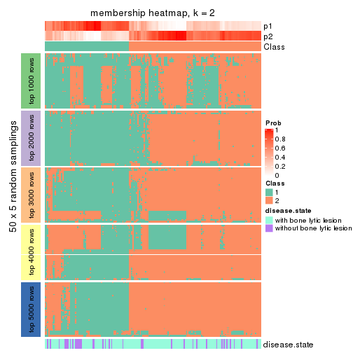</p>

</div>
<div id='tab-SD-pam-membership-heatmap-2'>
<pre><code class="r">membership_heatmap(res, k = 3)
</code></pre>

<p></p>

</div>
<div id='tab-SD-pam-membership-heatmap-3'>
<pre><code class="r">membership_heatmap(res, k = 4)
</code></pre>

<p></p>

</div>
<div id='tab-SD-pam-membership-heatmap-4'>
<pre><code class="r">membership_heatmap(res, k = 5)
</code></pre>

<p></p>

</div>
<div id='tab-SD-pam-membership-heatmap-5'>
<pre><code class="r">membership_heatmap(res, k = 6)
</code></pre>

<p></p>

</div>
</div>

As soon as we have had the classes for columns, we can look for signatures
which are significantly different between classes which can be candidate marks
for certain classes. Following are the heatmaps for signatures.


Signature heatmaps where rows are scaled:


<script>
$( function() {
	$( '#tabs-SD-pam-get-signatures' ).tabs();
} );
</script>
<div id='tabs-SD-pam-get-signatures'>
<ul>
<li><a href='#tab-SD-pam-get-signatures-1'>k = 2</a></li>
<li><a href='#tab-SD-pam-get-signatures-2'>k = 3</a></li>
<li><a href='#tab-SD-pam-get-signatures-3'>k = 4</a></li>
<li><a href='#tab-SD-pam-get-signatures-4'>k = 5</a></li>
<li><a href='#tab-SD-pam-get-signatures-5'>k = 6</a></li>
</ul>
<div id='tab-SD-pam-get-signatures-1'>
<pre><code class="r">get_signatures(res, k = 2)
</code></pre>

<p></p>

</div>
<div id='tab-SD-pam-get-signatures-2'>
<pre><code class="r">get_signatures(res, k = 3)
</code></pre>

<p></p>

</div>
<div id='tab-SD-pam-get-signatures-3'>
<pre><code class="r">get_signatures(res, k = 4)
</code></pre>

<p></p>

</div>
<div id='tab-SD-pam-get-signatures-4'>
<pre><code class="r">get_signatures(res, k = 5)
</code></pre>

<p></p>

</div>
<div id='tab-SD-pam-get-signatures-5'>
<pre><code class="r">get_signatures(res, k = 6)
</code></pre>

<p></p>

</div>
</div>


Signature heatmaps where rows are not scaled:


<script>
$( function() {
	$( '#tabs-SD-pam-get-signatures-no-scale' ).tabs();
} );
</script>
<div id='tabs-SD-pam-get-signatures-no-scale'>
<ul>
<li><a href='#tab-SD-pam-get-signatures-no-scale-1'>k = 2</a></li>
<li><a href='#tab-SD-pam-get-signatures-no-scale-2'>k = 3</a></li>
<li><a href='#tab-SD-pam-get-signatures-no-scale-3'>k = 4</a></li>
<li><a href='#tab-SD-pam-get-signatures-no-scale-4'>k = 5</a></li>
<li><a href='#tab-SD-pam-get-signatures-no-scale-5'>k = 6</a></li>
</ul>
<div id='tab-SD-pam-get-signatures-no-scale-1'>
<pre><code class="r">get_signatures(res, k = 2, scale_rows = FALSE)
</code></pre>

<p></p>

</div>
<div id='tab-SD-pam-get-signatures-no-scale-2'>
<pre><code class="r">get_signatures(res, k = 3, scale_rows = FALSE)
</code></pre>

<p></p>

</div>
<div id='tab-SD-pam-get-signatures-no-scale-3'>
<pre><code class="r">get_signatures(res, k = 4, scale_rows = FALSE)
</code></pre>

<p></p>

</div>
<div id='tab-SD-pam-get-signatures-no-scale-4'>
<pre><code class="r">get_signatures(res, k = 5, scale_rows = FALSE)
</code></pre>

<p></p>

</div>
<div id='tab-SD-pam-get-signatures-no-scale-5'>
<pre><code class="r">get_signatures(res, k = 6, scale_rows = FALSE)
</code></pre>

<p></p>

</div>
</div>


Compare the overlap of signatures from different k:

```r
compare_signatures(res)
```


`get_signature()` returns a data frame invisibly. TO get the list of signatures, the function
call should be assigned to a variable explicitly. In following code, if `plot` argument is set
to `FALSE`, no heatmap is plotted while only the differential analysis is performed.

```r
# code only for demonstration
tb = get_signature(res, k = ..., plot = FALSE)
```

An example of the output of `tb` is:

```
#>   which_row         fdr    mean_1    mean_2 scaled_mean_1 scaled_mean_2 km
#> 1        38 0.042760348  8.373488  9.131774    -0.5533452     0.5164555  1
#> 2        40 0.018707592  7.106213  8.469186    -0.6173731     0.5762149  1
#> 3        55 0.019134737 10.221463 11.207825    -0.6159697     0.5749050  1
#> 4        59 0.006059896  5.921854  7.869574    -0.6899429     0.6439467  1
#> 5        60 0.018055526  8.928898 10.211722    -0.6204761     0.5791110  1
#> 6        98 0.009384629 15.714769 14.887706     0.6635654    -0.6193277  2
...
```

The columns in `tb` are:

1. `which_row`: row indices corresponding to the input matrix.
2. `fdr`: FDR for the differential test. 
3. `mean_x`: The mean value in group x.
4. `scaled_mean_x`: The mean value in group x after rows are scaled.
5. `km`: Row groups if k-means clustering is applied to rows.


UMAP plot which shows how samples are separated.


<script>
$( function() {
	$( '#tabs-SD-pam-dimension-reduction' ).tabs();
} );
</script>
<div id='tabs-SD-pam-dimension-reduction'>
<ul>
<li><a href='#tab-SD-pam-dimension-reduction-1'>k = 2</a></li>
<li><a href='#tab-SD-pam-dimension-reduction-2'>k = 3</a></li>
<li><a href='#tab-SD-pam-dimension-reduction-3'>k = 4</a></li>
<li><a href='#tab-SD-pam-dimension-reduction-4'>k = 5</a></li>
<li><a href='#tab-SD-pam-dimension-reduction-5'>k = 6</a></li>
</ul>
<div id='tab-SD-pam-dimension-reduction-1'>
<pre><code class="r">dimension_reduction(res, k = 2, method = &quot;UMAP&quot;)
</code></pre>

<p></p>

</div>
<div id='tab-SD-pam-dimension-reduction-2'>
<pre><code class="r">dimension_reduction(res, k = 3, method = &quot;UMAP&quot;)
</code></pre>

<p></p>

</div>
<div id='tab-SD-pam-dimension-reduction-3'>
<pre><code class="r">dimension_reduction(res, k = 4, method = &quot;UMAP&quot;)
</code></pre>

<p></p>

</div>
<div id='tab-SD-pam-dimension-reduction-4'>
<pre><code class="r">dimension_reduction(res, k = 5, method = &quot;UMAP&quot;)
</code></pre>

<p></p>

</div>
<div id='tab-SD-pam-dimension-reduction-5'>
<pre><code class="r">dimension_reduction(res, k = 6, method = &quot;UMAP&quot;)
</code></pre>

<p></p>

</div>
</div>


Following heatmap shows how subgroups are split when increasing `k`:

```r
collect_classes(res)
```

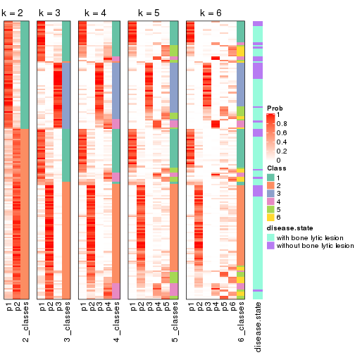


Test correlation between subgroups and known annotations. If the known
annotation is numeric, one-way ANOVA test is applied, and if the known
annotation is discrete, chi-squared contingency table test is applied.

```r
test_to_known_factors(res)
```

```
#>          n disease.state(p) k
#> SD:pam 147           0.0154 2
#> SD:pam 162           0.0349 3
#> SD:pam 135           0.1206 4
#> SD:pam 116           0.0605 5
#> SD:pam 108           0.2768 6
```


If matrix rows can be associated to genes, consider to use `GO_Enrichment(res,
...)` to perform function enrichment for the signature genes.


 

---------------------------------------------------


### SD:mclust


The object with results only for a single top-value method and a single partition method 
can be extracted as:

```r
res = res_list["SD", "mclust"]
# you can also extract it by
# res = res_list["SD:mclust"]
```

A summary of `res` and all the functions that can be applied to it:

```r
res
```

```
#> A 'ConsensusPartition' object with k = 2, 3, 4, 5, 6.
#>   On a matrix with 11993 rows and 173 columns.
#>   Top rows (1000, 2000, 3000, 4000, 5000) are extracted by 'SD' method.
#>   Subgroups are detected by 'mclust' method.
#>   Performed in total 1250 partitions by row resampling.
#>   Best k for subgroups seems to be 4.
#> 
#> Following methods can be applied to this 'ConsensusPartition' object:
#>  [1] "cola_report"             "collect_classes"         "collect_plots"          
#>  [4] "collect_stats"           "colnames"                "compare_signatures"     
#>  [7] "consensus_heatmap"       "dimension_reduction"     "functional_enrichment"  
#> [10] "get_anno_col"            "get_anno"                "get_classes"            
#> [13] "get_consensus"           "get_matrix"              "get_membership"         
#> [16] "get_param"               "get_signatures"          "get_stats"              
#> [19] "is_best_k"               "is_stable_k"             "membership_heatmap"     
#> [22] "ncol"                    "nrow"                    "plot_ecdf"              
#> [25] "rownames"                "select_partition_number" "show"                   
#> [28] "suggest_best_k"          "test_to_known_factors"
```

`collect_plots()` function collects all the plots made from `res` for all `k` (number of partitions)
into one single page to provide an easy and fast comparison between different `k`.

```r
collect_plots(res)
```


The plots are:

- The first row: a plot of the ECDF (Empirical cumulative distribution
  function) curves of the consensus matrix for each `k` and the heatmap of
  predicted classes for each `k`.
- The second row: heatmaps of the consensus matrix for each `k`.
- The third row: heatmaps of the membership matrix for each `k`.
- The fouth row: heatmaps of the signatures for each `k`.

All the plots in panels can be made by individual functions and they are
plotted later in this section.

`select_partition_number()` produces several plots showing different
statistics for choosing "optimized" `k`. There are following statistics:

- ECDF curves of the consensus matrix for each `k`;
- 1-PAC. [The PAC
  score](https://en.wikipedia.org/wiki/Consensus_clustering#Over-interpretation_potential_of_consensus_clustering)
  measures the proportion of the ambiguous subgrouping.
- Mean silhouette score.
- Concordance. The mean probability of fiting the consensus class ids in all
  partitions.
- Area increased. Denote $A_k$ as the area under the ECDF curve for current
  `k`, the area increased is defined as $A_k - A_{k-1}$.
- Rand index. The percent of pairs of samples that are both in a same cluster
  or both are not in a same cluster in the partition of k and k-1.
- Jaccard index. The ratio of pairs of samples are both in a same cluster in
  the partition of k and k-1 and the pairs of samples are both in a same
  cluster in the partition k or k-1.

The detailed explanations of these statistics can be found in [the cola
vignette](http://bioconductor.org/packages/devel/bioc/vignettes/cola/inst/doc/cola.html#toc_13).

Generally speaking, lower PAC score, higher mean silhouette score or higher
concordance corresponds to better partition. Rand index and Jaccard index
measure how similar the current partition is compared to partition with `k-1`.
If they are too similar, we won't accept `k` is better than `k-1`.

```r
select_partition_number(res)
```


The numeric values for all these statistics can be obtained by `get_stats()`.

```r
get_stats(res)
```

```
#>   k 1-PAC mean_silhouette concordance area_increased  Rand Jaccard
#> 2 2 0.310           0.700       0.846         0.2519 0.785   0.785
#> 3 3 0.160           0.707       0.749         1.2119 0.449   0.347
#> 4 4 0.596           0.613       0.820         0.2980 0.832   0.575
#> 5 5 0.506           0.451       0.687         0.0610 0.882   0.611
#> 6 6 0.553           0.418       0.633         0.0457 0.884   0.556
```

`suggest_best_k()` suggests the best $k$ based on these statistics. The rules are as follows:

- All $k$ with Jaccard index larger than 0.95 are removed because the increase of
  the partition number does not provides enough extra information. If all $k$ are removed,
  the best $k$ is assigned by `NA`.
- For $k$ with 1-PAC larger than 0.9, the maximal $k$ is taken as the "best k". Other $k$ is called "optional k".
- If it does not fit the second rule. The $k$ with the highest vote of highest
  1-PAC, mean silhouette and concordance is taken as the "best k".

```r
suggest_best_k(res)
```

```
#> [1] 4
```


Following shows the table of the partitions (You need to click the **show/hide
code output** link to see it). The membership matrix (columns with name `p*`)
is inferred by
[`clue::cl_consensus()`](https://www.rdocumentation.org/link/cl_consensus?package=clue)
function with the `SE` method. Basically the value in the membership matrix
represents the probability to belong to a certain group. The finall class
label for an item is determined with the group with highest probability it
belongs to.

In `get_classes()` function, the entropy is calculated from the membership
matrix and the silhouette score is calculated from the consensus matrix.


<script>
$( function() {
	$( '#tabs-SD-mclust-get-classes' ).tabs();
} );
</script>
<div id='tabs-SD-mclust-get-classes'>
<ul>
<li><a href='#tab-SD-mclust-get-classes-1'>k = 2</a></li>
<li><a href='#tab-SD-mclust-get-classes-2'>k = 3</a></li>
<li><a href='#tab-SD-mclust-get-classes-3'>k = 4</a></li>
<li><a href='#tab-SD-mclust-get-classes-4'>k = 5</a></li>
<li><a href='#tab-SD-mclust-get-classes-5'>k = 6</a></li>
</ul>

<div id='tab-SD-mclust-get-classes-1'>
<p><a id='tab-SD-mclust-get-classes-1-a' style='color:#0366d6' href='#'>show/hide code output</a></p>
<pre><code class="r">cbind(get_classes(res, k = 2), get_membership(res, k = 2))
</code></pre>

<pre><code>#&gt;          class entropy silhouette    p1    p2
#&gt; GSM11437     1  0.4815     0.8162 0.896 0.104
#&gt; GSM11438     1  0.9815    -0.1878 0.580 0.420
#&gt; GSM11439     1  0.1843     0.8162 0.972 0.028
#&gt; GSM11440     1  0.0672     0.8132 0.992 0.008
#&gt; GSM11441     1  0.1633     0.8112 0.976 0.024
#&gt; GSM11442     1  0.1633     0.8092 0.976 0.024
#&gt; GSM11443     1  0.9815    -0.1144 0.580 0.420
#&gt; GSM11444     1  0.0938     0.8104 0.988 0.012
#&gt; GSM11445     1  0.1184     0.8104 0.984 0.016
#&gt; GSM11446     1  0.2236     0.8006 0.964 0.036
#&gt; GSM11447     1  0.2043     0.8084 0.968 0.032
#&gt; GSM11448     1  0.5519     0.7956 0.872 0.128
#&gt; GSM11449     1  0.5294     0.8108 0.880 0.120
#&gt; GSM11450     1  0.6148     0.7986 0.848 0.152
#&gt; GSM11451     2  0.8016     0.7182 0.244 0.756
#&gt; GSM11452     1  0.5737     0.7972 0.864 0.136
#&gt; GSM11453     1  0.5737     0.7972 0.864 0.136
#&gt; GSM11454     1  0.2948     0.7904 0.948 0.052
#&gt; GSM11455     1  0.2236     0.8113 0.964 0.036
#&gt; GSM11456     1  0.6712     0.7540 0.824 0.176
#&gt; GSM11457     2  0.9850     0.6638 0.428 0.572
#&gt; GSM11458     1  0.3431     0.7813 0.936 0.064
#&gt; GSM11459     1  0.2778     0.7940 0.952 0.048
#&gt; GSM11460     1  0.3879     0.8018 0.924 0.076
#&gt; GSM11461     1  0.6048     0.8024 0.852 0.148
#&gt; GSM11462     1  0.2948     0.7919 0.948 0.052
#&gt; GSM11463     1  0.9815    -0.1216 0.580 0.420
#&gt; GSM11464     1  0.6343     0.7968 0.840 0.160
#&gt; GSM11465     1  0.5519     0.7997 0.872 0.128
#&gt; GSM11466     1  0.0376     0.8143 0.996 0.004
#&gt; GSM11467     1  0.6531     0.7920 0.832 0.168
#&gt; GSM11468     1  0.0938     0.8104 0.988 0.012
#&gt; GSM11469     1  0.2603     0.7981 0.956 0.044
#&gt; GSM11470     1  0.7745     0.7312 0.772 0.228
#&gt; GSM11471     1  0.5408     0.8127 0.876 0.124
#&gt; GSM11472     1  0.4022     0.8228 0.920 0.080
#&gt; GSM11473     1  0.4431     0.8152 0.908 0.092
#&gt; GSM11474     2  0.9970     0.5804 0.468 0.532
#&gt; GSM11475     1  0.0376     0.8143 0.996 0.004
#&gt; GSM11476     1  0.1843     0.8088 0.972 0.028
#&gt; GSM11477     2  0.9686     0.7027 0.396 0.604
#&gt; GSM11478     2  0.9881     0.6514 0.436 0.564
#&gt; GSM11479     1  0.4431     0.7722 0.908 0.092
#&gt; GSM11480     2  0.6531     0.7119 0.168 0.832
#&gt; GSM11481     1  0.0938     0.8147 0.988 0.012
#&gt; GSM11482     1  0.0938     0.8127 0.988 0.012
#&gt; GSM11483     1  0.8955     0.2812 0.688 0.312
#&gt; GSM11484     1  0.2603     0.8012 0.956 0.044
#&gt; GSM11485     1  0.6247     0.6439 0.844 0.156
#&gt; GSM11486     1  0.8144     0.5278 0.748 0.252
#&gt; GSM11487     1  0.5737     0.8006 0.864 0.136
#&gt; GSM11488     1  0.2236     0.8070 0.964 0.036
#&gt; GSM11489     1  0.3274     0.8200 0.940 0.060
#&gt; GSM11490     1  0.1414     0.8128 0.980 0.020
#&gt; GSM11491     1  0.6148     0.7983 0.848 0.152
#&gt; GSM11492     1  0.1633     0.8107 0.976 0.024
#&gt; GSM11493     1  0.1633     0.8098 0.976 0.024
#&gt; GSM11494     1  0.1414     0.8100 0.980 0.020
#&gt; GSM11495     1  0.1633     0.8126 0.976 0.024
#&gt; GSM11496     1  0.1843     0.8153 0.972 0.028
#&gt; GSM11497     1  0.5629     0.7940 0.868 0.132
#&gt; GSM11498     1  0.6048     0.7839 0.852 0.148
#&gt; GSM11499     1  0.6973     0.5684 0.812 0.188
#&gt; GSM11500     1  0.7453     0.5105 0.788 0.212
#&gt; GSM11501     1  0.1633     0.8104 0.976 0.024
#&gt; GSM11502     2  0.9686     0.7027 0.396 0.604
#&gt; GSM11503     1  0.9944    -0.3113 0.544 0.456
#&gt; GSM11504     1  0.1414     0.8091 0.980 0.020
#&gt; GSM11505     2  0.9998     0.5028 0.492 0.508
#&gt; GSM11506     2  1.0000     0.5040 0.496 0.504
#&gt; GSM11507     2  0.7219     0.7279 0.200 0.800
#&gt; GSM11508     1  0.2236     0.7995 0.964 0.036
#&gt; GSM11509     1  0.0938     0.8122 0.988 0.012
#&gt; GSM11510     1  0.6801     0.7448 0.820 0.180
#&gt; GSM11511     1  0.5842     0.8016 0.860 0.140
#&gt; GSM11512     1  0.2423     0.8008 0.960 0.040
#&gt; GSM11513     1  0.1633     0.8068 0.976 0.024
#&gt; GSM11514     1  0.2948     0.8209 0.948 0.052
#&gt; GSM11515     1  0.1414     0.8100 0.980 0.020
#&gt; GSM11516     1  0.5629     0.7967 0.868 0.132
#&gt; GSM11517     1  0.1414     0.8093 0.980 0.020
#&gt; GSM11518     1  0.2236     0.8226 0.964 0.036
#&gt; GSM11519     1  0.6343     0.7971 0.840 0.160
#&gt; GSM11520     1  0.6531     0.7920 0.832 0.168
#&gt; GSM11521     1  0.1414     0.8119 0.980 0.020
#&gt; GSM11522     1  0.5629     0.8084 0.868 0.132
#&gt; GSM11523     1  0.7299     0.7624 0.796 0.204
#&gt; GSM11524     1  0.1633     0.8080 0.976 0.024
#&gt; GSM11525     1  0.9998    -0.4711 0.508 0.492
#&gt; GSM11526     1  0.0938     0.8126 0.988 0.012
#&gt; GSM11527     1  0.9944    -0.3728 0.544 0.456
#&gt; GSM11528     2  0.9580     0.7134 0.380 0.620
#&gt; GSM11529     1  0.5629     0.7940 0.868 0.132
#&gt; GSM11530     1  0.0672     0.8142 0.992 0.008
#&gt; GSM11531     1  0.8016     0.6249 0.756 0.244
#&gt; GSM11532     1  0.0376     0.8141 0.996 0.004
#&gt; GSM11533     1  0.5629     0.7940 0.868 0.132
#&gt; GSM11534     1  0.5519     0.7956 0.872 0.128
#&gt; GSM11535     1  0.5737     0.7920 0.864 0.136
#&gt; GSM11536     1  0.1414     0.8141 0.980 0.020
#&gt; GSM11537     2  0.9248     0.6349 0.340 0.660
#&gt; GSM11538     1  0.3114     0.8230 0.944 0.056
#&gt; GSM11539     2  0.9963     0.5895 0.464 0.536
#&gt; GSM11540     2  0.9815     0.6756 0.420 0.580
#&gt; GSM11541     1  0.2948     0.7943 0.948 0.052
#&gt; GSM11542     2  0.7056     0.7263 0.192 0.808
#&gt; GSM11543     1  0.5178     0.8053 0.884 0.116
#&gt; GSM11544     1  0.6531     0.7949 0.832 0.168
#&gt; GSM11545     1  0.5842     0.7984 0.860 0.140
#&gt; GSM11546     1  0.9209     0.3220 0.664 0.336
#&gt; GSM11547     1  0.8713     0.5133 0.708 0.292
#&gt; GSM11548     1  0.1414     0.8122 0.980 0.020
#&gt; GSM11549     1  0.6247     0.7975 0.844 0.156
#&gt; GSM11550     1  0.6148     0.7990 0.848 0.152
#&gt; GSM11551     1  0.4161     0.8235 0.916 0.084
#&gt; GSM11552     1  0.2948     0.7919 0.948 0.052
#&gt; GSM11553     1  0.9998    -0.4673 0.508 0.492
#&gt; GSM11554     2  0.6438     0.7088 0.164 0.836
#&gt; GSM11555     1  0.1843     0.8208 0.972 0.028
#&gt; GSM11556     1  0.3274     0.7870 0.940 0.060
#&gt; GSM11557     1  0.9933    -0.2914 0.548 0.452
#&gt; GSM11558     2  0.7815     0.7349 0.232 0.768
#&gt; GSM11559     1  0.9775    -0.0669 0.588 0.412
#&gt; GSM11560     1  0.6623     0.7886 0.828 0.172
#&gt; GSM11561     2  0.8207     0.7357 0.256 0.744
#&gt; GSM11562     2  0.8443     0.7446 0.272 0.728
#&gt; GSM11563     1  0.5519     0.7956 0.872 0.128
#&gt; GSM11564     1  0.5629     0.7968 0.868 0.132
#&gt; GSM11565     1  0.5842     0.7999 0.860 0.140
#&gt; GSM11566     1  0.8909     0.4567 0.692 0.308
#&gt; GSM11567     1  0.0938     0.8127 0.988 0.012
#&gt; GSM11568     1  0.5629     0.7967 0.868 0.132
#&gt; GSM11569     2  0.6438     0.7088 0.164 0.836
#&gt; GSM11570     1  0.2948     0.7919 0.948 0.052
#&gt; GSM11571     1  0.6343     0.7955 0.840 0.160
#&gt; GSM11572     1  0.5629     0.7940 0.868 0.132
#&gt; GSM11573     1  0.5842     0.7975 0.860 0.140
#&gt; GSM11574     1  0.7674     0.6710 0.776 0.224
#&gt; GSM11575     1  0.5519     0.7988 0.872 0.128
#&gt; GSM11576     1  0.7815     0.7252 0.768 0.232
#&gt; GSM11577     1  0.5842     0.7975 0.860 0.140
#&gt; GSM11578     1  0.5629     0.7967 0.868 0.132
#&gt; GSM11579     1  0.1184     0.8124 0.984 0.016
#&gt; GSM11580     1  0.5519     0.7956 0.872 0.128
#&gt; GSM11581     1  0.0672     0.8108 0.992 0.008
#&gt; GSM11582     1  0.3114     0.7906 0.944 0.056
#&gt; GSM11583     1  0.2043     0.8050 0.968 0.032
#&gt; GSM11584     1  0.1843     0.8078 0.972 0.028
#&gt; GSM11585     2  0.9996     0.5166 0.488 0.512
#&gt; GSM11586     1  0.6247     0.7969 0.844 0.156
#&gt; GSM11587     1  0.7815     0.7252 0.768 0.232
#&gt; GSM11588     1  0.5842     0.7975 0.860 0.140
#&gt; GSM11589     1  0.5629     0.8002 0.868 0.132
#&gt; GSM11590     1  0.6438     0.7943 0.836 0.164
#&gt; GSM11591     1  0.9977    -0.3938 0.528 0.472
#&gt; GSM11592     1  0.6148     0.8009 0.848 0.152
#&gt; GSM11593     1  0.6623     0.7905 0.828 0.172
#&gt; GSM11594     1  0.6623     0.7905 0.828 0.172
#&gt; GSM11595     1  0.5178     0.8040 0.884 0.116
#&gt; GSM11596     1  0.8813     0.4627 0.700 0.300
#&gt; GSM11597     1  0.2043     0.8096 0.968 0.032
#&gt; GSM11598     1  0.6531     0.7924 0.832 0.168
#&gt; GSM11599     1  0.2423     0.7992 0.960 0.040
#&gt; GSM11600     1  0.2236     0.8052 0.964 0.036
#&gt; GSM11601     1  0.2423     0.8194 0.960 0.040
#&gt; GSM11602     1  0.6623     0.7905 0.828 0.172
#&gt; GSM11603     1  0.7815     0.7252 0.768 0.232
#&gt; GSM11604     1  0.2948     0.7919 0.948 0.052
#&gt; GSM11605     1  0.2778     0.7972 0.952 0.048
#&gt; GSM11606     1  0.9170     0.3452 0.668 0.332
#&gt; GSM11607     1  0.6623     0.7905 0.828 0.172
#&gt; GSM11608     1  0.2948     0.7933 0.948 0.052
#&gt; GSM11609     1  0.0938     0.8127 0.988 0.012
</code></pre>

<script>
$('#tab-SD-mclust-get-classes-1-a').parent().next().next().hide();
$('#tab-SD-mclust-get-classes-1-a').click(function(){
  $('#tab-SD-mclust-get-classes-1-a').parent().next().next().toggle();
  return(false);
});
</script>
</div>

<div id='tab-SD-mclust-get-classes-2'>
<p><a id='tab-SD-mclust-get-classes-2-a' style='color:#0366d6' href='#'>show/hide code output</a></p>
<pre><code class="r">cbind(get_classes(res, k = 3), get_membership(res, k = 3))
</code></pre>

<pre><code>#&gt;          class entropy silhouette    p1    p2    p3
#&gt; GSM11437     3  0.4742     0.7932 0.048 0.104 0.848
#&gt; GSM11438     2  0.4834     0.7825 0.004 0.792 0.204
#&gt; GSM11439     3  0.4848     0.7745 0.036 0.128 0.836
#&gt; GSM11440     3  0.2903     0.8438 0.028 0.048 0.924
#&gt; GSM11441     3  0.2550     0.8413 0.024 0.040 0.936
#&gt; GSM11442     3  0.2918     0.8302 0.044 0.032 0.924
#&gt; GSM11443     2  0.5454     0.7810 0.044 0.804 0.152
#&gt; GSM11444     3  0.1950     0.8464 0.040 0.008 0.952
#&gt; GSM11445     3  0.1453     0.8444 0.024 0.008 0.968
#&gt; GSM11446     3  0.2269     0.8390 0.040 0.016 0.944
#&gt; GSM11447     3  0.3155     0.8282 0.040 0.044 0.916
#&gt; GSM11448     2  0.6341     0.6724 0.016 0.672 0.312
#&gt; GSM11449     1  0.9527     0.5566 0.436 0.192 0.372
#&gt; GSM11450     1  0.7106     0.8228 0.700 0.076 0.224
#&gt; GSM11451     2  0.2564     0.6916 0.028 0.936 0.036
#&gt; GSM11452     1  0.9424     0.4551 0.464 0.352 0.184
#&gt; GSM11453     1  0.9313     0.6080 0.512 0.288 0.200
#&gt; GSM11454     3  0.2063     0.8363 0.044 0.008 0.948
#&gt; GSM11455     3  0.6204     0.0640 0.000 0.424 0.576
#&gt; GSM11456     2  0.6027     0.7138 0.016 0.712 0.272
#&gt; GSM11457     2  0.4063     0.7801 0.020 0.868 0.112
#&gt; GSM11458     3  0.4346     0.7668 0.184 0.000 0.816
#&gt; GSM11459     3  0.1711     0.8373 0.032 0.008 0.960
#&gt; GSM11460     3  0.4326     0.7615 0.144 0.012 0.844
#&gt; GSM11461     3  0.9281     0.1704 0.204 0.276 0.520
#&gt; GSM11462     3  0.4629     0.7091 0.188 0.004 0.808
#&gt; GSM11463     2  0.4413     0.7922 0.008 0.832 0.160
#&gt; GSM11464     1  0.6224     0.7522 0.688 0.016 0.296
#&gt; GSM11465     2  0.6155     0.6640 0.008 0.664 0.328
#&gt; GSM11466     3  0.1765     0.8467 0.004 0.040 0.956
#&gt; GSM11467     1  0.7248     0.7967 0.676 0.068 0.256
#&gt; GSM11468     3  0.1453     0.8444 0.024 0.008 0.968
#&gt; GSM11469     3  0.2446     0.8444 0.052 0.012 0.936
#&gt; GSM11470     1  0.4994     0.7904 0.816 0.024 0.160
#&gt; GSM11471     3  0.9059    -0.2623 0.380 0.140 0.480
#&gt; GSM11472     3  0.3550     0.8261 0.024 0.080 0.896
#&gt; GSM11473     2  0.6935     0.6776 0.036 0.652 0.312
#&gt; GSM11474     2  0.4249     0.7761 0.028 0.864 0.108
#&gt; GSM11475     3  0.1129     0.8489 0.004 0.020 0.976
#&gt; GSM11476     3  0.3947     0.8165 0.040 0.076 0.884
#&gt; GSM11477     2  0.3619     0.7907 0.000 0.864 0.136
#&gt; GSM11478     2  0.4172     0.7939 0.004 0.840 0.156
#&gt; GSM11479     2  0.7424     0.5100 0.040 0.572 0.388
#&gt; GSM11480     2  0.2031     0.6816 0.032 0.952 0.016
#&gt; GSM11481     3  0.2176     0.8415 0.020 0.032 0.948
#&gt; GSM11482     3  0.3500     0.7920 0.004 0.116 0.880
#&gt; GSM11483     2  0.6984     0.6403 0.040 0.656 0.304
#&gt; GSM11484     3  0.2280     0.8308 0.052 0.008 0.940
#&gt; GSM11485     3  0.6432     0.1048 0.004 0.428 0.568
#&gt; GSM11486     2  0.5734     0.7814 0.048 0.788 0.164
#&gt; GSM11487     1  0.8907     0.7400 0.560 0.168 0.272
#&gt; GSM11488     3  0.2280     0.8308 0.052 0.008 0.940
#&gt; GSM11489     2  0.6045     0.6102 0.000 0.620 0.380
#&gt; GSM11490     3  0.3370     0.8270 0.024 0.072 0.904
#&gt; GSM11491     1  0.8303     0.7655 0.632 0.196 0.172
#&gt; GSM11492     3  0.1170     0.8451 0.016 0.008 0.976
#&gt; GSM11493     3  0.2681     0.8357 0.040 0.028 0.932
#&gt; GSM11494     3  0.2810     0.8359 0.036 0.036 0.928
#&gt; GSM11495     3  0.4196     0.7998 0.024 0.112 0.864
#&gt; GSM11496     3  0.7575    -0.2000 0.040 0.456 0.504
#&gt; GSM11497     2  0.7829     0.6304 0.164 0.672 0.164
#&gt; GSM11498     2  0.5580     0.7380 0.008 0.736 0.256
#&gt; GSM11499     3  0.6754     0.0843 0.012 0.432 0.556
#&gt; GSM11500     3  0.7542     0.0614 0.040 0.432 0.528
#&gt; GSM11501     3  0.5977     0.6049 0.020 0.252 0.728
#&gt; GSM11502     2  0.3983     0.7930 0.004 0.852 0.144
#&gt; GSM11503     2  0.4277     0.7900 0.016 0.852 0.132
#&gt; GSM11504     3  0.1170     0.8451 0.016 0.008 0.976
#&gt; GSM11505     2  0.4369     0.7662 0.040 0.864 0.096
#&gt; GSM11506     2  0.5180     0.7889 0.032 0.812 0.156
#&gt; GSM11507     2  0.2176     0.6868 0.032 0.948 0.020
#&gt; GSM11508     3  0.1453     0.8367 0.024 0.008 0.968
#&gt; GSM11509     3  0.2564     0.8403 0.036 0.028 0.936
#&gt; GSM11510     2  0.4842     0.7712 0.000 0.776 0.224
#&gt; GSM11511     1  0.8649     0.7491 0.600 0.204 0.196
#&gt; GSM11512     3  0.1832     0.8418 0.036 0.008 0.956
#&gt; GSM11513     3  0.2063     0.8350 0.044 0.008 0.948
#&gt; GSM11514     3  0.6724    -0.0197 0.012 0.420 0.568
#&gt; GSM11515     3  0.1636     0.8494 0.016 0.020 0.964
#&gt; GSM11516     1  0.8966     0.6901 0.560 0.256 0.184
#&gt; GSM11517     3  0.0848     0.8455 0.008 0.008 0.984
#&gt; GSM11518     3  0.5167     0.7183 0.024 0.172 0.804
#&gt; GSM11519     1  0.7775     0.7956 0.676 0.156 0.168
#&gt; GSM11520     1  0.6537     0.8265 0.740 0.064 0.196
#&gt; GSM11521     3  0.3456     0.8305 0.036 0.060 0.904
#&gt; GSM11522     1  0.8535     0.5421 0.500 0.096 0.404
#&gt; GSM11523     1  0.5111     0.7945 0.808 0.024 0.168
#&gt; GSM11524     3  0.1015     0.8471 0.012 0.008 0.980
#&gt; GSM11525     2  0.4209     0.7835 0.020 0.860 0.120
#&gt; GSM11526     3  0.1170     0.8451 0.016 0.008 0.976
#&gt; GSM11527     2  0.4931     0.7764 0.004 0.784 0.212
#&gt; GSM11528     2  0.3918     0.7911 0.004 0.856 0.140
#&gt; GSM11529     2  0.8072     0.6164 0.164 0.652 0.184
#&gt; GSM11530     3  0.3752     0.8061 0.020 0.096 0.884
#&gt; GSM11531     2  0.4345     0.7910 0.016 0.848 0.136
#&gt; GSM11532     3  0.2434     0.8474 0.024 0.036 0.940
#&gt; GSM11533     2  0.9174     0.3121 0.276 0.532 0.192
#&gt; GSM11534     2  0.9392     0.1420 0.312 0.492 0.196
#&gt; GSM11535     2  0.5115     0.7810 0.016 0.796 0.188
#&gt; GSM11536     3  0.2703     0.8371 0.016 0.056 0.928
#&gt; GSM11537     2  0.2689     0.6907 0.032 0.932 0.036
#&gt; GSM11538     3  0.7401     0.2412 0.048 0.340 0.612
#&gt; GSM11539     2  0.4136     0.7801 0.020 0.864 0.116
#&gt; GSM11540     2  0.3752     0.7931 0.000 0.856 0.144
#&gt; GSM11541     3  0.2063     0.8405 0.044 0.008 0.948
#&gt; GSM11542     2  0.1877     0.6768 0.032 0.956 0.012
#&gt; GSM11543     2  0.6617     0.4845 0.008 0.556 0.436
#&gt; GSM11544     1  0.6882     0.8226 0.732 0.096 0.172
#&gt; GSM11545     2  0.9759     0.1055 0.284 0.444 0.272
#&gt; GSM11546     2  0.5643     0.7667 0.020 0.760 0.220
#&gt; GSM11547     2  0.5435     0.7872 0.024 0.784 0.192
#&gt; GSM11548     3  0.1529     0.8432 0.040 0.000 0.960
#&gt; GSM11549     1  0.7188     0.7950 0.664 0.056 0.280
#&gt; GSM11550     1  0.7666     0.7877 0.636 0.076 0.288
#&gt; GSM11551     3  0.4256     0.8049 0.036 0.096 0.868
#&gt; GSM11552     3  0.2625     0.8277 0.084 0.000 0.916
#&gt; GSM11553     2  0.4293     0.7901 0.004 0.832 0.164
#&gt; GSM11554     2  0.1877     0.6768 0.032 0.956 0.012
#&gt; GSM11555     3  0.3752     0.7952 0.020 0.096 0.884
#&gt; GSM11556     3  0.2682     0.8256 0.076 0.004 0.920
#&gt; GSM11557     2  0.4324     0.7798 0.028 0.860 0.112
#&gt; GSM11558     2  0.2176     0.6859 0.032 0.948 0.020
#&gt; GSM11559     2  0.4172     0.7922 0.004 0.840 0.156
#&gt; GSM11560     1  0.6601     0.7142 0.676 0.028 0.296
#&gt; GSM11561     2  0.2313     0.6903 0.032 0.944 0.024
#&gt; GSM11562     2  0.2229     0.7135 0.012 0.944 0.044
#&gt; GSM11563     2  0.9120     0.3844 0.156 0.504 0.340
#&gt; GSM11564     2  0.7065     0.6157 0.032 0.616 0.352
#&gt; GSM11565     1  0.8028     0.7825 0.656 0.176 0.168
#&gt; GSM11566     2  0.4700     0.7869 0.008 0.812 0.180
#&gt; GSM11567     3  0.2096     0.8420 0.004 0.052 0.944
#&gt; GSM11568     1  0.8977     0.6900 0.560 0.252 0.188
#&gt; GSM11569     2  0.1877     0.6768 0.032 0.956 0.012
#&gt; GSM11570     3  0.2356     0.8301 0.072 0.000 0.928
#&gt; GSM11571     1  0.6783     0.8239 0.736 0.088 0.176
#&gt; GSM11572     2  0.6047     0.6772 0.008 0.680 0.312
#&gt; GSM11573     1  0.9678     0.4673 0.444 0.328 0.228
#&gt; GSM11574     2  0.4755     0.7821 0.008 0.808 0.184
#&gt; GSM11575     2  0.7478     0.6318 0.060 0.632 0.308
#&gt; GSM11576     1  0.4934     0.7862 0.820 0.024 0.156
#&gt; GSM11577     1  0.8877     0.7000 0.572 0.244 0.184
#&gt; GSM11578     1  0.9122     0.6406 0.536 0.280 0.184
#&gt; GSM11579     3  0.4353     0.7581 0.008 0.156 0.836
#&gt; GSM11580     2  0.9512    -0.1921 0.384 0.428 0.188
#&gt; GSM11581     3  0.1453     0.8444 0.024 0.008 0.968
#&gt; GSM11582     3  0.2229     0.8395 0.044 0.012 0.944
#&gt; GSM11583     3  0.2939     0.8373 0.072 0.012 0.916
#&gt; GSM11584     3  0.0661     0.8464 0.004 0.008 0.988
#&gt; GSM11585     2  0.4110     0.7929 0.004 0.844 0.152
#&gt; GSM11586     1  0.6984     0.8254 0.720 0.088 0.192
#&gt; GSM11587     1  0.4994     0.7864 0.816 0.024 0.160
#&gt; GSM11588     1  0.9150     0.6471 0.536 0.272 0.192
#&gt; GSM11589     2  0.9612     0.2172 0.216 0.452 0.332
#&gt; GSM11590     1  0.6595     0.8261 0.744 0.076 0.180
#&gt; GSM11591     2  0.4233     0.7912 0.004 0.836 0.160
#&gt; GSM11592     1  0.7337     0.7786 0.644 0.056 0.300
#&gt; GSM11593     1  0.6192     0.8211 0.764 0.060 0.176
#&gt; GSM11594     1  0.6208     0.8216 0.756 0.052 0.192
#&gt; GSM11595     2  0.7080     0.5235 0.024 0.564 0.412
#&gt; GSM11596     2  0.4409     0.7892 0.004 0.824 0.172
#&gt; GSM11597     3  0.2806     0.8426 0.032 0.040 0.928
#&gt; GSM11598     1  0.6544     0.8208 0.752 0.084 0.164
#&gt; GSM11599     3  0.1585     0.8447 0.028 0.008 0.964
#&gt; GSM11600     3  0.2492     0.8374 0.048 0.016 0.936
#&gt; GSM11601     2  0.6386     0.5555 0.004 0.584 0.412
#&gt; GSM11602     1  0.5559     0.8079 0.780 0.028 0.192
#&gt; GSM11603     1  0.4934     0.7862 0.820 0.024 0.156
#&gt; GSM11604     3  0.3272     0.7992 0.104 0.004 0.892
#&gt; GSM11605     3  0.1999     0.8423 0.036 0.012 0.952
#&gt; GSM11606     2  0.4531     0.7900 0.008 0.824 0.168
#&gt; GSM11607     1  0.6192     0.8211 0.764 0.060 0.176
#&gt; GSM11608     3  0.4351     0.7314 0.168 0.004 0.828
#&gt; GSM11609     3  0.2680     0.8313 0.008 0.068 0.924
</code></pre>

<script>
$('#tab-SD-mclust-get-classes-2-a').parent().next().next().hide();
$('#tab-SD-mclust-get-classes-2-a').click(function(){
  $('#tab-SD-mclust-get-classes-2-a').parent().next().next().toggle();
  return(false);
});
</script>
</div>

<div id='tab-SD-mclust-get-classes-3'>
<p><a id='tab-SD-mclust-get-classes-3-a' style='color:#0366d6' href='#'>show/hide code output</a></p>
<pre><code class="r">cbind(get_classes(res, k = 4), get_membership(res, k = 4))
</code></pre>

<pre><code>#&gt;          class entropy silhouette    p1    p2    p3    p4
#&gt; GSM11437     3  0.9041    0.32131 0.240 0.108 0.464 0.188
#&gt; GSM11438     2  0.0524    0.85238 0.008 0.988 0.004 0.000
#&gt; GSM11439     3  0.2528    0.69606 0.008 0.080 0.908 0.004
#&gt; GSM11440     4  0.5127    0.53214 0.008 0.008 0.316 0.668
#&gt; GSM11441     3  0.1575    0.71986 0.012 0.004 0.956 0.028
#&gt; GSM11442     3  0.3523    0.63684 0.008 0.008 0.848 0.136
#&gt; GSM11443     2  0.4722    0.51648 0.008 0.692 0.300 0.000
#&gt; GSM11444     3  0.0992    0.72388 0.012 0.004 0.976 0.008
#&gt; GSM11445     3  0.5404    0.15010 0.012 0.004 0.600 0.384
#&gt; GSM11446     3  0.0844    0.72343 0.012 0.004 0.980 0.004
#&gt; GSM11447     3  0.0712    0.72307 0.008 0.004 0.984 0.004
#&gt; GSM11448     2  0.3821    0.76095 0.040 0.840 0.120 0.000
#&gt; GSM11449     1  0.4277    0.67113 0.840 0.024 0.092 0.044
#&gt; GSM11450     1  0.0188    0.75991 0.996 0.004 0.000 0.000
#&gt; GSM11451     2  0.0592    0.85137 0.000 0.984 0.016 0.000
#&gt; GSM11452     2  0.5039    0.22814 0.404 0.592 0.004 0.000
#&gt; GSM11453     1  0.4522    0.50597 0.680 0.320 0.000 0.000
#&gt; GSM11454     3  0.3612    0.65454 0.012 0.004 0.840 0.144
#&gt; GSM11455     2  0.2941    0.79274 0.008 0.888 0.096 0.008
#&gt; GSM11456     2  0.2011    0.81500 0.000 0.920 0.080 0.000
#&gt; GSM11457     2  0.0000    0.85267 0.000 1.000 0.000 0.000
#&gt; GSM11458     3  0.7234    0.37293 0.260 0.004 0.560 0.176
#&gt; GSM11459     3  0.5431    0.45963 0.028 0.004 0.668 0.300
#&gt; GSM11460     1  0.5297    0.17462 0.548 0.004 0.004 0.444
#&gt; GSM11461     1  0.7043   -0.11428 0.464 0.092 0.436 0.008
#&gt; GSM11462     1  0.6919    0.33300 0.600 0.004 0.152 0.244
#&gt; GSM11463     2  0.2198    0.81548 0.008 0.920 0.072 0.000
#&gt; GSM11464     1  0.2266    0.71336 0.912 0.004 0.000 0.084
#&gt; GSM11465     2  0.3808    0.73250 0.012 0.824 0.160 0.004
#&gt; GSM11466     4  0.5417    0.45691 0.012 0.004 0.388 0.596
#&gt; GSM11467     1  0.0657    0.75737 0.984 0.004 0.000 0.012
#&gt; GSM11468     4  0.5134    0.51436 0.012 0.004 0.320 0.664
#&gt; GSM11469     4  0.7803    0.24460 0.220 0.004 0.332 0.444
#&gt; GSM11470     1  0.0376    0.75923 0.992 0.004 0.000 0.004
#&gt; GSM11471     1  0.4677    0.40848 0.680 0.004 0.316 0.000
#&gt; GSM11472     4  0.7543    0.45173 0.040 0.248 0.124 0.588
#&gt; GSM11473     3  0.5464   -0.06073 0.008 0.492 0.496 0.004
#&gt; GSM11474     2  0.0000    0.85267 0.000 1.000 0.000 0.000
#&gt; GSM11475     4  0.5497    0.48650 0.012 0.008 0.372 0.608
#&gt; GSM11476     4  0.5998    0.48935 0.000 0.248 0.088 0.664
#&gt; GSM11477     2  0.0188    0.85304 0.004 0.996 0.000 0.000
#&gt; GSM11478     2  0.0336    0.85214 0.008 0.992 0.000 0.000
#&gt; GSM11479     2  0.4857    0.47534 0.008 0.668 0.324 0.000
#&gt; GSM11480     2  0.0592    0.85137 0.000 0.984 0.016 0.000
#&gt; GSM11481     4  0.1007    0.71030 0.008 0.008 0.008 0.976
#&gt; GSM11482     4  0.5040    0.65457 0.008 0.048 0.180 0.764
#&gt; GSM11483     2  0.4267    0.65115 0.008 0.772 0.216 0.004
#&gt; GSM11484     4  0.0524    0.70595 0.000 0.008 0.004 0.988
#&gt; GSM11485     2  0.6851    0.16608 0.008 0.548 0.088 0.356
#&gt; GSM11486     2  0.4328    0.61436 0.008 0.748 0.244 0.000
#&gt; GSM11487     1  0.0817    0.75587 0.976 0.024 0.000 0.000
#&gt; GSM11488     4  0.0524    0.70595 0.000 0.008 0.004 0.988
#&gt; GSM11489     2  0.1732    0.83803 0.008 0.948 0.040 0.004
#&gt; GSM11490     3  0.0859    0.72352 0.008 0.008 0.980 0.004
#&gt; GSM11491     1  0.3074    0.68503 0.848 0.152 0.000 0.000
#&gt; GSM11492     4  0.1007    0.71030 0.008 0.008 0.008 0.976
#&gt; GSM11493     4  0.4071    0.67147 0.000 0.064 0.104 0.832
#&gt; GSM11494     3  0.1943    0.72166 0.008 0.016 0.944 0.032
#&gt; GSM11495     3  0.7599    0.32238 0.008 0.240 0.528 0.224
#&gt; GSM11496     3  0.3907    0.61979 0.008 0.180 0.808 0.004
#&gt; GSM11497     2  0.4105    0.72198 0.156 0.812 0.032 0.000
#&gt; GSM11498     2  0.0524    0.85211 0.008 0.988 0.004 0.000
#&gt; GSM11499     2  0.6918   -0.00689 0.008 0.500 0.084 0.408
#&gt; GSM11500     3  0.5454    0.03873 0.008 0.468 0.520 0.004
#&gt; GSM11501     4  0.6448    0.42995 0.004 0.292 0.088 0.616
#&gt; GSM11502     2  0.0336    0.85214 0.008 0.992 0.000 0.000
#&gt; GSM11503     2  0.0188    0.85238 0.000 0.996 0.004 0.000
#&gt; GSM11504     4  0.0992    0.71043 0.012 0.004 0.008 0.976
#&gt; GSM11505     2  0.0469    0.85104 0.000 0.988 0.012 0.000
#&gt; GSM11506     2  0.2799    0.78183 0.008 0.884 0.108 0.000
#&gt; GSM11507     2  0.0592    0.85137 0.000 0.984 0.016 0.000
#&gt; GSM11508     4  0.5175    0.50377 0.012 0.004 0.328 0.656
#&gt; GSM11509     3  0.0859    0.72391 0.008 0.004 0.980 0.008
#&gt; GSM11510     2  0.2384    0.81181 0.008 0.916 0.072 0.004
#&gt; GSM11511     1  0.6084    0.46807 0.656 0.092 0.252 0.000
#&gt; GSM11512     4  0.0672    0.70661 0.000 0.008 0.008 0.984
#&gt; GSM11513     3  0.4600    0.56841 0.012 0.004 0.744 0.240
#&gt; GSM11514     4  0.6500    0.46119 0.056 0.248 0.036 0.660
#&gt; GSM11515     3  0.4216    0.56180 0.008 0.008 0.788 0.196
#&gt; GSM11516     1  0.5143    0.22324 0.540 0.456 0.004 0.000
#&gt; GSM11517     4  0.6528    0.33898 0.068 0.004 0.388 0.540
#&gt; GSM11518     3  0.2207    0.71054 0.012 0.056 0.928 0.004
#&gt; GSM11519     1  0.2589    0.70998 0.884 0.116 0.000 0.000
#&gt; GSM11520     1  0.0376    0.75928 0.992 0.004 0.000 0.004
#&gt; GSM11521     4  0.5334    0.57713 0.000 0.172 0.088 0.740
#&gt; GSM11522     1  0.3831    0.65180 0.848 0.004 0.108 0.040
#&gt; GSM11523     1  0.0188    0.75714 0.996 0.000 0.000 0.004
#&gt; GSM11524     4  0.4355    0.62886 0.012 0.004 0.212 0.772
#&gt; GSM11525     2  0.0376    0.85292 0.004 0.992 0.004 0.000
#&gt; GSM11526     4  0.3760    0.67744 0.012 0.004 0.156 0.828
#&gt; GSM11527     2  0.1042    0.84747 0.008 0.972 0.020 0.000
#&gt; GSM11528     2  0.0524    0.85240 0.008 0.988 0.004 0.000
#&gt; GSM11529     2  0.3791    0.67284 0.200 0.796 0.004 0.000
#&gt; GSM11530     1  0.7583   -0.15197 0.432 0.004 0.396 0.168
#&gt; GSM11531     2  0.0712    0.85238 0.004 0.984 0.008 0.004
#&gt; GSM11532     4  0.7439    0.39477 0.164 0.004 0.332 0.500
#&gt; GSM11533     2  0.3908    0.66194 0.212 0.784 0.004 0.000
#&gt; GSM11534     2  0.5000   -0.09349 0.500 0.500 0.000 0.000
#&gt; GSM11535     2  0.0564    0.85272 0.004 0.988 0.004 0.004
#&gt; GSM11536     4  0.0859    0.70993 0.008 0.008 0.004 0.980
#&gt; GSM11537     2  0.0592    0.85137 0.000 0.984 0.016 0.000
#&gt; GSM11538     4  0.2310    0.70091 0.040 0.028 0.004 0.928
#&gt; GSM11539     2  0.0188    0.85238 0.000 0.996 0.004 0.000
#&gt; GSM11540     2  0.0188    0.85304 0.004 0.996 0.000 0.000
#&gt; GSM11541     4  0.0844    0.70986 0.012 0.004 0.004 0.980
#&gt; GSM11542     2  0.0592    0.85137 0.000 0.984 0.016 0.000
#&gt; GSM11543     2  0.4567    0.71699 0.032 0.792 0.168 0.008
#&gt; GSM11544     1  0.0188    0.75991 0.996 0.004 0.000 0.000
#&gt; GSM11545     1  0.5582    0.35997 0.576 0.400 0.000 0.024
#&gt; GSM11546     2  0.5024    0.38751 0.008 0.632 0.360 0.000
#&gt; GSM11547     2  0.5281    0.10284 0.008 0.528 0.464 0.000
#&gt; GSM11548     3  0.2587    0.69597 0.012 0.004 0.908 0.076
#&gt; GSM11549     1  0.0336    0.75972 0.992 0.008 0.000 0.000
#&gt; GSM11550     1  0.0524    0.75915 0.988 0.008 0.004 0.000
#&gt; GSM11551     3  0.3754    0.67741 0.092 0.048 0.856 0.004
#&gt; GSM11552     4  0.7856    0.26417 0.280 0.004 0.264 0.452
#&gt; GSM11553     2  0.0524    0.85240 0.008 0.988 0.004 0.000
#&gt; GSM11554     2  0.0592    0.85137 0.000 0.984 0.016 0.000
#&gt; GSM11555     4  0.2161    0.69680 0.016 0.048 0.004 0.932
#&gt; GSM11556     4  0.5328    0.02000 0.472 0.004 0.004 0.520
#&gt; GSM11557     2  0.0564    0.85272 0.004 0.988 0.004 0.004
#&gt; GSM11558     2  0.0592    0.85137 0.000 0.984 0.016 0.000
#&gt; GSM11559     2  0.0524    0.85107 0.008 0.988 0.000 0.004
#&gt; GSM11560     1  0.1978    0.73361 0.928 0.004 0.000 0.068
#&gt; GSM11561     2  0.0592    0.85137 0.000 0.984 0.016 0.000
#&gt; GSM11562     2  0.0469    0.85258 0.000 0.988 0.012 0.000
#&gt; GSM11563     1  0.4955    0.46300 0.648 0.344 0.008 0.000
#&gt; GSM11564     2  0.3737    0.75670 0.136 0.840 0.004 0.020
#&gt; GSM11565     1  0.2216    0.72790 0.908 0.092 0.000 0.000
#&gt; GSM11566     2  0.0657    0.85227 0.012 0.984 0.004 0.000
#&gt; GSM11567     4  0.4285    0.68374 0.008 0.068 0.092 0.832
#&gt; GSM11568     1  0.5132    0.24605 0.548 0.448 0.004 0.000
#&gt; GSM11569     2  0.0592    0.85137 0.000 0.984 0.016 0.000
#&gt; GSM11570     4  0.6146    0.49922 0.244 0.004 0.088 0.664
#&gt; GSM11571     1  0.0707    0.75654 0.980 0.020 0.000 0.000
#&gt; GSM11572     2  0.2731    0.79862 0.092 0.896 0.004 0.008
#&gt; GSM11573     1  0.6882    0.42247 0.548 0.328 0.000 0.124
#&gt; GSM11574     2  0.0469    0.85198 0.012 0.988 0.000 0.000
#&gt; GSM11575     2  0.5137    0.12169 0.452 0.544 0.004 0.000
#&gt; GSM11576     1  0.0188    0.75714 0.996 0.000 0.000 0.004
#&gt; GSM11577     1  0.4661    0.45852 0.652 0.348 0.000 0.000
#&gt; GSM11578     1  0.4989    0.18038 0.528 0.472 0.000 0.000
#&gt; GSM11579     4  0.6875    0.32757 0.008 0.364 0.088 0.540
#&gt; GSM11580     2  0.4643    0.38687 0.344 0.656 0.000 0.000
#&gt; GSM11581     4  0.4755    0.58589 0.012 0.004 0.260 0.724
#&gt; GSM11582     4  0.2010    0.69543 0.060 0.004 0.004 0.932
#&gt; GSM11583     3  0.6646    0.48323 0.248 0.020 0.644 0.088
#&gt; GSM11584     4  0.3004    0.69564 0.008 0.008 0.100 0.884
#&gt; GSM11585     2  0.0376    0.85291 0.004 0.992 0.004 0.000
#&gt; GSM11586     1  0.0188    0.75991 0.996 0.004 0.000 0.000
#&gt; GSM11587     1  0.0188    0.75714 0.996 0.000 0.000 0.004
#&gt; GSM11588     1  0.4713    0.43730 0.640 0.360 0.000 0.000
#&gt; GSM11589     1  0.7550    0.35641 0.464 0.332 0.000 0.204
#&gt; GSM11590     1  0.0188    0.75991 0.996 0.004 0.000 0.000
#&gt; GSM11591     2  0.0524    0.85211 0.008 0.988 0.004 0.000
#&gt; GSM11592     1  0.0376    0.75919 0.992 0.004 0.004 0.000
#&gt; GSM11593     1  0.0188    0.75991 0.996 0.004 0.000 0.000
#&gt; GSM11594     1  0.0188    0.75991 0.996 0.004 0.000 0.000
#&gt; GSM11595     2  0.7872    0.06481 0.276 0.448 0.272 0.004
#&gt; GSM11596     2  0.1396    0.84360 0.032 0.960 0.004 0.004
#&gt; GSM11597     3  0.3538    0.63344 0.160 0.004 0.832 0.004
#&gt; GSM11598     1  0.0188    0.75991 0.996 0.004 0.000 0.000
#&gt; GSM11599     4  0.5232    0.48709 0.012 0.004 0.340 0.644
#&gt; GSM11600     4  0.3441    0.62575 0.152 0.004 0.004 0.840
#&gt; GSM11601     2  0.4854    0.49693 0.004 0.676 0.316 0.004
#&gt; GSM11602     1  0.0188    0.75991 0.996 0.004 0.000 0.000
#&gt; GSM11603     1  0.0188    0.75714 0.996 0.000 0.000 0.004
#&gt; GSM11604     1  0.7501    0.03203 0.492 0.004 0.332 0.172
#&gt; GSM11605     4  0.0844    0.70986 0.012 0.004 0.004 0.980
#&gt; GSM11606     2  0.0469    0.85198 0.012 0.988 0.000 0.000
#&gt; GSM11607     1  0.0188    0.75991 0.996 0.004 0.000 0.000
#&gt; GSM11608     1  0.6758    0.27581 0.580 0.004 0.104 0.312
#&gt; GSM11609     4  0.2966    0.69391 0.008 0.076 0.020 0.896
</code></pre>

<script>
$('#tab-SD-mclust-get-classes-3-a').parent().next().next().hide();
$('#tab-SD-mclust-get-classes-3-a').click(function(){
  $('#tab-SD-mclust-get-classes-3-a').parent().next().next().toggle();
  return(false);
});
</script>
</div>

<div id='tab-SD-mclust-get-classes-4'>
<p><a id='tab-SD-mclust-get-classes-4-a' style='color:#0366d6' href='#'>show/hide code output</a></p>
<pre><code class="r">cbind(get_classes(res, k = 5), get_membership(res, k = 5))
</code></pre>

<pre><code>#&gt;          class entropy silhouette    p1    p2    p3    p4    p5
#&gt; GSM11437     5  0.8672    0.07245 0.340 0.060 0.076 0.164 0.360
#&gt; GSM11438     2  0.4114    0.46102 0.000 0.624 0.000 0.000 0.376
#&gt; GSM11439     5  0.3745    0.32003 0.000 0.024 0.196 0.000 0.780
#&gt; GSM11440     4  0.4390    0.14384 0.004 0.000 0.428 0.568 0.000
#&gt; GSM11441     3  0.4936    0.24776 0.008 0.000 0.560 0.016 0.416
#&gt; GSM11442     3  0.6299    0.34445 0.000 0.008 0.544 0.148 0.300
#&gt; GSM11443     5  0.4291    0.05293 0.000 0.464 0.000 0.000 0.536
#&gt; GSM11444     3  0.4283    0.36317 0.000 0.000 0.644 0.008 0.348
#&gt; GSM11445     3  0.5284    0.45625 0.008 0.000 0.688 0.204 0.100
#&gt; GSM11446     3  0.4371    0.36759 0.000 0.000 0.644 0.012 0.344
#&gt; GSM11447     5  0.4300   -0.14451 0.000 0.000 0.476 0.000 0.524
#&gt; GSM11448     2  0.4898    0.42399 0.032 0.592 0.000 0.000 0.376
#&gt; GSM11449     1  0.4897    0.75794 0.772 0.116 0.012 0.024 0.076
#&gt; GSM11450     1  0.3412    0.78273 0.848 0.096 0.008 0.000 0.048
#&gt; GSM11451     2  0.0404    0.70145 0.000 0.988 0.000 0.000 0.012
#&gt; GSM11452     2  0.4632   -0.16248 0.448 0.540 0.000 0.000 0.012
#&gt; GSM11453     1  0.3969    0.64659 0.692 0.304 0.000 0.004 0.000
#&gt; GSM11454     3  0.4948    0.48498 0.004 0.000 0.700 0.072 0.224
#&gt; GSM11455     2  0.7212    0.27000 0.000 0.548 0.092 0.148 0.212
#&gt; GSM11456     5  0.4306   -0.28109 0.000 0.492 0.000 0.000 0.508
#&gt; GSM11457     2  0.2329    0.69276 0.000 0.876 0.000 0.000 0.124
#&gt; GSM11458     3  0.3760    0.46486 0.016 0.000 0.828 0.112 0.044
#&gt; GSM11459     3  0.5834    0.49293 0.052 0.000 0.688 0.148 0.112
#&gt; GSM11460     4  0.6117    0.21289 0.376 0.000 0.104 0.512 0.008
#&gt; GSM11461     5  0.6962    0.20804 0.324 0.064 0.104 0.000 0.508
#&gt; GSM11462     3  0.6998    0.08317 0.312 0.000 0.396 0.284 0.008
#&gt; GSM11463     2  0.4182    0.35734 0.000 0.600 0.000 0.000 0.400
#&gt; GSM11464     1  0.4629    0.52350 0.724 0.000 0.044 0.224 0.008
#&gt; GSM11465     2  0.4416    0.43332 0.012 0.632 0.000 0.000 0.356
#&gt; GSM11466     4  0.6764    0.11207 0.036 0.000 0.364 0.484 0.116
#&gt; GSM11467     1  0.3849    0.77493 0.820 0.104 0.000 0.068 0.008
#&gt; GSM11468     4  0.4747   -0.00852 0.016 0.000 0.488 0.496 0.000
#&gt; GSM11469     3  0.6306    0.15676 0.172 0.000 0.500 0.328 0.000
#&gt; GSM11470     1  0.3264    0.68234 0.836 0.004 0.140 0.000 0.020
#&gt; GSM11471     1  0.6609    0.54741 0.608 0.100 0.080 0.000 0.212
#&gt; GSM11472     4  0.8681    0.26807 0.176 0.212 0.212 0.384 0.016
#&gt; GSM11473     5  0.3160    0.49969 0.000 0.188 0.004 0.000 0.808
#&gt; GSM11474     2  0.3586    0.57118 0.000 0.736 0.000 0.000 0.264
#&gt; GSM11475     3  0.6721    0.12230 0.112 0.004 0.524 0.328 0.032
#&gt; GSM11476     4  0.5377    0.48194 0.000 0.124 0.140 0.712 0.024
#&gt; GSM11477     2  0.1341    0.70427 0.000 0.944 0.000 0.000 0.056
#&gt; GSM11478     2  0.2329    0.66890 0.000 0.876 0.000 0.000 0.124
#&gt; GSM11479     5  0.4063    0.39893 0.000 0.280 0.012 0.000 0.708
#&gt; GSM11480     2  0.0703    0.69842 0.000 0.976 0.000 0.000 0.024
#&gt; GSM11481     4  0.0451    0.56372 0.000 0.000 0.004 0.988 0.008
#&gt; GSM11482     4  0.4944    0.48031 0.000 0.060 0.204 0.720 0.016
#&gt; GSM11483     5  0.5112    0.13561 0.000 0.408 0.016 0.016 0.560
#&gt; GSM11484     4  0.0000    0.56459 0.000 0.000 0.000 1.000 0.000
#&gt; GSM11485     4  0.7074    0.19514 0.000 0.384 0.104 0.448 0.064
#&gt; GSM11486     5  0.4182    0.17607 0.000 0.400 0.000 0.000 0.600
#&gt; GSM11487     1  0.3477    0.77425 0.852 0.088 0.024 0.036 0.000
#&gt; GSM11488     4  0.0510    0.56551 0.000 0.000 0.016 0.984 0.000
#&gt; GSM11489     2  0.4657    0.52679 0.000 0.668 0.036 0.000 0.296
#&gt; GSM11490     5  0.3999    0.10072 0.000 0.000 0.344 0.000 0.656
#&gt; GSM11491     1  0.2806    0.78524 0.844 0.152 0.000 0.000 0.004
#&gt; GSM11492     4  0.2497    0.54340 0.004 0.000 0.112 0.880 0.004
#&gt; GSM11493     4  0.4440    0.51577 0.000 0.060 0.148 0.776 0.016
#&gt; GSM11494     3  0.5034    0.33059 0.000 0.016 0.616 0.020 0.348
#&gt; GSM11495     5  0.8064   -0.15954 0.000 0.088 0.292 0.288 0.332
#&gt; GSM11496     5  0.2359    0.44014 0.000 0.036 0.060 0.000 0.904
#&gt; GSM11497     2  0.6284    0.35533 0.172 0.508 0.000 0.000 0.320
#&gt; GSM11498     2  0.2763    0.68766 0.004 0.848 0.000 0.000 0.148
#&gt; GSM11499     4  0.6869    0.24032 0.000 0.364 0.096 0.484 0.056
#&gt; GSM11500     5  0.6034    0.46592 0.000 0.256 0.172 0.000 0.572
#&gt; GSM11501     4  0.5955    0.44332 0.000 0.172 0.136 0.660 0.032
#&gt; GSM11502     2  0.0609    0.70563 0.000 0.980 0.000 0.000 0.020
#&gt; GSM11503     2  0.3774    0.54887 0.000 0.704 0.000 0.000 0.296
#&gt; GSM11504     4  0.3412    0.50985 0.008 0.000 0.172 0.812 0.008
#&gt; GSM11505     2  0.3730    0.54830 0.000 0.712 0.000 0.000 0.288
#&gt; GSM11506     2  0.4060    0.41798 0.000 0.640 0.000 0.000 0.360
#&gt; GSM11507     2  0.0794    0.69875 0.000 0.972 0.000 0.000 0.028
#&gt; GSM11508     3  0.4341    0.25264 0.008 0.000 0.628 0.364 0.000
#&gt; GSM11509     3  0.4307    0.13399 0.000 0.000 0.504 0.000 0.496
#&gt; GSM11510     2  0.5020    0.54451 0.004 0.744 0.044 0.040 0.168
#&gt; GSM11511     1  0.5431    0.21893 0.500 0.048 0.004 0.000 0.448
#&gt; GSM11512     4  0.0290    0.56521 0.000 0.000 0.008 0.992 0.000
#&gt; GSM11513     3  0.5271    0.50031 0.012 0.000 0.692 0.088 0.208
#&gt; GSM11514     4  0.6568    0.32258 0.080 0.272 0.044 0.592 0.012
#&gt; GSM11515     3  0.5728    0.44974 0.000 0.008 0.648 0.148 0.196
#&gt; GSM11516     1  0.4561    0.29277 0.504 0.488 0.000 0.000 0.008
#&gt; GSM11517     3  0.6265    0.24555 0.160 0.000 0.540 0.296 0.004
#&gt; GSM11518     5  0.3621    0.32292 0.000 0.020 0.192 0.000 0.788
#&gt; GSM11519     1  0.2719    0.78858 0.852 0.144 0.000 0.000 0.004
#&gt; GSM11520     1  0.2858    0.78701 0.876 0.100 0.012 0.004 0.008
#&gt; GSM11521     4  0.5106    0.49471 0.000 0.104 0.136 0.736 0.024
#&gt; GSM11522     1  0.5421    0.73138 0.748 0.104 0.048 0.016 0.084
#&gt; GSM11523     1  0.3399    0.66096 0.812 0.000 0.168 0.000 0.020
#&gt; GSM11524     4  0.4410    0.13914 0.004 0.000 0.440 0.556 0.000
#&gt; GSM11525     2  0.3857    0.52926 0.000 0.688 0.000 0.000 0.312
#&gt; GSM11526     4  0.4313    0.43850 0.008 0.000 0.276 0.704 0.012
#&gt; GSM11527     2  0.4310    0.41120 0.000 0.604 0.004 0.000 0.392
#&gt; GSM11528     2  0.0963    0.70192 0.000 0.964 0.000 0.000 0.036
#&gt; GSM11529     2  0.6085    0.45227 0.216 0.572 0.000 0.000 0.212
#&gt; GSM11530     3  0.7196    0.26458 0.308 0.024 0.516 0.120 0.032
#&gt; GSM11531     2  0.3895    0.52658 0.000 0.680 0.000 0.000 0.320
#&gt; GSM11532     3  0.6265    0.11886 0.160 0.000 0.540 0.296 0.004
#&gt; GSM11533     2  0.6072    0.42266 0.252 0.568 0.000 0.000 0.180
#&gt; GSM11534     1  0.5103    0.43265 0.556 0.404 0.000 0.000 0.040
#&gt; GSM11535     2  0.3635    0.61588 0.004 0.748 0.000 0.000 0.248
#&gt; GSM11536     4  0.0404    0.56500 0.000 0.000 0.012 0.988 0.000
#&gt; GSM11537     2  0.0324    0.70358 0.004 0.992 0.000 0.000 0.004
#&gt; GSM11538     4  0.4975    0.42636 0.204 0.076 0.000 0.712 0.008
#&gt; GSM11539     2  0.2813    0.66627 0.000 0.832 0.000 0.000 0.168
#&gt; GSM11540     2  0.1732    0.70599 0.000 0.920 0.000 0.000 0.080
#&gt; GSM11541     4  0.4568    0.48901 0.136 0.000 0.092 0.764 0.008
#&gt; GSM11542     2  0.1043    0.70038 0.000 0.960 0.000 0.000 0.040
#&gt; GSM11543     2  0.6808    0.15333 0.028 0.460 0.048 0.040 0.424
#&gt; GSM11544     1  0.2280    0.78965 0.880 0.120 0.000 0.000 0.000
#&gt; GSM11545     1  0.4890    0.58542 0.628 0.332 0.000 0.040 0.000
#&gt; GSM11546     5  0.4060    0.27865 0.000 0.360 0.000 0.000 0.640
#&gt; GSM11547     5  0.3999    0.33183 0.000 0.344 0.000 0.000 0.656
#&gt; GSM11548     3  0.4589    0.39585 0.004 0.000 0.660 0.020 0.316
#&gt; GSM11549     1  0.3170    0.72222 0.852 0.012 0.016 0.000 0.120
#&gt; GSM11550     1  0.3674    0.75739 0.860 0.048 0.020 0.044 0.028
#&gt; GSM11551     5  0.6320    0.16133 0.080 0.032 0.312 0.004 0.572
#&gt; GSM11552     3  0.6322    0.15249 0.176 0.000 0.500 0.324 0.000
#&gt; GSM11553     2  0.0290    0.70458 0.000 0.992 0.000 0.000 0.008
#&gt; GSM11554     2  0.0609    0.70080 0.000 0.980 0.000 0.000 0.020
#&gt; GSM11555     4  0.4945    0.48761 0.156 0.032 0.048 0.756 0.008
#&gt; GSM11556     4  0.6353    0.28150 0.256 0.000 0.180 0.556 0.008
#&gt; GSM11557     2  0.3336    0.62624 0.000 0.772 0.000 0.000 0.228
#&gt; GSM11558     2  0.0963    0.69948 0.000 0.964 0.000 0.000 0.036
#&gt; GSM11559     2  0.1121    0.70607 0.000 0.956 0.000 0.000 0.044
#&gt; GSM11560     1  0.4657    0.62247 0.752 0.000 0.128 0.116 0.004
#&gt; GSM11561     2  0.0880    0.69958 0.000 0.968 0.000 0.000 0.032
#&gt; GSM11562     2  0.0609    0.70422 0.000 0.980 0.000 0.000 0.020
#&gt; GSM11563     1  0.4562    0.66245 0.676 0.292 0.000 0.000 0.032
#&gt; GSM11564     2  0.5727    0.12477 0.384 0.540 0.000 0.068 0.008
#&gt; GSM11565     1  0.3381    0.77559 0.808 0.176 0.000 0.000 0.016
#&gt; GSM11566     2  0.1830    0.68784 0.008 0.924 0.000 0.000 0.068
#&gt; GSM11567     4  0.4584    0.52948 0.000 0.060 0.104 0.788 0.048
#&gt; GSM11568     1  0.4905    0.29326 0.500 0.476 0.000 0.000 0.024
#&gt; GSM11569     2  0.0609    0.69939 0.000 0.980 0.000 0.000 0.020
#&gt; GSM11570     4  0.6616    0.06188 0.164 0.000 0.400 0.428 0.008
#&gt; GSM11571     1  0.3264    0.78168 0.820 0.164 0.000 0.000 0.016
#&gt; GSM11572     2  0.3774    0.58497 0.140 0.816 0.000 0.028 0.016
#&gt; GSM11573     1  0.5887    0.61875 0.588 0.300 0.000 0.104 0.008
#&gt; GSM11574     2  0.0451    0.70291 0.004 0.988 0.000 0.000 0.008
#&gt; GSM11575     2  0.7032    0.08453 0.340 0.364 0.008 0.000 0.288
#&gt; GSM11576     1  0.3399    0.66096 0.812 0.000 0.168 0.000 0.020
#&gt; GSM11577     1  0.4327    0.56572 0.632 0.360 0.000 0.000 0.008
#&gt; GSM11578     2  0.4562   -0.30584 0.496 0.496 0.000 0.000 0.008
#&gt; GSM11579     4  0.6021    0.43706 0.000 0.180 0.136 0.652 0.032
#&gt; GSM11580     2  0.4542   -0.16399 0.456 0.536 0.000 0.000 0.008
#&gt; GSM11581     4  0.4350    0.17000 0.004 0.000 0.408 0.588 0.000
#&gt; GSM11582     4  0.4626    0.47913 0.152 0.000 0.084 0.756 0.008
#&gt; GSM11583     3  0.7804    0.38547 0.164 0.028 0.516 0.068 0.224
#&gt; GSM11584     4  0.3123    0.48504 0.000 0.000 0.184 0.812 0.004
#&gt; GSM11585     2  0.2377    0.68551 0.000 0.872 0.000 0.000 0.128
#&gt; GSM11586     1  0.2805    0.78891 0.872 0.108 0.000 0.012 0.008
#&gt; GSM11587     1  0.3399    0.66096 0.812 0.000 0.168 0.000 0.020
#&gt; GSM11588     1  0.4387    0.58253 0.640 0.348 0.000 0.012 0.000
#&gt; GSM11589     1  0.6526    0.53940 0.528 0.260 0.000 0.204 0.008
#&gt; GSM11590     1  0.2462    0.78920 0.880 0.112 0.000 0.000 0.008
#&gt; GSM11591     2  0.1965    0.69450 0.000 0.904 0.000 0.000 0.096
#&gt; GSM11592     1  0.4072    0.70622 0.832 0.020 0.028 0.088 0.032
#&gt; GSM11593     1  0.2513    0.78974 0.876 0.116 0.000 0.000 0.008
#&gt; GSM11594     1  0.2748    0.78480 0.884 0.092 0.012 0.004 0.008
#&gt; GSM11595     2  0.7363   -0.21255 0.340 0.372 0.028 0.000 0.260
#&gt; GSM11596     2  0.4941    0.58969 0.064 0.692 0.000 0.004 0.240
#&gt; GSM11597     5  0.6437   -0.13888 0.088 0.000 0.372 0.032 0.508
#&gt; GSM11598     1  0.2439    0.78947 0.876 0.120 0.000 0.000 0.004
#&gt; GSM11599     3  0.4747   -0.04132 0.016 0.000 0.496 0.488 0.000
#&gt; GSM11600     4  0.4593    0.47536 0.160 0.000 0.076 0.756 0.008
#&gt; GSM11601     5  0.4374    0.26734 0.000 0.272 0.028 0.000 0.700
#&gt; GSM11602     1  0.0968    0.74215 0.972 0.012 0.012 0.000 0.004
#&gt; GSM11603     1  0.3399    0.66096 0.812 0.000 0.168 0.000 0.020
#&gt; GSM11604     3  0.6439    0.21588 0.260 0.000 0.504 0.236 0.000
#&gt; GSM11605     4  0.4432    0.48869 0.144 0.000 0.076 0.772 0.008
#&gt; GSM11606     2  0.0510    0.70575 0.000 0.984 0.000 0.000 0.016
#&gt; GSM11607     1  0.2280    0.78965 0.880 0.120 0.000 0.000 0.000
#&gt; GSM11608     4  0.7060   -0.02183 0.324 0.000 0.332 0.336 0.008
#&gt; GSM11609     4  0.2876    0.56235 0.000 0.052 0.044 0.888 0.016
</code></pre>

<script>
$('#tab-SD-mclust-get-classes-4-a').parent().next().next().hide();
$('#tab-SD-mclust-get-classes-4-a').click(function(){
  $('#tab-SD-mclust-get-classes-4-a').parent().next().next().toggle();
  return(false);
});
</script>
</div>

<div id='tab-SD-mclust-get-classes-5'>
<p><a id='tab-SD-mclust-get-classes-5-a' style='color:#0366d6' href='#'>show/hide code output</a></p>
<pre><code class="r">cbind(get_classes(res, k = 6), get_membership(res, k = 6))
</code></pre>

<pre><code>#&gt;          class entropy silhouette    p1    p2    p3    p4    p5    p6
#&gt; GSM11437     1  0.7975    0.14174 0.412 0.012 0.020 0.152 0.196 0.208
#&gt; GSM11438     6  0.4122    0.34666 0.000 0.472 0.004 0.000 0.004 0.520
#&gt; GSM11439     5  0.3727    0.30124 0.000 0.000 0.000 0.000 0.612 0.388
#&gt; GSM11440     4  0.5190   -0.22347 0.000 0.000 0.448 0.464 0.088 0.000
#&gt; GSM11441     5  0.2873    0.56440 0.012 0.000 0.092 0.016 0.868 0.012
#&gt; GSM11442     5  0.3784    0.53851 0.000 0.012 0.060 0.112 0.808 0.008
#&gt; GSM11443     6  0.4999    0.56687 0.000 0.364 0.004 0.000 0.068 0.564
#&gt; GSM11444     5  0.3970    0.54825 0.008 0.000 0.168 0.016 0.776 0.032
#&gt; GSM11445     5  0.5406    0.29452 0.012 0.000 0.324 0.076 0.580 0.008
#&gt; GSM11446     5  0.3157    0.55939 0.004 0.000 0.136 0.012 0.832 0.016
#&gt; GSM11447     5  0.1007    0.57523 0.000 0.000 0.000 0.000 0.956 0.044
#&gt; GSM11448     2  0.7410   -0.04397 0.096 0.396 0.016 0.000 0.176 0.316
#&gt; GSM11449     1  0.3805    0.67282 0.816 0.088 0.012 0.016 0.068 0.000
#&gt; GSM11450     1  0.4903    0.67010 0.752 0.088 0.020 0.004 0.036 0.100
#&gt; GSM11451     2  0.0405    0.64107 0.004 0.988 0.000 0.000 0.000 0.008
#&gt; GSM11452     2  0.5434   -0.26286 0.456 0.460 0.060 0.000 0.000 0.024
#&gt; GSM11453     1  0.3011    0.66792 0.800 0.192 0.004 0.004 0.000 0.000
#&gt; GSM11454     5  0.4781    0.32270 0.012 0.000 0.336 0.028 0.616 0.008
#&gt; GSM11455     2  0.6878   -0.11988 0.000 0.420 0.004 0.212 0.052 0.312
#&gt; GSM11456     6  0.5714    0.38144 0.000 0.340 0.000 0.000 0.176 0.484
#&gt; GSM11457     2  0.2632    0.53660 0.000 0.832 0.004 0.000 0.000 0.164
#&gt; GSM11458     3  0.5749   -0.10003 0.004 0.000 0.492 0.032 0.404 0.068
#&gt; GSM11459     5  0.4761   -0.00663 0.000 0.000 0.468 0.032 0.492 0.008
#&gt; GSM11460     1  0.6594   -0.34427 0.348 0.000 0.344 0.284 0.000 0.024
#&gt; GSM11461     5  0.6775    0.15295 0.348 0.032 0.000 0.008 0.396 0.216
#&gt; GSM11462     3  0.5791    0.60086 0.232 0.000 0.608 0.120 0.036 0.004
#&gt; GSM11463     6  0.4851    0.48376 0.000 0.428 0.008 0.000 0.040 0.524
#&gt; GSM11464     1  0.5592    0.39940 0.636 0.000 0.224 0.044 0.004 0.092
#&gt; GSM11465     2  0.6202    0.25048 0.036 0.572 0.008 0.000 0.184 0.200
#&gt; GSM11466     3  0.7286    0.39732 0.108 0.000 0.420 0.292 0.172 0.008
#&gt; GSM11467     1  0.4132    0.65284 0.808 0.060 0.016 0.088 0.012 0.016
#&gt; GSM11468     3  0.5532    0.49894 0.020 0.000 0.584 0.288 0.108 0.000
#&gt; GSM11469     3  0.5632    0.65213 0.192 0.000 0.640 0.056 0.112 0.000
#&gt; GSM11470     1  0.6378    0.42573 0.480 0.000 0.288 0.000 0.032 0.200
#&gt; GSM11471     1  0.5761    0.56570 0.656 0.072 0.028 0.004 0.204 0.036
#&gt; GSM11472     1  0.8074   -0.21561 0.432 0.068 0.280 0.124 0.064 0.032
#&gt; GSM11473     6  0.5008    0.42313 0.000 0.084 0.004 0.000 0.308 0.604
#&gt; GSM11474     2  0.3915   -0.22523 0.000 0.584 0.004 0.000 0.000 0.412
#&gt; GSM11475     3  0.7613    0.53024 0.136 0.000 0.452 0.196 0.188 0.028
#&gt; GSM11476     4  0.4338    0.57285 0.000 0.116 0.000 0.768 0.040 0.076
#&gt; GSM11477     2  0.1858    0.61058 0.000 0.904 0.004 0.000 0.000 0.092
#&gt; GSM11478     2  0.2178    0.53015 0.000 0.868 0.000 0.000 0.000 0.132
#&gt; GSM11479     6  0.5046    0.59612 0.000 0.224 0.000 0.000 0.144 0.632
#&gt; GSM11480     2  0.1010    0.63299 0.000 0.960 0.004 0.000 0.000 0.036
#&gt; GSM11481     4  0.2425    0.54868 0.004 0.000 0.088 0.884 0.000 0.024
#&gt; GSM11482     4  0.4362    0.57220 0.000 0.036 0.068 0.796 0.040 0.060
#&gt; GSM11483     6  0.4462    0.57445 0.000 0.356 0.000 0.012 0.020 0.612
#&gt; GSM11484     4  0.0405    0.59338 0.000 0.000 0.008 0.988 0.000 0.004
#&gt; GSM11485     4  0.5645    0.47006 0.000 0.232 0.000 0.616 0.040 0.112
#&gt; GSM11486     6  0.4616    0.60662 0.000 0.280 0.000 0.000 0.072 0.648
#&gt; GSM11487     1  0.2479    0.64100 0.892 0.028 0.064 0.016 0.000 0.000
#&gt; GSM11488     4  0.0909    0.59726 0.000 0.000 0.012 0.968 0.000 0.020
#&gt; GSM11489     2  0.5137    0.04553 0.000 0.564 0.004 0.008 0.060 0.364
#&gt; GSM11490     5  0.3390    0.43400 0.000 0.000 0.000 0.000 0.704 0.296
#&gt; GSM11491     1  0.2196    0.68405 0.884 0.108 0.004 0.000 0.000 0.004
#&gt; GSM11492     4  0.3152    0.44860 0.000 0.000 0.196 0.792 0.008 0.004
#&gt; GSM11493     4  0.3579    0.59807 0.000 0.044 0.020 0.844 0.040 0.052
#&gt; GSM11494     5  0.4353    0.55559 0.008 0.016 0.116 0.028 0.788 0.044
#&gt; GSM11495     5  0.6789    0.07157 0.000 0.056 0.008 0.384 0.404 0.148
#&gt; GSM11496     6  0.3810    0.13487 0.000 0.000 0.000 0.000 0.428 0.572
#&gt; GSM11497     6  0.6292    0.36386 0.204 0.268 0.008 0.000 0.016 0.504
#&gt; GSM11498     2  0.4595    0.46124 0.068 0.696 0.012 0.000 0.000 0.224
#&gt; GSM11499     4  0.5141    0.45949 0.000 0.260 0.000 0.640 0.024 0.076
#&gt; GSM11500     5  0.5740   -0.10534 0.000 0.168 0.000 0.000 0.436 0.396
#&gt; GSM11501     4  0.4420    0.56892 0.000 0.124 0.000 0.760 0.040 0.076
#&gt; GSM11502     2  0.1265    0.63536 0.000 0.948 0.008 0.000 0.000 0.044
#&gt; GSM11503     6  0.3868    0.37879 0.000 0.496 0.000 0.000 0.000 0.504
#&gt; GSM11504     4  0.4076    0.25222 0.004 0.000 0.336 0.648 0.004 0.008
#&gt; GSM11505     2  0.4097   -0.41404 0.000 0.504 0.008 0.000 0.000 0.488
#&gt; GSM11506     2  0.4444   -0.31451 0.000 0.536 0.000 0.000 0.028 0.436
#&gt; GSM11507     2  0.1349    0.62559 0.000 0.940 0.004 0.000 0.000 0.056
#&gt; GSM11508     3  0.5558    0.17344 0.000 0.000 0.488 0.108 0.396 0.008
#&gt; GSM11509     5  0.2504    0.58416 0.004 0.000 0.032 0.008 0.892 0.064
#&gt; GSM11510     2  0.4221    0.38813 0.004 0.744 0.004 0.020 0.024 0.204
#&gt; GSM11511     1  0.5987    0.19621 0.476 0.004 0.024 0.000 0.108 0.388
#&gt; GSM11512     4  0.0603    0.59163 0.000 0.000 0.016 0.980 0.000 0.004
#&gt; GSM11513     5  0.4939    0.19665 0.012 0.000 0.396 0.028 0.556 0.008
#&gt; GSM11514     4  0.5995    0.37161 0.060 0.268 0.016 0.604 0.012 0.040
#&gt; GSM11515     5  0.5320    0.47183 0.004 0.008 0.168 0.104 0.688 0.028
#&gt; GSM11516     1  0.5130    0.42315 0.548 0.380 0.060 0.000 0.000 0.012
#&gt; GSM11517     3  0.6198    0.62731 0.196 0.000 0.596 0.060 0.140 0.008
#&gt; GSM11518     5  0.4018    0.24137 0.008 0.000 0.000 0.000 0.580 0.412
#&gt; GSM11519     1  0.2822    0.68596 0.856 0.108 0.032 0.000 0.000 0.004
#&gt; GSM11520     1  0.3886    0.65039 0.824 0.044 0.016 0.016 0.012 0.088
#&gt; GSM11521     4  0.3866    0.58992 0.000 0.076 0.000 0.808 0.040 0.076
#&gt; GSM11522     1  0.4761    0.60922 0.772 0.052 0.088 0.020 0.060 0.008
#&gt; GSM11523     1  0.6342    0.42347 0.492 0.000 0.276 0.000 0.032 0.200
#&gt; GSM11524     3  0.4964    0.31766 0.000 0.000 0.540 0.388 0.072 0.000
#&gt; GSM11525     6  0.3860    0.44514 0.000 0.472 0.000 0.000 0.000 0.528
#&gt; GSM11526     4  0.6370   -0.05242 0.016 0.000 0.260 0.504 0.208 0.012
#&gt; GSM11527     6  0.4120    0.40955 0.000 0.468 0.004 0.000 0.004 0.524
#&gt; GSM11528     2  0.0692    0.64064 0.000 0.976 0.004 0.000 0.000 0.020
#&gt; GSM11529     6  0.6408    0.11863 0.228 0.344 0.020 0.000 0.000 0.408
#&gt; GSM11530     3  0.6752    0.55005 0.308 0.000 0.504 0.056 0.100 0.032
#&gt; GSM11531     6  0.4086    0.42172 0.000 0.464 0.008 0.000 0.000 0.528
#&gt; GSM11532     3  0.6633    0.63076 0.204 0.000 0.556 0.124 0.108 0.008
#&gt; GSM11533     2  0.6893    0.07238 0.216 0.412 0.064 0.000 0.000 0.308
#&gt; GSM11534     1  0.4804    0.43381 0.576 0.380 0.012 0.000 0.004 0.028
#&gt; GSM11535     2  0.5242   -0.21259 0.056 0.484 0.016 0.000 0.000 0.444
#&gt; GSM11536     4  0.0291    0.59421 0.000 0.000 0.004 0.992 0.000 0.004
#&gt; GSM11537     2  0.1500    0.61820 0.052 0.936 0.000 0.000 0.000 0.012
#&gt; GSM11538     4  0.5615    0.32891 0.208 0.108 0.016 0.644 0.000 0.024
#&gt; GSM11539     2  0.3468    0.33582 0.000 0.712 0.004 0.000 0.000 0.284
#&gt; GSM11540     2  0.2178    0.57034 0.000 0.868 0.000 0.000 0.000 0.132
#&gt; GSM11541     4  0.6305   -0.14866 0.184 0.000 0.352 0.440 0.000 0.024
#&gt; GSM11542     2  0.0405    0.64055 0.000 0.988 0.004 0.000 0.000 0.008
#&gt; GSM11543     6  0.7841    0.25755 0.144 0.280 0.016 0.016 0.136 0.408
#&gt; GSM11544     1  0.2609    0.68382 0.868 0.096 0.036 0.000 0.000 0.000
#&gt; GSM11545     1  0.3466    0.65479 0.760 0.224 0.008 0.008 0.000 0.000
#&gt; GSM11546     6  0.4747    0.60153 0.000 0.288 0.000 0.000 0.080 0.632
#&gt; GSM11547     6  0.4977    0.60118 0.000 0.236 0.000 0.000 0.128 0.636
#&gt; GSM11548     5  0.4056    0.51755 0.012 0.000 0.184 0.020 0.764 0.020
#&gt; GSM11549     1  0.3841    0.59815 0.812 0.000 0.092 0.008 0.020 0.068
#&gt; GSM11550     1  0.3743    0.57892 0.812 0.000 0.124 0.012 0.024 0.028
#&gt; GSM11551     5  0.5891    0.49977 0.128 0.016 0.008 0.020 0.632 0.196
#&gt; GSM11552     3  0.5683    0.66176 0.180 0.000 0.644 0.076 0.100 0.000
#&gt; GSM11553     2  0.0665    0.64137 0.008 0.980 0.004 0.000 0.000 0.008
#&gt; GSM11554     2  0.0363    0.63870 0.000 0.988 0.000 0.000 0.000 0.012
#&gt; GSM11555     4  0.6109    0.12924 0.272 0.008 0.148 0.548 0.000 0.024
#&gt; GSM11556     3  0.6480    0.34474 0.240 0.000 0.448 0.288 0.004 0.020
#&gt; GSM11557     2  0.4147   -0.18939 0.000 0.552 0.012 0.000 0.000 0.436
#&gt; GSM11558     2  0.1462    0.62520 0.000 0.936 0.008 0.000 0.000 0.056
#&gt; GSM11559     2  0.1942    0.62807 0.012 0.916 0.008 0.000 0.000 0.064
#&gt; GSM11560     1  0.6167    0.50800 0.644 0.000 0.124 0.128 0.032 0.072
#&gt; GSM11561     2  0.1462    0.62520 0.000 0.936 0.008 0.000 0.000 0.056
#&gt; GSM11562     2  0.0508    0.64155 0.000 0.984 0.004 0.000 0.000 0.012
#&gt; GSM11563     1  0.4107    0.65958 0.748 0.208 0.008 0.004 0.020 0.012
#&gt; GSM11564     1  0.5280    0.50125 0.632 0.284 0.032 0.020 0.000 0.032
#&gt; GSM11565     1  0.3143    0.68751 0.840 0.124 0.016 0.000 0.008 0.012
#&gt; GSM11566     2  0.2069    0.61701 0.020 0.908 0.004 0.000 0.000 0.068
#&gt; GSM11567     4  0.4040    0.59502 0.036 0.020 0.020 0.828 0.048 0.048
#&gt; GSM11568     1  0.5223    0.45265 0.568 0.352 0.060 0.000 0.000 0.020
#&gt; GSM11569     2  0.0508    0.63854 0.000 0.984 0.004 0.000 0.000 0.012
#&gt; GSM11570     3  0.5802    0.65360 0.180 0.000 0.640 0.108 0.068 0.004
#&gt; GSM11571     1  0.3395    0.68491 0.812 0.136 0.048 0.000 0.000 0.004
#&gt; GSM11572     2  0.4424    0.43063 0.208 0.728 0.000 0.040 0.012 0.012
#&gt; GSM11573     1  0.5520    0.47126 0.556 0.352 0.012 0.064 0.000 0.016
#&gt; GSM11574     2  0.2706    0.60214 0.060 0.880 0.016 0.000 0.000 0.044
#&gt; GSM11575     1  0.6410   -0.04392 0.444 0.132 0.012 0.004 0.020 0.388
#&gt; GSM11576     1  0.6400    0.41821 0.472 0.000 0.296 0.000 0.032 0.200
#&gt; GSM11577     1  0.4667    0.54686 0.632 0.308 0.056 0.000 0.000 0.004
#&gt; GSM11578     1  0.5201    0.47353 0.576 0.344 0.060 0.000 0.000 0.020
#&gt; GSM11579     4  0.4649    0.55535 0.000 0.148 0.000 0.736 0.040 0.076
#&gt; GSM11580     1  0.5173    0.47712 0.576 0.344 0.064 0.000 0.000 0.016
#&gt; GSM11581     3  0.5171    0.25954 0.000 0.000 0.496 0.416 0.088 0.000
#&gt; GSM11582     4  0.6310   -0.15687 0.184 0.000 0.356 0.436 0.000 0.024
#&gt; GSM11583     5  0.8434   -0.09855 0.188 0.012 0.260 0.064 0.360 0.116
#&gt; GSM11584     4  0.3985    0.47897 0.000 0.000 0.180 0.764 0.032 0.024
#&gt; GSM11585     2  0.3617    0.43039 0.000 0.736 0.020 0.000 0.000 0.244
#&gt; GSM11586     1  0.4613    0.67371 0.764 0.092 0.040 0.000 0.012 0.092
#&gt; GSM11587     1  0.6400    0.41821 0.472 0.000 0.296 0.000 0.032 0.200
#&gt; GSM11588     1  0.4487    0.57071 0.656 0.300 0.028 0.016 0.000 0.000
#&gt; GSM11589     1  0.6140    0.52887 0.560 0.220 0.008 0.188 0.000 0.024
#&gt; GSM11590     1  0.4751    0.67366 0.752 0.096 0.052 0.000 0.008 0.092
#&gt; GSM11591     2  0.3402    0.53894 0.012 0.800 0.020 0.000 0.000 0.168
#&gt; GSM11592     1  0.4697    0.54590 0.748 0.000 0.140 0.016 0.028 0.068
#&gt; GSM11593     1  0.4549    0.67399 0.756 0.096 0.052 0.000 0.000 0.096
#&gt; GSM11594     1  0.2679    0.61636 0.872 0.008 0.100 0.000 0.012 0.008
#&gt; GSM11595     1  0.7287    0.40188 0.428 0.260 0.012 0.000 0.216 0.084
#&gt; GSM11596     2  0.6170   -0.08162 0.196 0.468 0.016 0.000 0.000 0.320
#&gt; GSM11597     5  0.5754    0.39738 0.152 0.000 0.072 0.012 0.664 0.100
#&gt; GSM11598     1  0.2051    0.68196 0.896 0.096 0.004 0.000 0.000 0.004
#&gt; GSM11599     3  0.5596    0.52114 0.024 0.000 0.592 0.268 0.116 0.000
#&gt; GSM11600     4  0.6229   -0.06863 0.180 0.000 0.320 0.476 0.000 0.024
#&gt; GSM11601     6  0.4902    0.42134 0.000 0.076 0.004 0.000 0.304 0.616
#&gt; GSM11602     1  0.3128    0.60040 0.848 0.000 0.104 0.004 0.012 0.032
#&gt; GSM11603     1  0.6400    0.41821 0.472 0.000 0.296 0.000 0.032 0.200
#&gt; GSM11604     3  0.5361    0.64160 0.208 0.000 0.652 0.036 0.104 0.000
#&gt; GSM11605     4  0.6015   -0.02112 0.144 0.000 0.324 0.508 0.000 0.024
#&gt; GSM11606     2  0.2901    0.61306 0.040 0.872 0.032 0.000 0.000 0.056
#&gt; GSM11607     1  0.2609    0.68371 0.868 0.096 0.036 0.000 0.000 0.000
#&gt; GSM11608     3  0.5587    0.56097 0.244 0.000 0.600 0.140 0.004 0.012
#&gt; GSM11609     4  0.2870    0.60555 0.000 0.040 0.012 0.880 0.016 0.052
</code></pre>

<script>
$('#tab-SD-mclust-get-classes-5-a').parent().next().next().hide();
$('#tab-SD-mclust-get-classes-5-a').click(function(){
  $('#tab-SD-mclust-get-classes-5-a').parent().next().next().toggle();
  return(false);
});
</script>
</div>
</div>

Heatmaps for the consensus matrix. It visualizes the probability of two
samples to be in a same group.


<script>
$( function() {
	$( '#tabs-SD-mclust-consensus-heatmap' ).tabs();
} );
</script>
<div id='tabs-SD-mclust-consensus-heatmap'>
<ul>
<li><a href='#tab-SD-mclust-consensus-heatmap-1'>k = 2</a></li>
<li><a href='#tab-SD-mclust-consensus-heatmap-2'>k = 3</a></li>
<li><a href='#tab-SD-mclust-consensus-heatmap-3'>k = 4</a></li>
<li><a href='#tab-SD-mclust-consensus-heatmap-4'>k = 5</a></li>
<li><a href='#tab-SD-mclust-consensus-heatmap-5'>k = 6</a></li>
</ul>
<div id='tab-SD-mclust-consensus-heatmap-1'>
<pre><code class="r">consensus_heatmap(res, k = 2)
</code></pre>

<p></p>

</div>
<div id='tab-SD-mclust-consensus-heatmap-2'>
<pre><code class="r">consensus_heatmap(res, k = 3)
</code></pre>

<p></p>

</div>
<div id='tab-SD-mclust-consensus-heatmap-3'>
<pre><code class="r">consensus_heatmap(res, k = 4)
</code></pre>

<p></p>

</div>
<div id='tab-SD-mclust-consensus-heatmap-4'>
<pre><code class="r">consensus_heatmap(res, k = 5)
</code></pre>

<p></p>

</div>
<div id='tab-SD-mclust-consensus-heatmap-5'>
<pre><code class="r">consensus_heatmap(res, k = 6)
</code></pre>

<p></p>

</div>
</div>

Heatmaps for the membership of samples in all partitions to see how consistent they are:


<script>
$( function() {
	$( '#tabs-SD-mclust-membership-heatmap' ).tabs();
} );
</script>
<div id='tabs-SD-mclust-membership-heatmap'>
<ul>
<li><a href='#tab-SD-mclust-membership-heatmap-1'>k = 2</a></li>
<li><a href='#tab-SD-mclust-membership-heatmap-2'>k = 3</a></li>
<li><a href='#tab-SD-mclust-membership-heatmap-3'>k = 4</a></li>
<li><a href='#tab-SD-mclust-membership-heatmap-4'>k = 5</a></li>
<li><a href='#tab-SD-mclust-membership-heatmap-5'>k = 6</a></li>
</ul>
<div id='tab-SD-mclust-membership-heatmap-1'>
<pre><code class="r">membership_heatmap(res, k = 2)
</code></pre>

<p></p>

</div>
<div id='tab-SD-mclust-membership-heatmap-2'>
<pre><code class="r">membership_heatmap(res, k = 3)
</code></pre>

<p></p>

</div>
<div id='tab-SD-mclust-membership-heatmap-3'>
<pre><code class="r">membership_heatmap(res, k = 4)
</code></pre>

<p></p>

</div>
<div id='tab-SD-mclust-membership-heatmap-4'>
<pre><code class="r">membership_heatmap(res, k = 5)
</code></pre>

<p></p>

</div>
<div id='tab-SD-mclust-membership-heatmap-5'>
<pre><code class="r">membership_heatmap(res, k = 6)
</code></pre>

<p></p>

</div>
</div>

As soon as we have had the classes for columns, we can look for signatures
which are significantly different between classes which can be candidate marks
for certain classes. Following are the heatmaps for signatures.


Signature heatmaps where rows are scaled:


<script>
$( function() {
	$( '#tabs-SD-mclust-get-signatures' ).tabs();
} );
</script>
<div id='tabs-SD-mclust-get-signatures'>
<ul>
<li><a href='#tab-SD-mclust-get-signatures-1'>k = 2</a></li>
<li><a href='#tab-SD-mclust-get-signatures-2'>k = 3</a></li>
<li><a href='#tab-SD-mclust-get-signatures-3'>k = 4</a></li>
<li><a href='#tab-SD-mclust-get-signatures-4'>k = 5</a></li>
<li><a href='#tab-SD-mclust-get-signatures-5'>k = 6</a></li>
</ul>
<div id='tab-SD-mclust-get-signatures-1'>
<pre><code class="r">get_signatures(res, k = 2)
</code></pre>

<p></p>

</div>
<div id='tab-SD-mclust-get-signatures-2'>
<pre><code class="r">get_signatures(res, k = 3)
</code></pre>

<p></p>

</div>
<div id='tab-SD-mclust-get-signatures-3'>
<pre><code class="r">get_signatures(res, k = 4)
</code></pre>

<p></p>

</div>
<div id='tab-SD-mclust-get-signatures-4'>
<pre><code class="r">get_signatures(res, k = 5)
</code></pre>

<p></p>

</div>
<div id='tab-SD-mclust-get-signatures-5'>
<pre><code class="r">get_signatures(res, k = 6)
</code></pre>

<p></p>

</div>
</div>


Signature heatmaps where rows are not scaled:


<script>
$( function() {
	$( '#tabs-SD-mclust-get-signatures-no-scale' ).tabs();
} );
</script>
<div id='tabs-SD-mclust-get-signatures-no-scale'>
<ul>
<li><a href='#tab-SD-mclust-get-signatures-no-scale-1'>k = 2</a></li>
<li><a href='#tab-SD-mclust-get-signatures-no-scale-2'>k = 3</a></li>
<li><a href='#tab-SD-mclust-get-signatures-no-scale-3'>k = 4</a></li>
<li><a href='#tab-SD-mclust-get-signatures-no-scale-4'>k = 5</a></li>
<li><a href='#tab-SD-mclust-get-signatures-no-scale-5'>k = 6</a></li>
</ul>
<div id='tab-SD-mclust-get-signatures-no-scale-1'>
<pre><code class="r">get_signatures(res, k = 2, scale_rows = FALSE)
</code></pre>

<p></p>

</div>
<div id='tab-SD-mclust-get-signatures-no-scale-2'>
<pre><code class="r">get_signatures(res, k = 3, scale_rows = FALSE)
</code></pre>

<p></p>

</div>
<div id='tab-SD-mclust-get-signatures-no-scale-3'>
<pre><code class="r">get_signatures(res, k = 4, scale_rows = FALSE)
</code></pre>

<p></p>

</div>
<div id='tab-SD-mclust-get-signatures-no-scale-4'>
<pre><code class="r">get_signatures(res, k = 5, scale_rows = FALSE)
</code></pre>

<p></p>

</div>
<div id='tab-SD-mclust-get-signatures-no-scale-5'>
<pre><code class="r">get_signatures(res, k = 6, scale_rows = FALSE)
</code></pre>

<p></p>

</div>
</div>


Compare the overlap of signatures from different k:

```r
compare_signatures(res)
```


`get_signature()` returns a data frame invisibly. TO get the list of signatures, the function
call should be assigned to a variable explicitly. In following code, if `plot` argument is set
to `FALSE`, no heatmap is plotted while only the differential analysis is performed.

```r
# code only for demonstration
tb = get_signature(res, k = ..., plot = FALSE)
```

An example of the output of `tb` is:

```
#>   which_row         fdr    mean_1    mean_2 scaled_mean_1 scaled_mean_2 km
#> 1        38 0.042760348  8.373488  9.131774    -0.5533452     0.5164555  1
#> 2        40 0.018707592  7.106213  8.469186    -0.6173731     0.5762149  1
#> 3        55 0.019134737 10.221463 11.207825    -0.6159697     0.5749050  1
#> 4        59 0.006059896  5.921854  7.869574    -0.6899429     0.6439467  1
#> 5        60 0.018055526  8.928898 10.211722    -0.6204761     0.5791110  1
#> 6        98 0.009384629 15.714769 14.887706     0.6635654    -0.6193277  2
...
```

The columns in `tb` are:

1. `which_row`: row indices corresponding to the input matrix.
2. `fdr`: FDR for the differential test. 
3. `mean_x`: The mean value in group x.
4. `scaled_mean_x`: The mean value in group x after rows are scaled.
5. `km`: Row groups if k-means clustering is applied to rows.


UMAP plot which shows how samples are separated.


<script>
$( function() {
	$( '#tabs-SD-mclust-dimension-reduction' ).tabs();
} );
</script>
<div id='tabs-SD-mclust-dimension-reduction'>
<ul>
<li><a href='#tab-SD-mclust-dimension-reduction-1'>k = 2</a></li>
<li><a href='#tab-SD-mclust-dimension-reduction-2'>k = 3</a></li>
<li><a href='#tab-SD-mclust-dimension-reduction-3'>k = 4</a></li>
<li><a href='#tab-SD-mclust-dimension-reduction-4'>k = 5</a></li>
<li><a href='#tab-SD-mclust-dimension-reduction-5'>k = 6</a></li>
</ul>
<div id='tab-SD-mclust-dimension-reduction-1'>
<pre><code class="r">dimension_reduction(res, k = 2, method = &quot;UMAP&quot;)
</code></pre>

<p></p>

</div>
<div id='tab-SD-mclust-dimension-reduction-2'>
<pre><code class="r">dimension_reduction(res, k = 3, method = &quot;UMAP&quot;)
</code></pre>

<p></p>

</div>
<div id='tab-SD-mclust-dimension-reduction-3'>
<pre><code class="r">dimension_reduction(res, k = 4, method = &quot;UMAP&quot;)
</code></pre>

<p></p>

</div>
<div id='tab-SD-mclust-dimension-reduction-4'>
<pre><code class="r">dimension_reduction(res, k = 5, method = &quot;UMAP&quot;)
</code></pre>

<p></p>

</div>
<div id='tab-SD-mclust-dimension-reduction-5'>
<pre><code class="r">dimension_reduction(res, k = 6, method = &quot;UMAP&quot;)
</code></pre>

<p></p>

</div>
</div>


Following heatmap shows how subgroups are split when increasing `k`:

```r
collect_classes(res)
```


Test correlation between subgroups and known annotations. If the known
annotation is numeric, one-way ANOVA test is applied, and if the known
annotation is discrete, chi-squared contingency table test is applied.

```r
test_to_known_factors(res)
```

```
#>             n disease.state(p) k
#> SD:mclust 158          0.27689 2
#> SD:mclust 155          0.14734 3
#> SD:mclust 123          0.06081 4
#> SD:mclust  83          0.16225 5
#> SD:mclust  90          0.00799 6
```


If matrix rows can be associated to genes, consider to use `GO_Enrichment(res,
...)` to perform function enrichment for the signature genes.


 

---------------------------------------------------


### SD:NMF


The object with results only for a single top-value method and a single partition method 
can be extracted as:

```r
res = res_list["SD", "NMF"]
# you can also extract it by
# res = res_list["SD:NMF"]
```

A summary of `res` and all the functions that can be applied to it:

```r
res
```

```
#> A 'ConsensusPartition' object with k = 2, 3, 4, 5, 6.
#>   On a matrix with 11993 rows and 173 columns.
#>   Top rows (1000, 2000, 3000, 4000, 5000) are extracted by 'SD' method.
#>   Subgroups are detected by 'NMF' method.
#>   Performed in total 1250 partitions by row resampling.
#>   Best k for subgroups seems to be 2.
#> 
#> Following methods can be applied to this 'ConsensusPartition' object:
#>  [1] "cola_report"             "collect_classes"         "collect_plots"          
#>  [4] "collect_stats"           "colnames"                "compare_signatures"     
#>  [7] "consensus_heatmap"       "dimension_reduction"     "functional_enrichment"  
#> [10] "get_anno_col"            "get_anno"                "get_classes"            
#> [13] "get_consensus"           "get_matrix"              "get_membership"         
#> [16] "get_param"               "get_signatures"          "get_stats"              
#> [19] "is_best_k"               "is_stable_k"             "membership_heatmap"     
#> [22] "ncol"                    "nrow"                    "plot_ecdf"              
#> [25] "rownames"                "select_partition_number" "show"                   
#> [28] "suggest_best_k"          "test_to_known_factors"
```

`collect_plots()` function collects all the plots made from `res` for all `k` (number of partitions)
into one single page to provide an easy and fast comparison between different `k`.

```r
collect_plots(res)
```


The plots are:

- The first row: a plot of the ECDF (Empirical cumulative distribution
  function) curves of the consensus matrix for each `k` and the heatmap of
  predicted classes for each `k`.
- The second row: heatmaps of the consensus matrix for each `k`.
- The third row: heatmaps of the membership matrix for each `k`.
- The fouth row: heatmaps of the signatures for each `k`.

All the plots in panels can be made by individual functions and they are
plotted later in this section.

`select_partition_number()` produces several plots showing different
statistics for choosing "optimized" `k`. There are following statistics:

- ECDF curves of the consensus matrix for each `k`;
- 1-PAC. [The PAC
  score](https://en.wikipedia.org/wiki/Consensus_clustering#Over-interpretation_potential_of_consensus_clustering)
  measures the proportion of the ambiguous subgrouping.
- Mean silhouette score.
- Concordance. The mean probability of fiting the consensus class ids in all
  partitions.
- Area increased. Denote $A_k$ as the area under the ECDF curve for current
  `k`, the area increased is defined as $A_k - A_{k-1}$.
- Rand index. The percent of pairs of samples that are both in a same cluster
  or both are not in a same cluster in the partition of k and k-1.
- Jaccard index. The ratio of pairs of samples are both in a same cluster in
  the partition of k and k-1 and the pairs of samples are both in a same
  cluster in the partition k or k-1.

The detailed explanations of these statistics can be found in [the cola
vignette](http://bioconductor.org/packages/devel/bioc/vignettes/cola/inst/doc/cola.html#toc_13).

Generally speaking, lower PAC score, higher mean silhouette score or higher
concordance corresponds to better partition. Rand index and Jaccard index
measure how similar the current partition is compared to partition with `k-1`.
If they are too similar, we won't accept `k` is better than `k-1`.

```r
select_partition_number(res)
```


The numeric values for all these statistics can be obtained by `get_stats()`.

```r
get_stats(res)
```

```
#>   k 1-PAC mean_silhouette concordance area_increased  Rand Jaccard
#> 2 2 0.573           0.823       0.911         0.5004 0.498   0.498
#> 3 3 0.493           0.667       0.797         0.3322 0.699   0.469
#> 4 4 0.431           0.499       0.700         0.1197 0.842   0.577
#> 5 5 0.475           0.440       0.633         0.0670 0.889   0.613
#> 6 6 0.536           0.389       0.593         0.0409 0.943   0.755
```

`suggest_best_k()` suggests the best $k$ based on these statistics. The rules are as follows:

- All $k$ with Jaccard index larger than 0.95 are removed because the increase of
  the partition number does not provides enough extra information. If all $k$ are removed,
  the best $k$ is assigned by `NA`.
- For $k$ with 1-PAC larger than 0.9, the maximal $k$ is taken as the "best k". Other $k$ is called "optional k".
- If it does not fit the second rule. The $k$ with the highest vote of highest
  1-PAC, mean silhouette and concordance is taken as the "best k".

```r
suggest_best_k(res)
```

```
#> [1] 2
```


Following shows the table of the partitions (You need to click the **show/hide
code output** link to see it). The membership matrix (columns with name `p*`)
is inferred by
[`clue::cl_consensus()`](https://www.rdocumentation.org/link/cl_consensus?package=clue)
function with the `SE` method. Basically the value in the membership matrix
represents the probability to belong to a certain group. The finall class
label for an item is determined with the group with highest probability it
belongs to.

In `get_classes()` function, the entropy is calculated from the membership
matrix and the silhouette score is calculated from the consensus matrix.


<script>
$( function() {
	$( '#tabs-SD-NMF-get-classes' ).tabs();
} );
</script>
<div id='tabs-SD-NMF-get-classes'>
<ul>
<li><a href='#tab-SD-NMF-get-classes-1'>k = 2</a></li>
<li><a href='#tab-SD-NMF-get-classes-2'>k = 3</a></li>
<li><a href='#tab-SD-NMF-get-classes-3'>k = 4</a></li>
<li><a href='#tab-SD-NMF-get-classes-4'>k = 5</a></li>
<li><a href='#tab-SD-NMF-get-classes-5'>k = 6</a></li>
</ul>

<div id='tab-SD-NMF-get-classes-1'>
<p><a id='tab-SD-NMF-get-classes-1-a' style='color:#0366d6' href='#'>show/hide code output</a></p>
<pre><code class="r">cbind(get_classes(res, k = 2), get_membership(res, k = 2))
</code></pre>

<pre><code>#&gt;          class entropy silhouette    p1    p2
#&gt; GSM11437     1  0.3431     0.8986 0.936 0.064
#&gt; GSM11438     2  0.0938     0.8889 0.012 0.988
#&gt; GSM11439     1  0.4562     0.8737 0.904 0.096
#&gt; GSM11440     1  0.8499     0.6469 0.724 0.276
#&gt; GSM11441     1  0.1843     0.9089 0.972 0.028
#&gt; GSM11442     2  0.8763     0.6151 0.296 0.704
#&gt; GSM11443     2  0.0000     0.8907 0.000 1.000
#&gt; GSM11444     1  0.1843     0.9089 0.972 0.028
#&gt; GSM11445     1  0.8327     0.6625 0.736 0.264
#&gt; GSM11446     1  0.2043     0.9079 0.968 0.032
#&gt; GSM11447     1  0.9460     0.4431 0.636 0.364
#&gt; GSM11448     2  0.9922     0.2607 0.448 0.552
#&gt; GSM11449     1  0.1843     0.9096 0.972 0.028
#&gt; GSM11450     1  0.1414     0.9110 0.980 0.020
#&gt; GSM11451     2  0.0672     0.8893 0.008 0.992
#&gt; GSM11452     2  0.5737     0.8172 0.136 0.864
#&gt; GSM11453     1  0.6973     0.7858 0.812 0.188
#&gt; GSM11454     1  0.1184     0.9113 0.984 0.016
#&gt; GSM11455     2  0.1414     0.8864 0.020 0.980
#&gt; GSM11456     2  0.0000     0.8907 0.000 1.000
#&gt; GSM11457     2  0.0376     0.8900 0.004 0.996
#&gt; GSM11458     1  0.0376     0.9119 0.996 0.004
#&gt; GSM11459     1  0.0938     0.9116 0.988 0.012
#&gt; GSM11460     1  0.0000     0.9117 1.000 0.000
#&gt; GSM11461     1  0.2043     0.9113 0.968 0.032
#&gt; GSM11462     1  0.0000     0.9117 1.000 0.000
#&gt; GSM11463     2  0.1633     0.8855 0.024 0.976
#&gt; GSM11464     1  0.0000     0.9117 1.000 0.000
#&gt; GSM11465     2  0.6801     0.7687 0.180 0.820
#&gt; GSM11466     1  0.5408     0.8485 0.876 0.124
#&gt; GSM11467     1  0.1633     0.9101 0.976 0.024
#&gt; GSM11468     1  0.2423     0.9049 0.960 0.040
#&gt; GSM11469     1  0.0672     0.9118 0.992 0.008
#&gt; GSM11470     1  0.1843     0.9089 0.972 0.028
#&gt; GSM11471     1  0.0938     0.9122 0.988 0.012
#&gt; GSM11472     1  0.6712     0.7892 0.824 0.176
#&gt; GSM11473     2  0.2948     0.8772 0.052 0.948
#&gt; GSM11474     2  0.0000     0.8907 0.000 1.000
#&gt; GSM11475     1  0.7815     0.7180 0.768 0.232
#&gt; GSM11476     2  0.2423     0.8800 0.040 0.960
#&gt; GSM11477     2  0.0376     0.8900 0.004 0.996
#&gt; GSM11478     2  0.0000     0.8907 0.000 1.000
#&gt; GSM11479     2  0.1633     0.8854 0.024 0.976
#&gt; GSM11480     2  0.0000     0.8907 0.000 1.000
#&gt; GSM11481     1  0.8555     0.6346 0.720 0.280
#&gt; GSM11482     2  0.3114     0.8750 0.056 0.944
#&gt; GSM11483     2  0.1414     0.8870 0.020 0.980
#&gt; GSM11484     2  0.9358     0.5000 0.352 0.648
#&gt; GSM11485     2  0.1843     0.8842 0.028 0.972
#&gt; GSM11486     2  0.0938     0.8889 0.012 0.988
#&gt; GSM11487     1  0.1633     0.9117 0.976 0.024
#&gt; GSM11488     2  0.7883     0.7094 0.236 0.764
#&gt; GSM11489     2  0.0938     0.8898 0.012 0.988
#&gt; GSM11490     1  0.8386     0.6561 0.732 0.268
#&gt; GSM11491     1  0.3879     0.8865 0.924 0.076
#&gt; GSM11492     1  0.8499     0.6375 0.724 0.276
#&gt; GSM11493     2  0.4939     0.8410 0.108 0.892
#&gt; GSM11494     1  0.9983     0.0737 0.524 0.476
#&gt; GSM11495     2  0.3431     0.8697 0.064 0.936
#&gt; GSM11496     2  0.5408     0.8284 0.124 0.876
#&gt; GSM11497     2  0.2043     0.8845 0.032 0.968
#&gt; GSM11498     2  0.0672     0.8893 0.008 0.992
#&gt; GSM11499     2  0.1843     0.8842 0.028 0.972
#&gt; GSM11500     2  0.2948     0.8753 0.052 0.948
#&gt; GSM11501     2  0.1633     0.8855 0.024 0.976
#&gt; GSM11502     2  0.0672     0.8893 0.008 0.992
#&gt; GSM11503     2  0.0000     0.8907 0.000 1.000
#&gt; GSM11504     1  0.4298     0.8768 0.912 0.088
#&gt; GSM11505     2  0.0000     0.8907 0.000 1.000
#&gt; GSM11506     2  0.0672     0.8897 0.008 0.992
#&gt; GSM11507     2  0.0000     0.8907 0.000 1.000
#&gt; GSM11508     1  0.3431     0.8925 0.936 0.064
#&gt; GSM11509     1  0.6712     0.7917 0.824 0.176
#&gt; GSM11510     2  0.0376     0.8903 0.004 0.996
#&gt; GSM11511     1  0.2043     0.9080 0.968 0.032
#&gt; GSM11512     2  0.9977     0.1278 0.472 0.528
#&gt; GSM11513     1  0.2236     0.9065 0.964 0.036
#&gt; GSM11514     2  0.7139     0.7431 0.196 0.804
#&gt; GSM11515     2  0.8813     0.6079 0.300 0.700
#&gt; GSM11516     2  0.9248     0.5348 0.340 0.660
#&gt; GSM11517     1  0.1184     0.9113 0.984 0.016
#&gt; GSM11518     1  0.0938     0.9134 0.988 0.012
#&gt; GSM11519     1  0.3879     0.8859 0.924 0.076
#&gt; GSM11520     1  0.1414     0.9110 0.980 0.020
#&gt; GSM11521     2  0.2603     0.8783 0.044 0.956
#&gt; GSM11522     1  0.1414     0.9122 0.980 0.020
#&gt; GSM11523     1  0.1184     0.9119 0.984 0.016
#&gt; GSM11524     1  0.2423     0.9051 0.960 0.040
#&gt; GSM11525     2  0.0376     0.8903 0.004 0.996
#&gt; GSM11526     1  0.5629     0.8406 0.868 0.132
#&gt; GSM11527     2  0.1184     0.8883 0.016 0.984
#&gt; GSM11528     2  0.0000     0.8907 0.000 1.000
#&gt; GSM11529     2  0.1633     0.8874 0.024 0.976
#&gt; GSM11530     1  0.0938     0.9136 0.988 0.012
#&gt; GSM11531     2  0.1184     0.8873 0.016 0.984
#&gt; GSM11532     1  0.1843     0.9097 0.972 0.028
#&gt; GSM11533     2  0.3274     0.8670 0.060 0.940
#&gt; GSM11534     2  0.9635     0.3918 0.388 0.612
#&gt; GSM11535     2  0.1414     0.8861 0.020 0.980
#&gt; GSM11536     2  0.2236     0.8820 0.036 0.964
#&gt; GSM11537     2  0.0672     0.8893 0.008 0.992
#&gt; GSM11538     2  0.6531     0.7854 0.168 0.832
#&gt; GSM11539     2  0.0672     0.8893 0.008 0.992
#&gt; GSM11540     2  0.0000     0.8907 0.000 1.000
#&gt; GSM11541     1  0.1184     0.9113 0.984 0.016
#&gt; GSM11542     2  0.0000     0.8907 0.000 1.000
#&gt; GSM11543     2  0.7815     0.7106 0.232 0.768
#&gt; GSM11544     1  0.3733     0.8882 0.928 0.072
#&gt; GSM11545     2  0.9850     0.3057 0.428 0.572
#&gt; GSM11546     2  0.7528     0.7337 0.216 0.784
#&gt; GSM11547     2  0.9580     0.4476 0.380 0.620
#&gt; GSM11548     1  0.3584     0.8941 0.932 0.068
#&gt; GSM11549     1  0.0672     0.9125 0.992 0.008
#&gt; GSM11550     1  0.0376     0.9123 0.996 0.004
#&gt; GSM11551     1  0.1633     0.9128 0.976 0.024
#&gt; GSM11552     1  0.0672     0.9118 0.992 0.008
#&gt; GSM11553     2  0.0938     0.8884 0.012 0.988
#&gt; GSM11554     2  0.0000     0.8907 0.000 1.000
#&gt; GSM11555     1  0.6623     0.8082 0.828 0.172
#&gt; GSM11556     1  0.0376     0.9119 0.996 0.004
#&gt; GSM11557     2  0.1184     0.8873 0.016 0.984
#&gt; GSM11558     2  0.0000     0.8907 0.000 1.000
#&gt; GSM11559     2  0.0938     0.8884 0.012 0.988
#&gt; GSM11560     1  0.1184     0.9119 0.984 0.016
#&gt; GSM11561     2  0.0000     0.8907 0.000 1.000
#&gt; GSM11562     2  0.0000     0.8907 0.000 1.000
#&gt; GSM11563     1  0.8144     0.6967 0.748 0.252
#&gt; GSM11564     2  0.9491     0.4514 0.368 0.632
#&gt; GSM11565     1  0.3733     0.8880 0.928 0.072
#&gt; GSM11566     2  0.0000     0.8907 0.000 1.000
#&gt; GSM11567     2  0.8813     0.6045 0.300 0.700
#&gt; GSM11568     1  0.7376     0.7485 0.792 0.208
#&gt; GSM11569     2  0.0376     0.8900 0.004 0.996
#&gt; GSM11570     1  0.0672     0.9127 0.992 0.008
#&gt; GSM11571     1  0.6623     0.7928 0.828 0.172
#&gt; GSM11572     2  0.0000     0.8907 0.000 1.000
#&gt; GSM11573     2  0.5059     0.8383 0.112 0.888
#&gt; GSM11574     2  0.1633     0.8845 0.024 0.976
#&gt; GSM11575     1  0.9661     0.3370 0.608 0.392
#&gt; GSM11576     1  0.1633     0.9102 0.976 0.024
#&gt; GSM11577     2  0.7056     0.7573 0.192 0.808
#&gt; GSM11578     2  0.8713     0.6176 0.292 0.708
#&gt; GSM11579     2  0.2603     0.8786 0.044 0.956
#&gt; GSM11580     2  0.8499     0.6414 0.276 0.724
#&gt; GSM11581     1  0.3879     0.8854 0.924 0.076
#&gt; GSM11582     1  0.0672     0.9118 0.992 0.008
#&gt; GSM11583     1  0.4298     0.8734 0.912 0.088
#&gt; GSM11584     2  0.8813     0.6057 0.300 0.700
#&gt; GSM11585     2  0.1184     0.8873 0.016 0.984
#&gt; GSM11586     1  0.1843     0.9096 0.972 0.028
#&gt; GSM11587     1  0.1414     0.9110 0.980 0.020
#&gt; GSM11588     2  0.9795     0.3381 0.416 0.584
#&gt; GSM11589     2  0.8443     0.6541 0.272 0.728
#&gt; GSM11590     1  0.2603     0.9033 0.956 0.044
#&gt; GSM11591     2  0.2236     0.8803 0.036 0.964
#&gt; GSM11592     1  0.0000     0.9117 1.000 0.000
#&gt; GSM11593     1  0.2778     0.9016 0.952 0.048
#&gt; GSM11594     1  0.1184     0.9119 0.984 0.016
#&gt; GSM11595     1  0.8499     0.6461 0.724 0.276
#&gt; GSM11596     2  0.8016     0.6937 0.244 0.756
#&gt; GSM11597     1  0.0672     0.9122 0.992 0.008
#&gt; GSM11598     1  0.3114     0.8972 0.944 0.056
#&gt; GSM11599     1  0.2236     0.9065 0.964 0.036
#&gt; GSM11600     1  0.1414     0.9132 0.980 0.020
#&gt; GSM11601     2  0.0938     0.8900 0.012 0.988
#&gt; GSM11602     1  0.1184     0.9119 0.984 0.016
#&gt; GSM11603     1  0.1414     0.9110 0.980 0.020
#&gt; GSM11604     1  0.0376     0.9119 0.996 0.004
#&gt; GSM11605     1  0.1184     0.9113 0.984 0.016
#&gt; GSM11606     2  0.1633     0.8845 0.024 0.976
#&gt; GSM11607     1  0.3879     0.8876 0.924 0.076
#&gt; GSM11608     1  0.0000     0.9117 1.000 0.000
#&gt; GSM11609     2  0.2603     0.8797 0.044 0.956
</code></pre>

<script>
$('#tab-SD-NMF-get-classes-1-a').parent().next().next().hide();
$('#tab-SD-NMF-get-classes-1-a').click(function(){
  $('#tab-SD-NMF-get-classes-1-a').parent().next().next().toggle();
  return(false);
});
</script>
</div>

<div id='tab-SD-NMF-get-classes-2'>
<p><a id='tab-SD-NMF-get-classes-2-a' style='color:#0366d6' href='#'>show/hide code output</a></p>
<pre><code class="r">cbind(get_classes(res, k = 3), get_membership(res, k = 3))
</code></pre>

<pre><code>#&gt;          class entropy silhouette    p1    p2    p3
#&gt; GSM11437     1  0.7238     0.4098 0.628 0.044 0.328
#&gt; GSM11438     2  0.2625     0.7930 0.000 0.916 0.084
#&gt; GSM11439     3  0.1919     0.8193 0.024 0.020 0.956
#&gt; GSM11440     3  0.3500     0.7737 0.004 0.116 0.880
#&gt; GSM11441     3  0.1753     0.8124 0.048 0.000 0.952
#&gt; GSM11442     3  0.2356     0.7971 0.000 0.072 0.928
#&gt; GSM11443     2  0.1765     0.8084 0.004 0.956 0.040
#&gt; GSM11444     3  0.1289     0.8159 0.032 0.000 0.968
#&gt; GSM11445     3  0.1031     0.8143 0.000 0.024 0.976
#&gt; GSM11446     3  0.1860     0.8105 0.052 0.000 0.948
#&gt; GSM11447     3  0.1163     0.8149 0.000 0.028 0.972
#&gt; GSM11448     1  0.5956     0.5212 0.672 0.324 0.004
#&gt; GSM11449     1  0.4897     0.6836 0.812 0.016 0.172
#&gt; GSM11450     1  0.1289     0.7806 0.968 0.000 0.032
#&gt; GSM11451     2  0.1860     0.7978 0.052 0.948 0.000
#&gt; GSM11452     1  0.6204     0.3066 0.576 0.424 0.000
#&gt; GSM11453     1  0.3941     0.7246 0.844 0.156 0.000
#&gt; GSM11454     3  0.1964     0.8073 0.056 0.000 0.944
#&gt; GSM11455     2  0.6154     0.3573 0.000 0.592 0.408
#&gt; GSM11456     2  0.1399     0.8108 0.004 0.968 0.028
#&gt; GSM11457     2  0.0829     0.8102 0.012 0.984 0.004
#&gt; GSM11458     3  0.5363     0.6300 0.276 0.000 0.724
#&gt; GSM11459     3  0.2066     0.8060 0.060 0.000 0.940
#&gt; GSM11460     1  0.5968     0.3186 0.636 0.000 0.364
#&gt; GSM11461     1  0.3941     0.7020 0.844 0.000 0.156
#&gt; GSM11462     3  0.6235     0.3096 0.436 0.000 0.564
#&gt; GSM11463     2  0.2959     0.7697 0.100 0.900 0.000
#&gt; GSM11464     1  0.5254     0.5364 0.736 0.000 0.264
#&gt; GSM11465     2  0.6393     0.6990 0.088 0.764 0.148
#&gt; GSM11466     3  0.2280     0.8140 0.052 0.008 0.940
#&gt; GSM11467     1  0.1753     0.7735 0.952 0.000 0.048
#&gt; GSM11468     3  0.0983     0.8180 0.016 0.004 0.980
#&gt; GSM11469     3  0.4504     0.7210 0.196 0.000 0.804
#&gt; GSM11470     1  0.0747     0.7821 0.984 0.000 0.016
#&gt; GSM11471     1  0.4521     0.6688 0.816 0.004 0.180
#&gt; GSM11472     3  0.7722     0.4896 0.296 0.076 0.628
#&gt; GSM11473     2  0.4291     0.7644 0.008 0.840 0.152
#&gt; GSM11474     2  0.1289     0.8075 0.000 0.968 0.032
#&gt; GSM11475     3  0.1267     0.8161 0.004 0.024 0.972
#&gt; GSM11476     3  0.5706     0.4631 0.000 0.320 0.680
#&gt; GSM11477     2  0.1031     0.8058 0.024 0.976 0.000
#&gt; GSM11478     2  0.1860     0.8028 0.000 0.948 0.052
#&gt; GSM11479     2  0.5650     0.5646 0.000 0.688 0.312
#&gt; GSM11480     2  0.0592     0.8103 0.000 0.988 0.012
#&gt; GSM11481     3  0.4413     0.7819 0.036 0.104 0.860
#&gt; GSM11482     3  0.5760     0.4565 0.000 0.328 0.672
#&gt; GSM11483     2  0.4555     0.7088 0.000 0.800 0.200
#&gt; GSM11484     3  0.2448     0.7951 0.000 0.076 0.924
#&gt; GSM11485     2  0.5926     0.4809 0.000 0.644 0.356
#&gt; GSM11486     2  0.3116     0.7832 0.000 0.892 0.108
#&gt; GSM11487     1  0.2384     0.7739 0.936 0.008 0.056
#&gt; GSM11488     3  0.2878     0.7806 0.000 0.096 0.904
#&gt; GSM11489     2  0.4931     0.6690 0.000 0.768 0.232
#&gt; GSM11490     3  0.1989     0.8109 0.004 0.048 0.948
#&gt; GSM11491     1  0.2356     0.7786 0.928 0.072 0.000
#&gt; GSM11492     3  0.1399     0.8147 0.004 0.028 0.968
#&gt; GSM11493     3  0.3941     0.7242 0.000 0.156 0.844
#&gt; GSM11494     3  0.1289     0.8125 0.000 0.032 0.968
#&gt; GSM11495     3  0.5016     0.6119 0.000 0.240 0.760
#&gt; GSM11496     2  0.6305     0.1514 0.000 0.516 0.484
#&gt; GSM11497     2  0.4784     0.6746 0.200 0.796 0.004
#&gt; GSM11498     2  0.1643     0.8003 0.044 0.956 0.000
#&gt; GSM11499     2  0.5760     0.5334 0.000 0.672 0.328
#&gt; GSM11500     2  0.6307     0.1362 0.000 0.512 0.488
#&gt; GSM11501     2  0.6008     0.4417 0.000 0.628 0.372
#&gt; GSM11502     2  0.2066     0.7932 0.060 0.940 0.000
#&gt; GSM11503     2  0.1170     0.8106 0.016 0.976 0.008
#&gt; GSM11504     3  0.0747     0.8167 0.016 0.000 0.984
#&gt; GSM11505     2  0.1015     0.8103 0.012 0.980 0.008
#&gt; GSM11506     2  0.2448     0.7962 0.000 0.924 0.076
#&gt; GSM11507     2  0.0747     0.8101 0.000 0.984 0.016
#&gt; GSM11508     3  0.0424     0.8164 0.008 0.000 0.992
#&gt; GSM11509     3  0.0892     0.8162 0.000 0.020 0.980
#&gt; GSM11510     2  0.2537     0.7943 0.000 0.920 0.080
#&gt; GSM11511     1  0.1337     0.7859 0.972 0.016 0.012
#&gt; GSM11512     3  0.1878     0.8085 0.004 0.044 0.952
#&gt; GSM11513     3  0.1289     0.8143 0.032 0.000 0.968
#&gt; GSM11514     2  0.6102     0.5229 0.008 0.672 0.320
#&gt; GSM11515     3  0.1964     0.8052 0.000 0.056 0.944
#&gt; GSM11516     1  0.5810     0.5048 0.664 0.336 0.000
#&gt; GSM11517     3  0.2448     0.8002 0.076 0.000 0.924
#&gt; GSM11518     3  0.4931     0.6849 0.232 0.000 0.768
#&gt; GSM11519     1  0.2448     0.7768 0.924 0.076 0.000
#&gt; GSM11520     1  0.1163     0.7793 0.972 0.000 0.028
#&gt; GSM11521     3  0.5760     0.4456 0.000 0.328 0.672
#&gt; GSM11522     1  0.4682     0.6538 0.804 0.004 0.192
#&gt; GSM11523     1  0.1964     0.7687 0.944 0.000 0.056
#&gt; GSM11524     3  0.1289     0.8156 0.032 0.000 0.968
#&gt; GSM11525     2  0.1643     0.8058 0.000 0.956 0.044
#&gt; GSM11526     3  0.0661     0.8167 0.004 0.008 0.988
#&gt; GSM11527     2  0.3686     0.7642 0.000 0.860 0.140
#&gt; GSM11528     2  0.1015     0.8107 0.008 0.980 0.012
#&gt; GSM11529     2  0.5024     0.6451 0.220 0.776 0.004
#&gt; GSM11530     3  0.5882     0.5207 0.348 0.000 0.652
#&gt; GSM11531     2  0.2625     0.7797 0.084 0.916 0.000
#&gt; GSM11532     3  0.3295     0.7951 0.096 0.008 0.896
#&gt; GSM11533     2  0.6008     0.3363 0.372 0.628 0.000
#&gt; GSM11534     2  0.6305    -0.0611 0.484 0.516 0.000
#&gt; GSM11535     2  0.3752     0.7327 0.144 0.856 0.000
#&gt; GSM11536     2  0.6520     0.0973 0.004 0.508 0.488
#&gt; GSM11537     2  0.1753     0.7997 0.048 0.952 0.000
#&gt; GSM11538     2  0.5826     0.6656 0.204 0.764 0.032
#&gt; GSM11539     2  0.1860     0.7977 0.052 0.948 0.000
#&gt; GSM11540     2  0.1031     0.8092 0.000 0.976 0.024
#&gt; GSM11541     3  0.5926     0.4986 0.356 0.000 0.644
#&gt; GSM11542     2  0.0747     0.8087 0.016 0.984 0.000
#&gt; GSM11543     2  0.8742     0.4227 0.136 0.556 0.308
#&gt; GSM11544     1  0.1878     0.7871 0.952 0.044 0.004
#&gt; GSM11545     1  0.4605     0.6871 0.796 0.204 0.000
#&gt; GSM11546     2  0.6511     0.6959 0.072 0.748 0.180
#&gt; GSM11547     2  0.6969     0.3386 0.380 0.596 0.024
#&gt; GSM11548     3  0.1711     0.8176 0.032 0.008 0.960
#&gt; GSM11549     1  0.4452     0.6449 0.808 0.000 0.192
#&gt; GSM11550     1  0.4555     0.6360 0.800 0.000 0.200
#&gt; GSM11551     3  0.6404     0.5088 0.344 0.012 0.644
#&gt; GSM11552     3  0.4121     0.7434 0.168 0.000 0.832
#&gt; GSM11553     2  0.2066     0.7935 0.060 0.940 0.000
#&gt; GSM11554     2  0.0424     0.8095 0.008 0.992 0.000
#&gt; GSM11555     3  0.8865     0.1492 0.404 0.120 0.476
#&gt; GSM11556     3  0.6280     0.2517 0.460 0.000 0.540
#&gt; GSM11557     2  0.2796     0.7747 0.092 0.908 0.000
#&gt; GSM11558     2  0.0983     0.8107 0.004 0.980 0.016
#&gt; GSM11559     2  0.2165     0.7916 0.064 0.936 0.000
#&gt; GSM11560     1  0.2448     0.7571 0.924 0.000 0.076
#&gt; GSM11561     2  0.0747     0.8101 0.000 0.984 0.016
#&gt; GSM11562     2  0.1170     0.8105 0.016 0.976 0.008
#&gt; GSM11563     1  0.5551     0.6852 0.768 0.212 0.020
#&gt; GSM11564     1  0.6627     0.4986 0.644 0.336 0.020
#&gt; GSM11565     1  0.2096     0.7862 0.944 0.052 0.004
#&gt; GSM11566     2  0.1182     0.8112 0.012 0.976 0.012
#&gt; GSM11567     3  0.4755     0.6993 0.008 0.184 0.808
#&gt; GSM11568     1  0.4575     0.7050 0.812 0.184 0.004
#&gt; GSM11569     2  0.0892     0.8067 0.020 0.980 0.000
#&gt; GSM11570     3  0.4555     0.7164 0.200 0.000 0.800
#&gt; GSM11571     1  0.2772     0.7791 0.916 0.080 0.004
#&gt; GSM11572     2  0.0892     0.8076 0.020 0.980 0.000
#&gt; GSM11573     1  0.6359     0.3579 0.592 0.404 0.004
#&gt; GSM11574     2  0.4346     0.6883 0.184 0.816 0.000
#&gt; GSM11575     1  0.5443     0.6108 0.736 0.260 0.004
#&gt; GSM11576     1  0.0424     0.7836 0.992 0.000 0.008
#&gt; GSM11577     1  0.6180     0.3340 0.584 0.416 0.000
#&gt; GSM11578     1  0.6062     0.4091 0.616 0.384 0.000
#&gt; GSM11579     3  0.6126     0.2537 0.000 0.400 0.600
#&gt; GSM11580     2  0.6295     0.0162 0.472 0.528 0.000
#&gt; GSM11581     3  0.0424     0.8163 0.000 0.008 0.992
#&gt; GSM11582     3  0.6026     0.4697 0.376 0.000 0.624
#&gt; GSM11583     3  0.5138     0.6587 0.252 0.000 0.748
#&gt; GSM11584     3  0.1647     0.8108 0.004 0.036 0.960
#&gt; GSM11585     2  0.3412     0.7487 0.124 0.876 0.000
#&gt; GSM11586     1  0.1031     0.7814 0.976 0.000 0.024
#&gt; GSM11587     1  0.1411     0.7770 0.964 0.000 0.036
#&gt; GSM11588     1  0.5397     0.5938 0.720 0.280 0.000
#&gt; GSM11589     1  0.6307     0.1097 0.512 0.488 0.000
#&gt; GSM11590     1  0.1289     0.7870 0.968 0.032 0.000
#&gt; GSM11591     2  0.4555     0.6703 0.200 0.800 0.000
#&gt; GSM11592     1  0.5560     0.4663 0.700 0.000 0.300
#&gt; GSM11593     1  0.1289     0.7870 0.968 0.032 0.000
#&gt; GSM11594     1  0.2165     0.7649 0.936 0.000 0.064
#&gt; GSM11595     1  0.7186     0.6483 0.696 0.224 0.080
#&gt; GSM11596     2  0.5961     0.7234 0.096 0.792 0.112
#&gt; GSM11597     3  0.3752     0.7616 0.144 0.000 0.856
#&gt; GSM11598     1  0.1411     0.7870 0.964 0.036 0.000
#&gt; GSM11599     3  0.1411     0.8134 0.036 0.000 0.964
#&gt; GSM11600     3  0.4931     0.6948 0.232 0.000 0.768
#&gt; GSM11601     2  0.6016     0.6399 0.020 0.724 0.256
#&gt; GSM11602     1  0.2711     0.7488 0.912 0.000 0.088
#&gt; GSM11603     1  0.1411     0.7770 0.964 0.000 0.036
#&gt; GSM11604     3  0.5678     0.5706 0.316 0.000 0.684
#&gt; GSM11605     3  0.5529     0.6141 0.296 0.000 0.704
#&gt; GSM11606     2  0.4654     0.6576 0.208 0.792 0.000
#&gt; GSM11607     1  0.1643     0.7870 0.956 0.044 0.000
#&gt; GSM11608     1  0.6309    -0.1385 0.500 0.000 0.500
#&gt; GSM11609     3  0.6148     0.4143 0.004 0.356 0.640
</code></pre>

<script>
$('#tab-SD-NMF-get-classes-2-a').parent().next().next().hide();
$('#tab-SD-NMF-get-classes-2-a').click(function(){
  $('#tab-SD-NMF-get-classes-2-a').parent().next().next().toggle();
  return(false);
});
</script>
</div>

<div id='tab-SD-NMF-get-classes-3'>
<p><a id='tab-SD-NMF-get-classes-3-a' style='color:#0366d6' href='#'>show/hide code output</a></p>
<pre><code class="r">cbind(get_classes(res, k = 4), get_membership(res, k = 4))
</code></pre>

<pre><code>#&gt;          class entropy silhouette    p1    p2    p3    p4
#&gt; GSM11437     1   0.859    0.09959 0.404 0.048 0.364 0.184
#&gt; GSM11438     2   0.555    0.64644 0.000 0.728 0.112 0.160
#&gt; GSM11439     3   0.474    0.50300 0.036 0.164 0.788 0.012
#&gt; GSM11440     3   0.608    0.25879 0.020 0.016 0.532 0.432
#&gt; GSM11441     3   0.189    0.61559 0.016 0.000 0.940 0.044
#&gt; GSM11442     3   0.395    0.57573 0.000 0.064 0.840 0.096
#&gt; GSM11443     2   0.446    0.68287 0.024 0.792 0.176 0.008
#&gt; GSM11444     3   0.251    0.60411 0.016 0.036 0.924 0.024
#&gt; GSM11445     3   0.361    0.59811 0.000 0.024 0.844 0.132
#&gt; GSM11446     3   0.226    0.61258 0.012 0.016 0.932 0.040
#&gt; GSM11447     3   0.220    0.57746 0.000 0.080 0.916 0.004
#&gt; GSM11448     2   0.742    0.15347 0.372 0.492 0.124 0.012
#&gt; GSM11449     1   0.543    0.57017 0.728 0.004 0.204 0.064
#&gt; GSM11450     1   0.265    0.69091 0.912 0.028 0.056 0.004
#&gt; GSM11451     2   0.367    0.71629 0.044 0.852 0.000 0.104
#&gt; GSM11452     1   0.514    0.14465 0.544 0.452 0.000 0.004
#&gt; GSM11453     1   0.483    0.64066 0.776 0.156 0.000 0.068
#&gt; GSM11454     3   0.433    0.59194 0.040 0.000 0.800 0.160
#&gt; GSM11455     2   0.784   -0.17952 0.000 0.376 0.264 0.360
#&gt; GSM11456     2   0.495    0.63905 0.016 0.736 0.236 0.012
#&gt; GSM11457     2   0.175    0.74020 0.012 0.952 0.012 0.024
#&gt; GSM11458     3   0.663    0.50270 0.216 0.000 0.624 0.160
#&gt; GSM11459     3   0.543    0.56084 0.072 0.000 0.720 0.208
#&gt; GSM11460     1   0.697    0.27977 0.532 0.000 0.128 0.340
#&gt; GSM11461     1   0.698    0.34779 0.524 0.084 0.380 0.012
#&gt; GSM11462     1   0.779   -0.04074 0.416 0.000 0.328 0.256
#&gt; GSM11463     2   0.409    0.72015 0.080 0.844 0.068 0.008
#&gt; GSM11464     1   0.558    0.55883 0.728 0.000 0.128 0.144
#&gt; GSM11465     2   0.705    0.62999 0.056 0.660 0.184 0.100
#&gt; GSM11466     3   0.597    0.31267 0.044 0.000 0.564 0.392
#&gt; GSM11467     1   0.447    0.61198 0.788 0.000 0.040 0.172
#&gt; GSM11468     3   0.578    0.42683 0.040 0.000 0.604 0.356
#&gt; GSM11469     3   0.723    0.41079 0.200 0.000 0.544 0.256
#&gt; GSM11470     1   0.176    0.69033 0.952 0.020 0.016 0.012
#&gt; GSM11471     1   0.643    0.42683 0.600 0.040 0.336 0.024
#&gt; GSM11472     4   0.867    0.18129 0.188 0.056 0.320 0.436
#&gt; GSM11473     3   0.634   -0.15538 0.036 0.456 0.496 0.012
#&gt; GSM11474     2   0.289    0.72998 0.000 0.896 0.068 0.036
#&gt; GSM11475     3   0.442    0.54549 0.008 0.000 0.736 0.256
#&gt; GSM11476     4   0.721    0.37603 0.000 0.160 0.324 0.516
#&gt; GSM11477     2   0.162    0.73826 0.020 0.952 0.000 0.028
#&gt; GSM11478     2   0.375    0.70387 0.000 0.840 0.032 0.128
#&gt; GSM11479     3   0.563   -0.00978 0.000 0.420 0.556 0.024
#&gt; GSM11480     2   0.402    0.64946 0.004 0.772 0.000 0.224
#&gt; GSM11481     4   0.271    0.58333 0.040 0.016 0.028 0.916
#&gt; GSM11482     4   0.647    0.43951 0.000 0.108 0.280 0.612
#&gt; GSM11483     2   0.579    0.49341 0.000 0.616 0.340 0.044
#&gt; GSM11484     4   0.371    0.55526 0.000 0.024 0.140 0.836
#&gt; GSM11485     4   0.689    0.34764 0.000 0.344 0.120 0.536
#&gt; GSM11486     2   0.490    0.55281 0.004 0.668 0.324 0.004
#&gt; GSM11487     1   0.491    0.61708 0.772 0.012 0.036 0.180
#&gt; GSM11488     4   0.460    0.49803 0.000 0.028 0.212 0.760
#&gt; GSM11489     2   0.660    0.49400 0.000 0.616 0.248 0.136
#&gt; GSM11490     3   0.362    0.55134 0.020 0.108 0.860 0.012
#&gt; GSM11491     1   0.357    0.67393 0.860 0.092 0.000 0.048
#&gt; GSM11492     4   0.540    0.08978 0.016 0.000 0.404 0.580
#&gt; GSM11493     4   0.605    0.23992 0.000 0.052 0.372 0.576
#&gt; GSM11494     3   0.322    0.59830 0.000 0.044 0.880 0.076
#&gt; GSM11495     3   0.544    0.47223 0.000 0.160 0.736 0.104
#&gt; GSM11496     3   0.583    0.24836 0.028 0.328 0.632 0.012
#&gt; GSM11497     2   0.499    0.62161 0.216 0.740 0.044 0.000
#&gt; GSM11498     2   0.415    0.71502 0.072 0.844 0.072 0.012
#&gt; GSM11499     4   0.691    0.26852 0.000 0.384 0.112 0.504
#&gt; GSM11500     3   0.555    0.07567 0.000 0.428 0.552 0.020
#&gt; GSM11501     4   0.539    0.48811 0.000 0.268 0.044 0.688
#&gt; GSM11502     2   0.301    0.73276 0.056 0.892 0.000 0.052
#&gt; GSM11503     2   0.350    0.73813 0.032 0.884 0.048 0.036
#&gt; GSM11504     4   0.601   -0.03442 0.044 0.000 0.408 0.548
#&gt; GSM11505     2   0.236    0.73456 0.004 0.920 0.064 0.012
#&gt; GSM11506     2   0.472    0.69622 0.000 0.792 0.116 0.092
#&gt; GSM11507     2   0.416    0.63258 0.004 0.756 0.000 0.240
#&gt; GSM11508     3   0.496    0.51662 0.020 0.000 0.696 0.284
#&gt; GSM11509     3   0.223    0.58726 0.004 0.064 0.924 0.008
#&gt; GSM11510     2   0.553    0.47249 0.000 0.632 0.032 0.336
#&gt; GSM11511     1   0.689    0.56413 0.632 0.156 0.200 0.012
#&gt; GSM11512     4   0.335    0.53237 0.000 0.008 0.148 0.844
#&gt; GSM11513     3   0.396    0.59755 0.028 0.000 0.820 0.152
#&gt; GSM11514     4   0.453    0.59686 0.020 0.160 0.020 0.800
#&gt; GSM11515     3   0.406    0.58390 0.000 0.032 0.816 0.152
#&gt; GSM11516     1   0.570    0.25627 0.572 0.404 0.008 0.016
#&gt; GSM11517     3   0.550    0.54678 0.068 0.000 0.708 0.224
#&gt; GSM11518     3   0.462    0.53925 0.076 0.096 0.816 0.012
#&gt; GSM11519     1   0.398    0.66516 0.836 0.108 0.000 0.056
#&gt; GSM11520     1   0.238    0.67649 0.916 0.000 0.016 0.068
#&gt; GSM11521     4   0.576    0.57547 0.000 0.160 0.128 0.712
#&gt; GSM11522     1   0.558    0.55240 0.712 0.004 0.220 0.064
#&gt; GSM11523     1   0.346    0.68397 0.864 0.040 0.096 0.000
#&gt; GSM11524     3   0.615    0.22440 0.048 0.000 0.476 0.476
#&gt; GSM11525     2   0.305    0.71210 0.000 0.860 0.136 0.004
#&gt; GSM11526     3   0.559    0.19956 0.020 0.000 0.524 0.456
#&gt; GSM11527     2   0.499    0.66624 0.000 0.764 0.164 0.072
#&gt; GSM11528     2   0.374    0.69654 0.016 0.824 0.000 0.160
#&gt; GSM11529     2   0.554    0.59154 0.216 0.720 0.056 0.008
#&gt; GSM11530     3   0.712    0.42944 0.304 0.004 0.552 0.140
#&gt; GSM11531     2   0.467    0.70265 0.072 0.812 0.104 0.012
#&gt; GSM11532     3   0.657    0.47358 0.124 0.000 0.612 0.264
#&gt; GSM11533     2   0.564    0.48402 0.308 0.656 0.024 0.012
#&gt; GSM11534     1   0.747    0.25082 0.512 0.364 0.028 0.096
#&gt; GSM11535     2   0.506    0.67065 0.144 0.780 0.064 0.012
#&gt; GSM11536     4   0.326    0.60047 0.000 0.152 0.004 0.844
#&gt; GSM11537     2   0.430    0.70260 0.064 0.816 0.000 0.120
#&gt; GSM11538     4   0.441    0.59352 0.064 0.128 0.000 0.808
#&gt; GSM11539     2   0.225    0.73745 0.040 0.932 0.020 0.008
#&gt; GSM11540     2   0.310    0.71752 0.000 0.868 0.012 0.120
#&gt; GSM11541     4   0.644    0.34470 0.284 0.000 0.104 0.612
#&gt; GSM11542     2   0.432    0.67510 0.028 0.788 0.000 0.184
#&gt; GSM11543     3   0.881   -0.01660 0.052 0.328 0.396 0.224
#&gt; GSM11544     1   0.254    0.68154 0.904 0.084 0.000 0.012
#&gt; GSM11545     1   0.632    0.55574 0.660 0.172 0.000 0.168
#&gt; GSM11546     2   0.609    0.55077 0.044 0.648 0.292 0.016
#&gt; GSM11547     2   0.654    0.49286 0.108 0.600 0.292 0.000
#&gt; GSM11548     3   0.317    0.61469 0.020 0.012 0.888 0.080
#&gt; GSM11549     1   0.527    0.58776 0.724 0.016 0.236 0.024
#&gt; GSM11550     1   0.523    0.62121 0.760 0.004 0.152 0.084
#&gt; GSM11551     3   0.499    0.52189 0.144 0.060 0.784 0.012
#&gt; GSM11552     3   0.740    0.37882 0.200 0.000 0.508 0.292
#&gt; GSM11553     2   0.484    0.66803 0.052 0.764 0.000 0.184
#&gt; GSM11554     2   0.339    0.71023 0.020 0.856 0.000 0.124
#&gt; GSM11555     4   0.339    0.58146 0.104 0.024 0.004 0.868
#&gt; GSM11556     1   0.753    0.11887 0.448 0.000 0.192 0.360
#&gt; GSM11557     2   0.278    0.72936 0.084 0.896 0.020 0.000
#&gt; GSM11558     2   0.499    0.47372 0.008 0.640 0.000 0.352
#&gt; GSM11559     2   0.369    0.72275 0.076 0.856 0.000 0.068
#&gt; GSM11560     1   0.454    0.63659 0.804 0.000 0.088 0.108
#&gt; GSM11561     2   0.499    0.47879 0.008 0.640 0.000 0.352
#&gt; GSM11562     2   0.386    0.70044 0.028 0.828 0.000 0.144
#&gt; GSM11563     1   0.735    0.53336 0.628 0.140 0.044 0.188
#&gt; GSM11564     4   0.739    0.20759 0.344 0.128 0.012 0.516
#&gt; GSM11565     1   0.421    0.66101 0.824 0.136 0.028 0.012
#&gt; GSM11566     4   0.543    0.09932 0.016 0.416 0.000 0.568
#&gt; GSM11567     4   0.464    0.55098 0.004 0.044 0.164 0.788
#&gt; GSM11568     1   0.626    0.40196 0.608 0.332 0.048 0.012
#&gt; GSM11569     2   0.454    0.66531 0.032 0.772 0.000 0.196
#&gt; GSM11570     3   0.776    0.23612 0.240 0.000 0.412 0.348
#&gt; GSM11571     1   0.300    0.67024 0.864 0.132 0.004 0.000
#&gt; GSM11572     2   0.603    0.08499 0.032 0.488 0.004 0.476
#&gt; GSM11573     4   0.730    0.25542 0.288 0.188 0.000 0.524
#&gt; GSM11574     2   0.461    0.69158 0.144 0.792 0.000 0.064
#&gt; GSM11575     1   0.776    0.07516 0.428 0.400 0.160 0.012
#&gt; GSM11576     1   0.184    0.69060 0.948 0.028 0.016 0.008
#&gt; GSM11577     1   0.682    0.20801 0.512 0.384 0.000 0.104
#&gt; GSM11578     1   0.536    0.29829 0.592 0.392 0.000 0.016
#&gt; GSM11579     4   0.671    0.53604 0.000 0.212 0.172 0.616
#&gt; GSM11580     2   0.498    0.32394 0.384 0.612 0.000 0.004
#&gt; GSM11581     3   0.570    0.33366 0.028 0.000 0.560 0.412
#&gt; GSM11582     4   0.598    0.38555 0.216 0.000 0.104 0.680
#&gt; GSM11583     3   0.662    0.50585 0.220 0.000 0.624 0.156
#&gt; GSM11584     4   0.518    0.07520 0.008 0.000 0.408 0.584
#&gt; GSM11585     2   0.286    0.72434 0.112 0.880 0.008 0.000
#&gt; GSM11586     1   0.470    0.59830 0.764 0.012 0.016 0.208
#&gt; GSM11587     1   0.301    0.68777 0.888 0.032 0.080 0.000
#&gt; GSM11588     1   0.697    0.40550 0.576 0.168 0.000 0.256
#&gt; GSM11589     4   0.738    0.29426 0.260 0.220 0.000 0.520
#&gt; GSM11590     1   0.297    0.67882 0.892 0.036 0.000 0.072
#&gt; GSM11591     2   0.312    0.69632 0.156 0.844 0.000 0.000
#&gt; GSM11592     1   0.602    0.54645 0.672 0.000 0.228 0.100
#&gt; GSM11593     1   0.240    0.68474 0.920 0.048 0.000 0.032
#&gt; GSM11594     1   0.337    0.66008 0.872 0.000 0.048 0.080
#&gt; GSM11595     1   0.820    0.34412 0.468 0.288 0.220 0.024
#&gt; GSM11596     2   0.644    0.67087 0.124 0.712 0.120 0.044
#&gt; GSM11597     3   0.288    0.60403 0.068 0.004 0.900 0.028
#&gt; GSM11598     1   0.291    0.68220 0.896 0.040 0.000 0.064
#&gt; GSM11599     3   0.570    0.47146 0.044 0.000 0.636 0.320
#&gt; GSM11600     4   0.477    0.49811 0.136 0.004 0.068 0.792
#&gt; GSM11601     2   0.627    0.17634 0.032 0.484 0.472 0.012
#&gt; GSM11602     1   0.324    0.66180 0.876 0.000 0.088 0.036
#&gt; GSM11603     1   0.197    0.68738 0.940 0.008 0.044 0.008
#&gt; GSM11604     3   0.735    0.39347 0.264 0.000 0.524 0.212
#&gt; GSM11605     4   0.500    0.49394 0.144 0.004 0.076 0.776
#&gt; GSM11606     2   0.424    0.68563 0.160 0.808 0.004 0.028
#&gt; GSM11607     1   0.267    0.68372 0.908 0.048 0.000 0.044
#&gt; GSM11608     1   0.772    0.10308 0.448 0.000 0.268 0.284
#&gt; GSM11609     4   0.408    0.60125 0.000 0.100 0.068 0.832
</code></pre>

<script>
$('#tab-SD-NMF-get-classes-3-a').parent().next().next().hide();
$('#tab-SD-NMF-get-classes-3-a').click(function(){
  $('#tab-SD-NMF-get-classes-3-a').parent().next().next().toggle();
  return(false);
});
</script>
</div>

<div id='tab-SD-NMF-get-classes-4'>
<p><a id='tab-SD-NMF-get-classes-4-a' style='color:#0366d6' href='#'>show/hide code output</a></p>
<pre><code class="r">cbind(get_classes(res, k = 5), get_membership(res, k = 5))
</code></pre>

<pre><code>#&gt;          class entropy silhouette    p1    p2    p3    p4    p5
#&gt; GSM11437     3   0.939    -0.0510 0.280 0.120 0.328 0.168 0.104
#&gt; GSM11438     2   0.528     0.6313 0.008 0.744 0.076 0.132 0.040
#&gt; GSM11439     5   0.547     0.3625 0.000 0.076 0.308 0.004 0.612
#&gt; GSM11440     3   0.663     0.3807 0.004 0.008 0.536 0.212 0.240
#&gt; GSM11441     5   0.494     0.0939 0.004 0.000 0.436 0.020 0.540
#&gt; GSM11442     3   0.575     0.2245 0.000 0.016 0.580 0.064 0.340
#&gt; GSM11443     2   0.433     0.6413 0.000 0.788 0.064 0.016 0.132
#&gt; GSM11444     3   0.445     0.2531 0.000 0.008 0.592 0.000 0.400
#&gt; GSM11445     3   0.409     0.5022 0.000 0.008 0.784 0.040 0.168
#&gt; GSM11446     3   0.435     0.3598 0.004 0.012 0.680 0.000 0.304
#&gt; GSM11447     3   0.523    -0.0502 0.000 0.044 0.504 0.000 0.452
#&gt; GSM11448     5   0.662     0.0801 0.284 0.180 0.008 0.004 0.524
#&gt; GSM11449     1   0.680     0.3836 0.556 0.048 0.300 0.012 0.084
#&gt; GSM11450     1   0.495     0.4575 0.620 0.004 0.024 0.004 0.348
#&gt; GSM11451     2   0.415     0.7005 0.032 0.812 0.000 0.104 0.052
#&gt; GSM11452     2   0.629     0.2436 0.368 0.512 0.000 0.016 0.104
#&gt; GSM11453     1   0.508     0.5789 0.752 0.100 0.000 0.044 0.104
#&gt; GSM11454     3   0.321     0.5454 0.016 0.020 0.876 0.016 0.072
#&gt; GSM11455     2   0.797     0.0390 0.000 0.404 0.132 0.312 0.152
#&gt; GSM11456     5   0.581     0.2595 0.040 0.308 0.020 0.016 0.616
#&gt; GSM11457     2   0.251     0.7024 0.000 0.896 0.000 0.060 0.044
#&gt; GSM11458     3   0.498     0.4965 0.180 0.016 0.728 0.000 0.076
#&gt; GSM11459     3   0.278     0.5732 0.032 0.000 0.896 0.032 0.040
#&gt; GSM11460     1   0.791     0.1059 0.420 0.012 0.320 0.180 0.068
#&gt; GSM11461     3   0.880     0.0124 0.264 0.188 0.372 0.028 0.148
#&gt; GSM11462     3   0.574     0.3462 0.312 0.000 0.608 0.036 0.044
#&gt; GSM11463     2   0.381     0.6699 0.012 0.824 0.036 0.004 0.124
#&gt; GSM11464     1   0.663     0.4714 0.604 0.000 0.104 0.076 0.216
#&gt; GSM11465     5   0.810     0.2924 0.160 0.212 0.056 0.064 0.508
#&gt; GSM11466     5   0.751    -0.0597 0.040 0.004 0.336 0.208 0.412
#&gt; GSM11467     1   0.575     0.5015 0.688 0.000 0.168 0.100 0.044
#&gt; GSM11468     3   0.402     0.5542 0.016 0.000 0.792 0.164 0.028
#&gt; GSM11469     3   0.598     0.5441 0.092 0.000 0.688 0.116 0.104
#&gt; GSM11470     1   0.280     0.6353 0.880 0.000 0.016 0.012 0.092
#&gt; GSM11471     5   0.610     0.0829 0.336 0.008 0.088 0.008 0.560
#&gt; GSM11472     4   0.788     0.1838 0.200 0.016 0.344 0.392 0.048
#&gt; GSM11473     5   0.632     0.4459 0.000 0.244 0.148 0.020 0.588
#&gt; GSM11474     2   0.318     0.6932 0.000 0.868 0.012 0.048 0.072
#&gt; GSM11475     3   0.471     0.5542 0.016 0.020 0.788 0.100 0.076
#&gt; GSM11476     4   0.654     0.5271 0.000 0.084 0.144 0.632 0.140
#&gt; GSM11477     2   0.353     0.6876 0.012 0.840 0.000 0.040 0.108
#&gt; GSM11478     2   0.417     0.6811 0.000 0.784 0.004 0.148 0.064
#&gt; GSM11479     5   0.720     0.4328 0.000 0.228 0.180 0.064 0.528
#&gt; GSM11480     2   0.331     0.6397 0.000 0.776 0.000 0.224 0.000
#&gt; GSM11481     4   0.443     0.5899 0.052 0.004 0.128 0.792 0.024
#&gt; GSM11482     4   0.631     0.5241 0.000 0.068 0.120 0.648 0.164
#&gt; GSM11483     5   0.744     0.2902 0.000 0.324 0.132 0.084 0.460
#&gt; GSM11484     4   0.464     0.5939 0.024 0.008 0.156 0.772 0.040
#&gt; GSM11485     4   0.661     0.4889 0.000 0.192 0.084 0.616 0.108
#&gt; GSM11486     2   0.546     0.4707 0.000 0.640 0.092 0.004 0.264
#&gt; GSM11487     1   0.506     0.5540 0.752 0.008 0.096 0.124 0.020
#&gt; GSM11488     4   0.480     0.5776 0.008 0.024 0.200 0.740 0.028
#&gt; GSM11489     5   0.746     0.3337 0.008 0.284 0.076 0.128 0.504
#&gt; GSM11490     5   0.487     0.3407 0.004 0.028 0.308 0.004 0.656
#&gt; GSM11491     1   0.447     0.6183 0.808 0.076 0.008 0.044 0.064
#&gt; GSM11492     4   0.656     0.1322 0.016 0.000 0.380 0.472 0.132
#&gt; GSM11493     4   0.600     0.4909 0.000 0.020 0.180 0.640 0.160
#&gt; GSM11494     5   0.681     0.0724 0.000 0.028 0.420 0.132 0.420
#&gt; GSM11495     5   0.692     0.3614 0.000 0.080 0.236 0.116 0.568
#&gt; GSM11496     5   0.594     0.4376 0.004 0.136 0.240 0.004 0.616
#&gt; GSM11497     2   0.557     0.6190 0.128 0.708 0.020 0.008 0.136
#&gt; GSM11498     2   0.623     0.4917 0.100 0.600 0.004 0.024 0.272
#&gt; GSM11499     4   0.678     0.4006 0.000 0.256 0.064 0.568 0.112
#&gt; GSM11500     2   0.758     0.0500 0.000 0.428 0.304 0.060 0.208
#&gt; GSM11501     4   0.468     0.6012 0.004 0.116 0.040 0.784 0.056
#&gt; GSM11502     2   0.361     0.7027 0.024 0.848 0.000 0.068 0.060
#&gt; GSM11503     2   0.438     0.6654 0.016 0.820 0.052 0.048 0.064
#&gt; GSM11504     4   0.616     0.2323 0.036 0.008 0.432 0.488 0.036
#&gt; GSM11505     2   0.270     0.6872 0.000 0.896 0.020 0.024 0.060
#&gt; GSM11506     2   0.511     0.6288 0.000 0.744 0.072 0.140 0.044
#&gt; GSM11507     2   0.368     0.6322 0.000 0.760 0.004 0.232 0.004
#&gt; GSM11508     3   0.357     0.5577 0.000 0.000 0.828 0.104 0.068
#&gt; GSM11509     3   0.501     0.0691 0.000 0.012 0.492 0.012 0.484
#&gt; GSM11510     2   0.653     0.3846 0.016 0.524 0.024 0.364 0.072
#&gt; GSM11511     1   0.715     0.2161 0.436 0.100 0.052 0.008 0.404
#&gt; GSM11512     4   0.383     0.5924 0.012 0.004 0.148 0.812 0.024
#&gt; GSM11513     3   0.334     0.5369 0.004 0.000 0.840 0.032 0.124
#&gt; GSM11514     4   0.619     0.5786 0.060 0.096 0.104 0.704 0.036
#&gt; GSM11515     3   0.520     0.4494 0.000 0.028 0.716 0.068 0.188
#&gt; GSM11516     1   0.654     0.3675 0.528 0.216 0.000 0.008 0.248
#&gt; GSM11517     3   0.503     0.5200 0.024 0.000 0.732 0.072 0.172
#&gt; GSM11518     5   0.602     0.2802 0.020 0.052 0.376 0.008 0.544
#&gt; GSM11519     1   0.395     0.6249 0.832 0.052 0.000 0.048 0.068
#&gt; GSM11520     1   0.340     0.6412 0.864 0.004 0.036 0.024 0.072
#&gt; GSM11521     4   0.402     0.6240 0.000 0.060 0.064 0.828 0.048
#&gt; GSM11522     1   0.671     0.3370 0.508 0.004 0.148 0.016 0.324
#&gt; GSM11523     1   0.479     0.5987 0.744 0.008 0.056 0.008 0.184
#&gt; GSM11524     3   0.653     0.3979 0.020 0.000 0.540 0.296 0.144
#&gt; GSM11525     2   0.430     0.6450 0.000 0.776 0.040 0.016 0.168
#&gt; GSM11526     3   0.652     0.2210 0.056 0.016 0.592 0.284 0.052
#&gt; GSM11527     2   0.578     0.5752 0.000 0.684 0.100 0.172 0.044
#&gt; GSM11528     2   0.539     0.6454 0.020 0.696 0.000 0.192 0.092
#&gt; GSM11529     2   0.664     0.3827 0.204 0.508 0.004 0.004 0.280
#&gt; GSM11530     3   0.574     0.4991 0.184 0.016 0.680 0.008 0.112
#&gt; GSM11531     2   0.499     0.5990 0.048 0.708 0.012 0.004 0.228
#&gt; GSM11532     3   0.726     0.3749 0.064 0.000 0.516 0.180 0.240
#&gt; GSM11533     2   0.578     0.5692 0.172 0.648 0.004 0.004 0.172
#&gt; GSM11534     1   0.778     0.1401 0.388 0.136 0.000 0.112 0.364
#&gt; GSM11535     2   0.587     0.5254 0.124 0.636 0.008 0.004 0.228
#&gt; GSM11536     4   0.260     0.6285 0.004 0.028 0.036 0.908 0.024
#&gt; GSM11537     2   0.616     0.6544 0.080 0.668 0.000 0.140 0.112
#&gt; GSM11538     4   0.638     0.5557 0.128 0.132 0.040 0.672 0.028
#&gt; GSM11539     2   0.236     0.6954 0.016 0.920 0.008 0.020 0.036
#&gt; GSM11540     2   0.297     0.7011 0.008 0.880 0.012 0.084 0.016
#&gt; GSM11541     4   0.670     0.4078 0.248 0.000 0.184 0.544 0.024
#&gt; GSM11542     2   0.593     0.5614 0.008 0.600 0.000 0.272 0.120
#&gt; GSM11543     5   0.669     0.4312 0.076 0.044 0.092 0.120 0.668
#&gt; GSM11544     1   0.318     0.6393 0.876 0.064 0.008 0.012 0.040
#&gt; GSM11545     1   0.683     0.4771 0.612 0.176 0.008 0.136 0.068
#&gt; GSM11546     2   0.610     0.5531 0.024 0.676 0.180 0.028 0.092
#&gt; GSM11547     2   0.709     0.4390 0.068 0.588 0.188 0.012 0.144
#&gt; GSM11548     3   0.427     0.4407 0.000 0.028 0.748 0.008 0.216
#&gt; GSM11549     1   0.692     0.4447 0.536 0.016 0.192 0.012 0.244
#&gt; GSM11550     1   0.661     0.4963 0.580 0.000 0.144 0.040 0.236
#&gt; GSM11551     5   0.638     0.1852 0.084 0.016 0.396 0.008 0.496
#&gt; GSM11552     3   0.594     0.4505 0.184 0.024 0.692 0.052 0.048
#&gt; GSM11553     2   0.589     0.6642 0.048 0.680 0.000 0.156 0.116
#&gt; GSM11554     2   0.475     0.6879 0.008 0.748 0.000 0.144 0.100
#&gt; GSM11555     4   0.485     0.5912 0.124 0.020 0.080 0.768 0.008
#&gt; GSM11556     1   0.780    -0.1073 0.352 0.000 0.336 0.248 0.064
#&gt; GSM11557     2   0.310     0.6864 0.032 0.872 0.004 0.008 0.084
#&gt; GSM11558     2   0.425     0.5431 0.000 0.672 0.000 0.316 0.012
#&gt; GSM11559     2   0.648     0.5638 0.136 0.616 0.000 0.052 0.196
#&gt; GSM11560     1   0.723     0.3026 0.536 0.056 0.300 0.032 0.076
#&gt; GSM11561     2   0.465     0.5518 0.000 0.684 0.012 0.284 0.020
#&gt; GSM11562     2   0.558     0.6610 0.024 0.692 0.000 0.148 0.136
#&gt; GSM11563     5   0.713    -0.1553 0.392 0.040 0.004 0.132 0.432
#&gt; GSM11564     4   0.675     0.4388 0.264 0.072 0.048 0.592 0.024
#&gt; GSM11565     1   0.549     0.4487 0.616 0.060 0.000 0.012 0.312
#&gt; GSM11566     2   0.623     0.1885 0.024 0.488 0.028 0.432 0.028
#&gt; GSM11567     4   0.448     0.5949 0.008 0.008 0.072 0.784 0.128
#&gt; GSM11568     1   0.639     0.3650 0.528 0.156 0.000 0.008 0.308
#&gt; GSM11569     2   0.386     0.6852 0.016 0.808 0.000 0.148 0.028
#&gt; GSM11570     3   0.588     0.4355 0.216 0.004 0.664 0.080 0.036
#&gt; GSM11571     1   0.729     0.3884 0.512 0.292 0.100 0.004 0.092
#&gt; GSM11572     4   0.683     0.2777 0.048 0.252 0.000 0.556 0.144
#&gt; GSM11573     4   0.692     0.2788 0.300 0.104 0.004 0.536 0.056
#&gt; GSM11574     2   0.616     0.5916 0.160 0.656 0.000 0.052 0.132
#&gt; GSM11575     2   0.779     0.0284 0.276 0.360 0.060 0.000 0.304
#&gt; GSM11576     1   0.507     0.5804 0.748 0.044 0.136 0.000 0.072
#&gt; GSM11577     1   0.678    -0.0775 0.432 0.432 0.000 0.064 0.072
#&gt; GSM11578     1   0.674     0.1596 0.464 0.344 0.000 0.012 0.180
#&gt; GSM11579     4   0.715     0.2718 0.000 0.324 0.180 0.460 0.036
#&gt; GSM11580     2   0.565     0.5417 0.240 0.664 0.012 0.012 0.072
#&gt; GSM11581     3   0.615     0.4603 0.012 0.000 0.604 0.212 0.172
#&gt; GSM11582     4   0.702     0.2817 0.256 0.000 0.276 0.452 0.016
#&gt; GSM11583     3   0.754     0.3591 0.180 0.072 0.588 0.072 0.088
#&gt; GSM11584     4   0.583     0.3468 0.000 0.000 0.276 0.588 0.136
#&gt; GSM11585     2   0.463     0.6394 0.076 0.752 0.000 0.008 0.164
#&gt; GSM11586     1   0.590     0.5169 0.648 0.004 0.012 0.136 0.200
#&gt; GSM11587     1   0.449     0.6153 0.780 0.012 0.068 0.004 0.136
#&gt; GSM11588     1   0.684     0.4464 0.584 0.084 0.000 0.220 0.112
#&gt; GSM11589     4   0.856     0.2277 0.288 0.240 0.072 0.364 0.036
#&gt; GSM11590     1   0.327     0.6279 0.864 0.008 0.004 0.044 0.080
#&gt; GSM11591     2   0.435     0.6608 0.100 0.784 0.000 0.008 0.108
#&gt; GSM11592     5   0.690    -0.0718 0.396 0.000 0.100 0.052 0.452
#&gt; GSM11593     1   0.230     0.6324 0.904 0.008 0.000 0.008 0.080
#&gt; GSM11594     1   0.412     0.6313 0.832 0.012 0.068 0.040 0.048
#&gt; GSM11595     5   0.626     0.1645 0.284 0.072 0.024 0.016 0.604
#&gt; GSM11596     2   0.657     0.5580 0.060 0.672 0.140 0.044 0.084
#&gt; GSM11597     5   0.526     0.0101 0.028 0.004 0.452 0.004 0.512
#&gt; GSM11598     1   0.267     0.6406 0.904 0.032 0.004 0.040 0.020
#&gt; GSM11599     3   0.533     0.5421 0.024 0.000 0.716 0.140 0.120
#&gt; GSM11600     4   0.671     0.4847 0.176 0.020 0.196 0.592 0.016
#&gt; GSM11601     5   0.614     0.4687 0.020 0.208 0.136 0.004 0.632
#&gt; GSM11602     1   0.521     0.5508 0.712 0.004 0.176 0.008 0.100
#&gt; GSM11603     1   0.465     0.6029 0.772 0.004 0.120 0.012 0.092
#&gt; GSM11604     3   0.653     0.4296 0.136 0.000 0.604 0.048 0.212
#&gt; GSM11605     4   0.693     0.4381 0.196 0.020 0.208 0.560 0.016
#&gt; GSM11606     2   0.677     0.4736 0.216 0.560 0.000 0.036 0.188
#&gt; GSM11607     1   0.297     0.6389 0.892 0.052 0.016 0.024 0.016
#&gt; GSM11608     3   0.602     0.2682 0.344 0.000 0.564 0.060 0.032
#&gt; GSM11609     4   0.340     0.6300 0.000 0.044 0.048 0.864 0.044
</code></pre>

<script>
$('#tab-SD-NMF-get-classes-4-a').parent().next().next().hide();
$('#tab-SD-NMF-get-classes-4-a').click(function(){
  $('#tab-SD-NMF-get-classes-4-a').parent().next().next().toggle();
  return(false);
});
</script>
</div>

<div id='tab-SD-NMF-get-classes-5'>
<p><a id='tab-SD-NMF-get-classes-5-a' style='color:#0366d6' href='#'>show/hide code output</a></p>
<pre><code class="r">cbind(get_classes(res, k = 6), get_membership(res, k = 6))
</code></pre>

<pre><code>#&gt;          class entropy silhouette    p1    p2    p3    p4    p5    p6
#&gt; GSM11437     6   0.922    0.14876 0.184 0.096 0.100 0.152 0.100 0.368
#&gt; GSM11438     2   0.716    0.48387 0.004 0.556 0.080 0.092 0.076 0.192
#&gt; GSM11439     5   0.513    0.40125 0.004 0.020 0.256 0.000 0.648 0.072
#&gt; GSM11440     3   0.564    0.54951 0.004 0.004 0.664 0.172 0.100 0.056
#&gt; GSM11441     5   0.589    0.30069 0.028 0.000 0.308 0.068 0.572 0.024
#&gt; GSM11442     3   0.572    0.00880 0.000 0.000 0.448 0.044 0.448 0.060
#&gt; GSM11443     2   0.473    0.59044 0.004 0.720 0.012 0.004 0.176 0.084
#&gt; GSM11444     3   0.401    0.50179 0.000 0.000 0.724 0.012 0.240 0.024
#&gt; GSM11445     3   0.346    0.60863 0.000 0.000 0.828 0.040 0.104 0.028
#&gt; GSM11446     3   0.434    0.39790 0.000 0.000 0.628 0.000 0.336 0.036
#&gt; GSM11447     5   0.541    0.12291 0.000 0.012 0.384 0.012 0.536 0.056
#&gt; GSM11448     5   0.729   -0.10113 0.348 0.112 0.004 0.004 0.384 0.148
#&gt; GSM11449     3   0.684    0.31107 0.208 0.032 0.528 0.004 0.032 0.196
#&gt; GSM11450     1   0.730    0.26901 0.452 0.016 0.092 0.000 0.196 0.244
#&gt; GSM11451     2   0.411    0.60107 0.020 0.796 0.000 0.052 0.020 0.112
#&gt; GSM11452     2   0.582    0.38415 0.252 0.576 0.000 0.008 0.012 0.152
#&gt; GSM11453     1   0.578    0.41982 0.648 0.036 0.000 0.044 0.060 0.212
#&gt; GSM11454     3   0.520    0.55453 0.008 0.000 0.672 0.016 0.108 0.196
#&gt; GSM11455     2   0.896   -0.18636 0.000 0.228 0.188 0.184 0.208 0.192
#&gt; GSM11456     5   0.736    0.19512 0.012 0.268 0.072 0.004 0.416 0.228
#&gt; GSM11457     2   0.220    0.64158 0.000 0.912 0.000 0.028 0.028 0.032
#&gt; GSM11458     3   0.544    0.43912 0.072 0.000 0.612 0.008 0.024 0.284
#&gt; GSM11459     3   0.331    0.62874 0.004 0.000 0.848 0.028 0.040 0.080
#&gt; GSM11460     1   0.779   -0.16108 0.332 0.000 0.108 0.204 0.028 0.328
#&gt; GSM11461     6   0.794   -0.06114 0.124 0.048 0.336 0.012 0.100 0.380
#&gt; GSM11462     3   0.591    0.45136 0.112 0.000 0.616 0.040 0.012 0.220
#&gt; GSM11463     2   0.472    0.60828 0.024 0.748 0.016 0.000 0.088 0.124
#&gt; GSM11464     1   0.616    0.42153 0.656 0.000 0.096 0.048 0.120 0.080
#&gt; GSM11465     6   0.882   -0.16586 0.080 0.208 0.128 0.020 0.248 0.316
#&gt; GSM11466     3   0.781    0.03224 0.040 0.000 0.384 0.112 0.300 0.164
#&gt; GSM11467     1   0.741    0.10792 0.492 0.012 0.088 0.092 0.044 0.272
#&gt; GSM11468     3   0.425    0.62726 0.004 0.000 0.780 0.112 0.032 0.072
#&gt; GSM11469     3   0.475    0.61086 0.012 0.000 0.756 0.096 0.052 0.084
#&gt; GSM11470     1   0.197    0.49715 0.916 0.000 0.004 0.004 0.012 0.064
#&gt; GSM11471     1   0.779    0.02766 0.356 0.012 0.160 0.008 0.320 0.144
#&gt; GSM11472     4   0.861    0.24396 0.116 0.012 0.208 0.364 0.092 0.208
#&gt; GSM11473     5   0.610    0.43251 0.032 0.220 0.068 0.016 0.632 0.032
#&gt; GSM11474     2   0.320    0.63623 0.000 0.852 0.004 0.020 0.084 0.040
#&gt; GSM11475     3   0.540    0.60147 0.004 0.008 0.704 0.132 0.076 0.076
#&gt; GSM11476     4   0.538    0.52030 0.000 0.052 0.032 0.692 0.180 0.044
#&gt; GSM11477     2   0.370    0.61691 0.016 0.816 0.004 0.004 0.044 0.116
#&gt; GSM11478     2   0.424    0.61909 0.000 0.776 0.000 0.104 0.084 0.036
#&gt; GSM11479     5   0.621    0.48520 0.000 0.148 0.088 0.092 0.640 0.032
#&gt; GSM11480     2   0.344    0.60862 0.000 0.812 0.000 0.140 0.012 0.036
#&gt; GSM11481     4   0.583    0.48786 0.056 0.000 0.084 0.656 0.024 0.180
#&gt; GSM11482     4   0.613    0.51080 0.000 0.084 0.044 0.640 0.176 0.056
#&gt; GSM11483     5   0.638    0.35117 0.000 0.180 0.036 0.152 0.596 0.036
#&gt; GSM11484     4   0.598    0.53531 0.016 0.008 0.068 0.656 0.084 0.168
#&gt; GSM11485     4   0.685    0.44143 0.004 0.136 0.020 0.544 0.224 0.072
#&gt; GSM11486     2   0.569    0.43235 0.000 0.572 0.052 0.000 0.308 0.068
#&gt; GSM11487     1   0.595    0.32476 0.624 0.008 0.004 0.144 0.036 0.184
#&gt; GSM11488     4   0.603    0.54821 0.012 0.008 0.068 0.652 0.112 0.148
#&gt; GSM11489     5   0.826    0.28026 0.000 0.228 0.156 0.060 0.364 0.192
#&gt; GSM11490     5   0.519    0.40235 0.000 0.008 0.252 0.024 0.652 0.064
#&gt; GSM11491     1   0.497    0.37950 0.668 0.048 0.000 0.024 0.008 0.252
#&gt; GSM11492     4   0.748    0.34323 0.008 0.008 0.156 0.436 0.268 0.124
#&gt; GSM11493     4   0.503    0.50257 0.000 0.020 0.044 0.692 0.216 0.028
#&gt; GSM11494     5   0.618    0.37595 0.000 0.008 0.200 0.180 0.576 0.036
#&gt; GSM11495     5   0.638    0.41488 0.004 0.056 0.132 0.172 0.612 0.024
#&gt; GSM11496     5   0.468    0.52288 0.020 0.092 0.084 0.016 0.772 0.016
#&gt; GSM11497     2   0.653    0.50346 0.132 0.580 0.004 0.012 0.200 0.072
#&gt; GSM11498     2   0.697    0.28954 0.052 0.468 0.008 0.036 0.348 0.088
#&gt; GSM11499     4   0.667    0.41496 0.000 0.180 0.012 0.552 0.180 0.076
#&gt; GSM11500     2   0.788   -0.03655 0.000 0.356 0.132 0.076 0.348 0.088
#&gt; GSM11501     4   0.510    0.56350 0.000 0.048 0.044 0.744 0.088 0.076
#&gt; GSM11502     2   0.255    0.62474 0.020 0.880 0.000 0.012 0.000 0.088
#&gt; GSM11503     2   0.485    0.58015 0.000 0.712 0.020 0.024 0.044 0.200
#&gt; GSM11504     4   0.671    0.50783 0.040 0.000 0.108 0.592 0.160 0.100
#&gt; GSM11505     2   0.410    0.61884 0.004 0.796 0.004 0.024 0.100 0.072
#&gt; GSM11506     2   0.656    0.45314 0.000 0.564 0.004 0.168 0.156 0.108
#&gt; GSM11507     2   0.413    0.59129 0.000 0.760 0.000 0.172 0.028 0.040
#&gt; GSM11508     3   0.402    0.62090 0.000 0.000 0.796 0.084 0.080 0.040
#&gt; GSM11509     3   0.545    0.12590 0.020 0.000 0.508 0.028 0.420 0.024
#&gt; GSM11510     4   0.766    0.13794 0.012 0.332 0.004 0.356 0.128 0.168
#&gt; GSM11511     1   0.651    0.28694 0.500 0.040 0.024 0.008 0.352 0.076
#&gt; GSM11512     4   0.449    0.57849 0.008 0.008 0.040 0.780 0.104 0.060
#&gt; GSM11513     3   0.366    0.59823 0.000 0.000 0.808 0.028 0.128 0.036
#&gt; GSM11514     4   0.761    0.13797 0.036 0.120 0.044 0.412 0.036 0.352
#&gt; GSM11515     3   0.536    0.51408 0.000 0.012 0.688 0.048 0.172 0.080
#&gt; GSM11516     1   0.654    0.23665 0.524 0.252 0.000 0.000 0.088 0.136
#&gt; GSM11517     3   0.456    0.61670 0.008 0.000 0.760 0.096 0.104 0.032
#&gt; GSM11518     5   0.648    0.26199 0.008 0.016 0.340 0.016 0.484 0.136
#&gt; GSM11519     1   0.402    0.46455 0.780 0.020 0.000 0.024 0.016 0.160
#&gt; GSM11520     1   0.329    0.49846 0.844 0.004 0.000 0.024 0.032 0.096
#&gt; GSM11521     4   0.410    0.57796 0.000 0.036 0.048 0.812 0.072 0.032
#&gt; GSM11522     1   0.763    0.23475 0.420 0.000 0.212 0.016 0.204 0.148
#&gt; GSM11523     1   0.353    0.49550 0.828 0.004 0.016 0.000 0.092 0.060
#&gt; GSM11524     3   0.526    0.55046 0.004 0.000 0.672 0.208 0.072 0.044
#&gt; GSM11525     2   0.426    0.61623 0.000 0.764 0.012 0.012 0.156 0.056
#&gt; GSM11526     4   0.870    0.17183 0.056 0.016 0.264 0.300 0.196 0.168
#&gt; GSM11527     2   0.638    0.46819 0.000 0.580 0.004 0.188 0.136 0.092
#&gt; GSM11528     2   0.685    0.35593 0.004 0.504 0.004 0.256 0.152 0.080
#&gt; GSM11529     2   0.683    0.43237 0.164 0.548 0.016 0.008 0.204 0.060
#&gt; GSM11530     3   0.455    0.60969 0.060 0.004 0.776 0.008 0.060 0.092
#&gt; GSM11531     2   0.536    0.57334 0.040 0.676 0.008 0.000 0.188 0.088
#&gt; GSM11532     3   0.655    0.37756 0.016 0.000 0.532 0.248 0.164 0.040
#&gt; GSM11533     2   0.509    0.58690 0.116 0.720 0.004 0.000 0.084 0.076
#&gt; GSM11534     1   0.807    0.20412 0.408 0.060 0.008 0.120 0.276 0.128
#&gt; GSM11535     2   0.599    0.52061 0.112 0.620 0.004 0.000 0.188 0.076
#&gt; GSM11536     4   0.386    0.55953 0.004 0.032 0.008 0.808 0.024 0.124
#&gt; GSM11537     2   0.528    0.54415 0.056 0.696 0.000 0.048 0.020 0.180
#&gt; GSM11538     4   0.632    0.44958 0.052 0.100 0.028 0.632 0.012 0.176
#&gt; GSM11539     2   0.320    0.63285 0.004 0.860 0.012 0.012 0.036 0.076
#&gt; GSM11540     2   0.382    0.62943 0.000 0.816 0.012 0.056 0.020 0.096
#&gt; GSM11541     4   0.633    0.36808 0.248 0.000 0.048 0.576 0.024 0.104
#&gt; GSM11542     2   0.720    0.29145 0.020 0.468 0.000 0.280 0.112 0.120
#&gt; GSM11543     5   0.765    0.36751 0.112 0.032 0.076 0.180 0.536 0.064
#&gt; GSM11544     1   0.497    0.41651 0.668 0.052 0.004 0.000 0.028 0.248
#&gt; GSM11545     6   0.734   -0.05539 0.356 0.180 0.004 0.076 0.012 0.372
#&gt; GSM11546     2   0.623    0.40381 0.000 0.544 0.088 0.024 0.036 0.308
#&gt; GSM11547     2   0.729    0.28669 0.020 0.444 0.156 0.000 0.092 0.288
#&gt; GSM11548     3   0.491    0.49837 0.000 0.020 0.688 0.012 0.228 0.052
#&gt; GSM11549     1   0.676    0.34141 0.564 0.004 0.060 0.024 0.188 0.160
#&gt; GSM11550     1   0.618    0.40577 0.616 0.004 0.024 0.044 0.212 0.100
#&gt; GSM11551     5   0.814    0.37180 0.204 0.048 0.176 0.040 0.456 0.076
#&gt; GSM11552     3   0.563    0.45494 0.056 0.000 0.620 0.056 0.008 0.260
#&gt; GSM11553     2   0.651    0.41742 0.032 0.580 0.008 0.052 0.080 0.248
#&gt; GSM11554     2   0.399    0.61083 0.004 0.804 0.008 0.040 0.028 0.116
#&gt; GSM11555     4   0.591    0.42040 0.088 0.024 0.032 0.612 0.000 0.244
#&gt; GSM11556     1   0.821    0.00127 0.356 0.000 0.200 0.196 0.044 0.204
#&gt; GSM11557     2   0.341    0.63292 0.024 0.848 0.008 0.004 0.080 0.036
#&gt; GSM11558     2   0.444    0.54528 0.000 0.704 0.000 0.236 0.020 0.040
#&gt; GSM11559     2   0.598    0.53722 0.088 0.656 0.008 0.012 0.076 0.160
#&gt; GSM11560     6   0.695    0.03281 0.344 0.012 0.184 0.032 0.008 0.420
#&gt; GSM11561     2   0.471    0.53604 0.000 0.692 0.000 0.224 0.020 0.064
#&gt; GSM11562     2   0.662    0.42077 0.036 0.560 0.012 0.048 0.072 0.272
#&gt; GSM11563     1   0.893    0.05329 0.296 0.060 0.068 0.076 0.268 0.232
#&gt; GSM11564     4   0.730    0.37472 0.212 0.044 0.004 0.504 0.060 0.176
#&gt; GSM11565     1   0.530    0.44286 0.668 0.032 0.000 0.000 0.148 0.152
#&gt; GSM11566     2   0.615    0.18241 0.004 0.492 0.004 0.352 0.020 0.128
#&gt; GSM11567     4   0.411    0.57316 0.004 0.024 0.028 0.812 0.080 0.052
#&gt; GSM11568     1   0.638    0.31643 0.572 0.188 0.000 0.000 0.120 0.120
#&gt; GSM11569     2   0.412    0.59631 0.008 0.788 0.004 0.068 0.012 0.120
#&gt; GSM11570     3   0.601    0.45974 0.076 0.000 0.596 0.084 0.004 0.240
#&gt; GSM11571     1   0.703   -0.05286 0.400 0.248 0.032 0.004 0.012 0.304
#&gt; GSM11572     4   0.770    0.22753 0.052 0.276 0.008 0.452 0.092 0.120
#&gt; GSM11573     6   0.777   -0.07150 0.160 0.140 0.008 0.320 0.012 0.360
#&gt; GSM11574     2   0.579    0.45952 0.076 0.616 0.000 0.016 0.040 0.252
#&gt; GSM11575     2   0.817    0.14065 0.212 0.364 0.044 0.000 0.200 0.180
#&gt; GSM11576     1   0.466    0.32722 0.668 0.008 0.020 0.008 0.012 0.284
#&gt; GSM11577     2   0.619    0.17272 0.392 0.468 0.000 0.064 0.004 0.072
#&gt; GSM11578     2   0.693    0.06244 0.264 0.384 0.000 0.000 0.056 0.296
#&gt; GSM11579     4   0.761    0.30555 0.000 0.268 0.112 0.444 0.044 0.132
#&gt; GSM11580     2   0.588    0.49663 0.152 0.628 0.008 0.008 0.024 0.180
#&gt; GSM11581     3   0.518    0.55436 0.004 0.000 0.680 0.196 0.088 0.032
#&gt; GSM11582     4   0.739    0.18778 0.220 0.000 0.124 0.432 0.008 0.216
#&gt; GSM11583     3   0.749    0.15909 0.056 0.020 0.436 0.104 0.044 0.340
#&gt; GSM11584     4   0.574    0.42480 0.004 0.000 0.240 0.616 0.092 0.048
#&gt; GSM11585     2   0.352    0.62769 0.036 0.836 0.004 0.000 0.080 0.044
#&gt; GSM11586     1   0.515    0.48062 0.744 0.004 0.036 0.048 0.080 0.088
#&gt; GSM11587     1   0.318    0.48411 0.844 0.000 0.012 0.000 0.052 0.092
#&gt; GSM11588     1   0.718    0.08285 0.396 0.080 0.000 0.116 0.028 0.380
#&gt; GSM11589     4   0.807    0.03216 0.148 0.248 0.032 0.336 0.000 0.236
#&gt; GSM11590     1   0.403    0.47235 0.780 0.012 0.004 0.020 0.020 0.164
#&gt; GSM11591     2   0.347    0.61834 0.048 0.836 0.004 0.000 0.024 0.088
#&gt; GSM11592     1   0.690    0.13743 0.436 0.000 0.080 0.040 0.380 0.064
#&gt; GSM11593     1   0.211    0.50062 0.896 0.008 0.000 0.000 0.004 0.092
#&gt; GSM11594     1   0.468    0.45863 0.732 0.000 0.044 0.012 0.032 0.180
#&gt; GSM11595     5   0.844    0.09731 0.132 0.088 0.148 0.004 0.336 0.292
#&gt; GSM11596     2   0.651    0.42036 0.016 0.568 0.136 0.024 0.020 0.236
#&gt; GSM11597     3   0.551    0.12886 0.016 0.000 0.524 0.008 0.388 0.064
#&gt; GSM11598     1   0.458    0.39658 0.672 0.020 0.000 0.016 0.012 0.280
#&gt; GSM11599     3   0.355    0.61880 0.004 0.000 0.828 0.084 0.068 0.016
#&gt; GSM11600     4   0.637    0.40832 0.116 0.008 0.076 0.572 0.000 0.228
#&gt; GSM11601     5   0.733    0.33188 0.004 0.160 0.272 0.000 0.420 0.144
#&gt; GSM11602     1   0.460    0.36520 0.712 0.000 0.032 0.004 0.036 0.216
#&gt; GSM11603     1   0.329    0.46138 0.824 0.000 0.012 0.000 0.032 0.132
#&gt; GSM11604     3   0.533    0.55218 0.112 0.000 0.712 0.024 0.108 0.044
#&gt; GSM11605     4   0.615    0.41218 0.156 0.008 0.060 0.620 0.004 0.152
#&gt; GSM11606     2   0.642    0.34935 0.128 0.532 0.000 0.004 0.064 0.272
#&gt; GSM11607     1   0.405    0.42952 0.716 0.020 0.000 0.008 0.004 0.252
#&gt; GSM11608     3   0.614    0.43369 0.120 0.000 0.588 0.064 0.004 0.224
#&gt; GSM11609     4   0.388    0.56781 0.004 0.036 0.028 0.832 0.052 0.048
</code></pre>

<script>
$('#tab-SD-NMF-get-classes-5-a').parent().next().next().hide();
$('#tab-SD-NMF-get-classes-5-a').click(function(){
  $('#tab-SD-NMF-get-classes-5-a').parent().next().next().toggle();
  return(false);
});
</script>
</div>
</div>

Heatmaps for the consensus matrix. It visualizes the probability of two
samples to be in a same group.


<script>
$( function() {
	$( '#tabs-SD-NMF-consensus-heatmap' ).tabs();
} );
</script>
<div id='tabs-SD-NMF-consensus-heatmap'>
<ul>
<li><a href='#tab-SD-NMF-consensus-heatmap-1'>k = 2</a></li>
<li><a href='#tab-SD-NMF-consensus-heatmap-2'>k = 3</a></li>
<li><a href='#tab-SD-NMF-consensus-heatmap-3'>k = 4</a></li>
<li><a href='#tab-SD-NMF-consensus-heatmap-4'>k = 5</a></li>
<li><a href='#tab-SD-NMF-consensus-heatmap-5'>k = 6</a></li>
</ul>
<div id='tab-SD-NMF-consensus-heatmap-1'>
<pre><code class="r">consensus_heatmap(res, k = 2)
</code></pre>

<p></p>

</div>
<div id='tab-SD-NMF-consensus-heatmap-2'>
<pre><code class="r">consensus_heatmap(res, k = 3)
</code></pre>

<p></p>

</div>
<div id='tab-SD-NMF-consensus-heatmap-3'>
<pre><code class="r">consensus_heatmap(res, k = 4)
</code></pre>

<p></p>

</div>
<div id='tab-SD-NMF-consensus-heatmap-4'>
<pre><code class="r">consensus_heatmap(res, k = 5)
</code></pre>

<p></p>

</div>
<div id='tab-SD-NMF-consensus-heatmap-5'>
<pre><code class="r">consensus_heatmap(res, k = 6)
</code></pre>

<p></p>

</div>
</div>

Heatmaps for the membership of samples in all partitions to see how consistent they are:


<script>
$( function() {
	$( '#tabs-SD-NMF-membership-heatmap' ).tabs();
} );
</script>
<div id='tabs-SD-NMF-membership-heatmap'>
<ul>
<li><a href='#tab-SD-NMF-membership-heatmap-1'>k = 2</a></li>
<li><a href='#tab-SD-NMF-membership-heatmap-2'>k = 3</a></li>
<li><a href='#tab-SD-NMF-membership-heatmap-3'>k = 4</a></li>
<li><a href='#tab-SD-NMF-membership-heatmap-4'>k = 5</a></li>
<li><a href='#tab-SD-NMF-membership-heatmap-5'>k = 6</a></li>
</ul>
<div id='tab-SD-NMF-membership-heatmap-1'>
<pre><code class="r">membership_heatmap(res, k = 2)
</code></pre>

<p></p>

</div>
<div id='tab-SD-NMF-membership-heatmap-2'>
<pre><code class="r">membership_heatmap(res, k = 3)
</code></pre>

<p></p>

</div>
<div id='tab-SD-NMF-membership-heatmap-3'>
<pre><code class="r">membership_heatmap(res, k = 4)
</code></pre>

<p></p>

</div>
<div id='tab-SD-NMF-membership-heatmap-4'>
<pre><code class="r">membership_heatmap(res, k = 5)
</code></pre>

<p></p>

</div>
<div id='tab-SD-NMF-membership-heatmap-5'>
<pre><code class="r">membership_heatmap(res, k = 6)
</code></pre>

<p></p>

</div>
</div>

As soon as we have had the classes for columns, we can look for signatures
which are significantly different between classes which can be candidate marks
for certain classes. Following are the heatmaps for signatures.


Signature heatmaps where rows are scaled:


<script>
$( function() {
	$( '#tabs-SD-NMF-get-signatures' ).tabs();
} );
</script>
<div id='tabs-SD-NMF-get-signatures'>
<ul>
<li><a href='#tab-SD-NMF-get-signatures-1'>k = 2</a></li>
<li><a href='#tab-SD-NMF-get-signatures-2'>k = 3</a></li>
<li><a href='#tab-SD-NMF-get-signatures-3'>k = 4</a></li>
<li><a href='#tab-SD-NMF-get-signatures-4'>k = 5</a></li>
<li><a href='#tab-SD-NMF-get-signatures-5'>k = 6</a></li>
</ul>
<div id='tab-SD-NMF-get-signatures-1'>
<pre><code class="r">get_signatures(res, k = 2)
</code></pre>

<p></p>

</div>
<div id='tab-SD-NMF-get-signatures-2'>
<pre><code class="r">get_signatures(res, k = 3)
</code></pre>

<p></p>

</div>
<div id='tab-SD-NMF-get-signatures-3'>
<pre><code class="r">get_signatures(res, k = 4)
</code></pre>

<p></p>

</div>
<div id='tab-SD-NMF-get-signatures-4'>
<pre><code class="r">get_signatures(res, k = 5)
</code></pre>

<p></p>

</div>
<div id='tab-SD-NMF-get-signatures-5'>
<pre><code class="r">get_signatures(res, k = 6)
</code></pre>

<p></p>

</div>
</div>


Signature heatmaps where rows are not scaled:


<script>
$( function() {
	$( '#tabs-SD-NMF-get-signatures-no-scale' ).tabs();
} );
</script>
<div id='tabs-SD-NMF-get-signatures-no-scale'>
<ul>
<li><a href='#tab-SD-NMF-get-signatures-no-scale-1'>k = 2</a></li>
<li><a href='#tab-SD-NMF-get-signatures-no-scale-2'>k = 3</a></li>
<li><a href='#tab-SD-NMF-get-signatures-no-scale-3'>k = 4</a></li>
<li><a href='#tab-SD-NMF-get-signatures-no-scale-4'>k = 5</a></li>
<li><a href='#tab-SD-NMF-get-signatures-no-scale-5'>k = 6</a></li>
</ul>
<div id='tab-SD-NMF-get-signatures-no-scale-1'>
<pre><code class="r">get_signatures(res, k = 2, scale_rows = FALSE)
</code></pre>

<p></p>

</div>
<div id='tab-SD-NMF-get-signatures-no-scale-2'>
<pre><code class="r">get_signatures(res, k = 3, scale_rows = FALSE)
</code></pre>

<p></p>

</div>
<div id='tab-SD-NMF-get-signatures-no-scale-3'>
<pre><code class="r">get_signatures(res, k = 4, scale_rows = FALSE)
</code></pre>

<p></p>

</div>
<div id='tab-SD-NMF-get-signatures-no-scale-4'>
<pre><code class="r">get_signatures(res, k = 5, scale_rows = FALSE)
</code></pre>

<p></p>

</div>
<div id='tab-SD-NMF-get-signatures-no-scale-5'>
<pre><code class="r">get_signatures(res, k = 6, scale_rows = FALSE)
</code></pre>

<p></p>

</div>
</div>


Compare the overlap of signatures from different k:

```r
compare_signatures(res)
```


`get_signature()` returns a data frame invisibly. TO get the list of signatures, the function
call should be assigned to a variable explicitly. In following code, if `plot` argument is set
to `FALSE`, no heatmap is plotted while only the differential analysis is performed.

```r
# code only for demonstration
tb = get_signature(res, k = ..., plot = FALSE)
```

An example of the output of `tb` is:

```
#>   which_row         fdr    mean_1    mean_2 scaled_mean_1 scaled_mean_2 km
#> 1        38 0.042760348  8.373488  9.131774    -0.5533452     0.5164555  1
#> 2        40 0.018707592  7.106213  8.469186    -0.6173731     0.5762149  1
#> 3        55 0.019134737 10.221463 11.207825    -0.6159697     0.5749050  1
#> 4        59 0.006059896  5.921854  7.869574    -0.6899429     0.6439467  1
#> 5        60 0.018055526  8.928898 10.211722    -0.6204761     0.5791110  1
#> 6        98 0.009384629 15.714769 14.887706     0.6635654    -0.6193277  2
...
```

The columns in `tb` are:

1. `which_row`: row indices corresponding to the input matrix.
2. `fdr`: FDR for the differential test. 
3. `mean_x`: The mean value in group x.
4. `scaled_mean_x`: The mean value in group x after rows are scaled.
5. `km`: Row groups if k-means clustering is applied to rows.


UMAP plot which shows how samples are separated.


<script>
$( function() {
	$( '#tabs-SD-NMF-dimension-reduction' ).tabs();
} );
</script>
<div id='tabs-SD-NMF-dimension-reduction'>
<ul>
<li><a href='#tab-SD-NMF-dimension-reduction-1'>k = 2</a></li>
<li><a href='#tab-SD-NMF-dimension-reduction-2'>k = 3</a></li>
<li><a href='#tab-SD-NMF-dimension-reduction-3'>k = 4</a></li>
<li><a href='#tab-SD-NMF-dimension-reduction-4'>k = 5</a></li>
<li><a href='#tab-SD-NMF-dimension-reduction-5'>k = 6</a></li>
</ul>
<div id='tab-SD-NMF-dimension-reduction-1'>
<pre><code class="r">dimension_reduction(res, k = 2, method = &quot;UMAP&quot;)
</code></pre>

<p></p>

</div>
<div id='tab-SD-NMF-dimension-reduction-2'>
<pre><code class="r">dimension_reduction(res, k = 3, method = &quot;UMAP&quot;)
</code></pre>

<p></p>

</div>
<div id='tab-SD-NMF-dimension-reduction-3'>
<pre><code class="r">dimension_reduction(res, k = 4, method = &quot;UMAP&quot;)
</code></pre>

<p></p>

</div>
<div id='tab-SD-NMF-dimension-reduction-4'>
<pre><code class="r">dimension_reduction(res, k = 5, method = &quot;UMAP&quot;)
</code></pre>

<p></p>

</div>
<div id='tab-SD-NMF-dimension-reduction-5'>
<pre><code class="r">dimension_reduction(res, k = 6, method = &quot;UMAP&quot;)
</code></pre>

<p></p>

</div>
</div>


Following heatmap shows how subgroups are split when increasing `k`:

```r
collect_classes(res)
```


Test correlation between subgroups and known annotations. If the known
annotation is numeric, one-way ANOVA test is applied, and if the known
annotation is discrete, chi-squared contingency table test is applied.

```r
test_to_known_factors(res)
```

```
#>          n disease.state(p) k
#> SD:NMF 162           0.0121 2
#> SD:NMF 141           0.1295 3
#> SD:NMF 107           0.0168 4
#> SD:NMF  82           0.0087 5
#> SD:NMF  59           0.0552 6
```


If matrix rows can be associated to genes, consider to use `GO_Enrichment(res,
...)` to perform function enrichment for the signature genes.


 

---------------------------------------------------


### CV:hclust


The object with results only for a single top-value method and a single partition method 
can be extracted as:

```r
res = res_list["CV", "hclust"]
# you can also extract it by
# res = res_list["CV:hclust"]
```

A summary of `res` and all the functions that can be applied to it:

```r
res
```

```
#> A 'ConsensusPartition' object with k = 2, 3, 4, 5, 6.
#>   On a matrix with 11993 rows and 173 columns.
#>   Top rows (1000, 2000, 3000, 4000, 5000) are extracted by 'CV' method.
#>   Subgroups are detected by 'hclust' method.
#>   Performed in total 1250 partitions by row resampling.
#>   Best k for subgroups seems to be 6.
#> 
#> Following methods can be applied to this 'ConsensusPartition' object:
#>  [1] "cola_report"             "collect_classes"         "collect_plots"          
#>  [4] "collect_stats"           "colnames"                "compare_signatures"     
#>  [7] "consensus_heatmap"       "dimension_reduction"     "functional_enrichment"  
#> [10] "get_anno_col"            "get_anno"                "get_classes"            
#> [13] "get_consensus"           "get_matrix"              "get_membership"         
#> [16] "get_param"               "get_signatures"          "get_stats"              
#> [19] "is_best_k"               "is_stable_k"             "membership_heatmap"     
#> [22] "ncol"                    "nrow"                    "plot_ecdf"              
#> [25] "rownames"                "select_partition_number" "show"                   
#> [28] "suggest_best_k"          "test_to_known_factors"
```

`collect_plots()` function collects all the plots made from `res` for all `k` (number of partitions)
into one single page to provide an easy and fast comparison between different `k`.

```r
collect_plots(res)
```


The plots are:

- The first row: a plot of the ECDF (Empirical cumulative distribution
  function) curves of the consensus matrix for each `k` and the heatmap of
  predicted classes for each `k`.
- The second row: heatmaps of the consensus matrix for each `k`.
- The third row: heatmaps of the membership matrix for each `k`.
- The fouth row: heatmaps of the signatures for each `k`.

All the plots in panels can be made by individual functions and they are
plotted later in this section.

`select_partition_number()` produces several plots showing different
statistics for choosing "optimized" `k`. There are following statistics:

- ECDF curves of the consensus matrix for each `k`;
- 1-PAC. [The PAC
  score](https://en.wikipedia.org/wiki/Consensus_clustering#Over-interpretation_potential_of_consensus_clustering)
  measures the proportion of the ambiguous subgrouping.
- Mean silhouette score.
- Concordance. The mean probability of fiting the consensus class ids in all
  partitions.
- Area increased. Denote $A_k$ as the area under the ECDF curve for current
  `k`, the area increased is defined as $A_k - A_{k-1}$.
- Rand index. The percent of pairs of samples that are both in a same cluster
  or both are not in a same cluster in the partition of k and k-1.
- Jaccard index. The ratio of pairs of samples are both in a same cluster in
  the partition of k and k-1 and the pairs of samples are both in a same
  cluster in the partition k or k-1.

The detailed explanations of these statistics can be found in [the cola
vignette](http://bioconductor.org/packages/devel/bioc/vignettes/cola/inst/doc/cola.html#toc_13).

Generally speaking, lower PAC score, higher mean silhouette score or higher
concordance corresponds to better partition. Rand index and Jaccard index
measure how similar the current partition is compared to partition with `k-1`.
If they are too similar, we won't accept `k` is better than `k-1`.

```r
select_partition_number(res)
```


The numeric values for all these statistics can be obtained by `get_stats()`.

```r
get_stats(res)
```

```
#>   k  1-PAC mean_silhouette concordance area_increased  Rand Jaccard
#> 2 2 0.0175           0.231       0.616         0.4086 0.794   0.794
#> 3 3 0.0156           0.259       0.510         0.3563 0.493   0.441
#> 4 4 0.0349           0.287       0.512         0.1432 0.736   0.539
#> 5 5 0.0705           0.267       0.524         0.1005 0.890   0.727
#> 6 6 0.1466           0.298       0.541         0.0661 0.875   0.647
```

`suggest_best_k()` suggests the best $k$ based on these statistics. The rules are as follows:

- All $k$ with Jaccard index larger than 0.95 are removed because the increase of
  the partition number does not provides enough extra information. If all $k$ are removed,
  the best $k$ is assigned by `NA`.
- For $k$ with 1-PAC larger than 0.9, the maximal $k$ is taken as the "best k". Other $k$ is called "optional k".
- If it does not fit the second rule. The $k$ with the highest vote of highest
  1-PAC, mean silhouette and concordance is taken as the "best k".

```r
suggest_best_k(res)
```

```
#> [1] 6
```


Following shows the table of the partitions (You need to click the **show/hide
code output** link to see it). The membership matrix (columns with name `p*`)
is inferred by
[`clue::cl_consensus()`](https://www.rdocumentation.org/link/cl_consensus?package=clue)
function with the `SE` method. Basically the value in the membership matrix
represents the probability to belong to a certain group. The finall class
label for an item is determined with the group with highest probability it
belongs to.

In `get_classes()` function, the entropy is calculated from the membership
matrix and the silhouette score is calculated from the consensus matrix.


<script>
$( function() {
	$( '#tabs-CV-hclust-get-classes' ).tabs();
} );
</script>
<div id='tabs-CV-hclust-get-classes'>
<ul>
<li><a href='#tab-CV-hclust-get-classes-1'>k = 2</a></li>
<li><a href='#tab-CV-hclust-get-classes-2'>k = 3</a></li>
<li><a href='#tab-CV-hclust-get-classes-3'>k = 4</a></li>
<li><a href='#tab-CV-hclust-get-classes-4'>k = 5</a></li>
<li><a href='#tab-CV-hclust-get-classes-5'>k = 6</a></li>
</ul>

<div id='tab-CV-hclust-get-classes-1'>
<p><a id='tab-CV-hclust-get-classes-1-a' style='color:#0366d6' href='#'>show/hide code output</a></p>
<pre><code class="r">cbind(get_classes(res, k = 2), get_membership(res, k = 2))
</code></pre>

<pre><code>#&gt;          class entropy silhouette    p1    p2
#&gt; GSM11437     1   0.975    0.28457 0.592 0.408
#&gt; GSM11438     2   0.998    0.57467 0.472 0.528
#&gt; GSM11439     1   0.946    0.22528 0.636 0.364
#&gt; GSM11440     1   0.541    0.43555 0.876 0.124
#&gt; GSM11441     1   0.921    0.35553 0.664 0.336
#&gt; GSM11442     1   0.981    0.04079 0.580 0.420
#&gt; GSM11443     1   0.993   -0.39732 0.548 0.452
#&gt; GSM11444     1   0.662    0.43711 0.828 0.172
#&gt; GSM11445     1   0.563    0.43407 0.868 0.132
#&gt; GSM11446     1   0.909    0.28459 0.676 0.324
#&gt; GSM11447     1   0.973    0.15743 0.596 0.404
#&gt; GSM11448     1   0.909    0.35169 0.676 0.324
#&gt; GSM11449     1   0.781    0.43566 0.768 0.232
#&gt; GSM11450     1   0.850    0.46101 0.724 0.276
#&gt; GSM11451     1   0.978   -0.25265 0.588 0.412
#&gt; GSM11452     1   0.949    0.06110 0.632 0.368
#&gt; GSM11453     1   0.788    0.45199 0.764 0.236
#&gt; GSM11454     1   0.844    0.37194 0.728 0.272
#&gt; GSM11455     1   0.998   -0.32541 0.528 0.472
#&gt; GSM11456     1   0.850    0.29011 0.724 0.276
#&gt; GSM11457     1   0.995   -0.44597 0.540 0.460
#&gt; GSM11458     1   0.788    0.44322 0.764 0.236
#&gt; GSM11459     1   0.802    0.37898 0.756 0.244
#&gt; GSM11460     1   0.978    0.28055 0.588 0.412
#&gt; GSM11461     1   0.861    0.43449 0.716 0.284
#&gt; GSM11462     1   0.680    0.44654 0.820 0.180
#&gt; GSM11463     1   0.955   -0.16951 0.624 0.376
#&gt; GSM11464     1   0.925    0.41453 0.660 0.340
#&gt; GSM11465     1   0.839    0.28800 0.732 0.268
#&gt; GSM11466     1   0.876    0.31144 0.704 0.296
#&gt; GSM11467     1   0.973    0.30450 0.596 0.404
#&gt; GSM11468     1   0.518    0.44372 0.884 0.116
#&gt; GSM11469     1   0.518    0.44372 0.884 0.116
#&gt; GSM11470     1   0.802    0.42031 0.756 0.244
#&gt; GSM11471     1   0.775    0.33674 0.772 0.228
#&gt; GSM11472     1   0.939    0.32180 0.644 0.356
#&gt; GSM11473     1   1.000   -0.22619 0.508 0.492
#&gt; GSM11474     1   0.994   -0.38936 0.544 0.456
#&gt; GSM11475     1   0.595    0.42336 0.856 0.144
#&gt; GSM11476     2   0.999    0.60492 0.480 0.520
#&gt; GSM11477     1   0.983   -0.30016 0.576 0.424
#&gt; GSM11478     2   1.000    0.52037 0.496 0.504
#&gt; GSM11479     1   0.999   -0.48505 0.516 0.484
#&gt; GSM11480     2   0.997    0.60671 0.468 0.532
#&gt; GSM11481     1   0.958   -0.06175 0.620 0.380
#&gt; GSM11482     1   0.996   -0.48702 0.536 0.464
#&gt; GSM11483     2   0.952    0.63337 0.372 0.628
#&gt; GSM11484     1   0.988   -0.21729 0.564 0.436
#&gt; GSM11485     2   0.946    0.67981 0.364 0.636
#&gt; GSM11486     2   0.988    0.60817 0.436 0.564
#&gt; GSM11487     1   0.745    0.46494 0.788 0.212
#&gt; GSM11488     1   0.993   -0.28819 0.548 0.452
#&gt; GSM11489     1   0.980   -0.31075 0.584 0.416
#&gt; GSM11490     1   0.949    0.21684 0.632 0.368
#&gt; GSM11491     1   0.753    0.45808 0.784 0.216
#&gt; GSM11492     1   0.975   -0.10615 0.592 0.408
#&gt; GSM11493     1   0.993   -0.42429 0.548 0.452
#&gt; GSM11494     1   0.990   -0.09771 0.560 0.440
#&gt; GSM11495     1   0.994   -0.34944 0.544 0.456
#&gt; GSM11496     1   0.991   -0.07708 0.556 0.444
#&gt; GSM11497     1   0.876    0.45783 0.704 0.296
#&gt; GSM11498     1   0.952   -0.06418 0.628 0.372
#&gt; GSM11499     2   0.981    0.70471 0.420 0.580
#&gt; GSM11500     2   0.983    0.51077 0.424 0.576
#&gt; GSM11501     2   0.946    0.70144 0.364 0.636
#&gt; GSM11502     1   0.971   -0.22925 0.600 0.400
#&gt; GSM11503     2   0.997    0.56014 0.468 0.532
#&gt; GSM11504     1   0.981    0.26997 0.580 0.420
#&gt; GSM11505     1   0.999   -0.47975 0.516 0.484
#&gt; GSM11506     2   0.871    0.60571 0.292 0.708
#&gt; GSM11507     2   0.946    0.69867 0.364 0.636
#&gt; GSM11508     1   0.821    0.36429 0.744 0.256
#&gt; GSM11509     1   0.775    0.41507 0.772 0.228
#&gt; GSM11510     1   0.952   -0.06191 0.628 0.372
#&gt; GSM11511     1   0.827    0.43043 0.740 0.260
#&gt; GSM11512     1   0.978    0.28750 0.588 0.412
#&gt; GSM11513     1   0.827    0.36572 0.740 0.260
#&gt; GSM11514     1   0.985   -0.24484 0.572 0.428
#&gt; GSM11515     1   0.946    0.17378 0.636 0.364
#&gt; GSM11516     1   0.781    0.45500 0.768 0.232
#&gt; GSM11517     1   0.689    0.46201 0.816 0.184
#&gt; GSM11518     1   0.932    0.32632 0.652 0.348
#&gt; GSM11519     1   0.753    0.45744 0.784 0.216
#&gt; GSM11520     1   0.745    0.46195 0.788 0.212
#&gt; GSM11521     2   0.952    0.70302 0.372 0.628
#&gt; GSM11522     1   0.615    0.46305 0.848 0.152
#&gt; GSM11523     1   0.795    0.41492 0.760 0.240
#&gt; GSM11524     1   0.563    0.44878 0.868 0.132
#&gt; GSM11525     1   0.997   -0.44893 0.532 0.468
#&gt; GSM11526     1   0.978    0.29055 0.588 0.412
#&gt; GSM11527     1   0.993   -0.41915 0.548 0.452
#&gt; GSM11528     1   0.971   -0.18333 0.600 0.400
#&gt; GSM11529     1   0.952   -0.00152 0.628 0.372
#&gt; GSM11530     1   0.563    0.43748 0.868 0.132
#&gt; GSM11531     1   0.961   -0.17124 0.616 0.384
#&gt; GSM11532     1   0.584    0.45328 0.860 0.140
#&gt; GSM11533     1   0.925    0.23176 0.660 0.340
#&gt; GSM11534     1   0.833    0.44948 0.736 0.264
#&gt; GSM11535     1   0.936    0.32498 0.648 0.352
#&gt; GSM11536     1   0.985   -0.25897 0.572 0.428
#&gt; GSM11537     1   0.981   -0.25191 0.580 0.420
#&gt; GSM11538     1   0.969    0.20462 0.604 0.396
#&gt; GSM11539     1   0.949    0.07752 0.632 0.368
#&gt; GSM11540     1   1.000   -0.56517 0.508 0.492
#&gt; GSM11541     1   0.973    0.29171 0.596 0.404
#&gt; GSM11542     1   0.971   -0.18333 0.600 0.400
#&gt; GSM11543     1   1.000   -0.20036 0.500 0.500
#&gt; GSM11544     1   0.802    0.45134 0.756 0.244
#&gt; GSM11545     1   0.833    0.42174 0.736 0.264
#&gt; GSM11546     1   0.949    0.21947 0.632 0.368
#&gt; GSM11547     1   0.895    0.36221 0.688 0.312
#&gt; GSM11548     1   0.767    0.41750 0.776 0.224
#&gt; GSM11549     1   0.839    0.45160 0.732 0.268
#&gt; GSM11550     1   0.850    0.42483 0.724 0.276
#&gt; GSM11551     1   0.895    0.40907 0.688 0.312
#&gt; GSM11552     1   0.697    0.44457 0.812 0.188
#&gt; GSM11553     1   0.946   -0.06353 0.636 0.364
#&gt; GSM11554     1   0.949   -0.07869 0.632 0.368
#&gt; GSM11555     1   0.966   -0.09027 0.608 0.392
#&gt; GSM11556     1   0.966   -0.09027 0.608 0.392
#&gt; GSM11557     1   0.952   -0.14697 0.628 0.372
#&gt; GSM11558     2   0.963    0.71114 0.388 0.612
#&gt; GSM11559     1   0.891    0.17450 0.692 0.308
#&gt; GSM11560     1   0.833    0.43671 0.736 0.264
#&gt; GSM11561     2   0.958    0.71394 0.380 0.620
#&gt; GSM11562     1   0.981   -0.32256 0.580 0.420
#&gt; GSM11563     1   0.775    0.43495 0.772 0.228
#&gt; GSM11564     1   0.973   -0.14375 0.596 0.404
#&gt; GSM11565     1   0.921    0.41495 0.664 0.336
#&gt; GSM11566     2   0.996    0.63597 0.464 0.536
#&gt; GSM11567     1   0.993   -0.42429 0.548 0.452
#&gt; GSM11568     1   0.827    0.43270 0.740 0.260
#&gt; GSM11569     1   0.978   -0.24629 0.588 0.412
#&gt; GSM11570     1   0.697    0.44457 0.812 0.188
#&gt; GSM11571     1   0.833    0.45081 0.736 0.264
#&gt; GSM11572     1   0.855    0.27495 0.720 0.280
#&gt; GSM11573     1   0.839    0.42547 0.732 0.268
#&gt; GSM11574     1   0.961   -0.09332 0.616 0.384
#&gt; GSM11575     1   0.955    0.07465 0.624 0.376
#&gt; GSM11576     1   0.833    0.42030 0.736 0.264
#&gt; GSM11577     1   0.814    0.45287 0.748 0.252
#&gt; GSM11578     1   0.966   -0.05680 0.608 0.392
#&gt; GSM11579     2   0.997    0.61912 0.468 0.532
#&gt; GSM11580     1   0.839    0.45025 0.732 0.268
#&gt; GSM11581     1   0.605    0.44385 0.852 0.148
#&gt; GSM11582     1   0.971    0.29836 0.600 0.400
#&gt; GSM11583     1   0.891    0.38868 0.692 0.308
#&gt; GSM11584     2   0.999    0.60492 0.480 0.520
#&gt; GSM11585     1   0.966   -0.15249 0.608 0.392
#&gt; GSM11586     1   0.781    0.42415 0.768 0.232
#&gt; GSM11587     1   0.795    0.41492 0.760 0.240
#&gt; GSM11588     1   0.827    0.45367 0.740 0.260
#&gt; GSM11589     1   0.921    0.36004 0.664 0.336
#&gt; GSM11590     1   0.775    0.43015 0.772 0.228
#&gt; GSM11591     1   0.969   -0.16102 0.604 0.396
#&gt; GSM11592     1   0.802    0.43868 0.756 0.244
#&gt; GSM11593     1   0.760    0.43362 0.780 0.220
#&gt; GSM11594     1   0.760    0.45753 0.780 0.220
#&gt; GSM11595     1   0.814    0.34108 0.748 0.252
#&gt; GSM11596     1   0.929    0.29276 0.656 0.344
#&gt; GSM11597     1   0.827    0.34957 0.740 0.260
#&gt; GSM11598     1   0.767    0.45861 0.776 0.224
#&gt; GSM11599     1   0.760    0.39901 0.780 0.220
#&gt; GSM11600     1   0.958   -0.06175 0.620 0.380
#&gt; GSM11601     1   0.850    0.31896 0.724 0.276
#&gt; GSM11602     1   0.814    0.40980 0.748 0.252
#&gt; GSM11603     1   0.821    0.40949 0.744 0.256
#&gt; GSM11604     1   0.552    0.45055 0.872 0.128
#&gt; GSM11605     1   0.913    0.36498 0.672 0.328
#&gt; GSM11606     1   0.955   -0.04992 0.624 0.376
#&gt; GSM11607     1   0.767    0.45861 0.776 0.224
#&gt; GSM11608     1   0.671    0.44580 0.824 0.176
#&gt; GSM11609     2   0.992    0.64969 0.448 0.552
</code></pre>

<script>
$('#tab-CV-hclust-get-classes-1-a').parent().next().next().hide();
$('#tab-CV-hclust-get-classes-1-a').click(function(){
  $('#tab-CV-hclust-get-classes-1-a').parent().next().next().toggle();
  return(false);
});
</script>
</div>

<div id='tab-CV-hclust-get-classes-2'>
<p><a id='tab-CV-hclust-get-classes-2-a' style='color:#0366d6' href='#'>show/hide code output</a></p>
<pre><code class="r">cbind(get_classes(res, k = 3), get_membership(res, k = 3))
</code></pre>

<pre><code>#&gt;          class entropy silhouette    p1    p2    p3
#&gt; GSM11437     1   0.951    0.23666 0.492 0.260 0.248
#&gt; GSM11438     2   0.839    0.31386 0.148 0.616 0.236
#&gt; GSM11439     2   0.970    0.07238 0.336 0.436 0.228
#&gt; GSM11440     2   0.923   -0.19052 0.420 0.428 0.152
#&gt; GSM11441     1   0.976    0.05122 0.444 0.288 0.268
#&gt; GSM11442     2   0.982    0.12219 0.328 0.416 0.256
#&gt; GSM11443     2   0.415    0.44660 0.044 0.876 0.080
#&gt; GSM11444     1   0.946    0.22524 0.444 0.372 0.184
#&gt; GSM11445     1   0.934    0.19035 0.420 0.416 0.164
#&gt; GSM11446     1   0.987    0.09928 0.400 0.336 0.264
#&gt; GSM11447     2   0.964    0.10470 0.344 0.440 0.216
#&gt; GSM11448     2   0.896    0.07230 0.360 0.504 0.136
#&gt; GSM11449     2   0.874   -0.10049 0.392 0.496 0.112
#&gt; GSM11450     1   0.892    0.40446 0.524 0.336 0.140
#&gt; GSM11451     2   0.497    0.47687 0.100 0.840 0.060
#&gt; GSM11452     2   0.631    0.36478 0.200 0.748 0.052
#&gt; GSM11453     1   0.690    0.42230 0.612 0.364 0.024
#&gt; GSM11454     1   0.964    0.19082 0.432 0.356 0.212
#&gt; GSM11455     2   0.938    0.27976 0.228 0.512 0.260
#&gt; GSM11456     2   0.798    0.29565 0.248 0.640 0.112
#&gt; GSM11457     2   0.517    0.43331 0.048 0.824 0.128
#&gt; GSM11458     1   0.929    0.32967 0.464 0.372 0.164
#&gt; GSM11459     1   0.967    0.20836 0.436 0.344 0.220
#&gt; GSM11460     1   0.935    0.25371 0.516 0.232 0.252
#&gt; GSM11461     1   0.909    0.30285 0.460 0.400 0.140
#&gt; GSM11462     1   0.930    0.28948 0.436 0.404 0.160
#&gt; GSM11463     2   0.412    0.46631 0.084 0.876 0.040
#&gt; GSM11464     1   0.804    0.44581 0.648 0.216 0.136
#&gt; GSM11465     2   0.803    0.30022 0.240 0.640 0.120
#&gt; GSM11466     2   0.899    0.14542 0.340 0.516 0.144
#&gt; GSM11467     1   0.934    0.25804 0.516 0.264 0.220
#&gt; GSM11468     1   0.949    0.21139 0.412 0.404 0.184
#&gt; GSM11469     1   0.949    0.21139 0.412 0.404 0.184
#&gt; GSM11470     1   0.644    0.47360 0.748 0.188 0.064
#&gt; GSM11471     2   0.852    0.18596 0.280 0.588 0.132
#&gt; GSM11472     1   0.962    0.14778 0.416 0.380 0.204
#&gt; GSM11473     2   0.940    0.01092 0.216 0.504 0.280
#&gt; GSM11474     2   0.437    0.43544 0.040 0.864 0.096
#&gt; GSM11475     2   0.921   -0.15671 0.392 0.456 0.152
#&gt; GSM11476     2   0.921    0.19996 0.184 0.520 0.296
#&gt; GSM11477     2   0.336    0.47503 0.056 0.908 0.036
#&gt; GSM11478     2   0.475    0.40749 0.040 0.844 0.116
#&gt; GSM11479     2   0.807    0.40090 0.160 0.652 0.188
#&gt; GSM11480     2   0.527    0.39387 0.044 0.816 0.140
#&gt; GSM11481     2   0.970    0.19911 0.256 0.456 0.288
#&gt; GSM11482     2   0.840    0.37892 0.196 0.624 0.180
#&gt; GSM11483     2   0.853   -0.26357 0.108 0.548 0.344
#&gt; GSM11484     2   0.979    0.18278 0.256 0.428 0.316
#&gt; GSM11485     2   0.871   -0.10809 0.108 0.484 0.408
#&gt; GSM11486     2   0.784    0.16046 0.128 0.664 0.208
#&gt; GSM11487     1   0.708    0.42955 0.592 0.380 0.028
#&gt; GSM11488     2   0.971    0.20145 0.244 0.448 0.308
#&gt; GSM11489     2   0.835    0.44921 0.176 0.628 0.196
#&gt; GSM11490     2   0.966    0.06330 0.340 0.440 0.220
#&gt; GSM11491     1   0.695    0.45762 0.636 0.332 0.032
#&gt; GSM11492     2   0.983    0.19744 0.268 0.424 0.308
#&gt; GSM11493     2   0.949    0.20473 0.228 0.492 0.280
#&gt; GSM11494     2   0.983    0.14673 0.304 0.424 0.272
#&gt; GSM11495     2   0.961    0.17951 0.244 0.472 0.284
#&gt; GSM11496     2   0.947    0.14348 0.272 0.496 0.232
#&gt; GSM11497     1   0.853    0.37661 0.524 0.376 0.100
#&gt; GSM11498     2   0.761    0.43078 0.216 0.676 0.108
#&gt; GSM11499     2   0.849    0.13648 0.128 0.588 0.284
#&gt; GSM11500     2   0.914    0.07925 0.196 0.540 0.264
#&gt; GSM11501     2   0.875   -0.01666 0.112 0.492 0.396
#&gt; GSM11502     2   0.389    0.47736 0.064 0.888 0.048
#&gt; GSM11503     2   0.775    0.23798 0.092 0.648 0.260
#&gt; GSM11504     1   0.935    0.24853 0.516 0.228 0.256
#&gt; GSM11505     2   0.456    0.42444 0.044 0.856 0.100
#&gt; GSM11506     2   0.796   -0.22439 0.060 0.516 0.424
#&gt; GSM11507     2   0.767    0.00488 0.060 0.600 0.340
#&gt; GSM11508     1   0.975    0.18713 0.416 0.352 0.232
#&gt; GSM11509     1   0.973    0.19127 0.400 0.376 0.224
#&gt; GSM11510     2   0.784    0.42769 0.220 0.660 0.120
#&gt; GSM11511     1   0.787    0.46446 0.652 0.236 0.112
#&gt; GSM11512     1   0.944    0.25222 0.504 0.252 0.244
#&gt; GSM11513     1   0.959    0.19050 0.436 0.360 0.204
#&gt; GSM11514     2   0.945    0.27964 0.220 0.496 0.284
#&gt; GSM11515     2   0.937    0.15040 0.308 0.496 0.196
#&gt; GSM11516     1   0.747    0.44750 0.612 0.336 0.052
#&gt; GSM11517     1   0.903    0.37676 0.536 0.300 0.164
#&gt; GSM11518     1   0.987   -0.09540 0.392 0.348 0.260
#&gt; GSM11519     1   0.708    0.45090 0.628 0.336 0.036
#&gt; GSM11520     1   0.751    0.48360 0.644 0.288 0.068
#&gt; GSM11521     2   0.881   -0.02239 0.116 0.484 0.400
#&gt; GSM11522     1   0.887    0.28424 0.496 0.380 0.124
#&gt; GSM11523     1   0.663    0.46661 0.728 0.212 0.060
#&gt; GSM11524     1   0.914    0.26043 0.448 0.408 0.144
#&gt; GSM11525     2   0.487    0.44448 0.056 0.844 0.100
#&gt; GSM11526     1   0.936    0.25666 0.516 0.240 0.244
#&gt; GSM11527     2   0.477    0.45452 0.052 0.848 0.100
#&gt; GSM11528     2   0.791    0.42720 0.220 0.656 0.124
#&gt; GSM11529     2   0.589    0.42946 0.168 0.780 0.052
#&gt; GSM11530     2   0.933   -0.18696 0.400 0.436 0.164
#&gt; GSM11531     2   0.401    0.46728 0.084 0.880 0.036
#&gt; GSM11532     1   0.894    0.20154 0.448 0.428 0.124
#&gt; GSM11533     2   0.684    0.23727 0.284 0.676 0.040
#&gt; GSM11534     1   0.842    0.46029 0.584 0.300 0.116
#&gt; GSM11535     2   0.780    0.15610 0.320 0.608 0.072
#&gt; GSM11536     2   0.930    0.30348 0.232 0.524 0.244
#&gt; GSM11537     2   0.386    0.47742 0.072 0.888 0.040
#&gt; GSM11538     2   0.960   -0.05338 0.388 0.412 0.200
#&gt; GSM11539     2   0.678    0.38017 0.188 0.732 0.080
#&gt; GSM11540     2   0.611    0.42666 0.080 0.780 0.140
#&gt; GSM11541     1   0.943    0.24751 0.504 0.264 0.232
#&gt; GSM11542     2   0.791    0.42720 0.220 0.656 0.124
#&gt; GSM11543     3   0.953    0.00000 0.216 0.308 0.476
#&gt; GSM11544     1   0.739    0.39359 0.580 0.380 0.040
#&gt; GSM11545     2   0.792   -0.23661 0.468 0.476 0.056
#&gt; GSM11546     2   0.846    0.19070 0.296 0.584 0.120
#&gt; GSM11547     2   0.889   -0.01756 0.352 0.516 0.132
#&gt; GSM11548     1   0.965    0.20336 0.404 0.388 0.208
#&gt; GSM11549     1   0.869    0.40102 0.516 0.372 0.112
#&gt; GSM11550     2   0.922   -0.20669 0.400 0.448 0.152
#&gt; GSM11551     1   0.949    0.18048 0.424 0.392 0.184
#&gt; GSM11552     1   0.937    0.27600 0.424 0.408 0.168
#&gt; GSM11553     2   0.567    0.45164 0.140 0.800 0.060
#&gt; GSM11554     2   0.544    0.46012 0.132 0.812 0.056
#&gt; GSM11555     2   0.971    0.20516 0.256 0.452 0.292
#&gt; GSM11556     2   0.971    0.20516 0.256 0.452 0.292
#&gt; GSM11557     2   0.429    0.46432 0.092 0.868 0.040
#&gt; GSM11558     2   0.764    0.08821 0.068 0.624 0.308
#&gt; GSM11559     2   0.703    0.37539 0.196 0.716 0.088
#&gt; GSM11560     1   0.866    0.39840 0.536 0.348 0.116
#&gt; GSM11561     2   0.761    0.07697 0.064 0.620 0.316
#&gt; GSM11562     2   0.509    0.49243 0.076 0.836 0.088
#&gt; GSM11563     2   0.846   -0.10178 0.396 0.512 0.092
#&gt; GSM11564     2   0.834    0.40236 0.204 0.628 0.168
#&gt; GSM11565     1   0.922    0.17818 0.532 0.260 0.208
#&gt; GSM11566     2   0.656    0.38039 0.100 0.756 0.144
#&gt; GSM11567     2   0.946    0.20704 0.224 0.496 0.280
#&gt; GSM11568     1   0.735    0.45905 0.664 0.268 0.068
#&gt; GSM11569     2   0.383    0.47672 0.076 0.888 0.036
#&gt; GSM11570     1   0.937    0.27600 0.424 0.408 0.168
#&gt; GSM11571     1   0.747    0.32701 0.516 0.448 0.036
#&gt; GSM11572     2   0.829    0.22825 0.280 0.604 0.116
#&gt; GSM11573     2   0.792   -0.24753 0.468 0.476 0.056
#&gt; GSM11574     2   0.468    0.45444 0.112 0.848 0.040
#&gt; GSM11575     2   0.719    0.35203 0.232 0.692 0.076
#&gt; GSM11576     1   0.808    0.45155 0.608 0.296 0.096
#&gt; GSM11577     1   0.731    0.40462 0.580 0.384 0.036
#&gt; GSM11578     2   0.496    0.44497 0.128 0.832 0.040
#&gt; GSM11579     2   0.666    0.38293 0.096 0.748 0.156
#&gt; GSM11580     1   0.757    0.33089 0.508 0.452 0.040
#&gt; GSM11581     1   0.930    0.22712 0.424 0.416 0.160
#&gt; GSM11582     1   0.945    0.24532 0.500 0.268 0.232
#&gt; GSM11583     2   0.918   -0.16659 0.408 0.444 0.148
#&gt; GSM11584     2   0.923    0.20161 0.188 0.520 0.292
#&gt; GSM11585     2   0.426    0.44956 0.096 0.868 0.036
#&gt; GSM11586     1   0.701    0.47553 0.712 0.208 0.080
#&gt; GSM11587     1   0.672    0.46431 0.724 0.212 0.064
#&gt; GSM11588     1   0.776    0.38638 0.564 0.380 0.056
#&gt; GSM11589     2   0.840   -0.08585 0.400 0.512 0.088
#&gt; GSM11590     1   0.639    0.47809 0.736 0.216 0.048
#&gt; GSM11591     2   0.448    0.45273 0.096 0.860 0.044
#&gt; GSM11592     1   0.756    0.47512 0.676 0.224 0.100
#&gt; GSM11593     1   0.663    0.47728 0.724 0.220 0.056
#&gt; GSM11594     1   0.695    0.45756 0.636 0.332 0.032
#&gt; GSM11595     2   0.820    0.24706 0.268 0.616 0.116
#&gt; GSM11596     2   0.840    0.17134 0.328 0.568 0.104
#&gt; GSM11597     2   0.849    0.18119 0.284 0.588 0.128
#&gt; GSM11598     1   0.710    0.42639 0.608 0.360 0.032
#&gt; GSM11599     1   0.971    0.20372 0.408 0.372 0.220
#&gt; GSM11600     2   0.970    0.19911 0.256 0.456 0.288
#&gt; GSM11601     2   0.820    0.24379 0.268 0.616 0.116
#&gt; GSM11602     1   0.730    0.47166 0.676 0.252 0.072
#&gt; GSM11603     1   0.694    0.46723 0.708 0.224 0.068
#&gt; GSM11604     1   0.918    0.26512 0.448 0.404 0.148
#&gt; GSM11605     2   0.884   -0.16497 0.432 0.452 0.116
#&gt; GSM11606     2   0.582    0.44434 0.144 0.792 0.064
#&gt; GSM11607     1   0.710    0.42639 0.608 0.360 0.032
#&gt; GSM11608     1   0.933    0.28371 0.432 0.404 0.164
#&gt; GSM11609     2   0.918    0.06079 0.160 0.496 0.344
</code></pre>

<script>
$('#tab-CV-hclust-get-classes-2-a').parent().next().next().hide();
$('#tab-CV-hclust-get-classes-2-a').click(function(){
  $('#tab-CV-hclust-get-classes-2-a').parent().next().next().toggle();
  return(false);
});
</script>
</div>

<div id='tab-CV-hclust-get-classes-3'>
<p><a id='tab-CV-hclust-get-classes-3-a' style='color:#0366d6' href='#'>show/hide code output</a></p>
<pre><code class="r">cbind(get_classes(res, k = 4), get_membership(res, k = 4))
</code></pre>

<pre><code>#&gt;          class entropy silhouette    p1    p2    p3    p4
#&gt; GSM11437     3   0.853    0.26854 0.200 0.164 0.536 0.100
#&gt; GSM11438     2   0.755    0.24550 0.028 0.552 0.296 0.124
#&gt; GSM11439     2   0.935   -0.08673 0.184 0.360 0.340 0.116
#&gt; GSM11440     3   0.783    0.30992 0.220 0.348 0.428 0.004
#&gt; GSM11441     3   0.977    0.12642 0.236 0.200 0.360 0.204
#&gt; GSM11442     3   0.911    0.13771 0.164 0.324 0.408 0.104
#&gt; GSM11443     2   0.426    0.47978 0.028 0.844 0.080 0.048
#&gt; GSM11444     3   0.809    0.34527 0.248 0.300 0.440 0.012
#&gt; GSM11445     3   0.794    0.31680 0.220 0.340 0.432 0.008
#&gt; GSM11446     3   0.898    0.28754 0.228 0.260 0.436 0.076
#&gt; GSM11447     2   0.923   -0.09582 0.196 0.356 0.352 0.096
#&gt; GSM11448     2   0.903    0.07737 0.332 0.416 0.136 0.116
#&gt; GSM11449     2   0.861   -0.06072 0.228 0.440 0.288 0.044
#&gt; GSM11450     1   0.825    0.47307 0.524 0.276 0.132 0.068
#&gt; GSM11451     2   0.474    0.47836 0.092 0.816 0.068 0.024
#&gt; GSM11452     2   0.481    0.42495 0.208 0.760 0.020 0.012
#&gt; GSM11453     1   0.761    0.54217 0.532 0.304 0.144 0.020
#&gt; GSM11454     3   0.884    0.33556 0.220 0.260 0.452 0.068
#&gt; GSM11455     2   0.861    0.06030 0.064 0.424 0.360 0.152
#&gt; GSM11456     2   0.802    0.29906 0.144 0.584 0.192 0.080
#&gt; GSM11457     2   0.545    0.46472 0.032 0.772 0.068 0.128
#&gt; GSM11458     3   0.908   -0.01279 0.304 0.312 0.324 0.060
#&gt; GSM11459     3   0.866    0.34194 0.224 0.268 0.456 0.052
#&gt; GSM11460     3   0.829    0.25672 0.216 0.132 0.556 0.096
#&gt; GSM11461     2   0.938   -0.14381 0.280 0.344 0.284 0.092
#&gt; GSM11462     3   0.854    0.25530 0.240 0.324 0.404 0.032
#&gt; GSM11463     2   0.324    0.47628 0.064 0.888 0.040 0.008
#&gt; GSM11464     1   0.766    0.39213 0.572 0.128 0.260 0.040
#&gt; GSM11465     2   0.809    0.29067 0.148 0.576 0.196 0.080
#&gt; GSM11466     2   0.891   -0.09607 0.148 0.408 0.352 0.092
#&gt; GSM11467     3   0.860    0.21231 0.264 0.172 0.492 0.072
#&gt; GSM11468     3   0.811    0.32787 0.216 0.328 0.440 0.016
#&gt; GSM11469     3   0.811    0.32787 0.216 0.328 0.440 0.016
#&gt; GSM11470     1   0.469    0.64897 0.804 0.132 0.052 0.012
#&gt; GSM11471     2   0.837    0.21629 0.204 0.544 0.172 0.080
#&gt; GSM11472     3   0.960    0.10671 0.264 0.272 0.340 0.124
#&gt; GSM11473     2   0.936    0.16700 0.160 0.440 0.192 0.208
#&gt; GSM11474     2   0.406    0.48406 0.028 0.856 0.052 0.064
#&gt; GSM11475     3   0.790    0.29577 0.204 0.364 0.424 0.008
#&gt; GSM11476     2   0.844    0.00254 0.028 0.388 0.360 0.224
#&gt; GSM11477     2   0.302    0.48334 0.044 0.904 0.028 0.024
#&gt; GSM11478     2   0.495    0.46266 0.024 0.804 0.092 0.080
#&gt; GSM11479     2   0.777    0.28959 0.064 0.572 0.264 0.100
#&gt; GSM11480     2   0.497    0.42960 0.008 0.788 0.120 0.084
#&gt; GSM11481     3   0.706    0.30947 0.068 0.328 0.572 0.032
#&gt; GSM11482     2   0.816    0.13959 0.056 0.508 0.308 0.128
#&gt; GSM11483     2   0.868   -0.14483 0.056 0.440 0.192 0.312
#&gt; GSM11484     3   0.665    0.30592 0.036 0.296 0.620 0.048
#&gt; GSM11485     3   0.832   -0.03985 0.016 0.356 0.364 0.264
#&gt; GSM11486     2   0.779    0.30574 0.076 0.608 0.172 0.144
#&gt; GSM11487     1   0.762    0.54306 0.524 0.304 0.156 0.016
#&gt; GSM11488     3   0.665    0.28055 0.028 0.316 0.604 0.052
#&gt; GSM11489     2   0.802    0.27986 0.076 0.568 0.236 0.120
#&gt; GSM11490     2   0.924   -0.09151 0.200 0.364 0.340 0.096
#&gt; GSM11491     1   0.710    0.61415 0.600 0.256 0.128 0.016
#&gt; GSM11492     3   0.705    0.31807 0.056 0.300 0.596 0.048
#&gt; GSM11493     3   0.887    0.03644 0.056 0.348 0.376 0.220
#&gt; GSM11494     3   0.906    0.17286 0.136 0.296 0.440 0.128
#&gt; GSM11495     3   0.922    0.04168 0.116 0.352 0.372 0.160
#&gt; GSM11496     2   0.950    0.10366 0.184 0.412 0.236 0.168
#&gt; GSM11497     1   0.748    0.48901 0.524 0.356 0.080 0.040
#&gt; GSM11498     2   0.740    0.36908 0.132 0.640 0.164 0.064
#&gt; GSM11499     2   0.806    0.18440 0.016 0.468 0.284 0.232
#&gt; GSM11500     2   0.872    0.10521 0.096 0.452 0.328 0.124
#&gt; GSM11501     3   0.793   -0.03551 0.004 0.364 0.392 0.240
#&gt; GSM11502     2   0.366    0.48413 0.056 0.876 0.036 0.032
#&gt; GSM11503     2   0.767    0.33999 0.036 0.580 0.160 0.224
#&gt; GSM11504     3   0.827    0.26038 0.212 0.128 0.560 0.100
#&gt; GSM11505     2   0.498    0.46998 0.028 0.804 0.092 0.076
#&gt; GSM11506     2   0.830   -0.21685 0.020 0.392 0.228 0.360
#&gt; GSM11507     2   0.768    0.11293 0.008 0.504 0.200 0.288
#&gt; GSM11508     3   0.835    0.36357 0.200 0.260 0.496 0.044
#&gt; GSM11509     3   0.930    0.21722 0.292 0.312 0.316 0.080
#&gt; GSM11510     2   0.757    0.36411 0.140 0.628 0.160 0.072
#&gt; GSM11511     1   0.619    0.62268 0.720 0.168 0.052 0.060
#&gt; GSM11512     3   0.852    0.26454 0.224 0.156 0.528 0.092
#&gt; GSM11513     3   0.873    0.33938 0.212 0.272 0.456 0.060
#&gt; GSM11514     3   0.686    0.20989 0.020 0.392 0.528 0.060
#&gt; GSM11515     2   0.878   -0.09723 0.140 0.412 0.364 0.084
#&gt; GSM11516     1   0.540    0.62732 0.668 0.304 0.020 0.008
#&gt; GSM11517     3   0.860    0.11949 0.368 0.228 0.368 0.036
#&gt; GSM11518     3   0.991    0.00221 0.208 0.236 0.316 0.240
#&gt; GSM11519     1   0.717    0.59626 0.588 0.268 0.128 0.016
#&gt; GSM11520     1   0.626    0.64730 0.660 0.236 0.100 0.004
#&gt; GSM11521     3   0.781   -0.00907 0.000 0.356 0.392 0.252
#&gt; GSM11522     1   0.838   -0.18749 0.352 0.304 0.328 0.016
#&gt; GSM11523     1   0.436    0.65191 0.808 0.156 0.024 0.012
#&gt; GSM11524     3   0.854    0.30034 0.264 0.324 0.384 0.028
#&gt; GSM11525     2   0.514    0.47102 0.040 0.796 0.108 0.056
#&gt; GSM11526     3   0.838    0.25958 0.224 0.140 0.544 0.092
#&gt; GSM11527     2   0.515    0.47261 0.032 0.796 0.080 0.092
#&gt; GSM11528     2   0.791    0.33536 0.124 0.600 0.184 0.092
#&gt; GSM11529     2   0.562    0.46190 0.164 0.748 0.064 0.024
#&gt; GSM11530     3   0.765    0.30768 0.216 0.348 0.436 0.000
#&gt; GSM11531     2   0.305    0.47618 0.064 0.896 0.032 0.008
#&gt; GSM11532     2   0.842   -0.25745 0.272 0.364 0.344 0.020
#&gt; GSM11533     2   0.573    0.28956 0.288 0.668 0.028 0.016
#&gt; GSM11534     1   0.735    0.59607 0.612 0.240 0.100 0.048
#&gt; GSM11535     2   0.662    0.20033 0.328 0.592 0.064 0.016
#&gt; GSM11536     3   0.742    0.20784 0.044 0.396 0.496 0.064
#&gt; GSM11537     2   0.305    0.47861 0.048 0.900 0.040 0.012
#&gt; GSM11538     3   0.915    0.18062 0.200 0.324 0.388 0.088
#&gt; GSM11539     2   0.609    0.42879 0.136 0.724 0.116 0.024
#&gt; GSM11540     2   0.582    0.41291 0.024 0.732 0.176 0.068
#&gt; GSM11541     3   0.860    0.25329 0.228 0.168 0.516 0.088
#&gt; GSM11542     2   0.791    0.33536 0.124 0.600 0.184 0.092
#&gt; GSM11543     4   0.829    0.00000 0.128 0.168 0.132 0.572
#&gt; GSM11544     1   0.784    0.50056 0.508 0.312 0.156 0.024
#&gt; GSM11545     2   0.814   -0.29143 0.392 0.416 0.164 0.028
#&gt; GSM11546     2   0.846    0.24755 0.216 0.528 0.180 0.076
#&gt; GSM11547     2   0.885    0.15434 0.224 0.472 0.224 0.080
#&gt; GSM11548     3   0.899    0.26150 0.244 0.332 0.364 0.060
#&gt; GSM11549     1   0.834    0.44554 0.484 0.320 0.136 0.060
#&gt; GSM11550     2   0.922   -0.16779 0.340 0.376 0.180 0.104
#&gt; GSM11551     2   0.956   -0.16384 0.288 0.320 0.280 0.112
#&gt; GSM11552     3   0.852    0.25616 0.232 0.328 0.408 0.032
#&gt; GSM11553     2   0.524    0.45756 0.100 0.792 0.068 0.040
#&gt; GSM11554     2   0.524    0.46242 0.100 0.792 0.068 0.040
#&gt; GSM11555     3   0.704    0.31091 0.068 0.324 0.576 0.032
#&gt; GSM11556     3   0.704    0.31091 0.068 0.324 0.576 0.032
#&gt; GSM11557     2   0.341    0.47452 0.064 0.880 0.048 0.008
#&gt; GSM11558     2   0.753    0.23750 0.012 0.548 0.188 0.252
#&gt; GSM11559     2   0.692    0.38856 0.160 0.676 0.108 0.056
#&gt; GSM11560     1   0.906    0.34095 0.412 0.284 0.228 0.076
#&gt; GSM11561     2   0.761    0.21953 0.012 0.532 0.184 0.272
#&gt; GSM11562     2   0.407    0.47662 0.036 0.844 0.104 0.016
#&gt; GSM11563     2   0.823   -0.06737 0.352 0.472 0.116 0.060
#&gt; GSM11564     2   0.806    0.23603 0.124 0.528 0.292 0.056
#&gt; GSM11565     1   0.822    0.23583 0.564 0.168 0.080 0.188
#&gt; GSM11566     2   0.627    0.38882 0.028 0.704 0.180 0.088
#&gt; GSM11567     3   0.887    0.03135 0.056 0.352 0.372 0.220
#&gt; GSM11568     1   0.507    0.65646 0.748 0.212 0.020 0.020
#&gt; GSM11569     2   0.309    0.47797 0.052 0.896 0.044 0.008
#&gt; GSM11570     3   0.852    0.25616 0.232 0.328 0.408 0.032
#&gt; GSM11571     1   0.723    0.40756 0.496 0.408 0.060 0.036
#&gt; GSM11572     2   0.817    0.25096 0.204 0.564 0.156 0.076
#&gt; GSM11573     2   0.812   -0.30720 0.396 0.416 0.160 0.028
#&gt; GSM11574     2   0.446    0.47234 0.092 0.832 0.048 0.028
#&gt; GSM11575     2   0.695    0.40021 0.208 0.648 0.112 0.032
#&gt; GSM11576     1   0.811    0.50631 0.544 0.248 0.152 0.056
#&gt; GSM11577     1   0.650    0.57238 0.600 0.332 0.040 0.028
#&gt; GSM11578     2   0.470    0.47127 0.108 0.816 0.048 0.028
#&gt; GSM11579     2   0.641    0.37573 0.028 0.684 0.208 0.080
#&gt; GSM11580     1   0.709    0.44078 0.512 0.400 0.052 0.036
#&gt; GSM11581     3   0.898    0.29992 0.240 0.328 0.372 0.060
#&gt; GSM11582     3   0.858    0.26310 0.220 0.172 0.520 0.088
#&gt; GSM11583     2   0.917    0.04510 0.264 0.404 0.248 0.084
#&gt; GSM11584     2   0.846    0.00436 0.028 0.388 0.356 0.228
#&gt; GSM11585     2   0.294    0.47725 0.096 0.888 0.008 0.008
#&gt; GSM11586     1   0.466    0.64726 0.804 0.136 0.048 0.012
#&gt; GSM11587     1   0.413    0.65025 0.816 0.156 0.020 0.008
#&gt; GSM11588     1   0.795    0.47036 0.496 0.320 0.156 0.028
#&gt; GSM11589     2   0.886   -0.09367 0.308 0.440 0.172 0.080
#&gt; GSM11590     1   0.478    0.66543 0.784 0.164 0.044 0.008
#&gt; GSM11591     2   0.313    0.47765 0.092 0.884 0.008 0.016
#&gt; GSM11592     1   0.653    0.61591 0.700 0.168 0.080 0.052
#&gt; GSM11593     1   0.461    0.66519 0.792 0.164 0.036 0.008
#&gt; GSM11594     1   0.715    0.61175 0.596 0.256 0.132 0.016
#&gt; GSM11595     2   0.831    0.25696 0.172 0.552 0.196 0.080
#&gt; GSM11596     2   0.826    0.24065 0.240 0.520 0.192 0.048
#&gt; GSM11597     2   0.846    0.15504 0.152 0.516 0.256 0.076
#&gt; GSM11598     1   0.756    0.54373 0.544 0.292 0.144 0.020
#&gt; GSM11599     3   0.879    0.33478 0.216 0.304 0.424 0.056
#&gt; GSM11600     3   0.706    0.30947 0.068 0.328 0.572 0.032
#&gt; GSM11601     2   0.826    0.19835 0.144 0.540 0.244 0.072
#&gt; GSM11602     1   0.538    0.65582 0.744 0.196 0.040 0.020
#&gt; GSM11603     1   0.455    0.65080 0.796 0.164 0.028 0.012
#&gt; GSM11604     3   0.854    0.29699 0.264 0.320 0.388 0.028
#&gt; GSM11605     2   0.914   -0.12454 0.288 0.360 0.284 0.068
#&gt; GSM11606     2   0.557    0.45301 0.112 0.772 0.072 0.044
#&gt; GSM11607     1   0.756    0.54373 0.544 0.292 0.144 0.020
#&gt; GSM11608     3   0.853    0.27290 0.236 0.324 0.408 0.032
#&gt; GSM11609     2   0.852    0.04432 0.024 0.364 0.316 0.296
</code></pre>

<script>
$('#tab-CV-hclust-get-classes-3-a').parent().next().next().hide();
$('#tab-CV-hclust-get-classes-3-a').click(function(){
  $('#tab-CV-hclust-get-classes-3-a').parent().next().next().toggle();
  return(false);
});
</script>
</div>

<div id='tab-CV-hclust-get-classes-4'>
<p><a id='tab-CV-hclust-get-classes-4-a' style='color:#0366d6' href='#'>show/hide code output</a></p>
<pre><code class="r">cbind(get_classes(res, k = 5), get_membership(res, k = 5))
</code></pre>

<pre><code>#&gt;          class entropy silhouette    p1    p2    p3    p4    p5
#&gt; GSM11437     4   0.772    0.67368 0.112 0.108 0.380 0.396 0.004
#&gt; GSM11438     2   0.753    0.15289 0.004 0.500 0.272 0.104 0.120
#&gt; GSM11439     3   0.891    0.18270 0.084 0.264 0.324 0.276 0.052
#&gt; GSM11440     3   0.713    0.35591 0.172 0.272 0.516 0.032 0.008
#&gt; GSM11441     3   0.937    0.02638 0.132 0.128 0.340 0.280 0.120
#&gt; GSM11442     3   0.844    0.21401 0.056 0.264 0.420 0.208 0.052
#&gt; GSM11443     2   0.400    0.49501 0.024 0.836 0.064 0.012 0.064
#&gt; GSM11444     3   0.748    0.36441 0.168 0.232 0.516 0.080 0.004
#&gt; GSM11445     3   0.726    0.36607 0.164 0.256 0.520 0.056 0.004
#&gt; GSM11446     3   0.828    0.26085 0.120 0.160 0.484 0.204 0.032
#&gt; GSM11447     3   0.890    0.18494 0.092 0.252 0.360 0.244 0.052
#&gt; GSM11448     2   0.912    0.12544 0.280 0.376 0.128 0.108 0.108
#&gt; GSM11449     2   0.824   -0.04595 0.180 0.408 0.316 0.060 0.036
#&gt; GSM11450     1   0.824    0.41828 0.488 0.248 0.120 0.088 0.056
#&gt; GSM11451     2   0.473    0.50888 0.076 0.796 0.076 0.020 0.032
#&gt; GSM11452     2   0.470    0.47149 0.184 0.756 0.016 0.020 0.024
#&gt; GSM11453     1   0.728    0.53863 0.520 0.260 0.164 0.048 0.008
#&gt; GSM11454     3   0.807    0.28819 0.136 0.180 0.484 0.188 0.012
#&gt; GSM11455     2   0.831    0.01230 0.020 0.392 0.332 0.124 0.132
#&gt; GSM11456     2   0.771    0.31420 0.116 0.556 0.196 0.096 0.036
#&gt; GSM11457     2   0.510    0.45250 0.024 0.752 0.072 0.012 0.140
#&gt; GSM11458     3   0.876    0.06239 0.192 0.264 0.296 0.240 0.008
#&gt; GSM11459     3   0.797    0.32049 0.164 0.184 0.500 0.140 0.012
#&gt; GSM11460     3   0.765   -0.72809 0.128 0.076 0.400 0.388 0.008
#&gt; GSM11461     2   0.862   -0.09731 0.176 0.324 0.192 0.300 0.008
#&gt; GSM11462     3   0.823    0.24187 0.152 0.260 0.428 0.152 0.008
#&gt; GSM11463     2   0.296    0.52290 0.052 0.892 0.024 0.012 0.020
#&gt; GSM11464     1   0.737    0.21488 0.540 0.084 0.208 0.164 0.004
#&gt; GSM11465     2   0.778    0.29833 0.120 0.544 0.208 0.092 0.036
#&gt; GSM11466     3   0.830    0.19378 0.100 0.332 0.416 0.112 0.040
#&gt; GSM11467     3   0.816   -0.69205 0.184 0.112 0.360 0.340 0.004
#&gt; GSM11468     3   0.739    0.35052 0.172 0.264 0.508 0.044 0.012
#&gt; GSM11469     3   0.739    0.35052 0.172 0.264 0.508 0.044 0.012
#&gt; GSM11470     1   0.404    0.61344 0.828 0.084 0.032 0.052 0.004
#&gt; GSM11471     2   0.807    0.22190 0.180 0.500 0.212 0.056 0.052
#&gt; GSM11472     3   0.966   -0.01616 0.216 0.224 0.288 0.176 0.096
#&gt; GSM11473     2   0.943   -0.00778 0.104 0.360 0.152 0.224 0.160
#&gt; GSM11474     2   0.374    0.50185 0.016 0.848 0.052 0.012 0.072
#&gt; GSM11475     3   0.720    0.34872 0.164 0.288 0.504 0.036 0.008
#&gt; GSM11476     3   0.816   -0.22296 0.008 0.292 0.384 0.084 0.232
#&gt; GSM11477     2   0.265    0.51788 0.032 0.908 0.028 0.008 0.024
#&gt; GSM11478     2   0.462    0.44061 0.008 0.784 0.080 0.016 0.112
#&gt; GSM11479     2   0.792    0.24215 0.040 0.504 0.260 0.076 0.120
#&gt; GSM11480     2   0.515    0.37470 0.000 0.732 0.136 0.024 0.108
#&gt; GSM11481     3   0.625    0.16352 0.032 0.220 0.644 0.088 0.016
#&gt; GSM11482     2   0.776    0.04206 0.020 0.416 0.376 0.068 0.120
#&gt; GSM11483     2   0.835   -0.22864 0.004 0.384 0.148 0.196 0.268
#&gt; GSM11484     3   0.573    0.15006 0.000 0.196 0.672 0.104 0.028
#&gt; GSM11485     5   0.839    0.24930 0.004 0.284 0.288 0.116 0.308
#&gt; GSM11486     2   0.778    0.15804 0.028 0.552 0.128 0.160 0.132
#&gt; GSM11487     1   0.729    0.53555 0.508 0.272 0.168 0.044 0.008
#&gt; GSM11488     3   0.601    0.14504 0.000 0.212 0.644 0.112 0.032
#&gt; GSM11489     2   0.768    0.24049 0.040 0.524 0.252 0.052 0.132
#&gt; GSM11490     3   0.890    0.19476 0.088 0.272 0.324 0.268 0.048
#&gt; GSM11491     1   0.669    0.60527 0.596 0.228 0.128 0.040 0.008
#&gt; GSM11492     3   0.592    0.16403 0.008 0.192 0.672 0.100 0.028
#&gt; GSM11493     3   0.835   -0.12419 0.024 0.256 0.416 0.084 0.220
#&gt; GSM11494     3   0.854    0.19538 0.052 0.220 0.448 0.196 0.084
#&gt; GSM11495     3   0.876    0.06657 0.048 0.268 0.404 0.112 0.168
#&gt; GSM11496     2   0.944   -0.02303 0.096 0.332 0.212 0.236 0.124
#&gt; GSM11497     1   0.717    0.47107 0.532 0.312 0.060 0.064 0.032
#&gt; GSM11498     2   0.698    0.40294 0.096 0.612 0.200 0.028 0.064
#&gt; GSM11499     2   0.796   -0.22149 0.000 0.408 0.232 0.096 0.264
#&gt; GSM11500     2   0.850   -0.02002 0.024 0.396 0.296 0.160 0.124
#&gt; GSM11501     3   0.815   -0.39582 0.000 0.272 0.328 0.100 0.300
#&gt; GSM11502     2   0.394    0.52521 0.056 0.844 0.056 0.020 0.024
#&gt; GSM11503     2   0.726    0.09577 0.024 0.528 0.112 0.044 0.292
#&gt; GSM11504     3   0.758   -0.72007 0.124 0.072 0.408 0.388 0.008
#&gt; GSM11505     2   0.501    0.46274 0.024 0.772 0.092 0.020 0.092
#&gt; GSM11506     5   0.742    0.34705 0.008 0.300 0.108 0.084 0.500
#&gt; GSM11507     2   0.710   -0.29847 0.008 0.420 0.120 0.036 0.416
#&gt; GSM11508     3   0.737    0.31626 0.140 0.164 0.568 0.120 0.008
#&gt; GSM11509     3   0.905    0.31128 0.232 0.212 0.376 0.124 0.056
#&gt; GSM11510     2   0.720    0.39401 0.104 0.596 0.196 0.028 0.076
#&gt; GSM11511     1   0.601    0.58027 0.708 0.124 0.036 0.096 0.036
#&gt; GSM11512     4   0.766    0.68926 0.132 0.100 0.380 0.388 0.000
#&gt; GSM11513     3   0.786    0.31104 0.148 0.180 0.516 0.144 0.012
#&gt; GSM11514     3   0.672    0.15196 0.000 0.300 0.540 0.116 0.044
#&gt; GSM11515     3   0.846    0.20695 0.080 0.336 0.380 0.164 0.040
#&gt; GSM11516     1   0.483    0.59709 0.680 0.284 0.016 0.012 0.008
#&gt; GSM11517     3   0.823    0.24799 0.300 0.136 0.436 0.100 0.028
#&gt; GSM11518     4   0.948   -0.14214 0.092 0.160 0.268 0.316 0.164
#&gt; GSM11519     1   0.677    0.58889 0.580 0.236 0.140 0.036 0.008
#&gt; GSM11520     1   0.618    0.62686 0.648 0.204 0.108 0.032 0.008
#&gt; GSM11521     3   0.802   -0.37724 0.000 0.276 0.344 0.084 0.296
#&gt; GSM11522     3   0.785    0.23912 0.312 0.244 0.392 0.032 0.020
#&gt; GSM11523     1   0.347    0.62363 0.840 0.104 0.004 0.052 0.000
#&gt; GSM11524     3   0.813    0.34419 0.220 0.248 0.440 0.072 0.020
#&gt; GSM11525     2   0.486    0.47383 0.016 0.780 0.096 0.024 0.084
#&gt; GSM11526     3   0.765   -0.73680 0.132 0.084 0.392 0.388 0.004
#&gt; GSM11527     2   0.481    0.47650 0.024 0.780 0.084 0.012 0.100
#&gt; GSM11528     2   0.742    0.36886 0.084 0.576 0.212 0.036 0.092
#&gt; GSM11529     2   0.538    0.50533 0.132 0.748 0.048 0.024 0.048
#&gt; GSM11530     3   0.698    0.34925 0.180 0.288 0.504 0.024 0.004
#&gt; GSM11531     2   0.261    0.52400 0.044 0.908 0.024 0.016 0.008
#&gt; GSM11532     3   0.790    0.29564 0.220 0.292 0.424 0.044 0.020
#&gt; GSM11533     2   0.537    0.35027 0.268 0.668 0.012 0.032 0.020
#&gt; GSM11534     1   0.718    0.57107 0.592 0.208 0.112 0.052 0.036
#&gt; GSM11535     2   0.651    0.26255 0.312 0.576 0.044 0.032 0.036
#&gt; GSM11536     3   0.684    0.17632 0.008 0.300 0.548 0.096 0.048
#&gt; GSM11537     2   0.305    0.52256 0.036 0.884 0.056 0.004 0.020
#&gt; GSM11538     3   0.922   -0.28958 0.116 0.260 0.320 0.240 0.064
#&gt; GSM11539     2   0.610    0.47271 0.104 0.712 0.072 0.076 0.036
#&gt; GSM11540     2   0.577    0.39228 0.012 0.692 0.188 0.032 0.076
#&gt; GSM11541     4   0.782    0.68301 0.148 0.108 0.372 0.372 0.000
#&gt; GSM11542     2   0.742    0.36886 0.084 0.576 0.212 0.036 0.092
#&gt; GSM11543     5   0.807    0.14093 0.088 0.084 0.060 0.284 0.484
#&gt; GSM11544     1   0.749    0.50344 0.488 0.284 0.168 0.048 0.012
#&gt; GSM11545     2   0.777   -0.28589 0.376 0.380 0.184 0.044 0.016
#&gt; GSM11546     2   0.825    0.26135 0.140 0.504 0.132 0.184 0.040
#&gt; GSM11547     2   0.858    0.16045 0.148 0.452 0.144 0.216 0.040
#&gt; GSM11548     3   0.856    0.34018 0.192 0.240 0.420 0.120 0.028
#&gt; GSM11549     1   0.842    0.38396 0.428 0.268 0.128 0.152 0.024
#&gt; GSM11550     2   0.943   -0.12795 0.272 0.308 0.168 0.176 0.076
#&gt; GSM11551     3   0.938    0.15504 0.244 0.260 0.280 0.156 0.060
#&gt; GSM11552     3   0.821    0.22628 0.140 0.264 0.428 0.160 0.008
#&gt; GSM11553     2   0.513    0.50142 0.092 0.768 0.088 0.028 0.024
#&gt; GSM11554     2   0.499    0.50760 0.092 0.776 0.084 0.024 0.024
#&gt; GSM11555     3   0.623    0.16319 0.032 0.216 0.648 0.088 0.016
#&gt; GSM11556     3   0.623    0.16319 0.032 0.216 0.648 0.088 0.016
#&gt; GSM11557     2   0.313    0.52203 0.052 0.884 0.032 0.012 0.020
#&gt; GSM11558     2   0.705   -0.15897 0.008 0.472 0.128 0.032 0.360
#&gt; GSM11559     2   0.676    0.41902 0.140 0.640 0.144 0.040 0.036
#&gt; GSM11560     1   0.876    0.19756 0.312 0.252 0.164 0.260 0.012
#&gt; GSM11561     2   0.704   -0.17813 0.008 0.460 0.124 0.032 0.376
#&gt; GSM11562     2   0.399    0.52087 0.016 0.832 0.096 0.020 0.036
#&gt; GSM11563     2   0.788    0.03084 0.336 0.440 0.140 0.048 0.036
#&gt; GSM11564     2   0.813    0.24182 0.092 0.464 0.304 0.080 0.060
#&gt; GSM11565     1   0.805    0.33597 0.544 0.132 0.056 0.152 0.116
#&gt; GSM11566     2   0.636    0.33398 0.020 0.652 0.192 0.036 0.100
#&gt; GSM11567     3   0.836   -0.12931 0.024 0.260 0.412 0.084 0.220
#&gt; GSM11568     1   0.469    0.64049 0.756 0.184 0.012 0.028 0.020
#&gt; GSM11569     2   0.293    0.52218 0.040 0.888 0.056 0.004 0.012
#&gt; GSM11570     3   0.821    0.22628 0.140 0.264 0.428 0.160 0.008
#&gt; GSM11571     1   0.704    0.34101 0.472 0.392 0.068 0.040 0.028
#&gt; GSM11572     2   0.808    0.27375 0.168 0.520 0.184 0.052 0.076
#&gt; GSM11573     2   0.773   -0.29800 0.380 0.384 0.176 0.044 0.016
#&gt; GSM11574     2   0.434    0.51830 0.088 0.816 0.056 0.020 0.020
#&gt; GSM11575     2   0.683    0.44669 0.184 0.624 0.116 0.052 0.024
#&gt; GSM11576     1   0.770    0.43218 0.488 0.228 0.088 0.192 0.004
#&gt; GSM11577     1   0.588    0.55133 0.620 0.300 0.032 0.028 0.020
#&gt; GSM11578     2   0.455    0.51652 0.104 0.800 0.056 0.020 0.020
#&gt; GSM11579     2   0.666    0.32454 0.020 0.624 0.212 0.048 0.096
#&gt; GSM11580     1   0.668    0.39568 0.508 0.380 0.048 0.040 0.024
#&gt; GSM11581     3   0.848    0.35180 0.188 0.264 0.428 0.072 0.048
#&gt; GSM11582     4   0.775    0.68928 0.132 0.112 0.372 0.384 0.000
#&gt; GSM11583     2   0.900    0.06696 0.172 0.380 0.168 0.236 0.044
#&gt; GSM11584     3   0.819   -0.22974 0.008 0.292 0.380 0.088 0.232
#&gt; GSM11585     2   0.259    0.52465 0.076 0.896 0.004 0.004 0.020
#&gt; GSM11586     1   0.363    0.62518 0.848 0.092 0.036 0.008 0.016
#&gt; GSM11587     1   0.316    0.62348 0.852 0.104 0.000 0.044 0.000
#&gt; GSM11588     1   0.749    0.47250 0.480 0.288 0.180 0.036 0.016
#&gt; GSM11589     2   0.875   -0.05099 0.280 0.412 0.148 0.072 0.088
#&gt; GSM11590     1   0.344    0.64519 0.840 0.120 0.028 0.012 0.000
#&gt; GSM11591     2   0.283    0.52353 0.072 0.888 0.008 0.004 0.028
#&gt; GSM11592     1   0.578    0.59145 0.732 0.108 0.072 0.056 0.032
#&gt; GSM11593     1   0.340    0.64764 0.840 0.124 0.024 0.012 0.000
#&gt; GSM11594     1   0.675    0.60414 0.592 0.228 0.128 0.044 0.008
#&gt; GSM11595     2   0.798    0.27349 0.136 0.524 0.208 0.092 0.040
#&gt; GSM11596     2   0.793    0.26948 0.200 0.512 0.184 0.072 0.032
#&gt; GSM11597     2   0.816    0.10140 0.116 0.460 0.280 0.116 0.028
#&gt; GSM11598     1   0.729    0.53702 0.520 0.264 0.156 0.052 0.008
#&gt; GSM11599     3   0.817    0.34938 0.156 0.224 0.476 0.124 0.020
#&gt; GSM11600     3   0.625    0.16352 0.032 0.220 0.644 0.088 0.016
#&gt; GSM11601     2   0.800    0.16503 0.108 0.488 0.264 0.112 0.028
#&gt; GSM11602     1   0.486    0.62998 0.752 0.144 0.012 0.088 0.004
#&gt; GSM11603     1   0.361    0.62211 0.824 0.112 0.000 0.064 0.000
#&gt; GSM11604     3   0.820    0.34291 0.220 0.248 0.436 0.072 0.024
#&gt; GSM11605     2   0.935   -0.12794 0.248 0.320 0.228 0.132 0.072
#&gt; GSM11606     2   0.557    0.49445 0.112 0.736 0.096 0.028 0.028
#&gt; GSM11607     1   0.729    0.53702 0.520 0.264 0.156 0.052 0.008
#&gt; GSM11608     3   0.823    0.25283 0.152 0.260 0.428 0.152 0.008
#&gt; GSM11609     5   0.825    0.24363 0.004 0.276 0.268 0.100 0.352
</code></pre>

<script>
$('#tab-CV-hclust-get-classes-4-a').parent().next().next().hide();
$('#tab-CV-hclust-get-classes-4-a').click(function(){
  $('#tab-CV-hclust-get-classes-4-a').parent().next().next().toggle();
  return(false);
});
</script>
</div>

<div id='tab-CV-hclust-get-classes-5'>
<p><a id='tab-CV-hclust-get-classes-5-a' style='color:#0366d6' href='#'>show/hide code output</a></p>
<pre><code class="r">cbind(get_classes(res, k = 6), get_membership(res, k = 6))
</code></pre>

<pre><code>#&gt;          class entropy silhouette    p1    p2    p3    p4    p5    p6
#&gt; GSM11437     4   0.358    0.49995 0.052 0.080 0.032 0.832 0.004 0.000
#&gt; GSM11438     2   0.803   -0.08206 0.004 0.432 0.196 0.140 0.052 0.176
#&gt; GSM11439     3   0.728    0.23206 0.020 0.176 0.568 0.092 0.072 0.072
#&gt; GSM11440     3   0.774    0.35768 0.152 0.220 0.444 0.156 0.008 0.020
#&gt; GSM11441     3   0.855   -0.04074 0.060 0.080 0.436 0.120 0.216 0.088
#&gt; GSM11442     3   0.734    0.26025 0.004 0.188 0.528 0.144 0.056 0.080
#&gt; GSM11443     2   0.400    0.46017 0.016 0.816 0.044 0.024 0.008 0.092
#&gt; GSM11444     3   0.737    0.39873 0.140 0.164 0.524 0.136 0.008 0.028
#&gt; GSM11445     3   0.737    0.38549 0.140 0.200 0.496 0.140 0.004 0.020
#&gt; GSM11446     3   0.656    0.34845 0.048 0.092 0.652 0.116 0.036 0.056
#&gt; GSM11447     3   0.706    0.24424 0.016 0.168 0.584 0.104 0.052 0.076
#&gt; GSM11448     2   0.884    0.09639 0.288 0.340 0.124 0.064 0.128 0.056
#&gt; GSM11449     2   0.835   -0.07065 0.176 0.364 0.264 0.128 0.008 0.060
#&gt; GSM11450     1   0.795    0.40750 0.500 0.204 0.100 0.080 0.080 0.036
#&gt; GSM11451     2   0.458    0.46977 0.076 0.788 0.028 0.056 0.008 0.044
#&gt; GSM11452     2   0.465    0.47350 0.188 0.736 0.020 0.016 0.008 0.032
#&gt; GSM11453     1   0.701    0.53362 0.548 0.208 0.076 0.136 0.016 0.016
#&gt; GSM11454     3   0.706    0.35408 0.084 0.100 0.584 0.172 0.024 0.036
#&gt; GSM11455     2   0.866   -0.19049 0.012 0.324 0.244 0.188 0.064 0.168
#&gt; GSM11456     2   0.782    0.34094 0.124 0.524 0.156 0.100 0.068 0.028
#&gt; GSM11457     2   0.468    0.39048 0.016 0.736 0.044 0.020 0.004 0.180
#&gt; GSM11458     4   0.879   -0.03554 0.168 0.208 0.256 0.288 0.016 0.064
#&gt; GSM11459     3   0.708    0.37667 0.120 0.108 0.580 0.144 0.024 0.024
#&gt; GSM11460     4   0.325    0.49914 0.064 0.048 0.024 0.856 0.000 0.008
#&gt; GSM11461     4   0.886    0.08857 0.152 0.280 0.128 0.328 0.036 0.076
#&gt; GSM11462     3   0.805    0.21022 0.140 0.212 0.348 0.272 0.008 0.020
#&gt; GSM11463     2   0.333    0.49781 0.028 0.860 0.056 0.008 0.008 0.040
#&gt; GSM11464     1   0.527    0.22996 0.532 0.052 0.016 0.396 0.004 0.000
#&gt; GSM11465     2   0.786    0.32617 0.132 0.512 0.172 0.092 0.064 0.028
#&gt; GSM11466     3   0.889    0.17718 0.084 0.292 0.308 0.188 0.048 0.080
#&gt; GSM11467     4   0.463    0.48708 0.128 0.088 0.020 0.752 0.008 0.004
#&gt; GSM11468     3   0.787    0.36304 0.140 0.208 0.444 0.172 0.020 0.016
#&gt; GSM11469     3   0.787    0.36304 0.140 0.208 0.444 0.172 0.020 0.016
#&gt; GSM11470     1   0.300    0.59629 0.860 0.048 0.008 0.080 0.004 0.000
#&gt; GSM11471     2   0.794    0.21060 0.184 0.456 0.220 0.060 0.056 0.024
#&gt; GSM11472     4   0.950    0.06644 0.216 0.184 0.208 0.240 0.068 0.084
#&gt; GSM11473     3   0.877   -0.05339 0.056 0.308 0.308 0.040 0.128 0.160
#&gt; GSM11474     2   0.397    0.46980 0.020 0.820 0.040 0.024 0.008 0.088
#&gt; GSM11475     3   0.758    0.35193 0.144 0.240 0.432 0.168 0.004 0.012
#&gt; GSM11476     6   0.872    0.38808 0.012 0.248 0.172 0.224 0.060 0.284
#&gt; GSM11477     2   0.318    0.48668 0.028 0.868 0.036 0.024 0.000 0.044
#&gt; GSM11478     2   0.506    0.39542 0.008 0.732 0.080 0.028 0.016 0.136
#&gt; GSM11479     2   0.809    0.10523 0.024 0.432 0.256 0.084 0.052 0.152
#&gt; GSM11480     2   0.505    0.29282 0.000 0.716 0.040 0.092 0.008 0.144
#&gt; GSM11481     3   0.822    0.00330 0.044 0.160 0.348 0.344 0.052 0.052
#&gt; GSM11482     2   0.832   -0.22116 0.016 0.388 0.176 0.208 0.036 0.176
#&gt; GSM11483     2   0.817   -0.18097 0.000 0.328 0.248 0.036 0.168 0.220
#&gt; GSM11484     3   0.785   -0.00862 0.012 0.148 0.368 0.352 0.048 0.072
#&gt; GSM11485     6   0.816    0.41726 0.000 0.196 0.180 0.176 0.056 0.392
#&gt; GSM11486     2   0.736    0.10884 0.020 0.496 0.244 0.060 0.024 0.156
#&gt; GSM11487     1   0.716    0.53328 0.528 0.224 0.092 0.124 0.016 0.016
#&gt; GSM11488     4   0.806   -0.04352 0.012 0.160 0.344 0.348 0.056 0.080
#&gt; GSM11489     2   0.822    0.13872 0.044 0.460 0.208 0.084 0.056 0.148
#&gt; GSM11490     3   0.738    0.25769 0.028 0.180 0.560 0.100 0.064 0.068
#&gt; GSM11491     1   0.643    0.58793 0.620 0.180 0.076 0.092 0.016 0.016
#&gt; GSM11492     3   0.785    0.02019 0.024 0.140 0.380 0.352 0.056 0.048
#&gt; GSM11493     4   0.889   -0.34473 0.016 0.232 0.208 0.240 0.064 0.240
#&gt; GSM11494     3   0.772    0.18335 0.012 0.172 0.488 0.180 0.040 0.108
#&gt; GSM11495     3   0.876   -0.00139 0.040 0.196 0.392 0.104 0.084 0.184
#&gt; GSM11496     3   0.817    0.09312 0.044 0.272 0.432 0.056 0.072 0.124
#&gt; GSM11497     1   0.688    0.46250 0.540 0.276 0.064 0.036 0.016 0.068
#&gt; GSM11498     2   0.739    0.32029 0.088 0.564 0.120 0.116 0.012 0.100
#&gt; GSM11499     2   0.846   -0.39943 0.004 0.340 0.120 0.156 0.096 0.284
#&gt; GSM11500     3   0.757   -0.08219 0.000 0.304 0.384 0.120 0.016 0.176
#&gt; GSM11501     6   0.794    0.46049 0.000 0.212 0.116 0.232 0.044 0.396
#&gt; GSM11502     2   0.420    0.49278 0.064 0.812 0.032 0.048 0.004 0.040
#&gt; GSM11503     2   0.573   -0.15387 0.016 0.492 0.020 0.060 0.000 0.412
#&gt; GSM11504     4   0.321    0.49525 0.060 0.044 0.028 0.860 0.000 0.008
#&gt; GSM11505     2   0.467    0.41808 0.020 0.752 0.080 0.020 0.000 0.128
#&gt; GSM11506     6   0.447    0.15348 0.004 0.220 0.004 0.048 0.008 0.716
#&gt; GSM11507     6   0.546    0.42939 0.000 0.364 0.016 0.064 0.008 0.548
#&gt; GSM11508     3   0.641    0.36933 0.088 0.088 0.620 0.176 0.016 0.012
#&gt; GSM11509     3   0.685    0.38088 0.168 0.124 0.580 0.008 0.096 0.024
#&gt; GSM11510     2   0.758    0.29970 0.096 0.544 0.120 0.112 0.012 0.116
#&gt; GSM11511     1   0.591    0.55182 0.708 0.084 0.068 0.040 0.036 0.064
#&gt; GSM11512     4   0.354    0.51088 0.068 0.076 0.028 0.828 0.000 0.000
#&gt; GSM11513     3   0.688    0.37045 0.104 0.104 0.596 0.152 0.024 0.020
#&gt; GSM11514     4   0.840   -0.01180 0.012 0.232 0.288 0.316 0.068 0.084
#&gt; GSM11515     3   0.822    0.26294 0.064 0.256 0.412 0.180 0.052 0.036
#&gt; GSM11516     1   0.443    0.56781 0.696 0.260 0.020 0.008 0.004 0.012
#&gt; GSM11517     3   0.752    0.30064 0.264 0.068 0.480 0.136 0.028 0.024
#&gt; GSM11518     3   0.885   -0.15634 0.032 0.120 0.332 0.144 0.280 0.092
#&gt; GSM11519     1   0.644    0.57333 0.608 0.188 0.060 0.116 0.016 0.012
#&gt; GSM11520     1   0.568    0.61472 0.684 0.152 0.080 0.060 0.020 0.004
#&gt; GSM11521     6   0.794    0.45745 0.000 0.208 0.152 0.220 0.032 0.388
#&gt; GSM11522     3   0.807    0.28271 0.308 0.180 0.356 0.116 0.020 0.020
#&gt; GSM11523     1   0.332    0.60135 0.856 0.060 0.024 0.044 0.000 0.016
#&gt; GSM11524     3   0.790    0.36917 0.192 0.188 0.444 0.136 0.028 0.012
#&gt; GSM11525     2   0.475    0.44138 0.012 0.756 0.088 0.032 0.004 0.108
#&gt; GSM11526     4   0.318    0.50511 0.068 0.056 0.024 0.852 0.000 0.000
#&gt; GSM11527     2   0.434    0.42670 0.016 0.780 0.052 0.020 0.004 0.128
#&gt; GSM11528     2   0.776    0.25535 0.088 0.532 0.124 0.112 0.020 0.124
#&gt; GSM11529     2   0.517    0.48184 0.120 0.736 0.060 0.020 0.008 0.056
#&gt; GSM11530     3   0.750    0.36004 0.164 0.236 0.440 0.144 0.000 0.016
#&gt; GSM11531     2   0.308    0.50321 0.028 0.872 0.056 0.004 0.008 0.032
#&gt; GSM11532     3   0.795    0.33517 0.200 0.252 0.400 0.112 0.020 0.016
#&gt; GSM11533     2   0.519    0.37048 0.264 0.656 0.024 0.012 0.008 0.036
#&gt; GSM11534     1   0.684    0.54929 0.600 0.188 0.080 0.064 0.044 0.024
#&gt; GSM11535     2   0.626    0.29717 0.296 0.568 0.064 0.020 0.016 0.036
#&gt; GSM11536     4   0.839   -0.03799 0.020 0.252 0.272 0.320 0.048 0.088
#&gt; GSM11537     2   0.302    0.49218 0.044 0.876 0.024 0.036 0.000 0.020
#&gt; GSM11538     4   0.737    0.16100 0.088 0.236 0.040 0.520 0.016 0.100
#&gt; GSM11539     2   0.616    0.45439 0.092 0.676 0.072 0.084 0.008 0.068
#&gt; GSM11540     2   0.613    0.29082 0.012 0.656 0.096 0.108 0.012 0.116
#&gt; GSM11541     4   0.392    0.50751 0.084 0.084 0.024 0.804 0.004 0.000
#&gt; GSM11542     2   0.776    0.25535 0.088 0.532 0.124 0.112 0.020 0.124
#&gt; GSM11543     5   0.381    0.00000 0.024 0.056 0.028 0.016 0.840 0.036
#&gt; GSM11544     1   0.745    0.50835 0.504 0.232 0.096 0.124 0.016 0.028
#&gt; GSM11545     1   0.797    0.33330 0.396 0.320 0.092 0.132 0.024 0.036
#&gt; GSM11546     2   0.800    0.24001 0.132 0.460 0.100 0.200 0.004 0.104
#&gt; GSM11547     2   0.863    0.14748 0.124 0.404 0.128 0.212 0.024 0.108
#&gt; GSM11548     3   0.776    0.38092 0.136 0.136 0.540 0.080 0.064 0.044
#&gt; GSM11549     1   0.843    0.37350 0.416 0.212 0.140 0.152 0.048 0.032
#&gt; GSM11550     1   0.934    0.09634 0.260 0.260 0.168 0.156 0.112 0.044
#&gt; GSM11551     3   0.934    0.17370 0.196 0.172 0.328 0.132 0.104 0.068
#&gt; GSM11552     3   0.812    0.19032 0.132 0.220 0.332 0.284 0.012 0.020
#&gt; GSM11553     2   0.528    0.49274 0.100 0.744 0.064 0.036 0.032 0.024
#&gt; GSM11554     2   0.521    0.49586 0.100 0.748 0.064 0.036 0.028 0.024
#&gt; GSM11555     3   0.820    0.00759 0.048 0.156 0.352 0.344 0.052 0.048
#&gt; GSM11556     3   0.820    0.00759 0.048 0.156 0.352 0.344 0.052 0.048
#&gt; GSM11557     2   0.345    0.49874 0.028 0.852 0.064 0.008 0.008 0.040
#&gt; GSM11558     6   0.570    0.35542 0.000 0.428 0.028 0.080 0.000 0.464
#&gt; GSM11559     2   0.669    0.43900 0.148 0.612 0.132 0.056 0.036 0.016
#&gt; GSM11560     4   0.866   -0.16296 0.292 0.220 0.092 0.300 0.024 0.072
#&gt; GSM11561     6   0.563    0.37663 0.000 0.416 0.024 0.080 0.000 0.480
#&gt; GSM11562     2   0.422    0.48847 0.024 0.812 0.064 0.052 0.008 0.040
#&gt; GSM11563     2   0.760    0.05522 0.340 0.408 0.140 0.060 0.036 0.016
#&gt; GSM11564     2   0.865    0.14545 0.080 0.408 0.204 0.160 0.036 0.112
#&gt; GSM11565     1   0.707    0.06793 0.548 0.080 0.060 0.028 0.248 0.036
#&gt; GSM11566     2   0.646    0.19127 0.020 0.616 0.060 0.164 0.012 0.128
#&gt; GSM11567     2   0.892   -0.42647 0.016 0.236 0.208 0.236 0.068 0.236
#&gt; GSM11568     1   0.455    0.61429 0.764 0.152 0.028 0.016 0.020 0.020
#&gt; GSM11569     2   0.299    0.49208 0.048 0.876 0.020 0.040 0.000 0.016
#&gt; GSM11570     3   0.812    0.19032 0.132 0.220 0.332 0.284 0.012 0.020
#&gt; GSM11571     1   0.661    0.32040 0.468 0.376 0.052 0.056 0.000 0.048
#&gt; GSM11572     2   0.812    0.25746 0.176 0.468 0.188 0.068 0.040 0.060
#&gt; GSM11573     1   0.790    0.34002 0.400 0.324 0.084 0.132 0.024 0.036
#&gt; GSM11574     2   0.435    0.49546 0.092 0.800 0.028 0.044 0.016 0.020
#&gt; GSM11575     2   0.689    0.44132 0.172 0.600 0.084 0.080 0.020 0.044
#&gt; GSM11576     1   0.753    0.36359 0.476 0.196 0.048 0.216 0.008 0.056
#&gt; GSM11577     1   0.568    0.54021 0.624 0.268 0.028 0.044 0.004 0.032
#&gt; GSM11578     2   0.458    0.49449 0.104 0.784 0.028 0.044 0.020 0.020
#&gt; GSM11579     2   0.663    0.17247 0.020 0.596 0.064 0.180 0.012 0.128
#&gt; GSM11580     1   0.615    0.37102 0.512 0.364 0.032 0.056 0.000 0.036
#&gt; GSM11581     3   0.823    0.37275 0.168 0.204 0.432 0.132 0.032 0.032
#&gt; GSM11582     4   0.398    0.50468 0.068 0.088 0.028 0.808 0.004 0.004
#&gt; GSM11583     2   0.887    0.02079 0.152 0.336 0.124 0.248 0.020 0.120
#&gt; GSM11584     6   0.875    0.39182 0.012 0.248 0.168 0.224 0.064 0.284
#&gt; GSM11585     2   0.287    0.50032 0.060 0.880 0.032 0.004 0.004 0.020
#&gt; GSM11586     1   0.296    0.60674 0.880 0.052 0.032 0.016 0.016 0.004
#&gt; GSM11587     1   0.310    0.60196 0.868 0.060 0.020 0.036 0.000 0.016
#&gt; GSM11588     1   0.740    0.49113 0.512 0.228 0.076 0.136 0.020 0.028
#&gt; GSM11589     2   0.820   -0.11891 0.284 0.380 0.060 0.152 0.008 0.116
#&gt; GSM11590     1   0.325    0.62323 0.856 0.076 0.024 0.036 0.004 0.004
#&gt; GSM11591     2   0.304    0.49947 0.056 0.872 0.036 0.004 0.004 0.028
#&gt; GSM11592     1   0.501    0.54454 0.748 0.052 0.100 0.020 0.076 0.004
#&gt; GSM11593     1   0.297    0.62605 0.860 0.088 0.020 0.032 0.000 0.000
#&gt; GSM11594     1   0.648    0.58592 0.616 0.180 0.080 0.092 0.016 0.016
#&gt; GSM11595     2   0.810    0.29736 0.140 0.488 0.176 0.088 0.076 0.032
#&gt; GSM11596     2   0.785    0.27155 0.200 0.480 0.148 0.112 0.016 0.044
#&gt; GSM11597     2   0.823    0.07625 0.092 0.416 0.284 0.108 0.068 0.032
#&gt; GSM11598     1   0.713    0.53511 0.536 0.212 0.092 0.128 0.016 0.016
#&gt; GSM11599     3   0.767    0.39454 0.124 0.144 0.524 0.144 0.040 0.024
#&gt; GSM11600     3   0.822    0.00330 0.044 0.160 0.348 0.344 0.052 0.052
#&gt; GSM11601     2   0.805    0.14938 0.092 0.444 0.272 0.104 0.052 0.036
#&gt; GSM11602     1   0.437    0.59757 0.784 0.096 0.020 0.072 0.000 0.028
#&gt; GSM11603     1   0.346    0.59588 0.844 0.064 0.016 0.060 0.000 0.016
#&gt; GSM11604     3   0.796    0.36832 0.192 0.188 0.440 0.136 0.032 0.012
#&gt; GSM11605     2   0.867   -0.16246 0.240 0.292 0.076 0.272 0.016 0.104
#&gt; GSM11606     2   0.557    0.48533 0.120 0.720 0.056 0.048 0.032 0.024
#&gt; GSM11607     1   0.713    0.53511 0.536 0.212 0.092 0.128 0.016 0.016
#&gt; GSM11608     3   0.804    0.22478 0.144 0.204 0.356 0.268 0.008 0.020
#&gt; GSM11609     6   0.839    0.43384 0.012 0.248 0.068 0.212 0.096 0.364
</code></pre>

<script>
$('#tab-CV-hclust-get-classes-5-a').parent().next().next().hide();
$('#tab-CV-hclust-get-classes-5-a').click(function(){
  $('#tab-CV-hclust-get-classes-5-a').parent().next().next().toggle();
  return(false);
});
</script>
</div>
</div>

Heatmaps for the consensus matrix. It visualizes the probability of two
samples to be in a same group.


<script>
$( function() {
	$( '#tabs-CV-hclust-consensus-heatmap' ).tabs();
} );
</script>
<div id='tabs-CV-hclust-consensus-heatmap'>
<ul>
<li><a href='#tab-CV-hclust-consensus-heatmap-1'>k = 2</a></li>
<li><a href='#tab-CV-hclust-consensus-heatmap-2'>k = 3</a></li>
<li><a href='#tab-CV-hclust-consensus-heatmap-3'>k = 4</a></li>
<li><a href='#tab-CV-hclust-consensus-heatmap-4'>k = 5</a></li>
<li><a href='#tab-CV-hclust-consensus-heatmap-5'>k = 6</a></li>
</ul>
<div id='tab-CV-hclust-consensus-heatmap-1'>
<pre><code class="r">consensus_heatmap(res, k = 2)
</code></pre>

<p></p>

</div>
<div id='tab-CV-hclust-consensus-heatmap-2'>
<pre><code class="r">consensus_heatmap(res, k = 3)
</code></pre>

<p></p>

</div>
<div id='tab-CV-hclust-consensus-heatmap-3'>
<pre><code class="r">consensus_heatmap(res, k = 4)
</code></pre>

<p></p>

</div>
<div id='tab-CV-hclust-consensus-heatmap-4'>
<pre><code class="r">consensus_heatmap(res, k = 5)
</code></pre>

<p></p>

</div>
<div id='tab-CV-hclust-consensus-heatmap-5'>
<pre><code class="r">consensus_heatmap(res, k = 6)
</code></pre>

<p></p>

</div>
</div>

Heatmaps for the membership of samples in all partitions to see how consistent they are:


<script>
$( function() {
	$( '#tabs-CV-hclust-membership-heatmap' ).tabs();
} );
</script>
<div id='tabs-CV-hclust-membership-heatmap'>
<ul>
<li><a href='#tab-CV-hclust-membership-heatmap-1'>k = 2</a></li>
<li><a href='#tab-CV-hclust-membership-heatmap-2'>k = 3</a></li>
<li><a href='#tab-CV-hclust-membership-heatmap-3'>k = 4</a></li>
<li><a href='#tab-CV-hclust-membership-heatmap-4'>k = 5</a></li>
<li><a href='#tab-CV-hclust-membership-heatmap-5'>k = 6</a></li>
</ul>
<div id='tab-CV-hclust-membership-heatmap-1'>
<pre><code class="r">membership_heatmap(res, k = 2)
</code></pre>

<p></p>

</div>
<div id='tab-CV-hclust-membership-heatmap-2'>
<pre><code class="r">membership_heatmap(res, k = 3)
</code></pre>

<p></p>

</div>
<div id='tab-CV-hclust-membership-heatmap-3'>
<pre><code class="r">membership_heatmap(res, k = 4)
</code></pre>

<p></p>

</div>
<div id='tab-CV-hclust-membership-heatmap-4'>
<pre><code class="r">membership_heatmap(res, k = 5)
</code></pre>

<p></p>

</div>
<div id='tab-CV-hclust-membership-heatmap-5'>
<pre><code class="r">membership_heatmap(res, k = 6)
</code></pre>

<p></p>

</div>
</div>

As soon as we have had the classes for columns, we can look for signatures
which are significantly different between classes which can be candidate marks
for certain classes. Following are the heatmaps for signatures.


Signature heatmaps where rows are scaled:


<script>
$( function() {
	$( '#tabs-CV-hclust-get-signatures' ).tabs();
} );
</script>
<div id='tabs-CV-hclust-get-signatures'>
<ul>
<li><a href='#tab-CV-hclust-get-signatures-1'>k = 2</a></li>
<li><a href='#tab-CV-hclust-get-signatures-2'>k = 3</a></li>
<li><a href='#tab-CV-hclust-get-signatures-3'>k = 4</a></li>
<li><a href='#tab-CV-hclust-get-signatures-4'>k = 5</a></li>
<li><a href='#tab-CV-hclust-get-signatures-5'>k = 6</a></li>
</ul>
<div id='tab-CV-hclust-get-signatures-1'>
<pre><code class="r">get_signatures(res, k = 2)
</code></pre>

<p></p>

</div>
<div id='tab-CV-hclust-get-signatures-2'>
<pre><code class="r">get_signatures(res, k = 3)
</code></pre>

<p></p>

</div>
<div id='tab-CV-hclust-get-signatures-3'>
<pre><code class="r">get_signatures(res, k = 4)
</code></pre>

<p></p>

</div>
<div id='tab-CV-hclust-get-signatures-4'>
<pre><code class="r">get_signatures(res, k = 5)
</code></pre>

<p></p>

</div>
<div id='tab-CV-hclust-get-signatures-5'>
<pre><code class="r">get_signatures(res, k = 6)
</code></pre>

<p></p>

</div>
</div>


Signature heatmaps where rows are not scaled:


<script>
$( function() {
	$( '#tabs-CV-hclust-get-signatures-no-scale' ).tabs();
} );
</script>
<div id='tabs-CV-hclust-get-signatures-no-scale'>
<ul>
<li><a href='#tab-CV-hclust-get-signatures-no-scale-1'>k = 2</a></li>
<li><a href='#tab-CV-hclust-get-signatures-no-scale-2'>k = 3</a></li>
<li><a href='#tab-CV-hclust-get-signatures-no-scale-3'>k = 4</a></li>
<li><a href='#tab-CV-hclust-get-signatures-no-scale-4'>k = 5</a></li>
<li><a href='#tab-CV-hclust-get-signatures-no-scale-5'>k = 6</a></li>
</ul>
<div id='tab-CV-hclust-get-signatures-no-scale-1'>
<pre><code class="r">get_signatures(res, k = 2, scale_rows = FALSE)
</code></pre>

<p></p>

</div>
<div id='tab-CV-hclust-get-signatures-no-scale-2'>
<pre><code class="r">get_signatures(res, k = 3, scale_rows = FALSE)
</code></pre>

<p></p>

</div>
<div id='tab-CV-hclust-get-signatures-no-scale-3'>
<pre><code class="r">get_signatures(res, k = 4, scale_rows = FALSE)
</code></pre>

<p></p>

</div>
<div id='tab-CV-hclust-get-signatures-no-scale-4'>
<pre><code class="r">get_signatures(res, k = 5, scale_rows = FALSE)
</code></pre>

<p></p>

</div>
<div id='tab-CV-hclust-get-signatures-no-scale-5'>
<pre><code class="r">get_signatures(res, k = 6, scale_rows = FALSE)
</code></pre>

<p></p>

</div>
</div>


Compare the overlap of signatures from different k:

```r
compare_signatures(res)
```


`get_signature()` returns a data frame invisibly. TO get the list of signatures, the function
call should be assigned to a variable explicitly. In following code, if `plot` argument is set
to `FALSE`, no heatmap is plotted while only the differential analysis is performed.

```r
# code only for demonstration
tb = get_signature(res, k = ..., plot = FALSE)
```

An example of the output of `tb` is:

```
#>   which_row         fdr    mean_1    mean_2 scaled_mean_1 scaled_mean_2 km
#> 1        38 0.042760348  8.373488  9.131774    -0.5533452     0.5164555  1
#> 2        40 0.018707592  7.106213  8.469186    -0.6173731     0.5762149  1
#> 3        55 0.019134737 10.221463 11.207825    -0.6159697     0.5749050  1
#> 4        59 0.006059896  5.921854  7.869574    -0.6899429     0.6439467  1
#> 5        60 0.018055526  8.928898 10.211722    -0.6204761     0.5791110  1
#> 6        98 0.009384629 15.714769 14.887706     0.6635654    -0.6193277  2
...
```

The columns in `tb` are:

1. `which_row`: row indices corresponding to the input matrix.
2. `fdr`: FDR for the differential test. 
3. `mean_x`: The mean value in group x.
4. `scaled_mean_x`: The mean value in group x after rows are scaled.
5. `km`: Row groups if k-means clustering is applied to rows.


UMAP plot which shows how samples are separated.


<script>
$( function() {
	$( '#tabs-CV-hclust-dimension-reduction' ).tabs();
} );
</script>
<div id='tabs-CV-hclust-dimension-reduction'>
<ul>
<li><a href='#tab-CV-hclust-dimension-reduction-1'>k = 2</a></li>
<li><a href='#tab-CV-hclust-dimension-reduction-2'>k = 3</a></li>
<li><a href='#tab-CV-hclust-dimension-reduction-3'>k = 4</a></li>
<li><a href='#tab-CV-hclust-dimension-reduction-4'>k = 5</a></li>
<li><a href='#tab-CV-hclust-dimension-reduction-5'>k = 6</a></li>
</ul>
<div id='tab-CV-hclust-dimension-reduction-1'>
<pre><code class="r">dimension_reduction(res, k = 2, method = &quot;UMAP&quot;)
</code></pre>

<p></p>

</div>
<div id='tab-CV-hclust-dimension-reduction-2'>
<pre><code class="r">dimension_reduction(res, k = 3, method = &quot;UMAP&quot;)
</code></pre>

<p></p>

</div>
<div id='tab-CV-hclust-dimension-reduction-3'>
<pre><code class="r">dimension_reduction(res, k = 4, method = &quot;UMAP&quot;)
</code></pre>

<p></p>

</div>
<div id='tab-CV-hclust-dimension-reduction-4'>
<pre><code class="r">dimension_reduction(res, k = 5, method = &quot;UMAP&quot;)
</code></pre>

<p></p>

</div>
<div id='tab-CV-hclust-dimension-reduction-5'>
<pre><code class="r">dimension_reduction(res, k = 6, method = &quot;UMAP&quot;)
</code></pre>

<p></p>

</div>
</div>


Following heatmap shows how subgroups are split when increasing `k`:

```r
collect_classes(res)
```


Test correlation between subgroups and known annotations. If the known
annotation is numeric, one-way ANOVA test is applied, and if the known
annotation is discrete, chi-squared contingency table test is applied.

```r
test_to_known_factors(res)
```

```
#>            n disease.state(p) k
#> CV:hclust 20               NA 2
#> CV:hclust  0               NA 3
#> CV:hclust 24               NA 4
#> CV:hclust 44            0.636 5
#> CV:hclust 29            0.756 6
```


If matrix rows can be associated to genes, consider to use `GO_Enrichment(res,
...)` to perform function enrichment for the signature genes.


 

---------------------------------------------------


### CV:kmeans


The object with results only for a single top-value method and a single partition method 
can be extracted as:

```r
res = res_list["CV", "kmeans"]
# you can also extract it by
# res = res_list["CV:kmeans"]
```

A summary of `res` and all the functions that can be applied to it:

```r
res
```

```
#> A 'ConsensusPartition' object with k = 2, 3, 4, 5, 6.
#>   On a matrix with 11993 rows and 173 columns.
#>   Top rows (1000, 2000, 3000, 4000, 5000) are extracted by 'CV' method.
#>   Subgroups are detected by 'kmeans' method.
#>   Performed in total 1250 partitions by row resampling.
#>   Best k for subgroups seems to be 2.
#> 
#> Following methods can be applied to this 'ConsensusPartition' object:
#>  [1] "cola_report"             "collect_classes"         "collect_plots"          
#>  [4] "collect_stats"           "colnames"                "compare_signatures"     
#>  [7] "consensus_heatmap"       "dimension_reduction"     "functional_enrichment"  
#> [10] "get_anno_col"            "get_anno"                "get_classes"            
#> [13] "get_consensus"           "get_matrix"              "get_membership"         
#> [16] "get_param"               "get_signatures"          "get_stats"              
#> [19] "is_best_k"               "is_stable_k"             "membership_heatmap"     
#> [22] "ncol"                    "nrow"                    "plot_ecdf"              
#> [25] "rownames"                "select_partition_number" "show"                   
#> [28] "suggest_best_k"          "test_to_known_factors"
```

`collect_plots()` function collects all the plots made from `res` for all `k` (number of partitions)
into one single page to provide an easy and fast comparison between different `k`.

```r
collect_plots(res)
```


The plots are:

- The first row: a plot of the ECDF (Empirical cumulative distribution
  function) curves of the consensus matrix for each `k` and the heatmap of
  predicted classes for each `k`.
- The second row: heatmaps of the consensus matrix for each `k`.
- The third row: heatmaps of the membership matrix for each `k`.
- The fouth row: heatmaps of the signatures for each `k`.

All the plots in panels can be made by individual functions and they are
plotted later in this section.

`select_partition_number()` produces several plots showing different
statistics for choosing "optimized" `k`. There are following statistics:

- ECDF curves of the consensus matrix for each `k`;
- 1-PAC. [The PAC
  score](https://en.wikipedia.org/wiki/Consensus_clustering#Over-interpretation_potential_of_consensus_clustering)
  measures the proportion of the ambiguous subgrouping.
- Mean silhouette score.
- Concordance. The mean probability of fiting the consensus class ids in all
  partitions.
- Area increased. Denote $A_k$ as the area under the ECDF curve for current
  `k`, the area increased is defined as $A_k - A_{k-1}$.
- Rand index. The percent of pairs of samples that are both in a same cluster
  or both are not in a same cluster in the partition of k and k-1.
- Jaccard index. The ratio of pairs of samples are both in a same cluster in
  the partition of k and k-1 and the pairs of samples are both in a same
  cluster in the partition k or k-1.

The detailed explanations of these statistics can be found in [the cola
vignette](http://bioconductor.org/packages/devel/bioc/vignettes/cola/inst/doc/cola.html#toc_13).

Generally speaking, lower PAC score, higher mean silhouette score or higher
concordance corresponds to better partition. Rand index and Jaccard index
measure how similar the current partition is compared to partition with `k-1`.
If they are too similar, we won't accept `k` is better than `k-1`.

```r
select_partition_number(res)
```


The numeric values for all these statistics can be obtained by `get_stats()`.

```r
get_stats(res)
```

```
#>   k 1-PAC mean_silhouette concordance area_increased  Rand Jaccard
#> 2 2 0.231           0.711       0.837         0.4932 0.498   0.498
#> 3 3 0.509           0.668       0.832         0.3469 0.731   0.511
#> 4 4 0.441           0.491       0.709         0.1135 0.865   0.630
#> 5 5 0.516           0.464       0.630         0.0701 0.912   0.689
#> 6 6 0.574           0.444       0.622         0.0391 0.935   0.723
```

`suggest_best_k()` suggests the best $k$ based on these statistics. The rules are as follows:

- All $k$ with Jaccard index larger than 0.95 are removed because the increase of
  the partition number does not provides enough extra information. If all $k$ are removed,
  the best $k$ is assigned by `NA`.
- For $k$ with 1-PAC larger than 0.9, the maximal $k$ is taken as the "best k". Other $k$ is called "optional k".
- If it does not fit the second rule. The $k$ with the highest vote of highest
  1-PAC, mean silhouette and concordance is taken as the "best k".

```r
suggest_best_k(res)
```

```
#> [1] 2
```


Following shows the table of the partitions (You need to click the **show/hide
code output** link to see it). The membership matrix (columns with name `p*`)
is inferred by
[`clue::cl_consensus()`](https://www.rdocumentation.org/link/cl_consensus?package=clue)
function with the `SE` method. Basically the value in the membership matrix
represents the probability to belong to a certain group. The finall class
label for an item is determined with the group with highest probability it
belongs to.

In `get_classes()` function, the entropy is calculated from the membership
matrix and the silhouette score is calculated from the consensus matrix.


<script>
$( function() {
	$( '#tabs-CV-kmeans-get-classes' ).tabs();
} );
</script>
<div id='tabs-CV-kmeans-get-classes'>
<ul>
<li><a href='#tab-CV-kmeans-get-classes-1'>k = 2</a></li>
<li><a href='#tab-CV-kmeans-get-classes-2'>k = 3</a></li>
<li><a href='#tab-CV-kmeans-get-classes-3'>k = 4</a></li>
<li><a href='#tab-CV-kmeans-get-classes-4'>k = 5</a></li>
<li><a href='#tab-CV-kmeans-get-classes-5'>k = 6</a></li>
</ul>

<div id='tab-CV-kmeans-get-classes-1'>
<p><a id='tab-CV-kmeans-get-classes-1-a' style='color:#0366d6' href='#'>show/hide code output</a></p>
<pre><code class="r">cbind(get_classes(res, k = 2), get_membership(res, k = 2))
</code></pre>

<pre><code>#&gt;          class entropy silhouette    p1    p2
#&gt; GSM11437     1  0.9988    0.03499 0.520 0.480
#&gt; GSM11438     2  0.2423    0.83382 0.040 0.960
#&gt; GSM11439     2  0.5408    0.81093 0.124 0.876
#&gt; GSM11440     1  0.9881    0.15105 0.564 0.436
#&gt; GSM11441     1  0.9983   -0.02700 0.524 0.476
#&gt; GSM11442     2  0.6048    0.78664 0.148 0.852
#&gt; GSM11443     2  0.1414    0.83008 0.020 0.980
#&gt; GSM11444     2  0.9833    0.36479 0.424 0.576
#&gt; GSM11445     2  0.9491    0.51097 0.368 0.632
#&gt; GSM11446     2  0.9661    0.46985 0.392 0.608
#&gt; GSM11447     2  0.6712    0.77149 0.176 0.824
#&gt; GSM11448     2  0.8144    0.62395 0.252 0.748
#&gt; GSM11449     1  0.4562    0.80383 0.904 0.096
#&gt; GSM11450     1  0.4431    0.80368 0.908 0.092
#&gt; GSM11451     2  0.3733    0.81557 0.072 0.928
#&gt; GSM11452     1  0.8763    0.66460 0.704 0.296
#&gt; GSM11453     1  0.7056    0.77192 0.808 0.192
#&gt; GSM11454     1  0.9850    0.15479 0.572 0.428
#&gt; GSM11455     2  0.4298    0.82493 0.088 0.912
#&gt; GSM11456     2  0.2948    0.83473 0.052 0.948
#&gt; GSM11457     2  0.2948    0.82484 0.052 0.948
#&gt; GSM11458     1  0.3879    0.76205 0.924 0.076
#&gt; GSM11459     1  0.9087    0.45242 0.676 0.324
#&gt; GSM11460     1  0.1633    0.77322 0.976 0.024
#&gt; GSM11461     1  0.6887    0.77668 0.816 0.184
#&gt; GSM11462     1  0.1633    0.77585 0.976 0.024
#&gt; GSM11463     2  0.3114    0.82362 0.056 0.944
#&gt; GSM11464     1  0.1414    0.77373 0.980 0.020
#&gt; GSM11465     2  0.7219    0.73385 0.200 0.800
#&gt; GSM11466     1  0.8813    0.52518 0.700 0.300
#&gt; GSM11467     1  0.2778    0.79590 0.952 0.048
#&gt; GSM11468     1  0.9393    0.35136 0.644 0.356
#&gt; GSM11469     1  0.4562    0.75514 0.904 0.096
#&gt; GSM11470     1  0.5408    0.79823 0.876 0.124
#&gt; GSM11471     1  0.5178    0.80479 0.884 0.116
#&gt; GSM11472     1  0.7745    0.70201 0.772 0.228
#&gt; GSM11473     2  0.2423    0.83571 0.040 0.960
#&gt; GSM11474     2  0.1633    0.83002 0.024 0.976
#&gt; GSM11475     2  0.9580    0.50988 0.380 0.620
#&gt; GSM11476     2  0.5737    0.79475 0.136 0.864
#&gt; GSM11477     2  0.2948    0.82484 0.052 0.948
#&gt; GSM11478     2  0.0938    0.83275 0.012 0.988
#&gt; GSM11479     2  0.3584    0.82454 0.068 0.932
#&gt; GSM11480     2  0.2236    0.82953 0.036 0.964
#&gt; GSM11481     1  0.5946    0.74953 0.856 0.144
#&gt; GSM11482     2  0.5946    0.79742 0.144 0.856
#&gt; GSM11483     2  0.3274    0.82860 0.060 0.940
#&gt; GSM11484     2  0.7674    0.73699 0.224 0.776
#&gt; GSM11485     2  0.4298    0.81691 0.088 0.912
#&gt; GSM11486     2  0.1414    0.83406 0.020 0.980
#&gt; GSM11487     1  0.5737    0.80143 0.864 0.136
#&gt; GSM11488     2  0.6973    0.76619 0.188 0.812
#&gt; GSM11489     2  0.3274    0.83453 0.060 0.940
#&gt; GSM11490     2  0.6048    0.79635 0.148 0.852
#&gt; GSM11491     1  0.6531    0.78564 0.832 0.168
#&gt; GSM11492     2  0.8081    0.70828 0.248 0.752
#&gt; GSM11493     2  0.6438    0.78410 0.164 0.836
#&gt; GSM11494     2  0.6623    0.77391 0.172 0.828
#&gt; GSM11495     2  0.5178    0.80276 0.116 0.884
#&gt; GSM11496     2  0.3114    0.82858 0.056 0.944
#&gt; GSM11497     2  0.7376    0.65748 0.208 0.792
#&gt; GSM11498     2  0.2423    0.82868 0.040 0.960
#&gt; GSM11499     2  0.4431    0.81926 0.092 0.908
#&gt; GSM11500     2  0.4690    0.81206 0.100 0.900
#&gt; GSM11501     2  0.5178    0.81251 0.116 0.884
#&gt; GSM11502     2  0.3114    0.82309 0.056 0.944
#&gt; GSM11503     2  0.2043    0.82936 0.032 0.968
#&gt; GSM11504     1  0.9754    0.22774 0.592 0.408
#&gt; GSM11505     2  0.1414    0.83008 0.020 0.980
#&gt; GSM11506     2  0.1843    0.83279 0.028 0.972
#&gt; GSM11507     2  0.1843    0.83011 0.028 0.972
#&gt; GSM11508     2  0.9963    0.24863 0.464 0.536
#&gt; GSM11509     2  0.7453    0.74762 0.212 0.788
#&gt; GSM11510     2  0.2778    0.83453 0.048 0.952
#&gt; GSM11511     1  0.8207    0.72058 0.744 0.256
#&gt; GSM11512     2  0.9000    0.61465 0.316 0.684
#&gt; GSM11513     1  0.9970    0.00066 0.532 0.468
#&gt; GSM11514     2  0.7299    0.78072 0.204 0.796
#&gt; GSM11515     2  0.6623    0.77407 0.172 0.828
#&gt; GSM11516     1  0.7950    0.73180 0.760 0.240
#&gt; GSM11517     1  0.5408    0.72739 0.876 0.124
#&gt; GSM11518     2  0.6048    0.80111 0.148 0.852
#&gt; GSM11519     1  0.6712    0.78106 0.824 0.176
#&gt; GSM11520     1  0.5294    0.79945 0.880 0.120
#&gt; GSM11521     2  0.5737    0.79475 0.136 0.864
#&gt; GSM11522     1  0.4022    0.80287 0.920 0.080
#&gt; GSM11523     1  0.5294    0.80046 0.880 0.120
#&gt; GSM11524     1  0.4161    0.75064 0.916 0.084
#&gt; GSM11525     2  0.1184    0.83157 0.016 0.984
#&gt; GSM11526     2  0.9833    0.37680 0.424 0.576
#&gt; GSM11527     2  0.2603    0.83151 0.044 0.956
#&gt; GSM11528     2  0.2423    0.82868 0.040 0.960
#&gt; GSM11529     2  0.5842    0.74915 0.140 0.860
#&gt; GSM11530     1  0.4939    0.76096 0.892 0.108
#&gt; GSM11531     2  0.2948    0.82536 0.052 0.948
#&gt; GSM11532     1  0.7376    0.64206 0.792 0.208
#&gt; GSM11533     2  0.8909    0.44268 0.308 0.692
#&gt; GSM11534     1  0.9909    0.41218 0.556 0.444
#&gt; GSM11535     2  0.3274    0.82178 0.060 0.940
#&gt; GSM11536     2  0.7453    0.77349 0.212 0.788
#&gt; GSM11537     2  0.3431    0.81974 0.064 0.936
#&gt; GSM11538     1  0.5408    0.79296 0.876 0.124
#&gt; GSM11539     2  0.2948    0.82406 0.052 0.948
#&gt; GSM11540     2  0.1843    0.83011 0.028 0.972
#&gt; GSM11541     1  0.1633    0.77403 0.976 0.024
#&gt; GSM11542     2  0.3114    0.82364 0.056 0.944
#&gt; GSM11543     2  0.4161    0.83101 0.084 0.916
#&gt; GSM11544     1  0.5737    0.79525 0.864 0.136
#&gt; GSM11545     1  0.9000    0.67202 0.684 0.316
#&gt; GSM11546     2  0.5408    0.81039 0.124 0.876
#&gt; GSM11547     2  0.6438    0.78087 0.164 0.836
#&gt; GSM11548     2  0.8499    0.68437 0.276 0.724
#&gt; GSM11549     1  0.5294    0.80211 0.880 0.120
#&gt; GSM11550     1  0.4431    0.80417 0.908 0.092
#&gt; GSM11551     1  0.9460    0.46718 0.636 0.364
#&gt; GSM11552     1  0.3584    0.76547 0.932 0.068
#&gt; GSM11553     2  0.6343    0.73043 0.160 0.840
#&gt; GSM11554     2  0.3114    0.82364 0.056 0.944
#&gt; GSM11555     1  0.5059    0.79037 0.888 0.112
#&gt; GSM11556     1  0.1184    0.77505 0.984 0.016
#&gt; GSM11557     2  0.3274    0.82178 0.060 0.940
#&gt; GSM11558     2  0.2778    0.82719 0.048 0.952
#&gt; GSM11559     2  0.5946    0.75037 0.144 0.856
#&gt; GSM11560     1  0.3733    0.80144 0.928 0.072
#&gt; GSM11561     2  0.2603    0.83014 0.044 0.956
#&gt; GSM11562     2  0.3114    0.82364 0.056 0.944
#&gt; GSM11563     1  0.6887    0.77752 0.816 0.184
#&gt; GSM11564     1  1.0000    0.20225 0.504 0.496
#&gt; GSM11565     1  0.6048    0.79259 0.852 0.148
#&gt; GSM11566     2  0.2948    0.82864 0.052 0.948
#&gt; GSM11567     2  0.9933    0.30753 0.452 0.548
#&gt; GSM11568     1  0.7453    0.75606 0.788 0.212
#&gt; GSM11569     2  0.3114    0.82364 0.056 0.944
#&gt; GSM11570     1  0.3431    0.77013 0.936 0.064
#&gt; GSM11571     1  0.5737    0.79520 0.864 0.136
#&gt; GSM11572     2  0.9732    0.14227 0.404 0.596
#&gt; GSM11573     1  0.7602    0.75632 0.780 0.220
#&gt; GSM11574     2  0.7299    0.66701 0.204 0.796
#&gt; GSM11575     1  0.9944    0.37851 0.544 0.456
#&gt; GSM11576     1  0.5178    0.80022 0.884 0.116
#&gt; GSM11577     1  0.7056    0.77104 0.808 0.192
#&gt; GSM11578     1  0.8386    0.70093 0.732 0.268
#&gt; GSM11579     2  0.5842    0.79699 0.140 0.860
#&gt; GSM11580     1  0.7815    0.73873 0.768 0.232
#&gt; GSM11581     1  0.9580    0.29369 0.620 0.380
#&gt; GSM11582     1  0.1414    0.77399 0.980 0.020
#&gt; GSM11583     1  0.8955    0.50552 0.688 0.312
#&gt; GSM11584     2  0.9686    0.48109 0.396 0.604
#&gt; GSM11585     2  0.4022    0.81037 0.080 0.920
#&gt; GSM11586     1  0.5059    0.80261 0.888 0.112
#&gt; GSM11587     1  0.5294    0.80046 0.880 0.120
#&gt; GSM11588     1  0.7219    0.76853 0.800 0.200
#&gt; GSM11589     1  0.6623    0.78344 0.828 0.172
#&gt; GSM11590     1  0.5519    0.79780 0.872 0.128
#&gt; GSM11591     2  0.7139    0.68316 0.196 0.804
#&gt; GSM11592     1  0.3733    0.80052 0.928 0.072
#&gt; GSM11593     1  0.5629    0.79646 0.868 0.132
#&gt; GSM11594     1  0.4431    0.80267 0.908 0.092
#&gt; GSM11595     1  0.9970    0.28743 0.532 0.468
#&gt; GSM11596     2  0.8327    0.61160 0.264 0.736
#&gt; GSM11597     1  0.6712    0.68563 0.824 0.176
#&gt; GSM11598     1  0.5737    0.79525 0.864 0.136
#&gt; GSM11599     1  0.7815    0.61604 0.768 0.232
#&gt; GSM11600     1  0.4562    0.76186 0.904 0.096
#&gt; GSM11601     2  0.3733    0.83485 0.072 0.928
#&gt; GSM11602     1  0.5059    0.80218 0.888 0.112
#&gt; GSM11603     1  0.5294    0.80046 0.880 0.120
#&gt; GSM11604     1  0.1414    0.77320 0.980 0.020
#&gt; GSM11605     1  0.2236    0.77956 0.964 0.036
#&gt; GSM11606     2  0.7376    0.66271 0.208 0.792
#&gt; GSM11607     1  0.5737    0.79525 0.864 0.136
#&gt; GSM11608     1  0.0672    0.78127 0.992 0.008
#&gt; GSM11609     2  0.9129    0.63350 0.328 0.672
</code></pre>

<script>
$('#tab-CV-kmeans-get-classes-1-a').parent().next().next().hide();
$('#tab-CV-kmeans-get-classes-1-a').click(function(){
  $('#tab-CV-kmeans-get-classes-1-a').parent().next().next().toggle();
  return(false);
});
</script>
</div>

<div id='tab-CV-kmeans-get-classes-2'>
<p><a id='tab-CV-kmeans-get-classes-2-a' style='color:#0366d6' href='#'>show/hide code output</a></p>
<pre><code class="r">cbind(get_classes(res, k = 3), get_membership(res, k = 3))
</code></pre>

<pre><code>#&gt;          class entropy silhouette    p1    p2    p3
#&gt; GSM11437     1  0.8636     0.2116 0.500 0.104 0.396
#&gt; GSM11438     2  0.3879     0.7864 0.000 0.848 0.152
#&gt; GSM11439     3  0.6888     0.0950 0.016 0.432 0.552
#&gt; GSM11440     3  0.4172     0.7564 0.028 0.104 0.868
#&gt; GSM11441     3  0.2681     0.7844 0.028 0.040 0.932
#&gt; GSM11442     3  0.2200     0.7846 0.004 0.056 0.940
#&gt; GSM11443     2  0.2955     0.8265 0.008 0.912 0.080
#&gt; GSM11444     3  0.2414     0.7812 0.020 0.040 0.940
#&gt; GSM11445     3  0.1182     0.7849 0.012 0.012 0.976
#&gt; GSM11446     3  0.2313     0.7803 0.024 0.032 0.944
#&gt; GSM11447     3  0.5062     0.6898 0.016 0.184 0.800
#&gt; GSM11448     2  0.3129     0.8117 0.088 0.904 0.008
#&gt; GSM11449     1  0.6341     0.6001 0.716 0.032 0.252
#&gt; GSM11450     1  0.1525     0.7932 0.964 0.032 0.004
#&gt; GSM11451     2  0.1182     0.8460 0.012 0.976 0.012
#&gt; GSM11452     1  0.6244     0.2439 0.560 0.440 0.000
#&gt; GSM11453     1  0.3043     0.7770 0.908 0.084 0.008
#&gt; GSM11454     3  0.2152     0.7787 0.036 0.016 0.948
#&gt; GSM11455     2  0.4654     0.7021 0.000 0.792 0.208
#&gt; GSM11456     2  0.0983     0.8479 0.004 0.980 0.016
#&gt; GSM11457     2  0.0829     0.8489 0.004 0.984 0.012
#&gt; GSM11458     3  0.6664     0.0385 0.464 0.008 0.528
#&gt; GSM11459     3  0.3031     0.7669 0.076 0.012 0.912
#&gt; GSM11460     1  0.5115     0.6327 0.768 0.004 0.228
#&gt; GSM11461     1  0.7265     0.5537 0.684 0.076 0.240
#&gt; GSM11462     1  0.6260     0.2208 0.552 0.000 0.448
#&gt; GSM11463     2  0.2116     0.8421 0.012 0.948 0.040
#&gt; GSM11464     1  0.1647     0.7857 0.960 0.004 0.036
#&gt; GSM11465     2  0.5939     0.6331 0.028 0.748 0.224
#&gt; GSM11466     3  0.3213     0.7722 0.028 0.060 0.912
#&gt; GSM11467     1  0.1015     0.7926 0.980 0.012 0.008
#&gt; GSM11468     3  0.3359     0.7636 0.084 0.016 0.900
#&gt; GSM11469     3  0.5775     0.5590 0.260 0.012 0.728
#&gt; GSM11470     1  0.0424     0.7918 0.992 0.008 0.000
#&gt; GSM11471     1  0.6653     0.5433 0.680 0.032 0.288
#&gt; GSM11472     1  0.7366     0.1043 0.524 0.032 0.444
#&gt; GSM11473     2  0.3846     0.8077 0.016 0.876 0.108
#&gt; GSM11474     2  0.1411     0.8461 0.000 0.964 0.036
#&gt; GSM11475     3  0.2804     0.7742 0.060 0.016 0.924
#&gt; GSM11476     3  0.5706     0.4748 0.000 0.320 0.680
#&gt; GSM11477     2  0.0661     0.8479 0.004 0.988 0.008
#&gt; GSM11478     2  0.1647     0.8476 0.004 0.960 0.036
#&gt; GSM11479     2  0.6057     0.5327 0.004 0.656 0.340
#&gt; GSM11480     2  0.1129     0.8473 0.004 0.976 0.020
#&gt; GSM11481     3  0.7979     0.4247 0.272 0.100 0.628
#&gt; GSM11482     3  0.4796     0.6955 0.000 0.220 0.780
#&gt; GSM11483     2  0.6095     0.4368 0.000 0.608 0.392
#&gt; GSM11484     3  0.3129     0.7814 0.008 0.088 0.904
#&gt; GSM11485     2  0.6045     0.4430 0.000 0.620 0.380
#&gt; GSM11486     2  0.3043     0.8244 0.008 0.908 0.084
#&gt; GSM11487     1  0.2031     0.7918 0.952 0.032 0.016
#&gt; GSM11488     3  0.3112     0.7800 0.004 0.096 0.900
#&gt; GSM11489     2  0.2173     0.8407 0.008 0.944 0.048
#&gt; GSM11490     3  0.5687     0.6298 0.020 0.224 0.756
#&gt; GSM11491     1  0.2301     0.7862 0.936 0.060 0.004
#&gt; GSM11492     3  0.3213     0.7768 0.008 0.092 0.900
#&gt; GSM11493     3  0.2860     0.7812 0.004 0.084 0.912
#&gt; GSM11494     3  0.3918     0.7335 0.004 0.140 0.856
#&gt; GSM11495     3  0.6111     0.2293 0.000 0.396 0.604
#&gt; GSM11496     2  0.6641     0.2726 0.008 0.544 0.448
#&gt; GSM11497     2  0.7295     0.5837 0.252 0.676 0.072
#&gt; GSM11498     2  0.1765     0.8470 0.004 0.956 0.040
#&gt; GSM11499     2  0.6062     0.4343 0.000 0.616 0.384
#&gt; GSM11500     2  0.6598     0.3366 0.008 0.564 0.428
#&gt; GSM11501     2  0.5835     0.4888 0.000 0.660 0.340
#&gt; GSM11502     2  0.1015     0.8467 0.008 0.980 0.012
#&gt; GSM11503     2  0.1989     0.8432 0.004 0.948 0.048
#&gt; GSM11504     3  0.1337     0.7837 0.012 0.016 0.972
#&gt; GSM11505     2  0.2774     0.8302 0.008 0.920 0.072
#&gt; GSM11506     2  0.3295     0.8201 0.008 0.896 0.096
#&gt; GSM11507     2  0.1267     0.8471 0.004 0.972 0.024
#&gt; GSM11508     3  0.0661     0.7825 0.008 0.004 0.988
#&gt; GSM11509     3  0.3377     0.7718 0.012 0.092 0.896
#&gt; GSM11510     2  0.5244     0.6782 0.004 0.756 0.240
#&gt; GSM11511     1  0.3742     0.7561 0.892 0.036 0.072
#&gt; GSM11512     3  0.2339     0.7834 0.012 0.048 0.940
#&gt; GSM11513     3  0.1877     0.7796 0.032 0.012 0.956
#&gt; GSM11514     3  0.7248     0.2580 0.028 0.436 0.536
#&gt; GSM11515     3  0.2550     0.7859 0.012 0.056 0.932
#&gt; GSM11516     1  0.5678     0.5309 0.684 0.316 0.000
#&gt; GSM11517     3  0.3030     0.7598 0.092 0.004 0.904
#&gt; GSM11518     3  0.7170     0.3323 0.036 0.352 0.612
#&gt; GSM11519     1  0.2301     0.7862 0.936 0.060 0.004
#&gt; GSM11520     1  0.0592     0.7919 0.988 0.012 0.000
#&gt; GSM11521     3  0.5968     0.4166 0.000 0.364 0.636
#&gt; GSM11522     1  0.6416     0.5896 0.708 0.032 0.260
#&gt; GSM11523     1  0.0848     0.7887 0.984 0.008 0.008
#&gt; GSM11524     3  0.2998     0.7667 0.068 0.016 0.916
#&gt; GSM11525     2  0.2165     0.8399 0.000 0.936 0.064
#&gt; GSM11526     3  0.1620     0.7851 0.012 0.024 0.964
#&gt; GSM11527     2  0.3349     0.8180 0.004 0.888 0.108
#&gt; GSM11528     2  0.0983     0.8473 0.004 0.980 0.016
#&gt; GSM11529     2  0.5637     0.7047 0.172 0.788 0.040
#&gt; GSM11530     3  0.7032     0.2967 0.368 0.028 0.604
#&gt; GSM11531     2  0.1950     0.8431 0.008 0.952 0.040
#&gt; GSM11532     3  0.6019     0.5178 0.288 0.012 0.700
#&gt; GSM11533     2  0.6416     0.4884 0.304 0.676 0.020
#&gt; GSM11534     1  0.5722     0.5817 0.704 0.292 0.004
#&gt; GSM11535     2  0.1832     0.8438 0.008 0.956 0.036
#&gt; GSM11536     3  0.5812     0.6338 0.012 0.264 0.724
#&gt; GSM11537     2  0.1620     0.8431 0.024 0.964 0.012
#&gt; GSM11538     1  0.8262     0.5388 0.608 0.116 0.276
#&gt; GSM11539     2  0.1647     0.8439 0.004 0.960 0.036
#&gt; GSM11540     2  0.0829     0.8480 0.004 0.984 0.012
#&gt; GSM11541     1  0.5061     0.6605 0.784 0.008 0.208
#&gt; GSM11542     2  0.1182     0.8463 0.012 0.976 0.012
#&gt; GSM11543     2  0.6931     0.1938 0.016 0.528 0.456
#&gt; GSM11544     1  0.1411     0.7921 0.964 0.036 0.000
#&gt; GSM11545     1  0.5315     0.6835 0.772 0.216 0.012
#&gt; GSM11546     2  0.4628     0.7944 0.088 0.856 0.056
#&gt; GSM11547     2  0.4628     0.7944 0.088 0.856 0.056
#&gt; GSM11548     3  0.2689     0.7807 0.036 0.032 0.932
#&gt; GSM11549     1  0.0848     0.7887 0.984 0.008 0.008
#&gt; GSM11550     1  0.1170     0.7892 0.976 0.008 0.016
#&gt; GSM11551     3  0.7413     0.6172 0.224 0.092 0.684
#&gt; GSM11552     3  0.6299     0.0113 0.476 0.000 0.524
#&gt; GSM11553     2  0.1620     0.8428 0.024 0.964 0.012
#&gt; GSM11554     2  0.1182     0.8463 0.012 0.976 0.012
#&gt; GSM11555     1  0.8792     0.2611 0.492 0.116 0.392
#&gt; GSM11556     1  0.6140     0.3215 0.596 0.000 0.404
#&gt; GSM11557     2  0.1832     0.8438 0.008 0.956 0.036
#&gt; GSM11558     2  0.1453     0.8469 0.008 0.968 0.024
#&gt; GSM11559     2  0.1751     0.8414 0.028 0.960 0.012
#&gt; GSM11560     1  0.1170     0.7871 0.976 0.008 0.016
#&gt; GSM11561     2  0.1832     0.8450 0.008 0.956 0.036
#&gt; GSM11562     2  0.1182     0.8463 0.012 0.976 0.012
#&gt; GSM11563     1  0.3607     0.7634 0.880 0.112 0.008
#&gt; GSM11564     1  0.7116     0.4934 0.636 0.324 0.040
#&gt; GSM11565     1  0.2261     0.7857 0.932 0.068 0.000
#&gt; GSM11566     2  0.1832     0.8450 0.008 0.956 0.036
#&gt; GSM11567     3  0.4068     0.7663 0.016 0.120 0.864
#&gt; GSM11568     1  0.5621     0.5476 0.692 0.308 0.000
#&gt; GSM11569     2  0.1015     0.8467 0.008 0.980 0.012
#&gt; GSM11570     3  0.6299     0.0113 0.476 0.000 0.524
#&gt; GSM11571     1  0.1015     0.7909 0.980 0.012 0.008
#&gt; GSM11572     2  0.4056     0.7980 0.092 0.876 0.032
#&gt; GSM11573     1  0.4349     0.7502 0.852 0.128 0.020
#&gt; GSM11574     2  0.1999     0.8379 0.036 0.952 0.012
#&gt; GSM11575     2  0.6553     0.2850 0.412 0.580 0.008
#&gt; GSM11576     1  0.0848     0.7887 0.984 0.008 0.008
#&gt; GSM11577     1  0.3038     0.7698 0.896 0.104 0.000
#&gt; GSM11578     1  0.5882     0.4690 0.652 0.348 0.000
#&gt; GSM11579     2  0.6625     0.2241 0.008 0.552 0.440
#&gt; GSM11580     1  0.4291     0.7162 0.820 0.180 0.000
#&gt; GSM11581     3  0.2947     0.7710 0.060 0.020 0.920
#&gt; GSM11582     1  0.6505     0.1601 0.528 0.004 0.468
#&gt; GSM11583     1  0.8337     0.0393 0.476 0.080 0.444
#&gt; GSM11584     3  0.3369     0.7799 0.040 0.052 0.908
#&gt; GSM11585     2  0.1163     0.8453 0.028 0.972 0.000
#&gt; GSM11586     1  0.1774     0.7918 0.960 0.016 0.024
#&gt; GSM11587     1  0.0848     0.7887 0.984 0.008 0.008
#&gt; GSM11588     1  0.4068     0.7564 0.864 0.120 0.016
#&gt; GSM11589     1  0.3415     0.7772 0.900 0.080 0.020
#&gt; GSM11590     1  0.1399     0.7928 0.968 0.028 0.004
#&gt; GSM11591     2  0.1529     0.8407 0.040 0.960 0.000
#&gt; GSM11592     1  0.1015     0.7909 0.980 0.008 0.012
#&gt; GSM11593     1  0.0892     0.7927 0.980 0.020 0.000
#&gt; GSM11594     1  0.0848     0.7908 0.984 0.008 0.008
#&gt; GSM11595     2  0.9050     0.2732 0.296 0.536 0.168
#&gt; GSM11596     2  0.4015     0.8047 0.096 0.876 0.028
#&gt; GSM11597     3  0.5371     0.7408 0.140 0.048 0.812
#&gt; GSM11598     1  0.1163     0.7929 0.972 0.028 0.000
#&gt; GSM11599     3  0.2955     0.7628 0.080 0.008 0.912
#&gt; GSM11600     1  0.7411     0.2620 0.548 0.036 0.416
#&gt; GSM11601     2  0.3213     0.8282 0.008 0.900 0.092
#&gt; GSM11602     1  0.0848     0.7887 0.984 0.008 0.008
#&gt; GSM11603     1  0.0848     0.7887 0.984 0.008 0.008
#&gt; GSM11604     3  0.6442     0.1470 0.432 0.004 0.564
#&gt; GSM11605     1  0.4700     0.6913 0.812 0.008 0.180
#&gt; GSM11606     2  0.2339     0.8350 0.048 0.940 0.012
#&gt; GSM11607     1  0.1031     0.7929 0.976 0.024 0.000
#&gt; GSM11608     1  0.6180     0.3059 0.584 0.000 0.416
#&gt; GSM11609     3  0.7226     0.6505 0.076 0.236 0.688
</code></pre>

<script>
$('#tab-CV-kmeans-get-classes-2-a').parent().next().next().hide();
$('#tab-CV-kmeans-get-classes-2-a').click(function(){
  $('#tab-CV-kmeans-get-classes-2-a').parent().next().next().toggle();
  return(false);
});
</script>
</div>

<div id='tab-CV-kmeans-get-classes-3'>
<p><a id='tab-CV-kmeans-get-classes-3-a' style='color:#0366d6' href='#'>show/hide code output</a></p>
<pre><code class="r">cbind(get_classes(res, k = 4), get_membership(res, k = 4))
</code></pre>

<pre><code>#&gt;          class entropy silhouette    p1    p2    p3    p4
#&gt; GSM11437     4  0.8975    0.11131 0.340 0.060 0.236 0.364
#&gt; GSM11438     2  0.6523    0.52957 0.000 0.628 0.136 0.236
#&gt; GSM11439     3  0.7152   -0.02532 0.000 0.284 0.544 0.172
#&gt; GSM11440     3  0.6175    0.39414 0.008 0.052 0.616 0.324
#&gt; GSM11441     3  0.5966    0.21051 0.032 0.036 0.692 0.240
#&gt; GSM11442     3  0.5648    0.16174 0.000 0.064 0.684 0.252
#&gt; GSM11443     2  0.3325    0.72086 0.000 0.864 0.112 0.024
#&gt; GSM11444     3  0.2207    0.48094 0.004 0.024 0.932 0.040
#&gt; GSM11445     3  0.3907    0.47291 0.004 0.008 0.808 0.180
#&gt; GSM11446     3  0.1624    0.45943 0.000 0.028 0.952 0.020
#&gt; GSM11447     3  0.6121    0.14371 0.000 0.156 0.680 0.164
#&gt; GSM11448     2  0.7287    0.53034 0.148 0.632 0.040 0.180
#&gt; GSM11449     3  0.8702    0.05051 0.348 0.072 0.428 0.152
#&gt; GSM11450     1  0.5742    0.71855 0.760 0.068 0.048 0.124
#&gt; GSM11451     2  0.2342    0.74453 0.008 0.912 0.000 0.080
#&gt; GSM11452     2  0.6214   -0.14932 0.472 0.476 0.000 0.052
#&gt; GSM11453     1  0.5833    0.71613 0.692 0.096 0.000 0.212
#&gt; GSM11454     3  0.2021    0.49535 0.024 0.000 0.936 0.040
#&gt; GSM11455     2  0.6953    0.19221 0.000 0.476 0.112 0.412
#&gt; GSM11456     2  0.4452    0.68874 0.000 0.796 0.048 0.156
#&gt; GSM11457     2  0.1661    0.75505 0.000 0.944 0.004 0.052
#&gt; GSM11458     3  0.6759    0.38044 0.344 0.000 0.548 0.108
#&gt; GSM11459     3  0.3333    0.50084 0.040 0.000 0.872 0.088
#&gt; GSM11460     1  0.5926    0.43947 0.632 0.000 0.060 0.308
#&gt; GSM11461     1  0.9244    0.05496 0.448 0.132 0.224 0.196
#&gt; GSM11462     3  0.7073    0.35620 0.364 0.000 0.504 0.132
#&gt; GSM11463     2  0.2310    0.74388 0.004 0.920 0.068 0.008
#&gt; GSM11464     1  0.4900    0.70020 0.760 0.008 0.032 0.200
#&gt; GSM11465     2  0.7555    0.39554 0.024 0.552 0.136 0.288
#&gt; GSM11466     4  0.5704   -0.09509 0.012 0.008 0.484 0.496
#&gt; GSM11467     1  0.5065    0.65618 0.708 0.016 0.008 0.268
#&gt; GSM11468     3  0.5118    0.47830 0.032 0.008 0.736 0.224
#&gt; GSM11469     3  0.5894    0.46814 0.060 0.008 0.680 0.252
#&gt; GSM11470     1  0.2010    0.73592 0.932 0.004 0.004 0.060
#&gt; GSM11471     3  0.8795    0.04596 0.344 0.080 0.424 0.152
#&gt; GSM11472     3  0.8274   -0.13905 0.340 0.012 0.356 0.292
#&gt; GSM11473     2  0.6476    0.48648 0.000 0.616 0.272 0.112
#&gt; GSM11474     2  0.2413    0.74434 0.000 0.916 0.064 0.020
#&gt; GSM11475     3  0.5340    0.47464 0.016 0.036 0.736 0.212
#&gt; GSM11476     4  0.6957    0.45673 0.000 0.172 0.248 0.580
#&gt; GSM11477     2  0.1635    0.75137 0.008 0.948 0.000 0.044
#&gt; GSM11478     2  0.3166    0.73908 0.000 0.868 0.016 0.116
#&gt; GSM11479     2  0.7585    0.19047 0.000 0.472 0.304 0.224
#&gt; GSM11480     2  0.2647    0.74119 0.000 0.880 0.000 0.120
#&gt; GSM11481     4  0.5630    0.33293 0.084 0.012 0.164 0.740
#&gt; GSM11482     4  0.6152    0.47450 0.000 0.120 0.212 0.668
#&gt; GSM11483     2  0.7818   -0.03916 0.000 0.408 0.268 0.324
#&gt; GSM11484     4  0.5271    0.44760 0.000 0.024 0.320 0.656
#&gt; GSM11485     4  0.7507    0.28631 0.000 0.316 0.204 0.480
#&gt; GSM11486     2  0.5018    0.66319 0.000 0.768 0.144 0.088
#&gt; GSM11487     1  0.4692    0.73229 0.756 0.032 0.000 0.212
#&gt; GSM11488     4  0.5322    0.46088 0.000 0.028 0.312 0.660
#&gt; GSM11489     2  0.4692    0.67043 0.000 0.756 0.032 0.212
#&gt; GSM11490     3  0.6503    0.12521 0.000 0.164 0.640 0.196
#&gt; GSM11491     1  0.5240    0.73524 0.740 0.072 0.000 0.188
#&gt; GSM11492     4  0.5754    0.38666 0.004 0.024 0.400 0.572
#&gt; GSM11493     4  0.5920    0.43263 0.000 0.052 0.336 0.612
#&gt; GSM11494     3  0.6759   -0.15711 0.000 0.108 0.548 0.344
#&gt; GSM11495     4  0.7654    0.31682 0.000 0.212 0.368 0.420
#&gt; GSM11496     2  0.7451    0.07816 0.000 0.420 0.408 0.172
#&gt; GSM11497     2  0.6542    0.54417 0.248 0.648 0.088 0.016
#&gt; GSM11498     2  0.3548    0.74740 0.000 0.864 0.068 0.068
#&gt; GSM11499     4  0.7344    0.32928 0.000 0.300 0.188 0.512
#&gt; GSM11500     2  0.7665    0.01248 0.000 0.404 0.384 0.212
#&gt; GSM11501     4  0.6439    0.27599 0.000 0.340 0.084 0.576
#&gt; GSM11502     2  0.1890    0.74813 0.008 0.936 0.000 0.056
#&gt; GSM11503     2  0.2915    0.74035 0.000 0.892 0.080 0.028
#&gt; GSM11504     4  0.5085    0.41759 0.020 0.000 0.304 0.676
#&gt; GSM11505     2  0.3051    0.73268 0.000 0.884 0.088 0.028
#&gt; GSM11506     2  0.5110    0.67291 0.000 0.764 0.132 0.104
#&gt; GSM11507     2  0.3074    0.72490 0.000 0.848 0.000 0.152
#&gt; GSM11508     3  0.3351    0.46243 0.008 0.000 0.844 0.148
#&gt; GSM11509     3  0.2558    0.46778 0.008 0.036 0.920 0.036
#&gt; GSM11510     2  0.7086    0.40257 0.000 0.548 0.160 0.292
#&gt; GSM11511     1  0.5469    0.63677 0.772 0.072 0.124 0.032
#&gt; GSM11512     4  0.4997    0.43747 0.012 0.004 0.296 0.688
#&gt; GSM11513     3  0.2773    0.49608 0.028 0.000 0.900 0.072
#&gt; GSM11514     4  0.5354    0.41628 0.004 0.152 0.092 0.752
#&gt; GSM11515     3  0.5716    0.11033 0.000 0.060 0.668 0.272
#&gt; GSM11516     1  0.6141    0.53370 0.624 0.300 0.000 0.076
#&gt; GSM11517     3  0.3790    0.48979 0.016 0.000 0.820 0.164
#&gt; GSM11518     3  0.7711   -0.01110 0.012 0.244 0.524 0.220
#&gt; GSM11519     1  0.4852    0.74596 0.776 0.072 0.000 0.152
#&gt; GSM11520     1  0.2413    0.75216 0.916 0.020 0.000 0.064
#&gt; GSM11521     4  0.6745    0.47138 0.000 0.176 0.212 0.612
#&gt; GSM11522     3  0.8600    0.00328 0.376 0.060 0.408 0.156
#&gt; GSM11523     1  0.0672    0.73348 0.984 0.000 0.008 0.008
#&gt; GSM11524     3  0.4814    0.39962 0.008 0.000 0.676 0.316
#&gt; GSM11525     2  0.2408    0.75030 0.000 0.920 0.044 0.036
#&gt; GSM11526     4  0.5669    0.22693 0.016 0.004 0.464 0.516
#&gt; GSM11527     2  0.5058    0.68604 0.000 0.768 0.104 0.128
#&gt; GSM11528     2  0.2999    0.74516 0.000 0.864 0.004 0.132
#&gt; GSM11529     2  0.5285    0.63148 0.176 0.760 0.024 0.040
#&gt; GSM11530     3  0.7116    0.44847 0.128 0.028 0.628 0.216
#&gt; GSM11531     2  0.1824    0.74736 0.000 0.936 0.060 0.004
#&gt; GSM11532     3  0.6924    0.43592 0.128 0.008 0.600 0.264
#&gt; GSM11533     2  0.5061    0.48660 0.272 0.704 0.004 0.020
#&gt; GSM11534     1  0.6888    0.61315 0.644 0.200 0.020 0.136
#&gt; GSM11535     2  0.1909    0.75174 0.004 0.940 0.048 0.008
#&gt; GSM11536     4  0.4491    0.47008 0.000 0.060 0.140 0.800
#&gt; GSM11537     2  0.2987    0.73289 0.016 0.880 0.000 0.104
#&gt; GSM11538     4  0.6159    0.19901 0.232 0.040 0.040 0.688
#&gt; GSM11539     2  0.1406    0.75343 0.000 0.960 0.024 0.016
#&gt; GSM11540     2  0.1902    0.75346 0.000 0.932 0.004 0.064
#&gt; GSM11541     4  0.6197   -0.19803 0.440 0.000 0.052 0.508
#&gt; GSM11542     2  0.3351    0.73386 0.008 0.844 0.000 0.148
#&gt; GSM11543     4  0.8044    0.37701 0.028 0.192 0.272 0.508
#&gt; GSM11544     1  0.4756    0.74473 0.784 0.072 0.000 0.144
#&gt; GSM11545     1  0.7307    0.57517 0.524 0.192 0.000 0.284
#&gt; GSM11546     2  0.5667    0.65973 0.100 0.756 0.120 0.024
#&gt; GSM11547     2  0.6455    0.63196 0.104 0.716 0.124 0.056
#&gt; GSM11548     3  0.2197    0.49540 0.024 0.012 0.936 0.028
#&gt; GSM11549     1  0.1174    0.73125 0.968 0.000 0.012 0.020
#&gt; GSM11550     1  0.1584    0.73270 0.952 0.000 0.012 0.036
#&gt; GSM11551     3  0.7769    0.28925 0.172 0.108 0.616 0.104
#&gt; GSM11552     3  0.7122    0.36870 0.340 0.000 0.516 0.144
#&gt; GSM11553     2  0.3224    0.72583 0.016 0.864 0.000 0.120
#&gt; GSM11554     2  0.2053    0.74959 0.004 0.924 0.000 0.072
#&gt; GSM11555     4  0.7713    0.03683 0.276 0.048 0.112 0.564
#&gt; GSM11556     1  0.7323    0.16950 0.456 0.000 0.156 0.388
#&gt; GSM11557     2  0.1890    0.74787 0.000 0.936 0.056 0.008
#&gt; GSM11558     2  0.3123    0.72437 0.000 0.844 0.000 0.156
#&gt; GSM11559     2  0.3384    0.72264 0.024 0.860 0.000 0.116
#&gt; GSM11560     1  0.3694    0.69479 0.844 0.000 0.032 0.124
#&gt; GSM11561     2  0.3123    0.72261 0.000 0.844 0.000 0.156
#&gt; GSM11562     2  0.2737    0.73602 0.008 0.888 0.000 0.104
#&gt; GSM11563     1  0.6808    0.66055 0.652 0.132 0.020 0.196
#&gt; GSM11564     1  0.7806    0.24895 0.424 0.152 0.016 0.408
#&gt; GSM11565     1  0.5827    0.71175 0.740 0.104 0.020 0.136
#&gt; GSM11566     2  0.4304    0.62140 0.000 0.716 0.000 0.284
#&gt; GSM11567     4  0.5625    0.46410 0.012 0.056 0.212 0.720
#&gt; GSM11568     1  0.6326    0.58369 0.644 0.268 0.008 0.080
#&gt; GSM11569     2  0.2053    0.74848 0.004 0.924 0.000 0.072
#&gt; GSM11570     3  0.7181    0.36602 0.336 0.000 0.512 0.152
#&gt; GSM11571     1  0.1247    0.73766 0.968 0.016 0.004 0.012
#&gt; GSM11572     2  0.6423    0.36089 0.060 0.540 0.004 0.396
#&gt; GSM11573     1  0.7200    0.51745 0.484 0.144 0.000 0.372
#&gt; GSM11574     2  0.3367    0.72329 0.028 0.864 0.000 0.108
#&gt; GSM11575     2  0.6652    0.42798 0.348 0.580 0.032 0.040
#&gt; GSM11576     1  0.1256    0.73077 0.964 0.000 0.008 0.028
#&gt; GSM11577     1  0.4477    0.74081 0.808 0.108 0.000 0.084
#&gt; GSM11578     1  0.6757    0.37122 0.524 0.376 0.000 0.100
#&gt; GSM11579     4  0.6878    0.36259 0.000 0.316 0.128 0.556
#&gt; GSM11580     1  0.4175    0.64078 0.784 0.200 0.000 0.016
#&gt; GSM11581     3  0.4957    0.40924 0.016 0.000 0.684 0.300
#&gt; GSM11582     4  0.7254   -0.06518 0.384 0.000 0.148 0.468
#&gt; GSM11583     1  0.9309   -0.29792 0.344 0.084 0.300 0.272
#&gt; GSM11584     4  0.5803    0.31787 0.008 0.028 0.348 0.616
#&gt; GSM11585     2  0.1871    0.75263 0.016 0.948 0.012 0.024
#&gt; GSM11586     1  0.4025    0.74860 0.832 0.036 0.004 0.128
#&gt; GSM11587     1  0.0927    0.73091 0.976 0.000 0.008 0.016
#&gt; GSM11588     1  0.6366    0.68516 0.640 0.120 0.000 0.240
#&gt; GSM11589     1  0.5579    0.70087 0.688 0.060 0.000 0.252
#&gt; GSM11590     1  0.3505    0.75156 0.864 0.048 0.000 0.088
#&gt; GSM11591     2  0.2002    0.74696 0.020 0.936 0.000 0.044
#&gt; GSM11592     1  0.3647    0.73492 0.860 0.004 0.040 0.096
#&gt; GSM11593     1  0.2908    0.75337 0.896 0.040 0.000 0.064
#&gt; GSM11594     1  0.3808    0.73208 0.824 0.004 0.012 0.160
#&gt; GSM11595     2  0.9356    0.06879 0.192 0.384 0.116 0.308
#&gt; GSM11596     2  0.5126    0.71606 0.048 0.800 0.096 0.056
#&gt; GSM11597     3  0.7384    0.31294 0.088 0.056 0.608 0.248
#&gt; GSM11598     1  0.4959    0.73904 0.752 0.052 0.000 0.196
#&gt; GSM11599     3  0.4745    0.48144 0.036 0.000 0.756 0.208
#&gt; GSM11600     4  0.7382    0.11783 0.328 0.008 0.144 0.520
#&gt; GSM11601     2  0.6260    0.55183 0.000 0.664 0.192 0.144
#&gt; GSM11602     1  0.1151    0.72960 0.968 0.000 0.008 0.024
#&gt; GSM11603     1  0.1042    0.73050 0.972 0.000 0.008 0.020
#&gt; GSM11604     3  0.6664    0.43578 0.232 0.000 0.616 0.152
#&gt; GSM11605     1  0.6305    0.28573 0.516 0.000 0.060 0.424
#&gt; GSM11606     2  0.3367    0.72290 0.028 0.864 0.000 0.108
#&gt; GSM11607     1  0.3793    0.75571 0.844 0.044 0.000 0.112
#&gt; GSM11608     3  0.7135    0.30585 0.400 0.000 0.468 0.132
#&gt; GSM11609     4  0.5042    0.46840 0.000 0.096 0.136 0.768
</code></pre>

<script>
$('#tab-CV-kmeans-get-classes-3-a').parent().next().next().hide();
$('#tab-CV-kmeans-get-classes-3-a').click(function(){
  $('#tab-CV-kmeans-get-classes-3-a').parent().next().next().toggle();
  return(false);
});
</script>
</div>

<div id='tab-CV-kmeans-get-classes-4'>
<p><a id='tab-CV-kmeans-get-classes-4-a' style='color:#0366d6' href='#'>show/hide code output</a></p>
<pre><code class="r">cbind(get_classes(res, k = 5), get_membership(res, k = 5))
</code></pre>

<pre><code>#&gt;          class entropy silhouette    p1    p2    p3    p4    p5
#&gt; GSM11437     5   0.651    -0.1355 0.124 0.008 0.012 0.316 0.540
#&gt; GSM11438     2   0.693     0.0190 0.000 0.456 0.028 0.156 0.360
#&gt; GSM11439     5   0.652     0.4697 0.000 0.080 0.304 0.056 0.560
#&gt; GSM11440     3   0.495     0.6052 0.064 0.052 0.780 0.092 0.012
#&gt; GSM11441     5   0.694     0.2812 0.016 0.008 0.400 0.148 0.428
#&gt; GSM11442     5   0.680     0.2805 0.000 0.016 0.408 0.164 0.412
#&gt; GSM11443     2   0.425     0.5910 0.000 0.700 0.008 0.008 0.284
#&gt; GSM11444     3   0.333     0.5623 0.000 0.000 0.828 0.028 0.144
#&gt; GSM11445     3   0.324     0.6197 0.000 0.000 0.852 0.072 0.076
#&gt; GSM11446     3   0.484     0.3486 0.000 0.000 0.660 0.048 0.292
#&gt; GSM11447     5   0.647     0.4434 0.000 0.060 0.332 0.064 0.544
#&gt; GSM11448     2   0.740     0.1069 0.176 0.460 0.012 0.032 0.320
#&gt; GSM11449     3   0.685     0.3160 0.312 0.088 0.536 0.004 0.060
#&gt; GSM11450     1   0.506     0.6398 0.760 0.088 0.072 0.000 0.080
#&gt; GSM11451     2   0.139     0.6844 0.008 0.956 0.000 0.024 0.012
#&gt; GSM11452     1   0.489     0.1587 0.492 0.488 0.000 0.004 0.016
#&gt; GSM11453     1   0.624     0.5998 0.648 0.080 0.012 0.216 0.044
#&gt; GSM11454     3   0.388     0.5718 0.004 0.000 0.812 0.068 0.116
#&gt; GSM11455     5   0.750     0.2393 0.000 0.312 0.040 0.252 0.396
#&gt; GSM11456     2   0.561     0.2536 0.012 0.580 0.016 0.028 0.364
#&gt; GSM11457     2   0.236     0.6920 0.000 0.888 0.000 0.008 0.104
#&gt; GSM11458     3   0.625     0.4898 0.172 0.000 0.588 0.012 0.228
#&gt; GSM11459     3   0.257     0.6159 0.004 0.000 0.896 0.068 0.032
#&gt; GSM11460     1   0.805     0.0846 0.328 0.000 0.088 0.320 0.264
#&gt; GSM11461     5   0.824     0.1226 0.184 0.084 0.136 0.076 0.520
#&gt; GSM11462     3   0.616     0.4985 0.168 0.000 0.620 0.020 0.192
#&gt; GSM11463     2   0.372     0.6195 0.004 0.736 0.000 0.000 0.260
#&gt; GSM11464     1   0.681     0.4838 0.588 0.000 0.084 0.216 0.112
#&gt; GSM11465     2   0.828     0.0154 0.136 0.440 0.100 0.032 0.292
#&gt; GSM11466     3   0.793    -0.0370 0.052 0.012 0.408 0.268 0.260
#&gt; GSM11467     1   0.695     0.4319 0.560 0.008 0.040 0.244 0.148
#&gt; GSM11468     3   0.230     0.6424 0.004 0.000 0.908 0.068 0.020
#&gt; GSM11469     3   0.320     0.6408 0.076 0.004 0.872 0.028 0.020
#&gt; GSM11470     1   0.344     0.6704 0.848 0.000 0.008 0.056 0.088
#&gt; GSM11471     3   0.724     0.2453 0.328 0.100 0.496 0.008 0.068
#&gt; GSM11472     4   0.784     0.2366 0.216 0.000 0.256 0.436 0.092
#&gt; GSM11473     5   0.577    -0.0532 0.000 0.412 0.048 0.020 0.520
#&gt; GSM11474     2   0.358     0.6481 0.000 0.768 0.000 0.008 0.224
#&gt; GSM11475     3   0.464     0.6051 0.012 0.012 0.776 0.060 0.140
#&gt; GSM11476     4   0.564     0.3903 0.000 0.064 0.032 0.656 0.248
#&gt; GSM11477     2   0.096     0.6869 0.004 0.972 0.000 0.008 0.016
#&gt; GSM11478     2   0.422     0.6501 0.000 0.780 0.000 0.112 0.108
#&gt; GSM11479     5   0.742     0.3741 0.000 0.228 0.068 0.208 0.496
#&gt; GSM11480     2   0.393     0.6508 0.000 0.800 0.000 0.124 0.076
#&gt; GSM11481     4   0.521     0.5013 0.116 0.000 0.132 0.728 0.024
#&gt; GSM11482     4   0.620     0.4358 0.000 0.060 0.084 0.636 0.220
#&gt; GSM11483     5   0.731     0.1970 0.000 0.180 0.044 0.348 0.428
#&gt; GSM11484     4   0.417     0.5007 0.000 0.000 0.112 0.784 0.104
#&gt; GSM11485     4   0.642     0.1733 0.000 0.120 0.020 0.532 0.328
#&gt; GSM11486     2   0.533     0.2839 0.000 0.516 0.016 0.024 0.444
#&gt; GSM11487     1   0.486     0.5942 0.700 0.012 0.004 0.252 0.032
#&gt; GSM11488     4   0.438     0.4817 0.000 0.000 0.092 0.764 0.144
#&gt; GSM11489     2   0.654     0.2668 0.012 0.572 0.012 0.140 0.264
#&gt; GSM11490     5   0.638     0.4502 0.000 0.060 0.320 0.060 0.560
#&gt; GSM11491     1   0.515     0.6271 0.720 0.056 0.004 0.196 0.024
#&gt; GSM11492     4   0.461     0.4813 0.000 0.004 0.124 0.756 0.116
#&gt; GSM11493     4   0.530     0.4270 0.000 0.000 0.108 0.660 0.232
#&gt; GSM11494     5   0.668     0.3140 0.000 0.008 0.248 0.244 0.500
#&gt; GSM11495     4   0.705    -0.0829 0.000 0.044 0.132 0.420 0.404
#&gt; GSM11496     5   0.648     0.4999 0.000 0.136 0.196 0.052 0.616
#&gt; GSM11497     2   0.671     0.3513 0.268 0.468 0.000 0.004 0.260
#&gt; GSM11498     2   0.499     0.5701 0.012 0.640 0.000 0.028 0.320
#&gt; GSM11499     4   0.615     0.2751 0.000 0.116 0.016 0.580 0.288
#&gt; GSM11500     5   0.743     0.4445 0.000 0.188 0.164 0.116 0.532
#&gt; GSM11501     4   0.604     0.3509 0.000 0.108 0.024 0.620 0.248
#&gt; GSM11502     2   0.139     0.6863 0.012 0.956 0.000 0.008 0.024
#&gt; GSM11503     2   0.429     0.6268 0.000 0.716 0.004 0.020 0.260
#&gt; GSM11504     4   0.539     0.4736 0.016 0.000 0.100 0.692 0.192
#&gt; GSM11505     2   0.419     0.6033 0.000 0.708 0.004 0.012 0.276
#&gt; GSM11506     2   0.559     0.5459 0.000 0.608 0.004 0.088 0.300
#&gt; GSM11507     2   0.447     0.6289 0.000 0.756 0.000 0.148 0.096
#&gt; GSM11508     3   0.341     0.5916 0.000 0.000 0.836 0.112 0.052
#&gt; GSM11509     3   0.444     0.4719 0.000 0.000 0.748 0.072 0.180
#&gt; GSM11510     2   0.724     0.1190 0.008 0.376 0.008 0.272 0.336
#&gt; GSM11511     1   0.532     0.5164 0.612 0.028 0.016 0.004 0.340
#&gt; GSM11512     4   0.483     0.4995 0.016 0.000 0.084 0.748 0.152
#&gt; GSM11513     3   0.294     0.6025 0.004 0.000 0.876 0.072 0.048
#&gt; GSM11514     4   0.763     0.3349 0.104 0.200 0.040 0.564 0.092
#&gt; GSM11515     3   0.683    -0.2777 0.000 0.020 0.444 0.160 0.376
#&gt; GSM11516     1   0.485     0.5951 0.708 0.232 0.004 0.004 0.052
#&gt; GSM11517     3   0.204     0.6252 0.000 0.000 0.920 0.056 0.024
#&gt; GSM11518     5   0.658     0.4357 0.004 0.056 0.336 0.064 0.540
#&gt; GSM11519     1   0.458     0.6531 0.768 0.044 0.004 0.164 0.020
#&gt; GSM11520     1   0.156     0.6892 0.948 0.004 0.000 0.028 0.020
#&gt; GSM11521     4   0.593     0.4030 0.000 0.076 0.040 0.640 0.244
#&gt; GSM11522     3   0.673     0.2667 0.356 0.072 0.512 0.004 0.056
#&gt; GSM11523     1   0.369     0.6428 0.812 0.000 0.028 0.008 0.152
#&gt; GSM11524     3   0.324     0.6164 0.012 0.000 0.828 0.156 0.004
#&gt; GSM11525     2   0.347     0.6731 0.000 0.824 0.008 0.020 0.148
#&gt; GSM11526     4   0.643     0.3749 0.028 0.000 0.172 0.596 0.204
#&gt; GSM11527     2   0.585     0.5257 0.000 0.604 0.004 0.128 0.264
#&gt; GSM11528     2   0.517     0.6513 0.020 0.736 0.004 0.100 0.140
#&gt; GSM11529     2   0.417     0.6606 0.076 0.820 0.020 0.008 0.076
#&gt; GSM11530     3   0.436     0.6205 0.124 0.028 0.804 0.020 0.024
#&gt; GSM11531     2   0.340     0.6309 0.000 0.764 0.000 0.000 0.236
#&gt; GSM11532     3   0.526     0.6128 0.104 0.000 0.744 0.076 0.076
#&gt; GSM11533     2   0.455     0.5368 0.212 0.732 0.000 0.004 0.052
#&gt; GSM11534     1   0.612     0.5853 0.668 0.196 0.020 0.032 0.084
#&gt; GSM11535     2   0.343     0.6606 0.012 0.796 0.000 0.000 0.192
#&gt; GSM11536     4   0.447     0.5292 0.024 0.024 0.060 0.812 0.080
#&gt; GSM11537     2   0.250     0.6671 0.036 0.912 0.004 0.032 0.016
#&gt; GSM11538     4   0.674     0.4298 0.172 0.040 0.064 0.648 0.076
#&gt; GSM11539     2   0.316     0.6663 0.000 0.808 0.000 0.004 0.188
#&gt; GSM11540     2   0.254     0.6874 0.000 0.888 0.000 0.024 0.088
#&gt; GSM11541     4   0.732     0.2440 0.260 0.000 0.080 0.512 0.148
#&gt; GSM11542     2   0.506     0.6302 0.028 0.764 0.012 0.104 0.092
#&gt; GSM11543     5   0.816     0.0339 0.040 0.072 0.128 0.344 0.416
#&gt; GSM11544     1   0.514     0.6623 0.756 0.072 0.012 0.128 0.032
#&gt; GSM11545     1   0.773     0.3417 0.420 0.256 0.008 0.272 0.044
#&gt; GSM11546     2   0.556     0.4547 0.024 0.556 0.024 0.004 0.392
#&gt; GSM11547     5   0.539    -0.2697 0.032 0.452 0.012 0.000 0.504
#&gt; GSM11548     3   0.327     0.5906 0.004 0.000 0.852 0.044 0.100
#&gt; GSM11549     1   0.439     0.6240 0.744 0.000 0.036 0.008 0.212
#&gt; GSM11550     1   0.461     0.6239 0.740 0.000 0.040 0.016 0.204
#&gt; GSM11551     3   0.855    -0.0605 0.148 0.068 0.372 0.064 0.348
#&gt; GSM11552     3   0.615     0.4974 0.164 0.000 0.620 0.020 0.196
#&gt; GSM11553     2   0.321     0.6433 0.084 0.868 0.004 0.032 0.012
#&gt; GSM11554     2   0.162     0.6854 0.004 0.948 0.004 0.028 0.016
#&gt; GSM11555     4   0.712     0.3366 0.236 0.028 0.104 0.580 0.052
#&gt; GSM11556     4   0.778     0.1751 0.256 0.000 0.160 0.464 0.120
#&gt; GSM11557     2   0.331     0.6459 0.000 0.776 0.000 0.000 0.224
#&gt; GSM11558     2   0.435     0.6334 0.000 0.764 0.000 0.152 0.084
#&gt; GSM11559     2   0.377     0.6191 0.104 0.836 0.004 0.032 0.024
#&gt; GSM11560     1   0.703     0.5084 0.556 0.000 0.068 0.156 0.220
#&gt; GSM11561     2   0.444     0.6246 0.000 0.756 0.000 0.156 0.088
#&gt; GSM11562     2   0.222     0.6735 0.024 0.924 0.004 0.036 0.012
#&gt; GSM11563     1   0.658     0.5579 0.640 0.208 0.032 0.056 0.064
#&gt; GSM11564     4   0.694     0.3393 0.256 0.080 0.012 0.576 0.076
#&gt; GSM11565     1   0.470     0.6474 0.776 0.124 0.016 0.008 0.076
#&gt; GSM11566     2   0.495     0.5139 0.000 0.664 0.000 0.276 0.060
#&gt; GSM11567     4   0.641     0.4623 0.024 0.024 0.112 0.640 0.200
#&gt; GSM11568     1   0.513     0.5941 0.696 0.228 0.008 0.004 0.064
#&gt; GSM11569     2   0.146     0.6860 0.004 0.952 0.000 0.028 0.016
#&gt; GSM11570     3   0.613     0.4989 0.164 0.000 0.624 0.020 0.192
#&gt; GSM11571     1   0.439     0.6385 0.776 0.012 0.028 0.012 0.172
#&gt; GSM11572     2   0.797     0.2837 0.184 0.508 0.036 0.204 0.068
#&gt; GSM11573     1   0.772     0.3395 0.420 0.204 0.020 0.324 0.032
#&gt; GSM11574     2   0.350     0.6269 0.104 0.848 0.004 0.028 0.016
#&gt; GSM11575     2   0.683     0.3863 0.192 0.564 0.020 0.012 0.212
#&gt; GSM11576     1   0.474     0.6282 0.748 0.000 0.028 0.044 0.180
#&gt; GSM11577     1   0.258     0.6898 0.892 0.084 0.000 0.016 0.008
#&gt; GSM11578     1   0.591     0.2671 0.488 0.444 0.004 0.040 0.024
#&gt; GSM11579     4   0.680     0.2555 0.000 0.204 0.036 0.556 0.204
#&gt; GSM11580     1   0.670     0.5266 0.600 0.196 0.020 0.020 0.164
#&gt; GSM11581     3   0.313     0.6114 0.008 0.000 0.820 0.172 0.000
#&gt; GSM11582     4   0.785     0.2720 0.196 0.000 0.148 0.476 0.180
#&gt; GSM11583     5   0.792     0.0301 0.132 0.040 0.248 0.072 0.508
#&gt; GSM11584     4   0.607     0.4209 0.000 0.004 0.224 0.592 0.180
#&gt; GSM11585     2   0.141     0.6877 0.000 0.948 0.000 0.008 0.044
#&gt; GSM11586     1   0.313     0.6828 0.888 0.020 0.032 0.028 0.032
#&gt; GSM11587     1   0.377     0.6388 0.804 0.000 0.028 0.008 0.160
#&gt; GSM11588     1   0.711     0.5356 0.556 0.172 0.012 0.220 0.040
#&gt; GSM11589     1   0.641     0.5383 0.632 0.056 0.028 0.240 0.044
#&gt; GSM11590     1   0.200     0.6906 0.928 0.032 0.000 0.036 0.004
#&gt; GSM11591     2   0.131     0.6842 0.012 0.960 0.000 0.012 0.016
#&gt; GSM11592     1   0.422     0.6608 0.812 0.004 0.080 0.020 0.084
#&gt; GSM11593     1   0.167     0.6910 0.944 0.016 0.000 0.032 0.008
#&gt; GSM11594     1   0.500     0.6254 0.728 0.000 0.036 0.192 0.044
#&gt; GSM11595     2   0.874    -0.1320 0.232 0.336 0.092 0.036 0.304
#&gt; GSM11596     2   0.466     0.6534 0.012 0.796 0.092 0.036 0.064
#&gt; GSM11597     3   0.684    -0.1183 0.028 0.032 0.520 0.068 0.352
#&gt; GSM11598     1   0.503     0.6380 0.736 0.052 0.004 0.180 0.028
#&gt; GSM11599     3   0.193     0.6397 0.004 0.000 0.920 0.072 0.004
#&gt; GSM11600     4   0.713     0.3824 0.176 0.000 0.124 0.572 0.128
#&gt; GSM11601     5   0.702     0.2133 0.004 0.388 0.180 0.016 0.412
#&gt; GSM11602     1   0.381     0.6349 0.800 0.000 0.028 0.008 0.164
#&gt; GSM11603     1   0.381     0.6367 0.800 0.000 0.028 0.008 0.164
#&gt; GSM11604     3   0.345     0.6323 0.144 0.000 0.828 0.016 0.012
#&gt; GSM11605     4   0.762     0.1113 0.292 0.000 0.104 0.464 0.140
#&gt; GSM11606     2   0.380     0.6048 0.128 0.824 0.004 0.028 0.016
#&gt; GSM11607     1   0.375     0.6731 0.832 0.024 0.004 0.116 0.024
#&gt; GSM11608     3   0.613     0.5028 0.176 0.000 0.624 0.020 0.180
#&gt; GSM11609     4   0.687     0.4641 0.028 0.040 0.112 0.608 0.212
</code></pre>

<script>
$('#tab-CV-kmeans-get-classes-4-a').parent().next().next().hide();
$('#tab-CV-kmeans-get-classes-4-a').click(function(){
  $('#tab-CV-kmeans-get-classes-4-a').parent().next().next().toggle();
  return(false);
});
</script>
</div>

<div id='tab-CV-kmeans-get-classes-5'>
<p><a id='tab-CV-kmeans-get-classes-5-a' style='color:#0366d6' href='#'>show/hide code output</a></p>
<pre><code class="r">cbind(get_classes(res, k = 6), get_membership(res, k = 6))
</code></pre>

<pre><code>#&gt;          class entropy silhouette    p1    p2    p3    p4    p5    p6
#&gt; GSM11437     6   0.673     0.3517 0.068 0.024 0.016 0.080 0.244 0.568
#&gt; GSM11438     2   0.714    -0.1702 0.000 0.340 0.024 0.280 0.328 0.028
#&gt; GSM11439     5   0.370     0.5186 0.000 0.048 0.084 0.012 0.828 0.028
#&gt; GSM11440     3   0.368     0.6956 0.052 0.032 0.844 0.048 0.012 0.012
#&gt; GSM11441     5   0.513     0.4944 0.004 0.004 0.196 0.084 0.688 0.024
#&gt; GSM11442     5   0.491     0.4838 0.000 0.008 0.184 0.116 0.688 0.004
#&gt; GSM11443     2   0.560     0.5909 0.000 0.652 0.004 0.056 0.192 0.096
#&gt; GSM11444     3   0.338     0.6582 0.000 0.000 0.760 0.004 0.228 0.008
#&gt; GSM11445     3   0.285     0.7123 0.000 0.000 0.848 0.024 0.124 0.004
#&gt; GSM11446     5   0.459     0.1096 0.000 0.000 0.372 0.016 0.592 0.020
#&gt; GSM11447     5   0.368     0.5137 0.000 0.020 0.124 0.024 0.816 0.016
#&gt; GSM11448     5   0.820     0.2019 0.168 0.300 0.028 0.032 0.372 0.100
#&gt; GSM11449     3   0.547     0.5295 0.220 0.040 0.668 0.004 0.024 0.044
#&gt; GSM11450     1   0.582     0.5170 0.700 0.056 0.080 0.008 0.100 0.056
#&gt; GSM11451     2   0.258     0.6689 0.016 0.888 0.000 0.044 0.000 0.052
#&gt; GSM11452     2   0.480    -0.0311 0.456 0.492 0.000 0.000 0.000 0.052
#&gt; GSM11453     1   0.572     0.4999 0.672 0.040 0.004 0.104 0.020 0.160
#&gt; GSM11454     3   0.472     0.6102 0.000 0.000 0.680 0.028 0.248 0.044
#&gt; GSM11455     5   0.702     0.2714 0.000 0.184 0.044 0.296 0.452 0.024
#&gt; GSM11456     5   0.648     0.1630 0.016 0.416 0.032 0.028 0.452 0.056
#&gt; GSM11457     2   0.337     0.6812 0.000 0.832 0.000 0.104 0.020 0.044
#&gt; GSM11458     3   0.509     0.5185 0.068 0.000 0.624 0.004 0.012 0.292
#&gt; GSM11459     3   0.421     0.6508 0.000 0.000 0.756 0.036 0.172 0.036
#&gt; GSM11460     6   0.567     0.4207 0.208 0.000 0.040 0.088 0.016 0.648
#&gt; GSM11461     6   0.807     0.0740 0.100 0.080 0.072 0.024 0.340 0.384
#&gt; GSM11462     3   0.455     0.5752 0.064 0.000 0.692 0.004 0.004 0.236
#&gt; GSM11463     2   0.485     0.6338 0.000 0.728 0.004 0.036 0.136 0.096
#&gt; GSM11464     1   0.642    -0.1370 0.460 0.000 0.072 0.068 0.012 0.388
#&gt; GSM11465     5   0.833     0.2394 0.108 0.320 0.084 0.032 0.376 0.080
#&gt; GSM11466     5   0.814     0.2024 0.052 0.012 0.268 0.184 0.392 0.092
#&gt; GSM11467     6   0.549     0.0778 0.444 0.000 0.024 0.040 0.012 0.480
#&gt; GSM11468     3   0.141     0.7309 0.004 0.000 0.952 0.012 0.012 0.020
#&gt; GSM11469     3   0.143     0.7310 0.028 0.000 0.948 0.000 0.008 0.016
#&gt; GSM11470     1   0.378     0.4207 0.708 0.000 0.000 0.008 0.008 0.276
#&gt; GSM11471     3   0.761     0.3094 0.256 0.080 0.492 0.016 0.076 0.080
#&gt; GSM11472     4   0.905    -0.0258 0.176 0.016 0.156 0.296 0.228 0.128
#&gt; GSM11473     5   0.645     0.2362 0.004 0.272 0.012 0.060 0.552 0.100
#&gt; GSM11474     2   0.481     0.6522 0.000 0.736 0.000 0.068 0.112 0.084
#&gt; GSM11475     3   0.346     0.6997 0.008 0.016 0.848 0.020 0.084 0.024
#&gt; GSM11476     4   0.473     0.4446 0.000 0.048 0.036 0.740 0.160 0.016
#&gt; GSM11477     2   0.268     0.6688 0.016 0.892 0.000 0.028 0.016 0.048
#&gt; GSM11478     2   0.425     0.6434 0.000 0.740 0.000 0.196 0.036 0.028
#&gt; GSM11479     5   0.628     0.3573 0.000 0.140 0.016 0.288 0.532 0.024
#&gt; GSM11480     2   0.386     0.6421 0.000 0.756 0.000 0.204 0.016 0.024
#&gt; GSM11481     4   0.676     0.2636 0.100 0.008 0.096 0.584 0.024 0.188
#&gt; GSM11482     4   0.542     0.4605 0.012 0.048 0.068 0.716 0.136 0.020
#&gt; GSM11483     5   0.581     0.1496 0.000 0.092 0.004 0.436 0.448 0.020
#&gt; GSM11484     4   0.559     0.3895 0.008 0.000 0.044 0.664 0.152 0.132
#&gt; GSM11485     4   0.553     0.2195 0.000 0.088 0.004 0.620 0.256 0.032
#&gt; GSM11486     2   0.621     0.2796 0.000 0.468 0.000 0.064 0.380 0.088
#&gt; GSM11487     1   0.562     0.4844 0.672 0.020 0.004 0.108 0.028 0.168
#&gt; GSM11488     4   0.575     0.3846 0.008 0.000 0.040 0.640 0.176 0.136
#&gt; GSM11489     2   0.772     0.0764 0.012 0.440 0.044 0.224 0.224 0.056
#&gt; GSM11490     5   0.374     0.5134 0.000 0.020 0.116 0.016 0.816 0.032
#&gt; GSM11491     1   0.548     0.5196 0.688 0.048 0.000 0.084 0.020 0.160
#&gt; GSM11492     4   0.628     0.3279 0.008 0.000 0.056 0.580 0.208 0.148
#&gt; GSM11493     4   0.479     0.4610 0.000 0.004 0.056 0.724 0.172 0.044
#&gt; GSM11494     5   0.418     0.4651 0.000 0.004 0.060 0.176 0.752 0.008
#&gt; GSM11495     5   0.550     0.1618 0.000 0.024 0.028 0.404 0.520 0.024
#&gt; GSM11496     5   0.437     0.4715 0.000 0.108 0.028 0.016 0.780 0.068
#&gt; GSM11497     2   0.741     0.3595 0.256 0.456 0.004 0.016 0.164 0.104
#&gt; GSM11498     2   0.632     0.5387 0.008 0.588 0.016 0.040 0.236 0.112
#&gt; GSM11499     4   0.475     0.3511 0.000 0.080 0.000 0.708 0.188 0.024
#&gt; GSM11500     5   0.610     0.4347 0.000 0.132 0.052 0.160 0.632 0.024
#&gt; GSM11501     4   0.533     0.3704 0.000 0.100 0.036 0.696 0.152 0.016
#&gt; GSM11502     2   0.242     0.6632 0.040 0.896 0.000 0.012 0.000 0.052
#&gt; GSM11503     2   0.550     0.6359 0.000 0.692 0.012 0.084 0.132 0.080
#&gt; GSM11504     4   0.632     0.0727 0.004 0.000 0.040 0.468 0.124 0.364
#&gt; GSM11505     2   0.538     0.6073 0.000 0.672 0.000 0.060 0.172 0.096
#&gt; GSM11506     2   0.652     0.5511 0.000 0.564 0.004 0.160 0.176 0.096
#&gt; GSM11507     2   0.423     0.6109 0.000 0.708 0.000 0.248 0.024 0.020
#&gt; GSM11508     3   0.430     0.6422 0.000 0.000 0.732 0.052 0.200 0.016
#&gt; GSM11509     3   0.510     0.4266 0.000 0.000 0.588 0.048 0.340 0.024
#&gt; GSM11510     4   0.749    -0.1348 0.000 0.312 0.016 0.336 0.260 0.076
#&gt; GSM11511     1   0.684     0.3200 0.544 0.036 0.024 0.012 0.212 0.172
#&gt; GSM11512     4   0.618     0.1195 0.004 0.000 0.040 0.496 0.108 0.352
#&gt; GSM11513     3   0.438     0.6281 0.000 0.000 0.736 0.048 0.188 0.028
#&gt; GSM11514     4   0.853     0.1956 0.104 0.160 0.028 0.428 0.096 0.184
#&gt; GSM11515     5   0.607     0.4599 0.000 0.020 0.224 0.140 0.592 0.024
#&gt; GSM11516     1   0.446     0.5158 0.724 0.200 0.004 0.000 0.012 0.060
#&gt; GSM11517     3   0.255     0.7193 0.008 0.000 0.888 0.020 0.076 0.008
#&gt; GSM11518     5   0.557     0.5185 0.012 0.040 0.132 0.044 0.712 0.060
#&gt; GSM11519     1   0.467     0.5421 0.752 0.024 0.000 0.068 0.020 0.136
#&gt; GSM11520     1   0.172     0.6011 0.932 0.004 0.004 0.012 0.000 0.048
#&gt; GSM11521     4   0.462     0.4216 0.000 0.060 0.032 0.756 0.136 0.016
#&gt; GSM11522     3   0.575     0.4819 0.256 0.028 0.628 0.004 0.040 0.044
#&gt; GSM11523     1   0.373     0.5186 0.764 0.000 0.008 0.004 0.020 0.204
#&gt; GSM11524     3   0.336     0.6995 0.012 0.000 0.840 0.100 0.036 0.012
#&gt; GSM11525     2   0.394     0.6735 0.000 0.800 0.000 0.096 0.068 0.036
#&gt; GSM11526     6   0.714     0.0829 0.008 0.000 0.072 0.272 0.220 0.428
#&gt; GSM11527     2   0.611     0.5505 0.000 0.576 0.000 0.244 0.100 0.080
#&gt; GSM11528     2   0.633     0.5967 0.008 0.628 0.020 0.172 0.084 0.088
#&gt; GSM11529     2   0.429     0.6539 0.044 0.812 0.024 0.016 0.048 0.056
#&gt; GSM11530     3   0.272     0.7152 0.052 0.024 0.892 0.004 0.012 0.016
#&gt; GSM11531     2   0.438     0.6341 0.000 0.740 0.000 0.012 0.156 0.092
#&gt; GSM11532     3   0.451     0.6823 0.052 0.000 0.788 0.056 0.040 0.064
#&gt; GSM11533     2   0.501     0.5503 0.192 0.688 0.000 0.000 0.032 0.088
#&gt; GSM11534     1   0.680     0.4833 0.640 0.112 0.068 0.052 0.068 0.060
#&gt; GSM11535     2   0.463     0.6398 0.012 0.736 0.000 0.008 0.132 0.112
#&gt; GSM11536     4   0.487     0.4176 0.028 0.020 0.044 0.760 0.024 0.124
#&gt; GSM11537     2   0.349     0.6445 0.036 0.848 0.004 0.040 0.008 0.064
#&gt; GSM11538     4   0.744     0.1087 0.116 0.036 0.064 0.456 0.016 0.312
#&gt; GSM11539     2   0.391     0.6658 0.000 0.800 0.000 0.028 0.084 0.088
#&gt; GSM11540     2   0.314     0.6793 0.000 0.856 0.004 0.084 0.028 0.028
#&gt; GSM11541     6   0.704     0.2358 0.176 0.000 0.068 0.296 0.012 0.448
#&gt; GSM11542     2   0.643     0.5603 0.028 0.636 0.028 0.176 0.064 0.068
#&gt; GSM11543     5   0.704     0.2181 0.024 0.020 0.076 0.348 0.468 0.064
#&gt; GSM11544     1   0.544     0.5494 0.716 0.052 0.016 0.056 0.020 0.140
#&gt; GSM11545     1   0.758     0.2763 0.452 0.180 0.000 0.144 0.024 0.200
#&gt; GSM11546     2   0.701     0.4503 0.004 0.500 0.020 0.060 0.156 0.260
#&gt; GSM11547     2   0.733     0.1312 0.008 0.372 0.016 0.040 0.304 0.260
#&gt; GSM11548     3   0.472     0.6302 0.000 0.008 0.712 0.036 0.208 0.036
#&gt; GSM11549     1   0.475     0.4820 0.676 0.000 0.008 0.012 0.048 0.256
#&gt; GSM11550     1   0.502     0.4805 0.664 0.000 0.012 0.016 0.056 0.252
#&gt; GSM11551     5   0.875     0.2360 0.120 0.056 0.232 0.068 0.396 0.128
#&gt; GSM11552     3   0.454     0.5761 0.052 0.000 0.692 0.008 0.004 0.244
#&gt; GSM11553     2   0.395     0.6182 0.080 0.816 0.004 0.032 0.008 0.060
#&gt; GSM11554     2   0.345     0.6658 0.016 0.852 0.004 0.056 0.020 0.052
#&gt; GSM11555     4   0.804     0.0902 0.172 0.036 0.092 0.428 0.024 0.248
#&gt; GSM11556     4   0.779    -0.0813 0.180 0.000 0.136 0.372 0.024 0.288
#&gt; GSM11557     2   0.422     0.6494 0.000 0.768 0.000 0.020 0.116 0.096
#&gt; GSM11558     2   0.418     0.6083 0.000 0.704 0.000 0.256 0.012 0.028
#&gt; GSM11559     2   0.409     0.6011 0.104 0.796 0.004 0.024 0.004 0.068
#&gt; GSM11560     1   0.651     0.2538 0.460 0.004 0.060 0.056 0.024 0.396
#&gt; GSM11561     2   0.419     0.6092 0.000 0.704 0.000 0.256 0.016 0.024
#&gt; GSM11562     2   0.336     0.6455 0.032 0.856 0.004 0.040 0.008 0.060
#&gt; GSM11563     1   0.737     0.4388 0.576 0.164 0.048 0.064 0.064 0.084
#&gt; GSM11564     4   0.769     0.1424 0.256 0.068 0.016 0.468 0.048 0.144
#&gt; GSM11565     1   0.559     0.5379 0.716 0.088 0.020 0.016 0.084 0.076
#&gt; GSM11566     2   0.512     0.4402 0.000 0.564 0.000 0.368 0.024 0.044
#&gt; GSM11567     4   0.568     0.4628 0.016 0.016 0.072 0.700 0.128 0.068
#&gt; GSM11568     1   0.509     0.5148 0.704 0.176 0.012 0.000 0.032 0.076
#&gt; GSM11569     2   0.257     0.6709 0.012 0.892 0.000 0.052 0.004 0.040
#&gt; GSM11570     3   0.454     0.5761 0.052 0.000 0.692 0.008 0.004 0.244
#&gt; GSM11571     1   0.420     0.5097 0.732 0.020 0.004 0.004 0.016 0.224
#&gt; GSM11572     2   0.838    -0.0200 0.180 0.344 0.028 0.308 0.044 0.096
#&gt; GSM11573     1   0.776     0.2282 0.416 0.160 0.000 0.196 0.024 0.204
#&gt; GSM11574     2   0.408     0.5984 0.108 0.796 0.004 0.024 0.004 0.064
#&gt; GSM11575     2   0.698     0.4012 0.120 0.532 0.008 0.008 0.120 0.212
#&gt; GSM11576     1   0.379     0.5028 0.712 0.000 0.004 0.008 0.004 0.272
#&gt; GSM11577     1   0.221     0.6038 0.904 0.064 0.000 0.008 0.000 0.024
#&gt; GSM11578     1   0.612     0.1990 0.452 0.420 0.004 0.020 0.012 0.092
#&gt; GSM11579     4   0.602     0.3102 0.000 0.152 0.028 0.648 0.116 0.056
#&gt; GSM11580     1   0.584     0.3674 0.568 0.184 0.000 0.004 0.012 0.232
#&gt; GSM11581     3   0.329     0.6999 0.012 0.000 0.844 0.100 0.032 0.012
#&gt; GSM11582     6   0.696     0.3101 0.124 0.000 0.120 0.200 0.020 0.536
#&gt; GSM11583     6   0.868     0.1099 0.056 0.044 0.228 0.080 0.264 0.328
#&gt; GSM11584     4   0.554     0.4306 0.012 0.004 0.160 0.676 0.116 0.032
#&gt; GSM11585     2   0.270     0.6744 0.012 0.884 0.000 0.004 0.052 0.048
#&gt; GSM11586     1   0.268     0.5944 0.896 0.004 0.040 0.020 0.012 0.028
#&gt; GSM11587     1   0.368     0.5159 0.760 0.000 0.004 0.004 0.020 0.212
#&gt; GSM11588     1   0.710     0.4053 0.540 0.128 0.004 0.116 0.024 0.188
#&gt; GSM11589     1   0.687     0.3535 0.576 0.068 0.044 0.204 0.008 0.100
#&gt; GSM11590     1   0.172     0.6048 0.940 0.012 0.004 0.012 0.004 0.028
#&gt; GSM11591     2   0.253     0.6607 0.052 0.892 0.000 0.004 0.008 0.044
#&gt; GSM11592     1   0.469     0.5475 0.772 0.000 0.064 0.028 0.064 0.072
#&gt; GSM11593     1   0.115     0.6040 0.960 0.004 0.000 0.004 0.004 0.028
#&gt; GSM11594     1   0.567     0.5083 0.688 0.016 0.032 0.076 0.024 0.164
#&gt; GSM11595     5   0.845     0.2619 0.164 0.248 0.088 0.024 0.396 0.080
#&gt; GSM11596     2   0.615     0.5417 0.000 0.660 0.112 0.092 0.080 0.056
#&gt; GSM11597     5   0.532     0.4191 0.000 0.012 0.320 0.028 0.600 0.040
#&gt; GSM11598     1   0.545     0.5182 0.696 0.036 0.004 0.088 0.020 0.156
#&gt; GSM11599     3   0.231     0.7251 0.000 0.000 0.900 0.024 0.064 0.012
#&gt; GSM11600     4   0.736     0.0186 0.124 0.000 0.120 0.452 0.024 0.280
#&gt; GSM11601     5   0.686     0.3573 0.016 0.300 0.120 0.008 0.500 0.056
#&gt; GSM11602     1   0.387     0.5004 0.732 0.000 0.004 0.004 0.020 0.240
#&gt; GSM11603     1   0.371     0.5132 0.756 0.000 0.004 0.004 0.020 0.216
#&gt; GSM11604     3   0.309     0.7208 0.076 0.000 0.864 0.012 0.028 0.020
#&gt; GSM11605     4   0.760    -0.1141 0.252 0.000 0.100 0.396 0.020 0.232
#&gt; GSM11606     2   0.424     0.5937 0.112 0.788 0.004 0.024 0.008 0.064
#&gt; GSM11607     1   0.382     0.5664 0.812 0.016 0.000 0.044 0.016 0.112
#&gt; GSM11608     3   0.471     0.5658 0.076 0.000 0.680 0.004 0.004 0.236
#&gt; GSM11609     4   0.571     0.4661 0.016 0.036 0.100 0.708 0.096 0.044
</code></pre>

<script>
$('#tab-CV-kmeans-get-classes-5-a').parent().next().next().hide();
$('#tab-CV-kmeans-get-classes-5-a').click(function(){
  $('#tab-CV-kmeans-get-classes-5-a').parent().next().next().toggle();
  return(false);
});
</script>
</div>
</div>

Heatmaps for the consensus matrix. It visualizes the probability of two
samples to be in a same group.


<script>
$( function() {
	$( '#tabs-CV-kmeans-consensus-heatmap' ).tabs();
} );
</script>
<div id='tabs-CV-kmeans-consensus-heatmap'>
<ul>
<li><a href='#tab-CV-kmeans-consensus-heatmap-1'>k = 2</a></li>
<li><a href='#tab-CV-kmeans-consensus-heatmap-2'>k = 3</a></li>
<li><a href='#tab-CV-kmeans-consensus-heatmap-3'>k = 4</a></li>
<li><a href='#tab-CV-kmeans-consensus-heatmap-4'>k = 5</a></li>
<li><a href='#tab-CV-kmeans-consensus-heatmap-5'>k = 6</a></li>
</ul>
<div id='tab-CV-kmeans-consensus-heatmap-1'>
<pre><code class="r">consensus_heatmap(res, k = 2)
</code></pre>

<p></p>

</div>
<div id='tab-CV-kmeans-consensus-heatmap-2'>
<pre><code class="r">consensus_heatmap(res, k = 3)
</code></pre>

<p></p>

</div>
<div id='tab-CV-kmeans-consensus-heatmap-3'>
<pre><code class="r">consensus_heatmap(res, k = 4)
</code></pre>

<p></p>

</div>
<div id='tab-CV-kmeans-consensus-heatmap-4'>
<pre><code class="r">consensus_heatmap(res, k = 5)
</code></pre>

<p></p>

</div>
<div id='tab-CV-kmeans-consensus-heatmap-5'>
<pre><code class="r">consensus_heatmap(res, k = 6)
</code></pre>

<p></p>

</div>
</div>

Heatmaps for the membership of samples in all partitions to see how consistent they are:


<script>
$( function() {
	$( '#tabs-CV-kmeans-membership-heatmap' ).tabs();
} );
</script>
<div id='tabs-CV-kmeans-membership-heatmap'>
<ul>
<li><a href='#tab-CV-kmeans-membership-heatmap-1'>k = 2</a></li>
<li><a href='#tab-CV-kmeans-membership-heatmap-2'>k = 3</a></li>
<li><a href='#tab-CV-kmeans-membership-heatmap-3'>k = 4</a></li>
<li><a href='#tab-CV-kmeans-membership-heatmap-4'>k = 5</a></li>
<li><a href='#tab-CV-kmeans-membership-heatmap-5'>k = 6</a></li>
</ul>
<div id='tab-CV-kmeans-membership-heatmap-1'>
<pre><code class="r">membership_heatmap(res, k = 2)
</code></pre>

<p></p>

</div>
<div id='tab-CV-kmeans-membership-heatmap-2'>
<pre><code class="r">membership_heatmap(res, k = 3)
</code></pre>

<p></p>

</div>
<div id='tab-CV-kmeans-membership-heatmap-3'>
<pre><code class="r">membership_heatmap(res, k = 4)
</code></pre>

<p></p>

</div>
<div id='tab-CV-kmeans-membership-heatmap-4'>
<pre><code class="r">membership_heatmap(res, k = 5)
</code></pre>

<p></p>

</div>
<div id='tab-CV-kmeans-membership-heatmap-5'>
<pre><code class="r">membership_heatmap(res, k = 6)
</code></pre>

<p>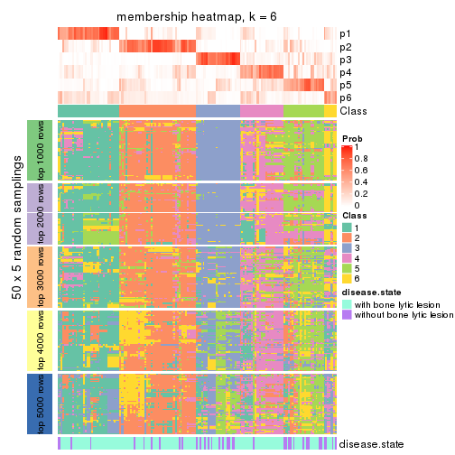</p>

</div>
</div>

As soon as we have had the classes for columns, we can look for signatures
which are significantly different between classes which can be candidate marks
for certain classes. Following are the heatmaps for signatures.


Signature heatmaps where rows are scaled:


<script>
$( function() {
	$( '#tabs-CV-kmeans-get-signatures' ).tabs();
} );
</script>
<div id='tabs-CV-kmeans-get-signatures'>
<ul>
<li><a href='#tab-CV-kmeans-get-signatures-1'>k = 2</a></li>
<li><a href='#tab-CV-kmeans-get-signatures-2'>k = 3</a></li>
<li><a href='#tab-CV-kmeans-get-signatures-3'>k = 4</a></li>
<li><a href='#tab-CV-kmeans-get-signatures-4'>k = 5</a></li>
<li><a href='#tab-CV-kmeans-get-signatures-5'>k = 6</a></li>
</ul>
<div id='tab-CV-kmeans-get-signatures-1'>
<pre><code class="r">get_signatures(res, k = 2)
</code></pre>

<p></p>

</div>
<div id='tab-CV-kmeans-get-signatures-2'>
<pre><code class="r">get_signatures(res, k = 3)
</code></pre>

<p></p>

</div>
<div id='tab-CV-kmeans-get-signatures-3'>
<pre><code class="r">get_signatures(res, k = 4)
</code></pre>

<p></p>

</div>
<div id='tab-CV-kmeans-get-signatures-4'>
<pre><code class="r">get_signatures(res, k = 5)
</code></pre>

<p></p>

</div>
<div id='tab-CV-kmeans-get-signatures-5'>
<pre><code class="r">get_signatures(res, k = 6)
</code></pre>

<p></p>

</div>
</div>


Signature heatmaps where rows are not scaled:


<script>
$( function() {
	$( '#tabs-CV-kmeans-get-signatures-no-scale' ).tabs();
} );
</script>
<div id='tabs-CV-kmeans-get-signatures-no-scale'>
<ul>
<li><a href='#tab-CV-kmeans-get-signatures-no-scale-1'>k = 2</a></li>
<li><a href='#tab-CV-kmeans-get-signatures-no-scale-2'>k = 3</a></li>
<li><a href='#tab-CV-kmeans-get-signatures-no-scale-3'>k = 4</a></li>
<li><a href='#tab-CV-kmeans-get-signatures-no-scale-4'>k = 5</a></li>
<li><a href='#tab-CV-kmeans-get-signatures-no-scale-5'>k = 6</a></li>
</ul>
<div id='tab-CV-kmeans-get-signatures-no-scale-1'>
<pre><code class="r">get_signatures(res, k = 2, scale_rows = FALSE)
</code></pre>

<p></p>

</div>
<div id='tab-CV-kmeans-get-signatures-no-scale-2'>
<pre><code class="r">get_signatures(res, k = 3, scale_rows = FALSE)
</code></pre>

<p></p>

</div>
<div id='tab-CV-kmeans-get-signatures-no-scale-3'>
<pre><code class="r">get_signatures(res, k = 4, scale_rows = FALSE)
</code></pre>

<p></p>

</div>
<div id='tab-CV-kmeans-get-signatures-no-scale-4'>
<pre><code class="r">get_signatures(res, k = 5, scale_rows = FALSE)
</code></pre>

<p></p>

</div>
<div id='tab-CV-kmeans-get-signatures-no-scale-5'>
<pre><code class="r">get_signatures(res, k = 6, scale_rows = FALSE)
</code></pre>

<p></p>

</div>
</div>


Compare the overlap of signatures from different k:

```r
compare_signatures(res)
```


`get_signature()` returns a data frame invisibly. TO get the list of signatures, the function
call should be assigned to a variable explicitly. In following code, if `plot` argument is set
to `FALSE`, no heatmap is plotted while only the differential analysis is performed.

```r
# code only for demonstration
tb = get_signature(res, k = ..., plot = FALSE)
```

An example of the output of `tb` is:

```
#>   which_row         fdr    mean_1    mean_2 scaled_mean_1 scaled_mean_2 km
#> 1        38 0.042760348  8.373488  9.131774    -0.5533452     0.5164555  1
#> 2        40 0.018707592  7.106213  8.469186    -0.6173731     0.5762149  1
#> 3        55 0.019134737 10.221463 11.207825    -0.6159697     0.5749050  1
#> 4        59 0.006059896  5.921854  7.869574    -0.6899429     0.6439467  1
#> 5        60 0.018055526  8.928898 10.211722    -0.6204761     0.5791110  1
#> 6        98 0.009384629 15.714769 14.887706     0.6635654    -0.6193277  2
...
```

The columns in `tb` are:

1. `which_row`: row indices corresponding to the input matrix.
2. `fdr`: FDR for the differential test. 
3. `mean_x`: The mean value in group x.
4. `scaled_mean_x`: The mean value in group x after rows are scaled.
5. `km`: Row groups if k-means clustering is applied to rows.


UMAP plot which shows how samples are separated.


<script>
$( function() {
	$( '#tabs-CV-kmeans-dimension-reduction' ).tabs();
} );
</script>
<div id='tabs-CV-kmeans-dimension-reduction'>
<ul>
<li><a href='#tab-CV-kmeans-dimension-reduction-1'>k = 2</a></li>
<li><a href='#tab-CV-kmeans-dimension-reduction-2'>k = 3</a></li>
<li><a href='#tab-CV-kmeans-dimension-reduction-3'>k = 4</a></li>
<li><a href='#tab-CV-kmeans-dimension-reduction-4'>k = 5</a></li>
<li><a href='#tab-CV-kmeans-dimension-reduction-5'>k = 6</a></li>
</ul>
<div id='tab-CV-kmeans-dimension-reduction-1'>
<pre><code class="r">dimension_reduction(res, k = 2, method = &quot;UMAP&quot;)
</code></pre>

<p></p>

</div>
<div id='tab-CV-kmeans-dimension-reduction-2'>
<pre><code class="r">dimension_reduction(res, k = 3, method = &quot;UMAP&quot;)
</code></pre>

<p></p>

</div>
<div id='tab-CV-kmeans-dimension-reduction-3'>
<pre><code class="r">dimension_reduction(res, k = 4, method = &quot;UMAP&quot;)
</code></pre>

<p></p>

</div>
<div id='tab-CV-kmeans-dimension-reduction-4'>
<pre><code class="r">dimension_reduction(res, k = 5, method = &quot;UMAP&quot;)
</code></pre>

<p></p>

</div>
<div id='tab-CV-kmeans-dimension-reduction-5'>
<pre><code class="r">dimension_reduction(res, k = 6, method = &quot;UMAP&quot;)
</code></pre>

<p></p>

</div>
</div>


Following heatmap shows how subgroups are split when increasing `k`:

```r
collect_classes(res)
```


Test correlation between subgroups and known annotations. If the known
annotation is numeric, one-way ANOVA test is applied, and if the known
annotation is discrete, chi-squared contingency table test is applied.

```r
test_to_known_factors(res)
```

```
#>             n disease.state(p) k
#> CV:kmeans 151          0.42618 2
#> CV:kmeans 138          0.25895 3
#> CV:kmeans  86          0.05696 4
#> CV:kmeans  95          0.02358 5
#> CV:kmeans  88          0.00176 6
```


If matrix rows can be associated to genes, consider to use `GO_Enrichment(res,
...)` to perform function enrichment for the signature genes.


 

---------------------------------------------------


### CV:skmeans


The object with results only for a single top-value method and a single partition method 
can be extracted as:

```r
res = res_list["CV", "skmeans"]
# you can also extract it by
# res = res_list["CV:skmeans"]
```

A summary of `res` and all the functions that can be applied to it:

```r
res
```

```
#> A 'ConsensusPartition' object with k = 2, 3, 4, 5, 6.
#>   On a matrix with 11993 rows and 173 columns.
#>   Top rows (1000, 2000, 3000, 4000, 5000) are extracted by 'CV' method.
#>   Subgroups are detected by 'skmeans' method.
#>   Performed in total 1250 partitions by row resampling.
#>   Best k for subgroups seems to be 2.
#> 
#> Following methods can be applied to this 'ConsensusPartition' object:
#>  [1] "cola_report"             "collect_classes"         "collect_plots"          
#>  [4] "collect_stats"           "colnames"                "compare_signatures"     
#>  [7] "consensus_heatmap"       "dimension_reduction"     "functional_enrichment"  
#> [10] "get_anno_col"            "get_anno"                "get_classes"            
#> [13] "get_consensus"           "get_matrix"              "get_membership"         
#> [16] "get_param"               "get_signatures"          "get_stats"              
#> [19] "is_best_k"               "is_stable_k"             "membership_heatmap"     
#> [22] "ncol"                    "nrow"                    "plot_ecdf"              
#> [25] "rownames"                "select_partition_number" "show"                   
#> [28] "suggest_best_k"          "test_to_known_factors"
```

`collect_plots()` function collects all the plots made from `res` for all `k` (number of partitions)
into one single page to provide an easy and fast comparison between different `k`.

```r
collect_plots(res)
```


The plots are:

- The first row: a plot of the ECDF (Empirical cumulative distribution
  function) curves of the consensus matrix for each `k` and the heatmap of
  predicted classes for each `k`.
- The second row: heatmaps of the consensus matrix for each `k`.
- The third row: heatmaps of the membership matrix for each `k`.
- The fouth row: heatmaps of the signatures for each `k`.

All the plots in panels can be made by individual functions and they are
plotted later in this section.

`select_partition_number()` produces several plots showing different
statistics for choosing "optimized" `k`. There are following statistics:

- ECDF curves of the consensus matrix for each `k`;
- 1-PAC. [The PAC
  score](https://en.wikipedia.org/wiki/Consensus_clustering#Over-interpretation_potential_of_consensus_clustering)
  measures the proportion of the ambiguous subgrouping.
- Mean silhouette score.
- Concordance. The mean probability of fiting the consensus class ids in all
  partitions.
- Area increased. Denote $A_k$ as the area under the ECDF curve for current
  `k`, the area increased is defined as $A_k - A_{k-1}$.
- Rand index. The percent of pairs of samples that are both in a same cluster
  or both are not in a same cluster in the partition of k and k-1.
- Jaccard index. The ratio of pairs of samples are both in a same cluster in
  the partition of k and k-1 and the pairs of samples are both in a same
  cluster in the partition k or k-1.

The detailed explanations of these statistics can be found in [the cola
vignette](http://bioconductor.org/packages/devel/bioc/vignettes/cola/inst/doc/cola.html#toc_13).

Generally speaking, lower PAC score, higher mean silhouette score or higher
concordance corresponds to better partition. Rand index and Jaccard index
measure how similar the current partition is compared to partition with `k-1`.
If they are too similar, we won't accept `k` is better than `k-1`.

```r
select_partition_number(res)
```


The numeric values for all these statistics can be obtained by `get_stats()`.

```r
get_stats(res)
```

```
#>   k 1-PAC mean_silhouette concordance area_increased  Rand Jaccard
#> 2 2 0.541           0.798       0.905         0.5029 0.497   0.497
#> 3 3 0.471           0.668       0.832         0.3309 0.727   0.504
#> 4 4 0.417           0.482       0.672         0.1212 0.839   0.566
#> 5 5 0.459           0.423       0.614         0.0657 0.898   0.634
#> 6 6 0.504           0.321       0.542         0.0410 0.931   0.697
```

`suggest_best_k()` suggests the best $k$ based on these statistics. The rules are as follows:

- All $k$ with Jaccard index larger than 0.95 are removed because the increase of
  the partition number does not provides enough extra information. If all $k$ are removed,
  the best $k$ is assigned by `NA`.
- For $k$ with 1-PAC larger than 0.9, the maximal $k$ is taken as the "best k". Other $k$ is called "optional k".
- If it does not fit the second rule. The $k$ with the highest vote of highest
  1-PAC, mean silhouette and concordance is taken as the "best k".

```r
suggest_best_k(res)
```

```
#> [1] 2
```


Following shows the table of the partitions (You need to click the **show/hide
code output** link to see it). The membership matrix (columns with name `p*`)
is inferred by
[`clue::cl_consensus()`](https://www.rdocumentation.org/link/cl_consensus?package=clue)
function with the `SE` method. Basically the value in the membership matrix
represents the probability to belong to a certain group. The finall class
label for an item is determined with the group with highest probability it
belongs to.

In `get_classes()` function, the entropy is calculated from the membership
matrix and the silhouette score is calculated from the consensus matrix.


<script>
$( function() {
	$( '#tabs-CV-skmeans-get-classes' ).tabs();
} );
</script>
<div id='tabs-CV-skmeans-get-classes'>
<ul>
<li><a href='#tab-CV-skmeans-get-classes-1'>k = 2</a></li>
<li><a href='#tab-CV-skmeans-get-classes-2'>k = 3</a></li>
<li><a href='#tab-CV-skmeans-get-classes-3'>k = 4</a></li>
<li><a href='#tab-CV-skmeans-get-classes-4'>k = 5</a></li>
<li><a href='#tab-CV-skmeans-get-classes-5'>k = 6</a></li>
</ul>

<div id='tab-CV-skmeans-get-classes-1'>
<p><a id='tab-CV-skmeans-get-classes-1-a' style='color:#0366d6' href='#'>show/hide code output</a></p>
<pre><code class="r">cbind(get_classes(res, k = 2), get_membership(res, k = 2))
</code></pre>

<pre><code>#&gt;          class entropy silhouette    p1    p2
#&gt; GSM11437     1  0.9460    0.46543 0.636 0.364
#&gt; GSM11438     2  0.0000    0.90585 0.000 1.000
#&gt; GSM11439     2  0.2948    0.88673 0.052 0.948
#&gt; GSM11440     1  0.4431    0.85041 0.908 0.092
#&gt; GSM11441     1  0.8386    0.64224 0.732 0.268
#&gt; GSM11442     2  0.2043    0.89717 0.032 0.968
#&gt; GSM11443     2  0.0000    0.90585 0.000 1.000
#&gt; GSM11444     1  0.9732    0.36162 0.596 0.404
#&gt; GSM11445     2  0.9988    0.04776 0.480 0.520
#&gt; GSM11446     2  0.9998    0.00569 0.492 0.508
#&gt; GSM11447     2  0.2948    0.88673 0.052 0.948
#&gt; GSM11448     2  0.8144    0.65013 0.252 0.748
#&gt; GSM11449     1  0.0938    0.88054 0.988 0.012
#&gt; GSM11450     1  0.0938    0.88153 0.988 0.012
#&gt; GSM11451     2  0.0376    0.90493 0.004 0.996
#&gt; GSM11452     1  0.9248    0.53475 0.660 0.340
#&gt; GSM11453     1  0.4161    0.85800 0.916 0.084
#&gt; GSM11454     1  0.7815    0.68749 0.768 0.232
#&gt; GSM11455     2  0.0000    0.90585 0.000 1.000
#&gt; GSM11456     2  0.0000    0.90585 0.000 1.000
#&gt; GSM11457     2  0.0000    0.90585 0.000 1.000
#&gt; GSM11458     1  0.0000    0.88110 1.000 0.000
#&gt; GSM11459     1  0.3114    0.86150 0.944 0.056
#&gt; GSM11460     1  0.0000    0.88110 1.000 0.000
#&gt; GSM11461     1  0.1414    0.88038 0.980 0.020
#&gt; GSM11462     1  0.0000    0.88110 1.000 0.000
#&gt; GSM11463     2  0.0376    0.90529 0.004 0.996
#&gt; GSM11464     1  0.0000    0.88110 1.000 0.000
#&gt; GSM11465     2  0.8763    0.56934 0.296 0.704
#&gt; GSM11466     1  0.3114    0.86494 0.944 0.056
#&gt; GSM11467     1  0.0672    0.88103 0.992 0.008
#&gt; GSM11468     1  0.4431    0.83845 0.908 0.092
#&gt; GSM11469     1  0.0376    0.88115 0.996 0.004
#&gt; GSM11470     1  0.0672    0.88103 0.992 0.008
#&gt; GSM11471     1  0.0672    0.88103 0.992 0.008
#&gt; GSM11472     1  0.5408    0.82007 0.876 0.124
#&gt; GSM11473     2  0.0938    0.90362 0.012 0.988
#&gt; GSM11474     2  0.0000    0.90585 0.000 1.000
#&gt; GSM11475     2  0.9963    0.12608 0.464 0.536
#&gt; GSM11476     2  0.1184    0.90230 0.016 0.984
#&gt; GSM11477     2  0.0000    0.90585 0.000 1.000
#&gt; GSM11478     2  0.0000    0.90585 0.000 1.000
#&gt; GSM11479     2  0.1184    0.90230 0.016 0.984
#&gt; GSM11480     2  0.0000    0.90585 0.000 1.000
#&gt; GSM11481     1  0.2423    0.87594 0.960 0.040
#&gt; GSM11482     2  0.2043    0.89833 0.032 0.968
#&gt; GSM11483     2  0.0672    0.90459 0.008 0.992
#&gt; GSM11484     2  0.7950    0.68773 0.240 0.760
#&gt; GSM11485     2  0.0672    0.90459 0.008 0.992
#&gt; GSM11486     2  0.0376    0.90532 0.004 0.996
#&gt; GSM11487     1  0.0938    0.88079 0.988 0.012
#&gt; GSM11488     2  0.6531    0.78471 0.168 0.832
#&gt; GSM11489     2  0.0000    0.90585 0.000 1.000
#&gt; GSM11490     2  0.3431    0.88097 0.064 0.936
#&gt; GSM11491     1  0.1843    0.87822 0.972 0.028
#&gt; GSM11492     2  0.8661    0.60400 0.288 0.712
#&gt; GSM11493     2  0.5294    0.83596 0.120 0.880
#&gt; GSM11494     2  0.3114    0.88510 0.056 0.944
#&gt; GSM11495     2  0.1184    0.90230 0.016 0.984
#&gt; GSM11496     2  0.0938    0.90362 0.012 0.988
#&gt; GSM11497     2  0.6148    0.79225 0.152 0.848
#&gt; GSM11498     2  0.0000    0.90585 0.000 1.000
#&gt; GSM11499     2  0.0672    0.90459 0.008 0.992
#&gt; GSM11500     2  0.1414    0.90117 0.020 0.980
#&gt; GSM11501     2  0.0376    0.90532 0.004 0.996
#&gt; GSM11502     2  0.0000    0.90585 0.000 1.000
#&gt; GSM11503     2  0.0000    0.90585 0.000 1.000
#&gt; GSM11504     1  0.7883    0.68367 0.764 0.236
#&gt; GSM11505     2  0.0000    0.90585 0.000 1.000
#&gt; GSM11506     2  0.0672    0.90459 0.008 0.992
#&gt; GSM11507     2  0.0000    0.90585 0.000 1.000
#&gt; GSM11508     1  0.9087    0.54048 0.676 0.324
#&gt; GSM11509     2  0.5629    0.82634 0.132 0.868
#&gt; GSM11510     2  0.0000    0.90585 0.000 1.000
#&gt; GSM11511     1  0.8327    0.66643 0.736 0.264
#&gt; GSM11512     2  0.9996    0.01683 0.488 0.512
#&gt; GSM11513     1  0.8144    0.66691 0.748 0.252
#&gt; GSM11514     2  0.7883    0.69381 0.236 0.764
#&gt; GSM11515     2  0.2778    0.88978 0.048 0.952
#&gt; GSM11516     1  0.7674    0.71797 0.776 0.224
#&gt; GSM11517     1  0.3274    0.85684 0.940 0.060
#&gt; GSM11518     2  0.6712    0.78587 0.176 0.824
#&gt; GSM11519     1  0.1414    0.87900 0.980 0.020
#&gt; GSM11520     1  0.0672    0.88103 0.992 0.008
#&gt; GSM11521     2  0.0938    0.90387 0.012 0.988
#&gt; GSM11522     1  0.0938    0.88054 0.988 0.012
#&gt; GSM11523     1  0.0000    0.88110 1.000 0.000
#&gt; GSM11524     1  0.0000    0.88110 1.000 0.000
#&gt; GSM11525     2  0.0000    0.90585 0.000 1.000
#&gt; GSM11526     1  0.9661    0.38760 0.608 0.392
#&gt; GSM11527     2  0.0938    0.90362 0.012 0.988
#&gt; GSM11528     2  0.0000    0.90585 0.000 1.000
#&gt; GSM11529     2  0.4298    0.85888 0.088 0.912
#&gt; GSM11530     1  0.0672    0.88103 0.992 0.008
#&gt; GSM11531     2  0.0000    0.90585 0.000 1.000
#&gt; GSM11532     1  0.1843    0.87590 0.972 0.028
#&gt; GSM11533     2  0.4939    0.83734 0.108 0.892
#&gt; GSM11534     1  0.9795    0.37956 0.584 0.416
#&gt; GSM11535     2  0.0000    0.90585 0.000 1.000
#&gt; GSM11536     2  0.6887    0.76410 0.184 0.816
#&gt; GSM11537     2  0.0672    0.90375 0.008 0.992
#&gt; GSM11538     1  0.2948    0.86872 0.948 0.052
#&gt; GSM11539     2  0.0000    0.90585 0.000 1.000
#&gt; GSM11540     2  0.0000    0.90585 0.000 1.000
#&gt; GSM11541     1  0.0000    0.88110 1.000 0.000
#&gt; GSM11542     2  0.0000    0.90585 0.000 1.000
#&gt; GSM11543     2  0.4431    0.86245 0.092 0.908
#&gt; GSM11544     1  0.1184    0.87980 0.984 0.016
#&gt; GSM11545     1  0.7528    0.72645 0.784 0.216
#&gt; GSM11546     2  0.2778    0.89168 0.048 0.952
#&gt; GSM11547     2  0.3274    0.88418 0.060 0.940
#&gt; GSM11548     2  0.8207    0.66897 0.256 0.744
#&gt; GSM11549     1  0.0000    0.88110 1.000 0.000
#&gt; GSM11550     1  0.0000    0.88110 1.000 0.000
#&gt; GSM11551     1  0.7299    0.73591 0.796 0.204
#&gt; GSM11552     1  0.0000    0.88110 1.000 0.000
#&gt; GSM11553     2  0.6623    0.75729 0.172 0.828
#&gt; GSM11554     2  0.0000    0.90585 0.000 1.000
#&gt; GSM11555     1  0.1633    0.87909 0.976 0.024
#&gt; GSM11556     1  0.0000    0.88110 1.000 0.000
#&gt; GSM11557     2  0.0000    0.90585 0.000 1.000
#&gt; GSM11558     2  0.0000    0.90585 0.000 1.000
#&gt; GSM11559     2  0.5408    0.81522 0.124 0.876
#&gt; GSM11560     1  0.0000    0.88110 1.000 0.000
#&gt; GSM11561     2  0.0000    0.90585 0.000 1.000
#&gt; GSM11562     2  0.0000    0.90585 0.000 1.000
#&gt; GSM11563     1  0.4161    0.85393 0.916 0.084
#&gt; GSM11564     1  0.9815    0.28109 0.580 0.420
#&gt; GSM11565     1  0.3733    0.85875 0.928 0.072
#&gt; GSM11566     2  0.1414    0.89946 0.020 0.980
#&gt; GSM11567     1  0.9522    0.46116 0.628 0.372
#&gt; GSM11568     1  0.7299    0.74143 0.796 0.204
#&gt; GSM11569     2  0.0000    0.90585 0.000 1.000
#&gt; GSM11570     1  0.0000    0.88110 1.000 0.000
#&gt; GSM11571     1  0.2603    0.87288 0.956 0.044
#&gt; GSM11572     1  0.9909    0.26544 0.556 0.444
#&gt; GSM11573     1  0.5408    0.82506 0.876 0.124
#&gt; GSM11574     2  0.7299    0.71506 0.204 0.796
#&gt; GSM11575     1  0.9922    0.22429 0.552 0.448
#&gt; GSM11576     1  0.0376    0.88112 0.996 0.004
#&gt; GSM11577     1  0.2948    0.86820 0.948 0.052
#&gt; GSM11578     1  0.9129    0.55856 0.672 0.328
#&gt; GSM11579     2  0.1633    0.90054 0.024 0.976
#&gt; GSM11580     1  0.8499    0.64879 0.724 0.276
#&gt; GSM11581     1  0.5059    0.82411 0.888 0.112
#&gt; GSM11582     1  0.0000    0.88110 1.000 0.000
#&gt; GSM11583     1  0.8499    0.61677 0.724 0.276
#&gt; GSM11584     1  0.9896    0.22004 0.560 0.440
#&gt; GSM11585     2  0.0672    0.90373 0.008 0.992
#&gt; GSM11586     1  0.0672    0.88120 0.992 0.008
#&gt; GSM11587     1  0.0000    0.88110 1.000 0.000
#&gt; GSM11588     1  0.3733    0.85954 0.928 0.072
#&gt; GSM11589     1  0.2603    0.87098 0.956 0.044
#&gt; GSM11590     1  0.1184    0.87980 0.984 0.016
#&gt; GSM11591     2  0.6623    0.75950 0.172 0.828
#&gt; GSM11592     1  0.0000    0.88110 1.000 0.000
#&gt; GSM11593     1  0.1184    0.87980 0.984 0.016
#&gt; GSM11594     1  0.0000    0.88110 1.000 0.000
#&gt; GSM11595     1  0.9460    0.48371 0.636 0.364
#&gt; GSM11596     2  0.8555    0.63490 0.280 0.720
#&gt; GSM11597     1  0.0000    0.88110 1.000 0.000
#&gt; GSM11598     1  0.1184    0.87980 0.984 0.016
#&gt; GSM11599     1  0.0376    0.88076 0.996 0.004
#&gt; GSM11600     1  0.1633    0.87736 0.976 0.024
#&gt; GSM11601     2  0.1633    0.89672 0.024 0.976
#&gt; GSM11602     1  0.0000    0.88110 1.000 0.000
#&gt; GSM11603     1  0.0000    0.88110 1.000 0.000
#&gt; GSM11604     1  0.0000    0.88110 1.000 0.000
#&gt; GSM11605     1  0.0000    0.88110 1.000 0.000
#&gt; GSM11606     2  0.7376    0.70816 0.208 0.792
#&gt; GSM11607     1  0.1184    0.87980 0.984 0.016
#&gt; GSM11608     1  0.0000    0.88110 1.000 0.000
#&gt; GSM11609     2  0.9661    0.35334 0.392 0.608
</code></pre>

<script>
$('#tab-CV-skmeans-get-classes-1-a').parent().next().next().hide();
$('#tab-CV-skmeans-get-classes-1-a').click(function(){
  $('#tab-CV-skmeans-get-classes-1-a').parent().next().next().toggle();
  return(false);
});
</script>
</div>

<div id='tab-CV-skmeans-get-classes-2'>
<p><a id='tab-CV-skmeans-get-classes-2-a' style='color:#0366d6' href='#'>show/hide code output</a></p>
<pre><code class="r">cbind(get_classes(res, k = 3), get_membership(res, k = 3))
</code></pre>

<pre><code>#&gt;          class entropy silhouette    p1    p2    p3
#&gt; GSM11437     1  0.8338     0.2081 0.516 0.084 0.400
#&gt; GSM11438     2  0.4002     0.7774 0.000 0.840 0.160
#&gt; GSM11439     3  0.6095     0.1834 0.000 0.392 0.608
#&gt; GSM11440     3  0.3764     0.7770 0.040 0.068 0.892
#&gt; GSM11441     3  0.2400     0.7847 0.064 0.004 0.932
#&gt; GSM11442     3  0.1411     0.7921 0.000 0.036 0.964
#&gt; GSM11443     2  0.2878     0.8181 0.000 0.904 0.096
#&gt; GSM11444     3  0.1182     0.7951 0.012 0.012 0.976
#&gt; GSM11445     3  0.0424     0.7929 0.000 0.008 0.992
#&gt; GSM11446     3  0.0983     0.7941 0.016 0.004 0.980
#&gt; GSM11447     3  0.3619     0.7192 0.000 0.136 0.864
#&gt; GSM11448     2  0.6487     0.5490 0.268 0.700 0.032
#&gt; GSM11449     1  0.5610     0.6642 0.776 0.028 0.196
#&gt; GSM11450     1  0.2527     0.7893 0.936 0.044 0.020
#&gt; GSM11451     2  0.1643     0.8251 0.044 0.956 0.000
#&gt; GSM11452     1  0.6299     0.1886 0.524 0.476 0.000
#&gt; GSM11453     1  0.4007     0.7732 0.880 0.084 0.036
#&gt; GSM11454     3  0.1163     0.7924 0.028 0.000 0.972
#&gt; GSM11455     2  0.5650     0.5860 0.000 0.688 0.312
#&gt; GSM11456     2  0.1163     0.8384 0.000 0.972 0.028
#&gt; GSM11457     2  0.0237     0.8355 0.004 0.996 0.000
#&gt; GSM11458     3  0.6280     0.1465 0.460 0.000 0.540
#&gt; GSM11459     3  0.2796     0.7705 0.092 0.000 0.908
#&gt; GSM11460     1  0.3686     0.7182 0.860 0.000 0.140
#&gt; GSM11461     1  0.5951     0.6565 0.764 0.040 0.196
#&gt; GSM11462     1  0.6204     0.2250 0.576 0.000 0.424
#&gt; GSM11463     2  0.1399     0.8372 0.004 0.968 0.028
#&gt; GSM11464     1  0.2356     0.7729 0.928 0.000 0.072
#&gt; GSM11465     2  0.6057     0.6566 0.044 0.760 0.196
#&gt; GSM11466     3  0.2793     0.7919 0.044 0.028 0.928
#&gt; GSM11467     1  0.0848     0.7910 0.984 0.008 0.008
#&gt; GSM11468     3  0.3340     0.7529 0.120 0.000 0.880
#&gt; GSM11469     3  0.5397     0.5670 0.280 0.000 0.720
#&gt; GSM11470     1  0.0000     0.7894 1.000 0.000 0.000
#&gt; GSM11471     1  0.6601     0.5182 0.676 0.028 0.296
#&gt; GSM11472     1  0.6282     0.3108 0.612 0.004 0.384
#&gt; GSM11473     2  0.4931     0.7410 0.004 0.784 0.212
#&gt; GSM11474     2  0.1753     0.8339 0.000 0.952 0.048
#&gt; GSM11475     3  0.3587     0.7715 0.088 0.020 0.892
#&gt; GSM11476     3  0.5327     0.5187 0.000 0.272 0.728
#&gt; GSM11477     2  0.0661     0.8368 0.004 0.988 0.008
#&gt; GSM11478     2  0.2066     0.8312 0.000 0.940 0.060
#&gt; GSM11479     2  0.5733     0.5896 0.000 0.676 0.324
#&gt; GSM11480     2  0.0424     0.8371 0.000 0.992 0.008
#&gt; GSM11481     3  0.7186     0.3983 0.336 0.040 0.624
#&gt; GSM11482     3  0.4351     0.7278 0.004 0.168 0.828
#&gt; GSM11483     2  0.6111     0.4591 0.000 0.604 0.396
#&gt; GSM11484     3  0.2056     0.7938 0.024 0.024 0.952
#&gt; GSM11485     2  0.6008     0.4973 0.000 0.628 0.372
#&gt; GSM11486     2  0.3340     0.8060 0.000 0.880 0.120
#&gt; GSM11487     1  0.2297     0.7885 0.944 0.020 0.036
#&gt; GSM11488     3  0.1399     0.7945 0.004 0.028 0.968
#&gt; GSM11489     2  0.3686     0.7914 0.000 0.860 0.140
#&gt; GSM11490     3  0.4390     0.7087 0.012 0.148 0.840
#&gt; GSM11491     1  0.2356     0.7830 0.928 0.072 0.000
#&gt; GSM11492     3  0.2806     0.7876 0.032 0.040 0.928
#&gt; GSM11493     3  0.1289     0.7932 0.000 0.032 0.968
#&gt; GSM11494     3  0.2165     0.7817 0.000 0.064 0.936
#&gt; GSM11495     3  0.5650     0.4148 0.000 0.312 0.688
#&gt; GSM11496     2  0.6204     0.4068 0.000 0.576 0.424
#&gt; GSM11497     2  0.7557     0.5532 0.264 0.656 0.080
#&gt; GSM11498     2  0.3637     0.8250 0.024 0.892 0.084
#&gt; GSM11499     2  0.6168     0.4252 0.000 0.588 0.412
#&gt; GSM11500     2  0.6235     0.3690 0.000 0.564 0.436
#&gt; GSM11501     2  0.6026     0.4586 0.000 0.624 0.376
#&gt; GSM11502     2  0.0237     0.8355 0.004 0.996 0.000
#&gt; GSM11503     2  0.2116     0.8376 0.012 0.948 0.040
#&gt; GSM11504     3  0.1015     0.7932 0.012 0.008 0.980
#&gt; GSM11505     2  0.2165     0.8297 0.000 0.936 0.064
#&gt; GSM11506     2  0.4178     0.7708 0.000 0.828 0.172
#&gt; GSM11507     2  0.0424     0.8371 0.000 0.992 0.008
#&gt; GSM11508     3  0.0592     0.7910 0.012 0.000 0.988
#&gt; GSM11509     3  0.2625     0.7699 0.000 0.084 0.916
#&gt; GSM11510     2  0.5431     0.6503 0.000 0.716 0.284
#&gt; GSM11511     1  0.4253     0.7609 0.872 0.048 0.080
#&gt; GSM11512     3  0.1170     0.7937 0.008 0.016 0.976
#&gt; GSM11513     3  0.1860     0.7874 0.052 0.000 0.948
#&gt; GSM11514     3  0.8310     0.3614 0.088 0.368 0.544
#&gt; GSM11515     3  0.1860     0.7890 0.000 0.052 0.948
#&gt; GSM11516     1  0.5859     0.5105 0.656 0.344 0.000
#&gt; GSM11517     3  0.3038     0.7674 0.104 0.000 0.896
#&gt; GSM11518     3  0.7624     0.5697 0.104 0.224 0.672
#&gt; GSM11519     1  0.2165     0.7847 0.936 0.064 0.000
#&gt; GSM11520     1  0.0000     0.7894 1.000 0.000 0.000
#&gt; GSM11521     3  0.5431     0.5116 0.000 0.284 0.716
#&gt; GSM11522     1  0.5698     0.5930 0.736 0.012 0.252
#&gt; GSM11523     1  0.0237     0.7890 0.996 0.000 0.004
#&gt; GSM11524     3  0.2066     0.7834 0.060 0.000 0.940
#&gt; GSM11525     2  0.2878     0.8194 0.000 0.904 0.096
#&gt; GSM11526     3  0.1399     0.7946 0.028 0.004 0.968
#&gt; GSM11527     2  0.4654     0.7384 0.000 0.792 0.208
#&gt; GSM11528     2  0.1289     0.8374 0.000 0.968 0.032
#&gt; GSM11529     2  0.6756     0.6137 0.232 0.712 0.056
#&gt; GSM11530     3  0.7128     0.4123 0.344 0.036 0.620
#&gt; GSM11531     2  0.1399     0.8371 0.004 0.968 0.028
#&gt; GSM11532     3  0.5845     0.5138 0.308 0.004 0.688
#&gt; GSM11533     2  0.6018     0.4656 0.308 0.684 0.008
#&gt; GSM11534     1  0.7187     0.6266 0.692 0.232 0.076
#&gt; GSM11535     2  0.1781     0.8375 0.020 0.960 0.020
#&gt; GSM11536     3  0.5891     0.6949 0.036 0.200 0.764
#&gt; GSM11537     2  0.1529     0.8261 0.040 0.960 0.000
#&gt; GSM11538     1  0.7391     0.6505 0.696 0.108 0.196
#&gt; GSM11539     2  0.0892     0.8373 0.000 0.980 0.020
#&gt; GSM11540     2  0.0424     0.8369 0.000 0.992 0.008
#&gt; GSM11541     1  0.4605     0.6728 0.796 0.000 0.204
#&gt; GSM11542     2  0.1015     0.8354 0.012 0.980 0.008
#&gt; GSM11543     3  0.9076     0.0919 0.144 0.368 0.488
#&gt; GSM11544     1  0.1643     0.7890 0.956 0.044 0.000
#&gt; GSM11545     1  0.4842     0.7058 0.776 0.224 0.000
#&gt; GSM11546     2  0.6181     0.7479 0.116 0.780 0.104
#&gt; GSM11547     2  0.5514     0.7489 0.156 0.800 0.044
#&gt; GSM11548     3  0.1636     0.7964 0.016 0.020 0.964
#&gt; GSM11549     1  0.0237     0.7890 0.996 0.000 0.004
#&gt; GSM11550     1  0.0424     0.7893 0.992 0.000 0.008
#&gt; GSM11551     3  0.7589     0.3808 0.360 0.052 0.588
#&gt; GSM11552     3  0.6291     0.1200 0.468 0.000 0.532
#&gt; GSM11553     2  0.0892     0.8325 0.020 0.980 0.000
#&gt; GSM11554     2  0.0237     0.8355 0.004 0.996 0.000
#&gt; GSM11555     1  0.7940     0.4345 0.592 0.076 0.332
#&gt; GSM11556     1  0.5926     0.3979 0.644 0.000 0.356
#&gt; GSM11557     2  0.1129     0.8370 0.004 0.976 0.020
#&gt; GSM11558     2  0.0237     0.8368 0.000 0.996 0.004
#&gt; GSM11559     2  0.1643     0.8244 0.044 0.956 0.000
#&gt; GSM11560     1  0.0892     0.7860 0.980 0.000 0.020
#&gt; GSM11561     2  0.0237     0.8368 0.000 0.996 0.004
#&gt; GSM11562     2  0.0424     0.8352 0.008 0.992 0.000
#&gt; GSM11563     1  0.5236     0.7322 0.804 0.168 0.028
#&gt; GSM11564     1  0.7772     0.5848 0.672 0.196 0.132
#&gt; GSM11565     1  0.3619     0.7569 0.864 0.136 0.000
#&gt; GSM11566     2  0.2806     0.8302 0.032 0.928 0.040
#&gt; GSM11567     3  0.5075     0.7524 0.096 0.068 0.836
#&gt; GSM11568     1  0.5497     0.5928 0.708 0.292 0.000
#&gt; GSM11569     2  0.0237     0.8355 0.004 0.996 0.000
#&gt; GSM11570     3  0.6302     0.0826 0.480 0.000 0.520
#&gt; GSM11571     1  0.0424     0.7914 0.992 0.008 0.000
#&gt; GSM11572     2  0.6879     0.3348 0.360 0.616 0.024
#&gt; GSM11573     1  0.4861     0.7223 0.800 0.192 0.008
#&gt; GSM11574     2  0.2165     0.8128 0.064 0.936 0.000
#&gt; GSM11575     2  0.6816     0.0781 0.472 0.516 0.012
#&gt; GSM11576     1  0.0237     0.7890 0.996 0.000 0.004
#&gt; GSM11577     1  0.3686     0.7565 0.860 0.140 0.000
#&gt; GSM11578     1  0.6095     0.4137 0.608 0.392 0.000
#&gt; GSM11579     2  0.6799     0.2122 0.012 0.532 0.456
#&gt; GSM11580     1  0.4555     0.7158 0.800 0.200 0.000
#&gt; GSM11581     3  0.1964     0.7846 0.056 0.000 0.944
#&gt; GSM11582     1  0.6244     0.1812 0.560 0.000 0.440
#&gt; GSM11583     1  0.8119     0.0404 0.500 0.068 0.432
#&gt; GSM11584     3  0.2116     0.7905 0.040 0.012 0.948
#&gt; GSM11585     2  0.0475     0.8362 0.004 0.992 0.004
#&gt; GSM11586     1  0.1182     0.7915 0.976 0.012 0.012
#&gt; GSM11587     1  0.0237     0.7890 0.996 0.000 0.004
#&gt; GSM11588     1  0.4465     0.7339 0.820 0.176 0.004
#&gt; GSM11589     1  0.3377     0.7776 0.896 0.092 0.012
#&gt; GSM11590     1  0.0747     0.7903 0.984 0.016 0.000
#&gt; GSM11591     2  0.1031     0.8327 0.024 0.976 0.000
#&gt; GSM11592     1  0.1411     0.7858 0.964 0.000 0.036
#&gt; GSM11593     1  0.0592     0.7901 0.988 0.012 0.000
#&gt; GSM11594     1  0.0747     0.7883 0.984 0.000 0.016
#&gt; GSM11595     1  0.9252     0.2261 0.448 0.396 0.156
#&gt; GSM11596     2  0.6764     0.7044 0.148 0.744 0.108
#&gt; GSM11597     3  0.5754     0.5781 0.296 0.004 0.700
#&gt; GSM11598     1  0.0747     0.7903 0.984 0.016 0.000
#&gt; GSM11599     3  0.2711     0.7715 0.088 0.000 0.912
#&gt; GSM11600     1  0.6228     0.3523 0.624 0.004 0.372
#&gt; GSM11601     2  0.4409     0.7644 0.004 0.824 0.172
#&gt; GSM11602     1  0.0237     0.7890 0.996 0.000 0.004
#&gt; GSM11603     1  0.0237     0.7890 0.996 0.000 0.004
#&gt; GSM11604     3  0.6225     0.2424 0.432 0.000 0.568
#&gt; GSM11605     1  0.3752     0.7203 0.856 0.000 0.144
#&gt; GSM11606     2  0.1529     0.8262 0.040 0.960 0.000
#&gt; GSM11607     1  0.0592     0.7901 0.988 0.012 0.000
#&gt; GSM11608     1  0.6140     0.2804 0.596 0.000 0.404
#&gt; GSM11609     3  0.7860     0.6326 0.132 0.204 0.664
</code></pre>

<script>
$('#tab-CV-skmeans-get-classes-2-a').parent().next().next().hide();
$('#tab-CV-skmeans-get-classes-2-a').click(function(){
  $('#tab-CV-skmeans-get-classes-2-a').parent().next().next().toggle();
  return(false);
});
</script>
</div>

<div id='tab-CV-skmeans-get-classes-3'>
<p><a id='tab-CV-skmeans-get-classes-3-a' style='color:#0366d6' href='#'>show/hide code output</a></p>
<pre><code class="r">cbind(get_classes(res, k = 4), get_membership(res, k = 4))
</code></pre>

<pre><code>#&gt;          class entropy silhouette    p1    p2    p3    p4
#&gt; GSM11437     4  0.9323    0.07836 0.308 0.104 0.208 0.380
#&gt; GSM11438     2  0.6384    0.25402 0.000 0.532 0.068 0.400
#&gt; GSM11439     4  0.7931    0.26828 0.004 0.260 0.312 0.424
#&gt; GSM11440     3  0.4635    0.51861 0.032 0.028 0.812 0.128
#&gt; GSM11441     3  0.6957    0.04763 0.056 0.024 0.480 0.440
#&gt; GSM11442     3  0.5931    0.02294 0.000 0.036 0.504 0.460
#&gt; GSM11443     2  0.3991    0.66299 0.000 0.832 0.048 0.120
#&gt; GSM11444     3  0.4257    0.49640 0.000 0.048 0.812 0.140
#&gt; GSM11445     3  0.3542    0.53151 0.000 0.028 0.852 0.120
#&gt; GSM11446     3  0.5284    0.36657 0.000 0.040 0.696 0.264
#&gt; GSM11447     3  0.7047   -0.13419 0.000 0.120 0.444 0.436
#&gt; GSM11448     2  0.8814    0.21324 0.280 0.428 0.056 0.236
#&gt; GSM11449     3  0.6283    0.19258 0.444 0.024 0.512 0.020
#&gt; GSM11450     1  0.3465    0.75177 0.880 0.020 0.072 0.028
#&gt; GSM11451     2  0.3523    0.71415 0.032 0.856 0.000 0.112
#&gt; GSM11452     1  0.5721    0.26087 0.548 0.428 0.004 0.020
#&gt; GSM11453     1  0.5675    0.70897 0.744 0.052 0.032 0.172
#&gt; GSM11454     3  0.4461    0.50502 0.012 0.016 0.788 0.184
#&gt; GSM11455     4  0.6685    0.31619 0.000 0.324 0.108 0.568
#&gt; GSM11456     2  0.6274    0.44917 0.016 0.612 0.044 0.328
#&gt; GSM11457     2  0.2010    0.72547 0.004 0.932 0.004 0.060
#&gt; GSM11458     3  0.4609    0.53404 0.224 0.000 0.752 0.024
#&gt; GSM11459     3  0.3619    0.55954 0.036 0.004 0.860 0.100
#&gt; GSM11460     1  0.6722    0.47851 0.616 0.000 0.200 0.184
#&gt; GSM11461     1  0.9298   -0.07283 0.360 0.112 0.348 0.180
#&gt; GSM11462     3  0.4776    0.50875 0.272 0.000 0.712 0.016
#&gt; GSM11463     2  0.3150    0.69899 0.004 0.888 0.036 0.072
#&gt; GSM11464     1  0.5470    0.66403 0.736 0.000 0.148 0.116
#&gt; GSM11465     2  0.9350   -0.00796 0.104 0.376 0.304 0.216
#&gt; GSM11466     3  0.6198    0.40091 0.048 0.020 0.652 0.280
#&gt; GSM11467     1  0.4608    0.71157 0.800 0.000 0.096 0.104
#&gt; GSM11468     3  0.2644    0.56341 0.032 0.000 0.908 0.060
#&gt; GSM11469     3  0.3243    0.56769 0.088 0.000 0.876 0.036
#&gt; GSM11470     1  0.1706    0.75439 0.948 0.000 0.036 0.016
#&gt; GSM11471     3  0.7274    0.14078 0.436 0.044 0.468 0.052
#&gt; GSM11472     1  0.8400    0.12951 0.428 0.028 0.228 0.316
#&gt; GSM11473     2  0.6497    0.35165 0.000 0.596 0.100 0.304
#&gt; GSM11474     2  0.3099    0.69879 0.000 0.876 0.020 0.104
#&gt; GSM11475     3  0.4920    0.53304 0.028 0.056 0.804 0.112
#&gt; GSM11476     4  0.5234    0.49087 0.000 0.096 0.152 0.752
#&gt; GSM11477     2  0.2384    0.72364 0.004 0.916 0.008 0.072
#&gt; GSM11478     2  0.3219    0.70579 0.000 0.836 0.000 0.164
#&gt; GSM11479     4  0.6770    0.14964 0.000 0.408 0.096 0.496
#&gt; GSM11480     2  0.3355    0.69883 0.000 0.836 0.004 0.160
#&gt; GSM11481     4  0.7246   -0.04368 0.124 0.004 0.424 0.448
#&gt; GSM11482     4  0.6201    0.39213 0.000 0.080 0.300 0.620
#&gt; GSM11483     4  0.6820    0.27580 0.000 0.364 0.108 0.528
#&gt; GSM11484     4  0.5519    0.31957 0.004 0.028 0.316 0.652
#&gt; GSM11485     4  0.5619    0.41469 0.000 0.248 0.064 0.688
#&gt; GSM11486     2  0.5404    0.52737 0.000 0.700 0.052 0.248
#&gt; GSM11487     1  0.4331    0.72518 0.800 0.004 0.028 0.168
#&gt; GSM11488     4  0.4546    0.37886 0.000 0.012 0.256 0.732
#&gt; GSM11489     2  0.7030    0.29173 0.016 0.524 0.080 0.380
#&gt; GSM11490     4  0.7484    0.15980 0.004 0.156 0.384 0.456
#&gt; GSM11491     1  0.3798    0.75356 0.856 0.032 0.012 0.100
#&gt; GSM11492     4  0.5478    0.26058 0.008 0.016 0.340 0.636
#&gt; GSM11493     4  0.5069    0.31240 0.000 0.016 0.320 0.664
#&gt; GSM11494     4  0.6033    0.30856 0.000 0.064 0.316 0.620
#&gt; GSM11495     4  0.6098    0.43555 0.000 0.124 0.200 0.676
#&gt; GSM11496     4  0.7449    0.27351 0.000 0.356 0.180 0.464
#&gt; GSM11497     2  0.7010    0.45054 0.276 0.608 0.028 0.088
#&gt; GSM11498     2  0.6524    0.61110 0.064 0.680 0.044 0.212
#&gt; GSM11499     4  0.5596    0.45532 0.000 0.236 0.068 0.696
#&gt; GSM11500     4  0.7167    0.21842 0.000 0.396 0.136 0.468
#&gt; GSM11501     4  0.5816    0.45639 0.000 0.224 0.088 0.688
#&gt; GSM11502     2  0.2549    0.71845 0.024 0.916 0.004 0.056
#&gt; GSM11503     2  0.4026    0.70170 0.012 0.848 0.048 0.092
#&gt; GSM11504     4  0.5377    0.17725 0.012 0.004 0.376 0.608
#&gt; GSM11505     2  0.2775    0.69981 0.000 0.896 0.020 0.084
#&gt; GSM11506     2  0.5279    0.57492 0.000 0.704 0.044 0.252
#&gt; GSM11507     2  0.3583    0.69329 0.004 0.816 0.000 0.180
#&gt; GSM11508     3  0.3982    0.48944 0.000 0.004 0.776 0.220
#&gt; GSM11509     3  0.5925    0.34788 0.000 0.068 0.648 0.284
#&gt; GSM11510     4  0.6506   -0.00796 0.016 0.444 0.040 0.500
#&gt; GSM11511     1  0.6476    0.65115 0.720 0.108 0.076 0.096
#&gt; GSM11512     4  0.5544    0.31336 0.028 0.008 0.296 0.668
#&gt; GSM11513     3  0.3774    0.51520 0.008 0.004 0.820 0.168
#&gt; GSM11514     4  0.8235    0.33250 0.072 0.160 0.216 0.552
#&gt; GSM11515     3  0.6145   -0.04019 0.000 0.048 0.492 0.460
#&gt; GSM11516     1  0.5346    0.60614 0.708 0.248 0.004 0.040
#&gt; GSM11517     3  0.4540    0.56780 0.072 0.008 0.816 0.104
#&gt; GSM11518     4  0.8846    0.23784 0.076 0.168 0.336 0.420
#&gt; GSM11519     1  0.2629    0.76141 0.912 0.024 0.004 0.060
#&gt; GSM11520     1  0.1913    0.75847 0.940 0.000 0.040 0.020
#&gt; GSM11521     4  0.5772    0.49375 0.000 0.116 0.176 0.708
#&gt; GSM11522     3  0.6550    0.26896 0.420 0.016 0.520 0.044
#&gt; GSM11523     1  0.2222    0.74861 0.924 0.000 0.060 0.016
#&gt; GSM11524     3  0.3401    0.51691 0.008 0.000 0.840 0.152
#&gt; GSM11525     2  0.2924    0.71237 0.000 0.884 0.016 0.100
#&gt; GSM11526     3  0.6499    0.20477 0.036 0.020 0.524 0.420
#&gt; GSM11527     2  0.5574    0.50525 0.000 0.668 0.048 0.284
#&gt; GSM11528     2  0.5400    0.60924 0.012 0.684 0.020 0.284
#&gt; GSM11529     2  0.5781    0.62605 0.168 0.740 0.032 0.060
#&gt; GSM11530     3  0.4866    0.56100 0.112 0.036 0.808 0.044
#&gt; GSM11531     2  0.3128    0.70128 0.004 0.888 0.032 0.076
#&gt; GSM11532     3  0.5387    0.54008 0.112 0.008 0.760 0.120
#&gt; GSM11533     2  0.4896    0.51857 0.280 0.704 0.004 0.012
#&gt; GSM11534     1  0.7035    0.61633 0.664 0.136 0.048 0.152
#&gt; GSM11535     2  0.3094    0.71340 0.032 0.900 0.020 0.048
#&gt; GSM11536     4  0.6005    0.40308 0.012 0.072 0.224 0.692
#&gt; GSM11537     2  0.4261    0.69675 0.068 0.820 0.000 0.112
#&gt; GSM11538     4  0.8925    0.04042 0.292 0.064 0.228 0.416
#&gt; GSM11539     2  0.2392    0.71937 0.008 0.924 0.016 0.052
#&gt; GSM11540     2  0.2675    0.72080 0.000 0.892 0.008 0.100
#&gt; GSM11541     1  0.7415    0.36329 0.512 0.000 0.216 0.272
#&gt; GSM11542     2  0.5342    0.65186 0.024 0.724 0.020 0.232
#&gt; GSM11543     4  0.7856    0.42990 0.132 0.092 0.168 0.608
#&gt; GSM11544     1  0.2586    0.76310 0.920 0.020 0.016 0.044
#&gt; GSM11545     1  0.7052    0.58554 0.624 0.184 0.016 0.176
#&gt; GSM11546     2  0.7277    0.48433 0.036 0.628 0.148 0.188
#&gt; GSM11547     2  0.6920    0.55459 0.048 0.672 0.116 0.164
#&gt; GSM11548     3  0.4938    0.49128 0.008 0.032 0.756 0.204
#&gt; GSM11549     1  0.3169    0.74169 0.884 0.004 0.084 0.028
#&gt; GSM11550     1  0.3471    0.74232 0.868 0.000 0.072 0.060
#&gt; GSM11551     3  0.8644    0.27467 0.252 0.060 0.476 0.212
#&gt; GSM11552     3  0.4833    0.52418 0.228 0.000 0.740 0.032
#&gt; GSM11553     2  0.4979    0.67924 0.072 0.784 0.008 0.136
#&gt; GSM11554     2  0.2976    0.71108 0.008 0.872 0.000 0.120
#&gt; GSM11555     4  0.8977   -0.05476 0.300 0.052 0.308 0.340
#&gt; GSM11556     3  0.7475    0.06985 0.404 0.000 0.420 0.176
#&gt; GSM11557     2  0.1635    0.71279 0.000 0.948 0.008 0.044
#&gt; GSM11558     2  0.3982    0.66753 0.004 0.776 0.000 0.220
#&gt; GSM11559     2  0.4985    0.68394 0.092 0.788 0.008 0.112
#&gt; GSM11560     1  0.4686    0.68824 0.788 0.000 0.144 0.068
#&gt; GSM11561     2  0.3972    0.67174 0.000 0.788 0.008 0.204
#&gt; GSM11562     2  0.3863    0.70422 0.028 0.828 0.000 0.144
#&gt; GSM11563     1  0.6953    0.64709 0.680 0.120 0.064 0.136
#&gt; GSM11564     4  0.8646   -0.07996 0.368 0.124 0.084 0.424
#&gt; GSM11565     1  0.3705    0.74994 0.872 0.064 0.024 0.040
#&gt; GSM11566     2  0.5761    0.51120 0.012 0.632 0.024 0.332
#&gt; GSM11567     4  0.6500    0.24345 0.032 0.028 0.376 0.564
#&gt; GSM11568     1  0.5371    0.65744 0.728 0.224 0.020 0.028
#&gt; GSM11569     2  0.2861    0.71450 0.016 0.888 0.000 0.096
#&gt; GSM11570     3  0.4728    0.52791 0.216 0.000 0.752 0.032
#&gt; GSM11571     1  0.3498    0.75416 0.880 0.060 0.044 0.016
#&gt; GSM11572     2  0.9577    0.01586 0.236 0.340 0.124 0.300
#&gt; GSM11573     1  0.7736    0.54720 0.576 0.128 0.048 0.248
#&gt; GSM11574     2  0.4571    0.67911 0.116 0.808 0.004 0.072
#&gt; GSM11575     2  0.8011    0.18651 0.364 0.484 0.080 0.072
#&gt; GSM11576     1  0.2335    0.74719 0.920 0.000 0.060 0.020
#&gt; GSM11577     1  0.4500    0.70712 0.796 0.168 0.012 0.024
#&gt; GSM11578     1  0.6059    0.44903 0.616 0.328 0.004 0.052
#&gt; GSM11579     4  0.7307    0.39064 0.000 0.284 0.192 0.524
#&gt; GSM11580     1  0.6072    0.53433 0.648 0.296 0.028 0.028
#&gt; GSM11581     3  0.3448    0.51006 0.004 0.000 0.828 0.168
#&gt; GSM11582     3  0.7572    0.29751 0.288 0.000 0.480 0.232
#&gt; GSM11583     3  0.8569    0.28425 0.248 0.040 0.444 0.268
#&gt; GSM11584     3  0.5679   -0.07019 0.004 0.016 0.492 0.488
#&gt; GSM11585     2  0.2019    0.71943 0.032 0.940 0.004 0.024
#&gt; GSM11586     1  0.2131    0.76169 0.932 0.000 0.036 0.032
#&gt; GSM11587     1  0.2222    0.74632 0.924 0.000 0.060 0.016
#&gt; GSM11588     1  0.6213    0.67653 0.708 0.084 0.028 0.180
#&gt; GSM11589     1  0.6755    0.66742 0.684 0.060 0.080 0.176
#&gt; GSM11590     1  0.1262    0.76053 0.968 0.008 0.008 0.016
#&gt; GSM11591     2  0.3077    0.71178 0.068 0.892 0.004 0.036
#&gt; GSM11592     1  0.3818    0.73853 0.844 0.000 0.108 0.048
#&gt; GSM11593     1  0.0672    0.75872 0.984 0.008 0.000 0.008
#&gt; GSM11594     1  0.3216    0.75384 0.880 0.000 0.044 0.076
#&gt; GSM11595     1  0.9883   -0.02400 0.324 0.216 0.208 0.252
#&gt; GSM11596     2  0.8262    0.43587 0.180 0.572 0.116 0.132
#&gt; GSM11597     3  0.7593    0.31760 0.188 0.016 0.552 0.244
#&gt; GSM11598     1  0.2384    0.75865 0.916 0.004 0.008 0.072
#&gt; GSM11599     3  0.3099    0.55006 0.020 0.000 0.876 0.104
#&gt; GSM11600     3  0.8143    0.14703 0.280 0.008 0.380 0.332
#&gt; GSM11601     2  0.7871    0.25298 0.024 0.528 0.188 0.260
#&gt; GSM11602     1  0.2522    0.74189 0.908 0.000 0.076 0.016
#&gt; GSM11603     1  0.2142    0.74645 0.928 0.000 0.056 0.016
#&gt; GSM11604     3  0.4576    0.54489 0.232 0.000 0.748 0.020
#&gt; GSM11605     1  0.7450    0.34481 0.504 0.000 0.216 0.280
#&gt; GSM11606     2  0.4526    0.68264 0.108 0.812 0.004 0.076
#&gt; GSM11607     1  0.1452    0.76008 0.956 0.000 0.008 0.036
#&gt; GSM11608     3  0.5271    0.46433 0.320 0.000 0.656 0.024
#&gt; GSM11609     4  0.6578    0.36963 0.024 0.064 0.280 0.632
</code></pre>

<script>
$('#tab-CV-skmeans-get-classes-3-a').parent().next().next().hide();
$('#tab-CV-skmeans-get-classes-3-a').click(function(){
  $('#tab-CV-skmeans-get-classes-3-a').parent().next().next().toggle();
  return(false);
});
</script>
</div>

<div id='tab-CV-skmeans-get-classes-4'>
<p><a id='tab-CV-skmeans-get-classes-4-a' style='color:#0366d6' href='#'>show/hide code output</a></p>
<pre><code class="r">cbind(get_classes(res, k = 5), get_membership(res, k = 5))
</code></pre>

<pre><code>#&gt;          class entropy silhouette    p1    p2    p3    p4    p5
#&gt; GSM11437     5   0.880  -0.017343 0.152 0.024 0.196 0.268 0.360
#&gt; GSM11438     2   0.695  -0.000669 0.004 0.424 0.012 0.184 0.376
#&gt; GSM11439     5   0.392   0.470331 0.000 0.048 0.104 0.024 0.824
#&gt; GSM11440     3   0.612   0.562018 0.048 0.028 0.688 0.168 0.068
#&gt; GSM11441     5   0.720   0.192911 0.064 0.000 0.256 0.160 0.520
#&gt; GSM11442     5   0.673   0.141550 0.000 0.008 0.312 0.208 0.472
#&gt; GSM11443     2   0.484   0.443974 0.000 0.604 0.012 0.012 0.372
#&gt; GSM11444     3   0.485   0.515801 0.000 0.000 0.648 0.044 0.308
#&gt; GSM11445     3   0.458   0.594364 0.000 0.000 0.740 0.084 0.176
#&gt; GSM11446     3   0.533   0.256155 0.000 0.000 0.512 0.052 0.436
#&gt; GSM11447     5   0.540   0.401239 0.000 0.032 0.204 0.068 0.696
#&gt; GSM11448     5   0.854   0.178127 0.212 0.236 0.048 0.076 0.428
#&gt; GSM11449     3   0.686   0.374378 0.328 0.060 0.540 0.044 0.028
#&gt; GSM11450     1   0.613   0.622917 0.704 0.044 0.072 0.048 0.132
#&gt; GSM11451     2   0.283   0.642688 0.028 0.892 0.000 0.028 0.052
#&gt; GSM11452     1   0.553   0.174315 0.500 0.452 0.004 0.012 0.032
#&gt; GSM11453     1   0.672   0.539596 0.592 0.032 0.020 0.252 0.104
#&gt; GSM11454     3   0.472   0.600222 0.012 0.000 0.748 0.072 0.168
#&gt; GSM11455     5   0.769   0.243649 0.016 0.272 0.040 0.216 0.456
#&gt; GSM11456     5   0.600   0.020483 0.016 0.424 0.012 0.044 0.504
#&gt; GSM11457     2   0.315   0.642450 0.000 0.844 0.000 0.028 0.128
#&gt; GSM11458     3   0.413   0.572070 0.120 0.000 0.808 0.028 0.044
#&gt; GSM11459     3   0.362   0.620944 0.004 0.000 0.832 0.068 0.096
#&gt; GSM11460     1   0.764   0.187430 0.380 0.000 0.276 0.296 0.048
#&gt; GSM11461     3   0.870   0.066475 0.204 0.044 0.364 0.084 0.304
#&gt; GSM11462     3   0.375   0.545291 0.176 0.000 0.796 0.020 0.008
#&gt; GSM11463     2   0.447   0.549204 0.004 0.684 0.020 0.000 0.292
#&gt; GSM11464     1   0.671   0.506759 0.596 0.008 0.124 0.228 0.044
#&gt; GSM11465     2   0.905  -0.094796 0.104 0.376 0.188 0.072 0.260
#&gt; GSM11466     3   0.816   0.131971 0.060 0.036 0.420 0.320 0.164
#&gt; GSM11467     1   0.673   0.489605 0.584 0.012 0.140 0.236 0.028
#&gt; GSM11468     3   0.363   0.622237 0.016 0.004 0.848 0.080 0.052
#&gt; GSM11469     3   0.438   0.621711 0.056 0.012 0.816 0.076 0.040
#&gt; GSM11470     1   0.270   0.685142 0.896 0.000 0.060 0.024 0.020
#&gt; GSM11471     3   0.815   0.208226 0.352 0.076 0.420 0.052 0.100
#&gt; GSM11472     4   0.901   0.176943 0.264 0.028 0.168 0.316 0.224
#&gt; GSM11473     5   0.478   0.308942 0.004 0.244 0.008 0.036 0.708
#&gt; GSM11474     2   0.437   0.565235 0.000 0.700 0.000 0.028 0.272
#&gt; GSM11475     3   0.581   0.590474 0.016 0.020 0.688 0.096 0.180
#&gt; GSM11476     4   0.613   0.285077 0.000 0.044 0.076 0.612 0.268
#&gt; GSM11477     2   0.276   0.645987 0.012 0.880 0.000 0.012 0.096
#&gt; GSM11478     2   0.429   0.605680 0.000 0.772 0.000 0.136 0.092
#&gt; GSM11479     5   0.659   0.438379 0.000 0.200 0.044 0.160 0.596
#&gt; GSM11480     2   0.363   0.620249 0.004 0.820 0.000 0.136 0.040
#&gt; GSM11481     4   0.568   0.428137 0.076 0.016 0.208 0.684 0.016
#&gt; GSM11482     4   0.711   0.318442 0.000 0.088 0.144 0.560 0.208
#&gt; GSM11483     5   0.700   0.319544 0.000 0.196 0.028 0.284 0.492
#&gt; GSM11484     4   0.525   0.444254 0.008 0.020 0.152 0.732 0.088
#&gt; GSM11485     4   0.717  -0.069426 0.000 0.204 0.028 0.432 0.336
#&gt; GSM11486     5   0.531  -0.063360 0.000 0.412 0.008 0.036 0.544
#&gt; GSM11487     1   0.595   0.580042 0.636 0.028 0.044 0.272 0.020
#&gt; GSM11488     4   0.540   0.398884 0.000 0.020 0.120 0.704 0.156
#&gt; GSM11489     2   0.814  -0.163765 0.012 0.344 0.068 0.236 0.340
#&gt; GSM11490     5   0.469   0.427511 0.012 0.012 0.164 0.048 0.764
#&gt; GSM11491     1   0.592   0.629978 0.688 0.060 0.032 0.192 0.028
#&gt; GSM11492     4   0.617   0.331661 0.008 0.004 0.176 0.608 0.204
#&gt; GSM11493     4   0.615   0.368973 0.004 0.020 0.160 0.636 0.180
#&gt; GSM11494     5   0.582   0.263615 0.000 0.008 0.108 0.276 0.608
#&gt; GSM11495     5   0.655   0.026291 0.000 0.028 0.100 0.420 0.452
#&gt; GSM11496     5   0.422   0.486563 0.000 0.128 0.028 0.044 0.800
#&gt; GSM11497     2   0.690   0.201090 0.280 0.392 0.000 0.004 0.324
#&gt; GSM11498     2   0.766   0.145827 0.076 0.400 0.012 0.116 0.396
#&gt; GSM11499     4   0.674   0.115058 0.000 0.164 0.024 0.520 0.292
#&gt; GSM11500     5   0.655   0.443782 0.000 0.212 0.060 0.120 0.608
#&gt; GSM11501     4   0.703   0.190907 0.000 0.220 0.040 0.524 0.216
#&gt; GSM11502     2   0.280   0.638817 0.048 0.888 0.000 0.008 0.056
#&gt; GSM11503     2   0.586   0.568663 0.020 0.668 0.036 0.044 0.232
#&gt; GSM11504     4   0.661   0.375017 0.036 0.000 0.208 0.584 0.172
#&gt; GSM11505     2   0.465   0.529897 0.000 0.668 0.008 0.020 0.304
#&gt; GSM11506     2   0.630   0.351248 0.000 0.524 0.008 0.136 0.332
#&gt; GSM11507     2   0.435   0.598398 0.000 0.764 0.000 0.152 0.084
#&gt; GSM11508     3   0.497   0.567442 0.000 0.000 0.712 0.152 0.136
#&gt; GSM11509     3   0.599   0.374972 0.004 0.004 0.540 0.092 0.360
#&gt; GSM11510     5   0.765   0.195111 0.008 0.256 0.032 0.336 0.368
#&gt; GSM11511     1   0.628   0.487178 0.576 0.008 0.088 0.020 0.308
#&gt; GSM11512     4   0.502   0.442054 0.024 0.000 0.104 0.744 0.128
#&gt; GSM11513     3   0.461   0.590824 0.000 0.000 0.744 0.104 0.152
#&gt; GSM11514     4   0.847   0.247350 0.104 0.212 0.096 0.492 0.096
#&gt; GSM11515     5   0.706   0.094551 0.000 0.016 0.348 0.228 0.408
#&gt; GSM11516     1   0.519   0.550318 0.676 0.260 0.012 0.004 0.048
#&gt; GSM11517     3   0.523   0.617858 0.080 0.000 0.748 0.084 0.088
#&gt; GSM11518     5   0.623   0.398520 0.052 0.036 0.156 0.068 0.688
#&gt; GSM11519     1   0.423   0.660987 0.796 0.028 0.008 0.148 0.020
#&gt; GSM11520     1   0.367   0.687646 0.840 0.000 0.064 0.080 0.016
#&gt; GSM11521     4   0.677   0.316855 0.000 0.108 0.084 0.592 0.216
#&gt; GSM11522     3   0.690   0.273750 0.392 0.016 0.476 0.040 0.076
#&gt; GSM11523     1   0.368   0.667588 0.832 0.000 0.108 0.012 0.048
#&gt; GSM11524     3   0.446   0.539313 0.004 0.000 0.740 0.208 0.048
#&gt; GSM11525     2   0.466   0.581270 0.000 0.724 0.012 0.040 0.224
#&gt; GSM11526     4   0.738   0.189700 0.044 0.000 0.324 0.432 0.200
#&gt; GSM11527     2   0.697   0.234364 0.000 0.476 0.024 0.192 0.308
#&gt; GSM11528     2   0.675   0.444298 0.032 0.556 0.000 0.188 0.224
#&gt; GSM11529     2   0.670   0.491980 0.164 0.628 0.020 0.040 0.148
#&gt; GSM11530     3   0.466   0.625302 0.056 0.032 0.808 0.044 0.060
#&gt; GSM11531     2   0.474   0.526552 0.008 0.644 0.012 0.004 0.332
#&gt; GSM11532     3   0.632   0.561196 0.084 0.008 0.668 0.152 0.088
#&gt; GSM11533     2   0.568   0.437077 0.268 0.608 0.000 0.000 0.124
#&gt; GSM11534     1   0.750   0.482535 0.580 0.104 0.028 0.160 0.128
#&gt; GSM11535     2   0.540   0.530901 0.076 0.628 0.004 0.000 0.292
#&gt; GSM11536     4   0.398   0.454372 0.012 0.068 0.040 0.840 0.040
#&gt; GSM11537     2   0.375   0.612806 0.076 0.848 0.008 0.036 0.032
#&gt; GSM11538     4   0.714   0.396116 0.200 0.052 0.128 0.592 0.028
#&gt; GSM11539     2   0.416   0.608173 0.004 0.764 0.008 0.020 0.204
#&gt; GSM11540     2   0.389   0.633744 0.000 0.812 0.004 0.072 0.112
#&gt; GSM11541     4   0.682   0.186110 0.316 0.000 0.164 0.496 0.024
#&gt; GSM11542     2   0.721   0.444432 0.060 0.568 0.016 0.220 0.136
#&gt; GSM11543     5   0.840  -0.013002 0.076 0.096 0.076 0.376 0.376
#&gt; GSM11544     1   0.467   0.672011 0.788 0.052 0.016 0.120 0.024
#&gt; GSM11545     1   0.774   0.417342 0.488 0.196 0.020 0.244 0.052
#&gt; GSM11546     5   0.795   0.032940 0.028 0.348 0.160 0.052 0.412
#&gt; GSM11547     5   0.745   0.089168 0.032 0.324 0.156 0.020 0.468
#&gt; GSM11548     3   0.501   0.550964 0.000 0.000 0.680 0.080 0.240
#&gt; GSM11549     1   0.476   0.637063 0.748 0.000 0.160 0.012 0.080
#&gt; GSM11550     1   0.610   0.599208 0.672 0.000 0.152 0.088 0.088
#&gt; GSM11551     3   0.886   0.087915 0.212 0.024 0.312 0.148 0.304
#&gt; GSM11552     3   0.375   0.566946 0.124 0.000 0.824 0.036 0.016
#&gt; GSM11553     2   0.427   0.594955 0.076 0.820 0.008 0.040 0.056
#&gt; GSM11554     2   0.233   0.636416 0.016 0.916 0.000 0.040 0.028
#&gt; GSM11555     4   0.786   0.280207 0.212 0.056 0.208 0.496 0.028
#&gt; GSM11556     4   0.712   0.046394 0.292 0.000 0.324 0.372 0.012
#&gt; GSM11557     2   0.374   0.584691 0.000 0.732 0.004 0.000 0.264
#&gt; GSM11558     2   0.420   0.567797 0.000 0.752 0.004 0.212 0.032
#&gt; GSM11559     2   0.427   0.599667 0.080 0.820 0.012 0.028 0.060
#&gt; GSM11560     1   0.648   0.512987 0.568 0.000 0.272 0.132 0.028
#&gt; GSM11561     2   0.406   0.582082 0.000 0.772 0.000 0.180 0.048
#&gt; GSM11562     2   0.449   0.620987 0.052 0.808 0.008 0.068 0.064
#&gt; GSM11563     1   0.765   0.506747 0.580 0.152 0.048 0.128 0.092
#&gt; GSM11564     4   0.865   0.224761 0.244 0.108 0.064 0.448 0.136
#&gt; GSM11565     1   0.627   0.628766 0.688 0.092 0.040 0.040 0.140
#&gt; GSM11566     2   0.565   0.426177 0.000 0.616 0.016 0.300 0.068
#&gt; GSM11567     4   0.696   0.413045 0.044 0.044 0.156 0.628 0.128
#&gt; GSM11568     1   0.628   0.592243 0.648 0.212 0.048 0.012 0.080
#&gt; GSM11569     2   0.273   0.633233 0.024 0.896 0.000 0.056 0.024
#&gt; GSM11570     3   0.357   0.566824 0.124 0.000 0.828 0.044 0.004
#&gt; GSM11571     1   0.485   0.665561 0.776 0.056 0.124 0.012 0.032
#&gt; GSM11572     2   0.863   0.017963 0.188 0.372 0.052 0.316 0.072
#&gt; GSM11573     1   0.766   0.369034 0.460 0.196 0.020 0.288 0.036
#&gt; GSM11574     2   0.411   0.580550 0.116 0.816 0.008 0.020 0.040
#&gt; GSM11575     2   0.861   0.049379 0.268 0.356 0.144 0.012 0.220
#&gt; GSM11576     1   0.468   0.656673 0.768 0.000 0.144 0.056 0.032
#&gt; GSM11577     1   0.428   0.661268 0.800 0.132 0.012 0.044 0.012
#&gt; GSM11578     1   0.617   0.260112 0.500 0.416 0.008 0.024 0.052
#&gt; GSM11579     4   0.813   0.074554 0.000 0.268 0.140 0.404 0.188
#&gt; GSM11580     1   0.732   0.487692 0.564 0.236 0.112 0.028 0.060
#&gt; GSM11581     3   0.453   0.494602 0.004 0.000 0.712 0.248 0.036
#&gt; GSM11582     4   0.676   0.102167 0.172 0.000 0.404 0.412 0.012
#&gt; GSM11583     3   0.769   0.286521 0.120 0.020 0.520 0.092 0.248
#&gt; GSM11584     4   0.620   0.297096 0.000 0.008 0.344 0.528 0.120
#&gt; GSM11585     2   0.362   0.629095 0.016 0.808 0.004 0.004 0.168
#&gt; GSM11586     1   0.382   0.680881 0.844 0.016 0.044 0.080 0.016
#&gt; GSM11587     1   0.366   0.660109 0.832 0.000 0.116 0.016 0.036
#&gt; GSM11588     1   0.669   0.535949 0.596 0.120 0.012 0.236 0.036
#&gt; GSM11589     1   0.742   0.454586 0.540 0.096 0.084 0.260 0.020
#&gt; GSM11590     1   0.347   0.681421 0.864 0.048 0.008 0.060 0.020
#&gt; GSM11591     2   0.245   0.639286 0.048 0.900 0.000 0.000 0.052
#&gt; GSM11592     1   0.548   0.631586 0.736 0.004 0.096 0.080 0.084
#&gt; GSM11593     1   0.205   0.688401 0.932 0.012 0.012 0.036 0.008
#&gt; GSM11594     1   0.536   0.646440 0.712 0.004 0.104 0.164 0.016
#&gt; GSM11595     5   0.902   0.128218 0.252 0.200 0.092 0.076 0.380
#&gt; GSM11596     2   0.815   0.362265 0.084 0.536 0.176 0.088 0.116
#&gt; GSM11597     3   0.741   0.215429 0.112 0.008 0.452 0.068 0.360
#&gt; GSM11598     1   0.507   0.653355 0.752 0.040 0.024 0.160 0.024
#&gt; GSM11599     3   0.369   0.602795 0.008 0.000 0.824 0.124 0.044
#&gt; GSM11600     4   0.675   0.311106 0.164 0.004 0.276 0.536 0.020
#&gt; GSM11601     5   0.684   0.344125 0.024 0.264 0.084 0.044 0.584
#&gt; GSM11602     1   0.460   0.638703 0.760 0.000 0.172 0.028 0.040
#&gt; GSM11603     1   0.403   0.651923 0.804 0.000 0.140 0.020 0.036
#&gt; GSM11604     3   0.448   0.582763 0.184 0.000 0.760 0.028 0.028
#&gt; GSM11605     4   0.700   0.057358 0.300 0.000 0.216 0.464 0.020
#&gt; GSM11606     2   0.437   0.571527 0.120 0.796 0.008 0.012 0.064
#&gt; GSM11607     1   0.349   0.682619 0.852 0.008 0.024 0.100 0.016
#&gt; GSM11608     3   0.401   0.515694 0.220 0.000 0.756 0.020 0.004
#&gt; GSM11609     4   0.654   0.401929 0.004 0.060 0.136 0.632 0.168
</code></pre>

<script>
$('#tab-CV-skmeans-get-classes-4-a').parent().next().next().hide();
$('#tab-CV-skmeans-get-classes-4-a').click(function(){
  $('#tab-CV-skmeans-get-classes-4-a').parent().next().next().toggle();
  return(false);
});
</script>
</div>

<div id='tab-CV-skmeans-get-classes-5'>
<p><a id='tab-CV-skmeans-get-classes-5-a' style='color:#0366d6' href='#'>show/hide code output</a></p>
<pre><code class="r">cbind(get_classes(res, k = 6), get_membership(res, k = 6))
</code></pre>

<pre><code>#&gt;          class entropy silhouette    p1    p2    p3    p4    p5    p6
#&gt; GSM11437     4  0.9299    0.03673 0.216 0.040 0.084 0.232 0.224 0.204
#&gt; GSM11438     2  0.7794    0.00429 0.004 0.380 0.032 0.248 0.256 0.080
#&gt; GSM11439     5  0.4294    0.45468 0.004 0.040 0.096 0.048 0.796 0.016
#&gt; GSM11440     3  0.4786    0.61267 0.020 0.016 0.776 0.072 0.044 0.072
#&gt; GSM11441     5  0.7596    0.27570 0.092 0.008 0.204 0.168 0.488 0.040
#&gt; GSM11442     5  0.6714    0.20758 0.000 0.024 0.236 0.260 0.464 0.016
#&gt; GSM11443     2  0.4935    0.42415 0.004 0.600 0.004 0.028 0.348 0.016
#&gt; GSM11444     3  0.4194    0.52348 0.000 0.000 0.692 0.024 0.272 0.012
#&gt; GSM11445     3  0.4487    0.60466 0.000 0.004 0.748 0.104 0.128 0.016
#&gt; GSM11446     3  0.6022    0.19631 0.008 0.004 0.468 0.084 0.412 0.024
#&gt; GSM11447     5  0.5308    0.39128 0.000 0.024 0.156 0.124 0.684 0.012
#&gt; GSM11448     5  0.8734    0.11128 0.216 0.132 0.040 0.044 0.348 0.220
#&gt; GSM11449     3  0.6464    0.39724 0.220 0.016 0.552 0.004 0.028 0.180
#&gt; GSM11450     1  0.6877    0.25896 0.524 0.004 0.116 0.008 0.108 0.240
#&gt; GSM11451     2  0.4411    0.56659 0.016 0.752 0.000 0.040 0.020 0.172
#&gt; GSM11452     1  0.6701   -0.00862 0.368 0.348 0.000 0.000 0.036 0.248
#&gt; GSM11453     6  0.7804    0.12118 0.336 0.048 0.028 0.124 0.056 0.408
#&gt; GSM11454     3  0.6142    0.53889 0.056 0.000 0.632 0.100 0.180 0.032
#&gt; GSM11455     5  0.8043    0.15374 0.000 0.228 0.068 0.288 0.340 0.076
#&gt; GSM11456     5  0.6842    0.29200 0.004 0.244 0.020 0.056 0.528 0.148
#&gt; GSM11457     2  0.4873    0.56448 0.004 0.724 0.000 0.080 0.152 0.040
#&gt; GSM11458     3  0.4916    0.56890 0.240 0.000 0.684 0.020 0.028 0.028
#&gt; GSM11459     3  0.4393    0.60448 0.024 0.000 0.776 0.072 0.112 0.016
#&gt; GSM11460     1  0.7682    0.06300 0.444 0.004 0.128 0.152 0.028 0.244
#&gt; GSM11461     1  0.9244   -0.04350 0.292 0.084 0.200 0.064 0.248 0.112
#&gt; GSM11462     3  0.3998    0.57313 0.236 0.000 0.728 0.020 0.000 0.016
#&gt; GSM11463     2  0.5109    0.46245 0.016 0.628 0.008 0.016 0.308 0.024
#&gt; GSM11464     1  0.7241    0.20083 0.512 0.000 0.124 0.112 0.036 0.216
#&gt; GSM11465     5  0.8872    0.11480 0.036 0.156 0.148 0.064 0.304 0.292
#&gt; GSM11466     3  0.8400    0.16327 0.048 0.008 0.356 0.216 0.212 0.160
#&gt; GSM11467     1  0.6950    0.09566 0.432 0.004 0.088 0.072 0.024 0.380
#&gt; GSM11468     3  0.2653    0.63751 0.024 0.000 0.896 0.036 0.024 0.020
#&gt; GSM11469     3  0.2679    0.63845 0.036 0.000 0.892 0.028 0.008 0.036
#&gt; GSM11470     1  0.3561    0.44427 0.808 0.000 0.020 0.016 0.008 0.148
#&gt; GSM11471     3  0.7955    0.20325 0.244 0.032 0.424 0.028 0.068 0.204
#&gt; GSM11472     6  0.9472    0.09261 0.208 0.044 0.156 0.228 0.132 0.232
#&gt; GSM11473     5  0.6125    0.23435 0.036 0.232 0.024 0.036 0.628 0.044
#&gt; GSM11474     2  0.4890    0.49120 0.000 0.640 0.000 0.052 0.288 0.020
#&gt; GSM11475     3  0.5563    0.59943 0.032 0.028 0.724 0.084 0.096 0.036
#&gt; GSM11476     4  0.4528    0.41285 0.000 0.064 0.028 0.744 0.160 0.004
#&gt; GSM11477     2  0.4800    0.57079 0.000 0.712 0.000 0.024 0.104 0.160
#&gt; GSM11478     2  0.4259    0.54197 0.000 0.752 0.000 0.160 0.072 0.016
#&gt; GSM11479     5  0.6987    0.34419 0.000 0.216 0.040 0.196 0.508 0.040
#&gt; GSM11480     2  0.4708    0.53853 0.000 0.716 0.004 0.192 0.024 0.064
#&gt; GSM11481     4  0.6561    0.27055 0.020 0.012 0.172 0.504 0.008 0.284
#&gt; GSM11482     4  0.7012    0.40232 0.000 0.104 0.112 0.576 0.140 0.068
#&gt; GSM11483     5  0.6796    0.14308 0.000 0.212 0.012 0.368 0.380 0.028
#&gt; GSM11484     4  0.5596    0.44742 0.000 0.016 0.048 0.664 0.080 0.192
#&gt; GSM11485     4  0.6813    0.13864 0.000 0.260 0.012 0.476 0.208 0.044
#&gt; GSM11486     5  0.5569   -0.16371 0.000 0.428 0.008 0.048 0.488 0.028
#&gt; GSM11487     1  0.6788   -0.06126 0.408 0.016 0.012 0.140 0.024 0.400
#&gt; GSM11488     4  0.5744    0.44640 0.000 0.020 0.044 0.648 0.084 0.204
#&gt; GSM11489     2  0.8496   -0.07950 0.004 0.292 0.068 0.220 0.284 0.132
#&gt; GSM11490     5  0.5318    0.42271 0.016 0.016 0.124 0.096 0.720 0.028
#&gt; GSM11491     1  0.5519    0.07267 0.464 0.024 0.016 0.036 0.000 0.460
#&gt; GSM11492     4  0.7052    0.38281 0.016 0.004 0.096 0.524 0.148 0.212
#&gt; GSM11493     4  0.5500    0.45765 0.004 0.016 0.072 0.700 0.140 0.068
#&gt; GSM11494     5  0.5809    0.18205 0.000 0.012 0.072 0.344 0.544 0.028
#&gt; GSM11495     4  0.6306   -0.03397 0.004 0.036 0.048 0.452 0.424 0.036
#&gt; GSM11496     5  0.4968    0.45560 0.008 0.104 0.052 0.056 0.756 0.024
#&gt; GSM11497     2  0.7533    0.17096 0.264 0.348 0.004 0.004 0.280 0.100
#&gt; GSM11498     5  0.8568   -0.06658 0.072 0.312 0.028 0.088 0.328 0.172
#&gt; GSM11499     4  0.5924    0.27581 0.000 0.208 0.000 0.580 0.180 0.032
#&gt; GSM11500     5  0.7300    0.32918 0.000 0.236 0.060 0.180 0.480 0.044
#&gt; GSM11501     4  0.6254    0.34719 0.000 0.172 0.016 0.616 0.112 0.084
#&gt; GSM11502     2  0.3564    0.57451 0.004 0.796 0.000 0.004 0.036 0.160
#&gt; GSM11503     2  0.6147    0.50461 0.016 0.640 0.032 0.056 0.204 0.052
#&gt; GSM11504     4  0.6822    0.43734 0.060 0.000 0.104 0.592 0.096 0.148
#&gt; GSM11505     2  0.4442    0.50955 0.000 0.696 0.000 0.036 0.248 0.020
#&gt; GSM11506     2  0.6398    0.29366 0.000 0.488 0.008 0.200 0.284 0.020
#&gt; GSM11507     2  0.4104    0.54799 0.000 0.760 0.000 0.172 0.048 0.020
#&gt; GSM11508     3  0.5022    0.54940 0.000 0.000 0.680 0.188 0.112 0.020
#&gt; GSM11509     3  0.6183    0.39047 0.012 0.008 0.540 0.084 0.324 0.032
#&gt; GSM11510     4  0.8291    0.08335 0.008 0.180 0.044 0.360 0.260 0.148
#&gt; GSM11511     1  0.6213    0.28010 0.600 0.024 0.024 0.020 0.252 0.080
#&gt; GSM11512     4  0.6052    0.45611 0.028 0.008 0.056 0.656 0.084 0.168
#&gt; GSM11513     3  0.4787    0.56906 0.008 0.000 0.724 0.088 0.160 0.020
#&gt; GSM11514     6  0.7685   -0.03361 0.020 0.092 0.068 0.372 0.056 0.392
#&gt; GSM11515     5  0.7510    0.11456 0.000 0.052 0.336 0.212 0.360 0.040
#&gt; GSM11516     1  0.6131    0.21370 0.552 0.176 0.000 0.004 0.028 0.240
#&gt; GSM11517     3  0.5202    0.63126 0.072 0.004 0.744 0.076 0.064 0.040
#&gt; GSM11518     5  0.7071    0.41321 0.064 0.052 0.144 0.040 0.604 0.096
#&gt; GSM11519     1  0.4939    0.16906 0.520 0.016 0.008 0.020 0.000 0.436
#&gt; GSM11520     1  0.4793    0.41183 0.712 0.004 0.040 0.036 0.004 0.204
#&gt; GSM11521     4  0.5344    0.42233 0.000 0.120 0.024 0.708 0.108 0.040
#&gt; GSM11522     3  0.6777    0.39900 0.260 0.004 0.532 0.032 0.040 0.132
#&gt; GSM11523     1  0.2218    0.46208 0.916 0.004 0.028 0.004 0.012 0.036
#&gt; GSM11524     3  0.4442    0.57957 0.004 0.000 0.752 0.160 0.044 0.040
#&gt; GSM11525     2  0.5303    0.51415 0.000 0.668 0.004 0.064 0.212 0.052
#&gt; GSM11526     4  0.8249    0.29454 0.052 0.004 0.180 0.388 0.168 0.208
#&gt; GSM11527     2  0.6983    0.13918 0.004 0.412 0.016 0.280 0.264 0.024
#&gt; GSM11528     2  0.7861    0.21364 0.012 0.380 0.004 0.216 0.212 0.176
#&gt; GSM11529     2  0.7735    0.39103 0.136 0.512 0.028 0.032 0.152 0.140
#&gt; GSM11530     3  0.3976    0.63820 0.048 0.024 0.832 0.020 0.028 0.048
#&gt; GSM11531     2  0.5244    0.43316 0.016 0.568 0.008 0.000 0.360 0.048
#&gt; GSM11532     3  0.6614    0.54721 0.080 0.012 0.632 0.140 0.076 0.060
#&gt; GSM11533     2  0.7143    0.34623 0.236 0.468 0.004 0.000 0.152 0.140
#&gt; GSM11534     1  0.8137    0.18242 0.496 0.072 0.036 0.128 0.124 0.144
#&gt; GSM11535     2  0.6776    0.32493 0.108 0.448 0.004 0.004 0.356 0.080
#&gt; GSM11536     4  0.4054    0.44524 0.000 0.032 0.020 0.772 0.008 0.168
#&gt; GSM11537     2  0.5252    0.52165 0.036 0.664 0.000 0.040 0.020 0.240
#&gt; GSM11538     4  0.7649    0.06456 0.112 0.052 0.096 0.432 0.004 0.304
#&gt; GSM11539     2  0.4299    0.55516 0.020 0.760 0.004 0.016 0.176 0.024
#&gt; GSM11540     2  0.4541    0.56424 0.000 0.756 0.000 0.084 0.108 0.052
#&gt; GSM11541     4  0.7821    0.03122 0.252 0.000 0.112 0.372 0.028 0.236
#&gt; GSM11542     2  0.7637    0.36495 0.024 0.456 0.008 0.240 0.116 0.156
#&gt; GSM11543     5  0.9373    0.06483 0.152 0.092 0.064 0.264 0.268 0.160
#&gt; GSM11544     1  0.4876    0.20880 0.540 0.016 0.016 0.004 0.004 0.420
#&gt; GSM11545     6  0.6325    0.29713 0.204 0.092 0.012 0.068 0.012 0.612
#&gt; GSM11546     2  0.8723    0.06377 0.116 0.360 0.084 0.084 0.296 0.060
#&gt; GSM11547     5  0.7673   -0.08294 0.100 0.356 0.064 0.024 0.408 0.048
#&gt; GSM11548     3  0.6051    0.53487 0.024 0.020 0.648 0.064 0.200 0.044
#&gt; GSM11549     1  0.4512    0.42929 0.792 0.016 0.064 0.012 0.068 0.048
#&gt; GSM11550     1  0.5842    0.37099 0.696 0.008 0.076 0.040 0.076 0.104
#&gt; GSM11551     3  0.9100   -0.08768 0.244 0.048 0.268 0.088 0.256 0.096
#&gt; GSM11552     3  0.4346    0.57220 0.220 0.000 0.724 0.028 0.004 0.024
#&gt; GSM11553     2  0.5695    0.47507 0.004 0.584 0.004 0.048 0.052 0.308
#&gt; GSM11554     2  0.4858    0.55891 0.000 0.708 0.000 0.048 0.060 0.184
#&gt; GSM11555     6  0.7681    0.03043 0.084 0.056 0.092 0.356 0.012 0.400
#&gt; GSM11556     6  0.7955    0.11239 0.280 0.000 0.204 0.224 0.012 0.280
#&gt; GSM11557     2  0.4606    0.49524 0.012 0.652 0.004 0.000 0.300 0.032
#&gt; GSM11558     2  0.4113    0.51601 0.000 0.712 0.000 0.244 0.004 0.040
#&gt; GSM11559     2  0.6837    0.44480 0.036 0.528 0.016 0.048 0.076 0.296
#&gt; GSM11560     1  0.6131    0.22859 0.556 0.000 0.192 0.028 0.004 0.220
#&gt; GSM11561     2  0.4687    0.52212 0.000 0.704 0.000 0.212 0.032 0.052
#&gt; GSM11562     2  0.6071    0.51921 0.004 0.612 0.008 0.072 0.080 0.224
#&gt; GSM11563     6  0.8069    0.05200 0.340 0.072 0.048 0.084 0.060 0.396
#&gt; GSM11564     6  0.8745    0.13371 0.188 0.088 0.044 0.304 0.064 0.312
#&gt; GSM11565     1  0.7303    0.22310 0.508 0.052 0.028 0.024 0.140 0.248
#&gt; GSM11566     2  0.6683    0.33128 0.008 0.540 0.020 0.264 0.044 0.124
#&gt; GSM11567     4  0.6951    0.43367 0.060 0.044 0.124 0.620 0.052 0.100
#&gt; GSM11568     1  0.6768    0.27398 0.584 0.140 0.032 0.008 0.060 0.176
#&gt; GSM11569     2  0.4276    0.57378 0.000 0.756 0.000 0.056 0.028 0.160
#&gt; GSM11570     3  0.4326    0.57055 0.216 0.000 0.724 0.028 0.000 0.032
#&gt; GSM11571     1  0.4246    0.43899 0.792 0.072 0.036 0.000 0.012 0.088
#&gt; GSM11572     6  0.8810    0.11800 0.108 0.224 0.040 0.256 0.056 0.316
#&gt; GSM11573     6  0.6053    0.34672 0.144 0.104 0.004 0.088 0.012 0.648
#&gt; GSM11574     2  0.4345    0.46362 0.016 0.628 0.000 0.000 0.012 0.344
#&gt; GSM11575     1  0.8805   -0.06665 0.300 0.284 0.076 0.020 0.176 0.144
#&gt; GSM11576     1  0.3573    0.41868 0.796 0.000 0.052 0.004 0.000 0.148
#&gt; GSM11577     1  0.6279    0.26822 0.572 0.176 0.016 0.016 0.008 0.212
#&gt; GSM11578     6  0.6352    0.08431 0.264 0.260 0.000 0.000 0.020 0.456
#&gt; GSM11579     4  0.7742    0.16177 0.012 0.292 0.104 0.444 0.096 0.052
#&gt; GSM11580     1  0.6702    0.23332 0.564 0.232 0.028 0.008 0.048 0.120
#&gt; GSM11581     3  0.4485    0.56031 0.008 0.000 0.728 0.200 0.048 0.016
#&gt; GSM11582     3  0.7943   -0.18199 0.184 0.000 0.272 0.268 0.012 0.264
#&gt; GSM11583     3  0.8711    0.22263 0.228 0.040 0.376 0.100 0.188 0.068
#&gt; GSM11584     4  0.5691    0.30734 0.004 0.000 0.316 0.568 0.080 0.032
#&gt; GSM11585     2  0.4649    0.56546 0.012 0.716 0.000 0.000 0.152 0.120
#&gt; GSM11586     1  0.4883    0.39852 0.728 0.004 0.028 0.060 0.012 0.168
#&gt; GSM11587     1  0.0891    0.46043 0.968 0.000 0.024 0.000 0.000 0.008
#&gt; GSM11588     6  0.5776    0.23496 0.256 0.044 0.004 0.072 0.008 0.616
#&gt; GSM11589     1  0.8323   -0.06459 0.372 0.112 0.052 0.212 0.012 0.240
#&gt; GSM11590     1  0.4364    0.33185 0.652 0.020 0.008 0.000 0.004 0.316
#&gt; GSM11591     2  0.4508    0.57105 0.012 0.740 0.000 0.012 0.064 0.172
#&gt; GSM11592     1  0.5912    0.36427 0.688 0.004 0.104 0.052 0.068 0.084
#&gt; GSM11593     1  0.3788    0.36766 0.712 0.008 0.004 0.004 0.000 0.272
#&gt; GSM11594     1  0.5821    0.21765 0.560 0.000 0.060 0.048 0.008 0.324
#&gt; GSM11595     5  0.8329    0.10344 0.080 0.092 0.092 0.036 0.384 0.316
#&gt; GSM11596     2  0.8547    0.28477 0.080 0.472 0.140 0.100 0.092 0.116
#&gt; GSM11597     3  0.7469    0.01781 0.100 0.004 0.388 0.056 0.380 0.072
#&gt; GSM11598     6  0.5258   -0.11655 0.436 0.012 0.020 0.016 0.008 0.508
#&gt; GSM11599     3  0.3686    0.63103 0.020 0.000 0.832 0.056 0.072 0.020
#&gt; GSM11600     4  0.7489    0.04942 0.148 0.000 0.188 0.384 0.004 0.276
#&gt; GSM11601     5  0.6584    0.41969 0.008 0.168 0.104 0.024 0.608 0.088
#&gt; GSM11602     1  0.2868    0.44686 0.876 0.000 0.060 0.012 0.008 0.044
#&gt; GSM11603     1  0.1116    0.45875 0.960 0.000 0.028 0.000 0.004 0.008
#&gt; GSM11604     3  0.4901    0.62800 0.124 0.000 0.748 0.036 0.052 0.040
#&gt; GSM11605     1  0.8001   -0.12025 0.324 0.004 0.156 0.276 0.016 0.224
#&gt; GSM11606     2  0.5133    0.42802 0.024 0.588 0.004 0.000 0.040 0.344
#&gt; GSM11607     1  0.4395    0.29357 0.628 0.012 0.012 0.004 0.000 0.344
#&gt; GSM11608     3  0.4403    0.54035 0.268 0.000 0.684 0.016 0.000 0.032
#&gt; GSM11609     4  0.5867    0.47041 0.008 0.032 0.132 0.684 0.056 0.088
</code></pre>

<script>
$('#tab-CV-skmeans-get-classes-5-a').parent().next().next().hide();
$('#tab-CV-skmeans-get-classes-5-a').click(function(){
  $('#tab-CV-skmeans-get-classes-5-a').parent().next().next().toggle();
  return(false);
});
</script>
</div>
</div>

Heatmaps for the consensus matrix. It visualizes the probability of two
samples to be in a same group.


<script>
$( function() {
	$( '#tabs-CV-skmeans-consensus-heatmap' ).tabs();
} );
</script>
<div id='tabs-CV-skmeans-consensus-heatmap'>
<ul>
<li><a href='#tab-CV-skmeans-consensus-heatmap-1'>k = 2</a></li>
<li><a href='#tab-CV-skmeans-consensus-heatmap-2'>k = 3</a></li>
<li><a href='#tab-CV-skmeans-consensus-heatmap-3'>k = 4</a></li>
<li><a href='#tab-CV-skmeans-consensus-heatmap-4'>k = 5</a></li>
<li><a href='#tab-CV-skmeans-consensus-heatmap-5'>k = 6</a></li>
</ul>
<div id='tab-CV-skmeans-consensus-heatmap-1'>
<pre><code class="r">consensus_heatmap(res, k = 2)
</code></pre>

<p></p>

</div>
<div id='tab-CV-skmeans-consensus-heatmap-2'>
<pre><code class="r">consensus_heatmap(res, k = 3)
</code></pre>

<p></p>

</div>
<div id='tab-CV-skmeans-consensus-heatmap-3'>
<pre><code class="r">consensus_heatmap(res, k = 4)
</code></pre>

<p></p>

</div>
<div id='tab-CV-skmeans-consensus-heatmap-4'>
<pre><code class="r">consensus_heatmap(res, k = 5)
</code></pre>

<p></p>

</div>
<div id='tab-CV-skmeans-consensus-heatmap-5'>
<pre><code class="r">consensus_heatmap(res, k = 6)
</code></pre>

<p></p>

</div>
</div>

Heatmaps for the membership of samples in all partitions to see how consistent they are:


<script>
$( function() {
	$( '#tabs-CV-skmeans-membership-heatmap' ).tabs();
} );
</script>
<div id='tabs-CV-skmeans-membership-heatmap'>
<ul>
<li><a href='#tab-CV-skmeans-membership-heatmap-1'>k = 2</a></li>
<li><a href='#tab-CV-skmeans-membership-heatmap-2'>k = 3</a></li>
<li><a href='#tab-CV-skmeans-membership-heatmap-3'>k = 4</a></li>
<li><a href='#tab-CV-skmeans-membership-heatmap-4'>k = 5</a></li>
<li><a href='#tab-CV-skmeans-membership-heatmap-5'>k = 6</a></li>
</ul>
<div id='tab-CV-skmeans-membership-heatmap-1'>
<pre><code class="r">membership_heatmap(res, k = 2)
</code></pre>

<p></p>

</div>
<div id='tab-CV-skmeans-membership-heatmap-2'>
<pre><code class="r">membership_heatmap(res, k = 3)
</code></pre>

<p></p>

</div>
<div id='tab-CV-skmeans-membership-heatmap-3'>
<pre><code class="r">membership_heatmap(res, k = 4)
</code></pre>

<p></p>

</div>
<div id='tab-CV-skmeans-membership-heatmap-4'>
<pre><code class="r">membership_heatmap(res, k = 5)
</code></pre>

<p></p>

</div>
<div id='tab-CV-skmeans-membership-heatmap-5'>
<pre><code class="r">membership_heatmap(res, k = 6)
</code></pre>

<p></p>

</div>
</div>

As soon as we have had the classes for columns, we can look for signatures
which are significantly different between classes which can be candidate marks
for certain classes. Following are the heatmaps for signatures.


Signature heatmaps where rows are scaled:


<script>
$( function() {
	$( '#tabs-CV-skmeans-get-signatures' ).tabs();
} );
</script>
<div id='tabs-CV-skmeans-get-signatures'>
<ul>
<li><a href='#tab-CV-skmeans-get-signatures-1'>k = 2</a></li>
<li><a href='#tab-CV-skmeans-get-signatures-2'>k = 3</a></li>
<li><a href='#tab-CV-skmeans-get-signatures-3'>k = 4</a></li>
<li><a href='#tab-CV-skmeans-get-signatures-4'>k = 5</a></li>
<li><a href='#tab-CV-skmeans-get-signatures-5'>k = 6</a></li>
</ul>
<div id='tab-CV-skmeans-get-signatures-1'>
<pre><code class="r">get_signatures(res, k = 2)
</code></pre>

<p></p>

</div>
<div id='tab-CV-skmeans-get-signatures-2'>
<pre><code class="r">get_signatures(res, k = 3)
</code></pre>

<p>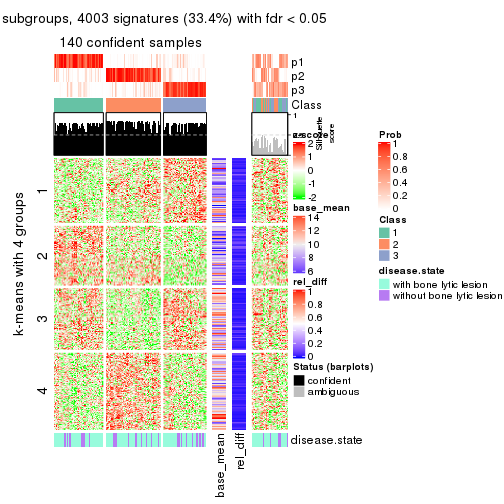</p>

</div>
<div id='tab-CV-skmeans-get-signatures-3'>
<pre><code class="r">get_signatures(res, k = 4)
</code></pre>

<p></p>

</div>
<div id='tab-CV-skmeans-get-signatures-4'>
<pre><code class="r">get_signatures(res, k = 5)
</code></pre>

<p></p>

</div>
<div id='tab-CV-skmeans-get-signatures-5'>
<pre><code class="r">get_signatures(res, k = 6)
</code></pre>

<p></p>

</div>
</div>


Signature heatmaps where rows are not scaled:


<script>
$( function() {
	$( '#tabs-CV-skmeans-get-signatures-no-scale' ).tabs();
} );
</script>
<div id='tabs-CV-skmeans-get-signatures-no-scale'>
<ul>
<li><a href='#tab-CV-skmeans-get-signatures-no-scale-1'>k = 2</a></li>
<li><a href='#tab-CV-skmeans-get-signatures-no-scale-2'>k = 3</a></li>
<li><a href='#tab-CV-skmeans-get-signatures-no-scale-3'>k = 4</a></li>
<li><a href='#tab-CV-skmeans-get-signatures-no-scale-4'>k = 5</a></li>
<li><a href='#tab-CV-skmeans-get-signatures-no-scale-5'>k = 6</a></li>
</ul>
<div id='tab-CV-skmeans-get-signatures-no-scale-1'>
<pre><code class="r">get_signatures(res, k = 2, scale_rows = FALSE)
</code></pre>

<p></p>

</div>
<div id='tab-CV-skmeans-get-signatures-no-scale-2'>
<pre><code class="r">get_signatures(res, k = 3, scale_rows = FALSE)
</code></pre>

<p></p>

</div>
<div id='tab-CV-skmeans-get-signatures-no-scale-3'>
<pre><code class="r">get_signatures(res, k = 4, scale_rows = FALSE)
</code></pre>

<p></p>

</div>
<div id='tab-CV-skmeans-get-signatures-no-scale-4'>
<pre><code class="r">get_signatures(res, k = 5, scale_rows = FALSE)
</code></pre>

<p></p>

</div>
<div id='tab-CV-skmeans-get-signatures-no-scale-5'>
<pre><code class="r">get_signatures(res, k = 6, scale_rows = FALSE)
</code></pre>

<p></p>

</div>
</div>


Compare the overlap of signatures from different k:

```r
compare_signatures(res)
```


`get_signature()` returns a data frame invisibly. TO get the list of signatures, the function
call should be assigned to a variable explicitly. In following code, if `plot` argument is set
to `FALSE`, no heatmap is plotted while only the differential analysis is performed.

```r
# code only for demonstration
tb = get_signature(res, k = ..., plot = FALSE)
```

An example of the output of `tb` is:

```
#>   which_row         fdr    mean_1    mean_2 scaled_mean_1 scaled_mean_2 km
#> 1        38 0.042760348  8.373488  9.131774    -0.5533452     0.5164555  1
#> 2        40 0.018707592  7.106213  8.469186    -0.6173731     0.5762149  1
#> 3        55 0.019134737 10.221463 11.207825    -0.6159697     0.5749050  1
#> 4        59 0.006059896  5.921854  7.869574    -0.6899429     0.6439467  1
#> 5        60 0.018055526  8.928898 10.211722    -0.6204761     0.5791110  1
#> 6        98 0.009384629 15.714769 14.887706     0.6635654    -0.6193277  2
...
```

The columns in `tb` are:

1. `which_row`: row indices corresponding to the input matrix.
2. `fdr`: FDR for the differential test. 
3. `mean_x`: The mean value in group x.
4. `scaled_mean_x`: The mean value in group x after rows are scaled.
5. `km`: Row groups if k-means clustering is applied to rows.


UMAP plot which shows how samples are separated.


<script>
$( function() {
	$( '#tabs-CV-skmeans-dimension-reduction' ).tabs();
} );
</script>
<div id='tabs-CV-skmeans-dimension-reduction'>
<ul>
<li><a href='#tab-CV-skmeans-dimension-reduction-1'>k = 2</a></li>
<li><a href='#tab-CV-skmeans-dimension-reduction-2'>k = 3</a></li>
<li><a href='#tab-CV-skmeans-dimension-reduction-3'>k = 4</a></li>
<li><a href='#tab-CV-skmeans-dimension-reduction-4'>k = 5</a></li>
<li><a href='#tab-CV-skmeans-dimension-reduction-5'>k = 6</a></li>
</ul>
<div id='tab-CV-skmeans-dimension-reduction-1'>
<pre><code class="r">dimension_reduction(res, k = 2, method = &quot;UMAP&quot;)
</code></pre>

<p></p>

</div>
<div id='tab-CV-skmeans-dimension-reduction-2'>
<pre><code class="r">dimension_reduction(res, k = 3, method = &quot;UMAP&quot;)
</code></pre>

<p></p>

</div>
<div id='tab-CV-skmeans-dimension-reduction-3'>
<pre><code class="r">dimension_reduction(res, k = 4, method = &quot;UMAP&quot;)
</code></pre>

<p></p>

</div>
<div id='tab-CV-skmeans-dimension-reduction-4'>
<pre><code class="r">dimension_reduction(res, k = 5, method = &quot;UMAP&quot;)
</code></pre>

<p></p>

</div>
<div id='tab-CV-skmeans-dimension-reduction-5'>
<pre><code class="r">dimension_reduction(res, k = 6, method = &quot;UMAP&quot;)
</code></pre>

<p></p>

</div>
</div>


Following heatmap shows how subgroups are split when increasing `k`:

```r
collect_classes(res)
```


Test correlation between subgroups and known annotations. If the known
annotation is numeric, one-way ANOVA test is applied, and if the known
annotation is discrete, chi-squared contingency table test is applied.

```r
test_to_known_factors(res)
```

```
#>              n disease.state(p) k
#> CV:skmeans 158           0.1427 2
#> CV:skmeans 140           0.3385 3
#> CV:skmeans  97           0.0067 4
#> CV:skmeans  82           0.0121 5
#> CV:skmeans  43           0.0668 6
```


If matrix rows can be associated to genes, consider to use `GO_Enrichment(res,
...)` to perform function enrichment for the signature genes.


 

---------------------------------------------------


### CV:pam


The object with results only for a single top-value method and a single partition method 
can be extracted as:

```r
res = res_list["CV", "pam"]
# you can also extract it by
# res = res_list["CV:pam"]
```

A summary of `res` and all the functions that can be applied to it:

```r
res
```

```
#> A 'ConsensusPartition' object with k = 2, 3, 4, 5, 6.
#>   On a matrix with 11993 rows and 173 columns.
#>   Top rows (1000, 2000, 3000, 4000, 5000) are extracted by 'CV' method.
#>   Subgroups are detected by 'pam' method.
#>   Performed in total 1250 partitions by row resampling.
#>   Best k for subgroups seems to be 2.
#> 
#> Following methods can be applied to this 'ConsensusPartition' object:
#>  [1] "cola_report"             "collect_classes"         "collect_plots"          
#>  [4] "collect_stats"           "colnames"                "compare_signatures"     
#>  [7] "consensus_heatmap"       "dimension_reduction"     "functional_enrichment"  
#> [10] "get_anno_col"            "get_anno"                "get_classes"            
#> [13] "get_consensus"           "get_matrix"              "get_membership"         
#> [16] "get_param"               "get_signatures"          "get_stats"              
#> [19] "is_best_k"               "is_stable_k"             "membership_heatmap"     
#> [22] "ncol"                    "nrow"                    "plot_ecdf"              
#> [25] "rownames"                "select_partition_number" "show"                   
#> [28] "suggest_best_k"          "test_to_known_factors"
```

`collect_plots()` function collects all the plots made from `res` for all `k` (number of partitions)
into one single page to provide an easy and fast comparison between different `k`.

```r
collect_plots(res)
```


The plots are:

- The first row: a plot of the ECDF (Empirical cumulative distribution
  function) curves of the consensus matrix for each `k` and the heatmap of
  predicted classes for each `k`.
- The second row: heatmaps of the consensus matrix for each `k`.
- The third row: heatmaps of the membership matrix for each `k`.
- The fouth row: heatmaps of the signatures for each `k`.

All the plots in panels can be made by individual functions and they are
plotted later in this section.

`select_partition_number()` produces several plots showing different
statistics for choosing "optimized" `k`. There are following statistics:

- ECDF curves of the consensus matrix for each `k`;
- 1-PAC. [The PAC
  score](https://en.wikipedia.org/wiki/Consensus_clustering#Over-interpretation_potential_of_consensus_clustering)
  measures the proportion of the ambiguous subgrouping.
- Mean silhouette score.
- Concordance. The mean probability of fiting the consensus class ids in all
  partitions.
- Area increased. Denote $A_k$ as the area under the ECDF curve for current
  `k`, the area increased is defined as $A_k - A_{k-1}$.
- Rand index. The percent of pairs of samples that are both in a same cluster
  or both are not in a same cluster in the partition of k and k-1.
- Jaccard index. The ratio of pairs of samples are both in a same cluster in
  the partition of k and k-1 and the pairs of samples are both in a same
  cluster in the partition k or k-1.

The detailed explanations of these statistics can be found in [the cola
vignette](http://bioconductor.org/packages/devel/bioc/vignettes/cola/inst/doc/cola.html#toc_13).

Generally speaking, lower PAC score, higher mean silhouette score or higher
concordance corresponds to better partition. Rand index and Jaccard index
measure how similar the current partition is compared to partition with `k-1`.
If they are too similar, we won't accept `k` is better than `k-1`.

```r
select_partition_number(res)
```


The numeric values for all these statistics can be obtained by `get_stats()`.

```r
get_stats(res)
```

```
#>   k 1-PAC mean_silhouette concordance area_increased  Rand Jaccard
#> 2 2 0.340           0.792       0.847         0.4529 0.548   0.548
#> 3 3 0.463           0.765       0.853         0.4111 0.734   0.546
#> 4 4 0.461           0.628       0.788         0.1040 0.952   0.865
#> 5 5 0.507           0.506       0.729         0.0758 0.908   0.717
#> 6 6 0.545           0.513       0.711         0.0472 0.933   0.738
```

`suggest_best_k()` suggests the best $k$ based on these statistics. The rules are as follows:

- All $k$ with Jaccard index larger than 0.95 are removed because the increase of
  the partition number does not provides enough extra information. If all $k$ are removed,
  the best $k$ is assigned by `NA`.
- For $k$ with 1-PAC larger than 0.9, the maximal $k$ is taken as the "best k". Other $k$ is called "optional k".
- If it does not fit the second rule. The $k$ with the highest vote of highest
  1-PAC, mean silhouette and concordance is taken as the "best k".

```r
suggest_best_k(res)
```

```
#> [1] 2
```


Following shows the table of the partitions (You need to click the **show/hide
code output** link to see it). The membership matrix (columns with name `p*`)
is inferred by
[`clue::cl_consensus()`](https://www.rdocumentation.org/link/cl_consensus?package=clue)
function with the `SE` method. Basically the value in the membership matrix
represents the probability to belong to a certain group. The finall class
label for an item is determined with the group with highest probability it
belongs to.

In `get_classes()` function, the entropy is calculated from the membership
matrix and the silhouette score is calculated from the consensus matrix.


<script>
$( function() {
	$( '#tabs-CV-pam-get-classes' ).tabs();
} );
</script>
<div id='tabs-CV-pam-get-classes'>
<ul>
<li><a href='#tab-CV-pam-get-classes-1'>k = 2</a></li>
<li><a href='#tab-CV-pam-get-classes-2'>k = 3</a></li>
<li><a href='#tab-CV-pam-get-classes-3'>k = 4</a></li>
<li><a href='#tab-CV-pam-get-classes-4'>k = 5</a></li>
<li><a href='#tab-CV-pam-get-classes-5'>k = 6</a></li>
</ul>

<div id='tab-CV-pam-get-classes-1'>
<p><a id='tab-CV-pam-get-classes-1-a' style='color:#0366d6' href='#'>show/hide code output</a></p>
<pre><code class="r">cbind(get_classes(res, k = 2), get_membership(res, k = 2))
</code></pre>

<pre><code>#&gt;          class entropy silhouette    p1    p2
#&gt; GSM11437     1  0.8144     0.7862 0.748 0.252
#&gt; GSM11438     2  0.0672     0.8377 0.008 0.992
#&gt; GSM11439     2  0.7056     0.8510 0.192 0.808
#&gt; GSM11440     1  0.9393     0.6197 0.644 0.356
#&gt; GSM11441     2  0.8081     0.8494 0.248 0.752
#&gt; GSM11442     2  0.3274     0.8275 0.060 0.940
#&gt; GSM11443     2  0.2778     0.8310 0.048 0.952
#&gt; GSM11444     1  0.6247     0.8233 0.844 0.156
#&gt; GSM11445     1  0.7219     0.7874 0.800 0.200
#&gt; GSM11446     1  0.6973     0.7927 0.812 0.188
#&gt; GSM11447     2  0.7139     0.8541 0.196 0.804
#&gt; GSM11448     2  0.6247     0.8677 0.156 0.844
#&gt; GSM11449     1  0.7299     0.8024 0.796 0.204
#&gt; GSM11450     1  0.8909     0.4836 0.692 0.308
#&gt; GSM11451     2  0.0672     0.8429 0.008 0.992
#&gt; GSM11452     2  0.6623     0.8572 0.172 0.828
#&gt; GSM11453     2  0.8443     0.7792 0.272 0.728
#&gt; GSM11454     1  0.6973     0.7780 0.812 0.188
#&gt; GSM11455     2  0.3733     0.8320 0.072 0.928
#&gt; GSM11456     2  0.7056     0.8510 0.192 0.808
#&gt; GSM11457     2  0.2423     0.8403 0.040 0.960
#&gt; GSM11458     1  0.6801     0.7827 0.820 0.180
#&gt; GSM11459     1  0.6623     0.7881 0.828 0.172
#&gt; GSM11460     1  0.6531     0.7908 0.832 0.168
#&gt; GSM11461     1  0.8207     0.7776 0.744 0.256
#&gt; GSM11462     1  0.3431     0.8361 0.936 0.064
#&gt; GSM11463     2  0.1414     0.8385 0.020 0.980
#&gt; GSM11464     1  0.8207     0.6015 0.744 0.256
#&gt; GSM11465     2  0.6531     0.8659 0.168 0.832
#&gt; GSM11466     2  0.7056     0.8551 0.192 0.808
#&gt; GSM11467     1  0.4022     0.8210 0.920 0.080
#&gt; GSM11468     1  0.0938     0.8336 0.988 0.012
#&gt; GSM11469     1  0.6048     0.8097 0.852 0.148
#&gt; GSM11470     1  0.3114     0.8289 0.944 0.056
#&gt; GSM11471     2  0.8144     0.8067 0.252 0.748
#&gt; GSM11472     2  0.7674     0.8457 0.224 0.776
#&gt; GSM11473     2  0.7299     0.8557 0.204 0.796
#&gt; GSM11474     2  0.2778     0.8304 0.048 0.952
#&gt; GSM11475     1  0.6623     0.7927 0.828 0.172
#&gt; GSM11476     2  0.7139     0.8645 0.196 0.804
#&gt; GSM11477     2  0.6712     0.8550 0.176 0.824
#&gt; GSM11478     2  0.2778     0.8304 0.048 0.952
#&gt; GSM11479     2  0.7453     0.8579 0.212 0.788
#&gt; GSM11480     2  0.2778     0.8304 0.048 0.952
#&gt; GSM11481     1  0.2043     0.8363 0.968 0.032
#&gt; GSM11482     2  0.7219     0.8660 0.200 0.800
#&gt; GSM11483     2  0.6343     0.8673 0.160 0.840
#&gt; GSM11484     2  0.7815     0.8543 0.232 0.768
#&gt; GSM11485     2  0.7528     0.8582 0.216 0.784
#&gt; GSM11486     2  0.2236     0.8555 0.036 0.964
#&gt; GSM11487     2  0.9686     0.5291 0.396 0.604
#&gt; GSM11488     2  0.5737     0.8627 0.136 0.864
#&gt; GSM11489     2  0.7602     0.8552 0.220 0.780
#&gt; GSM11490     2  0.7056     0.8510 0.192 0.808
#&gt; GSM11491     2  0.3879     0.8096 0.076 0.924
#&gt; GSM11492     2  0.9954     0.5014 0.460 0.540
#&gt; GSM11493     2  0.3733     0.8446 0.072 0.928
#&gt; GSM11494     2  0.5294     0.8544 0.120 0.880
#&gt; GSM11495     2  0.7376     0.8549 0.208 0.792
#&gt; GSM11496     2  0.7056     0.8510 0.192 0.808
#&gt; GSM11497     2  0.3584     0.8549 0.068 0.932
#&gt; GSM11498     2  0.7528     0.8564 0.216 0.784
#&gt; GSM11499     2  0.7219     0.8636 0.200 0.800
#&gt; GSM11500     2  0.2948     0.8322 0.052 0.948
#&gt; GSM11501     2  0.7883     0.8527 0.236 0.764
#&gt; GSM11502     2  0.0376     0.8389 0.004 0.996
#&gt; GSM11503     2  0.1414     0.8442 0.020 0.980
#&gt; GSM11504     1  0.2423     0.8373 0.960 0.040
#&gt; GSM11505     2  0.1633     0.8378 0.024 0.976
#&gt; GSM11506     2  0.2778     0.8344 0.048 0.952
#&gt; GSM11507     2  0.2778     0.8344 0.048 0.952
#&gt; GSM11508     1  0.4161     0.8273 0.916 0.084
#&gt; GSM11509     2  0.7219     0.8641 0.200 0.800
#&gt; GSM11510     2  0.7056     0.8564 0.192 0.808
#&gt; GSM11511     1  0.6973     0.7184 0.812 0.188
#&gt; GSM11512     2  0.7950     0.8545 0.240 0.760
#&gt; GSM11513     1  0.4022     0.8311 0.920 0.080
#&gt; GSM11514     2  0.6712     0.8623 0.176 0.824
#&gt; GSM11515     2  0.4022     0.8303 0.080 0.920
#&gt; GSM11516     2  0.9866     0.4540 0.432 0.568
#&gt; GSM11517     1  0.2603     0.8321 0.956 0.044
#&gt; GSM11518     2  0.1843     0.8474 0.028 0.972
#&gt; GSM11519     1  0.9881     0.0396 0.564 0.436
#&gt; GSM11520     1  0.3114     0.8289 0.944 0.056
#&gt; GSM11521     2  0.6048     0.8658 0.148 0.852
#&gt; GSM11522     1  0.3733     0.8250 0.928 0.072
#&gt; GSM11523     1  0.3114     0.8289 0.944 0.056
#&gt; GSM11524     1  0.1414     0.8358 0.980 0.020
#&gt; GSM11525     2  0.2778     0.8403 0.048 0.952
#&gt; GSM11526     2  0.6801     0.8634 0.180 0.820
#&gt; GSM11527     2  0.2778     0.8344 0.048 0.952
#&gt; GSM11528     2  0.3879     0.8655 0.076 0.924
#&gt; GSM11529     2  0.0672     0.8429 0.008 0.992
#&gt; GSM11530     1  0.7674     0.7919 0.776 0.224
#&gt; GSM11531     2  0.3274     0.8630 0.060 0.940
#&gt; GSM11532     1  0.0938     0.8329 0.988 0.012
#&gt; GSM11533     2  0.5059     0.8700 0.112 0.888
#&gt; GSM11534     2  0.7139     0.8498 0.196 0.804
#&gt; GSM11535     2  0.5946     0.8693 0.144 0.856
#&gt; GSM11536     2  0.7883     0.8527 0.236 0.764
#&gt; GSM11537     2  0.5946     0.8677 0.144 0.856
#&gt; GSM11538     2  0.9129     0.6473 0.328 0.672
#&gt; GSM11539     2  0.0376     0.8396 0.004 0.996
#&gt; GSM11540     2  0.2603     0.8323 0.044 0.956
#&gt; GSM11541     1  0.1184     0.8339 0.984 0.016
#&gt; GSM11542     2  0.7745     0.8560 0.228 0.772
#&gt; GSM11543     2  0.3879     0.8453 0.076 0.924
#&gt; GSM11544     1  0.9977    -0.1118 0.528 0.472
#&gt; GSM11545     2  0.5629     0.8714 0.132 0.868
#&gt; GSM11546     2  0.3274     0.8275 0.060 0.940
#&gt; GSM11547     2  0.2236     0.8339 0.036 0.964
#&gt; GSM11548     2  0.6623     0.8487 0.172 0.828
#&gt; GSM11549     1  0.1843     0.8342 0.972 0.028
#&gt; GSM11550     1  0.4690     0.8341 0.900 0.100
#&gt; GSM11551     2  0.7299     0.7855 0.204 0.796
#&gt; GSM11552     1  0.6048     0.8030 0.852 0.148
#&gt; GSM11553     2  0.0938     0.8427 0.012 0.988
#&gt; GSM11554     2  0.6801     0.8622 0.180 0.820
#&gt; GSM11555     2  0.8386     0.8346 0.268 0.732
#&gt; GSM11556     1  0.0938     0.8329 0.988 0.012
#&gt; GSM11557     2  0.0672     0.8377 0.008 0.992
#&gt; GSM11558     2  0.4022     0.8513 0.080 0.920
#&gt; GSM11559     2  0.5946     0.8685 0.144 0.856
#&gt; GSM11560     1  0.2236     0.8371 0.964 0.036
#&gt; GSM11561     2  0.2603     0.8326 0.044 0.956
#&gt; GSM11562     2  0.7056     0.8510 0.192 0.808
#&gt; GSM11563     2  0.7056     0.8510 0.192 0.808
#&gt; GSM11564     2  0.7219     0.8562 0.200 0.800
#&gt; GSM11565     2  0.7299     0.8486 0.204 0.796
#&gt; GSM11566     2  0.2778     0.8304 0.048 0.952
#&gt; GSM11567     2  0.4022     0.8454 0.080 0.920
#&gt; GSM11568     2  0.6148     0.8684 0.152 0.848
#&gt; GSM11569     2  0.6247     0.8638 0.156 0.844
#&gt; GSM11570     1  0.0672     0.8328 0.992 0.008
#&gt; GSM11571     1  0.7883     0.7908 0.764 0.236
#&gt; GSM11572     2  0.7139     0.8557 0.196 0.804
#&gt; GSM11573     2  0.6973     0.8537 0.188 0.812
#&gt; GSM11574     2  0.4815     0.8697 0.104 0.896
#&gt; GSM11575     2  0.1633     0.8486 0.024 0.976
#&gt; GSM11576     1  0.7602     0.7932 0.780 0.220
#&gt; GSM11577     2  0.8608     0.7128 0.284 0.716
#&gt; GSM11578     2  0.6712     0.8550 0.176 0.824
#&gt; GSM11579     2  0.4161     0.8503 0.084 0.916
#&gt; GSM11580     1  0.9983     0.3419 0.524 0.476
#&gt; GSM11581     1  0.6801     0.6650 0.820 0.180
#&gt; GSM11582     1  0.3431     0.8338 0.936 0.064
#&gt; GSM11583     1  0.6623     0.7891 0.828 0.172
#&gt; GSM11584     2  0.7674     0.8554 0.224 0.776
#&gt; GSM11585     2  0.0672     0.8402 0.008 0.992
#&gt; GSM11586     2  0.9552     0.6005 0.376 0.624
#&gt; GSM11587     1  0.2948     0.8296 0.948 0.052
#&gt; GSM11588     2  0.6973     0.8523 0.188 0.812
#&gt; GSM11589     2  0.9170     0.4233 0.332 0.668
#&gt; GSM11590     1  0.7528     0.6776 0.784 0.216
#&gt; GSM11591     2  0.0376     0.8417 0.004 0.996
#&gt; GSM11592     1  0.9996    -0.1943 0.512 0.488
#&gt; GSM11593     1  0.4161     0.8184 0.916 0.084
#&gt; GSM11594     2  0.9833     0.3937 0.424 0.576
#&gt; GSM11595     2  0.7056     0.8510 0.192 0.808
#&gt; GSM11596     2  0.1843     0.8364 0.028 0.972
#&gt; GSM11597     2  0.4939     0.8705 0.108 0.892
#&gt; GSM11598     1  0.9996    -0.1945 0.512 0.488
#&gt; GSM11599     1  0.6343     0.7964 0.840 0.160
#&gt; GSM11600     1  0.0938     0.8329 0.988 0.012
#&gt; GSM11601     2  0.7056     0.8510 0.192 0.808
#&gt; GSM11602     1  0.3114     0.8289 0.944 0.056
#&gt; GSM11603     1  0.2948     0.8296 0.948 0.052
#&gt; GSM11604     1  0.2778     0.8307 0.952 0.048
#&gt; GSM11605     1  0.1843     0.8365 0.972 0.028
#&gt; GSM11606     2  0.6712     0.8583 0.176 0.824
#&gt; GSM11607     1  0.6623     0.7384 0.828 0.172
#&gt; GSM11608     1  0.1633     0.8355 0.976 0.024
#&gt; GSM11609     2  0.8081     0.8491 0.248 0.752
</code></pre>

<script>
$('#tab-CV-pam-get-classes-1-a').parent().next().next().hide();
$('#tab-CV-pam-get-classes-1-a').click(function(){
  $('#tab-CV-pam-get-classes-1-a').parent().next().next().toggle();
  return(false);
});
</script>
</div>

<div id='tab-CV-pam-get-classes-2'>
<p><a id='tab-CV-pam-get-classes-2-a' style='color:#0366d6' href='#'>show/hide code output</a></p>
<pre><code class="r">cbind(get_classes(res, k = 3), get_membership(res, k = 3))
</code></pre>

<pre><code>#&gt;          class entropy silhouette    p1    p2    p3
#&gt; GSM11437     1  0.5111     0.7599 0.808 0.168 0.024
#&gt; GSM11438     1  0.4750     0.7549 0.784 0.216 0.000
#&gt; GSM11439     1  0.5678     0.4227 0.684 0.316 0.000
#&gt; GSM11440     3  0.4399     0.7098 0.000 0.188 0.812
#&gt; GSM11441     1  0.5443     0.5569 0.736 0.260 0.004
#&gt; GSM11442     2  0.1163     0.8237 0.000 0.972 0.028
#&gt; GSM11443     2  0.0000     0.8222 0.000 1.000 0.000
#&gt; GSM11444     3  0.0000     0.8734 0.000 0.000 1.000
#&gt; GSM11445     3  0.0000     0.8734 0.000 0.000 1.000
#&gt; GSM11446     3  0.5696     0.7470 0.148 0.056 0.796
#&gt; GSM11447     2  0.6521     0.3043 0.492 0.504 0.004
#&gt; GSM11448     2  0.6215     0.4427 0.428 0.572 0.000
#&gt; GSM11449     3  0.0424     0.8729 0.008 0.000 0.992
#&gt; GSM11450     1  0.0424     0.8168 0.992 0.000 0.008
#&gt; GSM11451     1  0.5058     0.7502 0.756 0.244 0.000
#&gt; GSM11452     1  0.2711     0.8146 0.912 0.088 0.000
#&gt; GSM11453     1  0.3678     0.7993 0.892 0.028 0.080
#&gt; GSM11454     3  0.0424     0.8736 0.000 0.008 0.992
#&gt; GSM11455     2  0.2229     0.8371 0.044 0.944 0.012
#&gt; GSM11456     2  0.4504     0.8241 0.196 0.804 0.000
#&gt; GSM11457     2  0.0983     0.8306 0.016 0.980 0.004
#&gt; GSM11458     3  0.0000     0.8734 0.000 0.000 1.000
#&gt; GSM11459     3  0.1267     0.8716 0.004 0.024 0.972
#&gt; GSM11460     3  0.2584     0.8547 0.008 0.064 0.928
#&gt; GSM11461     1  0.5696     0.7510 0.800 0.136 0.064
#&gt; GSM11462     3  0.0000     0.8734 0.000 0.000 1.000
#&gt; GSM11463     2  0.0237     0.8224 0.004 0.996 0.000
#&gt; GSM11464     1  0.4399     0.6623 0.812 0.000 0.188
#&gt; GSM11465     2  0.4575     0.8395 0.160 0.828 0.012
#&gt; GSM11466     2  0.6452     0.7667 0.264 0.704 0.032
#&gt; GSM11467     1  0.3879     0.7103 0.848 0.000 0.152
#&gt; GSM11468     3  0.0000     0.8734 0.000 0.000 1.000
#&gt; GSM11469     3  0.0000     0.8734 0.000 0.000 1.000
#&gt; GSM11470     1  0.0000     0.8161 1.000 0.000 0.000
#&gt; GSM11471     1  0.0000     0.8161 1.000 0.000 0.000
#&gt; GSM11472     1  0.5905     0.2677 0.648 0.352 0.000
#&gt; GSM11473     2  0.5200     0.8292 0.184 0.796 0.020
#&gt; GSM11474     2  0.0000     0.8222 0.000 1.000 0.000
#&gt; GSM11475     3  0.0237     0.8737 0.000 0.004 0.996
#&gt; GSM11476     2  0.4062     0.8384 0.164 0.836 0.000
#&gt; GSM11477     2  0.3686     0.8357 0.140 0.860 0.000
#&gt; GSM11478     2  0.0000     0.8222 0.000 1.000 0.000
#&gt; GSM11479     2  0.4452     0.8259 0.192 0.808 0.000
#&gt; GSM11480     2  0.0000     0.8222 0.000 1.000 0.000
#&gt; GSM11481     3  0.0892     0.8751 0.020 0.000 0.980
#&gt; GSM11482     2  0.4413     0.8395 0.160 0.832 0.008
#&gt; GSM11483     2  0.3619     0.8454 0.136 0.864 0.000
#&gt; GSM11484     2  0.4504     0.8243 0.196 0.804 0.000
#&gt; GSM11485     2  0.4178     0.8333 0.172 0.828 0.000
#&gt; GSM11486     1  0.6079     0.5742 0.612 0.388 0.000
#&gt; GSM11487     1  0.1753     0.8180 0.952 0.048 0.000
#&gt; GSM11488     2  0.4357     0.8413 0.080 0.868 0.052
#&gt; GSM11489     2  0.4555     0.8220 0.200 0.800 0.000
#&gt; GSM11490     1  0.0592     0.8176 0.988 0.012 0.000
#&gt; GSM11491     1  0.5744     0.7522 0.800 0.128 0.072
#&gt; GSM11492     2  0.8907     0.5734 0.200 0.572 0.228
#&gt; GSM11493     2  0.2318     0.8379 0.028 0.944 0.028
#&gt; GSM11494     1  0.5785     0.6409 0.696 0.300 0.004
#&gt; GSM11495     2  0.4702     0.8189 0.212 0.788 0.000
#&gt; GSM11496     2  0.4605     0.8210 0.204 0.796 0.000
#&gt; GSM11497     2  0.4289     0.8092 0.092 0.868 0.040
#&gt; GSM11498     2  0.5470     0.8197 0.168 0.796 0.036
#&gt; GSM11499     2  0.3879     0.8411 0.152 0.848 0.000
#&gt; GSM11500     2  0.0475     0.8249 0.004 0.992 0.004
#&gt; GSM11501     2  0.4555     0.8220 0.200 0.800 0.000
#&gt; GSM11502     2  0.4062     0.6907 0.164 0.836 0.000
#&gt; GSM11503     2  0.0892     0.8228 0.020 0.980 0.000
#&gt; GSM11504     3  0.4277     0.8286 0.132 0.016 0.852
#&gt; GSM11505     2  0.0237     0.8225 0.004 0.996 0.000
#&gt; GSM11506     2  0.0424     0.8262 0.008 0.992 0.000
#&gt; GSM11507     2  0.0424     0.8262 0.008 0.992 0.000
#&gt; GSM11508     3  0.0237     0.8735 0.000 0.004 0.996
#&gt; GSM11509     2  0.6239     0.8041 0.160 0.768 0.072
#&gt; GSM11510     2  0.4399     0.8279 0.188 0.812 0.000
#&gt; GSM11511     1  0.4233     0.7005 0.836 0.004 0.160
#&gt; GSM11512     2  0.5831     0.7633 0.284 0.708 0.008
#&gt; GSM11513     3  0.1170     0.8758 0.016 0.008 0.976
#&gt; GSM11514     2  0.5500     0.8286 0.100 0.816 0.084
#&gt; GSM11515     2  0.2793     0.8333 0.028 0.928 0.044
#&gt; GSM11516     1  0.0000     0.8161 1.000 0.000 0.000
#&gt; GSM11517     3  0.1163     0.8746 0.028 0.000 0.972
#&gt; GSM11518     2  0.3009     0.8339 0.052 0.920 0.028
#&gt; GSM11519     1  0.1411     0.8141 0.964 0.000 0.036
#&gt; GSM11520     3  0.5254     0.7135 0.264 0.000 0.736
#&gt; GSM11521     2  0.3340     0.8456 0.120 0.880 0.000
#&gt; GSM11522     3  0.2947     0.8638 0.060 0.020 0.920
#&gt; GSM11523     1  0.6008     0.3651 0.628 0.000 0.372
#&gt; GSM11524     3  0.1163     0.8746 0.028 0.000 0.972
#&gt; GSM11525     2  0.2152     0.8360 0.036 0.948 0.016
#&gt; GSM11526     2  0.7466     0.1437 0.444 0.520 0.036
#&gt; GSM11527     2  0.1031     0.8327 0.024 0.976 0.000
#&gt; GSM11528     2  0.3377     0.8467 0.092 0.896 0.012
#&gt; GSM11529     1  0.6302     0.3752 0.520 0.480 0.000
#&gt; GSM11530     3  0.2625     0.8391 0.084 0.000 0.916
#&gt; GSM11531     2  0.1964     0.8420 0.056 0.944 0.000
#&gt; GSM11532     3  0.4452     0.7853 0.192 0.000 0.808
#&gt; GSM11533     1  0.3116     0.8118 0.892 0.108 0.000
#&gt; GSM11534     2  0.5722     0.7562 0.292 0.704 0.004
#&gt; GSM11535     1  0.5650     0.5049 0.688 0.312 0.000
#&gt; GSM11536     2  0.4555     0.8220 0.200 0.800 0.000
#&gt; GSM11537     2  0.3267     0.8429 0.116 0.884 0.000
#&gt; GSM11538     2  0.9734     0.1427 0.292 0.448 0.260
#&gt; GSM11539     1  0.5948     0.6414 0.640 0.360 0.000
#&gt; GSM11540     2  0.1878     0.8117 0.044 0.952 0.004
#&gt; GSM11541     3  0.4504     0.7815 0.196 0.000 0.804
#&gt; GSM11542     2  0.4504     0.8248 0.196 0.804 0.000
#&gt; GSM11543     2  0.6282     0.4441 0.324 0.664 0.012
#&gt; GSM11544     1  0.0000     0.8161 1.000 0.000 0.000
#&gt; GSM11545     1  0.3045     0.8198 0.916 0.064 0.020
#&gt; GSM11546     2  0.1620     0.8291 0.012 0.964 0.024
#&gt; GSM11547     2  0.4834     0.6077 0.204 0.792 0.004
#&gt; GSM11548     2  0.5239     0.7860 0.032 0.808 0.160
#&gt; GSM11549     3  0.4796     0.7619 0.220 0.000 0.780
#&gt; GSM11550     3  0.7170     0.5252 0.352 0.036 0.612
#&gt; GSM11551     2  0.6254     0.7431 0.056 0.756 0.188
#&gt; GSM11552     3  0.0000     0.8734 0.000 0.000 1.000
#&gt; GSM11553     2  0.1765     0.8368 0.040 0.956 0.004
#&gt; GSM11554     2  0.4121     0.8352 0.168 0.832 0.000
#&gt; GSM11555     2  0.6000     0.8085 0.200 0.760 0.040
#&gt; GSM11556     3  0.4555     0.7777 0.200 0.000 0.800
#&gt; GSM11557     2  0.0000     0.8222 0.000 1.000 0.000
#&gt; GSM11558     2  0.1964     0.8438 0.056 0.944 0.000
#&gt; GSM11559     2  0.6126     0.5015 0.400 0.600 0.000
#&gt; GSM11560     3  0.0237     0.8745 0.004 0.000 0.996
#&gt; GSM11561     2  0.0000     0.8222 0.000 1.000 0.000
#&gt; GSM11562     2  0.6026     0.6309 0.376 0.624 0.000
#&gt; GSM11563     2  0.4605     0.8214 0.204 0.796 0.000
#&gt; GSM11564     2  0.4887     0.8112 0.228 0.772 0.000
#&gt; GSM11565     1  0.3583     0.8109 0.900 0.056 0.044
#&gt; GSM11566     2  0.0592     0.8220 0.012 0.988 0.000
#&gt; GSM11567     2  0.2773     0.8397 0.048 0.928 0.024
#&gt; GSM11568     1  0.5268     0.7155 0.776 0.212 0.012
#&gt; GSM11569     2  0.5650     0.6437 0.312 0.688 0.000
#&gt; GSM11570     3  0.0000     0.8734 0.000 0.000 1.000
#&gt; GSM11571     1  0.7930     0.6504 0.664 0.164 0.172
#&gt; GSM11572     2  0.5859     0.6740 0.344 0.656 0.000
#&gt; GSM11573     1  0.1289     0.8217 0.968 0.032 0.000
#&gt; GSM11574     1  0.3340     0.8046 0.880 0.120 0.000
#&gt; GSM11575     1  0.5016     0.7455 0.760 0.240 0.000
#&gt; GSM11576     3  0.5541     0.6145 0.252 0.008 0.740
#&gt; GSM11577     1  0.2383     0.8221 0.940 0.044 0.016
#&gt; GSM11578     1  0.1964     0.8167 0.944 0.056 0.000
#&gt; GSM11579     2  0.2590     0.8430 0.072 0.924 0.004
#&gt; GSM11580     3  0.9907     0.0396 0.268 0.356 0.376
#&gt; GSM11581     3  0.7283     0.6392 0.116 0.176 0.708
#&gt; GSM11582     3  0.2902     0.8648 0.064 0.016 0.920
#&gt; GSM11583     3  0.4397     0.8188 0.028 0.116 0.856
#&gt; GSM11584     2  0.4452     0.8259 0.192 0.808 0.000
#&gt; GSM11585     2  0.2096     0.8110 0.052 0.944 0.004
#&gt; GSM11586     1  0.3461     0.8032 0.900 0.076 0.024
#&gt; GSM11587     3  0.3192     0.8483 0.112 0.000 0.888
#&gt; GSM11588     1  0.0424     0.8178 0.992 0.008 0.000
#&gt; GSM11589     1  0.6722     0.7371 0.720 0.220 0.060
#&gt; GSM11590     1  0.2772     0.7939 0.916 0.004 0.080
#&gt; GSM11591     1  0.5591     0.7056 0.696 0.304 0.000
#&gt; GSM11592     1  0.2496     0.7901 0.928 0.004 0.068
#&gt; GSM11593     1  0.0000     0.8161 1.000 0.000 0.000
#&gt; GSM11594     1  0.2050     0.8232 0.952 0.028 0.020
#&gt; GSM11595     1  0.4887     0.6165 0.772 0.228 0.000
#&gt; GSM11596     2  0.3845     0.7520 0.116 0.872 0.012
#&gt; GSM11597     1  0.3207     0.8188 0.904 0.084 0.012
#&gt; GSM11598     1  0.0000     0.8161 1.000 0.000 0.000
#&gt; GSM11599     3  0.0892     0.8721 0.000 0.020 0.980
#&gt; GSM11600     3  0.4555     0.7777 0.200 0.000 0.800
#&gt; GSM11601     2  0.4504     0.8241 0.196 0.804 0.000
#&gt; GSM11602     3  0.4555     0.7777 0.200 0.000 0.800
#&gt; GSM11603     3  0.2066     0.8674 0.060 0.000 0.940
#&gt; GSM11604     3  0.3619     0.8108 0.136 0.000 0.864
#&gt; GSM11605     3  0.5072     0.7805 0.196 0.012 0.792
#&gt; GSM11606     1  0.5327     0.6005 0.728 0.272 0.000
#&gt; GSM11607     1  0.0237     0.8172 0.996 0.004 0.000
#&gt; GSM11608     3  0.0237     0.8745 0.004 0.000 0.996
#&gt; GSM11609     2  0.5122     0.8197 0.200 0.788 0.012
</code></pre>

<script>
$('#tab-CV-pam-get-classes-2-a').parent().next().next().hide();
$('#tab-CV-pam-get-classes-2-a').click(function(){
  $('#tab-CV-pam-get-classes-2-a').parent().next().next().toggle();
  return(false);
});
</script>
</div>

<div id='tab-CV-pam-get-classes-3'>
<p><a id='tab-CV-pam-get-classes-3-a' style='color:#0366d6' href='#'>show/hide code output</a></p>
<pre><code class="r">cbind(get_classes(res, k = 4), get_membership(res, k = 4))
</code></pre>

<pre><code>#&gt;          class entropy silhouette    p1    p2    p3    p4
#&gt; GSM11437     4  0.6088     0.4770 0.192 0.088 0.016 0.704
#&gt; GSM11438     1  0.4955     0.6633 0.772 0.144 0.000 0.084
#&gt; GSM11439     1  0.5936     0.3363 0.620 0.324 0.000 0.056
#&gt; GSM11440     3  0.3486     0.6358 0.000 0.188 0.812 0.000
#&gt; GSM11441     1  0.7709    -0.0440 0.448 0.196 0.004 0.352
#&gt; GSM11442     2  0.5387     0.1425 0.000 0.584 0.016 0.400
#&gt; GSM11443     2  0.1557     0.7509 0.000 0.944 0.000 0.056
#&gt; GSM11444     3  0.0000     0.8148 0.000 0.000 1.000 0.000
#&gt; GSM11445     3  0.0000     0.8148 0.000 0.000 1.000 0.000
#&gt; GSM11446     3  0.6185     0.6570 0.132 0.040 0.728 0.100
#&gt; GSM11447     4  0.7878     0.2050 0.236 0.332 0.004 0.428
#&gt; GSM11448     2  0.6031     0.4166 0.388 0.564 0.000 0.048
#&gt; GSM11449     3  0.0188     0.8151 0.004 0.000 0.996 0.000
#&gt; GSM11450     1  0.4964     0.3633 0.616 0.000 0.004 0.380
#&gt; GSM11451     1  0.4920     0.6695 0.768 0.164 0.000 0.068
#&gt; GSM11452     1  0.2996     0.7066 0.892 0.044 0.000 0.064
#&gt; GSM11453     1  0.2982     0.7110 0.900 0.012 0.064 0.024
#&gt; GSM11454     3  0.2867     0.7800 0.000 0.012 0.884 0.104
#&gt; GSM11455     2  0.3712     0.7097 0.004 0.832 0.012 0.152
#&gt; GSM11456     2  0.4227     0.7377 0.120 0.820 0.000 0.060
#&gt; GSM11457     2  0.1545     0.7569 0.008 0.952 0.000 0.040
#&gt; GSM11458     3  0.0188     0.8149 0.000 0.004 0.996 0.000
#&gt; GSM11459     3  0.3414     0.7866 0.004 0.048 0.876 0.072
#&gt; GSM11460     4  0.6581     0.2334 0.028 0.040 0.352 0.580
#&gt; GSM11461     1  0.4546     0.6820 0.820 0.096 0.072 0.012
#&gt; GSM11462     3  0.0000     0.8148 0.000 0.000 1.000 0.000
#&gt; GSM11463     2  0.1661     0.7542 0.004 0.944 0.000 0.052
#&gt; GSM11464     4  0.4464     0.5329 0.224 0.004 0.012 0.760
#&gt; GSM11465     2  0.4129     0.7531 0.104 0.840 0.012 0.044
#&gt; GSM11466     2  0.6181     0.6839 0.204 0.700 0.028 0.068
#&gt; GSM11467     1  0.5392     0.2981 0.564 0.004 0.008 0.424
#&gt; GSM11468     3  0.1557     0.8078 0.000 0.000 0.944 0.056
#&gt; GSM11469     3  0.0000     0.8148 0.000 0.000 1.000 0.000
#&gt; GSM11470     1  0.4776     0.3684 0.624 0.000 0.000 0.376
#&gt; GSM11471     1  0.1978     0.7051 0.928 0.004 0.000 0.068
#&gt; GSM11472     1  0.7190     0.2497 0.548 0.260 0.000 0.192
#&gt; GSM11473     2  0.4654     0.7502 0.100 0.816 0.016 0.068
#&gt; GSM11474     2  0.1211     0.7543 0.000 0.960 0.000 0.040
#&gt; GSM11475     3  0.0000     0.8148 0.000 0.000 1.000 0.000
#&gt; GSM11476     2  0.5257     0.7158 0.060 0.728 0.000 0.212
#&gt; GSM11477     2  0.3734     0.7576 0.044 0.848 0.000 0.108
#&gt; GSM11478     2  0.1302     0.7517 0.000 0.956 0.000 0.044
#&gt; GSM11479     2  0.3745     0.7579 0.060 0.852 0.000 0.088
#&gt; GSM11480     2  0.1389     0.7517 0.000 0.952 0.000 0.048
#&gt; GSM11481     3  0.0859     0.8166 0.008 0.004 0.980 0.008
#&gt; GSM11482     2  0.5688     0.7243 0.112 0.736 0.008 0.144
#&gt; GSM11483     2  0.3899     0.7660 0.052 0.840 0.000 0.108
#&gt; GSM11484     2  0.7151     0.0361 0.132 0.448 0.000 0.420
#&gt; GSM11485     2  0.4957     0.7245 0.048 0.748 0.000 0.204
#&gt; GSM11486     1  0.6187     0.4945 0.596 0.336 0.000 0.068
#&gt; GSM11487     1  0.3037     0.7126 0.888 0.036 0.000 0.076
#&gt; GSM11488     2  0.6868     0.3419 0.036 0.572 0.048 0.344
#&gt; GSM11489     2  0.4356     0.7338 0.124 0.812 0.000 0.064
#&gt; GSM11490     1  0.2522     0.7036 0.908 0.016 0.000 0.076
#&gt; GSM11491     1  0.3794     0.6930 0.868 0.032 0.032 0.068
#&gt; GSM11492     4  0.7820     0.2616 0.128 0.292 0.040 0.540
#&gt; GSM11493     2  0.5792     0.1376 0.008 0.572 0.020 0.400
#&gt; GSM11494     4  0.7077     0.2390 0.348 0.120 0.004 0.528
#&gt; GSM11495     2  0.7251     0.0228 0.144 0.440 0.000 0.416
#&gt; GSM11496     2  0.4586     0.7273 0.136 0.796 0.000 0.068
#&gt; GSM11497     2  0.4811     0.7219 0.108 0.812 0.040 0.040
#&gt; GSM11498     2  0.5417     0.7392 0.080 0.780 0.036 0.104
#&gt; GSM11499     4  0.6499     0.0408 0.076 0.400 0.000 0.524
#&gt; GSM11500     2  0.3123     0.7182 0.000 0.844 0.000 0.156
#&gt; GSM11501     2  0.5962     0.6934 0.128 0.692 0.000 0.180
#&gt; GSM11502     2  0.5256     0.6027 0.204 0.732 0.000 0.064
#&gt; GSM11503     2  0.2174     0.7529 0.020 0.928 0.000 0.052
#&gt; GSM11504     4  0.3974     0.6512 0.060 0.016 0.068 0.856
#&gt; GSM11505     2  0.1902     0.7499 0.004 0.932 0.000 0.064
#&gt; GSM11506     2  0.1867     0.7486 0.000 0.928 0.000 0.072
#&gt; GSM11507     2  0.1637     0.7500 0.000 0.940 0.000 0.060
#&gt; GSM11508     3  0.2281     0.7901 0.000 0.000 0.904 0.096
#&gt; GSM11509     2  0.6025     0.7280 0.104 0.748 0.060 0.088
#&gt; GSM11510     2  0.6652     0.4287 0.108 0.576 0.000 0.316
#&gt; GSM11511     1  0.4713     0.6065 0.788 0.004 0.156 0.052
#&gt; GSM11512     4  0.3800     0.6347 0.112 0.036 0.004 0.848
#&gt; GSM11513     3  0.3253     0.7890 0.008 0.016 0.876 0.100
#&gt; GSM11514     2  0.4844     0.7549 0.092 0.812 0.068 0.028
#&gt; GSM11515     2  0.5921     0.0686 0.000 0.516 0.036 0.448
#&gt; GSM11516     1  0.1743     0.7103 0.940 0.004 0.000 0.056
#&gt; GSM11517     3  0.1114     0.8161 0.016 0.004 0.972 0.008
#&gt; GSM11518     2  0.2782     0.7660 0.068 0.904 0.024 0.004
#&gt; GSM11519     1  0.1151     0.7250 0.968 0.000 0.024 0.008
#&gt; GSM11520     3  0.5327     0.6495 0.208 0.004 0.732 0.056
#&gt; GSM11521     2  0.4595     0.7239 0.040 0.776 0.000 0.184
#&gt; GSM11522     3  0.2484     0.8080 0.040 0.024 0.924 0.012
#&gt; GSM11523     1  0.5038     0.3952 0.652 0.000 0.336 0.012
#&gt; GSM11524     3  0.5134     0.4923 0.016 0.004 0.680 0.300
#&gt; GSM11525     2  0.1675     0.7552 0.004 0.948 0.004 0.044
#&gt; GSM11526     4  0.4000     0.6365 0.072 0.052 0.020 0.856
#&gt; GSM11527     2  0.2216     0.7426 0.000 0.908 0.000 0.092
#&gt; GSM11528     2  0.3304     0.7673 0.076 0.884 0.012 0.028
#&gt; GSM11529     1  0.6413     0.3662 0.516 0.416 0.000 0.068
#&gt; GSM11530     3  0.2081     0.7855 0.084 0.000 0.916 0.000
#&gt; GSM11531     2  0.2813     0.7611 0.024 0.896 0.000 0.080
#&gt; GSM11532     3  0.4592     0.7102 0.128 0.004 0.804 0.064
#&gt; GSM11533     1  0.3687     0.7091 0.856 0.064 0.000 0.080
#&gt; GSM11534     2  0.5678     0.6734 0.224 0.704 0.004 0.068
#&gt; GSM11535     1  0.5592     0.4439 0.656 0.300 0.000 0.044
#&gt; GSM11536     2  0.4605     0.7270 0.132 0.796 0.000 0.072
#&gt; GSM11537     2  0.3439     0.7633 0.048 0.868 0.000 0.084
#&gt; GSM11538     2  0.9165    -0.1219 0.092 0.380 0.192 0.336
#&gt; GSM11539     1  0.5905     0.5535 0.636 0.304 0.000 0.060
#&gt; GSM11540     2  0.3582     0.7508 0.060 0.868 0.004 0.068
#&gt; GSM11541     4  0.3551     0.6389 0.108 0.004 0.028 0.860
#&gt; GSM11542     2  0.4410     0.7323 0.128 0.808 0.000 0.064
#&gt; GSM11543     2  0.7160    -0.1561 0.116 0.468 0.004 0.412
#&gt; GSM11544     1  0.0817     0.7242 0.976 0.000 0.000 0.024
#&gt; GSM11545     1  0.2188     0.7300 0.936 0.032 0.012 0.020
#&gt; GSM11546     2  0.3428     0.7082 0.000 0.844 0.012 0.144
#&gt; GSM11547     2  0.4655     0.5767 0.208 0.760 0.000 0.032
#&gt; GSM11548     2  0.6253     0.6385 0.012 0.696 0.152 0.140
#&gt; GSM11549     3  0.6167     0.6194 0.144 0.004 0.688 0.164
#&gt; GSM11550     3  0.8026     0.3849 0.280 0.036 0.520 0.164
#&gt; GSM11551     2  0.6429     0.6152 0.024 0.696 0.152 0.128
#&gt; GSM11552     3  0.0000     0.8148 0.000 0.000 1.000 0.000
#&gt; GSM11553     2  0.1771     0.7539 0.012 0.948 0.004 0.036
#&gt; GSM11554     2  0.3421     0.7640 0.044 0.868 0.000 0.088
#&gt; GSM11555     2  0.5763     0.7133 0.132 0.748 0.024 0.096
#&gt; GSM11556     3  0.4716     0.7009 0.132 0.004 0.796 0.068
#&gt; GSM11557     2  0.1356     0.7572 0.008 0.960 0.000 0.032
#&gt; GSM11558     2  0.1807     0.7637 0.008 0.940 0.000 0.052
#&gt; GSM11559     2  0.5997     0.4453 0.376 0.576 0.000 0.048
#&gt; GSM11560     3  0.1767     0.8100 0.044 0.000 0.944 0.012
#&gt; GSM11561     2  0.3172     0.7229 0.000 0.840 0.000 0.160
#&gt; GSM11562     2  0.5812     0.5637 0.328 0.624 0.000 0.048
#&gt; GSM11563     2  0.4586     0.7273 0.136 0.796 0.000 0.068
#&gt; GSM11564     2  0.4776     0.7271 0.164 0.776 0.000 0.060
#&gt; GSM11565     1  0.4689     0.6929 0.824 0.052 0.040 0.084
#&gt; GSM11566     2  0.3708     0.7099 0.020 0.832 0.000 0.148
#&gt; GSM11567     2  0.2780     0.7671 0.048 0.912 0.024 0.016
#&gt; GSM11568     1  0.4989     0.6181 0.756 0.200 0.008 0.036
#&gt; GSM11569     2  0.5995     0.5740 0.232 0.672 0.000 0.096
#&gt; GSM11570     3  0.0000     0.8148 0.000 0.000 1.000 0.000
#&gt; GSM11571     1  0.7126     0.5503 0.644 0.124 0.192 0.040
#&gt; GSM11572     2  0.5835     0.6032 0.280 0.656 0.000 0.064
#&gt; GSM11573     1  0.1733     0.7302 0.948 0.028 0.000 0.024
#&gt; GSM11574     1  0.3761     0.7090 0.852 0.068 0.000 0.080
#&gt; GSM11575     1  0.4123     0.6610 0.772 0.220 0.000 0.008
#&gt; GSM11576     3  0.5364     0.4986 0.320 0.000 0.652 0.028
#&gt; GSM11577     1  0.2594     0.7332 0.920 0.032 0.012 0.036
#&gt; GSM11578     1  0.2892     0.7064 0.896 0.036 0.000 0.068
#&gt; GSM11579     2  0.3534     0.7173 0.008 0.840 0.004 0.148
#&gt; GSM11580     3  0.8328    -0.0317 0.272 0.336 0.376 0.016
#&gt; GSM11581     3  0.7422     0.4954 0.068 0.160 0.640 0.132
#&gt; GSM11582     4  0.4233     0.5966 0.032 0.008 0.140 0.820
#&gt; GSM11583     3  0.4934     0.7291 0.012 0.104 0.796 0.088
#&gt; GSM11584     2  0.5466     0.7036 0.068 0.712 0.000 0.220
#&gt; GSM11585     2  0.2855     0.7453 0.052 0.904 0.004 0.040
#&gt; GSM11586     1  0.6403     0.4176 0.608 0.052 0.016 0.324
#&gt; GSM11587     3  0.3266     0.7955 0.084 0.004 0.880 0.032
#&gt; GSM11588     1  0.2831     0.7022 0.876 0.004 0.000 0.120
#&gt; GSM11589     1  0.7350     0.5559 0.624 0.192 0.040 0.144
#&gt; GSM11590     1  0.2060     0.7176 0.932 0.000 0.052 0.016
#&gt; GSM11591     1  0.5596     0.6114 0.696 0.236 0.000 0.068
#&gt; GSM11592     1  0.4176     0.6730 0.832 0.008 0.044 0.116
#&gt; GSM11593     1  0.0707     0.7249 0.980 0.000 0.000 0.020
#&gt; GSM11594     1  0.1262     0.7282 0.968 0.008 0.016 0.008
#&gt; GSM11595     1  0.6750     0.4496 0.612 0.180 0.000 0.208
#&gt; GSM11596     2  0.5512     0.6468 0.120 0.756 0.012 0.112
#&gt; GSM11597     1  0.4019     0.7223 0.848 0.068 0.008 0.076
#&gt; GSM11598     1  0.1211     0.7241 0.960 0.000 0.000 0.040
#&gt; GSM11599     3  0.1854     0.8101 0.000 0.012 0.940 0.048
#&gt; GSM11600     3  0.4644     0.7044 0.132 0.004 0.800 0.064
#&gt; GSM11601     2  0.4388     0.7317 0.132 0.808 0.000 0.060
#&gt; GSM11602     3  0.4425     0.7325 0.160 0.004 0.800 0.036
#&gt; GSM11603     3  0.2473     0.8048 0.080 0.000 0.908 0.012
#&gt; GSM11604     3  0.3681     0.7521 0.124 0.004 0.848 0.024
#&gt; GSM11605     3  0.7236     0.4631 0.136 0.012 0.568 0.284
#&gt; GSM11606     1  0.5767     0.4639 0.660 0.280 0.000 0.060
#&gt; GSM11607     1  0.0336     0.7252 0.992 0.000 0.000 0.008
#&gt; GSM11608     3  0.0188     0.8156 0.004 0.000 0.996 0.000
#&gt; GSM11609     2  0.5991     0.7056 0.132 0.712 0.008 0.148
</code></pre>

<script>
$('#tab-CV-pam-get-classes-3-a').parent().next().next().hide();
$('#tab-CV-pam-get-classes-3-a').click(function(){
  $('#tab-CV-pam-get-classes-3-a').parent().next().next().toggle();
  return(false);
});
</script>
</div>

<div id='tab-CV-pam-get-classes-4'>
<p><a id='tab-CV-pam-get-classes-4-a' style='color:#0366d6' href='#'>show/hide code output</a></p>
<pre><code class="r">cbind(get_classes(res, k = 5), get_membership(res, k = 5))
</code></pre>

<pre><code>#&gt;          class entropy silhouette    p1    p2    p3    p4    p5
#&gt; GSM11437     4  0.3291     0.4845 0.072 0.024 0.012 0.872 0.020
#&gt; GSM11438     1  0.4407     0.6708 0.760 0.064 0.000 0.004 0.172
#&gt; GSM11439     1  0.6516     0.3379 0.572 0.280 0.000 0.044 0.104
#&gt; GSM11440     3  0.3282     0.5704 0.000 0.188 0.804 0.000 0.008
#&gt; GSM11441     5  0.4238     0.3879 0.112 0.028 0.000 0.056 0.804
#&gt; GSM11442     2  0.7234    -0.1835 0.004 0.376 0.012 0.276 0.332
#&gt; GSM11443     2  0.0451     0.6810 0.004 0.988 0.000 0.000 0.008
#&gt; GSM11444     3  0.0000     0.7565 0.000 0.000 1.000 0.000 0.000
#&gt; GSM11445     3  0.0000     0.7565 0.000 0.000 1.000 0.000 0.000
#&gt; GSM11446     3  0.5734     0.4661 0.072 0.016 0.604 0.000 0.308
#&gt; GSM11447     4  0.8057     0.0333 0.152 0.144 0.000 0.388 0.316
#&gt; GSM11448     2  0.6321     0.3379 0.352 0.536 0.000 0.036 0.076
#&gt; GSM11449     3  0.0162     0.7569 0.004 0.000 0.996 0.000 0.000
#&gt; GSM11450     4  0.4843     0.0368 0.428 0.000 0.004 0.552 0.016
#&gt; GSM11451     1  0.3961     0.6914 0.780 0.184 0.000 0.004 0.032
#&gt; GSM11452     1  0.2805     0.7192 0.872 0.108 0.000 0.008 0.012
#&gt; GSM11453     1  0.2536     0.7268 0.908 0.024 0.052 0.008 0.008
#&gt; GSM11454     3  0.4108     0.4878 0.000 0.000 0.684 0.008 0.308
#&gt; GSM11455     2  0.4675     0.2117 0.004 0.544 0.000 0.008 0.444
#&gt; GSM11456     2  0.4228     0.6577 0.088 0.812 0.000 0.040 0.060
#&gt; GSM11457     2  0.1644     0.6881 0.008 0.940 0.000 0.004 0.048
#&gt; GSM11458     3  0.0162     0.7566 0.000 0.000 0.996 0.000 0.004
#&gt; GSM11459     3  0.4497     0.4238 0.000 0.008 0.568 0.000 0.424
#&gt; GSM11460     4  0.5634     0.3304 0.028 0.000 0.184 0.684 0.104
#&gt; GSM11461     1  0.3896     0.7086 0.848 0.032 0.044 0.020 0.056
#&gt; GSM11462     3  0.0000     0.7565 0.000 0.000 1.000 0.000 0.000
#&gt; GSM11463     2  0.0579     0.6847 0.008 0.984 0.000 0.000 0.008
#&gt; GSM11464     4  0.1117     0.5041 0.020 0.000 0.000 0.964 0.016
#&gt; GSM11465     2  0.3742     0.6791 0.072 0.852 0.016 0.028 0.032
#&gt; GSM11466     2  0.6009     0.6104 0.168 0.696 0.028 0.052 0.056
#&gt; GSM11467     4  0.5078     0.0864 0.404 0.000 0.008 0.564 0.024
#&gt; GSM11468     3  0.3508     0.6271 0.000 0.000 0.748 0.000 0.252
#&gt; GSM11469     3  0.1270     0.7452 0.000 0.000 0.948 0.000 0.052
#&gt; GSM11470     4  0.4403     0.0288 0.436 0.000 0.000 0.560 0.004
#&gt; GSM11471     1  0.4136     0.6293 0.764 0.000 0.000 0.048 0.188
#&gt; GSM11472     5  0.5444     0.3524 0.196 0.048 0.000 0.056 0.700
#&gt; GSM11473     2  0.4650     0.6696 0.084 0.800 0.016 0.036 0.064
#&gt; GSM11474     2  0.1671     0.6809 0.000 0.924 0.000 0.000 0.076
#&gt; GSM11475     3  0.0162     0.7566 0.000 0.000 0.996 0.000 0.004
#&gt; GSM11476     2  0.5648     0.3583 0.036 0.568 0.000 0.028 0.368
#&gt; GSM11477     2  0.1901     0.6817 0.040 0.932 0.000 0.004 0.024
#&gt; GSM11478     2  0.1857     0.6816 0.008 0.928 0.000 0.004 0.060
#&gt; GSM11479     2  0.3350     0.6817 0.040 0.844 0.000 0.004 0.112
#&gt; GSM11480     2  0.1644     0.6823 0.008 0.940 0.000 0.004 0.048
#&gt; GSM11481     3  0.0451     0.7564 0.000 0.000 0.988 0.008 0.004
#&gt; GSM11482     2  0.6626     0.2734 0.084 0.520 0.004 0.040 0.352
#&gt; GSM11483     2  0.4562     0.6267 0.036 0.732 0.000 0.012 0.220
#&gt; GSM11484     4  0.7534     0.0363 0.092 0.348 0.000 0.432 0.128
#&gt; GSM11485     2  0.5479     0.1997 0.032 0.500 0.000 0.016 0.452
#&gt; GSM11486     1  0.5620     0.5110 0.608 0.296 0.000 0.004 0.092
#&gt; GSM11487     1  0.2670     0.7292 0.888 0.080 0.000 0.004 0.028
#&gt; GSM11488     2  0.8181     0.0170 0.032 0.420 0.052 0.220 0.276
#&gt; GSM11489     2  0.4107     0.6604 0.084 0.820 0.000 0.040 0.056
#&gt; GSM11490     1  0.4212     0.6644 0.792 0.012 0.000 0.060 0.136
#&gt; GSM11491     1  0.2635     0.7152 0.900 0.064 0.020 0.004 0.012
#&gt; GSM11492     4  0.7798    -0.0199 0.096 0.124 0.008 0.416 0.356
#&gt; GSM11493     2  0.5853     0.0847 0.008 0.540 0.016 0.392 0.044
#&gt; GSM11494     5  0.7425     0.0617 0.208 0.040 0.004 0.292 0.456
#&gt; GSM11495     4  0.7864     0.0730 0.104 0.272 0.000 0.436 0.188
#&gt; GSM11496     2  0.5898     0.5519 0.096 0.672 0.000 0.048 0.184
#&gt; GSM11497     2  0.4992     0.6217 0.096 0.776 0.048 0.012 0.068
#&gt; GSM11498     2  0.4584     0.6406 0.064 0.804 0.028 0.020 0.084
#&gt; GSM11499     4  0.7646    -0.1748 0.044 0.316 0.000 0.328 0.312
#&gt; GSM11500     2  0.4576     0.1716 0.004 0.536 0.000 0.004 0.456
#&gt; GSM11501     5  0.6571     0.0875 0.088 0.324 0.000 0.048 0.540
#&gt; GSM11502     2  0.3522     0.5416 0.212 0.780 0.000 0.004 0.004
#&gt; GSM11503     2  0.2196     0.6775 0.024 0.916 0.000 0.004 0.056
#&gt; GSM11504     4  0.1710     0.5003 0.012 0.000 0.024 0.944 0.020
#&gt; GSM11505     2  0.1605     0.6782 0.012 0.944 0.000 0.004 0.040
#&gt; GSM11506     2  0.3456     0.6206 0.004 0.788 0.000 0.004 0.204
#&gt; GSM11507     2  0.0613     0.6797 0.008 0.984 0.000 0.004 0.004
#&gt; GSM11508     3  0.3586     0.5599 0.000 0.000 0.736 0.000 0.264
#&gt; GSM11509     5  0.7131     0.0738 0.088 0.408 0.052 0.012 0.440
#&gt; GSM11510     2  0.7217     0.2958 0.084 0.508 0.000 0.292 0.116
#&gt; GSM11511     1  0.5706     0.5922 0.672 0.004 0.028 0.076 0.220
#&gt; GSM11512     4  0.1822     0.4960 0.036 0.000 0.004 0.936 0.024
#&gt; GSM11513     3  0.4359     0.4193 0.000 0.000 0.584 0.004 0.412
#&gt; GSM11514     2  0.4225     0.6758 0.080 0.820 0.068 0.016 0.016
#&gt; GSM11515     5  0.4268     0.4039 0.000 0.200 0.020 0.020 0.760
#&gt; GSM11516     1  0.2588     0.7197 0.892 0.000 0.000 0.060 0.048
#&gt; GSM11517     3  0.0854     0.7550 0.004 0.000 0.976 0.008 0.012
#&gt; GSM11518     2  0.4260     0.6809 0.048 0.824 0.028 0.020 0.080
#&gt; GSM11519     1  0.1200     0.7387 0.964 0.000 0.016 0.008 0.012
#&gt; GSM11520     3  0.5766     0.5114 0.176 0.000 0.680 0.036 0.108
#&gt; GSM11521     5  0.5260    -0.1738 0.020 0.456 0.000 0.016 0.508
#&gt; GSM11522     3  0.2500     0.7390 0.024 0.016 0.916 0.016 0.028
#&gt; GSM11523     1  0.6106     0.3118 0.572 0.000 0.328 0.040 0.060
#&gt; GSM11524     3  0.6462     0.3749 0.008 0.000 0.536 0.188 0.268
#&gt; GSM11525     2  0.2707     0.6725 0.008 0.860 0.000 0.000 0.132
#&gt; GSM11526     4  0.2372     0.5003 0.036 0.012 0.016 0.920 0.016
#&gt; GSM11527     2  0.3913     0.4932 0.000 0.676 0.000 0.000 0.324
#&gt; GSM11528     2  0.3538     0.6884 0.068 0.860 0.008 0.024 0.040
#&gt; GSM11529     1  0.5471     0.3568 0.516 0.428 0.000 0.004 0.052
#&gt; GSM11530     3  0.1792     0.7278 0.084 0.000 0.916 0.000 0.000
#&gt; GSM11531     2  0.1653     0.6866 0.024 0.944 0.000 0.004 0.028
#&gt; GSM11532     3  0.4972     0.5869 0.088 0.000 0.760 0.044 0.108
#&gt; GSM11533     1  0.2982     0.7206 0.860 0.116 0.000 0.004 0.020
#&gt; GSM11534     2  0.6432     0.4875 0.116 0.608 0.000 0.048 0.228
#&gt; GSM11535     1  0.5968     0.4194 0.612 0.284 0.000 0.036 0.068
#&gt; GSM11536     2  0.6008     0.5413 0.092 0.664 0.000 0.056 0.188
#&gt; GSM11537     2  0.1725     0.6884 0.044 0.936 0.000 0.000 0.020
#&gt; GSM11538     4  0.8308     0.0855 0.068 0.308 0.120 0.440 0.064
#&gt; GSM11539     1  0.5426     0.5700 0.636 0.276 0.000 0.004 0.084
#&gt; GSM11540     2  0.3827     0.6708 0.068 0.816 0.000 0.004 0.112
#&gt; GSM11541     4  0.1018     0.5036 0.016 0.000 0.000 0.968 0.016
#&gt; GSM11542     2  0.4373     0.6520 0.088 0.804 0.000 0.048 0.060
#&gt; GSM11543     4  0.7882    -0.0381 0.072 0.348 0.004 0.376 0.200
#&gt; GSM11544     1  0.1399     0.7349 0.952 0.000 0.000 0.028 0.020
#&gt; GSM11545     1  0.1988     0.7420 0.936 0.016 0.008 0.012 0.028
#&gt; GSM11546     2  0.4450     0.1572 0.000 0.508 0.004 0.000 0.488
#&gt; GSM11547     2  0.5240     0.4829 0.204 0.676 0.000 0.000 0.120
#&gt; GSM11548     5  0.6028     0.4254 0.008 0.212 0.152 0.004 0.624
#&gt; GSM11549     5  0.6575     0.2162 0.092 0.000 0.312 0.048 0.548
#&gt; GSM11550     5  0.7385     0.2326 0.164 0.016 0.288 0.036 0.496
#&gt; GSM11551     5  0.6021     0.4215 0.016 0.296 0.100 0.000 0.588
#&gt; GSM11552     3  0.0000     0.7565 0.000 0.000 1.000 0.000 0.000
#&gt; GSM11553     2  0.2519     0.6771 0.016 0.884 0.000 0.000 0.100
#&gt; GSM11554     2  0.2932     0.6871 0.020 0.864 0.000 0.004 0.112
#&gt; GSM11555     2  0.6397     0.5340 0.088 0.652 0.016 0.052 0.192
#&gt; GSM11556     3  0.5529     0.5276 0.092 0.000 0.712 0.048 0.148
#&gt; GSM11557     2  0.2351     0.6823 0.016 0.896 0.000 0.000 0.088
#&gt; GSM11558     2  0.2462     0.6809 0.008 0.880 0.000 0.000 0.112
#&gt; GSM11559     2  0.5757     0.4055 0.356 0.572 0.000 0.036 0.036
#&gt; GSM11560     3  0.2054     0.7415 0.072 0.000 0.916 0.008 0.004
#&gt; GSM11561     2  0.4661     0.3476 0.016 0.624 0.000 0.004 0.356
#&gt; GSM11562     2  0.5852     0.5066 0.280 0.624 0.000 0.044 0.052
#&gt; GSM11563     2  0.5930     0.5439 0.096 0.668 0.000 0.048 0.188
#&gt; GSM11564     2  0.4815     0.6477 0.124 0.768 0.000 0.044 0.064
#&gt; GSM11565     1  0.5818     0.6134 0.704 0.032 0.036 0.052 0.176
#&gt; GSM11566     2  0.4830     0.1436 0.020 0.492 0.000 0.000 0.488
#&gt; GSM11567     2  0.3986     0.6860 0.032 0.836 0.024 0.020 0.088
#&gt; GSM11568     1  0.5991     0.6123 0.680 0.184 0.008 0.064 0.064
#&gt; GSM11569     2  0.4178     0.5112 0.220 0.748 0.000 0.004 0.028
#&gt; GSM11570     3  0.0000     0.7565 0.000 0.000 1.000 0.000 0.000
#&gt; GSM11571     1  0.7301     0.5367 0.604 0.052 0.164 0.056 0.124
#&gt; GSM11572     2  0.6883     0.3876 0.224 0.548 0.000 0.040 0.188
#&gt; GSM11573     1  0.1982     0.7400 0.932 0.028 0.000 0.028 0.012
#&gt; GSM11574     1  0.3446     0.7184 0.840 0.116 0.000 0.008 0.036
#&gt; GSM11575     1  0.4853     0.6761 0.748 0.156 0.000 0.020 0.076
#&gt; GSM11576     3  0.5964     0.4381 0.312 0.000 0.592 0.064 0.032
#&gt; GSM11577     1  0.2624     0.7451 0.904 0.012 0.004 0.048 0.032
#&gt; GSM11578     1  0.2352     0.7201 0.896 0.092 0.000 0.004 0.008
#&gt; GSM11579     2  0.4434     0.1743 0.004 0.536 0.000 0.000 0.460
#&gt; GSM11580     3  0.8356    -0.1389 0.244 0.292 0.376 0.036 0.052
#&gt; GSM11581     5  0.6272    -0.0465 0.048 0.020 0.392 0.020 0.520
#&gt; GSM11582     4  0.1831     0.4780 0.004 0.000 0.076 0.920 0.000
#&gt; GSM11583     3  0.4746     0.5837 0.012 0.036 0.724 0.004 0.224
#&gt; GSM11584     5  0.4796     0.4390 0.044 0.196 0.000 0.024 0.736
#&gt; GSM11585     2  0.3237     0.6740 0.064 0.868 0.008 0.004 0.056
#&gt; GSM11586     5  0.7709    -0.0705 0.300 0.028 0.012 0.288 0.372
#&gt; GSM11587     3  0.4506     0.6880 0.080 0.000 0.796 0.048 0.076
#&gt; GSM11588     1  0.3427     0.7029 0.836 0.000 0.000 0.108 0.056
#&gt; GSM11589     1  0.7879     0.4971 0.556 0.116 0.044 0.140 0.144
#&gt; GSM11590     1  0.1364     0.7335 0.952 0.000 0.036 0.012 0.000
#&gt; GSM11591     1  0.4558     0.6387 0.708 0.252 0.000 0.004 0.036
#&gt; GSM11592     1  0.5265     0.5537 0.656 0.004 0.008 0.052 0.280
#&gt; GSM11593     1  0.1845     0.7388 0.928 0.000 0.000 0.056 0.016
#&gt; GSM11594     1  0.1173     0.7406 0.964 0.000 0.012 0.004 0.020
#&gt; GSM11595     1  0.7298     0.4423 0.552 0.176 0.000 0.152 0.120
#&gt; GSM11596     5  0.6085     0.2689 0.120 0.344 0.004 0.000 0.532
#&gt; GSM11597     1  0.5909     0.2984 0.488 0.024 0.004 0.040 0.444
#&gt; GSM11598     1  0.1549     0.7370 0.944 0.000 0.000 0.016 0.040
#&gt; GSM11599     3  0.4370     0.5263 0.000 0.008 0.656 0.004 0.332
#&gt; GSM11600     3  0.4491     0.6186 0.092 0.000 0.796 0.048 0.064
#&gt; GSM11601     2  0.4163     0.6585 0.088 0.816 0.000 0.040 0.056
#&gt; GSM11602     3  0.5433     0.6211 0.120 0.000 0.724 0.048 0.108
#&gt; GSM11603     3  0.3937     0.7061 0.072 0.000 0.832 0.044 0.052
#&gt; GSM11604     3  0.5404     0.5284 0.080 0.000 0.652 0.008 0.260
#&gt; GSM11605     5  0.7499     0.3082 0.096 0.008 0.256 0.120 0.520
#&gt; GSM11606     1  0.4688     0.4754 0.660 0.312 0.000 0.008 0.020
#&gt; GSM11607     1  0.0898     0.7395 0.972 0.000 0.000 0.008 0.020
#&gt; GSM11608     3  0.0162     0.7568 0.004 0.000 0.996 0.000 0.000
#&gt; GSM11609     2  0.6602     0.4082 0.092 0.540 0.000 0.048 0.320
</code></pre>

<script>
$('#tab-CV-pam-get-classes-4-a').parent().next().next().hide();
$('#tab-CV-pam-get-classes-4-a').click(function(){
  $('#tab-CV-pam-get-classes-4-a').parent().next().next().toggle();
  return(false);
});
</script>
</div>

<div id='tab-CV-pam-get-classes-5'>
<p><a id='tab-CV-pam-get-classes-5-a' style='color:#0366d6' href='#'>show/hide code output</a></p>
<pre><code class="r">cbind(get_classes(res, k = 6), get_membership(res, k = 6))
</code></pre>

<pre><code>#&gt;          class entropy silhouette    p1    p2    p3    p4    p5    p6
#&gt; GSM11437     4  0.1265     0.5605 0.044 0.008 0.000 0.948 0.000 0.000
#&gt; GSM11438     1  0.3727     0.6597 0.748 0.036 0.000 0.000 0.000 0.216
#&gt; GSM11439     1  0.6492     0.3894 0.496 0.260 0.000 0.000 0.196 0.048
#&gt; GSM11440     3  0.3277     0.5110 0.000 0.188 0.792 0.004 0.016 0.000
#&gt; GSM11441     5  0.3662     0.4346 0.044 0.004 0.000 0.000 0.780 0.172
#&gt; GSM11442     5  0.7669     0.1341 0.000 0.180 0.004 0.220 0.356 0.240
#&gt; GSM11443     2  0.3499     0.5703 0.012 0.812 0.000 0.000 0.044 0.132
#&gt; GSM11444     3  0.0405     0.7230 0.000 0.000 0.988 0.004 0.008 0.000
#&gt; GSM11445     3  0.0146     0.7237 0.000 0.000 0.996 0.004 0.000 0.000
#&gt; GSM11446     3  0.6951    -0.1290 0.036 0.008 0.428 0.004 0.264 0.260
#&gt; GSM11447     5  0.6644     0.2733 0.052 0.072 0.000 0.136 0.604 0.136
#&gt; GSM11448     2  0.5837     0.3859 0.312 0.528 0.000 0.000 0.144 0.016
#&gt; GSM11449     3  0.0291     0.7235 0.000 0.000 0.992 0.004 0.004 0.000
#&gt; GSM11450     4  0.4450     0.1901 0.380 0.000 0.000 0.592 0.012 0.016
#&gt; GSM11451     1  0.3578     0.6950 0.784 0.164 0.000 0.000 0.000 0.052
#&gt; GSM11452     1  0.2566     0.7172 0.868 0.112 0.000 0.000 0.012 0.008
#&gt; GSM11453     1  0.2280     0.7275 0.916 0.012 0.036 0.008 0.008 0.020
#&gt; GSM11454     3  0.4189     0.2305 0.000 0.000 0.552 0.008 0.004 0.436
#&gt; GSM11455     6  0.4009     0.5810 0.004 0.356 0.000 0.008 0.000 0.632
#&gt; GSM11456     2  0.3202     0.6673 0.040 0.816 0.000 0.000 0.144 0.000
#&gt; GSM11457     2  0.1781     0.6853 0.008 0.924 0.000 0.000 0.008 0.060
#&gt; GSM11458     3  0.0291     0.7240 0.000 0.000 0.992 0.004 0.000 0.004
#&gt; GSM11459     5  0.5515     0.4553 0.000 0.000 0.320 0.000 0.528 0.152
#&gt; GSM11460     4  0.4082     0.4159 0.008 0.000 0.144 0.764 0.000 0.084
#&gt; GSM11461     1  0.3196     0.7172 0.868 0.012 0.040 0.028 0.004 0.048
#&gt; GSM11462     3  0.0000     0.7233 0.000 0.000 1.000 0.000 0.000 0.000
#&gt; GSM11463     2  0.2043     0.6722 0.012 0.912 0.000 0.000 0.012 0.064
#&gt; GSM11464     4  0.0405     0.5705 0.004 0.000 0.000 0.988 0.008 0.000
#&gt; GSM11465     2  0.2790     0.6836 0.032 0.868 0.012 0.000 0.088 0.000
#&gt; GSM11466     2  0.5159     0.6329 0.120 0.696 0.020 0.012 0.152 0.000
#&gt; GSM11467     4  0.4426     0.2349 0.356 0.000 0.004 0.616 0.016 0.008
#&gt; GSM11468     3  0.5146     0.1381 0.000 0.000 0.596 0.004 0.300 0.100
#&gt; GSM11469     3  0.1714     0.6653 0.000 0.000 0.908 0.000 0.092 0.000
#&gt; GSM11470     4  0.5037     0.0913 0.428 0.000 0.000 0.516 0.036 0.020
#&gt; GSM11471     1  0.4130     0.5973 0.672 0.004 0.000 0.000 0.300 0.024
#&gt; GSM11472     5  0.4753     0.3878 0.124 0.020 0.000 0.000 0.716 0.140
#&gt; GSM11473     2  0.6030     0.5667 0.052 0.624 0.012 0.000 0.164 0.148
#&gt; GSM11474     2  0.1714     0.6661 0.000 0.908 0.000 0.000 0.000 0.092
#&gt; GSM11475     3  0.0146     0.7237 0.000 0.000 0.996 0.000 0.000 0.004
#&gt; GSM11476     6  0.5331     0.3873 0.008 0.428 0.000 0.012 0.052 0.500
#&gt; GSM11477     2  0.1382     0.6813 0.036 0.948 0.000 0.000 0.008 0.008
#&gt; GSM11478     2  0.2019     0.6765 0.012 0.900 0.000 0.000 0.000 0.088
#&gt; GSM11479     2  0.2790     0.6722 0.012 0.868 0.000 0.000 0.032 0.088
#&gt; GSM11480     2  0.1858     0.6757 0.012 0.912 0.000 0.000 0.000 0.076
#&gt; GSM11481     3  0.1321     0.7195 0.004 0.000 0.952 0.000 0.020 0.024
#&gt; GSM11482     2  0.6410    -0.2878 0.040 0.424 0.004 0.000 0.132 0.400
#&gt; GSM11483     2  0.4626     0.4519 0.012 0.652 0.000 0.000 0.044 0.292
#&gt; GSM11484     4  0.7432    -0.0110 0.040 0.320 0.000 0.376 0.220 0.044
#&gt; GSM11485     6  0.5032     0.5826 0.016 0.316 0.000 0.000 0.060 0.608
#&gt; GSM11486     1  0.5518     0.5434 0.596 0.276 0.000 0.000 0.024 0.104
#&gt; GSM11487     1  0.2358     0.7316 0.900 0.056 0.000 0.000 0.028 0.016
#&gt; GSM11488     6  0.7824     0.4234 0.044 0.272 0.044 0.212 0.020 0.408
#&gt; GSM11489     2  0.3264     0.6692 0.040 0.820 0.000 0.000 0.136 0.004
#&gt; GSM11490     1  0.4080     0.6351 0.704 0.016 0.000 0.000 0.264 0.016
#&gt; GSM11491     1  0.1824     0.7225 0.932 0.040 0.016 0.004 0.004 0.004
#&gt; GSM11492     4  0.7311    -0.1364 0.048 0.028 0.000 0.360 0.212 0.352
#&gt; GSM11493     2  0.5921     0.1216 0.024 0.524 0.012 0.376 0.016 0.048
#&gt; GSM11494     6  0.6028     0.3379 0.052 0.012 0.004 0.256 0.076 0.600
#&gt; GSM11495     4  0.7257     0.0335 0.048 0.248 0.000 0.376 0.308 0.020
#&gt; GSM11496     2  0.6270     0.4313 0.044 0.492 0.000 0.000 0.328 0.136
#&gt; GSM11497     2  0.6807     0.4389 0.104 0.580 0.028 0.004 0.108 0.176
#&gt; GSM11498     2  0.4467     0.6553 0.064 0.784 0.028 0.000 0.088 0.036
#&gt; GSM11499     6  0.7369     0.3830 0.024 0.180 0.000 0.284 0.080 0.432
#&gt; GSM11500     6  0.3410     0.5273 0.008 0.216 0.000 0.000 0.008 0.768
#&gt; GSM11501     6  0.6289     0.4271 0.036 0.184 0.000 0.000 0.268 0.512
#&gt; GSM11502     2  0.3073     0.5704 0.204 0.788 0.000 0.000 0.000 0.008
#&gt; GSM11503     2  0.3408     0.6633 0.036 0.828 0.000 0.000 0.024 0.112
#&gt; GSM11504     4  0.0603     0.5697 0.004 0.000 0.000 0.980 0.016 0.000
#&gt; GSM11505     2  0.4248     0.5574 0.024 0.744 0.000 0.000 0.044 0.188
#&gt; GSM11506     2  0.4786     0.2157 0.004 0.540 0.000 0.000 0.044 0.412
#&gt; GSM11507     2  0.0909     0.6782 0.020 0.968 0.000 0.000 0.000 0.012
#&gt; GSM11508     3  0.3390     0.4551 0.000 0.000 0.704 0.000 0.000 0.296
#&gt; GSM11509     5  0.4797     0.4704 0.032 0.172 0.040 0.000 0.732 0.024
#&gt; GSM11510     2  0.7471     0.3171 0.044 0.468 0.000 0.192 0.220 0.076
#&gt; GSM11511     1  0.6277     0.3496 0.424 0.000 0.004 0.008 0.344 0.220
#&gt; GSM11512     4  0.1500     0.5532 0.012 0.000 0.000 0.936 0.052 0.000
#&gt; GSM11513     5  0.5274     0.3248 0.000 0.004 0.432 0.000 0.480 0.084
#&gt; GSM11514     2  0.3655     0.6863 0.076 0.824 0.052 0.000 0.048 0.000
#&gt; GSM11515     6  0.4584     0.3323 0.000 0.044 0.024 0.008 0.200 0.724
#&gt; GSM11516     1  0.2757     0.7101 0.848 0.004 0.000 0.004 0.136 0.008
#&gt; GSM11517     3  0.0713     0.7216 0.000 0.000 0.972 0.000 0.028 0.000
#&gt; GSM11518     2  0.4645     0.6770 0.052 0.780 0.016 0.020 0.032 0.100
#&gt; GSM11519     1  0.1232     0.7350 0.956 0.004 0.016 0.000 0.024 0.000
#&gt; GSM11520     3  0.5154     0.4928 0.132 0.004 0.668 0.000 0.184 0.012
#&gt; GSM11521     6  0.4514     0.6155 0.004 0.244 0.000 0.000 0.068 0.684
#&gt; GSM11522     3  0.2610     0.6918 0.004 0.016 0.880 0.000 0.088 0.012
#&gt; GSM11523     1  0.6556     0.2557 0.520 0.000 0.288 0.008 0.104 0.080
#&gt; GSM11524     5  0.4788     0.3895 0.000 0.000 0.396 0.056 0.548 0.000
#&gt; GSM11525     2  0.2558     0.6529 0.004 0.840 0.000 0.000 0.000 0.156
#&gt; GSM11526     4  0.0717     0.5684 0.016 0.000 0.000 0.976 0.008 0.000
#&gt; GSM11527     2  0.3727     0.2545 0.000 0.612 0.000 0.000 0.000 0.388
#&gt; GSM11528     2  0.3245     0.6916 0.036 0.860 0.012 0.000 0.060 0.032
#&gt; GSM11529     1  0.5358     0.3308 0.504 0.408 0.000 0.000 0.012 0.076
#&gt; GSM11530     3  0.1897     0.6781 0.084 0.000 0.908 0.004 0.004 0.000
#&gt; GSM11531     2  0.1970     0.6845 0.028 0.920 0.000 0.000 0.008 0.044
#&gt; GSM11532     3  0.4155     0.5604 0.036 0.004 0.748 0.000 0.196 0.016
#&gt; GSM11533     1  0.2850     0.7190 0.856 0.112 0.000 0.000 0.016 0.016
#&gt; GSM11534     2  0.5432     0.4808 0.048 0.564 0.000 0.000 0.344 0.044
#&gt; GSM11535     1  0.5758     0.4114 0.560 0.284 0.000 0.000 0.136 0.020
#&gt; GSM11536     2  0.5226     0.5375 0.040 0.620 0.000 0.004 0.296 0.040
#&gt; GSM11537     2  0.1074     0.6901 0.028 0.960 0.000 0.000 0.012 0.000
#&gt; GSM11538     4  0.7086     0.1314 0.060 0.296 0.064 0.500 0.004 0.076
#&gt; GSM11539     1  0.4915     0.5851 0.632 0.260 0.000 0.000 0.000 0.108
#&gt; GSM11540     2  0.3819     0.6218 0.064 0.764 0.000 0.000 0.000 0.172
#&gt; GSM11541     4  0.0291     0.5700 0.004 0.000 0.000 0.992 0.004 0.000
#&gt; GSM11542     2  0.3123     0.6687 0.040 0.824 0.000 0.000 0.136 0.000
#&gt; GSM11543     4  0.7330    -0.2137 0.052 0.292 0.000 0.364 0.020 0.272
#&gt; GSM11544     1  0.2095     0.7323 0.904 0.004 0.000 0.000 0.076 0.016
#&gt; GSM11545     1  0.2175     0.7350 0.924 0.016 0.012 0.012 0.016 0.020
#&gt; GSM11546     6  0.3337     0.6153 0.000 0.260 0.004 0.000 0.000 0.736
#&gt; GSM11547     2  0.6224     0.3168 0.160 0.536 0.000 0.000 0.044 0.260
#&gt; GSM11548     5  0.6880     0.4298 0.000 0.188 0.128 0.004 0.520 0.160
#&gt; GSM11549     6  0.6737     0.1020 0.044 0.004 0.188 0.000 0.356 0.408
#&gt; GSM11550     6  0.7283     0.1650 0.100 0.008 0.212 0.004 0.212 0.464
#&gt; GSM11551     5  0.6967     0.2190 0.004 0.272 0.068 0.000 0.444 0.212
#&gt; GSM11552     3  0.0146     0.7237 0.000 0.000 0.996 0.004 0.000 0.000
#&gt; GSM11553     2  0.2425     0.6689 0.024 0.884 0.004 0.000 0.000 0.088
#&gt; GSM11554     2  0.2669     0.6802 0.016 0.880 0.000 0.000 0.032 0.072
#&gt; GSM11555     2  0.5794     0.5094 0.040 0.592 0.020 0.004 0.300 0.044
#&gt; GSM11556     3  0.4794     0.5019 0.040 0.004 0.688 0.000 0.236 0.032
#&gt; GSM11557     2  0.1913     0.6728 0.012 0.908 0.000 0.000 0.000 0.080
#&gt; GSM11558     2  0.2006     0.6609 0.004 0.892 0.000 0.000 0.000 0.104
#&gt; GSM11559     2  0.5394     0.4609 0.304 0.580 0.000 0.000 0.104 0.012
#&gt; GSM11560     3  0.2113     0.7002 0.092 0.000 0.896 0.008 0.000 0.004
#&gt; GSM11561     6  0.4333     0.3409 0.020 0.468 0.000 0.000 0.000 0.512
#&gt; GSM11562     2  0.5182     0.5534 0.224 0.628 0.000 0.000 0.144 0.004
#&gt; GSM11563     2  0.4809     0.5491 0.044 0.640 0.000 0.000 0.296 0.020
#&gt; GSM11564     2  0.4078     0.6604 0.076 0.768 0.000 0.000 0.144 0.012
#&gt; GSM11565     1  0.5416     0.5982 0.648 0.028 0.036 0.012 0.260 0.016
#&gt; GSM11566     6  0.3360     0.6157 0.004 0.264 0.000 0.000 0.000 0.732
#&gt; GSM11567     2  0.4220     0.6787 0.024 0.796 0.016 0.004 0.056 0.104
#&gt; GSM11568     1  0.6153     0.6170 0.616 0.172 0.004 0.008 0.144 0.056
#&gt; GSM11569     2  0.3357     0.5451 0.224 0.764 0.000 0.000 0.004 0.008
#&gt; GSM11570     3  0.0146     0.7237 0.000 0.000 0.996 0.004 0.000 0.000
#&gt; GSM11571     1  0.6977     0.5136 0.572 0.008 0.152 0.028 0.100 0.140
#&gt; GSM11572     2  0.6124     0.4187 0.168 0.520 0.000 0.000 0.284 0.028
#&gt; GSM11573     1  0.2420     0.7382 0.892 0.032 0.000 0.000 0.068 0.008
#&gt; GSM11574     1  0.3140     0.7145 0.840 0.116 0.000 0.000 0.016 0.028
#&gt; GSM11575     1  0.4812     0.6805 0.728 0.140 0.000 0.000 0.052 0.080
#&gt; GSM11576     3  0.6073     0.3659 0.328 0.000 0.536 0.008 0.076 0.052
#&gt; GSM11577     1  0.2839     0.7312 0.868 0.004 0.004 0.004 0.092 0.028
#&gt; GSM11578     1  0.2062     0.7231 0.900 0.088 0.000 0.000 0.008 0.004
#&gt; GSM11579     6  0.3636     0.6152 0.000 0.320 0.000 0.000 0.004 0.676
#&gt; GSM11580     3  0.7944    -0.0108 0.208 0.268 0.376 0.000 0.100 0.048
#&gt; GSM11581     5  0.5506     0.5482 0.020 0.004 0.224 0.000 0.628 0.124
#&gt; GSM11582     4  0.0291     0.5667 0.000 0.000 0.004 0.992 0.004 0.000
#&gt; GSM11583     3  0.4784     0.4144 0.016 0.012 0.620 0.004 0.012 0.336
#&gt; GSM11584     5  0.4911     0.3173 0.008 0.060 0.000 0.000 0.600 0.332
#&gt; GSM11585     2  0.3025     0.6703 0.060 0.856 0.004 0.000 0.004 0.076
#&gt; GSM11586     5  0.6562     0.2121 0.148 0.004 0.008 0.160 0.584 0.096
#&gt; GSM11587     3  0.5177     0.5996 0.076 0.000 0.712 0.008 0.140 0.064
#&gt; GSM11588     1  0.4182     0.6963 0.780 0.004 0.000 0.096 0.100 0.020
#&gt; GSM11589     1  0.7963     0.4923 0.524 0.104 0.040 0.128 0.080 0.124
#&gt; GSM11590     1  0.1693     0.7233 0.936 0.000 0.020 0.000 0.032 0.012
#&gt; GSM11591     1  0.4202     0.6480 0.712 0.224 0.000 0.000 0.000 0.064
#&gt; GSM11592     1  0.4774     0.4945 0.560 0.004 0.004 0.000 0.396 0.036
#&gt; GSM11593     1  0.2320     0.7367 0.892 0.000 0.000 0.004 0.080 0.024
#&gt; GSM11594     1  0.1180     0.7356 0.960 0.004 0.008 0.004 0.024 0.000
#&gt; GSM11595     1  0.6948     0.4509 0.508 0.176 0.000 0.124 0.188 0.004
#&gt; GSM11596     6  0.7010     0.4048 0.116 0.276 0.008 0.000 0.124 0.476
#&gt; GSM11597     5  0.4532     0.4661 0.196 0.004 0.008 0.016 0.732 0.044
#&gt; GSM11598     1  0.2158     0.7332 0.912 0.004 0.000 0.012 0.056 0.016
#&gt; GSM11599     5  0.4950     0.3746 0.000 0.000 0.416 0.004 0.524 0.056
#&gt; GSM11600     3  0.4128     0.5841 0.040 0.004 0.768 0.000 0.164 0.024
#&gt; GSM11601     2  0.3083     0.6706 0.040 0.828 0.000 0.000 0.132 0.000
#&gt; GSM11602     3  0.5626     0.5739 0.092 0.004 0.680 0.008 0.148 0.068
#&gt; GSM11603     3  0.4922     0.6111 0.092 0.000 0.740 0.008 0.096 0.064
#&gt; GSM11604     5  0.4603     0.3619 0.040 0.000 0.416 0.000 0.544 0.000
#&gt; GSM11605     6  0.7105     0.2117 0.044 0.012 0.172 0.032 0.216 0.524
#&gt; GSM11606     1  0.4601     0.5118 0.616 0.336 0.000 0.000 0.044 0.004
#&gt; GSM11607     1  0.1536     0.7361 0.940 0.004 0.000 0.000 0.040 0.016
#&gt; GSM11608     3  0.0000     0.7233 0.000 0.000 1.000 0.000 0.000 0.000
#&gt; GSM11609     2  0.6728    -0.0314 0.040 0.420 0.004 0.000 0.204 0.332
</code></pre>

<script>
$('#tab-CV-pam-get-classes-5-a').parent().next().next().hide();
$('#tab-CV-pam-get-classes-5-a').click(function(){
  $('#tab-CV-pam-get-classes-5-a').parent().next().next().toggle();
  return(false);
});
</script>
</div>
</div>

Heatmaps for the consensus matrix. It visualizes the probability of two
samples to be in a same group.


<script>
$( function() {
	$( '#tabs-CV-pam-consensus-heatmap' ).tabs();
} );
</script>
<div id='tabs-CV-pam-consensus-heatmap'>
<ul>
<li><a href='#tab-CV-pam-consensus-heatmap-1'>k = 2</a></li>
<li><a href='#tab-CV-pam-consensus-heatmap-2'>k = 3</a></li>
<li><a href='#tab-CV-pam-consensus-heatmap-3'>k = 4</a></li>
<li><a href='#tab-CV-pam-consensus-heatmap-4'>k = 5</a></li>
<li><a href='#tab-CV-pam-consensus-heatmap-5'>k = 6</a></li>
</ul>
<div id='tab-CV-pam-consensus-heatmap-1'>
<pre><code class="r">consensus_heatmap(res, k = 2)
</code></pre>

<p></p>

</div>
<div id='tab-CV-pam-consensus-heatmap-2'>
<pre><code class="r">consensus_heatmap(res, k = 3)
</code></pre>

<p></p>

</div>
<div id='tab-CV-pam-consensus-heatmap-3'>
<pre><code class="r">consensus_heatmap(res, k = 4)
</code></pre>

<p></p>

</div>
<div id='tab-CV-pam-consensus-heatmap-4'>
<pre><code class="r">consensus_heatmap(res, k = 5)
</code></pre>

<p></p>

</div>
<div id='tab-CV-pam-consensus-heatmap-5'>
<pre><code class="r">consensus_heatmap(res, k = 6)
</code></pre>

<p></p>

</div>
</div>

Heatmaps for the membership of samples in all partitions to see how consistent they are:


<script>
$( function() {
	$( '#tabs-CV-pam-membership-heatmap' ).tabs();
} );
</script>
<div id='tabs-CV-pam-membership-heatmap'>
<ul>
<li><a href='#tab-CV-pam-membership-heatmap-1'>k = 2</a></li>
<li><a href='#tab-CV-pam-membership-heatmap-2'>k = 3</a></li>
<li><a href='#tab-CV-pam-membership-heatmap-3'>k = 4</a></li>
<li><a href='#tab-CV-pam-membership-heatmap-4'>k = 5</a></li>
<li><a href='#tab-CV-pam-membership-heatmap-5'>k = 6</a></li>
</ul>
<div id='tab-CV-pam-membership-heatmap-1'>
<pre><code class="r">membership_heatmap(res, k = 2)
</code></pre>

<p></p>

</div>
<div id='tab-CV-pam-membership-heatmap-2'>
<pre><code class="r">membership_heatmap(res, k = 3)
</code></pre>

<p></p>

</div>
<div id='tab-CV-pam-membership-heatmap-3'>
<pre><code class="r">membership_heatmap(res, k = 4)
</code></pre>

<p></p>

</div>
<div id='tab-CV-pam-membership-heatmap-4'>
<pre><code class="r">membership_heatmap(res, k = 5)
</code></pre>

<p></p>

</div>
<div id='tab-CV-pam-membership-heatmap-5'>
<pre><code class="r">membership_heatmap(res, k = 6)
</code></pre>

<p></p>

</div>
</div>

As soon as we have had the classes for columns, we can look for signatures
which are significantly different between classes which can be candidate marks
for certain classes. Following are the heatmaps for signatures.


Signature heatmaps where rows are scaled:


<script>
$( function() {
	$( '#tabs-CV-pam-get-signatures' ).tabs();
} );
</script>
<div id='tabs-CV-pam-get-signatures'>
<ul>
<li><a href='#tab-CV-pam-get-signatures-1'>k = 2</a></li>
<li><a href='#tab-CV-pam-get-signatures-2'>k = 3</a></li>
<li><a href='#tab-CV-pam-get-signatures-3'>k = 4</a></li>
<li><a href='#tab-CV-pam-get-signatures-4'>k = 5</a></li>
<li><a href='#tab-CV-pam-get-signatures-5'>k = 6</a></li>
</ul>
<div id='tab-CV-pam-get-signatures-1'>
<pre><code class="r">get_signatures(res, k = 2)
</code></pre>

<p></p>

</div>
<div id='tab-CV-pam-get-signatures-2'>
<pre><code class="r">get_signatures(res, k = 3)
</code></pre>

<p></p>

</div>
<div id='tab-CV-pam-get-signatures-3'>
<pre><code class="r">get_signatures(res, k = 4)
</code></pre>

<p></p>

</div>
<div id='tab-CV-pam-get-signatures-4'>
<pre><code class="r">get_signatures(res, k = 5)
</code></pre>

<p></p>

</div>
<div id='tab-CV-pam-get-signatures-5'>
<pre><code class="r">get_signatures(res, k = 6)
</code></pre>

<p></p>

</div>
</div>


Signature heatmaps where rows are not scaled:


<script>
$( function() {
	$( '#tabs-CV-pam-get-signatures-no-scale' ).tabs();
} );
</script>
<div id='tabs-CV-pam-get-signatures-no-scale'>
<ul>
<li><a href='#tab-CV-pam-get-signatures-no-scale-1'>k = 2</a></li>
<li><a href='#tab-CV-pam-get-signatures-no-scale-2'>k = 3</a></li>
<li><a href='#tab-CV-pam-get-signatures-no-scale-3'>k = 4</a></li>
<li><a href='#tab-CV-pam-get-signatures-no-scale-4'>k = 5</a></li>
<li><a href='#tab-CV-pam-get-signatures-no-scale-5'>k = 6</a></li>
</ul>
<div id='tab-CV-pam-get-signatures-no-scale-1'>
<pre><code class="r">get_signatures(res, k = 2, scale_rows = FALSE)
</code></pre>

<p></p>

</div>
<div id='tab-CV-pam-get-signatures-no-scale-2'>
<pre><code class="r">get_signatures(res, k = 3, scale_rows = FALSE)
</code></pre>

<p></p>

</div>
<div id='tab-CV-pam-get-signatures-no-scale-3'>
<pre><code class="r">get_signatures(res, k = 4, scale_rows = FALSE)
</code></pre>

<p></p>

</div>
<div id='tab-CV-pam-get-signatures-no-scale-4'>
<pre><code class="r">get_signatures(res, k = 5, scale_rows = FALSE)
</code></pre>

<p></p>

</div>
<div id='tab-CV-pam-get-signatures-no-scale-5'>
<pre><code class="r">get_signatures(res, k = 6, scale_rows = FALSE)
</code></pre>

<p></p>

</div>
</div>


Compare the overlap of signatures from different k:

```r
compare_signatures(res)
```


`get_signature()` returns a data frame invisibly. TO get the list of signatures, the function
call should be assigned to a variable explicitly. In following code, if `plot` argument is set
to `FALSE`, no heatmap is plotted while only the differential analysis is performed.

```r
# code only for demonstration
tb = get_signature(res, k = ..., plot = FALSE)
```

An example of the output of `tb` is:

```
#>   which_row         fdr    mean_1    mean_2 scaled_mean_1 scaled_mean_2 km
#> 1        38 0.042760348  8.373488  9.131774    -0.5533452     0.5164555  1
#> 2        40 0.018707592  7.106213  8.469186    -0.6173731     0.5762149  1
#> 3        55 0.019134737 10.221463 11.207825    -0.6159697     0.5749050  1
#> 4        59 0.006059896  5.921854  7.869574    -0.6899429     0.6439467  1
#> 5        60 0.018055526  8.928898 10.211722    -0.6204761     0.5791110  1
#> 6        98 0.009384629 15.714769 14.887706     0.6635654    -0.6193277  2
...
```

The columns in `tb` are:

1. `which_row`: row indices corresponding to the input matrix.
2. `fdr`: FDR for the differential test. 
3. `mean_x`: The mean value in group x.
4. `scaled_mean_x`: The mean value in group x after rows are scaled.
5. `km`: Row groups if k-means clustering is applied to rows.


UMAP plot which shows how samples are separated.


<script>
$( function() {
	$( '#tabs-CV-pam-dimension-reduction' ).tabs();
} );
</script>
<div id='tabs-CV-pam-dimension-reduction'>
<ul>
<li><a href='#tab-CV-pam-dimension-reduction-1'>k = 2</a></li>
<li><a href='#tab-CV-pam-dimension-reduction-2'>k = 3</a></li>
<li><a href='#tab-CV-pam-dimension-reduction-3'>k = 4</a></li>
<li><a href='#tab-CV-pam-dimension-reduction-4'>k = 5</a></li>
<li><a href='#tab-CV-pam-dimension-reduction-5'>k = 6</a></li>
</ul>
<div id='tab-CV-pam-dimension-reduction-1'>
<pre><code class="r">dimension_reduction(res, k = 2, method = &quot;UMAP&quot;)
</code></pre>

<p></p>

</div>
<div id='tab-CV-pam-dimension-reduction-2'>
<pre><code class="r">dimension_reduction(res, k = 3, method = &quot;UMAP&quot;)
</code></pre>

<p></p>

</div>
<div id='tab-CV-pam-dimension-reduction-3'>
<pre><code class="r">dimension_reduction(res, k = 4, method = &quot;UMAP&quot;)
</code></pre>

<p></p>

</div>
<div id='tab-CV-pam-dimension-reduction-4'>
<pre><code class="r">dimension_reduction(res, k = 5, method = &quot;UMAP&quot;)
</code></pre>

<p></p>

</div>
<div id='tab-CV-pam-dimension-reduction-5'>
<pre><code class="r">dimension_reduction(res, k = 6, method = &quot;UMAP&quot;)
</code></pre>

<p></p>

</div>
</div>


Following heatmap shows how subgroups are split when increasing `k`:

```r
collect_classes(res)
```


Test correlation between subgroups and known annotations. If the known
annotation is numeric, one-way ANOVA test is applied, and if the known
annotation is discrete, chi-squared contingency table test is applied.

```r
test_to_known_factors(res)
```

```
#>          n disease.state(p) k
#> CV:pam 164           0.0345 2
#> CV:pam 163           0.0278 3
#> CV:pam 137           0.0617 4
#> CV:pam 108           0.4882 5
#> CV:pam 108           0.6795 6
```


If matrix rows can be associated to genes, consider to use `GO_Enrichment(res,
...)` to perform function enrichment for the signature genes.


 

---------------------------------------------------


### CV:mclust


The object with results only for a single top-value method and a single partition method 
can be extracted as:

```r
res = res_list["CV", "mclust"]
# you can also extract it by
# res = res_list["CV:mclust"]
```

A summary of `res` and all the functions that can be applied to it:

```r
res
```

```
#> A 'ConsensusPartition' object with k = 2, 3, 4, 5, 6.
#>   On a matrix with 11993 rows and 173 columns.
#>   Top rows (1000, 2000, 3000, 4000, 5000) are extracted by 'CV' method.
#>   Subgroups are detected by 'mclust' method.
#>   Performed in total 1250 partitions by row resampling.
#>   Best k for subgroups seems to be 4.
#> 
#> Following methods can be applied to this 'ConsensusPartition' object:
#>  [1] "cola_report"             "collect_classes"         "collect_plots"          
#>  [4] "collect_stats"           "colnames"                "compare_signatures"     
#>  [7] "consensus_heatmap"       "dimension_reduction"     "functional_enrichment"  
#> [10] "get_anno_col"            "get_anno"                "get_classes"            
#> [13] "get_consensus"           "get_matrix"              "get_membership"         
#> [16] "get_param"               "get_signatures"          "get_stats"              
#> [19] "is_best_k"               "is_stable_k"             "membership_heatmap"     
#> [22] "ncol"                    "nrow"                    "plot_ecdf"              
#> [25] "rownames"                "select_partition_number" "show"                   
#> [28] "suggest_best_k"          "test_to_known_factors"
```

`collect_plots()` function collects all the plots made from `res` for all `k` (number of partitions)
into one single page to provide an easy and fast comparison between different `k`.

```r
collect_plots(res)
```


The plots are:

- The first row: a plot of the ECDF (Empirical cumulative distribution
  function) curves of the consensus matrix for each `k` and the heatmap of
  predicted classes for each `k`.
- The second row: heatmaps of the consensus matrix for each `k`.
- The third row: heatmaps of the membership matrix for each `k`.
- The fouth row: heatmaps of the signatures for each `k`.

All the plots in panels can be made by individual functions and they are
plotted later in this section.

`select_partition_number()` produces several plots showing different
statistics for choosing "optimized" `k`. There are following statistics:

- ECDF curves of the consensus matrix for each `k`;
- 1-PAC. [The PAC
  score](https://en.wikipedia.org/wiki/Consensus_clustering#Over-interpretation_potential_of_consensus_clustering)
  measures the proportion of the ambiguous subgrouping.
- Mean silhouette score.
- Concordance. The mean probability of fiting the consensus class ids in all
  partitions.
- Area increased. Denote $A_k$ as the area under the ECDF curve for current
  `k`, the area increased is defined as $A_k - A_{k-1}$.
- Rand index. The percent of pairs of samples that are both in a same cluster
  or both are not in a same cluster in the partition of k and k-1.
- Jaccard index. The ratio of pairs of samples are both in a same cluster in
  the partition of k and k-1 and the pairs of samples are both in a same
  cluster in the partition k or k-1.

The detailed explanations of these statistics can be found in [the cola
vignette](http://bioconductor.org/packages/devel/bioc/vignettes/cola/inst/doc/cola.html#toc_13).

Generally speaking, lower PAC score, higher mean silhouette score or higher
concordance corresponds to better partition. Rand index and Jaccard index
measure how similar the current partition is compared to partition with `k-1`.
If they are too similar, we won't accept `k` is better than `k-1`.

```r
select_partition_number(res)
```


The numeric values for all these statistics can be obtained by `get_stats()`.

```r
get_stats(res)
```

```
#>   k 1-PAC mean_silhouette concordance area_increased  Rand Jaccard
#> 2 2 0.210           0.582       0.772         0.2523 0.933   0.933
#> 3 3 0.083           0.626       0.719         1.1348 0.376   0.350
#> 4 4 0.520           0.521       0.754         0.3200 0.842   0.613
#> 5 5 0.475           0.423       0.679         0.0697 0.849   0.545
#> 6 6 0.575           0.405       0.656         0.0551 0.852   0.456
```

`suggest_best_k()` suggests the best $k$ based on these statistics. The rules are as follows:

- All $k$ with Jaccard index larger than 0.95 are removed because the increase of
  the partition number does not provides enough extra information. If all $k$ are removed,
  the best $k$ is assigned by `NA`.
- For $k$ with 1-PAC larger than 0.9, the maximal $k$ is taken as the "best k". Other $k$ is called "optional k".
- If it does not fit the second rule. The $k$ with the highest vote of highest
  1-PAC, mean silhouette and concordance is taken as the "best k".

```r
suggest_best_k(res)
```

```
#> [1] 4
```


Following shows the table of the partitions (You need to click the **show/hide
code output** link to see it). The membership matrix (columns with name `p*`)
is inferred by
[`clue::cl_consensus()`](https://www.rdocumentation.org/link/cl_consensus?package=clue)
function with the `SE` method. Basically the value in the membership matrix
represents the probability to belong to a certain group. The finall class
label for an item is determined with the group with highest probability it
belongs to.

In `get_classes()` function, the entropy is calculated from the membership
matrix and the silhouette score is calculated from the consensus matrix.


<script>
$( function() {
	$( '#tabs-CV-mclust-get-classes' ).tabs();
} );
</script>
<div id='tabs-CV-mclust-get-classes'>
<ul>
<li><a href='#tab-CV-mclust-get-classes-1'>k = 2</a></li>
<li><a href='#tab-CV-mclust-get-classes-2'>k = 3</a></li>
<li><a href='#tab-CV-mclust-get-classes-3'>k = 4</a></li>
<li><a href='#tab-CV-mclust-get-classes-4'>k = 5</a></li>
<li><a href='#tab-CV-mclust-get-classes-5'>k = 6</a></li>
</ul>

<div id='tab-CV-mclust-get-classes-1'>
<p><a id='tab-CV-mclust-get-classes-1-a' style='color:#0366d6' href='#'>show/hide code output</a></p>
<pre><code class="r">cbind(get_classes(res, k = 2), get_membership(res, k = 2))
</code></pre>

<pre><code>#&gt;          class entropy silhouette    p1    p2
#&gt; GSM11437     1  0.2948     0.7574 0.948 0.052
#&gt; GSM11438     1  0.9393     0.1506 0.644 0.356
#&gt; GSM11439     1  0.2778     0.7443 0.952 0.048
#&gt; GSM11440     1  0.1414     0.7477 0.980 0.020
#&gt; GSM11441     1  0.2043     0.7465 0.968 0.032
#&gt; GSM11442     1  0.3114     0.7320 0.944 0.056
#&gt; GSM11443     1  0.9491     0.1727 0.632 0.368
#&gt; GSM11444     1  0.1633     0.7464 0.976 0.024
#&gt; GSM11445     1  0.1633     0.7464 0.976 0.024
#&gt; GSM11446     1  0.2778     0.7400 0.952 0.048
#&gt; GSM11447     1  0.3114     0.7334 0.944 0.056
#&gt; GSM11448     1  0.4022     0.7408 0.920 0.080
#&gt; GSM11449     1  0.4562     0.7534 0.904 0.096
#&gt; GSM11450     1  0.7453     0.6856 0.788 0.212
#&gt; GSM11451     1  0.9983    -0.4689 0.524 0.476
#&gt; GSM11452     1  0.6148     0.7234 0.848 0.152
#&gt; GSM11453     1  0.5059     0.7337 0.888 0.112
#&gt; GSM11454     1  0.2603     0.7478 0.956 0.044
#&gt; GSM11455     1  0.4161     0.7343 0.916 0.084
#&gt; GSM11456     1  0.8813     0.3779 0.700 0.300
#&gt; GSM11457     1  0.9661    -0.0729 0.608 0.392
#&gt; GSM11458     1  0.6343     0.6456 0.840 0.160
#&gt; GSM11459     1  0.2043     0.7484 0.968 0.032
#&gt; GSM11460     1  0.5178     0.6977 0.884 0.116
#&gt; GSM11461     1  0.4562     0.7502 0.904 0.096
#&gt; GSM11462     1  0.6887     0.6155 0.816 0.184
#&gt; GSM11463     1  0.9044     0.3410 0.680 0.320
#&gt; GSM11464     1  0.7745     0.6231 0.772 0.228
#&gt; GSM11465     1  0.3879     0.7487 0.924 0.076
#&gt; GSM11466     1  0.1414     0.7477 0.980 0.020
#&gt; GSM11467     1  0.7376     0.6566 0.792 0.208
#&gt; GSM11468     1  0.1843     0.7491 0.972 0.028
#&gt; GSM11469     1  0.2778     0.7442 0.952 0.048
#&gt; GSM11470     1  0.9358     0.4727 0.648 0.352
#&gt; GSM11471     1  0.4161     0.7559 0.916 0.084
#&gt; GSM11472     1  0.3584     0.7544 0.932 0.068
#&gt; GSM11473     1  0.6531     0.7005 0.832 0.168
#&gt; GSM11474     1  0.9881    -0.2312 0.564 0.436
#&gt; GSM11475     1  0.1414     0.7477 0.980 0.020
#&gt; GSM11476     1  0.2948     0.7408 0.948 0.052
#&gt; GSM11477     1  0.9996    -0.4872 0.512 0.488
#&gt; GSM11478     1  0.9815    -0.1793 0.580 0.420
#&gt; GSM11479     1  0.9000     0.3255 0.684 0.316
#&gt; GSM11480     2  0.9248     0.8735 0.340 0.660
#&gt; GSM11481     1  0.1184     0.7509 0.984 0.016
#&gt; GSM11482     1  0.1414     0.7476 0.980 0.020
#&gt; GSM11483     1  0.9522     0.1320 0.628 0.372
#&gt; GSM11484     1  0.2043     0.7478 0.968 0.032
#&gt; GSM11485     1  0.5946     0.6943 0.856 0.144
#&gt; GSM11486     1  0.9323     0.2332 0.652 0.348
#&gt; GSM11487     1  0.5178     0.7383 0.884 0.116
#&gt; GSM11488     1  0.2603     0.7431 0.956 0.044
#&gt; GSM11489     1  0.5946     0.7026 0.856 0.144
#&gt; GSM11490     1  0.1633     0.7475 0.976 0.024
#&gt; GSM11491     1  0.5842     0.7333 0.860 0.140
#&gt; GSM11492     1  0.1843     0.7492 0.972 0.028
#&gt; GSM11493     1  0.2423     0.7419 0.960 0.040
#&gt; GSM11494     1  0.2778     0.7372 0.952 0.048
#&gt; GSM11495     1  0.2778     0.7418 0.952 0.048
#&gt; GSM11496     1  0.4815     0.7390 0.896 0.104
#&gt; GSM11497     1  0.5178     0.7315 0.884 0.116
#&gt; GSM11498     1  0.7376     0.6299 0.792 0.208
#&gt; GSM11499     1  0.6801     0.6147 0.820 0.180
#&gt; GSM11500     1  0.7376     0.5923 0.792 0.208
#&gt; GSM11501     1  0.4161     0.7245 0.916 0.084
#&gt; GSM11502     2  0.9988     0.5703 0.480 0.520
#&gt; GSM11503     1  0.9209     0.2241 0.664 0.336
#&gt; GSM11504     1  0.1843     0.7482 0.972 0.028
#&gt; GSM11505     1  0.9881    -0.2127 0.564 0.436
#&gt; GSM11506     1  0.9358     0.1841 0.648 0.352
#&gt; GSM11507     1  0.9996    -0.5747 0.512 0.488
#&gt; GSM11508     1  0.2603     0.7423 0.956 0.044
#&gt; GSM11509     1  0.2603     0.7394 0.956 0.044
#&gt; GSM11510     1  0.5842     0.7174 0.860 0.140
#&gt; GSM11511     1  0.5294     0.7384 0.880 0.120
#&gt; GSM11512     1  0.2043     0.7478 0.968 0.032
#&gt; GSM11513     1  0.1843     0.7490 0.972 0.028
#&gt; GSM11514     1  0.1843     0.7549 0.972 0.028
#&gt; GSM11515     1  0.2778     0.7370 0.952 0.048
#&gt; GSM11516     1  0.7056     0.6982 0.808 0.192
#&gt; GSM11517     1  0.2043     0.7494 0.968 0.032
#&gt; GSM11518     1  0.1843     0.7539 0.972 0.028
#&gt; GSM11519     1  0.8081     0.6467 0.752 0.248
#&gt; GSM11520     1  0.8555     0.6014 0.720 0.280
#&gt; GSM11521     1  0.2423     0.7428 0.960 0.040
#&gt; GSM11522     1  0.4562     0.7527 0.904 0.096
#&gt; GSM11523     1  0.9209     0.5061 0.664 0.336
#&gt; GSM11524     1  0.2236     0.7487 0.964 0.036
#&gt; GSM11525     1  0.9833    -0.1975 0.576 0.424
#&gt; GSM11526     1  0.1843     0.7482 0.972 0.028
#&gt; GSM11527     1  0.9248     0.2259 0.660 0.340
#&gt; GSM11528     1  0.9933    -0.3545 0.548 0.452
#&gt; GSM11529     1  0.5178     0.7315 0.884 0.116
#&gt; GSM11530     1  0.2236     0.7477 0.964 0.036
#&gt; GSM11531     1  0.8861     0.3646 0.696 0.304
#&gt; GSM11532     1  0.2236     0.7477 0.964 0.036
#&gt; GSM11533     1  0.4431     0.7387 0.908 0.092
#&gt; GSM11534     1  0.4690     0.7367 0.900 0.100
#&gt; GSM11535     1  0.5737     0.7157 0.864 0.136
#&gt; GSM11536     1  0.1633     0.7490 0.976 0.024
#&gt; GSM11537     1  0.9983    -0.4622 0.524 0.476
#&gt; GSM11538     1  0.2948     0.7583 0.948 0.052
#&gt; GSM11539     1  0.9815    -0.1630 0.580 0.420
#&gt; GSM11540     1  0.9850    -0.2111 0.572 0.428
#&gt; GSM11541     1  0.5294     0.6955 0.880 0.120
#&gt; GSM11542     2  0.9881     0.7559 0.436 0.564
#&gt; GSM11543     1  0.4022     0.7431 0.920 0.080
#&gt; GSM11544     1  0.7528     0.6838 0.784 0.216
#&gt; GSM11545     1  0.5737     0.7347 0.864 0.136
#&gt; GSM11546     1  0.7528     0.6015 0.784 0.216
#&gt; GSM11547     1  0.7453     0.6351 0.788 0.212
#&gt; GSM11548     1  0.1633     0.7485 0.976 0.024
#&gt; GSM11549     1  0.5946     0.7355 0.856 0.144
#&gt; GSM11550     1  0.6148     0.7325 0.848 0.152
#&gt; GSM11551     1  0.3114     0.7581 0.944 0.056
#&gt; GSM11552     1  0.5294     0.6935 0.880 0.120
#&gt; GSM11553     1  0.9775    -0.1523 0.588 0.412
#&gt; GSM11554     2  0.9000     0.8636 0.316 0.684
#&gt; GSM11555     1  0.3114     0.7572 0.944 0.056
#&gt; GSM11556     1  0.5059     0.7023 0.888 0.112
#&gt; GSM11557     1  0.9358     0.2041 0.648 0.352
#&gt; GSM11558     1  0.9661    -0.1187 0.608 0.392
#&gt; GSM11559     1  0.7528     0.6123 0.784 0.216
#&gt; GSM11560     1  0.8327     0.5769 0.736 0.264
#&gt; GSM11561     1  0.9393     0.1056 0.644 0.356
#&gt; GSM11562     2  0.9323     0.8747 0.348 0.652
#&gt; GSM11563     1  0.4690     0.7400 0.900 0.100
#&gt; GSM11564     1  0.4815     0.7382 0.896 0.104
#&gt; GSM11565     1  0.5519     0.7361 0.872 0.128
#&gt; GSM11566     1  0.6343     0.6971 0.840 0.160
#&gt; GSM11567     1  0.0938     0.7501 0.988 0.012
#&gt; GSM11568     1  0.7139     0.6988 0.804 0.196
#&gt; GSM11569     2  0.9044     0.8661 0.320 0.680
#&gt; GSM11570     1  0.5294     0.6933 0.880 0.120
#&gt; GSM11571     1  0.8713     0.5857 0.708 0.292
#&gt; GSM11572     1  0.4161     0.7380 0.916 0.084
#&gt; GSM11573     1  0.5059     0.7376 0.888 0.112
#&gt; GSM11574     1  0.5178     0.7303 0.884 0.116
#&gt; GSM11575     1  0.5519     0.7361 0.872 0.128
#&gt; GSM11576     1  0.9491     0.4369 0.632 0.368
#&gt; GSM11577     1  0.7376     0.6874 0.792 0.208
#&gt; GSM11578     1  0.5946     0.7311 0.856 0.144
#&gt; GSM11579     1  0.2043     0.7488 0.968 0.032
#&gt; GSM11580     1  0.5178     0.7404 0.884 0.116
#&gt; GSM11581     1  0.1633     0.7498 0.976 0.024
#&gt; GSM11582     1  0.4690     0.7130 0.900 0.100
#&gt; GSM11583     1  0.2043     0.7528 0.968 0.032
#&gt; GSM11584     1  0.1414     0.7476 0.980 0.020
#&gt; GSM11585     1  0.9754    -0.0954 0.592 0.408
#&gt; GSM11586     1  0.8499     0.6055 0.724 0.276
#&gt; GSM11587     1  0.9491     0.4369 0.632 0.368
#&gt; GSM11588     1  0.5294     0.7344 0.880 0.120
#&gt; GSM11589     1  0.4815     0.7443 0.896 0.104
#&gt; GSM11590     1  0.8713     0.5857 0.708 0.292
#&gt; GSM11591     1  0.9732    -0.1067 0.596 0.404
#&gt; GSM11592     1  0.7815     0.6593 0.768 0.232
#&gt; GSM11593     1  0.8813     0.5727 0.700 0.300
#&gt; GSM11594     1  0.8608     0.5962 0.716 0.284
#&gt; GSM11595     1  0.3733     0.7468 0.928 0.072
#&gt; GSM11596     1  0.8081     0.5443 0.752 0.248
#&gt; GSM11597     1  0.2043     0.7499 0.968 0.032
#&gt; GSM11598     1  0.7376     0.6933 0.792 0.208
#&gt; GSM11599     1  0.2603     0.7456 0.956 0.044
#&gt; GSM11600     1  0.2603     0.7467 0.956 0.044
#&gt; GSM11601     1  0.5059     0.7325 0.888 0.112
#&gt; GSM11602     1  0.8555     0.6024 0.720 0.280
#&gt; GSM11603     1  0.9427     0.4488 0.640 0.360
#&gt; GSM11604     1  0.6247     0.6535 0.844 0.156
#&gt; GSM11605     1  0.4161     0.7262 0.916 0.084
#&gt; GSM11606     1  0.8267     0.5130 0.740 0.260
#&gt; GSM11607     1  0.8713     0.5857 0.708 0.292
#&gt; GSM11608     1  0.5842     0.6717 0.860 0.140
#&gt; GSM11609     1  0.0938     0.7498 0.988 0.012
</code></pre>

<script>
$('#tab-CV-mclust-get-classes-1-a').parent().next().next().hide();
$('#tab-CV-mclust-get-classes-1-a').click(function(){
  $('#tab-CV-mclust-get-classes-1-a').parent().next().next().toggle();
  return(false);
});
</script>
</div>

<div id='tab-CV-mclust-get-classes-2'>
<p><a id='tab-CV-mclust-get-classes-2-a' style='color:#0366d6' href='#'>show/hide code output</a></p>
<pre><code class="r">cbind(get_classes(res, k = 3), get_membership(res, k = 3))
</code></pre>

<pre><code>#&gt;          class entropy silhouette    p1    p2    p3
#&gt; GSM11437     3  0.6107     0.6736 0.052 0.184 0.764
#&gt; GSM11438     2  0.5763     0.7660 0.016 0.740 0.244
#&gt; GSM11439     3  0.6676    -0.3537 0.008 0.476 0.516
#&gt; GSM11440     3  0.3532     0.7341 0.008 0.108 0.884
#&gt; GSM11441     3  0.1170     0.7302 0.008 0.016 0.976
#&gt; GSM11442     3  0.1399     0.7286 0.004 0.028 0.968
#&gt; GSM11443     2  0.6894     0.6918 0.052 0.692 0.256
#&gt; GSM11444     3  0.0237     0.7197 0.000 0.004 0.996
#&gt; GSM11445     3  0.0892     0.7305 0.000 0.020 0.980
#&gt; GSM11446     3  0.0592     0.7203 0.000 0.012 0.988
#&gt; GSM11447     3  0.5335     0.5436 0.008 0.232 0.760
#&gt; GSM11448     2  0.6264     0.7367 0.028 0.716 0.256
#&gt; GSM11449     3  0.9639    -0.0774 0.332 0.220 0.448
#&gt; GSM11450     1  0.8271     0.7520 0.632 0.156 0.212
#&gt; GSM11451     2  0.1411     0.6077 0.036 0.964 0.000
#&gt; GSM11452     2  0.9369    -0.2607 0.408 0.424 0.168
#&gt; GSM11453     2  0.9100     0.4210 0.248 0.548 0.204
#&gt; GSM11454     3  0.0237     0.7221 0.004 0.000 0.996
#&gt; GSM11455     2  0.6448     0.6749 0.016 0.656 0.328
#&gt; GSM11456     2  0.5551     0.7717 0.016 0.760 0.224
#&gt; GSM11457     2  0.5455     0.7770 0.028 0.788 0.184
#&gt; GSM11458     3  0.4974     0.5817 0.236 0.000 0.764
#&gt; GSM11459     3  0.0237     0.7221 0.004 0.000 0.996
#&gt; GSM11460     3  0.7230     0.4263 0.344 0.040 0.616
#&gt; GSM11461     2  0.9880     0.1436 0.260 0.384 0.356
#&gt; GSM11462     3  0.6026     0.3318 0.376 0.000 0.624
#&gt; GSM11463     2  0.5466     0.7686 0.040 0.800 0.160
#&gt; GSM11464     1  0.7576     0.6724 0.648 0.076 0.276
#&gt; GSM11465     2  0.6217     0.7339 0.024 0.712 0.264
#&gt; GSM11466     3  0.3987     0.7362 0.020 0.108 0.872
#&gt; GSM11467     1  0.7651     0.7373 0.672 0.108 0.220
#&gt; GSM11468     3  0.2955     0.7434 0.008 0.080 0.912
#&gt; GSM11469     3  0.5042     0.7085 0.060 0.104 0.836
#&gt; GSM11470     1  0.4663     0.7254 0.828 0.016 0.156
#&gt; GSM11471     3  0.9117     0.1004 0.328 0.160 0.512
#&gt; GSM11472     3  0.7391     0.4201 0.056 0.308 0.636
#&gt; GSM11473     2  0.7271     0.6399 0.040 0.608 0.352
#&gt; GSM11474     2  0.5295     0.7676 0.036 0.808 0.156
#&gt; GSM11475     3  0.3295     0.7434 0.008 0.096 0.896
#&gt; GSM11476     3  0.7553     0.4002 0.060 0.320 0.620
#&gt; GSM11477     2  0.3769     0.7332 0.016 0.880 0.104
#&gt; GSM11478     2  0.4682     0.7735 0.004 0.804 0.192
#&gt; GSM11479     2  0.6483     0.6141 0.008 0.600 0.392
#&gt; GSM11480     2  0.1337     0.6306 0.012 0.972 0.016
#&gt; GSM11481     3  0.5519     0.7149 0.068 0.120 0.812
#&gt; GSM11482     3  0.6341     0.4785 0.016 0.312 0.672
#&gt; GSM11483     2  0.6434     0.6090 0.008 0.612 0.380
#&gt; GSM11484     3  0.5538     0.7338 0.072 0.116 0.812
#&gt; GSM11485     2  0.7152     0.4585 0.024 0.532 0.444
#&gt; GSM11486     2  0.6781     0.7127 0.052 0.704 0.244
#&gt; GSM11487     1  0.9730     0.3874 0.428 0.340 0.232
#&gt; GSM11488     3  0.5174     0.7276 0.076 0.092 0.832
#&gt; GSM11489     2  0.5541     0.7559 0.008 0.740 0.252
#&gt; GSM11490     3  0.6047     0.3242 0.008 0.312 0.680
#&gt; GSM11491     1  0.8918     0.6465 0.552 0.288 0.160
#&gt; GSM11492     3  0.3637     0.7345 0.024 0.084 0.892
#&gt; GSM11493     3  0.6336     0.6833 0.064 0.180 0.756
#&gt; GSM11494     3  0.4121     0.7178 0.024 0.108 0.868
#&gt; GSM11495     3  0.6651     0.2216 0.020 0.340 0.640
#&gt; GSM11496     2  0.7526     0.5138 0.040 0.536 0.424
#&gt; GSM11497     2  0.8061     0.6578 0.192 0.652 0.156
#&gt; GSM11498     2  0.5072     0.7710 0.012 0.792 0.196
#&gt; GSM11499     2  0.6950     0.5105 0.020 0.572 0.408
#&gt; GSM11500     2  0.6678     0.4018 0.008 0.512 0.480
#&gt; GSM11501     2  0.7159     0.3862 0.024 0.528 0.448
#&gt; GSM11502     2  0.3587     0.7194 0.020 0.892 0.088
#&gt; GSM11503     2  0.5402     0.7742 0.028 0.792 0.180
#&gt; GSM11504     3  0.2806     0.7436 0.040 0.032 0.928
#&gt; GSM11505     2  0.5667     0.7584 0.060 0.800 0.140
#&gt; GSM11506     2  0.7417     0.6753 0.056 0.632 0.312
#&gt; GSM11507     2  0.3802     0.6969 0.032 0.888 0.080
#&gt; GSM11508     3  0.0000     0.7209 0.000 0.000 1.000
#&gt; GSM11509     3  0.2356     0.7219 0.000 0.072 0.928
#&gt; GSM11510     2  0.6195     0.7388 0.020 0.704 0.276
#&gt; GSM11511     1  0.9684     0.3345 0.428 0.352 0.220
#&gt; GSM11512     3  0.4628     0.7468 0.056 0.088 0.856
#&gt; GSM11513     3  0.0000     0.7209 0.000 0.000 1.000
#&gt; GSM11514     2  0.7334     0.6340 0.048 0.624 0.328
#&gt; GSM11515     3  0.1964     0.7299 0.000 0.056 0.944
#&gt; GSM11516     1  0.8817     0.6783 0.568 0.272 0.160
#&gt; GSM11517     3  0.2749     0.7441 0.012 0.064 0.924
#&gt; GSM11518     2  0.6813     0.4548 0.012 0.520 0.468
#&gt; GSM11519     1  0.7918     0.7532 0.660 0.204 0.136
#&gt; GSM11520     1  0.6834     0.7845 0.740 0.112 0.148
#&gt; GSM11521     3  0.7301     0.4757 0.052 0.308 0.640
#&gt; GSM11522     3  0.9149    -0.2008 0.416 0.144 0.440
#&gt; GSM11523     1  0.4782     0.7259 0.820 0.016 0.164
#&gt; GSM11524     3  0.2939     0.7434 0.012 0.072 0.916
#&gt; GSM11525     2  0.5355     0.7704 0.032 0.800 0.168
#&gt; GSM11526     3  0.2810     0.7438 0.036 0.036 0.928
#&gt; GSM11527     2  0.6396     0.6912 0.016 0.664 0.320
#&gt; GSM11528     2  0.4411     0.7602 0.016 0.844 0.140
#&gt; GSM11529     2  0.7918     0.6761 0.136 0.660 0.204
#&gt; GSM11530     3  0.5371     0.6910 0.048 0.140 0.812
#&gt; GSM11531     2  0.5571     0.7634 0.056 0.804 0.140
#&gt; GSM11532     3  0.4324     0.7318 0.028 0.112 0.860
#&gt; GSM11533     2  0.8216     0.6143 0.172 0.640 0.188
#&gt; GSM11534     2  0.8419     0.6155 0.168 0.620 0.212
#&gt; GSM11535     2  0.5875     0.7707 0.056 0.784 0.160
#&gt; GSM11536     3  0.6685     0.6246 0.048 0.244 0.708
#&gt; GSM11537     2  0.0747     0.6074 0.016 0.984 0.000
#&gt; GSM11538     3  0.8691     0.1933 0.116 0.356 0.528
#&gt; GSM11539     2  0.5062     0.7689 0.016 0.800 0.184
#&gt; GSM11540     2  0.4399     0.7732 0.000 0.812 0.188
#&gt; GSM11541     3  0.7317     0.6022 0.208 0.096 0.696
#&gt; GSM11542     2  0.1620     0.6171 0.024 0.964 0.012
#&gt; GSM11543     2  0.6796     0.6221 0.020 0.612 0.368
#&gt; GSM11544     1  0.7785     0.7660 0.672 0.192 0.136
#&gt; GSM11545     2  0.7297     0.7296 0.108 0.704 0.188
#&gt; GSM11546     2  0.6448     0.6714 0.012 0.636 0.352
#&gt; GSM11547     2  0.5775     0.7625 0.012 0.728 0.260
#&gt; GSM11548     3  0.0747     0.7230 0.000 0.016 0.984
#&gt; GSM11549     1  0.7014     0.7594 0.712 0.080 0.208
#&gt; GSM11550     1  0.8554     0.5673 0.560 0.116 0.324
#&gt; GSM11551     3  0.6108     0.5333 0.028 0.240 0.732
#&gt; GSM11552     3  0.4974     0.5770 0.236 0.000 0.764
#&gt; GSM11553     2  0.3752     0.7273 0.020 0.884 0.096
#&gt; GSM11554     2  0.0424     0.6081 0.008 0.992 0.000
#&gt; GSM11555     3  0.7199     0.5828 0.064 0.260 0.676
#&gt; GSM11556     3  0.6437     0.6272 0.220 0.048 0.732
#&gt; GSM11557     2  0.5466     0.7693 0.040 0.800 0.160
#&gt; GSM11558     2  0.2689     0.6445 0.032 0.932 0.036
#&gt; GSM11559     2  0.4485     0.7583 0.020 0.844 0.136
#&gt; GSM11560     1  0.5938     0.6581 0.732 0.020 0.248
#&gt; GSM11561     2  0.3973     0.7111 0.032 0.880 0.088
#&gt; GSM11562     2  0.1182     0.6257 0.012 0.976 0.012
#&gt; GSM11563     2  0.8069     0.6601 0.120 0.636 0.244
#&gt; GSM11564     2  0.6929     0.7371 0.052 0.688 0.260
#&gt; GSM11565     1  0.9220     0.4308 0.468 0.376 0.156
#&gt; GSM11566     2  0.6491     0.7569 0.052 0.732 0.216
#&gt; GSM11567     3  0.5689     0.7015 0.036 0.184 0.780
#&gt; GSM11568     1  0.8938     0.6477 0.552 0.284 0.164
#&gt; GSM11569     2  0.0592     0.6076 0.012 0.988 0.000
#&gt; GSM11570     3  0.5115     0.5857 0.228 0.004 0.768
#&gt; GSM11571     1  0.6960     0.7857 0.732 0.116 0.152
#&gt; GSM11572     2  0.6662     0.7340 0.044 0.704 0.252
#&gt; GSM11573     2  0.9053     0.4668 0.224 0.556 0.220
#&gt; GSM11574     2  0.5393     0.7577 0.044 0.808 0.148
#&gt; GSM11575     2  0.6067     0.7520 0.028 0.736 0.236
#&gt; GSM11576     1  0.4209     0.7007 0.856 0.016 0.128
#&gt; GSM11577     1  0.8485     0.7309 0.612 0.224 0.164
#&gt; GSM11578     1  0.9262     0.3359 0.436 0.408 0.156
#&gt; GSM11579     3  0.7001     0.2160 0.024 0.388 0.588
#&gt; GSM11580     1  0.9399     0.4403 0.452 0.372 0.176
#&gt; GSM11581     3  0.2173     0.7436 0.008 0.048 0.944
#&gt; GSM11582     3  0.6595     0.6545 0.180 0.076 0.744
#&gt; GSM11583     3  0.7192     0.6840 0.164 0.120 0.716
#&gt; GSM11584     3  0.4137     0.7456 0.032 0.096 0.872
#&gt; GSM11585     2  0.5147     0.7669 0.020 0.800 0.180
#&gt; GSM11586     1  0.7505     0.7835 0.696 0.144 0.160
#&gt; GSM11587     1  0.4209     0.7007 0.856 0.016 0.128
#&gt; GSM11588     2  0.9471    -0.1292 0.376 0.440 0.184
#&gt; GSM11589     2  0.9721    -0.0347 0.336 0.432 0.232
#&gt; GSM11590     1  0.7337     0.7866 0.708 0.140 0.152
#&gt; GSM11591     2  0.5147     0.7669 0.020 0.800 0.180
#&gt; GSM11592     1  0.7769     0.7497 0.660 0.108 0.232
#&gt; GSM11593     1  0.6452     0.7771 0.760 0.088 0.152
#&gt; GSM11594     1  0.6245     0.7634 0.760 0.060 0.180
#&gt; GSM11595     2  0.6373     0.7300 0.028 0.704 0.268
#&gt; GSM11596     2  0.5680     0.7700 0.024 0.764 0.212
#&gt; GSM11597     3  0.4045     0.7459 0.024 0.104 0.872
#&gt; GSM11598     1  0.7721     0.7768 0.680 0.168 0.152
#&gt; GSM11599     3  0.2339     0.7431 0.012 0.048 0.940
#&gt; GSM11600     3  0.7202     0.6706 0.124 0.160 0.716
#&gt; GSM11601     2  0.5737     0.7506 0.012 0.732 0.256
#&gt; GSM11602     1  0.4840     0.7258 0.816 0.016 0.168
#&gt; GSM11603     1  0.4059     0.6981 0.860 0.012 0.128
#&gt; GSM11604     3  0.5986     0.5003 0.284 0.012 0.704
#&gt; GSM11605     3  0.7226     0.5987 0.228 0.080 0.692
#&gt; GSM11606     2  0.5223     0.7652 0.024 0.800 0.176
#&gt; GSM11607     1  0.6231     0.7714 0.772 0.080 0.148
#&gt; GSM11608     3  0.6189     0.3655 0.364 0.004 0.632
#&gt; GSM11609     3  0.5891     0.6927 0.036 0.200 0.764
</code></pre>

<script>
$('#tab-CV-mclust-get-classes-2-a').parent().next().next().hide();
$('#tab-CV-mclust-get-classes-2-a').click(function(){
  $('#tab-CV-mclust-get-classes-2-a').parent().next().next().toggle();
  return(false);
});
</script>
</div>

<div id='tab-CV-mclust-get-classes-3'>
<p><a id='tab-CV-mclust-get-classes-3-a' style='color:#0366d6' href='#'>show/hide code output</a></p>
<pre><code class="r">cbind(get_classes(res, k = 4), get_membership(res, k = 4))
</code></pre>

<pre><code>#&gt;          class entropy silhouette    p1    p2    p3    p4
#&gt; GSM11437     3  0.6951     0.5832 0.024 0.160 0.648 0.168
#&gt; GSM11438     2  0.2198     0.7236 0.000 0.920 0.072 0.008
#&gt; GSM11439     3  0.6058     0.6135 0.000 0.296 0.632 0.072
#&gt; GSM11440     4  0.2466     0.5898 0.004 0.096 0.000 0.900
#&gt; GSM11441     4  0.5679    -0.3483 0.004 0.016 0.484 0.496
#&gt; GSM11442     4  0.5137     0.2432 0.000 0.024 0.296 0.680
#&gt; GSM11443     2  0.5158    -0.1301 0.000 0.524 0.472 0.004
#&gt; GSM11444     3  0.5513     0.5283 0.004 0.016 0.596 0.384
#&gt; GSM11445     4  0.3519     0.5267 0.004 0.016 0.128 0.852
#&gt; GSM11446     3  0.5486     0.5331 0.004 0.016 0.604 0.376
#&gt; GSM11447     3  0.6566     0.6565 0.000 0.140 0.624 0.236
#&gt; GSM11448     2  0.1762     0.7437 0.004 0.944 0.048 0.004
#&gt; GSM11449     1  0.6392     0.6282 0.676 0.164 0.008 0.152
#&gt; GSM11450     1  0.3052     0.7041 0.860 0.136 0.000 0.004
#&gt; GSM11451     2  0.0592     0.7460 0.000 0.984 0.016 0.000
#&gt; GSM11452     2  0.4888     0.1861 0.412 0.588 0.000 0.000
#&gt; GSM11453     2  0.6061     0.1045 0.400 0.552 0.048 0.000
#&gt; GSM11454     3  0.5648     0.4406 0.004 0.016 0.536 0.444
#&gt; GSM11455     2  0.2297     0.7325 0.004 0.928 0.024 0.044
#&gt; GSM11456     2  0.1743     0.7423 0.004 0.940 0.056 0.000
#&gt; GSM11457     2  0.1004     0.7503 0.004 0.972 0.024 0.000
#&gt; GSM11458     1  0.7003     0.0803 0.476 0.016 0.072 0.436
#&gt; GSM11459     4  0.3315     0.5454 0.008 0.016 0.104 0.872
#&gt; GSM11460     1  0.6384     0.5053 0.688 0.016 0.172 0.124
#&gt; GSM11461     1  0.8377     0.3100 0.556 0.200 0.128 0.116
#&gt; GSM11462     1  0.5463     0.2779 0.580 0.012 0.004 0.404
#&gt; GSM11463     2  0.4950     0.2079 0.000 0.620 0.376 0.004
#&gt; GSM11464     1  0.1297     0.7335 0.964 0.016 0.000 0.020
#&gt; GSM11465     2  0.3025     0.7099 0.004 0.896 0.044 0.056
#&gt; GSM11466     4  0.1484     0.6217 0.004 0.016 0.020 0.960
#&gt; GSM11467     1  0.2774     0.7213 0.908 0.024 0.060 0.008
#&gt; GSM11468     4  0.0967     0.6166 0.004 0.016 0.004 0.976
#&gt; GSM11469     4  0.4356     0.5004 0.200 0.016 0.004 0.780
#&gt; GSM11470     1  0.0592     0.7360 0.984 0.016 0.000 0.000
#&gt; GSM11471     1  0.7088     0.4850 0.600 0.092 0.028 0.280
#&gt; GSM11472     4  0.7355     0.4918 0.024 0.232 0.148 0.596
#&gt; GSM11473     3  0.4991     0.4706 0.000 0.388 0.608 0.004
#&gt; GSM11474     2  0.1978     0.7249 0.000 0.928 0.068 0.004
#&gt; GSM11475     4  0.3705     0.5528 0.004 0.052 0.084 0.860
#&gt; GSM11476     4  0.6730     0.4214 0.000 0.276 0.132 0.592
#&gt; GSM11477     2  0.0376     0.7495 0.004 0.992 0.004 0.000
#&gt; GSM11478     2  0.0804     0.7486 0.000 0.980 0.012 0.008
#&gt; GSM11479     2  0.5147    -0.0859 0.000 0.536 0.460 0.004
#&gt; GSM11480     2  0.0592     0.7460 0.000 0.984 0.016 0.000
#&gt; GSM11481     4  0.5562     0.6240 0.008 0.024 0.316 0.652
#&gt; GSM11482     4  0.6462     0.5469 0.004 0.200 0.140 0.656
#&gt; GSM11483     2  0.5924    -0.0074 0.000 0.556 0.404 0.040
#&gt; GSM11484     4  0.5742     0.6144 0.000 0.052 0.300 0.648
#&gt; GSM11485     2  0.5500     0.2367 0.004 0.600 0.016 0.380
#&gt; GSM11486     2  0.5119    -0.0177 0.000 0.556 0.440 0.004
#&gt; GSM11487     1  0.5879     0.5921 0.676 0.260 0.056 0.008
#&gt; GSM11488     4  0.5546     0.6234 0.000 0.052 0.268 0.680
#&gt; GSM11489     2  0.0564     0.7488 0.004 0.988 0.004 0.004
#&gt; GSM11490     3  0.6545     0.6665 0.000 0.152 0.632 0.216
#&gt; GSM11491     1  0.6102     0.4244 0.592 0.356 0.048 0.004
#&gt; GSM11492     4  0.5389     0.5929 0.004 0.140 0.104 0.752
#&gt; GSM11493     4  0.6111     0.6003 0.000 0.092 0.256 0.652
#&gt; GSM11494     3  0.6497     0.5940 0.000 0.100 0.596 0.304
#&gt; GSM11495     2  0.7877    -0.3035 0.000 0.364 0.280 0.356
#&gt; GSM11496     3  0.4920     0.5012 0.000 0.368 0.628 0.004
#&gt; GSM11497     2  0.7528     0.1992 0.188 0.504 0.304 0.004
#&gt; GSM11498     2  0.1109     0.7467 0.004 0.968 0.028 0.000
#&gt; GSM11499     2  0.5607     0.1440 0.004 0.560 0.016 0.420
#&gt; GSM11500     3  0.5387     0.4601 0.000 0.400 0.584 0.016
#&gt; GSM11501     4  0.7289     0.3721 0.004 0.328 0.148 0.520
#&gt; GSM11502     2  0.0336     0.7496 0.000 0.992 0.008 0.000
#&gt; GSM11503     2  0.1474     0.7412 0.000 0.948 0.052 0.000
#&gt; GSM11504     4  0.3878     0.6443 0.004 0.016 0.156 0.824
#&gt; GSM11505     2  0.4560     0.3943 0.000 0.700 0.296 0.004
#&gt; GSM11506     2  0.5060     0.1063 0.000 0.584 0.412 0.004
#&gt; GSM11507     2  0.0921     0.7472 0.000 0.972 0.028 0.000
#&gt; GSM11508     4  0.1114     0.6138 0.004 0.016 0.008 0.972
#&gt; GSM11509     3  0.5298     0.5460 0.000 0.016 0.612 0.372
#&gt; GSM11510     2  0.0992     0.7485 0.004 0.976 0.012 0.008
#&gt; GSM11511     3  0.6022     0.0414 0.460 0.032 0.504 0.004
#&gt; GSM11512     4  0.5012     0.6201 0.004 0.008 0.320 0.668
#&gt; GSM11513     4  0.4471     0.3992 0.004 0.016 0.212 0.768
#&gt; GSM11514     2  0.6502     0.4460 0.004 0.644 0.228 0.124
#&gt; GSM11515     4  0.4791     0.4852 0.004 0.056 0.156 0.784
#&gt; GSM11516     1  0.5070     0.3226 0.580 0.416 0.004 0.000
#&gt; GSM11517     4  0.3102     0.5865 0.064 0.016 0.024 0.896
#&gt; GSM11518     3  0.6713     0.6674 0.004 0.232 0.624 0.140
#&gt; GSM11519     1  0.5420     0.4407 0.624 0.352 0.024 0.000
#&gt; GSM11520     1  0.1082     0.7375 0.972 0.020 0.004 0.004
#&gt; GSM11521     4  0.6771     0.5558 0.000 0.152 0.248 0.600
#&gt; GSM11522     1  0.6034     0.6139 0.704 0.092 0.012 0.192
#&gt; GSM11523     1  0.0779     0.7360 0.980 0.016 0.000 0.004
#&gt; GSM11524     4  0.0779     0.6172 0.004 0.016 0.000 0.980
#&gt; GSM11525     2  0.3583     0.6103 0.000 0.816 0.180 0.004
#&gt; GSM11526     4  0.3679     0.6348 0.004 0.016 0.140 0.840
#&gt; GSM11527     2  0.4978     0.1705 0.000 0.612 0.384 0.004
#&gt; GSM11528     2  0.0469     0.7490 0.000 0.988 0.012 0.000
#&gt; GSM11529     2  0.4050     0.6372 0.168 0.808 0.024 0.000
#&gt; GSM11530     4  0.6663     0.1169 0.344 0.100 0.000 0.556
#&gt; GSM11531     2  0.4155     0.5169 0.000 0.756 0.240 0.004
#&gt; GSM11532     4  0.5309     0.5329 0.124 0.080 0.020 0.776
#&gt; GSM11533     2  0.4485     0.5485 0.248 0.740 0.012 0.000
#&gt; GSM11534     2  0.5271     0.3824 0.320 0.656 0.024 0.000
#&gt; GSM11535     2  0.2010     0.7326 0.004 0.932 0.060 0.004
#&gt; GSM11536     4  0.6353     0.6051 0.004 0.072 0.320 0.604
#&gt; GSM11537     2  0.0592     0.7460 0.000 0.984 0.016 0.000
#&gt; GSM11538     4  0.8456     0.3451 0.020 0.300 0.324 0.356
#&gt; GSM11539     2  0.0779     0.7488 0.004 0.980 0.016 0.000
#&gt; GSM11540     2  0.0524     0.7495 0.004 0.988 0.008 0.000
#&gt; GSM11541     4  0.6629     0.6081 0.080 0.016 0.280 0.624
#&gt; GSM11542     2  0.0707     0.7459 0.000 0.980 0.020 0.000
#&gt; GSM11543     2  0.4882     0.5909 0.004 0.776 0.056 0.164
#&gt; GSM11544     1  0.3910     0.6871 0.820 0.156 0.024 0.000
#&gt; GSM11545     2  0.3764     0.6821 0.076 0.852 0.072 0.000
#&gt; GSM11546     2  0.5296    -0.2293 0.000 0.496 0.496 0.008
#&gt; GSM11547     3  0.5260     0.3803 0.004 0.424 0.568 0.004
#&gt; GSM11548     3  0.5570     0.5106 0.004 0.016 0.576 0.404
#&gt; GSM11549     1  0.1114     0.7358 0.972 0.016 0.004 0.008
#&gt; GSM11550     1  0.1526     0.7342 0.960 0.016 0.012 0.012
#&gt; GSM11551     3  0.7230     0.6635 0.012 0.220 0.592 0.176
#&gt; GSM11552     4  0.5543     0.0464 0.444 0.012 0.004 0.540
#&gt; GSM11553     2  0.0000     0.7497 0.000 1.000 0.000 0.000
#&gt; GSM11554     2  0.0592     0.7460 0.000 0.984 0.016 0.000
#&gt; GSM11555     2  0.8450    -0.2872 0.020 0.356 0.292 0.332
#&gt; GSM11556     1  0.7429     0.0653 0.484 0.016 0.112 0.388
#&gt; GSM11557     2  0.1902     0.7312 0.004 0.932 0.064 0.000
#&gt; GSM11558     2  0.1389     0.7389 0.000 0.952 0.048 0.000
#&gt; GSM11559     2  0.0000     0.7497 0.000 1.000 0.000 0.000
#&gt; GSM11560     1  0.2684     0.7168 0.912 0.016 0.060 0.012
#&gt; GSM11561     2  0.0707     0.7491 0.000 0.980 0.020 0.000
#&gt; GSM11562     2  0.0592     0.7460 0.000 0.984 0.016 0.000
#&gt; GSM11563     2  0.5542     0.3570 0.328 0.644 0.016 0.012
#&gt; GSM11564     2  0.2099     0.7368 0.004 0.936 0.040 0.020
#&gt; GSM11565     1  0.4964     0.3913 0.616 0.380 0.004 0.000
#&gt; GSM11566     2  0.1585     0.7408 0.004 0.952 0.040 0.004
#&gt; GSM11567     4  0.5722     0.6277 0.004 0.044 0.292 0.660
#&gt; GSM11568     1  0.5039     0.3587 0.592 0.404 0.004 0.000
#&gt; GSM11569     2  0.0592     0.7460 0.000 0.984 0.016 0.000
#&gt; GSM11570     4  0.5846     0.1320 0.416 0.012 0.016 0.556
#&gt; GSM11571     1  0.0921     0.7384 0.972 0.028 0.000 0.000
#&gt; GSM11572     2  0.3819     0.6452 0.004 0.816 0.172 0.008
#&gt; GSM11573     2  0.7274     0.4333 0.108 0.616 0.236 0.040
#&gt; GSM11574     2  0.0188     0.7493 0.004 0.996 0.000 0.000
#&gt; GSM11575     2  0.4617     0.5767 0.204 0.764 0.032 0.000
#&gt; GSM11576     1  0.0844     0.7344 0.980 0.012 0.004 0.004
#&gt; GSM11577     1  0.5016     0.3633 0.600 0.396 0.004 0.000
#&gt; GSM11578     2  0.5273     0.0429 0.456 0.536 0.008 0.000
#&gt; GSM11579     4  0.6707     0.4012 0.004 0.312 0.100 0.584
#&gt; GSM11580     1  0.5050     0.3482 0.588 0.408 0.004 0.000
#&gt; GSM11581     4  0.0779     0.6172 0.004 0.016 0.000 0.980
#&gt; GSM11582     4  0.8059     0.4855 0.240 0.016 0.272 0.472
#&gt; GSM11583     1  0.9254     0.0116 0.416 0.152 0.136 0.296
#&gt; GSM11584     4  0.5309     0.6332 0.004 0.028 0.280 0.688
#&gt; GSM11585     2  0.0895     0.7483 0.004 0.976 0.020 0.000
#&gt; GSM11586     1  0.2665     0.7258 0.900 0.088 0.004 0.008
#&gt; GSM11587     1  0.0844     0.7343 0.980 0.012 0.004 0.004
#&gt; GSM11588     2  0.5923     0.1816 0.376 0.580 0.044 0.000
#&gt; GSM11589     2  0.7933     0.2279 0.164 0.512 0.296 0.028
#&gt; GSM11590     1  0.2452     0.7286 0.908 0.084 0.004 0.004
#&gt; GSM11591     2  0.0524     0.7494 0.004 0.988 0.008 0.000
#&gt; GSM11592     1  0.1191     0.7379 0.968 0.024 0.004 0.004
#&gt; GSM11593     1  0.1004     0.7380 0.972 0.024 0.000 0.004
#&gt; GSM11594     1  0.2275     0.7262 0.928 0.020 0.048 0.004
#&gt; GSM11595     2  0.3695     0.6959 0.020 0.872 0.048 0.060
#&gt; GSM11596     2  0.0844     0.7487 0.004 0.980 0.012 0.004
#&gt; GSM11597     4  0.8571     0.0294 0.320 0.040 0.216 0.424
#&gt; GSM11598     1  0.3555     0.7196 0.868 0.080 0.048 0.004
#&gt; GSM11599     4  0.0779     0.6172 0.004 0.016 0.000 0.980
#&gt; GSM11600     4  0.8786     0.3987 0.280 0.040 0.324 0.356
#&gt; GSM11601     2  0.2530     0.7205 0.004 0.896 0.100 0.000
#&gt; GSM11602     1  0.0967     0.7359 0.976 0.016 0.004 0.004
#&gt; GSM11603     1  0.0844     0.7343 0.980 0.012 0.004 0.004
#&gt; GSM11604     1  0.5500     0.2490 0.564 0.012 0.004 0.420
#&gt; GSM11605     4  0.6524     0.6117 0.056 0.016 0.336 0.592
#&gt; GSM11606     2  0.0188     0.7493 0.004 0.996 0.000 0.000
#&gt; GSM11607     1  0.1247     0.7338 0.968 0.012 0.016 0.004
#&gt; GSM11608     1  0.5692     0.2879 0.576 0.016 0.008 0.400
#&gt; GSM11609     4  0.6059     0.6230 0.004 0.064 0.288 0.644
</code></pre>

<script>
$('#tab-CV-mclust-get-classes-3-a').parent().next().next().hide();
$('#tab-CV-mclust-get-classes-3-a').click(function(){
  $('#tab-CV-mclust-get-classes-3-a').parent().next().next().toggle();
  return(false);
});
</script>
</div>

<div id='tab-CV-mclust-get-classes-4'>
<p><a id='tab-CV-mclust-get-classes-4-a' style='color:#0366d6' href='#'>show/hide code output</a></p>
<pre><code class="r">cbind(get_classes(res, k = 5), get_membership(res, k = 5))
</code></pre>

<pre><code>#&gt;          class entropy silhouette    p1    p2    p3    p4    p5
#&gt; GSM11437     5  0.8056    0.30950 0.060 0.076 0.196 0.140 0.528
#&gt; GSM11438     2  0.4651    0.27190 0.000 0.608 0.000 0.020 0.372
#&gt; GSM11439     5  0.4411    0.55659 0.000 0.096 0.128 0.004 0.772
#&gt; GSM11440     3  0.5450    0.01211 0.000 0.060 0.496 0.444 0.000
#&gt; GSM11441     3  0.5459    0.25105 0.000 0.000 0.568 0.072 0.360
#&gt; GSM11442     3  0.6494    0.22667 0.000 0.000 0.492 0.252 0.256
#&gt; GSM11443     5  0.3949    0.55633 0.000 0.332 0.000 0.000 0.668
#&gt; GSM11444     3  0.4505    0.21423 0.000 0.000 0.604 0.012 0.384
#&gt; GSM11445     3  0.5128    0.23760 0.000 0.000 0.604 0.344 0.052
#&gt; GSM11446     3  0.4696    0.15653 0.000 0.000 0.556 0.016 0.428
#&gt; GSM11447     5  0.5758    0.23132 0.000 0.056 0.352 0.020 0.572
#&gt; GSM11448     2  0.4299    0.49080 0.000 0.672 0.008 0.004 0.316
#&gt; GSM11449     1  0.8091    0.59559 0.428 0.124 0.316 0.016 0.116
#&gt; GSM11450     1  0.6463    0.71499 0.616 0.104 0.232 0.008 0.040
#&gt; GSM11451     2  0.0000    0.66984 0.000 1.000 0.000 0.000 0.000
#&gt; GSM11452     2  0.5138    0.08906 0.396 0.568 0.008 0.000 0.028
#&gt; GSM11453     2  0.6037   -0.03007 0.392 0.532 0.012 0.044 0.020
#&gt; GSM11454     3  0.3861    0.34491 0.000 0.000 0.728 0.008 0.264
#&gt; GSM11455     2  0.6300    0.30422 0.000 0.568 0.008 0.184 0.240
#&gt; GSM11456     2  0.4321    0.33012 0.000 0.600 0.004 0.000 0.396
#&gt; GSM11457     2  0.2727    0.64465 0.000 0.868 0.000 0.016 0.116
#&gt; GSM11458     3  0.4199    0.39733 0.296 0.000 0.692 0.008 0.004
#&gt; GSM11459     3  0.3489    0.39651 0.000 0.000 0.820 0.144 0.036
#&gt; GSM11460     3  0.7393    0.04990 0.248 0.000 0.384 0.336 0.032
#&gt; GSM11461     5  0.8318    0.15570 0.232 0.092 0.140 0.052 0.484
#&gt; GSM11462     3  0.4946    0.41329 0.168 0.000 0.712 0.120 0.000
#&gt; GSM11463     5  0.4299    0.46892 0.000 0.388 0.004 0.000 0.608
#&gt; GSM11464     1  0.6145    0.54639 0.580 0.000 0.264 0.148 0.008
#&gt; GSM11465     2  0.4216    0.51738 0.000 0.720 0.008 0.012 0.260
#&gt; GSM11466     4  0.4640    0.17237 0.000 0.000 0.400 0.584 0.016
#&gt; GSM11467     1  0.7744    0.66754 0.520 0.108 0.240 0.112 0.020
#&gt; GSM11468     3  0.4201    0.13593 0.000 0.000 0.592 0.408 0.000
#&gt; GSM11469     3  0.4481    0.35746 0.048 0.000 0.720 0.232 0.000
#&gt; GSM11470     1  0.0566    0.56621 0.984 0.004 0.012 0.000 0.000
#&gt; GSM11471     3  0.8393   -0.37570 0.316 0.100 0.400 0.028 0.156
#&gt; GSM11472     4  0.7308    0.33298 0.024 0.168 0.240 0.536 0.032
#&gt; GSM11473     5  0.3123    0.63305 0.000 0.184 0.004 0.000 0.812
#&gt; GSM11474     2  0.3752    0.40339 0.000 0.708 0.000 0.000 0.292
#&gt; GSM11475     3  0.5881    0.36874 0.008 0.012 0.640 0.244 0.096
#&gt; GSM11476     4  0.3474    0.58326 0.000 0.116 0.004 0.836 0.044
#&gt; GSM11477     2  0.0703    0.66781 0.000 0.976 0.000 0.000 0.024
#&gt; GSM11478     2  0.2052    0.64792 0.000 0.912 0.004 0.004 0.080
#&gt; GSM11479     5  0.4173    0.58164 0.000 0.300 0.012 0.000 0.688
#&gt; GSM11480     2  0.0162    0.66988 0.000 0.996 0.000 0.000 0.004
#&gt; GSM11481     4  0.1997    0.58974 0.000 0.000 0.040 0.924 0.036
#&gt; GSM11482     4  0.3624    0.59183 0.000 0.112 0.032 0.836 0.020
#&gt; GSM11483     5  0.6880    0.40638 0.000 0.376 0.032 0.136 0.456
#&gt; GSM11484     4  0.1569    0.60610 0.000 0.032 0.012 0.948 0.008
#&gt; GSM11485     4  0.6031    0.28062 0.000 0.368 0.012 0.532 0.088
#&gt; GSM11486     5  0.3966    0.54901 0.000 0.336 0.000 0.000 0.664
#&gt; GSM11487     1  0.8018    0.62451 0.500 0.088 0.236 0.144 0.032
#&gt; GSM11488     4  0.2772    0.59688 0.000 0.028 0.032 0.896 0.044
#&gt; GSM11489     2  0.3807    0.56898 0.000 0.776 0.012 0.008 0.204
#&gt; GSM11490     5  0.4151    0.49173 0.000 0.044 0.156 0.012 0.788
#&gt; GSM11491     1  0.7441    0.64507 0.504 0.264 0.176 0.040 0.016
#&gt; GSM11492     4  0.5710    0.45236 0.000 0.088 0.232 0.656 0.024
#&gt; GSM11493     4  0.2171    0.60460 0.000 0.028 0.016 0.924 0.032
#&gt; GSM11494     3  0.6421   -0.01899 0.000 0.044 0.456 0.064 0.436
#&gt; GSM11495     4  0.7564    0.15803 0.000 0.164 0.084 0.468 0.284
#&gt; GSM11496     5  0.2873    0.63378 0.000 0.128 0.016 0.000 0.856
#&gt; GSM11497     5  0.6235    0.35844 0.188 0.244 0.004 0.000 0.564
#&gt; GSM11498     2  0.3910    0.48706 0.000 0.720 0.008 0.000 0.272
#&gt; GSM11499     4  0.5085    0.41593 0.000 0.324 0.012 0.632 0.032
#&gt; GSM11500     5  0.6417    0.57954 0.000 0.224 0.216 0.008 0.552
#&gt; GSM11501     4  0.3934    0.56726 0.000 0.160 0.008 0.796 0.036
#&gt; GSM11502     2  0.0290    0.66989 0.000 0.992 0.000 0.000 0.008
#&gt; GSM11503     2  0.4353    0.35001 0.000 0.660 0.004 0.008 0.328
#&gt; GSM11504     4  0.4558    0.33349 0.000 0.000 0.324 0.652 0.024
#&gt; GSM11505     2  0.4300   -0.20447 0.000 0.524 0.000 0.000 0.476
#&gt; GSM11506     5  0.5019    0.40376 0.000 0.396 0.000 0.036 0.568
#&gt; GSM11507     2  0.1668    0.65654 0.000 0.940 0.000 0.032 0.028
#&gt; GSM11508     3  0.3816    0.24286 0.000 0.000 0.696 0.304 0.000
#&gt; GSM11509     5  0.4827   -0.01625 0.000 0.000 0.476 0.020 0.504
#&gt; GSM11510     2  0.4704    0.54281 0.000 0.748 0.008 0.084 0.160
#&gt; GSM11511     5  0.4353    0.26197 0.328 0.000 0.008 0.004 0.660
#&gt; GSM11512     4  0.1403    0.59115 0.000 0.000 0.024 0.952 0.024
#&gt; GSM11513     3  0.4535    0.37920 0.000 0.000 0.752 0.140 0.108
#&gt; GSM11514     2  0.5714    0.24355 0.000 0.524 0.020 0.412 0.044
#&gt; GSM11515     3  0.7006    0.13201 0.000 0.016 0.416 0.356 0.212
#&gt; GSM11516     1  0.5156    0.25712 0.504 0.464 0.008 0.000 0.024
#&gt; GSM11517     3  0.3727    0.38793 0.016 0.000 0.768 0.216 0.000
#&gt; GSM11518     5  0.2846    0.57822 0.000 0.052 0.048 0.012 0.888
#&gt; GSM11519     1  0.7001    0.59763 0.524 0.300 0.136 0.024 0.016
#&gt; GSM11520     1  0.5795    0.71538 0.644 0.100 0.236 0.000 0.020
#&gt; GSM11521     4  0.2740    0.60285 0.000 0.064 0.004 0.888 0.044
#&gt; GSM11522     1  0.8103    0.49185 0.380 0.112 0.376 0.020 0.112
#&gt; GSM11523     1  0.0404    0.56275 0.988 0.000 0.012 0.000 0.000
#&gt; GSM11524     4  0.4305    0.00586 0.000 0.000 0.488 0.512 0.000
#&gt; GSM11525     2  0.4201    0.14204 0.000 0.592 0.000 0.000 0.408
#&gt; GSM11526     4  0.4963    0.25201 0.000 0.000 0.352 0.608 0.040
#&gt; GSM11527     5  0.4866    0.43764 0.000 0.396 0.004 0.020 0.580
#&gt; GSM11528     2  0.0671    0.67040 0.000 0.980 0.004 0.000 0.016
#&gt; GSM11529     2  0.6268    0.41159 0.152 0.556 0.008 0.000 0.284
#&gt; GSM11530     3  0.5509    0.40736 0.124 0.016 0.700 0.156 0.004
#&gt; GSM11531     5  0.4452    0.18634 0.004 0.496 0.000 0.000 0.500
#&gt; GSM11532     3  0.4879    0.34221 0.044 0.004 0.692 0.256 0.004
#&gt; GSM11533     2  0.6573    0.39841 0.260 0.540 0.008 0.004 0.188
#&gt; GSM11534     2  0.5916    0.20394 0.328 0.592 0.008 0.028 0.044
#&gt; GSM11535     2  0.3928    0.43954 0.004 0.700 0.000 0.000 0.296
#&gt; GSM11536     4  0.1280    0.60772 0.000 0.024 0.008 0.960 0.008
#&gt; GSM11537     2  0.0290    0.67050 0.000 0.992 0.000 0.000 0.008
#&gt; GSM11538     4  0.7197    0.25662 0.012 0.216 0.188 0.544 0.040
#&gt; GSM11539     2  0.2886    0.61194 0.000 0.844 0.008 0.000 0.148
#&gt; GSM11540     2  0.2124    0.64328 0.000 0.900 0.004 0.000 0.096
#&gt; GSM11541     4  0.6156    0.19790 0.056 0.000 0.364 0.540 0.040
#&gt; GSM11542     2  0.0807    0.66859 0.000 0.976 0.000 0.012 0.012
#&gt; GSM11543     2  0.6981   -0.05647 0.000 0.404 0.008 0.312 0.276
#&gt; GSM11544     1  0.6956    0.69922 0.564 0.208 0.188 0.024 0.016
#&gt; GSM11545     2  0.5524    0.55626 0.120 0.744 0.048 0.060 0.028
#&gt; GSM11546     5  0.3989    0.60519 0.000 0.260 0.008 0.004 0.728
#&gt; GSM11547     5  0.3551    0.62535 0.000 0.220 0.008 0.000 0.772
#&gt; GSM11548     3  0.4576    0.21784 0.000 0.000 0.608 0.016 0.376
#&gt; GSM11549     1  0.5989    0.64196 0.620 0.000 0.240 0.016 0.124
#&gt; GSM11550     1  0.7091    0.58715 0.552 0.000 0.240 0.104 0.104
#&gt; GSM11551     5  0.6722    0.41711 0.020 0.104 0.284 0.024 0.568
#&gt; GSM11552     3  0.4849    0.41672 0.136 0.000 0.724 0.140 0.000
#&gt; GSM11553     2  0.0162    0.66988 0.000 0.996 0.000 0.000 0.004
#&gt; GSM11554     2  0.0162    0.66988 0.000 0.996 0.000 0.000 0.004
#&gt; GSM11555     4  0.6952    0.28593 0.008 0.168 0.240 0.552 0.032
#&gt; GSM11556     3  0.6573    0.23776 0.160 0.000 0.544 0.276 0.020
#&gt; GSM11557     2  0.3906    0.43279 0.004 0.704 0.000 0.000 0.292
#&gt; GSM11558     2  0.1915    0.65365 0.000 0.928 0.000 0.040 0.032
#&gt; GSM11559     2  0.0854    0.67119 0.000 0.976 0.008 0.004 0.012
#&gt; GSM11560     1  0.3899    0.54330 0.840 0.004 0.040 0.060 0.056
#&gt; GSM11561     2  0.1579    0.65971 0.000 0.944 0.000 0.024 0.032
#&gt; GSM11562     2  0.0000    0.66984 0.000 1.000 0.000 0.000 0.000
#&gt; GSM11563     2  0.6644   -0.04100 0.352 0.528 0.068 0.012 0.040
#&gt; GSM11564     2  0.7186    0.21362 0.012 0.532 0.216 0.208 0.032
#&gt; GSM11565     1  0.5776    0.41437 0.540 0.392 0.036 0.000 0.032
#&gt; GSM11566     2  0.1836    0.66420 0.000 0.936 0.008 0.040 0.016
#&gt; GSM11567     4  0.2234    0.60058 0.000 0.012 0.032 0.920 0.036
#&gt; GSM11568     1  0.5140    0.30812 0.524 0.444 0.008 0.000 0.024
#&gt; GSM11569     2  0.0290    0.66960 0.000 0.992 0.000 0.000 0.008
#&gt; GSM11570     3  0.4855    0.40432 0.112 0.000 0.720 0.168 0.000
#&gt; GSM11571     1  0.6176    0.71914 0.612 0.128 0.236 0.000 0.024
#&gt; GSM11572     2  0.4051    0.58003 0.004 0.792 0.008 0.164 0.032
#&gt; GSM11573     2  0.6834    0.38555 0.100 0.624 0.048 0.196 0.032
#&gt; GSM11574     2  0.0162    0.67053 0.000 0.996 0.000 0.004 0.000
#&gt; GSM11575     2  0.8065   -0.00814 0.164 0.416 0.104 0.008 0.308
#&gt; GSM11576     1  0.0613    0.55782 0.984 0.000 0.008 0.004 0.004
#&gt; GSM11577     1  0.5758    0.34968 0.508 0.432 0.036 0.004 0.020
#&gt; GSM11578     2  0.5221   -0.07502 0.432 0.536 0.008 0.008 0.016
#&gt; GSM11579     4  0.3894    0.56949 0.000 0.156 0.008 0.800 0.036
#&gt; GSM11580     1  0.6000    0.32727 0.488 0.440 0.044 0.008 0.020
#&gt; GSM11581     4  0.4305    0.00541 0.000 0.000 0.488 0.512 0.000
#&gt; GSM11582     4  0.5973    0.02760 0.060 0.000 0.452 0.468 0.020
#&gt; GSM11583     3  0.8348    0.27965 0.104 0.076 0.504 0.108 0.208
#&gt; GSM11584     4  0.2054    0.59281 0.000 0.000 0.052 0.920 0.028
#&gt; GSM11585     2  0.2753    0.62515 0.000 0.856 0.008 0.000 0.136
#&gt; GSM11586     1  0.6120    0.71609 0.620 0.120 0.240 0.012 0.008
#&gt; GSM11587     1  0.0579    0.55885 0.984 0.000 0.008 0.000 0.008
#&gt; GSM11588     2  0.5450    0.23551 0.308 0.632 0.008 0.036 0.016
#&gt; GSM11589     2  0.9031   -0.26361 0.144 0.360 0.200 0.252 0.044
#&gt; GSM11590     1  0.5769    0.71847 0.624 0.136 0.236 0.004 0.000
#&gt; GSM11591     2  0.1644    0.66302 0.004 0.940 0.008 0.000 0.048
#&gt; GSM11592     1  0.6655    0.60008 0.588 0.000 0.240 0.108 0.064
#&gt; GSM11593     1  0.5459    0.71799 0.644 0.120 0.236 0.000 0.000
#&gt; GSM11594     1  0.6640    0.60517 0.588 0.012 0.240 0.136 0.024
#&gt; GSM11595     2  0.6472    0.43079 0.108 0.596 0.024 0.012 0.260
#&gt; GSM11596     2  0.5923    0.44983 0.004 0.676 0.128 0.032 0.160
#&gt; GSM11597     3  0.7457    0.33520 0.076 0.012 0.516 0.120 0.276
#&gt; GSM11598     1  0.7198    0.70395 0.548 0.160 0.236 0.040 0.016
#&gt; GSM11599     3  0.4297    0.01032 0.000 0.000 0.528 0.472 0.000
#&gt; GSM11600     4  0.6156    0.24836 0.052 0.012 0.312 0.592 0.032
#&gt; GSM11601     5  0.4383    0.09173 0.000 0.424 0.004 0.000 0.572
#&gt; GSM11602     1  0.4468    0.65618 0.728 0.000 0.228 0.004 0.040
#&gt; GSM11603     1  0.0579    0.55885 0.984 0.000 0.008 0.000 0.008
#&gt; GSM11604     3  0.4922    0.41354 0.156 0.000 0.716 0.128 0.000
#&gt; GSM11605     4  0.5359    0.28961 0.020 0.000 0.312 0.628 0.040
#&gt; GSM11606     2  0.0451    0.67095 0.004 0.988 0.008 0.000 0.000
#&gt; GSM11607     1  0.6317    0.71772 0.608 0.132 0.236 0.012 0.012
#&gt; GSM11608     3  0.5279    0.40232 0.184 0.000 0.688 0.124 0.004
#&gt; GSM11609     4  0.2362    0.60491 0.000 0.028 0.024 0.916 0.032
</code></pre>

<script>
$('#tab-CV-mclust-get-classes-4-a').parent().next().next().hide();
$('#tab-CV-mclust-get-classes-4-a').click(function(){
  $('#tab-CV-mclust-get-classes-4-a').parent().next().next().toggle();
  return(false);
});
</script>
</div>

<div id='tab-CV-mclust-get-classes-5'>
<p><a id='tab-CV-mclust-get-classes-5-a' style='color:#0366d6' href='#'>show/hide code output</a></p>
<pre><code class="r">cbind(get_classes(res, k = 6), get_membership(res, k = 6))
</code></pre>

<pre><code>#&gt;          class entropy silhouette    p1    p2    p3    p4    p5    p6
#&gt; GSM11437     3  0.8564    0.18497 0.120 0.048 0.356 0.048 0.304 0.124
#&gt; GSM11438     5  0.4698    0.42949 0.000 0.452 0.000 0.044 0.504 0.000
#&gt; GSM11439     5  0.4825    0.21984 0.004 0.032 0.196 0.016 0.720 0.032
#&gt; GSM11440     4  0.5691    0.19219 0.008 0.008 0.404 0.484 0.000 0.096
#&gt; GSM11441     3  0.4718    0.44163 0.004 0.000 0.668 0.032 0.272 0.024
#&gt; GSM11442     3  0.6326    0.30284 0.000 0.004 0.512 0.192 0.264 0.028
#&gt; GSM11443     5  0.3619    0.61688 0.004 0.316 0.000 0.000 0.680 0.000
#&gt; GSM11444     3  0.4345    0.45220 0.004 0.000 0.708 0.020 0.244 0.024
#&gt; GSM11445     3  0.4528    0.37407 0.000 0.004 0.724 0.180 0.084 0.008
#&gt; GSM11446     3  0.4608    0.43425 0.000 0.000 0.656 0.024 0.292 0.028
#&gt; GSM11447     3  0.5899    0.28812 0.004 0.024 0.484 0.036 0.420 0.032
#&gt; GSM11448     5  0.4876    0.16964 0.048 0.444 0.000 0.004 0.504 0.000
#&gt; GSM11449     1  0.3701    0.51256 0.836 0.008 0.056 0.004 0.052 0.044
#&gt; GSM11450     1  0.2505    0.54555 0.888 0.016 0.004 0.000 0.012 0.080
#&gt; GSM11451     2  0.0632    0.70446 0.024 0.976 0.000 0.000 0.000 0.000
#&gt; GSM11452     1  0.4284    0.34661 0.596 0.384 0.000 0.000 0.012 0.008
#&gt; GSM11453     1  0.4322    0.48699 0.716 0.228 0.000 0.008 0.004 0.044
#&gt; GSM11454     3  0.2581    0.47086 0.000 0.000 0.856 0.016 0.128 0.000
#&gt; GSM11455     2  0.6293    0.02087 0.000 0.424 0.000 0.312 0.252 0.012
#&gt; GSM11456     5  0.3955    0.32799 0.000 0.436 0.000 0.000 0.560 0.004
#&gt; GSM11457     2  0.4059    0.49235 0.000 0.732 0.000 0.048 0.216 0.004
#&gt; GSM11458     3  0.4947    0.32614 0.008 0.000 0.552 0.012 0.028 0.400
#&gt; GSM11459     3  0.2130    0.48351 0.008 0.000 0.920 0.016 0.028 0.028
#&gt; GSM11460     6  0.7352    0.19261 0.320 0.000 0.204 0.068 0.020 0.388
#&gt; GSM11461     1  0.7531    0.05651 0.452 0.068 0.060 0.016 0.320 0.084
#&gt; GSM11462     3  0.6069    0.20534 0.264 0.000 0.508 0.008 0.004 0.216
#&gt; GSM11463     5  0.3728    0.60646 0.004 0.344 0.000 0.000 0.652 0.000
#&gt; GSM11464     1  0.5810    0.13206 0.580 0.000 0.132 0.012 0.012 0.264
#&gt; GSM11465     2  0.5070    0.44542 0.044 0.640 0.004 0.016 0.288 0.008
#&gt; GSM11466     4  0.6377    0.19801 0.016 0.000 0.348 0.480 0.024 0.132
#&gt; GSM11467     1  0.3748    0.45165 0.772 0.008 0.008 0.012 0.004 0.196
#&gt; GSM11468     3  0.6491    0.10251 0.092 0.000 0.480 0.344 0.004 0.080
#&gt; GSM11469     3  0.6767    0.22969 0.260 0.000 0.496 0.076 0.004 0.164
#&gt; GSM11470     6  0.4010    0.21387 0.408 0.000 0.000 0.000 0.008 0.584
#&gt; GSM11471     1  0.5597    0.35496 0.692 0.008 0.132 0.012 0.104 0.052
#&gt; GSM11472     1  0.8744   -0.24313 0.352 0.084 0.096 0.176 0.032 0.260
#&gt; GSM11473     5  0.2933    0.59243 0.000 0.128 0.000 0.016 0.844 0.012
#&gt; GSM11474     5  0.3991    0.46966 0.004 0.472 0.000 0.000 0.524 0.000
#&gt; GSM11475     3  0.5376    0.44720 0.164 0.000 0.688 0.080 0.060 0.008
#&gt; GSM11476     4  0.1785    0.67767 0.000 0.048 0.000 0.928 0.008 0.016
#&gt; GSM11477     2  0.1327    0.68030 0.000 0.936 0.000 0.000 0.064 0.000
#&gt; GSM11478     2  0.2408    0.64071 0.000 0.876 0.000 0.012 0.108 0.004
#&gt; GSM11479     5  0.4544    0.61797 0.004 0.292 0.028 0.008 0.664 0.004
#&gt; GSM11480     2  0.0582    0.70618 0.000 0.984 0.004 0.004 0.004 0.004
#&gt; GSM11481     4  0.4186    0.61372 0.008 0.000 0.032 0.756 0.020 0.184
#&gt; GSM11482     4  0.1991    0.68402 0.000 0.044 0.024 0.920 0.012 0.000
#&gt; GSM11483     5  0.6440    0.51209 0.004 0.336 0.048 0.132 0.480 0.000
#&gt; GSM11484     4  0.2857    0.67985 0.008 0.032 0.004 0.884 0.020 0.052
#&gt; GSM11485     4  0.4373    0.50104 0.000 0.260 0.000 0.688 0.044 0.008
#&gt; GSM11486     5  0.3499    0.61587 0.000 0.320 0.000 0.000 0.680 0.000
#&gt; GSM11487     1  0.3591    0.50944 0.840 0.016 0.028 0.020 0.008 0.088
#&gt; GSM11488     4  0.2769    0.67668 0.004 0.020 0.020 0.892 0.044 0.020
#&gt; GSM11489     2  0.3932    0.49590 0.000 0.720 0.000 0.028 0.248 0.004
#&gt; GSM11490     5  0.5079    0.06691 0.004 0.016 0.260 0.024 0.664 0.032
#&gt; GSM11491     1  0.1793    0.55763 0.928 0.032 0.000 0.004 0.000 0.036
#&gt; GSM11492     4  0.5941    0.31970 0.000 0.064 0.328 0.552 0.040 0.016
#&gt; GSM11493     4  0.0717    0.68261 0.000 0.000 0.000 0.976 0.016 0.008
#&gt; GSM11494     3  0.6237    0.34919 0.000 0.012 0.544 0.144 0.272 0.028
#&gt; GSM11495     4  0.7090    0.25738 0.000 0.096 0.132 0.472 0.284 0.016
#&gt; GSM11496     5  0.3486    0.55305 0.004 0.092 0.036 0.008 0.840 0.020
#&gt; GSM11497     5  0.5244    0.47905 0.248 0.124 0.000 0.000 0.620 0.008
#&gt; GSM11498     2  0.3937   -0.19131 0.000 0.572 0.000 0.004 0.424 0.000
#&gt; GSM11499     4  0.3983    0.53981 0.000 0.248 0.000 0.720 0.020 0.012
#&gt; GSM11500     5  0.6756    0.27736 0.004 0.200 0.360 0.032 0.400 0.004
#&gt; GSM11501     4  0.2660    0.66177 0.000 0.100 0.004 0.872 0.008 0.016
#&gt; GSM11502     2  0.0458    0.70579 0.000 0.984 0.000 0.000 0.016 0.000
#&gt; GSM11503     5  0.4493    0.50993 0.004 0.424 0.000 0.024 0.548 0.000
#&gt; GSM11504     4  0.6091    0.33639 0.000 0.000 0.256 0.520 0.020 0.204
#&gt; GSM11505     5  0.3955    0.52901 0.004 0.436 0.000 0.000 0.560 0.000
#&gt; GSM11506     5  0.4808    0.58388 0.000 0.304 0.000 0.060 0.628 0.008
#&gt; GSM11507     2  0.1982    0.67613 0.000 0.912 0.000 0.068 0.004 0.016
#&gt; GSM11508     3  0.3739    0.39476 0.000 0.000 0.796 0.144 0.024 0.036
#&gt; GSM11509     3  0.5090    0.39372 0.004 0.000 0.588 0.032 0.348 0.028
#&gt; GSM11510     2  0.4010    0.56693 0.000 0.764 0.000 0.084 0.148 0.004
#&gt; GSM11511     5  0.4275    0.16260 0.388 0.000 0.004 0.000 0.592 0.016
#&gt; GSM11512     4  0.2940    0.65714 0.004 0.000 0.012 0.856 0.020 0.108
#&gt; GSM11513     3  0.1801    0.48247 0.004 0.000 0.924 0.016 0.056 0.000
#&gt; GSM11514     4  0.6227   -0.05697 0.024 0.444 0.020 0.444 0.044 0.024
#&gt; GSM11515     3  0.6298    0.21129 0.000 0.004 0.496 0.296 0.180 0.024
#&gt; GSM11516     1  0.4190    0.40591 0.668 0.304 0.000 0.000 0.012 0.016
#&gt; GSM11517     3  0.6610    0.29567 0.256 0.000 0.540 0.056 0.020 0.128
#&gt; GSM11518     5  0.3225    0.44657 0.004 0.024 0.052 0.024 0.868 0.028
#&gt; GSM11519     1  0.1794    0.56139 0.924 0.040 0.000 0.000 0.000 0.036
#&gt; GSM11520     1  0.2451    0.52468 0.876 0.008 0.004 0.000 0.004 0.108
#&gt; GSM11521     4  0.1148    0.68320 0.000 0.020 0.000 0.960 0.004 0.016
#&gt; GSM11522     1  0.5019    0.39282 0.732 0.008 0.144 0.008 0.048 0.060
#&gt; GSM11523     6  0.4192    0.20291 0.412 0.000 0.000 0.000 0.016 0.572
#&gt; GSM11524     4  0.5802    0.09238 0.000 0.000 0.400 0.420 0.000 0.180
#&gt; GSM11525     5  0.3923    0.54562 0.000 0.416 0.000 0.004 0.580 0.000
#&gt; GSM11526     3  0.6981    0.20149 0.012 0.000 0.480 0.248 0.068 0.192
#&gt; GSM11527     5  0.4825    0.59320 0.004 0.328 0.004 0.036 0.620 0.008
#&gt; GSM11528     2  0.0713    0.70451 0.000 0.972 0.000 0.000 0.028 0.000
#&gt; GSM11529     5  0.5854    0.39530 0.172 0.312 0.000 0.000 0.508 0.008
#&gt; GSM11530     3  0.6788    0.19644 0.352 0.000 0.428 0.036 0.016 0.168
#&gt; GSM11531     5  0.3862    0.57989 0.004 0.388 0.000 0.000 0.608 0.000
#&gt; GSM11532     3  0.7229    0.23964 0.272 0.000 0.468 0.076 0.028 0.156
#&gt; GSM11533     5  0.5717    0.39933 0.272 0.212 0.000 0.000 0.516 0.000
#&gt; GSM11534     1  0.5270    0.15847 0.468 0.468 0.000 0.008 0.040 0.016
#&gt; GSM11535     5  0.4123    0.54204 0.012 0.420 0.000 0.000 0.568 0.000
#&gt; GSM11536     4  0.1863    0.68340 0.000 0.016 0.004 0.920 0.000 0.060
#&gt; GSM11537     2  0.0520    0.70835 0.008 0.984 0.000 0.000 0.008 0.000
#&gt; GSM11538     4  0.8106   -0.06372 0.280 0.152 0.008 0.348 0.024 0.188
#&gt; GSM11539     2  0.3797   -0.22454 0.000 0.580 0.000 0.000 0.420 0.000
#&gt; GSM11540     2  0.2778    0.55402 0.000 0.824 0.000 0.008 0.168 0.000
#&gt; GSM11541     6  0.7850    0.20617 0.288 0.000 0.164 0.176 0.020 0.352
#&gt; GSM11542     2  0.1049    0.70234 0.000 0.960 0.000 0.032 0.008 0.000
#&gt; GSM11543     5  0.6478    0.24440 0.004 0.264 0.000 0.336 0.384 0.012
#&gt; GSM11544     1  0.1405    0.55895 0.948 0.024 0.000 0.004 0.000 0.024
#&gt; GSM11545     1  0.5760    0.14071 0.456 0.440 0.000 0.020 0.008 0.076
#&gt; GSM11546     5  0.3481    0.62310 0.000 0.228 0.000 0.012 0.756 0.004
#&gt; GSM11547     5  0.3141    0.61465 0.000 0.200 0.000 0.000 0.788 0.012
#&gt; GSM11548     3  0.4537    0.44226 0.000 0.000 0.696 0.040 0.240 0.024
#&gt; GSM11549     1  0.4415    0.43553 0.780 0.000 0.088 0.008 0.060 0.064
#&gt; GSM11550     1  0.4807    0.42059 0.756 0.000 0.096 0.016 0.068 0.064
#&gt; GSM11551     3  0.7256    0.26358 0.060 0.048 0.476 0.044 0.332 0.040
#&gt; GSM11552     3  0.5951    0.21774 0.260 0.000 0.524 0.012 0.000 0.204
#&gt; GSM11553     2  0.0922    0.70805 0.024 0.968 0.004 0.000 0.000 0.004
#&gt; GSM11554     2  0.0146    0.70662 0.000 0.996 0.000 0.000 0.004 0.000
#&gt; GSM11555     1  0.7069   -0.16283 0.420 0.024 0.008 0.308 0.020 0.220
#&gt; GSM11556     3  0.7325   -0.07214 0.272 0.000 0.340 0.056 0.016 0.316
#&gt; GSM11557     5  0.4045    0.53382 0.008 0.428 0.000 0.000 0.564 0.000
#&gt; GSM11558     2  0.2293    0.66592 0.000 0.896 0.004 0.080 0.004 0.016
#&gt; GSM11559     2  0.1642    0.70343 0.028 0.936 0.000 0.004 0.032 0.000
#&gt; GSM11560     1  0.4691    0.01194 0.524 0.000 0.016 0.004 0.012 0.444
#&gt; GSM11561     2  0.2179    0.67870 0.000 0.908 0.004 0.064 0.008 0.016
#&gt; GSM11562     2  0.0547    0.70434 0.000 0.980 0.000 0.000 0.020 0.000
#&gt; GSM11563     1  0.4737    0.44047 0.656 0.280 0.000 0.000 0.044 0.020
#&gt; GSM11564     2  0.7120   -0.02191 0.392 0.420 0.024 0.096 0.032 0.036
#&gt; GSM11565     1  0.2699    0.53659 0.856 0.124 0.000 0.000 0.012 0.008
#&gt; GSM11566     2  0.3012    0.67425 0.016 0.872 0.004 0.072 0.024 0.012
#&gt; GSM11567     4  0.3417    0.65489 0.008 0.000 0.008 0.828 0.040 0.116
#&gt; GSM11568     1  0.3812    0.45589 0.728 0.248 0.000 0.000 0.012 0.012
#&gt; GSM11569     2  0.0146    0.70662 0.000 0.996 0.000 0.000 0.004 0.000
#&gt; GSM11570     3  0.6032    0.21654 0.260 0.000 0.520 0.016 0.000 0.204
#&gt; GSM11571     1  0.1269    0.55464 0.956 0.020 0.000 0.000 0.012 0.012
#&gt; GSM11572     2  0.6489    0.42994 0.160 0.600 0.004 0.160 0.032 0.044
#&gt; GSM11573     2  0.7031   -0.00915 0.316 0.436 0.004 0.108 0.000 0.136
#&gt; GSM11574     2  0.1387    0.69153 0.068 0.932 0.000 0.000 0.000 0.000
#&gt; GSM11575     5  0.6289    0.34621 0.324 0.244 0.000 0.012 0.420 0.000
#&gt; GSM11576     6  0.4002    0.21282 0.404 0.000 0.000 0.000 0.008 0.588
#&gt; GSM11577     1  0.3858    0.46181 0.740 0.228 0.000 0.000 0.012 0.020
#&gt; GSM11578     1  0.3867    0.41440 0.688 0.296 0.000 0.000 0.004 0.012
#&gt; GSM11579     4  0.2114    0.67402 0.000 0.076 0.000 0.904 0.008 0.012
#&gt; GSM11580     1  0.3020    0.52496 0.824 0.156 0.000 0.000 0.012 0.008
#&gt; GSM11581     4  0.4946    0.25872 0.000 0.000 0.404 0.528 0.000 0.068
#&gt; GSM11582     6  0.7881    0.12258 0.264 0.000 0.216 0.164 0.016 0.340
#&gt; GSM11583     3  0.8587    0.22356 0.280 0.040 0.380 0.104 0.120 0.076
#&gt; GSM11584     4  0.0964    0.68187 0.000 0.000 0.016 0.968 0.004 0.012
#&gt; GSM11585     2  0.3636    0.20479 0.004 0.676 0.000 0.000 0.320 0.000
#&gt; GSM11586     1  0.2907    0.51825 0.856 0.008 0.008 0.004 0.008 0.116
#&gt; GSM11587     6  0.4018    0.21338 0.412 0.000 0.000 0.000 0.008 0.580
#&gt; GSM11588     1  0.5140    0.26280 0.512 0.424 0.004 0.008 0.000 0.052
#&gt; GSM11589     1  0.7154    0.18575 0.528 0.180 0.004 0.084 0.028 0.176
#&gt; GSM11590     1  0.2597    0.52608 0.868 0.012 0.004 0.000 0.004 0.112
#&gt; GSM11591     2  0.2867    0.63108 0.040 0.848 0.000 0.000 0.112 0.000
#&gt; GSM11592     1  0.4662    0.43231 0.764 0.000 0.100 0.016 0.044 0.076
#&gt; GSM11593     1  0.2856    0.50350 0.844 0.012 0.004 0.000 0.004 0.136
#&gt; GSM11594     1  0.3958    0.44664 0.788 0.000 0.096 0.016 0.000 0.100
#&gt; GSM11595     2  0.6557    0.13330 0.300 0.416 0.004 0.012 0.264 0.004
#&gt; GSM11596     2  0.6524    0.02431 0.288 0.480 0.028 0.008 0.196 0.000
#&gt; GSM11597     3  0.7637    0.26150 0.280 0.012 0.404 0.040 0.224 0.040
#&gt; GSM11598     1  0.1816    0.55215 0.928 0.016 0.004 0.004 0.000 0.048
#&gt; GSM11599     3  0.6417    0.16581 0.052 0.000 0.504 0.284 0.000 0.160
#&gt; GSM11600     6  0.7974    0.22292 0.284 0.004 0.116 0.244 0.024 0.328
#&gt; GSM11601     5  0.3507    0.56040 0.000 0.216 0.000 0.012 0.764 0.008
#&gt; GSM11602     1  0.4098    0.42095 0.764 0.000 0.028 0.000 0.040 0.168
#&gt; GSM11603     6  0.4018    0.21338 0.412 0.000 0.000 0.000 0.008 0.580
#&gt; GSM11604     3  0.6054    0.20787 0.260 0.000 0.512 0.008 0.004 0.216
#&gt; GSM11605     6  0.7792    0.22458 0.276 0.000 0.120 0.236 0.020 0.348
#&gt; GSM11606     2  0.1625    0.69690 0.060 0.928 0.000 0.000 0.012 0.000
#&gt; GSM11607     1  0.1218    0.55375 0.956 0.012 0.004 0.000 0.000 0.028
#&gt; GSM11608     3  0.6069    0.20534 0.264 0.000 0.508 0.008 0.004 0.216
#&gt; GSM11609     4  0.0951    0.68122 0.000 0.000 0.008 0.968 0.004 0.020
</code></pre>

<script>
$('#tab-CV-mclust-get-classes-5-a').parent().next().next().hide();
$('#tab-CV-mclust-get-classes-5-a').click(function(){
  $('#tab-CV-mclust-get-classes-5-a').parent().next().next().toggle();
  return(false);
});
</script>
</div>
</div>

Heatmaps for the consensus matrix. It visualizes the probability of two
samples to be in a same group.


<script>
$( function() {
	$( '#tabs-CV-mclust-consensus-heatmap' ).tabs();
} );
</script>
<div id='tabs-CV-mclust-consensus-heatmap'>
<ul>
<li><a href='#tab-CV-mclust-consensus-heatmap-1'>k = 2</a></li>
<li><a href='#tab-CV-mclust-consensus-heatmap-2'>k = 3</a></li>
<li><a href='#tab-CV-mclust-consensus-heatmap-3'>k = 4</a></li>
<li><a href='#tab-CV-mclust-consensus-heatmap-4'>k = 5</a></li>
<li><a href='#tab-CV-mclust-consensus-heatmap-5'>k = 6</a></li>
</ul>
<div id='tab-CV-mclust-consensus-heatmap-1'>
<pre><code class="r">consensus_heatmap(res, k = 2)
</code></pre>

<p></p>

</div>
<div id='tab-CV-mclust-consensus-heatmap-2'>
<pre><code class="r">consensus_heatmap(res, k = 3)
</code></pre>

<p></p>

</div>
<div id='tab-CV-mclust-consensus-heatmap-3'>
<pre><code class="r">consensus_heatmap(res, k = 4)
</code></pre>

<p></p>

</div>
<div id='tab-CV-mclust-consensus-heatmap-4'>
<pre><code class="r">consensus_heatmap(res, k = 5)
</code></pre>

<p></p>

</div>
<div id='tab-CV-mclust-consensus-heatmap-5'>
<pre><code class="r">consensus_heatmap(res, k = 6)
</code></pre>

<p></p>

</div>
</div>

Heatmaps for the membership of samples in all partitions to see how consistent they are:


<script>
$( function() {
	$( '#tabs-CV-mclust-membership-heatmap' ).tabs();
} );
</script>
<div id='tabs-CV-mclust-membership-heatmap'>
<ul>
<li><a href='#tab-CV-mclust-membership-heatmap-1'>k = 2</a></li>
<li><a href='#tab-CV-mclust-membership-heatmap-2'>k = 3</a></li>
<li><a href='#tab-CV-mclust-membership-heatmap-3'>k = 4</a></li>
<li><a href='#tab-CV-mclust-membership-heatmap-4'>k = 5</a></li>
<li><a href='#tab-CV-mclust-membership-heatmap-5'>k = 6</a></li>
</ul>
<div id='tab-CV-mclust-membership-heatmap-1'>
<pre><code class="r">membership_heatmap(res, k = 2)
</code></pre>

<p></p>

</div>
<div id='tab-CV-mclust-membership-heatmap-2'>
<pre><code class="r">membership_heatmap(res, k = 3)
</code></pre>

<p></p>

</div>
<div id='tab-CV-mclust-membership-heatmap-3'>
<pre><code class="r">membership_heatmap(res, k = 4)
</code></pre>

<p></p>

</div>
<div id='tab-CV-mclust-membership-heatmap-4'>
<pre><code class="r">membership_heatmap(res, k = 5)
</code></pre>

<p></p>

</div>
<div id='tab-CV-mclust-membership-heatmap-5'>
<pre><code class="r">membership_heatmap(res, k = 6)
</code></pre>

<p></p>

</div>
</div>

As soon as we have had the classes for columns, we can look for signatures
which are significantly different between classes which can be candidate marks
for certain classes. Following are the heatmaps for signatures.


Signature heatmaps where rows are scaled:


<script>
$( function() {
	$( '#tabs-CV-mclust-get-signatures' ).tabs();
} );
</script>
<div id='tabs-CV-mclust-get-signatures'>
<ul>
<li><a href='#tab-CV-mclust-get-signatures-1'>k = 2</a></li>
<li><a href='#tab-CV-mclust-get-signatures-2'>k = 3</a></li>
<li><a href='#tab-CV-mclust-get-signatures-3'>k = 4</a></li>
<li><a href='#tab-CV-mclust-get-signatures-4'>k = 5</a></li>
<li><a href='#tab-CV-mclust-get-signatures-5'>k = 6</a></li>
</ul>
<div id='tab-CV-mclust-get-signatures-1'>
<pre><code class="r">get_signatures(res, k = 2)
</code></pre>

<p></p>

</div>
<div id='tab-CV-mclust-get-signatures-2'>
<pre><code class="r">get_signatures(res, k = 3)
</code></pre>

<p></p>

</div>
<div id='tab-CV-mclust-get-signatures-3'>
<pre><code class="r">get_signatures(res, k = 4)
</code></pre>

<p></p>

</div>
<div id='tab-CV-mclust-get-signatures-4'>
<pre><code class="r">get_signatures(res, k = 5)
</code></pre>

<p></p>

</div>
<div id='tab-CV-mclust-get-signatures-5'>
<pre><code class="r">get_signatures(res, k = 6)
</code></pre>

<p></p>

</div>
</div>


Signature heatmaps where rows are not scaled:


<script>
$( function() {
	$( '#tabs-CV-mclust-get-signatures-no-scale' ).tabs();
} );
</script>
<div id='tabs-CV-mclust-get-signatures-no-scale'>
<ul>
<li><a href='#tab-CV-mclust-get-signatures-no-scale-1'>k = 2</a></li>
<li><a href='#tab-CV-mclust-get-signatures-no-scale-2'>k = 3</a></li>
<li><a href='#tab-CV-mclust-get-signatures-no-scale-3'>k = 4</a></li>
<li><a href='#tab-CV-mclust-get-signatures-no-scale-4'>k = 5</a></li>
<li><a href='#tab-CV-mclust-get-signatures-no-scale-5'>k = 6</a></li>
</ul>
<div id='tab-CV-mclust-get-signatures-no-scale-1'>
<pre><code class="r">get_signatures(res, k = 2, scale_rows = FALSE)
</code></pre>

<p></p>

</div>
<div id='tab-CV-mclust-get-signatures-no-scale-2'>
<pre><code class="r">get_signatures(res, k = 3, scale_rows = FALSE)
</code></pre>

<p></p>

</div>
<div id='tab-CV-mclust-get-signatures-no-scale-3'>
<pre><code class="r">get_signatures(res, k = 4, scale_rows = FALSE)
</code></pre>

<p></p>

</div>
<div id='tab-CV-mclust-get-signatures-no-scale-4'>
<pre><code class="r">get_signatures(res, k = 5, scale_rows = FALSE)
</code></pre>

<p></p>

</div>
<div id='tab-CV-mclust-get-signatures-no-scale-5'>
<pre><code class="r">get_signatures(res, k = 6, scale_rows = FALSE)
</code></pre>

<p></p>

</div>
</div>


Compare the overlap of signatures from different k:

```r
compare_signatures(res)
```


`get_signature()` returns a data frame invisibly. TO get the list of signatures, the function
call should be assigned to a variable explicitly. In following code, if `plot` argument is set
to `FALSE`, no heatmap is plotted while only the differential analysis is performed.

```r
# code only for demonstration
tb = get_signature(res, k = ..., plot = FALSE)
```

An example of the output of `tb` is:

```
#>   which_row         fdr    mean_1    mean_2 scaled_mean_1 scaled_mean_2 km
#> 1        38 0.042760348  8.373488  9.131774    -0.5533452     0.5164555  1
#> 2        40 0.018707592  7.106213  8.469186    -0.6173731     0.5762149  1
#> 3        55 0.019134737 10.221463 11.207825    -0.6159697     0.5749050  1
#> 4        59 0.006059896  5.921854  7.869574    -0.6899429     0.6439467  1
#> 5        60 0.018055526  8.928898 10.211722    -0.6204761     0.5791110  1
#> 6        98 0.009384629 15.714769 14.887706     0.6635654    -0.6193277  2
...
```

The columns in `tb` are:

1. `which_row`: row indices corresponding to the input matrix.
2. `fdr`: FDR for the differential test. 
3. `mean_x`: The mean value in group x.
4. `scaled_mean_x`: The mean value in group x after rows are scaled.
5. `km`: Row groups if k-means clustering is applied to rows.


UMAP plot which shows how samples are separated.


<script>
$( function() {
	$( '#tabs-CV-mclust-dimension-reduction' ).tabs();
} );
</script>
<div id='tabs-CV-mclust-dimension-reduction'>
<ul>
<li><a href='#tab-CV-mclust-dimension-reduction-1'>k = 2</a></li>
<li><a href='#tab-CV-mclust-dimension-reduction-2'>k = 3</a></li>
<li><a href='#tab-CV-mclust-dimension-reduction-3'>k = 4</a></li>
<li><a href='#tab-CV-mclust-dimension-reduction-4'>k = 5</a></li>
<li><a href='#tab-CV-mclust-dimension-reduction-5'>k = 6</a></li>
</ul>
<div id='tab-CV-mclust-dimension-reduction-1'>
<pre><code class="r">dimension_reduction(res, k = 2, method = &quot;UMAP&quot;)
</code></pre>

<p></p>

</div>
<div id='tab-CV-mclust-dimension-reduction-2'>
<pre><code class="r">dimension_reduction(res, k = 3, method = &quot;UMAP&quot;)
</code></pre>

<p></p>

</div>
<div id='tab-CV-mclust-dimension-reduction-3'>
<pre><code class="r">dimension_reduction(res, k = 4, method = &quot;UMAP&quot;)
</code></pre>

<p></p>

</div>
<div id='tab-CV-mclust-dimension-reduction-4'>
<pre><code class="r">dimension_reduction(res, k = 5, method = &quot;UMAP&quot;)
</code></pre>

<p></p>

</div>
<div id='tab-CV-mclust-dimension-reduction-5'>
<pre><code class="r">dimension_reduction(res, k = 6, method = &quot;UMAP&quot;)
</code></pre>

<p></p>

</div>
</div>


Following heatmap shows how subgroups are split when increasing `k`:

```r
collect_classes(res)
```


Test correlation between subgroups and known annotations. If the known
annotation is numeric, one-way ANOVA test is applied, and if the known
annotation is discrete, chi-squared contingency table test is applied.

```r
test_to_known_factors(res)
```

```
#>             n disease.state(p) k
#> CV:mclust 140            0.444 2
#> CV:mclust 143            0.149 3
#> CV:mclust 115            0.224 4
#> CV:mclust  79            0.299 5
#> CV:mclust  71            0.426 6
```


If matrix rows can be associated to genes, consider to use `GO_Enrichment(res,
...)` to perform function enrichment for the signature genes.


 

---------------------------------------------------


### CV:NMF


The object with results only for a single top-value method and a single partition method 
can be extracted as:

```r
res = res_list["CV", "NMF"]
# you can also extract it by
# res = res_list["CV:NMF"]
```

A summary of `res` and all the functions that can be applied to it:

```r
res
```

```
#> A 'ConsensusPartition' object with k = 2, 3, 4, 5, 6.
#>   On a matrix with 11993 rows and 173 columns.
#>   Top rows (1000, 2000, 3000, 4000, 5000) are extracted by 'CV' method.
#>   Subgroups are detected by 'NMF' method.
#>   Performed in total 1250 partitions by row resampling.
#>   Best k for subgroups seems to be 2.
#> 
#> Following methods can be applied to this 'ConsensusPartition' object:
#>  [1] "cola_report"             "collect_classes"         "collect_plots"          
#>  [4] "collect_stats"           "colnames"                "compare_signatures"     
#>  [7] "consensus_heatmap"       "dimension_reduction"     "functional_enrichment"  
#> [10] "get_anno_col"            "get_anno"                "get_classes"            
#> [13] "get_consensus"           "get_matrix"              "get_membership"         
#> [16] "get_param"               "get_signatures"          "get_stats"              
#> [19] "is_best_k"               "is_stable_k"             "membership_heatmap"     
#> [22] "ncol"                    "nrow"                    "plot_ecdf"              
#> [25] "rownames"                "select_partition_number" "show"                   
#> [28] "suggest_best_k"          "test_to_known_factors"
```

`collect_plots()` function collects all the plots made from `res` for all `k` (number of partitions)
into one single page to provide an easy and fast comparison between different `k`.

```r
collect_plots(res)
```


The plots are:

- The first row: a plot of the ECDF (Empirical cumulative distribution
  function) curves of the consensus matrix for each `k` and the heatmap of
  predicted classes for each `k`.
- The second row: heatmaps of the consensus matrix for each `k`.
- The third row: heatmaps of the membership matrix for each `k`.
- The fouth row: heatmaps of the signatures for each `k`.

All the plots in panels can be made by individual functions and they are
plotted later in this section.

`select_partition_number()` produces several plots showing different
statistics for choosing "optimized" `k`. There are following statistics:

- ECDF curves of the consensus matrix for each `k`;
- 1-PAC. [The PAC
  score](https://en.wikipedia.org/wiki/Consensus_clustering#Over-interpretation_potential_of_consensus_clustering)
  measures the proportion of the ambiguous subgrouping.
- Mean silhouette score.
- Concordance. The mean probability of fiting the consensus class ids in all
  partitions.
- Area increased. Denote $A_k$ as the area under the ECDF curve for current
  `k`, the area increased is defined as $A_k - A_{k-1}$.
- Rand index. The percent of pairs of samples that are both in a same cluster
  or both are not in a same cluster in the partition of k and k-1.
- Jaccard index. The ratio of pairs of samples are both in a same cluster in
  the partition of k and k-1 and the pairs of samples are both in a same
  cluster in the partition k or k-1.

The detailed explanations of these statistics can be found in [the cola
vignette](http://bioconductor.org/packages/devel/bioc/vignettes/cola/inst/doc/cola.html#toc_13).

Generally speaking, lower PAC score, higher mean silhouette score or higher
concordance corresponds to better partition. Rand index and Jaccard index
measure how similar the current partition is compared to partition with `k-1`.
If they are too similar, we won't accept `k` is better than `k-1`.

```r
select_partition_number(res)
```


The numeric values for all these statistics can be obtained by `get_stats()`.

```r
get_stats(res)
```

```
#>   k 1-PAC mean_silhouette concordance area_increased  Rand Jaccard
#> 2 2 0.500           0.809       0.898         0.4981 0.498   0.498
#> 3 3 0.433           0.605       0.795         0.3361 0.718   0.492
#> 4 4 0.420           0.481       0.693         0.1215 0.873   0.646
#> 5 5 0.464           0.425       0.616         0.0656 0.881   0.596
#> 6 6 0.521           0.395       0.593         0.0427 0.918   0.663
```

`suggest_best_k()` suggests the best $k$ based on these statistics. The rules are as follows:

- All $k$ with Jaccard index larger than 0.95 are removed because the increase of
  the partition number does not provides enough extra information. If all $k$ are removed,
  the best $k$ is assigned by `NA`.
- For $k$ with 1-PAC larger than 0.9, the maximal $k$ is taken as the "best k". Other $k$ is called "optional k".
- If it does not fit the second rule. The $k$ with the highest vote of highest
  1-PAC, mean silhouette and concordance is taken as the "best k".

```r
suggest_best_k(res)
```

```
#> [1] 2
```


Following shows the table of the partitions (You need to click the **show/hide
code output** link to see it). The membership matrix (columns with name `p*`)
is inferred by
[`clue::cl_consensus()`](https://www.rdocumentation.org/link/cl_consensus?package=clue)
function with the `SE` method. Basically the value in the membership matrix
represents the probability to belong to a certain group. The finall class
label for an item is determined with the group with highest probability it
belongs to.

In `get_classes()` function, the entropy is calculated from the membership
matrix and the silhouette score is calculated from the consensus matrix.


<script>
$( function() {
	$( '#tabs-CV-NMF-get-classes' ).tabs();
} );
</script>
<div id='tabs-CV-NMF-get-classes'>
<ul>
<li><a href='#tab-CV-NMF-get-classes-1'>k = 2</a></li>
<li><a href='#tab-CV-NMF-get-classes-2'>k = 3</a></li>
<li><a href='#tab-CV-NMF-get-classes-3'>k = 4</a></li>
<li><a href='#tab-CV-NMF-get-classes-4'>k = 5</a></li>
<li><a href='#tab-CV-NMF-get-classes-5'>k = 6</a></li>
</ul>

<div id='tab-CV-NMF-get-classes-1'>
<p><a id='tab-CV-NMF-get-classes-1-a' style='color:#0366d6' href='#'>show/hide code output</a></p>
<pre><code class="r">cbind(get_classes(res, k = 2), get_membership(res, k = 2))
</code></pre>

<pre><code>#&gt;          class entropy silhouette    p1    p2
#&gt; GSM11437     1  0.5519      0.839 0.872 0.128
#&gt; GSM11438     2  0.0376      0.905 0.004 0.996
#&gt; GSM11439     2  0.3431      0.888 0.064 0.936
#&gt; GSM11440     1  0.9909      0.260 0.556 0.444
#&gt; GSM11441     1  0.8016      0.706 0.756 0.244
#&gt; GSM11442     2  0.5178      0.846 0.116 0.884
#&gt; GSM11443     2  0.0672      0.905 0.008 0.992
#&gt; GSM11444     1  0.8267      0.685 0.740 0.260
#&gt; GSM11445     2  0.9833      0.238 0.424 0.576
#&gt; GSM11446     1  0.7528      0.744 0.784 0.216
#&gt; GSM11447     2  0.3584      0.882 0.068 0.932
#&gt; GSM11448     2  0.9248      0.513 0.340 0.660
#&gt; GSM11449     1  0.0672      0.871 0.992 0.008
#&gt; GSM11450     1  0.0672      0.871 0.992 0.008
#&gt; GSM11451     2  0.2236      0.901 0.036 0.964
#&gt; GSM11452     1  0.9427      0.503 0.640 0.360
#&gt; GSM11453     1  0.5842      0.826 0.860 0.140
#&gt; GSM11454     1  0.3733      0.853 0.928 0.072
#&gt; GSM11455     2  0.1633      0.900 0.024 0.976
#&gt; GSM11456     2  0.1633      0.906 0.024 0.976
#&gt; GSM11457     2  0.1414      0.905 0.020 0.980
#&gt; GSM11458     1  0.1414      0.868 0.980 0.020
#&gt; GSM11459     1  0.4022      0.851 0.920 0.080
#&gt; GSM11460     1  0.0938      0.869 0.988 0.012
#&gt; GSM11461     1  0.1843      0.875 0.972 0.028
#&gt; GSM11462     1  0.0938      0.869 0.988 0.012
#&gt; GSM11463     2  0.3431      0.885 0.064 0.936
#&gt; GSM11464     1  0.1184      0.871 0.984 0.016
#&gt; GSM11465     2  0.7056      0.783 0.192 0.808
#&gt; GSM11466     1  0.9393      0.503 0.644 0.356
#&gt; GSM11467     1  0.0672      0.871 0.992 0.008
#&gt; GSM11468     1  0.6343      0.803 0.840 0.160
#&gt; GSM11469     1  0.1843      0.867 0.972 0.028
#&gt; GSM11470     1  0.1633      0.872 0.976 0.024
#&gt; GSM11471     1  0.0376      0.870 0.996 0.004
#&gt; GSM11472     1  0.8443      0.718 0.728 0.272
#&gt; GSM11473     2  0.0376      0.905 0.004 0.996
#&gt; GSM11474     2  0.1184      0.905 0.016 0.984
#&gt; GSM11475     2  0.9686      0.348 0.396 0.604
#&gt; GSM11476     2  0.2043      0.897 0.032 0.968
#&gt; GSM11477     2  0.1414      0.905 0.020 0.980
#&gt; GSM11478     2  0.0376      0.905 0.004 0.996
#&gt; GSM11479     2  0.1184      0.903 0.016 0.984
#&gt; GSM11480     2  0.1184      0.905 0.016 0.984
#&gt; GSM11481     1  0.9129      0.560 0.672 0.328
#&gt; GSM11482     2  0.2236      0.897 0.036 0.964
#&gt; GSM11483     2  0.0938      0.905 0.012 0.988
#&gt; GSM11484     2  0.3733      0.881 0.072 0.928
#&gt; GSM11485     2  0.1184      0.903 0.016 0.984
#&gt; GSM11486     2  0.0672      0.904 0.008 0.992
#&gt; GSM11487     1  0.1843      0.871 0.972 0.028
#&gt; GSM11488     2  0.4022      0.875 0.080 0.920
#&gt; GSM11489     2  0.1633      0.904 0.024 0.976
#&gt; GSM11490     2  0.5842      0.824 0.140 0.860
#&gt; GSM11491     1  0.3114      0.865 0.944 0.056
#&gt; GSM11492     2  0.7950      0.692 0.240 0.760
#&gt; GSM11493     2  0.2948      0.890 0.052 0.948
#&gt; GSM11494     2  0.4431      0.867 0.092 0.908
#&gt; GSM11495     2  0.2423      0.895 0.040 0.960
#&gt; GSM11496     2  0.0938      0.904 0.012 0.988
#&gt; GSM11497     2  0.4562      0.869 0.096 0.904
#&gt; GSM11498     2  0.1414      0.905 0.020 0.980
#&gt; GSM11499     2  0.0938      0.904 0.012 0.988
#&gt; GSM11500     2  0.1414      0.901 0.020 0.980
#&gt; GSM11501     2  0.0938      0.903 0.012 0.988
#&gt; GSM11502     2  0.2236      0.900 0.036 0.964
#&gt; GSM11503     2  0.1414      0.905 0.020 0.980
#&gt; GSM11504     1  0.8955      0.595 0.688 0.312
#&gt; GSM11505     2  0.1184      0.905 0.016 0.984
#&gt; GSM11506     2  0.0376      0.905 0.004 0.996
#&gt; GSM11507     2  0.1184      0.905 0.016 0.984
#&gt; GSM11508     1  0.9129      0.570 0.672 0.328
#&gt; GSM11509     2  0.7299      0.748 0.204 0.796
#&gt; GSM11510     2  0.0672      0.905 0.008 0.992
#&gt; GSM11511     1  0.2236      0.871 0.964 0.036
#&gt; GSM11512     2  0.8144      0.672 0.252 0.748
#&gt; GSM11513     1  0.7453      0.751 0.788 0.212
#&gt; GSM11514     2  0.6048      0.825 0.148 0.852
#&gt; GSM11515     2  0.5294      0.843 0.120 0.880
#&gt; GSM11516     1  0.5629      0.824 0.868 0.132
#&gt; GSM11517     1  0.3431      0.857 0.936 0.064
#&gt; GSM11518     2  0.9358      0.478 0.352 0.648
#&gt; GSM11519     1  0.2778      0.866 0.952 0.048
#&gt; GSM11520     1  0.1414      0.872 0.980 0.020
#&gt; GSM11521     2  0.2236      0.895 0.036 0.964
#&gt; GSM11522     1  0.0938      0.872 0.988 0.012
#&gt; GSM11523     1  0.1184      0.872 0.984 0.016
#&gt; GSM11524     1  0.5178      0.832 0.884 0.116
#&gt; GSM11525     2  0.0376      0.905 0.004 0.996
#&gt; GSM11526     1  0.9922      0.248 0.552 0.448
#&gt; GSM11527     2  0.0938      0.905 0.012 0.988
#&gt; GSM11528     2  0.1184      0.905 0.016 0.984
#&gt; GSM11529     2  0.3431      0.889 0.064 0.936
#&gt; GSM11530     1  0.1414      0.870 0.980 0.020
#&gt; GSM11531     2  0.2236      0.900 0.036 0.964
#&gt; GSM11532     1  0.5946      0.815 0.856 0.144
#&gt; GSM11533     2  0.7453      0.726 0.212 0.788
#&gt; GSM11534     2  0.9393      0.425 0.356 0.644
#&gt; GSM11535     2  0.2778      0.895 0.048 0.952
#&gt; GSM11536     2  0.1633      0.900 0.024 0.976
#&gt; GSM11537     2  0.2236      0.900 0.036 0.964
#&gt; GSM11538     1  0.8267      0.674 0.740 0.260
#&gt; GSM11539     2  0.2236      0.900 0.036 0.964
#&gt; GSM11540     2  0.1184      0.905 0.016 0.984
#&gt; GSM11541     1  0.1633      0.868 0.976 0.024
#&gt; GSM11542     2  0.1414      0.905 0.020 0.980
#&gt; GSM11543     2  0.2603      0.897 0.044 0.956
#&gt; GSM11544     1  0.2423      0.868 0.960 0.040
#&gt; GSM11545     1  0.8861      0.617 0.696 0.304
#&gt; GSM11546     2  0.6148      0.809 0.152 0.848
#&gt; GSM11547     2  0.9710      0.297 0.400 0.600
#&gt; GSM11548     2  0.9944      0.134 0.456 0.544
#&gt; GSM11549     1  0.1843      0.873 0.972 0.028
#&gt; GSM11550     1  0.1843      0.873 0.972 0.028
#&gt; GSM11551     1  0.5294      0.845 0.880 0.120
#&gt; GSM11552     1  0.1414      0.868 0.980 0.020
#&gt; GSM11553     2  0.2423      0.898 0.040 0.960
#&gt; GSM11554     2  0.1414      0.905 0.020 0.980
#&gt; GSM11555     1  0.2423      0.872 0.960 0.040
#&gt; GSM11556     1  0.1184      0.868 0.984 0.016
#&gt; GSM11557     2  0.2603      0.896 0.044 0.956
#&gt; GSM11558     2  0.1184      0.905 0.016 0.984
#&gt; GSM11559     2  0.2423      0.898 0.040 0.960
#&gt; GSM11560     1  0.0672      0.871 0.992 0.008
#&gt; GSM11561     2  0.1184      0.905 0.016 0.984
#&gt; GSM11562     2  0.1414      0.905 0.020 0.980
#&gt; GSM11563     1  0.6801      0.794 0.820 0.180
#&gt; GSM11564     2  0.8861      0.558 0.304 0.696
#&gt; GSM11565     1  0.2948      0.866 0.948 0.052
#&gt; GSM11566     2  0.1184      0.905 0.016 0.984
#&gt; GSM11567     2  0.8267      0.660 0.260 0.740
#&gt; GSM11568     1  0.3274      0.863 0.940 0.060
#&gt; GSM11569     2  0.1414      0.905 0.020 0.980
#&gt; GSM11570     1  0.2236      0.867 0.964 0.036
#&gt; GSM11571     1  0.2423      0.868 0.960 0.040
#&gt; GSM11572     2  0.2236      0.900 0.036 0.964
#&gt; GSM11573     1  0.9896      0.295 0.560 0.440
#&gt; GSM11574     2  0.3879      0.875 0.076 0.924
#&gt; GSM11575     1  0.9358      0.531 0.648 0.352
#&gt; GSM11576     1  0.1633      0.872 0.976 0.024
#&gt; GSM11577     1  0.6531      0.792 0.832 0.168
#&gt; GSM11578     1  0.8386      0.674 0.732 0.268
#&gt; GSM11579     2  0.1843      0.898 0.028 0.972
#&gt; GSM11580     1  0.9580      0.459 0.620 0.380
#&gt; GSM11581     1  0.9323      0.529 0.652 0.348
#&gt; GSM11582     1  0.1184      0.868 0.984 0.016
#&gt; GSM11583     1  0.7219      0.765 0.800 0.200
#&gt; GSM11584     2  0.5519      0.838 0.128 0.872
#&gt; GSM11585     2  0.2948      0.891 0.052 0.948
#&gt; GSM11586     1  0.1414      0.872 0.980 0.020
#&gt; GSM11587     1  0.1184      0.872 0.984 0.016
#&gt; GSM11588     1  0.8081      0.707 0.752 0.248
#&gt; GSM11589     1  0.7056      0.773 0.808 0.192
#&gt; GSM11590     1  0.2043      0.870 0.968 0.032
#&gt; GSM11591     2  0.5629      0.824 0.132 0.868
#&gt; GSM11592     1  0.0938      0.872 0.988 0.012
#&gt; GSM11593     1  0.2236      0.869 0.964 0.036
#&gt; GSM11594     1  0.1414      0.872 0.980 0.020
#&gt; GSM11595     1  0.9209      0.541 0.664 0.336
#&gt; GSM11596     2  0.6438      0.789 0.164 0.836
#&gt; GSM11597     1  0.3114      0.861 0.944 0.056
#&gt; GSM11598     1  0.2423      0.868 0.960 0.040
#&gt; GSM11599     1  0.4298      0.847 0.912 0.088
#&gt; GSM11600     1  0.4690      0.844 0.900 0.100
#&gt; GSM11601     2  0.1633      0.906 0.024 0.976
#&gt; GSM11602     1  0.1414      0.872 0.980 0.020
#&gt; GSM11603     1  0.1414      0.872 0.980 0.020
#&gt; GSM11604     1  0.1184      0.868 0.984 0.016
#&gt; GSM11605     1  0.1184      0.869 0.984 0.016
#&gt; GSM11606     2  0.4022      0.872 0.080 0.920
#&gt; GSM11607     1  0.2423      0.868 0.960 0.040
#&gt; GSM11608     1  0.0672      0.870 0.992 0.008
#&gt; GSM11609     2  0.2236      0.899 0.036 0.964
</code></pre>

<script>
$('#tab-CV-NMF-get-classes-1-a').parent().next().next().hide();
$('#tab-CV-NMF-get-classes-1-a').click(function(){
  $('#tab-CV-NMF-get-classes-1-a').parent().next().next().toggle();
  return(false);
});
</script>
</div>

<div id='tab-CV-NMF-get-classes-2'>
<p><a id='tab-CV-NMF-get-classes-2-a' style='color:#0366d6' href='#'>show/hide code output</a></p>
<pre><code class="r">cbind(get_classes(res, k = 3), get_membership(res, k = 3))
</code></pre>

<pre><code>#&gt;          class entropy silhouette    p1    p2    p3
#&gt; GSM11437     3  0.7990    0.10631 0.452 0.060 0.488
#&gt; GSM11438     2  0.4291    0.72406 0.000 0.820 0.180
#&gt; GSM11439     3  0.5363    0.53044 0.000 0.276 0.724
#&gt; GSM11440     3  0.4475    0.72470 0.016 0.144 0.840
#&gt; GSM11441     3  0.1529    0.75203 0.040 0.000 0.960
#&gt; GSM11442     3  0.2537    0.75322 0.000 0.080 0.920
#&gt; GSM11443     2  0.3412    0.76870 0.000 0.876 0.124
#&gt; GSM11444     3  0.1525    0.75517 0.032 0.004 0.964
#&gt; GSM11445     3  0.1289    0.76145 0.000 0.032 0.968
#&gt; GSM11446     3  0.2063    0.75284 0.044 0.008 0.948
#&gt; GSM11447     3  0.2711    0.75200 0.000 0.088 0.912
#&gt; GSM11448     2  0.6698    0.46749 0.280 0.684 0.036
#&gt; GSM11449     1  0.5803    0.58870 0.760 0.028 0.212
#&gt; GSM11450     1  0.1751    0.72110 0.960 0.012 0.028
#&gt; GSM11451     2  0.2537    0.76029 0.080 0.920 0.000
#&gt; GSM11452     1  0.6235    0.31827 0.564 0.436 0.000
#&gt; GSM11453     1  0.5760    0.53236 0.672 0.328 0.000
#&gt; GSM11454     3  0.2959    0.72135 0.100 0.000 0.900
#&gt; GSM11455     2  0.6154    0.36361 0.000 0.592 0.408
#&gt; GSM11456     2  0.1860    0.79396 0.000 0.948 0.052
#&gt; GSM11457     2  0.0848    0.79289 0.008 0.984 0.008
#&gt; GSM11458     3  0.6026    0.37754 0.376 0.000 0.624
#&gt; GSM11459     3  0.3482    0.70167 0.128 0.000 0.872
#&gt; GSM11460     1  0.5706    0.41098 0.680 0.000 0.320
#&gt; GSM11461     1  0.4873    0.65283 0.824 0.024 0.152
#&gt; GSM11462     1  0.6291    0.03242 0.532 0.000 0.468
#&gt; GSM11463     2  0.2384    0.77667 0.056 0.936 0.008
#&gt; GSM11464     1  0.5178    0.51865 0.744 0.000 0.256
#&gt; GSM11465     2  0.6703    0.60154 0.052 0.712 0.236
#&gt; GSM11466     3  0.2599    0.76266 0.016 0.052 0.932
#&gt; GSM11467     1  0.2400    0.70572 0.932 0.004 0.064
#&gt; GSM11468     3  0.1860    0.74765 0.052 0.000 0.948
#&gt; GSM11469     3  0.5591    0.50682 0.304 0.000 0.696
#&gt; GSM11470     1  0.0747    0.72532 0.984 0.016 0.000
#&gt; GSM11471     1  0.5578    0.54104 0.748 0.012 0.240
#&gt; GSM11472     3  0.8675    0.19351 0.388 0.108 0.504
#&gt; GSM11473     2  0.4974    0.68140 0.000 0.764 0.236
#&gt; GSM11474     2  0.2165    0.79206 0.000 0.936 0.064
#&gt; GSM11475     3  0.0983    0.76178 0.004 0.016 0.980
#&gt; GSM11476     3  0.5926    0.36459 0.000 0.356 0.644
#&gt; GSM11477     2  0.1163    0.78661 0.028 0.972 0.000
#&gt; GSM11478     2  0.3267    0.76962 0.000 0.884 0.116
#&gt; GSM11479     2  0.5835    0.51450 0.000 0.660 0.340
#&gt; GSM11480     2  0.1399    0.79556 0.004 0.968 0.028
#&gt; GSM11481     3  0.4892    0.73598 0.048 0.112 0.840
#&gt; GSM11482     3  0.5706    0.46757 0.000 0.320 0.680
#&gt; GSM11483     2  0.5560    0.57948 0.000 0.700 0.300
#&gt; GSM11484     3  0.3412    0.72844 0.000 0.124 0.876
#&gt; GSM11485     2  0.6079    0.41629 0.000 0.612 0.388
#&gt; GSM11486     2  0.4291    0.72458 0.000 0.820 0.180
#&gt; GSM11487     1  0.1482    0.72589 0.968 0.020 0.012
#&gt; GSM11488     3  0.3116    0.73734 0.000 0.108 0.892
#&gt; GSM11489     2  0.4842    0.68405 0.000 0.776 0.224
#&gt; GSM11490     3  0.2959    0.74551 0.000 0.100 0.900
#&gt; GSM11491     1  0.4178    0.68626 0.828 0.172 0.000
#&gt; GSM11492     3  0.1753    0.76275 0.000 0.048 0.952
#&gt; GSM11493     3  0.4062    0.68723 0.000 0.164 0.836
#&gt; GSM11494     3  0.2066    0.75960 0.000 0.060 0.940
#&gt; GSM11495     3  0.5497    0.50374 0.000 0.292 0.708
#&gt; GSM11496     2  0.6140    0.38528 0.000 0.596 0.404
#&gt; GSM11497     2  0.5220    0.61728 0.208 0.780 0.012
#&gt; GSM11498     2  0.1453    0.79108 0.024 0.968 0.008
#&gt; GSM11499     2  0.5988    0.46292 0.000 0.632 0.368
#&gt; GSM11500     3  0.6307   -0.09008 0.000 0.488 0.512
#&gt; GSM11501     2  0.6045    0.42411 0.000 0.620 0.380
#&gt; GSM11502     2  0.2165    0.76915 0.064 0.936 0.000
#&gt; GSM11503     2  0.0983    0.79557 0.004 0.980 0.016
#&gt; GSM11504     3  0.1129    0.75820 0.020 0.004 0.976
#&gt; GSM11505     2  0.1765    0.79703 0.004 0.956 0.040
#&gt; GSM11506     2  0.4504    0.70909 0.000 0.804 0.196
#&gt; GSM11507     2  0.1289    0.79597 0.000 0.968 0.032
#&gt; GSM11508     3  0.0592    0.75853 0.012 0.000 0.988
#&gt; GSM11509     3  0.1643    0.76257 0.000 0.044 0.956
#&gt; GSM11510     2  0.4121    0.73432 0.000 0.832 0.168
#&gt; GSM11511     1  0.3669    0.72899 0.896 0.064 0.040
#&gt; GSM11512     3  0.2496    0.75852 0.004 0.068 0.928
#&gt; GSM11513     3  0.1860    0.74715 0.052 0.000 0.948
#&gt; GSM11514     2  0.6255    0.48922 0.012 0.668 0.320
#&gt; GSM11515     3  0.2711    0.74849 0.000 0.088 0.912
#&gt; GSM11516     1  0.6026    0.45227 0.624 0.376 0.000
#&gt; GSM11517     3  0.3412    0.70486 0.124 0.000 0.876
#&gt; GSM11518     3  0.4128    0.72163 0.012 0.132 0.856
#&gt; GSM11519     1  0.4291    0.68109 0.820 0.180 0.000
#&gt; GSM11520     1  0.0592    0.72497 0.988 0.012 0.000
#&gt; GSM11521     3  0.6045    0.30146 0.000 0.380 0.620
#&gt; GSM11522     1  0.5899    0.54126 0.736 0.020 0.244
#&gt; GSM11523     1  0.2165    0.70222 0.936 0.000 0.064
#&gt; GSM11524     3  0.2625    0.73257 0.084 0.000 0.916
#&gt; GSM11525     2  0.3340    0.76684 0.000 0.880 0.120
#&gt; GSM11526     3  0.1337    0.76181 0.012 0.016 0.972
#&gt; GSM11527     2  0.5138    0.64555 0.000 0.748 0.252
#&gt; GSM11528     2  0.1647    0.79640 0.004 0.960 0.036
#&gt; GSM11529     2  0.5360    0.60298 0.220 0.768 0.012
#&gt; GSM11530     3  0.6302    0.17209 0.480 0.000 0.520
#&gt; GSM11531     2  0.1399    0.78685 0.028 0.968 0.004
#&gt; GSM11532     3  0.4399    0.65536 0.188 0.000 0.812
#&gt; GSM11533     2  0.5785    0.39015 0.332 0.668 0.000
#&gt; GSM11534     2  0.6104    0.32750 0.348 0.648 0.004
#&gt; GSM11535     2  0.3116    0.73779 0.108 0.892 0.000
#&gt; GSM11536     3  0.6518   -0.00985 0.004 0.484 0.512
#&gt; GSM11537     2  0.2682    0.76388 0.076 0.920 0.004
#&gt; GSM11538     1  0.8610    0.48013 0.548 0.336 0.116
#&gt; GSM11539     2  0.1529    0.78030 0.040 0.960 0.000
#&gt; GSM11540     2  0.1753    0.79459 0.000 0.952 0.048
#&gt; GSM11541     1  0.6154    0.21252 0.592 0.000 0.408
#&gt; GSM11542     2  0.1453    0.78864 0.024 0.968 0.008
#&gt; GSM11543     2  0.6386    0.36953 0.004 0.584 0.412
#&gt; GSM11544     1  0.3340    0.71600 0.880 0.120 0.000
#&gt; GSM11545     1  0.6095    0.42345 0.608 0.392 0.000
#&gt; GSM11546     2  0.6978    0.50619 0.032 0.632 0.336
#&gt; GSM11547     2  0.7364    0.43463 0.304 0.640 0.056
#&gt; GSM11548     3  0.1636    0.76032 0.020 0.016 0.964
#&gt; GSM11549     1  0.3983    0.64729 0.852 0.004 0.144
#&gt; GSM11550     1  0.4784    0.58971 0.796 0.004 0.200
#&gt; GSM11551     3  0.5812    0.57709 0.264 0.012 0.724
#&gt; GSM11552     3  0.5948    0.40830 0.360 0.000 0.640
#&gt; GSM11553     2  0.2301    0.77310 0.060 0.936 0.004
#&gt; GSM11554     2  0.1337    0.79335 0.012 0.972 0.016
#&gt; GSM11555     1  0.8386    0.57173 0.620 0.156 0.224
#&gt; GSM11556     1  0.6280    0.06379 0.540 0.000 0.460
#&gt; GSM11557     2  0.2448    0.76284 0.076 0.924 0.000
#&gt; GSM11558     2  0.2063    0.79635 0.008 0.948 0.044
#&gt; GSM11559     2  0.2945    0.75518 0.088 0.908 0.004
#&gt; GSM11560     1  0.2448    0.69560 0.924 0.000 0.076
#&gt; GSM11561     2  0.1989    0.79602 0.004 0.948 0.048
#&gt; GSM11562     2  0.0983    0.78982 0.016 0.980 0.004
#&gt; GSM11563     1  0.5982    0.53392 0.668 0.328 0.004
#&gt; GSM11564     2  0.8367    0.51552 0.252 0.612 0.136
#&gt; GSM11565     1  0.4504    0.66938 0.804 0.196 0.000
#&gt; GSM11566     2  0.2774    0.79436 0.008 0.920 0.072
#&gt; GSM11567     3  0.4164    0.71620 0.008 0.144 0.848
#&gt; GSM11568     1  0.5098    0.62336 0.752 0.248 0.000
#&gt; GSM11569     2  0.1289    0.78431 0.032 0.968 0.000
#&gt; GSM11570     3  0.6095    0.35374 0.392 0.000 0.608
#&gt; GSM11571     1  0.2878    0.72742 0.904 0.096 0.000
#&gt; GSM11572     2  0.2680    0.77040 0.068 0.924 0.008
#&gt; GSM11573     1  0.6373    0.37939 0.588 0.408 0.004
#&gt; GSM11574     2  0.4504    0.64067 0.196 0.804 0.000
#&gt; GSM11575     1  0.6432    0.26528 0.568 0.428 0.004
#&gt; GSM11576     1  0.0661    0.72175 0.988 0.004 0.008
#&gt; GSM11577     1  0.5948    0.48202 0.640 0.360 0.000
#&gt; GSM11578     1  0.6180    0.36827 0.584 0.416 0.000
#&gt; GSM11579     3  0.5810    0.40711 0.000 0.336 0.664
#&gt; GSM11580     2  0.6280    0.00580 0.460 0.540 0.000
#&gt; GSM11581     3  0.1031    0.75640 0.024 0.000 0.976
#&gt; GSM11582     3  0.6299    0.13033 0.476 0.000 0.524
#&gt; GSM11583     3  0.6566    0.37567 0.376 0.012 0.612
#&gt; GSM11584     3  0.2066    0.76212 0.000 0.060 0.940
#&gt; GSM11585     2  0.2682    0.76588 0.076 0.920 0.004
#&gt; GSM11586     1  0.1170    0.72354 0.976 0.008 0.016
#&gt; GSM11587     1  0.1529    0.71062 0.960 0.000 0.040
#&gt; GSM11588     1  0.6209    0.45813 0.628 0.368 0.004
#&gt; GSM11589     1  0.5810    0.52546 0.664 0.336 0.000
#&gt; GSM11590     1  0.1964    0.72880 0.944 0.056 0.000
#&gt; GSM11591     2  0.3941    0.68935 0.156 0.844 0.000
#&gt; GSM11592     1  0.5058    0.53310 0.756 0.000 0.244
#&gt; GSM11593     1  0.2448    0.72807 0.924 0.076 0.000
#&gt; GSM11594     1  0.2066    0.70306 0.940 0.000 0.060
#&gt; GSM11595     1  0.7699    0.33069 0.532 0.420 0.048
#&gt; GSM11596     2  0.6696    0.67864 0.076 0.736 0.188
#&gt; GSM11597     3  0.4796    0.61305 0.220 0.000 0.780
#&gt; GSM11598     1  0.2796    0.72717 0.908 0.092 0.000
#&gt; GSM11599     3  0.2796    0.72621 0.092 0.000 0.908
#&gt; GSM11600     3  0.6931    0.21008 0.456 0.016 0.528
#&gt; GSM11601     2  0.3784    0.76490 0.004 0.864 0.132
#&gt; GSM11602     1  0.2496    0.70115 0.928 0.004 0.068
#&gt; GSM11603     1  0.1643    0.70889 0.956 0.000 0.044
#&gt; GSM11604     3  0.6154    0.30667 0.408 0.000 0.592
#&gt; GSM11605     1  0.6235    0.12298 0.564 0.000 0.436
#&gt; GSM11606     2  0.4452    0.64513 0.192 0.808 0.000
#&gt; GSM11607     1  0.2796    0.72717 0.908 0.092 0.000
#&gt; GSM11608     1  0.6111    0.23992 0.604 0.000 0.396
#&gt; GSM11609     3  0.5859    0.45112 0.000 0.344 0.656
</code></pre>

<script>
$('#tab-CV-NMF-get-classes-2-a').parent().next().next().hide();
$('#tab-CV-NMF-get-classes-2-a').click(function(){
  $('#tab-CV-NMF-get-classes-2-a').parent().next().next().toggle();
  return(false);
});
</script>
</div>

<div id='tab-CV-NMF-get-classes-3'>
<p><a id='tab-CV-NMF-get-classes-3-a' style='color:#0366d6' href='#'>show/hide code output</a></p>
<pre><code class="r">cbind(get_classes(res, k = 4), get_membership(res, k = 4))
</code></pre>

<pre><code>#&gt;          class entropy silhouette    p1    p2    p3    p4
#&gt; GSM11437     3   0.891    0.21208 0.280 0.068 0.432 0.220
#&gt; GSM11438     2   0.579    0.58926 0.000 0.708 0.124 0.168
#&gt; GSM11439     3   0.558    0.42126 0.044 0.220 0.720 0.016
#&gt; GSM11440     3   0.558    0.30265 0.004 0.016 0.572 0.408
#&gt; GSM11441     3   0.140    0.59912 0.004 0.000 0.956 0.040
#&gt; GSM11442     3   0.340    0.56160 0.000 0.064 0.872 0.064
#&gt; GSM11443     2   0.453    0.63085 0.008 0.764 0.216 0.012
#&gt; GSM11444     3   0.222    0.58370 0.008 0.044 0.932 0.016
#&gt; GSM11445     3   0.310    0.58964 0.000 0.020 0.876 0.104
#&gt; GSM11446     3   0.241    0.58996 0.020 0.036 0.928 0.016
#&gt; GSM11447     3   0.281    0.52426 0.000 0.132 0.868 0.000
#&gt; GSM11448     2   0.732    0.28686 0.348 0.520 0.120 0.012
#&gt; GSM11449     1   0.569    0.55266 0.724 0.008 0.188 0.080
#&gt; GSM11450     1   0.174    0.69795 0.952 0.008 0.024 0.016
#&gt; GSM11451     2   0.391    0.65630 0.044 0.836 0.000 0.120
#&gt; GSM11452     1   0.586    0.23034 0.552 0.412 0.000 0.036
#&gt; GSM11453     1   0.576    0.58113 0.688 0.232 0.000 0.080
#&gt; GSM11454     3   0.365    0.60320 0.052 0.000 0.856 0.092
#&gt; GSM11455     2   0.748    0.10761 0.000 0.484 0.200 0.316
#&gt; GSM11456     2   0.395    0.66851 0.012 0.832 0.140 0.016
#&gt; GSM11457     2   0.227    0.68656 0.012 0.928 0.008 0.052
#&gt; GSM11458     3   0.666    0.48275 0.244 0.000 0.612 0.144
#&gt; GSM11459     3   0.492    0.57207 0.056 0.000 0.760 0.184
#&gt; GSM11460     1   0.732    0.25771 0.492 0.000 0.168 0.340
#&gt; GSM11461     1   0.737    0.46745 0.600 0.080 0.264 0.056
#&gt; GSM11462     3   0.759    0.15352 0.400 0.000 0.404 0.196
#&gt; GSM11463     2   0.534    0.66701 0.104 0.776 0.100 0.020
#&gt; GSM11464     1   0.629    0.50873 0.660 0.000 0.140 0.200
#&gt; GSM11465     2   0.813    0.44492 0.052 0.548 0.212 0.188
#&gt; GSM11466     3   0.494    0.28768 0.000 0.000 0.564 0.436
#&gt; GSM11467     1   0.562    0.54760 0.676 0.004 0.044 0.276
#&gt; GSM11468     3   0.547    0.47464 0.036 0.000 0.656 0.308
#&gt; GSM11469     3   0.713    0.42487 0.184 0.000 0.556 0.260
#&gt; GSM11470     1   0.119    0.69788 0.968 0.004 0.004 0.024
#&gt; GSM11471     1   0.607    0.50949 0.696 0.028 0.224 0.052
#&gt; GSM11472     4   0.802    0.22338 0.112 0.052 0.336 0.500
#&gt; GSM11473     2   0.667    0.35318 0.052 0.520 0.412 0.016
#&gt; GSM11474     2   0.217    0.68570 0.000 0.928 0.052 0.020
#&gt; GSM11475     3   0.278    0.59760 0.004 0.004 0.888 0.104
#&gt; GSM11476     4   0.750    0.31962 0.000 0.188 0.356 0.456
#&gt; GSM11477     2   0.189    0.68190 0.016 0.940 0.000 0.044
#&gt; GSM11478     2   0.419    0.63648 0.000 0.812 0.040 0.148
#&gt; GSM11479     2   0.611    0.36518 0.000 0.528 0.424 0.048
#&gt; GSM11480     2   0.431    0.55851 0.004 0.736 0.000 0.260
#&gt; GSM11481     4   0.313    0.53878 0.012 0.008 0.100 0.880
#&gt; GSM11482     4   0.679    0.39682 0.000 0.120 0.316 0.564
#&gt; GSM11483     2   0.614    0.47317 0.000 0.596 0.340 0.064
#&gt; GSM11484     4   0.545    0.48857 0.000 0.056 0.244 0.700
#&gt; GSM11485     2   0.757   -0.07178 0.000 0.416 0.192 0.392
#&gt; GSM11486     2   0.475    0.59516 0.000 0.716 0.268 0.016
#&gt; GSM11487     1   0.506    0.61291 0.736 0.008 0.028 0.228
#&gt; GSM11488     4   0.594    0.31128 0.000 0.048 0.360 0.592
#&gt; GSM11489     2   0.605    0.57047 0.000 0.676 0.212 0.112
#&gt; GSM11490     3   0.433    0.47951 0.012 0.172 0.800 0.016
#&gt; GSM11491     1   0.443    0.67599 0.812 0.092 0.000 0.096
#&gt; GSM11492     3   0.527    0.31393 0.000 0.016 0.620 0.364
#&gt; GSM11493     4   0.641    0.27898 0.000 0.072 0.384 0.544
#&gt; GSM11494     3   0.434    0.53056 0.000 0.060 0.812 0.128
#&gt; GSM11495     3   0.608    0.37794 0.000 0.204 0.676 0.120
#&gt; GSM11496     3   0.605   -0.07654 0.020 0.416 0.548 0.016
#&gt; GSM11497     2   0.643    0.48771 0.276 0.636 0.076 0.012
#&gt; GSM11498     2   0.411    0.67573 0.052 0.840 0.100 0.008
#&gt; GSM11499     4   0.750    0.11374 0.000 0.400 0.180 0.420
#&gt; GSM11500     3   0.659   -0.09735 0.000 0.392 0.524 0.084
#&gt; GSM11501     4   0.605    0.38750 0.000 0.320 0.064 0.616
#&gt; GSM11502     2   0.337    0.67071 0.036 0.868 0.000 0.096
#&gt; GSM11503     2   0.414    0.68551 0.028 0.852 0.060 0.060
#&gt; GSM11504     3   0.568    0.32015 0.020 0.004 0.568 0.408
#&gt; GSM11505     2   0.351    0.67977 0.012 0.864 0.108 0.016
#&gt; GSM11506     2   0.561    0.59970 0.000 0.716 0.188 0.096
#&gt; GSM11507     2   0.404    0.57270 0.000 0.752 0.000 0.248
#&gt; GSM11508     3   0.414    0.55830 0.012 0.000 0.780 0.208
#&gt; GSM11509     3   0.304    0.54829 0.000 0.100 0.880 0.020
#&gt; GSM11510     2   0.560    0.52468 0.000 0.696 0.068 0.236
#&gt; GSM11511     1   0.739    0.45171 0.592 0.200 0.188 0.020
#&gt; GSM11512     4   0.466    0.39237 0.008 0.004 0.264 0.724
#&gt; GSM11513     3   0.325    0.59227 0.008 0.000 0.852 0.140
#&gt; GSM11514     4   0.574    0.55066 0.004 0.216 0.076 0.704
#&gt; GSM11515     3   0.410    0.56009 0.000 0.036 0.816 0.148
#&gt; GSM11516     1   0.535    0.40002 0.640 0.336 0.000 0.024
#&gt; GSM11517     3   0.495    0.57169 0.060 0.000 0.760 0.180
#&gt; GSM11518     3   0.547    0.44572 0.044 0.196 0.740 0.020
#&gt; GSM11519     1   0.465    0.66749 0.796 0.120 0.000 0.084
#&gt; GSM11520     1   0.212    0.69639 0.932 0.004 0.012 0.052
#&gt; GSM11521     4   0.636    0.54756 0.000 0.160 0.184 0.656
#&gt; GSM11522     1   0.591    0.50031 0.696 0.016 0.232 0.056
#&gt; GSM11523     1   0.280    0.68885 0.900 0.012 0.080 0.008
#&gt; GSM11524     3   0.555    0.33382 0.020 0.000 0.552 0.428
#&gt; GSM11525     2   0.388    0.65333 0.000 0.812 0.172 0.016
#&gt; GSM11526     3   0.536    0.35911 0.012 0.004 0.612 0.372
#&gt; GSM11527     2   0.651    0.51778 0.000 0.628 0.240 0.132
#&gt; GSM11528     2   0.271    0.67314 0.004 0.892 0.004 0.100
#&gt; GSM11529     2   0.575    0.58535 0.224 0.704 0.064 0.008
#&gt; GSM11530     3   0.758    0.28418 0.368 0.004 0.456 0.172
#&gt; GSM11531     2   0.484    0.65983 0.092 0.792 0.112 0.004
#&gt; GSM11532     3   0.647    0.50500 0.148 0.000 0.640 0.212
#&gt; GSM11533     2   0.562    0.40574 0.348 0.624 0.020 0.008
#&gt; GSM11534     1   0.697    0.14153 0.492 0.412 0.008 0.088
#&gt; GSM11535     2   0.524    0.63021 0.172 0.760 0.056 0.012
#&gt; GSM11536     4   0.406    0.59885 0.000 0.152 0.032 0.816
#&gt; GSM11537     2   0.431    0.63935 0.048 0.808 0.000 0.144
#&gt; GSM11538     4   0.472    0.58501 0.056 0.120 0.016 0.808
#&gt; GSM11539     2   0.310    0.68663 0.072 0.892 0.008 0.028
#&gt; GSM11540     2   0.247    0.67736 0.000 0.908 0.012 0.080
#&gt; GSM11541     4   0.691    0.24124 0.272 0.000 0.152 0.576
#&gt; GSM11542     2   0.498    0.60215 0.024 0.748 0.012 0.216
#&gt; GSM11543     2   0.834    0.10099 0.020 0.388 0.352 0.240
#&gt; GSM11544     1   0.340    0.69330 0.872 0.064 0.000 0.064
#&gt; GSM11545     1   0.771    0.27267 0.440 0.320 0.000 0.240
#&gt; GSM11546     2   0.748    0.49378 0.064 0.564 0.308 0.064
#&gt; GSM11547     2   0.779    0.43962 0.228 0.536 0.216 0.020
#&gt; GSM11548     3   0.220    0.59296 0.012 0.028 0.936 0.024
#&gt; GSM11549     1   0.391    0.63993 0.820 0.000 0.156 0.024
#&gt; GSM11550     1   0.495    0.62047 0.784 0.004 0.124 0.088
#&gt; GSM11551     3   0.582    0.47028 0.180 0.072 0.728 0.020
#&gt; GSM11552     3   0.755    0.37442 0.272 0.000 0.488 0.240
#&gt; GSM11553     2   0.517    0.55939 0.032 0.716 0.004 0.248
#&gt; GSM11554     2   0.348    0.64151 0.012 0.840 0.000 0.148
#&gt; GSM11555     4   0.399    0.57307 0.080 0.056 0.012 0.852
#&gt; GSM11556     1   0.785   -0.00666 0.388 0.000 0.272 0.340
#&gt; GSM11557     2   0.411    0.67270 0.124 0.832 0.036 0.008
#&gt; GSM11558     2   0.513    0.36698 0.008 0.604 0.000 0.388
#&gt; GSM11559     2   0.398    0.65381 0.056 0.836 0.000 0.108
#&gt; GSM11560     1   0.426    0.66196 0.820 0.000 0.068 0.112
#&gt; GSM11561     2   0.518    0.32047 0.008 0.584 0.000 0.408
#&gt; GSM11562     2   0.377    0.65540 0.020 0.844 0.008 0.128
#&gt; GSM11563     1   0.759    0.28831 0.484 0.188 0.004 0.324
#&gt; GSM11564     4   0.669    0.49233 0.076 0.240 0.032 0.652
#&gt; GSM11565     1   0.418    0.62299 0.800 0.180 0.008 0.012
#&gt; GSM11566     4   0.487    0.28368 0.004 0.356 0.000 0.640
#&gt; GSM11567     4   0.460    0.54410 0.024 0.028 0.140 0.808
#&gt; GSM11568     1   0.472    0.50858 0.708 0.280 0.000 0.012
#&gt; GSM11569     2   0.432    0.61055 0.020 0.776 0.000 0.204
#&gt; GSM11570     3   0.770    0.33915 0.288 0.000 0.452 0.260
#&gt; GSM11571     1   0.208    0.68813 0.916 0.084 0.000 0.000
#&gt; GSM11572     4   0.568    0.15606 0.020 0.408 0.004 0.568
#&gt; GSM11573     4   0.695    0.37379 0.180 0.236 0.000 0.584
#&gt; GSM11574     2   0.494    0.62509 0.096 0.776 0.000 0.128
#&gt; GSM11575     1   0.729    0.01008 0.456 0.420 0.116 0.008
#&gt; GSM11576     1   0.201    0.69851 0.940 0.008 0.012 0.040
#&gt; GSM11577     1   0.617    0.53766 0.648 0.256 0.000 0.096
#&gt; GSM11578     1   0.594    0.36586 0.592 0.360 0.000 0.048
#&gt; GSM11579     4   0.690    0.50180 0.000 0.168 0.244 0.588
#&gt; GSM11580     2   0.586    0.00789 0.472 0.496 0.000 0.032
#&gt; GSM11581     3   0.543    0.41460 0.016 0.004 0.620 0.360
#&gt; GSM11582     4   0.682    0.23086 0.212 0.000 0.184 0.604
#&gt; GSM11583     3   0.764    0.34427 0.336 0.008 0.484 0.172
#&gt; GSM11584     4   0.536    0.13692 0.000 0.016 0.392 0.592
#&gt; GSM11585     2   0.363    0.67859 0.104 0.860 0.028 0.008
#&gt; GSM11586     1   0.535    0.49782 0.656 0.004 0.020 0.320
#&gt; GSM11587     1   0.149    0.69491 0.956 0.004 0.036 0.004
#&gt; GSM11588     1   0.770    0.26048 0.448 0.248 0.000 0.304
#&gt; GSM11589     4   0.704    0.29680 0.268 0.168 0.000 0.564
#&gt; GSM11590     1   0.393    0.65893 0.808 0.016 0.000 0.176
#&gt; GSM11591     2   0.401    0.65665 0.148 0.820 0.000 0.032
#&gt; GSM11592     1   0.559    0.57244 0.732 0.004 0.168 0.096
#&gt; GSM11593     1   0.247    0.69521 0.916 0.028 0.000 0.056
#&gt; GSM11594     1   0.439    0.65318 0.808 0.000 0.060 0.132
#&gt; GSM11595     2   0.829   -0.06541 0.404 0.420 0.116 0.060
#&gt; GSM11596     2   0.806    0.47015 0.132 0.596 0.128 0.144
#&gt; GSM11597     3   0.508    0.57163 0.148 0.016 0.780 0.056
#&gt; GSM11598     1   0.369    0.68316 0.844 0.032 0.000 0.124
#&gt; GSM11599     3   0.557    0.50520 0.052 0.000 0.676 0.272
#&gt; GSM11600     4   0.548    0.45298 0.156 0.012 0.080 0.752
#&gt; GSM11601     2   0.572    0.52362 0.024 0.640 0.324 0.012
#&gt; GSM11602     1   0.248    0.68729 0.916 0.000 0.052 0.032
#&gt; GSM11603     1   0.139    0.69444 0.960 0.000 0.028 0.012
#&gt; GSM11604     3   0.726    0.42745 0.268 0.000 0.536 0.196
#&gt; GSM11605     4   0.586    0.39829 0.172 0.004 0.112 0.712
#&gt; GSM11606     2   0.466    0.63966 0.116 0.796 0.000 0.088
#&gt; GSM11607     1   0.329    0.69135 0.876 0.044 0.000 0.080
#&gt; GSM11608     1   0.772   -0.03008 0.436 0.000 0.324 0.240
#&gt; GSM11609     4   0.460    0.58129 0.000 0.088 0.112 0.800
</code></pre>

<script>
$('#tab-CV-NMF-get-classes-3-a').parent().next().next().hide();
$('#tab-CV-NMF-get-classes-3-a').click(function(){
  $('#tab-CV-NMF-get-classes-3-a').parent().next().next().toggle();
  return(false);
});
</script>
</div>

<div id='tab-CV-NMF-get-classes-4'>
<p><a id='tab-CV-NMF-get-classes-4-a' style='color:#0366d6' href='#'>show/hide code output</a></p>
<pre><code class="r">cbind(get_classes(res, k = 5), get_membership(res, k = 5))
</code></pre>

<pre><code>#&gt;          class entropy silhouette    p1    p2    p3    p4    p5
#&gt; GSM11437     3   0.715   0.292195 0.064 0.088 0.632 0.140 0.076
#&gt; GSM11438     2   0.647   0.500890 0.000 0.620 0.112 0.204 0.064
#&gt; GSM11439     5   0.360   0.537728 0.016 0.096 0.032 0.008 0.848
#&gt; GSM11440     5   0.796  -0.041102 0.060 0.008 0.296 0.248 0.388
#&gt; GSM11441     5   0.488   0.456359 0.012 0.000 0.136 0.108 0.744
#&gt; GSM11442     5   0.479   0.501771 0.000 0.024 0.136 0.080 0.760
#&gt; GSM11443     2   0.418   0.580551 0.000 0.740 0.024 0.004 0.232
#&gt; GSM11444     5   0.403   0.411770 0.016 0.000 0.236 0.004 0.744
#&gt; GSM11445     5   0.613   0.051584 0.000 0.020 0.404 0.076 0.500
#&gt; GSM11446     5   0.429   0.383798 0.000 0.008 0.272 0.012 0.708
#&gt; GSM11447     5   0.371   0.526850 0.000 0.044 0.108 0.016 0.832
#&gt; GSM11448     1   0.736   0.064992 0.360 0.296 0.008 0.012 0.324
#&gt; GSM11449     1   0.665   0.185643 0.468 0.036 0.408 0.004 0.084
#&gt; GSM11450     1   0.306   0.646338 0.864 0.012 0.020 0.000 0.104
#&gt; GSM11451     2   0.433   0.638717 0.060 0.800 0.020 0.116 0.004
#&gt; GSM11452     1   0.599   0.163373 0.512 0.420 0.024 0.020 0.024
#&gt; GSM11453     1   0.564   0.628137 0.720 0.148 0.048 0.072 0.012
#&gt; GSM11454     3   0.479   0.402285 0.000 0.016 0.684 0.024 0.276
#&gt; GSM11455     2   0.775  -0.031173 0.000 0.404 0.116 0.352 0.128
#&gt; GSM11456     2   0.649   0.227349 0.068 0.456 0.004 0.036 0.436
#&gt; GSM11457     2   0.314   0.655739 0.004 0.872 0.008 0.076 0.040
#&gt; GSM11458     3   0.363   0.514863 0.056 0.004 0.828 0.000 0.112
#&gt; GSM11459     3   0.555   0.397276 0.004 0.000 0.616 0.088 0.292
#&gt; GSM11460     3   0.566   0.320746 0.152 0.004 0.672 0.164 0.008
#&gt; GSM11461     3   0.751   0.221354 0.116 0.152 0.596 0.060 0.076
#&gt; GSM11462     3   0.398   0.536529 0.084 0.000 0.824 0.024 0.068
#&gt; GSM11463     2   0.460   0.645051 0.024 0.792 0.088 0.008 0.088
#&gt; GSM11464     1   0.585   0.515547 0.692 0.000 0.096 0.068 0.144
#&gt; GSM11465     5   0.907  -0.000184 0.264 0.220 0.044 0.136 0.336
#&gt; GSM11466     5   0.780   0.105108 0.088 0.000 0.200 0.280 0.432
#&gt; GSM11467     1   0.626   0.275511 0.484 0.004 0.396 0.112 0.004
#&gt; GSM11468     3   0.608   0.439438 0.004 0.000 0.592 0.192 0.212
#&gt; GSM11469     3   0.727   0.438817 0.076 0.000 0.532 0.196 0.196
#&gt; GSM11470     1   0.285   0.655307 0.880 0.008 0.092 0.004 0.016
#&gt; GSM11471     1   0.639   0.438947 0.600 0.008 0.112 0.024 0.256
#&gt; GSM11472     4   0.771   0.040622 0.056 0.040 0.392 0.420 0.092
#&gt; GSM11473     5   0.508   0.293753 0.016 0.316 0.016 0.008 0.644
#&gt; GSM11474     2   0.316   0.655503 0.000 0.860 0.004 0.044 0.092
#&gt; GSM11475     3   0.593   0.306840 0.000 0.044 0.596 0.048 0.312
#&gt; GSM11476     4   0.664   0.477198 0.000 0.108 0.068 0.596 0.228
#&gt; GSM11477     2   0.293   0.663197 0.044 0.888 0.000 0.040 0.028
#&gt; GSM11478     2   0.450   0.621508 0.000 0.768 0.008 0.140 0.084
#&gt; GSM11479     5   0.543   0.373459 0.000 0.264 0.008 0.080 0.648
#&gt; GSM11480     2   0.426   0.566940 0.004 0.744 0.012 0.228 0.012
#&gt; GSM11481     4   0.473   0.496879 0.060 0.004 0.128 0.776 0.032
#&gt; GSM11482     4   0.657   0.500252 0.000 0.088 0.100 0.620 0.192
#&gt; GSM11483     5   0.605   0.275194 0.004 0.300 0.004 0.116 0.576
#&gt; GSM11484     4   0.528   0.497323 0.008 0.028 0.080 0.736 0.148
#&gt; GSM11485     4   0.692   0.367115 0.000 0.264 0.028 0.512 0.196
#&gt; GSM11486     2   0.485   0.381138 0.000 0.600 0.012 0.012 0.376
#&gt; GSM11487     1   0.647   0.518480 0.596 0.024 0.224 0.152 0.004
#&gt; GSM11488     4   0.572   0.464710 0.000 0.036 0.120 0.688 0.156
#&gt; GSM11489     2   0.739   0.136191 0.028 0.448 0.044 0.096 0.384
#&gt; GSM11490     5   0.288   0.542043 0.012 0.048 0.028 0.016 0.896
#&gt; GSM11491     1   0.483   0.648124 0.772 0.108 0.060 0.060 0.000
#&gt; GSM11492     5   0.677   0.177540 0.008 0.016 0.128 0.372 0.476
#&gt; GSM11493     4   0.564   0.389748 0.000 0.032 0.048 0.628 0.292
#&gt; GSM11494     5   0.566   0.472515 0.000 0.036 0.128 0.140 0.696
#&gt; GSM11495     5   0.485   0.518463 0.012 0.064 0.020 0.136 0.768
#&gt; GSM11496     5   0.387   0.479907 0.008 0.212 0.012 0.000 0.768
#&gt; GSM11497     2   0.595   0.567250 0.172 0.656 0.012 0.008 0.152
#&gt; GSM11498     2   0.568   0.537078 0.068 0.636 0.004 0.016 0.276
#&gt; GSM11499     4   0.682   0.390171 0.000 0.280 0.036 0.532 0.152
#&gt; GSM11500     5   0.698   0.227758 0.000 0.336 0.080 0.084 0.500
#&gt; GSM11501     4   0.529   0.566212 0.000 0.188 0.036 0.712 0.064
#&gt; GSM11502     2   0.322   0.656578 0.052 0.872 0.028 0.048 0.000
#&gt; GSM11503     2   0.518   0.605513 0.008 0.744 0.152 0.060 0.036
#&gt; GSM11504     4   0.714  -0.201321 0.016 0.000 0.328 0.396 0.260
#&gt; GSM11505     2   0.340   0.652947 0.000 0.848 0.036 0.012 0.104
#&gt; GSM11506     2   0.627   0.539700 0.000 0.656 0.076 0.152 0.116
#&gt; GSM11507     2   0.448   0.546222 0.000 0.724 0.016 0.240 0.020
#&gt; GSM11508     3   0.654   0.244824 0.004 0.004 0.484 0.156 0.352
#&gt; GSM11509     5   0.430   0.491148 0.020 0.012 0.152 0.024 0.792
#&gt; GSM11510     2   0.625   0.405782 0.000 0.560 0.008 0.280 0.152
#&gt; GSM11511     1   0.724   0.309825 0.472 0.124 0.048 0.008 0.348
#&gt; GSM11512     4   0.420   0.516177 0.012 0.000 0.096 0.800 0.092
#&gt; GSM11513     3   0.599   0.097308 0.008 0.000 0.456 0.084 0.452
#&gt; GSM11514     4   0.582   0.535872 0.036 0.176 0.052 0.704 0.032
#&gt; GSM11515     5   0.685   0.190321 0.000 0.040 0.340 0.124 0.496
#&gt; GSM11516     1   0.420   0.586089 0.760 0.188 0.000 0.000 0.052
#&gt; GSM11517     5   0.643  -0.028907 0.020 0.000 0.380 0.108 0.492
#&gt; GSM11518     5   0.516   0.515596 0.020 0.120 0.084 0.020 0.756
#&gt; GSM11519     1   0.409   0.661303 0.824 0.056 0.064 0.056 0.000
#&gt; GSM11520     1   0.279   0.655253 0.884 0.000 0.084 0.016 0.016
#&gt; GSM11521     4   0.459   0.594521 0.000 0.084 0.040 0.788 0.088
#&gt; GSM11522     1   0.624   0.416851 0.620 0.012 0.168 0.008 0.192
#&gt; GSM11523     1   0.443   0.646311 0.796 0.020 0.104 0.004 0.076
#&gt; GSM11524     3   0.753   0.170925 0.036 0.000 0.348 0.328 0.288
#&gt; GSM11525     2   0.433   0.596551 0.000 0.732 0.008 0.024 0.236
#&gt; GSM11526     3   0.759   0.208140 0.028 0.008 0.380 0.260 0.324
#&gt; GSM11527     2   0.689   0.454028 0.000 0.592 0.100 0.188 0.120
#&gt; GSM11528     2   0.475   0.626902 0.008 0.756 0.004 0.144 0.088
#&gt; GSM11529     2   0.704   0.332529 0.292 0.488 0.016 0.008 0.196
#&gt; GSM11530     3   0.639   0.473764 0.136 0.008 0.636 0.036 0.184
#&gt; GSM11531     2   0.563   0.570064 0.084 0.668 0.012 0.008 0.228
#&gt; GSM11532     3   0.743   0.379544 0.072 0.000 0.468 0.156 0.304
#&gt; GSM11533     2   0.583   0.487990 0.256 0.644 0.020 0.008 0.072
#&gt; GSM11534     1   0.676   0.440309 0.596 0.208 0.000 0.084 0.112
#&gt; GSM11535     2   0.561   0.591940 0.136 0.676 0.004 0.008 0.176
#&gt; GSM11536     4   0.256   0.600604 0.004 0.072 0.012 0.900 0.012
#&gt; GSM11537     2   0.473   0.619488 0.112 0.752 0.008 0.128 0.000
#&gt; GSM11538     4   0.627   0.525782 0.044 0.140 0.180 0.636 0.000
#&gt; GSM11539     2   0.373   0.652254 0.028 0.844 0.096 0.016 0.016
#&gt; GSM11540     2   0.342   0.646547 0.000 0.856 0.044 0.080 0.020
#&gt; GSM11541     4   0.726   0.082089 0.220 0.000 0.268 0.472 0.040
#&gt; GSM11542     2   0.610   0.510702 0.032 0.620 0.004 0.264 0.080
#&gt; GSM11543     5   0.665   0.392316 0.076 0.076 0.016 0.200 0.632
#&gt; GSM11544     1   0.524   0.653514 0.744 0.072 0.140 0.036 0.008
#&gt; GSM11545     2   0.798   0.052852 0.320 0.392 0.116 0.172 0.000
#&gt; GSM11546     2   0.655   0.301790 0.000 0.472 0.404 0.036 0.088
#&gt; GSM11547     2   0.717   0.340484 0.024 0.468 0.360 0.020 0.128
#&gt; GSM11548     5   0.544   0.162140 0.000 0.028 0.408 0.020 0.544
#&gt; GSM11549     1   0.621   0.413184 0.552 0.024 0.356 0.012 0.056
#&gt; GSM11550     1   0.649   0.393588 0.544 0.000 0.324 0.040 0.092
#&gt; GSM11551     5   0.686   0.349573 0.112 0.048 0.216 0.020 0.604
#&gt; GSM11552     3   0.315   0.536654 0.028 0.000 0.876 0.040 0.056
#&gt; GSM11553     2   0.519   0.568320 0.044 0.708 0.028 0.216 0.004
#&gt; GSM11554     2   0.387   0.630300 0.012 0.812 0.004 0.144 0.028
#&gt; GSM11555     4   0.573   0.518066 0.076 0.084 0.136 0.704 0.000
#&gt; GSM11556     3   0.777   0.324385 0.280 0.000 0.452 0.156 0.112
#&gt; GSM11557     2   0.430   0.658138 0.060 0.820 0.052 0.008 0.060
#&gt; GSM11558     2   0.513   0.324375 0.000 0.580 0.024 0.384 0.012
#&gt; GSM11559     2   0.583   0.599691 0.180 0.680 0.004 0.104 0.032
#&gt; GSM11560     3   0.541   0.225236 0.208 0.044 0.696 0.052 0.000
#&gt; GSM11561     2   0.542   0.368389 0.000 0.596 0.064 0.336 0.004
#&gt; GSM11562     2   0.493   0.634575 0.048 0.764 0.008 0.140 0.040
#&gt; GSM11563     1   0.659   0.547413 0.664 0.056 0.032 0.132 0.116
#&gt; GSM11564     4   0.650   0.544757 0.036 0.172 0.172 0.616 0.004
#&gt; GSM11565     1   0.370   0.649972 0.832 0.080 0.008 0.000 0.080
#&gt; GSM11566     4   0.631   0.085608 0.008 0.408 0.120 0.464 0.000
#&gt; GSM11567     4   0.492   0.570258 0.016 0.032 0.060 0.776 0.116
#&gt; GSM11568     1   0.455   0.616974 0.772 0.140 0.004 0.008 0.076
#&gt; GSM11569     2   0.399   0.606316 0.012 0.784 0.024 0.180 0.000
#&gt; GSM11570     3   0.395   0.543902 0.052 0.000 0.832 0.048 0.068
#&gt; GSM11571     1   0.720   0.426976 0.464 0.196 0.312 0.012 0.016
#&gt; GSM11572     4   0.644   0.305131 0.052 0.308 0.016 0.580 0.044
#&gt; GSM11573     4   0.695   0.356599 0.176 0.208 0.056 0.560 0.000
#&gt; GSM11574     2   0.601   0.562533 0.196 0.656 0.028 0.116 0.004
#&gt; GSM11575     2   0.835   0.109485 0.284 0.392 0.176 0.008 0.140
#&gt; GSM11576     1   0.590   0.437673 0.528 0.040 0.404 0.020 0.008
#&gt; GSM11577     1   0.617   0.322062 0.564 0.332 0.040 0.064 0.000
#&gt; GSM11578     1   0.629   0.229576 0.520 0.388 0.044 0.040 0.008
#&gt; GSM11579     4   0.721   0.406279 0.000 0.224 0.312 0.436 0.028
#&gt; GSM11580     2   0.672   0.427504 0.220 0.576 0.172 0.024 0.008
#&gt; GSM11581     3   0.718   0.205407 0.016 0.000 0.380 0.284 0.320
#&gt; GSM11582     3   0.608   0.205557 0.104 0.000 0.528 0.360 0.008
#&gt; GSM11583     3   0.496   0.456091 0.024 0.036 0.784 0.076 0.080
#&gt; GSM11584     4   0.618   0.281859 0.004 0.008 0.196 0.608 0.184
#&gt; GSM11585     2   0.450   0.631714 0.140 0.772 0.000 0.012 0.076
#&gt; GSM11586     1   0.497   0.589760 0.760 0.000 0.048 0.116 0.076
#&gt; GSM11587     1   0.436   0.632502 0.780 0.012 0.164 0.008 0.036
#&gt; GSM11588     1   0.667   0.502927 0.608 0.136 0.036 0.208 0.012
#&gt; GSM11589     4   0.813   0.309504 0.100 0.240 0.252 0.404 0.004
#&gt; GSM11590     1   0.254   0.659506 0.900 0.008 0.064 0.028 0.000
#&gt; GSM11591     2   0.328   0.640582 0.144 0.836 0.004 0.008 0.008
#&gt; GSM11592     1   0.597   0.485016 0.648 0.004 0.060 0.048 0.240
#&gt; GSM11593     1   0.217   0.662517 0.920 0.012 0.052 0.016 0.000
#&gt; GSM11594     1   0.590   0.598973 0.700 0.016 0.164 0.068 0.052
#&gt; GSM11595     1   0.713   0.379204 0.516 0.088 0.024 0.044 0.328
#&gt; GSM11596     2   0.628   0.313889 0.012 0.516 0.384 0.076 0.012
#&gt; GSM11597     5   0.610   0.344314 0.076 0.000 0.220 0.060 0.644
#&gt; GSM11598     1   0.525   0.638029 0.736 0.064 0.140 0.060 0.000
#&gt; GSM11599     3   0.690   0.262315 0.012 0.000 0.444 0.216 0.328
#&gt; GSM11600     3   0.594  -0.124069 0.052 0.024 0.476 0.448 0.000
#&gt; GSM11601     5   0.654   0.113228 0.088 0.360 0.020 0.012 0.520
#&gt; GSM11602     1   0.569   0.332962 0.512 0.016 0.436 0.016 0.020
#&gt; GSM11603     1   0.470   0.587563 0.724 0.016 0.232 0.008 0.020
#&gt; GSM11604     3   0.783   0.228685 0.260 0.000 0.396 0.072 0.272
#&gt; GSM11605     4   0.529   0.074482 0.048 0.000 0.456 0.496 0.000
#&gt; GSM11606     2   0.622   0.448377 0.292 0.596 0.012 0.080 0.020
#&gt; GSM11607     1   0.537   0.631510 0.708 0.072 0.184 0.036 0.000
#&gt; GSM11608     3   0.485   0.537404 0.120 0.000 0.768 0.056 0.056
#&gt; GSM11609     4   0.489   0.594380 0.000 0.088 0.096 0.768 0.048
</code></pre>

<script>
$('#tab-CV-NMF-get-classes-4-a').parent().next().next().hide();
$('#tab-CV-NMF-get-classes-4-a').click(function(){
  $('#tab-CV-NMF-get-classes-4-a').parent().next().next().toggle();
  return(false);
});
</script>
</div>

<div id='tab-CV-NMF-get-classes-5'>
<p><a id='tab-CV-NMF-get-classes-5-a' style='color:#0366d6' href='#'>show/hide code output</a></p>
<pre><code class="r">cbind(get_classes(res, k = 6), get_membership(res, k = 6))
</code></pre>

<pre><code>#&gt;          class entropy silhouette    p1    p2    p3    p4    p5    p6
#&gt; GSM11437     6   0.795     0.5153 0.088 0.060 0.072 0.112 0.136 0.532
#&gt; GSM11438     2   0.788     0.3021 0.000 0.444 0.060 0.124 0.164 0.208
#&gt; GSM11439     5   0.411     0.4508 0.000 0.032 0.120 0.004 0.788 0.056
#&gt; GSM11440     3   0.533     0.5674 0.012 0.020 0.732 0.084 0.096 0.056
#&gt; GSM11441     5   0.526     0.3982 0.020 0.000 0.164 0.068 0.704 0.044
#&gt; GSM11442     5   0.518     0.2421 0.000 0.000 0.296 0.060 0.616 0.028
#&gt; GSM11443     2   0.521     0.5310 0.000 0.656 0.000 0.040 0.232 0.072
#&gt; GSM11444     3   0.494     0.3640 0.004 0.012 0.572 0.004 0.380 0.028
#&gt; GSM11445     3   0.419     0.6112 0.000 0.008 0.756 0.032 0.184 0.020
#&gt; GSM11446     5   0.536    -0.0828 0.004 0.000 0.384 0.012 0.532 0.068
#&gt; GSM11447     5   0.429     0.3751 0.000 0.004 0.188 0.016 0.744 0.048
#&gt; GSM11448     5   0.835     0.0957 0.232 0.228 0.040 0.008 0.340 0.152
#&gt; GSM11449     3   0.625     0.3759 0.184 0.048 0.620 0.004 0.024 0.120
#&gt; GSM11450     1   0.657     0.4889 0.604 0.040 0.096 0.000 0.092 0.168
#&gt; GSM11451     2   0.412     0.6255 0.016 0.808 0.004 0.060 0.028 0.084
#&gt; GSM11452     2   0.647     0.1879 0.372 0.464 0.004 0.012 0.032 0.116
#&gt; GSM11453     1   0.696     0.4922 0.588 0.100 0.016 0.076 0.044 0.176
#&gt; GSM11454     3   0.635     0.3432 0.008 0.000 0.488 0.016 0.208 0.280
#&gt; GSM11455     5   0.877    -0.0272 0.000 0.252 0.116 0.200 0.260 0.172
#&gt; GSM11456     5   0.754    -0.0134 0.024 0.352 0.080 0.004 0.368 0.172
#&gt; GSM11457     2   0.289     0.6353 0.000 0.868 0.000 0.076 0.032 0.024
#&gt; GSM11458     3   0.582     0.1090 0.072 0.000 0.508 0.004 0.036 0.380
#&gt; GSM11459     3   0.488     0.5783 0.004 0.000 0.712 0.020 0.112 0.152
#&gt; GSM11460     6   0.697     0.4246 0.228 0.000 0.108 0.140 0.012 0.512
#&gt; GSM11461     6   0.745     0.5709 0.080 0.108 0.184 0.012 0.076 0.540
#&gt; GSM11462     3   0.512     0.3452 0.084 0.000 0.632 0.016 0.000 0.268
#&gt; GSM11463     2   0.501     0.5776 0.020 0.724 0.008 0.012 0.084 0.152
#&gt; GSM11464     1   0.537     0.5270 0.728 0.000 0.076 0.060 0.068 0.068
#&gt; GSM11465     5   0.871     0.1438 0.060 0.248 0.200 0.008 0.264 0.220
#&gt; GSM11466     3   0.782     0.1579 0.028 0.008 0.412 0.108 0.272 0.172
#&gt; GSM11467     1   0.742    -0.0754 0.368 0.004 0.168 0.068 0.024 0.368
#&gt; GSM11468     3   0.284     0.6381 0.000 0.004 0.880 0.052 0.032 0.032
#&gt; GSM11469     3   0.317     0.6202 0.020 0.008 0.872 0.028 0.020 0.052
#&gt; GSM11470     1   0.203     0.5671 0.912 0.000 0.024 0.004 0.000 0.060
#&gt; GSM11471     1   0.827     0.1240 0.348 0.044 0.264 0.004 0.168 0.172
#&gt; GSM11472     4   0.845     0.0910 0.100 0.008 0.128 0.344 0.120 0.300
#&gt; GSM11473     5   0.507     0.2630 0.008 0.292 0.016 0.008 0.640 0.036
#&gt; GSM11474     2   0.345     0.6263 0.000 0.832 0.004 0.048 0.100 0.016
#&gt; GSM11475     3   0.575     0.6006 0.000 0.028 0.680 0.064 0.132 0.096
#&gt; GSM11476     4   0.590     0.4781 0.000 0.076 0.076 0.656 0.168 0.024
#&gt; GSM11477     2   0.415     0.6290 0.028 0.808 0.008 0.012 0.076 0.068
#&gt; GSM11478     2   0.480     0.5502 0.000 0.704 0.000 0.196 0.068 0.032
#&gt; GSM11479     5   0.463     0.4783 0.000 0.108 0.036 0.084 0.760 0.012
#&gt; GSM11480     2   0.426     0.5593 0.008 0.736 0.000 0.208 0.012 0.036
#&gt; GSM11481     4   0.542     0.5257 0.036 0.004 0.160 0.704 0.036 0.060
#&gt; GSM11482     4   0.646     0.4606 0.000 0.088 0.108 0.612 0.160 0.032
#&gt; GSM11483     5   0.543     0.3764 0.000 0.124 0.016 0.152 0.680 0.028
#&gt; GSM11484     4   0.553     0.5189 0.000 0.024 0.068 0.700 0.116 0.092
#&gt; GSM11485     4   0.620     0.3491 0.000 0.100 0.016 0.556 0.288 0.040
#&gt; GSM11486     2   0.551     0.2115 0.000 0.480 0.016 0.024 0.444 0.036
#&gt; GSM11487     1   0.658     0.3508 0.540 0.008 0.020 0.216 0.020 0.196
#&gt; GSM11488     4   0.626     0.4142 0.000 0.004 0.068 0.576 0.224 0.128
#&gt; GSM11489     2   0.797     0.0886 0.008 0.416 0.180 0.028 0.220 0.148
#&gt; GSM11490     5   0.394     0.4497 0.012 0.016 0.128 0.008 0.804 0.032
#&gt; GSM11491     1   0.608     0.4917 0.636 0.084 0.008 0.060 0.016 0.196
#&gt; GSM11492     5   0.709    -0.0721 0.012 0.008 0.116 0.384 0.404 0.076
#&gt; GSM11493     4   0.561     0.4022 0.000 0.020 0.064 0.636 0.244 0.036
#&gt; GSM11494     5   0.556     0.3862 0.000 0.000 0.100 0.184 0.652 0.064
#&gt; GSM11495     5   0.561     0.4071 0.004 0.040 0.060 0.176 0.684 0.036
#&gt; GSM11496     5   0.322     0.4969 0.004 0.096 0.024 0.008 0.852 0.016
#&gt; GSM11497     2   0.732     0.4146 0.152 0.484 0.000 0.028 0.232 0.104
#&gt; GSM11498     2   0.693     0.3604 0.048 0.488 0.004 0.060 0.328 0.072
#&gt; GSM11499     4   0.579     0.4209 0.000 0.132 0.004 0.608 0.224 0.032
#&gt; GSM11500     5   0.690     0.3625 0.000 0.152 0.044 0.116 0.576 0.112
#&gt; GSM11501     4   0.547     0.5492 0.000 0.112 0.080 0.712 0.052 0.044
#&gt; GSM11502     2   0.260     0.6350 0.008 0.892 0.000 0.024 0.016 0.060
#&gt; GSM11503     2   0.553     0.5554 0.004 0.680 0.012 0.068 0.056 0.180
#&gt; GSM11504     4   0.702     0.2988 0.020 0.000 0.124 0.512 0.240 0.104
#&gt; GSM11505     2   0.445     0.6094 0.000 0.764 0.000 0.056 0.108 0.072
#&gt; GSM11506     2   0.728     0.3010 0.000 0.448 0.008 0.240 0.188 0.116
#&gt; GSM11507     2   0.468     0.5102 0.004 0.692 0.000 0.240 0.028 0.036
#&gt; GSM11508     3   0.532     0.5681 0.000 0.000 0.664 0.076 0.204 0.056
#&gt; GSM11509     5   0.533    -0.1139 0.012 0.000 0.416 0.016 0.516 0.040
#&gt; GSM11510     4   0.733     0.1819 0.004 0.292 0.008 0.396 0.228 0.072
#&gt; GSM11511     1   0.660     0.2711 0.492 0.044 0.032 0.000 0.340 0.092
#&gt; GSM11512     4   0.418     0.5477 0.008 0.004 0.064 0.804 0.060 0.060
#&gt; GSM11513     3   0.505     0.5524 0.000 0.000 0.660 0.032 0.244 0.064
#&gt; GSM11514     4   0.748     0.4220 0.012 0.128 0.084 0.516 0.048 0.212
#&gt; GSM11515     3   0.616     0.3485 0.000 0.000 0.524 0.064 0.316 0.096
#&gt; GSM11516     1   0.581     0.4702 0.652 0.172 0.004 0.008 0.052 0.112
#&gt; GSM11517     3   0.425     0.5950 0.004 0.000 0.732 0.048 0.208 0.008
#&gt; GSM11518     5   0.630     0.4058 0.020 0.044 0.176 0.016 0.628 0.116
#&gt; GSM11519     1   0.430     0.5543 0.776 0.032 0.004 0.032 0.012 0.144
#&gt; GSM11520     1   0.229     0.5760 0.912 0.000 0.020 0.024 0.008 0.036
#&gt; GSM11521     4   0.484     0.5499 0.000 0.068 0.064 0.764 0.068 0.036
#&gt; GSM11522     1   0.734     0.1008 0.404 0.032 0.356 0.000 0.108 0.100
#&gt; GSM11523     1   0.332     0.5565 0.848 0.000 0.028 0.004 0.044 0.076
#&gt; GSM11524     3   0.548     0.5421 0.012 0.000 0.680 0.164 0.096 0.048
#&gt; GSM11525     2   0.496     0.5692 0.000 0.692 0.004 0.048 0.212 0.044
#&gt; GSM11526     5   0.838    -0.0640 0.036 0.004 0.184 0.256 0.272 0.248
#&gt; GSM11527     2   0.689     0.3204 0.000 0.500 0.008 0.252 0.148 0.092
#&gt; GSM11528     2   0.658     0.4757 0.008 0.564 0.008 0.224 0.132 0.064
#&gt; GSM11529     2   0.711     0.3659 0.216 0.488 0.000 0.012 0.188 0.096
#&gt; GSM11530     3   0.482     0.5756 0.064 0.032 0.768 0.016 0.020 0.100
#&gt; GSM11531     2   0.576     0.5310 0.052 0.644 0.012 0.004 0.216 0.072
#&gt; GSM11532     3   0.500     0.6070 0.012 0.008 0.744 0.100 0.096 0.040
#&gt; GSM11533     2   0.590     0.5646 0.156 0.648 0.004 0.004 0.080 0.108
#&gt; GSM11534     1   0.733     0.4609 0.584 0.096 0.028 0.072 0.120 0.100
#&gt; GSM11535     2   0.651     0.4947 0.108 0.592 0.012 0.008 0.200 0.080
#&gt; GSM11536     4   0.336     0.5669 0.000 0.044 0.040 0.856 0.016 0.044
#&gt; GSM11537     2   0.513     0.5989 0.052 0.744 0.004 0.048 0.044 0.108
#&gt; GSM11538     4   0.662     0.4642 0.036 0.108 0.072 0.600 0.004 0.180
#&gt; GSM11539     2   0.385     0.5964 0.008 0.788 0.000 0.036 0.012 0.156
#&gt; GSM11540     2   0.460     0.6200 0.000 0.764 0.016 0.068 0.036 0.116
#&gt; GSM11541     4   0.669     0.2309 0.288 0.000 0.068 0.500 0.008 0.136
#&gt; GSM11542     2   0.610     0.5231 0.012 0.624 0.008 0.212 0.072 0.072
#&gt; GSM11543     5   0.727     0.2729 0.104 0.024 0.036 0.224 0.540 0.072
#&gt; GSM11544     1   0.616     0.4875 0.608 0.052 0.036 0.020 0.028 0.256
#&gt; GSM11545     2   0.836     0.0177 0.216 0.332 0.028 0.100 0.032 0.292
#&gt; GSM11546     2   0.670    -0.0830 0.008 0.424 0.060 0.040 0.044 0.424
#&gt; GSM11547     6   0.702     0.0717 0.016 0.380 0.084 0.008 0.088 0.424
#&gt; GSM11548     3   0.559     0.4316 0.000 0.004 0.564 0.028 0.332 0.072
#&gt; GSM11549     1   0.565     0.3289 0.624 0.000 0.044 0.008 0.076 0.248
#&gt; GSM11550     1   0.630     0.4054 0.628 0.000 0.052 0.048 0.108 0.164
#&gt; GSM11551     5   0.846     0.2473 0.168 0.056 0.160 0.036 0.436 0.144
#&gt; GSM11552     3   0.532     0.2338 0.044 0.000 0.572 0.024 0.008 0.352
#&gt; GSM11553     2   0.590     0.5518 0.012 0.664 0.028 0.068 0.044 0.184
#&gt; GSM11554     2   0.360     0.6292 0.000 0.836 0.012 0.036 0.036 0.080
#&gt; GSM11555     4   0.690     0.4518 0.044 0.068 0.112 0.588 0.012 0.176
#&gt; GSM11556     1   0.831     0.0410 0.348 0.000 0.220 0.200 0.056 0.176
#&gt; GSM11557     2   0.389     0.6165 0.028 0.808 0.000 0.004 0.068 0.092
#&gt; GSM11558     2   0.465     0.4570 0.004 0.656 0.000 0.288 0.008 0.044
#&gt; GSM11559     2   0.557     0.5597 0.088 0.692 0.008 0.016 0.044 0.152
#&gt; GSM11560     6   0.617     0.4721 0.220 0.020 0.168 0.008 0.008 0.576
#&gt; GSM11561     2   0.575     0.3475 0.004 0.568 0.000 0.292 0.020 0.116
#&gt; GSM11562     2   0.598     0.5581 0.028 0.676 0.044 0.028 0.064 0.160
#&gt; GSM11563     1   0.856     0.3219 0.432 0.088 0.092 0.056 0.108 0.224
#&gt; GSM11564     4   0.669     0.4657 0.072 0.076 0.016 0.616 0.048 0.172
#&gt; GSM11565     1   0.522     0.5333 0.724 0.044 0.016 0.004 0.104 0.108
#&gt; GSM11566     4   0.638     0.2739 0.000 0.296 0.004 0.456 0.016 0.228
#&gt; GSM11567     4   0.575     0.5275 0.008 0.024 0.112 0.696 0.084 0.076
#&gt; GSM11568     1   0.636     0.4501 0.616 0.156 0.016 0.004 0.076 0.132
#&gt; GSM11569     2   0.393     0.6184 0.008 0.812 0.004 0.092 0.020 0.064
#&gt; GSM11570     3   0.537     0.3504 0.056 0.000 0.616 0.048 0.000 0.280
#&gt; GSM11571     1   0.634    -0.0720 0.416 0.248 0.008 0.000 0.004 0.324
#&gt; GSM11572     4   0.807     0.1389 0.036 0.340 0.068 0.380 0.048 0.128
#&gt; GSM11573     4   0.827     0.2634 0.128 0.172 0.040 0.400 0.020 0.240
#&gt; GSM11574     2   0.593     0.5612 0.080 0.676 0.016 0.032 0.040 0.156
#&gt; GSM11575     2   0.812     0.1611 0.148 0.392 0.044 0.004 0.172 0.240
#&gt; GSM11576     1   0.493     0.2269 0.556 0.004 0.040 0.008 0.000 0.392
#&gt; GSM11577     1   0.616     0.1409 0.488 0.364 0.000 0.076 0.000 0.072
#&gt; GSM11578     2   0.729     0.2756 0.248 0.456 0.024 0.020 0.028 0.224
#&gt; GSM11579     4   0.738     0.2570 0.000 0.212 0.064 0.456 0.036 0.232
#&gt; GSM11580     2   0.595     0.3978 0.140 0.592 0.004 0.020 0.008 0.236
#&gt; GSM11581     3   0.483     0.5776 0.008 0.000 0.728 0.140 0.100 0.024
#&gt; GSM11582     4   0.752    -0.0509 0.148 0.000 0.244 0.336 0.000 0.272
#&gt; GSM11583     6   0.723     0.4483 0.036 0.056 0.284 0.056 0.052 0.516
#&gt; GSM11584     4   0.622     0.1378 0.000 0.012 0.420 0.448 0.068 0.052
#&gt; GSM11585     2   0.383     0.6231 0.060 0.824 0.004 0.004 0.048 0.060
#&gt; GSM11586     1   0.493     0.5550 0.764 0.004 0.048 0.076 0.044 0.064
#&gt; GSM11587     1   0.312     0.5364 0.848 0.000 0.024 0.000 0.028 0.100
#&gt; GSM11588     1   0.818     0.3788 0.436 0.108 0.032 0.152 0.040 0.232
#&gt; GSM11589     4   0.776     0.1465 0.104 0.224 0.024 0.404 0.004 0.240
#&gt; GSM11590     1   0.407     0.5751 0.812 0.012 0.032 0.036 0.012 0.096
#&gt; GSM11591     2   0.315     0.6314 0.060 0.860 0.000 0.008 0.016 0.056
#&gt; GSM11592     1   0.564     0.4894 0.664 0.000 0.084 0.012 0.180 0.060
#&gt; GSM11593     1   0.201     0.5775 0.916 0.016 0.000 0.012 0.000 0.056
#&gt; GSM11594     1   0.593     0.5106 0.664 0.008 0.068 0.052 0.032 0.176
#&gt; GSM11595     5   0.890     0.1515 0.148 0.168 0.164 0.004 0.296 0.220
#&gt; GSM11596     2   0.659     0.2092 0.004 0.516 0.076 0.044 0.036 0.324
#&gt; GSM11597     3   0.645     0.2052 0.040 0.004 0.452 0.008 0.388 0.108
#&gt; GSM11598     1   0.637     0.4504 0.580 0.040 0.040 0.048 0.016 0.276
#&gt; GSM11599     3   0.376     0.6332 0.004 0.000 0.816 0.068 0.088 0.024
#&gt; GSM11600     4   0.631     0.2892 0.092 0.000 0.104 0.552 0.000 0.252
#&gt; GSM11601     5   0.796     0.2153 0.040 0.256 0.176 0.004 0.404 0.120
#&gt; GSM11602     1   0.510     0.3264 0.632 0.000 0.048 0.016 0.012 0.292
#&gt; GSM11603     1   0.373     0.4975 0.800 0.000 0.028 0.012 0.012 0.148
#&gt; GSM11604     3   0.531     0.5897 0.116 0.000 0.716 0.028 0.096 0.044
#&gt; GSM11605     4   0.660     0.2255 0.132 0.000 0.088 0.532 0.004 0.244
#&gt; GSM11606     2   0.653     0.4955 0.100 0.612 0.020 0.020 0.060 0.188
#&gt; GSM11607     1   0.536     0.4410 0.624 0.052 0.016 0.024 0.000 0.284
#&gt; GSM11608     3   0.503     0.4081 0.084 0.000 0.660 0.020 0.000 0.236
#&gt; GSM11609     4   0.505     0.5536 0.000 0.044 0.132 0.736 0.044 0.044
</code></pre>

<script>
$('#tab-CV-NMF-get-classes-5-a').parent().next().next().hide();
$('#tab-CV-NMF-get-classes-5-a').click(function(){
  $('#tab-CV-NMF-get-classes-5-a').parent().next().next().toggle();
  return(false);
});
</script>
</div>
</div>

Heatmaps for the consensus matrix. It visualizes the probability of two
samples to be in a same group.


<script>
$( function() {
	$( '#tabs-CV-NMF-consensus-heatmap' ).tabs();
} );
</script>
<div id='tabs-CV-NMF-consensus-heatmap'>
<ul>
<li><a href='#tab-CV-NMF-consensus-heatmap-1'>k = 2</a></li>
<li><a href='#tab-CV-NMF-consensus-heatmap-2'>k = 3</a></li>
<li><a href='#tab-CV-NMF-consensus-heatmap-3'>k = 4</a></li>
<li><a href='#tab-CV-NMF-consensus-heatmap-4'>k = 5</a></li>
<li><a href='#tab-CV-NMF-consensus-heatmap-5'>k = 6</a></li>
</ul>
<div id='tab-CV-NMF-consensus-heatmap-1'>
<pre><code class="r">consensus_heatmap(res, k = 2)
</code></pre>

<p></p>

</div>
<div id='tab-CV-NMF-consensus-heatmap-2'>
<pre><code class="r">consensus_heatmap(res, k = 3)
</code></pre>

<p></p>

</div>
<div id='tab-CV-NMF-consensus-heatmap-3'>
<pre><code class="r">consensus_heatmap(res, k = 4)
</code></pre>

<p>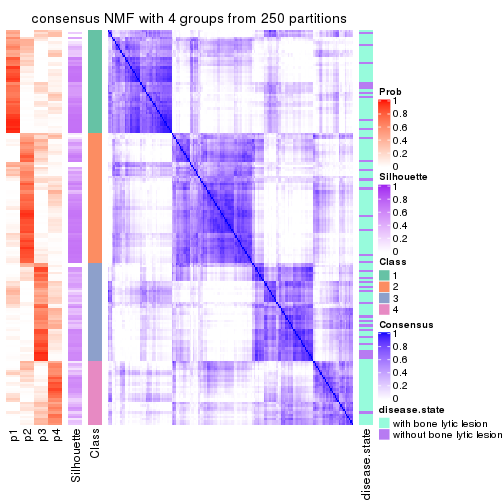</p>

</div>
<div id='tab-CV-NMF-consensus-heatmap-4'>
<pre><code class="r">consensus_heatmap(res, k = 5)
</code></pre>

<p></p>

</div>
<div id='tab-CV-NMF-consensus-heatmap-5'>
<pre><code class="r">consensus_heatmap(res, k = 6)
</code></pre>

<p></p>

</div>
</div>

Heatmaps for the membership of samples in all partitions to see how consistent they are:


<script>
$( function() {
	$( '#tabs-CV-NMF-membership-heatmap' ).tabs();
} );
</script>
<div id='tabs-CV-NMF-membership-heatmap'>
<ul>
<li><a href='#tab-CV-NMF-membership-heatmap-1'>k = 2</a></li>
<li><a href='#tab-CV-NMF-membership-heatmap-2'>k = 3</a></li>
<li><a href='#tab-CV-NMF-membership-heatmap-3'>k = 4</a></li>
<li><a href='#tab-CV-NMF-membership-heatmap-4'>k = 5</a></li>
<li><a href='#tab-CV-NMF-membership-heatmap-5'>k = 6</a></li>
</ul>
<div id='tab-CV-NMF-membership-heatmap-1'>
<pre><code class="r">membership_heatmap(res, k = 2)
</code></pre>

<p></p>

</div>
<div id='tab-CV-NMF-membership-heatmap-2'>
<pre><code class="r">membership_heatmap(res, k = 3)
</code></pre>

<p></p>

</div>
<div id='tab-CV-NMF-membership-heatmap-3'>
<pre><code class="r">membership_heatmap(res, k = 4)
</code></pre>

<p>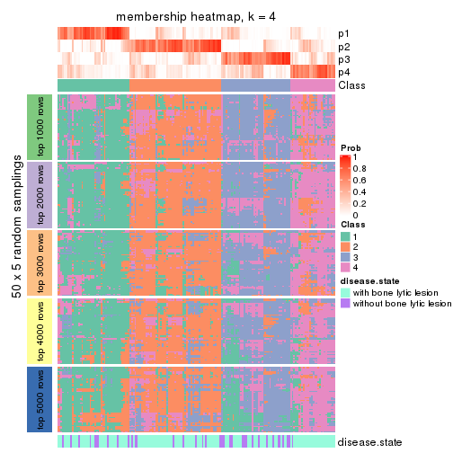</p>

</div>
<div id='tab-CV-NMF-membership-heatmap-4'>
<pre><code class="r">membership_heatmap(res, k = 5)
</code></pre>

<p></p>

</div>
<div id='tab-CV-NMF-membership-heatmap-5'>
<pre><code class="r">membership_heatmap(res, k = 6)
</code></pre>

<p></p>

</div>
</div>

As soon as we have had the classes for columns, we can look for signatures
which are significantly different between classes which can be candidate marks
for certain classes. Following are the heatmaps for signatures.


Signature heatmaps where rows are scaled:


<script>
$( function() {
	$( '#tabs-CV-NMF-get-signatures' ).tabs();
} );
</script>
<div id='tabs-CV-NMF-get-signatures'>
<ul>
<li><a href='#tab-CV-NMF-get-signatures-1'>k = 2</a></li>
<li><a href='#tab-CV-NMF-get-signatures-2'>k = 3</a></li>
<li><a href='#tab-CV-NMF-get-signatures-3'>k = 4</a></li>
<li><a href='#tab-CV-NMF-get-signatures-4'>k = 5</a></li>
<li><a href='#tab-CV-NMF-get-signatures-5'>k = 6</a></li>
</ul>
<div id='tab-CV-NMF-get-signatures-1'>
<pre><code class="r">get_signatures(res, k = 2)
</code></pre>

<p></p>

</div>
<div id='tab-CV-NMF-get-signatures-2'>
<pre><code class="r">get_signatures(res, k = 3)
</code></pre>

<p></p>

</div>
<div id='tab-CV-NMF-get-signatures-3'>
<pre><code class="r">get_signatures(res, k = 4)
</code></pre>

<p></p>

</div>
<div id='tab-CV-NMF-get-signatures-4'>
<pre><code class="r">get_signatures(res, k = 5)
</code></pre>

<p></p>

</div>
<div id='tab-CV-NMF-get-signatures-5'>
<pre><code class="r">get_signatures(res, k = 6)
</code></pre>

<p></p>

</div>
</div>


Signature heatmaps where rows are not scaled:


<script>
$( function() {
	$( '#tabs-CV-NMF-get-signatures-no-scale' ).tabs();
} );
</script>
<div id='tabs-CV-NMF-get-signatures-no-scale'>
<ul>
<li><a href='#tab-CV-NMF-get-signatures-no-scale-1'>k = 2</a></li>
<li><a href='#tab-CV-NMF-get-signatures-no-scale-2'>k = 3</a></li>
<li><a href='#tab-CV-NMF-get-signatures-no-scale-3'>k = 4</a></li>
<li><a href='#tab-CV-NMF-get-signatures-no-scale-4'>k = 5</a></li>
<li><a href='#tab-CV-NMF-get-signatures-no-scale-5'>k = 6</a></li>
</ul>
<div id='tab-CV-NMF-get-signatures-no-scale-1'>
<pre><code class="r">get_signatures(res, k = 2, scale_rows = FALSE)
</code></pre>

<p></p>

</div>
<div id='tab-CV-NMF-get-signatures-no-scale-2'>
<pre><code class="r">get_signatures(res, k = 3, scale_rows = FALSE)
</code></pre>

<p></p>

</div>
<div id='tab-CV-NMF-get-signatures-no-scale-3'>
<pre><code class="r">get_signatures(res, k = 4, scale_rows = FALSE)
</code></pre>

<p></p>

</div>
<div id='tab-CV-NMF-get-signatures-no-scale-4'>
<pre><code class="r">get_signatures(res, k = 5, scale_rows = FALSE)
</code></pre>

<p></p>

</div>
<div id='tab-CV-NMF-get-signatures-no-scale-5'>
<pre><code class="r">get_signatures(res, k = 6, scale_rows = FALSE)
</code></pre>

<p></p>

</div>
</div>


Compare the overlap of signatures from different k:

```r
compare_signatures(res)
```


`get_signature()` returns a data frame invisibly. TO get the list of signatures, the function
call should be assigned to a variable explicitly. In following code, if `plot` argument is set
to `FALSE`, no heatmap is plotted while only the differential analysis is performed.

```r
# code only for demonstration
tb = get_signature(res, k = ..., plot = FALSE)
```

An example of the output of `tb` is:

```
#>   which_row         fdr    mean_1    mean_2 scaled_mean_1 scaled_mean_2 km
#> 1        38 0.042760348  8.373488  9.131774    -0.5533452     0.5164555  1
#> 2        40 0.018707592  7.106213  8.469186    -0.6173731     0.5762149  1
#> 3        55 0.019134737 10.221463 11.207825    -0.6159697     0.5749050  1
#> 4        59 0.006059896  5.921854  7.869574    -0.6899429     0.6439467  1
#> 5        60 0.018055526  8.928898 10.211722    -0.6204761     0.5791110  1
#> 6        98 0.009384629 15.714769 14.887706     0.6635654    -0.6193277  2
...
```

The columns in `tb` are:

1. `which_row`: row indices corresponding to the input matrix.
2. `fdr`: FDR for the differential test. 
3. `mean_x`: The mean value in group x.
4. `scaled_mean_x`: The mean value in group x after rows are scaled.
5. `km`: Row groups if k-means clustering is applied to rows.


UMAP plot which shows how samples are separated.


<script>
$( function() {
	$( '#tabs-CV-NMF-dimension-reduction' ).tabs();
} );
</script>
<div id='tabs-CV-NMF-dimension-reduction'>
<ul>
<li><a href='#tab-CV-NMF-dimension-reduction-1'>k = 2</a></li>
<li><a href='#tab-CV-NMF-dimension-reduction-2'>k = 3</a></li>
<li><a href='#tab-CV-NMF-dimension-reduction-3'>k = 4</a></li>
<li><a href='#tab-CV-NMF-dimension-reduction-4'>k = 5</a></li>
<li><a href='#tab-CV-NMF-dimension-reduction-5'>k = 6</a></li>
</ul>
<div id='tab-CV-NMF-dimension-reduction-1'>
<pre><code class="r">dimension_reduction(res, k = 2, method = &quot;UMAP&quot;)
</code></pre>

<p></p>

</div>
<div id='tab-CV-NMF-dimension-reduction-2'>
<pre><code class="r">dimension_reduction(res, k = 3, method = &quot;UMAP&quot;)
</code></pre>

<p></p>

</div>
<div id='tab-CV-NMF-dimension-reduction-3'>
<pre><code class="r">dimension_reduction(res, k = 4, method = &quot;UMAP&quot;)
</code></pre>

<p></p>

</div>
<div id='tab-CV-NMF-dimension-reduction-4'>
<pre><code class="r">dimension_reduction(res, k = 5, method = &quot;UMAP&quot;)
</code></pre>

<p></p>

</div>
<div id='tab-CV-NMF-dimension-reduction-5'>
<pre><code class="r">dimension_reduction(res, k = 6, method = &quot;UMAP&quot;)
</code></pre>

<p></p>

</div>
</div>


Following heatmap shows how subgroups are split when increasing `k`:

```r
collect_classes(res)
```


Test correlation between subgroups and known annotations. If the known
annotation is numeric, one-way ANOVA test is applied, and if the known
annotation is discrete, chi-squared contingency table test is applied.

```r
test_to_known_factors(res)
```

```
#>          n disease.state(p) k
#> CV:NMF 163           0.0635 2
#> CV:NMF 128           0.0908 3
#> CV:NMF  99           0.0394 4
#> CV:NMF  78           0.0773 5
#> CV:NMF  64           0.0165 6
```


If matrix rows can be associated to genes, consider to use `GO_Enrichment(res,
...)` to perform function enrichment for the signature genes.


 

---------------------------------------------------


### MAD:hclust


The object with results only for a single top-value method and a single partition method 
can be extracted as:

```r
res = res_list["MAD", "hclust"]
# you can also extract it by
# res = res_list["MAD:hclust"]
```

A summary of `res` and all the functions that can be applied to it:

```r
res
```

```
#> A 'ConsensusPartition' object with k = 2, 3, 4, 5, 6.
#>   On a matrix with 11993 rows and 173 columns.
#>   Top rows (1000, 2000, 3000, 4000, 5000) are extracted by 'MAD' method.
#>   Subgroups are detected by 'hclust' method.
#>   Performed in total 1250 partitions by row resampling.
#>   Best k for subgroups seems to be 5.
#> 
#> Following methods can be applied to this 'ConsensusPartition' object:
#>  [1] "cola_report"             "collect_classes"         "collect_plots"          
#>  [4] "collect_stats"           "colnames"                "compare_signatures"     
#>  [7] "consensus_heatmap"       "dimension_reduction"     "functional_enrichment"  
#> [10] "get_anno_col"            "get_anno"                "get_classes"            
#> [13] "get_consensus"           "get_matrix"              "get_membership"         
#> [16] "get_param"               "get_signatures"          "get_stats"              
#> [19] "is_best_k"               "is_stable_k"             "membership_heatmap"     
#> [22] "ncol"                    "nrow"                    "plot_ecdf"              
#> [25] "rownames"                "select_partition_number" "show"                   
#> [28] "suggest_best_k"          "test_to_known_factors"
```

`collect_plots()` function collects all the plots made from `res` for all `k` (number of partitions)
into one single page to provide an easy and fast comparison between different `k`.

```r
collect_plots(res)
```


The plots are:

- The first row: a plot of the ECDF (Empirical cumulative distribution
  function) curves of the consensus matrix for each `k` and the heatmap of
  predicted classes for each `k`.
- The second row: heatmaps of the consensus matrix for each `k`.
- The third row: heatmaps of the membership matrix for each `k`.
- The fouth row: heatmaps of the signatures for each `k`.

All the plots in panels can be made by individual functions and they are
plotted later in this section.

`select_partition_number()` produces several plots showing different
statistics for choosing "optimized" `k`. There are following statistics:

- ECDF curves of the consensus matrix for each `k`;
- 1-PAC. [The PAC
  score](https://en.wikipedia.org/wiki/Consensus_clustering#Over-interpretation_potential_of_consensus_clustering)
  measures the proportion of the ambiguous subgrouping.
- Mean silhouette score.
- Concordance. The mean probability of fiting the consensus class ids in all
  partitions.
- Area increased. Denote $A_k$ as the area under the ECDF curve for current
  `k`, the area increased is defined as $A_k - A_{k-1}$.
- Rand index. The percent of pairs of samples that are both in a same cluster
  or both are not in a same cluster in the partition of k and k-1.
- Jaccard index. The ratio of pairs of samples are both in a same cluster in
  the partition of k and k-1 and the pairs of samples are both in a same
  cluster in the partition k or k-1.

The detailed explanations of these statistics can be found in [the cola
vignette](http://bioconductor.org/packages/devel/bioc/vignettes/cola/inst/doc/cola.html#toc_13).

Generally speaking, lower PAC score, higher mean silhouette score or higher
concordance corresponds to better partition. Rand index and Jaccard index
measure how similar the current partition is compared to partition with `k-1`.
If they are too similar, we won't accept `k` is better than `k-1`.

```r
select_partition_number(res)
```


The numeric values for all these statistics can be obtained by `get_stats()`.

```r
get_stats(res)
```

```
#>   k  1-PAC mean_silhouette concordance area_increased  Rand Jaccard
#> 2 2 0.0148           0.438       0.694         0.4008 0.675   0.675
#> 3 3 0.0235           0.202       0.526         0.4310 0.736   0.641
#> 4 4 0.0592           0.288       0.500         0.1716 0.650   0.412
#> 5 5 0.1439           0.333       0.529         0.0853 0.876   0.638
#> 6 6 0.2394           0.262       0.531         0.0575 0.947   0.810
```

`suggest_best_k()` suggests the best $k$ based on these statistics. The rules are as follows:

- All $k$ with Jaccard index larger than 0.95 are removed because the increase of
  the partition number does not provides enough extra information. If all $k$ are removed,
  the best $k$ is assigned by `NA`.
- For $k$ with 1-PAC larger than 0.9, the maximal $k$ is taken as the "best k". Other $k$ is called "optional k".
- If it does not fit the second rule. The $k$ with the highest vote of highest
  1-PAC, mean silhouette and concordance is taken as the "best k".

```r
suggest_best_k(res)
```

```
#> [1] 5
```


Following shows the table of the partitions (You need to click the **show/hide
code output** link to see it). The membership matrix (columns with name `p*`)
is inferred by
[`clue::cl_consensus()`](https://www.rdocumentation.org/link/cl_consensus?package=clue)
function with the `SE` method. Basically the value in the membership matrix
represents the probability to belong to a certain group. The finall class
label for an item is determined with the group with highest probability it
belongs to.

In `get_classes()` function, the entropy is calculated from the membership
matrix and the silhouette score is calculated from the consensus matrix.


<script>
$( function() {
	$( '#tabs-MAD-hclust-get-classes' ).tabs();
} );
</script>
<div id='tabs-MAD-hclust-get-classes'>
<ul>
<li><a href='#tab-MAD-hclust-get-classes-1'>k = 2</a></li>
<li><a href='#tab-MAD-hclust-get-classes-2'>k = 3</a></li>
<li><a href='#tab-MAD-hclust-get-classes-3'>k = 4</a></li>
<li><a href='#tab-MAD-hclust-get-classes-4'>k = 5</a></li>
<li><a href='#tab-MAD-hclust-get-classes-5'>k = 6</a></li>
</ul>

<div id='tab-MAD-hclust-get-classes-1'>
<p><a id='tab-MAD-hclust-get-classes-1-a' style='color:#0366d6' href='#'>show/hide code output</a></p>
<pre><code class="r">cbind(get_classes(res, k = 2), get_membership(res, k = 2))
</code></pre>

<pre><code>#&gt;          class entropy silhouette    p1    p2
#&gt; GSM11437     1   0.998     0.4734 0.528 0.472
#&gt; GSM11438     2   0.662     0.5739 0.172 0.828
#&gt; GSM11439     2   0.955     0.3449 0.376 0.624
#&gt; GSM11440     2   0.866     0.4653 0.288 0.712
#&gt; GSM11441     2   0.958     0.2611 0.380 0.620
#&gt; GSM11442     2   0.844     0.5212 0.272 0.728
#&gt; GSM11443     2   0.574     0.5827 0.136 0.864
#&gt; GSM11444     2   0.886     0.4226 0.304 0.696
#&gt; GSM11445     2   0.895     0.4201 0.312 0.688
#&gt; GSM11446     2   0.978     0.2297 0.412 0.588
#&gt; GSM11447     2   0.949     0.3606 0.368 0.632
#&gt; GSM11448     2   0.991    -0.0184 0.444 0.556
#&gt; GSM11449     2   0.808     0.5117 0.248 0.752
#&gt; GSM11450     1   0.991     0.4230 0.556 0.444
#&gt; GSM11451     2   0.584     0.5780 0.140 0.860
#&gt; GSM11452     2   0.644     0.5534 0.164 0.836
#&gt; GSM11453     1   0.985     0.6476 0.572 0.428
#&gt; GSM11454     2   0.981     0.1020 0.420 0.580
#&gt; GSM11455     2   0.722     0.5938 0.200 0.800
#&gt; GSM11456     2   0.900     0.4153 0.316 0.684
#&gt; GSM11457     2   0.469     0.5793 0.100 0.900
#&gt; GSM11458     2   1.000    -0.3223 0.500 0.500
#&gt; GSM11459     2   0.963     0.2708 0.388 0.612
#&gt; GSM11460     1   0.999     0.4133 0.520 0.480
#&gt; GSM11461     2   0.996    -0.3287 0.464 0.536
#&gt; GSM11462     2   0.969     0.2141 0.396 0.604
#&gt; GSM11463     2   0.563     0.5722 0.132 0.868
#&gt; GSM11464     1   0.952     0.6033 0.628 0.372
#&gt; GSM11465     2   0.939     0.3086 0.356 0.644
#&gt; GSM11466     2   0.949     0.3607 0.368 0.632
#&gt; GSM11467     1   0.994     0.4966 0.544 0.456
#&gt; GSM11468     2   0.917     0.3785 0.332 0.668
#&gt; GSM11469     2   0.917     0.3785 0.332 0.668
#&gt; GSM11470     1   0.855     0.6347 0.720 0.280
#&gt; GSM11471     2   0.969     0.2609 0.396 0.604
#&gt; GSM11472     2   0.932     0.4172 0.348 0.652
#&gt; GSM11473     2   0.861     0.5066 0.284 0.716
#&gt; GSM11474     2   0.706     0.5744 0.192 0.808
#&gt; GSM11475     2   0.821     0.5070 0.256 0.744
#&gt; GSM11476     2   0.730     0.5413 0.204 0.796
#&gt; GSM11477     2   0.529     0.5773 0.120 0.880
#&gt; GSM11478     2   0.595     0.5563 0.144 0.856
#&gt; GSM11479     2   0.861     0.5343 0.284 0.716
#&gt; GSM11480     2   0.541     0.5569 0.124 0.876
#&gt; GSM11481     2   0.781     0.5422 0.232 0.768
#&gt; GSM11482     2   0.808     0.5671 0.248 0.752
#&gt; GSM11483     2   0.808     0.5167 0.248 0.752
#&gt; GSM11484     2   0.802     0.5413 0.244 0.756
#&gt; GSM11485     2   0.767     0.5055 0.224 0.776
#&gt; GSM11486     2   0.781     0.5537 0.232 0.768
#&gt; GSM11487     1   0.998     0.5497 0.528 0.472
#&gt; GSM11488     2   0.753     0.5511 0.216 0.784
#&gt; GSM11489     2   0.904     0.4839 0.320 0.680
#&gt; GSM11490     2   0.955     0.3400 0.376 0.624
#&gt; GSM11491     1   0.963     0.6642 0.612 0.388
#&gt; GSM11492     2   0.821     0.5364 0.256 0.744
#&gt; GSM11493     2   0.738     0.5507 0.208 0.792
#&gt; GSM11494     2   0.844     0.5692 0.272 0.728
#&gt; GSM11495     2   0.904     0.5082 0.320 0.680
#&gt; GSM11496     2   0.913     0.4595 0.328 0.672
#&gt; GSM11497     2   0.850     0.4287 0.276 0.724
#&gt; GSM11498     2   0.781     0.5471 0.232 0.768
#&gt; GSM11499     2   0.760     0.5450 0.220 0.780
#&gt; GSM11500     2   0.781     0.5678 0.232 0.768
#&gt; GSM11501     2   0.689     0.5268 0.184 0.816
#&gt; GSM11502     2   0.518     0.5670 0.116 0.884
#&gt; GSM11503     2   0.615     0.5831 0.152 0.848
#&gt; GSM11504     2   0.995    -0.2045 0.460 0.540
#&gt; GSM11505     2   0.518     0.5810 0.116 0.884
#&gt; GSM11506     2   0.839     0.4463 0.268 0.732
#&gt; GSM11507     2   0.722     0.5108 0.200 0.800
#&gt; GSM11508     2   0.936     0.3618 0.352 0.648
#&gt; GSM11509     2   0.987     0.2416 0.432 0.568
#&gt; GSM11510     2   0.730     0.5727 0.204 0.796
#&gt; GSM11511     1   0.998     0.4259 0.524 0.476
#&gt; GSM11512     1   0.999     0.4280 0.520 0.480
#&gt; GSM11513     2   0.949     0.3379 0.368 0.632
#&gt; GSM11514     2   0.788     0.5560 0.236 0.764
#&gt; GSM11515     2   0.900     0.4595 0.316 0.684
#&gt; GSM11516     2   0.932     0.2021 0.348 0.652
#&gt; GSM11517     2   0.971     0.1251 0.400 0.600
#&gt; GSM11518     2   0.963     0.1977 0.388 0.612
#&gt; GSM11519     1   0.983     0.6520 0.576 0.424
#&gt; GSM11520     1   0.999     0.5388 0.516 0.484
#&gt; GSM11521     2   0.706     0.5222 0.192 0.808
#&gt; GSM11522     2   0.929     0.3276 0.344 0.656
#&gt; GSM11523     1   0.850     0.6232 0.724 0.276
#&gt; GSM11524     2   0.971     0.2477 0.400 0.600
#&gt; GSM11525     2   0.574     0.5630 0.136 0.864
#&gt; GSM11526     1   0.999     0.4178 0.516 0.484
#&gt; GSM11527     2   0.482     0.5828 0.104 0.896
#&gt; GSM11528     2   0.697     0.5716 0.188 0.812
#&gt; GSM11529     2   0.689     0.5670 0.184 0.816
#&gt; GSM11530     2   0.886     0.4211 0.304 0.696
#&gt; GSM11531     2   0.552     0.5755 0.128 0.872
#&gt; GSM11532     2   0.943     0.3410 0.360 0.640
#&gt; GSM11533     2   0.689     0.5324 0.184 0.816
#&gt; GSM11534     2   0.980     0.1131 0.416 0.584
#&gt; GSM11535     2   0.680     0.5371 0.180 0.820
#&gt; GSM11536     2   0.814     0.5335 0.252 0.748
#&gt; GSM11537     2   0.482     0.5807 0.104 0.896
#&gt; GSM11538     2   0.886     0.3678 0.304 0.696
#&gt; GSM11539     2   0.506     0.5823 0.112 0.888
#&gt; GSM11540     2   0.552     0.5823 0.128 0.872
#&gt; GSM11541     1   0.999     0.4193 0.516 0.484
#&gt; GSM11542     2   0.697     0.5716 0.188 0.812
#&gt; GSM11543     2   0.993     0.1617 0.452 0.548
#&gt; GSM11544     1   0.995     0.5955 0.540 0.460
#&gt; GSM11545     1   0.997     0.5831 0.532 0.468
#&gt; GSM11546     2   0.904     0.3040 0.320 0.680
#&gt; GSM11547     2   0.788     0.4912 0.236 0.764
#&gt; GSM11548     2   0.955     0.3043 0.376 0.624
#&gt; GSM11549     1   0.995     0.4072 0.540 0.460
#&gt; GSM11550     2   0.998    -0.1831 0.476 0.524
#&gt; GSM11551     2   0.998    -0.1680 0.476 0.524
#&gt; GSM11552     2   0.973     0.1948 0.404 0.596
#&gt; GSM11553     2   0.706     0.5382 0.192 0.808
#&gt; GSM11554     2   0.662     0.5521 0.172 0.828
#&gt; GSM11555     2   0.821     0.5364 0.256 0.744
#&gt; GSM11556     2   0.821     0.5364 0.256 0.744
#&gt; GSM11557     2   0.482     0.5754 0.104 0.896
#&gt; GSM11558     2   0.671     0.5402 0.176 0.824
#&gt; GSM11559     2   0.876     0.4602 0.296 0.704
#&gt; GSM11560     1   0.966     0.6435 0.608 0.392
#&gt; GSM11561     2   0.680     0.5348 0.180 0.820
#&gt; GSM11562     2   0.506     0.5808 0.112 0.888
#&gt; GSM11563     2   0.998    -0.1204 0.476 0.524
#&gt; GSM11564     2   0.998    -0.2741 0.476 0.524
#&gt; GSM11565     1   0.991     0.3260 0.556 0.444
#&gt; GSM11566     2   0.563     0.5597 0.132 0.868
#&gt; GSM11567     2   0.745     0.5513 0.212 0.788
#&gt; GSM11568     2   0.990    -0.1372 0.440 0.560
#&gt; GSM11569     2   0.506     0.5813 0.112 0.888
#&gt; GSM11570     2   0.973     0.1948 0.404 0.596
#&gt; GSM11571     2   0.795     0.4893 0.240 0.760
#&gt; GSM11572     2   0.876     0.4502 0.296 0.704
#&gt; GSM11573     1   0.997     0.5831 0.532 0.468
#&gt; GSM11574     2   0.722     0.5232 0.200 0.800
#&gt; GSM11575     2   0.936     0.3671 0.352 0.648
#&gt; GSM11576     1   0.949     0.6529 0.632 0.368
#&gt; GSM11577     2   0.855     0.4034 0.280 0.720
#&gt; GSM11578     2   0.738     0.5249 0.208 0.792
#&gt; GSM11579     2   0.574     0.5702 0.136 0.864
#&gt; GSM11580     2   0.855     0.4128 0.280 0.720
#&gt; GSM11581     2   0.973     0.2396 0.404 0.596
#&gt; GSM11582     1   0.999     0.4187 0.516 0.484
#&gt; GSM11583     2   0.939     0.1758 0.356 0.644
#&gt; GSM11584     2   0.722     0.5439 0.200 0.800
#&gt; GSM11585     2   0.584     0.5583 0.140 0.860
#&gt; GSM11586     1   0.925     0.5999 0.660 0.340
#&gt; GSM11587     1   0.850     0.6232 0.724 0.276
#&gt; GSM11588     1   0.995     0.5993 0.540 0.460
#&gt; GSM11589     2   0.738     0.5495 0.208 0.792
#&gt; GSM11590     1   0.943     0.6640 0.640 0.360
#&gt; GSM11591     2   0.574     0.5604 0.136 0.864
#&gt; GSM11592     1   0.936     0.5605 0.648 0.352
#&gt; GSM11593     1   0.943     0.6640 0.640 0.360
#&gt; GSM11594     1   0.969     0.6672 0.604 0.396
#&gt; GSM11595     2   0.943     0.2961 0.360 0.640
#&gt; GSM11596     2   0.745     0.5438 0.212 0.788
#&gt; GSM11597     2   0.949     0.2911 0.368 0.632
#&gt; GSM11598     1   0.993     0.6049 0.548 0.452
#&gt; GSM11599     2   0.966     0.2627 0.392 0.608
#&gt; GSM11600     2   0.781     0.5422 0.232 0.768
#&gt; GSM11601     2   0.943     0.3100 0.360 0.640
#&gt; GSM11602     1   0.855     0.6252 0.720 0.280
#&gt; GSM11603     1   0.850     0.6232 0.724 0.276
#&gt; GSM11604     2   0.978     0.2132 0.412 0.588
#&gt; GSM11605     2   0.966     0.1111 0.392 0.608
#&gt; GSM11606     2   0.753     0.5108 0.216 0.784
#&gt; GSM11607     1   0.993     0.6049 0.548 0.452
#&gt; GSM11608     2   0.966     0.2230 0.392 0.608
#&gt; GSM11609     2   0.680     0.5452 0.180 0.820
</code></pre>

<script>
$('#tab-MAD-hclust-get-classes-1-a').parent().next().next().hide();
$('#tab-MAD-hclust-get-classes-1-a').click(function(){
  $('#tab-MAD-hclust-get-classes-1-a').parent().next().next().toggle();
  return(false);
});
</script>
</div>

<div id='tab-MAD-hclust-get-classes-2'>
<p><a id='tab-MAD-hclust-get-classes-2-a' style='color:#0366d6' href='#'>show/hide code output</a></p>
<pre><code class="r">cbind(get_classes(res, k = 3), get_membership(res, k = 3))
</code></pre>

<pre><code>#&gt;          class entropy silhouette    p1    p2    p3
#&gt; GSM11437     1   0.912    0.27155 0.544 0.256 0.200
#&gt; GSM11438     2   0.770    0.31131 0.084 0.644 0.272
#&gt; GSM11439     2   0.969   -0.07733 0.376 0.408 0.216
#&gt; GSM11440     2   0.920    0.18755 0.280 0.528 0.192
#&gt; GSM11441     1   0.985   -0.11090 0.396 0.352 0.252
#&gt; GSM11442     2   0.957    0.10244 0.280 0.480 0.240
#&gt; GSM11443     2   0.639    0.39612 0.124 0.768 0.108
#&gt; GSM11444     2   0.916    0.16903 0.328 0.508 0.164
#&gt; GSM11445     2   0.924    0.16006 0.328 0.500 0.172
#&gt; GSM11446     1   0.967    0.06153 0.424 0.360 0.216
#&gt; GSM11447     2   0.967   -0.06812 0.376 0.412 0.212
#&gt; GSM11448     1   0.957   -0.24855 0.440 0.360 0.200
#&gt; GSM11449     2   0.820    0.27841 0.284 0.608 0.108
#&gt; GSM11450     1   0.886    0.04046 0.576 0.232 0.192
#&gt; GSM11451     2   0.574    0.41360 0.092 0.804 0.104
#&gt; GSM11452     2   0.648    0.38741 0.184 0.748 0.068
#&gt; GSM11453     1   0.547    0.42591 0.800 0.160 0.040
#&gt; GSM11454     1   0.951    0.15933 0.468 0.328 0.204
#&gt; GSM11455     2   0.844    0.30520 0.160 0.616 0.224
#&gt; GSM11456     2   0.905    0.10699 0.332 0.516 0.152
#&gt; GSM11457     2   0.588    0.39327 0.064 0.788 0.148
#&gt; GSM11458     1   0.904    0.27254 0.544 0.280 0.176
#&gt; GSM11459     1   0.973    0.03714 0.420 0.352 0.228
#&gt; GSM11460     1   0.939    0.24266 0.508 0.268 0.224
#&gt; GSM11461     1   0.855    0.25732 0.568 0.312 0.120
#&gt; GSM11462     2   0.933   -0.07187 0.408 0.428 0.164
#&gt; GSM11463     2   0.649    0.38553 0.192 0.744 0.064
#&gt; GSM11464     1   0.772    0.32025 0.680 0.152 0.168
#&gt; GSM11465     2   0.945   -0.00204 0.384 0.436 0.180
#&gt; GSM11466     2   0.962   -0.00788 0.344 0.444 0.212
#&gt; GSM11467     1   0.907    0.28151 0.552 0.244 0.204
#&gt; GSM11468     2   0.954    0.06341 0.364 0.440 0.196
#&gt; GSM11469     2   0.954    0.06341 0.364 0.440 0.196
#&gt; GSM11470     1   0.389    0.34257 0.884 0.032 0.084
#&gt; GSM11471     1   0.957   -0.06449 0.416 0.388 0.196
#&gt; GSM11472     2   0.954    0.03358 0.380 0.428 0.192
#&gt; GSM11473     2   0.930   -0.02392 0.244 0.524 0.232
#&gt; GSM11474     2   0.746    0.32761 0.112 0.692 0.196
#&gt; GSM11475     2   0.904    0.21728 0.280 0.544 0.176
#&gt; GSM11476     2   0.787    0.20021 0.064 0.568 0.368
#&gt; GSM11477     2   0.579    0.40582 0.116 0.800 0.084
#&gt; GSM11478     2   0.536    0.35575 0.032 0.800 0.168
#&gt; GSM11479     2   0.888    0.13580 0.212 0.576 0.212
#&gt; GSM11480     2   0.469    0.35921 0.012 0.820 0.168
#&gt; GSM11481     2   0.857    0.25027 0.128 0.576 0.296
#&gt; GSM11482     2   0.839    0.25463 0.112 0.584 0.304
#&gt; GSM11483     2   0.779    0.14029 0.064 0.588 0.348
#&gt; GSM11484     2   0.864    0.21567 0.116 0.540 0.344
#&gt; GSM11485     2   0.762    0.12940 0.048 0.560 0.392
#&gt; GSM11486     2   0.804    0.25116 0.116 0.636 0.248
#&gt; GSM11487     1   0.738    0.37957 0.684 0.228 0.088
#&gt; GSM11488     2   0.842    0.25505 0.108 0.572 0.320
#&gt; GSM11489     2   0.939   -0.01695 0.304 0.496 0.200
#&gt; GSM11490     2   0.969   -0.07637 0.376 0.408 0.216
#&gt; GSM11491     1   0.507    0.42150 0.828 0.128 0.044
#&gt; GSM11492     2   0.884    0.21298 0.136 0.536 0.328
#&gt; GSM11493     2   0.803    0.23451 0.080 0.584 0.336
#&gt; GSM11494     2   0.922    0.16937 0.200 0.528 0.272
#&gt; GSM11495     2   0.949   -0.06542 0.244 0.496 0.260
#&gt; GSM11496     2   0.958   -0.03358 0.272 0.480 0.248
#&gt; GSM11497     2   0.798    0.24598 0.356 0.572 0.072
#&gt; GSM11498     2   0.836    0.29243 0.216 0.624 0.160
#&gt; GSM11499     2   0.798    0.18885 0.076 0.584 0.340
#&gt; GSM11500     2   0.872    0.20200 0.152 0.576 0.272
#&gt; GSM11501     2   0.714    0.23173 0.040 0.632 0.328
#&gt; GSM11502     2   0.566    0.40903 0.152 0.796 0.052
#&gt; GSM11503     2   0.666    0.37506 0.096 0.748 0.156
#&gt; GSM11504     1   0.986    0.12542 0.412 0.316 0.272
#&gt; GSM11505     2   0.619    0.39430 0.084 0.776 0.140
#&gt; GSM11506     2   0.645    0.11756 0.008 0.608 0.384
#&gt; GSM11507     2   0.631    0.21603 0.016 0.676 0.308
#&gt; GSM11508     1   0.979    0.04160 0.384 0.380 0.236
#&gt; GSM11509     1   0.991   -0.21657 0.388 0.340 0.272
#&gt; GSM11510     2   0.822    0.32309 0.188 0.640 0.172
#&gt; GSM11511     1   0.901   -0.01694 0.556 0.256 0.188
#&gt; GSM11512     1   0.934    0.25042 0.516 0.264 0.220
#&gt; GSM11513     1   0.980    0.01448 0.400 0.360 0.240
#&gt; GSM11514     2   0.860    0.22773 0.124 0.564 0.312
#&gt; GSM11515     2   0.982   -0.00903 0.344 0.408 0.248
#&gt; GSM11516     2   0.824    0.06218 0.416 0.508 0.076
#&gt; GSM11517     1   0.940    0.16209 0.480 0.332 0.188
#&gt; GSM11518     1   0.979   -0.13585 0.428 0.316 0.256
#&gt; GSM11519     1   0.541    0.42500 0.804 0.156 0.040
#&gt; GSM11520     1   0.635    0.40088 0.744 0.204 0.052
#&gt; GSM11521     2   0.729    0.21423 0.040 0.604 0.356
#&gt; GSM11522     2   0.918    0.02346 0.404 0.448 0.148
#&gt; GSM11523     1   0.426    0.31076 0.868 0.036 0.096
#&gt; GSM11524     1   0.969    0.02933 0.404 0.380 0.216
#&gt; GSM11525     2   0.536    0.36034 0.032 0.800 0.168
#&gt; GSM11526     1   0.938    0.24397 0.512 0.260 0.228
#&gt; GSM11527     2   0.600    0.39822 0.072 0.784 0.144
#&gt; GSM11528     2   0.762    0.35026 0.160 0.688 0.152
#&gt; GSM11529     2   0.646    0.38760 0.128 0.764 0.108
#&gt; GSM11530     2   0.923    0.16321 0.316 0.508 0.176
#&gt; GSM11531     2   0.606    0.40587 0.160 0.776 0.064
#&gt; GSM11532     2   0.924    0.07967 0.368 0.472 0.160
#&gt; GSM11533     2   0.680    0.37152 0.204 0.724 0.072
#&gt; GSM11534     2   0.956   -0.20290 0.372 0.432 0.196
#&gt; GSM11535     2   0.722    0.33527 0.244 0.684 0.072
#&gt; GSM11536     2   0.870    0.21659 0.124 0.544 0.332
#&gt; GSM11537     2   0.551    0.41311 0.092 0.816 0.092
#&gt; GSM11538     2   0.971    0.04694 0.256 0.452 0.292
#&gt; GSM11539     2   0.628    0.40332 0.176 0.760 0.064
#&gt; GSM11540     2   0.576    0.38973 0.064 0.796 0.140
#&gt; GSM11541     1   0.936    0.24917 0.512 0.268 0.220
#&gt; GSM11542     2   0.762    0.35026 0.160 0.688 0.152
#&gt; GSM11543     3   0.970    0.00000 0.240 0.312 0.448
#&gt; GSM11544     1   0.698    0.40244 0.708 0.220 0.072
#&gt; GSM11545     1   0.719    0.40288 0.696 0.224 0.080
#&gt; GSM11546     2   0.883    0.11433 0.384 0.496 0.120
#&gt; GSM11547     2   0.859    0.20827 0.332 0.552 0.116
#&gt; GSM11548     1   0.967   -0.04889 0.396 0.392 0.212
#&gt; GSM11549     1   0.883    0.13966 0.580 0.224 0.196
#&gt; GSM11550     1   0.930   -0.00407 0.512 0.292 0.196
#&gt; GSM11551     1   0.931    0.04129 0.516 0.276 0.208
#&gt; GSM11552     1   0.927    0.07678 0.428 0.416 0.156
#&gt; GSM11553     2   0.734    0.35879 0.232 0.684 0.084
#&gt; GSM11554     2   0.685    0.37437 0.224 0.712 0.064
#&gt; GSM11555     2   0.884    0.21298 0.136 0.536 0.328
#&gt; GSM11556     2   0.884    0.21298 0.136 0.536 0.328
#&gt; GSM11557     2   0.560    0.40594 0.148 0.800 0.052
#&gt; GSM11558     2   0.598    0.27260 0.020 0.728 0.252
#&gt; GSM11559     2   0.884    0.15710 0.328 0.536 0.136
#&gt; GSM11560     1   0.689    0.39100 0.736 0.152 0.112
#&gt; GSM11561     2   0.613    0.25532 0.020 0.712 0.268
#&gt; GSM11562     2   0.566    0.41040 0.096 0.808 0.096
#&gt; GSM11563     1   0.932    0.04945 0.504 0.304 0.192
#&gt; GSM11564     1   0.886    0.21355 0.544 0.312 0.144
#&gt; GSM11565     1   0.968   -0.43147 0.432 0.220 0.348
#&gt; GSM11566     2   0.568    0.35635 0.032 0.776 0.192
#&gt; GSM11567     2   0.811    0.23358 0.084 0.580 0.336
#&gt; GSM11568     1   0.875    0.02027 0.508 0.376 0.116
#&gt; GSM11569     2   0.543    0.41261 0.092 0.820 0.088
#&gt; GSM11570     1   0.927    0.07678 0.428 0.416 0.156
#&gt; GSM11571     2   0.771    0.32475 0.264 0.648 0.088
#&gt; GSM11572     2   0.903    0.09852 0.328 0.520 0.152
#&gt; GSM11573     1   0.719    0.40288 0.696 0.224 0.080
#&gt; GSM11574     2   0.704    0.34465 0.252 0.688 0.060
#&gt; GSM11575     2   0.905    0.11040 0.360 0.496 0.144
#&gt; GSM11576     1   0.663    0.39185 0.752 0.144 0.104
#&gt; GSM11577     2   0.806    0.26624 0.328 0.588 0.084
#&gt; GSM11578     2   0.716    0.34168 0.256 0.680 0.064
#&gt; GSM11579     2   0.563    0.36865 0.032 0.780 0.188
#&gt; GSM11580     2   0.797    0.27672 0.324 0.596 0.080
#&gt; GSM11581     1   0.969    0.00939 0.408 0.376 0.216
#&gt; GSM11582     1   0.937    0.24467 0.512 0.264 0.224
#&gt; GSM11583     2   0.911   -0.10213 0.428 0.432 0.140
#&gt; GSM11584     2   0.789    0.19596 0.064 0.564 0.372
#&gt; GSM11585     2   0.585    0.39394 0.172 0.780 0.048
#&gt; GSM11586     1   0.757    0.19770 0.688 0.128 0.184
#&gt; GSM11587     1   0.426    0.31076 0.868 0.036 0.096
#&gt; GSM11588     1   0.689    0.40323 0.708 0.228 0.064
#&gt; GSM11589     2   0.792    0.33683 0.204 0.660 0.136
#&gt; GSM11590     1   0.451    0.37957 0.860 0.092 0.048
#&gt; GSM11591     2   0.575    0.39888 0.180 0.780 0.040
#&gt; GSM11592     1   0.817    0.11554 0.640 0.148 0.212
#&gt; GSM11593     1   0.451    0.37957 0.860 0.092 0.048
#&gt; GSM11594     1   0.514    0.42126 0.824 0.132 0.044
#&gt; GSM11595     2   0.942   -0.00839 0.388 0.436 0.176
#&gt; GSM11596     2   0.756    0.36560 0.224 0.676 0.100
#&gt; GSM11597     2   0.930   -0.01589 0.380 0.456 0.164
#&gt; GSM11598     1   0.645    0.41017 0.744 0.196 0.060
#&gt; GSM11599     1   0.954    0.08386 0.444 0.360 0.196
#&gt; GSM11600     2   0.857    0.25027 0.128 0.576 0.296
#&gt; GSM11601     2   0.929    0.00251 0.372 0.464 0.164
#&gt; GSM11602     1   0.437    0.31077 0.864 0.040 0.096
#&gt; GSM11603     1   0.426    0.31076 0.868 0.036 0.096
#&gt; GSM11604     1   0.962    0.04450 0.420 0.376 0.204
#&gt; GSM11605     2   0.923   -0.07787 0.416 0.432 0.152
#&gt; GSM11606     2   0.723    0.32869 0.264 0.672 0.064
#&gt; GSM11607     1   0.645    0.41017 0.744 0.196 0.060
#&gt; GSM11608     2   0.933   -0.06109 0.404 0.432 0.164
#&gt; GSM11609     2   0.779    0.21209 0.064 0.588 0.348
</code></pre>

<script>
$('#tab-MAD-hclust-get-classes-2-a').parent().next().next().hide();
$('#tab-MAD-hclust-get-classes-2-a').click(function(){
  $('#tab-MAD-hclust-get-classes-2-a').parent().next().next().toggle();
  return(false);
});
</script>
</div>

<div id='tab-MAD-hclust-get-classes-3'>
<p><a id='tab-MAD-hclust-get-classes-3-a' style='color:#0366d6' href='#'>show/hide code output</a></p>
<pre><code class="r">cbind(get_classes(res, k = 4), get_membership(res, k = 4))
</code></pre>

<pre><code>#&gt;          class entropy silhouette    p1    p2    p3    p4
#&gt; GSM11437     1   0.725    0.41366 0.664 0.116 0.096 0.124
#&gt; GSM11438     2   0.885   -0.13126 0.068 0.452 0.240 0.240
#&gt; GSM11439     3   0.735    0.41991 0.124 0.200 0.628 0.048
#&gt; GSM11440     3   0.922    0.29940 0.140 0.292 0.424 0.144
#&gt; GSM11441     3   0.843    0.42926 0.144 0.148 0.560 0.148
#&gt; GSM11442     3   0.877    0.35683 0.104 0.256 0.492 0.148
#&gt; GSM11443     2   0.607    0.47129 0.028 0.724 0.160 0.088
#&gt; GSM11444     3   0.878    0.40011 0.164 0.284 0.468 0.084
#&gt; GSM11445     3   0.875    0.39903 0.164 0.276 0.476 0.084
#&gt; GSM11446     3   0.770    0.42713 0.164 0.168 0.608 0.060
#&gt; GSM11447     3   0.751    0.41866 0.120 0.200 0.620 0.060
#&gt; GSM11448     3   0.976    0.18355 0.232 0.252 0.348 0.168
#&gt; GSM11449     2   0.843   -0.05424 0.136 0.496 0.296 0.072
#&gt; GSM11450     1   0.918    0.12959 0.392 0.168 0.332 0.108
#&gt; GSM11451     2   0.463    0.44071 0.076 0.828 0.040 0.056
#&gt; GSM11452     2   0.447    0.51009 0.084 0.828 0.072 0.016
#&gt; GSM11453     1   0.612    0.50766 0.700 0.160 0.132 0.008
#&gt; GSM11454     3   0.789    0.40367 0.228 0.164 0.564 0.044
#&gt; GSM11455     2   0.919   -0.11095 0.100 0.380 0.340 0.180
#&gt; GSM11456     3   0.821    0.22300 0.128 0.392 0.432 0.048
#&gt; GSM11457     2   0.530    0.44317 0.024 0.780 0.080 0.116
#&gt; GSM11458     1   0.834   -0.09725 0.408 0.152 0.396 0.044
#&gt; GSM11459     3   0.777    0.45910 0.164 0.184 0.596 0.056
#&gt; GSM11460     1   0.736    0.39426 0.652 0.100 0.096 0.152
#&gt; GSM11461     1   0.880    0.18442 0.484 0.236 0.196 0.084
#&gt; GSM11462     3   0.949    0.19822 0.316 0.224 0.344 0.116
#&gt; GSM11463     2   0.677    0.48089 0.096 0.684 0.168 0.052
#&gt; GSM11464     1   0.656    0.46964 0.712 0.068 0.100 0.120
#&gt; GSM11465     3   0.849    0.34832 0.168 0.324 0.456 0.052
#&gt; GSM11466     3   0.924    0.42938 0.196 0.256 0.432 0.116
#&gt; GSM11467     1   0.722    0.42489 0.664 0.116 0.084 0.136
#&gt; GSM11468     3   0.887    0.40956 0.196 0.240 0.476 0.088
#&gt; GSM11469     3   0.887    0.40956 0.196 0.240 0.476 0.088
#&gt; GSM11470     1   0.554    0.50255 0.760 0.052 0.152 0.036
#&gt; GSM11471     3   0.858    0.40032 0.156 0.276 0.492 0.076
#&gt; GSM11472     3   0.977    0.17205 0.272 0.260 0.316 0.152
#&gt; GSM11473     3   0.839    0.06403 0.060 0.356 0.452 0.132
#&gt; GSM11474     2   0.735    0.34268 0.020 0.592 0.228 0.160
#&gt; GSM11475     3   0.927    0.28098 0.148 0.316 0.400 0.136
#&gt; GSM11476     4   0.892    0.64673 0.092 0.360 0.148 0.400
#&gt; GSM11477     2   0.461    0.49804 0.032 0.828 0.072 0.068
#&gt; GSM11478     2   0.546    0.38904 0.016 0.764 0.104 0.116
#&gt; GSM11479     3   0.831    0.04774 0.040 0.364 0.436 0.160
#&gt; GSM11480     2   0.507    0.26310 0.040 0.784 0.028 0.148
#&gt; GSM11481     2   0.977   -0.43289 0.156 0.308 0.236 0.300
#&gt; GSM11482     2   0.916   -0.47801 0.084 0.396 0.224 0.296
#&gt; GSM11483     2   0.835    0.00742 0.020 0.412 0.304 0.264
#&gt; GSM11484     3   0.972   -0.26362 0.144 0.300 0.316 0.240
#&gt; GSM11485     4   0.844    0.38470 0.028 0.352 0.224 0.396
#&gt; GSM11486     2   0.799    0.16771 0.016 0.456 0.336 0.192
#&gt; GSM11487     1   0.777    0.43845 0.584 0.196 0.176 0.044
#&gt; GSM11488     2   0.962   -0.43636 0.124 0.328 0.276 0.272
#&gt; GSM11489     3   0.780    0.26581 0.064 0.348 0.512 0.076
#&gt; GSM11490     3   0.739    0.42596 0.128 0.200 0.624 0.048
#&gt; GSM11491     1   0.608    0.51332 0.704 0.132 0.156 0.008
#&gt; GSM11492     3   0.974   -0.23977 0.152 0.300 0.316 0.232
#&gt; GSM11493     4   0.916    0.61679 0.112 0.348 0.156 0.384
#&gt; GSM11494     3   0.837    0.13830 0.032 0.312 0.448 0.208
#&gt; GSM11495     3   0.835    0.22597 0.052 0.320 0.476 0.152
#&gt; GSM11496     3   0.787    0.21399 0.060 0.296 0.544 0.100
#&gt; GSM11497     2   0.800    0.31782 0.208 0.564 0.176 0.052
#&gt; GSM11498     2   0.824    0.33485 0.104 0.568 0.200 0.128
#&gt; GSM11499     2   0.855   -0.24311 0.032 0.400 0.240 0.328
#&gt; GSM11500     2   0.874    0.01848 0.052 0.404 0.340 0.204
#&gt; GSM11501     4   0.863    0.55593 0.060 0.388 0.160 0.392
#&gt; GSM11502     2   0.401    0.50866 0.060 0.856 0.064 0.020
#&gt; GSM11503     2   0.580    0.43396 0.056 0.760 0.072 0.112
#&gt; GSM11504     1   0.821    0.23210 0.556 0.108 0.100 0.236
#&gt; GSM11505     2   0.540    0.45038 0.020 0.772 0.104 0.104
#&gt; GSM11506     2   0.637   -0.04706 0.024 0.556 0.028 0.392
#&gt; GSM11507     2   0.606    0.02039 0.016 0.632 0.036 0.316
#&gt; GSM11508     3   0.805    0.47548 0.148 0.184 0.584 0.084
#&gt; GSM11509     3   0.700    0.41329 0.100 0.164 0.672 0.064
#&gt; GSM11510     2   0.782    0.34513 0.084 0.608 0.172 0.136
#&gt; GSM11511     1   0.953    0.10482 0.360 0.196 0.308 0.136
#&gt; GSM11512     1   0.737    0.39779 0.652 0.104 0.096 0.148
#&gt; GSM11513     3   0.802    0.46403 0.156 0.192 0.580 0.072
#&gt; GSM11514     2   0.976   -0.41689 0.152 0.328 0.256 0.264
#&gt; GSM11515     3   0.845    0.44878 0.148 0.208 0.544 0.100
#&gt; GSM11516     2   0.771    0.24262 0.248 0.568 0.148 0.036
#&gt; GSM11517     3   0.854    0.33509 0.272 0.212 0.468 0.048
#&gt; GSM11518     3   0.920    0.30271 0.208 0.168 0.464 0.160
#&gt; GSM11519     1   0.608    0.51094 0.704 0.156 0.132 0.008
#&gt; GSM11520     1   0.769    0.35067 0.540 0.172 0.268 0.020
#&gt; GSM11521     4   0.860    0.56550 0.064 0.380 0.148 0.408
#&gt; GSM11522     3   0.947    0.35116 0.196 0.276 0.392 0.136
#&gt; GSM11523     1   0.653    0.47335 0.692 0.068 0.188 0.052
#&gt; GSM11524     3   0.748    0.45288 0.160 0.188 0.612 0.040
#&gt; GSM11525     2   0.552    0.39401 0.016 0.760 0.108 0.116
#&gt; GSM11526     1   0.741    0.39581 0.648 0.108 0.092 0.152
#&gt; GSM11527     2   0.541    0.45478 0.024 0.772 0.124 0.080
#&gt; GSM11528     2   0.759    0.37586 0.084 0.632 0.148 0.136
#&gt; GSM11529     2   0.607    0.48735 0.072 0.744 0.116 0.068
#&gt; GSM11530     3   0.890    0.37818 0.176 0.280 0.456 0.088
#&gt; GSM11531     2   0.543    0.51035 0.064 0.772 0.132 0.032
#&gt; GSM11532     3   0.953    0.36343 0.200 0.280 0.380 0.140
#&gt; GSM11533     2   0.489    0.51412 0.104 0.804 0.072 0.020
#&gt; GSM11534     1   0.985   -0.14007 0.316 0.280 0.188 0.216
#&gt; GSM11535     2   0.665    0.47230 0.124 0.692 0.144 0.040
#&gt; GSM11536     3   0.975   -0.27280 0.148 0.300 0.304 0.248
#&gt; GSM11537     2   0.489    0.44648 0.024 0.808 0.088 0.080
#&gt; GSM11538     1   0.925   -0.25178 0.352 0.236 0.084 0.328
#&gt; GSM11539     2   0.623    0.49757 0.072 0.724 0.152 0.052
#&gt; GSM11540     2   0.628    0.35257 0.020 0.704 0.128 0.148
#&gt; GSM11541     1   0.741    0.39294 0.648 0.104 0.096 0.152
#&gt; GSM11542     2   0.759    0.37586 0.084 0.632 0.148 0.136
#&gt; GSM11543     4   0.921   -0.07917 0.096 0.192 0.340 0.372
#&gt; GSM11544     1   0.751    0.46839 0.604 0.184 0.176 0.036
#&gt; GSM11545     1   0.767    0.46121 0.596 0.188 0.172 0.044
#&gt; GSM11546     2   0.905    0.01285 0.296 0.408 0.220 0.076
#&gt; GSM11547     2   0.885    0.08694 0.228 0.440 0.268 0.064
#&gt; GSM11548     3   0.818    0.45431 0.136 0.216 0.564 0.084
#&gt; GSM11549     1   0.919    0.04986 0.364 0.172 0.360 0.104
#&gt; GSM11550     3   0.951    0.14548 0.280 0.216 0.376 0.128
#&gt; GSM11551     3   0.912    0.19062 0.260 0.180 0.448 0.112
#&gt; GSM11552     1   0.942   -0.20198 0.336 0.220 0.336 0.108
#&gt; GSM11553     2   0.608    0.44084 0.112 0.708 0.168 0.012
#&gt; GSM11554     2   0.570    0.46830 0.104 0.740 0.144 0.012
#&gt; GSM11555     3   0.974   -0.23977 0.152 0.300 0.316 0.232
#&gt; GSM11556     3   0.974   -0.23977 0.152 0.300 0.316 0.232
#&gt; GSM11557     2   0.582    0.49741 0.056 0.748 0.148 0.048
#&gt; GSM11558     2   0.546    0.16627 0.008 0.700 0.036 0.256
#&gt; GSM11559     2   0.805    0.11311 0.156 0.520 0.284 0.040
#&gt; GSM11560     1   0.628    0.49241 0.728 0.112 0.108 0.052
#&gt; GSM11561     2   0.583    0.11987 0.012 0.676 0.044 0.268
#&gt; GSM11562     2   0.508    0.43265 0.024 0.796 0.088 0.092
#&gt; GSM11563     3   0.891    0.20467 0.276 0.236 0.424 0.064
#&gt; GSM11564     1   0.905    0.19797 0.444 0.228 0.240 0.088
#&gt; GSM11565     3   0.956   -0.01774 0.240 0.136 0.380 0.244
#&gt; GSM11566     2   0.636    0.20641 0.072 0.712 0.052 0.164
#&gt; GSM11567     4   0.919    0.61238 0.116 0.344 0.156 0.384
#&gt; GSM11568     2   0.892   -0.05207 0.312 0.408 0.216 0.064
#&gt; GSM11569     2   0.489    0.44804 0.024 0.808 0.084 0.084
#&gt; GSM11570     1   0.942   -0.20198 0.336 0.220 0.336 0.108
#&gt; GSM11571     2   0.630    0.46418 0.152 0.712 0.104 0.032
#&gt; GSM11572     2   0.875   -0.07497 0.140 0.452 0.320 0.088
#&gt; GSM11573     1   0.767    0.46121 0.596 0.188 0.172 0.044
#&gt; GSM11574     2   0.610    0.46004 0.128 0.720 0.132 0.020
#&gt; GSM11575     2   0.880    0.05067 0.192 0.468 0.264 0.076
#&gt; GSM11576     1   0.628    0.50158 0.728 0.112 0.108 0.052
#&gt; GSM11577     2   0.695    0.41837 0.236 0.640 0.084 0.040
#&gt; GSM11578     2   0.625    0.45544 0.136 0.712 0.128 0.024
#&gt; GSM11579     2   0.667    0.21167 0.072 0.696 0.072 0.160
#&gt; GSM11580     2   0.684    0.42641 0.232 0.648 0.084 0.036
#&gt; GSM11581     3   0.766    0.45668 0.156 0.196 0.600 0.048
#&gt; GSM11582     1   0.740    0.39344 0.648 0.104 0.092 0.156
#&gt; GSM11583     1   0.931   -0.10448 0.360 0.316 0.232 0.092
#&gt; GSM11584     4   0.889    0.64697 0.092 0.360 0.144 0.404
#&gt; GSM11585     2   0.394    0.51424 0.076 0.852 0.064 0.008
#&gt; GSM11586     1   0.847    0.32762 0.488 0.124 0.308 0.080
#&gt; GSM11587     1   0.653    0.47335 0.692 0.068 0.188 0.052
#&gt; GSM11588     1   0.773    0.47359 0.596 0.192 0.160 0.052
#&gt; GSM11589     2   0.751    0.32311 0.148 0.640 0.088 0.124
#&gt; GSM11590     1   0.680    0.50183 0.672 0.116 0.176 0.036
#&gt; GSM11591     2   0.386    0.51621 0.084 0.852 0.060 0.004
#&gt; GSM11592     1   0.846    0.26524 0.444 0.100 0.368 0.088
#&gt; GSM11593     1   0.680    0.50183 0.672 0.116 0.176 0.036
#&gt; GSM11594     1   0.599    0.51511 0.704 0.140 0.152 0.004
#&gt; GSM11595     3   0.849    0.34595 0.168 0.324 0.456 0.052
#&gt; GSM11596     2   0.652    0.47571 0.120 0.708 0.124 0.048
#&gt; GSM11597     3   0.794    0.44471 0.148 0.260 0.548 0.044
#&gt; GSM11598     1   0.718    0.48863 0.644 0.160 0.156 0.040
#&gt; GSM11599     3   0.764    0.44961 0.176 0.164 0.608 0.052
#&gt; GSM11600     2   0.977   -0.43289 0.156 0.308 0.236 0.300
#&gt; GSM11601     3   0.801    0.43892 0.144 0.268 0.540 0.048
#&gt; GSM11602     1   0.657    0.47394 0.688 0.068 0.192 0.052
#&gt; GSM11603     1   0.653    0.47335 0.692 0.068 0.188 0.052
#&gt; GSM11604     3   0.744    0.44878 0.164 0.188 0.612 0.036
#&gt; GSM11605     1   0.928    0.16334 0.420 0.268 0.116 0.196
#&gt; GSM11606     2   0.643    0.43108 0.128 0.696 0.152 0.024
#&gt; GSM11607     1   0.718    0.48863 0.644 0.160 0.156 0.040
#&gt; GSM11608     3   0.950    0.19550 0.320 0.224 0.340 0.116
#&gt; GSM11609     4   0.838    0.57947 0.084 0.380 0.096 0.440
</code></pre>

<script>
$('#tab-MAD-hclust-get-classes-3-a').parent().next().next().hide();
$('#tab-MAD-hclust-get-classes-3-a').click(function(){
  $('#tab-MAD-hclust-get-classes-3-a').parent().next().next().toggle();
  return(false);
});
</script>
</div>

<div id='tab-MAD-hclust-get-classes-4'>
<p><a id='tab-MAD-hclust-get-classes-4-a' style='color:#0366d6' href='#'>show/hide code output</a></p>
<pre><code class="r">cbind(get_classes(res, k = 5), get_membership(res, k = 5))
</code></pre>

<pre><code>#&gt;          class entropy silhouette    p1    p2    p3    p4    p5
#&gt; GSM11437     1   0.718    0.29188 0.480 0.048 0.040 0.376 0.056
#&gt; GSM11438     2   0.828    0.08219 0.032 0.416 0.228 0.264 0.060
#&gt; GSM11439     3   0.526    0.37965 0.076 0.148 0.740 0.016 0.020
#&gt; GSM11440     4   0.865   -0.16535 0.108 0.196 0.324 0.344 0.028
#&gt; GSM11441     3   0.813    0.29274 0.076 0.104 0.540 0.112 0.168
#&gt; GSM11442     3   0.743    0.35885 0.040 0.180 0.544 0.208 0.028
#&gt; GSM11443     2   0.583    0.56883 0.036 0.700 0.184 0.036 0.044
#&gt; GSM11444     3   0.837    0.25042 0.140 0.188 0.396 0.268 0.008
#&gt; GSM11445     3   0.834    0.24912 0.136 0.184 0.400 0.272 0.008
#&gt; GSM11446     3   0.645    0.44238 0.116 0.092 0.672 0.104 0.016
#&gt; GSM11447     3   0.543    0.38260 0.076 0.148 0.732 0.028 0.016
#&gt; GSM11448     5   0.940    0.32518 0.228 0.212 0.224 0.052 0.284
#&gt; GSM11449     2   0.881   -0.05647 0.148 0.428 0.232 0.136 0.056
#&gt; GSM11450     1   0.899   -0.23419 0.396 0.128 0.200 0.056 0.220
#&gt; GSM11451     2   0.418    0.59739 0.052 0.820 0.036 0.088 0.004
#&gt; GSM11452     2   0.428    0.60752 0.124 0.804 0.044 0.020 0.008
#&gt; GSM11453     1   0.487    0.49391 0.768 0.104 0.044 0.084 0.000
#&gt; GSM11454     3   0.726    0.43740 0.156 0.096 0.576 0.164 0.008
#&gt; GSM11455     3   0.854    0.09140 0.052 0.316 0.340 0.244 0.048
#&gt; GSM11456     2   0.880   -0.19506 0.164 0.352 0.336 0.076 0.072
#&gt; GSM11457     2   0.547    0.60877 0.032 0.756 0.088 0.064 0.060
#&gt; GSM11458     3   0.808    0.12163 0.376 0.084 0.384 0.132 0.024
#&gt; GSM11459     3   0.736    0.40764 0.092 0.096 0.580 0.204 0.028
#&gt; GSM11460     1   0.676    0.24993 0.452 0.036 0.020 0.432 0.060
#&gt; GSM11461     1   0.864    0.14993 0.460 0.164 0.212 0.096 0.068
#&gt; GSM11462     4   0.887   -0.06456 0.268 0.148 0.268 0.296 0.020
#&gt; GSM11463     2   0.614    0.54683 0.112 0.668 0.176 0.020 0.024
#&gt; GSM11464     1   0.627    0.39485 0.608 0.020 0.032 0.284 0.056
#&gt; GSM11465     3   0.887    0.28759 0.184 0.280 0.384 0.080 0.072
#&gt; GSM11466     3   0.896    0.36071 0.172 0.200 0.388 0.200 0.040
#&gt; GSM11467     1   0.671    0.32547 0.512 0.048 0.020 0.372 0.048
#&gt; GSM11468     3   0.861    0.24083 0.164 0.152 0.380 0.284 0.020
#&gt; GSM11469     3   0.861    0.24083 0.164 0.152 0.380 0.284 0.020
#&gt; GSM11470     1   0.393    0.42496 0.840 0.008 0.060 0.032 0.060
#&gt; GSM11471     3   0.915    0.25955 0.196 0.228 0.384 0.088 0.104
#&gt; GSM11472     4   0.930    0.05347 0.244 0.152 0.240 0.308 0.056
#&gt; GSM11473     3   0.762    0.12433 0.052 0.300 0.492 0.028 0.128
#&gt; GSM11474     2   0.725    0.46208 0.024 0.564 0.248 0.096 0.068
#&gt; GSM11475     3   0.848    0.11605 0.112 0.228 0.328 0.320 0.012
#&gt; GSM11476     4   0.768    0.42382 0.012 0.288 0.092 0.488 0.120
#&gt; GSM11477     2   0.475    0.62165 0.056 0.800 0.072 0.048 0.024
#&gt; GSM11478     2   0.553    0.57948 0.020 0.744 0.104 0.080 0.052
#&gt; GSM11479     3   0.812    0.10917 0.032 0.324 0.436 0.112 0.096
#&gt; GSM11480     2   0.413    0.50649 0.000 0.796 0.024 0.148 0.032
#&gt; GSM11481     4   0.601    0.48836 0.028 0.204 0.100 0.660 0.008
#&gt; GSM11482     4   0.813    0.28896 0.024 0.324 0.176 0.408 0.068
#&gt; GSM11483     2   0.811    0.15228 0.008 0.392 0.336 0.120 0.144
#&gt; GSM11484     4   0.634    0.45526 0.020 0.180 0.184 0.612 0.004
#&gt; GSM11485     4   0.825    0.22944 0.000 0.284 0.216 0.364 0.136
#&gt; GSM11486     2   0.776    0.16972 0.024 0.416 0.384 0.088 0.088
#&gt; GSM11487     1   0.719    0.44224 0.596 0.128 0.092 0.168 0.016
#&gt; GSM11488     4   0.636    0.47098 0.012 0.204 0.172 0.604 0.008
#&gt; GSM11489     3   0.848    0.28720 0.092 0.292 0.440 0.072 0.104
#&gt; GSM11490     3   0.540    0.38654 0.080 0.148 0.732 0.020 0.020
#&gt; GSM11491     1   0.453    0.48604 0.804 0.084 0.044 0.060 0.008
#&gt; GSM11492     4   0.658    0.45062 0.032 0.180 0.184 0.600 0.004
#&gt; GSM11493     4   0.790    0.41849 0.024 0.268 0.108 0.492 0.108
#&gt; GSM11494     3   0.772    0.22756 0.012 0.224 0.476 0.232 0.056
#&gt; GSM11495     3   0.853    0.24585 0.048 0.248 0.452 0.132 0.120
#&gt; GSM11496     3   0.685    0.24652 0.052 0.260 0.592 0.036 0.060
#&gt; GSM11497     2   0.781    0.38595 0.240 0.520 0.140 0.048 0.052
#&gt; GSM11498     2   0.829    0.38205 0.076 0.524 0.168 0.112 0.120
#&gt; GSM11499     2   0.866    0.01418 0.016 0.360 0.236 0.252 0.136
#&gt; GSM11500     3   0.819   -0.01056 0.020 0.344 0.348 0.228 0.060
#&gt; GSM11501     4   0.726    0.40439 0.000 0.300 0.104 0.500 0.096
#&gt; GSM11502     2   0.386    0.61786 0.088 0.840 0.040 0.016 0.016
#&gt; GSM11503     2   0.571    0.60082 0.060 0.744 0.084 0.064 0.048
#&gt; GSM11504     4   0.682   -0.08149 0.336 0.048 0.012 0.528 0.076
#&gt; GSM11505     2   0.564    0.59558 0.028 0.736 0.124 0.060 0.052
#&gt; GSM11506     2   0.730    0.30256 0.004 0.548 0.080 0.200 0.168
#&gt; GSM11507     2   0.637    0.36929 0.000 0.636 0.056 0.164 0.144
#&gt; GSM11508     3   0.684    0.37821 0.056 0.096 0.584 0.252 0.012
#&gt; GSM11509     3   0.677    0.28370 0.104 0.084 0.648 0.024 0.140
#&gt; GSM11510     2   0.789    0.43074 0.060 0.564 0.144 0.112 0.120
#&gt; GSM11511     1   0.874   -0.29527 0.408 0.148 0.180 0.032 0.232
#&gt; GSM11512     1   0.678    0.26060 0.464 0.036 0.024 0.420 0.056
#&gt; GSM11513     3   0.734    0.38759 0.076 0.100 0.572 0.224 0.028
#&gt; GSM11514     4   0.743    0.40928 0.028 0.216 0.184 0.536 0.036
#&gt; GSM11515     3   0.740    0.37077 0.060 0.128 0.552 0.236 0.024
#&gt; GSM11516     2   0.697    0.32163 0.316 0.540 0.076 0.028 0.040
#&gt; GSM11517     3   0.845    0.31016 0.224 0.148 0.412 0.204 0.012
#&gt; GSM11518     3   0.880   -0.03467 0.124 0.112 0.432 0.080 0.252
#&gt; GSM11519     1   0.480    0.49488 0.772 0.104 0.040 0.084 0.000
#&gt; GSM11520     1   0.690    0.37622 0.628 0.108 0.152 0.096 0.016
#&gt; GSM11521     4   0.724    0.39880 0.000 0.296 0.096 0.504 0.104
#&gt; GSM11522     3   0.958    0.23309 0.224 0.180 0.284 0.232 0.080
#&gt; GSM11523     1   0.457    0.36771 0.792 0.016 0.080 0.012 0.100
#&gt; GSM11524     3   0.795    0.45021 0.172 0.120 0.544 0.120 0.044
#&gt; GSM11525     2   0.568    0.58126 0.020 0.732 0.116 0.076 0.056
#&gt; GSM11526     1   0.682    0.25561 0.456 0.040 0.020 0.424 0.060
#&gt; GSM11527     2   0.536    0.59443 0.024 0.752 0.124 0.048 0.052
#&gt; GSM11528     2   0.767    0.46457 0.060 0.588 0.112 0.124 0.116
#&gt; GSM11529     2   0.573    0.60709 0.080 0.732 0.112 0.048 0.028
#&gt; GSM11530     3   0.842    0.21411 0.148 0.176 0.376 0.292 0.008
#&gt; GSM11531     2   0.492    0.59150 0.072 0.760 0.140 0.012 0.016
#&gt; GSM11532     3   0.949    0.19205 0.188 0.204 0.280 0.260 0.068
#&gt; GSM11533     2   0.461    0.60151 0.140 0.780 0.052 0.016 0.012
#&gt; GSM11534     1   0.943   -0.15178 0.288 0.224 0.132 0.276 0.080
#&gt; GSM11535     2   0.629    0.56490 0.148 0.676 0.108 0.020 0.048
#&gt; GSM11536     4   0.644    0.46668 0.028 0.188 0.168 0.612 0.004
#&gt; GSM11537     2   0.526    0.59253 0.040 0.760 0.076 0.104 0.020
#&gt; GSM11538     4   0.809    0.27500 0.196 0.192 0.032 0.496 0.084
#&gt; GSM11539     2   0.611    0.57947 0.100 0.688 0.152 0.032 0.028
#&gt; GSM11540     2   0.659    0.52423 0.032 0.656 0.116 0.152 0.044
#&gt; GSM11541     1   0.672    0.24955 0.456 0.032 0.024 0.432 0.056
#&gt; GSM11542     2   0.767    0.46457 0.060 0.588 0.112 0.124 0.116
#&gt; GSM11543     5   0.609    0.51783 0.044 0.128 0.100 0.028 0.700
#&gt; GSM11544     1   0.658    0.47284 0.660 0.112 0.088 0.124 0.016
#&gt; GSM11545     1   0.663    0.45928 0.652 0.132 0.076 0.124 0.016
#&gt; GSM11546     2   0.904    0.02808 0.288 0.336 0.220 0.084 0.072
#&gt; GSM11547     2   0.841    0.12605 0.216 0.412 0.268 0.040 0.064
#&gt; GSM11548     3   0.808    0.40943 0.132 0.120 0.552 0.120 0.076
#&gt; GSM11549     1   0.889   -0.02967 0.416 0.100 0.264 0.096 0.124
#&gt; GSM11550     1   0.946   -0.22675 0.300 0.136 0.292 0.096 0.176
#&gt; GSM11551     3   0.909   -0.00211 0.276 0.100 0.380 0.100 0.144
#&gt; GSM11552     4   0.878   -0.05655 0.284 0.144 0.264 0.292 0.016
#&gt; GSM11553     2   0.643    0.52188 0.136 0.672 0.116 0.048 0.028
#&gt; GSM11554     2   0.595    0.54553 0.132 0.708 0.092 0.044 0.024
#&gt; GSM11555     4   0.661    0.45131 0.032 0.184 0.184 0.596 0.004
#&gt; GSM11556     4   0.661    0.45131 0.032 0.184 0.184 0.596 0.004
#&gt; GSM11557     2   0.520    0.58098 0.068 0.736 0.164 0.012 0.020
#&gt; GSM11558     2   0.587    0.46237 0.008 0.700 0.048 0.140 0.104
#&gt; GSM11559     2   0.805    0.22261 0.200 0.484 0.220 0.056 0.040
#&gt; GSM11560     1   0.602    0.43396 0.712 0.064 0.060 0.128 0.036
#&gt; GSM11561     2   0.598    0.42983 0.004 0.684 0.052 0.152 0.108
#&gt; GSM11562     2   0.549    0.57992 0.044 0.740 0.084 0.116 0.016
#&gt; GSM11563     1   0.903   -0.20662 0.332 0.196 0.312 0.080 0.080
#&gt; GSM11564     1   0.858    0.22902 0.440 0.168 0.180 0.184 0.028
#&gt; GSM11565     5   0.779    0.52102 0.244 0.096 0.128 0.020 0.512
#&gt; GSM11566     2   0.546    0.44819 0.020 0.716 0.044 0.188 0.032
#&gt; GSM11567     4   0.802    0.41380 0.028 0.260 0.108 0.488 0.116
#&gt; GSM11568     1   0.800   -0.07188 0.384 0.376 0.132 0.016 0.092
#&gt; GSM11569     2   0.518    0.59302 0.040 0.764 0.080 0.100 0.016
#&gt; GSM11570     4   0.878   -0.05655 0.284 0.144 0.264 0.292 0.016
#&gt; GSM11571     2   0.593    0.54513 0.192 0.684 0.068 0.040 0.016
#&gt; GSM11572     2   0.889    0.01629 0.196 0.404 0.240 0.072 0.088
#&gt; GSM11573     1   0.663    0.45928 0.652 0.132 0.076 0.124 0.016
#&gt; GSM11574     2   0.613    0.53314 0.152 0.688 0.096 0.040 0.024
#&gt; GSM11575     2   0.886    0.09794 0.236 0.396 0.220 0.080 0.068
#&gt; GSM11576     1   0.558    0.43873 0.748 0.060 0.056 0.100 0.036
#&gt; GSM11577     2   0.624    0.47379 0.272 0.616 0.064 0.032 0.016
#&gt; GSM11578     2   0.624    0.52977 0.160 0.680 0.092 0.040 0.028
#&gt; GSM11579     2   0.593    0.44395 0.020 0.684 0.072 0.192 0.032
#&gt; GSM11580     2   0.609    0.48580 0.272 0.624 0.060 0.032 0.012
#&gt; GSM11581     3   0.810    0.44793 0.176 0.132 0.532 0.108 0.052
#&gt; GSM11582     1   0.670    0.24978 0.456 0.032 0.020 0.432 0.060
#&gt; GSM11583     1   0.919   -0.09703 0.324 0.248 0.252 0.112 0.064
#&gt; GSM11584     4   0.771    0.42396 0.012 0.284 0.096 0.488 0.120
#&gt; GSM11585     2   0.375    0.60945 0.108 0.828 0.052 0.012 0.000
#&gt; GSM11586     1   0.733    0.18106 0.580 0.076 0.164 0.020 0.160
#&gt; GSM11587     1   0.457    0.36771 0.792 0.016 0.080 0.012 0.100
#&gt; GSM11588     1   0.669    0.46980 0.652 0.124 0.080 0.124 0.020
#&gt; GSM11589     2   0.708    0.44819 0.164 0.612 0.056 0.136 0.032
#&gt; GSM11590     1   0.480    0.45625 0.800 0.064 0.056 0.044 0.036
#&gt; GSM11591     2   0.367    0.60904 0.116 0.828 0.048 0.008 0.000
#&gt; GSM11592     1   0.771    0.04582 0.508 0.060 0.216 0.020 0.196
#&gt; GSM11593     1   0.480    0.45625 0.800 0.064 0.056 0.044 0.036
#&gt; GSM11594     1   0.489    0.49572 0.776 0.088 0.048 0.084 0.004
#&gt; GSM11595     3   0.888    0.28635 0.188 0.276 0.384 0.080 0.072
#&gt; GSM11596     2   0.655    0.56436 0.132 0.664 0.108 0.076 0.020
#&gt; GSM11597     3   0.789    0.42051 0.144 0.208 0.528 0.084 0.036
#&gt; GSM11598     1   0.610    0.47913 0.696 0.092 0.064 0.132 0.016
#&gt; GSM11599     3   0.748    0.43766 0.136 0.092 0.580 0.164 0.028
#&gt; GSM11600     4   0.601    0.48836 0.028 0.204 0.100 0.660 0.008
#&gt; GSM11601     3   0.791    0.42038 0.140 0.216 0.524 0.084 0.036
#&gt; GSM11602     1   0.467    0.36788 0.788 0.016 0.080 0.016 0.100
#&gt; GSM11603     1   0.457    0.36771 0.792 0.016 0.080 0.012 0.100
#&gt; GSM11604     3   0.787    0.45015 0.180 0.120 0.548 0.112 0.040
#&gt; GSM11605     1   0.804    0.04761 0.384 0.184 0.044 0.356 0.032
#&gt; GSM11606     2   0.661    0.51138 0.148 0.660 0.108 0.044 0.040
#&gt; GSM11607     1   0.610    0.47913 0.696 0.092 0.064 0.132 0.016
#&gt; GSM11608     4   0.886   -0.05721 0.264 0.148 0.268 0.300 0.020
#&gt; GSM11609     4   0.740    0.38025 0.012 0.308 0.048 0.488 0.144
</code></pre>

<script>
$('#tab-MAD-hclust-get-classes-4-a').parent().next().next().hide();
$('#tab-MAD-hclust-get-classes-4-a').click(function(){
  $('#tab-MAD-hclust-get-classes-4-a').parent().next().next().toggle();
  return(false);
});
</script>
</div>

<div id='tab-MAD-hclust-get-classes-5'>
<p><a id='tab-MAD-hclust-get-classes-5-a' style='color:#0366d6' href='#'>show/hide code output</a></p>
<pre><code class="r">cbind(get_classes(res, k = 6), get_membership(res, k = 6))
</code></pre>

<pre><code>#&gt;          class entropy silhouette    p1    p2    p3    p4    p5    p6
#&gt; GSM11437     1   0.757     0.2611 0.360 0.020 0.048 0.256 0.012 0.304
#&gt; GSM11438     2   0.840    -0.3130 0.024 0.332 0.148 0.268 0.204 0.024
#&gt; GSM11439     3   0.493     0.3002 0.012 0.084 0.764 0.032 0.076 0.032
#&gt; GSM11440     3   0.834     0.1868 0.072 0.196 0.336 0.308 0.072 0.016
#&gt; GSM11441     3   0.758     0.1750 0.040 0.028 0.528 0.160 0.080 0.164
#&gt; GSM11442     3   0.710     0.2588 0.004 0.084 0.520 0.260 0.088 0.044
#&gt; GSM11443     2   0.565     0.3420 0.024 0.668 0.132 0.020 0.152 0.004
#&gt; GSM11444     3   0.815     0.2857 0.092 0.184 0.400 0.260 0.048 0.016
#&gt; GSM11445     3   0.810     0.2856 0.088 0.180 0.404 0.264 0.048 0.016
#&gt; GSM11446     3   0.558     0.3954 0.044 0.056 0.724 0.108 0.044 0.024
#&gt; GSM11447     3   0.505     0.3031 0.012 0.084 0.756 0.036 0.080 0.032
#&gt; GSM11448     6   0.912     0.3973 0.220 0.204 0.140 0.028 0.108 0.300
#&gt; GSM11449     2   0.838     0.0291 0.120 0.436 0.224 0.120 0.036 0.064
#&gt; GSM11450     1   0.867    -0.3038 0.392 0.124 0.144 0.036 0.072 0.232
#&gt; GSM11451     2   0.382     0.4298 0.032 0.828 0.012 0.072 0.052 0.004
#&gt; GSM11452     2   0.319     0.4939 0.092 0.852 0.032 0.008 0.016 0.000
#&gt; GSM11453     1   0.453     0.4895 0.776 0.100 0.028 0.076 0.004 0.016
#&gt; GSM11454     3   0.647     0.3895 0.080 0.056 0.620 0.192 0.012 0.040
#&gt; GSM11455     3   0.880    -0.0451 0.024 0.232 0.280 0.264 0.144 0.056
#&gt; GSM11456     2   0.872    -0.1157 0.132 0.340 0.312 0.084 0.076 0.056
#&gt; GSM11457     2   0.495     0.3807 0.016 0.744 0.052 0.024 0.144 0.020
#&gt; GSM11458     3   0.778     0.1907 0.272 0.060 0.436 0.084 0.004 0.144
#&gt; GSM11459     3   0.667     0.3480 0.052 0.056 0.572 0.260 0.032 0.028
#&gt; GSM11460     1   0.716     0.2186 0.332 0.008 0.028 0.300 0.012 0.320
#&gt; GSM11461     1   0.845     0.1040 0.372 0.124 0.228 0.020 0.048 0.208
#&gt; GSM11462     3   0.937     0.2100 0.192 0.148 0.272 0.232 0.048 0.108
#&gt; GSM11463     2   0.644     0.3949 0.080 0.648 0.132 0.016 0.084 0.040
#&gt; GSM11464     1   0.672     0.3535 0.484 0.012 0.040 0.192 0.000 0.272
#&gt; GSM11465     3   0.876     0.1766 0.156 0.272 0.360 0.076 0.052 0.084
#&gt; GSM11466     3   0.874     0.3123 0.112 0.164 0.396 0.204 0.036 0.088
#&gt; GSM11467     1   0.735     0.2965 0.384 0.028 0.028 0.260 0.008 0.292
#&gt; GSM11468     3   0.841     0.2918 0.100 0.160 0.388 0.268 0.052 0.032
#&gt; GSM11469     3   0.841     0.2918 0.100 0.160 0.388 0.268 0.052 0.032
#&gt; GSM11470     1   0.412     0.4250 0.792 0.020 0.044 0.012 0.004 0.128
#&gt; GSM11471     3   0.905     0.1610 0.172 0.256 0.332 0.068 0.084 0.088
#&gt; GSM11472     4   0.857     0.1164 0.228 0.072 0.208 0.380 0.076 0.036
#&gt; GSM11473     3   0.710    -0.1827 0.016 0.260 0.412 0.000 0.268 0.044
#&gt; GSM11474     2   0.634    -0.0630 0.000 0.528 0.180 0.048 0.244 0.000
#&gt; GSM11475     4   0.834    -0.2376 0.060 0.232 0.304 0.316 0.068 0.020
#&gt; GSM11476     4   0.732     0.3085 0.012 0.172 0.040 0.456 0.288 0.032
#&gt; GSM11477     2   0.420     0.4628 0.036 0.812 0.036 0.032 0.076 0.008
#&gt; GSM11478     2   0.528     0.2634 0.004 0.700 0.080 0.044 0.164 0.008
#&gt; GSM11479     3   0.817    -0.1647 0.012 0.244 0.388 0.088 0.216 0.052
#&gt; GSM11480     2   0.465     0.2314 0.004 0.724 0.004 0.120 0.144 0.004
#&gt; GSM11481     4   0.470     0.4938 0.032 0.104 0.044 0.772 0.044 0.004
#&gt; GSM11482     4   0.831     0.2201 0.016 0.248 0.128 0.376 0.192 0.040
#&gt; GSM11483     5   0.765     0.4251 0.000 0.292 0.236 0.068 0.368 0.036
#&gt; GSM11484     4   0.416     0.4740 0.024 0.072 0.096 0.796 0.008 0.004
#&gt; GSM11485     4   0.749    -0.0991 0.000 0.132 0.116 0.384 0.344 0.024
#&gt; GSM11486     2   0.706    -0.3940 0.008 0.352 0.304 0.044 0.292 0.000
#&gt; GSM11487     1   0.649     0.4380 0.616 0.112 0.060 0.176 0.016 0.020
#&gt; GSM11488     4   0.418     0.4908 0.012 0.064 0.080 0.804 0.036 0.004
#&gt; GSM11489     3   0.830     0.1711 0.056 0.296 0.408 0.064 0.108 0.068
#&gt; GSM11490     3   0.501     0.3037 0.012 0.080 0.760 0.040 0.076 0.032
#&gt; GSM11491     1   0.414     0.4879 0.808 0.088 0.032 0.048 0.004 0.020
#&gt; GSM11492     4   0.424     0.4675 0.036 0.072 0.096 0.788 0.008 0.000
#&gt; GSM11493     4   0.787     0.3291 0.012 0.180 0.052 0.440 0.244 0.072
#&gt; GSM11494     3   0.787     0.1326 0.004 0.116 0.404 0.276 0.164 0.036
#&gt; GSM11495     3   0.876     0.0833 0.028 0.208 0.372 0.136 0.180 0.076
#&gt; GSM11496     3   0.678     0.0177 0.016 0.204 0.536 0.024 0.200 0.020
#&gt; GSM11497     2   0.755     0.3345 0.224 0.512 0.136 0.040 0.048 0.040
#&gt; GSM11498     2   0.816     0.2107 0.060 0.512 0.136 0.104 0.104 0.084
#&gt; GSM11499     5   0.784     0.3527 0.004 0.260 0.168 0.184 0.372 0.012
#&gt; GSM11500     3   0.810    -0.3469 0.008 0.256 0.288 0.216 0.224 0.008
#&gt; GSM11501     4   0.625     0.2868 0.000 0.148 0.032 0.556 0.252 0.012
#&gt; GSM11502     2   0.296     0.4835 0.064 0.876 0.020 0.004 0.028 0.008
#&gt; GSM11503     2   0.519     0.3903 0.028 0.732 0.052 0.036 0.140 0.012
#&gt; GSM11504     4   0.743    -0.0628 0.248 0.012 0.020 0.392 0.040 0.288
#&gt; GSM11505     2   0.531     0.3246 0.024 0.700 0.084 0.016 0.168 0.008
#&gt; GSM11506     5   0.522     0.1837 0.000 0.448 0.000 0.048 0.484 0.020
#&gt; GSM11507     2   0.520    -0.2787 0.000 0.532 0.004 0.052 0.400 0.012
#&gt; GSM11508     3   0.619     0.3179 0.032 0.048 0.564 0.312 0.028 0.016
#&gt; GSM11509     3   0.715     0.2523 0.052 0.084 0.612 0.060 0.088 0.104
#&gt; GSM11510     2   0.784     0.2227 0.048 0.544 0.108 0.100 0.120 0.080
#&gt; GSM11511     1   0.873    -0.3104 0.384 0.144 0.148 0.024 0.092 0.208
#&gt; GSM11512     1   0.721     0.2316 0.340 0.008 0.032 0.292 0.012 0.316
#&gt; GSM11513     3   0.662     0.3260 0.040 0.056 0.564 0.276 0.040 0.024
#&gt; GSM11514     4   0.661     0.4143 0.024 0.144 0.116 0.628 0.048 0.040
#&gt; GSM11515     3   0.693     0.2797 0.032 0.056 0.532 0.292 0.048 0.040
#&gt; GSM11516     2   0.626     0.3703 0.284 0.576 0.056 0.012 0.020 0.052
#&gt; GSM11517     3   0.834     0.2661 0.192 0.116 0.392 0.236 0.032 0.032
#&gt; GSM11518     3   0.883    -0.1519 0.108 0.084 0.384 0.064 0.112 0.248
#&gt; GSM11519     1   0.445     0.4905 0.780 0.100 0.024 0.076 0.004 0.016
#&gt; GSM11520     1   0.686     0.3553 0.600 0.124 0.132 0.100 0.016 0.028
#&gt; GSM11521     4   0.624     0.2750 0.000 0.144 0.028 0.544 0.272 0.012
#&gt; GSM11522     3   0.936     0.1872 0.224 0.188 0.272 0.180 0.064 0.072
#&gt; GSM11523     1   0.413     0.3606 0.796 0.020 0.072 0.000 0.016 0.096
#&gt; GSM11524     3   0.773     0.4115 0.120 0.108 0.528 0.164 0.036 0.044
#&gt; GSM11525     2   0.539     0.2699 0.004 0.696 0.084 0.044 0.160 0.012
#&gt; GSM11526     1   0.723     0.2247 0.336 0.008 0.028 0.292 0.016 0.320
#&gt; GSM11527     2   0.535     0.3689 0.016 0.716 0.088 0.024 0.136 0.020
#&gt; GSM11528     2   0.726     0.3075 0.056 0.600 0.056 0.112 0.096 0.080
#&gt; GSM11529     2   0.530     0.4137 0.056 0.736 0.084 0.044 0.076 0.004
#&gt; GSM11530     3   0.812     0.2636 0.096 0.176 0.384 0.284 0.048 0.012
#&gt; GSM11531     2   0.477     0.4653 0.056 0.760 0.108 0.012 0.060 0.004
#&gt; GSM11532     3   0.925     0.2175 0.188 0.204 0.268 0.224 0.060 0.056
#&gt; GSM11533     2   0.362     0.4978 0.112 0.824 0.032 0.004 0.024 0.004
#&gt; GSM11534     4   0.924     0.0600 0.264 0.140 0.100 0.300 0.140 0.056
#&gt; GSM11535     2   0.570     0.4724 0.132 0.696 0.088 0.008 0.040 0.036
#&gt; GSM11536     4   0.446     0.4803 0.032 0.076 0.080 0.784 0.028 0.000
#&gt; GSM11537     2   0.468     0.3802 0.016 0.760 0.036 0.100 0.088 0.000
#&gt; GSM11538     4   0.884     0.2434 0.160 0.152 0.012 0.356 0.136 0.184
#&gt; GSM11539     2   0.598     0.4390 0.072 0.692 0.104 0.024 0.080 0.028
#&gt; GSM11540     2   0.635     0.1849 0.016 0.600 0.068 0.148 0.168 0.000
#&gt; GSM11541     1   0.712     0.2240 0.340 0.004 0.032 0.296 0.012 0.316
#&gt; GSM11542     2   0.726     0.3075 0.056 0.600 0.056 0.112 0.096 0.080
#&gt; GSM11543     6   0.719     0.4735 0.044 0.092 0.068 0.020 0.232 0.544
#&gt; GSM11544     1   0.600     0.4676 0.672 0.112 0.056 0.124 0.012 0.024
#&gt; GSM11545     1   0.615     0.4505 0.656 0.136 0.056 0.116 0.012 0.024
#&gt; GSM11546     2   0.914     0.0245 0.212 0.316 0.204 0.040 0.096 0.132
#&gt; GSM11547     2   0.870     0.0929 0.156 0.368 0.240 0.020 0.100 0.116
#&gt; GSM11548     3   0.775     0.3663 0.080 0.108 0.552 0.132 0.072 0.056
#&gt; GSM11549     1   0.903    -0.0715 0.368 0.096 0.228 0.092 0.072 0.144
#&gt; GSM11550     1   0.959    -0.2495 0.256 0.132 0.236 0.092 0.100 0.184
#&gt; GSM11551     3   0.932    -0.0507 0.232 0.108 0.328 0.100 0.092 0.140
#&gt; GSM11552     3   0.938     0.2018 0.204 0.140 0.268 0.228 0.048 0.112
#&gt; GSM11553     2   0.608     0.4692 0.104 0.684 0.092 0.064 0.036 0.020
#&gt; GSM11554     2   0.564     0.4811 0.104 0.716 0.076 0.052 0.036 0.016
#&gt; GSM11555     4   0.430     0.4688 0.036 0.076 0.096 0.784 0.008 0.000
#&gt; GSM11556     4   0.430     0.4688 0.036 0.076 0.096 0.784 0.008 0.000
#&gt; GSM11557     2   0.536     0.4357 0.048 0.724 0.120 0.012 0.076 0.020
#&gt; GSM11558     2   0.478    -0.0433 0.000 0.624 0.004 0.044 0.320 0.008
#&gt; GSM11559     2   0.789     0.3021 0.156 0.496 0.192 0.064 0.044 0.048
#&gt; GSM11560     1   0.608     0.4148 0.652 0.056 0.064 0.048 0.004 0.176
#&gt; GSM11561     2   0.499    -0.1453 0.000 0.588 0.004 0.052 0.348 0.008
#&gt; GSM11562     2   0.525     0.3651 0.020 0.716 0.048 0.128 0.088 0.000
#&gt; GSM11563     1   0.892    -0.1668 0.304 0.212 0.276 0.060 0.064 0.084
#&gt; GSM11564     1   0.849     0.2201 0.436 0.128 0.136 0.196 0.064 0.040
#&gt; GSM11565     6   0.791     0.5165 0.284 0.080 0.072 0.020 0.100 0.444
#&gt; GSM11566     2   0.598     0.1408 0.024 0.636 0.020 0.172 0.140 0.008
#&gt; GSM11567     4   0.793     0.3329 0.016 0.176 0.052 0.440 0.244 0.072
#&gt; GSM11568     2   0.725     0.0746 0.372 0.412 0.092 0.004 0.032 0.088
#&gt; GSM11569     2   0.482     0.3809 0.016 0.756 0.036 0.100 0.088 0.004
#&gt; GSM11570     3   0.938     0.2018 0.204 0.140 0.268 0.228 0.048 0.112
#&gt; GSM11571     2   0.582     0.4479 0.144 0.696 0.048 0.028 0.044 0.040
#&gt; GSM11572     2   0.861     0.1528 0.152 0.428 0.204 0.068 0.076 0.072
#&gt; GSM11573     1   0.615     0.4505 0.656 0.136 0.056 0.116 0.012 0.024
#&gt; GSM11574     2   0.561     0.4820 0.120 0.712 0.076 0.044 0.016 0.032
#&gt; GSM11575     2   0.863     0.2099 0.200 0.404 0.192 0.052 0.060 0.092
#&gt; GSM11576     1   0.565     0.4181 0.684 0.052 0.060 0.024 0.008 0.172
#&gt; GSM11577     2   0.613     0.4116 0.232 0.628 0.040 0.032 0.028 0.040
#&gt; GSM11578     2   0.578     0.4783 0.128 0.700 0.072 0.048 0.020 0.032
#&gt; GSM11579     2   0.643     0.1265 0.024 0.604 0.044 0.184 0.136 0.008
#&gt; GSM11580     2   0.609     0.4202 0.224 0.636 0.036 0.032 0.032 0.040
#&gt; GSM11581     3   0.789     0.4093 0.124 0.116 0.524 0.140 0.052 0.044
#&gt; GSM11582     1   0.707     0.2230 0.340 0.004 0.028 0.296 0.012 0.320
#&gt; GSM11583     3   0.938     0.0405 0.228 0.208 0.256 0.060 0.076 0.172
#&gt; GSM11584     4   0.735     0.3095 0.012 0.168 0.040 0.456 0.288 0.036
#&gt; GSM11585     2   0.313     0.4963 0.076 0.860 0.040 0.012 0.012 0.000
#&gt; GSM11586     1   0.701     0.1702 0.576 0.072 0.152 0.016 0.032 0.152
#&gt; GSM11587     1   0.413     0.3606 0.796 0.020 0.072 0.000 0.016 0.096
#&gt; GSM11588     1   0.608     0.4600 0.664 0.128 0.044 0.120 0.012 0.032
#&gt; GSM11589     2   0.710     0.3175 0.128 0.600 0.040 0.104 0.092 0.036
#&gt; GSM11590     1   0.416     0.4536 0.812 0.076 0.032 0.036 0.004 0.040
#&gt; GSM11591     2   0.303     0.4986 0.084 0.860 0.040 0.008 0.008 0.000
#&gt; GSM11592     1   0.748     0.0214 0.492 0.048 0.216 0.016 0.044 0.184
#&gt; GSM11593     1   0.416     0.4536 0.812 0.076 0.032 0.036 0.004 0.040
#&gt; GSM11594     1   0.444     0.4949 0.780 0.088 0.036 0.080 0.000 0.016
#&gt; GSM11595     3   0.874     0.1758 0.160 0.272 0.360 0.076 0.052 0.080
#&gt; GSM11596     2   0.624     0.4327 0.076 0.684 0.096 0.044 0.052 0.048
#&gt; GSM11597     3   0.791     0.3430 0.092 0.180 0.520 0.092 0.064 0.052
#&gt; GSM11598     1   0.539     0.4766 0.712 0.096 0.036 0.128 0.008 0.020
#&gt; GSM11599     3   0.695     0.3908 0.084 0.060 0.576 0.216 0.032 0.032
#&gt; GSM11600     4   0.470     0.4938 0.032 0.104 0.044 0.772 0.044 0.004
#&gt; GSM11601     3   0.789     0.3390 0.092 0.188 0.516 0.096 0.064 0.044
#&gt; GSM11602     1   0.427     0.3604 0.792 0.020 0.072 0.004 0.016 0.096
#&gt; GSM11603     1   0.413     0.3606 0.796 0.020 0.072 0.000 0.016 0.096
#&gt; GSM11604     3   0.772     0.4130 0.128 0.112 0.532 0.148 0.036 0.044
#&gt; GSM11605     1   0.833     0.0874 0.364 0.144 0.040 0.324 0.064 0.064
#&gt; GSM11606     2   0.598     0.4721 0.120 0.688 0.088 0.048 0.028 0.028
#&gt; GSM11607     1   0.539     0.4766 0.712 0.096 0.036 0.128 0.008 0.020
#&gt; GSM11608     3   0.937     0.2054 0.188 0.148 0.272 0.236 0.048 0.108
#&gt; GSM11609     4   0.730     0.1807 0.012 0.216 0.020 0.376 0.344 0.032
</code></pre>

<script>
$('#tab-MAD-hclust-get-classes-5-a').parent().next().next().hide();
$('#tab-MAD-hclust-get-classes-5-a').click(function(){
  $('#tab-MAD-hclust-get-classes-5-a').parent().next().next().toggle();
  return(false);
});
</script>
</div>
</div>

Heatmaps for the consensus matrix. It visualizes the probability of two
samples to be in a same group.


<script>
$( function() {
	$( '#tabs-MAD-hclust-consensus-heatmap' ).tabs();
} );
</script>
<div id='tabs-MAD-hclust-consensus-heatmap'>
<ul>
<li><a href='#tab-MAD-hclust-consensus-heatmap-1'>k = 2</a></li>
<li><a href='#tab-MAD-hclust-consensus-heatmap-2'>k = 3</a></li>
<li><a href='#tab-MAD-hclust-consensus-heatmap-3'>k = 4</a></li>
<li><a href='#tab-MAD-hclust-consensus-heatmap-4'>k = 5</a></li>
<li><a href='#tab-MAD-hclust-consensus-heatmap-5'>k = 6</a></li>
</ul>
<div id='tab-MAD-hclust-consensus-heatmap-1'>
<pre><code class="r">consensus_heatmap(res, k = 2)
</code></pre>

<p></p>

</div>
<div id='tab-MAD-hclust-consensus-heatmap-2'>
<pre><code class="r">consensus_heatmap(res, k = 3)
</code></pre>

<p></p>

</div>
<div id='tab-MAD-hclust-consensus-heatmap-3'>
<pre><code class="r">consensus_heatmap(res, k = 4)
</code></pre>

<p></p>

</div>
<div id='tab-MAD-hclust-consensus-heatmap-4'>
<pre><code class="r">consensus_heatmap(res, k = 5)
</code></pre>

<p></p>

</div>
<div id='tab-MAD-hclust-consensus-heatmap-5'>
<pre><code class="r">consensus_heatmap(res, k = 6)
</code></pre>

<p></p>

</div>
</div>

Heatmaps for the membership of samples in all partitions to see how consistent they are:


<script>
$( function() {
	$( '#tabs-MAD-hclust-membership-heatmap' ).tabs();
} );
</script>
<div id='tabs-MAD-hclust-membership-heatmap'>
<ul>
<li><a href='#tab-MAD-hclust-membership-heatmap-1'>k = 2</a></li>
<li><a href='#tab-MAD-hclust-membership-heatmap-2'>k = 3</a></li>
<li><a href='#tab-MAD-hclust-membership-heatmap-3'>k = 4</a></li>
<li><a href='#tab-MAD-hclust-membership-heatmap-4'>k = 5</a></li>
<li><a href='#tab-MAD-hclust-membership-heatmap-5'>k = 6</a></li>
</ul>
<div id='tab-MAD-hclust-membership-heatmap-1'>
<pre><code class="r">membership_heatmap(res, k = 2)
</code></pre>

<p></p>

</div>
<div id='tab-MAD-hclust-membership-heatmap-2'>
<pre><code class="r">membership_heatmap(res, k = 3)
</code></pre>

<p></p>

</div>
<div id='tab-MAD-hclust-membership-heatmap-3'>
<pre><code class="r">membership_heatmap(res, k = 4)
</code></pre>

<p></p>

</div>
<div id='tab-MAD-hclust-membership-heatmap-4'>
<pre><code class="r">membership_heatmap(res, k = 5)
</code></pre>

<p></p>

</div>
<div id='tab-MAD-hclust-membership-heatmap-5'>
<pre><code class="r">membership_heatmap(res, k = 6)
</code></pre>

<p></p>

</div>
</div>

As soon as we have had the classes for columns, we can look for signatures
which are significantly different between classes which can be candidate marks
for certain classes. Following are the heatmaps for signatures.


Signature heatmaps where rows are scaled:


<script>
$( function() {
	$( '#tabs-MAD-hclust-get-signatures' ).tabs();
} );
</script>
<div id='tabs-MAD-hclust-get-signatures'>
<ul>
<li><a href='#tab-MAD-hclust-get-signatures-1'>k = 2</a></li>
<li><a href='#tab-MAD-hclust-get-signatures-2'>k = 3</a></li>
<li><a href='#tab-MAD-hclust-get-signatures-3'>k = 4</a></li>
<li><a href='#tab-MAD-hclust-get-signatures-4'>k = 5</a></li>
<li><a href='#tab-MAD-hclust-get-signatures-5'>k = 6</a></li>
</ul>
<div id='tab-MAD-hclust-get-signatures-1'>
<pre><code class="r">get_signatures(res, k = 2)
</code></pre>

<p>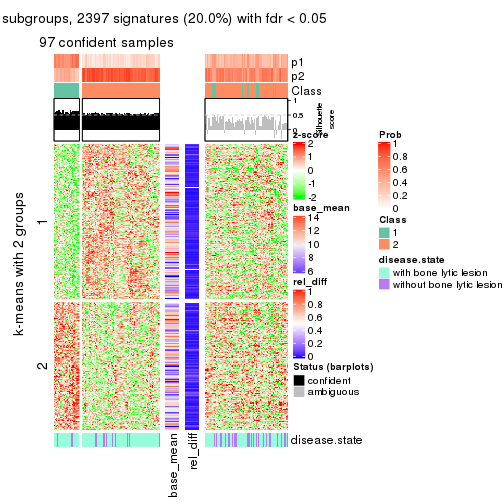</p>

</div>
<div id='tab-MAD-hclust-get-signatures-2'>
<pre><code class="r">get_signatures(res, k = 3)
</code></pre>

<p></p>

</div>
<div id='tab-MAD-hclust-get-signatures-3'>
<pre><code class="r">get_signatures(res, k = 4)
</code></pre>

<p></p>

</div>
<div id='tab-MAD-hclust-get-signatures-4'>
<pre><code class="r">get_signatures(res, k = 5)
</code></pre>

<p></p>

</div>
<div id='tab-MAD-hclust-get-signatures-5'>
<pre><code class="r">get_signatures(res, k = 6)
</code></pre>

<p></p>

</div>
</div>


Signature heatmaps where rows are not scaled:


<script>
$( function() {
	$( '#tabs-MAD-hclust-get-signatures-no-scale' ).tabs();
} );
</script>
<div id='tabs-MAD-hclust-get-signatures-no-scale'>
<ul>
<li><a href='#tab-MAD-hclust-get-signatures-no-scale-1'>k = 2</a></li>
<li><a href='#tab-MAD-hclust-get-signatures-no-scale-2'>k = 3</a></li>
<li><a href='#tab-MAD-hclust-get-signatures-no-scale-3'>k = 4</a></li>
<li><a href='#tab-MAD-hclust-get-signatures-no-scale-4'>k = 5</a></li>
<li><a href='#tab-MAD-hclust-get-signatures-no-scale-5'>k = 6</a></li>
</ul>
<div id='tab-MAD-hclust-get-signatures-no-scale-1'>
<pre><code class="r">get_signatures(res, k = 2, scale_rows = FALSE)
</code></pre>

<p></p>

</div>
<div id='tab-MAD-hclust-get-signatures-no-scale-2'>
<pre><code class="r">get_signatures(res, k = 3, scale_rows = FALSE)
</code></pre>

<p></p>

</div>
<div id='tab-MAD-hclust-get-signatures-no-scale-3'>
<pre><code class="r">get_signatures(res, k = 4, scale_rows = FALSE)
</code></pre>

<p></p>

</div>
<div id='tab-MAD-hclust-get-signatures-no-scale-4'>
<pre><code class="r">get_signatures(res, k = 5, scale_rows = FALSE)
</code></pre>

<p></p>

</div>
<div id='tab-MAD-hclust-get-signatures-no-scale-5'>
<pre><code class="r">get_signatures(res, k = 6, scale_rows = FALSE)
</code></pre>

<p></p>

</div>
</div>


Compare the overlap of signatures from different k:

```r
compare_signatures(res)
```


`get_signature()` returns a data frame invisibly. TO get the list of signatures, the function
call should be assigned to a variable explicitly. In following code, if `plot` argument is set
to `FALSE`, no heatmap is plotted while only the differential analysis is performed.

```r
# code only for demonstration
tb = get_signature(res, k = ..., plot = FALSE)
```

An example of the output of `tb` is:

```
#>   which_row         fdr    mean_1    mean_2 scaled_mean_1 scaled_mean_2 km
#> 1        38 0.042760348  8.373488  9.131774    -0.5533452     0.5164555  1
#> 2        40 0.018707592  7.106213  8.469186    -0.6173731     0.5762149  1
#> 3        55 0.019134737 10.221463 11.207825    -0.6159697     0.5749050  1
#> 4        59 0.006059896  5.921854  7.869574    -0.6899429     0.6439467  1
#> 5        60 0.018055526  8.928898 10.211722    -0.6204761     0.5791110  1
#> 6        98 0.009384629 15.714769 14.887706     0.6635654    -0.6193277  2
...
```

The columns in `tb` are:

1. `which_row`: row indices corresponding to the input matrix.
2. `fdr`: FDR for the differential test. 
3. `mean_x`: The mean value in group x.
4. `scaled_mean_x`: The mean value in group x after rows are scaled.
5. `km`: Row groups if k-means clustering is applied to rows.


UMAP plot which shows how samples are separated.


<script>
$( function() {
	$( '#tabs-MAD-hclust-dimension-reduction' ).tabs();
} );
</script>
<div id='tabs-MAD-hclust-dimension-reduction'>
<ul>
<li><a href='#tab-MAD-hclust-dimension-reduction-1'>k = 2</a></li>
<li><a href='#tab-MAD-hclust-dimension-reduction-2'>k = 3</a></li>
<li><a href='#tab-MAD-hclust-dimension-reduction-3'>k = 4</a></li>
<li><a href='#tab-MAD-hclust-dimension-reduction-4'>k = 5</a></li>
<li><a href='#tab-MAD-hclust-dimension-reduction-5'>k = 6</a></li>
</ul>
<div id='tab-MAD-hclust-dimension-reduction-1'>
<pre><code class="r">dimension_reduction(res, k = 2, method = &quot;UMAP&quot;)
</code></pre>

<p></p>

</div>
<div id='tab-MAD-hclust-dimension-reduction-2'>
<pre><code class="r">dimension_reduction(res, k = 3, method = &quot;UMAP&quot;)
</code></pre>

<p></p>

</div>
<div id='tab-MAD-hclust-dimension-reduction-3'>
<pre><code class="r">dimension_reduction(res, k = 4, method = &quot;UMAP&quot;)
</code></pre>

<p></p>

</div>
<div id='tab-MAD-hclust-dimension-reduction-4'>
<pre><code class="r">dimension_reduction(res, k = 5, method = &quot;UMAP&quot;)
</code></pre>

<p></p>

</div>
<div id='tab-MAD-hclust-dimension-reduction-5'>
<pre><code class="r">dimension_reduction(res, k = 6, method = &quot;UMAP&quot;)
</code></pre>

<p></p>

</div>
</div>


Following heatmap shows how subgroups are split when increasing `k`:

```r
collect_classes(res)
```


Test correlation between subgroups and known annotations. If the known
annotation is numeric, one-way ANOVA test is applied, and if the known
annotation is discrete, chi-squared contingency table test is applied.

```r
test_to_known_factors(res)
```

```
#>             n disease.state(p) k
#> MAD:hclust 97            1.000 2
#> MAD:hclust  0               NA 3
#> MAD:hclust 21            0.378 4
#> MAD:hclust 34            1.000 5
#> MAD:hclust  1               NA 6
```


If matrix rows can be associated to genes, consider to use `GO_Enrichment(res,
...)` to perform function enrichment for the signature genes.


 

---------------------------------------------------


### MAD:kmeans


The object with results only for a single top-value method and a single partition method 
can be extracted as:

```r
res = res_list["MAD", "kmeans"]
# you can also extract it by
# res = res_list["MAD:kmeans"]
```

A summary of `res` and all the functions that can be applied to it:

```r
res
```

```
#> A 'ConsensusPartition' object with k = 2, 3, 4, 5, 6.
#>   On a matrix with 11993 rows and 173 columns.
#>   Top rows (1000, 2000, 3000, 4000, 5000) are extracted by 'MAD' method.
#>   Subgroups are detected by 'kmeans' method.
#>   Performed in total 1250 partitions by row resampling.
#>   Best k for subgroups seems to be 3.
#> 
#> Following methods can be applied to this 'ConsensusPartition' object:
#>  [1] "cola_report"             "collect_classes"         "collect_plots"          
#>  [4] "collect_stats"           "colnames"                "compare_signatures"     
#>  [7] "consensus_heatmap"       "dimension_reduction"     "functional_enrichment"  
#> [10] "get_anno_col"            "get_anno"                "get_classes"            
#> [13] "get_consensus"           "get_matrix"              "get_membership"         
#> [16] "get_param"               "get_signatures"          "get_stats"              
#> [19] "is_best_k"               "is_stable_k"             "membership_heatmap"     
#> [22] "ncol"                    "nrow"                    "plot_ecdf"              
#> [25] "rownames"                "select_partition_number" "show"                   
#> [28] "suggest_best_k"          "test_to_known_factors"
```

`collect_plots()` function collects all the plots made from `res` for all `k` (number of partitions)
into one single page to provide an easy and fast comparison between different `k`.

```r
collect_plots(res)
```


The plots are:

- The first row: a plot of the ECDF (Empirical cumulative distribution
  function) curves of the consensus matrix for each `k` and the heatmap of
  predicted classes for each `k`.
- The second row: heatmaps of the consensus matrix for each `k`.
- The third row: heatmaps of the membership matrix for each `k`.
- The fouth row: heatmaps of the signatures for each `k`.

All the plots in panels can be made by individual functions and they are
plotted later in this section.

`select_partition_number()` produces several plots showing different
statistics for choosing "optimized" `k`. There are following statistics:

- ECDF curves of the consensus matrix for each `k`;
- 1-PAC. [The PAC
  score](https://en.wikipedia.org/wiki/Consensus_clustering#Over-interpretation_potential_of_consensus_clustering)
  measures the proportion of the ambiguous subgrouping.
- Mean silhouette score.
- Concordance. The mean probability of fiting the consensus class ids in all
  partitions.
- Area increased. Denote $A_k$ as the area under the ECDF curve for current
  `k`, the area increased is defined as $A_k - A_{k-1}$.
- Rand index. The percent of pairs of samples that are both in a same cluster
  or both are not in a same cluster in the partition of k and k-1.
- Jaccard index. The ratio of pairs of samples are both in a same cluster in
  the partition of k and k-1 and the pairs of samples are both in a same
  cluster in the partition k or k-1.

The detailed explanations of these statistics can be found in [the cola
vignette](http://bioconductor.org/packages/devel/bioc/vignettes/cola/inst/doc/cola.html#toc_13).

Generally speaking, lower PAC score, higher mean silhouette score or higher
concordance corresponds to better partition. Rand index and Jaccard index
measure how similar the current partition is compared to partition with `k-1`.
If they are too similar, we won't accept `k` is better than `k-1`.

```r
select_partition_number(res)
```


The numeric values for all these statistics can be obtained by `get_stats()`.

```r
get_stats(res)
```

```
#>   k 1-PAC mean_silhouette concordance area_increased  Rand Jaccard
#> 2 2 0.206           0.621       0.799         0.4950 0.499   0.499
#> 3 3 0.577           0.676       0.836         0.3457 0.712   0.484
#> 4 4 0.525           0.548       0.737         0.1192 0.843   0.575
#> 5 5 0.559           0.565       0.707         0.0623 0.906   0.664
#> 6 6 0.611           0.472       0.647         0.0403 0.925   0.682
```

`suggest_best_k()` suggests the best $k$ based on these statistics. The rules are as follows:

- All $k$ with Jaccard index larger than 0.95 are removed because the increase of
  the partition number does not provides enough extra information. If all $k$ are removed,
  the best $k$ is assigned by `NA`.
- For $k$ with 1-PAC larger than 0.9, the maximal $k$ is taken as the "best k". Other $k$ is called "optional k".
- If it does not fit the second rule. The $k$ with the highest vote of highest
  1-PAC, mean silhouette and concordance is taken as the "best k".

```r
suggest_best_k(res)
```

```
#> [1] 3
```


Following shows the table of the partitions (You need to click the **show/hide
code output** link to see it). The membership matrix (columns with name `p*`)
is inferred by
[`clue::cl_consensus()`](https://www.rdocumentation.org/link/cl_consensus?package=clue)
function with the `SE` method. Basically the value in the membership matrix
represents the probability to belong to a certain group. The finall class
label for an item is determined with the group with highest probability it
belongs to.

In `get_classes()` function, the entropy is calculated from the membership
matrix and the silhouette score is calculated from the consensus matrix.


<script>
$( function() {
	$( '#tabs-MAD-kmeans-get-classes' ).tabs();
} );
</script>
<div id='tabs-MAD-kmeans-get-classes'>
<ul>
<li><a href='#tab-MAD-kmeans-get-classes-1'>k = 2</a></li>
<li><a href='#tab-MAD-kmeans-get-classes-2'>k = 3</a></li>
<li><a href='#tab-MAD-kmeans-get-classes-3'>k = 4</a></li>
<li><a href='#tab-MAD-kmeans-get-classes-4'>k = 5</a></li>
<li><a href='#tab-MAD-kmeans-get-classes-5'>k = 6</a></li>
</ul>

<div id='tab-MAD-kmeans-get-classes-1'>
<p><a id='tab-MAD-kmeans-get-classes-1-a' style='color:#0366d6' href='#'>show/hide code output</a></p>
<pre><code class="r">cbind(get_classes(res, k = 2), get_membership(res, k = 2))
</code></pre>

<pre><code>#&gt;          class entropy silhouette    p1    p2
#&gt; GSM11437     1  0.9580     0.5307 0.620 0.380
#&gt; GSM11438     2  0.4431     0.7534 0.092 0.908
#&gt; GSM11439     2  0.9944     0.0769 0.456 0.544
#&gt; GSM11440     1  0.6247     0.6763 0.844 0.156
#&gt; GSM11441     1  0.4939     0.6941 0.892 0.108
#&gt; GSM11442     2  0.9552     0.4039 0.376 0.624
#&gt; GSM11443     2  0.1843     0.7810 0.028 0.972
#&gt; GSM11444     1  0.8713     0.5205 0.708 0.292
#&gt; GSM11445     1  0.9460     0.3785 0.636 0.364
#&gt; GSM11446     1  0.8813     0.4986 0.700 0.300
#&gt; GSM11447     2  0.9977     0.1317 0.472 0.528
#&gt; GSM11448     2  0.8608     0.4924 0.284 0.716
#&gt; GSM11449     1  0.7219     0.6955 0.800 0.200
#&gt; GSM11450     1  0.7219     0.6932 0.800 0.200
#&gt; GSM11451     2  0.2043     0.7836 0.032 0.968
#&gt; GSM11452     2  0.9044     0.4135 0.320 0.680
#&gt; GSM11453     1  0.8327     0.6495 0.736 0.264
#&gt; GSM11454     1  0.8499     0.5362 0.724 0.276
#&gt; GSM11455     2  0.6438     0.6951 0.164 0.836
#&gt; GSM11456     2  0.1843     0.7831 0.028 0.972
#&gt; GSM11457     2  0.1184     0.7867 0.016 0.984
#&gt; GSM11458     1  0.4161     0.7033 0.916 0.084
#&gt; GSM11459     1  0.6343     0.6630 0.840 0.160
#&gt; GSM11460     1  0.1414     0.7166 0.980 0.020
#&gt; GSM11461     1  0.8327     0.6946 0.736 0.264
#&gt; GSM11462     1  0.0672     0.7165 0.992 0.008
#&gt; GSM11463     2  0.2043     0.7867 0.032 0.968
#&gt; GSM11464     1  0.2948     0.7193 0.948 0.052
#&gt; GSM11465     2  0.8207     0.5209 0.256 0.744
#&gt; GSM11466     1  0.5059     0.7089 0.888 0.112
#&gt; GSM11467     1  0.6438     0.7087 0.836 0.164
#&gt; GSM11468     1  0.6712     0.6494 0.824 0.176
#&gt; GSM11469     1  0.3879     0.7091 0.924 0.076
#&gt; GSM11470     1  0.7453     0.6852 0.788 0.212
#&gt; GSM11471     1  0.7139     0.6972 0.804 0.196
#&gt; GSM11472     1  0.4161     0.7239 0.916 0.084
#&gt; GSM11473     2  0.3733     0.7673 0.072 0.928
#&gt; GSM11474     2  0.1633     0.7819 0.024 0.976
#&gt; GSM11475     1  0.9522     0.3595 0.628 0.372
#&gt; GSM11476     2  0.7602     0.6368 0.220 0.780
#&gt; GSM11477     2  0.2043     0.7836 0.032 0.968
#&gt; GSM11478     2  0.1414     0.7826 0.020 0.980
#&gt; GSM11479     2  0.6247     0.7052 0.156 0.844
#&gt; GSM11480     2  0.2236     0.7865 0.036 0.964
#&gt; GSM11481     1  0.3879     0.7183 0.924 0.076
#&gt; GSM11482     2  0.7883     0.6220 0.236 0.764
#&gt; GSM11483     2  0.6148     0.7059 0.152 0.848
#&gt; GSM11484     1  0.9795     0.2879 0.584 0.416
#&gt; GSM11485     2  0.7453     0.6446 0.212 0.788
#&gt; GSM11486     2  0.4562     0.7509 0.096 0.904
#&gt; GSM11487     1  0.7745     0.6796 0.772 0.228
#&gt; GSM11488     1  0.9881     0.2309 0.564 0.436
#&gt; GSM11489     2  0.3584     0.7696 0.068 0.932
#&gt; GSM11490     1  0.9977     0.1364 0.528 0.472
#&gt; GSM11491     1  0.8327     0.6495 0.736 0.264
#&gt; GSM11492     1  0.9286     0.4267 0.656 0.344
#&gt; GSM11493     2  0.9552     0.3875 0.376 0.624
#&gt; GSM11494     1  0.9993     0.0148 0.516 0.484
#&gt; GSM11495     2  0.7883     0.6248 0.236 0.764
#&gt; GSM11496     2  0.6438     0.7063 0.164 0.836
#&gt; GSM11497     2  0.3584     0.7684 0.068 0.932
#&gt; GSM11498     2  0.2043     0.7836 0.032 0.968
#&gt; GSM11499     2  0.7299     0.6537 0.204 0.796
#&gt; GSM11500     2  0.7602     0.6431 0.220 0.780
#&gt; GSM11501     2  0.7453     0.6446 0.212 0.788
#&gt; GSM11502     2  0.2043     0.7836 0.032 0.968
#&gt; GSM11503     2  0.2043     0.7870 0.032 0.968
#&gt; GSM11504     1  0.6531     0.6549 0.832 0.168
#&gt; GSM11505     2  0.0938     0.7845 0.012 0.988
#&gt; GSM11506     2  0.2043     0.7802 0.032 0.968
#&gt; GSM11507     2  0.1633     0.7872 0.024 0.976
#&gt; GSM11508     1  0.8555     0.5303 0.720 0.280
#&gt; GSM11509     1  0.9922     0.1578 0.552 0.448
#&gt; GSM11510     2  0.2778     0.7773 0.048 0.952
#&gt; GSM11511     1  0.8713     0.6250 0.708 0.292
#&gt; GSM11512     1  0.9323     0.4329 0.652 0.348
#&gt; GSM11513     1  0.7745     0.5978 0.772 0.228
#&gt; GSM11514     2  1.0000    -0.1988 0.496 0.504
#&gt; GSM11515     2  0.9866     0.2581 0.432 0.568
#&gt; GSM11516     2  0.9460     0.3124 0.364 0.636
#&gt; GSM11517     1  0.3114     0.7068 0.944 0.056
#&gt; GSM11518     1  0.9754     0.4609 0.592 0.408
#&gt; GSM11519     1  0.8327     0.6495 0.736 0.264
#&gt; GSM11520     1  0.7219     0.6949 0.800 0.200
#&gt; GSM11521     2  0.7528     0.6407 0.216 0.784
#&gt; GSM11522     1  0.6801     0.7039 0.820 0.180
#&gt; GSM11523     1  0.7139     0.6939 0.804 0.196
#&gt; GSM11524     1  0.3879     0.7073 0.924 0.076
#&gt; GSM11525     2  0.0938     0.7835 0.012 0.988
#&gt; GSM11526     1  0.9129     0.4496 0.672 0.328
#&gt; GSM11527     2  0.4815     0.7458 0.104 0.896
#&gt; GSM11528     2  0.2236     0.7848 0.036 0.964
#&gt; GSM11529     2  0.5059     0.7253 0.112 0.888
#&gt; GSM11530     1  0.5519     0.6926 0.872 0.128
#&gt; GSM11531     2  0.2423     0.7841 0.040 0.960
#&gt; GSM11532     1  0.5408     0.6924 0.876 0.124
#&gt; GSM11533     2  0.5408     0.7096 0.124 0.876
#&gt; GSM11534     2  0.9815     0.1574 0.420 0.580
#&gt; GSM11535     2  0.2778     0.7809 0.048 0.952
#&gt; GSM11536     2  0.9732     0.3491 0.404 0.596
#&gt; GSM11537     2  0.2423     0.7795 0.040 0.960
#&gt; GSM11538     1  0.8499     0.6243 0.724 0.276
#&gt; GSM11539     2  0.2423     0.7841 0.040 0.960
#&gt; GSM11540     2  0.1633     0.7872 0.024 0.976
#&gt; GSM11541     1  0.1633     0.7171 0.976 0.024
#&gt; GSM11542     2  0.2043     0.7836 0.032 0.968
#&gt; GSM11543     2  0.9608     0.2293 0.384 0.616
#&gt; GSM11544     1  0.8207     0.6559 0.744 0.256
#&gt; GSM11545     1  0.8713     0.6359 0.708 0.292
#&gt; GSM11546     2  0.4161     0.7668 0.084 0.916
#&gt; GSM11547     2  0.4022     0.7667 0.080 0.920
#&gt; GSM11548     1  0.9552     0.3511 0.624 0.376
#&gt; GSM11549     1  0.6343     0.7114 0.840 0.160
#&gt; GSM11550     1  0.6343     0.7111 0.840 0.160
#&gt; GSM11551     1  0.7376     0.6990 0.792 0.208
#&gt; GSM11552     1  0.4161     0.7038 0.916 0.084
#&gt; GSM11553     2  0.4022     0.7550 0.080 0.920
#&gt; GSM11554     2  0.1843     0.7848 0.028 0.972
#&gt; GSM11555     1  0.4431     0.7232 0.908 0.092
#&gt; GSM11556     1  0.1184     0.7164 0.984 0.016
#&gt; GSM11557     2  0.2423     0.7841 0.040 0.960
#&gt; GSM11558     2  0.2236     0.7865 0.036 0.964
#&gt; GSM11559     2  0.4298     0.7497 0.088 0.912
#&gt; GSM11560     1  0.6623     0.7059 0.828 0.172
#&gt; GSM11561     2  0.2043     0.7870 0.032 0.968
#&gt; GSM11562     2  0.2043     0.7836 0.032 0.968
#&gt; GSM11563     1  0.8267     0.6537 0.740 0.260
#&gt; GSM11564     1  0.8661     0.6574 0.712 0.288
#&gt; GSM11565     1  0.8207     0.6559 0.744 0.256
#&gt; GSM11566     2  0.2236     0.7865 0.036 0.964
#&gt; GSM11567     1  0.9393     0.4216 0.644 0.356
#&gt; GSM11568     2  0.9896     0.0882 0.440 0.560
#&gt; GSM11569     2  0.2043     0.7836 0.032 0.968
#&gt; GSM11570     1  0.4161     0.7065 0.916 0.084
#&gt; GSM11571     1  0.9833     0.3431 0.576 0.424
#&gt; GSM11572     2  0.7883     0.5735 0.236 0.764
#&gt; GSM11573     1  0.8813     0.6086 0.700 0.300
#&gt; GSM11574     2  0.5519     0.7123 0.128 0.872
#&gt; GSM11575     1  0.9970     0.2305 0.532 0.468
#&gt; GSM11576     1  0.7453     0.6831 0.788 0.212
#&gt; GSM11577     2  0.9866     0.1159 0.432 0.568
#&gt; GSM11578     2  0.9522     0.2927 0.372 0.628
#&gt; GSM11579     2  0.7528     0.6407 0.216 0.784
#&gt; GSM11580     2  0.9323     0.3510 0.348 0.652
#&gt; GSM11581     1  0.7056     0.6438 0.808 0.192
#&gt; GSM11582     1  0.1633     0.7177 0.976 0.024
#&gt; GSM11583     1  0.6247     0.6672 0.844 0.156
#&gt; GSM11584     1  0.8909     0.5008 0.692 0.308
#&gt; GSM11585     2  0.2043     0.7836 0.032 0.968
#&gt; GSM11586     1  0.7602     0.6839 0.780 0.220
#&gt; GSM11587     1  0.7139     0.6939 0.804 0.196
#&gt; GSM11588     1  0.8713     0.6179 0.708 0.292
#&gt; GSM11589     1  0.9775     0.3706 0.588 0.412
#&gt; GSM11590     1  0.7950     0.6696 0.760 0.240
#&gt; GSM11591     2  0.5408     0.7160 0.124 0.876
#&gt; GSM11592     1  0.5178     0.7184 0.884 0.116
#&gt; GSM11593     1  0.8016     0.6665 0.756 0.244
#&gt; GSM11594     1  0.6712     0.7065 0.824 0.176
#&gt; GSM11595     1  0.9580     0.5003 0.620 0.380
#&gt; GSM11596     2  0.6247     0.6950 0.156 0.844
#&gt; GSM11597     1  0.5946     0.6985 0.856 0.144
#&gt; GSM11598     1  0.8144     0.6591 0.748 0.252
#&gt; GSM11599     1  0.5737     0.6826 0.864 0.136
#&gt; GSM11600     1  0.2948     0.7190 0.948 0.052
#&gt; GSM11601     2  0.3879     0.7656 0.076 0.924
#&gt; GSM11602     1  0.6801     0.7020 0.820 0.180
#&gt; GSM11603     1  0.7139     0.6939 0.804 0.196
#&gt; GSM11604     1  0.1633     0.7157 0.976 0.024
#&gt; GSM11605     1  0.1633     0.7173 0.976 0.024
#&gt; GSM11606     2  0.5842     0.6996 0.140 0.860
#&gt; GSM11607     1  0.8207     0.6559 0.744 0.256
#&gt; GSM11608     1  0.0938     0.7167 0.988 0.012
#&gt; GSM11609     2  0.9963     0.2325 0.464 0.536
</code></pre>

<script>
$('#tab-MAD-kmeans-get-classes-1-a').parent().next().next().hide();
$('#tab-MAD-kmeans-get-classes-1-a').click(function(){
  $('#tab-MAD-kmeans-get-classes-1-a').parent().next().next().toggle();
  return(false);
});
</script>
</div>

<div id='tab-MAD-kmeans-get-classes-2'>
<p><a id='tab-MAD-kmeans-get-classes-2-a' style='color:#0366d6' href='#'>show/hide code output</a></p>
<pre><code class="r">cbind(get_classes(res, k = 3), get_membership(res, k = 3))
</code></pre>

<pre><code>#&gt;          class entropy silhouette    p1    p2    p3
#&gt; GSM11437     1  0.7993    -0.0673 0.484 0.060 0.456
#&gt; GSM11438     2  0.4796     0.7058 0.000 0.780 0.220
#&gt; GSM11439     3  0.5603     0.7304 0.060 0.136 0.804
#&gt; GSM11440     3  0.3910     0.7868 0.104 0.020 0.876
#&gt; GSM11441     3  0.3784     0.7740 0.132 0.004 0.864
#&gt; GSM11442     3  0.1399     0.8004 0.004 0.028 0.968
#&gt; GSM11443     2  0.2116     0.8674 0.012 0.948 0.040
#&gt; GSM11444     3  0.2703     0.7985 0.056 0.016 0.928
#&gt; GSM11445     3  0.1999     0.8033 0.036 0.012 0.952
#&gt; GSM11446     3  0.2845     0.7979 0.068 0.012 0.920
#&gt; GSM11447     3  0.3148     0.7952 0.036 0.048 0.916
#&gt; GSM11448     2  0.7187    -0.0469 0.480 0.496 0.024
#&gt; GSM11449     1  0.2846     0.7825 0.924 0.020 0.056
#&gt; GSM11450     1  0.1585     0.7881 0.964 0.008 0.028
#&gt; GSM11451     2  0.1337     0.8711 0.016 0.972 0.012
#&gt; GSM11452     2  0.6314     0.2664 0.392 0.604 0.004
#&gt; GSM11453     1  0.1878     0.7906 0.952 0.044 0.004
#&gt; GSM11454     3  0.2866     0.7987 0.076 0.008 0.916
#&gt; GSM11455     2  0.6308     0.0897 0.000 0.508 0.492
#&gt; GSM11456     2  0.2845     0.8577 0.012 0.920 0.068
#&gt; GSM11457     2  0.0829     0.8727 0.012 0.984 0.004
#&gt; GSM11458     3  0.5982     0.5466 0.328 0.004 0.668
#&gt; GSM11459     3  0.2860     0.7963 0.084 0.004 0.912
#&gt; GSM11460     1  0.5902     0.4487 0.680 0.004 0.316
#&gt; GSM11461     1  0.7661    -0.0189 0.504 0.044 0.452
#&gt; GSM11462     3  0.6309     0.0621 0.496 0.000 0.504
#&gt; GSM11463     2  0.1905     0.8703 0.016 0.956 0.028
#&gt; GSM11464     1  0.2165     0.7710 0.936 0.000 0.064
#&gt; GSM11465     2  0.6621     0.6895 0.148 0.752 0.100
#&gt; GSM11466     3  0.3377     0.7960 0.092 0.012 0.896
#&gt; GSM11467     1  0.1525     0.7865 0.964 0.004 0.032
#&gt; GSM11468     3  0.2590     0.7987 0.072 0.004 0.924
#&gt; GSM11469     3  0.5363     0.6054 0.276 0.000 0.724
#&gt; GSM11470     1  0.0983     0.7884 0.980 0.004 0.016
#&gt; GSM11471     1  0.2492     0.7850 0.936 0.016 0.048
#&gt; GSM11472     1  0.6678    -0.0199 0.512 0.008 0.480
#&gt; GSM11473     2  0.4335     0.8213 0.036 0.864 0.100
#&gt; GSM11474     2  0.1399     0.8715 0.004 0.968 0.028
#&gt; GSM11475     3  0.3207     0.8001 0.084 0.012 0.904
#&gt; GSM11476     3  0.5618     0.5949 0.008 0.260 0.732
#&gt; GSM11477     2  0.0747     0.8715 0.016 0.984 0.000
#&gt; GSM11478     2  0.1289     0.8675 0.000 0.968 0.032
#&gt; GSM11479     2  0.6255     0.5488 0.012 0.668 0.320
#&gt; GSM11480     2  0.1399     0.8678 0.004 0.968 0.028
#&gt; GSM11481     3  0.7372     0.1474 0.448 0.032 0.520
#&gt; GSM11482     3  0.5578     0.6384 0.012 0.240 0.748
#&gt; GSM11483     2  0.6205     0.5218 0.008 0.656 0.336
#&gt; GSM11484     3  0.3310     0.7887 0.028 0.064 0.908
#&gt; GSM11485     2  0.6513     0.3722 0.008 0.592 0.400
#&gt; GSM11486     2  0.3031     0.8520 0.012 0.912 0.076
#&gt; GSM11487     1  0.1950     0.7916 0.952 0.040 0.008
#&gt; GSM11488     3  0.3213     0.7900 0.028 0.060 0.912
#&gt; GSM11489     2  0.2774     0.8492 0.008 0.920 0.072
#&gt; GSM11490     3  0.4179     0.7820 0.072 0.052 0.876
#&gt; GSM11491     1  0.1878     0.7906 0.952 0.044 0.004
#&gt; GSM11492     3  0.3267     0.7971 0.044 0.044 0.912
#&gt; GSM11493     3  0.3832     0.7727 0.020 0.100 0.880
#&gt; GSM11494     3  0.2599     0.7953 0.016 0.052 0.932
#&gt; GSM11495     3  0.5817     0.6308 0.020 0.236 0.744
#&gt; GSM11496     3  0.7491    -0.0791 0.036 0.472 0.492
#&gt; GSM11497     2  0.1781     0.8706 0.020 0.960 0.020
#&gt; GSM11498     2  0.1182     0.8714 0.012 0.976 0.012
#&gt; GSM11499     2  0.6527     0.3613 0.008 0.588 0.404
#&gt; GSM11500     2  0.6869     0.3123 0.016 0.560 0.424
#&gt; GSM11501     2  0.6682     0.0863 0.008 0.504 0.488
#&gt; GSM11502     2  0.1170     0.8722 0.016 0.976 0.008
#&gt; GSM11503     2  0.1170     0.8726 0.008 0.976 0.016
#&gt; GSM11504     3  0.2443     0.7970 0.032 0.028 0.940
#&gt; GSM11505     2  0.1585     0.8706 0.008 0.964 0.028
#&gt; GSM11506     2  0.2063     0.8645 0.008 0.948 0.044
#&gt; GSM11507     2  0.1399     0.8678 0.004 0.968 0.028
#&gt; GSM11508     3  0.1399     0.8033 0.028 0.004 0.968
#&gt; GSM11509     3  0.3028     0.7979 0.048 0.032 0.920
#&gt; GSM11510     2  0.3459     0.8339 0.012 0.892 0.096
#&gt; GSM11511     1  0.2773     0.7750 0.928 0.024 0.048
#&gt; GSM11512     3  0.3009     0.7918 0.028 0.052 0.920
#&gt; GSM11513     3  0.2590     0.7980 0.072 0.004 0.924
#&gt; GSM11514     3  0.8746     0.5445 0.184 0.228 0.588
#&gt; GSM11515     3  0.1585     0.8013 0.008 0.028 0.964
#&gt; GSM11516     1  0.6587     0.2877 0.568 0.424 0.008
#&gt; GSM11517     3  0.2772     0.7960 0.080 0.004 0.916
#&gt; GSM11518     3  0.7770     0.5323 0.272 0.088 0.640
#&gt; GSM11519     1  0.1878     0.7906 0.952 0.044 0.004
#&gt; GSM11520     1  0.1015     0.7899 0.980 0.012 0.008
#&gt; GSM11521     3  0.5896     0.5487 0.008 0.292 0.700
#&gt; GSM11522     1  0.3293     0.7619 0.900 0.012 0.088
#&gt; GSM11523     1  0.1031     0.7850 0.976 0.000 0.024
#&gt; GSM11524     3  0.2998     0.7996 0.068 0.016 0.916
#&gt; GSM11525     2  0.2050     0.8708 0.020 0.952 0.028
#&gt; GSM11526     3  0.2313     0.8047 0.032 0.024 0.944
#&gt; GSM11527     2  0.2486     0.8578 0.008 0.932 0.060
#&gt; GSM11528     2  0.1620     0.8710 0.012 0.964 0.024
#&gt; GSM11529     2  0.4139     0.7937 0.124 0.860 0.016
#&gt; GSM11530     3  0.5831     0.5921 0.284 0.008 0.708
#&gt; GSM11531     2  0.1781     0.8701 0.020 0.960 0.020
#&gt; GSM11532     3  0.5928     0.5756 0.296 0.008 0.696
#&gt; GSM11533     2  0.3769     0.8054 0.104 0.880 0.016
#&gt; GSM11534     1  0.5677     0.7150 0.804 0.124 0.072
#&gt; GSM11535     2  0.1636     0.8706 0.016 0.964 0.020
#&gt; GSM11536     3  0.6895     0.6526 0.072 0.212 0.716
#&gt; GSM11537     2  0.1337     0.8711 0.016 0.972 0.012
#&gt; GSM11538     1  0.8362     0.1975 0.528 0.088 0.384
#&gt; GSM11539     2  0.1491     0.8723 0.016 0.968 0.016
#&gt; GSM11540     2  0.1182     0.8726 0.012 0.976 0.012
#&gt; GSM11541     1  0.6313     0.4607 0.676 0.016 0.308
#&gt; GSM11542     2  0.1781     0.8701 0.020 0.960 0.020
#&gt; GSM11543     1  0.9659     0.0760 0.440 0.220 0.340
#&gt; GSM11544     1  0.1765     0.7921 0.956 0.040 0.004
#&gt; GSM11545     1  0.1989     0.7905 0.948 0.048 0.004
#&gt; GSM11546     2  0.3369     0.8495 0.040 0.908 0.052
#&gt; GSM11547     2  0.3572     0.8462 0.040 0.900 0.060
#&gt; GSM11548     3  0.3083     0.7991 0.060 0.024 0.916
#&gt; GSM11549     1  0.1647     0.7831 0.960 0.004 0.036
#&gt; GSM11550     1  0.1647     0.7857 0.960 0.004 0.036
#&gt; GSM11551     3  0.6859     0.2562 0.420 0.016 0.564
#&gt; GSM11552     3  0.5706     0.5343 0.320 0.000 0.680
#&gt; GSM11553     2  0.1482     0.8706 0.020 0.968 0.012
#&gt; GSM11554     2  0.1491     0.8711 0.016 0.968 0.016
#&gt; GSM11555     1  0.7581     0.1817 0.548 0.044 0.408
#&gt; GSM11556     1  0.6330     0.2287 0.600 0.004 0.396
#&gt; GSM11557     2  0.1781     0.8701 0.020 0.960 0.020
#&gt; GSM11558     2  0.1399     0.8678 0.004 0.968 0.028
#&gt; GSM11559     2  0.1315     0.8697 0.020 0.972 0.008
#&gt; GSM11560     1  0.1031     0.7837 0.976 0.000 0.024
#&gt; GSM11561     2  0.1399     0.8678 0.004 0.968 0.028
#&gt; GSM11562     2  0.1337     0.8711 0.016 0.972 0.012
#&gt; GSM11563     1  0.2599     0.7880 0.932 0.052 0.016
#&gt; GSM11564     1  0.2599     0.7878 0.932 0.052 0.016
#&gt; GSM11565     1  0.2383     0.7901 0.940 0.044 0.016
#&gt; GSM11566     2  0.1525     0.8668 0.004 0.964 0.032
#&gt; GSM11567     3  0.5944     0.7374 0.088 0.120 0.792
#&gt; GSM11568     1  0.6566     0.3949 0.612 0.376 0.012
#&gt; GSM11569     2  0.1491     0.8711 0.016 0.968 0.016
#&gt; GSM11570     3  0.6104     0.4846 0.348 0.004 0.648
#&gt; GSM11571     1  0.3454     0.7643 0.888 0.104 0.008
#&gt; GSM11572     2  0.5894     0.6459 0.220 0.752 0.028
#&gt; GSM11573     1  0.2550     0.7850 0.932 0.056 0.012
#&gt; GSM11574     2  0.2173     0.8572 0.048 0.944 0.008
#&gt; GSM11575     1  0.6794     0.4665 0.648 0.324 0.028
#&gt; GSM11576     1  0.0892     0.7850 0.980 0.000 0.020
#&gt; GSM11577     1  0.5882     0.4701 0.652 0.348 0.000
#&gt; GSM11578     1  0.6608     0.2642 0.560 0.432 0.008
#&gt; GSM11579     2  0.6307     0.1168 0.000 0.512 0.488
#&gt; GSM11580     1  0.6309     0.0713 0.500 0.500 0.000
#&gt; GSM11581     3  0.2446     0.8010 0.052 0.012 0.936
#&gt; GSM11582     1  0.6669     0.0320 0.524 0.008 0.468
#&gt; GSM11583     3  0.6033     0.5194 0.336 0.004 0.660
#&gt; GSM11584     3  0.2569     0.7970 0.032 0.032 0.936
#&gt; GSM11585     2  0.1491     0.8700 0.016 0.968 0.016
#&gt; GSM11586     1  0.1781     0.7898 0.960 0.020 0.020
#&gt; GSM11587     1  0.1031     0.7850 0.976 0.000 0.024
#&gt; GSM11588     1  0.2280     0.7876 0.940 0.052 0.008
#&gt; GSM11589     1  0.4280     0.7526 0.856 0.124 0.020
#&gt; GSM11590     1  0.1647     0.7918 0.960 0.036 0.004
#&gt; GSM11591     2  0.1832     0.8632 0.036 0.956 0.008
#&gt; GSM11592     1  0.1765     0.7866 0.956 0.004 0.040
#&gt; GSM11593     1  0.1647     0.7918 0.960 0.036 0.004
#&gt; GSM11594     1  0.0829     0.7892 0.984 0.004 0.012
#&gt; GSM11595     1  0.7757     0.5933 0.664 0.224 0.112
#&gt; GSM11596     2  0.2743     0.8599 0.052 0.928 0.020
#&gt; GSM11597     3  0.4475     0.7655 0.144 0.016 0.840
#&gt; GSM11598     1  0.1647     0.7919 0.960 0.036 0.004
#&gt; GSM11599     3  0.2356     0.7976 0.072 0.000 0.928
#&gt; GSM11600     1  0.7004     0.1275 0.552 0.020 0.428
#&gt; GSM11601     2  0.5967     0.6939 0.032 0.752 0.216
#&gt; GSM11602     1  0.1031     0.7850 0.976 0.000 0.024
#&gt; GSM11603     1  0.1031     0.7850 0.976 0.000 0.024
#&gt; GSM11604     3  0.5835     0.5090 0.340 0.000 0.660
#&gt; GSM11605     1  0.5953     0.5051 0.708 0.012 0.280
#&gt; GSM11606     2  0.2384     0.8509 0.056 0.936 0.008
#&gt; GSM11607     1  0.1765     0.7911 0.956 0.040 0.004
#&gt; GSM11608     1  0.6008     0.3363 0.628 0.000 0.372
#&gt; GSM11609     3  0.8532     0.5784 0.168 0.224 0.608
</code></pre>

<script>
$('#tab-MAD-kmeans-get-classes-2-a').parent().next().next().hide();
$('#tab-MAD-kmeans-get-classes-2-a').click(function(){
  $('#tab-MAD-kmeans-get-classes-2-a').parent().next().next().toggle();
  return(false);
});
</script>
</div>

<div id='tab-MAD-kmeans-get-classes-3'>
<p><a id='tab-MAD-kmeans-get-classes-3-a' style='color:#0366d6' href='#'>show/hide code output</a></p>
<pre><code class="r">cbind(get_classes(res, k = 4), get_membership(res, k = 4))
</code></pre>

<pre><code>#&gt;          class entropy silhouette    p1    p2    p3    p4
#&gt; GSM11437     4  0.8370     0.0585 0.228 0.036 0.260 0.476
#&gt; GSM11438     2  0.6290     0.3302 0.000 0.568 0.068 0.364
#&gt; GSM11439     3  0.5754     0.4104 0.008 0.016 0.548 0.428
#&gt; GSM11440     3  0.4055     0.4618 0.060 0.000 0.832 0.108
#&gt; GSM11441     3  0.5884     0.4652 0.044 0.000 0.592 0.364
#&gt; GSM11442     3  0.5231     0.4407 0.000 0.012 0.604 0.384
#&gt; GSM11443     2  0.2271     0.8311 0.000 0.916 0.008 0.076
#&gt; GSM11444     3  0.4516     0.5422 0.000 0.012 0.736 0.252
#&gt; GSM11445     3  0.2401     0.5482 0.004 0.000 0.904 0.092
#&gt; GSM11446     3  0.4891     0.5120 0.000 0.012 0.680 0.308
#&gt; GSM11447     3  0.5387     0.4343 0.000 0.016 0.584 0.400
#&gt; GSM11448     1  0.7832     0.4893 0.564 0.188 0.036 0.212
#&gt; GSM11449     1  0.5430     0.6689 0.732 0.008 0.204 0.056
#&gt; GSM11450     1  0.3877     0.7690 0.852 0.008 0.044 0.096
#&gt; GSM11451     2  0.1624     0.8390 0.020 0.952 0.000 0.028
#&gt; GSM11452     2  0.4606     0.5987 0.264 0.724 0.000 0.012
#&gt; GSM11453     1  0.1847     0.7917 0.940 0.004 0.004 0.052
#&gt; GSM11454     3  0.3626     0.5641 0.004 0.000 0.812 0.184
#&gt; GSM11455     4  0.7344     0.3148 0.000 0.316 0.180 0.504
#&gt; GSM11456     2  0.6097     0.5301 0.016 0.624 0.036 0.324
#&gt; GSM11457     2  0.0524     0.8422 0.004 0.988 0.000 0.008
#&gt; GSM11458     3  0.5763     0.5156 0.132 0.000 0.712 0.156
#&gt; GSM11459     3  0.3249     0.5745 0.008 0.000 0.852 0.140
#&gt; GSM11460     1  0.7836    -0.0570 0.408 0.000 0.288 0.304
#&gt; GSM11461     3  0.8120     0.3888 0.172 0.032 0.488 0.308
#&gt; GSM11462     3  0.5727     0.3873 0.228 0.000 0.692 0.080
#&gt; GSM11463     2  0.1978     0.8337 0.000 0.928 0.004 0.068
#&gt; GSM11464     1  0.3652     0.7721 0.856 0.000 0.052 0.092
#&gt; GSM11465     2  0.8646     0.3879 0.144 0.524 0.116 0.216
#&gt; GSM11466     3  0.5462     0.4688 0.040 0.004 0.692 0.264
#&gt; GSM11467     1  0.4072     0.7429 0.828 0.000 0.052 0.120
#&gt; GSM11468     3  0.1890     0.5409 0.008 0.000 0.936 0.056
#&gt; GSM11469     3  0.3523     0.5296 0.112 0.000 0.856 0.032
#&gt; GSM11470     1  0.2256     0.7878 0.924 0.000 0.020 0.056
#&gt; GSM11471     1  0.5116     0.7355 0.784 0.012 0.096 0.108
#&gt; GSM11472     4  0.8031     0.0109 0.332 0.004 0.284 0.380
#&gt; GSM11473     2  0.6859     0.2930 0.000 0.512 0.108 0.380
#&gt; GSM11474     2  0.1474     0.8390 0.000 0.948 0.000 0.052
#&gt; GSM11475     3  0.4104     0.4524 0.028 0.000 0.808 0.164
#&gt; GSM11476     4  0.7155     0.4402 0.000 0.164 0.300 0.536
#&gt; GSM11477     2  0.0672     0.8423 0.008 0.984 0.000 0.008
#&gt; GSM11478     2  0.1211     0.8366 0.000 0.960 0.000 0.040
#&gt; GSM11479     4  0.7210     0.0125 0.000 0.404 0.140 0.456
#&gt; GSM11480     2  0.1716     0.8289 0.000 0.936 0.000 0.064
#&gt; GSM11481     4  0.7467     0.3132 0.156 0.004 0.372 0.468
#&gt; GSM11482     4  0.6751     0.4128 0.000 0.096 0.396 0.508
#&gt; GSM11483     4  0.6990     0.0912 0.000 0.408 0.116 0.476
#&gt; GSM11484     4  0.5546     0.3334 0.008 0.008 0.436 0.548
#&gt; GSM11485     4  0.6741     0.4068 0.004 0.256 0.128 0.612
#&gt; GSM11486     2  0.4910     0.6230 0.000 0.704 0.020 0.276
#&gt; GSM11487     1  0.1675     0.7919 0.948 0.004 0.004 0.044
#&gt; GSM11488     4  0.5680     0.3543 0.004 0.020 0.408 0.568
#&gt; GSM11489     2  0.5866     0.5862 0.016 0.656 0.032 0.296
#&gt; GSM11490     3  0.5754     0.4104 0.008 0.016 0.548 0.428
#&gt; GSM11491     1  0.1004     0.7951 0.972 0.004 0.000 0.024
#&gt; GSM11492     4  0.5509     0.3002 0.012 0.004 0.424 0.560
#&gt; GSM11493     4  0.6247     0.3709 0.000 0.056 0.428 0.516
#&gt; GSM11494     4  0.5649    -0.1555 0.000 0.028 0.392 0.580
#&gt; GSM11495     4  0.6102     0.2295 0.000 0.116 0.212 0.672
#&gt; GSM11496     4  0.7676    -0.0163 0.000 0.240 0.308 0.452
#&gt; GSM11497     2  0.2820     0.8309 0.020 0.904 0.008 0.068
#&gt; GSM11498     2  0.4733     0.7792 0.064 0.800 0.008 0.128
#&gt; GSM11499     4  0.7447     0.4268 0.004 0.260 0.204 0.532
#&gt; GSM11500     4  0.7668     0.1740 0.000 0.348 0.220 0.432
#&gt; GSM11501     4  0.7590     0.4500 0.016 0.208 0.220 0.556
#&gt; GSM11502     2  0.0895     0.8414 0.020 0.976 0.000 0.004
#&gt; GSM11503     2  0.0921     0.8407 0.000 0.972 0.000 0.028
#&gt; GSM11504     4  0.5392     0.2963 0.012 0.000 0.460 0.528
#&gt; GSM11505     2  0.1807     0.8363 0.000 0.940 0.008 0.052
#&gt; GSM11506     2  0.2271     0.8303 0.000 0.916 0.008 0.076
#&gt; GSM11507     2  0.1792     0.8274 0.000 0.932 0.000 0.068
#&gt; GSM11508     3  0.2773     0.5442 0.004 0.000 0.880 0.116
#&gt; GSM11509     3  0.5018     0.4977 0.000 0.012 0.656 0.332
#&gt; GSM11510     2  0.5048     0.6947 0.032 0.744 0.008 0.216
#&gt; GSM11511     1  0.4947     0.7376 0.780 0.012 0.048 0.160
#&gt; GSM11512     4  0.5321     0.3105 0.004 0.004 0.464 0.528
#&gt; GSM11513     3  0.3945     0.5576 0.004 0.000 0.780 0.216
#&gt; GSM11514     4  0.8144     0.4087 0.104 0.072 0.308 0.516
#&gt; GSM11515     3  0.4697     0.4722 0.000 0.000 0.644 0.356
#&gt; GSM11516     1  0.5924     0.3078 0.556 0.404 0.000 0.040
#&gt; GSM11517     3  0.2402     0.5555 0.012 0.000 0.912 0.076
#&gt; GSM11518     4  0.7316    -0.2926 0.052 0.048 0.408 0.492
#&gt; GSM11519     1  0.1305     0.7941 0.960 0.004 0.000 0.036
#&gt; GSM11520     1  0.1639     0.7931 0.952 0.004 0.008 0.036
#&gt; GSM11521     4  0.7137     0.4445 0.000 0.168 0.288 0.544
#&gt; GSM11522     1  0.5771     0.6392 0.704 0.004 0.212 0.080
#&gt; GSM11523     1  0.2871     0.7864 0.896 0.000 0.032 0.072
#&gt; GSM11524     3  0.3280     0.4724 0.016 0.000 0.860 0.124
#&gt; GSM11525     2  0.1022     0.8418 0.000 0.968 0.000 0.032
#&gt; GSM11526     3  0.5252     0.0081 0.004 0.004 0.572 0.420
#&gt; GSM11527     2  0.3810     0.7428 0.000 0.804 0.008 0.188
#&gt; GSM11528     2  0.3552     0.7957 0.024 0.848 0.000 0.128
#&gt; GSM11529     2  0.3694     0.7690 0.124 0.844 0.000 0.032
#&gt; GSM11530     3  0.3238     0.5445 0.092 0.008 0.880 0.020
#&gt; GSM11531     2  0.1978     0.8330 0.000 0.928 0.004 0.068
#&gt; GSM11532     3  0.5477     0.4316 0.092 0.000 0.728 0.180
#&gt; GSM11533     2  0.3441     0.7772 0.120 0.856 0.000 0.024
#&gt; GSM11534     1  0.5992     0.6573 0.700 0.028 0.048 0.224
#&gt; GSM11535     2  0.2926     0.8219 0.012 0.888 0.004 0.096
#&gt; GSM11536     4  0.7787     0.4256 0.068 0.076 0.324 0.532
#&gt; GSM11537     2  0.1820     0.8392 0.020 0.944 0.000 0.036
#&gt; GSM11538     4  0.8485     0.3487 0.200 0.048 0.276 0.476
#&gt; GSM11539     2  0.1209     0.8421 0.004 0.964 0.000 0.032
#&gt; GSM11540     2  0.1211     0.8380 0.000 0.960 0.000 0.040
#&gt; GSM11541     4  0.7790     0.2174 0.252 0.000 0.340 0.408
#&gt; GSM11542     2  0.3706     0.7940 0.040 0.848 0.000 0.112
#&gt; GSM11543     4  0.7911    -0.0184 0.364 0.052 0.096 0.488
#&gt; GSM11544     1  0.0672     0.7969 0.984 0.008 0.000 0.008
#&gt; GSM11545     1  0.2992     0.7716 0.892 0.016 0.008 0.084
#&gt; GSM11546     2  0.5461     0.6656 0.008 0.736 0.064 0.192
#&gt; GSM11547     2  0.6058     0.5795 0.008 0.668 0.068 0.256
#&gt; GSM11548     3  0.4319     0.5492 0.000 0.012 0.760 0.228
#&gt; GSM11549     1  0.3895     0.7733 0.832 0.000 0.036 0.132
#&gt; GSM11550     1  0.3694     0.7778 0.844 0.000 0.032 0.124
#&gt; GSM11551     3  0.8459     0.1168 0.328 0.020 0.352 0.300
#&gt; GSM11552     3  0.4890     0.4589 0.144 0.000 0.776 0.080
#&gt; GSM11553     2  0.2500     0.8324 0.040 0.916 0.000 0.044
#&gt; GSM11554     2  0.1209     0.8386 0.004 0.964 0.000 0.032
#&gt; GSM11555     4  0.8212     0.2386 0.264 0.012 0.336 0.388
#&gt; GSM11556     1  0.7807    -0.0787 0.420 0.000 0.292 0.288
#&gt; GSM11557     2  0.2010     0.8348 0.004 0.932 0.004 0.060
#&gt; GSM11558     2  0.1792     0.8274 0.000 0.932 0.000 0.068
#&gt; GSM11559     2  0.2644     0.8261 0.060 0.908 0.000 0.032
#&gt; GSM11560     1  0.3486     0.7667 0.864 0.000 0.044 0.092
#&gt; GSM11561     2  0.1792     0.8274 0.000 0.932 0.000 0.068
#&gt; GSM11562     2  0.2214     0.8371 0.028 0.928 0.000 0.044
#&gt; GSM11563     1  0.4265     0.7563 0.832 0.020 0.032 0.116
#&gt; GSM11564     1  0.3829     0.7291 0.828 0.016 0.004 0.152
#&gt; GSM11565     1  0.3672     0.7691 0.864 0.012 0.032 0.092
#&gt; GSM11566     2  0.4040     0.6327 0.000 0.752 0.000 0.248
#&gt; GSM11567     4  0.6924     0.4053 0.020 0.064 0.392 0.524
#&gt; GSM11568     1  0.6656     0.4332 0.572 0.348 0.012 0.068
#&gt; GSM11569     2  0.1109     0.8393 0.004 0.968 0.000 0.028
#&gt; GSM11570     3  0.5834     0.3857 0.172 0.000 0.704 0.124
#&gt; GSM11571     1  0.4529     0.7443 0.820 0.112 0.016 0.052
#&gt; GSM11572     2  0.8232     0.2693 0.128 0.532 0.072 0.268
#&gt; GSM11573     1  0.4286     0.7378 0.828 0.024 0.024 0.124
#&gt; GSM11574     2  0.2300     0.8283 0.064 0.920 0.000 0.016
#&gt; GSM11575     1  0.7419     0.5853 0.608 0.216 0.036 0.140
#&gt; GSM11576     1  0.2142     0.7861 0.928 0.000 0.016 0.056
#&gt; GSM11577     1  0.5320     0.2575 0.572 0.416 0.000 0.012
#&gt; GSM11578     1  0.5453     0.3593 0.592 0.388 0.000 0.020
#&gt; GSM11579     4  0.7366     0.4420 0.000 0.224 0.252 0.524
#&gt; GSM11580     2  0.5793     0.2733 0.384 0.580 0.000 0.036
#&gt; GSM11581     3  0.3142     0.4683 0.008 0.000 0.860 0.132
#&gt; GSM11582     3  0.7812    -0.1950 0.252 0.000 0.376 0.372
#&gt; GSM11583     3  0.6640     0.4775 0.136 0.004 0.632 0.228
#&gt; GSM11584     3  0.5407    -0.3202 0.000 0.012 0.504 0.484
#&gt; GSM11585     2  0.1724     0.8366 0.032 0.948 0.000 0.020
#&gt; GSM11586     1  0.1543     0.7951 0.956 0.004 0.008 0.032
#&gt; GSM11587     1  0.2797     0.7871 0.900 0.000 0.032 0.068
#&gt; GSM11588     1  0.2744     0.7849 0.908 0.020 0.008 0.064
#&gt; GSM11589     1  0.9267    -0.0441 0.408 0.188 0.112 0.292
#&gt; GSM11590     1  0.0376     0.7968 0.992 0.004 0.004 0.000
#&gt; GSM11591     2  0.1938     0.8310 0.052 0.936 0.000 0.012
#&gt; GSM11592     1  0.4171     0.7637 0.824 0.000 0.060 0.116
#&gt; GSM11593     1  0.0188     0.7966 0.996 0.004 0.000 0.000
#&gt; GSM11594     1  0.2089     0.7900 0.932 0.000 0.020 0.048
#&gt; GSM11595     1  0.8047     0.5185 0.576 0.092 0.112 0.220
#&gt; GSM11596     2  0.2940     0.8362 0.036 0.908 0.028 0.028
#&gt; GSM11597     3  0.5715     0.4839 0.028 0.008 0.636 0.328
#&gt; GSM11598     1  0.1305     0.7947 0.960 0.004 0.000 0.036
#&gt; GSM11599     3  0.1256     0.5535 0.008 0.000 0.964 0.028
#&gt; GSM11600     4  0.7993     0.2135 0.264 0.004 0.344 0.388
#&gt; GSM11601     4  0.8339    -0.0675 0.016 0.280 0.328 0.376
#&gt; GSM11602     1  0.3082     0.7833 0.884 0.000 0.032 0.084
#&gt; GSM11603     1  0.3013     0.7842 0.888 0.000 0.032 0.080
#&gt; GSM11604     3  0.4599     0.4876 0.212 0.000 0.760 0.028
#&gt; GSM11605     4  0.8025     0.2042 0.320 0.004 0.288 0.388
#&gt; GSM11606     2  0.2775     0.8146 0.084 0.896 0.000 0.020
#&gt; GSM11607     1  0.0524     0.7965 0.988 0.004 0.000 0.008
#&gt; GSM11608     3  0.6316     0.2659 0.324 0.000 0.596 0.080
#&gt; GSM11609     4  0.7874     0.4303 0.064 0.088 0.320 0.528
</code></pre>

<script>
$('#tab-MAD-kmeans-get-classes-3-a').parent().next().next().hide();
$('#tab-MAD-kmeans-get-classes-3-a').click(function(){
  $('#tab-MAD-kmeans-get-classes-3-a').parent().next().next().toggle();
  return(false);
});
</script>
</div>

<div id='tab-MAD-kmeans-get-classes-4'>
<p><a id='tab-MAD-kmeans-get-classes-4-a' style='color:#0366d6' href='#'>show/hide code output</a></p>
<pre><code class="r">cbind(get_classes(res, k = 5), get_membership(res, k = 5))
</code></pre>

<pre><code>#&gt;          class entropy silhouette    p1    p2    p3    p4    p5
#&gt; GSM11437     4  0.8458     0.2759 0.128 0.012 0.192 0.372 0.296
#&gt; GSM11438     2  0.6659    -0.0531 0.000 0.436 0.012 0.156 0.396
#&gt; GSM11439     5  0.4234     0.3587 0.004 0.004 0.296 0.004 0.692
#&gt; GSM11440     3  0.4952     0.6184 0.032 0.000 0.724 0.204 0.040
#&gt; GSM11441     5  0.5921     0.1826 0.044 0.000 0.368 0.036 0.552
#&gt; GSM11442     5  0.5930     0.1297 0.000 0.000 0.372 0.112 0.516
#&gt; GSM11443     2  0.3675     0.7377 0.000 0.788 0.000 0.024 0.188
#&gt; GSM11444     3  0.4108     0.5379 0.000 0.000 0.684 0.008 0.308
#&gt; GSM11445     3  0.4221     0.6997 0.000 0.000 0.780 0.108 0.112
#&gt; GSM11446     3  0.4457     0.4303 0.000 0.000 0.620 0.012 0.368
#&gt; GSM11447     5  0.4691     0.2908 0.000 0.004 0.340 0.020 0.636
#&gt; GSM11448     1  0.7069     0.3564 0.488 0.100 0.028 0.024 0.360
#&gt; GSM11449     1  0.6353     0.3543 0.532 0.008 0.360 0.020 0.080
#&gt; GSM11450     1  0.4207     0.6993 0.792 0.008 0.040 0.008 0.152
#&gt; GSM11451     2  0.0932     0.7927 0.004 0.972 0.000 0.020 0.004
#&gt; GSM11452     2  0.3357     0.7187 0.136 0.836 0.000 0.016 0.012
#&gt; GSM11453     1  0.2756     0.7174 0.880 0.000 0.004 0.092 0.024
#&gt; GSM11454     3  0.4096     0.6396 0.000 0.000 0.760 0.040 0.200
#&gt; GSM11455     5  0.6962     0.1640 0.000 0.196 0.024 0.296 0.484
#&gt; GSM11456     5  0.6000     0.3608 0.028 0.328 0.024 0.028 0.592
#&gt; GSM11457     2  0.2067     0.7963 0.000 0.920 0.000 0.032 0.048
#&gt; GSM11458     3  0.3761     0.6522 0.028 0.000 0.840 0.064 0.068
#&gt; GSM11459     3  0.3555     0.6865 0.000 0.000 0.824 0.052 0.124
#&gt; GSM11460     4  0.7915     0.2936 0.220 0.000 0.252 0.428 0.100
#&gt; GSM11461     3  0.8010     0.1646 0.112 0.032 0.460 0.088 0.308
#&gt; GSM11462     3  0.3907     0.6429 0.044 0.000 0.828 0.096 0.032
#&gt; GSM11463     2  0.3239     0.7578 0.004 0.828 0.000 0.012 0.156
#&gt; GSM11464     1  0.5958     0.6099 0.676 0.000 0.072 0.172 0.080
#&gt; GSM11465     5  0.8284     0.1807 0.196 0.344 0.060 0.032 0.368
#&gt; GSM11466     3  0.7561     0.1469 0.096 0.000 0.436 0.128 0.340
#&gt; GSM11467     1  0.6594     0.5041 0.608 0.000 0.088 0.216 0.088
#&gt; GSM11468     3  0.2984     0.7142 0.000 0.000 0.860 0.108 0.032
#&gt; GSM11469     3  0.3458     0.7043 0.056 0.000 0.860 0.048 0.036
#&gt; GSM11470     1  0.3466     0.7208 0.856 0.000 0.028 0.076 0.040
#&gt; GSM11471     1  0.5543     0.6521 0.716 0.028 0.060 0.020 0.176
#&gt; GSM11472     1  0.8487    -0.0544 0.336 0.000 0.216 0.244 0.204
#&gt; GSM11473     5  0.4560     0.4736 0.000 0.268 0.020 0.012 0.700
#&gt; GSM11474     2  0.3326     0.7598 0.000 0.824 0.000 0.024 0.152
#&gt; GSM11475     3  0.4593     0.6625 0.000 0.000 0.736 0.184 0.080
#&gt; GSM11476     4  0.5952     0.5191 0.000 0.044 0.060 0.620 0.276
#&gt; GSM11477     2  0.0566     0.7936 0.000 0.984 0.000 0.012 0.004
#&gt; GSM11478     2  0.3116     0.7764 0.000 0.860 0.000 0.064 0.076
#&gt; GSM11479     5  0.5102     0.5001 0.000 0.144 0.020 0.104 0.732
#&gt; GSM11480     2  0.3159     0.7710 0.000 0.856 0.000 0.088 0.056
#&gt; GSM11481     4  0.5000     0.5990 0.100 0.000 0.148 0.736 0.016
#&gt; GSM11482     4  0.5940     0.5573 0.000 0.032 0.092 0.640 0.236
#&gt; GSM11483     5  0.5907     0.3944 0.000 0.176 0.008 0.188 0.628
#&gt; GSM11484     4  0.4450     0.6297 0.012 0.000 0.092 0.780 0.116
#&gt; GSM11485     4  0.5968     0.3546 0.000 0.096 0.008 0.548 0.348
#&gt; GSM11486     5  0.4744    -0.0796 0.000 0.476 0.000 0.016 0.508
#&gt; GSM11487     1  0.2746     0.7063 0.872 0.000 0.008 0.112 0.008
#&gt; GSM11488     4  0.4597     0.6249 0.012 0.000 0.080 0.764 0.144
#&gt; GSM11489     5  0.6580     0.0383 0.020 0.432 0.020 0.068 0.460
#&gt; GSM11490     5  0.4309     0.3659 0.004 0.004 0.288 0.008 0.696
#&gt; GSM11491     1  0.2237     0.7213 0.904 0.000 0.004 0.084 0.008
#&gt; GSM11492     4  0.4965     0.6083 0.012 0.000 0.112 0.736 0.140
#&gt; GSM11493     4  0.5659     0.5610 0.000 0.016 0.096 0.652 0.236
#&gt; GSM11494     5  0.5730     0.4260 0.000 0.004 0.176 0.180 0.640
#&gt; GSM11495     5  0.5752     0.4051 0.000 0.032 0.092 0.208 0.668
#&gt; GSM11496     5  0.4580     0.5315 0.000 0.084 0.128 0.016 0.772
#&gt; GSM11497     2  0.2976     0.7665 0.012 0.852 0.000 0.004 0.132
#&gt; GSM11498     2  0.5711     0.5756 0.048 0.636 0.008 0.024 0.284
#&gt; GSM11499     4  0.5733     0.4121 0.000 0.096 0.004 0.588 0.312
#&gt; GSM11500     5  0.6551     0.4622 0.000 0.168 0.084 0.120 0.628
#&gt; GSM11501     4  0.5872     0.4915 0.004 0.068 0.024 0.624 0.280
#&gt; GSM11502     2  0.1299     0.7955 0.008 0.960 0.000 0.012 0.020
#&gt; GSM11503     2  0.2628     0.7877 0.000 0.884 0.000 0.028 0.088
#&gt; GSM11504     4  0.5283     0.6032 0.016 0.000 0.144 0.712 0.128
#&gt; GSM11505     2  0.3454     0.7597 0.000 0.816 0.000 0.028 0.156
#&gt; GSM11506     2  0.4462     0.7141 0.000 0.740 0.000 0.064 0.196
#&gt; GSM11507     2  0.3297     0.7662 0.000 0.848 0.000 0.084 0.068
#&gt; GSM11508     3  0.4545     0.6827 0.000 0.000 0.752 0.132 0.116
#&gt; GSM11509     3  0.5122     0.2984 0.000 0.004 0.556 0.032 0.408
#&gt; GSM11510     2  0.6607     0.5729 0.028 0.580 0.004 0.148 0.240
#&gt; GSM11511     1  0.5823     0.6223 0.644 0.004 0.068 0.028 0.256
#&gt; GSM11512     4  0.4717     0.6214 0.000 0.000 0.120 0.736 0.144
#&gt; GSM11513     3  0.4133     0.6382 0.000 0.000 0.768 0.052 0.180
#&gt; GSM11514     4  0.6059     0.6075 0.112 0.032 0.080 0.712 0.064
#&gt; GSM11515     3  0.5884     0.0894 0.000 0.000 0.480 0.100 0.420
#&gt; GSM11516     1  0.6026     0.2540 0.508 0.412 0.012 0.008 0.060
#&gt; GSM11517     3  0.3702     0.7044 0.000 0.000 0.820 0.084 0.096
#&gt; GSM11518     5  0.4967     0.4290 0.048 0.004 0.212 0.016 0.720
#&gt; GSM11519     1  0.2177     0.7200 0.908 0.000 0.004 0.080 0.008
#&gt; GSM11520     1  0.2354     0.7238 0.904 0.000 0.012 0.076 0.008
#&gt; GSM11521     4  0.5951     0.5272 0.000 0.060 0.052 0.636 0.252
#&gt; GSM11522     1  0.6296     0.5199 0.596 0.004 0.268 0.024 0.108
#&gt; GSM11523     1  0.4733     0.6987 0.776 0.000 0.108 0.040 0.076
#&gt; GSM11524     3  0.3878     0.6300 0.000 0.000 0.748 0.236 0.016
#&gt; GSM11525     2  0.2470     0.7858 0.000 0.884 0.000 0.012 0.104
#&gt; GSM11526     4  0.6016     0.4738 0.004 0.000 0.216 0.600 0.180
#&gt; GSM11527     2  0.6086     0.3796 0.000 0.548 0.004 0.128 0.320
#&gt; GSM11528     2  0.5299     0.7145 0.020 0.732 0.008 0.108 0.132
#&gt; GSM11529     2  0.2424     0.7819 0.052 0.908 0.000 0.008 0.032
#&gt; GSM11530     3  0.3255     0.7040 0.068 0.000 0.868 0.040 0.024
#&gt; GSM11531     2  0.2770     0.7661 0.004 0.864 0.000 0.008 0.124
#&gt; GSM11532     3  0.5694     0.5999 0.024 0.000 0.672 0.196 0.108
#&gt; GSM11533     2  0.2201     0.7824 0.040 0.920 0.000 0.008 0.032
#&gt; GSM11534     1  0.6692     0.5896 0.624 0.040 0.028 0.096 0.212
#&gt; GSM11535     2  0.3325     0.7493 0.008 0.832 0.004 0.008 0.148
#&gt; GSM11536     4  0.4491     0.6419 0.036 0.020 0.052 0.812 0.080
#&gt; GSM11537     2  0.1904     0.7863 0.016 0.936 0.000 0.028 0.020
#&gt; GSM11538     4  0.5391     0.6185 0.088 0.016 0.092 0.752 0.052
#&gt; GSM11539     2  0.1809     0.7944 0.000 0.928 0.000 0.012 0.060
#&gt; GSM11540     2  0.2300     0.7920 0.000 0.908 0.000 0.040 0.052
#&gt; GSM11541     4  0.5901     0.5636 0.112 0.000 0.136 0.688 0.064
#&gt; GSM11542     2  0.5023     0.7203 0.040 0.768 0.008 0.100 0.084
#&gt; GSM11543     5  0.7083     0.1615 0.296 0.028 0.040 0.092 0.544
#&gt; GSM11544     1  0.1970     0.7272 0.924 0.000 0.004 0.060 0.012
#&gt; GSM11545     1  0.3927     0.6770 0.804 0.008 0.008 0.156 0.024
#&gt; GSM11546     2  0.6508     0.4664 0.000 0.568 0.100 0.044 0.288
#&gt; GSM11547     2  0.6411     0.2787 0.000 0.520 0.088 0.032 0.360
#&gt; GSM11548     3  0.4335     0.6059 0.000 0.004 0.740 0.036 0.220
#&gt; GSM11549     1  0.6105     0.6504 0.656 0.000 0.120 0.048 0.176
#&gt; GSM11550     1  0.5594     0.6762 0.700 0.000 0.080 0.048 0.172
#&gt; GSM11551     5  0.7591     0.2097 0.260 0.016 0.204 0.040 0.480
#&gt; GSM11552     3  0.3751     0.6516 0.028 0.000 0.832 0.108 0.032
#&gt; GSM11553     2  0.3189     0.7535 0.080 0.868 0.000 0.032 0.020
#&gt; GSM11554     2  0.1106     0.7960 0.000 0.964 0.000 0.024 0.012
#&gt; GSM11555     4  0.5614     0.5680 0.148 0.000 0.148 0.684 0.020
#&gt; GSM11556     4  0.6811     0.3843 0.256 0.000 0.184 0.532 0.028
#&gt; GSM11557     2  0.2911     0.7672 0.004 0.852 0.000 0.008 0.136
#&gt; GSM11558     2  0.3110     0.7723 0.000 0.860 0.000 0.080 0.060
#&gt; GSM11559     2  0.3416     0.7385 0.096 0.852 0.000 0.020 0.032
#&gt; GSM11560     1  0.6269     0.5932 0.644 0.000 0.164 0.140 0.052
#&gt; GSM11561     2  0.3359     0.7640 0.000 0.844 0.000 0.084 0.072
#&gt; GSM11562     2  0.1913     0.7868 0.020 0.936 0.000 0.024 0.020
#&gt; GSM11563     1  0.5050     0.6750 0.752 0.044 0.024 0.020 0.160
#&gt; GSM11564     1  0.4815     0.6276 0.732 0.004 0.020 0.208 0.036
#&gt; GSM11565     1  0.4443     0.6923 0.788 0.016 0.028 0.020 0.148
#&gt; GSM11566     2  0.5544     0.5077 0.000 0.624 0.004 0.280 0.092
#&gt; GSM11567     4  0.6361     0.5879 0.036 0.028 0.084 0.656 0.196
#&gt; GSM11568     1  0.6669     0.4711 0.560 0.284 0.016 0.016 0.124
#&gt; GSM11569     2  0.1106     0.7955 0.000 0.964 0.000 0.024 0.012
#&gt; GSM11570     3  0.4250     0.6185 0.032 0.000 0.792 0.144 0.032
#&gt; GSM11571     1  0.7110     0.5824 0.612 0.192 0.092 0.052 0.052
#&gt; GSM11572     2  0.8150     0.2051 0.188 0.440 0.004 0.224 0.144
#&gt; GSM11573     1  0.4997     0.6237 0.728 0.028 0.008 0.204 0.032
#&gt; GSM11574     2  0.3038     0.7540 0.088 0.872 0.000 0.024 0.016
#&gt; GSM11575     1  0.7862     0.4112 0.476 0.260 0.044 0.032 0.188
#&gt; GSM11576     1  0.4587     0.6877 0.788 0.000 0.100 0.068 0.044
#&gt; GSM11577     2  0.5423     0.0937 0.460 0.496 0.000 0.024 0.020
#&gt; GSM11578     1  0.5290     0.2783 0.548 0.412 0.000 0.020 0.020
#&gt; GSM11579     4  0.6649     0.4172 0.000 0.136 0.040 0.568 0.256
#&gt; GSM11580     2  0.5827     0.5446 0.224 0.676 0.024 0.040 0.036
#&gt; GSM11581     3  0.3878     0.6289 0.000 0.000 0.748 0.236 0.016
#&gt; GSM11582     4  0.6394     0.5031 0.100 0.000 0.196 0.632 0.072
#&gt; GSM11583     3  0.5597     0.5445 0.032 0.000 0.696 0.112 0.160
#&gt; GSM11584     4  0.6023     0.5530 0.000 0.004 0.188 0.600 0.208
#&gt; GSM11585     2  0.1413     0.7915 0.012 0.956 0.000 0.012 0.020
#&gt; GSM11586     1  0.2026     0.7318 0.928 0.000 0.016 0.012 0.044
#&gt; GSM11587     1  0.4817     0.6960 0.772 0.000 0.108 0.048 0.072
#&gt; GSM11588     1  0.3554     0.7129 0.848 0.012 0.008 0.100 0.032
#&gt; GSM11589     4  0.8492     0.0850 0.296 0.284 0.044 0.328 0.048
#&gt; GSM11590     1  0.0865     0.7328 0.972 0.000 0.000 0.024 0.004
#&gt; GSM11591     2  0.1787     0.7844 0.044 0.936 0.000 0.016 0.004
#&gt; GSM11592     1  0.4660     0.6799 0.752 0.000 0.044 0.024 0.180
#&gt; GSM11593     1  0.0703     0.7329 0.976 0.000 0.000 0.024 0.000
#&gt; GSM11594     1  0.2635     0.7215 0.888 0.000 0.016 0.088 0.008
#&gt; GSM11595     1  0.7739     0.1436 0.408 0.128 0.068 0.016 0.380
#&gt; GSM11596     2  0.3365     0.7811 0.004 0.868 0.056 0.024 0.048
#&gt; GSM11597     5  0.5326    -0.0168 0.028 0.000 0.464 0.012 0.496
#&gt; GSM11598     1  0.2568     0.7184 0.888 0.000 0.004 0.092 0.016
#&gt; GSM11599     3  0.3146     0.7123 0.000 0.000 0.856 0.092 0.052
#&gt; GSM11600     4  0.5440     0.5669 0.120 0.000 0.160 0.700 0.020
#&gt; GSM11601     5  0.5971     0.4900 0.004 0.192 0.176 0.004 0.624
#&gt; GSM11602     1  0.4885     0.6946 0.768 0.000 0.108 0.052 0.072
#&gt; GSM11603     1  0.4817     0.6960 0.772 0.000 0.108 0.048 0.072
#&gt; GSM11604     3  0.3147     0.6750 0.112 0.000 0.856 0.008 0.024
#&gt; GSM11605     4  0.6029     0.5442 0.172 0.000 0.136 0.656 0.036
#&gt; GSM11606     2  0.3262     0.7389 0.104 0.856 0.000 0.020 0.020
#&gt; GSM11607     1  0.1864     0.7249 0.924 0.000 0.004 0.068 0.004
#&gt; GSM11608     3  0.5053     0.5620 0.112 0.000 0.752 0.096 0.040
#&gt; GSM11609     4  0.6395     0.5915 0.024 0.032 0.092 0.644 0.208
</code></pre>

<script>
$('#tab-MAD-kmeans-get-classes-4-a').parent().next().next().hide();
$('#tab-MAD-kmeans-get-classes-4-a').click(function(){
  $('#tab-MAD-kmeans-get-classes-4-a').parent().next().next().toggle();
  return(false);
});
</script>
</div>

<div id='tab-MAD-kmeans-get-classes-5'>
<p><a id='tab-MAD-kmeans-get-classes-5-a' style='color:#0366d6' href='#'>show/hide code output</a></p>
<pre><code class="r">cbind(get_classes(res, k = 6), get_membership(res, k = 6))
</code></pre>

<pre><code>#&gt;          class entropy silhouette    p1    p2    p3    p4    p5    p6
#&gt; GSM11437     6  0.8365   -0.19774 0.108 0.016 0.068 0.200 0.200 0.408
#&gt; GSM11438     2  0.7311   -0.15961 0.000 0.348 0.020 0.284 0.300 0.048
#&gt; GSM11439     5  0.3254    0.55243 0.000 0.008 0.172 0.000 0.804 0.016
#&gt; GSM11440     3  0.3406    0.74515 0.024 0.004 0.852 0.076 0.028 0.016
#&gt; GSM11441     5  0.5740    0.46115 0.004 0.000 0.264 0.040 0.600 0.092
#&gt; GSM11442     5  0.5278    0.46573 0.000 0.000 0.248 0.140 0.608 0.004
#&gt; GSM11443     2  0.4983    0.61687 0.000 0.676 0.000 0.032 0.224 0.068
#&gt; GSM11444     3  0.3713    0.59211 0.000 0.000 0.704 0.004 0.284 0.008
#&gt; GSM11445     3  0.2776    0.74831 0.000 0.000 0.860 0.032 0.104 0.004
#&gt; GSM11446     3  0.4256    0.30589 0.000 0.000 0.564 0.012 0.420 0.004
#&gt; GSM11447     5  0.3649    0.52866 0.000 0.004 0.204 0.016 0.768 0.008
#&gt; GSM11448     6  0.7300    0.28369 0.240 0.052 0.020 0.000 0.328 0.360
#&gt; GSM11449     3  0.6913   -0.15451 0.232 0.004 0.420 0.000 0.052 0.292
#&gt; GSM11450     1  0.6755   -0.19363 0.408 0.004 0.056 0.000 0.160 0.372
#&gt; GSM11451     2  0.1465    0.73696 0.004 0.948 0.000 0.020 0.004 0.024
#&gt; GSM11452     2  0.2831    0.71818 0.048 0.872 0.000 0.000 0.016 0.064
#&gt; GSM11453     1  0.1015    0.57689 0.968 0.004 0.000 0.012 0.004 0.012
#&gt; GSM11454     3  0.3479    0.71282 0.000 0.000 0.812 0.024 0.140 0.024
#&gt; GSM11455     5  0.6633    0.33265 0.000 0.128 0.040 0.332 0.480 0.020
#&gt; GSM11456     5  0.5765    0.45096 0.008 0.212 0.016 0.032 0.648 0.084
#&gt; GSM11457     2  0.2981    0.73389 0.000 0.868 0.000 0.052 0.040 0.040
#&gt; GSM11458     3  0.3967    0.68578 0.024 0.000 0.748 0.004 0.012 0.212
#&gt; GSM11459     3  0.2624    0.73474 0.000 0.000 0.880 0.024 0.080 0.016
#&gt; GSM11460     6  0.7773   -0.16347 0.212 0.000 0.108 0.216 0.040 0.424
#&gt; GSM11461     5  0.8070    0.25486 0.080 0.016 0.200 0.044 0.396 0.264
#&gt; GSM11462     3  0.3788    0.69683 0.024 0.000 0.772 0.012 0.004 0.188
#&gt; GSM11463     2  0.4479    0.65698 0.000 0.732 0.000 0.024 0.180 0.064
#&gt; GSM11464     1  0.6906    0.19616 0.500 0.000 0.056 0.108 0.040 0.296
#&gt; GSM11465     5  0.7747    0.19033 0.076 0.260 0.040 0.012 0.444 0.168
#&gt; GSM11466     5  0.7324    0.34540 0.040 0.000 0.284 0.108 0.468 0.100
#&gt; GSM11467     1  0.7025    0.15612 0.468 0.000 0.072 0.092 0.040 0.328
#&gt; GSM11468     3  0.1624    0.76475 0.000 0.000 0.936 0.044 0.008 0.012
#&gt; GSM11469     3  0.1690    0.76454 0.004 0.000 0.940 0.020 0.020 0.016
#&gt; GSM11470     1  0.3845    0.46289 0.756 0.000 0.000 0.028 0.012 0.204
#&gt; GSM11471     1  0.6784   -0.20599 0.404 0.008 0.072 0.000 0.120 0.396
#&gt; GSM11472     1  0.7709    0.08637 0.464 0.000 0.176 0.172 0.144 0.044
#&gt; GSM11473     5  0.4788    0.50393 0.000 0.148 0.008 0.028 0.732 0.084
#&gt; GSM11474     2  0.4663    0.66486 0.000 0.728 0.000 0.040 0.168 0.064
#&gt; GSM11475     3  0.3882    0.73412 0.008 0.000 0.812 0.100 0.040 0.040
#&gt; GSM11476     4  0.3185    0.57547 0.000 0.012 0.008 0.836 0.128 0.016
#&gt; GSM11477     2  0.1350    0.74068 0.000 0.952 0.000 0.008 0.020 0.020
#&gt; GSM11478     2  0.3514    0.71690 0.000 0.824 0.000 0.108 0.036 0.032
#&gt; GSM11479     5  0.5752    0.44152 0.000 0.072 0.016 0.268 0.608 0.036
#&gt; GSM11480     2  0.3470    0.71465 0.000 0.820 0.000 0.124 0.028 0.028
#&gt; GSM11481     4  0.7013    0.57607 0.176 0.000 0.128 0.536 0.020 0.140
#&gt; GSM11482     4  0.3683    0.59901 0.000 0.016 0.036 0.820 0.112 0.016
#&gt; GSM11483     5  0.5711    0.17907 0.000 0.068 0.004 0.436 0.464 0.028
#&gt; GSM11484     4  0.5610    0.62727 0.072 0.000 0.044 0.704 0.076 0.104
#&gt; GSM11485     4  0.4727    0.44096 0.000 0.060 0.004 0.716 0.192 0.028
#&gt; GSM11486     5  0.5728    0.27236 0.000 0.304 0.000 0.064 0.572 0.060
#&gt; GSM11487     1  0.1204    0.57292 0.960 0.004 0.000 0.016 0.004 0.016
#&gt; GSM11488     4  0.5224    0.63249 0.044 0.004 0.036 0.736 0.076 0.104
#&gt; GSM11489     5  0.7396    0.27777 0.008 0.304 0.024 0.132 0.448 0.084
#&gt; GSM11490     5  0.3492    0.55186 0.000 0.004 0.176 0.000 0.788 0.032
#&gt; GSM11491     1  0.0665    0.57859 0.980 0.004 0.000 0.008 0.000 0.008
#&gt; GSM11492     4  0.6220    0.60256 0.072 0.000 0.068 0.656 0.100 0.104
#&gt; GSM11493     4  0.3375    0.60707 0.000 0.008 0.032 0.832 0.116 0.012
#&gt; GSM11494     5  0.4525    0.48325 0.000 0.000 0.088 0.228 0.684 0.000
#&gt; GSM11495     5  0.5273    0.17924 0.000 0.008 0.024 0.424 0.512 0.032
#&gt; GSM11496     5  0.3405    0.56644 0.000 0.044 0.048 0.012 0.852 0.044
#&gt; GSM11497     2  0.4389    0.67201 0.008 0.728 0.000 0.000 0.180 0.084
#&gt; GSM11498     2  0.6655    0.46815 0.044 0.524 0.004 0.024 0.292 0.112
#&gt; GSM11499     4  0.4104    0.49252 0.000 0.048 0.000 0.760 0.172 0.020
#&gt; GSM11500     5  0.7006    0.37919 0.000 0.092 0.084 0.260 0.520 0.044
#&gt; GSM11501     4  0.3945    0.56343 0.004 0.032 0.020 0.816 0.100 0.028
#&gt; GSM11502     2  0.1312    0.73968 0.008 0.956 0.000 0.004 0.012 0.020
#&gt; GSM11503     2  0.3895    0.70831 0.000 0.800 0.000 0.032 0.108 0.060
#&gt; GSM11504     4  0.6396    0.55766 0.032 0.000 0.060 0.576 0.080 0.252
#&gt; GSM11505     2  0.4593    0.66108 0.000 0.728 0.000 0.032 0.176 0.064
#&gt; GSM11506     2  0.5874    0.59402 0.000 0.620 0.000 0.116 0.192 0.072
#&gt; GSM11507     2  0.3706    0.70324 0.000 0.800 0.000 0.140 0.032 0.028
#&gt; GSM11508     3  0.3159    0.72892 0.000 0.000 0.840 0.072 0.084 0.004
#&gt; GSM11509     3  0.4964    0.31485 0.004 0.000 0.568 0.020 0.380 0.028
#&gt; GSM11510     2  0.7546    0.45111 0.036 0.476 0.004 0.180 0.212 0.092
#&gt; GSM11511     6  0.6157    0.22264 0.372 0.004 0.012 0.000 0.168 0.444
#&gt; GSM11512     4  0.5510    0.58765 0.020 0.000 0.032 0.660 0.076 0.212
#&gt; GSM11513     3  0.3465    0.69150 0.000 0.000 0.820 0.044 0.120 0.016
#&gt; GSM11514     4  0.7978    0.51437 0.216 0.048 0.060 0.484 0.056 0.136
#&gt; GSM11515     5  0.5780    0.35711 0.000 0.000 0.344 0.136 0.508 0.012
#&gt; GSM11516     2  0.6456    0.00252 0.204 0.472 0.000 0.000 0.036 0.288
#&gt; GSM11517     3  0.2351    0.75288 0.000 0.000 0.900 0.036 0.052 0.012
#&gt; GSM11518     5  0.5466    0.47259 0.008 0.000 0.136 0.032 0.668 0.156
#&gt; GSM11519     1  0.0551    0.57877 0.984 0.004 0.000 0.008 0.000 0.004
#&gt; GSM11520     1  0.1484    0.57596 0.944 0.004 0.008 0.004 0.000 0.040
#&gt; GSM11521     4  0.3520    0.57329 0.000 0.036 0.020 0.840 0.084 0.020
#&gt; GSM11522     6  0.7219    0.17254 0.304 0.004 0.304 0.000 0.068 0.320
#&gt; GSM11523     1  0.4411   -0.03161 0.504 0.000 0.008 0.000 0.012 0.476
#&gt; GSM11524     3  0.2841    0.74467 0.004 0.000 0.852 0.124 0.012 0.008
#&gt; GSM11525     2  0.3020    0.73252 0.000 0.864 0.000 0.032 0.064 0.040
#&gt; GSM11526     4  0.7860    0.43111 0.040 0.000 0.144 0.404 0.148 0.264
#&gt; GSM11527     2  0.6882    0.30245 0.000 0.440 0.000 0.300 0.180 0.080
#&gt; GSM11528     2  0.6663    0.61694 0.028 0.604 0.004 0.124 0.128 0.112
#&gt; GSM11529     2  0.2103    0.73226 0.020 0.912 0.000 0.000 0.012 0.056
#&gt; GSM11530     3  0.3024    0.75408 0.032 0.016 0.884 0.020 0.028 0.020
#&gt; GSM11531     2  0.3997    0.68279 0.000 0.764 0.000 0.004 0.152 0.080
#&gt; GSM11532     3  0.5698    0.61020 0.016 0.000 0.672 0.076 0.080 0.156
#&gt; GSM11533     2  0.2428    0.73027 0.020 0.896 0.000 0.000 0.024 0.060
#&gt; GSM11534     6  0.7908    0.24053 0.312 0.020 0.028 0.116 0.124 0.400
#&gt; GSM11535     2  0.4449    0.65590 0.000 0.712 0.000 0.000 0.164 0.124
#&gt; GSM11536     4  0.4956    0.64368 0.064 0.004 0.048 0.752 0.024 0.108
#&gt; GSM11537     2  0.2574    0.72397 0.008 0.896 0.000 0.020 0.028 0.048
#&gt; GSM11538     4  0.6758    0.59036 0.096 0.008 0.084 0.588 0.032 0.192
#&gt; GSM11539     2  0.3220    0.72005 0.000 0.844 0.000 0.016 0.088 0.052
#&gt; GSM11540     2  0.2911    0.73391 0.000 0.872 0.000 0.052 0.040 0.036
#&gt; GSM11541     4  0.7130    0.47783 0.092 0.000 0.088 0.476 0.040 0.304
#&gt; GSM11542     2  0.5970    0.64687 0.032 0.676 0.004 0.112 0.084 0.092
#&gt; GSM11543     6  0.7852    0.04813 0.080 0.000 0.044 0.228 0.320 0.328
#&gt; GSM11544     1  0.1615    0.56820 0.928 0.004 0.000 0.000 0.004 0.064
#&gt; GSM11545     1  0.2723    0.53906 0.892 0.024 0.000 0.024 0.020 0.040
#&gt; GSM11546     2  0.7087    0.40585 0.000 0.496 0.020 0.080 0.232 0.172
#&gt; GSM11547     5  0.7066    0.15909 0.000 0.320 0.020 0.060 0.440 0.160
#&gt; GSM11548     3  0.3811    0.69851 0.004 0.000 0.792 0.024 0.152 0.028
#&gt; GSM11549     6  0.5563    0.19010 0.376 0.000 0.016 0.004 0.080 0.524
#&gt; GSM11550     6  0.5698    0.13364 0.428 0.000 0.020 0.004 0.080 0.468
#&gt; GSM11551     6  0.7543    0.18581 0.096 0.004 0.148 0.024 0.328 0.400
#&gt; GSM11552     3  0.3788    0.69497 0.024 0.000 0.772 0.012 0.004 0.188
#&gt; GSM11553     2  0.3492    0.70847 0.040 0.848 0.000 0.020 0.032 0.060
#&gt; GSM11554     2  0.2201    0.73857 0.000 0.912 0.000 0.028 0.032 0.028
#&gt; GSM11555     4  0.7712    0.46085 0.264 0.004 0.140 0.416 0.020 0.156
#&gt; GSM11556     1  0.7813   -0.28723 0.340 0.000 0.148 0.312 0.020 0.180
#&gt; GSM11557     2  0.3707    0.68136 0.000 0.784 0.000 0.004 0.156 0.056
#&gt; GSM11558     2  0.3196    0.71326 0.000 0.832 0.000 0.128 0.020 0.020
#&gt; GSM11559     2  0.3894    0.69236 0.056 0.824 0.008 0.008 0.032 0.072
#&gt; GSM11560     1  0.4188    0.36998 0.712 0.000 0.048 0.004 0.000 0.236
#&gt; GSM11561     2  0.3556    0.70427 0.000 0.808 0.000 0.140 0.024 0.028
#&gt; GSM11562     2  0.2574    0.72397 0.008 0.896 0.000 0.020 0.028 0.048
#&gt; GSM11563     1  0.6725   -0.14664 0.440 0.040 0.016 0.004 0.124 0.376
#&gt; GSM11564     1  0.3824    0.48376 0.804 0.004 0.008 0.132 0.012 0.040
#&gt; GSM11565     1  0.5753   -0.06748 0.504 0.008 0.008 0.000 0.108 0.372
#&gt; GSM11566     2  0.5291    0.42887 0.008 0.568 0.000 0.360 0.032 0.032
#&gt; GSM11567     4  0.3739    0.61149 0.004 0.008 0.036 0.832 0.068 0.052
#&gt; GSM11568     6  0.7248    0.24515 0.240 0.288 0.004 0.000 0.084 0.384
#&gt; GSM11569     2  0.1478    0.73926 0.000 0.944 0.000 0.032 0.020 0.004
#&gt; GSM11570     3  0.3788    0.69683 0.024 0.000 0.772 0.012 0.004 0.188
#&gt; GSM11571     6  0.6255    0.19335 0.292 0.240 0.008 0.000 0.004 0.456
#&gt; GSM11572     2  0.7698    0.28481 0.116 0.436 0.008 0.300 0.052 0.088
#&gt; GSM11573     1  0.3711    0.49158 0.836 0.044 0.000 0.048 0.020 0.052
#&gt; GSM11574     2  0.3276    0.70708 0.052 0.856 0.000 0.008 0.028 0.056
#&gt; GSM11575     6  0.7832    0.27447 0.216 0.284 0.012 0.000 0.164 0.324
#&gt; GSM11576     1  0.3679    0.39025 0.724 0.000 0.012 0.004 0.000 0.260
#&gt; GSM11577     2  0.5259    0.39964 0.300 0.596 0.000 0.000 0.012 0.092
#&gt; GSM11578     2  0.5727    0.16465 0.388 0.500 0.000 0.000 0.032 0.080
#&gt; GSM11579     4  0.5068    0.45226 0.000 0.116 0.032 0.732 0.092 0.028
#&gt; GSM11580     2  0.4966    0.56329 0.104 0.684 0.004 0.000 0.012 0.196
#&gt; GSM11581     3  0.2948    0.74012 0.004 0.000 0.840 0.136 0.016 0.004
#&gt; GSM11582     4  0.7825    0.38440 0.124 0.000 0.136 0.356 0.044 0.340
#&gt; GSM11583     3  0.7005    0.36341 0.024 0.000 0.496 0.056 0.196 0.228
#&gt; GSM11584     4  0.3862    0.59940 0.000 0.004 0.084 0.800 0.100 0.012
#&gt; GSM11585     2  0.1908    0.73387 0.012 0.924 0.000 0.000 0.020 0.044
#&gt; GSM11586     1  0.3861    0.26183 0.672 0.000 0.008 0.004 0.000 0.316
#&gt; GSM11587     1  0.4227   -0.03835 0.496 0.000 0.008 0.000 0.004 0.492
#&gt; GSM11588     1  0.2446    0.55045 0.904 0.020 0.000 0.012 0.020 0.044
#&gt; GSM11589     2  0.8210   -0.01368 0.264 0.348 0.036 0.232 0.012 0.108
#&gt; GSM11590     1  0.2243    0.54071 0.880 0.004 0.000 0.004 0.000 0.112
#&gt; GSM11591     2  0.1838    0.73302 0.020 0.928 0.000 0.000 0.012 0.040
#&gt; GSM11592     1  0.6347   -0.15176 0.464 0.000 0.032 0.012 0.116 0.376
#&gt; GSM11593     1  0.2006    0.54199 0.892 0.004 0.000 0.000 0.000 0.104
#&gt; GSM11594     1  0.1080    0.57694 0.960 0.000 0.004 0.004 0.000 0.032
#&gt; GSM11595     5  0.7807    0.00798 0.160 0.108 0.040 0.008 0.452 0.232
#&gt; GSM11596     2  0.4032    0.71881 0.008 0.824 0.056 0.052 0.024 0.036
#&gt; GSM11597     5  0.5031    0.39359 0.004 0.000 0.332 0.012 0.600 0.052
#&gt; GSM11598     1  0.1338    0.57811 0.952 0.004 0.000 0.004 0.008 0.032
#&gt; GSM11599     3  0.1768    0.76289 0.004 0.000 0.932 0.040 0.020 0.004
#&gt; GSM11600     4  0.7677    0.48533 0.224 0.000 0.152 0.420 0.020 0.184
#&gt; GSM11601     5  0.5505    0.54624 0.000 0.092 0.144 0.008 0.684 0.072
#&gt; GSM11602     6  0.4226   -0.04477 0.484 0.000 0.008 0.000 0.004 0.504
#&gt; GSM11603     6  0.4227   -0.04964 0.488 0.000 0.008 0.000 0.004 0.500
#&gt; GSM11604     3  0.2626    0.75899 0.044 0.000 0.896 0.020 0.020 0.020
#&gt; GSM11605     4  0.7270    0.47420 0.268 0.000 0.128 0.460 0.016 0.128
#&gt; GSM11606     2  0.3705    0.69401 0.064 0.828 0.000 0.008 0.032 0.068
#&gt; GSM11607     1  0.0935    0.57601 0.964 0.004 0.000 0.000 0.000 0.032
#&gt; GSM11608     3  0.3936    0.69205 0.032 0.000 0.764 0.012 0.004 0.188
#&gt; GSM11609     4  0.4209    0.61378 0.012 0.016 0.072 0.800 0.088 0.012
</code></pre>

<script>
$('#tab-MAD-kmeans-get-classes-5-a').parent().next().next().hide();
$('#tab-MAD-kmeans-get-classes-5-a').click(function(){
  $('#tab-MAD-kmeans-get-classes-5-a').parent().next().next().toggle();
  return(false);
});
</script>
</div>
</div>

Heatmaps for the consensus matrix. It visualizes the probability of two
samples to be in a same group.


<script>
$( function() {
	$( '#tabs-MAD-kmeans-consensus-heatmap' ).tabs();
} );
</script>
<div id='tabs-MAD-kmeans-consensus-heatmap'>
<ul>
<li><a href='#tab-MAD-kmeans-consensus-heatmap-1'>k = 2</a></li>
<li><a href='#tab-MAD-kmeans-consensus-heatmap-2'>k = 3</a></li>
<li><a href='#tab-MAD-kmeans-consensus-heatmap-3'>k = 4</a></li>
<li><a href='#tab-MAD-kmeans-consensus-heatmap-4'>k = 5</a></li>
<li><a href='#tab-MAD-kmeans-consensus-heatmap-5'>k = 6</a></li>
</ul>
<div id='tab-MAD-kmeans-consensus-heatmap-1'>
<pre><code class="r">consensus_heatmap(res, k = 2)
</code></pre>

<p></p>

</div>
<div id='tab-MAD-kmeans-consensus-heatmap-2'>
<pre><code class="r">consensus_heatmap(res, k = 3)
</code></pre>

<p></p>

</div>
<div id='tab-MAD-kmeans-consensus-heatmap-3'>
<pre><code class="r">consensus_heatmap(res, k = 4)
</code></pre>

<p></p>

</div>
<div id='tab-MAD-kmeans-consensus-heatmap-4'>
<pre><code class="r">consensus_heatmap(res, k = 5)
</code></pre>

<p></p>

</div>
<div id='tab-MAD-kmeans-consensus-heatmap-5'>
<pre><code class="r">consensus_heatmap(res, k = 6)
</code></pre>

<p>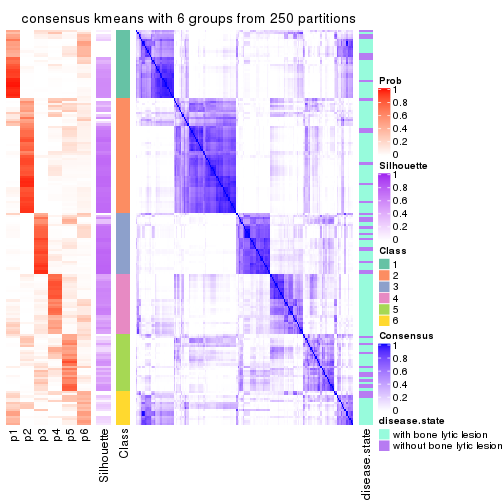</p>

</div>
</div>

Heatmaps for the membership of samples in all partitions to see how consistent they are:


<script>
$( function() {
	$( '#tabs-MAD-kmeans-membership-heatmap' ).tabs();
} );
</script>
<div id='tabs-MAD-kmeans-membership-heatmap'>
<ul>
<li><a href='#tab-MAD-kmeans-membership-heatmap-1'>k = 2</a></li>
<li><a href='#tab-MAD-kmeans-membership-heatmap-2'>k = 3</a></li>
<li><a href='#tab-MAD-kmeans-membership-heatmap-3'>k = 4</a></li>
<li><a href='#tab-MAD-kmeans-membership-heatmap-4'>k = 5</a></li>
<li><a href='#tab-MAD-kmeans-membership-heatmap-5'>k = 6</a></li>
</ul>
<div id='tab-MAD-kmeans-membership-heatmap-1'>
<pre><code class="r">membership_heatmap(res, k = 2)
</code></pre>

<p></p>

</div>
<div id='tab-MAD-kmeans-membership-heatmap-2'>
<pre><code class="r">membership_heatmap(res, k = 3)
</code></pre>

<p></p>

</div>
<div id='tab-MAD-kmeans-membership-heatmap-3'>
<pre><code class="r">membership_heatmap(res, k = 4)
</code></pre>

<p></p>

</div>
<div id='tab-MAD-kmeans-membership-heatmap-4'>
<pre><code class="r">membership_heatmap(res, k = 5)
</code></pre>

<p></p>

</div>
<div id='tab-MAD-kmeans-membership-heatmap-5'>
<pre><code class="r">membership_heatmap(res, k = 6)
</code></pre>

<p></p>

</div>
</div>

As soon as we have had the classes for columns, we can look for signatures
which are significantly different between classes which can be candidate marks
for certain classes. Following are the heatmaps for signatures.


Signature heatmaps where rows are scaled:


<script>
$( function() {
	$( '#tabs-MAD-kmeans-get-signatures' ).tabs();
} );
</script>
<div id='tabs-MAD-kmeans-get-signatures'>
<ul>
<li><a href='#tab-MAD-kmeans-get-signatures-1'>k = 2</a></li>
<li><a href='#tab-MAD-kmeans-get-signatures-2'>k = 3</a></li>
<li><a href='#tab-MAD-kmeans-get-signatures-3'>k = 4</a></li>
<li><a href='#tab-MAD-kmeans-get-signatures-4'>k = 5</a></li>
<li><a href='#tab-MAD-kmeans-get-signatures-5'>k = 6</a></li>
</ul>
<div id='tab-MAD-kmeans-get-signatures-1'>
<pre><code class="r">get_signatures(res, k = 2)
</code></pre>

<p></p>

</div>
<div id='tab-MAD-kmeans-get-signatures-2'>
<pre><code class="r">get_signatures(res, k = 3)
</code></pre>

<p></p>

</div>
<div id='tab-MAD-kmeans-get-signatures-3'>
<pre><code class="r">get_signatures(res, k = 4)
</code></pre>

<p></p>

</div>
<div id='tab-MAD-kmeans-get-signatures-4'>
<pre><code class="r">get_signatures(res, k = 5)
</code></pre>

<p></p>

</div>
<div id='tab-MAD-kmeans-get-signatures-5'>
<pre><code class="r">get_signatures(res, k = 6)
</code></pre>

<p></p>

</div>
</div>


Signature heatmaps where rows are not scaled:


<script>
$( function() {
	$( '#tabs-MAD-kmeans-get-signatures-no-scale' ).tabs();
} );
</script>
<div id='tabs-MAD-kmeans-get-signatures-no-scale'>
<ul>
<li><a href='#tab-MAD-kmeans-get-signatures-no-scale-1'>k = 2</a></li>
<li><a href='#tab-MAD-kmeans-get-signatures-no-scale-2'>k = 3</a></li>
<li><a href='#tab-MAD-kmeans-get-signatures-no-scale-3'>k = 4</a></li>
<li><a href='#tab-MAD-kmeans-get-signatures-no-scale-4'>k = 5</a></li>
<li><a href='#tab-MAD-kmeans-get-signatures-no-scale-5'>k = 6</a></li>
</ul>
<div id='tab-MAD-kmeans-get-signatures-no-scale-1'>
<pre><code class="r">get_signatures(res, k = 2, scale_rows = FALSE)
</code></pre>

<p></p>

</div>
<div id='tab-MAD-kmeans-get-signatures-no-scale-2'>
<pre><code class="r">get_signatures(res, k = 3, scale_rows = FALSE)
</code></pre>

<p></p>

</div>
<div id='tab-MAD-kmeans-get-signatures-no-scale-3'>
<pre><code class="r">get_signatures(res, k = 4, scale_rows = FALSE)
</code></pre>

<p></p>

</div>
<div id='tab-MAD-kmeans-get-signatures-no-scale-4'>
<pre><code class="r">get_signatures(res, k = 5, scale_rows = FALSE)
</code></pre>

<p></p>

</div>
<div id='tab-MAD-kmeans-get-signatures-no-scale-5'>
<pre><code class="r">get_signatures(res, k = 6, scale_rows = FALSE)
</code></pre>

<p></p>

</div>
</div>


Compare the overlap of signatures from different k:

```r
compare_signatures(res)
```


`get_signature()` returns a data frame invisibly. TO get the list of signatures, the function
call should be assigned to a variable explicitly. In following code, if `plot` argument is set
to `FALSE`, no heatmap is plotted while only the differential analysis is performed.

```r
# code only for demonstration
tb = get_signature(res, k = ..., plot = FALSE)
```

An example of the output of `tb` is:

```
#>   which_row         fdr    mean_1    mean_2 scaled_mean_1 scaled_mean_2 km
#> 1        38 0.042760348  8.373488  9.131774    -0.5533452     0.5164555  1
#> 2        40 0.018707592  7.106213  8.469186    -0.6173731     0.5762149  1
#> 3        55 0.019134737 10.221463 11.207825    -0.6159697     0.5749050  1
#> 4        59 0.006059896  5.921854  7.869574    -0.6899429     0.6439467  1
#> 5        60 0.018055526  8.928898 10.211722    -0.6204761     0.5791110  1
#> 6        98 0.009384629 15.714769 14.887706     0.6635654    -0.6193277  2
...
```

The columns in `tb` are:

1. `which_row`: row indices corresponding to the input matrix.
2. `fdr`: FDR for the differential test. 
3. `mean_x`: The mean value in group x.
4. `scaled_mean_x`: The mean value in group x after rows are scaled.
5. `km`: Row groups if k-means clustering is applied to rows.


UMAP plot which shows how samples are separated.


<script>
$( function() {
	$( '#tabs-MAD-kmeans-dimension-reduction' ).tabs();
} );
</script>
<div id='tabs-MAD-kmeans-dimension-reduction'>
<ul>
<li><a href='#tab-MAD-kmeans-dimension-reduction-1'>k = 2</a></li>
<li><a href='#tab-MAD-kmeans-dimension-reduction-2'>k = 3</a></li>
<li><a href='#tab-MAD-kmeans-dimension-reduction-3'>k = 4</a></li>
<li><a href='#tab-MAD-kmeans-dimension-reduction-4'>k = 5</a></li>
<li><a href='#tab-MAD-kmeans-dimension-reduction-5'>k = 6</a></li>
</ul>
<div id='tab-MAD-kmeans-dimension-reduction-1'>
<pre><code class="r">dimension_reduction(res, k = 2, method = &quot;UMAP&quot;)
</code></pre>

<p></p>

</div>
<div id='tab-MAD-kmeans-dimension-reduction-2'>
<pre><code class="r">dimension_reduction(res, k = 3, method = &quot;UMAP&quot;)
</code></pre>

<p></p>

</div>
<div id='tab-MAD-kmeans-dimension-reduction-3'>
<pre><code class="r">dimension_reduction(res, k = 4, method = &quot;UMAP&quot;)
</code></pre>

<p></p>

</div>
<div id='tab-MAD-kmeans-dimension-reduction-4'>
<pre><code class="r">dimension_reduction(res, k = 5, method = &quot;UMAP&quot;)
</code></pre>

<p></p>

</div>
<div id='tab-MAD-kmeans-dimension-reduction-5'>
<pre><code class="r">dimension_reduction(res, k = 6, method = &quot;UMAP&quot;)
</code></pre>

<p></p>

</div>
</div>


Following heatmap shows how subgroups are split when increasing `k`:

```r
collect_classes(res)
```


Test correlation between subgroups and known annotations. If the known
annotation is numeric, one-way ANOVA test is applied, and if the known
annotation is discrete, chi-squared contingency table test is applied.

```r
test_to_known_factors(res)
```

```
#>              n disease.state(p) k
#> MAD:kmeans 139          0.04213 2
#> MAD:kmeans 142          0.13741 3
#> MAD:kmeans 100          0.00139 4
#> MAD:kmeans 125          0.01047 5
#> MAD:kmeans  98          0.00849 6
```


If matrix rows can be associated to genes, consider to use `GO_Enrichment(res,
...)` to perform function enrichment for the signature genes.


 

---------------------------------------------------


### MAD:skmeans


The object with results only for a single top-value method and a single partition method 
can be extracted as:

```r
res = res_list["MAD", "skmeans"]
# you can also extract it by
# res = res_list["MAD:skmeans"]
```

A summary of `res` and all the functions that can be applied to it:

```r
res
```

```
#> A 'ConsensusPartition' object with k = 2, 3, 4, 5, 6.
#>   On a matrix with 11993 rows and 173 columns.
#>   Top rows (1000, 2000, 3000, 4000, 5000) are extracted by 'MAD' method.
#>   Subgroups are detected by 'skmeans' method.
#>   Performed in total 1250 partitions by row resampling.
#>   Best k for subgroups seems to be 2.
#> 
#> Following methods can be applied to this 'ConsensusPartition' object:
#>  [1] "cola_report"             "collect_classes"         "collect_plots"          
#>  [4] "collect_stats"           "colnames"                "compare_signatures"     
#>  [7] "consensus_heatmap"       "dimension_reduction"     "functional_enrichment"  
#> [10] "get_anno_col"            "get_anno"                "get_classes"            
#> [13] "get_consensus"           "get_matrix"              "get_membership"         
#> [16] "get_param"               "get_signatures"          "get_stats"              
#> [19] "is_best_k"               "is_stable_k"             "membership_heatmap"     
#> [22] "ncol"                    "nrow"                    "plot_ecdf"              
#> [25] "rownames"                "select_partition_number" "show"                   
#> [28] "suggest_best_k"          "test_to_known_factors"
```

`collect_plots()` function collects all the plots made from `res` for all `k` (number of partitions)
into one single page to provide an easy and fast comparison between different `k`.

```r
collect_plots(res)
```


The plots are:

- The first row: a plot of the ECDF (Empirical cumulative distribution
  function) curves of the consensus matrix for each `k` and the heatmap of
  predicted classes for each `k`.
- The second row: heatmaps of the consensus matrix for each `k`.
- The third row: heatmaps of the membership matrix for each `k`.
- The fouth row: heatmaps of the signatures for each `k`.

All the plots in panels can be made by individual functions and they are
plotted later in this section.

`select_partition_number()` produces several plots showing different
statistics for choosing "optimized" `k`. There are following statistics:

- ECDF curves of the consensus matrix for each `k`;
- 1-PAC. [The PAC
  score](https://en.wikipedia.org/wiki/Consensus_clustering#Over-interpretation_potential_of_consensus_clustering)
  measures the proportion of the ambiguous subgrouping.
- Mean silhouette score.
- Concordance. The mean probability of fiting the consensus class ids in all
  partitions.
- Area increased. Denote $A_k$ as the area under the ECDF curve for current
  `k`, the area increased is defined as $A_k - A_{k-1}$.
- Rand index. The percent of pairs of samples that are both in a same cluster
  or both are not in a same cluster in the partition of k and k-1.
- Jaccard index. The ratio of pairs of samples are both in a same cluster in
  the partition of k and k-1 and the pairs of samples are both in a same
  cluster in the partition k or k-1.

The detailed explanations of these statistics can be found in [the cola
vignette](http://bioconductor.org/packages/devel/bioc/vignettes/cola/inst/doc/cola.html#toc_13).

Generally speaking, lower PAC score, higher mean silhouette score or higher
concordance corresponds to better partition. Rand index and Jaccard index
measure how similar the current partition is compared to partition with `k-1`.
If they are too similar, we won't accept `k` is better than `k-1`.

```r
select_partition_number(res)
```


The numeric values for all these statistics can be obtained by `get_stats()`.

```r
get_stats(res)
```

```
#>   k 1-PAC mean_silhouette concordance area_increased  Rand Jaccard
#> 2 2 0.596           0.807       0.914         0.5027 0.498   0.498
#> 3 3 0.583           0.680       0.859         0.3324 0.682   0.444
#> 4 4 0.484           0.518       0.716         0.1206 0.868   0.631
#> 5 5 0.509           0.465       0.673         0.0644 0.880   0.590
#> 6 6 0.548           0.366       0.592         0.0410 0.931   0.713
```

`suggest_best_k()` suggests the best $k$ based on these statistics. The rules are as follows:

- All $k$ with Jaccard index larger than 0.95 are removed because the increase of
  the partition number does not provides enough extra information. If all $k$ are removed,
  the best $k$ is assigned by `NA`.
- For $k$ with 1-PAC larger than 0.9, the maximal $k$ is taken as the "best k". Other $k$ is called "optional k".
- If it does not fit the second rule. The $k$ with the highest vote of highest
  1-PAC, mean silhouette and concordance is taken as the "best k".

```r
suggest_best_k(res)
```

```
#> [1] 2
```


Following shows the table of the partitions (You need to click the **show/hide
code output** link to see it). The membership matrix (columns with name `p*`)
is inferred by
[`clue::cl_consensus()`](https://www.rdocumentation.org/link/cl_consensus?package=clue)
function with the `SE` method. Basically the value in the membership matrix
represents the probability to belong to a certain group. The finall class
label for an item is determined with the group with highest probability it
belongs to.

In `get_classes()` function, the entropy is calculated from the membership
matrix and the silhouette score is calculated from the consensus matrix.


<script>
$( function() {
	$( '#tabs-MAD-skmeans-get-classes' ).tabs();
} );
</script>
<div id='tabs-MAD-skmeans-get-classes'>
<ul>
<li><a href='#tab-MAD-skmeans-get-classes-1'>k = 2</a></li>
<li><a href='#tab-MAD-skmeans-get-classes-2'>k = 3</a></li>
<li><a href='#tab-MAD-skmeans-get-classes-3'>k = 4</a></li>
<li><a href='#tab-MAD-skmeans-get-classes-4'>k = 5</a></li>
<li><a href='#tab-MAD-skmeans-get-classes-5'>k = 6</a></li>
</ul>

<div id='tab-MAD-skmeans-get-classes-1'>
<p><a id='tab-MAD-skmeans-get-classes-1-a' style='color:#0366d6' href='#'>show/hide code output</a></p>
<pre><code class="r">cbind(get_classes(res, k = 2), get_membership(res, k = 2))
</code></pre>

<pre><code>#&gt;          class entropy silhouette    p1    p2
#&gt; GSM11437     1  0.6623     0.7812 0.828 0.172
#&gt; GSM11438     2  0.0376     0.9009 0.004 0.996
#&gt; GSM11439     2  0.9552     0.3959 0.376 0.624
#&gt; GSM11440     1  0.0376     0.9022 0.996 0.004
#&gt; GSM11441     1  0.0938     0.8995 0.988 0.012
#&gt; GSM11442     2  0.6048     0.7920 0.148 0.852
#&gt; GSM11443     2  0.0000     0.9017 0.000 1.000
#&gt; GSM11444     1  0.4562     0.8531 0.904 0.096
#&gt; GSM11445     1  0.9087     0.5429 0.676 0.324
#&gt; GSM11446     1  0.3879     0.8661 0.924 0.076
#&gt; GSM11447     2  0.9170     0.4952 0.332 0.668
#&gt; GSM11448     2  0.7219     0.7399 0.200 0.800
#&gt; GSM11449     1  0.1184     0.8991 0.984 0.016
#&gt; GSM11450     1  0.0938     0.9003 0.988 0.012
#&gt; GSM11451     2  0.0000     0.9017 0.000 1.000
#&gt; GSM11452     2  0.6801     0.7523 0.180 0.820
#&gt; GSM11453     1  0.2423     0.8916 0.960 0.040
#&gt; GSM11454     1  0.3114     0.8788 0.944 0.056
#&gt; GSM11455     2  0.0000     0.9017 0.000 1.000
#&gt; GSM11456     2  0.0000     0.9017 0.000 1.000
#&gt; GSM11457     2  0.0000     0.9017 0.000 1.000
#&gt; GSM11458     1  0.0000     0.9021 1.000 0.000
#&gt; GSM11459     1  0.0000     0.9021 1.000 0.000
#&gt; GSM11460     1  0.0000     0.9021 1.000 0.000
#&gt; GSM11461     1  0.1633     0.8994 0.976 0.024
#&gt; GSM11462     1  0.0000     0.9021 1.000 0.000
#&gt; GSM11463     2  0.0000     0.9017 0.000 1.000
#&gt; GSM11464     1  0.0000     0.9021 1.000 0.000
#&gt; GSM11465     2  0.7815     0.6883 0.232 0.768
#&gt; GSM11466     1  0.0000     0.9021 1.000 0.000
#&gt; GSM11467     1  0.1184     0.8991 0.984 0.016
#&gt; GSM11468     1  0.1414     0.8973 0.980 0.020
#&gt; GSM11469     1  0.0000     0.9021 1.000 0.000
#&gt; GSM11470     1  0.1184     0.8991 0.984 0.016
#&gt; GSM11471     1  0.0672     0.9012 0.992 0.008
#&gt; GSM11472     1  0.0376     0.9015 0.996 0.004
#&gt; GSM11473     2  0.1414     0.8956 0.020 0.980
#&gt; GSM11474     2  0.0000     0.9017 0.000 1.000
#&gt; GSM11475     1  0.8713     0.6026 0.708 0.292
#&gt; GSM11476     2  0.1843     0.8914 0.028 0.972
#&gt; GSM11477     2  0.0000     0.9017 0.000 1.000
#&gt; GSM11478     2  0.0000     0.9017 0.000 1.000
#&gt; GSM11479     2  0.1184     0.8972 0.016 0.984
#&gt; GSM11480     2  0.0000     0.9017 0.000 1.000
#&gt; GSM11481     1  0.0376     0.9022 0.996 0.004
#&gt; GSM11482     2  0.1633     0.8948 0.024 0.976
#&gt; GSM11483     2  0.1184     0.8972 0.016 0.984
#&gt; GSM11484     1  0.9129     0.5340 0.672 0.328
#&gt; GSM11485     2  0.1184     0.8972 0.016 0.984
#&gt; GSM11486     2  0.0376     0.9010 0.004 0.996
#&gt; GSM11487     1  0.1184     0.9000 0.984 0.016
#&gt; GSM11488     1  0.9944     0.1932 0.544 0.456
#&gt; GSM11489     2  0.0376     0.9010 0.004 0.996
#&gt; GSM11490     1  0.9954     0.1329 0.540 0.460
#&gt; GSM11491     1  0.3274     0.8786 0.940 0.060
#&gt; GSM11492     1  0.7745     0.7002 0.772 0.228
#&gt; GSM11493     2  0.6438     0.7767 0.164 0.836
#&gt; GSM11494     2  0.9491     0.4152 0.368 0.632
#&gt; GSM11495     2  0.2043     0.8894 0.032 0.968
#&gt; GSM11496     2  0.1843     0.8919 0.028 0.972
#&gt; GSM11497     2  0.0000     0.9017 0.000 1.000
#&gt; GSM11498     2  0.0000     0.9017 0.000 1.000
#&gt; GSM11499     2  0.1184     0.8972 0.016 0.984
#&gt; GSM11500     2  0.1633     0.8936 0.024 0.976
#&gt; GSM11501     2  0.1414     0.8968 0.020 0.980
#&gt; GSM11502     2  0.0000     0.9017 0.000 1.000
#&gt; GSM11503     2  0.0000     0.9017 0.000 1.000
#&gt; GSM11504     1  0.1184     0.8980 0.984 0.016
#&gt; GSM11505     2  0.0000     0.9017 0.000 1.000
#&gt; GSM11506     2  0.0376     0.9009 0.004 0.996
#&gt; GSM11507     2  0.0000     0.9017 0.000 1.000
#&gt; GSM11508     1  0.3114     0.8785 0.944 0.056
#&gt; GSM11509     2  0.9944     0.1635 0.456 0.544
#&gt; GSM11510     2  0.0000     0.9017 0.000 1.000
#&gt; GSM11511     1  0.6973     0.7513 0.812 0.188
#&gt; GSM11512     1  0.8016     0.6806 0.756 0.244
#&gt; GSM11513     1  0.3431     0.8734 0.936 0.064
#&gt; GSM11514     2  0.9963     0.0962 0.464 0.536
#&gt; GSM11515     2  0.7815     0.6809 0.232 0.768
#&gt; GSM11516     2  0.8608     0.6013 0.284 0.716
#&gt; GSM11517     1  0.0000     0.9021 1.000 0.000
#&gt; GSM11518     1  0.9323     0.4752 0.652 0.348
#&gt; GSM11519     1  0.2423     0.8904 0.960 0.040
#&gt; GSM11520     1  0.0672     0.9012 0.992 0.008
#&gt; GSM11521     2  0.1184     0.8972 0.016 0.984
#&gt; GSM11522     1  0.0672     0.9012 0.992 0.008
#&gt; GSM11523     1  0.0000     0.9021 1.000 0.000
#&gt; GSM11524     1  0.0000     0.9021 1.000 0.000
#&gt; GSM11525     2  0.0000     0.9017 0.000 1.000
#&gt; GSM11526     1  0.7815     0.6989 0.768 0.232
#&gt; GSM11527     2  0.0938     0.8985 0.012 0.988
#&gt; GSM11528     2  0.0000     0.9017 0.000 1.000
#&gt; GSM11529     2  0.1843     0.8892 0.028 0.972
#&gt; GSM11530     1  0.0376     0.9020 0.996 0.004
#&gt; GSM11531     2  0.0000     0.9017 0.000 1.000
#&gt; GSM11532     1  0.0000     0.9021 1.000 0.000
#&gt; GSM11533     2  0.0000     0.9017 0.000 1.000
#&gt; GSM11534     2  0.9608     0.3975 0.384 0.616
#&gt; GSM11535     2  0.0000     0.9017 0.000 1.000
#&gt; GSM11536     2  0.9087     0.5073 0.324 0.676
#&gt; GSM11537     2  0.0376     0.9005 0.004 0.996
#&gt; GSM11538     1  0.8207     0.6540 0.744 0.256
#&gt; GSM11539     2  0.0000     0.9017 0.000 1.000
#&gt; GSM11540     2  0.0000     0.9017 0.000 1.000
#&gt; GSM11541     1  0.0000     0.9021 1.000 0.000
#&gt; GSM11542     2  0.0000     0.9017 0.000 1.000
#&gt; GSM11543     2  0.9323     0.4949 0.348 0.652
#&gt; GSM11544     1  0.1843     0.8951 0.972 0.028
#&gt; GSM11545     1  0.4939     0.8507 0.892 0.108
#&gt; GSM11546     2  0.2236     0.8880 0.036 0.964
#&gt; GSM11547     2  0.1633     0.8940 0.024 0.976
#&gt; GSM11548     1  0.9460     0.4567 0.636 0.364
#&gt; GSM11549     1  0.0376     0.9015 0.996 0.004
#&gt; GSM11550     1  0.0000     0.9021 1.000 0.000
#&gt; GSM11551     1  0.5842     0.8092 0.860 0.140
#&gt; GSM11552     1  0.0000     0.9021 1.000 0.000
#&gt; GSM11553     2  0.1184     0.8957 0.016 0.984
#&gt; GSM11554     2  0.0000     0.9017 0.000 1.000
#&gt; GSM11555     1  0.1633     0.8995 0.976 0.024
#&gt; GSM11556     1  0.0000     0.9021 1.000 0.000
#&gt; GSM11557     2  0.0000     0.9017 0.000 1.000
#&gt; GSM11558     2  0.0000     0.9017 0.000 1.000
#&gt; GSM11559     2  0.0938     0.8976 0.012 0.988
#&gt; GSM11560     1  0.0000     0.9021 1.000 0.000
#&gt; GSM11561     2  0.0000     0.9017 0.000 1.000
#&gt; GSM11562     2  0.0376     0.9005 0.004 0.996
#&gt; GSM11563     1  0.6623     0.7795 0.828 0.172
#&gt; GSM11564     1  0.5946     0.8169 0.856 0.144
#&gt; GSM11565     1  0.2948     0.8850 0.948 0.052
#&gt; GSM11566     2  0.0000     0.9017 0.000 1.000
#&gt; GSM11567     1  0.9686     0.3376 0.604 0.396
#&gt; GSM11568     2  0.9580     0.4036 0.380 0.620
#&gt; GSM11569     2  0.0000     0.9017 0.000 1.000
#&gt; GSM11570     1  0.0000     0.9021 1.000 0.000
#&gt; GSM11571     1  0.9393     0.4504 0.644 0.356
#&gt; GSM11572     2  0.6148     0.7892 0.152 0.848
#&gt; GSM11573     1  0.6801     0.7666 0.820 0.180
#&gt; GSM11574     2  0.1184     0.8957 0.016 0.984
#&gt; GSM11575     2  0.9983     0.1207 0.476 0.524
#&gt; GSM11576     1  0.1184     0.8991 0.984 0.016
#&gt; GSM11577     2  0.9896     0.2323 0.440 0.560
#&gt; GSM11578     2  0.8016     0.6675 0.244 0.756
#&gt; GSM11579     2  0.1184     0.8972 0.016 0.984
#&gt; GSM11580     2  0.7602     0.7017 0.220 0.780
#&gt; GSM11581     1  0.3114     0.8783 0.944 0.056
#&gt; GSM11582     1  0.0000     0.9021 1.000 0.000
#&gt; GSM11583     1  0.2603     0.8870 0.956 0.044
#&gt; GSM11584     1  0.9323     0.4895 0.652 0.348
#&gt; GSM11585     2  0.0376     0.9005 0.004 0.996
#&gt; GSM11586     1  0.0938     0.9003 0.988 0.012
#&gt; GSM11587     1  0.0000     0.9021 1.000 0.000
#&gt; GSM11588     1  0.6343     0.7878 0.840 0.160
#&gt; GSM11589     1  0.9358     0.4598 0.648 0.352
#&gt; GSM11590     1  0.1414     0.8980 0.980 0.020
#&gt; GSM11591     2  0.1184     0.8957 0.016 0.984
#&gt; GSM11592     1  0.0000     0.9021 1.000 0.000
#&gt; GSM11593     1  0.1633     0.8966 0.976 0.024
#&gt; GSM11594     1  0.0000     0.9021 1.000 0.000
#&gt; GSM11595     1  0.9635     0.3642 0.612 0.388
#&gt; GSM11596     2  0.3733     0.8648 0.072 0.928
#&gt; GSM11597     1  0.0376     0.9015 0.996 0.004
#&gt; GSM11598     1  0.1843     0.8951 0.972 0.028
#&gt; GSM11599     1  0.0000     0.9021 1.000 0.000
#&gt; GSM11600     1  0.0376     0.9020 0.996 0.004
#&gt; GSM11601     2  0.0672     0.9003 0.008 0.992
#&gt; GSM11602     1  0.0000     0.9021 1.000 0.000
#&gt; GSM11603     1  0.0000     0.9021 1.000 0.000
#&gt; GSM11604     1  0.0000     0.9021 1.000 0.000
#&gt; GSM11605     1  0.0000     0.9021 1.000 0.000
#&gt; GSM11606     2  0.1184     0.8957 0.016 0.984
#&gt; GSM11607     1  0.1843     0.8951 0.972 0.028
#&gt; GSM11608     1  0.0000     0.9021 1.000 0.000
#&gt; GSM11609     2  0.8813     0.5709 0.300 0.700
</code></pre>

<script>
$('#tab-MAD-skmeans-get-classes-1-a').parent().next().next().hide();
$('#tab-MAD-skmeans-get-classes-1-a').click(function(){
  $('#tab-MAD-skmeans-get-classes-1-a').parent().next().next().toggle();
  return(false);
});
</script>
</div>

<div id='tab-MAD-skmeans-get-classes-2'>
<p><a id='tab-MAD-skmeans-get-classes-2-a' style='color:#0366d6' href='#'>show/hide code output</a></p>
<pre><code class="r">cbind(get_classes(res, k = 3), get_membership(res, k = 3))
</code></pre>

<pre><code>#&gt;          class entropy silhouette    p1    p2    p3
#&gt; GSM11437     1  0.8947    0.19675 0.496 0.132 0.372
#&gt; GSM11438     2  0.4555    0.71854 0.000 0.800 0.200
#&gt; GSM11439     3  0.5791    0.70527 0.060 0.148 0.792
#&gt; GSM11440     3  0.2096    0.78563 0.052 0.004 0.944
#&gt; GSM11441     3  0.3482    0.74133 0.128 0.000 0.872
#&gt; GSM11442     3  0.0592    0.80114 0.000 0.012 0.988
#&gt; GSM11443     2  0.0424    0.89084 0.000 0.992 0.008
#&gt; GSM11444     3  0.0747    0.80106 0.016 0.000 0.984
#&gt; GSM11445     3  0.0237    0.80102 0.004 0.000 0.996
#&gt; GSM11446     3  0.0747    0.80106 0.016 0.000 0.984
#&gt; GSM11447     3  0.1950    0.79580 0.008 0.040 0.952
#&gt; GSM11448     1  0.6495    0.13743 0.536 0.460 0.004
#&gt; GSM11449     1  0.1163    0.80429 0.972 0.000 0.028
#&gt; GSM11450     1  0.0000    0.81136 1.000 0.000 0.000
#&gt; GSM11451     2  0.0237    0.89190 0.004 0.996 0.000
#&gt; GSM11452     2  0.5926    0.40426 0.356 0.644 0.000
#&gt; GSM11453     1  0.0237    0.81116 0.996 0.004 0.000
#&gt; GSM11454     3  0.0592    0.80113 0.012 0.000 0.988
#&gt; GSM11455     3  0.6295    0.10277 0.000 0.472 0.528
#&gt; GSM11456     2  0.2496    0.85730 0.004 0.928 0.068
#&gt; GSM11457     2  0.0237    0.89190 0.004 0.996 0.000
#&gt; GSM11458     3  0.5810    0.44314 0.336 0.000 0.664
#&gt; GSM11459     3  0.0747    0.80068 0.016 0.000 0.984
#&gt; GSM11460     1  0.5397    0.55470 0.720 0.000 0.280
#&gt; GSM11461     1  0.8415    0.33866 0.564 0.104 0.332
#&gt; GSM11462     1  0.6225    0.23141 0.568 0.000 0.432
#&gt; GSM11463     2  0.0475    0.89222 0.004 0.992 0.004
#&gt; GSM11464     1  0.2261    0.78000 0.932 0.000 0.068
#&gt; GSM11465     2  0.6906    0.65088 0.192 0.724 0.084
#&gt; GSM11466     3  0.2301    0.78863 0.060 0.004 0.936
#&gt; GSM11467     1  0.0237    0.81158 0.996 0.000 0.004
#&gt; GSM11468     3  0.1031    0.79830 0.024 0.000 0.976
#&gt; GSM11469     3  0.5591    0.50537 0.304 0.000 0.696
#&gt; GSM11470     1  0.0237    0.81133 0.996 0.000 0.004
#&gt; GSM11471     1  0.1453    0.80503 0.968 0.008 0.024
#&gt; GSM11472     1  0.6225    0.20486 0.568 0.000 0.432
#&gt; GSM11473     2  0.3816    0.78334 0.000 0.852 0.148
#&gt; GSM11474     2  0.0237    0.89160 0.000 0.996 0.004
#&gt; GSM11475     3  0.1860    0.78732 0.052 0.000 0.948
#&gt; GSM11476     3  0.4346    0.69337 0.000 0.184 0.816
#&gt; GSM11477     2  0.0000    0.89188 0.000 1.000 0.000
#&gt; GSM11478     2  0.0424    0.89113 0.000 0.992 0.008
#&gt; GSM11479     2  0.6204    0.25607 0.000 0.576 0.424
#&gt; GSM11480     2  0.0237    0.89175 0.000 0.996 0.004
#&gt; GSM11481     3  0.6140    0.26917 0.404 0.000 0.596
#&gt; GSM11482     3  0.3267    0.76583 0.000 0.116 0.884
#&gt; GSM11483     2  0.6267    0.17387 0.000 0.548 0.452
#&gt; GSM11484     3  0.0424    0.80149 0.000 0.008 0.992
#&gt; GSM11485     2  0.6309   -0.00494 0.000 0.500 0.500
#&gt; GSM11486     2  0.2711    0.84139 0.000 0.912 0.088
#&gt; GSM11487     1  0.0592    0.81073 0.988 0.000 0.012
#&gt; GSM11488     3  0.0747    0.80067 0.000 0.016 0.984
#&gt; GSM11489     2  0.4399    0.72840 0.000 0.812 0.188
#&gt; GSM11490     3  0.3713    0.76898 0.076 0.032 0.892
#&gt; GSM11491     1  0.0424    0.81023 0.992 0.008 0.000
#&gt; GSM11492     3  0.0237    0.80192 0.004 0.000 0.996
#&gt; GSM11493     3  0.0892    0.79986 0.000 0.020 0.980
#&gt; GSM11494     3  0.0592    0.80165 0.000 0.012 0.988
#&gt; GSM11495     3  0.4346    0.69216 0.000 0.184 0.816
#&gt; GSM11496     2  0.6309    0.02248 0.000 0.504 0.496
#&gt; GSM11497     2  0.1453    0.88574 0.024 0.968 0.008
#&gt; GSM11498     2  0.2845    0.85837 0.068 0.920 0.012
#&gt; GSM11499     3  0.6302    0.04868 0.000 0.480 0.520
#&gt; GSM11500     3  0.6307    0.00660 0.000 0.488 0.512
#&gt; GSM11501     3  0.6095    0.33891 0.000 0.392 0.608
#&gt; GSM11502     2  0.0237    0.89190 0.004 0.996 0.000
#&gt; GSM11503     2  0.0424    0.89084 0.000 0.992 0.008
#&gt; GSM11504     3  0.0237    0.80104 0.000 0.004 0.996
#&gt; GSM11505     2  0.0424    0.89084 0.000 0.992 0.008
#&gt; GSM11506     2  0.1163    0.88387 0.000 0.972 0.028
#&gt; GSM11507     2  0.0237    0.89175 0.000 0.996 0.004
#&gt; GSM11508     3  0.0237    0.80102 0.004 0.000 0.996
#&gt; GSM11509     3  0.1774    0.79993 0.016 0.024 0.960
#&gt; GSM11510     2  0.4452    0.73043 0.000 0.808 0.192
#&gt; GSM11511     1  0.1636    0.80266 0.964 0.016 0.020
#&gt; GSM11512     3  0.0237    0.80104 0.000 0.004 0.996
#&gt; GSM11513     3  0.0592    0.80113 0.012 0.000 0.988
#&gt; GSM11514     3  0.9283    0.37541 0.260 0.216 0.524
#&gt; GSM11515     3  0.0424    0.80141 0.000 0.008 0.992
#&gt; GSM11516     1  0.6309    0.02878 0.504 0.496 0.000
#&gt; GSM11517     3  0.1860    0.78997 0.052 0.000 0.948
#&gt; GSM11518     3  0.7337    0.48745 0.300 0.056 0.644
#&gt; GSM11519     1  0.0237    0.81080 0.996 0.004 0.000
#&gt; GSM11520     1  0.0237    0.81133 0.996 0.000 0.004
#&gt; GSM11521     3  0.4399    0.68979 0.000 0.188 0.812
#&gt; GSM11522     1  0.2356    0.77807 0.928 0.000 0.072
#&gt; GSM11523     1  0.0237    0.81133 0.996 0.000 0.004
#&gt; GSM11524     3  0.0892    0.79923 0.020 0.000 0.980
#&gt; GSM11525     2  0.0000    0.89188 0.000 1.000 0.000
#&gt; GSM11526     3  0.0475    0.80151 0.004 0.004 0.992
#&gt; GSM11527     2  0.2711    0.84353 0.000 0.912 0.088
#&gt; GSM11528     2  0.0000    0.89188 0.000 1.000 0.000
#&gt; GSM11529     2  0.4047    0.77473 0.148 0.848 0.004
#&gt; GSM11530     3  0.6820    0.55424 0.248 0.052 0.700
#&gt; GSM11531     2  0.0424    0.89142 0.008 0.992 0.000
#&gt; GSM11532     3  0.5098    0.59492 0.248 0.000 0.752
#&gt; GSM11533     2  0.3412    0.80388 0.124 0.876 0.000
#&gt; GSM11534     1  0.6529    0.66030 0.760 0.124 0.116
#&gt; GSM11535     2  0.0424    0.89142 0.008 0.992 0.000
#&gt; GSM11536     3  0.5730    0.72418 0.060 0.144 0.796
#&gt; GSM11537     2  0.0424    0.89154 0.008 0.992 0.000
#&gt; GSM11538     1  0.7013    0.38862 0.608 0.028 0.364
#&gt; GSM11539     2  0.0237    0.89160 0.000 0.996 0.004
#&gt; GSM11540     2  0.0000    0.89188 0.000 1.000 0.000
#&gt; GSM11541     1  0.5621    0.51874 0.692 0.000 0.308
#&gt; GSM11542     2  0.0424    0.89203 0.008 0.992 0.000
#&gt; GSM11543     3  0.8795    0.05050 0.444 0.112 0.444
#&gt; GSM11544     1  0.0000    0.81136 1.000 0.000 0.000
#&gt; GSM11545     1  0.1753    0.79573 0.952 0.048 0.000
#&gt; GSM11546     2  0.1711    0.88112 0.008 0.960 0.032
#&gt; GSM11547     2  0.1129    0.88750 0.004 0.976 0.020
#&gt; GSM11548     3  0.1170    0.80233 0.016 0.008 0.976
#&gt; GSM11549     1  0.0747    0.80950 0.984 0.000 0.016
#&gt; GSM11550     1  0.0592    0.80934 0.988 0.000 0.012
#&gt; GSM11551     3  0.7286    0.08706 0.464 0.028 0.508
#&gt; GSM11552     3  0.6026    0.35083 0.376 0.000 0.624
#&gt; GSM11553     2  0.1031    0.88609 0.024 0.976 0.000
#&gt; GSM11554     2  0.0237    0.89190 0.004 0.996 0.000
#&gt; GSM11555     1  0.6529    0.38985 0.620 0.012 0.368
#&gt; GSM11556     1  0.6062    0.35178 0.616 0.000 0.384
#&gt; GSM11557     2  0.0475    0.89222 0.004 0.992 0.004
#&gt; GSM11558     2  0.0237    0.89175 0.000 0.996 0.004
#&gt; GSM11559     2  0.1411    0.88036 0.036 0.964 0.000
#&gt; GSM11560     1  0.0424    0.81050 0.992 0.000 0.008
#&gt; GSM11561     2  0.0237    0.89175 0.000 0.996 0.004
#&gt; GSM11562     2  0.0424    0.89142 0.008 0.992 0.000
#&gt; GSM11563     1  0.2096    0.79068 0.944 0.052 0.004
#&gt; GSM11564     1  0.1491    0.80715 0.968 0.016 0.016
#&gt; GSM11565     1  0.0237    0.81133 0.996 0.004 0.000
#&gt; GSM11566     2  0.0237    0.89175 0.000 0.996 0.004
#&gt; GSM11567     3  0.3356    0.78336 0.056 0.036 0.908
#&gt; GSM11568     1  0.6291    0.12304 0.532 0.468 0.000
#&gt; GSM11569     2  0.0237    0.89190 0.004 0.996 0.000
#&gt; GSM11570     3  0.6168    0.25800 0.412 0.000 0.588
#&gt; GSM11571     1  0.3619    0.73208 0.864 0.136 0.000
#&gt; GSM11572     2  0.5831    0.57063 0.284 0.708 0.008
#&gt; GSM11573     1  0.1482    0.80532 0.968 0.020 0.012
#&gt; GSM11574     2  0.1860    0.87035 0.052 0.948 0.000
#&gt; GSM11575     1  0.6467    0.33758 0.604 0.388 0.008
#&gt; GSM11576     1  0.0237    0.81133 0.996 0.000 0.004
#&gt; GSM11577     1  0.5988    0.39597 0.632 0.368 0.000
#&gt; GSM11578     1  0.6309    0.01526 0.500 0.500 0.000
#&gt; GSM11579     3  0.6215    0.24466 0.000 0.428 0.572
#&gt; GSM11580     2  0.6252    0.15886 0.444 0.556 0.000
#&gt; GSM11581     3  0.0424    0.80099 0.008 0.000 0.992
#&gt; GSM11582     1  0.6286    0.14048 0.536 0.000 0.464
#&gt; GSM11583     3  0.6565    0.24471 0.416 0.008 0.576
#&gt; GSM11584     3  0.0000    0.80097 0.000 0.000 1.000
#&gt; GSM11585     2  0.0424    0.89142 0.008 0.992 0.000
#&gt; GSM11586     1  0.0237    0.81117 0.996 0.000 0.004
#&gt; GSM11587     1  0.0237    0.81133 0.996 0.000 0.004
#&gt; GSM11588     1  0.1015    0.80804 0.980 0.012 0.008
#&gt; GSM11589     1  0.4249    0.75143 0.864 0.108 0.028
#&gt; GSM11590     1  0.0000    0.81136 1.000 0.000 0.000
#&gt; GSM11591     2  0.1289    0.88208 0.032 0.968 0.000
#&gt; GSM11592     1  0.1411    0.80103 0.964 0.000 0.036
#&gt; GSM11593     1  0.0000    0.81136 1.000 0.000 0.000
#&gt; GSM11594     1  0.0237    0.81133 0.996 0.000 0.004
#&gt; GSM11595     1  0.8042    0.52290 0.636 0.248 0.116
#&gt; GSM11596     2  0.4295    0.82376 0.104 0.864 0.032
#&gt; GSM11597     3  0.4346    0.70016 0.184 0.000 0.816
#&gt; GSM11598     1  0.0000    0.81136 1.000 0.000 0.000
#&gt; GSM11599     3  0.0747    0.80001 0.016 0.000 0.984
#&gt; GSM11600     1  0.6168    0.29242 0.588 0.000 0.412
#&gt; GSM11601     2  0.5247    0.68525 0.008 0.768 0.224
#&gt; GSM11602     1  0.0237    0.81133 0.996 0.000 0.004
#&gt; GSM11603     1  0.0237    0.81133 0.996 0.000 0.004
#&gt; GSM11604     3  0.5988    0.38406 0.368 0.000 0.632
#&gt; GSM11605     1  0.5016    0.61797 0.760 0.000 0.240
#&gt; GSM11606     2  0.2261    0.85882 0.068 0.932 0.000
#&gt; GSM11607     1  0.0000    0.81136 1.000 0.000 0.000
#&gt; GSM11608     1  0.5560    0.51925 0.700 0.000 0.300
#&gt; GSM11609     3  0.7680    0.62104 0.188 0.132 0.680
</code></pre>

<script>
$('#tab-MAD-skmeans-get-classes-2-a').parent().next().next().hide();
$('#tab-MAD-skmeans-get-classes-2-a').click(function(){
  $('#tab-MAD-skmeans-get-classes-2-a').parent().next().next().toggle();
  return(false);
});
</script>
</div>

<div id='tab-MAD-skmeans-get-classes-3'>
<p><a id='tab-MAD-skmeans-get-classes-3-a' style='color:#0366d6' href='#'>show/hide code output</a></p>
<pre><code class="r">cbind(get_classes(res, k = 4), get_membership(res, k = 4))
</code></pre>

<pre><code>#&gt;          class entropy silhouette    p1    p2    p3    p4
#&gt; GSM11437     4  0.9108     0.0119 0.308 0.080 0.216 0.396
#&gt; GSM11438     2  0.5581     0.3288 0.000 0.532 0.020 0.448
#&gt; GSM11439     4  0.6486    -0.2172 0.012 0.044 0.468 0.476
#&gt; GSM11440     3  0.3436     0.5267 0.016 0.008 0.864 0.112
#&gt; GSM11441     3  0.6659     0.3110 0.088 0.000 0.512 0.400
#&gt; GSM11442     4  0.5383    -0.1595 0.000 0.012 0.452 0.536
#&gt; GSM11443     2  0.3672     0.7448 0.000 0.824 0.012 0.164
#&gt; GSM11444     3  0.4908     0.4593 0.000 0.016 0.692 0.292
#&gt; GSM11445     3  0.3494     0.5510 0.000 0.004 0.824 0.172
#&gt; GSM11446     3  0.5189     0.3785 0.000 0.012 0.616 0.372
#&gt; GSM11447     3  0.5778     0.2124 0.000 0.028 0.500 0.472
#&gt; GSM11448     1  0.8386     0.3827 0.512 0.244 0.056 0.188
#&gt; GSM11449     1  0.5916     0.2900 0.568 0.016 0.400 0.016
#&gt; GSM11450     1  0.3700     0.7363 0.860 0.008 0.096 0.036
#&gt; GSM11451     2  0.1557     0.7974 0.000 0.944 0.000 0.056
#&gt; GSM11452     2  0.4122     0.6215 0.236 0.760 0.000 0.004
#&gt; GSM11453     1  0.1584     0.7689 0.952 0.000 0.012 0.036
#&gt; GSM11454     3  0.4483     0.5013 0.004 0.000 0.712 0.284
#&gt; GSM11455     4  0.6267     0.4343 0.000 0.188 0.148 0.664
#&gt; GSM11456     2  0.6266     0.4933 0.024 0.608 0.032 0.336
#&gt; GSM11457     2  0.1118     0.8005 0.000 0.964 0.000 0.036
#&gt; GSM11458     3  0.4724     0.5652 0.096 0.000 0.792 0.112
#&gt; GSM11459     3  0.3324     0.5702 0.012 0.000 0.852 0.136
#&gt; GSM11460     1  0.7063     0.1795 0.508 0.000 0.360 0.132
#&gt; GSM11461     3  0.8453     0.3346 0.204 0.056 0.504 0.236
#&gt; GSM11462     3  0.3937     0.5195 0.188 0.000 0.800 0.012
#&gt; GSM11463     2  0.2345     0.7872 0.000 0.900 0.000 0.100
#&gt; GSM11464     1  0.3907     0.7297 0.836 0.000 0.120 0.044
#&gt; GSM11465     2  0.8886     0.2920 0.140 0.500 0.216 0.144
#&gt; GSM11466     3  0.6585     0.4710 0.096 0.024 0.668 0.212
#&gt; GSM11467     1  0.3245     0.7393 0.880 0.000 0.064 0.056
#&gt; GSM11468     3  0.1970     0.5631 0.008 0.000 0.932 0.060
#&gt; GSM11469     3  0.2775     0.5766 0.084 0.000 0.896 0.020
#&gt; GSM11470     1  0.0524     0.7679 0.988 0.000 0.004 0.008
#&gt; GSM11471     1  0.5476     0.6300 0.736 0.024 0.204 0.036
#&gt; GSM11472     1  0.7800     0.1492 0.460 0.004 0.236 0.300
#&gt; GSM11473     2  0.6268     0.2727 0.000 0.496 0.056 0.448
#&gt; GSM11474     2  0.2888     0.7839 0.000 0.872 0.004 0.124
#&gt; GSM11475     3  0.4462     0.4994 0.024 0.008 0.792 0.176
#&gt; GSM11476     4  0.5429     0.4955 0.000 0.072 0.208 0.720
#&gt; GSM11477     2  0.0592     0.7998 0.000 0.984 0.000 0.016
#&gt; GSM11478     2  0.2530     0.7892 0.000 0.888 0.000 0.112
#&gt; GSM11479     4  0.5574     0.2896 0.000 0.284 0.048 0.668
#&gt; GSM11480     2  0.2704     0.7777 0.000 0.876 0.000 0.124
#&gt; GSM11481     3  0.7186    -0.1057 0.140 0.000 0.476 0.384
#&gt; GSM11482     4  0.6089     0.4491 0.000 0.064 0.328 0.608
#&gt; GSM11483     4  0.4932     0.3834 0.000 0.240 0.032 0.728
#&gt; GSM11484     4  0.5250     0.3930 0.012 0.004 0.344 0.640
#&gt; GSM11485     4  0.4875     0.4862 0.000 0.160 0.068 0.772
#&gt; GSM11486     2  0.5498     0.4365 0.000 0.576 0.020 0.404
#&gt; GSM11487     1  0.2546     0.7590 0.912 0.000 0.028 0.060
#&gt; GSM11488     4  0.4980     0.4456 0.008 0.012 0.272 0.708
#&gt; GSM11489     2  0.6412     0.4253 0.000 0.572 0.080 0.348
#&gt; GSM11490     4  0.6266    -0.2264 0.012 0.032 0.468 0.488
#&gt; GSM11491     1  0.1516     0.7700 0.960 0.016 0.008 0.016
#&gt; GSM11492     4  0.5582     0.3454 0.032 0.000 0.348 0.620
#&gt; GSM11493     4  0.5047     0.4340 0.000 0.016 0.316 0.668
#&gt; GSM11494     4  0.4399     0.3027 0.000 0.020 0.212 0.768
#&gt; GSM11495     4  0.4374     0.4079 0.000 0.068 0.120 0.812
#&gt; GSM11496     4  0.7006     0.2176 0.000 0.204 0.216 0.580
#&gt; GSM11497     2  0.3831     0.7792 0.040 0.848 0.004 0.108
#&gt; GSM11498     2  0.7331     0.5501 0.172 0.588 0.016 0.224
#&gt; GSM11499     4  0.5581     0.4963 0.000 0.140 0.132 0.728
#&gt; GSM11500     4  0.6084     0.3484 0.000 0.244 0.096 0.660
#&gt; GSM11501     4  0.5875     0.4952 0.000 0.104 0.204 0.692
#&gt; GSM11502     2  0.1059     0.7984 0.012 0.972 0.000 0.016
#&gt; GSM11503     2  0.2401     0.7977 0.000 0.904 0.004 0.092
#&gt; GSM11504     4  0.5792     0.2642 0.032 0.000 0.416 0.552
#&gt; GSM11505     2  0.2011     0.7961 0.000 0.920 0.000 0.080
#&gt; GSM11506     2  0.4193     0.6922 0.000 0.732 0.000 0.268
#&gt; GSM11507     2  0.2530     0.7829 0.000 0.888 0.000 0.112
#&gt; GSM11508     3  0.3528     0.5220 0.000 0.000 0.808 0.192
#&gt; GSM11509     3  0.5805     0.3467 0.000 0.036 0.576 0.388
#&gt; GSM11510     2  0.5919     0.2799 0.012 0.492 0.016 0.480
#&gt; GSM11511     1  0.5027     0.7104 0.796 0.024 0.064 0.116
#&gt; GSM11512     4  0.5513     0.3496 0.016 0.004 0.384 0.596
#&gt; GSM11513     3  0.4690     0.5087 0.016 0.000 0.724 0.260
#&gt; GSM11514     4  0.9017     0.2994 0.132 0.136 0.272 0.460
#&gt; GSM11515     3  0.4967     0.2528 0.000 0.000 0.548 0.452
#&gt; GSM11516     1  0.5321     0.1677 0.528 0.464 0.004 0.004
#&gt; GSM11517     3  0.3850     0.5769 0.044 0.000 0.840 0.116
#&gt; GSM11518     4  0.7793    -0.1509 0.140 0.020 0.392 0.448
#&gt; GSM11519     1  0.1007     0.7694 0.976 0.008 0.008 0.008
#&gt; GSM11520     1  0.2002     0.7656 0.936 0.000 0.044 0.020
#&gt; GSM11521     4  0.5953     0.4809 0.000 0.076 0.268 0.656
#&gt; GSM11522     1  0.5369     0.4723 0.652 0.004 0.324 0.020
#&gt; GSM11523     1  0.2111     0.7643 0.932 0.000 0.044 0.024
#&gt; GSM11524     3  0.2868     0.4993 0.000 0.000 0.864 0.136
#&gt; GSM11525     2  0.2081     0.7976 0.000 0.916 0.000 0.084
#&gt; GSM11526     3  0.5852     0.1391 0.020 0.008 0.544 0.428
#&gt; GSM11527     2  0.5387     0.4856 0.000 0.584 0.016 0.400
#&gt; GSM11528     2  0.4579     0.7011 0.004 0.756 0.016 0.224
#&gt; GSM11529     2  0.3278     0.7501 0.116 0.864 0.000 0.020
#&gt; GSM11530     3  0.3793     0.5796 0.076 0.016 0.864 0.044
#&gt; GSM11531     2  0.2839     0.7833 0.004 0.884 0.004 0.108
#&gt; GSM11532     3  0.3392     0.5267 0.020 0.000 0.856 0.124
#&gt; GSM11533     2  0.2216     0.7696 0.092 0.908 0.000 0.000
#&gt; GSM11534     1  0.7182     0.5972 0.656 0.064 0.108 0.172
#&gt; GSM11535     2  0.2727     0.7919 0.012 0.900 0.004 0.084
#&gt; GSM11536     4  0.6307     0.3973 0.012 0.044 0.364 0.580
#&gt; GSM11537     2  0.1820     0.7966 0.020 0.944 0.000 0.036
#&gt; GSM11538     4  0.8473     0.1671 0.184 0.040 0.376 0.400
#&gt; GSM11539     2  0.1389     0.7998 0.000 0.952 0.000 0.048
#&gt; GSM11540     2  0.1557     0.8015 0.000 0.944 0.000 0.056
#&gt; GSM11541     3  0.7883    -0.0293 0.328 0.000 0.380 0.292
#&gt; GSM11542     2  0.4186     0.7425 0.004 0.808 0.024 0.164
#&gt; GSM11543     4  0.7775     0.1015 0.364 0.056 0.080 0.500
#&gt; GSM11544     1  0.0859     0.7697 0.980 0.008 0.008 0.004
#&gt; GSM11545     1  0.3703     0.7489 0.868 0.064 0.012 0.056
#&gt; GSM11546     2  0.6407     0.5531 0.008 0.624 0.076 0.292
#&gt; GSM11547     2  0.6826     0.4988 0.012 0.608 0.104 0.276
#&gt; GSM11548     3  0.5110     0.4748 0.008 0.012 0.688 0.292
#&gt; GSM11549     1  0.4004     0.7408 0.844 0.004 0.088 0.064
#&gt; GSM11550     1  0.3323     0.7581 0.876 0.000 0.060 0.064
#&gt; GSM11551     3  0.8476     0.1789 0.304 0.024 0.392 0.280
#&gt; GSM11552     3  0.3037     0.5525 0.100 0.000 0.880 0.020
#&gt; GSM11553     2  0.2131     0.7957 0.032 0.932 0.000 0.036
#&gt; GSM11554     2  0.1209     0.7979 0.004 0.964 0.000 0.032
#&gt; GSM11555     3  0.8049     0.0194 0.280 0.008 0.428 0.284
#&gt; GSM11556     1  0.7269     0.0269 0.456 0.000 0.396 0.148
#&gt; GSM11557     2  0.1940     0.7926 0.000 0.924 0.000 0.076
#&gt; GSM11558     2  0.2647     0.7784 0.000 0.880 0.000 0.120
#&gt; GSM11559     2  0.2161     0.7922 0.048 0.932 0.004 0.016
#&gt; GSM11560     1  0.3182     0.7399 0.876 0.000 0.096 0.028
#&gt; GSM11561     2  0.2773     0.7778 0.000 0.880 0.004 0.116
#&gt; GSM11562     2  0.1771     0.7993 0.012 0.948 0.004 0.036
#&gt; GSM11563     1  0.4071     0.7467 0.856 0.068 0.040 0.036
#&gt; GSM11564     1  0.5643     0.6334 0.728 0.024 0.044 0.204
#&gt; GSM11565     1  0.2521     0.7619 0.924 0.016 0.028 0.032
#&gt; GSM11566     2  0.4911     0.6175 0.008 0.704 0.008 0.280
#&gt; GSM11567     4  0.6092     0.3993 0.028 0.016 0.364 0.592
#&gt; GSM11568     1  0.5747     0.3863 0.588 0.384 0.008 0.020
#&gt; GSM11569     2  0.1302     0.7979 0.000 0.956 0.000 0.044
#&gt; GSM11570     3  0.3758     0.5338 0.104 0.000 0.848 0.048
#&gt; GSM11571     1  0.4448     0.6774 0.784 0.188 0.024 0.004
#&gt; GSM11572     2  0.8746     0.2868 0.152 0.500 0.104 0.244
#&gt; GSM11573     1  0.5588     0.6931 0.772 0.080 0.044 0.104
#&gt; GSM11574     2  0.2376     0.7846 0.068 0.916 0.000 0.016
#&gt; GSM11575     1  0.7983     0.3509 0.512 0.332 0.076 0.080
#&gt; GSM11576     1  0.1584     0.7651 0.952 0.000 0.036 0.012
#&gt; GSM11577     1  0.5814     0.2259 0.544 0.428 0.004 0.024
#&gt; GSM11578     1  0.5277     0.1742 0.532 0.460 0.000 0.008
#&gt; GSM11579     4  0.7171     0.4617 0.000 0.212 0.232 0.556
#&gt; GSM11580     2  0.5030     0.4076 0.352 0.640 0.004 0.004
#&gt; GSM11581     3  0.2814     0.5079 0.000 0.000 0.868 0.132
#&gt; GSM11582     3  0.7402     0.1434 0.264 0.000 0.516 0.220
#&gt; GSM11583     3  0.5866     0.5376 0.100 0.020 0.736 0.144
#&gt; GSM11584     4  0.4996     0.2614 0.000 0.000 0.484 0.516
#&gt; GSM11585     2  0.1042     0.7976 0.020 0.972 0.000 0.008
#&gt; GSM11586     1  0.1593     0.7688 0.956 0.004 0.024 0.016
#&gt; GSM11587     1  0.2021     0.7650 0.936 0.000 0.040 0.024
#&gt; GSM11588     1  0.3050     0.7613 0.900 0.044 0.012 0.044
#&gt; GSM11589     1  0.9398     0.2124 0.436 0.200 0.168 0.196
#&gt; GSM11590     1  0.0524     0.7684 0.988 0.008 0.000 0.004
#&gt; GSM11591     2  0.1824     0.7876 0.060 0.936 0.000 0.004
#&gt; GSM11592     1  0.3687     0.7466 0.856 0.000 0.080 0.064
#&gt; GSM11593     1  0.0000     0.7675 1.000 0.000 0.000 0.000
#&gt; GSM11594     1  0.1284     0.7687 0.964 0.000 0.024 0.012
#&gt; GSM11595     1  0.9047     0.3192 0.476 0.148 0.232 0.144
#&gt; GSM11596     2  0.5859     0.7102 0.076 0.760 0.096 0.068
#&gt; GSM11597     3  0.6656     0.3649 0.080 0.008 0.580 0.332
#&gt; GSM11598     1  0.0859     0.7695 0.980 0.008 0.004 0.008
#&gt; GSM11599     3  0.2342     0.5631 0.008 0.000 0.912 0.080
#&gt; GSM11600     3  0.7690     0.0337 0.264 0.000 0.456 0.280
#&gt; GSM11601     4  0.8314     0.0728 0.016 0.276 0.316 0.392
#&gt; GSM11602     1  0.2363     0.7613 0.920 0.000 0.056 0.024
#&gt; GSM11603     1  0.2111     0.7631 0.932 0.000 0.044 0.024
#&gt; GSM11604     3  0.4225     0.5421 0.184 0.000 0.792 0.024
#&gt; GSM11605     1  0.7868    -0.0988 0.372 0.000 0.352 0.276
#&gt; GSM11606     2  0.2861     0.7686 0.096 0.888 0.000 0.016
#&gt; GSM11607     1  0.0188     0.7676 0.996 0.000 0.004 0.000
#&gt; GSM11608     3  0.4868     0.4049 0.304 0.000 0.684 0.012
#&gt; GSM11609     4  0.6320     0.4047 0.012 0.044 0.368 0.576
</code></pre>

<script>
$('#tab-MAD-skmeans-get-classes-3-a').parent().next().next().hide();
$('#tab-MAD-skmeans-get-classes-3-a').click(function(){
  $('#tab-MAD-skmeans-get-classes-3-a').parent().next().next().toggle();
  return(false);
});
</script>
</div>

<div id='tab-MAD-skmeans-get-classes-4'>
<p><a id='tab-MAD-skmeans-get-classes-4-a' style='color:#0366d6' href='#'>show/hide code output</a></p>
<pre><code class="r">cbind(get_classes(res, k = 5), get_membership(res, k = 5))
</code></pre>

<pre><code>#&gt;          class entropy silhouette    p1    p2    p3    p4    p5
#&gt; GSM11437     5   0.917   -0.03694 0.260 0.036 0.172 0.248 0.284
#&gt; GSM11438     2   0.785    0.03012 0.004 0.380 0.056 0.292 0.268
#&gt; GSM11439     5   0.587    0.30463 0.004 0.008 0.264 0.104 0.620
#&gt; GSM11440     3   0.501    0.60535 0.008 0.004 0.728 0.176 0.084
#&gt; GSM11441     5   0.748    0.04556 0.060 0.000 0.356 0.172 0.412
#&gt; GSM11442     3   0.679    0.02240 0.000 0.000 0.372 0.340 0.288
#&gt; GSM11443     2   0.415    0.63820 0.000 0.752 0.004 0.028 0.216
#&gt; GSM11444     3   0.488    0.53908 0.000 0.000 0.676 0.060 0.264
#&gt; GSM11445     3   0.463    0.62766 0.000 0.000 0.744 0.120 0.136
#&gt; GSM11446     3   0.525    0.46416 0.000 0.000 0.632 0.076 0.292
#&gt; GSM11447     5   0.631    0.20834 0.000 0.004 0.308 0.160 0.528
#&gt; GSM11448     5   0.702    0.19534 0.264 0.136 0.024 0.024 0.552
#&gt; GSM11449     3   0.679    0.16306 0.348 0.008 0.492 0.016 0.136
#&gt; GSM11450     1   0.575    0.55207 0.616 0.004 0.084 0.008 0.288
#&gt; GSM11451     2   0.174    0.70135 0.000 0.936 0.000 0.024 0.040
#&gt; GSM11452     2   0.407    0.60159 0.144 0.792 0.000 0.004 0.060
#&gt; GSM11453     1   0.372    0.69247 0.844 0.012 0.008 0.080 0.056
#&gt; GSM11454     3   0.425    0.61613 0.000 0.000 0.776 0.092 0.132
#&gt; GSM11455     4   0.782   -0.00868 0.004 0.140 0.100 0.416 0.340
#&gt; GSM11456     5   0.654    0.30196 0.000 0.320 0.036 0.104 0.540
#&gt; GSM11457     2   0.232    0.70529 0.000 0.904 0.000 0.028 0.068
#&gt; GSM11458     3   0.348    0.62379 0.084 0.000 0.836 0.000 0.080
#&gt; GSM11459     3   0.318    0.65212 0.000 0.000 0.856 0.076 0.068
#&gt; GSM11460     1   0.774    0.22324 0.432 0.000 0.284 0.204 0.080
#&gt; GSM11461     3   0.799    0.08818 0.200 0.040 0.424 0.032 0.304
#&gt; GSM11462     3   0.384    0.58038 0.164 0.000 0.800 0.012 0.024
#&gt; GSM11463     2   0.367    0.66405 0.000 0.796 0.004 0.020 0.180
#&gt; GSM11464     1   0.579    0.65212 0.704 0.000 0.112 0.088 0.096
#&gt; GSM11465     5   0.793    0.30643 0.076 0.280 0.120 0.036 0.488
#&gt; GSM11466     3   0.807    0.19779 0.080 0.012 0.416 0.192 0.300
#&gt; GSM11467     1   0.554    0.64235 0.720 0.000 0.128 0.072 0.080
#&gt; GSM11468     3   0.208    0.66354 0.000 0.000 0.916 0.064 0.020
#&gt; GSM11469     3   0.285    0.65985 0.032 0.000 0.892 0.028 0.048
#&gt; GSM11470     1   0.210    0.70764 0.916 0.000 0.024 0.000 0.060
#&gt; GSM11471     1   0.720    0.24994 0.432 0.020 0.216 0.004 0.328
#&gt; GSM11472     1   0.828    0.02601 0.380 0.004 0.236 0.264 0.116
#&gt; GSM11473     5   0.633    0.31274 0.004 0.276 0.036 0.088 0.596
#&gt; GSM11474     2   0.389    0.66726 0.000 0.784 0.000 0.040 0.176
#&gt; GSM11475     3   0.514    0.62807 0.008 0.008 0.728 0.160 0.096
#&gt; GSM11476     4   0.400    0.51863 0.000 0.028 0.048 0.820 0.104
#&gt; GSM11477     2   0.157    0.70561 0.000 0.936 0.000 0.004 0.060
#&gt; GSM11478     2   0.395    0.67631 0.000 0.800 0.000 0.116 0.084
#&gt; GSM11479     5   0.693    0.16692 0.000 0.124 0.044 0.348 0.484
#&gt; GSM11480     2   0.385    0.67259 0.000 0.800 0.000 0.144 0.056
#&gt; GSM11481     4   0.683    0.42960 0.184 0.000 0.208 0.564 0.044
#&gt; GSM11482     4   0.452    0.55740 0.000 0.028 0.120 0.784 0.068
#&gt; GSM11483     4   0.674    0.06012 0.000 0.136 0.028 0.500 0.336
#&gt; GSM11484     4   0.412    0.56880 0.040 0.000 0.100 0.816 0.044
#&gt; GSM11485     4   0.562    0.38823 0.004 0.100 0.024 0.692 0.180
#&gt; GSM11486     2   0.643    0.15620 0.000 0.464 0.024 0.096 0.416
#&gt; GSM11487     1   0.358    0.68709 0.836 0.000 0.016 0.116 0.032
#&gt; GSM11488     4   0.339    0.56618 0.028 0.000 0.076 0.860 0.036
#&gt; GSM11489     2   0.765   -0.10410 0.004 0.396 0.044 0.232 0.324
#&gt; GSM11490     5   0.560    0.29159 0.000 0.004 0.264 0.104 0.628
#&gt; GSM11491     1   0.394    0.69109 0.840 0.012 0.024 0.064 0.060
#&gt; GSM11492     4   0.582    0.50455 0.060 0.000 0.176 0.684 0.080
#&gt; GSM11493     4   0.338    0.56154 0.000 0.004 0.088 0.848 0.060
#&gt; GSM11494     4   0.634    0.02371 0.000 0.004 0.144 0.484 0.368
#&gt; GSM11495     4   0.597    0.14767 0.000 0.016 0.076 0.544 0.364
#&gt; GSM11496     5   0.645    0.39849 0.000 0.072 0.116 0.180 0.632
#&gt; GSM11497     2   0.470    0.65898 0.048 0.752 0.004 0.016 0.180
#&gt; GSM11498     5   0.818   -0.00525 0.136 0.356 0.008 0.136 0.364
#&gt; GSM11499     4   0.504    0.44531 0.000 0.080 0.024 0.736 0.160
#&gt; GSM11500     5   0.791    0.07716 0.000 0.128 0.140 0.356 0.376
#&gt; GSM11501     4   0.501    0.50529 0.008 0.052 0.056 0.768 0.116
#&gt; GSM11502     2   0.136    0.70297 0.000 0.948 0.000 0.004 0.048
#&gt; GSM11503     2   0.448    0.67460 0.004 0.784 0.028 0.040 0.144
#&gt; GSM11504     4   0.556    0.47531 0.036 0.000 0.232 0.672 0.060
#&gt; GSM11505     2   0.369    0.67344 0.000 0.800 0.000 0.036 0.164
#&gt; GSM11506     2   0.556    0.58380 0.000 0.660 0.004 0.164 0.172
#&gt; GSM11507     2   0.370    0.67833 0.000 0.816 0.000 0.120 0.064
#&gt; GSM11508     3   0.455    0.62594 0.000 0.000 0.736 0.192 0.072
#&gt; GSM11509     3   0.592    0.40002 0.004 0.000 0.580 0.120 0.296
#&gt; GSM11510     4   0.753    0.02180 0.016 0.312 0.024 0.432 0.216
#&gt; GSM11511     1   0.526    0.35711 0.508 0.012 0.012 0.008 0.460
#&gt; GSM11512     4   0.439    0.56910 0.032 0.000 0.112 0.796 0.060
#&gt; GSM11513     3   0.436    0.61342 0.000 0.000 0.768 0.116 0.116
#&gt; GSM11514     4   0.849    0.35345 0.180 0.084 0.104 0.500 0.132
#&gt; GSM11515     3   0.667    0.18213 0.000 0.004 0.476 0.284 0.236
#&gt; GSM11516     2   0.683    0.13717 0.332 0.464 0.004 0.008 0.192
#&gt; GSM11517     3   0.414    0.66471 0.032 0.000 0.816 0.084 0.068
#&gt; GSM11518     5   0.649    0.34143 0.064 0.000 0.220 0.104 0.612
#&gt; GSM11519     1   0.282    0.70094 0.892 0.004 0.008 0.048 0.048
#&gt; GSM11520     1   0.346    0.71056 0.860 0.000 0.056 0.036 0.048
#&gt; GSM11521     4   0.422    0.52820 0.000 0.068 0.064 0.816 0.052
#&gt; GSM11522     3   0.738   -0.03274 0.380 0.004 0.404 0.040 0.172
#&gt; GSM11523     1   0.394    0.67694 0.800 0.000 0.052 0.004 0.144
#&gt; GSM11524     3   0.429    0.59044 0.004 0.000 0.740 0.224 0.032
#&gt; GSM11525     2   0.427    0.66312 0.000 0.772 0.012 0.040 0.176
#&gt; GSM11526     4   0.767    0.07999 0.076 0.008 0.368 0.416 0.132
#&gt; GSM11527     2   0.677    0.18579 0.000 0.428 0.004 0.340 0.228
#&gt; GSM11528     2   0.655    0.43234 0.008 0.544 0.004 0.256 0.188
#&gt; GSM11529     2   0.515    0.64208 0.084 0.752 0.024 0.012 0.128
#&gt; GSM11530     3   0.365    0.65523 0.040 0.012 0.856 0.024 0.068
#&gt; GSM11531     2   0.346    0.66424 0.000 0.788 0.004 0.004 0.204
#&gt; GSM11532     3   0.609    0.57275 0.040 0.000 0.652 0.176 0.132
#&gt; GSM11533     2   0.275    0.68696 0.056 0.888 0.000 0.004 0.052
#&gt; GSM11534     1   0.841    0.17984 0.380 0.076 0.028 0.208 0.308
#&gt; GSM11535     2   0.321    0.65385 0.000 0.788 0.000 0.000 0.212
#&gt; GSM11536     4   0.366    0.56950 0.044 0.012 0.076 0.852 0.016
#&gt; GSM11537     2   0.205    0.68799 0.004 0.916 0.000 0.008 0.072
#&gt; GSM11538     4   0.710    0.45501 0.216 0.020 0.144 0.576 0.044
#&gt; GSM11539     2   0.283    0.69723 0.000 0.872 0.004 0.020 0.104
#&gt; GSM11540     2   0.273    0.70246 0.000 0.884 0.000 0.052 0.064
#&gt; GSM11541     4   0.771    0.25419 0.292 0.000 0.192 0.436 0.080
#&gt; GSM11542     2   0.573    0.57365 0.008 0.672 0.008 0.172 0.140
#&gt; GSM11543     5   0.816    0.17008 0.184 0.028 0.064 0.300 0.424
#&gt; GSM11544     1   0.249    0.71170 0.912 0.008 0.016 0.016 0.048
#&gt; GSM11545     1   0.557    0.63166 0.736 0.060 0.012 0.100 0.092
#&gt; GSM11546     2   0.743    0.27646 0.008 0.480 0.096 0.088 0.328
#&gt; GSM11547     2   0.667    0.27905 0.012 0.508 0.084 0.028 0.368
#&gt; GSM11548     3   0.482    0.57552 0.000 0.000 0.708 0.080 0.212
#&gt; GSM11549     1   0.599    0.55262 0.596 0.000 0.100 0.016 0.288
#&gt; GSM11550     1   0.597    0.56265 0.616 0.000 0.044 0.060 0.280
#&gt; GSM11551     5   0.808    0.13835 0.208 0.012 0.276 0.080 0.424
#&gt; GSM11552     3   0.308    0.63803 0.064 0.000 0.876 0.044 0.016
#&gt; GSM11553     2   0.346    0.67228 0.024 0.844 0.000 0.020 0.112
#&gt; GSM11554     2   0.177    0.70203 0.000 0.932 0.000 0.016 0.052
#&gt; GSM11555     4   0.751    0.16422 0.348 0.004 0.220 0.392 0.036
#&gt; GSM11556     1   0.742    0.12882 0.432 0.000 0.272 0.256 0.040
#&gt; GSM11557     2   0.254    0.69070 0.000 0.868 0.004 0.000 0.128
#&gt; GSM11558     2   0.277    0.69302 0.000 0.868 0.000 0.112 0.020
#&gt; GSM11559     2   0.317    0.67098 0.020 0.856 0.000 0.012 0.112
#&gt; GSM11560     1   0.495    0.63647 0.732 0.000 0.188 0.028 0.052
#&gt; GSM11561     2   0.401    0.65960 0.000 0.784 0.000 0.160 0.056
#&gt; GSM11562     2   0.299    0.69041 0.016 0.880 0.004 0.020 0.080
#&gt; GSM11563     1   0.701    0.46817 0.540 0.068 0.040 0.036 0.316
#&gt; GSM11564     1   0.656    0.51569 0.604 0.012 0.044 0.252 0.088
#&gt; GSM11565     1   0.491    0.61069 0.692 0.012 0.012 0.020 0.264
#&gt; GSM11566     2   0.623    0.39593 0.016 0.556 0.012 0.344 0.072
#&gt; GSM11567     4   0.501    0.54477 0.028 0.012 0.100 0.768 0.092
#&gt; GSM11568     2   0.707   -0.15703 0.364 0.368 0.012 0.000 0.256
#&gt; GSM11569     2   0.120    0.70298 0.000 0.960 0.000 0.012 0.028
#&gt; GSM11570     3   0.439    0.59345 0.088 0.000 0.792 0.100 0.020
#&gt; GSM11571     1   0.672    0.51007 0.612 0.192 0.052 0.008 0.136
#&gt; GSM11572     2   0.852    0.09946 0.092 0.396 0.036 0.304 0.172
#&gt; GSM11573     1   0.629    0.58471 0.672 0.056 0.016 0.160 0.096
#&gt; GSM11574     2   0.287    0.67538 0.044 0.880 0.000 0.004 0.072
#&gt; GSM11575     5   0.769   -0.06924 0.348 0.208 0.064 0.000 0.380
#&gt; GSM11576     1   0.230    0.70662 0.912 0.000 0.052 0.004 0.032
#&gt; GSM11577     2   0.689    0.05514 0.420 0.440 0.008 0.036 0.096
#&gt; GSM11578     2   0.617    0.25176 0.364 0.520 0.004 0.004 0.108
#&gt; GSM11579     4   0.643    0.42800 0.000 0.124 0.124 0.648 0.104
#&gt; GSM11580     2   0.689    0.35860 0.276 0.560 0.024 0.024 0.116
#&gt; GSM11581     3   0.440    0.57767 0.004 0.000 0.724 0.240 0.032
#&gt; GSM11582     4   0.767    0.16083 0.252 0.000 0.332 0.364 0.052
#&gt; GSM11583     3   0.619    0.53169 0.100 0.008 0.680 0.072 0.140
#&gt; GSM11584     4   0.435    0.51495 0.000 0.000 0.244 0.720 0.036
#&gt; GSM11585     2   0.192    0.69951 0.008 0.924 0.004 0.000 0.064
#&gt; GSM11586     1   0.428    0.67883 0.788 0.004 0.024 0.028 0.156
#&gt; GSM11587     1   0.394    0.67597 0.800 0.000 0.052 0.004 0.144
#&gt; GSM11588     1   0.450    0.67343 0.800 0.028 0.008 0.068 0.096
#&gt; GSM11589     1   0.883    0.09649 0.384 0.184 0.080 0.284 0.068
#&gt; GSM11590     1   0.170    0.70843 0.928 0.004 0.000 0.000 0.068
#&gt; GSM11591     2   0.134    0.69318 0.000 0.944 0.000 0.000 0.056
#&gt; GSM11592     1   0.626    0.51768 0.580 0.004 0.060 0.044 0.312
#&gt; GSM11593     1   0.164    0.70790 0.932 0.000 0.000 0.004 0.064
#&gt; GSM11594     1   0.294    0.71061 0.888 0.000 0.040 0.040 0.032
#&gt; GSM11595     5   0.768    0.30466 0.176 0.176 0.104 0.012 0.532
#&gt; GSM11596     2   0.760    0.44481 0.044 0.580 0.156 0.084 0.136
#&gt; GSM11597     3   0.635    0.07996 0.040 0.000 0.480 0.064 0.416
#&gt; GSM11598     1   0.284    0.70284 0.888 0.000 0.012 0.044 0.056
#&gt; GSM11599     3   0.290    0.66345 0.000 0.000 0.868 0.096 0.036
#&gt; GSM11600     4   0.737    0.31995 0.256 0.000 0.256 0.448 0.040
#&gt; GSM11601     5   0.733    0.42406 0.004 0.180 0.216 0.068 0.532
#&gt; GSM11602     1   0.472    0.67375 0.756 0.000 0.092 0.012 0.140
#&gt; GSM11603     1   0.394    0.67788 0.800 0.000 0.052 0.004 0.144
#&gt; GSM11604     3   0.462    0.62956 0.136 0.000 0.776 0.044 0.044
#&gt; GSM11605     4   0.726    0.23728 0.320 0.000 0.180 0.456 0.044
#&gt; GSM11606     2   0.378    0.64740 0.068 0.820 0.000 0.004 0.108
#&gt; GSM11607     1   0.189    0.70858 0.936 0.000 0.012 0.024 0.028
#&gt; GSM11608     3   0.523    0.49018 0.232 0.000 0.692 0.036 0.040
#&gt; GSM11609     4   0.457    0.56369 0.008 0.012 0.132 0.780 0.068
</code></pre>

<script>
$('#tab-MAD-skmeans-get-classes-4-a').parent().next().next().hide();
$('#tab-MAD-skmeans-get-classes-4-a').click(function(){
  $('#tab-MAD-skmeans-get-classes-4-a').parent().next().next().toggle();
  return(false);
});
</script>
</div>

<div id='tab-MAD-skmeans-get-classes-5'>
<p><a id='tab-MAD-skmeans-get-classes-5-a' style='color:#0366d6' href='#'>show/hide code output</a></p>
<pre><code class="r">cbind(get_classes(res, k = 6), get_membership(res, k = 6))
</code></pre>

<pre><code>#&gt;          class entropy silhouette    p1    p2    p3    p4    p5    p6
#&gt; GSM11437     5  0.9274   -0.14953 0.144 0.032 0.128 0.200 0.280 0.216
#&gt; GSM11438     2  0.8293    0.00662 0.008 0.340 0.032 0.184 0.252 0.184
#&gt; GSM11439     5  0.2902    0.36217 0.000 0.004 0.116 0.004 0.852 0.024
#&gt; GSM11440     3  0.5412    0.60316 0.024 0.000 0.704 0.136 0.084 0.052
#&gt; GSM11441     5  0.7163    0.10873 0.052 0.000 0.292 0.052 0.476 0.128
#&gt; GSM11442     5  0.6239    0.20539 0.000 0.004 0.280 0.120 0.544 0.052
#&gt; GSM11443     2  0.5839    0.42541 0.000 0.524 0.000 0.008 0.284 0.184
#&gt; GSM11444     3  0.4687    0.50455 0.000 0.000 0.604 0.020 0.352 0.024
#&gt; GSM11445     3  0.4341    0.63066 0.000 0.000 0.736 0.048 0.192 0.024
#&gt; GSM11446     3  0.4464    0.36742 0.000 0.000 0.544 0.012 0.432 0.012
#&gt; GSM11447     5  0.3417    0.35961 0.000 0.004 0.156 0.024 0.808 0.008
#&gt; GSM11448     5  0.7827   -0.39258 0.224 0.100 0.012 0.012 0.328 0.324
#&gt; GSM11449     3  0.7179    0.13078 0.220 0.016 0.492 0.024 0.036 0.212
#&gt; GSM11450     1  0.6552    0.20671 0.568 0.008 0.068 0.004 0.156 0.196
#&gt; GSM11451     2  0.2639    0.64518 0.008 0.880 0.000 0.048 0.000 0.064
#&gt; GSM11452     2  0.4333    0.49432 0.200 0.720 0.000 0.000 0.004 0.076
#&gt; GSM11453     1  0.4648    0.52429 0.768 0.012 0.008 0.060 0.036 0.116
#&gt; GSM11454     3  0.4544    0.59280 0.000 0.000 0.716 0.040 0.208 0.036
#&gt; GSM11455     5  0.8295    0.19016 0.000 0.104 0.108 0.268 0.364 0.156
#&gt; GSM11456     5  0.6455    0.23754 0.008 0.212 0.016 0.024 0.560 0.180
#&gt; GSM11457     2  0.4633    0.64550 0.000 0.736 0.000 0.040 0.072 0.152
#&gt; GSM11458     3  0.4045    0.61826 0.040 0.000 0.792 0.000 0.064 0.104
#&gt; GSM11459     3  0.3514    0.63590 0.000 0.000 0.828 0.036 0.096 0.040
#&gt; GSM11460     4  0.7917    0.01856 0.248 0.000 0.240 0.280 0.008 0.224
#&gt; GSM11461     3  0.8707   -0.06435 0.152 0.036 0.332 0.044 0.272 0.164
#&gt; GSM11462     3  0.3651    0.59216 0.068 0.000 0.816 0.012 0.004 0.100
#&gt; GSM11463     2  0.5260    0.51532 0.000 0.604 0.000 0.000 0.224 0.172
#&gt; GSM11464     1  0.7439    0.20047 0.504 0.000 0.104 0.144 0.052 0.196
#&gt; GSM11465     2  0.8897   -0.19450 0.072 0.288 0.076 0.052 0.272 0.240
#&gt; GSM11466     3  0.8498    0.00108 0.060 0.008 0.312 0.188 0.288 0.144
#&gt; GSM11467     1  0.6444    0.34586 0.584 0.000 0.112 0.112 0.008 0.184
#&gt; GSM11468     3  0.2115    0.65695 0.000 0.000 0.916 0.032 0.032 0.020
#&gt; GSM11469     3  0.2799    0.65314 0.016 0.000 0.888 0.028 0.032 0.036
#&gt; GSM11470     1  0.2500    0.54848 0.868 0.000 0.012 0.004 0.000 0.116
#&gt; GSM11471     1  0.8037   -0.25824 0.360 0.028 0.200 0.004 0.140 0.268
#&gt; GSM11472     1  0.8635   -0.21542 0.340 0.004 0.232 0.180 0.140 0.104
#&gt; GSM11473     5  0.5968    0.31097 0.000 0.172 0.008 0.036 0.608 0.176
#&gt; GSM11474     2  0.5764    0.55671 0.000 0.616 0.000 0.040 0.172 0.172
#&gt; GSM11475     3  0.5810    0.57518 0.008 0.004 0.656 0.148 0.132 0.052
#&gt; GSM11476     4  0.5146    0.40276 0.000 0.028 0.012 0.700 0.168 0.092
#&gt; GSM11477     2  0.3438    0.65531 0.000 0.820 0.000 0.012 0.048 0.120
#&gt; GSM11478     2  0.5418    0.59891 0.000 0.676 0.000 0.136 0.064 0.124
#&gt; GSM11479     5  0.6351    0.34363 0.000 0.088 0.028 0.140 0.624 0.120
#&gt; GSM11480     2  0.4946    0.60137 0.000 0.688 0.000 0.168 0.016 0.128
#&gt; GSM11481     4  0.6576    0.41201 0.104 0.000 0.140 0.592 0.020 0.144
#&gt; GSM11482     4  0.5732    0.44159 0.000 0.032 0.076 0.688 0.116 0.088
#&gt; GSM11483     5  0.7082    0.21630 0.000 0.108 0.008 0.284 0.460 0.140
#&gt; GSM11484     4  0.5479    0.46571 0.032 0.000 0.080 0.712 0.084 0.092
#&gt; GSM11485     4  0.6559    0.26296 0.000 0.080 0.016 0.572 0.204 0.128
#&gt; GSM11486     5  0.6438    0.04147 0.000 0.336 0.000 0.056 0.472 0.136
#&gt; GSM11487     1  0.4731    0.49719 0.748 0.004 0.020 0.128 0.012 0.088
#&gt; GSM11488     4  0.5439    0.45171 0.008 0.000 0.056 0.684 0.156 0.096
#&gt; GSM11489     5  0.7909    0.21388 0.004 0.196 0.020 0.184 0.400 0.196
#&gt; GSM11490     5  0.3776    0.35021 0.000 0.000 0.132 0.016 0.796 0.056
#&gt; GSM11491     1  0.3861    0.54011 0.812 0.056 0.004 0.036 0.000 0.092
#&gt; GSM11492     4  0.6859    0.39842 0.032 0.000 0.128 0.572 0.152 0.116
#&gt; GSM11493     4  0.5163    0.43857 0.000 0.004 0.056 0.704 0.152 0.084
#&gt; GSM11494     5  0.5640    0.30464 0.000 0.004 0.088 0.220 0.636 0.052
#&gt; GSM11495     5  0.5886    0.16181 0.000 0.008 0.028 0.360 0.520 0.084
#&gt; GSM11496     5  0.3308    0.37851 0.000 0.052 0.020 0.016 0.856 0.056
#&gt; GSM11497     2  0.6206    0.51531 0.052 0.580 0.000 0.004 0.184 0.180
#&gt; GSM11498     5  0.8600    0.02910 0.128 0.252 0.000 0.108 0.300 0.212
#&gt; GSM11499     4  0.6468    0.23710 0.000 0.072 0.004 0.540 0.252 0.132
#&gt; GSM11500     5  0.7558    0.31808 0.000 0.088 0.096 0.152 0.512 0.152
#&gt; GSM11501     4  0.5790    0.37933 0.000 0.044 0.024 0.664 0.132 0.136
#&gt; GSM11502     2  0.2077    0.65048 0.008 0.916 0.000 0.008 0.012 0.056
#&gt; GSM11503     2  0.5727    0.58940 0.000 0.648 0.012 0.040 0.120 0.180
#&gt; GSM11504     4  0.6633    0.40340 0.008 0.000 0.152 0.568 0.128 0.144
#&gt; GSM11505     2  0.5029    0.58978 0.000 0.680 0.000 0.016 0.148 0.156
#&gt; GSM11506     2  0.7051    0.42074 0.000 0.476 0.000 0.144 0.196 0.184
#&gt; GSM11507     2  0.5355    0.58349 0.000 0.668 0.000 0.156 0.040 0.136
#&gt; GSM11508     3  0.4780    0.59850 0.000 0.000 0.704 0.108 0.172 0.016
#&gt; GSM11509     3  0.6148    0.20078 0.000 0.004 0.436 0.040 0.424 0.096
#&gt; GSM11510     4  0.8110   -0.08614 0.012 0.260 0.008 0.300 0.244 0.176
#&gt; GSM11511     1  0.6412   -0.09987 0.452 0.008 0.012 0.000 0.228 0.300
#&gt; GSM11512     4  0.6192    0.44073 0.012 0.000 0.092 0.624 0.140 0.132
#&gt; GSM11513     3  0.4741    0.58820 0.000 0.000 0.720 0.056 0.176 0.048
#&gt; GSM11514     4  0.8840    0.22502 0.140 0.080 0.092 0.416 0.084 0.188
#&gt; GSM11515     3  0.6601    0.12260 0.000 0.004 0.432 0.120 0.380 0.064
#&gt; GSM11516     2  0.6182   -0.02326 0.376 0.436 0.000 0.000 0.020 0.168
#&gt; GSM11517     3  0.4763    0.63110 0.020 0.000 0.760 0.048 0.096 0.076
#&gt; GSM11518     5  0.6379    0.17491 0.040 0.004 0.164 0.024 0.600 0.168
#&gt; GSM11519     1  0.2817    0.55608 0.876 0.008 0.008 0.040 0.000 0.068
#&gt; GSM11520     1  0.4131    0.54071 0.800 0.004 0.028 0.064 0.008 0.096
#&gt; GSM11521     4  0.5171    0.39745 0.000 0.028 0.012 0.704 0.128 0.128
#&gt; GSM11522     3  0.7765   -0.24343 0.336 0.004 0.344 0.036 0.072 0.208
#&gt; GSM11523     1  0.3905    0.47333 0.756 0.000 0.028 0.000 0.016 0.200
#&gt; GSM11524     3  0.4034    0.62294 0.000 0.000 0.772 0.160 0.036 0.032
#&gt; GSM11525     2  0.4917    0.62495 0.000 0.716 0.000 0.040 0.128 0.116
#&gt; GSM11526     4  0.7623    0.24209 0.008 0.004 0.252 0.408 0.176 0.152
#&gt; GSM11527     2  0.7752    0.10724 0.000 0.316 0.004 0.256 0.240 0.184
#&gt; GSM11528     2  0.7713    0.22419 0.008 0.348 0.000 0.276 0.164 0.204
#&gt; GSM11529     2  0.4970    0.58764 0.088 0.744 0.012 0.008 0.036 0.112
#&gt; GSM11530     3  0.3702    0.64864 0.020 0.016 0.844 0.020 0.060 0.040
#&gt; GSM11531     2  0.4888    0.53226 0.000 0.644 0.000 0.000 0.240 0.116
#&gt; GSM11532     3  0.6712    0.48297 0.024 0.004 0.592 0.152 0.104 0.124
#&gt; GSM11533     2  0.4077    0.61686 0.068 0.788 0.000 0.000 0.036 0.108
#&gt; GSM11534     6  0.8271    0.16045 0.340 0.044 0.036 0.112 0.112 0.356
#&gt; GSM11535     2  0.5851    0.50340 0.024 0.592 0.000 0.004 0.220 0.160
#&gt; GSM11536     4  0.3107    0.48666 0.012 0.004 0.028 0.864 0.012 0.080
#&gt; GSM11537     2  0.3000    0.63340 0.016 0.860 0.000 0.028 0.004 0.092
#&gt; GSM11538     4  0.6109    0.43770 0.096 0.016 0.096 0.648 0.004 0.140
#&gt; GSM11539     2  0.4559    0.63064 0.000 0.748 0.004 0.024 0.096 0.128
#&gt; GSM11540     2  0.4868    0.62285 0.000 0.728 0.000 0.080 0.064 0.128
#&gt; GSM11541     4  0.6916    0.31761 0.140 0.000 0.132 0.524 0.008 0.196
#&gt; GSM11542     2  0.6839    0.39858 0.004 0.484 0.000 0.248 0.072 0.192
#&gt; GSM11543     6  0.8648    0.31318 0.136 0.028 0.040 0.228 0.256 0.312
#&gt; GSM11544     1  0.2732    0.55740 0.880 0.024 0.012 0.008 0.000 0.076
#&gt; GSM11545     1  0.6428    0.41678 0.636 0.088 0.024 0.084 0.016 0.152
#&gt; GSM11546     2  0.7759    0.08806 0.000 0.340 0.068 0.048 0.332 0.212
#&gt; GSM11547     5  0.7301    0.06662 0.004 0.304 0.064 0.012 0.404 0.212
#&gt; GSM11548     3  0.5209    0.53514 0.000 0.004 0.644 0.024 0.256 0.072
#&gt; GSM11549     1  0.6063    0.22421 0.540 0.000 0.068 0.000 0.084 0.308
#&gt; GSM11550     1  0.6607    0.14658 0.516 0.000 0.040 0.052 0.076 0.316
#&gt; GSM11551     6  0.8660    0.29117 0.120 0.024 0.240 0.052 0.256 0.308
#&gt; GSM11552     3  0.3245    0.60884 0.032 0.000 0.840 0.024 0.000 0.104
#&gt; GSM11553     2  0.4812    0.60033 0.044 0.744 0.004 0.060 0.008 0.140
#&gt; GSM11554     2  0.3263    0.64863 0.000 0.832 0.000 0.040 0.012 0.116
#&gt; GSM11555     4  0.7641    0.29082 0.216 0.004 0.140 0.448 0.020 0.172
#&gt; GSM11556     4  0.7875    0.07611 0.316 0.000 0.200 0.316 0.020 0.148
#&gt; GSM11557     2  0.4737    0.56452 0.000 0.676 0.000 0.000 0.192 0.132
#&gt; GSM11558     2  0.4786    0.60106 0.000 0.700 0.000 0.184 0.016 0.100
#&gt; GSM11559     2  0.4851    0.59400 0.040 0.724 0.000 0.020 0.036 0.180
#&gt; GSM11560     1  0.4990    0.44687 0.688 0.000 0.172 0.012 0.004 0.124
#&gt; GSM11561     2  0.5045    0.59426 0.000 0.688 0.000 0.156 0.024 0.132
#&gt; GSM11562     2  0.3928    0.63347 0.012 0.804 0.000 0.060 0.016 0.108
#&gt; GSM11563     1  0.7646    0.08119 0.476 0.076 0.024 0.048 0.100 0.276
#&gt; GSM11564     1  0.7504    0.09228 0.456 0.024 0.032 0.276 0.040 0.172
#&gt; GSM11565     1  0.5194    0.41759 0.696 0.020 0.008 0.016 0.064 0.196
#&gt; GSM11566     2  0.6118    0.32920 0.008 0.480 0.000 0.360 0.016 0.136
#&gt; GSM11567     4  0.5226    0.42699 0.016 0.008 0.060 0.724 0.052 0.140
#&gt; GSM11568     1  0.6514    0.02589 0.416 0.276 0.000 0.000 0.024 0.284
#&gt; GSM11569     2  0.3315    0.65000 0.004 0.832 0.000 0.056 0.004 0.104
#&gt; GSM11570     3  0.4064    0.59826 0.032 0.000 0.796 0.072 0.004 0.096
#&gt; GSM11571     1  0.6353    0.30605 0.568 0.172 0.052 0.000 0.008 0.200
#&gt; GSM11572     4  0.8628   -0.06018 0.120 0.252 0.020 0.332 0.060 0.216
#&gt; GSM11573     1  0.6993    0.32707 0.552 0.088 0.020 0.148 0.008 0.184
#&gt; GSM11574     2  0.3489    0.60335 0.068 0.820 0.000 0.004 0.004 0.104
#&gt; GSM11575     1  0.8599   -0.17310 0.300 0.224 0.068 0.008 0.136 0.264
#&gt; GSM11576     1  0.2542    0.54578 0.876 0.000 0.044 0.000 0.000 0.080
#&gt; GSM11577     1  0.6239    0.08631 0.448 0.392 0.004 0.032 0.000 0.124
#&gt; GSM11578     2  0.5666    0.11916 0.380 0.492 0.000 0.004 0.004 0.120
#&gt; GSM11579     4  0.7474    0.20861 0.000 0.152 0.068 0.516 0.104 0.160
#&gt; GSM11580     2  0.7033    0.18127 0.248 0.468 0.016 0.024 0.016 0.228
#&gt; GSM11581     3  0.4436    0.61046 0.000 0.000 0.740 0.168 0.068 0.024
#&gt; GSM11582     4  0.7330    0.26676 0.116 0.000 0.296 0.396 0.004 0.188
#&gt; GSM11583     3  0.6969    0.39302 0.056 0.004 0.556 0.044 0.156 0.184
#&gt; GSM11584     4  0.5627    0.40918 0.000 0.000 0.212 0.636 0.080 0.072
#&gt; GSM11585     2  0.2950    0.64345 0.008 0.864 0.000 0.004 0.048 0.076
#&gt; GSM11586     1  0.3294    0.52066 0.812 0.000 0.012 0.020 0.000 0.156
#&gt; GSM11587     1  0.3906    0.46656 0.744 0.000 0.032 0.000 0.008 0.216
#&gt; GSM11588     1  0.4837    0.49339 0.744 0.036 0.000 0.080 0.016 0.124
#&gt; GSM11589     1  0.8658   -0.14087 0.316 0.156 0.116 0.232 0.000 0.180
#&gt; GSM11590     1  0.1692    0.56014 0.932 0.008 0.000 0.012 0.000 0.048
#&gt; GSM11591     2  0.2420    0.63782 0.032 0.892 0.000 0.000 0.008 0.068
#&gt; GSM11592     1  0.7190    0.08048 0.504 0.000 0.068 0.056 0.116 0.256
#&gt; GSM11593     1  0.0692    0.55612 0.976 0.004 0.000 0.000 0.000 0.020
#&gt; GSM11594     1  0.3408    0.55759 0.852 0.008 0.028 0.044 0.004 0.064
#&gt; GSM11595     5  0.8722   -0.17604 0.180 0.108 0.088 0.024 0.360 0.240
#&gt; GSM11596     2  0.8170    0.32782 0.044 0.488 0.144 0.084 0.072 0.168
#&gt; GSM11597     5  0.5731   -0.09129 0.012 0.000 0.436 0.016 0.464 0.072
#&gt; GSM11598     1  0.3457    0.55109 0.848 0.012 0.008 0.036 0.016 0.080
#&gt; GSM11599     3  0.2897    0.65349 0.000 0.000 0.872 0.052 0.048 0.028
#&gt; GSM11600     4  0.7289    0.31872 0.184 0.000 0.188 0.468 0.008 0.152
#&gt; GSM11601     5  0.6242    0.31610 0.004 0.148 0.112 0.008 0.624 0.104
#&gt; GSM11602     1  0.4948    0.41034 0.648 0.000 0.080 0.000 0.012 0.260
#&gt; GSM11603     1  0.4012    0.45644 0.728 0.000 0.032 0.000 0.008 0.232
#&gt; GSM11604     3  0.3986    0.62562 0.096 0.000 0.808 0.012 0.052 0.032
#&gt; GSM11605     4  0.7149    0.26267 0.232 0.000 0.156 0.452 0.000 0.160
#&gt; GSM11606     2  0.4454    0.57239 0.084 0.752 0.000 0.004 0.020 0.140
#&gt; GSM11607     1  0.1768    0.56231 0.932 0.008 0.004 0.012 0.000 0.044
#&gt; GSM11608     3  0.4691    0.52846 0.128 0.000 0.740 0.016 0.012 0.104
#&gt; GSM11609     4  0.5529    0.45524 0.008 0.008 0.116 0.696 0.056 0.116
</code></pre>

<script>
$('#tab-MAD-skmeans-get-classes-5-a').parent().next().next().hide();
$('#tab-MAD-skmeans-get-classes-5-a').click(function(){
  $('#tab-MAD-skmeans-get-classes-5-a').parent().next().next().toggle();
  return(false);
});
</script>
</div>
</div>

Heatmaps for the consensus matrix. It visualizes the probability of two
samples to be in a same group.


<script>
$( function() {
	$( '#tabs-MAD-skmeans-consensus-heatmap' ).tabs();
} );
</script>
<div id='tabs-MAD-skmeans-consensus-heatmap'>
<ul>
<li><a href='#tab-MAD-skmeans-consensus-heatmap-1'>k = 2</a></li>
<li><a href='#tab-MAD-skmeans-consensus-heatmap-2'>k = 3</a></li>
<li><a href='#tab-MAD-skmeans-consensus-heatmap-3'>k = 4</a></li>
<li><a href='#tab-MAD-skmeans-consensus-heatmap-4'>k = 5</a></li>
<li><a href='#tab-MAD-skmeans-consensus-heatmap-5'>k = 6</a></li>
</ul>
<div id='tab-MAD-skmeans-consensus-heatmap-1'>
<pre><code class="r">consensus_heatmap(res, k = 2)
</code></pre>

<p></p>

</div>
<div id='tab-MAD-skmeans-consensus-heatmap-2'>
<pre><code class="r">consensus_heatmap(res, k = 3)
</code></pre>

<p></p>

</div>
<div id='tab-MAD-skmeans-consensus-heatmap-3'>
<pre><code class="r">consensus_heatmap(res, k = 4)
</code></pre>

<p></p>

</div>
<div id='tab-MAD-skmeans-consensus-heatmap-4'>
<pre><code class="r">consensus_heatmap(res, k = 5)
</code></pre>

<p></p>

</div>
<div id='tab-MAD-skmeans-consensus-heatmap-5'>
<pre><code class="r">consensus_heatmap(res, k = 6)
</code></pre>

<p></p>

</div>
</div>

Heatmaps for the membership of samples in all partitions to see how consistent they are:


<script>
$( function() {
	$( '#tabs-MAD-skmeans-membership-heatmap' ).tabs();
} );
</script>
<div id='tabs-MAD-skmeans-membership-heatmap'>
<ul>
<li><a href='#tab-MAD-skmeans-membership-heatmap-1'>k = 2</a></li>
<li><a href='#tab-MAD-skmeans-membership-heatmap-2'>k = 3</a></li>
<li><a href='#tab-MAD-skmeans-membership-heatmap-3'>k = 4</a></li>
<li><a href='#tab-MAD-skmeans-membership-heatmap-4'>k = 5</a></li>
<li><a href='#tab-MAD-skmeans-membership-heatmap-5'>k = 6</a></li>
</ul>
<div id='tab-MAD-skmeans-membership-heatmap-1'>
<pre><code class="r">membership_heatmap(res, k = 2)
</code></pre>

<p></p>

</div>
<div id='tab-MAD-skmeans-membership-heatmap-2'>
<pre><code class="r">membership_heatmap(res, k = 3)
</code></pre>

<p></p>

</div>
<div id='tab-MAD-skmeans-membership-heatmap-3'>
<pre><code class="r">membership_heatmap(res, k = 4)
</code></pre>

<p></p>

</div>
<div id='tab-MAD-skmeans-membership-heatmap-4'>
<pre><code class="r">membership_heatmap(res, k = 5)
</code></pre>

<p></p>

</div>
<div id='tab-MAD-skmeans-membership-heatmap-5'>
<pre><code class="r">membership_heatmap(res, k = 6)
</code></pre>

<p></p>

</div>
</div>

As soon as we have had the classes for columns, we can look for signatures
which are significantly different between classes which can be candidate marks
for certain classes. Following are the heatmaps for signatures.


Signature heatmaps where rows are scaled:


<script>
$( function() {
	$( '#tabs-MAD-skmeans-get-signatures' ).tabs();
} );
</script>
<div id='tabs-MAD-skmeans-get-signatures'>
<ul>
<li><a href='#tab-MAD-skmeans-get-signatures-1'>k = 2</a></li>
<li><a href='#tab-MAD-skmeans-get-signatures-2'>k = 3</a></li>
<li><a href='#tab-MAD-skmeans-get-signatures-3'>k = 4</a></li>
<li><a href='#tab-MAD-skmeans-get-signatures-4'>k = 5</a></li>
<li><a href='#tab-MAD-skmeans-get-signatures-5'>k = 6</a></li>
</ul>
<div id='tab-MAD-skmeans-get-signatures-1'>
<pre><code class="r">get_signatures(res, k = 2)
</code></pre>

<p></p>

</div>
<div id='tab-MAD-skmeans-get-signatures-2'>
<pre><code class="r">get_signatures(res, k = 3)
</code></pre>

<p></p>

</div>
<div id='tab-MAD-skmeans-get-signatures-3'>
<pre><code class="r">get_signatures(res, k = 4)
</code></pre>

<p></p>

</div>
<div id='tab-MAD-skmeans-get-signatures-4'>
<pre><code class="r">get_signatures(res, k = 5)
</code></pre>

<p></p>

</div>
<div id='tab-MAD-skmeans-get-signatures-5'>
<pre><code class="r">get_signatures(res, k = 6)
</code></pre>

<p></p>

</div>
</div>


Signature heatmaps where rows are not scaled:


<script>
$( function() {
	$( '#tabs-MAD-skmeans-get-signatures-no-scale' ).tabs();
} );
</script>
<div id='tabs-MAD-skmeans-get-signatures-no-scale'>
<ul>
<li><a href='#tab-MAD-skmeans-get-signatures-no-scale-1'>k = 2</a></li>
<li><a href='#tab-MAD-skmeans-get-signatures-no-scale-2'>k = 3</a></li>
<li><a href='#tab-MAD-skmeans-get-signatures-no-scale-3'>k = 4</a></li>
<li><a href='#tab-MAD-skmeans-get-signatures-no-scale-4'>k = 5</a></li>
<li><a href='#tab-MAD-skmeans-get-signatures-no-scale-5'>k = 6</a></li>
</ul>
<div id='tab-MAD-skmeans-get-signatures-no-scale-1'>
<pre><code class="r">get_signatures(res, k = 2, scale_rows = FALSE)
</code></pre>

<p></p>

</div>
<div id='tab-MAD-skmeans-get-signatures-no-scale-2'>
<pre><code class="r">get_signatures(res, k = 3, scale_rows = FALSE)
</code></pre>

<p></p>

</div>
<div id='tab-MAD-skmeans-get-signatures-no-scale-3'>
<pre><code class="r">get_signatures(res, k = 4, scale_rows = FALSE)
</code></pre>

<p></p>

</div>
<div id='tab-MAD-skmeans-get-signatures-no-scale-4'>
<pre><code class="r">get_signatures(res, k = 5, scale_rows = FALSE)
</code></pre>

<p></p>

</div>
<div id='tab-MAD-skmeans-get-signatures-no-scale-5'>
<pre><code class="r">get_signatures(res, k = 6, scale_rows = FALSE)
</code></pre>

<p></p>

</div>
</div>


Compare the overlap of signatures from different k:

```r
compare_signatures(res)
```


`get_signature()` returns a data frame invisibly. TO get the list of signatures, the function
call should be assigned to a variable explicitly. In following code, if `plot` argument is set
to `FALSE`, no heatmap is plotted while only the differential analysis is performed.

```r
# code only for demonstration
tb = get_signature(res, k = ..., plot = FALSE)
```

An example of the output of `tb` is:

```
#>   which_row         fdr    mean_1    mean_2 scaled_mean_1 scaled_mean_2 km
#> 1        38 0.042760348  8.373488  9.131774    -0.5533452     0.5164555  1
#> 2        40 0.018707592  7.106213  8.469186    -0.6173731     0.5762149  1
#> 3        55 0.019134737 10.221463 11.207825    -0.6159697     0.5749050  1
#> 4        59 0.006059896  5.921854  7.869574    -0.6899429     0.6439467  1
#> 5        60 0.018055526  8.928898 10.211722    -0.6204761     0.5791110  1
#> 6        98 0.009384629 15.714769 14.887706     0.6635654    -0.6193277  2
...
```

The columns in `tb` are:

1. `which_row`: row indices corresponding to the input matrix.
2. `fdr`: FDR for the differential test. 
3. `mean_x`: The mean value in group x.
4. `scaled_mean_x`: The mean value in group x after rows are scaled.
5. `km`: Row groups if k-means clustering is applied to rows.


UMAP plot which shows how samples are separated.


<script>
$( function() {
	$( '#tabs-MAD-skmeans-dimension-reduction' ).tabs();
} );
</script>
<div id='tabs-MAD-skmeans-dimension-reduction'>
<ul>
<li><a href='#tab-MAD-skmeans-dimension-reduction-1'>k = 2</a></li>
<li><a href='#tab-MAD-skmeans-dimension-reduction-2'>k = 3</a></li>
<li><a href='#tab-MAD-skmeans-dimension-reduction-3'>k = 4</a></li>
<li><a href='#tab-MAD-skmeans-dimension-reduction-4'>k = 5</a></li>
<li><a href='#tab-MAD-skmeans-dimension-reduction-5'>k = 6</a></li>
</ul>
<div id='tab-MAD-skmeans-dimension-reduction-1'>
<pre><code class="r">dimension_reduction(res, k = 2, method = &quot;UMAP&quot;)
</code></pre>

<p></p>

</div>
<div id='tab-MAD-skmeans-dimension-reduction-2'>
<pre><code class="r">dimension_reduction(res, k = 3, method = &quot;UMAP&quot;)
</code></pre>

<p></p>

</div>
<div id='tab-MAD-skmeans-dimension-reduction-3'>
<pre><code class="r">dimension_reduction(res, k = 4, method = &quot;UMAP&quot;)
</code></pre>

<p></p>

</div>
<div id='tab-MAD-skmeans-dimension-reduction-4'>
<pre><code class="r">dimension_reduction(res, k = 5, method = &quot;UMAP&quot;)
</code></pre>

<p></p>

</div>
<div id='tab-MAD-skmeans-dimension-reduction-5'>
<pre><code class="r">dimension_reduction(res, k = 6, method = &quot;UMAP&quot;)
</code></pre>

<p></p>

</div>
</div>


Following heatmap shows how subgroups are split when increasing `k`:

```r
collect_classes(res)
```


Test correlation between subgroups and known annotations. If the known
annotation is numeric, one-way ANOVA test is applied, and if the known
annotation is discrete, chi-squared contingency table test is applied.

```r
test_to_known_factors(res)
```

```
#>               n disease.state(p) k
#> MAD:skmeans 154           0.0600 2
#> MAD:skmeans 137           0.1327 3
#> MAD:skmeans  95           0.0230 4
#> MAD:skmeans 103           0.0178 5
#> MAD:skmeans  67           0.0171 6
```


If matrix rows can be associated to genes, consider to use `GO_Enrichment(res,
...)` to perform function enrichment for the signature genes.


 

---------------------------------------------------


### MAD:pam


The object with results only for a single top-value method and a single partition method 
can be extracted as:

```r
res = res_list["MAD", "pam"]
# you can also extract it by
# res = res_list["MAD:pam"]
```

A summary of `res` and all the functions that can be applied to it:

```r
res
```

```
#> A 'ConsensusPartition' object with k = 2, 3, 4, 5, 6.
#>   On a matrix with 11993 rows and 173 columns.
#>   Top rows (1000, 2000, 3000, 4000, 5000) are extracted by 'MAD' method.
#>   Subgroups are detected by 'pam' method.
#>   Performed in total 1250 partitions by row resampling.
#>   Best k for subgroups seems to be 2.
#> 
#> Following methods can be applied to this 'ConsensusPartition' object:
#>  [1] "cola_report"             "collect_classes"         "collect_plots"          
#>  [4] "collect_stats"           "colnames"                "compare_signatures"     
#>  [7] "consensus_heatmap"       "dimension_reduction"     "functional_enrichment"  
#> [10] "get_anno_col"            "get_anno"                "get_classes"            
#> [13] "get_consensus"           "get_matrix"              "get_membership"         
#> [16] "get_param"               "get_signatures"          "get_stats"              
#> [19] "is_best_k"               "is_stable_k"             "membership_heatmap"     
#> [22] "ncol"                    "nrow"                    "plot_ecdf"              
#> [25] "rownames"                "select_partition_number" "show"                   
#> [28] "suggest_best_k"          "test_to_known_factors"
```

`collect_plots()` function collects all the plots made from `res` for all `k` (number of partitions)
into one single page to provide an easy and fast comparison between different `k`.

```r
collect_plots(res)
```


The plots are:

- The first row: a plot of the ECDF (Empirical cumulative distribution
  function) curves of the consensus matrix for each `k` and the heatmap of
  predicted classes for each `k`.
- The second row: heatmaps of the consensus matrix for each `k`.
- The third row: heatmaps of the membership matrix for each `k`.
- The fouth row: heatmaps of the signatures for each `k`.

All the plots in panels can be made by individual functions and they are
plotted later in this section.

`select_partition_number()` produces several plots showing different
statistics for choosing "optimized" `k`. There are following statistics:

- ECDF curves of the consensus matrix for each `k`;
- 1-PAC. [The PAC
  score](https://en.wikipedia.org/wiki/Consensus_clustering#Over-interpretation_potential_of_consensus_clustering)
  measures the proportion of the ambiguous subgrouping.
- Mean silhouette score.
- Concordance. The mean probability of fiting the consensus class ids in all
  partitions.
- Area increased. Denote $A_k$ as the area under the ECDF curve for current
  `k`, the area increased is defined as $A_k - A_{k-1}$.
- Rand index. The percent of pairs of samples that are both in a same cluster
  or both are not in a same cluster in the partition of k and k-1.
- Jaccard index. The ratio of pairs of samples are both in a same cluster in
  the partition of k and k-1 and the pairs of samples are both in a same
  cluster in the partition k or k-1.

The detailed explanations of these statistics can be found in [the cola
vignette](http://bioconductor.org/packages/devel/bioc/vignettes/cola/inst/doc/cola.html#toc_13).

Generally speaking, lower PAC score, higher mean silhouette score or higher
concordance corresponds to better partition. Rand index and Jaccard index
measure how similar the current partition is compared to partition with `k-1`.
If they are too similar, we won't accept `k` is better than `k-1`.

```r
select_partition_number(res)
```


The numeric values for all these statistics can be obtained by `get_stats()`.

```r
get_stats(res)
```

```
#>   k 1-PAC mean_silhouette concordance area_increased  Rand Jaccard
#> 2 2 0.316           0.787       0.869         0.4649 0.544   0.544
#> 3 3 0.455           0.776       0.849         0.3985 0.723   0.528
#> 4 4 0.497           0.710       0.787         0.1185 0.898   0.722
#> 5 5 0.552           0.607       0.749         0.0658 0.940   0.792
#> 6 6 0.606           0.523       0.708         0.0454 0.944   0.781
```

`suggest_best_k()` suggests the best $k$ based on these statistics. The rules are as follows:

- All $k$ with Jaccard index larger than 0.95 are removed because the increase of
  the partition number does not provides enough extra information. If all $k$ are removed,
  the best $k$ is assigned by `NA`.
- For $k$ with 1-PAC larger than 0.9, the maximal $k$ is taken as the "best k". Other $k$ is called "optional k".
- If it does not fit the second rule. The $k$ with the highest vote of highest
  1-PAC, mean silhouette and concordance is taken as the "best k".

```r
suggest_best_k(res)
```

```
#> [1] 2
```


Following shows the table of the partitions (You need to click the **show/hide
code output** link to see it). The membership matrix (columns with name `p*`)
is inferred by
[`clue::cl_consensus()`](https://www.rdocumentation.org/link/cl_consensus?package=clue)
function with the `SE` method. Basically the value in the membership matrix
represents the probability to belong to a certain group. The finall class
label for an item is determined with the group with highest probability it
belongs to.

In `get_classes()` function, the entropy is calculated from the membership
matrix and the silhouette score is calculated from the consensus matrix.


<script>
$( function() {
	$( '#tabs-MAD-pam-get-classes' ).tabs();
} );
</script>
<div id='tabs-MAD-pam-get-classes'>
<ul>
<li><a href='#tab-MAD-pam-get-classes-1'>k = 2</a></li>
<li><a href='#tab-MAD-pam-get-classes-2'>k = 3</a></li>
<li><a href='#tab-MAD-pam-get-classes-3'>k = 4</a></li>
<li><a href='#tab-MAD-pam-get-classes-4'>k = 5</a></li>
<li><a href='#tab-MAD-pam-get-classes-5'>k = 6</a></li>
</ul>

<div id='tab-MAD-pam-get-classes-1'>
<p><a id='tab-MAD-pam-get-classes-1-a' style='color:#0366d6' href='#'>show/hide code output</a></p>
<pre><code class="r">cbind(get_classes(res, k = 2), get_membership(res, k = 2))
</code></pre>

<pre><code>#&gt;          class entropy silhouette    p1    p2
#&gt; GSM11437     1  0.8955    0.67416 0.688 0.312
#&gt; GSM11438     2  0.4431    0.86571 0.092 0.908
#&gt; GSM11439     2  0.4562    0.85846 0.096 0.904
#&gt; GSM11440     1  0.8267    0.73776 0.740 0.260
#&gt; GSM11441     1  0.9393    0.29704 0.644 0.356
#&gt; GSM11442     2  0.7139    0.80981 0.196 0.804
#&gt; GSM11443     2  0.3274    0.86390 0.060 0.940
#&gt; GSM11444     1  0.7219    0.80047 0.800 0.200
#&gt; GSM11445     1  0.5737    0.84768 0.864 0.136
#&gt; GSM11446     1  0.4022    0.85171 0.920 0.080
#&gt; GSM11447     2  0.5946    0.83147 0.144 0.856
#&gt; GSM11448     2  0.4022    0.85875 0.080 0.920
#&gt; GSM11449     1  0.4690    0.84998 0.900 0.100
#&gt; GSM11450     1  0.5519    0.84057 0.872 0.128
#&gt; GSM11451     2  0.2423    0.86045 0.040 0.960
#&gt; GSM11452     2  0.3114    0.85788 0.056 0.944
#&gt; GSM11453     2  0.8608    0.67021 0.284 0.716
#&gt; GSM11454     1  0.1184    0.84970 0.984 0.016
#&gt; GSM11455     2  0.7528    0.79453 0.216 0.784
#&gt; GSM11456     2  0.1414    0.86868 0.020 0.980
#&gt; GSM11457     2  0.0672    0.86712 0.008 0.992
#&gt; GSM11458     1  0.0938    0.84990 0.988 0.012
#&gt; GSM11459     1  0.0672    0.85027 0.992 0.008
#&gt; GSM11460     1  0.0000    0.85002 1.000 0.000
#&gt; GSM11461     1  0.6887    0.81593 0.816 0.184
#&gt; GSM11462     1  0.3733    0.85331 0.928 0.072
#&gt; GSM11463     2  0.0376    0.86633 0.004 0.996
#&gt; GSM11464     1  0.9209    0.63579 0.664 0.336
#&gt; GSM11465     2  0.4022    0.86225 0.080 0.920
#&gt; GSM11466     2  0.5178    0.85289 0.116 0.884
#&gt; GSM11467     1  0.4562    0.85062 0.904 0.096
#&gt; GSM11468     1  0.2603    0.83882 0.956 0.044
#&gt; GSM11469     1  0.4022    0.85263 0.920 0.080
#&gt; GSM11470     1  0.6148    0.82992 0.848 0.152
#&gt; GSM11471     2  0.9933    0.25058 0.452 0.548
#&gt; GSM11472     2  0.5842    0.83462 0.140 0.860
#&gt; GSM11473     2  0.1843    0.87043 0.028 0.972
#&gt; GSM11474     2  0.3274    0.86146 0.060 0.940
#&gt; GSM11475     1  0.3733    0.84657 0.928 0.072
#&gt; GSM11476     2  0.5059    0.85172 0.112 0.888
#&gt; GSM11477     2  0.0000    0.86507 0.000 1.000
#&gt; GSM11478     2  0.4022    0.85244 0.080 0.920
#&gt; GSM11479     2  0.4431    0.85445 0.092 0.908
#&gt; GSM11480     2  0.4022    0.85244 0.080 0.920
#&gt; GSM11481     1  0.5629    0.85031 0.868 0.132
#&gt; GSM11482     2  0.5629    0.85004 0.132 0.868
#&gt; GSM11483     2  0.4431    0.85404 0.092 0.908
#&gt; GSM11484     2  0.5737    0.85063 0.136 0.864
#&gt; GSM11485     2  0.4939    0.85230 0.108 0.892
#&gt; GSM11486     2  0.1633    0.86941 0.024 0.976
#&gt; GSM11487     1  0.9970    0.32982 0.532 0.468
#&gt; GSM11488     2  0.7453    0.79593 0.212 0.788
#&gt; GSM11489     2  0.4815    0.85027 0.104 0.896
#&gt; GSM11490     2  0.4690    0.85127 0.100 0.900
#&gt; GSM11491     2  0.8499    0.61921 0.276 0.724
#&gt; GSM11492     1  0.7528    0.72503 0.784 0.216
#&gt; GSM11493     2  0.5294    0.84933 0.120 0.880
#&gt; GSM11494     2  0.9815    0.53646 0.420 0.580
#&gt; GSM11495     2  0.3431    0.87223 0.064 0.936
#&gt; GSM11496     2  0.1414    0.86799 0.020 0.980
#&gt; GSM11497     2  0.3114    0.87149 0.056 0.944
#&gt; GSM11498     2  0.1843    0.87088 0.028 0.972
#&gt; GSM11499     2  0.5294    0.84847 0.120 0.880
#&gt; GSM11500     2  0.6247    0.83557 0.156 0.844
#&gt; GSM11501     2  0.6801    0.82298 0.180 0.820
#&gt; GSM11502     2  0.0376    0.86564 0.004 0.996
#&gt; GSM11503     2  0.2043    0.87061 0.032 0.968
#&gt; GSM11504     1  0.2043    0.84555 0.968 0.032
#&gt; GSM11505     2  0.2043    0.86764 0.032 0.968
#&gt; GSM11506     2  0.4022    0.85244 0.080 0.920
#&gt; GSM11507     2  0.2603    0.86513 0.044 0.956
#&gt; GSM11508     1  0.2236    0.84077 0.964 0.036
#&gt; GSM11509     2  0.7674    0.76087 0.224 0.776
#&gt; GSM11510     2  0.3733    0.86700 0.072 0.928
#&gt; GSM11511     1  1.0000   -0.00533 0.504 0.496
#&gt; GSM11512     2  0.8207    0.74986 0.256 0.744
#&gt; GSM11513     1  0.0000    0.85002 1.000 0.000
#&gt; GSM11514     2  0.5178    0.83971 0.116 0.884
#&gt; GSM11515     2  0.9881    0.44126 0.436 0.564
#&gt; GSM11516     2  0.3114    0.85914 0.056 0.944
#&gt; GSM11517     1  0.4939    0.85401 0.892 0.108
#&gt; GSM11518     2  0.7883    0.74055 0.236 0.764
#&gt; GSM11519     2  0.9286    0.48384 0.344 0.656
#&gt; GSM11520     1  0.4690    0.84988 0.900 0.100
#&gt; GSM11521     2  0.6973    0.81401 0.188 0.812
#&gt; GSM11522     1  0.6247    0.84256 0.844 0.156
#&gt; GSM11523     1  0.4815    0.84852 0.896 0.104
#&gt; GSM11524     1  0.2948    0.83944 0.948 0.052
#&gt; GSM11525     2  0.0376    0.86564 0.004 0.996
#&gt; GSM11526     2  0.8661    0.72071 0.288 0.712
#&gt; GSM11527     2  0.4939    0.85368 0.108 0.892
#&gt; GSM11528     2  0.5842    0.84328 0.140 0.860
#&gt; GSM11529     2  0.2236    0.86356 0.036 0.964
#&gt; GSM11530     1  0.7299    0.80329 0.796 0.204
#&gt; GSM11531     2  0.2423    0.86694 0.040 0.960
#&gt; GSM11532     1  0.2423    0.84680 0.960 0.040
#&gt; GSM11533     2  0.2236    0.86115 0.036 0.964
#&gt; GSM11534     2  0.6801    0.79818 0.180 0.820
#&gt; GSM11535     2  0.1184    0.86773 0.016 0.984
#&gt; GSM11536     2  0.4815    0.85308 0.104 0.896
#&gt; GSM11537     2  0.0000    0.86507 0.000 1.000
#&gt; GSM11538     2  0.9129    0.62512 0.328 0.672
#&gt; GSM11539     2  0.3114    0.87228 0.056 0.944
#&gt; GSM11540     2  0.3879    0.85283 0.076 0.924
#&gt; GSM11541     1  0.2236    0.84374 0.964 0.036
#&gt; GSM11542     2  0.2236    0.87216 0.036 0.964
#&gt; GSM11543     2  0.4022    0.86522 0.080 0.920
#&gt; GSM11544     1  0.9754    0.49039 0.592 0.408
#&gt; GSM11545     2  0.3114    0.86182 0.056 0.944
#&gt; GSM11546     2  0.4431    0.85271 0.092 0.908
#&gt; GSM11547     2  0.2603    0.87464 0.044 0.956
#&gt; GSM11548     2  0.9491    0.59916 0.368 0.632
#&gt; GSM11549     1  0.2043    0.85486 0.968 0.032
#&gt; GSM11550     1  0.2603    0.84857 0.956 0.044
#&gt; GSM11551     2  0.8081    0.76641 0.248 0.752
#&gt; GSM11552     1  0.0672    0.85044 0.992 0.008
#&gt; GSM11553     2  0.0376    0.86611 0.004 0.996
#&gt; GSM11554     2  0.0672    0.86665 0.008 0.992
#&gt; GSM11555     2  0.9286    0.50967 0.344 0.656
#&gt; GSM11556     1  0.2423    0.85182 0.960 0.040
#&gt; GSM11557     2  0.0376    0.86564 0.004 0.996
#&gt; GSM11558     2  0.3879    0.85283 0.076 0.924
#&gt; GSM11559     2  0.0938    0.86703 0.012 0.988
#&gt; GSM11560     1  0.4022    0.85590 0.920 0.080
#&gt; GSM11561     2  0.4022    0.85244 0.080 0.920
#&gt; GSM11562     2  0.1184    0.86773 0.016 0.984
#&gt; GSM11563     2  0.4815    0.85204 0.104 0.896
#&gt; GSM11564     2  0.4815    0.85570 0.104 0.896
#&gt; GSM11565     2  0.9522    0.48011 0.372 0.628
#&gt; GSM11566     2  0.4022    0.85357 0.080 0.920
#&gt; GSM11567     2  0.6973    0.80992 0.188 0.812
#&gt; GSM11568     2  0.3431    0.86928 0.064 0.936
#&gt; GSM11569     2  0.0000    0.86507 0.000 1.000
#&gt; GSM11570     1  0.0000    0.85002 1.000 0.000
#&gt; GSM11571     1  0.8763    0.70254 0.704 0.296
#&gt; GSM11572     2  0.2778    0.86668 0.048 0.952
#&gt; GSM11573     2  0.3274    0.85965 0.060 0.940
#&gt; GSM11574     2  0.2423    0.86045 0.040 0.960
#&gt; GSM11575     2  0.3114    0.86246 0.056 0.944
#&gt; GSM11576     1  0.5059    0.84708 0.888 0.112
#&gt; GSM11577     2  0.5946    0.79805 0.144 0.856
#&gt; GSM11578     2  0.2603    0.86018 0.044 0.956
#&gt; GSM11579     2  0.8443    0.73862 0.272 0.728
#&gt; GSM11580     2  0.4298    0.85644 0.088 0.912
#&gt; GSM11581     1  0.7883    0.65218 0.764 0.236
#&gt; GSM11582     1  0.0938    0.85332 0.988 0.012
#&gt; GSM11583     1  0.0000    0.85002 1.000 0.000
#&gt; GSM11584     2  0.7883    0.77915 0.236 0.764
#&gt; GSM11585     2  0.0376    0.86564 0.004 0.996
#&gt; GSM11586     2  0.9710    0.40721 0.400 0.600
#&gt; GSM11587     1  0.4562    0.85069 0.904 0.096
#&gt; GSM11588     2  0.4939    0.83772 0.108 0.892
#&gt; GSM11589     1  0.9754    0.28631 0.592 0.408
#&gt; GSM11590     1  0.9170    0.64142 0.668 0.332
#&gt; GSM11591     2  0.2423    0.86118 0.040 0.960
#&gt; GSM11592     2  0.9963    0.21446 0.464 0.536
#&gt; GSM11593     1  0.7219    0.78932 0.800 0.200
#&gt; GSM11594     2  0.9661    0.30959 0.392 0.608
#&gt; GSM11595     2  0.5842    0.83605 0.140 0.860
#&gt; GSM11596     2  0.5178    0.84969 0.116 0.884
#&gt; GSM11597     2  0.8443    0.66150 0.272 0.728
#&gt; GSM11598     1  0.9833    0.37997 0.576 0.424
#&gt; GSM11599     1  0.0000    0.85002 1.000 0.000
#&gt; GSM11600     1  0.3274    0.84104 0.940 0.060
#&gt; GSM11601     2  0.4022    0.86375 0.080 0.920
#&gt; GSM11602     1  0.4022    0.85176 0.920 0.080
#&gt; GSM11603     1  0.4690    0.84988 0.900 0.100
#&gt; GSM11604     1  0.3879    0.85198 0.924 0.076
#&gt; GSM11605     1  0.0376    0.85038 0.996 0.004
#&gt; GSM11606     2  0.2236    0.86115 0.036 0.964
#&gt; GSM11607     1  0.9933    0.34284 0.548 0.452
#&gt; GSM11608     1  0.2778    0.85917 0.952 0.048
#&gt; GSM11609     2  0.9358    0.60945 0.352 0.648
</code></pre>

<script>
$('#tab-MAD-pam-get-classes-1-a').parent().next().next().hide();
$('#tab-MAD-pam-get-classes-1-a').click(function(){
  $('#tab-MAD-pam-get-classes-1-a').parent().next().next().toggle();
  return(false);
});
</script>
</div>

<div id='tab-MAD-pam-get-classes-2'>
<p><a id='tab-MAD-pam-get-classes-2-a' style='color:#0366d6' href='#'>show/hide code output</a></p>
<pre><code class="r">cbind(get_classes(res, k = 3), get_membership(res, k = 3))
</code></pre>

<pre><code>#&gt;          class entropy silhouette    p1    p2    p3
#&gt; GSM11437     1  0.2590     0.8299 0.924 0.072 0.004
#&gt; GSM11438     1  0.5363     0.7457 0.724 0.276 0.000
#&gt; GSM11439     1  0.2663     0.8183 0.932 0.044 0.024
#&gt; GSM11440     3  0.5036     0.7268 0.020 0.172 0.808
#&gt; GSM11441     1  0.4539     0.7660 0.836 0.016 0.148
#&gt; GSM11442     2  0.4960     0.8155 0.040 0.832 0.128
#&gt; GSM11443     2  0.0424     0.8525 0.008 0.992 0.000
#&gt; GSM11444     3  0.1774     0.8780 0.016 0.024 0.960
#&gt; GSM11445     3  0.1315     0.8835 0.020 0.008 0.972
#&gt; GSM11446     3  0.6625     0.1221 0.440 0.008 0.552
#&gt; GSM11447     1  0.4569     0.7981 0.860 0.068 0.072
#&gt; GSM11448     1  0.6483     0.3680 0.600 0.392 0.008
#&gt; GSM11449     3  0.5156     0.7019 0.216 0.008 0.776
#&gt; GSM11450     1  0.2796     0.7949 0.908 0.000 0.092
#&gt; GSM11451     1  0.4842     0.7770 0.776 0.224 0.000
#&gt; GSM11452     1  0.3752     0.8161 0.856 0.144 0.000
#&gt; GSM11453     1  0.5481     0.8071 0.816 0.076 0.108
#&gt; GSM11454     3  0.1337     0.8795 0.016 0.012 0.972
#&gt; GSM11455     2  0.2550     0.8551 0.024 0.936 0.040
#&gt; GSM11456     2  0.3030     0.8525 0.092 0.904 0.004
#&gt; GSM11457     2  0.0983     0.8568 0.016 0.980 0.004
#&gt; GSM11458     3  0.0237     0.8829 0.000 0.004 0.996
#&gt; GSM11459     3  0.1337     0.8795 0.016 0.012 0.972
#&gt; GSM11460     3  0.2400     0.8715 0.064 0.004 0.932
#&gt; GSM11461     1  0.4291     0.7526 0.820 0.000 0.180
#&gt; GSM11462     3  0.0592     0.8841 0.012 0.000 0.988
#&gt; GSM11463     2  0.0424     0.8525 0.008 0.992 0.000
#&gt; GSM11464     1  0.4586     0.8196 0.856 0.048 0.096
#&gt; GSM11465     2  0.3406     0.8547 0.068 0.904 0.028
#&gt; GSM11466     2  0.6940     0.7498 0.224 0.708 0.068
#&gt; GSM11467     1  0.3816     0.7719 0.852 0.000 0.148
#&gt; GSM11468     3  0.0983     0.8809 0.016 0.004 0.980
#&gt; GSM11469     3  0.0237     0.8833 0.004 0.000 0.996
#&gt; GSM11470     1  0.3947     0.8201 0.884 0.040 0.076
#&gt; GSM11471     1  0.3340     0.7875 0.880 0.000 0.120
#&gt; GSM11472     1  0.2116     0.8269 0.948 0.040 0.012
#&gt; GSM11473     2  0.3607     0.8575 0.112 0.880 0.008
#&gt; GSM11474     2  0.0237     0.8526 0.004 0.996 0.000
#&gt; GSM11475     3  0.2446     0.8664 0.012 0.052 0.936
#&gt; GSM11476     2  0.2625     0.8531 0.084 0.916 0.000
#&gt; GSM11477     2  0.1529     0.8506 0.040 0.960 0.000
#&gt; GSM11478     2  0.2165     0.8413 0.064 0.936 0.000
#&gt; GSM11479     2  0.3112     0.8491 0.096 0.900 0.004
#&gt; GSM11480     2  0.1964     0.8438 0.056 0.944 0.000
#&gt; GSM11481     3  0.1031     0.8802 0.000 0.024 0.976
#&gt; GSM11482     2  0.5295     0.8366 0.156 0.808 0.036
#&gt; GSM11483     2  0.2356     0.8617 0.072 0.928 0.000
#&gt; GSM11484     2  0.6158     0.8149 0.188 0.760 0.052
#&gt; GSM11485     2  0.3038     0.8481 0.104 0.896 0.000
#&gt; GSM11486     2  0.6632     0.3600 0.392 0.596 0.012
#&gt; GSM11487     1  0.2096     0.8308 0.944 0.052 0.004
#&gt; GSM11488     2  0.3805     0.8436 0.024 0.884 0.092
#&gt; GSM11489     2  0.3461     0.8518 0.076 0.900 0.024
#&gt; GSM11490     1  0.2301     0.8297 0.936 0.060 0.004
#&gt; GSM11491     1  0.4136     0.8236 0.864 0.116 0.020
#&gt; GSM11492     3  0.5780     0.7870 0.120 0.080 0.800
#&gt; GSM11493     2  0.3434     0.8560 0.064 0.904 0.032
#&gt; GSM11494     1  0.4357     0.8052 0.868 0.052 0.080
#&gt; GSM11495     2  0.3826     0.8459 0.124 0.868 0.008
#&gt; GSM11496     2  0.5754     0.7247 0.296 0.700 0.004
#&gt; GSM11497     2  0.2297     0.8565 0.020 0.944 0.036
#&gt; GSM11498     2  0.5365     0.7551 0.252 0.744 0.004
#&gt; GSM11499     2  0.4446     0.8344 0.112 0.856 0.032
#&gt; GSM11500     2  0.4075     0.8417 0.048 0.880 0.072
#&gt; GSM11501     2  0.3695     0.8450 0.108 0.880 0.012
#&gt; GSM11502     2  0.4842     0.7335 0.224 0.776 0.000
#&gt; GSM11503     2  0.3918     0.8146 0.140 0.856 0.004
#&gt; GSM11504     3  0.2584     0.8829 0.064 0.008 0.928
#&gt; GSM11505     2  0.2066     0.8436 0.060 0.940 0.000
#&gt; GSM11506     2  0.0475     0.8534 0.004 0.992 0.004
#&gt; GSM11507     2  0.0424     0.8538 0.008 0.992 0.000
#&gt; GSM11508     3  0.0237     0.8829 0.000 0.004 0.996
#&gt; GSM11509     1  0.6843     0.7416 0.740 0.116 0.144
#&gt; GSM11510     2  0.3989     0.8419 0.124 0.864 0.012
#&gt; GSM11511     1  0.5239     0.7358 0.808 0.032 0.160
#&gt; GSM11512     2  0.8633     0.0731 0.436 0.464 0.100
#&gt; GSM11513     3  0.0983     0.8859 0.016 0.004 0.980
#&gt; GSM11514     2  0.5582     0.8086 0.100 0.812 0.088
#&gt; GSM11515     2  0.7101     0.7192 0.080 0.704 0.216
#&gt; GSM11516     1  0.3816     0.8200 0.852 0.148 0.000
#&gt; GSM11517     3  0.0424     0.8840 0.008 0.000 0.992
#&gt; GSM11518     2  0.7992     0.5334 0.328 0.592 0.080
#&gt; GSM11519     1  0.4475     0.8225 0.864 0.064 0.072
#&gt; GSM11520     3  0.4750     0.7773 0.216 0.000 0.784
#&gt; GSM11521     2  0.3690     0.8446 0.100 0.884 0.016
#&gt; GSM11522     3  0.3947     0.8466 0.040 0.076 0.884
#&gt; GSM11523     1  0.4002     0.7576 0.840 0.000 0.160
#&gt; GSM11524     3  0.0747     0.8817 0.016 0.000 0.984
#&gt; GSM11525     2  0.0747     0.8530 0.016 0.984 0.000
#&gt; GSM11526     1  0.8297     0.3567 0.560 0.348 0.092
#&gt; GSM11527     2  0.2063     0.8602 0.044 0.948 0.008
#&gt; GSM11528     2  0.2689     0.8558 0.032 0.932 0.036
#&gt; GSM11529     1  0.4931     0.7673 0.768 0.232 0.000
#&gt; GSM11530     3  0.8120     0.1017 0.396 0.072 0.532
#&gt; GSM11531     2  0.5905     0.4738 0.352 0.648 0.000
#&gt; GSM11532     3  0.3141     0.8663 0.068 0.020 0.912
#&gt; GSM11533     1  0.5016     0.7624 0.760 0.240 0.000
#&gt; GSM11534     2  0.7011     0.7605 0.188 0.720 0.092
#&gt; GSM11535     2  0.4346     0.8153 0.184 0.816 0.000
#&gt; GSM11536     2  0.4047     0.8474 0.148 0.848 0.004
#&gt; GSM11537     2  0.1289     0.8504 0.032 0.968 0.000
#&gt; GSM11538     2  0.6057     0.7549 0.044 0.760 0.196
#&gt; GSM11539     2  0.6180     0.2074 0.416 0.584 0.000
#&gt; GSM11540     2  0.2261     0.8409 0.068 0.932 0.000
#&gt; GSM11541     3  0.2165     0.8728 0.064 0.000 0.936
#&gt; GSM11542     2  0.2063     0.8564 0.044 0.948 0.008
#&gt; GSM11543     1  0.7153     0.6763 0.652 0.300 0.048
#&gt; GSM11544     1  0.1711     0.8279 0.960 0.032 0.008
#&gt; GSM11545     1  0.2711     0.8300 0.912 0.088 0.000
#&gt; GSM11546     2  0.0237     0.8536 0.004 0.996 0.000
#&gt; GSM11547     2  0.3755     0.8173 0.120 0.872 0.008
#&gt; GSM11548     2  0.6109     0.7685 0.048 0.760 0.192
#&gt; GSM11549     3  0.5560     0.6719 0.300 0.000 0.700
#&gt; GSM11550     3  0.6617     0.5150 0.388 0.012 0.600
#&gt; GSM11551     2  0.5470     0.7896 0.036 0.796 0.168
#&gt; GSM11552     3  0.0829     0.8820 0.012 0.004 0.984
#&gt; GSM11553     2  0.0661     0.8531 0.008 0.988 0.004
#&gt; GSM11554     2  0.0983     0.8539 0.016 0.980 0.004
#&gt; GSM11555     2  0.8340     0.6569 0.236 0.620 0.144
#&gt; GSM11556     3  0.2796     0.8577 0.092 0.000 0.908
#&gt; GSM11557     2  0.0592     0.8522 0.012 0.988 0.000
#&gt; GSM11558     2  0.0592     0.8537 0.012 0.988 0.000
#&gt; GSM11559     2  0.4178     0.7778 0.172 0.828 0.000
#&gt; GSM11560     3  0.3412     0.8399 0.124 0.000 0.876
#&gt; GSM11561     2  0.1163     0.8518 0.028 0.972 0.000
#&gt; GSM11562     2  0.4110     0.8176 0.152 0.844 0.004
#&gt; GSM11563     2  0.6109     0.8097 0.192 0.760 0.048
#&gt; GSM11564     2  0.5903     0.7673 0.232 0.744 0.024
#&gt; GSM11565     1  0.5105     0.8013 0.828 0.048 0.124
#&gt; GSM11566     2  0.0592     0.8540 0.012 0.988 0.000
#&gt; GSM11567     2  0.4165     0.8482 0.048 0.876 0.076
#&gt; GSM11568     2  0.7386    -0.0561 0.460 0.508 0.032
#&gt; GSM11569     2  0.1964     0.8487 0.056 0.944 0.000
#&gt; GSM11570     3  0.0237     0.8829 0.000 0.004 0.996
#&gt; GSM11571     1  0.7327     0.7374 0.708 0.132 0.160
#&gt; GSM11572     1  0.6675     0.3307 0.584 0.404 0.012
#&gt; GSM11573     1  0.2448     0.8280 0.924 0.076 0.000
#&gt; GSM11574     1  0.5058     0.7597 0.756 0.244 0.000
#&gt; GSM11575     1  0.5016     0.7444 0.760 0.240 0.000
#&gt; GSM11576     1  0.5733     0.5296 0.676 0.000 0.324
#&gt; GSM11577     1  0.5816     0.7769 0.752 0.224 0.024
#&gt; GSM11578     1  0.3412     0.8191 0.876 0.124 0.000
#&gt; GSM11579     2  0.4709     0.8372 0.092 0.852 0.056
#&gt; GSM11580     2  0.6652     0.7474 0.172 0.744 0.084
#&gt; GSM11581     3  0.7564     0.5664 0.096 0.232 0.672
#&gt; GSM11582     3  0.0892     0.8826 0.020 0.000 0.980
#&gt; GSM11583     3  0.2749     0.8734 0.064 0.012 0.924
#&gt; GSM11584     2  0.5467     0.8151 0.112 0.816 0.072
#&gt; GSM11585     2  0.3941     0.7878 0.156 0.844 0.000
#&gt; GSM11586     1  0.6510     0.7285 0.756 0.088 0.156
#&gt; GSM11587     3  0.4062     0.8256 0.164 0.000 0.836
#&gt; GSM11588     1  0.2496     0.8283 0.928 0.068 0.004
#&gt; GSM11589     1  0.9413     0.2980 0.468 0.184 0.348
#&gt; GSM11590     1  0.3276     0.8294 0.908 0.068 0.024
#&gt; GSM11591     1  0.5058     0.7588 0.756 0.244 0.000
#&gt; GSM11592     1  0.4912     0.7406 0.796 0.008 0.196
#&gt; GSM11593     1  0.2448     0.8006 0.924 0.000 0.076
#&gt; GSM11594     1  0.2446     0.8300 0.936 0.052 0.012
#&gt; GSM11595     1  0.6059     0.7586 0.764 0.188 0.048
#&gt; GSM11596     2  0.6361     0.6962 0.232 0.728 0.040
#&gt; GSM11597     1  0.2955     0.8064 0.912 0.008 0.080
#&gt; GSM11598     1  0.2031     0.8220 0.952 0.016 0.032
#&gt; GSM11599     3  0.1129     0.8821 0.020 0.004 0.976
#&gt; GSM11600     3  0.2446     0.8769 0.052 0.012 0.936
#&gt; GSM11601     2  0.4779     0.8382 0.124 0.840 0.036
#&gt; GSM11602     3  0.3267     0.8555 0.116 0.000 0.884
#&gt; GSM11603     3  0.2711     0.8642 0.088 0.000 0.912
#&gt; GSM11604     3  0.4399     0.7479 0.188 0.000 0.812
#&gt; GSM11605     3  0.2680     0.8720 0.068 0.008 0.924
#&gt; GSM11606     1  0.5291     0.7382 0.732 0.268 0.000
#&gt; GSM11607     1  0.1860     0.8322 0.948 0.052 0.000
#&gt; GSM11608     3  0.1620     0.8830 0.024 0.012 0.964
#&gt; GSM11609     2  0.7345     0.7178 0.108 0.700 0.192
</code></pre>

<script>
$('#tab-MAD-pam-get-classes-2-a').parent().next().next().hide();
$('#tab-MAD-pam-get-classes-2-a').click(function(){
  $('#tab-MAD-pam-get-classes-2-a').parent().next().next().toggle();
  return(false);
});
</script>
</div>

<div id='tab-MAD-pam-get-classes-3'>
<p><a id='tab-MAD-pam-get-classes-3-a' style='color:#0366d6' href='#'>show/hide code output</a></p>
<pre><code class="r">cbind(get_classes(res, k = 4), get_membership(res, k = 4))
</code></pre>

<pre><code>#&gt;          class entropy silhouette    p1    p2    p3    p4
#&gt; GSM11437     4  0.5360     0.6264 0.304 0.024 0.004 0.668
#&gt; GSM11438     1  0.4514     0.7393 0.800 0.136 0.000 0.064
#&gt; GSM11439     1  0.4224     0.7530 0.808 0.020 0.008 0.164
#&gt; GSM11440     3  0.5864     0.4996 0.000 0.072 0.664 0.264
#&gt; GSM11441     1  0.6044     0.4306 0.544 0.004 0.036 0.416
#&gt; GSM11442     4  0.4253     0.7360 0.004 0.132 0.044 0.820
#&gt; GSM11443     2  0.0937     0.8278 0.012 0.976 0.000 0.012
#&gt; GSM11444     3  0.2256     0.7924 0.000 0.020 0.924 0.056
#&gt; GSM11445     3  0.1978     0.7892 0.000 0.004 0.928 0.068
#&gt; GSM11446     3  0.7354     0.0942 0.388 0.000 0.452 0.160
#&gt; GSM11447     4  0.2587     0.7325 0.056 0.020 0.008 0.916
#&gt; GSM11448     1  0.6898     0.3605 0.524 0.360 0.000 0.116
#&gt; GSM11449     3  0.3626     0.6870 0.184 0.000 0.812 0.004
#&gt; GSM11450     1  0.3667     0.7598 0.856 0.000 0.056 0.088
#&gt; GSM11451     1  0.3962     0.7418 0.832 0.124 0.000 0.044
#&gt; GSM11452     1  0.3286     0.7575 0.876 0.080 0.000 0.044
#&gt; GSM11453     1  0.4424     0.7685 0.836 0.056 0.080 0.028
#&gt; GSM11454     3  0.4722     0.5729 0.000 0.008 0.692 0.300
#&gt; GSM11455     2  0.1822     0.8206 0.004 0.944 0.008 0.044
#&gt; GSM11456     2  0.2565     0.8221 0.032 0.912 0.000 0.056
#&gt; GSM11457     2  0.1042     0.8266 0.008 0.972 0.000 0.020
#&gt; GSM11458     3  0.0336     0.8054 0.000 0.000 0.992 0.008
#&gt; GSM11459     3  0.3257     0.7480 0.000 0.004 0.844 0.152
#&gt; GSM11460     4  0.5929     0.4700 0.048 0.000 0.356 0.596
#&gt; GSM11461     1  0.4462     0.7271 0.804 0.000 0.132 0.064
#&gt; GSM11462     3  0.0000     0.8048 0.000 0.000 1.000 0.000
#&gt; GSM11463     2  0.1284     0.8262 0.012 0.964 0.000 0.024
#&gt; GSM11464     4  0.4602     0.7290 0.176 0.016 0.020 0.788
#&gt; GSM11465     2  0.2188     0.8243 0.032 0.936 0.012 0.020
#&gt; GSM11466     2  0.6407     0.7002 0.160 0.700 0.028 0.112
#&gt; GSM11467     1  0.4953     0.7321 0.776 0.000 0.120 0.104
#&gt; GSM11468     3  0.2921     0.7530 0.000 0.000 0.860 0.140
#&gt; GSM11469     3  0.1022     0.8051 0.000 0.000 0.968 0.032
#&gt; GSM11470     1  0.3031     0.7768 0.896 0.016 0.072 0.016
#&gt; GSM11471     1  0.4875     0.7412 0.772 0.000 0.068 0.160
#&gt; GSM11472     1  0.3498     0.7530 0.832 0.008 0.000 0.160
#&gt; GSM11473     2  0.4370     0.8011 0.044 0.800 0.000 0.156
#&gt; GSM11474     2  0.0779     0.8238 0.004 0.980 0.000 0.016
#&gt; GSM11475     3  0.0967     0.8026 0.004 0.016 0.976 0.004
#&gt; GSM11476     4  0.5326     0.5364 0.016 0.380 0.000 0.604
#&gt; GSM11477     2  0.3367     0.8075 0.108 0.864 0.000 0.028
#&gt; GSM11478     2  0.3404     0.8115 0.104 0.864 0.000 0.032
#&gt; GSM11479     2  0.2002     0.8191 0.020 0.936 0.000 0.044
#&gt; GSM11480     2  0.3464     0.8038 0.108 0.860 0.000 0.032
#&gt; GSM11481     3  0.0927     0.8060 0.000 0.008 0.976 0.016
#&gt; GSM11482     2  0.4733     0.7997 0.064 0.800 0.008 0.128
#&gt; GSM11483     2  0.3392     0.8251 0.020 0.856 0.000 0.124
#&gt; GSM11484     4  0.4547     0.7369 0.092 0.104 0.000 0.804
#&gt; GSM11485     2  0.2706     0.8191 0.020 0.900 0.000 0.080
#&gt; GSM11486     2  0.6638     0.2745 0.420 0.496 0.000 0.084
#&gt; GSM11487     1  0.3852     0.7205 0.808 0.012 0.000 0.180
#&gt; GSM11488     4  0.5827     0.6654 0.000 0.316 0.052 0.632
#&gt; GSM11489     2  0.2222     0.8261 0.032 0.932 0.004 0.032
#&gt; GSM11490     1  0.5617     0.6054 0.632 0.028 0.004 0.336
#&gt; GSM11491     1  0.1863     0.7756 0.944 0.040 0.012 0.004
#&gt; GSM11492     4  0.3494     0.7179 0.028 0.016 0.080 0.876
#&gt; GSM11493     4  0.5160     0.6988 0.016 0.264 0.012 0.708
#&gt; GSM11494     4  0.3900     0.7370 0.112 0.024 0.016 0.848
#&gt; GSM11495     4  0.3999     0.7373 0.036 0.140 0.000 0.824
#&gt; GSM11496     2  0.6049     0.6960 0.184 0.684 0.000 0.132
#&gt; GSM11497     2  0.2895     0.8274 0.032 0.908 0.044 0.016
#&gt; GSM11498     2  0.5078     0.7412 0.272 0.700 0.000 0.028
#&gt; GSM11499     4  0.4486     0.7394 0.020 0.188 0.008 0.784
#&gt; GSM11500     2  0.2917     0.8172 0.020 0.904 0.016 0.060
#&gt; GSM11501     2  0.4219     0.7902 0.040 0.820 0.004 0.136
#&gt; GSM11502     2  0.5198     0.7015 0.252 0.708 0.000 0.040
#&gt; GSM11503     2  0.4978     0.7597 0.180 0.764 0.004 0.052
#&gt; GSM11504     4  0.4725     0.6295 0.012 0.004 0.256 0.728
#&gt; GSM11505     2  0.3182     0.8153 0.096 0.876 0.000 0.028
#&gt; GSM11506     2  0.3099     0.8123 0.020 0.876 0.000 0.104
#&gt; GSM11507     2  0.1452     0.8228 0.008 0.956 0.000 0.036
#&gt; GSM11508     3  0.1398     0.8053 0.000 0.004 0.956 0.040
#&gt; GSM11509     1  0.7548     0.5434 0.548 0.060 0.068 0.324
#&gt; GSM11510     4  0.6084     0.6928 0.148 0.152 0.004 0.696
#&gt; GSM11511     1  0.5715     0.7225 0.756 0.028 0.108 0.108
#&gt; GSM11512     4  0.4201     0.7457 0.092 0.036 0.028 0.844
#&gt; GSM11513     3  0.3142     0.7689 0.000 0.008 0.860 0.132
#&gt; GSM11514     2  0.4908     0.7931 0.116 0.796 0.076 0.012
#&gt; GSM11515     4  0.3697     0.7284 0.000 0.048 0.100 0.852
#&gt; GSM11516     1  0.4171     0.7674 0.828 0.088 0.000 0.084
#&gt; GSM11517     3  0.0336     0.8052 0.000 0.000 0.992 0.008
#&gt; GSM11518     2  0.6499     0.5857 0.296 0.628 0.036 0.040
#&gt; GSM11519     1  0.2761     0.7792 0.908 0.012 0.064 0.016
#&gt; GSM11520     3  0.4780     0.7136 0.116 0.000 0.788 0.096
#&gt; GSM11521     2  0.3630     0.7943 0.020 0.848 0.004 0.128
#&gt; GSM11522     3  0.2413     0.7947 0.004 0.036 0.924 0.036
#&gt; GSM11523     1  0.4088     0.7410 0.820 0.000 0.140 0.040
#&gt; GSM11524     4  0.4103     0.5856 0.000 0.000 0.256 0.744
#&gt; GSM11525     2  0.1042     0.8288 0.020 0.972 0.000 0.008
#&gt; GSM11526     4  0.4341     0.7338 0.136 0.020 0.024 0.820
#&gt; GSM11527     2  0.1489     0.8202 0.004 0.952 0.000 0.044
#&gt; GSM11528     2  0.1811     0.8296 0.020 0.948 0.004 0.028
#&gt; GSM11529     1  0.4462     0.7138 0.792 0.164 0.000 0.044
#&gt; GSM11530     3  0.5884     0.2145 0.384 0.032 0.580 0.004
#&gt; GSM11531     2  0.6023     0.4500 0.328 0.612 0.000 0.060
#&gt; GSM11532     3  0.2984     0.7752 0.028 0.000 0.888 0.084
#&gt; GSM11533     1  0.4070     0.7374 0.824 0.132 0.000 0.044
#&gt; GSM11534     2  0.6647     0.7295 0.104 0.704 0.064 0.128
#&gt; GSM11535     2  0.5174     0.7754 0.152 0.756 0.000 0.092
#&gt; GSM11536     2  0.4890     0.7892 0.080 0.776 0.000 0.144
#&gt; GSM11537     2  0.3013     0.8147 0.080 0.888 0.000 0.032
#&gt; GSM11538     2  0.7393     0.4790 0.032 0.612 0.184 0.172
#&gt; GSM11539     2  0.6081     0.0912 0.472 0.484 0.000 0.044
#&gt; GSM11540     2  0.3999     0.7816 0.140 0.824 0.000 0.036
#&gt; GSM11541     4  0.4872     0.6363 0.028 0.000 0.244 0.728
#&gt; GSM11542     2  0.1297     0.8277 0.020 0.964 0.000 0.016
#&gt; GSM11543     4  0.5774     0.7391 0.132 0.120 0.012 0.736
#&gt; GSM11544     1  0.2197     0.7728 0.916 0.000 0.004 0.080
#&gt; GSM11545     1  0.1398     0.7762 0.956 0.040 0.000 0.004
#&gt; GSM11546     2  0.1302     0.8203 0.000 0.956 0.000 0.044
#&gt; GSM11547     2  0.3764     0.7970 0.116 0.844 0.000 0.040
#&gt; GSM11548     2  0.5715     0.6806 0.008 0.732 0.104 0.156
#&gt; GSM11549     3  0.6167     0.5931 0.220 0.000 0.664 0.116
#&gt; GSM11550     3  0.7411     0.4670 0.276 0.004 0.532 0.188
#&gt; GSM11551     2  0.5597     0.7039 0.024 0.756 0.076 0.144
#&gt; GSM11552     3  0.0921     0.8027 0.000 0.000 0.972 0.028
#&gt; GSM11553     2  0.0657     0.8269 0.012 0.984 0.000 0.004
#&gt; GSM11554     2  0.0707     0.8262 0.020 0.980 0.000 0.000
#&gt; GSM11555     2  0.7881     0.6410 0.116 0.612 0.128 0.144
#&gt; GSM11556     3  0.3999     0.7408 0.036 0.000 0.824 0.140
#&gt; GSM11557     2  0.0657     0.8269 0.012 0.984 0.000 0.004
#&gt; GSM11558     2  0.1151     0.8259 0.008 0.968 0.000 0.024
#&gt; GSM11559     2  0.4635     0.7339 0.216 0.756 0.000 0.028
#&gt; GSM11560     3  0.2011     0.7906 0.080 0.000 0.920 0.000
#&gt; GSM11561     2  0.3088     0.8281 0.060 0.888 0.000 0.052
#&gt; GSM11562     2  0.4805     0.7811 0.132 0.784 0.000 0.084
#&gt; GSM11563     2  0.6229     0.7472 0.152 0.708 0.020 0.120
#&gt; GSM11564     2  0.4669     0.7578 0.200 0.764 0.000 0.036
#&gt; GSM11565     1  0.5698     0.7525 0.756 0.028 0.124 0.092
#&gt; GSM11566     2  0.1584     0.8252 0.012 0.952 0.000 0.036
#&gt; GSM11567     2  0.4129     0.7992 0.012 0.840 0.044 0.104
#&gt; GSM11568     1  0.6906     0.1496 0.492 0.432 0.028 0.048
#&gt; GSM11569     2  0.2271     0.8264 0.076 0.916 0.000 0.008
#&gt; GSM11570     3  0.0000     0.8048 0.000 0.000 1.000 0.000
#&gt; GSM11571     1  0.5792     0.7083 0.752 0.064 0.140 0.044
#&gt; GSM11572     1  0.6536     0.4072 0.580 0.324 0.000 0.096
#&gt; GSM11573     1  0.0921     0.7734 0.972 0.028 0.000 0.000
#&gt; GSM11574     1  0.4070     0.7374 0.824 0.132 0.000 0.044
#&gt; GSM11575     1  0.5464     0.7102 0.716 0.212 0.000 0.072
#&gt; GSM11576     1  0.4655     0.5332 0.684 0.000 0.312 0.004
#&gt; GSM11577     1  0.4587     0.7426 0.812 0.128 0.016 0.044
#&gt; GSM11578     1  0.2816     0.7634 0.900 0.064 0.000 0.036
#&gt; GSM11579     2  0.3080     0.8151 0.020 0.900 0.028 0.052
#&gt; GSM11580     2  0.6362     0.7147 0.152 0.712 0.096 0.040
#&gt; GSM11581     3  0.8198     0.3124 0.032 0.232 0.500 0.236
#&gt; GSM11582     4  0.3950     0.6636 0.008 0.004 0.184 0.804
#&gt; GSM11583     3  0.1452     0.8051 0.036 0.000 0.956 0.008
#&gt; GSM11584     4  0.5793     0.4798 0.016 0.316 0.024 0.644
#&gt; GSM11585     2  0.5056     0.7189 0.224 0.732 0.000 0.044
#&gt; GSM11586     1  0.7859     0.5949 0.592 0.072 0.128 0.208
#&gt; GSM11587     3  0.3245     0.7798 0.100 0.000 0.872 0.028
#&gt; GSM11588     1  0.1936     0.7697 0.940 0.028 0.000 0.032
#&gt; GSM11589     1  0.9338     0.2152 0.412 0.140 0.284 0.164
#&gt; GSM11590     1  0.1151     0.7760 0.968 0.024 0.008 0.000
#&gt; GSM11591     1  0.4088     0.7353 0.820 0.140 0.000 0.040
#&gt; GSM11592     1  0.5816     0.7031 0.708 0.000 0.144 0.148
#&gt; GSM11593     1  0.3399     0.7594 0.868 0.000 0.040 0.092
#&gt; GSM11594     1  0.2441     0.7822 0.916 0.012 0.004 0.068
#&gt; GSM11595     1  0.6231     0.7096 0.696 0.168 0.012 0.124
#&gt; GSM11596     2  0.7094     0.5694 0.264 0.584 0.008 0.144
#&gt; GSM11597     1  0.5010     0.6888 0.700 0.000 0.024 0.276
#&gt; GSM11598     1  0.3046     0.7680 0.884 0.004 0.016 0.096
#&gt; GSM11599     3  0.5080     0.3361 0.000 0.004 0.576 0.420
#&gt; GSM11600     3  0.1174     0.8047 0.020 0.000 0.968 0.012
#&gt; GSM11601     2  0.4363     0.8001 0.052 0.816 0.004 0.128
#&gt; GSM11602     3  0.2399     0.7974 0.048 0.000 0.920 0.032
#&gt; GSM11603     3  0.1807     0.8021 0.052 0.000 0.940 0.008
#&gt; GSM11604     3  0.6204     0.6180 0.164 0.000 0.672 0.164
#&gt; GSM11605     3  0.5231     0.5675 0.028 0.000 0.676 0.296
#&gt; GSM11606     1  0.4285     0.7277 0.804 0.156 0.000 0.040
#&gt; GSM11607     1  0.2813     0.7802 0.896 0.024 0.000 0.080
#&gt; GSM11608     3  0.0657     0.8062 0.012 0.000 0.984 0.004
#&gt; GSM11609     2  0.7029     0.6150 0.024 0.640 0.168 0.168
</code></pre>

<script>
$('#tab-MAD-pam-get-classes-3-a').parent().next().next().hide();
$('#tab-MAD-pam-get-classes-3-a').click(function(){
  $('#tab-MAD-pam-get-classes-3-a').parent().next().next().toggle();
  return(false);
});
</script>
</div>

<div id='tab-MAD-pam-get-classes-4'>
<p><a id='tab-MAD-pam-get-classes-4-a' style='color:#0366d6' href='#'>show/hide code output</a></p>
<pre><code class="r">cbind(get_classes(res, k = 5), get_membership(res, k = 5))
</code></pre>

<pre><code>#&gt;          class entropy silhouette    p1    p2    p3    p4    p5
#&gt; GSM11437     4  0.3396   0.689928 0.156 0.012 0.004 0.824 0.004
#&gt; GSM11438     1  0.6156   0.631308 0.672 0.100 0.000 0.128 0.100
#&gt; GSM11439     1  0.4827   0.622627 0.712 0.004 0.004 0.052 0.228
#&gt; GSM11440     3  0.6654  -0.000342 0.000 0.044 0.480 0.088 0.388
#&gt; GSM11441     5  0.3937   0.474635 0.132 0.000 0.004 0.060 0.804
#&gt; GSM11442     4  0.5511   0.348468 0.000 0.056 0.004 0.524 0.416
#&gt; GSM11443     2  0.0833   0.786906 0.004 0.976 0.000 0.016 0.004
#&gt; GSM11444     3  0.2284   0.741463 0.000 0.004 0.896 0.004 0.096
#&gt; GSM11445     3  0.2230   0.723340 0.000 0.000 0.884 0.000 0.116
#&gt; GSM11446     5  0.7518   0.275330 0.316 0.000 0.288 0.036 0.360
#&gt; GSM11447     5  0.5036  -0.142674 0.024 0.000 0.004 0.452 0.520
#&gt; GSM11448     1  0.6910   0.347120 0.508 0.304 0.000 0.036 0.152
#&gt; GSM11449     3  0.3649   0.621068 0.152 0.000 0.808 0.000 0.040
#&gt; GSM11450     1  0.3216   0.693057 0.856 0.000 0.004 0.044 0.096
#&gt; GSM11451     1  0.4408   0.700977 0.784 0.072 0.000 0.128 0.016
#&gt; GSM11452     1  0.4091   0.706819 0.804 0.052 0.000 0.128 0.016
#&gt; GSM11453     1  0.3266   0.716649 0.880 0.024 0.016 0.040 0.040
#&gt; GSM11454     3  0.6481   0.196090 0.000 0.004 0.516 0.204 0.276
#&gt; GSM11455     2  0.3405   0.755151 0.000 0.848 0.012 0.036 0.104
#&gt; GSM11456     2  0.2912   0.778657 0.008 0.876 0.000 0.028 0.088
#&gt; GSM11457     2  0.1369   0.786728 0.008 0.956 0.000 0.028 0.008
#&gt; GSM11458     3  0.0955   0.779491 0.000 0.000 0.968 0.004 0.028
#&gt; GSM11459     5  0.4632   0.130781 0.000 0.000 0.448 0.012 0.540
#&gt; GSM11460     4  0.4563   0.598623 0.048 0.000 0.244 0.708 0.000
#&gt; GSM11461     1  0.3359   0.692105 0.860 0.000 0.064 0.016 0.060
#&gt; GSM11462     3  0.0162   0.781103 0.000 0.000 0.996 0.000 0.004
#&gt; GSM11463     2  0.1356   0.782753 0.004 0.956 0.000 0.028 0.012
#&gt; GSM11464     4  0.2578   0.721812 0.032 0.012 0.020 0.912 0.024
#&gt; GSM11465     2  0.1602   0.785222 0.008 0.952 0.012 0.012 0.016
#&gt; GSM11466     2  0.6116   0.481012 0.120 0.604 0.004 0.012 0.260
#&gt; GSM11467     1  0.4936   0.664679 0.768 0.000 0.072 0.092 0.068
#&gt; GSM11468     3  0.4074   0.318813 0.000 0.000 0.636 0.000 0.364
#&gt; GSM11469     3  0.1270   0.774405 0.000 0.000 0.948 0.000 0.052
#&gt; GSM11470     1  0.4050   0.719316 0.820 0.004 0.064 0.096 0.016
#&gt; GSM11471     1  0.6367   0.382783 0.516 0.000 0.076 0.036 0.372
#&gt; GSM11472     5  0.4969   0.074264 0.468 0.004 0.000 0.020 0.508
#&gt; GSM11473     2  0.5631   0.600456 0.020 0.608 0.000 0.056 0.316
#&gt; GSM11474     2  0.0671   0.784257 0.004 0.980 0.000 0.016 0.000
#&gt; GSM11475     3  0.0162   0.781066 0.000 0.000 0.996 0.004 0.000
#&gt; GSM11476     4  0.5725   0.495542 0.000 0.280 0.004 0.608 0.108
#&gt; GSM11477     2  0.3383   0.775322 0.072 0.856 0.000 0.060 0.012
#&gt; GSM11478     2  0.3870   0.773895 0.060 0.828 0.000 0.092 0.020
#&gt; GSM11479     2  0.2150   0.780790 0.004 0.924 0.004 0.040 0.028
#&gt; GSM11480     2  0.3481   0.769209 0.056 0.840 0.000 0.100 0.004
#&gt; GSM11481     3  0.1041   0.776874 0.000 0.004 0.964 0.000 0.032
#&gt; GSM11482     2  0.5176   0.748042 0.028 0.732 0.004 0.068 0.168
#&gt; GSM11483     2  0.5391   0.735193 0.024 0.708 0.000 0.108 0.160
#&gt; GSM11484     4  0.3447   0.727244 0.028 0.044 0.004 0.864 0.060
#&gt; GSM11485     2  0.4612   0.717108 0.000 0.736 0.000 0.084 0.180
#&gt; GSM11486     2  0.7106   0.242925 0.368 0.452 0.000 0.128 0.052
#&gt; GSM11487     1  0.4548   0.607503 0.752 0.000 0.000 0.128 0.120
#&gt; GSM11488     4  0.4880   0.648470 0.000 0.236 0.028 0.708 0.028
#&gt; GSM11489     2  0.1854   0.786371 0.008 0.936 0.000 0.020 0.036
#&gt; GSM11490     1  0.7024   0.432284 0.488 0.012 0.008 0.264 0.228
#&gt; GSM11491     1  0.0693   0.732214 0.980 0.012 0.000 0.008 0.000
#&gt; GSM11492     4  0.4838   0.617616 0.008 0.012 0.012 0.664 0.304
#&gt; GSM11493     4  0.4321   0.709858 0.008 0.160 0.012 0.784 0.036
#&gt; GSM11494     4  0.4080   0.730215 0.052 0.012 0.000 0.800 0.136
#&gt; GSM11495     4  0.4112   0.727996 0.004 0.064 0.004 0.800 0.128
#&gt; GSM11496     2  0.6902   0.549665 0.148 0.568 0.004 0.048 0.232
#&gt; GSM11497     2  0.3076   0.784262 0.028 0.884 0.052 0.032 0.004
#&gt; GSM11498     2  0.4777   0.696605 0.260 0.696 0.000 0.028 0.016
#&gt; GSM11499     4  0.4901   0.681902 0.000 0.104 0.000 0.712 0.184
#&gt; GSM11500     2  0.4006   0.747892 0.020 0.816 0.004 0.036 0.124
#&gt; GSM11501     2  0.5823   0.461914 0.008 0.512 0.004 0.060 0.416
#&gt; GSM11502     2  0.5753   0.638985 0.204 0.656 0.000 0.124 0.016
#&gt; GSM11503     2  0.6605   0.655228 0.116 0.640 0.004 0.140 0.100
#&gt; GSM11504     4  0.4000   0.699165 0.000 0.004 0.164 0.788 0.044
#&gt; GSM11505     2  0.3466   0.777663 0.048 0.844 0.000 0.100 0.008
#&gt; GSM11506     2  0.3956   0.756674 0.004 0.808 0.000 0.108 0.080
#&gt; GSM11507     2  0.1364   0.779624 0.000 0.952 0.000 0.036 0.012
#&gt; GSM11508     3  0.3670   0.656591 0.000 0.008 0.792 0.012 0.188
#&gt; GSM11509     5  0.3305   0.478557 0.088 0.012 0.008 0.028 0.864
#&gt; GSM11510     4  0.4163   0.655120 0.076 0.064 0.008 0.824 0.028
#&gt; GSM11511     1  0.5052   0.585260 0.724 0.012 0.032 0.024 0.208
#&gt; GSM11512     4  0.3673   0.727676 0.004 0.020 0.004 0.808 0.164
#&gt; GSM11513     5  0.5001   0.062765 0.000 0.008 0.480 0.016 0.496
#&gt; GSM11514     2  0.4863   0.751673 0.116 0.776 0.068 0.028 0.012
#&gt; GSM11515     5  0.4839   0.227531 0.000 0.028 0.012 0.288 0.672
#&gt; GSM11516     1  0.5217   0.709041 0.740 0.076 0.000 0.132 0.052
#&gt; GSM11517     3  0.0000   0.781334 0.000 0.000 1.000 0.000 0.000
#&gt; GSM11518     2  0.6465   0.479197 0.344 0.552 0.024 0.032 0.048
#&gt; GSM11519     1  0.1806   0.724830 0.940 0.004 0.032 0.004 0.020
#&gt; GSM11520     3  0.5615   0.506187 0.092 0.000 0.680 0.028 0.200
#&gt; GSM11521     2  0.4581   0.725149 0.004 0.768 0.004 0.112 0.112
#&gt; GSM11522     3  0.2712   0.732355 0.000 0.032 0.880 0.000 0.088
#&gt; GSM11523     1  0.2876   0.706247 0.888 0.000 0.052 0.016 0.044
#&gt; GSM11524     5  0.5940   0.207471 0.000 0.000 0.140 0.292 0.568
#&gt; GSM11525     2  0.0693   0.787081 0.012 0.980 0.000 0.008 0.000
#&gt; GSM11526     4  0.3053   0.732586 0.012 0.008 0.000 0.852 0.128
#&gt; GSM11527     2  0.3342   0.752333 0.004 0.848 0.000 0.048 0.100
#&gt; GSM11528     2  0.1799   0.788581 0.000 0.940 0.012 0.028 0.020
#&gt; GSM11529     1  0.5420   0.657755 0.708 0.140 0.000 0.128 0.024
#&gt; GSM11530     3  0.4505   0.257531 0.368 0.008 0.620 0.004 0.000
#&gt; GSM11531     2  0.6118   0.443513 0.312 0.584 0.000 0.056 0.048
#&gt; GSM11532     3  0.3403   0.667661 0.008 0.000 0.820 0.012 0.160
#&gt; GSM11533     1  0.4524   0.696508 0.776 0.080 0.000 0.128 0.016
#&gt; GSM11534     2  0.7001   0.593603 0.080 0.608 0.052 0.044 0.216
#&gt; GSM11535     2  0.5244   0.744369 0.100 0.744 0.000 0.096 0.060
#&gt; GSM11536     2  0.5465   0.692397 0.012 0.692 0.004 0.104 0.188
#&gt; GSM11537     2  0.2949   0.778256 0.052 0.876 0.000 0.068 0.004
#&gt; GSM11538     2  0.8381   0.331670 0.036 0.484 0.144 0.160 0.176
#&gt; GSM11539     2  0.6909   0.007607 0.420 0.420 0.000 0.120 0.040
#&gt; GSM11540     2  0.4120   0.750235 0.072 0.804 0.000 0.112 0.012
#&gt; GSM11541     4  0.3602   0.683565 0.000 0.000 0.180 0.796 0.024
#&gt; GSM11542     2  0.0798   0.785859 0.000 0.976 0.000 0.008 0.016
#&gt; GSM11543     4  0.5932   0.663908 0.048 0.084 0.000 0.660 0.208
#&gt; GSM11544     1  0.2046   0.714556 0.916 0.000 0.000 0.016 0.068
#&gt; GSM11545     1  0.0854   0.729246 0.976 0.008 0.000 0.004 0.012
#&gt; GSM11546     2  0.3255   0.752842 0.000 0.848 0.000 0.052 0.100
#&gt; GSM11547     2  0.3522   0.766094 0.104 0.844 0.000 0.032 0.020
#&gt; GSM11548     5  0.5468   0.350990 0.004 0.324 0.052 0.008 0.612
#&gt; GSM11549     3  0.7241   0.130521 0.224 0.000 0.448 0.032 0.296
#&gt; GSM11550     5  0.7294   0.134923 0.236 0.004 0.296 0.024 0.440
#&gt; GSM11551     5  0.4958   0.336223 0.008 0.340 0.020 0.004 0.628
#&gt; GSM11552     3  0.1270   0.770244 0.000 0.000 0.948 0.000 0.052
#&gt; GSM11553     2  0.0798   0.786528 0.008 0.976 0.000 0.016 0.000
#&gt; GSM11554     2  0.0451   0.784981 0.008 0.988 0.000 0.004 0.000
#&gt; GSM11555     2  0.7733   0.536837 0.052 0.548 0.100 0.076 0.224
#&gt; GSM11556     3  0.4324   0.601889 0.012 0.000 0.736 0.020 0.232
#&gt; GSM11557     2  0.0898   0.786011 0.008 0.972 0.000 0.020 0.000
#&gt; GSM11558     2  0.0771   0.786021 0.004 0.976 0.000 0.020 0.000
#&gt; GSM11559     2  0.4797   0.707847 0.176 0.736 0.000 0.080 0.008
#&gt; GSM11560     3  0.2416   0.736655 0.100 0.000 0.888 0.000 0.012
#&gt; GSM11561     2  0.4103   0.781157 0.036 0.820 0.000 0.080 0.064
#&gt; GSM11562     2  0.5110   0.743976 0.092 0.756 0.000 0.080 0.072
#&gt; GSM11563     2  0.6492   0.613898 0.128 0.624 0.012 0.032 0.204
#&gt; GSM11564     2  0.4848   0.677820 0.236 0.704 0.000 0.008 0.052
#&gt; GSM11565     1  0.6872   0.565749 0.600 0.008 0.140 0.060 0.192
#&gt; GSM11566     2  0.3063   0.759310 0.004 0.864 0.000 0.036 0.096
#&gt; GSM11567     2  0.4309   0.755396 0.012 0.808 0.024 0.040 0.116
#&gt; GSM11568     1  0.5544   0.106681 0.512 0.440 0.004 0.028 0.016
#&gt; GSM11569     2  0.2388   0.787734 0.072 0.900 0.000 0.028 0.000
#&gt; GSM11570     3  0.0162   0.781103 0.000 0.000 0.996 0.000 0.004
#&gt; GSM11571     1  0.6042   0.654176 0.696 0.048 0.128 0.112 0.016
#&gt; GSM11572     1  0.8277   0.299383 0.388 0.204 0.004 0.128 0.276
#&gt; GSM11573     1  0.0451   0.729981 0.988 0.004 0.000 0.000 0.008
#&gt; GSM11574     1  0.4524   0.696508 0.776 0.080 0.000 0.128 0.016
#&gt; GSM11575     1  0.5358   0.638927 0.692 0.228 0.004 0.036 0.040
#&gt; GSM11576     1  0.3981   0.567552 0.764 0.000 0.212 0.012 0.012
#&gt; GSM11577     1  0.5830   0.676328 0.712 0.088 0.008 0.120 0.072
#&gt; GSM11578     1  0.3783   0.712322 0.824 0.040 0.000 0.120 0.016
#&gt; GSM11579     2  0.3732   0.748788 0.004 0.836 0.020 0.032 0.108
#&gt; GSM11580     2  0.5754   0.692122 0.120 0.720 0.104 0.032 0.024
#&gt; GSM11581     5  0.2304   0.487516 0.004 0.020 0.068 0.000 0.908
#&gt; GSM11582     4  0.4298   0.681712 0.000 0.000 0.060 0.756 0.184
#&gt; GSM11583     3  0.1569   0.779454 0.032 0.000 0.948 0.012 0.008
#&gt; GSM11584     5  0.3849   0.386238 0.000 0.080 0.000 0.112 0.808
#&gt; GSM11585     2  0.5464   0.674133 0.168 0.692 0.000 0.124 0.016
#&gt; GSM11586     5  0.6982   0.327747 0.260 0.020 0.112 0.040 0.568
#&gt; GSM11587     3  0.2925   0.749548 0.064 0.000 0.884 0.016 0.036
#&gt; GSM11588     1  0.4490   0.690088 0.776 0.012 0.000 0.088 0.124
#&gt; GSM11589     1  0.9505  -0.048994 0.328 0.096 0.244 0.152 0.180
#&gt; GSM11590     1  0.0324   0.730838 0.992 0.000 0.000 0.004 0.004
#&gt; GSM11591     1  0.4790   0.696337 0.764 0.080 0.000 0.128 0.028
#&gt; GSM11592     5  0.6810  -0.136540 0.400 0.000 0.124 0.032 0.444
#&gt; GSM11593     1  0.2144   0.710089 0.912 0.000 0.000 0.020 0.068
#&gt; GSM11594     1  0.1251   0.730092 0.956 0.000 0.000 0.008 0.036
#&gt; GSM11595     1  0.6158   0.628889 0.680 0.172 0.020 0.048 0.080
#&gt; GSM11596     5  0.6599   0.354013 0.160 0.248 0.000 0.028 0.564
#&gt; GSM11597     5  0.4184   0.427349 0.284 0.000 0.000 0.016 0.700
#&gt; GSM11598     1  0.3078   0.685811 0.848 0.000 0.004 0.016 0.132
#&gt; GSM11599     5  0.5684   0.362158 0.000 0.004 0.300 0.096 0.600
#&gt; GSM11600     3  0.0290   0.781993 0.000 0.000 0.992 0.000 0.008
#&gt; GSM11601     2  0.4737   0.745895 0.024 0.760 0.004 0.048 0.164
#&gt; GSM11602     3  0.1982   0.772698 0.028 0.000 0.932 0.012 0.028
#&gt; GSM11603     3  0.2116   0.762201 0.076 0.000 0.912 0.004 0.008
#&gt; GSM11604     5  0.5036   0.350807 0.052 0.000 0.320 0.000 0.628
#&gt; GSM11605     5  0.5384   0.130069 0.008 0.000 0.416 0.040 0.536
#&gt; GSM11606     1  0.4940   0.685671 0.744 0.120 0.000 0.120 0.016
#&gt; GSM11607     1  0.1731   0.722834 0.932 0.004 0.000 0.004 0.060
#&gt; GSM11608     3  0.0162   0.781640 0.000 0.000 0.996 0.000 0.004
#&gt; GSM11609     2  0.7345   0.337698 0.004 0.472 0.144 0.056 0.324
</code></pre>

<script>
$('#tab-MAD-pam-get-classes-4-a').parent().next().next().hide();
$('#tab-MAD-pam-get-classes-4-a').click(function(){
  $('#tab-MAD-pam-get-classes-4-a').parent().next().next().toggle();
  return(false);
});
</script>
</div>

<div id='tab-MAD-pam-get-classes-5'>
<p><a id='tab-MAD-pam-get-classes-5-a' style='color:#0366d6' href='#'>show/hide code output</a></p>
<pre><code class="r">cbind(get_classes(res, k = 6), get_membership(res, k = 6))
</code></pre>

<pre><code>#&gt;          class entropy silhouette    p1    p2    p3    p4    p5    p6
#&gt; GSM11437     4  0.2670    0.75026 0.084 0.000 0.004 0.876 0.004 0.032
#&gt; GSM11438     1  0.4401    0.48573 0.776 0.088 0.000 0.008 0.092 0.036
#&gt; GSM11439     1  0.6275    0.35850 0.496 0.000 0.000 0.088 0.076 0.340
#&gt; GSM11440     3  0.7228    0.04152 0.000 0.040 0.464 0.060 0.288 0.148
#&gt; GSM11441     5  0.3277    0.60515 0.012 0.000 0.004 0.028 0.832 0.124
#&gt; GSM11442     5  0.4832    0.07210 0.000 0.032 0.012 0.440 0.516 0.000
#&gt; GSM11443     2  0.3459    0.61093 0.016 0.768 0.000 0.004 0.000 0.212
#&gt; GSM11444     3  0.1845    0.75192 0.000 0.004 0.916 0.008 0.072 0.000
#&gt; GSM11445     3  0.2003    0.72341 0.000 0.000 0.884 0.000 0.116 0.000
#&gt; GSM11446     5  0.7718    0.28424 0.216 0.000 0.236 0.028 0.408 0.112
#&gt; GSM11447     5  0.6086    0.14046 0.000 0.000 0.000 0.336 0.384 0.280
#&gt; GSM11448     1  0.7640    0.03354 0.388 0.308 0.000 0.040 0.076 0.188
#&gt; GSM11449     3  0.3977    0.58766 0.144 0.000 0.780 0.000 0.020 0.056
#&gt; GSM11450     1  0.5271    0.55283 0.580 0.000 0.004 0.080 0.008 0.328
#&gt; GSM11451     1  0.0547    0.57822 0.980 0.020 0.000 0.000 0.000 0.000
#&gt; GSM11452     1  0.0458    0.57920 0.984 0.016 0.000 0.000 0.000 0.000
#&gt; GSM11453     1  0.5130    0.55582 0.568 0.016 0.004 0.036 0.004 0.372
#&gt; GSM11454     3  0.6195    0.09521 0.000 0.004 0.468 0.140 0.364 0.024
#&gt; GSM11455     2  0.3656    0.68357 0.000 0.820 0.004 0.036 0.108 0.032
#&gt; GSM11456     2  0.3674    0.68147 0.004 0.820 0.000 0.052 0.024 0.100
#&gt; GSM11457     2  0.1734    0.71913 0.048 0.932 0.000 0.004 0.008 0.008
#&gt; GSM11458     3  0.0777    0.77555 0.000 0.000 0.972 0.000 0.024 0.004
#&gt; GSM11459     5  0.3175    0.57033 0.000 0.000 0.256 0.000 0.744 0.000
#&gt; GSM11460     4  0.3354    0.67596 0.000 0.000 0.184 0.792 0.008 0.016
#&gt; GSM11461     1  0.5514    0.56874 0.660 0.000 0.068 0.004 0.072 0.196
#&gt; GSM11462     3  0.0000    0.77341 0.000 0.000 1.000 0.000 0.000 0.000
#&gt; GSM11463     2  0.2183    0.71372 0.012 0.912 0.000 0.004 0.020 0.052
#&gt; GSM11464     4  0.1753    0.75849 0.084 0.000 0.000 0.912 0.000 0.004
#&gt; GSM11465     2  0.1457    0.71538 0.004 0.948 0.004 0.028 0.000 0.016
#&gt; GSM11466     2  0.5969    0.34772 0.100 0.556 0.004 0.008 0.308 0.024
#&gt; GSM11467     1  0.6465    0.51169 0.552 0.000 0.052 0.148 0.012 0.236
#&gt; GSM11468     3  0.3857    0.02830 0.000 0.000 0.532 0.000 0.468 0.000
#&gt; GSM11469     3  0.1075    0.76860 0.000 0.000 0.952 0.000 0.048 0.000
#&gt; GSM11470     1  0.3768    0.56843 0.812 0.000 0.056 0.096 0.000 0.036
#&gt; GSM11471     6  0.7338    0.39576 0.264 0.000 0.060 0.048 0.160 0.468
#&gt; GSM11472     5  0.5479    0.06835 0.124 0.000 0.000 0.000 0.448 0.428
#&gt; GSM11473     6  0.6800    0.30834 0.044 0.228 0.000 0.044 0.140 0.544
#&gt; GSM11474     2  0.0748    0.71580 0.004 0.976 0.000 0.004 0.000 0.016
#&gt; GSM11475     3  0.0000    0.77341 0.000 0.000 1.000 0.000 0.000 0.000
#&gt; GSM11476     4  0.5652    0.51687 0.000 0.220 0.000 0.620 0.120 0.040
#&gt; GSM11477     2  0.2838    0.68821 0.188 0.808 0.000 0.004 0.000 0.000
#&gt; GSM11478     2  0.3301    0.68307 0.216 0.772 0.000 0.004 0.000 0.008
#&gt; GSM11479     2  0.2152    0.71240 0.000 0.912 0.000 0.040 0.036 0.012
#&gt; GSM11480     2  0.2854    0.68819 0.208 0.792 0.000 0.000 0.000 0.000
#&gt; GSM11481     3  0.1625    0.75203 0.000 0.000 0.928 0.000 0.012 0.060
#&gt; GSM11482     2  0.5497    0.64487 0.016 0.696 0.000 0.088 0.128 0.072
#&gt; GSM11483     2  0.6091    0.62884 0.040 0.652 0.000 0.096 0.148 0.064
#&gt; GSM11484     4  0.3811    0.73717 0.072 0.032 0.000 0.828 0.024 0.044
#&gt; GSM11485     2  0.5715    0.56653 0.004 0.652 0.000 0.060 0.140 0.144
#&gt; GSM11486     1  0.6632   -0.16008 0.460 0.324 0.000 0.032 0.012 0.172
#&gt; GSM11487     1  0.5297    0.46757 0.496 0.000 0.000 0.088 0.004 0.412
#&gt; GSM11488     4  0.4949    0.64600 0.008 0.216 0.028 0.700 0.040 0.008
#&gt; GSM11489     2  0.1994    0.71528 0.008 0.924 0.000 0.040 0.008 0.020
#&gt; GSM11490     1  0.7223   -0.08994 0.424 0.004 0.000 0.240 0.096 0.236
#&gt; GSM11491     1  0.3702    0.60994 0.720 0.012 0.000 0.000 0.004 0.264
#&gt; GSM11492     4  0.4902    0.48140 0.008 0.016 0.004 0.620 0.328 0.024
#&gt; GSM11493     4  0.3732    0.73958 0.020 0.116 0.016 0.820 0.024 0.004
#&gt; GSM11494     4  0.3392    0.73595 0.016 0.008 0.000 0.832 0.116 0.028
#&gt; GSM11495     4  0.3179    0.72362 0.008 0.008 0.000 0.852 0.052 0.080
#&gt; GSM11496     6  0.7076    0.14310 0.032 0.300 0.000 0.100 0.088 0.480
#&gt; GSM11497     2  0.5044    0.59410 0.064 0.692 0.032 0.008 0.000 0.204
#&gt; GSM11498     2  0.5079    0.51670 0.092 0.628 0.000 0.004 0.004 0.272
#&gt; GSM11499     4  0.5797    0.59036 0.000 0.060 0.000 0.616 0.108 0.216
#&gt; GSM11500     2  0.5473    0.49525 0.000 0.600 0.000 0.012 0.140 0.248
#&gt; GSM11501     6  0.6963    0.28233 0.004 0.288 0.000 0.076 0.184 0.448
#&gt; GSM11502     2  0.3774    0.51943 0.408 0.592 0.000 0.000 0.000 0.000
#&gt; GSM11503     1  0.6735   -0.28467 0.336 0.316 0.000 0.004 0.024 0.320
#&gt; GSM11504     4  0.2282    0.74735 0.000 0.000 0.088 0.888 0.024 0.000
#&gt; GSM11505     2  0.5483    0.54538 0.172 0.604 0.000 0.004 0.004 0.216
#&gt; GSM11506     2  0.5938    0.52470 0.024 0.620 0.000 0.056 0.064 0.236
#&gt; GSM11507     2  0.1590    0.71357 0.008 0.944 0.000 0.012 0.028 0.008
#&gt; GSM11508     3  0.3780    0.60915 0.000 0.004 0.744 0.000 0.224 0.028
#&gt; GSM11509     5  0.3737    0.57613 0.036 0.000 0.008 0.028 0.816 0.112
#&gt; GSM11510     4  0.6555    0.41506 0.260 0.036 0.000 0.500 0.008 0.196
#&gt; GSM11511     6  0.4672    0.14162 0.220 0.012 0.004 0.008 0.048 0.708
#&gt; GSM11512     4  0.2513    0.75333 0.008 0.012 0.004 0.892 0.076 0.008
#&gt; GSM11513     5  0.3380    0.59328 0.000 0.004 0.244 0.000 0.748 0.004
#&gt; GSM11514     2  0.4700    0.63500 0.064 0.736 0.040 0.004 0.000 0.156
#&gt; GSM11515     5  0.3662    0.60557 0.004 0.016 0.012 0.112 0.824 0.032
#&gt; GSM11516     1  0.2924    0.57281 0.872 0.068 0.000 0.032 0.004 0.024
#&gt; GSM11517     3  0.0000    0.77341 0.000 0.000 1.000 0.000 0.000 0.000
#&gt; GSM11518     2  0.7180    0.14052 0.144 0.456 0.004 0.052 0.032 0.312
#&gt; GSM11519     1  0.4164    0.59882 0.668 0.008 0.012 0.000 0.004 0.308
#&gt; GSM11520     3  0.5897    0.15398 0.012 0.000 0.520 0.036 0.064 0.368
#&gt; GSM11521     2  0.4992    0.63270 0.000 0.708 0.000 0.116 0.136 0.040
#&gt; GSM11522     3  0.3854    0.62575 0.000 0.028 0.780 0.000 0.028 0.164
#&gt; GSM11523     1  0.4679    0.56753 0.612 0.000 0.032 0.004 0.008 0.344
#&gt; GSM11524     5  0.4437    0.61096 0.000 0.000 0.112 0.148 0.732 0.008
#&gt; GSM11525     2  0.1116    0.71987 0.028 0.960 0.000 0.008 0.004 0.000
#&gt; GSM11526     4  0.2451    0.75725 0.060 0.000 0.000 0.884 0.056 0.000
#&gt; GSM11527     2  0.3521    0.67958 0.000 0.820 0.000 0.024 0.116 0.040
#&gt; GSM11528     2  0.1549    0.71726 0.024 0.944 0.004 0.024 0.000 0.004
#&gt; GSM11529     1  0.2866    0.51079 0.864 0.092 0.000 0.000 0.024 0.020
#&gt; GSM11530     3  0.3807    0.24539 0.368 0.004 0.628 0.000 0.000 0.000
#&gt; GSM11531     2  0.5876    0.38426 0.276 0.584 0.000 0.028 0.012 0.100
#&gt; GSM11532     3  0.4523    0.51693 0.000 0.000 0.708 0.016 0.060 0.216
#&gt; GSM11533     1  0.0458    0.57920 0.984 0.016 0.000 0.000 0.000 0.000
#&gt; GSM11534     2  0.6935    0.19016 0.020 0.496 0.016 0.056 0.096 0.316
#&gt; GSM11535     2  0.4636    0.67078 0.120 0.764 0.000 0.056 0.024 0.036
#&gt; GSM11536     2  0.6261    0.49557 0.056 0.632 0.000 0.052 0.088 0.172
#&gt; GSM11537     2  0.2320    0.70613 0.132 0.864 0.000 0.004 0.000 0.000
#&gt; GSM11538     2  0.8159   -0.00281 0.012 0.424 0.096 0.152 0.072 0.244
#&gt; GSM11539     1  0.4744   -0.01457 0.576 0.384 0.000 0.004 0.024 0.012
#&gt; GSM11540     2  0.3721    0.64861 0.252 0.728 0.000 0.004 0.016 0.000
#&gt; GSM11541     4  0.1814    0.74059 0.000 0.000 0.100 0.900 0.000 0.000
#&gt; GSM11542     2  0.0909    0.71652 0.020 0.968 0.000 0.012 0.000 0.000
#&gt; GSM11543     4  0.6907    0.56459 0.048 0.080 0.000 0.564 0.116 0.192
#&gt; GSM11544     1  0.3795    0.57287 0.632 0.000 0.000 0.000 0.004 0.364
#&gt; GSM11545     1  0.3619    0.59479 0.680 0.004 0.000 0.000 0.000 0.316
#&gt; GSM11546     2  0.4989    0.59832 0.000 0.692 0.000 0.024 0.116 0.168
#&gt; GSM11547     2  0.4749    0.58109 0.024 0.708 0.000 0.016 0.036 0.216
#&gt; GSM11548     5  0.3451    0.58526 0.000 0.156 0.028 0.000 0.804 0.012
#&gt; GSM11549     6  0.7074    0.23514 0.036 0.000 0.320 0.052 0.136 0.456
#&gt; GSM11550     6  0.7144    0.35169 0.048 0.004 0.212 0.028 0.220 0.488
#&gt; GSM11551     5  0.3056    0.55965 0.000 0.184 0.008 0.000 0.804 0.004
#&gt; GSM11552     3  0.0790    0.77052 0.000 0.000 0.968 0.000 0.032 0.000
#&gt; GSM11553     2  0.0972    0.71876 0.028 0.964 0.000 0.008 0.000 0.000
#&gt; GSM11554     2  0.0363    0.71504 0.012 0.988 0.000 0.000 0.000 0.000
#&gt; GSM11555     2  0.8297    0.04755 0.100 0.416 0.060 0.048 0.092 0.284
#&gt; GSM11556     3  0.5429    0.50667 0.000 0.000 0.656 0.040 0.180 0.124
#&gt; GSM11557     2  0.1036    0.71814 0.024 0.964 0.000 0.008 0.000 0.004
#&gt; GSM11558     2  0.0713    0.71674 0.028 0.972 0.000 0.000 0.000 0.000
#&gt; GSM11559     2  0.3499    0.60852 0.320 0.680 0.000 0.000 0.000 0.000
#&gt; GSM11560     3  0.2805    0.65195 0.004 0.000 0.812 0.000 0.000 0.184
#&gt; GSM11561     2  0.4310    0.69302 0.144 0.764 0.000 0.008 0.068 0.016
#&gt; GSM11562     2  0.4827    0.63562 0.196 0.708 0.000 0.004 0.032 0.060
#&gt; GSM11563     2  0.6648    0.24339 0.024 0.520 0.008 0.048 0.088 0.312
#&gt; GSM11564     2  0.5044    0.42771 0.040 0.596 0.000 0.000 0.028 0.336
#&gt; GSM11565     1  0.6702    0.12853 0.564 0.000 0.112 0.032 0.072 0.220
#&gt; GSM11566     2  0.3636    0.68746 0.016 0.820 0.000 0.012 0.116 0.036
#&gt; GSM11567     2  0.3917    0.68956 0.000 0.808 0.016 0.040 0.112 0.024
#&gt; GSM11568     2  0.5638   -0.02213 0.436 0.460 0.000 0.008 0.008 0.088
#&gt; GSM11569     2  0.1863    0.71887 0.104 0.896 0.000 0.000 0.000 0.000
#&gt; GSM11570     3  0.0000    0.77341 0.000 0.000 1.000 0.000 0.000 0.000
#&gt; GSM11571     1  0.3760    0.53813 0.828 0.024 0.084 0.000 0.028 0.036
#&gt; GSM11572     1  0.6770   -0.30013 0.420 0.108 0.000 0.008 0.080 0.384
#&gt; GSM11573     1  0.3428    0.60129 0.696 0.000 0.000 0.000 0.000 0.304
#&gt; GSM11574     1  0.0458    0.57920 0.984 0.016 0.000 0.000 0.000 0.000
#&gt; GSM11575     1  0.5174    0.43677 0.664 0.248 0.000 0.028 0.036 0.024
#&gt; GSM11576     1  0.6142    0.46712 0.512 0.000 0.148 0.024 0.004 0.312
#&gt; GSM11577     1  0.4000    0.48291 0.800 0.056 0.004 0.008 0.016 0.116
#&gt; GSM11578     1  0.0363    0.58723 0.988 0.000 0.000 0.000 0.000 0.012
#&gt; GSM11579     2  0.3724    0.67428 0.000 0.804 0.008 0.012 0.136 0.040
#&gt; GSM11580     2  0.5248    0.61066 0.136 0.712 0.104 0.028 0.008 0.012
#&gt; GSM11581     5  0.3351    0.55490 0.000 0.000 0.036 0.004 0.808 0.152
#&gt; GSM11582     4  0.3134    0.70132 0.000 0.000 0.036 0.820 0.144 0.000
#&gt; GSM11583     3  0.1760    0.76363 0.000 0.000 0.928 0.004 0.020 0.048
#&gt; GSM11584     5  0.4033    0.51779 0.000 0.032 0.000 0.032 0.768 0.168
#&gt; GSM11585     2  0.3819    0.54673 0.372 0.624 0.000 0.004 0.000 0.000
#&gt; GSM11586     6  0.7146    0.37821 0.088 0.012 0.076 0.040 0.260 0.524
#&gt; GSM11587     3  0.3612    0.70205 0.016 0.000 0.824 0.032 0.016 0.112
#&gt; GSM11588     1  0.3940    0.39128 0.640 0.000 0.000 0.000 0.012 0.348
#&gt; GSM11589     6  0.9289    0.25142 0.232 0.084 0.148 0.132 0.080 0.324
#&gt; GSM11590     1  0.3426    0.60792 0.720 0.000 0.000 0.000 0.004 0.276
#&gt; GSM11591     1  0.1176    0.57120 0.956 0.020 0.000 0.000 0.000 0.024
#&gt; GSM11592     6  0.7714    0.41235 0.204 0.000 0.084 0.048 0.236 0.428
#&gt; GSM11593     1  0.3728    0.58381 0.652 0.000 0.000 0.000 0.004 0.344
#&gt; GSM11594     1  0.3950    0.60217 0.696 0.000 0.000 0.000 0.028 0.276
#&gt; GSM11595     1  0.6588    0.43071 0.628 0.156 0.012 0.084 0.056 0.064
#&gt; GSM11596     5  0.5469    0.47951 0.124 0.060 0.000 0.000 0.668 0.148
#&gt; GSM11597     5  0.3600    0.58610 0.088 0.000 0.000 0.032 0.824 0.056
#&gt; GSM11598     1  0.4494    0.52293 0.572 0.000 0.000 0.012 0.016 0.400
#&gt; GSM11599     5  0.3630    0.63385 0.000 0.004 0.176 0.040 0.780 0.000
#&gt; GSM11600     3  0.0405    0.77338 0.000 0.000 0.988 0.004 0.008 0.000
#&gt; GSM11601     2  0.5674    0.63440 0.068 0.704 0.000 0.084 0.068 0.076
#&gt; GSM11602     3  0.2565    0.74470 0.004 0.000 0.888 0.024 0.012 0.072
#&gt; GSM11603     3  0.2473    0.73347 0.008 0.000 0.876 0.012 0.000 0.104
#&gt; GSM11604     5  0.4105    0.61234 0.020 0.000 0.188 0.000 0.752 0.040
#&gt; GSM11605     5  0.6856    0.14572 0.000 0.004 0.304 0.040 0.396 0.256
#&gt; GSM11606     1  0.1007    0.57752 0.956 0.044 0.000 0.000 0.000 0.000
#&gt; GSM11607     1  0.3847    0.58059 0.644 0.000 0.000 0.000 0.008 0.348
#&gt; GSM11608     3  0.0146    0.77325 0.000 0.000 0.996 0.004 0.000 0.000
#&gt; GSM11609     2  0.8104   -0.20619 0.000 0.340 0.112 0.052 0.212 0.284
</code></pre>

<script>
$('#tab-MAD-pam-get-classes-5-a').parent().next().next().hide();
$('#tab-MAD-pam-get-classes-5-a').click(function(){
  $('#tab-MAD-pam-get-classes-5-a').parent().next().next().toggle();
  return(false);
});
</script>
</div>
</div>

Heatmaps for the consensus matrix. It visualizes the probability of two
samples to be in a same group.


<script>
$( function() {
	$( '#tabs-MAD-pam-consensus-heatmap' ).tabs();
} );
</script>
<div id='tabs-MAD-pam-consensus-heatmap'>
<ul>
<li><a href='#tab-MAD-pam-consensus-heatmap-1'>k = 2</a></li>
<li><a href='#tab-MAD-pam-consensus-heatmap-2'>k = 3</a></li>
<li><a href='#tab-MAD-pam-consensus-heatmap-3'>k = 4</a></li>
<li><a href='#tab-MAD-pam-consensus-heatmap-4'>k = 5</a></li>
<li><a href='#tab-MAD-pam-consensus-heatmap-5'>k = 6</a></li>
</ul>
<div id='tab-MAD-pam-consensus-heatmap-1'>
<pre><code class="r">consensus_heatmap(res, k = 2)
</code></pre>

<p></p>

</div>
<div id='tab-MAD-pam-consensus-heatmap-2'>
<pre><code class="r">consensus_heatmap(res, k = 3)
</code></pre>

<p></p>

</div>
<div id='tab-MAD-pam-consensus-heatmap-3'>
<pre><code class="r">consensus_heatmap(res, k = 4)
</code></pre>

<p></p>

</div>
<div id='tab-MAD-pam-consensus-heatmap-4'>
<pre><code class="r">consensus_heatmap(res, k = 5)
</code></pre>

<p></p>

</div>
<div id='tab-MAD-pam-consensus-heatmap-5'>
<pre><code class="r">consensus_heatmap(res, k = 6)
</code></pre>

<p></p>

</div>
</div>

Heatmaps for the membership of samples in all partitions to see how consistent they are:


<script>
$( function() {
	$( '#tabs-MAD-pam-membership-heatmap' ).tabs();
} );
</script>
<div id='tabs-MAD-pam-membership-heatmap'>
<ul>
<li><a href='#tab-MAD-pam-membership-heatmap-1'>k = 2</a></li>
<li><a href='#tab-MAD-pam-membership-heatmap-2'>k = 3</a></li>
<li><a href='#tab-MAD-pam-membership-heatmap-3'>k = 4</a></li>
<li><a href='#tab-MAD-pam-membership-heatmap-4'>k = 5</a></li>
<li><a href='#tab-MAD-pam-membership-heatmap-5'>k = 6</a></li>
</ul>
<div id='tab-MAD-pam-membership-heatmap-1'>
<pre><code class="r">membership_heatmap(res, k = 2)
</code></pre>

<p></p>

</div>
<div id='tab-MAD-pam-membership-heatmap-2'>
<pre><code class="r">membership_heatmap(res, k = 3)
</code></pre>

<p></p>

</div>
<div id='tab-MAD-pam-membership-heatmap-3'>
<pre><code class="r">membership_heatmap(res, k = 4)
</code></pre>

<p></p>

</div>
<div id='tab-MAD-pam-membership-heatmap-4'>
<pre><code class="r">membership_heatmap(res, k = 5)
</code></pre>

<p></p>

</div>
<div id='tab-MAD-pam-membership-heatmap-5'>
<pre><code class="r">membership_heatmap(res, k = 6)
</code></pre>

<p></p>

</div>
</div>

As soon as we have had the classes for columns, we can look for signatures
which are significantly different between classes which can be candidate marks
for certain classes. Following are the heatmaps for signatures.


Signature heatmaps where rows are scaled:


<script>
$( function() {
	$( '#tabs-MAD-pam-get-signatures' ).tabs();
} );
</script>
<div id='tabs-MAD-pam-get-signatures'>
<ul>
<li><a href='#tab-MAD-pam-get-signatures-1'>k = 2</a></li>
<li><a href='#tab-MAD-pam-get-signatures-2'>k = 3</a></li>
<li><a href='#tab-MAD-pam-get-signatures-3'>k = 4</a></li>
<li><a href='#tab-MAD-pam-get-signatures-4'>k = 5</a></li>
<li><a href='#tab-MAD-pam-get-signatures-5'>k = 6</a></li>
</ul>
<div id='tab-MAD-pam-get-signatures-1'>
<pre><code class="r">get_signatures(res, k = 2)
</code></pre>

<p></p>

</div>
<div id='tab-MAD-pam-get-signatures-2'>
<pre><code class="r">get_signatures(res, k = 3)
</code></pre>

<p></p>

</div>
<div id='tab-MAD-pam-get-signatures-3'>
<pre><code class="r">get_signatures(res, k = 4)
</code></pre>

<p></p>

</div>
<div id='tab-MAD-pam-get-signatures-4'>
<pre><code class="r">get_signatures(res, k = 5)
</code></pre>

<p></p>

</div>
<div id='tab-MAD-pam-get-signatures-5'>
<pre><code class="r">get_signatures(res, k = 6)
</code></pre>

<p></p>

</div>
</div>


Signature heatmaps where rows are not scaled:


<script>
$( function() {
	$( '#tabs-MAD-pam-get-signatures-no-scale' ).tabs();
} );
</script>
<div id='tabs-MAD-pam-get-signatures-no-scale'>
<ul>
<li><a href='#tab-MAD-pam-get-signatures-no-scale-1'>k = 2</a></li>
<li><a href='#tab-MAD-pam-get-signatures-no-scale-2'>k = 3</a></li>
<li><a href='#tab-MAD-pam-get-signatures-no-scale-3'>k = 4</a></li>
<li><a href='#tab-MAD-pam-get-signatures-no-scale-4'>k = 5</a></li>
<li><a href='#tab-MAD-pam-get-signatures-no-scale-5'>k = 6</a></li>
</ul>
<div id='tab-MAD-pam-get-signatures-no-scale-1'>
<pre><code class="r">get_signatures(res, k = 2, scale_rows = FALSE)
</code></pre>

<p></p>

</div>
<div id='tab-MAD-pam-get-signatures-no-scale-2'>
<pre><code class="r">get_signatures(res, k = 3, scale_rows = FALSE)
</code></pre>

<p></p>

</div>
<div id='tab-MAD-pam-get-signatures-no-scale-3'>
<pre><code class="r">get_signatures(res, k = 4, scale_rows = FALSE)
</code></pre>

<p></p>

</div>
<div id='tab-MAD-pam-get-signatures-no-scale-4'>
<pre><code class="r">get_signatures(res, k = 5, scale_rows = FALSE)
</code></pre>

<p></p>

</div>
<div id='tab-MAD-pam-get-signatures-no-scale-5'>
<pre><code class="r">get_signatures(res, k = 6, scale_rows = FALSE)
</code></pre>

<p></p>

</div>
</div>


Compare the overlap of signatures from different k:

```r
compare_signatures(res)
```


`get_signature()` returns a data frame invisibly. TO get the list of signatures, the function
call should be assigned to a variable explicitly. In following code, if `plot` argument is set
to `FALSE`, no heatmap is plotted while only the differential analysis is performed.

```r
# code only for demonstration
tb = get_signature(res, k = ..., plot = FALSE)
```

An example of the output of `tb` is:

```
#>   which_row         fdr    mean_1    mean_2 scaled_mean_1 scaled_mean_2 km
#> 1        38 0.042760348  8.373488  9.131774    -0.5533452     0.5164555  1
#> 2        40 0.018707592  7.106213  8.469186    -0.6173731     0.5762149  1
#> 3        55 0.019134737 10.221463 11.207825    -0.6159697     0.5749050  1
#> 4        59 0.006059896  5.921854  7.869574    -0.6899429     0.6439467  1
#> 5        60 0.018055526  8.928898 10.211722    -0.6204761     0.5791110  1
#> 6        98 0.009384629 15.714769 14.887706     0.6635654    -0.6193277  2
...
```

The columns in `tb` are:

1. `which_row`: row indices corresponding to the input matrix.
2. `fdr`: FDR for the differential test. 
3. `mean_x`: The mean value in group x.
4. `scaled_mean_x`: The mean value in group x after rows are scaled.
5. `km`: Row groups if k-means clustering is applied to rows.


UMAP plot which shows how samples are separated.


<script>
$( function() {
	$( '#tabs-MAD-pam-dimension-reduction' ).tabs();
} );
</script>
<div id='tabs-MAD-pam-dimension-reduction'>
<ul>
<li><a href='#tab-MAD-pam-dimension-reduction-1'>k = 2</a></li>
<li><a href='#tab-MAD-pam-dimension-reduction-2'>k = 3</a></li>
<li><a href='#tab-MAD-pam-dimension-reduction-3'>k = 4</a></li>
<li><a href='#tab-MAD-pam-dimension-reduction-4'>k = 5</a></li>
<li><a href='#tab-MAD-pam-dimension-reduction-5'>k = 6</a></li>
</ul>
<div id='tab-MAD-pam-dimension-reduction-1'>
<pre><code class="r">dimension_reduction(res, k = 2, method = &quot;UMAP&quot;)
</code></pre>

<p></p>

</div>
<div id='tab-MAD-pam-dimension-reduction-2'>
<pre><code class="r">dimension_reduction(res, k = 3, method = &quot;UMAP&quot;)
</code></pre>

<p></p>

</div>
<div id='tab-MAD-pam-dimension-reduction-3'>
<pre><code class="r">dimension_reduction(res, k = 4, method = &quot;UMAP&quot;)
</code></pre>

<p></p>

</div>
<div id='tab-MAD-pam-dimension-reduction-4'>
<pre><code class="r">dimension_reduction(res, k = 5, method = &quot;UMAP&quot;)
</code></pre>

<p></p>

</div>
<div id='tab-MAD-pam-dimension-reduction-5'>
<pre><code class="r">dimension_reduction(res, k = 6, method = &quot;UMAP&quot;)
</code></pre>

<p></p>

</div>
</div>


Following heatmap shows how subgroups are split when increasing `k`:

```r
collect_classes(res)
```


Test correlation between subgroups and known annotations. If the known
annotation is numeric, one-way ANOVA test is applied, and if the known
annotation is discrete, chi-squared contingency table test is applied.

```r
test_to_known_factors(res)
```

```
#>           n disease.state(p) k
#> MAD:pam 159           0.0114 2
#> MAD:pam 162           0.0167 3
#> MAD:pam 156           0.1277 4
#> MAD:pam 131           0.2588 5
#> MAD:pam 123           0.5371 6
```


If matrix rows can be associated to genes, consider to use `GO_Enrichment(res,
...)` to perform function enrichment for the signature genes.


 

---------------------------------------------------


### MAD:mclust


The object with results only for a single top-value method and a single partition method 
can be extracted as:

```r
res = res_list["MAD", "mclust"]
# you can also extract it by
# res = res_list["MAD:mclust"]
```

A summary of `res` and all the functions that can be applied to it:

```r
res
```

```
#> A 'ConsensusPartition' object with k = 2, 3, 4, 5, 6.
#>   On a matrix with 11993 rows and 173 columns.
#>   Top rows (1000, 2000, 3000, 4000, 5000) are extracted by 'MAD' method.
#>   Subgroups are detected by 'mclust' method.
#>   Performed in total 1250 partitions by row resampling.
#>   Best k for subgroups seems to be 4.
#> 
#> Following methods can be applied to this 'ConsensusPartition' object:
#>  [1] "cola_report"             "collect_classes"         "collect_plots"          
#>  [4] "collect_stats"           "colnames"                "compare_signatures"     
#>  [7] "consensus_heatmap"       "dimension_reduction"     "functional_enrichment"  
#> [10] "get_anno_col"            "get_anno"                "get_classes"            
#> [13] "get_consensus"           "get_matrix"              "get_membership"         
#> [16] "get_param"               "get_signatures"          "get_stats"              
#> [19] "is_best_k"               "is_stable_k"             "membership_heatmap"     
#> [22] "ncol"                    "nrow"                    "plot_ecdf"              
#> [25] "rownames"                "select_partition_number" "show"                   
#> [28] "suggest_best_k"          "test_to_known_factors"
```

`collect_plots()` function collects all the plots made from `res` for all `k` (number of partitions)
into one single page to provide an easy and fast comparison between different `k`.

```r
collect_plots(res)
```


The plots are:

- The first row: a plot of the ECDF (Empirical cumulative distribution
  function) curves of the consensus matrix for each `k` and the heatmap of
  predicted classes for each `k`.
- The second row: heatmaps of the consensus matrix for each `k`.
- The third row: heatmaps of the membership matrix for each `k`.
- The fouth row: heatmaps of the signatures for each `k`.

All the plots in panels can be made by individual functions and they are
plotted later in this section.

`select_partition_number()` produces several plots showing different
statistics for choosing "optimized" `k`. There are following statistics:

- ECDF curves of the consensus matrix for each `k`;
- 1-PAC. [The PAC
  score](https://en.wikipedia.org/wiki/Consensus_clustering#Over-interpretation_potential_of_consensus_clustering)
  measures the proportion of the ambiguous subgrouping.
- Mean silhouette score.
- Concordance. The mean probability of fiting the consensus class ids in all
  partitions.
- Area increased. Denote $A_k$ as the area under the ECDF curve for current
  `k`, the area increased is defined as $A_k - A_{k-1}$.
- Rand index. The percent of pairs of samples that are both in a same cluster
  or both are not in a same cluster in the partition of k and k-1.
- Jaccard index. The ratio of pairs of samples are both in a same cluster in
  the partition of k and k-1 and the pairs of samples are both in a same
  cluster in the partition k or k-1.

The detailed explanations of these statistics can be found in [the cola
vignette](http://bioconductor.org/packages/devel/bioc/vignettes/cola/inst/doc/cola.html#toc_13).

Generally speaking, lower PAC score, higher mean silhouette score or higher
concordance corresponds to better partition. Rand index and Jaccard index
measure how similar the current partition is compared to partition with `k-1`.
If they are too similar, we won't accept `k` is better than `k-1`.

```r
select_partition_number(res)
```

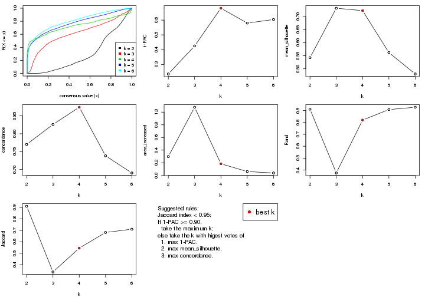

The numeric values for all these statistics can be obtained by `get_stats()`.

```r
get_stats(res)
```

```
#>   k 1-PAC mean_silhouette concordance area_increased  Rand Jaccard
#> 2 2 0.236           0.542       0.770         0.2980 0.911   0.911
#> 3 3 0.425           0.732       0.826         1.0768 0.375   0.337
#> 4 4 0.680           0.723       0.874         0.1843 0.820   0.545
#> 5 5 0.580           0.562       0.738         0.0625 0.908   0.682
#> 6 6 0.604           0.480       0.690         0.0399 0.927   0.711
```

`suggest_best_k()` suggests the best $k$ based on these statistics. The rules are as follows:

- All $k$ with Jaccard index larger than 0.95 are removed because the increase of
  the partition number does not provides enough extra information. If all $k$ are removed,
  the best $k$ is assigned by `NA`.
- For $k$ with 1-PAC larger than 0.9, the maximal $k$ is taken as the "best k". Other $k$ is called "optional k".
- If it does not fit the second rule. The $k$ with the highest vote of highest
  1-PAC, mean silhouette and concordance is taken as the "best k".

```r
suggest_best_k(res)
```

```
#> [1] 4
```


Following shows the table of the partitions (You need to click the **show/hide
code output** link to see it). The membership matrix (columns with name `p*`)
is inferred by
[`clue::cl_consensus()`](https://www.rdocumentation.org/link/cl_consensus?package=clue)
function with the `SE` method. Basically the value in the membership matrix
represents the probability to belong to a certain group. The finall class
label for an item is determined with the group with highest probability it
belongs to.

In `get_classes()` function, the entropy is calculated from the membership
matrix and the silhouette score is calculated from the consensus matrix.


<script>
$( function() {
	$( '#tabs-MAD-mclust-get-classes' ).tabs();
} );
</script>
<div id='tabs-MAD-mclust-get-classes'>
<ul>
<li><a href='#tab-MAD-mclust-get-classes-1'>k = 2</a></li>
<li><a href='#tab-MAD-mclust-get-classes-2'>k = 3</a></li>
<li><a href='#tab-MAD-mclust-get-classes-3'>k = 4</a></li>
<li><a href='#tab-MAD-mclust-get-classes-4'>k = 5</a></li>
<li><a href='#tab-MAD-mclust-get-classes-5'>k = 6</a></li>
</ul>

<div id='tab-MAD-mclust-get-classes-1'>
<p><a id='tab-MAD-mclust-get-classes-1-a' style='color:#0366d6' href='#'>show/hide code output</a></p>
<pre><code class="r">cbind(get_classes(res, k = 2), get_membership(res, k = 2))
</code></pre>

<pre><code>#&gt;          class entropy silhouette    p1    p2
#&gt; GSM11437     1  0.4939      0.708 0.892 0.108
#&gt; GSM11438     1  0.6247      0.650 0.844 0.156
#&gt; GSM11439     1  0.8016      0.711 0.756 0.244
#&gt; GSM11440     1  0.8207      0.706 0.744 0.256
#&gt; GSM11441     1  0.8267      0.709 0.740 0.260
#&gt; GSM11442     1  0.8763      0.692 0.704 0.296
#&gt; GSM11443     1  0.7453      0.232 0.788 0.212
#&gt; GSM11444     1  0.8207      0.709 0.744 0.256
#&gt; GSM11445     1  0.8386      0.702 0.732 0.268
#&gt; GSM11446     1  0.8813      0.692 0.700 0.300
#&gt; GSM11447     1  0.8144      0.709 0.748 0.252
#&gt; GSM11448     1  0.2778      0.680 0.952 0.048
#&gt; GSM11449     1  0.2423      0.675 0.960 0.040
#&gt; GSM11450     1  0.4161      0.651 0.916 0.084
#&gt; GSM11451     2  0.9881      0.953 0.436 0.564
#&gt; GSM11452     1  0.1414      0.644 0.980 0.020
#&gt; GSM11453     1  0.0672      0.654 0.992 0.008
#&gt; GSM11454     1  0.8955      0.682 0.688 0.312
#&gt; GSM11455     1  0.8443      0.702 0.728 0.272
#&gt; GSM11456     1  0.6973      0.515 0.812 0.188
#&gt; GSM11457     1  0.9988     -0.837 0.520 0.480
#&gt; GSM11458     1  0.9286      0.662 0.656 0.344
#&gt; GSM11459     1  0.9087      0.676 0.676 0.324
#&gt; GSM11460     1  0.9209      0.665 0.664 0.336
#&gt; GSM11461     1  0.6247      0.714 0.844 0.156
#&gt; GSM11462     1  0.9286      0.660 0.656 0.344
#&gt; GSM11463     1  0.6712      0.337 0.824 0.176
#&gt; GSM11464     1  0.5737      0.650 0.864 0.136
#&gt; GSM11465     1  0.2236      0.659 0.964 0.036
#&gt; GSM11466     1  0.7745      0.714 0.772 0.228
#&gt; GSM11467     1  0.5408      0.651 0.876 0.124
#&gt; GSM11468     1  0.8555      0.699 0.720 0.280
#&gt; GSM11469     1  0.9087      0.677 0.676 0.324
#&gt; GSM11470     1  0.5946      0.576 0.856 0.144
#&gt; GSM11471     1  0.5059      0.693 0.888 0.112
#&gt; GSM11472     1  0.7883      0.715 0.764 0.236
#&gt; GSM11473     1  0.6887      0.712 0.816 0.184
#&gt; GSM11474     1  0.9850     -0.693 0.572 0.428
#&gt; GSM11475     1  0.8207      0.705 0.744 0.256
#&gt; GSM11476     1  0.8499      0.700 0.724 0.276
#&gt; GSM11477     1  0.9993     -0.847 0.516 0.484
#&gt; GSM11478     1  0.9970     -0.802 0.532 0.468
#&gt; GSM11479     1  0.7376      0.711 0.792 0.208
#&gt; GSM11480     2  0.9954      0.950 0.460 0.540
#&gt; GSM11481     1  0.8386      0.703 0.732 0.268
#&gt; GSM11482     1  0.8443      0.702 0.728 0.272
#&gt; GSM11483     1  0.7376      0.701 0.792 0.208
#&gt; GSM11484     1  0.8499      0.699 0.724 0.276
#&gt; GSM11485     1  0.8386      0.704 0.732 0.268
#&gt; GSM11486     1  0.5629      0.676 0.868 0.132
#&gt; GSM11487     1  0.1414      0.659 0.980 0.020
#&gt; GSM11488     1  0.8555      0.698 0.720 0.280
#&gt; GSM11489     1  0.5408      0.696 0.876 0.124
#&gt; GSM11490     1  0.7883      0.712 0.764 0.236
#&gt; GSM11491     1  0.1184      0.656 0.984 0.016
#&gt; GSM11492     1  0.8499      0.698 0.724 0.276
#&gt; GSM11493     1  0.8499      0.700 0.724 0.276
#&gt; GSM11494     1  0.8555      0.698 0.720 0.280
#&gt; GSM11495     1  0.8081      0.707 0.752 0.248
#&gt; GSM11496     1  0.8081      0.708 0.752 0.248
#&gt; GSM11497     1  0.3733      0.585 0.928 0.072
#&gt; GSM11498     1  0.4690      0.537 0.900 0.100
#&gt; GSM11499     1  0.8267      0.706 0.740 0.260
#&gt; GSM11500     1  0.8555      0.699 0.720 0.280
#&gt; GSM11501     1  0.8499      0.700 0.724 0.276
#&gt; GSM11502     1  0.9993     -0.847 0.516 0.484
#&gt; GSM11503     1  0.8909     -0.275 0.692 0.308
#&gt; GSM11504     1  0.8763      0.692 0.704 0.296
#&gt; GSM11505     1  0.9775     -0.641 0.588 0.412
#&gt; GSM11506     1  0.9323     -0.416 0.652 0.348
#&gt; GSM11507     2  0.9896      0.954 0.440 0.560
#&gt; GSM11508     1  0.8813      0.689 0.700 0.300
#&gt; GSM11509     1  0.7883      0.712 0.764 0.236
#&gt; GSM11510     1  0.2948      0.654 0.948 0.052
#&gt; GSM11511     1  0.0938      0.663 0.988 0.012
#&gt; GSM11512     1  0.8443      0.701 0.728 0.272
#&gt; GSM11513     1  0.8813      0.690 0.700 0.300
#&gt; GSM11514     1  0.6623      0.710 0.828 0.172
#&gt; GSM11515     1  0.8443      0.700 0.728 0.272
#&gt; GSM11516     1  0.1633      0.645 0.976 0.024
#&gt; GSM11517     1  0.8608      0.697 0.716 0.284
#&gt; GSM11518     1  0.7674      0.713 0.776 0.224
#&gt; GSM11519     1  0.2043      0.654 0.968 0.032
#&gt; GSM11520     1  0.4022      0.640 0.920 0.080
#&gt; GSM11521     1  0.8555      0.698 0.720 0.280
#&gt; GSM11522     1  0.4939      0.688 0.892 0.108
#&gt; GSM11523     1  0.4815      0.623 0.896 0.104
#&gt; GSM11524     1  0.8955      0.687 0.688 0.312
#&gt; GSM11525     1  0.9000     -0.285 0.684 0.316
#&gt; GSM11526     1  0.8386      0.702 0.732 0.268
#&gt; GSM11527     1  0.7674      0.460 0.776 0.224
#&gt; GSM11528     1  0.9833     -0.701 0.576 0.424
#&gt; GSM11529     1  0.1414      0.644 0.980 0.020
#&gt; GSM11530     1  0.8016      0.713 0.756 0.244
#&gt; GSM11531     1  0.2236      0.630 0.964 0.036
#&gt; GSM11532     1  0.8443      0.703 0.728 0.272
#&gt; GSM11533     1  0.1414      0.644 0.980 0.020
#&gt; GSM11534     1  0.0938      0.650 0.988 0.012
#&gt; GSM11535     1  0.4431      0.552 0.908 0.092
#&gt; GSM11536     1  0.8443      0.701 0.728 0.272
#&gt; GSM11537     2  0.9993      0.911 0.484 0.516
#&gt; GSM11538     1  0.8081      0.709 0.752 0.248
#&gt; GSM11539     1  0.9775     -0.661 0.588 0.412
#&gt; GSM11540     1  0.9988     -0.837 0.520 0.480
#&gt; GSM11541     1  0.9000      0.682 0.684 0.316
#&gt; GSM11542     2  0.9983      0.934 0.476 0.524
#&gt; GSM11543     1  0.4022      0.691 0.920 0.080
#&gt; GSM11544     1  0.2423      0.654 0.960 0.040
#&gt; GSM11545     1  0.0938      0.655 0.988 0.012
#&gt; GSM11546     1  0.4431      0.623 0.908 0.092
#&gt; GSM11547     1  0.4690      0.693 0.900 0.100
#&gt; GSM11548     1  0.8386      0.702 0.732 0.268
#&gt; GSM11549     1  0.2423      0.665 0.960 0.040
#&gt; GSM11550     1  0.4690      0.685 0.900 0.100
#&gt; GSM11551     1  0.7139      0.717 0.804 0.196
#&gt; GSM11552     1  0.9286      0.661 0.656 0.344
#&gt; GSM11553     1  0.9732     -0.634 0.596 0.404
#&gt; GSM11554     2  0.9866      0.950 0.432 0.568
#&gt; GSM11555     1  0.7528      0.717 0.784 0.216
#&gt; GSM11556     1  0.9323      0.658 0.652 0.348
#&gt; GSM11557     1  0.9129     -0.362 0.672 0.328
#&gt; GSM11558     1  0.8813     -0.160 0.700 0.300
#&gt; GSM11559     1  0.9491     -0.523 0.632 0.368
#&gt; GSM11560     1  0.5737      0.648 0.864 0.136
#&gt; GSM11561     1  0.7453      0.265 0.788 0.212
#&gt; GSM11562     2  0.9977      0.936 0.472 0.528
#&gt; GSM11563     1  0.0938      0.653 0.988 0.012
#&gt; GSM11564     1  0.0376      0.654 0.996 0.004
#&gt; GSM11565     1  0.1633      0.656 0.976 0.024
#&gt; GSM11566     1  0.2236      0.654 0.964 0.036
#&gt; GSM11567     1  0.8267      0.705 0.740 0.260
#&gt; GSM11568     1  0.1414      0.648 0.980 0.020
#&gt; GSM11569     2  0.9866      0.950 0.432 0.568
#&gt; GSM11570     1  0.9248      0.665 0.660 0.340
#&gt; GSM11571     1  0.2043      0.654 0.968 0.032
#&gt; GSM11572     1  0.1633      0.643 0.976 0.024
#&gt; GSM11573     1  0.0938      0.653 0.988 0.012
#&gt; GSM11574     1  0.7139      0.276 0.804 0.196
#&gt; GSM11575     1  0.0672      0.654 0.992 0.008
#&gt; GSM11576     1  0.6048      0.571 0.852 0.148
#&gt; GSM11577     1  0.0938      0.653 0.988 0.012
#&gt; GSM11578     1  0.1414      0.648 0.980 0.020
#&gt; GSM11579     1  0.8386      0.703 0.732 0.268
#&gt; GSM11580     1  0.0938      0.653 0.988 0.012
#&gt; GSM11581     1  0.8661      0.695 0.712 0.288
#&gt; GSM11582     1  0.9286      0.662 0.656 0.344
#&gt; GSM11583     1  0.8608      0.700 0.716 0.284
#&gt; GSM11584     1  0.8499      0.698 0.724 0.276
#&gt; GSM11585     1  0.9795     -0.675 0.584 0.416
#&gt; GSM11586     1  0.4298      0.634 0.912 0.088
#&gt; GSM11587     1  0.6048      0.571 0.852 0.148
#&gt; GSM11588     1  0.0938      0.653 0.988 0.012
#&gt; GSM11589     1  0.1843      0.664 0.972 0.028
#&gt; GSM11590     1  0.4298      0.634 0.912 0.088
#&gt; GSM11591     1  0.8955     -0.291 0.688 0.312
#&gt; GSM11592     1  0.5059      0.693 0.888 0.112
#&gt; GSM11593     1  0.4431      0.629 0.908 0.092
#&gt; GSM11594     1  0.4562      0.630 0.904 0.096
#&gt; GSM11595     1  0.2948      0.685 0.948 0.052
#&gt; GSM11596     1  0.0376      0.654 0.996 0.004
#&gt; GSM11597     1  0.8267      0.709 0.740 0.260
#&gt; GSM11598     1  0.3879      0.641 0.924 0.076
#&gt; GSM11599     1  0.9044      0.680 0.680 0.320
#&gt; GSM11600     1  0.8813      0.692 0.700 0.300
#&gt; GSM11601     1  0.6712      0.712 0.824 0.176
#&gt; GSM11602     1  0.4690      0.634 0.900 0.100
#&gt; GSM11603     1  0.6048      0.571 0.852 0.148
#&gt; GSM11604     1  0.9323      0.658 0.652 0.348
#&gt; GSM11605     1  0.9000      0.682 0.684 0.316
#&gt; GSM11606     1  0.5946      0.439 0.856 0.144
#&gt; GSM11607     1  0.4562      0.630 0.904 0.096
#&gt; GSM11608     1  0.9286      0.660 0.656 0.344
#&gt; GSM11609     1  0.8207      0.706 0.744 0.256
</code></pre>

<script>
$('#tab-MAD-mclust-get-classes-1-a').parent().next().next().hide();
$('#tab-MAD-mclust-get-classes-1-a').click(function(){
  $('#tab-MAD-mclust-get-classes-1-a').parent().next().next().toggle();
  return(false);
});
</script>
</div>

<div id='tab-MAD-mclust-get-classes-2'>
<p><a id='tab-MAD-mclust-get-classes-2-a' style='color:#0366d6' href='#'>show/hide code output</a></p>
<pre><code class="r">cbind(get_classes(res, k = 3), get_membership(res, k = 3))
</code></pre>

<pre><code>#&gt;          class entropy silhouette    p1    p2    p3
#&gt; GSM11437     3  0.6046     0.7681 0.080 0.136 0.784
#&gt; GSM11438     2  0.5053     0.7965 0.024 0.812 0.164
#&gt; GSM11439     3  0.5069     0.7688 0.044 0.128 0.828
#&gt; GSM11440     3  0.2297     0.8439 0.020 0.036 0.944
#&gt; GSM11441     3  0.2492     0.8384 0.048 0.016 0.936
#&gt; GSM11442     3  0.1411     0.8391 0.036 0.000 0.964
#&gt; GSM11443     2  0.4146     0.8213 0.044 0.876 0.080
#&gt; GSM11444     3  0.1989     0.8395 0.048 0.004 0.948
#&gt; GSM11445     3  0.0592     0.8419 0.012 0.000 0.988
#&gt; GSM11446     3  0.1529     0.8382 0.040 0.000 0.960
#&gt; GSM11447     3  0.2918     0.8307 0.044 0.032 0.924
#&gt; GSM11448     2  0.4233     0.7955 0.004 0.836 0.160
#&gt; GSM11449     1  0.6576     0.7305 0.740 0.068 0.192
#&gt; GSM11450     1  0.3780     0.8450 0.892 0.044 0.064
#&gt; GSM11451     2  0.0424     0.8193 0.008 0.992 0.000
#&gt; GSM11452     2  0.6770     0.5671 0.264 0.692 0.044
#&gt; GSM11453     1  0.7968     0.4010 0.560 0.372 0.068
#&gt; GSM11454     3  0.1643     0.8381 0.044 0.000 0.956
#&gt; GSM11455     3  0.6235     0.1247 0.000 0.436 0.564
#&gt; GSM11456     2  0.3826     0.8162 0.008 0.868 0.124
#&gt; GSM11457     2  0.1267     0.8373 0.004 0.972 0.024
#&gt; GSM11458     3  0.5216     0.7206 0.260 0.000 0.740
#&gt; GSM11459     3  0.1163     0.8432 0.028 0.000 0.972
#&gt; GSM11460     3  0.6026     0.4617 0.376 0.000 0.624
#&gt; GSM11461     3  0.8243     0.2406 0.420 0.076 0.504
#&gt; GSM11462     3  0.6280     0.2261 0.460 0.000 0.540
#&gt; GSM11463     2  0.2339     0.8418 0.012 0.940 0.048
#&gt; GSM11464     1  0.3472     0.8444 0.904 0.040 0.056
#&gt; GSM11465     2  0.4172     0.7994 0.004 0.840 0.156
#&gt; GSM11466     3  0.2443     0.8462 0.032 0.028 0.940
#&gt; GSM11467     1  0.3967     0.8396 0.884 0.044 0.072
#&gt; GSM11468     3  0.1765     0.8422 0.040 0.004 0.956
#&gt; GSM11469     3  0.4452     0.7494 0.192 0.000 0.808
#&gt; GSM11470     1  0.3375     0.8465 0.908 0.044 0.048
#&gt; GSM11471     1  0.6283     0.7471 0.760 0.064 0.176
#&gt; GSM11472     3  0.2200     0.8415 0.056 0.004 0.940
#&gt; GSM11473     2  0.6247     0.7519 0.044 0.744 0.212
#&gt; GSM11474     2  0.1751     0.8393 0.012 0.960 0.028
#&gt; GSM11475     3  0.1491     0.8451 0.016 0.016 0.968
#&gt; GSM11476     3  0.3850     0.8181 0.028 0.088 0.884
#&gt; GSM11477     2  0.1163     0.8389 0.000 0.972 0.028
#&gt; GSM11478     2  0.1529     0.8408 0.000 0.960 0.040
#&gt; GSM11479     2  0.7368     0.5139 0.044 0.604 0.352
#&gt; GSM11480     2  0.0424     0.8193 0.008 0.992 0.000
#&gt; GSM11481     3  0.2550     0.8425 0.040 0.024 0.936
#&gt; GSM11482     3  0.4700     0.7521 0.008 0.180 0.812
#&gt; GSM11483     2  0.6633     0.6794 0.040 0.700 0.260
#&gt; GSM11484     3  0.2569     0.8364 0.032 0.032 0.936
#&gt; GSM11485     3  0.6713     0.1955 0.012 0.416 0.572
#&gt; GSM11486     2  0.5202     0.8042 0.044 0.820 0.136
#&gt; GSM11487     1  0.6936     0.7595 0.732 0.108 0.160
#&gt; GSM11488     3  0.2050     0.8349 0.028 0.020 0.952
#&gt; GSM11489     2  0.4351     0.7885 0.004 0.828 0.168
#&gt; GSM11490     3  0.3683     0.8200 0.044 0.060 0.896
#&gt; GSM11491     1  0.4339     0.8335 0.868 0.084 0.048
#&gt; GSM11492     3  0.0829     0.8438 0.012 0.004 0.984
#&gt; GSM11493     3  0.2806     0.8367 0.032 0.040 0.928
#&gt; GSM11494     3  0.1529     0.8382 0.040 0.000 0.960
#&gt; GSM11495     3  0.3933     0.8159 0.028 0.092 0.880
#&gt; GSM11496     2  0.7668     0.2352 0.044 0.496 0.460
#&gt; GSM11497     2  0.3692     0.8352 0.056 0.896 0.048
#&gt; GSM11498     2  0.3715     0.8158 0.004 0.868 0.128
#&gt; GSM11499     3  0.6357     0.4593 0.012 0.336 0.652
#&gt; GSM11500     3  0.6188     0.6490 0.040 0.216 0.744
#&gt; GSM11501     3  0.6441     0.5936 0.028 0.276 0.696
#&gt; GSM11502     2  0.1031     0.8372 0.000 0.976 0.024
#&gt; GSM11503     2  0.1643     0.8405 0.000 0.956 0.044
#&gt; GSM11504     3  0.0983     0.8439 0.016 0.004 0.980
#&gt; GSM11505     2  0.2569     0.8360 0.032 0.936 0.032
#&gt; GSM11506     2  0.3237     0.8359 0.032 0.912 0.056
#&gt; GSM11507     2  0.0424     0.8193 0.008 0.992 0.000
#&gt; GSM11508     3  0.0237     0.8416 0.004 0.000 0.996
#&gt; GSM11509     3  0.2793     0.8317 0.044 0.028 0.928
#&gt; GSM11510     2  0.3038     0.8306 0.000 0.896 0.104
#&gt; GSM11511     1  0.7810     0.5948 0.640 0.268 0.092
#&gt; GSM11512     3  0.2313     0.8417 0.032 0.024 0.944
#&gt; GSM11513     3  0.1753     0.8393 0.048 0.000 0.952
#&gt; GSM11514     2  0.6282     0.4656 0.004 0.612 0.384
#&gt; GSM11515     3  0.1031     0.8409 0.024 0.000 0.976
#&gt; GSM11516     2  0.7674    -0.1149 0.476 0.480 0.044
#&gt; GSM11517     3  0.1765     0.8414 0.040 0.004 0.956
#&gt; GSM11518     3  0.5403     0.7797 0.060 0.124 0.816
#&gt; GSM11519     1  0.3791     0.8455 0.892 0.060 0.048
#&gt; GSM11520     1  0.3484     0.8463 0.904 0.048 0.048
#&gt; GSM11521     3  0.3213     0.8320 0.028 0.060 0.912
#&gt; GSM11522     1  0.6354     0.7269 0.748 0.056 0.196
#&gt; GSM11523     1  0.3039     0.8407 0.920 0.036 0.044
#&gt; GSM11524     3  0.2200     0.8385 0.056 0.004 0.940
#&gt; GSM11525     2  0.1877     0.8404 0.012 0.956 0.032
#&gt; GSM11526     3  0.1585     0.8461 0.028 0.008 0.964
#&gt; GSM11527     2  0.4676     0.8105 0.040 0.848 0.112
#&gt; GSM11528     2  0.1529     0.8416 0.000 0.960 0.040
#&gt; GSM11529     2  0.5036     0.7759 0.120 0.832 0.048
#&gt; GSM11530     3  0.6527     0.7012 0.188 0.068 0.744
#&gt; GSM11531     2  0.1877     0.8402 0.012 0.956 0.032
#&gt; GSM11532     3  0.2845     0.8334 0.068 0.012 0.920
#&gt; GSM11533     2  0.4786     0.7847 0.112 0.844 0.044
#&gt; GSM11534     2  0.7525     0.6237 0.208 0.684 0.108
#&gt; GSM11535     2  0.3377     0.8318 0.012 0.896 0.092
#&gt; GSM11536     3  0.4634     0.7675 0.012 0.164 0.824
#&gt; GSM11537     2  0.0592     0.8204 0.012 0.988 0.000
#&gt; GSM11538     3  0.8322     0.5083 0.124 0.268 0.608
#&gt; GSM11539     2  0.1315     0.8349 0.008 0.972 0.020
#&gt; GSM11540     2  0.1163     0.8387 0.000 0.972 0.028
#&gt; GSM11541     3  0.5201     0.7029 0.236 0.004 0.760
#&gt; GSM11542     2  0.0848     0.8264 0.008 0.984 0.008
#&gt; GSM11543     2  0.6713     0.3630 0.012 0.572 0.416
#&gt; GSM11544     1  0.3692     0.8462 0.896 0.056 0.048
#&gt; GSM11545     1  0.8957     0.3357 0.492 0.376 0.132
#&gt; GSM11546     2  0.6361     0.7239 0.040 0.728 0.232
#&gt; GSM11547     2  0.5826     0.7662 0.032 0.764 0.204
#&gt; GSM11548     3  0.1529     0.8382 0.040 0.000 0.960
#&gt; GSM11549     1  0.6523     0.6929 0.724 0.048 0.228
#&gt; GSM11550     1  0.6506     0.6740 0.720 0.044 0.236
#&gt; GSM11551     3  0.3669     0.8356 0.064 0.040 0.896
#&gt; GSM11552     3  0.4062     0.7766 0.164 0.000 0.836
#&gt; GSM11553     2  0.1289     0.8398 0.000 0.968 0.032
#&gt; GSM11554     2  0.0424     0.8193 0.008 0.992 0.000
#&gt; GSM11555     3  0.7252     0.6534 0.196 0.100 0.704
#&gt; GSM11556     3  0.5835     0.5431 0.340 0.000 0.660
#&gt; GSM11557     2  0.1877     0.8402 0.012 0.956 0.032
#&gt; GSM11558     2  0.1015     0.8281 0.008 0.980 0.012
#&gt; GSM11559     2  0.1289     0.8398 0.000 0.968 0.032
#&gt; GSM11560     1  0.4058     0.8380 0.880 0.044 0.076
#&gt; GSM11561     2  0.1453     0.8348 0.008 0.968 0.024
#&gt; GSM11562     2  0.0592     0.8296 0.000 0.988 0.012
#&gt; GSM11563     1  0.9174     0.4060 0.504 0.332 0.164
#&gt; GSM11564     2  0.8010     0.3262 0.068 0.548 0.384
#&gt; GSM11565     1  0.4075     0.8412 0.880 0.072 0.048
#&gt; GSM11566     2  0.3412     0.8217 0.000 0.876 0.124
#&gt; GSM11567     3  0.2651     0.8381 0.012 0.060 0.928
#&gt; GSM11568     1  0.7901     0.1976 0.504 0.440 0.056
#&gt; GSM11569     2  0.0424     0.8193 0.008 0.992 0.000
#&gt; GSM11570     3  0.4796     0.7227 0.220 0.000 0.780
#&gt; GSM11571     1  0.3692     0.8468 0.896 0.056 0.048
#&gt; GSM11572     2  0.4047     0.8031 0.004 0.848 0.148
#&gt; GSM11573     1  0.7653     0.6134 0.644 0.276 0.080
#&gt; GSM11574     2  0.1647     0.8405 0.004 0.960 0.036
#&gt; GSM11575     2  0.7875     0.6002 0.200 0.664 0.136
#&gt; GSM11576     1  0.3267     0.8445 0.912 0.044 0.044
#&gt; GSM11577     1  0.7962     0.2430 0.512 0.428 0.060
#&gt; GSM11578     2  0.7671     0.1696 0.408 0.544 0.048
#&gt; GSM11579     3  0.3349     0.8140 0.004 0.108 0.888
#&gt; GSM11580     2  0.6950     0.5927 0.252 0.692 0.056
#&gt; GSM11581     3  0.1399     0.8439 0.028 0.004 0.968
#&gt; GSM11582     3  0.5465     0.6295 0.288 0.000 0.712
#&gt; GSM11583     3  0.3918     0.8161 0.140 0.004 0.856
#&gt; GSM11584     3  0.1919     0.8441 0.020 0.024 0.956
#&gt; GSM11585     2  0.1525     0.8401 0.004 0.964 0.032
#&gt; GSM11586     1  0.3589     0.8473 0.900 0.048 0.052
#&gt; GSM11587     1  0.3267     0.8445 0.912 0.044 0.044
#&gt; GSM11588     1  0.7588     0.5430 0.624 0.312 0.064
#&gt; GSM11589     2  0.9319     0.1270 0.340 0.484 0.176
#&gt; GSM11590     1  0.3484     0.8474 0.904 0.048 0.048
#&gt; GSM11591     2  0.1647     0.8406 0.004 0.960 0.036
#&gt; GSM11592     1  0.5905     0.7510 0.772 0.044 0.184
#&gt; GSM11593     1  0.3375     0.8465 0.908 0.044 0.048
#&gt; GSM11594     1  0.3375     0.8465 0.908 0.044 0.048
#&gt; GSM11595     2  0.8828     0.4640 0.192 0.580 0.228
#&gt; GSM11596     2  0.4551     0.8040 0.020 0.840 0.140
#&gt; GSM11597     3  0.4249     0.8318 0.108 0.028 0.864
#&gt; GSM11598     1  0.3375     0.8451 0.908 0.044 0.048
#&gt; GSM11599     3  0.1878     0.8412 0.044 0.004 0.952
#&gt; GSM11600     3  0.4883     0.7336 0.208 0.004 0.788
#&gt; GSM11601     2  0.4409     0.7868 0.004 0.824 0.172
#&gt; GSM11602     1  0.3375     0.8465 0.908 0.044 0.048
#&gt; GSM11603     1  0.3267     0.8445 0.912 0.044 0.044
#&gt; GSM11604     3  0.5905     0.5141 0.352 0.000 0.648
#&gt; GSM11605     3  0.4521     0.7641 0.180 0.004 0.816
#&gt; GSM11606     2  0.1832     0.8402 0.008 0.956 0.036
#&gt; GSM11607     1  0.3481     0.8467 0.904 0.044 0.052
#&gt; GSM11608     1  0.6955    -0.0858 0.496 0.016 0.488
#&gt; GSM11609     3  0.3722     0.8237 0.024 0.088 0.888
</code></pre>

<script>
$('#tab-MAD-mclust-get-classes-2-a').parent().next().next().hide();
$('#tab-MAD-mclust-get-classes-2-a').click(function(){
  $('#tab-MAD-mclust-get-classes-2-a').parent().next().next().toggle();
  return(false);
});
</script>
</div>

<div id='tab-MAD-mclust-get-classes-3'>
<p><a id='tab-MAD-mclust-get-classes-3-a' style='color:#0366d6' href='#'>show/hide code output</a></p>
<pre><code class="r">cbind(get_classes(res, k = 4), get_membership(res, k = 4))
</code></pre>

<pre><code>#&gt;          class entropy silhouette    p1    p2    p3    p4
#&gt; GSM11437     3  0.9669     0.3325 0.204 0.184 0.384 0.228
#&gt; GSM11438     2  0.0524     0.9118 0.000 0.988 0.008 0.004
#&gt; GSM11439     3  0.0657     0.7877 0.004 0.012 0.984 0.000
#&gt; GSM11440     4  0.3356     0.7466 0.000 0.000 0.176 0.824
#&gt; GSM11441     3  0.1042     0.7859 0.008 0.000 0.972 0.020
#&gt; GSM11442     3  0.2530     0.7571 0.000 0.000 0.888 0.112
#&gt; GSM11443     2  0.3569     0.7103 0.000 0.804 0.196 0.000
#&gt; GSM11444     3  0.0592     0.7881 0.000 0.000 0.984 0.016
#&gt; GSM11445     3  0.4522     0.5058 0.000 0.000 0.680 0.320
#&gt; GSM11446     3  0.0469     0.7884 0.000 0.000 0.988 0.012
#&gt; GSM11447     3  0.0376     0.7880 0.004 0.004 0.992 0.000
#&gt; GSM11448     2  0.3636     0.7681 0.008 0.820 0.172 0.000
#&gt; GSM11449     1  0.0804     0.8056 0.980 0.000 0.008 0.012
#&gt; GSM11450     1  0.0188     0.8085 0.996 0.000 0.004 0.000
#&gt; GSM11451     2  0.0000     0.9161 0.000 1.000 0.000 0.000
#&gt; GSM11452     2  0.4431     0.5429 0.304 0.696 0.000 0.000
#&gt; GSM11453     1  0.2868     0.7282 0.864 0.136 0.000 0.000
#&gt; GSM11454     3  0.3486     0.7013 0.000 0.000 0.812 0.188
#&gt; GSM11455     2  0.4795     0.5470 0.000 0.696 0.012 0.292
#&gt; GSM11456     2  0.2197     0.8611 0.004 0.916 0.080 0.000
#&gt; GSM11457     2  0.0000     0.9161 0.000 1.000 0.000 0.000
#&gt; GSM11458     3  0.6722     0.5042 0.200 0.000 0.616 0.184
#&gt; GSM11459     3  0.4819     0.4632 0.004 0.000 0.652 0.344
#&gt; GSM11460     1  0.4804     0.3531 0.616 0.000 0.000 0.384
#&gt; GSM11461     1  0.6988     0.4116 0.604 0.016 0.268 0.112
#&gt; GSM11462     1  0.5106     0.5612 0.720 0.000 0.040 0.240
#&gt; GSM11463     2  0.0469     0.9107 0.000 0.988 0.012 0.000
#&gt; GSM11464     1  0.0188     0.8091 0.996 0.000 0.000 0.004
#&gt; GSM11465     2  0.2760     0.8208 0.000 0.872 0.128 0.000
#&gt; GSM11466     4  0.5592     0.6050 0.056 0.000 0.264 0.680
#&gt; GSM11467     1  0.0469     0.8079 0.988 0.000 0.000 0.012
#&gt; GSM11468     4  0.3074     0.7592 0.000 0.000 0.152 0.848
#&gt; GSM11469     1  0.7284    -0.1380 0.428 0.000 0.148 0.424
#&gt; GSM11470     1  0.0188     0.8105 0.996 0.004 0.000 0.000
#&gt; GSM11471     1  0.3306     0.7128 0.840 0.004 0.156 0.000
#&gt; GSM11472     4  0.2179     0.8089 0.064 0.000 0.012 0.924
#&gt; GSM11473     3  0.3626     0.6727 0.004 0.184 0.812 0.000
#&gt; GSM11474     2  0.0000     0.9161 0.000 1.000 0.000 0.000
#&gt; GSM11475     4  0.3024     0.7683 0.000 0.000 0.148 0.852
#&gt; GSM11476     4  0.1938     0.8074 0.000 0.052 0.012 0.936
#&gt; GSM11477     2  0.0000     0.9161 0.000 1.000 0.000 0.000
#&gt; GSM11478     2  0.0000     0.9161 0.000 1.000 0.000 0.000
#&gt; GSM11479     3  0.5163     0.0365 0.004 0.480 0.516 0.000
#&gt; GSM11480     2  0.0000     0.9161 0.000 1.000 0.000 0.000
#&gt; GSM11481     4  0.0000     0.8315 0.000 0.000 0.000 1.000
#&gt; GSM11482     4  0.1406     0.8255 0.000 0.024 0.016 0.960
#&gt; GSM11483     2  0.3583     0.7317 0.004 0.816 0.180 0.000
#&gt; GSM11484     4  0.0000     0.8315 0.000 0.000 0.000 1.000
#&gt; GSM11485     4  0.5268     0.3370 0.000 0.396 0.012 0.592
#&gt; GSM11486     2  0.3257     0.7687 0.004 0.844 0.152 0.000
#&gt; GSM11487     1  0.0188     0.8105 0.996 0.004 0.000 0.000
#&gt; GSM11488     4  0.0000     0.8315 0.000 0.000 0.000 1.000
#&gt; GSM11489     2  0.0779     0.9068 0.004 0.980 0.016 0.000
#&gt; GSM11490     3  0.0524     0.7883 0.004 0.008 0.988 0.000
#&gt; GSM11491     1  0.0188     0.8105 0.996 0.004 0.000 0.000
#&gt; GSM11492     4  0.0921     0.8293 0.000 0.000 0.028 0.972
#&gt; GSM11493     4  0.0657     0.8309 0.000 0.004 0.012 0.984
#&gt; GSM11494     3  0.2868     0.7399 0.000 0.000 0.864 0.136
#&gt; GSM11495     3  0.3551     0.7385 0.004 0.028 0.860 0.108
#&gt; GSM11496     3  0.1109     0.7827 0.004 0.028 0.968 0.000
#&gt; GSM11497     2  0.0188     0.9146 0.000 0.996 0.004 0.000
#&gt; GSM11498     2  0.0188     0.9147 0.000 0.996 0.004 0.000
#&gt; GSM11499     4  0.4718     0.5165 0.000 0.280 0.012 0.708
#&gt; GSM11500     3  0.4804     0.6001 0.000 0.276 0.708 0.016
#&gt; GSM11501     4  0.2255     0.7945 0.000 0.068 0.012 0.920
#&gt; GSM11502     2  0.0000     0.9161 0.000 1.000 0.000 0.000
#&gt; GSM11503     2  0.0000     0.9161 0.000 1.000 0.000 0.000
#&gt; GSM11504     4  0.0469     0.8314 0.000 0.000 0.012 0.988
#&gt; GSM11505     2  0.0469     0.9107 0.000 0.988 0.012 0.000
#&gt; GSM11506     2  0.1389     0.8835 0.000 0.952 0.048 0.000
#&gt; GSM11507     2  0.0000     0.9161 0.000 1.000 0.000 0.000
#&gt; GSM11508     4  0.3569     0.7182 0.000 0.000 0.196 0.804
#&gt; GSM11509     3  0.0376     0.7880 0.004 0.004 0.992 0.000
#&gt; GSM11510     2  0.0469     0.9106 0.000 0.988 0.012 0.000
#&gt; GSM11511     1  0.4937     0.6559 0.764 0.064 0.172 0.000
#&gt; GSM11512     4  0.0000     0.8315 0.000 0.000 0.000 1.000
#&gt; GSM11513     3  0.3311     0.7135 0.000 0.000 0.828 0.172
#&gt; GSM11514     4  0.3380     0.7306 0.004 0.136 0.008 0.852
#&gt; GSM11515     3  0.3688     0.6778 0.000 0.000 0.792 0.208
#&gt; GSM11516     1  0.4992     0.0992 0.524 0.476 0.000 0.000
#&gt; GSM11517     4  0.5820     0.6396 0.108 0.000 0.192 0.700
#&gt; GSM11518     3  0.0524     0.7883 0.004 0.008 0.988 0.000
#&gt; GSM11519     1  0.0188     0.8105 0.996 0.004 0.000 0.000
#&gt; GSM11520     1  0.0188     0.8105 0.996 0.004 0.000 0.000
#&gt; GSM11521     4  0.0779     0.8284 0.000 0.016 0.004 0.980
#&gt; GSM11522     1  0.1520     0.7945 0.956 0.000 0.020 0.024
#&gt; GSM11523     1  0.0000     0.8092 1.000 0.000 0.000 0.000
#&gt; GSM11524     4  0.2081     0.8050 0.000 0.000 0.084 0.916
#&gt; GSM11525     2  0.0000     0.9161 0.000 1.000 0.000 0.000
#&gt; GSM11526     4  0.4477     0.4894 0.000 0.000 0.312 0.688
#&gt; GSM11527     2  0.0921     0.8998 0.000 0.972 0.028 0.000
#&gt; GSM11528     2  0.0000     0.9161 0.000 1.000 0.000 0.000
#&gt; GSM11529     2  0.2345     0.8354 0.100 0.900 0.000 0.000
#&gt; GSM11530     1  0.6854     0.3900 0.596 0.000 0.172 0.232
#&gt; GSM11531     2  0.0000     0.9161 0.000 1.000 0.000 0.000
#&gt; GSM11532     4  0.6133     0.6175 0.188 0.000 0.136 0.676
#&gt; GSM11533     2  0.1022     0.8961 0.032 0.968 0.000 0.000
#&gt; GSM11534     2  0.4999     0.4870 0.328 0.660 0.012 0.000
#&gt; GSM11535     2  0.0000     0.9161 0.000 1.000 0.000 0.000
#&gt; GSM11536     4  0.0000     0.8315 0.000 0.000 0.000 1.000
#&gt; GSM11537     2  0.0000     0.9161 0.000 1.000 0.000 0.000
#&gt; GSM11538     4  0.0000     0.8315 0.000 0.000 0.000 1.000
#&gt; GSM11539     2  0.0000     0.9161 0.000 1.000 0.000 0.000
#&gt; GSM11540     2  0.0000     0.9161 0.000 1.000 0.000 0.000
#&gt; GSM11541     4  0.0707     0.8263 0.020 0.000 0.000 0.980
#&gt; GSM11542     2  0.0000     0.9161 0.000 1.000 0.000 0.000
#&gt; GSM11543     2  0.5196     0.7139 0.008 0.764 0.160 0.068
#&gt; GSM11544     1  0.0188     0.8105 0.996 0.004 0.000 0.000
#&gt; GSM11545     1  0.3355     0.7117 0.836 0.160 0.000 0.004
#&gt; GSM11546     2  0.4991     0.2704 0.004 0.608 0.388 0.000
#&gt; GSM11547     3  0.5112     0.2603 0.004 0.436 0.560 0.000
#&gt; GSM11548     3  0.3074     0.7282 0.000 0.000 0.848 0.152
#&gt; GSM11549     1  0.0469     0.8062 0.988 0.000 0.012 0.000
#&gt; GSM11550     1  0.1389     0.7912 0.952 0.000 0.048 0.000
#&gt; GSM11551     3  0.1339     0.7865 0.024 0.008 0.964 0.004
#&gt; GSM11552     4  0.6355     0.3972 0.348 0.000 0.076 0.576
#&gt; GSM11553     2  0.0000     0.9161 0.000 1.000 0.000 0.000
#&gt; GSM11554     2  0.0000     0.9161 0.000 1.000 0.000 0.000
#&gt; GSM11555     4  0.0921     0.8255 0.028 0.000 0.000 0.972
#&gt; GSM11556     1  0.4917     0.4319 0.656 0.000 0.008 0.336
#&gt; GSM11557     2  0.0000     0.9161 0.000 1.000 0.000 0.000
#&gt; GSM11558     2  0.0188     0.9144 0.000 0.996 0.004 0.000
#&gt; GSM11559     2  0.0000     0.9161 0.000 1.000 0.000 0.000
#&gt; GSM11560     1  0.0469     0.8079 0.988 0.000 0.000 0.012
#&gt; GSM11561     2  0.0188     0.9144 0.000 0.996 0.004 0.000
#&gt; GSM11562     2  0.0000     0.9161 0.000 1.000 0.000 0.000
#&gt; GSM11563     1  0.3937     0.6753 0.800 0.188 0.012 0.000
#&gt; GSM11564     1  0.6754     0.1310 0.464 0.444 0.000 0.092
#&gt; GSM11565     1  0.0188     0.8094 0.996 0.004 0.000 0.000
#&gt; GSM11566     2  0.0657     0.9087 0.000 0.984 0.012 0.004
#&gt; GSM11567     4  0.0188     0.8310 0.000 0.000 0.004 0.996
#&gt; GSM11568     1  0.4907     0.2737 0.580 0.420 0.000 0.000
#&gt; GSM11569     2  0.0000     0.9161 0.000 1.000 0.000 0.000
#&gt; GSM11570     4  0.5311     0.4700 0.328 0.000 0.024 0.648
#&gt; GSM11571     1  0.0188     0.8105 0.996 0.004 0.000 0.000
#&gt; GSM11572     2  0.0672     0.9088 0.008 0.984 0.000 0.008
#&gt; GSM11573     1  0.3249     0.7254 0.852 0.140 0.000 0.008
#&gt; GSM11574     2  0.0000     0.9161 0.000 1.000 0.000 0.000
#&gt; GSM11575     1  0.4472     0.6477 0.760 0.220 0.020 0.000
#&gt; GSM11576     1  0.0188     0.8105 0.996 0.004 0.000 0.000
#&gt; GSM11577     1  0.4877     0.3004 0.592 0.408 0.000 0.000
#&gt; GSM11578     1  0.4989     0.1128 0.528 0.472 0.000 0.000
#&gt; GSM11579     4  0.2255     0.7960 0.000 0.068 0.012 0.920
#&gt; GSM11580     2  0.4661     0.4310 0.348 0.652 0.000 0.000
#&gt; GSM11581     4  0.2814     0.7749 0.000 0.000 0.132 0.868
#&gt; GSM11582     4  0.3688     0.6717 0.208 0.000 0.000 0.792
#&gt; GSM11583     1  0.7914    -0.1261 0.356 0.000 0.312 0.332
#&gt; GSM11584     4  0.0592     0.8308 0.000 0.000 0.016 0.984
#&gt; GSM11585     2  0.0000     0.9161 0.000 1.000 0.000 0.000
#&gt; GSM11586     1  0.0188     0.8105 0.996 0.004 0.000 0.000
#&gt; GSM11587     1  0.0000     0.8092 1.000 0.000 0.000 0.000
#&gt; GSM11588     1  0.4222     0.5832 0.728 0.272 0.000 0.000
#&gt; GSM11589     4  0.7747    -0.0788 0.384 0.232 0.000 0.384
#&gt; GSM11590     1  0.0188     0.8105 0.996 0.004 0.000 0.000
#&gt; GSM11591     2  0.0000     0.9161 0.000 1.000 0.000 0.000
#&gt; GSM11592     1  0.1474     0.7890 0.948 0.000 0.052 0.000
#&gt; GSM11593     1  0.0188     0.8105 0.996 0.004 0.000 0.000
#&gt; GSM11594     1  0.0188     0.8105 0.996 0.004 0.000 0.000
#&gt; GSM11595     2  0.7638    -0.0536 0.372 0.420 0.208 0.000
#&gt; GSM11596     2  0.0188     0.9147 0.000 0.996 0.004 0.000
#&gt; GSM11597     3  0.3105     0.7066 0.140 0.004 0.856 0.000
#&gt; GSM11598     1  0.0188     0.8105 0.996 0.004 0.000 0.000
#&gt; GSM11599     4  0.3123     0.7559 0.000 0.000 0.156 0.844
#&gt; GSM11600     4  0.2589     0.7656 0.116 0.000 0.000 0.884
#&gt; GSM11601     2  0.4819     0.4984 0.004 0.652 0.344 0.000
#&gt; GSM11602     1  0.0000     0.8092 1.000 0.000 0.000 0.000
#&gt; GSM11603     1  0.0188     0.8105 0.996 0.004 0.000 0.000
#&gt; GSM11604     1  0.6310     0.4996 0.660 0.000 0.188 0.152
#&gt; GSM11605     4  0.0000     0.8315 0.000 0.000 0.000 1.000
#&gt; GSM11606     2  0.0000     0.9161 0.000 1.000 0.000 0.000
#&gt; GSM11607     1  0.0188     0.8105 0.996 0.004 0.000 0.000
#&gt; GSM11608     1  0.4630     0.5709 0.732 0.000 0.016 0.252
#&gt; GSM11609     4  0.0000     0.8315 0.000 0.000 0.000 1.000
</code></pre>

<script>
$('#tab-MAD-mclust-get-classes-3-a').parent().next().next().hide();
$('#tab-MAD-mclust-get-classes-3-a').click(function(){
  $('#tab-MAD-mclust-get-classes-3-a').parent().next().next().toggle();
  return(false);
});
</script>
</div>

<div id='tab-MAD-mclust-get-classes-4'>
<p><a id='tab-MAD-mclust-get-classes-4-a' style='color:#0366d6' href='#'>show/hide code output</a></p>
<pre><code class="r">cbind(get_classes(res, k = 5), get_membership(res, k = 5))
</code></pre>

<pre><code>#&gt;          class entropy silhouette    p1    p2    p3    p4    p5
#&gt; GSM11437     5  0.9170     0.0944 0.296 0.120 0.060 0.212 0.312
#&gt; GSM11438     2  0.5905     0.6730 0.000 0.680 0.072 0.076 0.172
#&gt; GSM11439     5  0.0324     0.6564 0.000 0.004 0.004 0.000 0.992
#&gt; GSM11440     4  0.6155    -0.1819 0.044 0.000 0.388 0.520 0.048
#&gt; GSM11441     5  0.5198     0.6175 0.012 0.000 0.164 0.112 0.712
#&gt; GSM11442     5  0.6249     0.5245 0.000 0.008 0.236 0.180 0.576
#&gt; GSM11443     2  0.4637     0.6285 0.000 0.728 0.076 0.000 0.196
#&gt; GSM11444     5  0.4948     0.6185 0.000 0.000 0.184 0.108 0.708
#&gt; GSM11445     5  0.6755     0.3628 0.012 0.000 0.288 0.208 0.492
#&gt; GSM11446     5  0.5167     0.6031 0.000 0.000 0.200 0.116 0.684
#&gt; GSM11447     5  0.2992     0.6662 0.000 0.000 0.064 0.068 0.868
#&gt; GSM11448     2  0.6184     0.5706 0.028 0.604 0.108 0.000 0.260
#&gt; GSM11449     1  0.2874     0.7769 0.892 0.008 0.012 0.028 0.060
#&gt; GSM11450     1  0.3243     0.7526 0.848 0.004 0.032 0.000 0.116
#&gt; GSM11451     2  0.1544     0.8083 0.000 0.932 0.068 0.000 0.000
#&gt; GSM11452     2  0.5269     0.6287 0.188 0.688 0.120 0.000 0.004
#&gt; GSM11453     1  0.2903     0.7524 0.872 0.080 0.048 0.000 0.000
#&gt; GSM11454     5  0.5913     0.3569 0.008 0.000 0.380 0.084 0.528
#&gt; GSM11455     4  0.7554    -0.0568 0.004 0.396 0.096 0.400 0.104
#&gt; GSM11456     2  0.5104     0.5929 0.000 0.648 0.068 0.000 0.284
#&gt; GSM11457     2  0.0794     0.8106 0.000 0.972 0.028 0.000 0.000
#&gt; GSM11458     3  0.5801     0.2618 0.044 0.000 0.616 0.044 0.296
#&gt; GSM11459     3  0.5768     0.3316 0.020 0.000 0.604 0.068 0.308
#&gt; GSM11460     3  0.6746     0.2663 0.264 0.000 0.392 0.344 0.000
#&gt; GSM11461     1  0.6524     0.3153 0.508 0.008 0.032 0.072 0.380
#&gt; GSM11462     3  0.5524     0.4728 0.332 0.000 0.596 0.064 0.008
#&gt; GSM11463     2  0.3289     0.7835 0.000 0.844 0.108 0.000 0.048
#&gt; GSM11464     1  0.2635     0.7571 0.888 0.000 0.088 0.008 0.016
#&gt; GSM11465     2  0.5532     0.6053 0.008 0.628 0.080 0.000 0.284
#&gt; GSM11466     4  0.7920    -0.2714 0.092 0.000 0.328 0.380 0.200
#&gt; GSM11467     1  0.2429     0.7577 0.900 0.004 0.020 0.076 0.000
#&gt; GSM11468     3  0.5589     0.4672 0.024 0.000 0.600 0.332 0.044
#&gt; GSM11469     3  0.6379     0.5613 0.180 0.000 0.624 0.152 0.044
#&gt; GSM11470     1  0.1792     0.7714 0.916 0.000 0.084 0.000 0.000
#&gt; GSM11471     1  0.3652     0.7045 0.784 0.004 0.012 0.000 0.200
#&gt; GSM11472     4  0.5704     0.2490 0.104 0.004 0.236 0.648 0.008
#&gt; GSM11473     5  0.3930     0.5975 0.000 0.152 0.056 0.000 0.792
#&gt; GSM11474     2  0.2388     0.8019 0.000 0.900 0.072 0.000 0.028
#&gt; GSM11475     4  0.6211    -0.1399 0.040 0.000 0.364 0.536 0.060
#&gt; GSM11476     4  0.1970     0.5832 0.000 0.012 0.060 0.924 0.004
#&gt; GSM11477     2  0.0290     0.8101 0.000 0.992 0.008 0.000 0.000
#&gt; GSM11478     2  0.2144     0.8068 0.000 0.912 0.068 0.000 0.020
#&gt; GSM11479     5  0.4429     0.5079 0.000 0.192 0.064 0.000 0.744
#&gt; GSM11480     2  0.2248     0.8031 0.000 0.900 0.088 0.000 0.012
#&gt; GSM11481     4  0.2930     0.5419 0.004 0.000 0.164 0.832 0.000
#&gt; GSM11482     4  0.1443     0.5883 0.000 0.004 0.044 0.948 0.004
#&gt; GSM11483     2  0.6205     0.2338 0.000 0.468 0.088 0.016 0.428
#&gt; GSM11484     4  0.2127     0.5729 0.000 0.000 0.108 0.892 0.000
#&gt; GSM11485     4  0.4679     0.4580 0.000 0.136 0.072 0.768 0.024
#&gt; GSM11486     2  0.5664     0.4488 0.000 0.560 0.092 0.000 0.348
#&gt; GSM11487     1  0.1970     0.7758 0.924 0.004 0.060 0.012 0.000
#&gt; GSM11488     4  0.1965     0.5886 0.000 0.000 0.096 0.904 0.000
#&gt; GSM11489     2  0.4756     0.6219 0.000 0.668 0.044 0.000 0.288
#&gt; GSM11490     5  0.0579     0.6618 0.000 0.000 0.008 0.008 0.984
#&gt; GSM11491     1  0.1211     0.7864 0.960 0.016 0.024 0.000 0.000
#&gt; GSM11492     4  0.4193     0.3289 0.012 0.000 0.304 0.684 0.000
#&gt; GSM11493     4  0.0671     0.5916 0.000 0.000 0.016 0.980 0.004
#&gt; GSM11494     5  0.5580     0.5612 0.000 0.000 0.236 0.132 0.632
#&gt; GSM11495     5  0.3916     0.6193 0.000 0.012 0.012 0.204 0.772
#&gt; GSM11496     5  0.1444     0.6467 0.000 0.012 0.040 0.000 0.948
#&gt; GSM11497     2  0.3570     0.7893 0.004 0.828 0.124 0.000 0.044
#&gt; GSM11498     2  0.2726     0.8056 0.000 0.884 0.064 0.000 0.052
#&gt; GSM11499     4  0.3474     0.5114 0.000 0.116 0.044 0.836 0.004
#&gt; GSM11500     5  0.5098     0.5822 0.000 0.096 0.048 0.104 0.752
#&gt; GSM11501     4  0.2308     0.5767 0.000 0.036 0.048 0.912 0.004
#&gt; GSM11502     2  0.0703     0.8107 0.000 0.976 0.024 0.000 0.000
#&gt; GSM11503     2  0.2446     0.8056 0.000 0.900 0.044 0.000 0.056
#&gt; GSM11504     3  0.4659     0.1613 0.012 0.000 0.500 0.488 0.000
#&gt; GSM11505     2  0.2450     0.8001 0.000 0.896 0.076 0.000 0.028
#&gt; GSM11506     2  0.3579     0.7798 0.000 0.828 0.072 0.000 0.100
#&gt; GSM11507     2  0.2305     0.8026 0.000 0.896 0.092 0.000 0.012
#&gt; GSM11508     3  0.6141     0.4350 0.016 0.000 0.556 0.328 0.100
#&gt; GSM11509     5  0.2409     0.6685 0.000 0.000 0.032 0.068 0.900
#&gt; GSM11510     2  0.4808     0.7561 0.004 0.780 0.060 0.052 0.104
#&gt; GSM11511     1  0.6541     0.2747 0.476 0.076 0.044 0.000 0.404
#&gt; GSM11512     4  0.1544     0.5917 0.000 0.000 0.068 0.932 0.000
#&gt; GSM11513     5  0.6215     0.3518 0.012 0.000 0.376 0.104 0.508
#&gt; GSM11514     4  0.4562     0.4703 0.108 0.096 0.012 0.780 0.004
#&gt; GSM11515     5  0.6191     0.4978 0.004 0.000 0.252 0.176 0.568
#&gt; GSM11516     2  0.6164     0.1913 0.380 0.504 0.108 0.000 0.008
#&gt; GSM11517     3  0.6791     0.5078 0.084 0.000 0.548 0.292 0.076
#&gt; GSM11518     5  0.1580     0.6595 0.016 0.004 0.016 0.012 0.952
#&gt; GSM11519     1  0.1117     0.7869 0.964 0.016 0.020 0.000 0.000
#&gt; GSM11520     1  0.0451     0.7853 0.988 0.004 0.008 0.000 0.000
#&gt; GSM11521     4  0.1205     0.5890 0.000 0.004 0.040 0.956 0.000
#&gt; GSM11522     1  0.3711     0.7418 0.832 0.004 0.024 0.020 0.120
#&gt; GSM11523     1  0.2248     0.7713 0.900 0.000 0.088 0.000 0.012
#&gt; GSM11524     3  0.4892     0.3800 0.012 0.000 0.584 0.392 0.012
#&gt; GSM11525     2  0.2782     0.7900 0.000 0.880 0.072 0.000 0.048
#&gt; GSM11526     4  0.6508     0.0843 0.016 0.000 0.196 0.560 0.228
#&gt; GSM11527     2  0.4978     0.7059 0.004 0.716 0.076 0.004 0.200
#&gt; GSM11528     2  0.2708     0.8024 0.000 0.884 0.072 0.000 0.044
#&gt; GSM11529     2  0.4818     0.7558 0.068 0.764 0.132 0.000 0.036
#&gt; GSM11530     1  0.7510     0.0475 0.516 0.004 0.212 0.188 0.080
#&gt; GSM11531     2  0.3106     0.7851 0.000 0.844 0.132 0.000 0.024
#&gt; GSM11532     3  0.6813     0.3733 0.116 0.000 0.440 0.408 0.036
#&gt; GSM11533     2  0.4038     0.7583 0.056 0.800 0.136 0.000 0.008
#&gt; GSM11534     2  0.6863     0.0947 0.412 0.452 0.060 0.004 0.072
#&gt; GSM11535     2  0.3370     0.7787 0.000 0.824 0.148 0.000 0.028
#&gt; GSM11536     4  0.1952     0.5861 0.004 0.000 0.084 0.912 0.000
#&gt; GSM11537     2  0.1608     0.8093 0.000 0.928 0.072 0.000 0.000
#&gt; GSM11538     4  0.4073     0.5090 0.104 0.004 0.092 0.800 0.000
#&gt; GSM11539     2  0.1628     0.8060 0.000 0.936 0.056 0.000 0.008
#&gt; GSM11540     2  0.1893     0.8084 0.000 0.928 0.048 0.000 0.024
#&gt; GSM11541     4  0.5607     0.0736 0.080 0.000 0.380 0.540 0.000
#&gt; GSM11542     2  0.2813     0.8006 0.000 0.876 0.084 0.000 0.040
#&gt; GSM11543     2  0.7587     0.3903 0.076 0.500 0.048 0.060 0.316
#&gt; GSM11544     1  0.0671     0.7857 0.980 0.004 0.016 0.000 0.000
#&gt; GSM11545     1  0.4771     0.6387 0.712 0.224 0.060 0.004 0.000
#&gt; GSM11546     5  0.5834    -0.1319 0.004 0.444 0.080 0.000 0.472
#&gt; GSM11547     5  0.5387     0.4000 0.004 0.300 0.072 0.000 0.624
#&gt; GSM11548     5  0.5556     0.5862 0.004 0.000 0.184 0.152 0.660
#&gt; GSM11549     1  0.3216     0.7559 0.848 0.000 0.044 0.000 0.108
#&gt; GSM11550     1  0.4045     0.7202 0.792 0.000 0.056 0.004 0.148
#&gt; GSM11551     5  0.4409     0.6446 0.068 0.000 0.040 0.092 0.800
#&gt; GSM11552     3  0.5987     0.5548 0.144 0.000 0.620 0.224 0.012
#&gt; GSM11553     2  0.2308     0.8116 0.004 0.912 0.048 0.000 0.036
#&gt; GSM11554     2  0.1732     0.8036 0.000 0.920 0.080 0.000 0.000
#&gt; GSM11555     4  0.5565     0.3422 0.164 0.004 0.172 0.660 0.000
#&gt; GSM11556     3  0.6662     0.3572 0.280 0.000 0.444 0.276 0.000
#&gt; GSM11557     2  0.2951     0.7912 0.000 0.860 0.112 0.000 0.028
#&gt; GSM11558     2  0.2793     0.8007 0.000 0.876 0.088 0.000 0.036
#&gt; GSM11559     2  0.2344     0.8099 0.000 0.904 0.064 0.000 0.032
#&gt; GSM11560     1  0.3648     0.7303 0.824 0.000 0.084 0.092 0.000
#&gt; GSM11561     2  0.3076     0.8002 0.000 0.868 0.088 0.008 0.036
#&gt; GSM11562     2  0.2153     0.8091 0.000 0.916 0.044 0.000 0.040
#&gt; GSM11563     1  0.4381     0.7277 0.792 0.124 0.028 0.000 0.056
#&gt; GSM11564     1  0.7151     0.2645 0.468 0.352 0.068 0.112 0.000
#&gt; GSM11565     1  0.1538     0.7910 0.948 0.008 0.008 0.000 0.036
#&gt; GSM11566     2  0.4849     0.7723 0.020 0.792 0.076 0.048 0.064
#&gt; GSM11567     4  0.0771     0.5970 0.004 0.000 0.020 0.976 0.000
#&gt; GSM11568     1  0.5943     0.0245 0.468 0.444 0.080 0.000 0.008
#&gt; GSM11569     2  0.1732     0.8036 0.000 0.920 0.080 0.000 0.000
#&gt; GSM11570     3  0.5876     0.5331 0.140 0.000 0.608 0.248 0.004
#&gt; GSM11571     1  0.1690     0.7872 0.944 0.024 0.024 0.000 0.008
#&gt; GSM11572     2  0.5796     0.6568 0.148 0.696 0.080 0.076 0.000
#&gt; GSM11573     1  0.4741     0.6699 0.740 0.176 0.076 0.008 0.000
#&gt; GSM11574     2  0.2439     0.7930 0.004 0.876 0.120 0.000 0.000
#&gt; GSM11575     1  0.7216     0.4413 0.532 0.252 0.092 0.000 0.124
#&gt; GSM11576     1  0.1851     0.7701 0.912 0.000 0.088 0.000 0.000
#&gt; GSM11577     1  0.5269     0.5175 0.648 0.276 0.072 0.000 0.004
#&gt; GSM11578     2  0.6110     0.1319 0.392 0.492 0.112 0.000 0.004
#&gt; GSM11579     4  0.1990     0.5847 0.000 0.028 0.040 0.928 0.004
#&gt; GSM11580     2  0.6152     0.2940 0.348 0.536 0.104 0.000 0.012
#&gt; GSM11581     3  0.5482     0.4201 0.016 0.000 0.572 0.372 0.040
#&gt; GSM11582     4  0.6077    -0.1146 0.124 0.000 0.396 0.480 0.000
#&gt; GSM11583     4  0.8381    -0.3121 0.168 0.000 0.300 0.332 0.200
#&gt; GSM11584     4  0.3336     0.4759 0.000 0.000 0.228 0.772 0.000
#&gt; GSM11585     2  0.1908     0.7972 0.000 0.908 0.092 0.000 0.000
#&gt; GSM11586     1  0.1041     0.7841 0.964 0.004 0.032 0.000 0.000
#&gt; GSM11587     1  0.1851     0.7701 0.912 0.000 0.088 0.000 0.000
#&gt; GSM11588     1  0.4303     0.6623 0.752 0.192 0.056 0.000 0.000
#&gt; GSM11589     1  0.7537     0.1523 0.412 0.212 0.052 0.324 0.000
#&gt; GSM11590     1  0.0566     0.7864 0.984 0.004 0.012 0.000 0.000
#&gt; GSM11591     2  0.2179     0.7936 0.004 0.896 0.100 0.000 0.000
#&gt; GSM11592     1  0.4293     0.7060 0.772 0.000 0.064 0.004 0.160
#&gt; GSM11593     1  0.0451     0.7863 0.988 0.004 0.008 0.000 0.000
#&gt; GSM11594     1  0.0771     0.7836 0.976 0.004 0.020 0.000 0.000
#&gt; GSM11595     1  0.7630     0.3099 0.416 0.244 0.056 0.000 0.284
#&gt; GSM11596     2  0.5685     0.7096 0.124 0.720 0.056 0.008 0.092
#&gt; GSM11597     5  0.5039     0.6245 0.068 0.000 0.072 0.100 0.760
#&gt; GSM11598     1  0.0566     0.7861 0.984 0.004 0.012 0.000 0.000
#&gt; GSM11599     3  0.5621     0.4791 0.028 0.000 0.608 0.320 0.044
#&gt; GSM11600     4  0.5626     0.1618 0.092 0.000 0.336 0.572 0.000
#&gt; GSM11601     5  0.5459     0.0416 0.000 0.360 0.072 0.000 0.568
#&gt; GSM11602     1  0.1822     0.7845 0.936 0.004 0.024 0.000 0.036
#&gt; GSM11603     1  0.1851     0.7701 0.912 0.000 0.088 0.000 0.000
#&gt; GSM11604     3  0.5735     0.4854 0.312 0.000 0.608 0.036 0.044
#&gt; GSM11605     4  0.5099     0.2415 0.052 0.000 0.336 0.612 0.000
#&gt; GSM11606     2  0.2389     0.7929 0.004 0.880 0.116 0.000 0.000
#&gt; GSM11607     1  0.0451     0.7860 0.988 0.004 0.008 0.000 0.000
#&gt; GSM11608     3  0.6685     0.3105 0.376 0.000 0.388 0.236 0.000
#&gt; GSM11609     4  0.2179     0.5895 0.004 0.000 0.100 0.896 0.000
</code></pre>

<script>
$('#tab-MAD-mclust-get-classes-4-a').parent().next().next().hide();
$('#tab-MAD-mclust-get-classes-4-a').click(function(){
  $('#tab-MAD-mclust-get-classes-4-a').parent().next().next().toggle();
  return(false);
});
</script>
</div>

<div id='tab-MAD-mclust-get-classes-5'>
<p><a id='tab-MAD-mclust-get-classes-5-a' style='color:#0366d6' href='#'>show/hide code output</a></p>
<pre><code class="r">cbind(get_classes(res, k = 6), get_membership(res, k = 6))
</code></pre>

<pre><code>#&gt;          class entropy silhouette    p1    p2    p3    p4    p5    p6
#&gt; GSM11437     1  0.8787    -0.0176 0.324 0.056 0.080 0.088 0.320 0.132
#&gt; GSM11438     2  0.6512    -0.2107 0.000 0.484 0.004 0.096 0.080 0.336
#&gt; GSM11439     5  0.2624     0.4931 0.000 0.004 0.004 0.000 0.844 0.148
#&gt; GSM11440     3  0.5002     0.4856 0.044 0.000 0.604 0.332 0.016 0.004
#&gt; GSM11441     5  0.4662     0.5523 0.008 0.000 0.228 0.068 0.692 0.004
#&gt; GSM11442     5  0.5583     0.4996 0.000 0.008 0.272 0.152 0.568 0.000
#&gt; GSM11443     2  0.4720     0.0746 0.000 0.560 0.000 0.000 0.052 0.388
#&gt; GSM11444     5  0.3865     0.5999 0.000 0.000 0.192 0.056 0.752 0.000
#&gt; GSM11445     5  0.5453     0.4051 0.008 0.000 0.340 0.108 0.544 0.000
#&gt; GSM11446     5  0.4247     0.5684 0.000 0.000 0.240 0.060 0.700 0.000
#&gt; GSM11447     5  0.1838     0.6250 0.000 0.000 0.068 0.016 0.916 0.000
#&gt; GSM11448     2  0.7705    -0.2242 0.144 0.320 0.008 0.000 0.228 0.300
#&gt; GSM11449     1  0.2607     0.7387 0.900 0.008 0.016 0.008 0.028 0.040
#&gt; GSM11450     1  0.3398     0.7318 0.848 0.008 0.028 0.000 0.060 0.056
#&gt; GSM11451     2  0.1531     0.5675 0.004 0.928 0.000 0.000 0.000 0.068
#&gt; GSM11452     2  0.6531     0.1011 0.280 0.408 0.024 0.000 0.000 0.288
#&gt; GSM11453     1  0.2697     0.7328 0.876 0.068 0.008 0.000 0.000 0.048
#&gt; GSM11454     5  0.4698     0.2743 0.000 0.000 0.452 0.044 0.504 0.000
#&gt; GSM11455     4  0.6591     0.2787 0.008 0.288 0.016 0.540 0.080 0.068
#&gt; GSM11456     2  0.6041    -0.3468 0.000 0.416 0.000 0.000 0.272 0.312
#&gt; GSM11457     2  0.2624     0.5460 0.004 0.844 0.000 0.000 0.004 0.148
#&gt; GSM11458     3  0.4663     0.2868 0.012 0.000 0.668 0.020 0.280 0.020
#&gt; GSM11459     3  0.4102     0.4014 0.016 0.000 0.700 0.016 0.268 0.000
#&gt; GSM11460     3  0.6300     0.5502 0.104 0.000 0.584 0.164 0.000 0.148
#&gt; GSM11461     1  0.6942     0.4302 0.520 0.016 0.080 0.028 0.292 0.064
#&gt; GSM11462     3  0.3912     0.6782 0.120 0.000 0.800 0.048 0.004 0.028
#&gt; GSM11463     2  0.4310     0.1301 0.000 0.540 0.000 0.000 0.020 0.440
#&gt; GSM11464     1  0.4492     0.5879 0.700 0.000 0.236 0.008 0.004 0.052
#&gt; GSM11465     2  0.6972    -0.0486 0.072 0.472 0.008 0.000 0.196 0.252
#&gt; GSM11466     3  0.6860     0.5530 0.100 0.000 0.552 0.172 0.156 0.020
#&gt; GSM11467     1  0.3479     0.7148 0.836 0.004 0.044 0.028 0.000 0.088
#&gt; GSM11468     3  0.3178     0.6664 0.028 0.000 0.832 0.128 0.012 0.000
#&gt; GSM11469     3  0.2454     0.6773 0.088 0.000 0.884 0.020 0.008 0.000
#&gt; GSM11470     1  0.4605     0.6565 0.708 0.000 0.084 0.012 0.000 0.196
#&gt; GSM11471     1  0.3889     0.6916 0.776 0.008 0.016 0.000 0.176 0.024
#&gt; GSM11472     3  0.7336     0.3973 0.124 0.000 0.408 0.336 0.020 0.112
#&gt; GSM11473     5  0.4675    -0.1023 0.000 0.052 0.000 0.000 0.580 0.368
#&gt; GSM11474     2  0.3670     0.3610 0.000 0.704 0.000 0.000 0.012 0.284
#&gt; GSM11475     3  0.6054     0.2907 0.048 0.000 0.440 0.424 0.088 0.000
#&gt; GSM11476     4  0.1605     0.7654 0.000 0.032 0.016 0.940 0.012 0.000
#&gt; GSM11477     2  0.2402     0.5655 0.004 0.856 0.000 0.000 0.000 0.140
#&gt; GSM11478     2  0.1333     0.5726 0.000 0.944 0.000 0.000 0.008 0.048
#&gt; GSM11479     5  0.5531    -0.2972 0.000 0.128 0.004 0.000 0.524 0.344
#&gt; GSM11480     2  0.0405     0.5702 0.004 0.988 0.000 0.000 0.000 0.008
#&gt; GSM11481     4  0.5262     0.4657 0.008 0.000 0.204 0.632 0.000 0.156
#&gt; GSM11482     4  0.1405     0.7653 0.000 0.024 0.024 0.948 0.004 0.000
#&gt; GSM11483     6  0.6536     0.5306 0.000 0.324 0.004 0.012 0.312 0.348
#&gt; GSM11484     4  0.2179     0.7493 0.000 0.000 0.064 0.900 0.000 0.036
#&gt; GSM11485     4  0.3703     0.6899 0.000 0.092 0.008 0.824 0.048 0.028
#&gt; GSM11486     6  0.5951     0.4524 0.000 0.368 0.000 0.000 0.220 0.412
#&gt; GSM11487     1  0.2237     0.7274 0.896 0.004 0.080 0.000 0.000 0.020
#&gt; GSM11488     4  0.1327     0.7606 0.000 0.000 0.064 0.936 0.000 0.000
#&gt; GSM11489     2  0.5599    -0.0383 0.000 0.568 0.004 0.000 0.216 0.212
#&gt; GSM11490     5  0.2488     0.5185 0.000 0.004 0.008 0.000 0.864 0.124
#&gt; GSM11491     1  0.1624     0.7400 0.936 0.020 0.004 0.000 0.000 0.040
#&gt; GSM11492     4  0.4662    -0.0217 0.016 0.000 0.404 0.560 0.020 0.000
#&gt; GSM11493     4  0.1036     0.7646 0.000 0.008 0.024 0.964 0.004 0.000
#&gt; GSM11494     5  0.4849     0.5440 0.000 0.000 0.240 0.112 0.648 0.000
#&gt; GSM11495     5  0.4105     0.5339 0.000 0.008 0.012 0.196 0.752 0.032
#&gt; GSM11496     5  0.3672     0.2887 0.000 0.008 0.004 0.000 0.712 0.276
#&gt; GSM11497     2  0.4787     0.1018 0.028 0.488 0.000 0.000 0.012 0.472
#&gt; GSM11498     2  0.3827     0.4580 0.004 0.680 0.000 0.000 0.008 0.308
#&gt; GSM11499     4  0.2408     0.7357 0.000 0.076 0.004 0.892 0.024 0.004
#&gt; GSM11500     5  0.6187     0.3732 0.000 0.072 0.008 0.140 0.608 0.172
#&gt; GSM11501     4  0.1332     0.7672 0.000 0.028 0.012 0.952 0.008 0.000
#&gt; GSM11502     2  0.2146     0.5740 0.004 0.880 0.000 0.000 0.000 0.116
#&gt; GSM11503     2  0.3733     0.3947 0.004 0.700 0.000 0.000 0.008 0.288
#&gt; GSM11504     3  0.3812     0.5581 0.016 0.000 0.712 0.268 0.000 0.004
#&gt; GSM11505     2  0.4012     0.2616 0.000 0.640 0.000 0.000 0.016 0.344
#&gt; GSM11506     2  0.3778     0.3184 0.000 0.708 0.000 0.000 0.020 0.272
#&gt; GSM11507     2  0.0405     0.5722 0.004 0.988 0.000 0.000 0.000 0.008
#&gt; GSM11508     3  0.4594     0.4494 0.016 0.000 0.692 0.056 0.236 0.000
#&gt; GSM11509     5  0.2027     0.6014 0.000 0.000 0.032 0.016 0.920 0.032
#&gt; GSM11510     2  0.4020     0.4318 0.008 0.812 0.004 0.040 0.052 0.084
#&gt; GSM11511     1  0.6883     0.2213 0.440 0.036 0.016 0.000 0.204 0.304
#&gt; GSM11512     4  0.2190     0.7500 0.000 0.000 0.040 0.900 0.000 0.060
#&gt; GSM11513     5  0.5174     0.2272 0.008 0.000 0.456 0.064 0.472 0.000
#&gt; GSM11514     4  0.5931     0.4936 0.120 0.184 0.012 0.632 0.000 0.052
#&gt; GSM11515     5  0.5383     0.4881 0.000 0.000 0.260 0.164 0.576 0.000
#&gt; GSM11516     1  0.6426     0.2611 0.448 0.280 0.024 0.000 0.000 0.248
#&gt; GSM11517     3  0.4303     0.6809 0.080 0.000 0.764 0.128 0.028 0.000
#&gt; GSM11518     5  0.2998     0.5213 0.020 0.008 0.008 0.000 0.852 0.112
#&gt; GSM11519     1  0.1829     0.7373 0.920 0.012 0.004 0.000 0.000 0.064
#&gt; GSM11520     1  0.1503     0.7373 0.944 0.008 0.016 0.000 0.000 0.032
#&gt; GSM11521     4  0.1092     0.7685 0.000 0.020 0.020 0.960 0.000 0.000
#&gt; GSM11522     1  0.3401     0.7304 0.856 0.008 0.028 0.008 0.056 0.044
#&gt; GSM11523     1  0.4527     0.6572 0.712 0.000 0.088 0.008 0.000 0.192
#&gt; GSM11524     3  0.2948     0.6577 0.016 0.000 0.840 0.136 0.004 0.004
#&gt; GSM11525     2  0.4482     0.1519 0.000 0.580 0.000 0.000 0.036 0.384
#&gt; GSM11526     3  0.6970     0.2048 0.016 0.000 0.328 0.304 0.328 0.024
#&gt; GSM11527     2  0.5759    -0.1910 0.000 0.520 0.000 0.016 0.124 0.340
#&gt; GSM11528     2  0.1194     0.5636 0.008 0.956 0.000 0.000 0.004 0.032
#&gt; GSM11529     2  0.5375     0.2167 0.096 0.484 0.000 0.000 0.004 0.416
#&gt; GSM11530     1  0.6973    -0.1129 0.428 0.000 0.352 0.144 0.056 0.020
#&gt; GSM11531     2  0.4089     0.1327 0.000 0.524 0.000 0.000 0.008 0.468
#&gt; GSM11532     3  0.5194     0.6391 0.108 0.000 0.664 0.208 0.012 0.008
#&gt; GSM11533     2  0.5328     0.2566 0.072 0.496 0.012 0.000 0.000 0.420
#&gt; GSM11534     1  0.6419     0.3757 0.520 0.284 0.016 0.000 0.028 0.152
#&gt; GSM11535     6  0.4393    -0.2468 0.004 0.480 0.000 0.000 0.016 0.500
#&gt; GSM11536     4  0.2742     0.7338 0.008 0.000 0.044 0.872 0.000 0.076
#&gt; GSM11537     2  0.1806     0.5619 0.004 0.908 0.000 0.000 0.000 0.088
#&gt; GSM11538     4  0.6120     0.5019 0.096 0.020 0.096 0.640 0.000 0.148
#&gt; GSM11539     2  0.3586     0.4397 0.004 0.712 0.000 0.000 0.004 0.280
#&gt; GSM11540     2  0.1908     0.5668 0.004 0.900 0.000 0.000 0.000 0.096
#&gt; GSM11541     3  0.6339     0.5247 0.076 0.000 0.560 0.212 0.000 0.152
#&gt; GSM11542     2  0.0603     0.5686 0.004 0.980 0.000 0.000 0.000 0.016
#&gt; GSM11543     6  0.8622     0.2874 0.144 0.216 0.028 0.036 0.264 0.312
#&gt; GSM11544     1  0.1398     0.7378 0.940 0.008 0.000 0.000 0.000 0.052
#&gt; GSM11545     1  0.4523     0.6604 0.724 0.144 0.008 0.000 0.000 0.124
#&gt; GSM11546     6  0.6674     0.5374 0.004 0.316 0.000 0.024 0.268 0.388
#&gt; GSM11547     6  0.6416     0.4865 0.008 0.184 0.000 0.016 0.384 0.408
#&gt; GSM11548     5  0.4890     0.5544 0.000 0.000 0.180 0.160 0.660 0.000
#&gt; GSM11549     1  0.3968     0.7068 0.804 0.000 0.096 0.004 0.060 0.036
#&gt; GSM11550     1  0.4979     0.6663 0.724 0.000 0.136 0.008 0.092 0.040
#&gt; GSM11551     5  0.4412     0.5970 0.072 0.000 0.060 0.044 0.792 0.032
#&gt; GSM11552     3  0.2373     0.6796 0.084 0.000 0.888 0.024 0.004 0.000
#&gt; GSM11553     2  0.1151     0.5741 0.012 0.956 0.000 0.000 0.000 0.032
#&gt; GSM11554     2  0.0692     0.5717 0.004 0.976 0.000 0.000 0.000 0.020
#&gt; GSM11555     4  0.7499    -0.1543 0.216 0.000 0.276 0.352 0.000 0.156
#&gt; GSM11556     3  0.5774     0.6045 0.116 0.000 0.648 0.128 0.000 0.108
#&gt; GSM11557     2  0.3975     0.1845 0.000 0.544 0.000 0.000 0.004 0.452
#&gt; GSM11558     2  0.0603     0.5686 0.004 0.980 0.000 0.000 0.000 0.016
#&gt; GSM11559     2  0.3109     0.5454 0.016 0.812 0.004 0.000 0.000 0.168
#&gt; GSM11560     1  0.5255     0.6548 0.688 0.000 0.140 0.036 0.004 0.132
#&gt; GSM11561     2  0.0837     0.5664 0.004 0.972 0.000 0.004 0.000 0.020
#&gt; GSM11562     2  0.1219     0.5681 0.004 0.948 0.000 0.000 0.000 0.048
#&gt; GSM11563     1  0.4008     0.7283 0.808 0.088 0.012 0.000 0.032 0.060
#&gt; GSM11564     1  0.6459     0.5301 0.596 0.204 0.096 0.032 0.000 0.072
#&gt; GSM11565     1  0.2663     0.7455 0.884 0.012 0.012 0.000 0.016 0.076
#&gt; GSM11566     2  0.3243     0.4914 0.040 0.864 0.004 0.024 0.012 0.056
#&gt; GSM11567     4  0.2813     0.7271 0.008 0.000 0.036 0.864 0.000 0.092
#&gt; GSM11568     1  0.6086     0.3665 0.512 0.232 0.016 0.000 0.000 0.240
#&gt; GSM11569     2  0.0777     0.5712 0.004 0.972 0.000 0.000 0.000 0.024
#&gt; GSM11570     3  0.3475     0.6851 0.084 0.000 0.832 0.056 0.000 0.028
#&gt; GSM11571     1  0.2274     0.7380 0.892 0.012 0.008 0.000 0.000 0.088
#&gt; GSM11572     2  0.4681     0.2900 0.212 0.708 0.004 0.052 0.000 0.024
#&gt; GSM11573     1  0.5366     0.6335 0.664 0.184 0.016 0.012 0.000 0.124
#&gt; GSM11574     2  0.4419     0.4453 0.036 0.700 0.020 0.000 0.000 0.244
#&gt; GSM11575     1  0.6034     0.4855 0.580 0.080 0.004 0.000 0.072 0.264
#&gt; GSM11576     1  0.4576     0.6572 0.712 0.000 0.084 0.012 0.000 0.192
#&gt; GSM11577     1  0.5336     0.5625 0.628 0.232 0.016 0.000 0.000 0.124
#&gt; GSM11578     1  0.6317     0.3277 0.480 0.268 0.024 0.000 0.000 0.228
#&gt; GSM11579     4  0.1555     0.7633 0.000 0.040 0.012 0.940 0.008 0.000
#&gt; GSM11580     1  0.6189     0.2813 0.464 0.320 0.016 0.000 0.000 0.200
#&gt; GSM11581     3  0.3577     0.6134 0.016 0.000 0.772 0.200 0.012 0.000
#&gt; GSM11582     3  0.6418     0.5392 0.092 0.000 0.560 0.196 0.000 0.152
#&gt; GSM11583     3  0.7025     0.3564 0.084 0.000 0.420 0.212 0.284 0.000
#&gt; GSM11584     4  0.2933     0.6477 0.004 0.000 0.200 0.796 0.000 0.000
#&gt; GSM11585     2  0.4031     0.4343 0.008 0.652 0.008 0.000 0.000 0.332
#&gt; GSM11586     1  0.2722     0.7364 0.880 0.008 0.048 0.004 0.000 0.060
#&gt; GSM11587     1  0.4605     0.6552 0.708 0.000 0.084 0.012 0.000 0.196
#&gt; GSM11588     1  0.4073     0.6790 0.760 0.160 0.008 0.000 0.000 0.072
#&gt; GSM11589     1  0.7564     0.3990 0.476 0.208 0.040 0.136 0.000 0.140
#&gt; GSM11590     1  0.1900     0.7390 0.916 0.008 0.000 0.008 0.000 0.068
#&gt; GSM11591     2  0.4402     0.4544 0.020 0.664 0.020 0.000 0.000 0.296
#&gt; GSM11592     1  0.5204     0.6590 0.708 0.000 0.128 0.008 0.108 0.048
#&gt; GSM11593     1  0.2225     0.7376 0.892 0.008 0.000 0.008 0.000 0.092
#&gt; GSM11594     1  0.2322     0.7271 0.896 0.000 0.064 0.000 0.004 0.036
#&gt; GSM11595     1  0.7001     0.4604 0.520 0.132 0.016 0.000 0.216 0.116
#&gt; GSM11596     2  0.6829     0.0145 0.208 0.444 0.008 0.000 0.044 0.296
#&gt; GSM11597     5  0.4439     0.5811 0.056 0.000 0.116 0.048 0.772 0.008
#&gt; GSM11598     1  0.1483     0.7397 0.944 0.008 0.012 0.000 0.000 0.036
#&gt; GSM11599     3  0.3219     0.6741 0.040 0.000 0.836 0.112 0.012 0.000
#&gt; GSM11600     3  0.6547     0.4854 0.080 0.000 0.524 0.240 0.000 0.156
#&gt; GSM11601     5  0.5445    -0.4275 0.000 0.120 0.000 0.000 0.464 0.416
#&gt; GSM11602     1  0.3405     0.7102 0.832 0.000 0.084 0.000 0.016 0.068
#&gt; GSM11603     1  0.4546     0.6560 0.716 0.000 0.084 0.012 0.000 0.188
#&gt; GSM11604     3  0.2633     0.6623 0.112 0.000 0.864 0.004 0.020 0.000
#&gt; GSM11605     3  0.6415     0.4932 0.068 0.000 0.536 0.240 0.000 0.156
#&gt; GSM11606     2  0.4602     0.4381 0.032 0.668 0.024 0.000 0.000 0.276
#&gt; GSM11607     1  0.1477     0.7393 0.940 0.008 0.004 0.000 0.000 0.048
#&gt; GSM11608     3  0.5836     0.5899 0.160 0.000 0.636 0.112 0.000 0.092
#&gt; GSM11609     4  0.1985     0.7623 0.008 0.004 0.064 0.916 0.000 0.008
</code></pre>

<script>
$('#tab-MAD-mclust-get-classes-5-a').parent().next().next().hide();
$('#tab-MAD-mclust-get-classes-5-a').click(function(){
  $('#tab-MAD-mclust-get-classes-5-a').parent().next().next().toggle();
  return(false);
});
</script>
</div>
</div>

Heatmaps for the consensus matrix. It visualizes the probability of two
samples to be in a same group.


<script>
$( function() {
	$( '#tabs-MAD-mclust-consensus-heatmap' ).tabs();
} );
</script>
<div id='tabs-MAD-mclust-consensus-heatmap'>
<ul>
<li><a href='#tab-MAD-mclust-consensus-heatmap-1'>k = 2</a></li>
<li><a href='#tab-MAD-mclust-consensus-heatmap-2'>k = 3</a></li>
<li><a href='#tab-MAD-mclust-consensus-heatmap-3'>k = 4</a></li>
<li><a href='#tab-MAD-mclust-consensus-heatmap-4'>k = 5</a></li>
<li><a href='#tab-MAD-mclust-consensus-heatmap-5'>k = 6</a></li>
</ul>
<div id='tab-MAD-mclust-consensus-heatmap-1'>
<pre><code class="r">consensus_heatmap(res, k = 2)
</code></pre>

<p></p>

</div>
<div id='tab-MAD-mclust-consensus-heatmap-2'>
<pre><code class="r">consensus_heatmap(res, k = 3)
</code></pre>

<p></p>

</div>
<div id='tab-MAD-mclust-consensus-heatmap-3'>
<pre><code class="r">consensus_heatmap(res, k = 4)
</code></pre>

<p></p>

</div>
<div id='tab-MAD-mclust-consensus-heatmap-4'>
<pre><code class="r">consensus_heatmap(res, k = 5)
</code></pre>

<p></p>

</div>
<div id='tab-MAD-mclust-consensus-heatmap-5'>
<pre><code class="r">consensus_heatmap(res, k = 6)
</code></pre>

<p></p>

</div>
</div>

Heatmaps for the membership of samples in all partitions to see how consistent they are:


<script>
$( function() {
	$( '#tabs-MAD-mclust-membership-heatmap' ).tabs();
} );
</script>
<div id='tabs-MAD-mclust-membership-heatmap'>
<ul>
<li><a href='#tab-MAD-mclust-membership-heatmap-1'>k = 2</a></li>
<li><a href='#tab-MAD-mclust-membership-heatmap-2'>k = 3</a></li>
<li><a href='#tab-MAD-mclust-membership-heatmap-3'>k = 4</a></li>
<li><a href='#tab-MAD-mclust-membership-heatmap-4'>k = 5</a></li>
<li><a href='#tab-MAD-mclust-membership-heatmap-5'>k = 6</a></li>
</ul>
<div id='tab-MAD-mclust-membership-heatmap-1'>
<pre><code class="r">membership_heatmap(res, k = 2)
</code></pre>

<p></p>

</div>
<div id='tab-MAD-mclust-membership-heatmap-2'>
<pre><code class="r">membership_heatmap(res, k = 3)
</code></pre>

<p>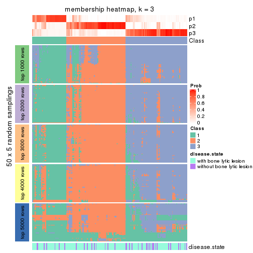</p>

</div>
<div id='tab-MAD-mclust-membership-heatmap-3'>
<pre><code class="r">membership_heatmap(res, k = 4)
</code></pre>

<p></p>

</div>
<div id='tab-MAD-mclust-membership-heatmap-4'>
<pre><code class="r">membership_heatmap(res, k = 5)
</code></pre>

<p></p>

</div>
<div id='tab-MAD-mclust-membership-heatmap-5'>
<pre><code class="r">membership_heatmap(res, k = 6)
</code></pre>

<p></p>

</div>
</div>

As soon as we have had the classes for columns, we can look for signatures
which are significantly different between classes which can be candidate marks
for certain classes. Following are the heatmaps for signatures.


Signature heatmaps where rows are scaled:


<script>
$( function() {
	$( '#tabs-MAD-mclust-get-signatures' ).tabs();
} );
</script>
<div id='tabs-MAD-mclust-get-signatures'>
<ul>
<li><a href='#tab-MAD-mclust-get-signatures-1'>k = 2</a></li>
<li><a href='#tab-MAD-mclust-get-signatures-2'>k = 3</a></li>
<li><a href='#tab-MAD-mclust-get-signatures-3'>k = 4</a></li>
<li><a href='#tab-MAD-mclust-get-signatures-4'>k = 5</a></li>
<li><a href='#tab-MAD-mclust-get-signatures-5'>k = 6</a></li>
</ul>
<div id='tab-MAD-mclust-get-signatures-1'>
<pre><code class="r">get_signatures(res, k = 2)
</code></pre>

<p></p>

</div>
<div id='tab-MAD-mclust-get-signatures-2'>
<pre><code class="r">get_signatures(res, k = 3)
</code></pre>

<p></p>

</div>
<div id='tab-MAD-mclust-get-signatures-3'>
<pre><code class="r">get_signatures(res, k = 4)
</code></pre>

<p></p>

</div>
<div id='tab-MAD-mclust-get-signatures-4'>
<pre><code class="r">get_signatures(res, k = 5)
</code></pre>

<p></p>

</div>
<div id='tab-MAD-mclust-get-signatures-5'>
<pre><code class="r">get_signatures(res, k = 6)
</code></pre>

<p></p>

</div>
</div>


Signature heatmaps where rows are not scaled:


<script>
$( function() {
	$( '#tabs-MAD-mclust-get-signatures-no-scale' ).tabs();
} );
</script>
<div id='tabs-MAD-mclust-get-signatures-no-scale'>
<ul>
<li><a href='#tab-MAD-mclust-get-signatures-no-scale-1'>k = 2</a></li>
<li><a href='#tab-MAD-mclust-get-signatures-no-scale-2'>k = 3</a></li>
<li><a href='#tab-MAD-mclust-get-signatures-no-scale-3'>k = 4</a></li>
<li><a href='#tab-MAD-mclust-get-signatures-no-scale-4'>k = 5</a></li>
<li><a href='#tab-MAD-mclust-get-signatures-no-scale-5'>k = 6</a></li>
</ul>
<div id='tab-MAD-mclust-get-signatures-no-scale-1'>
<pre><code class="r">get_signatures(res, k = 2, scale_rows = FALSE)
</code></pre>

<p>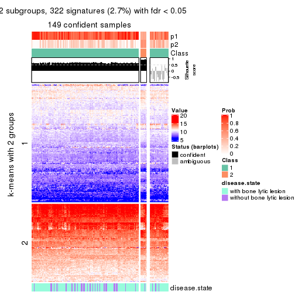</p>

</div>
<div id='tab-MAD-mclust-get-signatures-no-scale-2'>
<pre><code class="r">get_signatures(res, k = 3, scale_rows = FALSE)
</code></pre>

<p></p>

</div>
<div id='tab-MAD-mclust-get-signatures-no-scale-3'>
<pre><code class="r">get_signatures(res, k = 4, scale_rows = FALSE)
</code></pre>

<p></p>

</div>
<div id='tab-MAD-mclust-get-signatures-no-scale-4'>
<pre><code class="r">get_signatures(res, k = 5, scale_rows = FALSE)
</code></pre>

<p></p>

</div>
<div id='tab-MAD-mclust-get-signatures-no-scale-5'>
<pre><code class="r">get_signatures(res, k = 6, scale_rows = FALSE)
</code></pre>

<p></p>

</div>
</div>


Compare the overlap of signatures from different k:

```r
compare_signatures(res)
```


`get_signature()` returns a data frame invisibly. TO get the list of signatures, the function
call should be assigned to a variable explicitly. In following code, if `plot` argument is set
to `FALSE`, no heatmap is plotted while only the differential analysis is performed.

```r
# code only for demonstration
tb = get_signature(res, k = ..., plot = FALSE)
```

An example of the output of `tb` is:

```
#>   which_row         fdr    mean_1    mean_2 scaled_mean_1 scaled_mean_2 km
#> 1        38 0.042760348  8.373488  9.131774    -0.5533452     0.5164555  1
#> 2        40 0.018707592  7.106213  8.469186    -0.6173731     0.5762149  1
#> 3        55 0.019134737 10.221463 11.207825    -0.6159697     0.5749050  1
#> 4        59 0.006059896  5.921854  7.869574    -0.6899429     0.6439467  1
#> 5        60 0.018055526  8.928898 10.211722    -0.6204761     0.5791110  1
#> 6        98 0.009384629 15.714769 14.887706     0.6635654    -0.6193277  2
...
```

The columns in `tb` are:

1. `which_row`: row indices corresponding to the input matrix.
2. `fdr`: FDR for the differential test. 
3. `mean_x`: The mean value in group x.
4. `scaled_mean_x`: The mean value in group x after rows are scaled.
5. `km`: Row groups if k-means clustering is applied to rows.


UMAP plot which shows how samples are separated.


<script>
$( function() {
	$( '#tabs-MAD-mclust-dimension-reduction' ).tabs();
} );
</script>
<div id='tabs-MAD-mclust-dimension-reduction'>
<ul>
<li><a href='#tab-MAD-mclust-dimension-reduction-1'>k = 2</a></li>
<li><a href='#tab-MAD-mclust-dimension-reduction-2'>k = 3</a></li>
<li><a href='#tab-MAD-mclust-dimension-reduction-3'>k = 4</a></li>
<li><a href='#tab-MAD-mclust-dimension-reduction-4'>k = 5</a></li>
<li><a href='#tab-MAD-mclust-dimension-reduction-5'>k = 6</a></li>
</ul>
<div id='tab-MAD-mclust-dimension-reduction-1'>
<pre><code class="r">dimension_reduction(res, k = 2, method = &quot;UMAP&quot;)
</code></pre>

<p></p>

</div>
<div id='tab-MAD-mclust-dimension-reduction-2'>
<pre><code class="r">dimension_reduction(res, k = 3, method = &quot;UMAP&quot;)
</code></pre>

<p></p>

</div>
<div id='tab-MAD-mclust-dimension-reduction-3'>
<pre><code class="r">dimension_reduction(res, k = 4, method = &quot;UMAP&quot;)
</code></pre>

<p></p>

</div>
<div id='tab-MAD-mclust-dimension-reduction-4'>
<pre><code class="r">dimension_reduction(res, k = 5, method = &quot;UMAP&quot;)
</code></pre>

<p>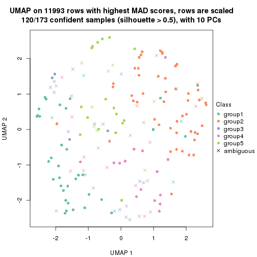</p>

</div>
<div id='tab-MAD-mclust-dimension-reduction-5'>
<pre><code class="r">dimension_reduction(res, k = 6, method = &quot;UMAP&quot;)
</code></pre>

<p></p>

</div>
</div>


Following heatmap shows how subgroups are split when increasing `k`:

```r
collect_classes(res)
```


Test correlation between subgroups and known annotations. If the known
annotation is numeric, one-way ANOVA test is applied, and if the known
annotation is discrete, chi-squared contingency table test is applied.

```r
test_to_known_factors(res)
```

```
#>              n disease.state(p) k
#> MAD:mclust 149           0.8120 2
#> MAD:mclust 153           0.3903 3
#> MAD:mclust 147           0.0639 4
#> MAD:mclust 120           0.1993 5
#> MAD:mclust 102           0.1694 6
```


If matrix rows can be associated to genes, consider to use `GO_Enrichment(res,
...)` to perform function enrichment for the signature genes.


 

---------------------------------------------------


### MAD:NMF


The object with results only for a single top-value method and a single partition method 
can be extracted as:

```r
res = res_list["MAD", "NMF"]
# you can also extract it by
# res = res_list["MAD:NMF"]
```

A summary of `res` and all the functions that can be applied to it:

```r
res
```

```
#> A 'ConsensusPartition' object with k = 2, 3, 4, 5, 6.
#>   On a matrix with 11993 rows and 173 columns.
#>   Top rows (1000, 2000, 3000, 4000, 5000) are extracted by 'MAD' method.
#>   Subgroups are detected by 'NMF' method.
#>   Performed in total 1250 partitions by row resampling.
#>   Best k for subgroups seems to be 2.
#> 
#> Following methods can be applied to this 'ConsensusPartition' object:
#>  [1] "cola_report"             "collect_classes"         "collect_plots"          
#>  [4] "collect_stats"           "colnames"                "compare_signatures"     
#>  [7] "consensus_heatmap"       "dimension_reduction"     "functional_enrichment"  
#> [10] "get_anno_col"            "get_anno"                "get_classes"            
#> [13] "get_consensus"           "get_matrix"              "get_membership"         
#> [16] "get_param"               "get_signatures"          "get_stats"              
#> [19] "is_best_k"               "is_stable_k"             "membership_heatmap"     
#> [22] "ncol"                    "nrow"                    "plot_ecdf"              
#> [25] "rownames"                "select_partition_number" "show"                   
#> [28] "suggest_best_k"          "test_to_known_factors"
```

`collect_plots()` function collects all the plots made from `res` for all `k` (number of partitions)
into one single page to provide an easy and fast comparison between different `k`.

```r
collect_plots(res)
```

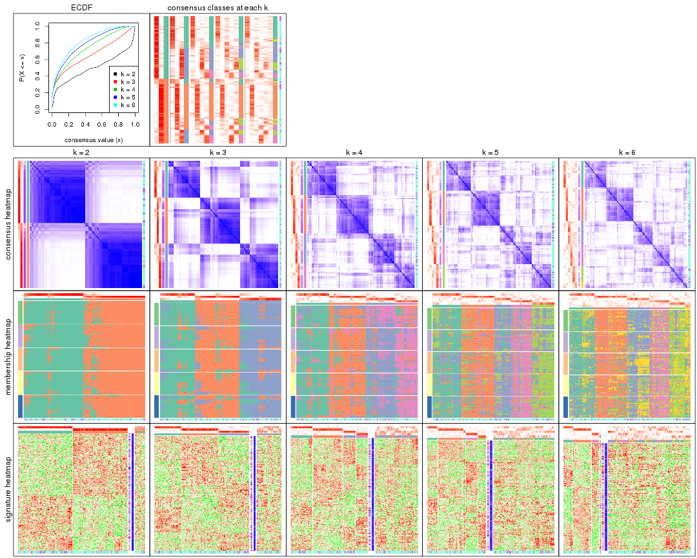

The plots are:

- The first row: a plot of the ECDF (Empirical cumulative distribution
  function) curves of the consensus matrix for each `k` and the heatmap of
  predicted classes for each `k`.
- The second row: heatmaps of the consensus matrix for each `k`.
- The third row: heatmaps of the membership matrix for each `k`.
- The fouth row: heatmaps of the signatures for each `k`.

All the plots in panels can be made by individual functions and they are
plotted later in this section.

`select_partition_number()` produces several plots showing different
statistics for choosing "optimized" `k`. There are following statistics:

- ECDF curves of the consensus matrix for each `k`;
- 1-PAC. [The PAC
  score](https://en.wikipedia.org/wiki/Consensus_clustering#Over-interpretation_potential_of_consensus_clustering)
  measures the proportion of the ambiguous subgrouping.
- Mean silhouette score.
- Concordance. The mean probability of fiting the consensus class ids in all
  partitions.
- Area increased. Denote $A_k$ as the area under the ECDF curve for current
  `k`, the area increased is defined as $A_k - A_{k-1}$.
- Rand index. The percent of pairs of samples that are both in a same cluster
  or both are not in a same cluster in the partition of k and k-1.
- Jaccard index. The ratio of pairs of samples are both in a same cluster in
  the partition of k and k-1 and the pairs of samples are both in a same
  cluster in the partition k or k-1.

The detailed explanations of these statistics can be found in [the cola
vignette](http://bioconductor.org/packages/devel/bioc/vignettes/cola/inst/doc/cola.html#toc_13).

Generally speaking, lower PAC score, higher mean silhouette score or higher
concordance corresponds to better partition. Rand index and Jaccard index
measure how similar the current partition is compared to partition with `k-1`.
If they are too similar, we won't accept `k` is better than `k-1`.

```r
select_partition_number(res)
```


The numeric values for all these statistics can be obtained by `get_stats()`.

```r
get_stats(res)
```

```
#>   k 1-PAC mean_silhouette concordance area_increased  Rand Jaccard
#> 2 2 0.615           0.832       0.919         0.5006 0.497   0.497
#> 3 3 0.478           0.639       0.821         0.3325 0.695   0.463
#> 4 4 0.438           0.513       0.701         0.1212 0.847   0.585
#> 5 5 0.484           0.431       0.645         0.0651 0.886   0.604
#> 6 6 0.529           0.374       0.589         0.0403 0.904   0.610
```

`suggest_best_k()` suggests the best $k$ based on these statistics. The rules are as follows:

- All $k$ with Jaccard index larger than 0.95 are removed because the increase of
  the partition number does not provides enough extra information. If all $k$ are removed,
  the best $k$ is assigned by `NA`.
- For $k$ with 1-PAC larger than 0.9, the maximal $k$ is taken as the "best k". Other $k$ is called "optional k".
- If it does not fit the second rule. The $k$ with the highest vote of highest
  1-PAC, mean silhouette and concordance is taken as the "best k".

```r
suggest_best_k(res)
```

```
#> [1] 2
```


Following shows the table of the partitions (You need to click the **show/hide
code output** link to see it). The membership matrix (columns with name `p*`)
is inferred by
[`clue::cl_consensus()`](https://www.rdocumentation.org/link/cl_consensus?package=clue)
function with the `SE` method. Basically the value in the membership matrix
represents the probability to belong to a certain group. The finall class
label for an item is determined with the group with highest probability it
belongs to.

In `get_classes()` function, the entropy is calculated from the membership
matrix and the silhouette score is calculated from the consensus matrix.


<script>
$( function() {
	$( '#tabs-MAD-NMF-get-classes' ).tabs();
} );
</script>
<div id='tabs-MAD-NMF-get-classes'>
<ul>
<li><a href='#tab-MAD-NMF-get-classes-1'>k = 2</a></li>
<li><a href='#tab-MAD-NMF-get-classes-2'>k = 3</a></li>
<li><a href='#tab-MAD-NMF-get-classes-3'>k = 4</a></li>
<li><a href='#tab-MAD-NMF-get-classes-4'>k = 5</a></li>
<li><a href='#tab-MAD-NMF-get-classes-5'>k = 6</a></li>
</ul>

<div id='tab-MAD-NMF-get-classes-1'>
<p><a id='tab-MAD-NMF-get-classes-1-a' style='color:#0366d6' href='#'>show/hide code output</a></p>
<pre><code class="r">cbind(get_classes(res, k = 2), get_membership(res, k = 2))
</code></pre>

<pre><code>#&gt;          class entropy silhouette    p1    p2
#&gt; GSM11437     1  0.5629      0.836 0.868 0.132
#&gt; GSM11438     2  0.0376      0.905 0.004 0.996
#&gt; GSM11439     1  0.7815      0.719 0.768 0.232
#&gt; GSM11440     1  0.5737      0.844 0.864 0.136
#&gt; GSM11441     1  0.1843      0.912 0.972 0.028
#&gt; GSM11442     2  0.6343      0.795 0.160 0.840
#&gt; GSM11443     2  0.0000      0.906 0.000 1.000
#&gt; GSM11444     1  0.2236      0.910 0.964 0.036
#&gt; GSM11445     1  0.9732      0.341 0.596 0.404
#&gt; GSM11446     1  0.2603      0.907 0.956 0.044
#&gt; GSM11447     2  0.9686      0.363 0.396 0.604
#&gt; GSM11448     2  0.9393      0.495 0.356 0.644
#&gt; GSM11449     1  0.0672      0.915 0.992 0.008
#&gt; GSM11450     1  0.0376      0.916 0.996 0.004
#&gt; GSM11451     2  0.0938      0.904 0.012 0.988
#&gt; GSM11452     2  0.5737      0.822 0.136 0.864
#&gt; GSM11453     1  0.6438      0.794 0.836 0.164
#&gt; GSM11454     1  0.2043      0.911 0.968 0.032
#&gt; GSM11455     2  0.0672      0.905 0.008 0.992
#&gt; GSM11456     2  0.0000      0.906 0.000 1.000
#&gt; GSM11457     2  0.0000      0.906 0.000 1.000
#&gt; GSM11458     1  0.0376      0.916 0.996 0.004
#&gt; GSM11459     1  0.1633      0.913 0.976 0.024
#&gt; GSM11460     1  0.0000      0.916 1.000 0.000
#&gt; GSM11461     1  0.0000      0.916 1.000 0.000
#&gt; GSM11462     1  0.0000      0.916 1.000 0.000
#&gt; GSM11463     2  0.1184      0.903 0.016 0.984
#&gt; GSM11464     1  0.0000      0.916 1.000 0.000
#&gt; GSM11465     2  0.6712      0.787 0.176 0.824
#&gt; GSM11466     1  0.1843      0.913 0.972 0.028
#&gt; GSM11467     1  0.0376      0.916 0.996 0.004
#&gt; GSM11468     1  0.3274      0.899 0.940 0.060
#&gt; GSM11469     1  0.0376      0.916 0.996 0.004
#&gt; GSM11470     1  0.0672      0.915 0.992 0.008
#&gt; GSM11471     1  0.0672      0.915 0.992 0.008
#&gt; GSM11472     1  0.1843      0.913 0.972 0.028
#&gt; GSM11473     2  0.0376      0.905 0.004 0.996
#&gt; GSM11474     2  0.0000      0.906 0.000 1.000
#&gt; GSM11475     1  0.9909      0.209 0.556 0.444
#&gt; GSM11476     2  0.1843      0.897 0.028 0.972
#&gt; GSM11477     2  0.0672      0.905 0.008 0.992
#&gt; GSM11478     2  0.0000      0.906 0.000 1.000
#&gt; GSM11479     2  0.0672      0.905 0.008 0.992
#&gt; GSM11480     2  0.0000      0.906 0.000 1.000
#&gt; GSM11481     1  0.4562      0.876 0.904 0.096
#&gt; GSM11482     2  0.1414      0.901 0.020 0.980
#&gt; GSM11483     2  0.0672      0.905 0.008 0.992
#&gt; GSM11484     2  0.7602      0.718 0.220 0.780
#&gt; GSM11485     2  0.0672      0.905 0.008 0.992
#&gt; GSM11486     2  0.0000      0.906 0.000 1.000
#&gt; GSM11487     1  0.0938      0.916 0.988 0.012
#&gt; GSM11488     2  0.4939      0.842 0.108 0.892
#&gt; GSM11489     2  0.0000      0.906 0.000 1.000
#&gt; GSM11490     1  0.9323      0.492 0.652 0.348
#&gt; GSM11491     1  0.4161      0.875 0.916 0.084
#&gt; GSM11492     1  0.7528      0.740 0.784 0.216
#&gt; GSM11493     2  0.2423      0.891 0.040 0.960
#&gt; GSM11494     2  0.9358      0.480 0.352 0.648
#&gt; GSM11495     2  0.2423      0.891 0.040 0.960
#&gt; GSM11496     2  0.3431      0.879 0.064 0.936
#&gt; GSM11497     2  0.0938      0.905 0.012 0.988
#&gt; GSM11498     2  0.1414      0.903 0.020 0.980
#&gt; GSM11499     2  0.0672      0.905 0.008 0.992
#&gt; GSM11500     2  0.1843      0.897 0.028 0.972
#&gt; GSM11501     2  0.0672      0.905 0.008 0.992
#&gt; GSM11502     2  0.0938      0.904 0.012 0.988
#&gt; GSM11503     2  0.0376      0.906 0.004 0.996
#&gt; GSM11504     1  0.2603      0.907 0.956 0.044
#&gt; GSM11505     2  0.0000      0.906 0.000 1.000
#&gt; GSM11506     2  0.0000      0.906 0.000 1.000
#&gt; GSM11507     2  0.0000      0.906 0.000 1.000
#&gt; GSM11508     1  0.3274      0.898 0.940 0.060
#&gt; GSM11509     1  0.8661      0.621 0.712 0.288
#&gt; GSM11510     2  0.0000      0.906 0.000 1.000
#&gt; GSM11511     1  0.2043      0.909 0.968 0.032
#&gt; GSM11512     2  0.9815      0.290 0.420 0.580
#&gt; GSM11513     1  0.2948      0.902 0.948 0.052
#&gt; GSM11514     2  0.4431      0.855 0.092 0.908
#&gt; GSM11515     2  0.8207      0.663 0.256 0.744
#&gt; GSM11516     2  0.8713      0.619 0.292 0.708
#&gt; GSM11517     1  0.1633      0.913 0.976 0.024
#&gt; GSM11518     1  0.3431      0.898 0.936 0.064
#&gt; GSM11519     1  0.3584      0.886 0.932 0.068
#&gt; GSM11520     1  0.0376      0.916 0.996 0.004
#&gt; GSM11521     2  0.1633      0.899 0.024 0.976
#&gt; GSM11522     1  0.0672      0.915 0.992 0.008
#&gt; GSM11523     1  0.0376      0.916 0.996 0.004
#&gt; GSM11524     1  0.1633      0.913 0.976 0.024
#&gt; GSM11525     2  0.0000      0.906 0.000 1.000
#&gt; GSM11526     1  0.6343      0.813 0.840 0.160
#&gt; GSM11527     2  0.0672      0.905 0.008 0.992
#&gt; GSM11528     2  0.0000      0.906 0.000 1.000
#&gt; GSM11529     2  0.2043      0.899 0.032 0.968
#&gt; GSM11530     1  0.0672      0.917 0.992 0.008
#&gt; GSM11531     2  0.1633      0.901 0.024 0.976
#&gt; GSM11532     1  0.2778      0.906 0.952 0.048
#&gt; GSM11533     2  0.2236      0.895 0.036 0.964
#&gt; GSM11534     2  0.9522      0.438 0.372 0.628
#&gt; GSM11535     2  0.1633      0.901 0.024 0.976
#&gt; GSM11536     2  0.1184      0.902 0.016 0.984
#&gt; GSM11537     2  0.0938      0.904 0.012 0.988
#&gt; GSM11538     2  0.8207      0.677 0.256 0.744
#&gt; GSM11539     2  0.0938      0.904 0.012 0.988
#&gt; GSM11540     2  0.0000      0.906 0.000 1.000
#&gt; GSM11541     1  0.0938      0.915 0.988 0.012
#&gt; GSM11542     2  0.0376      0.906 0.004 0.996
#&gt; GSM11543     2  0.7219      0.750 0.200 0.800
#&gt; GSM11544     1  0.2423      0.902 0.960 0.040
#&gt; GSM11545     1  0.9933      0.153 0.548 0.452
#&gt; GSM11546     2  0.4815      0.846 0.104 0.896
#&gt; GSM11547     2  0.7528      0.736 0.216 0.784
#&gt; GSM11548     1  0.8555      0.636 0.720 0.280
#&gt; GSM11549     1  0.0000      0.916 1.000 0.000
#&gt; GSM11550     1  0.0000      0.916 1.000 0.000
#&gt; GSM11551     1  0.1414      0.914 0.980 0.020
#&gt; GSM11552     1  0.0938      0.915 0.988 0.012
#&gt; GSM11553     2  0.1184      0.903 0.016 0.984
#&gt; GSM11554     2  0.0376      0.906 0.004 0.996
#&gt; GSM11555     1  0.2778      0.902 0.952 0.048
#&gt; GSM11556     1  0.0000      0.916 1.000 0.000
#&gt; GSM11557     2  0.1414      0.902 0.020 0.980
#&gt; GSM11558     2  0.0000      0.906 0.000 1.000
#&gt; GSM11559     2  0.1414      0.902 0.020 0.980
#&gt; GSM11560     1  0.0000      0.916 1.000 0.000
#&gt; GSM11561     2  0.0000      0.906 0.000 1.000
#&gt; GSM11562     2  0.0938      0.904 0.012 0.988
#&gt; GSM11563     1  0.5842      0.826 0.860 0.140
#&gt; GSM11564     1  0.8267      0.663 0.740 0.260
#&gt; GSM11565     1  0.2948      0.896 0.948 0.052
#&gt; GSM11566     2  0.0000      0.906 0.000 1.000
#&gt; GSM11567     2  0.9460      0.455 0.364 0.636
#&gt; GSM11568     1  0.9580      0.382 0.620 0.380
#&gt; GSM11569     2  0.0938      0.904 0.012 0.988
#&gt; GSM11570     1  0.0672      0.916 0.992 0.008
#&gt; GSM11571     1  0.4815      0.858 0.896 0.104
#&gt; GSM11572     2  0.1184      0.903 0.016 0.984
#&gt; GSM11573     2  0.9922      0.225 0.448 0.552
#&gt; GSM11574     2  0.1633      0.901 0.024 0.976
#&gt; GSM11575     1  0.8081      0.681 0.752 0.248
#&gt; GSM11576     1  0.0376      0.916 0.996 0.004
#&gt; GSM11577     2  0.7453      0.738 0.212 0.788
#&gt; GSM11578     2  0.9248      0.523 0.340 0.660
#&gt; GSM11579     2  0.1633      0.899 0.024 0.976
#&gt; GSM11580     2  0.6973      0.770 0.188 0.812
#&gt; GSM11581     1  0.4298      0.879 0.912 0.088
#&gt; GSM11582     1  0.0376      0.916 0.996 0.004
#&gt; GSM11583     1  0.2236      0.912 0.964 0.036
#&gt; GSM11584     2  0.9833      0.272 0.424 0.576
#&gt; GSM11585     2  0.1414      0.902 0.020 0.980
#&gt; GSM11586     1  0.0376      0.916 0.996 0.004
#&gt; GSM11587     1  0.0376      0.916 0.996 0.004
#&gt; GSM11588     1  0.9775      0.291 0.588 0.412
#&gt; GSM11589     2  0.9661      0.396 0.392 0.608
#&gt; GSM11590     1  0.1184      0.913 0.984 0.016
#&gt; GSM11591     2  0.1633      0.901 0.024 0.976
#&gt; GSM11592     1  0.0000      0.916 1.000 0.000
#&gt; GSM11593     1  0.1633      0.910 0.976 0.024
#&gt; GSM11594     1  0.0376      0.916 0.996 0.004
#&gt; GSM11595     1  0.7883      0.691 0.764 0.236
#&gt; GSM11596     2  0.7376      0.746 0.208 0.792
#&gt; GSM11597     1  0.0938      0.915 0.988 0.012
#&gt; GSM11598     1  0.1843      0.910 0.972 0.028
#&gt; GSM11599     1  0.1633      0.913 0.976 0.024
#&gt; GSM11600     1  0.0938      0.917 0.988 0.012
#&gt; GSM11601     2  0.0000      0.906 0.000 1.000
#&gt; GSM11602     1  0.0000      0.916 1.000 0.000
#&gt; GSM11603     1  0.0376      0.916 0.996 0.004
#&gt; GSM11604     1  0.0000      0.916 1.000 0.000
#&gt; GSM11605     1  0.0938      0.915 0.988 0.012
#&gt; GSM11606     2  0.2043      0.897 0.032 0.968
#&gt; GSM11607     1  0.1843      0.909 0.972 0.028
#&gt; GSM11608     1  0.0000      0.916 1.000 0.000
#&gt; GSM11609     2  0.1633      0.900 0.024 0.976
</code></pre>

<script>
$('#tab-MAD-NMF-get-classes-1-a').parent().next().next().hide();
$('#tab-MAD-NMF-get-classes-1-a').click(function(){
  $('#tab-MAD-NMF-get-classes-1-a').parent().next().next().toggle();
  return(false);
});
</script>
</div>

<div id='tab-MAD-NMF-get-classes-2'>
<p><a id='tab-MAD-NMF-get-classes-2-a' style='color:#0366d6' href='#'>show/hide code output</a></p>
<pre><code class="r">cbind(get_classes(res, k = 3), get_membership(res, k = 3))
</code></pre>

<pre><code>#&gt;          class entropy silhouette    p1    p2    p3
#&gt; GSM11437     1  0.7567     0.2749 0.576 0.048 0.376
#&gt; GSM11438     2  0.4121     0.7301 0.000 0.832 0.168
#&gt; GSM11439     3  0.2492     0.7776 0.016 0.048 0.936
#&gt; GSM11440     3  0.2663     0.7795 0.024 0.044 0.932
#&gt; GSM11441     3  0.2796     0.7606 0.092 0.000 0.908
#&gt; GSM11442     3  0.3116     0.7518 0.000 0.108 0.892
#&gt; GSM11443     2  0.2682     0.8004 0.004 0.920 0.076
#&gt; GSM11444     3  0.1860     0.7730 0.052 0.000 0.948
#&gt; GSM11445     3  0.1964     0.7749 0.000 0.056 0.944
#&gt; GSM11446     3  0.2356     0.7667 0.072 0.000 0.928
#&gt; GSM11447     3  0.2496     0.7710 0.004 0.068 0.928
#&gt; GSM11448     1  0.6701     0.2761 0.576 0.412 0.012
#&gt; GSM11449     1  0.4345     0.7220 0.848 0.016 0.136
#&gt; GSM11450     1  0.2959     0.7396 0.900 0.000 0.100
#&gt; GSM11451     2  0.2537     0.7906 0.080 0.920 0.000
#&gt; GSM11452     2  0.6302     0.0477 0.480 0.520 0.000
#&gt; GSM11453     1  0.4178     0.6971 0.828 0.172 0.000
#&gt; GSM11454     3  0.2165     0.7695 0.064 0.000 0.936
#&gt; GSM11455     2  0.6274     0.1930 0.000 0.544 0.456
#&gt; GSM11456     2  0.1529     0.8100 0.000 0.960 0.040
#&gt; GSM11457     2  0.0661     0.8112 0.008 0.988 0.004
#&gt; GSM11458     3  0.5621     0.5359 0.308 0.000 0.692
#&gt; GSM11459     3  0.2796     0.7578 0.092 0.000 0.908
#&gt; GSM11460     1  0.6192     0.2177 0.580 0.000 0.420
#&gt; GSM11461     1  0.4634     0.6949 0.824 0.012 0.164
#&gt; GSM11462     3  0.6302     0.1168 0.480 0.000 0.520
#&gt; GSM11463     2  0.1753     0.8037 0.048 0.952 0.000
#&gt; GSM11464     1  0.5058     0.5874 0.756 0.000 0.244
#&gt; GSM11465     2  0.5200     0.7015 0.184 0.796 0.020
#&gt; GSM11466     3  0.4110     0.7226 0.152 0.004 0.844
#&gt; GSM11467     1  0.2261     0.7530 0.932 0.000 0.068
#&gt; GSM11468     3  0.1878     0.7746 0.044 0.004 0.952
#&gt; GSM11469     3  0.5882     0.4583 0.348 0.000 0.652
#&gt; GSM11470     1  0.0829     0.7663 0.984 0.004 0.012
#&gt; GSM11471     1  0.3784     0.7201 0.864 0.004 0.132
#&gt; GSM11472     3  0.5465     0.5677 0.288 0.000 0.712
#&gt; GSM11473     2  0.4473     0.7403 0.008 0.828 0.164
#&gt; GSM11474     2  0.1964     0.8046 0.000 0.944 0.056
#&gt; GSM11475     3  0.2584     0.7742 0.008 0.064 0.928
#&gt; GSM11476     3  0.5678     0.4775 0.000 0.316 0.684
#&gt; GSM11477     2  0.1289     0.8070 0.032 0.968 0.000
#&gt; GSM11478     2  0.2537     0.7964 0.000 0.920 0.080
#&gt; GSM11479     2  0.6192     0.3006 0.000 0.580 0.420
#&gt; GSM11480     2  0.1129     0.8119 0.004 0.976 0.020
#&gt; GSM11481     3  0.3045     0.7754 0.064 0.020 0.916
#&gt; GSM11482     3  0.6008     0.3623 0.000 0.372 0.628
#&gt; GSM11483     2  0.5650     0.5290 0.000 0.688 0.312
#&gt; GSM11484     3  0.3038     0.7547 0.000 0.104 0.896
#&gt; GSM11485     2  0.6309     0.0576 0.000 0.504 0.496
#&gt; GSM11486     2  0.3686     0.7565 0.000 0.860 0.140
#&gt; GSM11487     1  0.2947     0.7641 0.920 0.020 0.060
#&gt; GSM11488     3  0.3116     0.7523 0.000 0.108 0.892
#&gt; GSM11489     2  0.3340     0.7739 0.000 0.880 0.120
#&gt; GSM11490     3  0.2550     0.7773 0.012 0.056 0.932
#&gt; GSM11491     1  0.2796     0.7553 0.908 0.092 0.000
#&gt; GSM11492     3  0.1289     0.7777 0.000 0.032 0.968
#&gt; GSM11493     3  0.4062     0.7006 0.000 0.164 0.836
#&gt; GSM11494     3  0.2261     0.7712 0.000 0.068 0.932
#&gt; GSM11495     3  0.5016     0.6033 0.000 0.240 0.760
#&gt; GSM11496     3  0.6468     0.1267 0.004 0.444 0.552
#&gt; GSM11497     2  0.2537     0.7921 0.080 0.920 0.000
#&gt; GSM11498     2  0.1964     0.7999 0.056 0.944 0.000
#&gt; GSM11499     2  0.6252     0.2293 0.000 0.556 0.444
#&gt; GSM11500     3  0.6154     0.2554 0.000 0.408 0.592
#&gt; GSM11501     2  0.6267     0.2016 0.000 0.548 0.452
#&gt; GSM11502     2  0.2537     0.7891 0.080 0.920 0.000
#&gt; GSM11503     2  0.0848     0.8120 0.008 0.984 0.008
#&gt; GSM11504     3  0.1289     0.7767 0.032 0.000 0.968
#&gt; GSM11505     2  0.1585     0.8131 0.008 0.964 0.028
#&gt; GSM11506     2  0.3192     0.7775 0.000 0.888 0.112
#&gt; GSM11507     2  0.1163     0.8110 0.000 0.972 0.028
#&gt; GSM11508     3  0.0892     0.7773 0.020 0.000 0.980
#&gt; GSM11509     3  0.1765     0.7770 0.004 0.040 0.956
#&gt; GSM11510     2  0.3192     0.7778 0.000 0.888 0.112
#&gt; GSM11511     1  0.2689     0.7700 0.932 0.032 0.036
#&gt; GSM11512     3  0.2448     0.7683 0.000 0.076 0.924
#&gt; GSM11513     3  0.1964     0.7717 0.056 0.000 0.944
#&gt; GSM11514     2  0.5276     0.7548 0.052 0.820 0.128
#&gt; GSM11515     3  0.2711     0.7632 0.000 0.088 0.912
#&gt; GSM11516     1  0.6291     0.1146 0.532 0.468 0.000
#&gt; GSM11517     3  0.3038     0.7492 0.104 0.000 0.896
#&gt; GSM11518     3  0.4139     0.7467 0.124 0.016 0.860
#&gt; GSM11519     1  0.3349     0.7466 0.888 0.108 0.004
#&gt; GSM11520     1  0.1529     0.7604 0.960 0.000 0.040
#&gt; GSM11521     3  0.5650     0.4840 0.000 0.312 0.688
#&gt; GSM11522     1  0.4465     0.6770 0.820 0.004 0.176
#&gt; GSM11523     1  0.3038     0.7333 0.896 0.000 0.104
#&gt; GSM11524     3  0.2261     0.7671 0.068 0.000 0.932
#&gt; GSM11525     2  0.2165     0.8022 0.000 0.936 0.064
#&gt; GSM11526     3  0.1170     0.7791 0.008 0.016 0.976
#&gt; GSM11527     2  0.4702     0.6793 0.000 0.788 0.212
#&gt; GSM11528     2  0.1453     0.8126 0.008 0.968 0.024
#&gt; GSM11529     2  0.3879     0.7357 0.152 0.848 0.000
#&gt; GSM11530     3  0.6260     0.2243 0.448 0.000 0.552
#&gt; GSM11531     2  0.2165     0.7978 0.064 0.936 0.000
#&gt; GSM11532     3  0.2711     0.7600 0.088 0.000 0.912
#&gt; GSM11533     2  0.5497     0.5418 0.292 0.708 0.000
#&gt; GSM11534     2  0.6584     0.3046 0.380 0.608 0.012
#&gt; GSM11535     2  0.3116     0.7725 0.108 0.892 0.000
#&gt; GSM11536     3  0.6633     0.1219 0.008 0.444 0.548
#&gt; GSM11537     2  0.2878     0.7800 0.096 0.904 0.000
#&gt; GSM11538     2  0.7492     0.3786 0.340 0.608 0.052
#&gt; GSM11539     2  0.1643     0.8040 0.044 0.956 0.000
#&gt; GSM11540     2  0.1411     0.8100 0.000 0.964 0.036
#&gt; GSM11541     3  0.6045     0.3926 0.380 0.000 0.620
#&gt; GSM11542     2  0.0892     0.8097 0.020 0.980 0.000
#&gt; GSM11543     2  0.6816     0.1040 0.012 0.516 0.472
#&gt; GSM11544     1  0.2261     0.7664 0.932 0.068 0.000
#&gt; GSM11545     1  0.4931     0.6349 0.768 0.232 0.000
#&gt; GSM11546     2  0.6193     0.5807 0.016 0.692 0.292
#&gt; GSM11547     2  0.6254     0.6769 0.188 0.756 0.056
#&gt; GSM11548     3  0.2050     0.7804 0.028 0.020 0.952
#&gt; GSM11549     1  0.5363     0.5382 0.724 0.000 0.276
#&gt; GSM11550     1  0.5560     0.4983 0.700 0.000 0.300
#&gt; GSM11551     3  0.5580     0.6219 0.256 0.008 0.736
#&gt; GSM11552     3  0.4702     0.6599 0.212 0.000 0.788
#&gt; GSM11553     2  0.3038     0.7750 0.104 0.896 0.000
#&gt; GSM11554     2  0.0592     0.8104 0.012 0.988 0.000
#&gt; GSM11555     1  0.6438     0.6762 0.748 0.064 0.188
#&gt; GSM11556     1  0.6309    -0.0562 0.504 0.000 0.496
#&gt; GSM11557     2  0.2356     0.7931 0.072 0.928 0.000
#&gt; GSM11558     2  0.1289     0.8109 0.000 0.968 0.032
#&gt; GSM11559     2  0.3038     0.7748 0.104 0.896 0.000
#&gt; GSM11560     1  0.3038     0.7336 0.896 0.000 0.104
#&gt; GSM11561     2  0.1529     0.8093 0.000 0.960 0.040
#&gt; GSM11562     2  0.1163     0.8084 0.028 0.972 0.000
#&gt; GSM11563     1  0.4539     0.7239 0.836 0.148 0.016
#&gt; GSM11564     1  0.5573     0.7239 0.796 0.160 0.044
#&gt; GSM11565     1  0.2537     0.7608 0.920 0.080 0.000
#&gt; GSM11566     2  0.1525     0.8116 0.004 0.964 0.032
#&gt; GSM11567     3  0.3784     0.7319 0.004 0.132 0.864
#&gt; GSM11568     1  0.5397     0.5605 0.720 0.280 0.000
#&gt; GSM11569     2  0.1289     0.8065 0.032 0.968 0.000
#&gt; GSM11570     3  0.5529     0.5510 0.296 0.000 0.704
#&gt; GSM11571     1  0.3340     0.7409 0.880 0.120 0.000
#&gt; GSM11572     2  0.2774     0.7950 0.072 0.920 0.008
#&gt; GSM11573     1  0.5690     0.5492 0.708 0.288 0.004
#&gt; GSM11574     2  0.4887     0.6425 0.228 0.772 0.000
#&gt; GSM11575     1  0.4805     0.7046 0.812 0.176 0.012
#&gt; GSM11576     1  0.1337     0.7672 0.972 0.012 0.016
#&gt; GSM11577     1  0.6495     0.1422 0.536 0.460 0.004
#&gt; GSM11578     1  0.6026     0.3775 0.624 0.376 0.000
#&gt; GSM11579     3  0.5650     0.4834 0.000 0.312 0.688
#&gt; GSM11580     2  0.6302     0.0369 0.480 0.520 0.000
#&gt; GSM11581     3  0.0983     0.7781 0.016 0.004 0.980
#&gt; GSM11582     3  0.6225     0.2665 0.432 0.000 0.568
#&gt; GSM11583     3  0.5070     0.6508 0.224 0.004 0.772
#&gt; GSM11584     3  0.2165     0.7724 0.000 0.064 0.936
#&gt; GSM11585     2  0.3038     0.7751 0.104 0.896 0.000
#&gt; GSM11586     1  0.1399     0.7649 0.968 0.004 0.028
#&gt; GSM11587     1  0.2356     0.7499 0.928 0.000 0.072
#&gt; GSM11588     1  0.5201     0.6246 0.760 0.236 0.004
#&gt; GSM11589     1  0.6468     0.2150 0.552 0.444 0.004
#&gt; GSM11590     1  0.2280     0.7689 0.940 0.052 0.008
#&gt; GSM11591     2  0.4702     0.6644 0.212 0.788 0.000
#&gt; GSM11592     1  0.5859     0.4074 0.656 0.000 0.344
#&gt; GSM11593     1  0.2096     0.7683 0.944 0.052 0.004
#&gt; GSM11594     1  0.2796     0.7398 0.908 0.000 0.092
#&gt; GSM11595     1  0.5746     0.6943 0.780 0.180 0.040
#&gt; GSM11596     2  0.4982     0.7628 0.096 0.840 0.064
#&gt; GSM11597     3  0.4931     0.6433 0.232 0.000 0.768
#&gt; GSM11598     1  0.2301     0.7677 0.936 0.060 0.004
#&gt; GSM11599     3  0.2625     0.7605 0.084 0.000 0.916
#&gt; GSM11600     3  0.6126     0.3555 0.400 0.000 0.600
#&gt; GSM11601     2  0.4228     0.7536 0.008 0.844 0.148
#&gt; GSM11602     1  0.3941     0.6941 0.844 0.000 0.156
#&gt; GSM11603     1  0.2261     0.7520 0.932 0.000 0.068
#&gt; GSM11604     3  0.6095     0.3718 0.392 0.000 0.608
#&gt; GSM11605     3  0.5650     0.5348 0.312 0.000 0.688
#&gt; GSM11606     2  0.5397     0.5582 0.280 0.720 0.000
#&gt; GSM11607     1  0.1964     0.7680 0.944 0.056 0.000
#&gt; GSM11608     1  0.6192     0.2199 0.580 0.000 0.420
#&gt; GSM11609     3  0.6333     0.4429 0.012 0.332 0.656
</code></pre>

<script>
$('#tab-MAD-NMF-get-classes-2-a').parent().next().next().hide();
$('#tab-MAD-NMF-get-classes-2-a').click(function(){
  $('#tab-MAD-NMF-get-classes-2-a').parent().next().next().toggle();
  return(false);
});
</script>
</div>

<div id='tab-MAD-NMF-get-classes-3'>
<p><a id='tab-MAD-NMF-get-classes-3-a' style='color:#0366d6' href='#'>show/hide code output</a></p>
<pre><code class="r">cbind(get_classes(res, k = 4), get_membership(res, k = 4))
</code></pre>

<pre><code>#&gt;          class entropy silhouette    p1    p2    p3    p4
#&gt; GSM11437     3  0.8409    0.12941 0.344 0.048 0.448 0.160
#&gt; GSM11438     2  0.5816    0.64251 0.000 0.708 0.148 0.144
#&gt; GSM11439     3  0.4001    0.54584 0.036 0.116 0.840 0.008
#&gt; GSM11440     4  0.5767    0.08503 0.016 0.008 0.436 0.540
#&gt; GSM11441     3  0.3706    0.58581 0.040 0.000 0.848 0.112
#&gt; GSM11442     3  0.3542    0.57738 0.000 0.028 0.852 0.120
#&gt; GSM11443     2  0.4614    0.66199 0.016 0.752 0.228 0.004
#&gt; GSM11444     3  0.2039    0.60290 0.008 0.016 0.940 0.036
#&gt; GSM11445     3  0.3355    0.57011 0.000 0.004 0.836 0.160
#&gt; GSM11446     3  0.1892    0.60523 0.016 0.004 0.944 0.036
#&gt; GSM11447     3  0.2335    0.58630 0.000 0.060 0.920 0.020
#&gt; GSM11448     2  0.7946    0.16232 0.340 0.448 0.200 0.012
#&gt; GSM11449     1  0.4090    0.70613 0.844 0.008 0.072 0.076
#&gt; GSM11450     1  0.2923    0.71866 0.896 0.016 0.080 0.008
#&gt; GSM11451     2  0.2662    0.73838 0.016 0.900 0.000 0.084
#&gt; GSM11452     2  0.5553    0.16012 0.452 0.532 0.004 0.012
#&gt; GSM11453     1  0.4173    0.69979 0.828 0.120 0.004 0.048
#&gt; GSM11454     3  0.4881    0.54654 0.048 0.000 0.756 0.196
#&gt; GSM11455     4  0.7583    0.15484 0.000 0.384 0.196 0.420
#&gt; GSM11456     2  0.5248    0.62810 0.024 0.716 0.248 0.012
#&gt; GSM11457     2  0.1406    0.75070 0.000 0.960 0.016 0.024
#&gt; GSM11458     3  0.6295    0.47705 0.196 0.000 0.660 0.144
#&gt; GSM11459     3  0.5723    0.49304 0.072 0.000 0.684 0.244
#&gt; GSM11460     1  0.6939    0.30451 0.540 0.000 0.128 0.332
#&gt; GSM11461     1  0.7611    0.26264 0.508 0.072 0.368 0.052
#&gt; GSM11462     1  0.7518    0.23522 0.496 0.000 0.244 0.260
#&gt; GSM11463     2  0.4696    0.70963 0.056 0.792 0.148 0.004
#&gt; GSM11464     1  0.5000    0.63850 0.772 0.000 0.100 0.128
#&gt; GSM11465     2  0.6831    0.58803 0.168 0.664 0.140 0.028
#&gt; GSM11466     3  0.6058    0.36697 0.060 0.000 0.604 0.336
#&gt; GSM11467     1  0.3790    0.66432 0.820 0.000 0.016 0.164
#&gt; GSM11468     3  0.6125    0.17749 0.048 0.000 0.516 0.436
#&gt; GSM11469     3  0.7746    0.20227 0.272 0.000 0.440 0.288
#&gt; GSM11470     1  0.1124    0.72683 0.972 0.012 0.004 0.012
#&gt; GSM11471     1  0.5596    0.59703 0.712 0.040 0.232 0.016
#&gt; GSM11472     4  0.7512    0.26969 0.192 0.008 0.264 0.536
#&gt; GSM11473     3  0.6098    0.19651 0.044 0.340 0.608 0.008
#&gt; GSM11474     2  0.2983    0.74120 0.000 0.892 0.068 0.040
#&gt; GSM11475     3  0.5026    0.42020 0.016 0.000 0.672 0.312
#&gt; GSM11476     4  0.6895    0.45581 0.000 0.148 0.276 0.576
#&gt; GSM11477     2  0.0844    0.75072 0.004 0.980 0.012 0.004
#&gt; GSM11478     2  0.4072    0.70786 0.000 0.828 0.052 0.120
#&gt; GSM11479     3  0.5271    0.26305 0.000 0.340 0.640 0.020
#&gt; GSM11480     2  0.3791    0.67162 0.004 0.796 0.000 0.200
#&gt; GSM11481     4  0.1909    0.59960 0.048 0.004 0.008 0.940
#&gt; GSM11482     4  0.6352    0.53215 0.000 0.156 0.188 0.656
#&gt; GSM11483     2  0.5894    0.38365 0.000 0.568 0.392 0.040
#&gt; GSM11484     4  0.3800    0.59754 0.004 0.036 0.112 0.848
#&gt; GSM11485     4  0.7028    0.40510 0.000 0.304 0.148 0.548
#&gt; GSM11486     2  0.5159    0.47843 0.000 0.624 0.364 0.012
#&gt; GSM11487     1  0.3721    0.67002 0.816 0.004 0.004 0.176
#&gt; GSM11488     4  0.4677    0.54436 0.000 0.040 0.192 0.768
#&gt; GSM11489     2  0.5143    0.61902 0.000 0.708 0.256 0.036
#&gt; GSM11490     3  0.2732    0.57275 0.012 0.076 0.904 0.008
#&gt; GSM11491     1  0.3399    0.71094 0.868 0.092 0.000 0.040
#&gt; GSM11492     4  0.5360    0.12039 0.012 0.000 0.436 0.552
#&gt; GSM11493     4  0.5464    0.52615 0.000 0.064 0.228 0.708
#&gt; GSM11494     3  0.3266    0.58477 0.000 0.024 0.868 0.108
#&gt; GSM11495     3  0.5228    0.51620 0.000 0.124 0.756 0.120
#&gt; GSM11496     3  0.4827    0.46389 0.020 0.224 0.748 0.008
#&gt; GSM11497     2  0.4656    0.72289 0.112 0.808 0.072 0.008
#&gt; GSM11498     2  0.4687    0.71893 0.084 0.812 0.092 0.012
#&gt; GSM11499     4  0.6375    0.43823 0.000 0.312 0.088 0.600
#&gt; GSM11500     3  0.6141    0.32637 0.000 0.300 0.624 0.076
#&gt; GSM11501     4  0.5221    0.56393 0.000 0.208 0.060 0.732
#&gt; GSM11502     2  0.2089    0.74835 0.020 0.932 0.000 0.048
#&gt; GSM11503     2  0.3411    0.74659 0.008 0.880 0.048 0.064
#&gt; GSM11504     4  0.5997    0.18234 0.048 0.000 0.376 0.576
#&gt; GSM11505     2  0.2847    0.74419 0.004 0.896 0.084 0.016
#&gt; GSM11506     2  0.5121    0.68659 0.000 0.764 0.120 0.116
#&gt; GSM11507     2  0.3751    0.67266 0.000 0.800 0.004 0.196
#&gt; GSM11508     3  0.5343    0.42612 0.028 0.000 0.656 0.316
#&gt; GSM11509     3  0.2174    0.59059 0.000 0.052 0.928 0.020
#&gt; GSM11510     2  0.4599    0.64352 0.000 0.760 0.028 0.212
#&gt; GSM11511     1  0.7555    0.37172 0.512 0.152 0.324 0.012
#&gt; GSM11512     4  0.3568    0.58975 0.004 0.024 0.116 0.856
#&gt; GSM11513     3  0.4379    0.55921 0.036 0.000 0.792 0.172
#&gt; GSM11514     4  0.4922    0.51843 0.036 0.228 0.000 0.736
#&gt; GSM11515     3  0.4182    0.55228 0.000 0.024 0.796 0.180
#&gt; GSM11516     1  0.6124    0.21349 0.556 0.404 0.020 0.020
#&gt; GSM11517     3  0.5979    0.45959 0.076 0.000 0.652 0.272
#&gt; GSM11518     3  0.3725    0.56178 0.060 0.076 0.860 0.004
#&gt; GSM11519     1  0.3435    0.70831 0.864 0.100 0.000 0.036
#&gt; GSM11520     1  0.2546    0.70855 0.900 0.000 0.008 0.092
#&gt; GSM11521     4  0.5051    0.59635 0.000 0.132 0.100 0.768
#&gt; GSM11522     1  0.4915    0.65035 0.776 0.012 0.172 0.040
#&gt; GSM11523     1  0.3355    0.67915 0.836 0.004 0.160 0.000
#&gt; GSM11524     4  0.5943    0.18462 0.048 0.000 0.360 0.592
#&gt; GSM11525     2  0.3631    0.71192 0.004 0.824 0.168 0.004
#&gt; GSM11526     3  0.5805    0.29790 0.036 0.000 0.576 0.388
#&gt; GSM11527     2  0.5798    0.62905 0.000 0.704 0.184 0.112
#&gt; GSM11528     2  0.2899    0.73013 0.004 0.880 0.004 0.112
#&gt; GSM11529     2  0.6149    0.60916 0.192 0.696 0.100 0.012
#&gt; GSM11530     3  0.7192    0.17088 0.388 0.000 0.472 0.140
#&gt; GSM11531     2  0.5603    0.67399 0.088 0.744 0.156 0.012
#&gt; GSM11532     3  0.7052    0.21350 0.128 0.000 0.500 0.372
#&gt; GSM11533     2  0.6192    0.53125 0.268 0.656 0.064 0.012
#&gt; GSM11534     2  0.8114    0.03263 0.396 0.408 0.024 0.172
#&gt; GSM11535     2  0.5721    0.66514 0.132 0.740 0.116 0.012
#&gt; GSM11536     4  0.3695    0.59668 0.000 0.156 0.016 0.828
#&gt; GSM11537     2  0.3015    0.73384 0.024 0.884 0.000 0.092
#&gt; GSM11538     4  0.4782    0.57360 0.068 0.152 0.000 0.780
#&gt; GSM11539     2  0.2719    0.75183 0.024 0.916 0.040 0.020
#&gt; GSM11540     2  0.3219    0.72496 0.000 0.868 0.020 0.112
#&gt; GSM11541     4  0.5850    0.44701 0.244 0.000 0.080 0.676
#&gt; GSM11542     2  0.3529    0.70582 0.012 0.836 0.000 0.152
#&gt; GSM11543     3  0.8189    0.19265 0.028 0.288 0.480 0.204
#&gt; GSM11544     1  0.2156    0.72227 0.928 0.060 0.004 0.008
#&gt; GSM11545     1  0.5494    0.61765 0.716 0.208 0.000 0.076
#&gt; GSM11546     2  0.6638    0.34926 0.024 0.532 0.404 0.040
#&gt; GSM11547     3  0.6447   -0.12989 0.068 0.448 0.484 0.000
#&gt; GSM11548     3  0.2441    0.60312 0.012 0.004 0.916 0.068
#&gt; GSM11549     1  0.5026    0.50479 0.672 0.000 0.312 0.016
#&gt; GSM11550     1  0.6042    0.54786 0.672 0.000 0.224 0.104
#&gt; GSM11551     3  0.4719    0.56665 0.116 0.048 0.812 0.024
#&gt; GSM11552     4  0.7710   -0.06555 0.224 0.000 0.368 0.408
#&gt; GSM11553     2  0.3205    0.73044 0.024 0.872 0.000 0.104
#&gt; GSM11554     2  0.1902    0.74310 0.004 0.932 0.000 0.064
#&gt; GSM11555     4  0.3881    0.54441 0.172 0.016 0.000 0.812
#&gt; GSM11556     1  0.7507    0.18473 0.480 0.000 0.204 0.316
#&gt; GSM11557     2  0.3795    0.73605 0.060 0.856 0.080 0.004
#&gt; GSM11558     2  0.4584    0.55152 0.004 0.696 0.000 0.300
#&gt; GSM11559     2  0.2670    0.74312 0.052 0.908 0.000 0.040
#&gt; GSM11560     1  0.4245    0.68344 0.820 0.000 0.064 0.116
#&gt; GSM11561     2  0.4608    0.54939 0.004 0.692 0.000 0.304
#&gt; GSM11562     2  0.2675    0.73292 0.008 0.892 0.000 0.100
#&gt; GSM11563     1  0.5957    0.66840 0.740 0.148 0.044 0.068
#&gt; GSM11564     1  0.7289    0.31884 0.520 0.116 0.012 0.352
#&gt; GSM11565     1  0.3763    0.70452 0.856 0.104 0.028 0.012
#&gt; GSM11566     2  0.5168    0.10304 0.004 0.500 0.000 0.496
#&gt; GSM11567     4  0.3240    0.60783 0.020 0.028 0.060 0.892
#&gt; GSM11568     1  0.6483    0.33987 0.592 0.336 0.060 0.012
#&gt; GSM11569     2  0.3300    0.71064 0.008 0.848 0.000 0.144
#&gt; GSM11570     4  0.7611    0.13757 0.268 0.000 0.256 0.476
#&gt; GSM11571     1  0.3317    0.70520 0.868 0.112 0.012 0.008
#&gt; GSM11572     4  0.6248   -0.03641 0.044 0.472 0.004 0.480
#&gt; GSM11573     1  0.7529    0.23148 0.460 0.196 0.000 0.344
#&gt; GSM11574     2  0.4244    0.67585 0.168 0.800 0.000 0.032
#&gt; GSM11575     1  0.7818    0.35816 0.500 0.276 0.212 0.012
#&gt; GSM11576     1  0.1369    0.72666 0.964 0.004 0.016 0.016
#&gt; GSM11577     1  0.6737    0.30557 0.532 0.368 0.000 0.100
#&gt; GSM11578     1  0.5718    0.38098 0.624 0.344 0.012 0.020
#&gt; GSM11579     4  0.6075    0.56423 0.000 0.148 0.168 0.684
#&gt; GSM11580     2  0.5756    0.10970 0.452 0.524 0.004 0.020
#&gt; GSM11581     3  0.5768    0.11163 0.028 0.000 0.516 0.456
#&gt; GSM11582     4  0.6028    0.40324 0.280 0.000 0.076 0.644
#&gt; GSM11583     3  0.7250    0.35959 0.236 0.000 0.544 0.220
#&gt; GSM11584     4  0.4584    0.41842 0.000 0.004 0.300 0.696
#&gt; GSM11585     2  0.2958    0.74237 0.072 0.896 0.028 0.004
#&gt; GSM11586     1  0.3631    0.67565 0.824 0.004 0.004 0.168
#&gt; GSM11587     1  0.2266    0.71804 0.912 0.004 0.084 0.000
#&gt; GSM11588     1  0.5979    0.60458 0.692 0.172 0.000 0.136
#&gt; GSM11589     4  0.7080    0.33525 0.236 0.196 0.000 0.568
#&gt; GSM11590     1  0.2845    0.71740 0.896 0.028 0.000 0.076
#&gt; GSM11591     2  0.3808    0.67721 0.184 0.808 0.004 0.004
#&gt; GSM11592     1  0.6162    0.46840 0.620 0.000 0.304 0.076
#&gt; GSM11593     1  0.2675    0.72263 0.908 0.044 0.000 0.048
#&gt; GSM11594     1  0.2596    0.71165 0.908 0.000 0.024 0.068
#&gt; GSM11595     1  0.7949    0.42316 0.520 0.248 0.208 0.024
#&gt; GSM11596     2  0.7613    0.61219 0.156 0.628 0.136 0.080
#&gt; GSM11597     3  0.3048    0.58621 0.108 0.000 0.876 0.016
#&gt; GSM11598     1  0.2466    0.72181 0.916 0.028 0.000 0.056
#&gt; GSM11599     3  0.6510    0.29226 0.080 0.000 0.540 0.380
#&gt; GSM11600     4  0.4315    0.53874 0.172 0.008 0.020 0.800
#&gt; GSM11601     3  0.6300   -0.00132 0.044 0.404 0.544 0.008
#&gt; GSM11602     1  0.3320    0.70547 0.876 0.000 0.068 0.056
#&gt; GSM11603     1  0.1854    0.72445 0.940 0.000 0.048 0.012
#&gt; GSM11604     3  0.7238    0.33865 0.304 0.000 0.524 0.172
#&gt; GSM11605     4  0.3934    0.55652 0.116 0.000 0.048 0.836
#&gt; GSM11606     2  0.4711    0.60044 0.236 0.740 0.000 0.024
#&gt; GSM11607     1  0.2214    0.72491 0.928 0.044 0.000 0.028
#&gt; GSM11608     1  0.6592    0.40660 0.600 0.000 0.116 0.284
#&gt; GSM11609     4  0.3625    0.60897 0.004 0.120 0.024 0.852
</code></pre>

<script>
$('#tab-MAD-NMF-get-classes-3-a').parent().next().next().hide();
$('#tab-MAD-NMF-get-classes-3-a').click(function(){
  $('#tab-MAD-NMF-get-classes-3-a').parent().next().next().toggle();
  return(false);
});
</script>
</div>

<div id='tab-MAD-NMF-get-classes-4'>
<p><a id='tab-MAD-NMF-get-classes-4-a' style='color:#0366d6' href='#'>show/hide code output</a></p>
<pre><code class="r">cbind(get_classes(res, k = 5), get_membership(res, k = 5))
</code></pre>

<pre><code>#&gt;          class entropy silhouette    p1    p2    p3    p4    p5
#&gt; GSM11437     3   0.647    0.36265 0.136 0.128 0.664 0.048 0.024
#&gt; GSM11438     2   0.587    0.64164 0.000 0.688 0.144 0.108 0.060
#&gt; GSM11439     5   0.351    0.54858 0.024 0.044 0.080 0.000 0.852
#&gt; GSM11440     5   0.782    0.21719 0.084 0.000 0.196 0.320 0.400
#&gt; GSM11441     5   0.538    0.50553 0.024 0.000 0.200 0.080 0.696
#&gt; GSM11442     5   0.591    0.48556 0.000 0.028 0.228 0.100 0.644
#&gt; GSM11443     2   0.544    0.61708 0.000 0.684 0.096 0.016 0.204
#&gt; GSM11444     5   0.436    0.51016 0.016 0.000 0.212 0.024 0.748
#&gt; GSM11445     5   0.624    0.28383 0.000 0.012 0.388 0.104 0.496
#&gt; GSM11446     5   0.446    0.42198 0.000 0.004 0.356 0.008 0.632
#&gt; GSM11447     5   0.421    0.54064 0.000 0.028 0.208 0.008 0.756
#&gt; GSM11448     1   0.682    0.27927 0.436 0.188 0.012 0.000 0.364
#&gt; GSM11449     1   0.574    0.37602 0.608 0.016 0.324 0.024 0.028
#&gt; GSM11450     1   0.446    0.54420 0.764 0.012 0.040 0.004 0.180
#&gt; GSM11451     2   0.247    0.72654 0.036 0.908 0.012 0.044 0.000
#&gt; GSM11452     2   0.529    0.43068 0.328 0.620 0.028 0.000 0.024
#&gt; GSM11453     1   0.366    0.58656 0.848 0.076 0.056 0.008 0.012
#&gt; GSM11454     3   0.495    0.24164 0.004 0.008 0.688 0.040 0.260
#&gt; GSM11455     2   0.758    0.01161 0.000 0.420 0.248 0.280 0.052
#&gt; GSM11456     5   0.667    0.09273 0.112 0.324 0.024 0.008 0.532
#&gt; GSM11457     2   0.215    0.73457 0.008 0.928 0.008 0.032 0.024
#&gt; GSM11458     3   0.433    0.47776 0.060 0.004 0.796 0.016 0.124
#&gt; GSM11459     3   0.601    0.28583 0.016 0.000 0.616 0.124 0.244
#&gt; GSM11460     3   0.548    0.35980 0.264 0.012 0.648 0.076 0.000
#&gt; GSM11461     3   0.571    0.43300 0.148 0.084 0.708 0.004 0.056
#&gt; GSM11462     3   0.526    0.49602 0.184 0.000 0.716 0.064 0.036
#&gt; GSM11463     2   0.490    0.67138 0.008 0.736 0.112 0.000 0.144
#&gt; GSM11464     1   0.646    0.41924 0.640 0.000 0.116 0.088 0.156
#&gt; GSM11465     1   0.826    0.21818 0.376 0.216 0.044 0.040 0.324
#&gt; GSM11466     5   0.761    0.34156 0.120 0.000 0.164 0.212 0.504
#&gt; GSM11467     1   0.500    0.15592 0.548 0.000 0.420 0.032 0.000
#&gt; GSM11468     3   0.654    0.21787 0.004 0.000 0.500 0.292 0.204
#&gt; GSM11469     3   0.772    0.28677 0.116 0.000 0.484 0.220 0.180
#&gt; GSM11470     1   0.293    0.53992 0.832 0.004 0.164 0.000 0.000
#&gt; GSM11471     1   0.641    0.25202 0.492 0.020 0.040 0.032 0.416
#&gt; GSM11472     3   0.754    0.26920 0.140 0.008 0.504 0.268 0.080
#&gt; GSM11473     5   0.538    0.41490 0.012 0.240 0.068 0.004 0.676
#&gt; GSM11474     2   0.390    0.71954 0.000 0.824 0.020 0.052 0.104
#&gt; GSM11475     3   0.700    0.04754 0.000 0.020 0.460 0.212 0.308
#&gt; GSM11476     4   0.591    0.57211 0.000 0.084 0.072 0.684 0.160
#&gt; GSM11477     2   0.255    0.72028 0.048 0.904 0.012 0.000 0.036
#&gt; GSM11478     2   0.427    0.69277 0.000 0.792 0.016 0.132 0.060
#&gt; GSM11479     5   0.464    0.52000 0.000 0.148 0.056 0.028 0.768
#&gt; GSM11480     2   0.350    0.67859 0.016 0.816 0.008 0.160 0.000
#&gt; GSM11481     4   0.265    0.60692 0.040 0.000 0.044 0.900 0.016
#&gt; GSM11482     4   0.519    0.61485 0.000 0.080 0.052 0.744 0.124
#&gt; GSM11483     5   0.643    0.37741 0.000 0.260 0.060 0.084 0.596
#&gt; GSM11484     4   0.312    0.62403 0.004 0.008 0.036 0.872 0.080
#&gt; GSM11485     4   0.647    0.52385 0.000 0.216 0.064 0.616 0.104
#&gt; GSM11486     2   0.568    0.41277 0.000 0.564 0.080 0.004 0.352
#&gt; GSM11487     1   0.602    0.34159 0.608 0.016 0.260 0.116 0.000
#&gt; GSM11488     4   0.399    0.61820 0.004 0.020 0.076 0.828 0.072
#&gt; GSM11489     5   0.713    0.29558 0.064 0.268 0.028 0.076 0.564
#&gt; GSM11490     5   0.279    0.55826 0.024 0.020 0.056 0.004 0.896
#&gt; GSM11491     1   0.447    0.56842 0.780 0.076 0.128 0.016 0.000
#&gt; GSM11492     4   0.599    0.25689 0.016 0.000 0.088 0.572 0.324
#&gt; GSM11493     4   0.464    0.59489 0.000 0.036 0.044 0.768 0.152
#&gt; GSM11494     5   0.555    0.50843 0.000 0.024 0.196 0.096 0.684
#&gt; GSM11495     5   0.461    0.54378 0.008 0.028 0.048 0.132 0.784
#&gt; GSM11496     5   0.390    0.53195 0.000 0.108 0.076 0.004 0.812
#&gt; GSM11497     2   0.503    0.70675 0.068 0.764 0.040 0.008 0.120
#&gt; GSM11498     2   0.644    0.52804 0.124 0.584 0.024 0.004 0.264
#&gt; GSM11499     4   0.623    0.48695 0.000 0.260 0.064 0.612 0.064
#&gt; GSM11500     5   0.795    0.26262 0.000 0.252 0.228 0.100 0.420
#&gt; GSM11501     4   0.381    0.61475 0.004 0.136 0.020 0.820 0.020
#&gt; GSM11502     2   0.207    0.73018 0.036 0.928 0.020 0.016 0.000
#&gt; GSM11503     2   0.463    0.68945 0.000 0.760 0.168 0.044 0.028
#&gt; GSM11504     4   0.649    0.17237 0.008 0.000 0.332 0.500 0.160
#&gt; GSM11505     2   0.412    0.71830 0.004 0.824 0.064 0.032 0.076
#&gt; GSM11506     2   0.538    0.65994 0.000 0.732 0.108 0.104 0.056
#&gt; GSM11507     2   0.309    0.68135 0.000 0.836 0.008 0.152 0.004
#&gt; GSM11508     3   0.687    0.05549 0.008 0.000 0.444 0.248 0.300
#&gt; GSM11509     5   0.344    0.55948 0.020 0.000 0.104 0.028 0.848
#&gt; GSM11510     2   0.578    0.44735 0.004 0.604 0.020 0.316 0.056
#&gt; GSM11511     1   0.754    0.31380 0.444 0.064 0.136 0.008 0.348
#&gt; GSM11512     4   0.361    0.61948 0.000 0.016 0.076 0.844 0.064
#&gt; GSM11513     5   0.569    0.21901 0.004 0.000 0.440 0.068 0.488
#&gt; GSM11514     4   0.558    0.57111 0.056 0.168 0.072 0.704 0.000
#&gt; GSM11515     5   0.658    0.32417 0.000 0.024 0.360 0.120 0.496
#&gt; GSM11516     1   0.582    0.38189 0.604 0.292 0.012 0.000 0.092
#&gt; GSM11517     5   0.728    0.09124 0.032 0.000 0.364 0.208 0.396
#&gt; GSM11518     5   0.443    0.53969 0.020 0.032 0.172 0.004 0.772
#&gt; GSM11519     1   0.357    0.57943 0.844 0.068 0.076 0.012 0.000
#&gt; GSM11520     1   0.310    0.55566 0.860 0.000 0.108 0.024 0.008
#&gt; GSM11521     4   0.310    0.63462 0.000 0.044 0.036 0.880 0.040
#&gt; GSM11522     1   0.618    0.42972 0.616 0.000 0.080 0.048 0.256
#&gt; GSM11523     1   0.482    0.46308 0.708 0.004 0.236 0.004 0.048
#&gt; GSM11524     4   0.728   -0.00979 0.036 0.000 0.212 0.444 0.308
#&gt; GSM11525     2   0.433    0.62450 0.000 0.716 0.032 0.000 0.252
#&gt; GSM11526     3   0.684    0.22544 0.008 0.012 0.528 0.220 0.232
#&gt; GSM11527     2   0.608    0.63628 0.000 0.680 0.116 0.104 0.100
#&gt; GSM11528     2   0.449    0.69237 0.004 0.784 0.016 0.132 0.064
#&gt; GSM11529     2   0.621    0.47615 0.224 0.584 0.008 0.000 0.184
#&gt; GSM11530     3   0.580    0.45060 0.140 0.000 0.668 0.024 0.168
#&gt; GSM11531     2   0.556    0.61457 0.064 0.676 0.036 0.000 0.224
#&gt; GSM11532     5   0.785    0.14691 0.076 0.000 0.220 0.332 0.372
#&gt; GSM11533     2   0.518    0.62344 0.164 0.724 0.024 0.000 0.088
#&gt; GSM11534     1   0.798    0.40254 0.508 0.132 0.024 0.116 0.220
#&gt; GSM11535     2   0.554    0.60782 0.116 0.672 0.012 0.000 0.200
#&gt; GSM11536     4   0.226    0.63015 0.016 0.048 0.012 0.920 0.004
#&gt; GSM11537     2   0.468    0.68488 0.112 0.792 0.016 0.044 0.036
#&gt; GSM11538     4   0.619    0.54039 0.064 0.184 0.100 0.652 0.000
#&gt; GSM11539     2   0.367    0.72400 0.012 0.852 0.080 0.032 0.024
#&gt; GSM11540     2   0.330    0.71016 0.000 0.860 0.048 0.080 0.012
#&gt; GSM11541     4   0.631    0.33146 0.204 0.000 0.188 0.592 0.016
#&gt; GSM11542     2   0.580    0.61222 0.044 0.676 0.012 0.220 0.048
#&gt; GSM11543     5   0.745    0.36170 0.192 0.048 0.036 0.160 0.564
#&gt; GSM11544     1   0.419    0.54964 0.780 0.060 0.156 0.000 0.004
#&gt; GSM11545     1   0.611    0.49177 0.632 0.232 0.096 0.040 0.000
#&gt; GSM11546     2   0.683    0.32646 0.000 0.452 0.396 0.040 0.112
#&gt; GSM11547     3   0.719   -0.21414 0.024 0.400 0.404 0.008 0.164
#&gt; GSM11548     5   0.501    0.36766 0.000 0.008 0.408 0.020 0.564
#&gt; GSM11549     3   0.683   -0.07194 0.408 0.004 0.432 0.020 0.136
#&gt; GSM11550     1   0.732    0.23677 0.488 0.000 0.268 0.056 0.188
#&gt; GSM11551     5   0.531    0.45888 0.056 0.000 0.268 0.016 0.660
#&gt; GSM11552     3   0.448    0.53272 0.056 0.012 0.808 0.088 0.036
#&gt; GSM11553     2   0.360    0.71035 0.080 0.856 0.016 0.028 0.020
#&gt; GSM11554     2   0.307    0.72869 0.024 0.888 0.012 0.048 0.028
#&gt; GSM11555     4   0.477    0.56366 0.108 0.028 0.096 0.768 0.000
#&gt; GSM11556     1   0.812   -0.20538 0.340 0.000 0.308 0.252 0.100
#&gt; GSM11557     2   0.408    0.71213 0.048 0.820 0.040 0.000 0.092
#&gt; GSM11558     2   0.452    0.58902 0.012 0.716 0.024 0.248 0.000
#&gt; GSM11559     2   0.628    0.46200 0.264 0.604 0.012 0.016 0.104
#&gt; GSM11560     3   0.500    0.22234 0.340 0.020 0.624 0.016 0.000
#&gt; GSM11561     2   0.473    0.59222 0.008 0.716 0.048 0.228 0.000
#&gt; GSM11562     2   0.511    0.69252 0.076 0.776 0.020 0.056 0.072
#&gt; GSM11563     1   0.686    0.44008 0.596 0.044 0.032 0.080 0.248
#&gt; GSM11564     4   0.737    0.05345 0.368 0.052 0.168 0.412 0.000
#&gt; GSM11565     1   0.453    0.56527 0.772 0.060 0.020 0.000 0.148
#&gt; GSM11566     2   0.581    0.15001 0.004 0.500 0.080 0.416 0.000
#&gt; GSM11567     4   0.347    0.61505 0.016 0.008 0.040 0.860 0.076
#&gt; GSM11568     1   0.574    0.51661 0.660 0.192 0.016 0.000 0.132
#&gt; GSM11569     2   0.296    0.71509 0.020 0.872 0.012 0.096 0.000
#&gt; GSM11570     3   0.516    0.50104 0.072 0.000 0.736 0.152 0.040
#&gt; GSM11571     1   0.659    0.21823 0.436 0.216 0.348 0.000 0.000
#&gt; GSM11572     4   0.676    0.37245 0.092 0.276 0.016 0.576 0.040
#&gt; GSM11573     1   0.709    0.15755 0.448 0.208 0.024 0.320 0.000
#&gt; GSM11574     2   0.519    0.54772 0.248 0.688 0.028 0.004 0.032
#&gt; GSM11575     1   0.802    0.27324 0.400 0.284 0.108 0.000 0.208
#&gt; GSM11576     1   0.488    0.26188 0.572 0.028 0.400 0.000 0.000
#&gt; GSM11577     1   0.565    0.00778 0.484 0.460 0.028 0.028 0.000
#&gt; GSM11578     1   0.550    0.25890 0.576 0.364 0.012 0.000 0.048
#&gt; GSM11579     4   0.722    0.35822 0.000 0.268 0.240 0.460 0.032
#&gt; GSM11580     2   0.577    0.52371 0.232 0.648 0.100 0.020 0.000
#&gt; GSM11581     4   0.726   -0.17874 0.028 0.000 0.220 0.380 0.372
#&gt; GSM11582     4   0.666   -0.04016 0.156 0.000 0.416 0.416 0.012
#&gt; GSM11583     3   0.454    0.50573 0.056 0.040 0.816 0.040 0.048
#&gt; GSM11584     4   0.439    0.54024 0.000 0.000 0.076 0.756 0.168
#&gt; GSM11585     2   0.419    0.67444 0.108 0.800 0.012 0.000 0.080
#&gt; GSM11586     1   0.522    0.50592 0.724 0.000 0.032 0.168 0.076
#&gt; GSM11587     1   0.494    0.39489 0.648 0.004 0.308 0.000 0.040
#&gt; GSM11588     1   0.522    0.55695 0.744 0.128 0.016 0.096 0.016
#&gt; GSM11589     4   0.827    0.17971 0.152 0.312 0.188 0.348 0.000
#&gt; GSM11590     1   0.315    0.57643 0.880 0.016 0.056 0.040 0.008
#&gt; GSM11591     2   0.395    0.66730 0.156 0.800 0.020 0.000 0.024
#&gt; GSM11592     5   0.681   -0.11203 0.420 0.000 0.040 0.108 0.432
#&gt; GSM11593     1   0.233    0.57977 0.908 0.024 0.064 0.004 0.000
#&gt; GSM11594     1   0.428    0.51555 0.788 0.004 0.156 0.020 0.032
#&gt; GSM11595     1   0.715    0.19617 0.428 0.096 0.036 0.020 0.420
#&gt; GSM11596     2   0.589    0.41635 0.036 0.552 0.376 0.032 0.004
#&gt; GSM11597     5   0.500    0.51065 0.060 0.000 0.200 0.020 0.720
#&gt; GSM11598     1   0.388    0.56809 0.820 0.040 0.120 0.020 0.000
#&gt; GSM11599     3   0.734   -0.02989 0.028 0.000 0.388 0.256 0.328
#&gt; GSM11600     4   0.533    0.39481 0.096 0.000 0.260 0.644 0.000
#&gt; GSM11601     5   0.545    0.45345 0.080 0.180 0.028 0.004 0.708
#&gt; GSM11602     3   0.565   -0.11671 0.472 0.004 0.476 0.024 0.024
#&gt; GSM11603     1   0.502    0.30315 0.600 0.004 0.368 0.004 0.024
#&gt; GSM11604     5   0.819    0.08996 0.216 0.000 0.296 0.124 0.364
#&gt; GSM11605     4   0.559    0.38273 0.096 0.004 0.280 0.620 0.000
#&gt; GSM11606     2   0.646    0.20103 0.380 0.500 0.020 0.004 0.096
#&gt; GSM11607     1   0.393    0.53889 0.792 0.040 0.164 0.004 0.000
#&gt; GSM11608     3   0.614    0.37549 0.284 0.000 0.592 0.100 0.024
#&gt; GSM11609     4   0.300    0.62482 0.004 0.092 0.028 0.872 0.004
</code></pre>

<script>
$('#tab-MAD-NMF-get-classes-4-a').parent().next().next().hide();
$('#tab-MAD-NMF-get-classes-4-a').click(function(){
  $('#tab-MAD-NMF-get-classes-4-a').parent().next().next().toggle();
  return(false);
});
</script>
</div>

<div id='tab-MAD-NMF-get-classes-5'>
<p><a id='tab-MAD-NMF-get-classes-5-a' style='color:#0366d6' href='#'>show/hide code output</a></p>
<pre><code class="r">cbind(get_classes(res, k = 6), get_membership(res, k = 6))
</code></pre>

<pre><code>#&gt;          class entropy silhouette    p1    p2    p3    p4    p5    p6
#&gt; GSM11437     3   0.881    0.18987 0.168 0.104 0.428 0.064 0.120 0.116
#&gt; GSM11438     2   0.690    0.50288 0.004 0.600 0.100 0.128 0.072 0.096
#&gt; GSM11439     5   0.523    0.43772 0.000 0.040 0.104 0.000 0.676 0.180
#&gt; GSM11440     3   0.754    0.25261 0.008 0.000 0.344 0.208 0.120 0.320
#&gt; GSM11441     5   0.563    0.47622 0.024 0.000 0.128 0.048 0.684 0.116
#&gt; GSM11442     5   0.621    0.33500 0.000 0.004 0.252 0.064 0.568 0.112
#&gt; GSM11443     2   0.511    0.57150 0.000 0.692 0.032 0.008 0.192 0.076
#&gt; GSM11444     5   0.610    0.03216 0.004 0.000 0.384 0.004 0.416 0.192
#&gt; GSM11445     3   0.642    0.28590 0.000 0.004 0.540 0.052 0.232 0.172
#&gt; GSM11446     5   0.501    0.17048 0.000 0.000 0.388 0.008 0.548 0.056
#&gt; GSM11447     5   0.467    0.50131 0.000 0.036 0.148 0.008 0.744 0.064
#&gt; GSM11448     6   0.736    0.23911 0.328 0.072 0.012 0.000 0.244 0.344
#&gt; GSM11449     3   0.685    0.09207 0.312 0.024 0.440 0.016 0.004 0.204
#&gt; GSM11450     1   0.575    0.09358 0.508 0.012 0.044 0.000 0.040 0.396
#&gt; GSM11451     2   0.323    0.65794 0.024 0.848 0.000 0.052 0.000 0.076
#&gt; GSM11452     2   0.518    0.47692 0.248 0.640 0.004 0.004 0.004 0.100
#&gt; GSM11453     1   0.508    0.50329 0.736 0.036 0.020 0.044 0.016 0.148
#&gt; GSM11454     3   0.529    0.34864 0.008 0.004 0.664 0.040 0.236 0.048
#&gt; GSM11455     4   0.889    0.03665 0.008 0.220 0.220 0.236 0.084 0.232
#&gt; GSM11456     6   0.691    0.39650 0.028 0.268 0.012 0.004 0.252 0.436
#&gt; GSM11457     2   0.162    0.66353 0.000 0.940 0.000 0.024 0.024 0.012
#&gt; GSM11458     3   0.335    0.45915 0.068 0.000 0.844 0.000 0.052 0.036
#&gt; GSM11459     3   0.464    0.44074 0.000 0.000 0.740 0.060 0.144 0.056
#&gt; GSM11460     3   0.666    0.07038 0.332 0.004 0.492 0.092 0.012 0.068
#&gt; GSM11461     3   0.588    0.37910 0.112 0.064 0.680 0.000 0.048 0.096
#&gt; GSM11462     3   0.323    0.49311 0.092 0.000 0.848 0.036 0.004 0.020
#&gt; GSM11463     2   0.464    0.62500 0.020 0.772 0.060 0.000 0.084 0.064
#&gt; GSM11464     1   0.659    0.40030 0.576 0.000 0.040 0.040 0.180 0.164
#&gt; GSM11465     6   0.714    0.46674 0.120 0.152 0.052 0.012 0.088 0.576
#&gt; GSM11466     6   0.764   -0.20145 0.032 0.000 0.176 0.092 0.332 0.368
#&gt; GSM11467     1   0.625    0.22355 0.472 0.008 0.392 0.040 0.004 0.084
#&gt; GSM11468     3   0.583    0.45393 0.000 0.000 0.636 0.136 0.080 0.148
#&gt; GSM11469     3   0.649    0.41986 0.028 0.000 0.564 0.100 0.056 0.252
#&gt; GSM11470     1   0.258    0.55849 0.880 0.000 0.072 0.000 0.004 0.044
#&gt; GSM11471     1   0.676   -0.14466 0.368 0.000 0.032 0.004 0.244 0.352
#&gt; GSM11472     3   0.852    0.01398 0.176 0.000 0.320 0.248 0.172 0.084
#&gt; GSM11473     5   0.590    0.22919 0.012 0.216 0.032 0.000 0.612 0.128
#&gt; GSM11474     2   0.265    0.65736 0.000 0.884 0.000 0.028 0.064 0.024
#&gt; GSM11475     3   0.677    0.39840 0.008 0.012 0.580 0.128 0.148 0.124
#&gt; GSM11476     4   0.585    0.49440 0.000 0.080 0.024 0.636 0.216 0.044
#&gt; GSM11477     2   0.309    0.65114 0.028 0.848 0.000 0.000 0.020 0.104
#&gt; GSM11478     2   0.395    0.64589 0.000 0.792 0.000 0.116 0.068 0.024
#&gt; GSM11479     5   0.420    0.43832 0.000 0.112 0.008 0.036 0.788 0.056
#&gt; GSM11480     2   0.317    0.63354 0.004 0.816 0.000 0.156 0.000 0.024
#&gt; GSM11481     4   0.470    0.55005 0.040 0.000 0.028 0.744 0.028 0.160
#&gt; GSM11482     4   0.570    0.54843 0.000 0.068 0.032 0.680 0.156 0.064
#&gt; GSM11483     5   0.574    0.38059 0.000 0.160 0.016 0.128 0.656 0.040
#&gt; GSM11484     4   0.440    0.55901 0.004 0.012 0.012 0.760 0.156 0.056
#&gt; GSM11485     4   0.585    0.46279 0.000 0.160 0.004 0.592 0.220 0.024
#&gt; GSM11486     2   0.584    0.38625 0.000 0.552 0.024 0.008 0.320 0.096
#&gt; GSM11487     1   0.639    0.47337 0.640 0.012 0.080 0.164 0.048 0.056
#&gt; GSM11488     4   0.445    0.56621 0.008 0.012 0.016 0.768 0.140 0.056
#&gt; GSM11489     6   0.746    0.34561 0.008 0.268 0.044 0.024 0.264 0.392
#&gt; GSM11490     5   0.495    0.37471 0.004 0.024 0.052 0.004 0.684 0.232
#&gt; GSM11491     1   0.481    0.52029 0.748 0.048 0.044 0.024 0.000 0.136
#&gt; GSM11492     5   0.628   -0.06498 0.008 0.000 0.052 0.396 0.460 0.084
#&gt; GSM11493     4   0.554    0.40501 0.000 0.024 0.020 0.584 0.324 0.048
#&gt; GSM11494     5   0.427    0.50753 0.000 0.016 0.076 0.096 0.788 0.024
#&gt; GSM11495     5   0.456    0.45053 0.000 0.020 0.020 0.096 0.764 0.100
#&gt; GSM11496     5   0.481    0.41673 0.004 0.088 0.036 0.008 0.748 0.116
#&gt; GSM11497     2   0.578    0.56709 0.076 0.672 0.020 0.004 0.164 0.064
#&gt; GSM11498     2   0.751    0.08129 0.100 0.416 0.004 0.016 0.292 0.172
#&gt; GSM11499     4   0.630    0.44804 0.004 0.192 0.008 0.552 0.220 0.024
#&gt; GSM11500     5   0.749    0.30577 0.000 0.184 0.108 0.148 0.504 0.056
#&gt; GSM11501     4   0.489    0.58994 0.008 0.048 0.036 0.768 0.056 0.084
#&gt; GSM11502     2   0.224    0.66270 0.020 0.900 0.000 0.008 0.000 0.072
#&gt; GSM11503     2   0.458    0.64011 0.008 0.788 0.072 0.040 0.028 0.064
#&gt; GSM11504     4   0.705    0.33784 0.040 0.000 0.136 0.496 0.272 0.056
#&gt; GSM11505     2   0.347    0.65100 0.000 0.844 0.012 0.032 0.076 0.036
#&gt; GSM11506     2   0.640    0.47553 0.004 0.616 0.028 0.164 0.132 0.056
#&gt; GSM11507     2   0.342    0.63092 0.004 0.812 0.000 0.148 0.008 0.028
#&gt; GSM11508     3   0.625    0.36471 0.000 0.000 0.576 0.132 0.208 0.084
#&gt; GSM11509     5   0.535    0.43455 0.020 0.012 0.108 0.008 0.692 0.160
#&gt; GSM11510     4   0.741    0.04006 0.008 0.352 0.000 0.356 0.140 0.144
#&gt; GSM11511     5   0.760   -0.14124 0.332 0.044 0.048 0.004 0.372 0.200
#&gt; GSM11512     4   0.536    0.53974 0.016 0.012 0.028 0.692 0.192 0.060
#&gt; GSM11513     3   0.572    0.24358 0.000 0.000 0.560 0.048 0.320 0.072
#&gt; GSM11514     4   0.711    0.28323 0.052 0.088 0.036 0.472 0.016 0.336
#&gt; GSM11515     3   0.635    0.30475 0.000 0.004 0.560 0.080 0.244 0.112
#&gt; GSM11516     1   0.616   -0.01150 0.464 0.308 0.000 0.000 0.012 0.216
#&gt; GSM11517     3   0.717    0.34581 0.012 0.000 0.500 0.144 0.176 0.168
#&gt; GSM11518     5   0.702    0.16946 0.028 0.016 0.212 0.008 0.432 0.304
#&gt; GSM11519     1   0.337    0.54635 0.844 0.012 0.016 0.024 0.004 0.100
#&gt; GSM11520     1   0.367    0.55540 0.844 0.008 0.024 0.028 0.032 0.064
#&gt; GSM11521     4   0.347    0.59299 0.000 0.028 0.036 0.852 0.040 0.044
#&gt; GSM11522     1   0.710    0.05961 0.428 0.004 0.112 0.020 0.076 0.360
#&gt; GSM11523     1   0.494    0.52543 0.740 0.008 0.088 0.000 0.076 0.088
#&gt; GSM11524     3   0.764    0.19013 0.000 0.000 0.324 0.252 0.228 0.196
#&gt; GSM11525     2   0.363    0.62843 0.000 0.784 0.004 0.004 0.176 0.032
#&gt; GSM11526     3   0.813    0.07833 0.044 0.028 0.376 0.188 0.300 0.064
#&gt; GSM11527     2   0.662    0.44303 0.000 0.580 0.036 0.160 0.172 0.052
#&gt; GSM11528     2   0.702    0.39362 0.020 0.520 0.004 0.240 0.084 0.132
#&gt; GSM11529     2   0.675    0.39492 0.116 0.552 0.004 0.004 0.184 0.140
#&gt; GSM11530     3   0.550    0.44508 0.044 0.008 0.676 0.008 0.072 0.192
#&gt; GSM11531     2   0.565    0.53262 0.032 0.652 0.012 0.000 0.132 0.172
#&gt; GSM11532     3   0.773    0.26771 0.020 0.000 0.368 0.220 0.116 0.276
#&gt; GSM11533     2   0.504    0.58381 0.128 0.720 0.012 0.000 0.032 0.108
#&gt; GSM11534     1   0.801   -0.04231 0.368 0.024 0.016 0.120 0.160 0.312
#&gt; GSM11535     2   0.635    0.45571 0.084 0.592 0.008 0.000 0.136 0.180
#&gt; GSM11536     4   0.261    0.59304 0.000 0.008 0.004 0.876 0.016 0.096
#&gt; GSM11537     2   0.451    0.59782 0.060 0.736 0.000 0.032 0.000 0.172
#&gt; GSM11538     4   0.638    0.53664 0.052 0.108 0.080 0.636 0.000 0.124
#&gt; GSM11539     2   0.291    0.66186 0.012 0.884 0.028 0.012 0.012 0.052
#&gt; GSM11540     2   0.286    0.66588 0.008 0.876 0.004 0.048 0.004 0.060
#&gt; GSM11541     4   0.691    0.29329 0.284 0.000 0.092 0.512 0.040 0.072
#&gt; GSM11542     2   0.675    0.35896 0.040 0.504 0.004 0.256 0.012 0.184
#&gt; GSM11543     5   0.684    0.23632 0.112 0.004 0.020 0.096 0.556 0.212
#&gt; GSM11544     1   0.463    0.50800 0.748 0.060 0.072 0.000 0.000 0.120
#&gt; GSM11545     1   0.718    0.20810 0.464 0.212 0.044 0.036 0.000 0.244
#&gt; GSM11546     2   0.701    0.32852 0.012 0.484 0.316 0.016 0.096 0.076
#&gt; GSM11547     3   0.730   -0.11760 0.024 0.352 0.404 0.000 0.112 0.108
#&gt; GSM11548     5   0.631    0.10136 0.004 0.024 0.392 0.024 0.472 0.084
#&gt; GSM11549     1   0.700    0.35132 0.472 0.000 0.228 0.004 0.208 0.088
#&gt; GSM11550     1   0.718    0.29339 0.468 0.000 0.100 0.028 0.296 0.108
#&gt; GSM11551     5   0.687    0.35987 0.124 0.016 0.104 0.028 0.600 0.128
#&gt; GSM11552     3   0.253    0.49404 0.052 0.000 0.892 0.044 0.004 0.008
#&gt; GSM11553     2   0.512    0.55972 0.044 0.672 0.000 0.052 0.004 0.228
#&gt; GSM11554     2   0.357    0.64239 0.008 0.804 0.000 0.052 0.000 0.136
#&gt; GSM11555     4   0.611    0.48576 0.112 0.008 0.052 0.620 0.008 0.200
#&gt; GSM11556     1   0.839    0.21558 0.396 0.000 0.172 0.168 0.140 0.124
#&gt; GSM11557     2   0.346    0.65128 0.020 0.844 0.012 0.000 0.064 0.060
#&gt; GSM11558     2   0.399    0.56270 0.004 0.732 0.000 0.224 0.000 0.040
#&gt; GSM11559     2   0.588    0.43381 0.128 0.600 0.000 0.012 0.024 0.236
#&gt; GSM11560     3   0.584    0.08148 0.332 0.024 0.552 0.008 0.004 0.080
#&gt; GSM11561     2   0.492    0.49330 0.004 0.672 0.004 0.240 0.008 0.072
#&gt; GSM11562     2   0.577    0.46269 0.044 0.600 0.000 0.052 0.020 0.284
#&gt; GSM11563     6   0.655    0.01196 0.400 0.020 0.004 0.028 0.112 0.436
#&gt; GSM11564     4   0.824    0.07138 0.340 0.036 0.072 0.372 0.100 0.080
#&gt; GSM11565     1   0.463    0.35019 0.672 0.004 0.004 0.000 0.060 0.260
#&gt; GSM11566     4   0.632    0.17020 0.012 0.376 0.028 0.476 0.004 0.104
#&gt; GSM11567     4   0.426    0.56233 0.008 0.004 0.012 0.780 0.096 0.100
#&gt; GSM11568     1   0.637    0.14324 0.536 0.172 0.004 0.000 0.044 0.244
#&gt; GSM11569     2   0.336    0.65681 0.016 0.836 0.000 0.072 0.000 0.076
#&gt; GSM11570     3   0.387    0.49888 0.072 0.000 0.808 0.092 0.004 0.024
#&gt; GSM11571     1   0.710    0.25352 0.392 0.252 0.276 0.000 0.000 0.080
#&gt; GSM11572     4   0.743    0.28589 0.040 0.248 0.000 0.444 0.060 0.208
#&gt; GSM11573     1   0.743    0.06461 0.316 0.120 0.000 0.304 0.000 0.260
#&gt; GSM11574     2   0.544    0.49248 0.144 0.628 0.004 0.012 0.000 0.212
#&gt; GSM11575     2   0.804   -0.01938 0.292 0.356 0.060 0.000 0.096 0.196
#&gt; GSM11576     1   0.483    0.44163 0.640 0.012 0.288 0.000 0.000 0.060
#&gt; GSM11577     1   0.620   -0.00895 0.456 0.416 0.016 0.052 0.000 0.060
#&gt; GSM11578     2   0.687    0.02117 0.344 0.380 0.020 0.004 0.012 0.240
#&gt; GSM11579     4   0.756    0.39480 0.000 0.240 0.172 0.460 0.060 0.068
#&gt; GSM11580     2   0.566    0.48099 0.256 0.620 0.060 0.000 0.008 0.056
#&gt; GSM11581     3   0.770    0.16151 0.008 0.000 0.352 0.212 0.272 0.156
#&gt; GSM11582     3   0.726   -0.02213 0.204 0.000 0.356 0.352 0.008 0.080
#&gt; GSM11583     3   0.431    0.44624 0.048 0.028 0.804 0.008 0.032 0.080
#&gt; GSM11584     4   0.602    0.39316 0.000 0.004 0.068 0.604 0.220 0.104
#&gt; GSM11585     2   0.366    0.63641 0.052 0.824 0.004 0.000 0.028 0.092
#&gt; GSM11586     1   0.590    0.43597 0.648 0.000 0.016 0.080 0.080 0.176
#&gt; GSM11587     1   0.424    0.53467 0.760 0.000 0.156 0.000 0.028 0.056
#&gt; GSM11588     1   0.596    0.32504 0.556 0.044 0.004 0.092 0.000 0.304
#&gt; GSM11589     4   0.857    0.22594 0.164 0.280 0.172 0.292 0.000 0.092
#&gt; GSM11590     1   0.344    0.53943 0.840 0.004 0.020 0.028 0.008 0.100
#&gt; GSM11591     2   0.406    0.60788 0.080 0.768 0.004 0.000 0.004 0.144
#&gt; GSM11592     1   0.718    0.00428 0.364 0.000 0.020 0.044 0.348 0.224
#&gt; GSM11593     1   0.251    0.54726 0.896 0.004 0.020 0.012 0.004 0.064
#&gt; GSM11594     1   0.515    0.52500 0.732 0.004 0.048 0.016 0.108 0.092
#&gt; GSM11595     6   0.646    0.42186 0.208 0.052 0.028 0.000 0.128 0.584
#&gt; GSM11596     2   0.753    0.29010 0.036 0.448 0.328 0.040 0.048 0.100
#&gt; GSM11597     5   0.660    0.23084 0.028 0.000 0.304 0.008 0.456 0.204
#&gt; GSM11598     1   0.428    0.51613 0.764 0.020 0.052 0.008 0.000 0.156
#&gt; GSM11599     3   0.686    0.33544 0.004 0.000 0.516 0.112 0.204 0.164
#&gt; GSM11600     4   0.620    0.42628 0.100 0.000 0.192 0.600 0.004 0.104
#&gt; GSM11601     6   0.720    0.28973 0.012 0.180 0.076 0.000 0.336 0.396
#&gt; GSM11602     1   0.531    0.42771 0.600 0.000 0.304 0.000 0.028 0.068
#&gt; GSM11603     1   0.438    0.52297 0.732 0.000 0.192 0.000 0.020 0.056
#&gt; GSM11604     3   0.781    0.16437 0.124 0.000 0.392 0.028 0.244 0.212
#&gt; GSM11605     4   0.595    0.40403 0.124 0.004 0.208 0.616 0.004 0.044
#&gt; GSM11606     2   0.616    0.27470 0.172 0.512 0.004 0.004 0.012 0.296
#&gt; GSM11607     1   0.382    0.54558 0.820 0.032 0.072 0.008 0.000 0.068
#&gt; GSM11608     3   0.465    0.48938 0.112 0.000 0.748 0.080 0.000 0.060
#&gt; GSM11609     4   0.397    0.59041 0.004 0.036 0.036 0.820 0.020 0.084
</code></pre>

<script>
$('#tab-MAD-NMF-get-classes-5-a').parent().next().next().hide();
$('#tab-MAD-NMF-get-classes-5-a').click(function(){
  $('#tab-MAD-NMF-get-classes-5-a').parent().next().next().toggle();
  return(false);
});
</script>
</div>
</div>

Heatmaps for the consensus matrix. It visualizes the probability of two
samples to be in a same group.


<script>
$( function() {
	$( '#tabs-MAD-NMF-consensus-heatmap' ).tabs();
} );
</script>
<div id='tabs-MAD-NMF-consensus-heatmap'>
<ul>
<li><a href='#tab-MAD-NMF-consensus-heatmap-1'>k = 2</a></li>
<li><a href='#tab-MAD-NMF-consensus-heatmap-2'>k = 3</a></li>
<li><a href='#tab-MAD-NMF-consensus-heatmap-3'>k = 4</a></li>
<li><a href='#tab-MAD-NMF-consensus-heatmap-4'>k = 5</a></li>
<li><a href='#tab-MAD-NMF-consensus-heatmap-5'>k = 6</a></li>
</ul>
<div id='tab-MAD-NMF-consensus-heatmap-1'>
<pre><code class="r">consensus_heatmap(res, k = 2)
</code></pre>

<p></p>

</div>
<div id='tab-MAD-NMF-consensus-heatmap-2'>
<pre><code class="r">consensus_heatmap(res, k = 3)
</code></pre>

<p></p>

</div>
<div id='tab-MAD-NMF-consensus-heatmap-3'>
<pre><code class="r">consensus_heatmap(res, k = 4)
</code></pre>

<p></p>

</div>
<div id='tab-MAD-NMF-consensus-heatmap-4'>
<pre><code class="r">consensus_heatmap(res, k = 5)
</code></pre>

<p></p>

</div>
<div id='tab-MAD-NMF-consensus-heatmap-5'>
<pre><code class="r">consensus_heatmap(res, k = 6)
</code></pre>

<p></p>

</div>
</div>

Heatmaps for the membership of samples in all partitions to see how consistent they are:


<script>
$( function() {
	$( '#tabs-MAD-NMF-membership-heatmap' ).tabs();
} );
</script>
<div id='tabs-MAD-NMF-membership-heatmap'>
<ul>
<li><a href='#tab-MAD-NMF-membership-heatmap-1'>k = 2</a></li>
<li><a href='#tab-MAD-NMF-membership-heatmap-2'>k = 3</a></li>
<li><a href='#tab-MAD-NMF-membership-heatmap-3'>k = 4</a></li>
<li><a href='#tab-MAD-NMF-membership-heatmap-4'>k = 5</a></li>
<li><a href='#tab-MAD-NMF-membership-heatmap-5'>k = 6</a></li>
</ul>
<div id='tab-MAD-NMF-membership-heatmap-1'>
<pre><code class="r">membership_heatmap(res, k = 2)
</code></pre>

<p>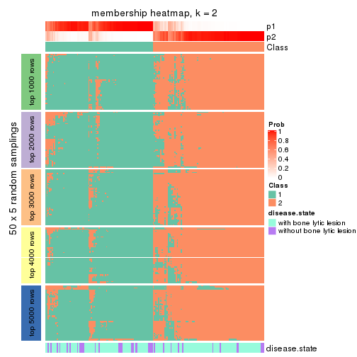</p>

</div>
<div id='tab-MAD-NMF-membership-heatmap-2'>
<pre><code class="r">membership_heatmap(res, k = 3)
</code></pre>

<p></p>

</div>
<div id='tab-MAD-NMF-membership-heatmap-3'>
<pre><code class="r">membership_heatmap(res, k = 4)
</code></pre>

<p></p>

</div>
<div id='tab-MAD-NMF-membership-heatmap-4'>
<pre><code class="r">membership_heatmap(res, k = 5)
</code></pre>

<p></p>

</div>
<div id='tab-MAD-NMF-membership-heatmap-5'>
<pre><code class="r">membership_heatmap(res, k = 6)
</code></pre>

<p>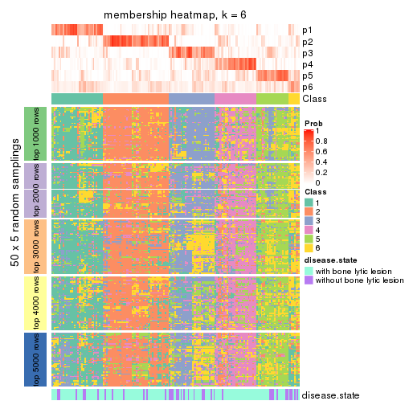</p>

</div>
</div>

As soon as we have had the classes for columns, we can look for signatures
which are significantly different between classes which can be candidate marks
for certain classes. Following are the heatmaps for signatures.


Signature heatmaps where rows are scaled:


<script>
$( function() {
	$( '#tabs-MAD-NMF-get-signatures' ).tabs();
} );
</script>
<div id='tabs-MAD-NMF-get-signatures'>
<ul>
<li><a href='#tab-MAD-NMF-get-signatures-1'>k = 2</a></li>
<li><a href='#tab-MAD-NMF-get-signatures-2'>k = 3</a></li>
<li><a href='#tab-MAD-NMF-get-signatures-3'>k = 4</a></li>
<li><a href='#tab-MAD-NMF-get-signatures-4'>k = 5</a></li>
<li><a href='#tab-MAD-NMF-get-signatures-5'>k = 6</a></li>
</ul>
<div id='tab-MAD-NMF-get-signatures-1'>
<pre><code class="r">get_signatures(res, k = 2)
</code></pre>

<p></p>

</div>
<div id='tab-MAD-NMF-get-signatures-2'>
<pre><code class="r">get_signatures(res, k = 3)
</code></pre>

<p></p>

</div>
<div id='tab-MAD-NMF-get-signatures-3'>
<pre><code class="r">get_signatures(res, k = 4)
</code></pre>

<p></p>

</div>
<div id='tab-MAD-NMF-get-signatures-4'>
<pre><code class="r">get_signatures(res, k = 5)
</code></pre>

<p></p>

</div>
<div id='tab-MAD-NMF-get-signatures-5'>
<pre><code class="r">get_signatures(res, k = 6)
</code></pre>

<p></p>

</div>
</div>


Signature heatmaps where rows are not scaled:


<script>
$( function() {
	$( '#tabs-MAD-NMF-get-signatures-no-scale' ).tabs();
} );
</script>
<div id='tabs-MAD-NMF-get-signatures-no-scale'>
<ul>
<li><a href='#tab-MAD-NMF-get-signatures-no-scale-1'>k = 2</a></li>
<li><a href='#tab-MAD-NMF-get-signatures-no-scale-2'>k = 3</a></li>
<li><a href='#tab-MAD-NMF-get-signatures-no-scale-3'>k = 4</a></li>
<li><a href='#tab-MAD-NMF-get-signatures-no-scale-4'>k = 5</a></li>
<li><a href='#tab-MAD-NMF-get-signatures-no-scale-5'>k = 6</a></li>
</ul>
<div id='tab-MAD-NMF-get-signatures-no-scale-1'>
<pre><code class="r">get_signatures(res, k = 2, scale_rows = FALSE)
</code></pre>

<p></p>

</div>
<div id='tab-MAD-NMF-get-signatures-no-scale-2'>
<pre><code class="r">get_signatures(res, k = 3, scale_rows = FALSE)
</code></pre>

<p></p>

</div>
<div id='tab-MAD-NMF-get-signatures-no-scale-3'>
<pre><code class="r">get_signatures(res, k = 4, scale_rows = FALSE)
</code></pre>

<p></p>

</div>
<div id='tab-MAD-NMF-get-signatures-no-scale-4'>
<pre><code class="r">get_signatures(res, k = 5, scale_rows = FALSE)
</code></pre>

<p></p>

</div>
<div id='tab-MAD-NMF-get-signatures-no-scale-5'>
<pre><code class="r">get_signatures(res, k = 6, scale_rows = FALSE)
</code></pre>

<p></p>

</div>
</div>


Compare the overlap of signatures from different k:

```r
compare_signatures(res)
```


`get_signature()` returns a data frame invisibly. TO get the list of signatures, the function
call should be assigned to a variable explicitly. In following code, if `plot` argument is set
to `FALSE`, no heatmap is plotted while only the differential analysis is performed.

```r
# code only for demonstration
tb = get_signature(res, k = ..., plot = FALSE)
```

An example of the output of `tb` is:

```
#>   which_row         fdr    mean_1    mean_2 scaled_mean_1 scaled_mean_2 km
#> 1        38 0.042760348  8.373488  9.131774    -0.5533452     0.5164555  1
#> 2        40 0.018707592  7.106213  8.469186    -0.6173731     0.5762149  1
#> 3        55 0.019134737 10.221463 11.207825    -0.6159697     0.5749050  1
#> 4        59 0.006059896  5.921854  7.869574    -0.6899429     0.6439467  1
#> 5        60 0.018055526  8.928898 10.211722    -0.6204761     0.5791110  1
#> 6        98 0.009384629 15.714769 14.887706     0.6635654    -0.6193277  2
...
```

The columns in `tb` are:

1. `which_row`: row indices corresponding to the input matrix.
2. `fdr`: FDR for the differential test. 
3. `mean_x`: The mean value in group x.
4. `scaled_mean_x`: The mean value in group x after rows are scaled.
5. `km`: Row groups if k-means clustering is applied to rows.


UMAP plot which shows how samples are separated.


<script>
$( function() {
	$( '#tabs-MAD-NMF-dimension-reduction' ).tabs();
} );
</script>
<div id='tabs-MAD-NMF-dimension-reduction'>
<ul>
<li><a href='#tab-MAD-NMF-dimension-reduction-1'>k = 2</a></li>
<li><a href='#tab-MAD-NMF-dimension-reduction-2'>k = 3</a></li>
<li><a href='#tab-MAD-NMF-dimension-reduction-3'>k = 4</a></li>
<li><a href='#tab-MAD-NMF-dimension-reduction-4'>k = 5</a></li>
<li><a href='#tab-MAD-NMF-dimension-reduction-5'>k = 6</a></li>
</ul>
<div id='tab-MAD-NMF-dimension-reduction-1'>
<pre><code class="r">dimension_reduction(res, k = 2, method = &quot;UMAP&quot;)
</code></pre>

<p></p>

</div>
<div id='tab-MAD-NMF-dimension-reduction-2'>
<pre><code class="r">dimension_reduction(res, k = 3, method = &quot;UMAP&quot;)
</code></pre>

<p></p>

</div>
<div id='tab-MAD-NMF-dimension-reduction-3'>
<pre><code class="r">dimension_reduction(res, k = 4, method = &quot;UMAP&quot;)
</code></pre>

<p></p>

</div>
<div id='tab-MAD-NMF-dimension-reduction-4'>
<pre><code class="r">dimension_reduction(res, k = 5, method = &quot;UMAP&quot;)
</code></pre>

<p></p>

</div>
<div id='tab-MAD-NMF-dimension-reduction-5'>
<pre><code class="r">dimension_reduction(res, k = 6, method = &quot;UMAP&quot;)
</code></pre>

<p></p>

</div>
</div>


Following heatmap shows how subgroups are split when increasing `k`:

```r
collect_classes(res)
```

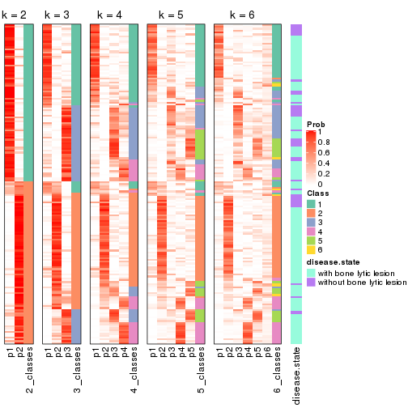


Test correlation between subgroups and known annotations. If the known
annotation is numeric, one-way ANOVA test is applied, and if the known
annotation is discrete, chi-squared contingency table test is applied.

```r
test_to_known_factors(res)
```

```
#>           n disease.state(p) k
#> MAD:NMF 158          0.01885 2
#> MAD:NMF 137          0.09590 3
#> MAD:NMF 111          0.00897 4
#> MAD:NMF  85          0.12391 5
#> MAD:NMF  54          0.24352 6
```


If matrix rows can be associated to genes, consider to use `GO_Enrichment(res,
...)` to perform function enrichment for the signature genes.


 

---------------------------------------------------


### ATC:hclust


The object with results only for a single top-value method and a single partition method 
can be extracted as:

```r
res = res_list["ATC", "hclust"]
# you can also extract it by
# res = res_list["ATC:hclust"]
```

A summary of `res` and all the functions that can be applied to it:

```r
res
```

```
#> A 'ConsensusPartition' object with k = 2, 3, 4, 5, 6.
#>   On a matrix with 11993 rows and 173 columns.
#>   Top rows (1000, 2000, 3000, 4000, 5000) are extracted by 'ATC' method.
#>   Subgroups are detected by 'hclust' method.
#>   Performed in total 1250 partitions by row resampling.
#>   Best k for subgroups seems to be 2.
#> 
#> Following methods can be applied to this 'ConsensusPartition' object:
#>  [1] "cola_report"             "collect_classes"         "collect_plots"          
#>  [4] "collect_stats"           "colnames"                "compare_signatures"     
#>  [7] "consensus_heatmap"       "dimension_reduction"     "functional_enrichment"  
#> [10] "get_anno_col"            "get_anno"                "get_classes"            
#> [13] "get_consensus"           "get_matrix"              "get_membership"         
#> [16] "get_param"               "get_signatures"          "get_stats"              
#> [19] "is_best_k"               "is_stable_k"             "membership_heatmap"     
#> [22] "ncol"                    "nrow"                    "plot_ecdf"              
#> [25] "rownames"                "select_partition_number" "show"                   
#> [28] "suggest_best_k"          "test_to_known_factors"
```

`collect_plots()` function collects all the plots made from `res` for all `k` (number of partitions)
into one single page to provide an easy and fast comparison between different `k`.

```r
collect_plots(res)
```


The plots are:

- The first row: a plot of the ECDF (Empirical cumulative distribution
  function) curves of the consensus matrix for each `k` and the heatmap of
  predicted classes for each `k`.
- The second row: heatmaps of the consensus matrix for each `k`.
- The third row: heatmaps of the membership matrix for each `k`.
- The fouth row: heatmaps of the signatures for each `k`.

All the plots in panels can be made by individual functions and they are
plotted later in this section.

`select_partition_number()` produces several plots showing different
statistics for choosing "optimized" `k`. There are following statistics:

- ECDF curves of the consensus matrix for each `k`;
- 1-PAC. [The PAC
  score](https://en.wikipedia.org/wiki/Consensus_clustering#Over-interpretation_potential_of_consensus_clustering)
  measures the proportion of the ambiguous subgrouping.
- Mean silhouette score.
- Concordance. The mean probability of fiting the consensus class ids in all
  partitions.
- Area increased. Denote $A_k$ as the area under the ECDF curve for current
  `k`, the area increased is defined as $A_k - A_{k-1}$.
- Rand index. The percent of pairs of samples that are both in a same cluster
  or both are not in a same cluster in the partition of k and k-1.
- Jaccard index. The ratio of pairs of samples are both in a same cluster in
  the partition of k and k-1 and the pairs of samples are both in a same
  cluster in the partition k or k-1.

The detailed explanations of these statistics can be found in [the cola
vignette](http://bioconductor.org/packages/devel/bioc/vignettes/cola/inst/doc/cola.html#toc_13).

Generally speaking, lower PAC score, higher mean silhouette score or higher
concordance corresponds to better partition. Rand index and Jaccard index
measure how similar the current partition is compared to partition with `k-1`.
If they are too similar, we won't accept `k` is better than `k-1`.

```r
select_partition_number(res)
```


The numeric values for all these statistics can be obtained by `get_stats()`.

```r
get_stats(res)
```

```
#>   k 1-PAC mean_silhouette concordance area_increased  Rand Jaccard
#> 2 2 0.178           0.646       0.812         0.4311 0.501   0.501
#> 3 3 0.218           0.601       0.744         0.3267 0.729   0.545
#> 4 4 0.296           0.322       0.608         0.1950 0.819   0.613
#> 5 5 0.370           0.397       0.610         0.0915 0.791   0.461
#> 6 6 0.440           0.409       0.621         0.0520 0.950   0.792
```

`suggest_best_k()` suggests the best $k$ based on these statistics. The rules are as follows:

- All $k$ with Jaccard index larger than 0.95 are removed because the increase of
  the partition number does not provides enough extra information. If all $k$ are removed,
  the best $k$ is assigned by `NA`.
- For $k$ with 1-PAC larger than 0.9, the maximal $k$ is taken as the "best k". Other $k$ is called "optional k".
- If it does not fit the second rule. The $k$ with the highest vote of highest
  1-PAC, mean silhouette and concordance is taken as the "best k".

```r
suggest_best_k(res)
```

```
#> [1] 2
```


Following shows the table of the partitions (You need to click the **show/hide
code output** link to see it). The membership matrix (columns with name `p*`)
is inferred by
[`clue::cl_consensus()`](https://www.rdocumentation.org/link/cl_consensus?package=clue)
function with the `SE` method. Basically the value in the membership matrix
represents the probability to belong to a certain group. The finall class
label for an item is determined with the group with highest probability it
belongs to.

In `get_classes()` function, the entropy is calculated from the membership
matrix and the silhouette score is calculated from the consensus matrix.


<script>
$( function() {
	$( '#tabs-ATC-hclust-get-classes' ).tabs();
} );
</script>
<div id='tabs-ATC-hclust-get-classes'>
<ul>
<li><a href='#tab-ATC-hclust-get-classes-1'>k = 2</a></li>
<li><a href='#tab-ATC-hclust-get-classes-2'>k = 3</a></li>
<li><a href='#tab-ATC-hclust-get-classes-3'>k = 4</a></li>
<li><a href='#tab-ATC-hclust-get-classes-4'>k = 5</a></li>
<li><a href='#tab-ATC-hclust-get-classes-5'>k = 6</a></li>
</ul>

<div id='tab-ATC-hclust-get-classes-1'>
<p><a id='tab-ATC-hclust-get-classes-1-a' style='color:#0366d6' href='#'>show/hide code output</a></p>
<pre><code class="r">cbind(get_classes(res, k = 2), get_membership(res, k = 2))
</code></pre>

<pre><code>#&gt;          class entropy silhouette    p1    p2
#&gt; GSM11437     1  0.3274     0.7360 0.940 0.060
#&gt; GSM11438     2  1.0000    -0.2287 0.496 0.504
#&gt; GSM11439     1  0.0000     0.7007 1.000 0.000
#&gt; GSM11440     2  0.0000     0.7910 0.000 1.000
#&gt; GSM11441     1  0.7602     0.7539 0.780 0.220
#&gt; GSM11442     1  0.9998     0.2816 0.508 0.492
#&gt; GSM11443     1  0.0672     0.7061 0.992 0.008
#&gt; GSM11444     1  0.7376     0.7577 0.792 0.208
#&gt; GSM11445     1  0.8207     0.7345 0.744 0.256
#&gt; GSM11446     1  0.0000     0.7007 1.000 0.000
#&gt; GSM11447     1  0.0000     0.7007 1.000 0.000
#&gt; GSM11448     1  0.9000     0.6818 0.684 0.316
#&gt; GSM11449     1  0.8016     0.7428 0.756 0.244
#&gt; GSM11450     1  0.7950     0.7451 0.760 0.240
#&gt; GSM11451     2  0.3431     0.7933 0.064 0.936
#&gt; GSM11452     2  0.7602     0.6695 0.220 0.780
#&gt; GSM11453     2  0.9850     0.0350 0.428 0.572
#&gt; GSM11454     1  0.2043     0.7209 0.968 0.032
#&gt; GSM11455     2  0.2778     0.7955 0.048 0.952
#&gt; GSM11456     2  0.9775     0.1585 0.412 0.588
#&gt; GSM11457     1  0.9775     0.5056 0.588 0.412
#&gt; GSM11458     1  0.0000     0.7007 1.000 0.000
#&gt; GSM11459     1  0.5408     0.7593 0.876 0.124
#&gt; GSM11460     1  0.6048     0.7635 0.852 0.148
#&gt; GSM11461     1  0.3584     0.7403 0.932 0.068
#&gt; GSM11462     1  0.6343     0.7640 0.840 0.160
#&gt; GSM11463     1  0.5178     0.7531 0.884 0.116
#&gt; GSM11464     1  1.0000     0.3053 0.504 0.496
#&gt; GSM11465     2  0.2236     0.7987 0.036 0.964
#&gt; GSM11466     2  0.0672     0.7947 0.008 0.992
#&gt; GSM11467     2  0.0938     0.7946 0.012 0.988
#&gt; GSM11468     2  0.2603     0.7939 0.044 0.956
#&gt; GSM11469     2  0.2603     0.7939 0.044 0.956
#&gt; GSM11470     1  0.9993     0.3439 0.516 0.484
#&gt; GSM11471     1  0.9993     0.3448 0.516 0.484
#&gt; GSM11472     1  0.9000     0.6829 0.684 0.316
#&gt; GSM11473     1  0.0000     0.7007 1.000 0.000
#&gt; GSM11474     1  0.9933     0.3821 0.548 0.452
#&gt; GSM11475     1  0.8207     0.7345 0.744 0.256
#&gt; GSM11476     2  0.9850     0.0624 0.428 0.572
#&gt; GSM11477     2  0.9732     0.1994 0.404 0.596
#&gt; GSM11478     2  0.1633     0.7967 0.024 0.976
#&gt; GSM11479     1  0.7453     0.7581 0.788 0.212
#&gt; GSM11480     2  0.1184     0.7962 0.016 0.984
#&gt; GSM11481     2  0.2236     0.7986 0.036 0.964
#&gt; GSM11482     2  0.0000     0.7910 0.000 1.000
#&gt; GSM11483     1  0.9866     0.4621 0.568 0.432
#&gt; GSM11484     2  0.5946     0.7426 0.144 0.856
#&gt; GSM11485     2  0.6438     0.7282 0.164 0.836
#&gt; GSM11486     1  0.9087     0.6611 0.676 0.324
#&gt; GSM11487     1  0.9732     0.5459 0.596 0.404
#&gt; GSM11488     2  0.5946     0.7426 0.144 0.856
#&gt; GSM11489     2  0.9909     0.0139 0.444 0.556
#&gt; GSM11490     1  0.7376     0.7577 0.792 0.208
#&gt; GSM11491     1  0.9922     0.4447 0.552 0.448
#&gt; GSM11492     1  0.9393     0.6413 0.644 0.356
#&gt; GSM11493     2  0.7376     0.6791 0.208 0.792
#&gt; GSM11494     1  0.6973     0.7625 0.812 0.188
#&gt; GSM11495     1  0.9580     0.5708 0.620 0.380
#&gt; GSM11496     1  0.0000     0.7007 1.000 0.000
#&gt; GSM11497     1  0.5178     0.7531 0.884 0.116
#&gt; GSM11498     1  0.9087     0.6703 0.676 0.324
#&gt; GSM11499     1  0.9815     0.4867 0.580 0.420
#&gt; GSM11500     1  0.0376     0.7034 0.996 0.004
#&gt; GSM11501     2  0.0000     0.7910 0.000 1.000
#&gt; GSM11502     2  0.8955     0.5076 0.312 0.688
#&gt; GSM11503     1  0.5842     0.7611 0.860 0.140
#&gt; GSM11504     1  0.7883     0.7476 0.764 0.236
#&gt; GSM11505     1  0.1414     0.7138 0.980 0.020
#&gt; GSM11506     1  0.5294     0.7577 0.880 0.120
#&gt; GSM11507     2  0.8955     0.5076 0.312 0.688
#&gt; GSM11508     1  0.6623     0.7636 0.828 0.172
#&gt; GSM11509     1  0.7219     0.7602 0.800 0.200
#&gt; GSM11510     1  0.9209     0.6545 0.664 0.336
#&gt; GSM11511     1  0.0000     0.7007 1.000 0.000
#&gt; GSM11512     2  0.2236     0.7988 0.036 0.964
#&gt; GSM11513     1  0.5408     0.7593 0.876 0.124
#&gt; GSM11514     2  0.0000     0.7910 0.000 1.000
#&gt; GSM11515     1  0.7139     0.7616 0.804 0.196
#&gt; GSM11516     2  0.7528     0.6729 0.216 0.784
#&gt; GSM11517     1  0.9129     0.6748 0.672 0.328
#&gt; GSM11518     1  0.7602     0.7531 0.780 0.220
#&gt; GSM11519     2  0.9996    -0.2491 0.488 0.512
#&gt; GSM11520     1  0.9896     0.4659 0.560 0.440
#&gt; GSM11521     2  0.0000     0.7910 0.000 1.000
#&gt; GSM11522     1  0.8386     0.7259 0.732 0.268
#&gt; GSM11523     1  0.0000     0.7007 1.000 0.000
#&gt; GSM11524     2  0.0672     0.7947 0.008 0.992
#&gt; GSM11525     2  0.8443     0.5777 0.272 0.728
#&gt; GSM11526     1  0.6623     0.7613 0.828 0.172
#&gt; GSM11527     1  0.9087     0.6517 0.676 0.324
#&gt; GSM11528     2  0.9358     0.3728 0.352 0.648
#&gt; GSM11529     2  0.8443     0.5777 0.272 0.728
#&gt; GSM11530     1  0.8207     0.7345 0.744 0.256
#&gt; GSM11531     1  0.4690     0.7501 0.900 0.100
#&gt; GSM11532     1  0.8713     0.7081 0.708 0.292
#&gt; GSM11533     1  0.9427     0.5913 0.640 0.360
#&gt; GSM11534     2  0.9044     0.4712 0.320 0.680
#&gt; GSM11535     1  0.6887     0.7518 0.816 0.184
#&gt; GSM11536     2  0.0000     0.7910 0.000 1.000
#&gt; GSM11537     2  0.0672     0.7944 0.008 0.992
#&gt; GSM11538     2  0.0000     0.7910 0.000 1.000
#&gt; GSM11539     1  0.8499     0.7038 0.724 0.276
#&gt; GSM11540     2  0.2778     0.7955 0.048 0.952
#&gt; GSM11541     1  0.9580     0.5684 0.620 0.380
#&gt; GSM11542     2  0.9358     0.3728 0.352 0.648
#&gt; GSM11543     1  0.9170     0.6644 0.668 0.332
#&gt; GSM11544     1  0.9909     0.4567 0.556 0.444
#&gt; GSM11545     1  0.9944     0.4241 0.544 0.456
#&gt; GSM11546     1  0.0000     0.7007 1.000 0.000
#&gt; GSM11547     1  0.0000     0.7007 1.000 0.000
#&gt; GSM11548     1  0.4298     0.7491 0.912 0.088
#&gt; GSM11549     1  0.4939     0.7566 0.892 0.108
#&gt; GSM11550     1  0.9044     0.6780 0.680 0.320
#&gt; GSM11551     1  0.5408     0.7606 0.876 0.124
#&gt; GSM11552     1  0.6343     0.7640 0.840 0.160
#&gt; GSM11553     2  0.1414     0.7974 0.020 0.980
#&gt; GSM11554     2  0.0672     0.7944 0.008 0.992
#&gt; GSM11555     2  0.2236     0.7990 0.036 0.964
#&gt; GSM11556     1  0.9323     0.6463 0.652 0.348
#&gt; GSM11557     1  0.4939     0.7533 0.892 0.108
#&gt; GSM11558     2  0.0938     0.7952 0.012 0.988
#&gt; GSM11559     2  0.7528     0.6648 0.216 0.784
#&gt; GSM11560     1  0.0000     0.7007 1.000 0.000
#&gt; GSM11561     2  0.0938     0.7952 0.012 0.988
#&gt; GSM11562     2  0.0376     0.7926 0.004 0.996
#&gt; GSM11563     2  0.2948     0.7969 0.052 0.948
#&gt; GSM11564     1  0.9661     0.5702 0.608 0.392
#&gt; GSM11565     1  0.9491     0.6111 0.632 0.368
#&gt; GSM11566     2  0.4298     0.7838 0.088 0.912
#&gt; GSM11567     2  0.0000     0.7910 0.000 1.000
#&gt; GSM11568     2  0.9896     0.0321 0.440 0.560
#&gt; GSM11569     2  0.0672     0.7944 0.008 0.992
#&gt; GSM11570     1  0.6343     0.7640 0.840 0.160
#&gt; GSM11571     2  0.9922    -0.0278 0.448 0.552
#&gt; GSM11572     2  0.0000     0.7910 0.000 1.000
#&gt; GSM11573     2  0.0000     0.7910 0.000 1.000
#&gt; GSM11574     2  0.6048     0.7415 0.148 0.852
#&gt; GSM11575     1  0.7674     0.7547 0.776 0.224
#&gt; GSM11576     1  0.0000     0.7007 1.000 0.000
#&gt; GSM11577     2  0.6343     0.7354 0.160 0.840
#&gt; GSM11578     2  0.6438     0.7283 0.164 0.836
#&gt; GSM11579     2  0.4298     0.7838 0.088 0.912
#&gt; GSM11580     2  0.7815     0.6530 0.232 0.768
#&gt; GSM11581     2  0.7139     0.6801 0.196 0.804
#&gt; GSM11582     2  0.0376     0.7924 0.004 0.996
#&gt; GSM11583     1  0.2423     0.7257 0.960 0.040
#&gt; GSM11584     2  0.0000     0.7910 0.000 1.000
#&gt; GSM11585     2  0.7602     0.6692 0.220 0.780
#&gt; GSM11586     2  0.2423     0.7944 0.040 0.960
#&gt; GSM11587     1  0.0000     0.7007 1.000 0.000
#&gt; GSM11588     2  0.0000     0.7910 0.000 1.000
#&gt; GSM11589     2  0.4939     0.7707 0.108 0.892
#&gt; GSM11590     2  0.4815     0.7726 0.104 0.896
#&gt; GSM11591     2  0.7376     0.6779 0.208 0.792
#&gt; GSM11592     2  0.9580     0.2465 0.380 0.620
#&gt; GSM11593     2  0.9087     0.4262 0.324 0.676
#&gt; GSM11594     1  1.0000     0.3053 0.504 0.496
#&gt; GSM11595     2  0.0000     0.7910 0.000 1.000
#&gt; GSM11596     2  0.9922    -0.0278 0.448 0.552
#&gt; GSM11597     1  0.9866     0.4841 0.568 0.432
#&gt; GSM11598     1  0.9954     0.4131 0.540 0.460
#&gt; GSM11599     2  0.2603     0.7939 0.044 0.956
#&gt; GSM11600     2  0.4815     0.7758 0.104 0.896
#&gt; GSM11601     1  0.9866     0.4844 0.568 0.432
#&gt; GSM11602     1  0.4161     0.7481 0.916 0.084
#&gt; GSM11603     1  0.0000     0.7007 1.000 0.000
#&gt; GSM11604     1  0.9998     0.3164 0.508 0.492
#&gt; GSM11605     2  0.1414     0.7966 0.020 0.980
#&gt; GSM11606     2  0.6048     0.7415 0.148 0.852
#&gt; GSM11607     1  0.9954     0.4131 0.540 0.460
#&gt; GSM11608     1  0.4161     0.7481 0.916 0.084
#&gt; GSM11609     2  0.0000     0.7910 0.000 1.000
</code></pre>

<script>
$('#tab-ATC-hclust-get-classes-1-a').parent().next().next().hide();
$('#tab-ATC-hclust-get-classes-1-a').click(function(){
  $('#tab-ATC-hclust-get-classes-1-a').parent().next().next().toggle();
  return(false);
});
</script>
</div>

<div id='tab-ATC-hclust-get-classes-2'>
<p><a id='tab-ATC-hclust-get-classes-2-a' style='color:#0366d6' href='#'>show/hide code output</a></p>
<pre><code class="r">cbind(get_classes(res, k = 3), get_membership(res, k = 3))
</code></pre>

<pre><code>#&gt;          class entropy silhouette    p1    p2    p3
#&gt; GSM11437     3   0.620    0.52466 0.424 0.000 0.576
#&gt; GSM11438     1   0.707    0.59740 0.700 0.228 0.072
#&gt; GSM11439     3   0.484    0.79265 0.224 0.000 0.776
#&gt; GSM11440     2   0.263    0.79540 0.084 0.916 0.000
#&gt; GSM11441     1   0.321    0.64907 0.904 0.012 0.084
#&gt; GSM11442     1   0.693    0.59273 0.700 0.240 0.060
#&gt; GSM11443     3   0.631    0.39214 0.492 0.000 0.508
#&gt; GSM11444     1   0.468    0.61821 0.832 0.020 0.148
#&gt; GSM11445     1   0.350    0.67099 0.900 0.028 0.072
#&gt; GSM11446     3   0.435    0.80255 0.184 0.000 0.816
#&gt; GSM11447     3   0.484    0.79265 0.224 0.000 0.776
#&gt; GSM11448     1   0.378    0.69932 0.892 0.064 0.044
#&gt; GSM11449     1   0.323    0.66591 0.908 0.020 0.072
#&gt; GSM11450     1   0.333    0.66368 0.904 0.020 0.076
#&gt; GSM11451     2   0.630    0.73540 0.248 0.720 0.032
#&gt; GSM11452     2   0.757    0.31039 0.456 0.504 0.040
#&gt; GSM11453     1   0.587    0.46881 0.684 0.312 0.004
#&gt; GSM11454     3   0.599    0.65432 0.368 0.000 0.632
#&gt; GSM11455     2   0.583    0.76511 0.204 0.764 0.032
#&gt; GSM11456     1   0.718    0.42732 0.648 0.304 0.048
#&gt; GSM11457     1   0.659    0.68470 0.756 0.132 0.112
#&gt; GSM11458     3   0.236    0.79302 0.072 0.000 0.928
#&gt; GSM11459     1   0.502    0.45694 0.760 0.000 0.240
#&gt; GSM11460     1   0.566    0.42690 0.712 0.004 0.284
#&gt; GSM11461     3   0.630    0.37583 0.476 0.000 0.524
#&gt; GSM11462     1   0.569    0.46425 0.724 0.008 0.268
#&gt; GSM11463     1   0.607    0.34160 0.676 0.008 0.316
#&gt; GSM11464     1   0.502    0.62351 0.776 0.220 0.004
#&gt; GSM11465     2   0.423    0.80066 0.148 0.844 0.008
#&gt; GSM11466     2   0.312    0.80229 0.108 0.892 0.000
#&gt; GSM11467     2   0.296    0.79623 0.100 0.900 0.000
#&gt; GSM11468     2   0.394    0.78897 0.156 0.844 0.000
#&gt; GSM11469     2   0.394    0.78897 0.156 0.844 0.000
#&gt; GSM11470     1   0.511    0.63310 0.780 0.212 0.008
#&gt; GSM11471     1   0.488    0.63466 0.788 0.208 0.004
#&gt; GSM11472     1   0.397    0.70116 0.884 0.072 0.044
#&gt; GSM11473     3   0.576    0.72260 0.328 0.000 0.672
#&gt; GSM11474     1   0.734    0.63953 0.700 0.192 0.108
#&gt; GSM11475     1   0.350    0.67099 0.900 0.028 0.072
#&gt; GSM11476     1   0.755    0.44702 0.620 0.320 0.060
#&gt; GSM11477     1   0.740    0.36543 0.624 0.324 0.052
#&gt; GSM11478     2   0.547    0.78812 0.176 0.792 0.032
#&gt; GSM11479     1   0.447    0.64402 0.852 0.028 0.120
#&gt; GSM11480     2   0.524    0.78953 0.160 0.808 0.032
#&gt; GSM11481     2   0.361    0.79553 0.112 0.880 0.008
#&gt; GSM11482     2   0.219    0.75716 0.024 0.948 0.028
#&gt; GSM11483     1   0.603    0.66349 0.776 0.164 0.060
#&gt; GSM11484     2   0.676    0.63912 0.288 0.676 0.036
#&gt; GSM11485     2   0.700    0.58932 0.340 0.628 0.032
#&gt; GSM11486     1   0.616    0.67162 0.780 0.092 0.128
#&gt; GSM11487     1   0.448    0.70107 0.844 0.136 0.020
#&gt; GSM11488     2   0.676    0.63912 0.288 0.676 0.036
#&gt; GSM11489     1   0.716    0.49420 0.668 0.276 0.056
#&gt; GSM11490     1   0.468    0.61821 0.832 0.020 0.148
#&gt; GSM11491     1   0.459    0.66837 0.820 0.172 0.008
#&gt; GSM11492     1   0.380    0.70895 0.884 0.092 0.024
#&gt; GSM11493     2   0.702    0.51137 0.344 0.624 0.032
#&gt; GSM11494     1   0.490    0.58464 0.812 0.016 0.172
#&gt; GSM11495     1   0.674    0.67434 0.744 0.156 0.100
#&gt; GSM11496     3   0.579    0.71763 0.332 0.000 0.668
#&gt; GSM11497     1   0.607    0.34160 0.676 0.008 0.316
#&gt; GSM11498     1   0.574    0.68670 0.804 0.096 0.100
#&gt; GSM11499     1   0.606    0.66996 0.776 0.160 0.064
#&gt; GSM11500     3   0.611    0.63028 0.396 0.000 0.604
#&gt; GSM11501     2   0.304    0.76446 0.040 0.920 0.040
#&gt; GSM11502     1   0.764    0.08409 0.556 0.396 0.048
#&gt; GSM11503     1   0.546    0.46361 0.748 0.008 0.244
#&gt; GSM11504     1   0.454    0.63897 0.848 0.028 0.124
#&gt; GSM11505     1   0.628   -0.25976 0.540 0.000 0.460
#&gt; GSM11506     1   0.552    0.40822 0.728 0.004 0.268
#&gt; GSM11507     1   0.766    0.05545 0.548 0.404 0.048
#&gt; GSM11508     1   0.481    0.55914 0.804 0.008 0.188
#&gt; GSM11509     1   0.368    0.63066 0.876 0.008 0.116
#&gt; GSM11510     1   0.582    0.68887 0.800 0.104 0.096
#&gt; GSM11511     3   0.280    0.80171 0.092 0.000 0.908
#&gt; GSM11512     2   0.398    0.80206 0.144 0.852 0.004
#&gt; GSM11513     1   0.502    0.45694 0.760 0.000 0.240
#&gt; GSM11514     2   0.254    0.79486 0.080 0.920 0.000
#&gt; GSM11515     1   0.522    0.58954 0.800 0.024 0.176
#&gt; GSM11516     2   0.748    0.31508 0.460 0.504 0.036
#&gt; GSM11517     1   0.376    0.70583 0.892 0.068 0.040
#&gt; GSM11518     1   0.377    0.64376 0.880 0.016 0.104
#&gt; GSM11519     1   0.520    0.60241 0.760 0.236 0.004
#&gt; GSM11520     1   0.469    0.67438 0.820 0.168 0.012
#&gt; GSM11521     2   0.304    0.76446 0.040 0.920 0.040
#&gt; GSM11522     1   0.397    0.68001 0.884 0.044 0.072
#&gt; GSM11523     3   0.236    0.79302 0.072 0.000 0.928
#&gt; GSM11524     2   0.312    0.80229 0.108 0.892 0.000
#&gt; GSM11525     1   0.756   -0.06336 0.516 0.444 0.040
#&gt; GSM11526     1   0.629    0.46018 0.704 0.024 0.272
#&gt; GSM11527     1   0.671    0.66363 0.748 0.112 0.140
#&gt; GSM11528     1   0.753    0.17509 0.564 0.392 0.044
#&gt; GSM11529     1   0.756   -0.06336 0.516 0.444 0.040
#&gt; GSM11530     1   0.350    0.67099 0.900 0.028 0.072
#&gt; GSM11531     1   0.610    0.33266 0.672 0.008 0.320
#&gt; GSM11532     1   0.390    0.69061 0.888 0.056 0.056
#&gt; GSM11533     1   0.725    0.66203 0.712 0.120 0.168
#&gt; GSM11534     1   0.738   -0.16272 0.516 0.452 0.032
#&gt; GSM11535     1   0.634    0.53766 0.724 0.036 0.240
#&gt; GSM11536     2   0.232    0.75648 0.028 0.944 0.028
#&gt; GSM11537     2   0.466    0.79739 0.124 0.844 0.032
#&gt; GSM11538     2   0.219    0.75747 0.024 0.948 0.028
#&gt; GSM11539     1   0.665    0.64850 0.744 0.084 0.172
#&gt; GSM11540     2   0.597    0.75724 0.216 0.752 0.032
#&gt; GSM11541     1   0.711    0.64802 0.720 0.168 0.112
#&gt; GSM11542     1   0.753    0.17509 0.564 0.392 0.044
#&gt; GSM11543     1   0.328    0.70137 0.908 0.068 0.024
#&gt; GSM11544     1   0.495    0.67030 0.808 0.176 0.016
#&gt; GSM11545     1   0.470    0.66076 0.812 0.180 0.008
#&gt; GSM11546     3   0.280    0.80014 0.092 0.000 0.908
#&gt; GSM11547     3   0.280    0.80014 0.092 0.000 0.908
#&gt; GSM11548     1   0.608    0.23216 0.652 0.004 0.344
#&gt; GSM11549     1   0.603    0.20707 0.624 0.000 0.376
#&gt; GSM11550     1   0.388    0.70007 0.888 0.068 0.044
#&gt; GSM11551     1   0.552    0.42389 0.728 0.004 0.268
#&gt; GSM11552     1   0.569    0.46425 0.724 0.008 0.268
#&gt; GSM11553     2   0.506    0.79960 0.148 0.820 0.032
#&gt; GSM11554     2   0.466    0.79739 0.124 0.844 0.032
#&gt; GSM11555     2   0.385    0.78250 0.108 0.876 0.016
#&gt; GSM11556     1   0.364    0.70602 0.892 0.084 0.024
#&gt; GSM11557     1   0.602    0.36186 0.684 0.008 0.308
#&gt; GSM11558     2   0.506    0.79221 0.148 0.820 0.032
#&gt; GSM11559     2   0.659    0.44702 0.424 0.568 0.008
#&gt; GSM11560     3   0.362    0.80512 0.136 0.000 0.864
#&gt; GSM11561     2   0.506    0.79221 0.148 0.820 0.032
#&gt; GSM11562     2   0.368    0.79353 0.080 0.892 0.028
#&gt; GSM11563     2   0.460    0.79812 0.152 0.832 0.016
#&gt; GSM11564     1   0.428    0.70690 0.856 0.124 0.020
#&gt; GSM11565     1   0.391    0.70725 0.876 0.104 0.020
#&gt; GSM11566     2   0.659    0.69617 0.280 0.688 0.032
#&gt; GSM11567     2   0.219    0.75716 0.024 0.948 0.028
#&gt; GSM11568     1   0.732    0.50697 0.668 0.264 0.068
#&gt; GSM11569     2   0.518    0.79119 0.156 0.812 0.032
#&gt; GSM11570     1   0.569    0.46425 0.724 0.008 0.268
#&gt; GSM11571     1   0.644    0.54291 0.720 0.240 0.040
#&gt; GSM11572     2   0.271    0.79668 0.088 0.912 0.000
#&gt; GSM11573     2   0.263    0.79540 0.084 0.916 0.000
#&gt; GSM11574     2   0.716    0.55123 0.372 0.596 0.032
#&gt; GSM11575     1   0.595    0.60793 0.764 0.040 0.196
#&gt; GSM11576     3   0.362    0.80512 0.136 0.000 0.864
#&gt; GSM11577     2   0.719    0.56217 0.356 0.608 0.036
#&gt; GSM11578     2   0.728    0.48697 0.404 0.564 0.032
#&gt; GSM11579     2   0.659    0.69617 0.280 0.688 0.032
#&gt; GSM11580     2   0.749    0.26342 0.468 0.496 0.036
#&gt; GSM11581     2   0.623    0.56408 0.340 0.652 0.008
#&gt; GSM11582     2   0.280    0.79603 0.092 0.908 0.000
#&gt; GSM11583     3   0.581    0.64730 0.336 0.000 0.664
#&gt; GSM11584     2   0.219    0.75716 0.024 0.948 0.028
#&gt; GSM11585     2   0.757    0.32236 0.448 0.512 0.040
#&gt; GSM11586     2   0.412    0.79470 0.168 0.832 0.000
#&gt; GSM11587     3   0.236    0.79302 0.072 0.000 0.928
#&gt; GSM11588     2   0.263    0.79540 0.084 0.916 0.000
#&gt; GSM11589     2   0.636    0.69550 0.280 0.696 0.024
#&gt; GSM11590     2   0.518    0.73240 0.256 0.744 0.000
#&gt; GSM11591     2   0.749    0.29538 0.468 0.496 0.036
#&gt; GSM11592     1   0.614    0.22619 0.596 0.404 0.000
#&gt; GSM11593     1   0.650   -0.00162 0.536 0.460 0.004
#&gt; GSM11594     1   0.502    0.62351 0.776 0.220 0.004
#&gt; GSM11595     2   0.271    0.79778 0.088 0.912 0.000
#&gt; GSM11596     1   0.644    0.54291 0.720 0.240 0.040
#&gt; GSM11597     1   0.478    0.68241 0.820 0.164 0.016
#&gt; GSM11598     1   0.475    0.65724 0.808 0.184 0.008
#&gt; GSM11599     2   0.394    0.79040 0.156 0.844 0.000
#&gt; GSM11600     2   0.538    0.71945 0.236 0.756 0.008
#&gt; GSM11601     1   0.478    0.68361 0.820 0.164 0.016
#&gt; GSM11602     1   0.621    0.04219 0.572 0.000 0.428
#&gt; GSM11603     3   0.236    0.79302 0.072 0.000 0.928
#&gt; GSM11604     1   0.502    0.62606 0.776 0.220 0.004
#&gt; GSM11605     2   0.304    0.78742 0.084 0.908 0.008
#&gt; GSM11606     2   0.716    0.55123 0.372 0.596 0.032
#&gt; GSM11607     1   0.475    0.65724 0.808 0.184 0.008
#&gt; GSM11608     1   0.621    0.04219 0.572 0.000 0.428
#&gt; GSM11609     2   0.129    0.73357 0.000 0.968 0.032
</code></pre>

<script>
$('#tab-ATC-hclust-get-classes-2-a').parent().next().next().hide();
$('#tab-ATC-hclust-get-classes-2-a').click(function(){
  $('#tab-ATC-hclust-get-classes-2-a').parent().next().next().toggle();
  return(false);
});
</script>
</div>

<div id='tab-ATC-hclust-get-classes-3'>
<p><a id='tab-ATC-hclust-get-classes-3-a' style='color:#0366d6' href='#'>show/hide code output</a></p>
<pre><code class="r">cbind(get_classes(res, k = 4), get_membership(res, k = 4))
</code></pre>

<pre><code>#&gt;          class entropy silhouette    p1    p2    p3    p4
#&gt; GSM11437     3   0.736     0.3110 0.216 0.260 0.524 0.000
#&gt; GSM11438     1   0.696    -0.0157 0.504 0.400 0.008 0.088
#&gt; GSM11439     3   0.551     0.6184 0.084 0.196 0.720 0.000
#&gt; GSM11440     4   0.297     0.7343 0.144 0.000 0.000 0.856
#&gt; GSM11441     1   0.537     0.0563 0.692 0.264 0.044 0.000
#&gt; GSM11442     2   0.714     0.1656 0.408 0.460 0.000 0.132
#&gt; GSM11443     2   0.738    -0.0500 0.168 0.468 0.364 0.000
#&gt; GSM11444     1   0.647    -0.0408 0.608 0.288 0.104 0.000
#&gt; GSM11445     1   0.532     0.0613 0.672 0.296 0.032 0.000
#&gt; GSM11446     3   0.449     0.6536 0.060 0.140 0.800 0.000
#&gt; GSM11447     3   0.551     0.6184 0.084 0.196 0.720 0.000
#&gt; GSM11448     1   0.409     0.2593 0.828 0.136 0.028 0.008
#&gt; GSM11449     1   0.528     0.0881 0.704 0.252 0.044 0.000
#&gt; GSM11450     1   0.536     0.0826 0.700 0.252 0.048 0.000
#&gt; GSM11451     4   0.760     0.5560 0.224 0.308 0.000 0.468
#&gt; GSM11452     1   0.771    -0.0722 0.444 0.308 0.000 0.248
#&gt; GSM11453     1   0.476     0.3443 0.768 0.048 0.000 0.184
#&gt; GSM11454     3   0.682     0.4569 0.212 0.184 0.604 0.000
#&gt; GSM11455     4   0.728     0.6183 0.188 0.284 0.000 0.528
#&gt; GSM11456     1   0.704     0.1817 0.532 0.328 0.000 0.140
#&gt; GSM11457     1   0.660    -0.1003 0.512 0.428 0.036 0.024
#&gt; GSM11458     3   0.000     0.6735 0.000 0.000 1.000 0.000
#&gt; GSM11459     1   0.734    -0.1766 0.520 0.284 0.196 0.000
#&gt; GSM11460     1   0.792    -0.3707 0.380 0.380 0.236 0.004
#&gt; GSM11461     3   0.762     0.1691 0.244 0.284 0.472 0.000
#&gt; GSM11462     1   0.763    -0.3130 0.440 0.348 0.212 0.000
#&gt; GSM11463     2   0.724     0.5287 0.276 0.536 0.188 0.000
#&gt; GSM11464     1   0.293     0.3750 0.880 0.012 0.000 0.108
#&gt; GSM11465     4   0.547     0.7157 0.220 0.068 0.000 0.712
#&gt; GSM11466     4   0.349     0.7355 0.172 0.004 0.000 0.824
#&gt; GSM11467     4   0.350     0.7334 0.160 0.008 0.000 0.832
#&gt; GSM11468     4   0.416     0.7056 0.224 0.008 0.000 0.768
#&gt; GSM11469     4   0.416     0.7056 0.224 0.008 0.000 0.768
#&gt; GSM11470     1   0.280     0.3753 0.884 0.008 0.000 0.108
#&gt; GSM11471     1   0.261     0.3760 0.896 0.008 0.000 0.096
#&gt; GSM11472     1   0.392     0.2439 0.828 0.148 0.016 0.008
#&gt; GSM11473     3   0.692     0.4300 0.124 0.340 0.536 0.000
#&gt; GSM11474     1   0.705    -0.0589 0.460 0.452 0.020 0.068
#&gt; GSM11475     1   0.530     0.0647 0.676 0.292 0.032 0.000
#&gt; GSM11476     2   0.756     0.1338 0.360 0.444 0.000 0.196
#&gt; GSM11477     1   0.702     0.1431 0.484 0.396 0.000 0.120
#&gt; GSM11478     4   0.703     0.6577 0.156 0.288 0.000 0.556
#&gt; GSM11479     1   0.638    -0.2026 0.556 0.388 0.044 0.012
#&gt; GSM11480     4   0.681     0.6534 0.128 0.300 0.000 0.572
#&gt; GSM11481     4   0.371     0.7261 0.132 0.028 0.000 0.840
#&gt; GSM11482     4   0.295     0.6913 0.024 0.088 0.000 0.888
#&gt; GSM11483     2   0.647     0.3010 0.388 0.536 0.000 0.076
#&gt; GSM11484     4   0.734     0.5177 0.192 0.292 0.000 0.516
#&gt; GSM11485     4   0.760     0.4483 0.216 0.324 0.000 0.460
#&gt; GSM11486     2   0.702     0.4643 0.348 0.560 0.036 0.056
#&gt; GSM11487     1   0.350     0.3347 0.872 0.084 0.008 0.036
#&gt; GSM11488     4   0.734     0.5177 0.192 0.292 0.000 0.516
#&gt; GSM11489     1   0.670     0.1604 0.544 0.356 0.000 0.100
#&gt; GSM11490     1   0.647    -0.0408 0.608 0.288 0.104 0.000
#&gt; GSM11491     1   0.272     0.3695 0.904 0.032 0.000 0.064
#&gt; GSM11492     1   0.489     0.2159 0.764 0.196 0.012 0.028
#&gt; GSM11493     4   0.748     0.3969 0.208 0.300 0.000 0.492
#&gt; GSM11494     1   0.724    -0.3052 0.464 0.408 0.124 0.004
#&gt; GSM11495     1   0.694    -0.1694 0.516 0.404 0.028 0.052
#&gt; GSM11496     3   0.695     0.4205 0.124 0.348 0.528 0.000
#&gt; GSM11497     2   0.724     0.5287 0.276 0.536 0.188 0.000
#&gt; GSM11498     1   0.669    -0.3224 0.488 0.448 0.040 0.024
#&gt; GSM11499     2   0.658     0.3176 0.384 0.540 0.004 0.072
#&gt; GSM11500     3   0.726     0.3092 0.156 0.352 0.492 0.000
#&gt; GSM11501     4   0.451     0.7082 0.044 0.168 0.000 0.788
#&gt; GSM11502     1   0.747     0.1377 0.436 0.388 0.000 0.176
#&gt; GSM11503     2   0.735     0.5583 0.320 0.528 0.144 0.008
#&gt; GSM11504     2   0.689     0.3888 0.424 0.492 0.072 0.012
#&gt; GSM11505     2   0.743     0.1296 0.192 0.492 0.316 0.000
#&gt; GSM11506     2   0.726     0.5390 0.292 0.544 0.160 0.004
#&gt; GSM11507     1   0.749     0.1206 0.428 0.392 0.000 0.180
#&gt; GSM11508     1   0.737    -0.3033 0.456 0.400 0.140 0.004
#&gt; GSM11509     1   0.588    -0.0216 0.656 0.276 0.068 0.000
#&gt; GSM11510     1   0.670    -0.2986 0.500 0.436 0.036 0.028
#&gt; GSM11511     3   0.141     0.6841 0.016 0.024 0.960 0.000
#&gt; GSM11512     4   0.492     0.7276 0.200 0.048 0.000 0.752
#&gt; GSM11513     1   0.734    -0.1766 0.520 0.284 0.196 0.000
#&gt; GSM11514     4   0.325     0.7380 0.140 0.008 0.000 0.852
#&gt; GSM11515     1   0.738    -0.2791 0.472 0.392 0.128 0.008
#&gt; GSM11516     1   0.770    -0.0754 0.448 0.304 0.000 0.248
#&gt; GSM11517     1   0.469     0.1566 0.704 0.288 0.004 0.004
#&gt; GSM11518     1   0.584     0.0362 0.656 0.280 0.064 0.000
#&gt; GSM11519     1   0.382     0.3699 0.844 0.048 0.000 0.108
#&gt; GSM11520     1   0.291     0.3670 0.896 0.040 0.000 0.064
#&gt; GSM11521     4   0.451     0.7082 0.044 0.168 0.000 0.788
#&gt; GSM11522     1   0.493     0.1344 0.728 0.240 0.032 0.000
#&gt; GSM11523     3   0.000     0.6735 0.000 0.000 1.000 0.000
#&gt; GSM11524     4   0.331     0.7348 0.172 0.000 0.000 0.828
#&gt; GSM11525     1   0.750     0.0869 0.464 0.344 0.000 0.192
#&gt; GSM11526     1   0.765    -0.3602 0.424 0.364 0.212 0.000
#&gt; GSM11527     2   0.717     0.3709 0.412 0.496 0.056 0.036
#&gt; GSM11528     1   0.749     0.1863 0.472 0.336 0.000 0.192
#&gt; GSM11529     1   0.750     0.0869 0.464 0.344 0.000 0.192
#&gt; GSM11530     1   0.527     0.0694 0.680 0.288 0.032 0.000
#&gt; GSM11531     2   0.697     0.5208 0.256 0.576 0.168 0.000
#&gt; GSM11532     1   0.506     0.1488 0.728 0.240 0.024 0.008
#&gt; GSM11533     2   0.702     0.2061 0.436 0.480 0.060 0.024
#&gt; GSM11534     1   0.777     0.0185 0.468 0.232 0.004 0.296
#&gt; GSM11535     2   0.748     0.5258 0.340 0.516 0.128 0.016
#&gt; GSM11536     4   0.294     0.7000 0.032 0.076 0.000 0.892
#&gt; GSM11537     4   0.657     0.6852 0.128 0.256 0.000 0.616
#&gt; GSM11538     4   0.280     0.6861 0.016 0.092 0.000 0.892
#&gt; GSM11539     2   0.726     0.4035 0.420 0.480 0.072 0.028
#&gt; GSM11540     4   0.741     0.6009 0.204 0.288 0.000 0.508
#&gt; GSM11541     2   0.805     0.3953 0.344 0.496 0.064 0.096
#&gt; GSM11542     1   0.749     0.1863 0.472 0.336 0.000 0.192
#&gt; GSM11543     1   0.343     0.2792 0.860 0.120 0.012 0.008
#&gt; GSM11544     1   0.306     0.3691 0.892 0.032 0.004 0.072
#&gt; GSM11545     1   0.245     0.3753 0.912 0.016 0.000 0.072
#&gt; GSM11546     3   0.128     0.6810 0.012 0.024 0.964 0.000
#&gt; GSM11547     3   0.128     0.6810 0.012 0.024 0.964 0.000
#&gt; GSM11548     1   0.775    -0.2629 0.436 0.260 0.304 0.000
#&gt; GSM11549     1   0.781    -0.3001 0.380 0.252 0.368 0.000
#&gt; GSM11550     1   0.399     0.2613 0.832 0.136 0.024 0.008
#&gt; GSM11551     1   0.746    -0.1951 0.504 0.272 0.224 0.000
#&gt; GSM11552     1   0.763    -0.3130 0.440 0.348 0.212 0.000
#&gt; GSM11553     4   0.681     0.6885 0.156 0.248 0.000 0.596
#&gt; GSM11554     4   0.657     0.6852 0.128 0.256 0.000 0.616
#&gt; GSM11555     4   0.495     0.7241 0.124 0.100 0.000 0.776
#&gt; GSM11556     1   0.405     0.2645 0.824 0.148 0.012 0.016
#&gt; GSM11557     2   0.698     0.5331 0.264 0.572 0.164 0.000
#&gt; GSM11558     4   0.673     0.6695 0.128 0.284 0.000 0.588
#&gt; GSM11559     1   0.668    -0.2364 0.496 0.088 0.000 0.416
#&gt; GSM11560     3   0.249     0.6788 0.048 0.036 0.916 0.000
#&gt; GSM11561     4   0.673     0.6695 0.128 0.284 0.000 0.588
#&gt; GSM11562     4   0.577     0.7212 0.104 0.192 0.000 0.704
#&gt; GSM11563     4   0.565     0.7273 0.164 0.116 0.000 0.720
#&gt; GSM11564     1   0.329     0.3336 0.884 0.072 0.008 0.036
#&gt; GSM11565     1   0.308     0.3255 0.896 0.064 0.012 0.028
#&gt; GSM11566     4   0.762     0.5253 0.228 0.308 0.000 0.464
#&gt; GSM11567     4   0.295     0.6913 0.024 0.088 0.000 0.888
#&gt; GSM11568     1   0.725     0.2008 0.572 0.300 0.024 0.104
#&gt; GSM11569     4   0.699     0.6593 0.160 0.272 0.000 0.568
#&gt; GSM11570     1   0.763    -0.3130 0.440 0.348 0.212 0.000
#&gt; GSM11571     1   0.612     0.2557 0.640 0.276 0.000 0.084
#&gt; GSM11572     4   0.302     0.7339 0.148 0.000 0.000 0.852
#&gt; GSM11573     4   0.297     0.7343 0.144 0.000 0.000 0.856
#&gt; GSM11574     1   0.768    -0.2980 0.424 0.220 0.000 0.356
#&gt; GSM11575     1   0.730    -0.1426 0.552 0.288 0.152 0.008
#&gt; GSM11576     3   0.249     0.6788 0.048 0.036 0.916 0.000
#&gt; GSM11577     4   0.781     0.3297 0.360 0.252 0.000 0.388
#&gt; GSM11578     1   0.760    -0.2273 0.456 0.212 0.000 0.332
#&gt; GSM11579     4   0.762     0.5253 0.228 0.308 0.000 0.464
#&gt; GSM11580     1   0.775    -0.0432 0.432 0.312 0.000 0.256
#&gt; GSM11581     4   0.556     0.4534 0.392 0.024 0.000 0.584
#&gt; GSM11582     4   0.340     0.7355 0.152 0.008 0.000 0.840
#&gt; GSM11583     3   0.616     0.5019 0.164 0.160 0.676 0.000
#&gt; GSM11584     4   0.295     0.6913 0.024 0.088 0.000 0.888
#&gt; GSM11585     1   0.773    -0.0822 0.440 0.308 0.000 0.252
#&gt; GSM11586     4   0.394     0.7039 0.236 0.000 0.000 0.764
#&gt; GSM11587     3   0.000     0.6735 0.000 0.000 1.000 0.000
#&gt; GSM11588     4   0.297     0.7343 0.144 0.000 0.000 0.856
#&gt; GSM11589     4   0.719     0.5841 0.244 0.204 0.000 0.552
#&gt; GSM11590     4   0.464     0.6101 0.344 0.000 0.000 0.656
#&gt; GSM11591     1   0.746    -0.0379 0.508 0.240 0.000 0.252
#&gt; GSM11592     1   0.525     0.2754 0.672 0.028 0.000 0.300
#&gt; GSM11593     1   0.504     0.1072 0.628 0.008 0.000 0.364
#&gt; GSM11594     1   0.280     0.3746 0.884 0.008 0.000 0.108
#&gt; GSM11595     4   0.302     0.7369 0.148 0.000 0.000 0.852
#&gt; GSM11596     1   0.612     0.2557 0.640 0.276 0.000 0.084
#&gt; GSM11597     1   0.297     0.3641 0.900 0.032 0.008 0.060
#&gt; GSM11598     1   0.240     0.3761 0.912 0.012 0.000 0.076
#&gt; GSM11599     4   0.419     0.7055 0.228 0.008 0.000 0.764
#&gt; GSM11600     4   0.552     0.6295 0.264 0.052 0.000 0.684
#&gt; GSM11601     1   0.342     0.3592 0.880 0.056 0.008 0.056
#&gt; GSM11602     3   0.772    -0.1105 0.348 0.232 0.420 0.000
#&gt; GSM11603     3   0.000     0.6735 0.000 0.000 1.000 0.000
#&gt; GSM11604     1   0.293     0.3729 0.880 0.012 0.000 0.108
#&gt; GSM11605     4   0.328     0.7299 0.116 0.020 0.000 0.864
#&gt; GSM11606     1   0.768    -0.2980 0.424 0.220 0.000 0.356
#&gt; GSM11607     1   0.240     0.3761 0.912 0.012 0.000 0.076
#&gt; GSM11608     3   0.772    -0.1105 0.348 0.232 0.420 0.000
#&gt; GSM11609     4   0.187     0.6652 0.000 0.072 0.000 0.928
</code></pre>

<script>
$('#tab-ATC-hclust-get-classes-3-a').parent().next().next().hide();
$('#tab-ATC-hclust-get-classes-3-a').click(function(){
  $('#tab-ATC-hclust-get-classes-3-a').parent().next().next().toggle();
  return(false);
});
</script>
</div>

<div id='tab-ATC-hclust-get-classes-4'>
<p><a id='tab-ATC-hclust-get-classes-4-a' style='color:#0366d6' href='#'>show/hide code output</a></p>
<pre><code class="r">cbind(get_classes(res, k = 5), get_membership(res, k = 5))
</code></pre>

<pre><code>#&gt;          class entropy silhouette    p1    p2    p3    p4    p5
#&gt; GSM11437     3  0.6596    0.29017 0.236 0.000 0.456 0.000 0.308
#&gt; GSM11438     2  0.6235    0.10337 0.156 0.544 0.000 0.004 0.296
#&gt; GSM11439     3  0.5350    0.51568 0.040 0.008 0.604 0.004 0.344
#&gt; GSM11440     4  0.3983    0.73230 0.052 0.164 0.000 0.784 0.000
#&gt; GSM11441     1  0.4604    0.48192 0.764 0.068 0.016 0.000 0.152
#&gt; GSM11442     2  0.7276   -0.12890 0.220 0.428 0.000 0.032 0.320
#&gt; GSM11443     5  0.4481    0.32713 0.052 0.012 0.176 0.000 0.760
#&gt; GSM11444     1  0.5930    0.40222 0.664 0.060 0.072 0.000 0.204
#&gt; GSM11445     1  0.4993    0.45762 0.724 0.072 0.016 0.000 0.188
#&gt; GSM11446     3  0.4578    0.62619 0.040 0.004 0.712 0.000 0.244
#&gt; GSM11447     3  0.5350    0.51568 0.040 0.008 0.604 0.004 0.344
#&gt; GSM11448     1  0.4794    0.55171 0.744 0.164 0.012 0.000 0.080
#&gt; GSM11449     1  0.4131    0.49989 0.804 0.060 0.016 0.000 0.120
#&gt; GSM11450     1  0.4225    0.49812 0.800 0.060 0.020 0.000 0.120
#&gt; GSM11451     2  0.4404    0.37980 0.028 0.716 0.000 0.252 0.004
#&gt; GSM11452     2  0.3984    0.53887 0.108 0.816 0.000 0.060 0.016
#&gt; GSM11453     1  0.6336    0.25424 0.488 0.376 0.000 0.128 0.008
#&gt; GSM11454     3  0.6375    0.42812 0.244 0.008 0.556 0.000 0.192
#&gt; GSM11455     2  0.4403    0.29556 0.012 0.668 0.000 0.316 0.004
#&gt; GSM11456     2  0.6189    0.34096 0.260 0.600 0.000 0.024 0.116
#&gt; GSM11457     2  0.6881   -0.06142 0.204 0.472 0.016 0.000 0.308
#&gt; GSM11458     3  0.0324    0.73971 0.004 0.000 0.992 0.004 0.000
#&gt; GSM11459     1  0.5742    0.33353 0.664 0.016 0.168 0.000 0.152
#&gt; GSM11460     5  0.7273    0.11319 0.380 0.028 0.188 0.004 0.400
#&gt; GSM11461     3  0.6738    0.18271 0.280 0.000 0.412 0.000 0.308
#&gt; GSM11462     1  0.7215   -0.03175 0.452 0.036 0.160 0.004 0.348
#&gt; GSM11463     5  0.5232    0.56002 0.108 0.096 0.044 0.004 0.748
#&gt; GSM11464     1  0.5216    0.42207 0.604 0.344 0.000 0.048 0.004
#&gt; GSM11465     4  0.5290    0.60738 0.076 0.300 0.000 0.624 0.000
#&gt; GSM11466     4  0.4497    0.71963 0.060 0.208 0.000 0.732 0.000
#&gt; GSM11467     4  0.4190    0.73055 0.060 0.172 0.000 0.768 0.000
#&gt; GSM11468     4  0.4951    0.69099 0.100 0.196 0.000 0.704 0.000
#&gt; GSM11469     4  0.4951    0.69099 0.100 0.196 0.000 0.704 0.000
#&gt; GSM11470     1  0.5002    0.42435 0.612 0.344 0.000 0.044 0.000
#&gt; GSM11471     1  0.4880    0.42772 0.616 0.348 0.000 0.036 0.000
#&gt; GSM11472     1  0.5059    0.54148 0.724 0.176 0.004 0.008 0.088
#&gt; GSM11473     5  0.5595   -0.05143 0.048 0.012 0.348 0.004 0.588
#&gt; GSM11474     2  0.6497    0.05108 0.188 0.500 0.004 0.000 0.308
#&gt; GSM11475     1  0.4993    0.45754 0.724 0.072 0.016 0.000 0.188
#&gt; GSM11476     2  0.8086   -0.04244 0.228 0.408 0.000 0.120 0.244
#&gt; GSM11477     2  0.5908    0.39257 0.144 0.656 0.000 0.024 0.176
#&gt; GSM11478     2  0.4218    0.23372 0.000 0.660 0.000 0.332 0.008
#&gt; GSM11479     1  0.6231    0.12438 0.524 0.100 0.016 0.000 0.360
#&gt; GSM11480     2  0.4201    0.24573 0.000 0.664 0.000 0.328 0.008
#&gt; GSM11481     4  0.4475    0.70901 0.068 0.160 0.000 0.764 0.008
#&gt; GSM11482     4  0.2777    0.61497 0.000 0.120 0.000 0.864 0.016
#&gt; GSM11483     2  0.6395   -0.28800 0.168 0.424 0.000 0.000 0.408
#&gt; GSM11484     2  0.6858    0.11757 0.092 0.468 0.000 0.384 0.056
#&gt; GSM11485     2  0.7033    0.25836 0.108 0.528 0.000 0.288 0.076
#&gt; GSM11486     5  0.6243    0.49543 0.160 0.264 0.008 0.000 0.568
#&gt; GSM11487     1  0.5405    0.51672 0.636 0.300 0.004 0.012 0.048
#&gt; GSM11488     2  0.6858    0.11757 0.092 0.468 0.000 0.384 0.056
#&gt; GSM11489     2  0.6071    0.25756 0.288 0.568 0.000 0.004 0.140
#&gt; GSM11490     1  0.5930    0.40222 0.664 0.060 0.072 0.000 0.204
#&gt; GSM11491     1  0.5096    0.48885 0.636 0.320 0.000 0.024 0.020
#&gt; GSM11492     1  0.5779    0.50353 0.660 0.200 0.004 0.012 0.124
#&gt; GSM11493     4  0.7696    0.00183 0.128 0.336 0.000 0.424 0.112
#&gt; GSM11494     1  0.7098   -0.02023 0.460 0.064 0.092 0.004 0.380
#&gt; GSM11495     1  0.7400   -0.12104 0.384 0.328 0.012 0.012 0.264
#&gt; GSM11496     5  0.5630   -0.03570 0.052 0.012 0.340 0.004 0.592
#&gt; GSM11497     5  0.5232    0.56002 0.108 0.096 0.044 0.004 0.748
#&gt; GSM11498     5  0.6863    0.24093 0.332 0.260 0.004 0.000 0.404
#&gt; GSM11499     5  0.6396    0.26248 0.168 0.412 0.000 0.000 0.420
#&gt; GSM11500     5  0.5860    0.03242 0.080 0.012 0.340 0.000 0.568
#&gt; GSM11501     4  0.4348    0.42387 0.000 0.316 0.000 0.668 0.016
#&gt; GSM11502     2  0.4322    0.50007 0.076 0.788 0.000 0.012 0.124
#&gt; GSM11503     5  0.4449    0.56940 0.112 0.104 0.008 0.000 0.776
#&gt; GSM11504     5  0.6725    0.33125 0.332 0.100 0.032 0.008 0.528
#&gt; GSM11505     5  0.4091    0.39548 0.052 0.016 0.128 0.000 0.804
#&gt; GSM11506     5  0.3643    0.55013 0.080 0.076 0.008 0.000 0.836
#&gt; GSM11507     2  0.4363    0.50526 0.072 0.788 0.000 0.016 0.124
#&gt; GSM11508     1  0.6957    0.06705 0.492 0.048 0.104 0.004 0.352
#&gt; GSM11509     1  0.5607    0.41299 0.672 0.080 0.028 0.000 0.220
#&gt; GSM11510     5  0.6897    0.23110 0.336 0.272 0.004 0.000 0.388
#&gt; GSM11511     3  0.1947    0.73864 0.016 0.004 0.932 0.004 0.044
#&gt; GSM11512     4  0.5295    0.66432 0.064 0.280 0.000 0.648 0.008
#&gt; GSM11513     1  0.5705    0.33295 0.668 0.016 0.168 0.000 0.148
#&gt; GSM11514     4  0.4028    0.73269 0.048 0.176 0.000 0.776 0.000
#&gt; GSM11515     1  0.6972    0.12060 0.512 0.056 0.100 0.004 0.328
#&gt; GSM11516     2  0.3883    0.53788 0.108 0.820 0.000 0.060 0.012
#&gt; GSM11517     1  0.5050    0.47983 0.700 0.180 0.000 0.000 0.120
#&gt; GSM11518     1  0.4544    0.47680 0.780 0.044 0.040 0.000 0.136
#&gt; GSM11519     1  0.5727    0.38571 0.556 0.372 0.000 0.056 0.016
#&gt; GSM11520     1  0.5163    0.49525 0.636 0.316 0.000 0.024 0.024
#&gt; GSM11521     4  0.4348    0.42387 0.000 0.316 0.000 0.668 0.016
#&gt; GSM11522     1  0.4525    0.50602 0.772 0.084 0.012 0.000 0.132
#&gt; GSM11523     3  0.0324    0.73971 0.004 0.000 0.992 0.004 0.000
#&gt; GSM11524     4  0.4433    0.72248 0.060 0.200 0.000 0.740 0.000
#&gt; GSM11525     2  0.3698    0.54437 0.104 0.832 0.000 0.012 0.052
#&gt; GSM11526     1  0.7971   -0.18321 0.372 0.120 0.160 0.000 0.348
#&gt; GSM11527     5  0.6946    0.38166 0.224 0.336 0.012 0.000 0.428
#&gt; GSM11528     2  0.6492    0.44433 0.232 0.608 0.000 0.072 0.088
#&gt; GSM11529     2  0.3698    0.54437 0.104 0.832 0.000 0.012 0.052
#&gt; GSM11530     1  0.5016    0.46070 0.724 0.076 0.016 0.000 0.184
#&gt; GSM11531     5  0.4534    0.55766 0.088 0.092 0.024 0.004 0.792
#&gt; GSM11532     1  0.4883    0.50856 0.760 0.108 0.012 0.008 0.112
#&gt; GSM11533     5  0.6823    0.20109 0.156 0.396 0.020 0.000 0.428
#&gt; GSM11534     2  0.7505    0.29676 0.364 0.380 0.000 0.208 0.048
#&gt; GSM11535     5  0.6029    0.54264 0.172 0.152 0.028 0.000 0.648
#&gt; GSM11536     4  0.3183    0.60345 0.000 0.156 0.000 0.828 0.016
#&gt; GSM11537     2  0.4490    0.09239 0.004 0.588 0.000 0.404 0.004
#&gt; GSM11538     4  0.2835    0.61172 0.004 0.112 0.000 0.868 0.016
#&gt; GSM11539     5  0.6805    0.43353 0.184 0.272 0.024 0.000 0.520
#&gt; GSM11540     2  0.4359    0.32912 0.016 0.692 0.000 0.288 0.004
#&gt; GSM11541     5  0.8323    0.37077 0.252 0.204 0.032 0.076 0.436
#&gt; GSM11542     2  0.6492    0.44433 0.232 0.608 0.000 0.072 0.088
#&gt; GSM11543     1  0.4114    0.55392 0.772 0.184 0.004 0.000 0.040
#&gt; GSM11544     1  0.5225    0.47980 0.636 0.312 0.000 0.028 0.024
#&gt; GSM11545     1  0.4906    0.46356 0.640 0.324 0.000 0.028 0.008
#&gt; GSM11546     3  0.1991    0.73293 0.004 0.000 0.916 0.004 0.076
#&gt; GSM11547     3  0.1991    0.73293 0.004 0.000 0.916 0.004 0.076
#&gt; GSM11548     1  0.6285    0.17432 0.548 0.004 0.272 0.000 0.176
#&gt; GSM11549     1  0.6764    0.02156 0.436 0.004 0.328 0.000 0.232
#&gt; GSM11550     1  0.4681    0.55484 0.752 0.164 0.012 0.000 0.072
#&gt; GSM11551     1  0.6101    0.28318 0.612 0.012 0.188 0.000 0.188
#&gt; GSM11552     1  0.7215   -0.03175 0.452 0.036 0.160 0.004 0.348
#&gt; GSM11553     2  0.5299    0.00147 0.040 0.520 0.000 0.436 0.004
#&gt; GSM11554     2  0.4490    0.09239 0.004 0.588 0.000 0.404 0.004
#&gt; GSM11555     4  0.5015    0.59930 0.056 0.252 0.000 0.684 0.008
#&gt; GSM11556     1  0.5454    0.53697 0.684 0.200 0.004 0.008 0.104
#&gt; GSM11557     5  0.4552    0.56237 0.092 0.096 0.020 0.004 0.788
#&gt; GSM11558     2  0.4327    0.19363 0.000 0.632 0.000 0.360 0.008
#&gt; GSM11559     2  0.6736    0.06801 0.276 0.412 0.000 0.312 0.000
#&gt; GSM11560     3  0.2694    0.72180 0.076 0.000 0.884 0.000 0.040
#&gt; GSM11561     2  0.4327    0.19363 0.000 0.632 0.000 0.360 0.008
#&gt; GSM11562     4  0.4684    0.23697 0.008 0.452 0.000 0.536 0.004
#&gt; GSM11563     4  0.5186    0.51127 0.052 0.320 0.000 0.624 0.004
#&gt; GSM11564     1  0.5284    0.53185 0.660 0.276 0.004 0.012 0.048
#&gt; GSM11565     1  0.3893    0.55005 0.760 0.224 0.004 0.008 0.004
#&gt; GSM11566     2  0.4542    0.39541 0.020 0.724 0.000 0.236 0.020
#&gt; GSM11567     4  0.2777    0.61497 0.000 0.120 0.000 0.864 0.016
#&gt; GSM11568     2  0.6562    0.34584 0.216 0.600 0.016 0.016 0.152
#&gt; GSM11569     2  0.4419    0.22737 0.008 0.644 0.000 0.344 0.004
#&gt; GSM11570     1  0.7215   -0.03175 0.452 0.036 0.160 0.004 0.348
#&gt; GSM11571     2  0.6278    0.20886 0.304 0.552 0.000 0.012 0.132
#&gt; GSM11572     4  0.4010    0.73200 0.056 0.160 0.000 0.784 0.000
#&gt; GSM11573     4  0.3944    0.73253 0.052 0.160 0.000 0.788 0.000
#&gt; GSM11574     2  0.5472    0.38841 0.156 0.656 0.000 0.188 0.000
#&gt; GSM11575     1  0.6894    0.31914 0.584 0.084 0.128 0.000 0.204
#&gt; GSM11576     3  0.2694    0.72180 0.076 0.000 0.884 0.000 0.040
#&gt; GSM11577     2  0.5528    0.42185 0.096 0.680 0.000 0.204 0.020
#&gt; GSM11578     2  0.5446    0.40955 0.176 0.660 0.000 0.164 0.000
#&gt; GSM11579     2  0.4542    0.39541 0.020 0.724 0.000 0.236 0.020
#&gt; GSM11580     2  0.5214    0.52923 0.120 0.744 0.000 0.076 0.060
#&gt; GSM11581     4  0.6449    0.37766 0.268 0.204 0.000 0.524 0.004
#&gt; GSM11582     4  0.4059    0.73184 0.052 0.172 0.000 0.776 0.000
#&gt; GSM11583     3  0.5575    0.49697 0.212 0.000 0.640 0.000 0.148
#&gt; GSM11584     4  0.2777    0.61497 0.000 0.120 0.000 0.864 0.016
#&gt; GSM11585     2  0.4205    0.53450 0.108 0.804 0.000 0.068 0.020
#&gt; GSM11586     4  0.5102    0.66729 0.128 0.176 0.000 0.696 0.000
#&gt; GSM11587     3  0.0324    0.73971 0.004 0.000 0.992 0.004 0.000
#&gt; GSM11588     4  0.3944    0.73253 0.052 0.160 0.000 0.788 0.000
#&gt; GSM11589     2  0.5782    0.11821 0.064 0.536 0.000 0.388 0.012
#&gt; GSM11590     4  0.6016    0.51254 0.184 0.236 0.000 0.580 0.000
#&gt; GSM11591     2  0.4781    0.47792 0.188 0.728 0.000 0.080 0.004
#&gt; GSM11592     1  0.6718    0.11645 0.460 0.300 0.000 0.236 0.004
#&gt; GSM11593     1  0.6774   -0.00251 0.392 0.320 0.000 0.288 0.000
#&gt; GSM11594     1  0.5230    0.41724 0.600 0.348 0.000 0.048 0.004
#&gt; GSM11595     4  0.4059    0.73290 0.052 0.172 0.000 0.776 0.000
#&gt; GSM11596     2  0.6278    0.20886 0.304 0.552 0.000 0.012 0.132
#&gt; GSM11597     1  0.4645    0.50016 0.672 0.300 0.000 0.016 0.012
#&gt; GSM11598     1  0.4806    0.45725 0.640 0.328 0.000 0.028 0.004
#&gt; GSM11599     4  0.4964    0.68756 0.096 0.204 0.000 0.700 0.000
#&gt; GSM11600     4  0.5970    0.53549 0.148 0.232 0.000 0.612 0.008
#&gt; GSM11601     1  0.5163    0.47717 0.632 0.320 0.000 0.016 0.032
#&gt; GSM11602     1  0.6799   -0.07542 0.388 0.004 0.380 0.000 0.228
#&gt; GSM11603     3  0.0324    0.73971 0.004 0.000 0.992 0.004 0.000
#&gt; GSM11604     1  0.5309    0.42669 0.604 0.336 0.000 0.056 0.004
#&gt; GSM11605     4  0.3887    0.71999 0.040 0.160 0.000 0.796 0.004
#&gt; GSM11606     2  0.5472    0.38841 0.156 0.656 0.000 0.188 0.000
#&gt; GSM11607     1  0.4806    0.45725 0.640 0.328 0.000 0.028 0.004
#&gt; GSM11608     1  0.6799   -0.07542 0.388 0.004 0.380 0.000 0.228
#&gt; GSM11609     4  0.1331    0.62002 0.000 0.040 0.000 0.952 0.008
</code></pre>

<script>
$('#tab-ATC-hclust-get-classes-4-a').parent().next().next().hide();
$('#tab-ATC-hclust-get-classes-4-a').click(function(){
  $('#tab-ATC-hclust-get-classes-4-a').parent().next().next().toggle();
  return(false);
});
</script>
</div>

<div id='tab-ATC-hclust-get-classes-5'>
<p><a id='tab-ATC-hclust-get-classes-5-a' style='color:#0366d6' href='#'>show/hide code output</a></p>
<pre><code class="r">cbind(get_classes(res, k = 6), get_membership(res, k = 6))
</code></pre>

<pre><code>#&gt;          class entropy silhouette    p1    p2    p3    p4    p5    p6
#&gt; GSM11437     3  0.7274    0.15507 0.132 0.000 0.384 0.000 0.176 0.308
#&gt; GSM11438     2  0.6572    0.16960 0.080 0.524 0.000 0.000 0.228 0.168
#&gt; GSM11439     3  0.5258    0.40812 0.004 0.000 0.524 0.000 0.384 0.088
#&gt; GSM11440     4  0.3193    0.73459 0.052 0.124 0.000 0.824 0.000 0.000
#&gt; GSM11441     1  0.5274    0.33131 0.660 0.040 0.004 0.000 0.068 0.228
#&gt; GSM11442     2  0.6779    0.05060 0.052 0.416 0.000 0.012 0.140 0.380
#&gt; GSM11443     5  0.3153    0.48169 0.000 0.008 0.128 0.000 0.832 0.032
#&gt; GSM11444     1  0.6322    0.08893 0.528 0.016 0.048 0.000 0.092 0.316
#&gt; GSM11445     1  0.5700    0.21956 0.592 0.024 0.016 0.000 0.076 0.292
#&gt; GSM11446     3  0.5238    0.56710 0.008 0.000 0.624 0.000 0.240 0.128
#&gt; GSM11447     3  0.5258    0.40812 0.004 0.000 0.524 0.000 0.384 0.088
#&gt; GSM11448     1  0.4876    0.51623 0.736 0.108 0.008 0.000 0.040 0.108
#&gt; GSM11449     1  0.4619    0.35221 0.736 0.024 0.012 0.000 0.052 0.176
#&gt; GSM11450     1  0.4651    0.34616 0.732 0.024 0.012 0.000 0.052 0.180
#&gt; GSM11451     2  0.3661    0.42995 0.020 0.768 0.000 0.200 0.000 0.012
#&gt; GSM11452     2  0.3733    0.54145 0.128 0.808 0.000 0.040 0.008 0.016
#&gt; GSM11453     1  0.5787    0.42478 0.564 0.268 0.000 0.148 0.000 0.020
#&gt; GSM11454     3  0.7028    0.30038 0.208 0.004 0.492 0.000 0.124 0.172
#&gt; GSM11455     2  0.3652    0.36446 0.000 0.720 0.000 0.264 0.000 0.016
#&gt; GSM11456     2  0.6556    0.38505 0.184 0.580 0.000 0.016 0.088 0.132
#&gt; GSM11457     2  0.7254    0.00698 0.148 0.436 0.008 0.000 0.284 0.124
#&gt; GSM11458     3  0.0146    0.70999 0.000 0.000 0.996 0.000 0.000 0.004
#&gt; GSM11459     1  0.6273    0.03426 0.576 0.008 0.148 0.000 0.052 0.216
#&gt; GSM11460     6  0.6973    0.52796 0.196 0.020 0.128 0.000 0.120 0.536
#&gt; GSM11461     3  0.7348   -0.05228 0.160 0.000 0.352 0.000 0.156 0.332
#&gt; GSM11462     6  0.7027    0.56183 0.280 0.016 0.116 0.000 0.104 0.484
#&gt; GSM11463     5  0.4658    0.57666 0.064 0.084 0.024 0.000 0.772 0.056
#&gt; GSM11464     1  0.4936    0.53114 0.672 0.228 0.000 0.080 0.000 0.020
#&gt; GSM11465     4  0.4659    0.61874 0.084 0.260 0.000 0.656 0.000 0.000
#&gt; GSM11466     4  0.3903    0.72272 0.060 0.172 0.000 0.764 0.000 0.004
#&gt; GSM11467     4  0.3662    0.73444 0.064 0.128 0.000 0.800 0.000 0.008
#&gt; GSM11468     4  0.4375    0.70134 0.120 0.144 0.000 0.732 0.000 0.004
#&gt; GSM11469     4  0.4375    0.70134 0.120 0.144 0.000 0.732 0.000 0.004
#&gt; GSM11470     1  0.4650    0.53142 0.684 0.232 0.000 0.076 0.000 0.008
#&gt; GSM11471     1  0.4726    0.53782 0.680 0.240 0.000 0.064 0.000 0.016
#&gt; GSM11472     1  0.5137    0.50156 0.708 0.124 0.000 0.008 0.036 0.124
#&gt; GSM11473     5  0.3907    0.20380 0.000 0.000 0.268 0.000 0.704 0.028
#&gt; GSM11474     2  0.6726    0.10471 0.128 0.480 0.000 0.000 0.292 0.100
#&gt; GSM11475     1  0.5730    0.22157 0.592 0.024 0.016 0.000 0.080 0.288
#&gt; GSM11476     2  0.7421    0.08461 0.048 0.396 0.000 0.104 0.088 0.364
#&gt; GSM11477     2  0.6074    0.39931 0.116 0.636 0.000 0.020 0.164 0.064
#&gt; GSM11478     2  0.3935    0.31140 0.000 0.692 0.000 0.288 0.008 0.012
#&gt; GSM11479     1  0.7156   -0.12815 0.396 0.076 0.004 0.000 0.228 0.296
#&gt; GSM11480     2  0.3738    0.32608 0.000 0.704 0.000 0.280 0.000 0.016
#&gt; GSM11481     4  0.4125    0.71114 0.068 0.136 0.000 0.776 0.004 0.016
#&gt; GSM11482     4  0.3164    0.60764 0.000 0.120 0.000 0.832 0.004 0.044
#&gt; GSM11483     2  0.6702   -0.13590 0.036 0.380 0.000 0.000 0.252 0.332
#&gt; GSM11484     2  0.6490    0.15246 0.008 0.460 0.000 0.344 0.032 0.156
#&gt; GSM11485     2  0.6580    0.29253 0.020 0.528 0.000 0.252 0.036 0.164
#&gt; GSM11486     5  0.6684    0.27166 0.044 0.236 0.000 0.000 0.436 0.284
#&gt; GSM11487     1  0.5266    0.54631 0.684 0.200 0.000 0.024 0.024 0.068
#&gt; GSM11488     2  0.6490    0.15246 0.008 0.460 0.000 0.344 0.032 0.156
#&gt; GSM11489     2  0.6529    0.33484 0.216 0.536 0.000 0.000 0.084 0.164
#&gt; GSM11490     1  0.6322    0.08893 0.528 0.016 0.048 0.000 0.092 0.316
#&gt; GSM11491     1  0.4870    0.56514 0.704 0.208 0.000 0.048 0.012 0.028
#&gt; GSM11492     1  0.6528    0.40920 0.560 0.152 0.000 0.016 0.056 0.216
#&gt; GSM11493     4  0.6845   -0.02024 0.012 0.328 0.000 0.396 0.028 0.236
#&gt; GSM11494     6  0.7301    0.46090 0.284 0.028 0.072 0.004 0.148 0.464
#&gt; GSM11495     2  0.7539   -0.17918 0.244 0.308 0.000 0.000 0.148 0.300
#&gt; GSM11496     5  0.4002    0.21883 0.000 0.000 0.260 0.000 0.704 0.036
#&gt; GSM11497     5  0.4658    0.57666 0.064 0.084 0.024 0.000 0.772 0.056
#&gt; GSM11498     6  0.7574    0.02152 0.176 0.212 0.000 0.000 0.280 0.332
#&gt; GSM11499     2  0.6715   -0.15743 0.036 0.368 0.000 0.000 0.256 0.340
#&gt; GSM11500     5  0.5302    0.21834 0.036 0.004 0.264 0.000 0.636 0.060
#&gt; GSM11501     4  0.4672    0.34686 0.000 0.340 0.000 0.608 0.004 0.048
#&gt; GSM11502     2  0.4787    0.49330 0.076 0.752 0.000 0.008 0.092 0.072
#&gt; GSM11503     5  0.5100    0.49829 0.036 0.072 0.000 0.000 0.668 0.224
#&gt; GSM11504     6  0.5439    0.33558 0.080 0.060 0.004 0.004 0.168 0.684
#&gt; GSM11505     5  0.2663    0.52983 0.000 0.012 0.084 0.000 0.876 0.028
#&gt; GSM11506     5  0.4091    0.51865 0.004 0.052 0.000 0.000 0.732 0.212
#&gt; GSM11507     2  0.4832    0.49772 0.072 0.752 0.000 0.012 0.092 0.072
#&gt; GSM11508     6  0.7162    0.42618 0.324 0.016 0.080 0.004 0.132 0.444
#&gt; GSM11509     1  0.5866    0.28385 0.596 0.036 0.000 0.000 0.180 0.188
#&gt; GSM11510     6  0.7607    0.01783 0.180 0.224 0.000 0.000 0.272 0.324
#&gt; GSM11511     3  0.1887    0.70931 0.012 0.000 0.924 0.000 0.048 0.016
#&gt; GSM11512     4  0.5036    0.66658 0.056 0.240 0.000 0.672 0.012 0.020
#&gt; GSM11513     1  0.6250    0.03557 0.580 0.008 0.148 0.000 0.052 0.212
#&gt; GSM11514     4  0.3355    0.73537 0.048 0.132 0.000 0.816 0.000 0.004
#&gt; GSM11515     6  0.7380    0.40157 0.340 0.032 0.076 0.004 0.128 0.420
#&gt; GSM11516     2  0.3643    0.54102 0.128 0.812 0.000 0.040 0.008 0.012
#&gt; GSM11517     1  0.5912    0.34542 0.600 0.148 0.000 0.000 0.048 0.204
#&gt; GSM11518     1  0.5383    0.29171 0.676 0.024 0.032 0.000 0.064 0.204
#&gt; GSM11519     1  0.5249    0.51601 0.636 0.264 0.000 0.072 0.004 0.024
#&gt; GSM11520     1  0.4941    0.56607 0.700 0.208 0.000 0.048 0.012 0.032
#&gt; GSM11521     4  0.4672    0.34686 0.000 0.340 0.000 0.608 0.004 0.048
#&gt; GSM11522     1  0.5295    0.33668 0.672 0.040 0.012 0.000 0.060 0.216
#&gt; GSM11523     3  0.0146    0.70999 0.000 0.000 0.996 0.000 0.000 0.004
#&gt; GSM11524     4  0.3835    0.72546 0.060 0.164 0.000 0.772 0.000 0.004
#&gt; GSM11525     2  0.4096    0.53717 0.104 0.800 0.000 0.016 0.052 0.028
#&gt; GSM11526     6  0.8328    0.46417 0.212 0.116 0.108 0.000 0.176 0.388
#&gt; GSM11527     5  0.7293    0.24935 0.096 0.324 0.004 0.000 0.368 0.208
#&gt; GSM11528     2  0.6680    0.46882 0.184 0.592 0.000 0.060 0.064 0.100
#&gt; GSM11529     2  0.4096    0.53717 0.104 0.800 0.000 0.016 0.052 0.028
#&gt; GSM11530     1  0.5684    0.22815 0.596 0.024 0.016 0.000 0.076 0.288
#&gt; GSM11531     5  0.3255    0.59475 0.028 0.076 0.004 0.000 0.852 0.040
#&gt; GSM11532     1  0.5555    0.35433 0.672 0.060 0.012 0.008 0.048 0.200
#&gt; GSM11533     5  0.6890    0.13738 0.132 0.368 0.008 0.000 0.416 0.076
#&gt; GSM11534     2  0.7417    0.24341 0.344 0.376 0.000 0.180 0.024 0.076
#&gt; GSM11535     5  0.5917    0.47826 0.104 0.144 0.012 0.000 0.652 0.088
#&gt; GSM11536     4  0.3683    0.59484 0.000 0.160 0.000 0.784 0.004 0.052
#&gt; GSM11537     2  0.4102    0.20179 0.004 0.628 0.000 0.356 0.000 0.012
#&gt; GSM11538     4  0.3096    0.60437 0.000 0.108 0.000 0.840 0.004 0.048
#&gt; GSM11539     5  0.6955    0.35381 0.112 0.252 0.008 0.000 0.496 0.132
#&gt; GSM11540     2  0.3622    0.38809 0.004 0.744 0.000 0.236 0.000 0.016
#&gt; GSM11541     6  0.6979    0.19964 0.068 0.176 0.004 0.056 0.124 0.572
#&gt; GSM11542     2  0.6680    0.46882 0.184 0.592 0.000 0.060 0.064 0.100
#&gt; GSM11543     1  0.4477    0.52833 0.740 0.124 0.000 0.000 0.016 0.120
#&gt; GSM11544     1  0.5115    0.56333 0.680 0.220 0.000 0.052 0.008 0.040
#&gt; GSM11545     1  0.4462    0.55966 0.708 0.224 0.000 0.052 0.000 0.016
#&gt; GSM11546     3  0.1908    0.69917 0.000 0.000 0.900 0.000 0.096 0.004
#&gt; GSM11547     3  0.1908    0.69917 0.000 0.000 0.900 0.000 0.096 0.004
#&gt; GSM11548     1  0.7094   -0.24205 0.436 0.004 0.244 0.000 0.080 0.236
#&gt; GSM11549     6  0.7201    0.41980 0.276 0.000 0.292 0.000 0.084 0.348
#&gt; GSM11550     1  0.4767    0.52017 0.732 0.108 0.004 0.000 0.028 0.128
#&gt; GSM11551     1  0.6934   -0.17010 0.472 0.008 0.156 0.000 0.080 0.284
#&gt; GSM11552     6  0.7027    0.56183 0.280 0.016 0.116 0.000 0.104 0.484
#&gt; GSM11553     2  0.4893    0.11027 0.040 0.552 0.000 0.396 0.000 0.012
#&gt; GSM11554     2  0.4102    0.20179 0.004 0.628 0.000 0.356 0.000 0.012
#&gt; GSM11555     4  0.5217    0.58069 0.072 0.244 0.000 0.652 0.004 0.028
#&gt; GSM11556     1  0.5943    0.49752 0.632 0.148 0.000 0.012 0.048 0.160
#&gt; GSM11557     5  0.3351    0.59467 0.028 0.084 0.000 0.000 0.840 0.048
#&gt; GSM11558     2  0.3888    0.28185 0.000 0.672 0.000 0.312 0.000 0.016
#&gt; GSM11559     2  0.6120   -0.00868 0.308 0.360 0.000 0.332 0.000 0.000
#&gt; GSM11560     3  0.3194    0.65589 0.044 0.000 0.840 0.000 0.012 0.104
#&gt; GSM11561     2  0.3888    0.28185 0.000 0.672 0.000 0.312 0.000 0.016
#&gt; GSM11562     4  0.4696    0.13467 0.008 0.480 0.000 0.488 0.004 0.020
#&gt; GSM11563     4  0.5254    0.48927 0.072 0.300 0.000 0.608 0.004 0.016
#&gt; GSM11564     1  0.4911    0.55581 0.716 0.184 0.000 0.024 0.020 0.056
#&gt; GSM11565     1  0.3674    0.55695 0.804 0.132 0.000 0.020 0.000 0.044
#&gt; GSM11566     2  0.3866    0.43796 0.000 0.764 0.000 0.188 0.012 0.036
#&gt; GSM11567     4  0.3164    0.60764 0.000 0.120 0.000 0.832 0.004 0.044
#&gt; GSM11568     2  0.6910    0.37893 0.184 0.564 0.008 0.020 0.132 0.092
#&gt; GSM11569     2  0.3878    0.30731 0.008 0.688 0.000 0.296 0.000 0.008
#&gt; GSM11570     6  0.7027    0.56183 0.280 0.016 0.116 0.000 0.104 0.484
#&gt; GSM11571     2  0.6870    0.26269 0.256 0.520 0.000 0.020 0.088 0.116
#&gt; GSM11572     4  0.3211    0.73427 0.056 0.120 0.000 0.824 0.000 0.000
#&gt; GSM11573     4  0.3150    0.73468 0.052 0.120 0.000 0.828 0.000 0.000
#&gt; GSM11574     2  0.5231    0.38909 0.184 0.628 0.000 0.184 0.000 0.004
#&gt; GSM11575     1  0.7828   -0.02847 0.456 0.076 0.108 0.000 0.140 0.220
#&gt; GSM11576     3  0.3194    0.65589 0.044 0.000 0.840 0.000 0.012 0.104
#&gt; GSM11577     2  0.5284    0.44029 0.128 0.664 0.000 0.184 0.004 0.020
#&gt; GSM11578     2  0.5213    0.40232 0.208 0.628 0.000 0.160 0.000 0.004
#&gt; GSM11579     2  0.3866    0.43796 0.000 0.764 0.000 0.188 0.012 0.036
#&gt; GSM11580     2  0.5051    0.53316 0.140 0.732 0.000 0.052 0.044 0.032
#&gt; GSM11581     4  0.6052    0.44561 0.288 0.156 0.000 0.532 0.004 0.020
#&gt; GSM11582     4  0.3546    0.73521 0.056 0.128 0.000 0.808 0.000 0.008
#&gt; GSM11583     3  0.5745    0.32839 0.116 0.000 0.600 0.000 0.040 0.244
#&gt; GSM11584     4  0.3164    0.60764 0.000 0.120 0.000 0.832 0.004 0.044
#&gt; GSM11585     2  0.4028    0.53739 0.136 0.788 0.000 0.048 0.008 0.020
#&gt; GSM11586     4  0.4279    0.67670 0.140 0.128 0.000 0.732 0.000 0.000
#&gt; GSM11587     3  0.0146    0.70999 0.000 0.000 0.996 0.000 0.000 0.004
#&gt; GSM11588     4  0.3150    0.73468 0.052 0.120 0.000 0.828 0.000 0.000
#&gt; GSM11589     2  0.5253    0.14757 0.056 0.536 0.000 0.388 0.000 0.020
#&gt; GSM11590     4  0.5195    0.54940 0.228 0.160 0.000 0.612 0.000 0.000
#&gt; GSM11591     2  0.4634    0.45863 0.208 0.704 0.000 0.076 0.004 0.008
#&gt; GSM11592     1  0.6203    0.26627 0.496 0.224 0.000 0.260 0.000 0.020
#&gt; GSM11593     1  0.5904    0.13432 0.456 0.224 0.000 0.320 0.000 0.000
#&gt; GSM11594     1  0.4984    0.52314 0.664 0.236 0.000 0.080 0.000 0.020
#&gt; GSM11595     4  0.3276    0.73525 0.052 0.132 0.000 0.816 0.000 0.000
#&gt; GSM11596     2  0.6870    0.26269 0.256 0.520 0.000 0.020 0.088 0.116
#&gt; GSM11597     1  0.4538    0.56716 0.732 0.188 0.000 0.036 0.004 0.040
#&gt; GSM11598     1  0.4432    0.55772 0.708 0.224 0.000 0.056 0.000 0.012
#&gt; GSM11599     4  0.4411    0.70030 0.120 0.148 0.000 0.728 0.000 0.004
#&gt; GSM11600     4  0.5671    0.56234 0.176 0.184 0.000 0.616 0.004 0.020
#&gt; GSM11601     1  0.5582    0.53591 0.644 0.232 0.000 0.032 0.020 0.072
#&gt; GSM11602     6  0.7098    0.35824 0.224 0.000 0.344 0.000 0.080 0.352
#&gt; GSM11603     3  0.0146    0.70999 0.000 0.000 0.996 0.000 0.000 0.004
#&gt; GSM11604     1  0.4912    0.53620 0.676 0.224 0.000 0.080 0.000 0.020
#&gt; GSM11605     4  0.3774    0.72305 0.052 0.124 0.000 0.804 0.004 0.016
#&gt; GSM11606     2  0.5231    0.38909 0.184 0.628 0.000 0.184 0.000 0.004
#&gt; GSM11607     1  0.4432    0.55772 0.708 0.224 0.000 0.056 0.000 0.012
#&gt; GSM11608     6  0.7098    0.35824 0.224 0.000 0.344 0.000 0.080 0.352
#&gt; GSM11609     4  0.1863    0.61657 0.000 0.016 0.000 0.920 0.004 0.060
</code></pre>

<script>
$('#tab-ATC-hclust-get-classes-5-a').parent().next().next().hide();
$('#tab-ATC-hclust-get-classes-5-a').click(function(){
  $('#tab-ATC-hclust-get-classes-5-a').parent().next().next().toggle();
  return(false);
});
</script>
</div>
</div>

Heatmaps for the consensus matrix. It visualizes the probability of two
samples to be in a same group.


<script>
$( function() {
	$( '#tabs-ATC-hclust-consensus-heatmap' ).tabs();
} );
</script>
<div id='tabs-ATC-hclust-consensus-heatmap'>
<ul>
<li><a href='#tab-ATC-hclust-consensus-heatmap-1'>k = 2</a></li>
<li><a href='#tab-ATC-hclust-consensus-heatmap-2'>k = 3</a></li>
<li><a href='#tab-ATC-hclust-consensus-heatmap-3'>k = 4</a></li>
<li><a href='#tab-ATC-hclust-consensus-heatmap-4'>k = 5</a></li>
<li><a href='#tab-ATC-hclust-consensus-heatmap-5'>k = 6</a></li>
</ul>
<div id='tab-ATC-hclust-consensus-heatmap-1'>
<pre><code class="r">consensus_heatmap(res, k = 2)
</code></pre>

<p></p>

</div>
<div id='tab-ATC-hclust-consensus-heatmap-2'>
<pre><code class="r">consensus_heatmap(res, k = 3)
</code></pre>

<p></p>

</div>
<div id='tab-ATC-hclust-consensus-heatmap-3'>
<pre><code class="r">consensus_heatmap(res, k = 4)
</code></pre>

<p></p>

</div>
<div id='tab-ATC-hclust-consensus-heatmap-4'>
<pre><code class="r">consensus_heatmap(res, k = 5)
</code></pre>

<p></p>

</div>
<div id='tab-ATC-hclust-consensus-heatmap-5'>
<pre><code class="r">consensus_heatmap(res, k = 6)
</code></pre>

<p></p>

</div>
</div>

Heatmaps for the membership of samples in all partitions to see how consistent they are:


<script>
$( function() {
	$( '#tabs-ATC-hclust-membership-heatmap' ).tabs();
} );
</script>
<div id='tabs-ATC-hclust-membership-heatmap'>
<ul>
<li><a href='#tab-ATC-hclust-membership-heatmap-1'>k = 2</a></li>
<li><a href='#tab-ATC-hclust-membership-heatmap-2'>k = 3</a></li>
<li><a href='#tab-ATC-hclust-membership-heatmap-3'>k = 4</a></li>
<li><a href='#tab-ATC-hclust-membership-heatmap-4'>k = 5</a></li>
<li><a href='#tab-ATC-hclust-membership-heatmap-5'>k = 6</a></li>
</ul>
<div id='tab-ATC-hclust-membership-heatmap-1'>
<pre><code class="r">membership_heatmap(res, k = 2)
</code></pre>

<p></p>

</div>
<div id='tab-ATC-hclust-membership-heatmap-2'>
<pre><code class="r">membership_heatmap(res, k = 3)
</code></pre>

<p></p>

</div>
<div id='tab-ATC-hclust-membership-heatmap-3'>
<pre><code class="r">membership_heatmap(res, k = 4)
</code></pre>

<p></p>

</div>
<div id='tab-ATC-hclust-membership-heatmap-4'>
<pre><code class="r">membership_heatmap(res, k = 5)
</code></pre>

<p></p>

</div>
<div id='tab-ATC-hclust-membership-heatmap-5'>
<pre><code class="r">membership_heatmap(res, k = 6)
</code></pre>

<p></p>

</div>
</div>

As soon as we have had the classes for columns, we can look for signatures
which are significantly different between classes which can be candidate marks
for certain classes. Following are the heatmaps for signatures.


Signature heatmaps where rows are scaled:


<script>
$( function() {
	$( '#tabs-ATC-hclust-get-signatures' ).tabs();
} );
</script>
<div id='tabs-ATC-hclust-get-signatures'>
<ul>
<li><a href='#tab-ATC-hclust-get-signatures-1'>k = 2</a></li>
<li><a href='#tab-ATC-hclust-get-signatures-2'>k = 3</a></li>
<li><a href='#tab-ATC-hclust-get-signatures-3'>k = 4</a></li>
<li><a href='#tab-ATC-hclust-get-signatures-4'>k = 5</a></li>
<li><a href='#tab-ATC-hclust-get-signatures-5'>k = 6</a></li>
</ul>
<div id='tab-ATC-hclust-get-signatures-1'>
<pre><code class="r">get_signatures(res, k = 2)
</code></pre>

<p></p>

</div>
<div id='tab-ATC-hclust-get-signatures-2'>
<pre><code class="r">get_signatures(res, k = 3)
</code></pre>

<p></p>

</div>
<div id='tab-ATC-hclust-get-signatures-3'>
<pre><code class="r">get_signatures(res, k = 4)
</code></pre>

<p></p>

</div>
<div id='tab-ATC-hclust-get-signatures-4'>
<pre><code class="r">get_signatures(res, k = 5)
</code></pre>

<p></p>

</div>
<div id='tab-ATC-hclust-get-signatures-5'>
<pre><code class="r">get_signatures(res, k = 6)
</code></pre>

<p></p>

</div>
</div>


Signature heatmaps where rows are not scaled:


<script>
$( function() {
	$( '#tabs-ATC-hclust-get-signatures-no-scale' ).tabs();
} );
</script>
<div id='tabs-ATC-hclust-get-signatures-no-scale'>
<ul>
<li><a href='#tab-ATC-hclust-get-signatures-no-scale-1'>k = 2</a></li>
<li><a href='#tab-ATC-hclust-get-signatures-no-scale-2'>k = 3</a></li>
<li><a href='#tab-ATC-hclust-get-signatures-no-scale-3'>k = 4</a></li>
<li><a href='#tab-ATC-hclust-get-signatures-no-scale-4'>k = 5</a></li>
<li><a href='#tab-ATC-hclust-get-signatures-no-scale-5'>k = 6</a></li>
</ul>
<div id='tab-ATC-hclust-get-signatures-no-scale-1'>
<pre><code class="r">get_signatures(res, k = 2, scale_rows = FALSE)
</code></pre>

<p></p>

</div>
<div id='tab-ATC-hclust-get-signatures-no-scale-2'>
<pre><code class="r">get_signatures(res, k = 3, scale_rows = FALSE)
</code></pre>

<p></p>

</div>
<div id='tab-ATC-hclust-get-signatures-no-scale-3'>
<pre><code class="r">get_signatures(res, k = 4, scale_rows = FALSE)
</code></pre>

<p></p>

</div>
<div id='tab-ATC-hclust-get-signatures-no-scale-4'>
<pre><code class="r">get_signatures(res, k = 5, scale_rows = FALSE)
</code></pre>

<p></p>

</div>
<div id='tab-ATC-hclust-get-signatures-no-scale-5'>
<pre><code class="r">get_signatures(res, k = 6, scale_rows = FALSE)
</code></pre>

<p></p>

</div>
</div>


Compare the overlap of signatures from different k:

```r
compare_signatures(res)
```


`get_signature()` returns a data frame invisibly. TO get the list of signatures, the function
call should be assigned to a variable explicitly. In following code, if `plot` argument is set
to `FALSE`, no heatmap is plotted while only the differential analysis is performed.

```r
# code only for demonstration
tb = get_signature(res, k = ..., plot = FALSE)
```

An example of the output of `tb` is:

```
#>   which_row         fdr    mean_1    mean_2 scaled_mean_1 scaled_mean_2 km
#> 1        38 0.042760348  8.373488  9.131774    -0.5533452     0.5164555  1
#> 2        40 0.018707592  7.106213  8.469186    -0.6173731     0.5762149  1
#> 3        55 0.019134737 10.221463 11.207825    -0.6159697     0.5749050  1
#> 4        59 0.006059896  5.921854  7.869574    -0.6899429     0.6439467  1
#> 5        60 0.018055526  8.928898 10.211722    -0.6204761     0.5791110  1
#> 6        98 0.009384629 15.714769 14.887706     0.6635654    -0.6193277  2
...
```

The columns in `tb` are:

1. `which_row`: row indices corresponding to the input matrix.
2. `fdr`: FDR for the differential test. 
3. `mean_x`: The mean value in group x.
4. `scaled_mean_x`: The mean value in group x after rows are scaled.
5. `km`: Row groups if k-means clustering is applied to rows.


UMAP plot which shows how samples are separated.


<script>
$( function() {
	$( '#tabs-ATC-hclust-dimension-reduction' ).tabs();
} );
</script>
<div id='tabs-ATC-hclust-dimension-reduction'>
<ul>
<li><a href='#tab-ATC-hclust-dimension-reduction-1'>k = 2</a></li>
<li><a href='#tab-ATC-hclust-dimension-reduction-2'>k = 3</a></li>
<li><a href='#tab-ATC-hclust-dimension-reduction-3'>k = 4</a></li>
<li><a href='#tab-ATC-hclust-dimension-reduction-4'>k = 5</a></li>
<li><a href='#tab-ATC-hclust-dimension-reduction-5'>k = 6</a></li>
</ul>
<div id='tab-ATC-hclust-dimension-reduction-1'>
<pre><code class="r">dimension_reduction(res, k = 2, method = &quot;UMAP&quot;)
</code></pre>

<p></p>

</div>
<div id='tab-ATC-hclust-dimension-reduction-2'>
<pre><code class="r">dimension_reduction(res, k = 3, method = &quot;UMAP&quot;)
</code></pre>

<p></p>

</div>
<div id='tab-ATC-hclust-dimension-reduction-3'>
<pre><code class="r">dimension_reduction(res, k = 4, method = &quot;UMAP&quot;)
</code></pre>

<p></p>

</div>
<div id='tab-ATC-hclust-dimension-reduction-4'>
<pre><code class="r">dimension_reduction(res, k = 5, method = &quot;UMAP&quot;)
</code></pre>

<p></p>

</div>
<div id='tab-ATC-hclust-dimension-reduction-5'>
<pre><code class="r">dimension_reduction(res, k = 6, method = &quot;UMAP&quot;)
</code></pre>

<p></p>

</div>
</div>


Following heatmap shows how subgroups are split when increasing `k`:

```r
collect_classes(res)
```


Test correlation between subgroups and known annotations. If the known
annotation is numeric, one-way ANOVA test is applied, and if the known
annotation is discrete, chi-squared contingency table test is applied.

```r
test_to_known_factors(res)
```

```
#>              n disease.state(p) k
#> ATC:hclust 141            0.125 2
#> ATC:hclust 131            0.246 3
#> ATC:hclust  67            0.506 4
#> ATC:hclust  67            0.775 5
#> ATC:hclust  74            0.851 6
```


If matrix rows can be associated to genes, consider to use `GO_Enrichment(res,
...)` to perform function enrichment for the signature genes.


 

---------------------------------------------------


### ATC:kmeans*


The object with results only for a single top-value method and a single partition method 
can be extracted as:

```r
res = res_list["ATC", "kmeans"]
# you can also extract it by
# res = res_list["ATC:kmeans"]
```

A summary of `res` and all the functions that can be applied to it:

```r
res
```

```
#> A 'ConsensusPartition' object with k = 2, 3, 4, 5, 6.
#>   On a matrix with 11993 rows and 173 columns.
#>   Top rows (1000, 2000, 3000, 4000, 5000) are extracted by 'ATC' method.
#>   Subgroups are detected by 'kmeans' method.
#>   Performed in total 1250 partitions by row resampling.
#>   Best k for subgroups seems to be 2.
#> 
#> Following methods can be applied to this 'ConsensusPartition' object:
#>  [1] "cola_report"             "collect_classes"         "collect_plots"          
#>  [4] "collect_stats"           "colnames"                "compare_signatures"     
#>  [7] "consensus_heatmap"       "dimension_reduction"     "functional_enrichment"  
#> [10] "get_anno_col"            "get_anno"                "get_classes"            
#> [13] "get_consensus"           "get_matrix"              "get_membership"         
#> [16] "get_param"               "get_signatures"          "get_stats"              
#> [19] "is_best_k"               "is_stable_k"             "membership_heatmap"     
#> [22] "ncol"                    "nrow"                    "plot_ecdf"              
#> [25] "rownames"                "select_partition_number" "show"                   
#> [28] "suggest_best_k"          "test_to_known_factors"
```

`collect_plots()` function collects all the plots made from `res` for all `k` (number of partitions)
into one single page to provide an easy and fast comparison between different `k`.

```r
collect_plots(res)
```


The plots are:

- The first row: a plot of the ECDF (Empirical cumulative distribution
  function) curves of the consensus matrix for each `k` and the heatmap of
  predicted classes for each `k`.
- The second row: heatmaps of the consensus matrix for each `k`.
- The third row: heatmaps of the membership matrix for each `k`.
- The fouth row: heatmaps of the signatures for each `k`.

All the plots in panels can be made by individual functions and they are
plotted later in this section.

`select_partition_number()` produces several plots showing different
statistics for choosing "optimized" `k`. There are following statistics:

- ECDF curves of the consensus matrix for each `k`;
- 1-PAC. [The PAC
  score](https://en.wikipedia.org/wiki/Consensus_clustering#Over-interpretation_potential_of_consensus_clustering)
  measures the proportion of the ambiguous subgrouping.
- Mean silhouette score.
- Concordance. The mean probability of fiting the consensus class ids in all
  partitions.
- Area increased. Denote $A_k$ as the area under the ECDF curve for current
  `k`, the area increased is defined as $A_k - A_{k-1}$.
- Rand index. The percent of pairs of samples that are both in a same cluster
  or both are not in a same cluster in the partition of k and k-1.
- Jaccard index. The ratio of pairs of samples are both in a same cluster in
  the partition of k and k-1 and the pairs of samples are both in a same
  cluster in the partition k or k-1.

The detailed explanations of these statistics can be found in [the cola
vignette](http://bioconductor.org/packages/devel/bioc/vignettes/cola/inst/doc/cola.html#toc_13).

Generally speaking, lower PAC score, higher mean silhouette score or higher
concordance corresponds to better partition. Rand index and Jaccard index
measure how similar the current partition is compared to partition with `k-1`.
If they are too similar, we won't accept `k` is better than `k-1`.

```r
select_partition_number(res)
```


The numeric values for all these statistics can be obtained by `get_stats()`.

```r
get_stats(res)
```

```
#>   k 1-PAC mean_silhouette concordance area_increased  Rand Jaccard
#> 2 2 0.917           0.948       0.977         0.4979 0.503   0.503
#> 3 3 0.394           0.491       0.727         0.3241 0.721   0.499
#> 4 4 0.525           0.634       0.739         0.1342 0.798   0.484
#> 5 5 0.599           0.447       0.645         0.0659 0.926   0.725
#> 6 6 0.655           0.525       0.716         0.0416 0.854   0.445
```

`suggest_best_k()` suggests the best $k$ based on these statistics. The rules are as follows:

- All $k$ with Jaccard index larger than 0.95 are removed because the increase of
  the partition number does not provides enough extra information. If all $k$ are removed,
  the best $k$ is assigned by `NA`.
- For $k$ with 1-PAC larger than 0.9, the maximal $k$ is taken as the "best k". Other $k$ is called "optional k".
- If it does not fit the second rule. The $k$ with the highest vote of highest
  1-PAC, mean silhouette and concordance is taken as the "best k".

```r
suggest_best_k(res)
```

```
#> [1] 2
```


Following shows the table of the partitions (You need to click the **show/hide
code output** link to see it). The membership matrix (columns with name `p*`)
is inferred by
[`clue::cl_consensus()`](https://www.rdocumentation.org/link/cl_consensus?package=clue)
function with the `SE` method. Basically the value in the membership matrix
represents the probability to belong to a certain group. The finall class
label for an item is determined with the group with highest probability it
belongs to.

In `get_classes()` function, the entropy is calculated from the membership
matrix and the silhouette score is calculated from the consensus matrix.


<script>
$( function() {
	$( '#tabs-ATC-kmeans-get-classes' ).tabs();
} );
</script>
<div id='tabs-ATC-kmeans-get-classes'>
<ul>
<li><a href='#tab-ATC-kmeans-get-classes-1'>k = 2</a></li>
<li><a href='#tab-ATC-kmeans-get-classes-2'>k = 3</a></li>
<li><a href='#tab-ATC-kmeans-get-classes-3'>k = 4</a></li>
<li><a href='#tab-ATC-kmeans-get-classes-4'>k = 5</a></li>
<li><a href='#tab-ATC-kmeans-get-classes-5'>k = 6</a></li>
</ul>

<div id='tab-ATC-kmeans-get-classes-1'>
<p><a id='tab-ATC-kmeans-get-classes-1-a' style='color:#0366d6' href='#'>show/hide code output</a></p>
<pre><code class="r">cbind(get_classes(res, k = 2), get_membership(res, k = 2))
</code></pre>

<pre><code>#&gt;          class entropy silhouette    p1    p2
#&gt; GSM11437     1  0.0000     0.9857 1.000 0.000
#&gt; GSM11438     1  0.3733     0.9128 0.928 0.072
#&gt; GSM11439     1  0.0000     0.9857 1.000 0.000
#&gt; GSM11440     2  0.0000     0.9675 0.000 1.000
#&gt; GSM11441     1  0.0000     0.9857 1.000 0.000
#&gt; GSM11442     2  0.0938     0.9593 0.012 0.988
#&gt; GSM11443     1  0.0000     0.9857 1.000 0.000
#&gt; GSM11444     1  0.0000     0.9857 1.000 0.000
#&gt; GSM11445     1  0.0000     0.9857 1.000 0.000
#&gt; GSM11446     1  0.0000     0.9857 1.000 0.000
#&gt; GSM11447     1  0.0000     0.9857 1.000 0.000
#&gt; GSM11448     1  0.0000     0.9857 1.000 0.000
#&gt; GSM11449     1  0.0000     0.9857 1.000 0.000
#&gt; GSM11450     1  0.0000     0.9857 1.000 0.000
#&gt; GSM11451     2  0.0000     0.9675 0.000 1.000
#&gt; GSM11452     2  0.0000     0.9675 0.000 1.000
#&gt; GSM11453     2  0.0000     0.9675 0.000 1.000
#&gt; GSM11454     1  0.0000     0.9857 1.000 0.000
#&gt; GSM11455     2  0.0000     0.9675 0.000 1.000
#&gt; GSM11456     2  0.4562     0.8911 0.096 0.904
#&gt; GSM11457     1  0.1184     0.9712 0.984 0.016
#&gt; GSM11458     1  0.0000     0.9857 1.000 0.000
#&gt; GSM11459     1  0.0000     0.9857 1.000 0.000
#&gt; GSM11460     1  0.0000     0.9857 1.000 0.000
#&gt; GSM11461     1  0.0000     0.9857 1.000 0.000
#&gt; GSM11462     1  0.0000     0.9857 1.000 0.000
#&gt; GSM11463     1  0.0000     0.9857 1.000 0.000
#&gt; GSM11464     2  0.0000     0.9675 0.000 1.000
#&gt; GSM11465     2  0.0000     0.9675 0.000 1.000
#&gt; GSM11466     2  0.0000     0.9675 0.000 1.000
#&gt; GSM11467     2  0.0000     0.9675 0.000 1.000
#&gt; GSM11468     2  0.0000     0.9675 0.000 1.000
#&gt; GSM11469     2  0.0000     0.9675 0.000 1.000
#&gt; GSM11470     2  0.8861     0.6001 0.304 0.696
#&gt; GSM11471     2  0.3114     0.9251 0.056 0.944
#&gt; GSM11472     2  0.4815     0.8824 0.104 0.896
#&gt; GSM11473     1  0.0000     0.9857 1.000 0.000
#&gt; GSM11474     1  0.0000     0.9857 1.000 0.000
#&gt; GSM11475     1  0.0000     0.9857 1.000 0.000
#&gt; GSM11476     2  0.1843     0.9472 0.028 0.972
#&gt; GSM11477     2  0.0000     0.9675 0.000 1.000
#&gt; GSM11478     2  0.0000     0.9675 0.000 1.000
#&gt; GSM11479     1  0.0000     0.9857 1.000 0.000
#&gt; GSM11480     2  0.0000     0.9675 0.000 1.000
#&gt; GSM11481     2  0.0000     0.9675 0.000 1.000
#&gt; GSM11482     2  0.0000     0.9675 0.000 1.000
#&gt; GSM11483     2  0.0938     0.9593 0.012 0.988
#&gt; GSM11484     2  0.0000     0.9675 0.000 1.000
#&gt; GSM11485     2  0.0000     0.9675 0.000 1.000
#&gt; GSM11486     1  0.0000     0.9857 1.000 0.000
#&gt; GSM11487     2  0.5629     0.8530 0.132 0.868
#&gt; GSM11488     2  0.0000     0.9675 0.000 1.000
#&gt; GSM11489     2  0.8861     0.5993 0.304 0.696
#&gt; GSM11490     1  0.0000     0.9857 1.000 0.000
#&gt; GSM11491     2  0.9044     0.5683 0.320 0.680
#&gt; GSM11492     1  0.0000     0.9857 1.000 0.000
#&gt; GSM11493     2  0.0000     0.9675 0.000 1.000
#&gt; GSM11494     1  0.0000     0.9857 1.000 0.000
#&gt; GSM11495     2  0.9000     0.5753 0.316 0.684
#&gt; GSM11496     1  0.0000     0.9857 1.000 0.000
#&gt; GSM11497     1  0.0000     0.9857 1.000 0.000
#&gt; GSM11498     1  0.0000     0.9857 1.000 0.000
#&gt; GSM11499     2  0.0000     0.9675 0.000 1.000
#&gt; GSM11500     1  0.0000     0.9857 1.000 0.000
#&gt; GSM11501     2  0.0000     0.9675 0.000 1.000
#&gt; GSM11502     2  0.0000     0.9675 0.000 1.000
#&gt; GSM11503     1  0.0000     0.9857 1.000 0.000
#&gt; GSM11504     1  0.0000     0.9857 1.000 0.000
#&gt; GSM11505     1  0.0000     0.9857 1.000 0.000
#&gt; GSM11506     1  0.0000     0.9857 1.000 0.000
#&gt; GSM11507     2  0.0000     0.9675 0.000 1.000
#&gt; GSM11508     1  0.0000     0.9857 1.000 0.000
#&gt; GSM11509     1  0.0000     0.9857 1.000 0.000
#&gt; GSM11510     2  0.0000     0.9675 0.000 1.000
#&gt; GSM11511     1  0.0000     0.9857 1.000 0.000
#&gt; GSM11512     2  0.0000     0.9675 0.000 1.000
#&gt; GSM11513     1  0.0000     0.9857 1.000 0.000
#&gt; GSM11514     2  0.0000     0.9675 0.000 1.000
#&gt; GSM11515     1  0.0000     0.9857 1.000 0.000
#&gt; GSM11516     2  0.0000     0.9675 0.000 1.000
#&gt; GSM11517     1  0.0000     0.9857 1.000 0.000
#&gt; GSM11518     1  0.0000     0.9857 1.000 0.000
#&gt; GSM11519     2  0.2603     0.9350 0.044 0.956
#&gt; GSM11520     1  0.0000     0.9857 1.000 0.000
#&gt; GSM11521     2  0.0000     0.9675 0.000 1.000
#&gt; GSM11522     1  0.0000     0.9857 1.000 0.000
#&gt; GSM11523     1  0.0000     0.9857 1.000 0.000
#&gt; GSM11524     2  0.0000     0.9675 0.000 1.000
#&gt; GSM11525     1  0.9970     0.0559 0.532 0.468
#&gt; GSM11526     1  0.0000     0.9857 1.000 0.000
#&gt; GSM11527     1  0.0000     0.9857 1.000 0.000
#&gt; GSM11528     2  0.0000     0.9675 0.000 1.000
#&gt; GSM11529     2  0.0000     0.9675 0.000 1.000
#&gt; GSM11530     1  0.4298     0.8946 0.912 0.088
#&gt; GSM11531     1  0.0000     0.9857 1.000 0.000
#&gt; GSM11532     2  0.6438     0.8166 0.164 0.836
#&gt; GSM11533     1  0.0000     0.9857 1.000 0.000
#&gt; GSM11534     2  0.0000     0.9675 0.000 1.000
#&gt; GSM11535     1  0.0000     0.9857 1.000 0.000
#&gt; GSM11536     2  0.0000     0.9675 0.000 1.000
#&gt; GSM11537     2  0.0000     0.9675 0.000 1.000
#&gt; GSM11538     2  0.0000     0.9675 0.000 1.000
#&gt; GSM11539     1  0.0000     0.9857 1.000 0.000
#&gt; GSM11540     2  0.0000     0.9675 0.000 1.000
#&gt; GSM11541     2  0.0000     0.9675 0.000 1.000
#&gt; GSM11542     2  0.0000     0.9675 0.000 1.000
#&gt; GSM11543     1  0.6148     0.8114 0.848 0.152
#&gt; GSM11544     1  0.0000     0.9857 1.000 0.000
#&gt; GSM11545     2  0.9000     0.5763 0.316 0.684
#&gt; GSM11546     1  0.0000     0.9857 1.000 0.000
#&gt; GSM11547     1  0.0000     0.9857 1.000 0.000
#&gt; GSM11548     1  0.0000     0.9857 1.000 0.000
#&gt; GSM11549     1  0.0000     0.9857 1.000 0.000
#&gt; GSM11550     1  0.0000     0.9857 1.000 0.000
#&gt; GSM11551     1  0.0000     0.9857 1.000 0.000
#&gt; GSM11552     1  0.0000     0.9857 1.000 0.000
#&gt; GSM11553     2  0.0000     0.9675 0.000 1.000
#&gt; GSM11554     2  0.0000     0.9675 0.000 1.000
#&gt; GSM11555     2  0.0000     0.9675 0.000 1.000
#&gt; GSM11556     1  0.0000     0.9857 1.000 0.000
#&gt; GSM11557     1  0.0000     0.9857 1.000 0.000
#&gt; GSM11558     2  0.0000     0.9675 0.000 1.000
#&gt; GSM11559     2  0.0000     0.9675 0.000 1.000
#&gt; GSM11560     1  0.0000     0.9857 1.000 0.000
#&gt; GSM11561     2  0.0000     0.9675 0.000 1.000
#&gt; GSM11562     2  0.0000     0.9675 0.000 1.000
#&gt; GSM11563     2  0.0000     0.9675 0.000 1.000
#&gt; GSM11564     2  0.4690     0.8862 0.100 0.900
#&gt; GSM11565     2  0.1414     0.9536 0.020 0.980
#&gt; GSM11566     2  0.0000     0.9675 0.000 1.000
#&gt; GSM11567     2  0.0000     0.9675 0.000 1.000
#&gt; GSM11568     2  0.8144     0.6912 0.252 0.748
#&gt; GSM11569     2  0.0000     0.9675 0.000 1.000
#&gt; GSM11570     2  0.4690     0.8863 0.100 0.900
#&gt; GSM11571     1  0.0000     0.9857 1.000 0.000
#&gt; GSM11572     2  0.0000     0.9675 0.000 1.000
#&gt; GSM11573     2  0.0000     0.9675 0.000 1.000
#&gt; GSM11574     2  0.0000     0.9675 0.000 1.000
#&gt; GSM11575     1  0.0000     0.9857 1.000 0.000
#&gt; GSM11576     1  0.0000     0.9857 1.000 0.000
#&gt; GSM11577     2  0.0000     0.9675 0.000 1.000
#&gt; GSM11578     2  0.0000     0.9675 0.000 1.000
#&gt; GSM11579     2  0.0000     0.9675 0.000 1.000
#&gt; GSM11580     2  0.0000     0.9675 0.000 1.000
#&gt; GSM11581     2  0.0000     0.9675 0.000 1.000
#&gt; GSM11582     2  0.0000     0.9675 0.000 1.000
#&gt; GSM11583     1  0.0000     0.9857 1.000 0.000
#&gt; GSM11584     2  0.0000     0.9675 0.000 1.000
#&gt; GSM11585     2  0.0000     0.9675 0.000 1.000
#&gt; GSM11586     2  0.0000     0.9675 0.000 1.000
#&gt; GSM11587     1  0.0000     0.9857 1.000 0.000
#&gt; GSM11588     2  0.0000     0.9675 0.000 1.000
#&gt; GSM11589     2  0.0000     0.9675 0.000 1.000
#&gt; GSM11590     2  0.0000     0.9675 0.000 1.000
#&gt; GSM11591     2  0.0000     0.9675 0.000 1.000
#&gt; GSM11592     2  0.0000     0.9675 0.000 1.000
#&gt; GSM11593     2  0.0000     0.9675 0.000 1.000
#&gt; GSM11594     2  0.0000     0.9675 0.000 1.000
#&gt; GSM11595     2  0.0000     0.9675 0.000 1.000
#&gt; GSM11596     2  0.5178     0.8701 0.116 0.884
#&gt; GSM11597     1  0.0000     0.9857 1.000 0.000
#&gt; GSM11598     1  0.1414     0.9673 0.980 0.020
#&gt; GSM11599     2  0.0000     0.9675 0.000 1.000
#&gt; GSM11600     2  0.0000     0.9675 0.000 1.000
#&gt; GSM11601     1  0.7453     0.7205 0.788 0.212
#&gt; GSM11602     1  0.0000     0.9857 1.000 0.000
#&gt; GSM11603     1  0.0000     0.9857 1.000 0.000
#&gt; GSM11604     2  0.0000     0.9675 0.000 1.000
#&gt; GSM11605     2  0.0000     0.9675 0.000 1.000
#&gt; GSM11606     2  0.0000     0.9675 0.000 1.000
#&gt; GSM11607     2  0.7950     0.7103 0.240 0.760
#&gt; GSM11608     1  0.0000     0.9857 1.000 0.000
#&gt; GSM11609     2  0.0000     0.9675 0.000 1.000
</code></pre>

<script>
$('#tab-ATC-kmeans-get-classes-1-a').parent().next().next().hide();
$('#tab-ATC-kmeans-get-classes-1-a').click(function(){
  $('#tab-ATC-kmeans-get-classes-1-a').parent().next().next().toggle();
  return(false);
});
</script>
</div>

<div id='tab-ATC-kmeans-get-classes-2'>
<p><a id='tab-ATC-kmeans-get-classes-2-a' style='color:#0366d6' href='#'>show/hide code output</a></p>
<pre><code class="r">cbind(get_classes(res, k = 3), get_membership(res, k = 3))
</code></pre>

<pre><code>#&gt;          class entropy silhouette    p1    p2    p3
#&gt; GSM11437     3  0.0000   0.724246 0.000 0.000 1.000
#&gt; GSM11438     1  0.9734   0.290423 0.400 0.376 0.224
#&gt; GSM11439     3  0.0000   0.724246 0.000 0.000 1.000
#&gt; GSM11440     2  0.5926   0.591921 0.356 0.644 0.000
#&gt; GSM11441     1  0.5216   0.401187 0.740 0.000 0.260
#&gt; GSM11442     1  0.9266   0.190146 0.424 0.420 0.156
#&gt; GSM11443     3  0.1753   0.702933 0.048 0.000 0.952
#&gt; GSM11444     3  0.1643   0.732445 0.044 0.000 0.956
#&gt; GSM11445     3  0.5948   0.312256 0.360 0.000 0.640
#&gt; GSM11446     3  0.3941   0.727269 0.156 0.000 0.844
#&gt; GSM11447     3  0.0000   0.724246 0.000 0.000 1.000
#&gt; GSM11448     3  0.5138   0.671367 0.252 0.000 0.748
#&gt; GSM11449     1  0.5216   0.402040 0.740 0.000 0.260
#&gt; GSM11450     1  0.5254   0.395760 0.736 0.000 0.264
#&gt; GSM11451     2  0.2959   0.626737 0.100 0.900 0.000
#&gt; GSM11452     2  0.6625   0.000154 0.440 0.552 0.008
#&gt; GSM11453     1  0.6225  -0.274282 0.568 0.432 0.000
#&gt; GSM11454     3  0.3941   0.727269 0.156 0.000 0.844
#&gt; GSM11455     2  0.0892   0.678358 0.020 0.980 0.000
#&gt; GSM11456     1  0.9264   0.245588 0.432 0.412 0.156
#&gt; GSM11457     1  0.9666   0.304921 0.428 0.356 0.216
#&gt; GSM11458     3  0.3941   0.727269 0.156 0.000 0.844
#&gt; GSM11459     3  0.4750   0.684348 0.216 0.000 0.784
#&gt; GSM11460     3  0.4002   0.726844 0.160 0.000 0.840
#&gt; GSM11461     3  0.3941   0.727269 0.156 0.000 0.844
#&gt; GSM11462     1  0.5591   0.327409 0.696 0.000 0.304
#&gt; GSM11463     3  0.1753   0.702933 0.048 0.000 0.952
#&gt; GSM11464     1  0.2866   0.547108 0.916 0.076 0.008
#&gt; GSM11465     2  0.3686   0.698972 0.140 0.860 0.000
#&gt; GSM11466     2  0.5988   0.583387 0.368 0.632 0.000
#&gt; GSM11467     2  0.6154   0.535676 0.408 0.592 0.000
#&gt; GSM11468     2  0.5988   0.580924 0.368 0.632 0.000
#&gt; GSM11469     2  0.6280   0.473300 0.460 0.540 0.000
#&gt; GSM11470     1  0.3272   0.559319 0.904 0.080 0.016
#&gt; GSM11471     1  0.3120   0.556913 0.908 0.080 0.012
#&gt; GSM11472     1  0.2339   0.563892 0.940 0.048 0.012
#&gt; GSM11473     3  0.0424   0.721480 0.008 0.000 0.992
#&gt; GSM11474     1  0.9907   0.243499 0.400 0.288 0.312
#&gt; GSM11475     3  0.6299   0.279606 0.476 0.000 0.524
#&gt; GSM11476     2  0.9013  -0.000984 0.324 0.524 0.152
#&gt; GSM11477     2  0.6501   0.292714 0.316 0.664 0.020
#&gt; GSM11478     2  0.1643   0.655558 0.044 0.956 0.000
#&gt; GSM11479     3  0.6026   0.327049 0.376 0.000 0.624
#&gt; GSM11480     2  0.1860   0.645895 0.052 0.948 0.000
#&gt; GSM11481     2  0.5948   0.589285 0.360 0.640 0.000
#&gt; GSM11482     2  0.4002   0.696453 0.160 0.840 0.000
#&gt; GSM11483     2  0.9264  -0.232802 0.412 0.432 0.156
#&gt; GSM11484     2  0.6062   0.571006 0.384 0.616 0.000
#&gt; GSM11485     2  0.5810   0.354193 0.336 0.664 0.000
#&gt; GSM11486     3  0.9220   0.043076 0.376 0.156 0.468
#&gt; GSM11487     1  0.2339   0.563892 0.940 0.048 0.012
#&gt; GSM11488     2  0.4555   0.667449 0.200 0.800 0.000
#&gt; GSM11489     1  0.9296   0.257866 0.436 0.404 0.160
#&gt; GSM11490     3  0.2066   0.733408 0.060 0.000 0.940
#&gt; GSM11491     1  0.2749   0.565078 0.924 0.064 0.012
#&gt; GSM11492     1  0.6282   0.344945 0.612 0.004 0.384
#&gt; GSM11493     2  0.4750   0.675301 0.216 0.784 0.000
#&gt; GSM11494     3  0.0892   0.722846 0.020 0.000 0.980
#&gt; GSM11495     1  0.9189   0.296845 0.492 0.348 0.160
#&gt; GSM11496     3  0.0747   0.718436 0.016 0.000 0.984
#&gt; GSM11497     3  0.1860   0.700911 0.052 0.000 0.948
#&gt; GSM11498     3  0.5905   0.353519 0.352 0.000 0.648
#&gt; GSM11499     1  0.9256   0.214327 0.444 0.400 0.156
#&gt; GSM11500     3  0.0747   0.718436 0.016 0.000 0.984
#&gt; GSM11501     2  0.4121   0.695583 0.168 0.832 0.000
#&gt; GSM11502     1  0.9259   0.251975 0.440 0.404 0.156
#&gt; GSM11503     3  0.4555   0.602859 0.200 0.000 0.800
#&gt; GSM11504     3  0.6738   0.298173 0.356 0.020 0.624
#&gt; GSM11505     3  0.3764   0.659917 0.068 0.040 0.892
#&gt; GSM11506     3  0.3947   0.658074 0.076 0.040 0.884
#&gt; GSM11507     2  0.2959   0.626737 0.100 0.900 0.000
#&gt; GSM11508     3  0.4121   0.724442 0.168 0.000 0.832
#&gt; GSM11509     1  0.6235  -0.023345 0.564 0.000 0.436
#&gt; GSM11510     1  0.6253   0.331079 0.732 0.232 0.036
#&gt; GSM11511     3  0.3941   0.727269 0.156 0.000 0.844
#&gt; GSM11512     2  0.5926   0.591178 0.356 0.644 0.000
#&gt; GSM11513     3  0.4062   0.723521 0.164 0.000 0.836
#&gt; GSM11514     2  0.4346   0.692297 0.184 0.816 0.000
#&gt; GSM11515     3  0.5678   0.402155 0.316 0.000 0.684
#&gt; GSM11516     2  0.4750   0.526416 0.216 0.784 0.000
#&gt; GSM11517     1  0.4887   0.428078 0.772 0.000 0.228
#&gt; GSM11518     3  0.6280   0.328767 0.460 0.000 0.540
#&gt; GSM11519     1  0.3272   0.535747 0.892 0.104 0.004
#&gt; GSM11520     1  0.5397   0.369575 0.720 0.000 0.280
#&gt; GSM11521     2  0.1643   0.686635 0.044 0.956 0.000
#&gt; GSM11522     1  0.6305  -0.198124 0.516 0.000 0.484
#&gt; GSM11523     3  0.3941   0.727269 0.156 0.000 0.844
#&gt; GSM11524     2  0.6026   0.574402 0.376 0.624 0.000
#&gt; GSM11525     1  0.9521   0.296583 0.440 0.368 0.192
#&gt; GSM11526     3  0.7143   0.241048 0.396 0.028 0.576
#&gt; GSM11527     1  0.9919   0.275015 0.392 0.324 0.284
#&gt; GSM11528     2  0.5363   0.395094 0.276 0.724 0.000
#&gt; GSM11529     1  0.9228   0.286976 0.464 0.380 0.156
#&gt; GSM11530     1  0.3678   0.573879 0.892 0.028 0.080
#&gt; GSM11531     3  0.5728   0.579614 0.196 0.032 0.772
#&gt; GSM11532     1  0.3445   0.545742 0.896 0.088 0.016
#&gt; GSM11533     3  0.9241   0.008917 0.388 0.156 0.456
#&gt; GSM11534     2  0.5327   0.394883 0.272 0.728 0.000
#&gt; GSM11535     3  0.8910   0.212144 0.312 0.148 0.540
#&gt; GSM11536     2  0.4178   0.694960 0.172 0.828 0.000
#&gt; GSM11537     2  0.0592   0.676125 0.012 0.988 0.000
#&gt; GSM11538     2  0.4178   0.694960 0.172 0.828 0.000
#&gt; GSM11539     3  0.9047   0.139601 0.344 0.148 0.508
#&gt; GSM11540     2  0.5988   0.336270 0.304 0.688 0.008
#&gt; GSM11541     1  0.6154  -0.162852 0.592 0.408 0.000
#&gt; GSM11542     2  0.0892   0.681668 0.020 0.980 0.000
#&gt; GSM11543     1  0.4235   0.498105 0.824 0.000 0.176
#&gt; GSM11544     1  0.6260  -0.097394 0.552 0.000 0.448
#&gt; GSM11545     1  0.2939   0.561967 0.916 0.072 0.012
#&gt; GSM11546     3  0.0424   0.726152 0.008 0.000 0.992
#&gt; GSM11547     3  0.0424   0.726152 0.008 0.000 0.992
#&gt; GSM11548     3  0.4121   0.722979 0.168 0.000 0.832
#&gt; GSM11549     3  0.4002   0.726844 0.160 0.000 0.840
#&gt; GSM11550     1  0.5216   0.404422 0.740 0.000 0.260
#&gt; GSM11551     3  0.4654   0.706646 0.208 0.000 0.792
#&gt; GSM11552     1  0.5905   0.220533 0.648 0.000 0.352
#&gt; GSM11553     2  0.1643   0.684494 0.044 0.956 0.000
#&gt; GSM11554     2  0.1860   0.657205 0.052 0.948 0.000
#&gt; GSM11555     2  0.4654   0.682310 0.208 0.792 0.000
#&gt; GSM11556     1  0.4887   0.446901 0.772 0.000 0.228
#&gt; GSM11557     3  0.9032   0.148888 0.340 0.148 0.512
#&gt; GSM11558     2  0.1411   0.655985 0.036 0.964 0.000
#&gt; GSM11559     1  0.6168   0.047361 0.588 0.412 0.000
#&gt; GSM11560     3  0.4121   0.721152 0.168 0.000 0.832
#&gt; GSM11561     2  0.1031   0.663703 0.024 0.976 0.000
#&gt; GSM11562     2  0.1529   0.683271 0.040 0.960 0.000
#&gt; GSM11563     2  0.4291   0.695013 0.180 0.820 0.000
#&gt; GSM11564     1  0.2845   0.553304 0.920 0.068 0.012
#&gt; GSM11565     1  0.3120   0.556913 0.908 0.080 0.012
#&gt; GSM11566     2  0.4002   0.567328 0.160 0.840 0.000
#&gt; GSM11567     2  0.4178   0.694960 0.172 0.828 0.000
#&gt; GSM11568     1  0.9172   0.321238 0.488 0.356 0.156
#&gt; GSM11569     2  0.2261   0.649229 0.068 0.932 0.000
#&gt; GSM11570     1  0.3826   0.516236 0.868 0.124 0.008
#&gt; GSM11571     1  0.7851   0.133559 0.616 0.080 0.304
#&gt; GSM11572     2  0.4235   0.695361 0.176 0.824 0.000
#&gt; GSM11573     2  0.5905   0.595538 0.352 0.648 0.000
#&gt; GSM11574     2  0.3412   0.684180 0.124 0.876 0.000
#&gt; GSM11575     3  0.5178   0.666101 0.256 0.000 0.744
#&gt; GSM11576     3  0.4555   0.694643 0.200 0.000 0.800
#&gt; GSM11577     2  0.3267   0.697734 0.116 0.884 0.000
#&gt; GSM11578     2  0.6225   0.319590 0.432 0.568 0.000
#&gt; GSM11579     2  0.5953   0.367248 0.280 0.708 0.012
#&gt; GSM11580     2  0.6608   0.015527 0.432 0.560 0.008
#&gt; GSM11581     2  0.6062   0.567968 0.384 0.616 0.000
#&gt; GSM11582     2  0.5882   0.596931 0.348 0.652 0.000
#&gt; GSM11583     3  0.3941   0.727269 0.156 0.000 0.844
#&gt; GSM11584     2  0.4178   0.694960 0.172 0.828 0.000
#&gt; GSM11585     2  0.5623   0.409344 0.280 0.716 0.004
#&gt; GSM11586     2  0.6008   0.587265 0.372 0.628 0.000
#&gt; GSM11587     3  0.4121   0.721152 0.168 0.000 0.832
#&gt; GSM11588     2  0.6008   0.580887 0.372 0.628 0.000
#&gt; GSM11589     2  0.2261   0.691989 0.068 0.932 0.000
#&gt; GSM11590     2  0.6192   0.520869 0.420 0.580 0.000
#&gt; GSM11591     1  0.5926   0.258733 0.644 0.356 0.000
#&gt; GSM11592     1  0.5497   0.163749 0.708 0.292 0.000
#&gt; GSM11593     1  0.6111  -0.146686 0.604 0.396 0.000
#&gt; GSM11594     1  0.3686   0.487499 0.860 0.140 0.000
#&gt; GSM11595     2  0.6026   0.576435 0.376 0.624 0.000
#&gt; GSM11596     1  0.4555   0.523237 0.800 0.200 0.000
#&gt; GSM11597     1  0.4702   0.464995 0.788 0.000 0.212
#&gt; GSM11598     1  0.4345   0.536672 0.848 0.016 0.136
#&gt; GSM11599     2  0.6180   0.522780 0.416 0.584 0.000
#&gt; GSM11600     1  0.5431   0.225818 0.716 0.284 0.000
#&gt; GSM11601     1  0.8162   0.459108 0.644 0.192 0.164
#&gt; GSM11602     3  0.4346   0.717262 0.184 0.000 0.816
#&gt; GSM11603     3  0.3941   0.727269 0.156 0.000 0.844
#&gt; GSM11604     1  0.2772   0.543506 0.916 0.080 0.004
#&gt; GSM11605     2  0.5859   0.599036 0.344 0.656 0.000
#&gt; GSM11606     2  0.3340   0.680717 0.120 0.880 0.000
#&gt; GSM11607     1  0.3272   0.559319 0.904 0.080 0.016
#&gt; GSM11608     1  0.6274  -0.106831 0.544 0.000 0.456
#&gt; GSM11609     2  0.4452   0.689140 0.192 0.808 0.000
</code></pre>

<script>
$('#tab-ATC-kmeans-get-classes-2-a').parent().next().next().hide();
$('#tab-ATC-kmeans-get-classes-2-a').click(function(){
  $('#tab-ATC-kmeans-get-classes-2-a').parent().next().next().toggle();
  return(false);
});
</script>
</div>

<div id='tab-ATC-kmeans-get-classes-3'>
<p><a id='tab-ATC-kmeans-get-classes-3-a' style='color:#0366d6' href='#'>show/hide code output</a></p>
<pre><code class="r">cbind(get_classes(res, k = 4), get_membership(res, k = 4))
</code></pre>

<pre><code>#&gt;          class entropy silhouette    p1    p2    p3    p4
#&gt; GSM11437     3   0.307     0.7281 0.000 0.152 0.848 0.000
#&gt; GSM11438     2   0.308     0.7066 0.024 0.900 0.052 0.024
#&gt; GSM11439     3   0.344     0.7032 0.000 0.184 0.816 0.000
#&gt; GSM11440     4   0.461     0.6704 0.264 0.012 0.000 0.724
#&gt; GSM11441     1   0.449     0.7557 0.808 0.056 0.132 0.004
#&gt; GSM11442     2   0.623     0.6271 0.072 0.704 0.032 0.192
#&gt; GSM11443     3   0.436     0.5667 0.000 0.292 0.708 0.000
#&gt; GSM11444     3   0.470     0.7496 0.056 0.164 0.780 0.000
#&gt; GSM11445     2   0.651     0.5739 0.128 0.688 0.160 0.024
#&gt; GSM11446     3   0.130     0.8191 0.044 0.000 0.956 0.000
#&gt; GSM11447     3   0.344     0.7032 0.000 0.184 0.816 0.000
#&gt; GSM11448     3   0.570     0.5773 0.260 0.064 0.676 0.000
#&gt; GSM11449     1   0.461     0.7423 0.788 0.056 0.156 0.000
#&gt; GSM11450     1   0.466     0.7390 0.784 0.056 0.160 0.000
#&gt; GSM11451     2   0.540     0.1218 0.012 0.524 0.000 0.464
#&gt; GSM11452     2   0.543     0.5897 0.120 0.740 0.000 0.140
#&gt; GSM11453     1   0.416     0.5246 0.768 0.008 0.000 0.224
#&gt; GSM11454     3   0.147     0.8187 0.052 0.000 0.948 0.000
#&gt; GSM11455     4   0.307     0.6524 0.000 0.152 0.000 0.848
#&gt; GSM11456     2   0.356     0.6912 0.036 0.864 0.004 0.096
#&gt; GSM11457     2   0.303     0.7056 0.032 0.900 0.012 0.056
#&gt; GSM11458     3   0.164     0.8173 0.060 0.000 0.940 0.000
#&gt; GSM11459     3   0.450     0.6515 0.236 0.016 0.748 0.000
#&gt; GSM11460     3   0.297     0.8057 0.096 0.020 0.884 0.000
#&gt; GSM11461     3   0.147     0.8185 0.052 0.000 0.948 0.000
#&gt; GSM11462     1   0.507     0.6966 0.740 0.052 0.208 0.000
#&gt; GSM11463     3   0.438     0.5659 0.000 0.296 0.704 0.000
#&gt; GSM11464     1   0.208     0.7452 0.932 0.004 0.008 0.056
#&gt; GSM11465     4   0.557     0.6662 0.124 0.148 0.000 0.728
#&gt; GSM11466     4   0.466     0.6650 0.272 0.012 0.000 0.716
#&gt; GSM11467     4   0.492     0.5779 0.368 0.004 0.000 0.628
#&gt; GSM11468     4   0.455     0.6754 0.256 0.012 0.000 0.732
#&gt; GSM11469     1   0.486     0.2979 0.668 0.008 0.000 0.324
#&gt; GSM11470     1   0.290     0.7922 0.904 0.032 0.056 0.008
#&gt; GSM11471     1   0.258     0.7934 0.916 0.032 0.048 0.004
#&gt; GSM11472     1   0.149     0.7844 0.960 0.024 0.008 0.008
#&gt; GSM11473     3   0.353     0.6964 0.000 0.192 0.808 0.000
#&gt; GSM11474     2   0.293     0.7002 0.024 0.900 0.068 0.008
#&gt; GSM11475     1   0.635     0.5753 0.624 0.100 0.276 0.000
#&gt; GSM11476     2   0.688     0.4919 0.060 0.576 0.028 0.336
#&gt; GSM11477     2   0.510     0.5179 0.028 0.696 0.000 0.276
#&gt; GSM11478     4   0.458     0.5554 0.012 0.260 0.000 0.728
#&gt; GSM11479     2   0.530     0.5886 0.072 0.748 0.176 0.004
#&gt; GSM11480     4   0.451     0.5456 0.008 0.268 0.000 0.724
#&gt; GSM11481     4   0.458     0.6743 0.260 0.012 0.000 0.728
#&gt; GSM11482     4   0.172     0.7304 0.048 0.008 0.000 0.944
#&gt; GSM11483     2   0.350     0.7112 0.044 0.884 0.040 0.032
#&gt; GSM11484     4   0.518     0.6732 0.196 0.064 0.000 0.740
#&gt; GSM11485     2   0.705     0.1511 0.120 0.448 0.000 0.432
#&gt; GSM11486     2   0.388     0.6468 0.016 0.812 0.172 0.000
#&gt; GSM11487     1   0.170     0.7807 0.952 0.028 0.004 0.016
#&gt; GSM11488     4   0.628     0.4735 0.120 0.228 0.000 0.652
#&gt; GSM11489     2   0.272     0.7111 0.040 0.916 0.020 0.024
#&gt; GSM11490     3   0.426     0.7689 0.048 0.140 0.812 0.000
#&gt; GSM11491     1   0.270     0.7887 0.916 0.044 0.020 0.020
#&gt; GSM11492     2   0.753    -0.0230 0.440 0.448 0.060 0.052
#&gt; GSM11493     4   0.583     0.5756 0.124 0.172 0.000 0.704
#&gt; GSM11494     3   0.549     0.6238 0.036 0.280 0.680 0.004
#&gt; GSM11495     2   0.617     0.6431 0.124 0.728 0.036 0.112
#&gt; GSM11496     3   0.407     0.6281 0.000 0.252 0.748 0.000
#&gt; GSM11497     3   0.478     0.4023 0.000 0.376 0.624 0.000
#&gt; GSM11498     2   0.555     0.5788 0.080 0.728 0.188 0.004
#&gt; GSM11499     2   0.622     0.6331 0.076 0.708 0.032 0.184
#&gt; GSM11500     3   0.404     0.6333 0.000 0.248 0.752 0.000
#&gt; GSM11501     4   0.185     0.7299 0.048 0.012 0.000 0.940
#&gt; GSM11502     2   0.394     0.6811 0.064 0.852 0.008 0.076
#&gt; GSM11503     2   0.513     0.4469 0.016 0.652 0.332 0.000
#&gt; GSM11504     2   0.805     0.5000 0.144 0.584 0.188 0.084
#&gt; GSM11505     2   0.482     0.4353 0.004 0.652 0.344 0.000
#&gt; GSM11506     2   0.488     0.4623 0.008 0.664 0.328 0.000
#&gt; GSM11507     2   0.540     0.0795 0.012 0.512 0.000 0.476
#&gt; GSM11508     3   0.380     0.7976 0.068 0.072 0.856 0.004
#&gt; GSM11509     1   0.608     0.5979 0.660 0.244 0.096 0.000
#&gt; GSM11510     2   0.714     0.5881 0.192 0.632 0.028 0.148
#&gt; GSM11511     3   0.156     0.8178 0.056 0.000 0.944 0.000
#&gt; GSM11512     4   0.476     0.6928 0.176 0.052 0.000 0.772
#&gt; GSM11513     3   0.293     0.7979 0.108 0.012 0.880 0.000
#&gt; GSM11514     4   0.201     0.7368 0.080 0.000 0.000 0.920
#&gt; GSM11515     2   0.671     0.3736 0.096 0.576 0.324 0.004
#&gt; GSM11516     2   0.661     0.3709 0.112 0.592 0.000 0.296
#&gt; GSM11517     1   0.640     0.6685 0.668 0.204 0.120 0.008
#&gt; GSM11518     1   0.579     0.5563 0.640 0.052 0.308 0.000
#&gt; GSM11519     1   0.215     0.7807 0.936 0.036 0.008 0.020
#&gt; GSM11520     1   0.402     0.7682 0.832 0.052 0.116 0.000
#&gt; GSM11521     4   0.182     0.7262 0.036 0.020 0.000 0.944
#&gt; GSM11522     1   0.570     0.5803 0.656 0.052 0.292 0.000
#&gt; GSM11523     3   0.194     0.8137 0.076 0.000 0.924 0.000
#&gt; GSM11524     4   0.469     0.6610 0.276 0.012 0.000 0.712
#&gt; GSM11525     2   0.351     0.7099 0.040 0.884 0.036 0.040
#&gt; GSM11526     2   0.521     0.6073 0.080 0.760 0.156 0.004
#&gt; GSM11527     2   0.287     0.7038 0.020 0.908 0.052 0.020
#&gt; GSM11528     2   0.566     0.4237 0.032 0.600 0.000 0.368
#&gt; GSM11529     2   0.470     0.6605 0.120 0.800 0.004 0.076
#&gt; GSM11530     1   0.293     0.7944 0.904 0.056 0.028 0.012
#&gt; GSM11531     2   0.504     0.4431 0.012 0.652 0.336 0.000
#&gt; GSM11532     1   0.583     0.7026 0.752 0.080 0.040 0.128
#&gt; GSM11533     2   0.359     0.6919 0.016 0.868 0.092 0.024
#&gt; GSM11534     4   0.639    -0.0408 0.064 0.444 0.000 0.492
#&gt; GSM11535     2   0.394     0.6376 0.012 0.800 0.188 0.000
#&gt; GSM11536     4   0.179     0.7355 0.068 0.000 0.000 0.932
#&gt; GSM11537     4   0.433     0.6108 0.016 0.216 0.000 0.768
#&gt; GSM11538     4   0.198     0.7349 0.068 0.004 0.000 0.928
#&gt; GSM11539     2   0.406     0.6511 0.016 0.808 0.172 0.004
#&gt; GSM11540     2   0.525     0.4897 0.028 0.672 0.000 0.300
#&gt; GSM11541     4   0.697     0.2570 0.396 0.116 0.000 0.488
#&gt; GSM11542     4   0.364     0.6451 0.008 0.172 0.000 0.820
#&gt; GSM11543     1   0.387     0.7843 0.856 0.060 0.076 0.008
#&gt; GSM11544     1   0.552     0.6476 0.696 0.060 0.244 0.000
#&gt; GSM11545     1   0.299     0.7921 0.900 0.036 0.056 0.008
#&gt; GSM11546     3   0.174     0.7843 0.004 0.056 0.940 0.000
#&gt; GSM11547     3   0.174     0.7843 0.004 0.056 0.940 0.000
#&gt; GSM11548     3   0.316     0.7869 0.124 0.012 0.864 0.000
#&gt; GSM11549     3   0.268     0.8070 0.092 0.012 0.896 0.000
#&gt; GSM11550     1   0.442     0.7313 0.788 0.036 0.176 0.000
#&gt; GSM11551     3   0.422     0.7600 0.144 0.044 0.812 0.000
#&gt; GSM11552     1   0.579     0.5804 0.648 0.056 0.296 0.000
#&gt; GSM11553     4   0.433     0.6108 0.016 0.216 0.000 0.768
#&gt; GSM11554     4   0.443     0.5982 0.016 0.228 0.000 0.756
#&gt; GSM11555     4   0.194     0.7352 0.076 0.000 0.000 0.924
#&gt; GSM11556     1   0.384     0.7739 0.844 0.052 0.104 0.000
#&gt; GSM11557     2   0.395     0.6515 0.012 0.812 0.172 0.004
#&gt; GSM11558     4   0.419     0.5974 0.008 0.228 0.000 0.764
#&gt; GSM11559     1   0.603     0.4955 0.680 0.204 0.000 0.116
#&gt; GSM11560     3   0.259     0.7946 0.116 0.000 0.884 0.000
#&gt; GSM11561     4   0.428     0.6042 0.012 0.224 0.000 0.764
#&gt; GSM11562     4   0.433     0.6108 0.016 0.216 0.000 0.768
#&gt; GSM11563     4   0.305     0.7339 0.088 0.028 0.000 0.884
#&gt; GSM11564     1   0.163     0.7763 0.956 0.016 0.008 0.020
#&gt; GSM11565     1   0.253     0.7930 0.920 0.024 0.048 0.008
#&gt; GSM11566     2   0.522     0.4180 0.016 0.632 0.000 0.352
#&gt; GSM11567     4   0.182     0.7338 0.060 0.004 0.000 0.936
#&gt; GSM11568     2   0.530     0.6381 0.136 0.764 0.008 0.092
#&gt; GSM11569     4   0.478     0.5427 0.016 0.272 0.000 0.712
#&gt; GSM11570     1   0.478     0.6948 0.800 0.036 0.024 0.140
#&gt; GSM11571     1   0.752     0.3696 0.504 0.328 0.160 0.008
#&gt; GSM11572     4   0.227     0.7382 0.084 0.004 0.000 0.912
#&gt; GSM11573     4   0.443     0.6787 0.276 0.004 0.000 0.720
#&gt; GSM11574     4   0.633     0.5841 0.132 0.216 0.000 0.652
#&gt; GSM11575     3   0.454     0.7552 0.144 0.060 0.796 0.000
#&gt; GSM11576     3   0.365     0.6997 0.204 0.000 0.796 0.000
#&gt; GSM11577     4   0.464     0.6377 0.040 0.188 0.000 0.772
#&gt; GSM11578     1   0.715     0.2849 0.560 0.228 0.000 0.212
#&gt; GSM11579     2   0.525     0.4587 0.020 0.644 0.000 0.336
#&gt; GSM11580     2   0.533     0.5911 0.088 0.740 0.000 0.172
#&gt; GSM11581     4   0.588     0.4056 0.420 0.036 0.000 0.544
#&gt; GSM11582     4   0.406     0.7090 0.200 0.012 0.000 0.788
#&gt; GSM11583     3   0.187     0.8157 0.072 0.000 0.928 0.000
#&gt; GSM11584     4   0.234     0.7345 0.080 0.008 0.000 0.912
#&gt; GSM11585     2   0.638     0.4266 0.104 0.624 0.000 0.272
#&gt; GSM11586     4   0.430     0.6706 0.284 0.000 0.000 0.716
#&gt; GSM11587     3   0.253     0.7941 0.112 0.000 0.888 0.000
#&gt; GSM11588     4   0.458     0.6591 0.300 0.004 0.000 0.696
#&gt; GSM11589     4   0.440     0.6028 0.016 0.224 0.000 0.760
#&gt; GSM11590     4   0.522     0.4828 0.424 0.008 0.000 0.568
#&gt; GSM11591     1   0.657     0.4319 0.612 0.264 0.000 0.124
#&gt; GSM11592     1   0.349     0.6060 0.824 0.004 0.000 0.172
#&gt; GSM11593     1   0.261     0.7034 0.896 0.008 0.000 0.096
#&gt; GSM11594     1   0.213     0.7229 0.920 0.004 0.000 0.076
#&gt; GSM11595     4   0.465     0.6476 0.312 0.004 0.000 0.684
#&gt; GSM11596     1   0.468     0.7108 0.804 0.124 0.008 0.064
#&gt; GSM11597     1   0.287     0.7886 0.896 0.032 0.072 0.000
#&gt; GSM11598     1   0.327     0.7845 0.876 0.040 0.084 0.000
#&gt; GSM11599     4   0.540     0.3208 0.468 0.012 0.000 0.520
#&gt; GSM11600     1   0.410     0.5834 0.784 0.012 0.000 0.204
#&gt; GSM11601     2   0.489     0.6548 0.196 0.764 0.028 0.012
#&gt; GSM11602     3   0.473     0.6762 0.216 0.032 0.752 0.000
#&gt; GSM11603     3   0.194     0.8137 0.076 0.000 0.924 0.000
#&gt; GSM11604     1   0.216     0.7418 0.928 0.004 0.008 0.060
#&gt; GSM11605     4   0.385     0.7139 0.180 0.012 0.000 0.808
#&gt; GSM11606     4   0.642     0.5698 0.132 0.228 0.000 0.640
#&gt; GSM11607     1   0.299     0.7921 0.900 0.036 0.056 0.008
#&gt; GSM11608     1   0.583     0.5477 0.632 0.052 0.316 0.000
#&gt; GSM11609     4   0.179     0.7355 0.068 0.000 0.000 0.932
</code></pre>

<script>
$('#tab-ATC-kmeans-get-classes-3-a').parent().next().next().hide();
$('#tab-ATC-kmeans-get-classes-3-a').click(function(){
  $('#tab-ATC-kmeans-get-classes-3-a').parent().next().next().toggle();
  return(false);
});
</script>
</div>

<div id='tab-ATC-kmeans-get-classes-4'>
<p><a id='tab-ATC-kmeans-get-classes-4-a' style='color:#0366d6' href='#'>show/hide code output</a></p>
<pre><code class="r">cbind(get_classes(res, k = 5), get_membership(res, k = 5))
</code></pre>

<pre><code>#&gt;          class entropy silhouette    p1    p2    p3    p4    p5
#&gt; GSM11437     3  0.4402    0.44565 0.000 0.352 0.636 0.000 0.012
#&gt; GSM11438     2  0.3266    0.42161 0.004 0.796 0.000 0.000 0.200
#&gt; GSM11439     3  0.4717    0.34948 0.000 0.396 0.584 0.000 0.020
#&gt; GSM11440     4  0.4799    0.54688 0.228 0.004 0.000 0.708 0.060
#&gt; GSM11441     1  0.5365    0.61534 0.688 0.020 0.060 0.004 0.228
#&gt; GSM11442     2  0.6050    0.25742 0.024 0.516 0.000 0.064 0.396
#&gt; GSM11443     2  0.4397    0.01122 0.000 0.564 0.432 0.000 0.004
#&gt; GSM11444     3  0.7139    0.37239 0.032 0.340 0.444 0.000 0.184
#&gt; GSM11445     5  0.6307   -0.26517 0.048 0.452 0.012 0.028 0.460
#&gt; GSM11446     3  0.1200    0.76437 0.008 0.012 0.964 0.000 0.016
#&gt; GSM11447     3  0.4717    0.34948 0.000 0.396 0.584 0.000 0.020
#&gt; GSM11448     1  0.7933   -0.03549 0.360 0.104 0.360 0.000 0.176
#&gt; GSM11449     1  0.5657    0.59509 0.676 0.020 0.124 0.000 0.180
#&gt; GSM11450     1  0.5780    0.59362 0.672 0.028 0.120 0.000 0.180
#&gt; GSM11451     5  0.6304    0.40540 0.000 0.220 0.000 0.248 0.532
#&gt; GSM11452     5  0.6158    0.40021 0.032 0.376 0.000 0.064 0.528
#&gt; GSM11453     1  0.4351    0.45778 0.724 0.004 0.000 0.244 0.028
#&gt; GSM11454     3  0.0290    0.76783 0.008 0.000 0.992 0.000 0.000
#&gt; GSM11455     4  0.3783    0.49106 0.000 0.008 0.000 0.740 0.252
#&gt; GSM11456     2  0.5018    0.23286 0.012 0.596 0.000 0.020 0.372
#&gt; GSM11457     2  0.4565    0.00616 0.012 0.580 0.000 0.000 0.408
#&gt; GSM11458     3  0.0290    0.76783 0.008 0.000 0.992 0.000 0.000
#&gt; GSM11459     3  0.5435    0.60653 0.128 0.016 0.696 0.000 0.160
#&gt; GSM11460     3  0.4676    0.69889 0.036 0.044 0.764 0.000 0.156
#&gt; GSM11461     3  0.0451    0.76775 0.008 0.000 0.988 0.000 0.004
#&gt; GSM11462     1  0.5683    0.55644 0.652 0.008 0.200 0.000 0.140
#&gt; GSM11463     2  0.4457    0.19100 0.000 0.620 0.368 0.000 0.012
#&gt; GSM11464     1  0.1822    0.69266 0.936 0.004 0.000 0.036 0.024
#&gt; GSM11465     4  0.5405    0.45524 0.052 0.012 0.000 0.616 0.320
#&gt; GSM11466     4  0.4948    0.54309 0.224 0.004 0.000 0.700 0.072
#&gt; GSM11467     4  0.4911    0.41832 0.356 0.004 0.000 0.612 0.028
#&gt; GSM11468     4  0.4676    0.54792 0.208 0.000 0.000 0.720 0.072
#&gt; GSM11469     1  0.4958    0.24641 0.616 0.004 0.000 0.348 0.032
#&gt; GSM11470     1  0.0902    0.72064 0.976 0.004 0.004 0.008 0.008
#&gt; GSM11471     1  0.0798    0.72305 0.976 0.008 0.000 0.000 0.016
#&gt; GSM11472     1  0.0889    0.72352 0.976 0.004 0.004 0.004 0.012
#&gt; GSM11473     3  0.4565    0.33054 0.000 0.408 0.580 0.000 0.012
#&gt; GSM11474     2  0.3280    0.43711 0.004 0.808 0.004 0.000 0.184
#&gt; GSM11475     1  0.8002    0.27557 0.380 0.168 0.120 0.000 0.332
#&gt; GSM11476     2  0.6975    0.04056 0.020 0.412 0.000 0.184 0.384
#&gt; GSM11477     5  0.5865    0.43483 0.000 0.360 0.000 0.108 0.532
#&gt; GSM11478     4  0.4855    0.33017 0.000 0.024 0.000 0.552 0.424
#&gt; GSM11479     2  0.4065    0.46563 0.016 0.752 0.008 0.000 0.224
#&gt; GSM11480     4  0.4948    0.29571 0.000 0.028 0.000 0.536 0.436
#&gt; GSM11481     4  0.4886    0.54572 0.208 0.004 0.000 0.712 0.076
#&gt; GSM11482     4  0.1041    0.60054 0.000 0.004 0.000 0.964 0.032
#&gt; GSM11483     2  0.4017    0.41839 0.012 0.736 0.000 0.004 0.248
#&gt; GSM11484     4  0.5851    0.23178 0.056 0.024 0.000 0.564 0.356
#&gt; GSM11485     5  0.7437    0.08954 0.032 0.280 0.000 0.308 0.380
#&gt; GSM11486     2  0.1386    0.51134 0.000 0.952 0.032 0.000 0.016
#&gt; GSM11487     1  0.1059    0.72184 0.968 0.004 0.000 0.008 0.020
#&gt; GSM11488     4  0.6787   -0.03091 0.028 0.132 0.000 0.460 0.380
#&gt; GSM11489     2  0.4502    0.37035 0.012 0.668 0.000 0.008 0.312
#&gt; GSM11490     3  0.6950    0.39670 0.020 0.320 0.464 0.000 0.196
#&gt; GSM11491     1  0.0867    0.72121 0.976 0.008 0.000 0.008 0.008
#&gt; GSM11492     5  0.6920   -0.21183 0.116 0.392 0.008 0.028 0.456
#&gt; GSM11493     4  0.6450    0.06250 0.024 0.104 0.000 0.504 0.368
#&gt; GSM11494     2  0.6617    0.25420 0.016 0.492 0.148 0.000 0.344
#&gt; GSM11495     2  0.5606    0.28518 0.028 0.528 0.000 0.028 0.416
#&gt; GSM11496     2  0.4746   -0.14370 0.000 0.504 0.480 0.000 0.016
#&gt; GSM11497     2  0.3912    0.44639 0.000 0.752 0.228 0.000 0.020
#&gt; GSM11498     2  0.4451    0.44610 0.024 0.736 0.016 0.000 0.224
#&gt; GSM11499     2  0.6168    0.24956 0.028 0.512 0.000 0.068 0.392
#&gt; GSM11500     2  0.4746   -0.15123 0.000 0.504 0.480 0.000 0.016
#&gt; GSM11501     4  0.1041    0.60054 0.000 0.004 0.000 0.964 0.032
#&gt; GSM11502     2  0.4713   -0.09084 0.016 0.544 0.000 0.000 0.440
#&gt; GSM11503     2  0.4112    0.48774 0.016 0.800 0.136 0.000 0.048
#&gt; GSM11504     5  0.7041   -0.19397 0.064 0.384 0.008 0.076 0.468
#&gt; GSM11505     2  0.2605    0.50022 0.000 0.852 0.148 0.000 0.000
#&gt; GSM11506     2  0.2424    0.50535 0.000 0.868 0.132 0.000 0.000
#&gt; GSM11507     5  0.6350    0.43312 0.000 0.240 0.000 0.236 0.524
#&gt; GSM11508     3  0.6792    0.43808 0.016 0.188 0.488 0.000 0.308
#&gt; GSM11509     1  0.6252    0.55866 0.636 0.164 0.040 0.000 0.160
#&gt; GSM11510     2  0.6607    0.23888 0.104 0.488 0.000 0.032 0.376
#&gt; GSM11511     3  0.0727    0.76718 0.004 0.004 0.980 0.000 0.012
#&gt; GSM11512     4  0.5157    0.43173 0.060 0.012 0.000 0.680 0.248
#&gt; GSM11513     3  0.3187    0.74738 0.036 0.012 0.864 0.000 0.088
#&gt; GSM11514     4  0.0798    0.60987 0.016 0.000 0.000 0.976 0.008
#&gt; GSM11515     2  0.6597    0.24829 0.036 0.460 0.092 0.000 0.412
#&gt; GSM11516     5  0.6800    0.45551 0.040 0.300 0.000 0.132 0.528
#&gt; GSM11517     1  0.6390    0.51113 0.544 0.080 0.040 0.000 0.336
#&gt; GSM11518     1  0.6776    0.46381 0.564 0.040 0.220 0.000 0.176
#&gt; GSM11519     1  0.0867    0.72121 0.976 0.008 0.000 0.008 0.008
#&gt; GSM11520     1  0.3658    0.68824 0.836 0.016 0.044 0.000 0.104
#&gt; GSM11521     4  0.1697    0.59256 0.000 0.008 0.000 0.932 0.060
#&gt; GSM11522     1  0.6723    0.47727 0.568 0.036 0.204 0.000 0.192
#&gt; GSM11523     3  0.0404    0.76861 0.012 0.000 0.988 0.000 0.000
#&gt; GSM11524     4  0.4919    0.54283 0.228 0.004 0.000 0.700 0.068
#&gt; GSM11525     2  0.4356    0.19023 0.012 0.648 0.000 0.000 0.340
#&gt; GSM11526     2  0.4940    0.37897 0.028 0.640 0.004 0.004 0.324
#&gt; GSM11527     2  0.3585    0.41942 0.004 0.772 0.000 0.004 0.220
#&gt; GSM11528     5  0.6654    0.21974 0.004 0.284 0.000 0.232 0.480
#&gt; GSM11529     2  0.5531   -0.14405 0.056 0.508 0.000 0.004 0.432
#&gt; GSM11530     1  0.2395    0.71748 0.904 0.016 0.000 0.008 0.072
#&gt; GSM11531     2  0.2722    0.50661 0.000 0.872 0.108 0.000 0.020
#&gt; GSM11532     1  0.7295    0.38755 0.448 0.060 0.012 0.096 0.384
#&gt; GSM11533     2  0.3611    0.31949 0.004 0.780 0.008 0.000 0.208
#&gt; GSM11534     5  0.6881    0.24073 0.016 0.204 0.000 0.308 0.472
#&gt; GSM11535     2  0.2450    0.50023 0.000 0.900 0.048 0.000 0.052
#&gt; GSM11536     4  0.0955    0.60176 0.000 0.004 0.000 0.968 0.028
#&gt; GSM11537     4  0.4707    0.38156 0.000 0.020 0.000 0.588 0.392
#&gt; GSM11538     4  0.0955    0.60176 0.000 0.004 0.000 0.968 0.028
#&gt; GSM11539     2  0.2304    0.50412 0.000 0.908 0.048 0.000 0.044
#&gt; GSM11540     5  0.5975    0.44682 0.000 0.344 0.000 0.124 0.532
#&gt; GSM11541     5  0.7277   -0.07073 0.128 0.064 0.000 0.396 0.412
#&gt; GSM11542     4  0.4836    0.31168 0.000 0.032 0.000 0.612 0.356
#&gt; GSM11543     1  0.4597    0.63920 0.716 0.020 0.020 0.000 0.244
#&gt; GSM11544     1  0.5992    0.54950 0.640 0.020 0.188 0.000 0.152
#&gt; GSM11545     1  0.0867    0.72121 0.976 0.008 0.000 0.008 0.008
#&gt; GSM11546     3  0.1851    0.71144 0.000 0.088 0.912 0.000 0.000
#&gt; GSM11547     3  0.1851    0.71144 0.000 0.088 0.912 0.000 0.000
#&gt; GSM11548     3  0.3760    0.73236 0.044 0.016 0.828 0.000 0.112
#&gt; GSM11549     3  0.3344    0.74337 0.028 0.016 0.852 0.000 0.104
#&gt; GSM11550     1  0.5791    0.58021 0.664 0.020 0.144 0.000 0.172
#&gt; GSM11551     3  0.6481    0.62256 0.080 0.112 0.632 0.000 0.176
#&gt; GSM11552     1  0.6761    0.21430 0.440 0.016 0.384 0.000 0.160
#&gt; GSM11553     4  0.4769    0.38523 0.004 0.016 0.000 0.588 0.392
#&gt; GSM11554     4  0.4833    0.34837 0.000 0.024 0.000 0.564 0.412
#&gt; GSM11555     4  0.1469    0.60655 0.016 0.000 0.000 0.948 0.036
#&gt; GSM11556     1  0.2971    0.70198 0.872 0.004 0.024 0.004 0.096
#&gt; GSM11557     2  0.1800    0.50732 0.000 0.932 0.048 0.000 0.020
#&gt; GSM11558     4  0.4760    0.34827 0.000 0.020 0.000 0.564 0.416
#&gt; GSM11559     1  0.5205    0.37174 0.616 0.012 0.000 0.036 0.336
#&gt; GSM11560     3  0.1251    0.76534 0.036 0.000 0.956 0.000 0.008
#&gt; GSM11561     4  0.4630    0.37979 0.000 0.016 0.000 0.588 0.396
#&gt; GSM11562     4  0.4769    0.38523 0.004 0.016 0.000 0.588 0.392
#&gt; GSM11563     4  0.3734    0.56677 0.036 0.000 0.000 0.796 0.168
#&gt; GSM11564     1  0.0404    0.71724 0.988 0.000 0.000 0.012 0.000
#&gt; GSM11565     1  0.0960    0.72170 0.972 0.004 0.000 0.008 0.016
#&gt; GSM11566     5  0.6237    0.46413 0.000 0.276 0.000 0.188 0.536
#&gt; GSM11567     4  0.0955    0.60176 0.000 0.004 0.000 0.968 0.028
#&gt; GSM11568     5  0.5670    0.25356 0.044 0.452 0.000 0.016 0.488
#&gt; GSM11569     4  0.5341    0.24108 0.000 0.052 0.000 0.504 0.444
#&gt; GSM11570     1  0.5543    0.57451 0.696 0.012 0.012 0.188 0.092
#&gt; GSM11571     1  0.8042    0.17491 0.404 0.280 0.116 0.000 0.200
#&gt; GSM11572     4  0.2260    0.60464 0.028 0.000 0.000 0.908 0.064
#&gt; GSM11573     4  0.3779    0.56931 0.236 0.000 0.000 0.752 0.012
#&gt; GSM11574     4  0.6037    0.34827 0.076 0.016 0.000 0.512 0.396
#&gt; GSM11575     3  0.7251    0.56283 0.136 0.168 0.560 0.000 0.136
#&gt; GSM11576     3  0.2136    0.74521 0.088 0.000 0.904 0.000 0.008
#&gt; GSM11577     4  0.4747    0.40105 0.008 0.012 0.000 0.604 0.376
#&gt; GSM11578     1  0.6248    0.12566 0.484 0.028 0.000 0.072 0.416
#&gt; GSM11579     5  0.6673    0.38064 0.000 0.332 0.000 0.244 0.424
#&gt; GSM11580     5  0.6206    0.39210 0.020 0.392 0.000 0.084 0.504
#&gt; GSM11581     4  0.6470    0.28484 0.316 0.004 0.000 0.500 0.180
#&gt; GSM11582     4  0.3764    0.58094 0.148 0.004 0.000 0.808 0.040
#&gt; GSM11583     3  0.0693    0.76893 0.012 0.000 0.980 0.000 0.008
#&gt; GSM11584     4  0.1153    0.60106 0.008 0.004 0.000 0.964 0.024
#&gt; GSM11585     5  0.6681    0.44488 0.036 0.328 0.000 0.116 0.520
#&gt; GSM11586     4  0.4404    0.54950 0.252 0.004 0.000 0.716 0.028
#&gt; GSM11587     3  0.0880    0.76669 0.032 0.000 0.968 0.000 0.000
#&gt; GSM11588     4  0.4449    0.52219 0.288 0.004 0.000 0.688 0.020
#&gt; GSM11589     4  0.4686    0.38315 0.004 0.012 0.000 0.588 0.396
#&gt; GSM11590     1  0.5116   -0.09214 0.508 0.004 0.000 0.460 0.028
#&gt; GSM11591     1  0.5975    0.19219 0.532 0.060 0.000 0.024 0.384
#&gt; GSM11592     1  0.2642    0.65650 0.888 0.004 0.000 0.084 0.024
#&gt; GSM11593     1  0.2209    0.68662 0.912 0.000 0.000 0.056 0.032
#&gt; GSM11594     1  0.1978    0.68762 0.928 0.004 0.000 0.044 0.024
#&gt; GSM11595     4  0.4503    0.53762 0.268 0.004 0.000 0.700 0.028
#&gt; GSM11596     1  0.4049    0.62593 0.800 0.052 0.004 0.004 0.140
#&gt; GSM11597     1  0.1369    0.72162 0.956 0.008 0.008 0.000 0.028
#&gt; GSM11598     1  0.1281    0.72225 0.956 0.012 0.000 0.000 0.032
#&gt; GSM11599     4  0.5511    0.21669 0.416 0.004 0.000 0.524 0.056
#&gt; GSM11600     1  0.4644    0.50166 0.720 0.004 0.000 0.224 0.052
#&gt; GSM11601     2  0.5791    0.25039 0.188 0.616 0.000 0.000 0.196
#&gt; GSM11602     3  0.6148    0.55484 0.152 0.040 0.648 0.000 0.160
#&gt; GSM11603     3  0.0566    0.76847 0.012 0.000 0.984 0.000 0.004
#&gt; GSM11604     1  0.1978    0.68762 0.928 0.004 0.000 0.044 0.024
#&gt; GSM11605     4  0.3593    0.57789 0.116 0.000 0.000 0.824 0.060
#&gt; GSM11606     4  0.6445    0.28713 0.084 0.032 0.000 0.476 0.408
#&gt; GSM11607     1  0.1143    0.72210 0.968 0.008 0.004 0.008 0.012
#&gt; GSM11608     1  0.6939    0.18918 0.428 0.024 0.384 0.000 0.164
#&gt; GSM11609     4  0.0798    0.60913 0.016 0.000 0.000 0.976 0.008
</code></pre>

<script>
$('#tab-ATC-kmeans-get-classes-4-a').parent().next().next().hide();
$('#tab-ATC-kmeans-get-classes-4-a').click(function(){
  $('#tab-ATC-kmeans-get-classes-4-a').parent().next().next().toggle();
  return(false);
});
</script>
</div>

<div id='tab-ATC-kmeans-get-classes-5'>
<p><a id='tab-ATC-kmeans-get-classes-5-a' style='color:#0366d6' href='#'>show/hide code output</a></p>
<pre><code class="r">cbind(get_classes(res, k = 6), get_membership(res, k = 6))
</code></pre>

<pre><code>#&gt;          class entropy silhouette    p1    p2    p3    p4    p5    p6
#&gt; GSM11437     3  0.4338    -0.1622 0.000 0.000 0.492 0.000 0.488 0.020
#&gt; GSM11438     5  0.5624     0.0891 0.000 0.200 0.000 0.000 0.536 0.264
#&gt; GSM11439     5  0.4529     0.1721 0.000 0.004 0.460 0.000 0.512 0.024
#&gt; GSM11440     4  0.2011     0.7671 0.064 0.004 0.000 0.912 0.000 0.020
#&gt; GSM11441     1  0.4916     0.5544 0.612 0.028 0.012 0.004 0.008 0.336
#&gt; GSM11442     6  0.5071     0.5730 0.004 0.040 0.000 0.048 0.240 0.668
#&gt; GSM11443     5  0.3606     0.4947 0.000 0.004 0.264 0.000 0.724 0.008
#&gt; GSM11444     5  0.7285    -0.0412 0.036 0.028 0.296 0.000 0.356 0.284
#&gt; GSM11445     6  0.3686     0.5523 0.012 0.000 0.000 0.012 0.228 0.748
#&gt; GSM11446     3  0.1465     0.7040 0.004 0.004 0.948 0.000 0.020 0.024
#&gt; GSM11447     5  0.4527     0.1780 0.000 0.004 0.456 0.000 0.516 0.024
#&gt; GSM11448     1  0.6736     0.4010 0.516 0.028 0.128 0.000 0.048 0.280
#&gt; GSM11449     1  0.5087     0.5700 0.648 0.028 0.044 0.000 0.008 0.272
#&gt; GSM11450     1  0.5064     0.5700 0.644 0.028 0.040 0.000 0.008 0.280
#&gt; GSM11451     2  0.1901     0.6776 0.000 0.924 0.000 0.028 0.040 0.008
#&gt; GSM11452     2  0.4571     0.5713 0.044 0.732 0.000 0.004 0.184 0.036
#&gt; GSM11453     1  0.4503     0.1659 0.560 0.008 0.000 0.412 0.000 0.020
#&gt; GSM11454     3  0.0748     0.7109 0.004 0.000 0.976 0.000 0.016 0.004
#&gt; GSM11455     2  0.4660     0.3330 0.000 0.600 0.000 0.344 0.000 0.056
#&gt; GSM11456     6  0.6197     0.2004 0.008 0.228 0.000 0.000 0.368 0.396
#&gt; GSM11457     2  0.5194     0.1100 0.004 0.488 0.000 0.000 0.432 0.076
#&gt; GSM11458     3  0.0363     0.7154 0.000 0.000 0.988 0.000 0.012 0.000
#&gt; GSM11459     3  0.5664     0.5888 0.104 0.024 0.608 0.000 0.008 0.256
#&gt; GSM11460     3  0.5501     0.6300 0.052 0.040 0.656 0.000 0.024 0.228
#&gt; GSM11461     3  0.0363     0.7154 0.000 0.000 0.988 0.000 0.012 0.000
#&gt; GSM11462     1  0.6062     0.4626 0.592 0.032 0.168 0.004 0.004 0.200
#&gt; GSM11463     5  0.2768     0.5920 0.000 0.012 0.156 0.000 0.832 0.000
#&gt; GSM11464     1  0.2869     0.6753 0.832 0.000 0.000 0.148 0.000 0.020
#&gt; GSM11465     4  0.4947    -0.0139 0.036 0.416 0.000 0.532 0.000 0.016
#&gt; GSM11466     4  0.2119     0.7642 0.060 0.000 0.000 0.904 0.000 0.036
#&gt; GSM11467     4  0.3742     0.6903 0.188 0.020 0.000 0.772 0.000 0.020
#&gt; GSM11468     4  0.2030     0.7634 0.064 0.000 0.000 0.908 0.000 0.028
#&gt; GSM11469     4  0.4034     0.5402 0.280 0.004 0.000 0.692 0.000 0.024
#&gt; GSM11470     1  0.1913     0.7261 0.920 0.012 0.004 0.060 0.000 0.004
#&gt; GSM11471     1  0.1693     0.7340 0.932 0.004 0.000 0.044 0.000 0.020
#&gt; GSM11472     1  0.2179     0.7319 0.900 0.000 0.000 0.036 0.000 0.064
#&gt; GSM11473     5  0.4301     0.2926 0.000 0.004 0.400 0.000 0.580 0.016
#&gt; GSM11474     5  0.3706     0.4795 0.000 0.172 0.000 0.000 0.772 0.056
#&gt; GSM11475     6  0.5881     0.0189 0.328 0.032 0.044 0.012 0.016 0.568
#&gt; GSM11476     6  0.5822     0.5902 0.004 0.096 0.000 0.116 0.132 0.652
#&gt; GSM11477     2  0.3739     0.5904 0.000 0.776 0.000 0.008 0.176 0.040
#&gt; GSM11478     2  0.3459     0.6396 0.000 0.792 0.000 0.172 0.004 0.032
#&gt; GSM11479     5  0.4908    -0.1539 0.008 0.044 0.000 0.000 0.520 0.428
#&gt; GSM11480     2  0.3459     0.6392 0.000 0.792 0.000 0.172 0.004 0.032
#&gt; GSM11481     4  0.2129     0.7624 0.056 0.000 0.000 0.904 0.000 0.040
#&gt; GSM11482     4  0.3602     0.6909 0.000 0.160 0.000 0.784 0.000 0.056
#&gt; GSM11483     6  0.5272     0.2967 0.004 0.084 0.000 0.000 0.428 0.484
#&gt; GSM11484     6  0.4860     0.3816 0.012 0.036 0.000 0.352 0.004 0.596
#&gt; GSM11485     6  0.5958     0.5850 0.004 0.096 0.000 0.148 0.116 0.636
#&gt; GSM11486     5  0.1257     0.5873 0.000 0.028 0.000 0.000 0.952 0.020
#&gt; GSM11487     1  0.2747     0.7193 0.860 0.000 0.000 0.044 0.000 0.096
#&gt; GSM11488     6  0.5416     0.5251 0.004 0.076 0.000 0.260 0.032 0.628
#&gt; GSM11489     6  0.5786     0.3317 0.008 0.144 0.000 0.000 0.364 0.484
#&gt; GSM11490     5  0.7245    -0.0616 0.032 0.028 0.304 0.000 0.348 0.288
#&gt; GSM11491     1  0.1655     0.7297 0.936 0.012 0.004 0.044 0.000 0.004
#&gt; GSM11492     6  0.3822     0.5674 0.060 0.000 0.000 0.012 0.140 0.788
#&gt; GSM11493     6  0.5258     0.4857 0.004 0.060 0.000 0.300 0.024 0.612
#&gt; GSM11494     6  0.4929     0.4328 0.012 0.020 0.044 0.000 0.252 0.672
#&gt; GSM11495     6  0.4375     0.5670 0.008 0.036 0.000 0.008 0.240 0.708
#&gt; GSM11496     5  0.4034     0.4632 0.000 0.004 0.280 0.000 0.692 0.024
#&gt; GSM11497     5  0.1946     0.6015 0.000 0.004 0.072 0.000 0.912 0.012
#&gt; GSM11498     5  0.4255     0.3268 0.012 0.020 0.004 0.000 0.692 0.272
#&gt; GSM11499     6  0.5505     0.5690 0.004 0.048 0.000 0.068 0.248 0.632
#&gt; GSM11500     5  0.3997     0.4586 0.000 0.004 0.288 0.000 0.688 0.020
#&gt; GSM11501     4  0.3948     0.6607 0.000 0.188 0.000 0.748 0.000 0.064
#&gt; GSM11502     2  0.5311     0.2966 0.024 0.556 0.000 0.004 0.368 0.048
#&gt; GSM11503     5  0.2220     0.5925 0.004 0.012 0.016 0.000 0.908 0.060
#&gt; GSM11504     6  0.3818     0.5962 0.004 0.000 0.000 0.084 0.128 0.784
#&gt; GSM11505     5  0.1167     0.6013 0.000 0.008 0.020 0.000 0.960 0.012
#&gt; GSM11506     5  0.1078     0.5998 0.000 0.008 0.016 0.000 0.964 0.012
#&gt; GSM11507     2  0.2772     0.6681 0.000 0.876 0.000 0.036 0.068 0.020
#&gt; GSM11508     6  0.5543     0.2508 0.036 0.028 0.192 0.000 0.072 0.672
#&gt; GSM11509     1  0.5438     0.5721 0.644 0.032 0.016 0.000 0.060 0.248
#&gt; GSM11510     6  0.5896     0.5715 0.052 0.032 0.000 0.056 0.232 0.628
#&gt; GSM11511     3  0.0820     0.7159 0.000 0.000 0.972 0.000 0.012 0.016
#&gt; GSM11512     4  0.3759     0.5579 0.008 0.008 0.000 0.732 0.004 0.248
#&gt; GSM11513     3  0.4586     0.6623 0.052 0.024 0.732 0.000 0.008 0.184
#&gt; GSM11514     4  0.2191     0.7351 0.000 0.120 0.000 0.876 0.000 0.004
#&gt; GSM11515     6  0.5016     0.4582 0.052 0.028 0.044 0.000 0.144 0.732
#&gt; GSM11516     2  0.4595     0.6110 0.036 0.760 0.000 0.028 0.140 0.036
#&gt; GSM11517     6  0.5015     0.0700 0.328 0.028 0.016 0.000 0.016 0.612
#&gt; GSM11518     1  0.5849     0.4831 0.572 0.028 0.100 0.000 0.008 0.292
#&gt; GSM11519     1  0.1621     0.7299 0.936 0.008 0.004 0.048 0.000 0.004
#&gt; GSM11520     1  0.2983     0.7026 0.856 0.008 0.020 0.004 0.004 0.108
#&gt; GSM11521     4  0.4444     0.5687 0.000 0.256 0.000 0.676 0.000 0.068
#&gt; GSM11522     1  0.6045     0.4535 0.544 0.032 0.108 0.000 0.008 0.308
#&gt; GSM11523     3  0.0363     0.7154 0.000 0.000 0.988 0.000 0.012 0.000
#&gt; GSM11524     4  0.2119     0.7642 0.060 0.000 0.000 0.904 0.000 0.036
#&gt; GSM11525     5  0.5124    -0.0469 0.008 0.444 0.000 0.000 0.488 0.060
#&gt; GSM11526     6  0.5126     0.4790 0.012 0.044 0.000 0.012 0.336 0.596
#&gt; GSM11527     5  0.5522     0.0572 0.000 0.168 0.000 0.000 0.544 0.288
#&gt; GSM11528     6  0.6088     0.4814 0.000 0.276 0.000 0.060 0.108 0.556
#&gt; GSM11529     2  0.5674     0.3183 0.048 0.552 0.000 0.004 0.344 0.052
#&gt; GSM11530     1  0.3291     0.7210 0.828 0.000 0.004 0.064 0.000 0.104
#&gt; GSM11531     5  0.1313     0.6051 0.000 0.016 0.028 0.000 0.952 0.004
#&gt; GSM11532     6  0.4714     0.1928 0.312 0.012 0.012 0.024 0.000 0.640
#&gt; GSM11533     5  0.3262     0.5162 0.008 0.196 0.000 0.000 0.788 0.008
#&gt; GSM11534     6  0.6164     0.5336 0.012 0.232 0.000 0.084 0.076 0.596
#&gt; GSM11535     5  0.2389     0.5551 0.000 0.128 0.000 0.000 0.864 0.008
#&gt; GSM11536     4  0.3445     0.7000 0.000 0.156 0.000 0.796 0.000 0.048
#&gt; GSM11537     2  0.3630     0.6085 0.000 0.756 0.000 0.212 0.000 0.032
#&gt; GSM11538     4  0.3432     0.7014 0.000 0.148 0.000 0.800 0.000 0.052
#&gt; GSM11539     5  0.2212     0.5624 0.000 0.112 0.000 0.000 0.880 0.008
#&gt; GSM11540     2  0.3978     0.5921 0.000 0.764 0.000 0.008 0.168 0.060
#&gt; GSM11541     6  0.4645     0.5049 0.012 0.028 0.000 0.280 0.012 0.668
#&gt; GSM11542     2  0.5764     0.2161 0.000 0.488 0.000 0.348 0.004 0.160
#&gt; GSM11543     1  0.4578     0.5665 0.640 0.020 0.012 0.000 0.008 0.320
#&gt; GSM11544     1  0.5180     0.5838 0.676 0.028 0.076 0.000 0.008 0.212
#&gt; GSM11545     1  0.1655     0.7297 0.936 0.012 0.004 0.044 0.000 0.004
#&gt; GSM11546     3  0.1814     0.6409 0.000 0.000 0.900 0.000 0.100 0.000
#&gt; GSM11547     3  0.1957     0.6282 0.000 0.000 0.888 0.000 0.112 0.000
#&gt; GSM11548     3  0.4900     0.6483 0.064 0.024 0.700 0.000 0.008 0.204
#&gt; GSM11549     3  0.4161     0.6699 0.028 0.024 0.760 0.000 0.008 0.180
#&gt; GSM11550     1  0.4673     0.6014 0.688 0.028 0.044 0.000 0.000 0.240
#&gt; GSM11551     3  0.7069     0.4699 0.116 0.028 0.476 0.000 0.080 0.300
#&gt; GSM11552     3  0.6713     0.1098 0.372 0.032 0.400 0.004 0.004 0.188
#&gt; GSM11553     2  0.3699     0.6078 0.000 0.752 0.000 0.212 0.000 0.036
#&gt; GSM11554     2  0.3669     0.6174 0.000 0.760 0.000 0.208 0.004 0.028
#&gt; GSM11555     4  0.3278     0.7095 0.000 0.152 0.000 0.808 0.000 0.040
#&gt; GSM11556     1  0.2679     0.7179 0.876 0.008 0.004 0.024 0.000 0.088
#&gt; GSM11557     5  0.0935     0.5958 0.000 0.032 0.004 0.000 0.964 0.000
#&gt; GSM11558     2  0.3621     0.6259 0.000 0.772 0.000 0.192 0.004 0.032
#&gt; GSM11559     1  0.6087     0.1166 0.480 0.368 0.000 0.124 0.004 0.024
#&gt; GSM11560     3  0.1680     0.7159 0.020 0.012 0.940 0.000 0.004 0.024
#&gt; GSM11561     2  0.3669     0.6157 0.000 0.760 0.000 0.208 0.004 0.028
#&gt; GSM11562     2  0.3630     0.6085 0.000 0.756 0.000 0.212 0.000 0.032
#&gt; GSM11563     4  0.5086     0.3667 0.032 0.348 0.000 0.584 0.000 0.036
#&gt; GSM11564     1  0.1333     0.7322 0.944 0.000 0.000 0.048 0.000 0.008
#&gt; GSM11565     1  0.1542     0.7321 0.936 0.004 0.000 0.052 0.000 0.008
#&gt; GSM11566     2  0.3649     0.6510 0.000 0.820 0.000 0.032 0.092 0.056
#&gt; GSM11567     4  0.3506     0.6976 0.000 0.156 0.000 0.792 0.000 0.052
#&gt; GSM11568     2  0.5370     0.4324 0.048 0.616 0.000 0.004 0.288 0.044
#&gt; GSM11569     2  0.2376     0.6740 0.000 0.884 0.000 0.096 0.012 0.008
#&gt; GSM11570     1  0.5952     0.3017 0.516 0.016 0.016 0.356 0.000 0.096
#&gt; GSM11571     1  0.7711     0.2346 0.436 0.260 0.048 0.004 0.176 0.076
#&gt; GSM11572     4  0.3804     0.6625 0.020 0.196 0.000 0.764 0.000 0.020
#&gt; GSM11573     4  0.3440     0.7354 0.116 0.040 0.000 0.824 0.000 0.020
#&gt; GSM11574     2  0.4661     0.5922 0.056 0.708 0.000 0.212 0.004 0.020
#&gt; GSM11575     3  0.8168     0.2114 0.240 0.032 0.324 0.000 0.192 0.212
#&gt; GSM11576     3  0.2495     0.7058 0.060 0.016 0.892 0.000 0.000 0.032
#&gt; GSM11577     2  0.4552     0.5482 0.024 0.668 0.000 0.280 0.000 0.028
#&gt; GSM11578     2  0.5802     0.3923 0.280 0.572 0.000 0.124 0.008 0.016
#&gt; GSM11579     2  0.6467     0.1228 0.000 0.492 0.000 0.060 0.144 0.304
#&gt; GSM11580     2  0.5215     0.4965 0.052 0.656 0.000 0.008 0.248 0.036
#&gt; GSM11581     4  0.3834     0.6602 0.116 0.000 0.000 0.776 0.000 0.108
#&gt; GSM11582     4  0.1549     0.7687 0.044 0.000 0.000 0.936 0.000 0.020
#&gt; GSM11583     3  0.1198     0.7175 0.004 0.012 0.960 0.000 0.004 0.020
#&gt; GSM11584     4  0.3354     0.7103 0.000 0.128 0.000 0.812 0.000 0.060
#&gt; GSM11585     2  0.4672     0.6011 0.048 0.752 0.000 0.020 0.144 0.036
#&gt; GSM11586     4  0.2791     0.7427 0.124 0.008 0.000 0.852 0.000 0.016
#&gt; GSM11587     3  0.0363     0.7154 0.000 0.000 0.988 0.000 0.012 0.000
#&gt; GSM11588     4  0.3649     0.7168 0.152 0.036 0.000 0.796 0.000 0.016
#&gt; GSM11589     2  0.3570     0.6152 0.000 0.752 0.000 0.228 0.004 0.016
#&gt; GSM11590     4  0.4437     0.4237 0.348 0.012 0.000 0.620 0.000 0.020
#&gt; GSM11591     2  0.6321     0.2414 0.364 0.492 0.000 0.076 0.052 0.016
#&gt; GSM11592     1  0.3495     0.6378 0.792 0.008 0.000 0.172 0.000 0.028
#&gt; GSM11593     1  0.3268     0.6563 0.808 0.008 0.000 0.164 0.000 0.020
#&gt; GSM11594     1  0.2833     0.6729 0.836 0.004 0.000 0.148 0.000 0.012
#&gt; GSM11595     4  0.3384     0.7299 0.132 0.032 0.000 0.820 0.000 0.016
#&gt; GSM11596     1  0.4669     0.5683 0.720 0.200 0.000 0.016 0.048 0.016
#&gt; GSM11597     1  0.2365     0.7315 0.888 0.000 0.000 0.040 0.000 0.072
#&gt; GSM11598     1  0.2314     0.7224 0.900 0.008 0.012 0.008 0.000 0.072
#&gt; GSM11599     4  0.3236     0.6754 0.180 0.000 0.000 0.796 0.000 0.024
#&gt; GSM11600     1  0.4580     0.1489 0.528 0.004 0.000 0.440 0.000 0.028
#&gt; GSM11601     5  0.7161     0.0792 0.332 0.196 0.004 0.000 0.384 0.084
#&gt; GSM11602     3  0.6513     0.4892 0.180 0.040 0.532 0.000 0.012 0.236
#&gt; GSM11603     3  0.0767     0.7161 0.000 0.004 0.976 0.000 0.012 0.008
#&gt; GSM11604     1  0.2783     0.6764 0.836 0.000 0.000 0.148 0.000 0.016
#&gt; GSM11605     4  0.2266     0.7653 0.040 0.024 0.000 0.908 0.000 0.028
#&gt; GSM11606     2  0.4540     0.6164 0.060 0.732 0.000 0.184 0.008 0.016
#&gt; GSM11607     1  0.1699     0.7300 0.936 0.012 0.008 0.040 0.000 0.004
#&gt; GSM11608     3  0.7054     0.1628 0.320 0.040 0.388 0.004 0.008 0.240
#&gt; GSM11609     4  0.2402     0.7229 0.000 0.140 0.000 0.856 0.000 0.004
</code></pre>

<script>
$('#tab-ATC-kmeans-get-classes-5-a').parent().next().next().hide();
$('#tab-ATC-kmeans-get-classes-5-a').click(function(){
  $('#tab-ATC-kmeans-get-classes-5-a').parent().next().next().toggle();
  return(false);
});
</script>
</div>
</div>

Heatmaps for the consensus matrix. It visualizes the probability of two
samples to be in a same group.


<script>
$( function() {
	$( '#tabs-ATC-kmeans-consensus-heatmap' ).tabs();
} );
</script>
<div id='tabs-ATC-kmeans-consensus-heatmap'>
<ul>
<li><a href='#tab-ATC-kmeans-consensus-heatmap-1'>k = 2</a></li>
<li><a href='#tab-ATC-kmeans-consensus-heatmap-2'>k = 3</a></li>
<li><a href='#tab-ATC-kmeans-consensus-heatmap-3'>k = 4</a></li>
<li><a href='#tab-ATC-kmeans-consensus-heatmap-4'>k = 5</a></li>
<li><a href='#tab-ATC-kmeans-consensus-heatmap-5'>k = 6</a></li>
</ul>
<div id='tab-ATC-kmeans-consensus-heatmap-1'>
<pre><code class="r">consensus_heatmap(res, k = 2)
</code></pre>

<p></p>

</div>
<div id='tab-ATC-kmeans-consensus-heatmap-2'>
<pre><code class="r">consensus_heatmap(res, k = 3)
</code></pre>

<p></p>

</div>
<div id='tab-ATC-kmeans-consensus-heatmap-3'>
<pre><code class="r">consensus_heatmap(res, k = 4)
</code></pre>

<p></p>

</div>
<div id='tab-ATC-kmeans-consensus-heatmap-4'>
<pre><code class="r">consensus_heatmap(res, k = 5)
</code></pre>

<p></p>

</div>
<div id='tab-ATC-kmeans-consensus-heatmap-5'>
<pre><code class="r">consensus_heatmap(res, k = 6)
</code></pre>

<p></p>

</div>
</div>

Heatmaps for the membership of samples in all partitions to see how consistent they are:


<script>
$( function() {
	$( '#tabs-ATC-kmeans-membership-heatmap' ).tabs();
} );
</script>
<div id='tabs-ATC-kmeans-membership-heatmap'>
<ul>
<li><a href='#tab-ATC-kmeans-membership-heatmap-1'>k = 2</a></li>
<li><a href='#tab-ATC-kmeans-membership-heatmap-2'>k = 3</a></li>
<li><a href='#tab-ATC-kmeans-membership-heatmap-3'>k = 4</a></li>
<li><a href='#tab-ATC-kmeans-membership-heatmap-4'>k = 5</a></li>
<li><a href='#tab-ATC-kmeans-membership-heatmap-5'>k = 6</a></li>
</ul>
<div id='tab-ATC-kmeans-membership-heatmap-1'>
<pre><code class="r">membership_heatmap(res, k = 2)
</code></pre>

<p></p>

</div>
<div id='tab-ATC-kmeans-membership-heatmap-2'>
<pre><code class="r">membership_heatmap(res, k = 3)
</code></pre>

<p></p>

</div>
<div id='tab-ATC-kmeans-membership-heatmap-3'>
<pre><code class="r">membership_heatmap(res, k = 4)
</code></pre>

<p></p>

</div>
<div id='tab-ATC-kmeans-membership-heatmap-4'>
<pre><code class="r">membership_heatmap(res, k = 5)
</code></pre>

<p></p>

</div>
<div id='tab-ATC-kmeans-membership-heatmap-5'>
<pre><code class="r">membership_heatmap(res, k = 6)
</code></pre>

<p></p>

</div>
</div>

As soon as we have had the classes for columns, we can look for signatures
which are significantly different between classes which can be candidate marks
for certain classes. Following are the heatmaps for signatures.


Signature heatmaps where rows are scaled:


<script>
$( function() {
	$( '#tabs-ATC-kmeans-get-signatures' ).tabs();
} );
</script>
<div id='tabs-ATC-kmeans-get-signatures'>
<ul>
<li><a href='#tab-ATC-kmeans-get-signatures-1'>k = 2</a></li>
<li><a href='#tab-ATC-kmeans-get-signatures-2'>k = 3</a></li>
<li><a href='#tab-ATC-kmeans-get-signatures-3'>k = 4</a></li>
<li><a href='#tab-ATC-kmeans-get-signatures-4'>k = 5</a></li>
<li><a href='#tab-ATC-kmeans-get-signatures-5'>k = 6</a></li>
</ul>
<div id='tab-ATC-kmeans-get-signatures-1'>
<pre><code class="r">get_signatures(res, k = 2)
</code></pre>

<p></p>

</div>
<div id='tab-ATC-kmeans-get-signatures-2'>
<pre><code class="r">get_signatures(res, k = 3)
</code></pre>

<p></p>

</div>
<div id='tab-ATC-kmeans-get-signatures-3'>
<pre><code class="r">get_signatures(res, k = 4)
</code></pre>

<p></p>

</div>
<div id='tab-ATC-kmeans-get-signatures-4'>
<pre><code class="r">get_signatures(res, k = 5)
</code></pre>

<p>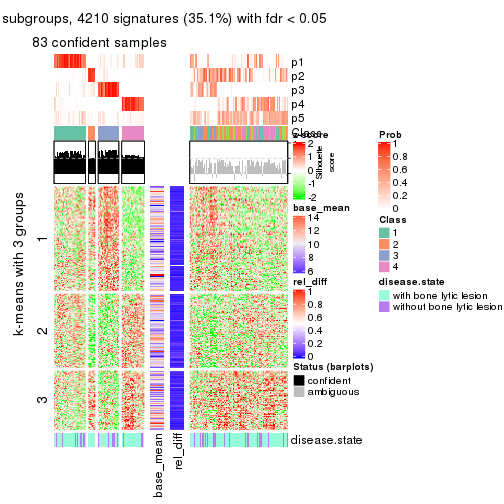</p>

</div>
<div id='tab-ATC-kmeans-get-signatures-5'>
<pre><code class="r">get_signatures(res, k = 6)
</code></pre>

<p></p>

</div>
</div>


Signature heatmaps where rows are not scaled:


<script>
$( function() {
	$( '#tabs-ATC-kmeans-get-signatures-no-scale' ).tabs();
} );
</script>
<div id='tabs-ATC-kmeans-get-signatures-no-scale'>
<ul>
<li><a href='#tab-ATC-kmeans-get-signatures-no-scale-1'>k = 2</a></li>
<li><a href='#tab-ATC-kmeans-get-signatures-no-scale-2'>k = 3</a></li>
<li><a href='#tab-ATC-kmeans-get-signatures-no-scale-3'>k = 4</a></li>
<li><a href='#tab-ATC-kmeans-get-signatures-no-scale-4'>k = 5</a></li>
<li><a href='#tab-ATC-kmeans-get-signatures-no-scale-5'>k = 6</a></li>
</ul>
<div id='tab-ATC-kmeans-get-signatures-no-scale-1'>
<pre><code class="r">get_signatures(res, k = 2, scale_rows = FALSE)
</code></pre>

<p></p>

</div>
<div id='tab-ATC-kmeans-get-signatures-no-scale-2'>
<pre><code class="r">get_signatures(res, k = 3, scale_rows = FALSE)
</code></pre>

<p></p>

</div>
<div id='tab-ATC-kmeans-get-signatures-no-scale-3'>
<pre><code class="r">get_signatures(res, k = 4, scale_rows = FALSE)
</code></pre>

<p>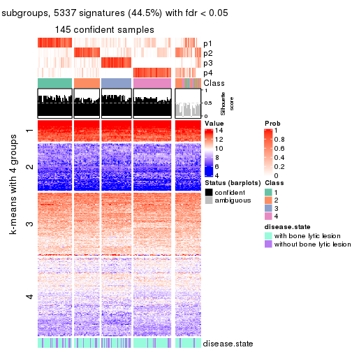</p>

</div>
<div id='tab-ATC-kmeans-get-signatures-no-scale-4'>
<pre><code class="r">get_signatures(res, k = 5, scale_rows = FALSE)
</code></pre>

<p></p>

</div>
<div id='tab-ATC-kmeans-get-signatures-no-scale-5'>
<pre><code class="r">get_signatures(res, k = 6, scale_rows = FALSE)
</code></pre>

<p></p>

</div>
</div>


Compare the overlap of signatures from different k:

```r
compare_signatures(res)
```


`get_signature()` returns a data frame invisibly. TO get the list of signatures, the function
call should be assigned to a variable explicitly. In following code, if `plot` argument is set
to `FALSE`, no heatmap is plotted while only the differential analysis is performed.

```r
# code only for demonstration
tb = get_signature(res, k = ..., plot = FALSE)
```

An example of the output of `tb` is:

```
#>   which_row         fdr    mean_1    mean_2 scaled_mean_1 scaled_mean_2 km
#> 1        38 0.042760348  8.373488  9.131774    -0.5533452     0.5164555  1
#> 2        40 0.018707592  7.106213  8.469186    -0.6173731     0.5762149  1
#> 3        55 0.019134737 10.221463 11.207825    -0.6159697     0.5749050  1
#> 4        59 0.006059896  5.921854  7.869574    -0.6899429     0.6439467  1
#> 5        60 0.018055526  8.928898 10.211722    -0.6204761     0.5791110  1
#> 6        98 0.009384629 15.714769 14.887706     0.6635654    -0.6193277  2
...
```

The columns in `tb` are:

1. `which_row`: row indices corresponding to the input matrix.
2. `fdr`: FDR for the differential test. 
3. `mean_x`: The mean value in group x.
4. `scaled_mean_x`: The mean value in group x after rows are scaled.
5. `km`: Row groups if k-means clustering is applied to rows.


UMAP plot which shows how samples are separated.


<script>
$( function() {
	$( '#tabs-ATC-kmeans-dimension-reduction' ).tabs();
} );
</script>
<div id='tabs-ATC-kmeans-dimension-reduction'>
<ul>
<li><a href='#tab-ATC-kmeans-dimension-reduction-1'>k = 2</a></li>
<li><a href='#tab-ATC-kmeans-dimension-reduction-2'>k = 3</a></li>
<li><a href='#tab-ATC-kmeans-dimension-reduction-3'>k = 4</a></li>
<li><a href='#tab-ATC-kmeans-dimension-reduction-4'>k = 5</a></li>
<li><a href='#tab-ATC-kmeans-dimension-reduction-5'>k = 6</a></li>
</ul>
<div id='tab-ATC-kmeans-dimension-reduction-1'>
<pre><code class="r">dimension_reduction(res, k = 2, method = &quot;UMAP&quot;)
</code></pre>

<p>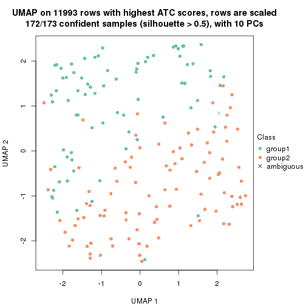</p>

</div>
<div id='tab-ATC-kmeans-dimension-reduction-2'>
<pre><code class="r">dimension_reduction(res, k = 3, method = &quot;UMAP&quot;)
</code></pre>

<p></p>

</div>
<div id='tab-ATC-kmeans-dimension-reduction-3'>
<pre><code class="r">dimension_reduction(res, k = 4, method = &quot;UMAP&quot;)
</code></pre>

<p></p>

</div>
<div id='tab-ATC-kmeans-dimension-reduction-4'>
<pre><code class="r">dimension_reduction(res, k = 5, method = &quot;UMAP&quot;)
</code></pre>

<p></p>

</div>
<div id='tab-ATC-kmeans-dimension-reduction-5'>
<pre><code class="r">dimension_reduction(res, k = 6, method = &quot;UMAP&quot;)
</code></pre>

<p></p>

</div>
</div>


Following heatmap shows how subgroups are split when increasing `k`:

```r
collect_classes(res)
```


Test correlation between subgroups and known annotations. If the known
annotation is numeric, one-way ANOVA test is applied, and if the known
annotation is discrete, chi-squared contingency table test is applied.

```r
test_to_known_factors(res)
```

```
#>              n disease.state(p) k
#> ATC:kmeans 172           0.1751 2
#> ATC:kmeans 107           0.0864 3
#> ATC:kmeans 145           0.0926 4
#> ATC:kmeans  83           0.2805 5
#> ATC:kmeans 117           0.4319 6
```


If matrix rows can be associated to genes, consider to use `GO_Enrichment(res,
...)` to perform function enrichment for the signature genes.


 

---------------------------------------------------


### ATC:skmeans*


The object with results only for a single top-value method and a single partition method 
can be extracted as:

```r
res = res_list["ATC", "skmeans"]
# you can also extract it by
# res = res_list["ATC:skmeans"]
```

A summary of `res` and all the functions that can be applied to it:

```r
res
```

```
#> A 'ConsensusPartition' object with k = 2, 3, 4, 5, 6.
#>   On a matrix with 11993 rows and 173 columns.
#>   Top rows (1000, 2000, 3000, 4000, 5000) are extracted by 'ATC' method.
#>   Subgroups are detected by 'skmeans' method.
#>   Performed in total 1250 partitions by row resampling.
#>   Best k for subgroups seems to be 2.
#> 
#> Following methods can be applied to this 'ConsensusPartition' object:
#>  [1] "cola_report"             "collect_classes"         "collect_plots"          
#>  [4] "collect_stats"           "colnames"                "compare_signatures"     
#>  [7] "consensus_heatmap"       "dimension_reduction"     "functional_enrichment"  
#> [10] "get_anno_col"            "get_anno"                "get_classes"            
#> [13] "get_consensus"           "get_matrix"              "get_membership"         
#> [16] "get_param"               "get_signatures"          "get_stats"              
#> [19] "is_best_k"               "is_stable_k"             "membership_heatmap"     
#> [22] "ncol"                    "nrow"                    "plot_ecdf"              
#> [25] "rownames"                "select_partition_number" "show"                   
#> [28] "suggest_best_k"          "test_to_known_factors"
```

`collect_plots()` function collects all the plots made from `res` for all `k` (number of partitions)
into one single page to provide an easy and fast comparison between different `k`.

```r
collect_plots(res)
```


The plots are:

- The first row: a plot of the ECDF (Empirical cumulative distribution
  function) curves of the consensus matrix for each `k` and the heatmap of
  predicted classes for each `k`.
- The second row: heatmaps of the consensus matrix for each `k`.
- The third row: heatmaps of the membership matrix for each `k`.
- The fouth row: heatmaps of the signatures for each `k`.

All the plots in panels can be made by individual functions and they are
plotted later in this section.

`select_partition_number()` produces several plots showing different
statistics for choosing "optimized" `k`. There are following statistics:

- ECDF curves of the consensus matrix for each `k`;
- 1-PAC. [The PAC
  score](https://en.wikipedia.org/wiki/Consensus_clustering#Over-interpretation_potential_of_consensus_clustering)
  measures the proportion of the ambiguous subgrouping.
- Mean silhouette score.
- Concordance. The mean probability of fiting the consensus class ids in all
  partitions.
- Area increased. Denote $A_k$ as the area under the ECDF curve for current
  `k`, the area increased is defined as $A_k - A_{k-1}$.
- Rand index. The percent of pairs of samples that are both in a same cluster
  or both are not in a same cluster in the partition of k and k-1.
- Jaccard index. The ratio of pairs of samples are both in a same cluster in
  the partition of k and k-1 and the pairs of samples are both in a same
  cluster in the partition k or k-1.

The detailed explanations of these statistics can be found in [the cola
vignette](http://bioconductor.org/packages/devel/bioc/vignettes/cola/inst/doc/cola.html#toc_13).

Generally speaking, lower PAC score, higher mean silhouette score or higher
concordance corresponds to better partition. Rand index and Jaccard index
measure how similar the current partition is compared to partition with `k-1`.
If they are too similar, we won't accept `k` is better than `k-1`.

```r
select_partition_number(res)
```


The numeric values for all these statistics can be obtained by `get_stats()`.

```r
get_stats(res)
```

```
#>   k 1-PAC mean_silhouette concordance area_increased  Rand Jaccard
#> 2 2 0.928           0.931       0.972         0.5031 0.497   0.497
#> 3 3 0.579           0.609       0.771         0.3140 0.744   0.530
#> 4 4 0.574           0.627       0.782         0.1300 0.796   0.483
#> 5 5 0.655           0.629       0.803         0.0639 0.855   0.511
#> 6 6 0.685           0.642       0.785         0.0407 0.915   0.631
```

`suggest_best_k()` suggests the best $k$ based on these statistics. The rules are as follows:

- All $k$ with Jaccard index larger than 0.95 are removed because the increase of
  the partition number does not provides enough extra information. If all $k$ are removed,
  the best $k$ is assigned by `NA`.
- For $k$ with 1-PAC larger than 0.9, the maximal $k$ is taken as the "best k". Other $k$ is called "optional k".
- If it does not fit the second rule. The $k$ with the highest vote of highest
  1-PAC, mean silhouette and concordance is taken as the "best k".

```r
suggest_best_k(res)
```

```
#> [1] 2
```


Following shows the table of the partitions (You need to click the **show/hide
code output** link to see it). The membership matrix (columns with name `p*`)
is inferred by
[`clue::cl_consensus()`](https://www.rdocumentation.org/link/cl_consensus?package=clue)
function with the `SE` method. Basically the value in the membership matrix
represents the probability to belong to a certain group. The finall class
label for an item is determined with the group with highest probability it
belongs to.

In `get_classes()` function, the entropy is calculated from the membership
matrix and the silhouette score is calculated from the consensus matrix.


<script>
$( function() {
	$( '#tabs-ATC-skmeans-get-classes' ).tabs();
} );
</script>
<div id='tabs-ATC-skmeans-get-classes'>
<ul>
<li><a href='#tab-ATC-skmeans-get-classes-1'>k = 2</a></li>
<li><a href='#tab-ATC-skmeans-get-classes-2'>k = 3</a></li>
<li><a href='#tab-ATC-skmeans-get-classes-3'>k = 4</a></li>
<li><a href='#tab-ATC-skmeans-get-classes-4'>k = 5</a></li>
<li><a href='#tab-ATC-skmeans-get-classes-5'>k = 6</a></li>
</ul>

<div id='tab-ATC-skmeans-get-classes-1'>
<p><a id='tab-ATC-skmeans-get-classes-1-a' style='color:#0366d6' href='#'>show/hide code output</a></p>
<pre><code class="r">cbind(get_classes(res, k = 2), get_membership(res, k = 2))
</code></pre>

<pre><code>#&gt;          class entropy silhouette    p1    p2
#&gt; GSM11437     1  0.0000    0.96815 1.000 0.000
#&gt; GSM11438     1  0.0000    0.96815 1.000 0.000
#&gt; GSM11439     1  0.0000    0.96815 1.000 0.000
#&gt; GSM11440     2  0.0000    0.97252 0.000 1.000
#&gt; GSM11441     1  0.0000    0.96815 1.000 0.000
#&gt; GSM11442     2  0.8144    0.65317 0.252 0.748
#&gt; GSM11443     1  0.0000    0.96815 1.000 0.000
#&gt; GSM11444     1  0.0000    0.96815 1.000 0.000
#&gt; GSM11445     1  0.0000    0.96815 1.000 0.000
#&gt; GSM11446     1  0.0000    0.96815 1.000 0.000
#&gt; GSM11447     1  0.0000    0.96815 1.000 0.000
#&gt; GSM11448     1  0.0000    0.96815 1.000 0.000
#&gt; GSM11449     1  0.0000    0.96815 1.000 0.000
#&gt; GSM11450     1  0.0000    0.96815 1.000 0.000
#&gt; GSM11451     2  0.0000    0.97252 0.000 1.000
#&gt; GSM11452     2  0.0000    0.97252 0.000 1.000
#&gt; GSM11453     2  0.0000    0.97252 0.000 1.000
#&gt; GSM11454     1  0.0000    0.96815 1.000 0.000
#&gt; GSM11455     2  0.0000    0.97252 0.000 1.000
#&gt; GSM11456     2  1.0000    0.00618 0.496 0.504
#&gt; GSM11457     1  0.0000    0.96815 1.000 0.000
#&gt; GSM11458     1  0.0000    0.96815 1.000 0.000
#&gt; GSM11459     1  0.0000    0.96815 1.000 0.000
#&gt; GSM11460     1  0.0000    0.96815 1.000 0.000
#&gt; GSM11461     1  0.0000    0.96815 1.000 0.000
#&gt; GSM11462     1  0.0000    0.96815 1.000 0.000
#&gt; GSM11463     1  0.0000    0.96815 1.000 0.000
#&gt; GSM11464     2  0.0000    0.97252 0.000 1.000
#&gt; GSM11465     2  0.0000    0.97252 0.000 1.000
#&gt; GSM11466     2  0.0000    0.97252 0.000 1.000
#&gt; GSM11467     2  0.0000    0.97252 0.000 1.000
#&gt; GSM11468     2  0.0000    0.97252 0.000 1.000
#&gt; GSM11469     2  0.0000    0.97252 0.000 1.000
#&gt; GSM11470     1  0.9491    0.41862 0.632 0.368
#&gt; GSM11471     2  0.1633    0.95183 0.024 0.976
#&gt; GSM11472     2  0.6343    0.80075 0.160 0.840
#&gt; GSM11473     1  0.0000    0.96815 1.000 0.000
#&gt; GSM11474     1  0.0000    0.96815 1.000 0.000
#&gt; GSM11475     1  0.0000    0.96815 1.000 0.000
#&gt; GSM11476     2  0.9286    0.46499 0.344 0.656
#&gt; GSM11477     2  0.0000    0.97252 0.000 1.000
#&gt; GSM11478     2  0.0000    0.97252 0.000 1.000
#&gt; GSM11479     1  0.0000    0.96815 1.000 0.000
#&gt; GSM11480     2  0.0000    0.97252 0.000 1.000
#&gt; GSM11481     2  0.0000    0.97252 0.000 1.000
#&gt; GSM11482     2  0.0000    0.97252 0.000 1.000
#&gt; GSM11483     2  0.7950    0.67400 0.240 0.760
#&gt; GSM11484     2  0.0000    0.97252 0.000 1.000
#&gt; GSM11485     2  0.0000    0.97252 0.000 1.000
#&gt; GSM11486     1  0.0000    0.96815 1.000 0.000
#&gt; GSM11487     2  0.9661    0.34697 0.392 0.608
#&gt; GSM11488     2  0.0000    0.97252 0.000 1.000
#&gt; GSM11489     1  0.7056    0.75530 0.808 0.192
#&gt; GSM11490     1  0.0000    0.96815 1.000 0.000
#&gt; GSM11491     1  0.9427    0.43789 0.640 0.360
#&gt; GSM11492     1  0.0000    0.96815 1.000 0.000
#&gt; GSM11493     2  0.0000    0.97252 0.000 1.000
#&gt; GSM11494     1  0.0000    0.96815 1.000 0.000
#&gt; GSM11495     1  0.7883    0.68970 0.764 0.236
#&gt; GSM11496     1  0.0000    0.96815 1.000 0.000
#&gt; GSM11497     1  0.0000    0.96815 1.000 0.000
#&gt; GSM11498     1  0.0000    0.96815 1.000 0.000
#&gt; GSM11499     2  0.0000    0.97252 0.000 1.000
#&gt; GSM11500     1  0.0000    0.96815 1.000 0.000
#&gt; GSM11501     2  0.0000    0.97252 0.000 1.000
#&gt; GSM11502     2  0.0000    0.97252 0.000 1.000
#&gt; GSM11503     1  0.0000    0.96815 1.000 0.000
#&gt; GSM11504     1  0.0000    0.96815 1.000 0.000
#&gt; GSM11505     1  0.0000    0.96815 1.000 0.000
#&gt; GSM11506     1  0.0000    0.96815 1.000 0.000
#&gt; GSM11507     2  0.0000    0.97252 0.000 1.000
#&gt; GSM11508     1  0.0000    0.96815 1.000 0.000
#&gt; GSM11509     1  0.0000    0.96815 1.000 0.000
#&gt; GSM11510     2  0.0000    0.97252 0.000 1.000
#&gt; GSM11511     1  0.0000    0.96815 1.000 0.000
#&gt; GSM11512     2  0.0000    0.97252 0.000 1.000
#&gt; GSM11513     1  0.0000    0.96815 1.000 0.000
#&gt; GSM11514     2  0.0000    0.97252 0.000 1.000
#&gt; GSM11515     1  0.0000    0.96815 1.000 0.000
#&gt; GSM11516     2  0.0000    0.97252 0.000 1.000
#&gt; GSM11517     1  0.0000    0.96815 1.000 0.000
#&gt; GSM11518     1  0.0000    0.96815 1.000 0.000
#&gt; GSM11519     2  0.0672    0.96593 0.008 0.992
#&gt; GSM11520     1  0.0000    0.96815 1.000 0.000
#&gt; GSM11521     2  0.0000    0.97252 0.000 1.000
#&gt; GSM11522     1  0.0000    0.96815 1.000 0.000
#&gt; GSM11523     1  0.0000    0.96815 1.000 0.000
#&gt; GSM11524     2  0.0000    0.97252 0.000 1.000
#&gt; GSM11525     1  0.0000    0.96815 1.000 0.000
#&gt; GSM11526     1  0.0000    0.96815 1.000 0.000
#&gt; GSM11527     1  0.0000    0.96815 1.000 0.000
#&gt; GSM11528     2  0.0000    0.97252 0.000 1.000
#&gt; GSM11529     2  0.0000    0.97252 0.000 1.000
#&gt; GSM11530     1  0.0000    0.96815 1.000 0.000
#&gt; GSM11531     1  0.0000    0.96815 1.000 0.000
#&gt; GSM11532     1  0.8713    0.58981 0.708 0.292
#&gt; GSM11533     1  0.0000    0.96815 1.000 0.000
#&gt; GSM11534     2  0.0000    0.97252 0.000 1.000
#&gt; GSM11535     1  0.0000    0.96815 1.000 0.000
#&gt; GSM11536     2  0.0000    0.97252 0.000 1.000
#&gt; GSM11537     2  0.0000    0.97252 0.000 1.000
#&gt; GSM11538     2  0.0000    0.97252 0.000 1.000
#&gt; GSM11539     1  0.0000    0.96815 1.000 0.000
#&gt; GSM11540     2  0.0000    0.97252 0.000 1.000
#&gt; GSM11541     2  0.0000    0.97252 0.000 1.000
#&gt; GSM11542     2  0.0000    0.97252 0.000 1.000
#&gt; GSM11543     1  0.0938    0.95784 0.988 0.012
#&gt; GSM11544     1  0.0000    0.96815 1.000 0.000
#&gt; GSM11545     1  0.9427    0.43795 0.640 0.360
#&gt; GSM11546     1  0.0000    0.96815 1.000 0.000
#&gt; GSM11547     1  0.0000    0.96815 1.000 0.000
#&gt; GSM11548     1  0.0000    0.96815 1.000 0.000
#&gt; GSM11549     1  0.0000    0.96815 1.000 0.000
#&gt; GSM11550     1  0.0000    0.96815 1.000 0.000
#&gt; GSM11551     1  0.0000    0.96815 1.000 0.000
#&gt; GSM11552     1  0.0000    0.96815 1.000 0.000
#&gt; GSM11553     2  0.0000    0.97252 0.000 1.000
#&gt; GSM11554     2  0.0000    0.97252 0.000 1.000
#&gt; GSM11555     2  0.0000    0.97252 0.000 1.000
#&gt; GSM11556     1  0.0000    0.96815 1.000 0.000
#&gt; GSM11557     1  0.0000    0.96815 1.000 0.000
#&gt; GSM11558     2  0.0000    0.97252 0.000 1.000
#&gt; GSM11559     2  0.0000    0.97252 0.000 1.000
#&gt; GSM11560     1  0.0000    0.96815 1.000 0.000
#&gt; GSM11561     2  0.0000    0.97252 0.000 1.000
#&gt; GSM11562     2  0.0000    0.97252 0.000 1.000
#&gt; GSM11563     2  0.0000    0.97252 0.000 1.000
#&gt; GSM11564     2  0.3584    0.90898 0.068 0.932
#&gt; GSM11565     2  0.0376    0.96919 0.004 0.996
#&gt; GSM11566     2  0.0000    0.97252 0.000 1.000
#&gt; GSM11567     2  0.0000    0.97252 0.000 1.000
#&gt; GSM11568     1  0.8327    0.64246 0.736 0.264
#&gt; GSM11569     2  0.0000    0.97252 0.000 1.000
#&gt; GSM11570     2  0.4562    0.87982 0.096 0.904
#&gt; GSM11571     1  0.0000    0.96815 1.000 0.000
#&gt; GSM11572     2  0.0000    0.97252 0.000 1.000
#&gt; GSM11573     2  0.0000    0.97252 0.000 1.000
#&gt; GSM11574     2  0.0000    0.97252 0.000 1.000
#&gt; GSM11575     1  0.0000    0.96815 1.000 0.000
#&gt; GSM11576     1  0.0000    0.96815 1.000 0.000
#&gt; GSM11577     2  0.0000    0.97252 0.000 1.000
#&gt; GSM11578     2  0.0000    0.97252 0.000 1.000
#&gt; GSM11579     2  0.0000    0.97252 0.000 1.000
#&gt; GSM11580     2  0.0000    0.97252 0.000 1.000
#&gt; GSM11581     2  0.0000    0.97252 0.000 1.000
#&gt; GSM11582     2  0.0000    0.97252 0.000 1.000
#&gt; GSM11583     1  0.0000    0.96815 1.000 0.000
#&gt; GSM11584     2  0.0000    0.97252 0.000 1.000
#&gt; GSM11585     2  0.0000    0.97252 0.000 1.000
#&gt; GSM11586     2  0.0000    0.97252 0.000 1.000
#&gt; GSM11587     1  0.0000    0.96815 1.000 0.000
#&gt; GSM11588     2  0.0000    0.97252 0.000 1.000
#&gt; GSM11589     2  0.0000    0.97252 0.000 1.000
#&gt; GSM11590     2  0.0000    0.97252 0.000 1.000
#&gt; GSM11591     2  0.0000    0.97252 0.000 1.000
#&gt; GSM11592     2  0.0000    0.97252 0.000 1.000
#&gt; GSM11593     2  0.0000    0.97252 0.000 1.000
#&gt; GSM11594     2  0.0000    0.97252 0.000 1.000
#&gt; GSM11595     2  0.0000    0.97252 0.000 1.000
#&gt; GSM11596     2  0.6887    0.76771 0.184 0.816
#&gt; GSM11597     1  0.0000    0.96815 1.000 0.000
#&gt; GSM11598     1  0.0000    0.96815 1.000 0.000
#&gt; GSM11599     2  0.0000    0.97252 0.000 1.000
#&gt; GSM11600     2  0.0000    0.97252 0.000 1.000
#&gt; GSM11601     1  0.0938    0.95759 0.988 0.012
#&gt; GSM11602     1  0.0000    0.96815 1.000 0.000
#&gt; GSM11603     1  0.0000    0.96815 1.000 0.000
#&gt; GSM11604     2  0.0000    0.97252 0.000 1.000
#&gt; GSM11605     2  0.0000    0.97252 0.000 1.000
#&gt; GSM11606     2  0.0000    0.97252 0.000 1.000
#&gt; GSM11607     1  0.9933    0.17790 0.548 0.452
#&gt; GSM11608     1  0.0000    0.96815 1.000 0.000
#&gt; GSM11609     2  0.0000    0.97252 0.000 1.000
</code></pre>

<script>
$('#tab-ATC-skmeans-get-classes-1-a').parent().next().next().hide();
$('#tab-ATC-skmeans-get-classes-1-a').click(function(){
  $('#tab-ATC-skmeans-get-classes-1-a').parent().next().next().toggle();
  return(false);
});
</script>
</div>

<div id='tab-ATC-skmeans-get-classes-2'>
<p><a id='tab-ATC-skmeans-get-classes-2-a' style='color:#0366d6' href='#'>show/hide code output</a></p>
<pre><code class="r">cbind(get_classes(res, k = 3), get_membership(res, k = 3))
</code></pre>

<pre><code>#&gt;          class entropy silhouette    p1    p2    p3
#&gt; GSM11437     3  0.0237      0.757 0.004 0.000 0.996
#&gt; GSM11438     2  0.5926      0.519 0.000 0.644 0.356
#&gt; GSM11439     3  0.0237      0.757 0.004 0.000 0.996
#&gt; GSM11440     1  0.5905      0.723 0.648 0.352 0.000
#&gt; GSM11441     3  0.5968      0.754 0.364 0.000 0.636
#&gt; GSM11442     2  0.7848      0.585 0.096 0.640 0.264
#&gt; GSM11443     3  0.0237      0.753 0.000 0.004 0.996
#&gt; GSM11444     3  0.3038      0.788 0.104 0.000 0.896
#&gt; GSM11445     3  0.0000      0.755 0.000 0.000 1.000
#&gt; GSM11446     3  0.5254      0.812 0.264 0.000 0.736
#&gt; GSM11447     3  0.0000      0.755 0.000 0.000 1.000
#&gt; GSM11448     3  0.5254      0.812 0.264 0.000 0.736
#&gt; GSM11449     3  0.5905      0.763 0.352 0.000 0.648
#&gt; GSM11450     3  0.5733      0.781 0.324 0.000 0.676
#&gt; GSM11451     2  0.0000      0.698 0.000 1.000 0.000
#&gt; GSM11452     2  0.0424      0.698 0.000 0.992 0.008
#&gt; GSM11453     1  0.5905      0.723 0.648 0.352 0.000
#&gt; GSM11454     3  0.5254      0.812 0.264 0.000 0.736
#&gt; GSM11455     2  0.0592      0.695 0.012 0.988 0.000
#&gt; GSM11456     2  0.5905      0.524 0.000 0.648 0.352
#&gt; GSM11457     2  0.5926      0.519 0.000 0.644 0.356
#&gt; GSM11458     3  0.5254      0.812 0.264 0.000 0.736
#&gt; GSM11459     3  0.5529      0.797 0.296 0.000 0.704
#&gt; GSM11460     3  0.5216      0.812 0.260 0.000 0.740
#&gt; GSM11461     3  0.5216      0.812 0.260 0.000 0.740
#&gt; GSM11462     3  0.6095      0.729 0.392 0.000 0.608
#&gt; GSM11463     3  0.0237      0.753 0.000 0.004 0.996
#&gt; GSM11464     1  0.1163      0.591 0.972 0.028 0.000
#&gt; GSM11465     2  0.6235     -0.290 0.436 0.564 0.000
#&gt; GSM11466     1  0.5905      0.723 0.648 0.352 0.000
#&gt; GSM11467     1  0.5905      0.723 0.648 0.352 0.000
#&gt; GSM11468     1  0.5905      0.723 0.648 0.352 0.000
#&gt; GSM11469     1  0.5882      0.722 0.652 0.348 0.000
#&gt; GSM11470     1  0.2537      0.500 0.920 0.000 0.080
#&gt; GSM11471     1  0.0000      0.576 1.000 0.000 0.000
#&gt; GSM11472     1  0.0424      0.571 0.992 0.000 0.008
#&gt; GSM11473     3  0.0000      0.755 0.000 0.000 1.000
#&gt; GSM11474     2  0.6204      0.415 0.000 0.576 0.424
#&gt; GSM11475     3  0.5254      0.812 0.264 0.000 0.736
#&gt; GSM11476     2  0.5956      0.613 0.016 0.720 0.264
#&gt; GSM11477     2  0.1031      0.696 0.000 0.976 0.024
#&gt; GSM11478     2  0.0424      0.697 0.008 0.992 0.000
#&gt; GSM11479     3  0.0237      0.753 0.000 0.004 0.996
#&gt; GSM11480     2  0.0424      0.697 0.008 0.992 0.000
#&gt; GSM11481     1  0.5905      0.723 0.648 0.352 0.000
#&gt; GSM11482     2  0.6295     -0.417 0.472 0.528 0.000
#&gt; GSM11483     2  0.5216      0.615 0.000 0.740 0.260
#&gt; GSM11484     1  0.5948      0.716 0.640 0.360 0.000
#&gt; GSM11485     2  0.4121      0.507 0.168 0.832 0.000
#&gt; GSM11486     3  0.6291     -0.201 0.000 0.468 0.532
#&gt; GSM11487     1  0.0424      0.571 0.992 0.000 0.008
#&gt; GSM11488     2  0.6111     -0.193 0.396 0.604 0.000
#&gt; GSM11489     2  0.5882      0.530 0.000 0.652 0.348
#&gt; GSM11490     3  0.3551      0.795 0.132 0.000 0.868
#&gt; GSM11491     1  0.2959      0.464 0.900 0.000 0.100
#&gt; GSM11492     3  0.0747      0.753 0.016 0.000 0.984
#&gt; GSM11493     1  0.6291      0.545 0.532 0.468 0.000
#&gt; GSM11494     3  0.0237      0.757 0.004 0.000 0.996
#&gt; GSM11495     3  0.7752     -0.281 0.048 0.456 0.496
#&gt; GSM11496     3  0.0000      0.755 0.000 0.000 1.000
#&gt; GSM11497     3  0.0237      0.753 0.000 0.004 0.996
#&gt; GSM11498     3  0.0000      0.755 0.000 0.000 1.000
#&gt; GSM11499     2  0.8977      0.494 0.204 0.564 0.232
#&gt; GSM11500     3  0.0000      0.755 0.000 0.000 1.000
#&gt; GSM11501     2  0.6307     -0.460 0.488 0.512 0.000
#&gt; GSM11502     2  0.4931      0.627 0.000 0.768 0.232
#&gt; GSM11503     3  0.0237      0.753 0.000 0.004 0.996
#&gt; GSM11504     3  0.0237      0.757 0.004 0.000 0.996
#&gt; GSM11505     3  0.1289      0.730 0.000 0.032 0.968
#&gt; GSM11506     3  0.1163      0.733 0.000 0.028 0.972
#&gt; GSM11507     2  0.0424      0.697 0.008 0.992 0.000
#&gt; GSM11508     3  0.5178      0.812 0.256 0.000 0.744
#&gt; GSM11509     3  0.4702      0.810 0.212 0.000 0.788
#&gt; GSM11510     1  0.7451      0.669 0.636 0.304 0.060
#&gt; GSM11511     3  0.5138      0.813 0.252 0.000 0.748
#&gt; GSM11512     1  0.5905      0.723 0.648 0.352 0.000
#&gt; GSM11513     3  0.5254      0.812 0.264 0.000 0.736
#&gt; GSM11514     1  0.6062      0.690 0.616 0.384 0.000
#&gt; GSM11515     3  0.0237      0.757 0.004 0.000 0.996
#&gt; GSM11516     2  0.0424      0.697 0.008 0.992 0.000
#&gt; GSM11517     3  0.5216      0.812 0.260 0.000 0.740
#&gt; GSM11518     3  0.5291      0.810 0.268 0.000 0.732
#&gt; GSM11519     1  0.1643      0.598 0.956 0.044 0.000
#&gt; GSM11520     3  0.5968      0.754 0.364 0.000 0.636
#&gt; GSM11521     2  0.3752      0.551 0.144 0.856 0.000
#&gt; GSM11522     3  0.5678      0.786 0.316 0.000 0.684
#&gt; GSM11523     3  0.5254      0.812 0.264 0.000 0.736
#&gt; GSM11524     1  0.5905      0.723 0.648 0.352 0.000
#&gt; GSM11525     2  0.5926      0.519 0.000 0.644 0.356
#&gt; GSM11526     3  0.0424      0.750 0.000 0.008 0.992
#&gt; GSM11527     2  0.5926      0.519 0.000 0.644 0.356
#&gt; GSM11528     2  0.0000      0.698 0.000 1.000 0.000
#&gt; GSM11529     2  0.4887      0.629 0.000 0.772 0.228
#&gt; GSM11530     1  0.6267     -0.500 0.548 0.000 0.452
#&gt; GSM11531     3  0.0892      0.740 0.000 0.020 0.980
#&gt; GSM11532     1  0.2356      0.517 0.928 0.000 0.072
#&gt; GSM11533     3  0.6308     -0.261 0.000 0.492 0.508
#&gt; GSM11534     2  0.1289      0.681 0.032 0.968 0.000
#&gt; GSM11535     3  0.6295     -0.212 0.000 0.472 0.528
#&gt; GSM11536     1  0.6126      0.670 0.600 0.400 0.000
#&gt; GSM11537     2  0.0592      0.695 0.012 0.988 0.000
#&gt; GSM11538     1  0.6126      0.670 0.600 0.400 0.000
#&gt; GSM11539     3  0.6309     -0.270 0.000 0.496 0.504
#&gt; GSM11540     2  0.0424      0.698 0.000 0.992 0.008
#&gt; GSM11541     1  0.5926      0.720 0.644 0.356 0.000
#&gt; GSM11542     2  0.2625      0.631 0.084 0.916 0.000
#&gt; GSM11543     3  0.6154      0.712 0.408 0.000 0.592
#&gt; GSM11544     3  0.5810      0.774 0.336 0.000 0.664
#&gt; GSM11545     1  0.3116      0.448 0.892 0.000 0.108
#&gt; GSM11546     3  0.0000      0.755 0.000 0.000 1.000
#&gt; GSM11547     3  0.0000      0.755 0.000 0.000 1.000
#&gt; GSM11548     3  0.5254      0.812 0.264 0.000 0.736
#&gt; GSM11549     3  0.5216      0.812 0.260 0.000 0.740
#&gt; GSM11550     3  0.6008      0.747 0.372 0.000 0.628
#&gt; GSM11551     3  0.5178      0.812 0.256 0.000 0.744
#&gt; GSM11552     3  0.5905      0.763 0.352 0.000 0.648
#&gt; GSM11553     2  0.0592      0.695 0.012 0.988 0.000
#&gt; GSM11554     2  0.0424      0.697 0.008 0.992 0.000
#&gt; GSM11555     1  0.6095      0.681 0.608 0.392 0.000
#&gt; GSM11556     3  0.6140      0.717 0.404 0.000 0.596
#&gt; GSM11557     2  0.6309      0.255 0.000 0.500 0.500
#&gt; GSM11558     2  0.0424      0.697 0.008 0.992 0.000
#&gt; GSM11559     2  0.6215     -0.251 0.428 0.572 0.000
#&gt; GSM11560     3  0.5254      0.812 0.264 0.000 0.736
#&gt; GSM11561     2  0.0424      0.697 0.008 0.992 0.000
#&gt; GSM11562     2  0.0592      0.695 0.012 0.988 0.000
#&gt; GSM11563     1  0.6168      0.652 0.588 0.412 0.000
#&gt; GSM11564     1  0.0237      0.574 0.996 0.000 0.004
#&gt; GSM11565     1  0.0000      0.576 1.000 0.000 0.000
#&gt; GSM11566     2  0.0237      0.698 0.000 0.996 0.004
#&gt; GSM11567     1  0.6140      0.664 0.596 0.404 0.000
#&gt; GSM11568     2  0.5810      0.546 0.000 0.664 0.336
#&gt; GSM11569     2  0.0424      0.697 0.008 0.992 0.000
#&gt; GSM11570     1  0.0000      0.576 1.000 0.000 0.000
#&gt; GSM11571     3  0.7745      0.768 0.260 0.092 0.648
#&gt; GSM11572     1  0.6095      0.680 0.608 0.392 0.000
#&gt; GSM11573     1  0.5905      0.723 0.648 0.352 0.000
#&gt; GSM11574     2  0.5058      0.356 0.244 0.756 0.000
#&gt; GSM11575     3  0.5178      0.812 0.256 0.000 0.744
#&gt; GSM11576     3  0.5905      0.763 0.352 0.000 0.648
#&gt; GSM11577     2  0.6295     -0.404 0.472 0.528 0.000
#&gt; GSM11578     2  0.5363      0.286 0.276 0.724 0.000
#&gt; GSM11579     2  0.0892      0.697 0.000 0.980 0.020
#&gt; GSM11580     2  0.0475      0.699 0.004 0.992 0.004
#&gt; GSM11581     1  0.5905      0.723 0.648 0.352 0.000
#&gt; GSM11582     1  0.5905      0.723 0.648 0.352 0.000
#&gt; GSM11583     3  0.5254      0.812 0.264 0.000 0.736
#&gt; GSM11584     1  0.6126      0.670 0.600 0.400 0.000
#&gt; GSM11585     2  0.0424      0.697 0.008 0.992 0.000
#&gt; GSM11586     1  0.5905      0.723 0.648 0.352 0.000
#&gt; GSM11587     3  0.5254      0.812 0.264 0.000 0.736
#&gt; GSM11588     1  0.5905      0.723 0.648 0.352 0.000
#&gt; GSM11589     2  0.4555      0.451 0.200 0.800 0.000
#&gt; GSM11590     1  0.5905      0.723 0.648 0.352 0.000
#&gt; GSM11591     2  0.4605      0.456 0.204 0.796 0.000
#&gt; GSM11592     1  0.5905      0.723 0.648 0.352 0.000
#&gt; GSM11593     1  0.4931      0.679 0.768 0.232 0.000
#&gt; GSM11594     1  0.3879      0.645 0.848 0.152 0.000
#&gt; GSM11595     1  0.5905      0.723 0.648 0.352 0.000
#&gt; GSM11596     2  0.6798      0.361 0.400 0.584 0.016
#&gt; GSM11597     3  0.6168      0.708 0.412 0.000 0.588
#&gt; GSM11598     1  0.6204     -0.451 0.576 0.000 0.424
#&gt; GSM11599     1  0.5905      0.723 0.648 0.352 0.000
#&gt; GSM11600     1  0.5178      0.687 0.744 0.256 0.000
#&gt; GSM11601     2  0.6302      0.305 0.000 0.520 0.480
#&gt; GSM11602     3  0.5254      0.812 0.264 0.000 0.736
#&gt; GSM11603     3  0.5254      0.812 0.264 0.000 0.736
#&gt; GSM11604     1  0.1031      0.589 0.976 0.024 0.000
#&gt; GSM11605     1  0.5905      0.723 0.648 0.352 0.000
#&gt; GSM11606     2  0.3267      0.590 0.116 0.884 0.000
#&gt; GSM11607     1  0.2796      0.479 0.908 0.000 0.092
#&gt; GSM11608     3  0.5882      0.766 0.348 0.000 0.652
#&gt; GSM11609     1  0.5926      0.720 0.644 0.356 0.000
</code></pre>

<script>
$('#tab-ATC-skmeans-get-classes-2-a').parent().next().next().hide();
$('#tab-ATC-skmeans-get-classes-2-a').click(function(){
  $('#tab-ATC-skmeans-get-classes-2-a').parent().next().next().toggle();
  return(false);
});
</script>
</div>

<div id='tab-ATC-skmeans-get-classes-3'>
<p><a id='tab-ATC-skmeans-get-classes-3-a' style='color:#0366d6' href='#'>show/hide code output</a></p>
<pre><code class="r">cbind(get_classes(res, k = 4), get_membership(res, k = 4))
</code></pre>

<pre><code>#&gt;          class entropy silhouette    p1    p2    p3    p4
#&gt; GSM11437     3  0.3610     0.6005 0.200 0.000 0.800 0.000
#&gt; GSM11438     3  0.4331     0.5360 0.000 0.288 0.712 0.000
#&gt; GSM11439     3  0.3123     0.6528 0.156 0.000 0.844 0.000
#&gt; GSM11440     4  0.1211     0.7461 0.000 0.040 0.000 0.960
#&gt; GSM11441     1  0.2281     0.7422 0.904 0.000 0.096 0.000
#&gt; GSM11442     3  0.7149     0.3717 0.000 0.264 0.552 0.184
#&gt; GSM11443     3  0.0000     0.7506 0.000 0.000 1.000 0.000
#&gt; GSM11444     3  0.4877     0.0298 0.408 0.000 0.592 0.000
#&gt; GSM11445     3  0.3925     0.6367 0.176 0.000 0.808 0.016
#&gt; GSM11446     1  0.4661     0.6396 0.652 0.000 0.348 0.000
#&gt; GSM11447     3  0.2973     0.6643 0.144 0.000 0.856 0.000
#&gt; GSM11448     1  0.4103     0.7317 0.744 0.000 0.256 0.000
#&gt; GSM11449     1  0.1209     0.7188 0.964 0.000 0.032 0.004
#&gt; GSM11450     1  0.3377     0.7511 0.848 0.000 0.140 0.012
#&gt; GSM11451     2  0.2494     0.7730 0.000 0.916 0.036 0.048
#&gt; GSM11452     2  0.3853     0.6680 0.000 0.820 0.160 0.020
#&gt; GSM11453     4  0.1452     0.7290 0.036 0.008 0.000 0.956
#&gt; GSM11454     1  0.4543     0.6727 0.676 0.000 0.324 0.000
#&gt; GSM11455     2  0.3444     0.7082 0.000 0.816 0.000 0.184
#&gt; GSM11456     2  0.3975     0.5733 0.000 0.760 0.240 0.000
#&gt; GSM11457     2  0.4877     0.2302 0.000 0.592 0.408 0.000
#&gt; GSM11458     1  0.4304     0.7124 0.716 0.000 0.284 0.000
#&gt; GSM11459     1  0.3444     0.7529 0.816 0.000 0.184 0.000
#&gt; GSM11460     1  0.4406     0.6986 0.700 0.000 0.300 0.000
#&gt; GSM11461     1  0.4500     0.6822 0.684 0.000 0.316 0.000
#&gt; GSM11462     1  0.0779     0.7098 0.980 0.000 0.016 0.004
#&gt; GSM11463     3  0.0188     0.7503 0.004 0.000 0.996 0.000
#&gt; GSM11464     4  0.4535     0.5565 0.292 0.004 0.000 0.704
#&gt; GSM11465     2  0.4746     0.5295 0.008 0.688 0.000 0.304
#&gt; GSM11466     4  0.1637     0.7474 0.000 0.060 0.000 0.940
#&gt; GSM11467     4  0.1724     0.7288 0.032 0.020 0.000 0.948
#&gt; GSM11468     4  0.1940     0.7472 0.000 0.076 0.000 0.924
#&gt; GSM11469     4  0.1022     0.7326 0.032 0.000 0.000 0.968
#&gt; GSM11470     1  0.4313     0.4683 0.736 0.004 0.000 0.260
#&gt; GSM11471     1  0.4401     0.4476 0.724 0.004 0.000 0.272
#&gt; GSM11472     1  0.4999    -0.1358 0.508 0.000 0.000 0.492
#&gt; GSM11473     3  0.1302     0.7385 0.044 0.000 0.956 0.000
#&gt; GSM11474     3  0.3486     0.6620 0.000 0.188 0.812 0.000
#&gt; GSM11475     1  0.4679     0.6332 0.648 0.000 0.352 0.000
#&gt; GSM11476     2  0.7362    -0.0581 0.000 0.444 0.396 0.160
#&gt; GSM11477     2  0.2266     0.7377 0.000 0.912 0.084 0.004
#&gt; GSM11478     2  0.2675     0.7701 0.000 0.892 0.008 0.100
#&gt; GSM11479     3  0.0921     0.7448 0.028 0.000 0.972 0.000
#&gt; GSM11480     2  0.2345     0.7675 0.000 0.900 0.000 0.100
#&gt; GSM11481     4  0.1940     0.7472 0.000 0.076 0.000 0.924
#&gt; GSM11482     4  0.4164     0.6512 0.000 0.264 0.000 0.736
#&gt; GSM11483     3  0.4564     0.4806 0.000 0.328 0.672 0.000
#&gt; GSM11484     4  0.3764     0.6968 0.000 0.216 0.000 0.784
#&gt; GSM11485     4  0.5206     0.5922 0.000 0.308 0.024 0.668
#&gt; GSM11486     3  0.2647     0.7200 0.000 0.120 0.880 0.000
#&gt; GSM11487     4  0.5080     0.3312 0.420 0.004 0.000 0.576
#&gt; GSM11488     4  0.4428     0.6504 0.000 0.276 0.004 0.720
#&gt; GSM11489     3  0.4522     0.4918 0.000 0.320 0.680 0.000
#&gt; GSM11490     3  0.4925    -0.0486 0.428 0.000 0.572 0.000
#&gt; GSM11491     1  0.5055     0.2385 0.624 0.008 0.000 0.368
#&gt; GSM11492     3  0.4462     0.6305 0.180 0.004 0.788 0.028
#&gt; GSM11493     4  0.4155     0.6776 0.000 0.240 0.004 0.756
#&gt; GSM11494     3  0.3444     0.6218 0.184 0.000 0.816 0.000
#&gt; GSM11495     3  0.5332     0.6186 0.000 0.184 0.736 0.080
#&gt; GSM11496     3  0.1118     0.7418 0.036 0.000 0.964 0.000
#&gt; GSM11497     3  0.0000     0.7506 0.000 0.000 1.000 0.000
#&gt; GSM11498     3  0.1474     0.7346 0.052 0.000 0.948 0.000
#&gt; GSM11499     3  0.7509     0.0244 0.000 0.188 0.452 0.360
#&gt; GSM11500     3  0.1211     0.7402 0.040 0.000 0.960 0.000
#&gt; GSM11501     4  0.4222     0.6419 0.000 0.272 0.000 0.728
#&gt; GSM11502     2  0.4313     0.5440 0.000 0.736 0.260 0.004
#&gt; GSM11503     3  0.0469     0.7491 0.012 0.000 0.988 0.000
#&gt; GSM11504     3  0.5252     0.5842 0.208 0.004 0.736 0.052
#&gt; GSM11505     3  0.0469     0.7503 0.000 0.012 0.988 0.000
#&gt; GSM11506     3  0.0336     0.7507 0.000 0.008 0.992 0.000
#&gt; GSM11507     2  0.3435     0.7750 0.000 0.864 0.036 0.100
#&gt; GSM11508     1  0.4955     0.4448 0.556 0.000 0.444 0.000
#&gt; GSM11509     1  0.4967     0.3660 0.548 0.000 0.452 0.000
#&gt; GSM11510     4  0.6616     0.4057 0.000 0.108 0.308 0.584
#&gt; GSM11511     1  0.4500     0.6830 0.684 0.000 0.316 0.000
#&gt; GSM11512     4  0.2814     0.7338 0.000 0.132 0.000 0.868
#&gt; GSM11513     1  0.4008     0.7375 0.756 0.000 0.244 0.000
#&gt; GSM11514     4  0.3942     0.6800 0.000 0.236 0.000 0.764
#&gt; GSM11515     3  0.4008     0.5278 0.244 0.000 0.756 0.000
#&gt; GSM11516     2  0.3796     0.7743 0.000 0.848 0.056 0.096
#&gt; GSM11517     1  0.3688     0.7504 0.792 0.000 0.208 0.000
#&gt; GSM11518     1  0.3610     0.7516 0.800 0.000 0.200 0.000
#&gt; GSM11519     4  0.5290     0.3680 0.404 0.012 0.000 0.584
#&gt; GSM11520     1  0.1488     0.7160 0.956 0.000 0.032 0.012
#&gt; GSM11521     4  0.4877     0.3839 0.000 0.408 0.000 0.592
#&gt; GSM11522     1  0.3649     0.7512 0.796 0.000 0.204 0.000
#&gt; GSM11523     1  0.4072     0.7339 0.748 0.000 0.252 0.000
#&gt; GSM11524     4  0.1118     0.7457 0.000 0.036 0.000 0.964
#&gt; GSM11525     3  0.4985     0.1372 0.000 0.468 0.532 0.000
#&gt; GSM11526     3  0.1452     0.7462 0.036 0.008 0.956 0.000
#&gt; GSM11527     3  0.3726     0.6344 0.000 0.212 0.788 0.000
#&gt; GSM11528     2  0.2589     0.7134 0.000 0.884 0.000 0.116
#&gt; GSM11529     2  0.4453     0.5653 0.000 0.744 0.244 0.012
#&gt; GSM11530     1  0.5809     0.5459 0.692 0.000 0.092 0.216
#&gt; GSM11531     3  0.0188     0.7508 0.000 0.004 0.996 0.000
#&gt; GSM11532     4  0.5861     0.2220 0.472 0.024 0.004 0.500
#&gt; GSM11533     3  0.4679     0.4299 0.000 0.352 0.648 0.000
#&gt; GSM11534     2  0.4477     0.4710 0.000 0.688 0.000 0.312
#&gt; GSM11535     3  0.2647     0.7196 0.000 0.120 0.880 0.000
#&gt; GSM11536     4  0.3975     0.6761 0.000 0.240 0.000 0.760
#&gt; GSM11537     2  0.2647     0.7600 0.000 0.880 0.000 0.120
#&gt; GSM11538     4  0.3975     0.6761 0.000 0.240 0.000 0.760
#&gt; GSM11539     3  0.2704     0.7167 0.000 0.124 0.876 0.000
#&gt; GSM11540     2  0.1474     0.7523 0.000 0.948 0.052 0.000
#&gt; GSM11541     4  0.3649     0.7044 0.000 0.204 0.000 0.796
#&gt; GSM11542     2  0.4477     0.5145 0.000 0.688 0.000 0.312
#&gt; GSM11543     1  0.2983     0.7232 0.892 0.000 0.068 0.040
#&gt; GSM11544     1  0.3052     0.7512 0.860 0.000 0.136 0.004
#&gt; GSM11545     1  0.4313     0.4683 0.736 0.004 0.000 0.260
#&gt; GSM11546     3  0.4040     0.5200 0.248 0.000 0.752 0.000
#&gt; GSM11547     3  0.3942     0.5429 0.236 0.000 0.764 0.000
#&gt; GSM11548     1  0.4164     0.7272 0.736 0.000 0.264 0.000
#&gt; GSM11549     1  0.4477     0.6872 0.688 0.000 0.312 0.000
#&gt; GSM11550     1  0.0707     0.7139 0.980 0.000 0.020 0.000
#&gt; GSM11551     1  0.4477     0.6872 0.688 0.000 0.312 0.000
#&gt; GSM11552     1  0.1792     0.7320 0.932 0.000 0.068 0.000
#&gt; GSM11553     2  0.2647     0.7600 0.000 0.880 0.000 0.120
#&gt; GSM11554     2  0.2530     0.7639 0.000 0.888 0.000 0.112
#&gt; GSM11555     4  0.3942     0.6800 0.000 0.236 0.000 0.764
#&gt; GSM11556     1  0.1975     0.6914 0.936 0.000 0.016 0.048
#&gt; GSM11557     3  0.2647     0.7196 0.000 0.120 0.880 0.000
#&gt; GSM11558     2  0.2408     0.7665 0.000 0.896 0.000 0.104
#&gt; GSM11559     2  0.5427     0.5007 0.016 0.568 0.000 0.416
#&gt; GSM11560     1  0.3610     0.7514 0.800 0.000 0.200 0.000
#&gt; GSM11561     2  0.2647     0.7600 0.000 0.880 0.000 0.120
#&gt; GSM11562     2  0.2647     0.7600 0.000 0.880 0.000 0.120
#&gt; GSM11563     4  0.5285     0.2228 0.008 0.468 0.000 0.524
#&gt; GSM11564     4  0.5161     0.1909 0.476 0.004 0.000 0.520
#&gt; GSM11565     1  0.4428     0.4406 0.720 0.004 0.000 0.276
#&gt; GSM11566     2  0.1118     0.7560 0.000 0.964 0.036 0.000
#&gt; GSM11567     4  0.4103     0.6593 0.000 0.256 0.000 0.744
#&gt; GSM11568     2  0.3933     0.6278 0.000 0.792 0.200 0.008
#&gt; GSM11569     2  0.3182     0.7747 0.000 0.876 0.028 0.096
#&gt; GSM11570     4  0.5157     0.6086 0.284 0.028 0.000 0.688
#&gt; GSM11571     1  0.6808     0.5256 0.560 0.120 0.320 0.000
#&gt; GSM11572     4  0.4891     0.5976 0.012 0.308 0.000 0.680
#&gt; GSM11573     4  0.1520     0.7314 0.024 0.020 0.000 0.956
#&gt; GSM11574     2  0.4776     0.6822 0.016 0.712 0.000 0.272
#&gt; GSM11575     1  0.4543     0.6837 0.676 0.000 0.324 0.000
#&gt; GSM11576     1  0.3074     0.7533 0.848 0.000 0.152 0.000
#&gt; GSM11577     2  0.3852     0.6931 0.008 0.800 0.000 0.192
#&gt; GSM11578     2  0.5339     0.5805 0.020 0.624 0.000 0.356
#&gt; GSM11579     2  0.0779     0.7572 0.000 0.980 0.004 0.016
#&gt; GSM11580     2  0.4055     0.7595 0.000 0.832 0.108 0.060
#&gt; GSM11581     4  0.1940     0.7472 0.000 0.076 0.000 0.924
#&gt; GSM11582     4  0.2216     0.7444 0.000 0.092 0.000 0.908
#&gt; GSM11583     1  0.4331     0.7091 0.712 0.000 0.288 0.000
#&gt; GSM11584     4  0.3975     0.6761 0.000 0.240 0.000 0.760
#&gt; GSM11585     2  0.4879     0.7664 0.000 0.780 0.092 0.128
#&gt; GSM11586     4  0.1520     0.7340 0.024 0.020 0.000 0.956
#&gt; GSM11587     1  0.3528     0.7526 0.808 0.000 0.192 0.000
#&gt; GSM11588     4  0.1624     0.7301 0.028 0.020 0.000 0.952
#&gt; GSM11589     2  0.3219     0.7285 0.000 0.836 0.000 0.164
#&gt; GSM11590     4  0.1706     0.7254 0.036 0.016 0.000 0.948
#&gt; GSM11591     2  0.5619     0.5927 0.040 0.640 0.000 0.320
#&gt; GSM11592     4  0.2089     0.7198 0.048 0.020 0.000 0.932
#&gt; GSM11593     4  0.4855     0.5700 0.268 0.020 0.000 0.712
#&gt; GSM11594     4  0.4910     0.5639 0.276 0.020 0.000 0.704
#&gt; GSM11595     4  0.1520     0.7314 0.024 0.020 0.000 0.956
#&gt; GSM11596     2  0.7768     0.3953 0.260 0.524 0.016 0.200
#&gt; GSM11597     1  0.2973     0.6180 0.856 0.000 0.000 0.144
#&gt; GSM11598     1  0.2647     0.6342 0.880 0.000 0.000 0.120
#&gt; GSM11599     4  0.0524     0.7398 0.004 0.008 0.000 0.988
#&gt; GSM11600     4  0.3384     0.6943 0.116 0.024 0.000 0.860
#&gt; GSM11601     3  0.5180     0.4945 0.016 0.308 0.672 0.004
#&gt; GSM11602     1  0.3975     0.7393 0.760 0.000 0.240 0.000
#&gt; GSM11603     1  0.4134     0.7293 0.740 0.000 0.260 0.000
#&gt; GSM11604     4  0.4535     0.5565 0.292 0.004 0.000 0.704
#&gt; GSM11605     4  0.2647     0.7376 0.000 0.120 0.000 0.880
#&gt; GSM11606     2  0.4661     0.6955 0.016 0.728 0.000 0.256
#&gt; GSM11607     1  0.4283     0.4736 0.740 0.004 0.000 0.256
#&gt; GSM11608     1  0.3024     0.7532 0.852 0.000 0.148 0.000
#&gt; GSM11609     4  0.3569     0.7063 0.000 0.196 0.000 0.804
</code></pre>

<script>
$('#tab-ATC-skmeans-get-classes-3-a').parent().next().next().hide();
$('#tab-ATC-skmeans-get-classes-3-a').click(function(){
  $('#tab-ATC-skmeans-get-classes-3-a').parent().next().next().toggle();
  return(false);
});
</script>
</div>

<div id='tab-ATC-skmeans-get-classes-4'>
<p><a id='tab-ATC-skmeans-get-classes-4-a' style='color:#0366d6' href='#'>show/hide code output</a></p>
<pre><code class="r">cbind(get_classes(res, k = 5), get_membership(res, k = 5))
</code></pre>

<pre><code>#&gt;          class entropy silhouette    p1    p2    p3    p4    p5
#&gt; GSM11437     5  0.4192     0.4334 0.000 0.000 0.404 0.000 0.596
#&gt; GSM11438     5  0.1502     0.7735 0.000 0.056 0.000 0.004 0.940
#&gt; GSM11439     5  0.3876     0.6163 0.000 0.000 0.316 0.000 0.684
#&gt; GSM11440     4  0.5296     0.5234 0.280 0.084 0.000 0.636 0.000
#&gt; GSM11441     3  0.4890     0.6382 0.224 0.000 0.708 0.060 0.008
#&gt; GSM11442     4  0.5015     0.1996 0.004 0.020 0.008 0.612 0.356
#&gt; GSM11443     5  0.2516     0.7988 0.000 0.000 0.140 0.000 0.860
#&gt; GSM11444     3  0.3949     0.4115 0.000 0.000 0.668 0.000 0.332
#&gt; GSM11445     5  0.6289     0.5474 0.000 0.000 0.228 0.236 0.536
#&gt; GSM11446     3  0.1043     0.8380 0.000 0.000 0.960 0.000 0.040
#&gt; GSM11447     5  0.3661     0.6744 0.000 0.000 0.276 0.000 0.724
#&gt; GSM11448     3  0.0324     0.8513 0.004 0.000 0.992 0.000 0.004
#&gt; GSM11449     3  0.2648     0.7641 0.152 0.000 0.848 0.000 0.000
#&gt; GSM11450     3  0.1792     0.8272 0.084 0.000 0.916 0.000 0.000
#&gt; GSM11451     2  0.0963     0.8186 0.000 0.964 0.000 0.000 0.036
#&gt; GSM11452     2  0.2848     0.7855 0.028 0.868 0.000 0.000 0.104
#&gt; GSM11453     1  0.4734     0.4677 0.704 0.064 0.000 0.232 0.000
#&gt; GSM11454     3  0.0609     0.8476 0.000 0.000 0.980 0.000 0.020
#&gt; GSM11455     2  0.3884     0.4627 0.004 0.708 0.000 0.288 0.000
#&gt; GSM11456     5  0.5501    -0.0348 0.000 0.444 0.000 0.064 0.492
#&gt; GSM11457     5  0.4126     0.2859 0.000 0.380 0.000 0.000 0.620
#&gt; GSM11458     3  0.0404     0.8498 0.000 0.000 0.988 0.000 0.012
#&gt; GSM11459     3  0.0609     0.8494 0.020 0.000 0.980 0.000 0.000
#&gt; GSM11460     3  0.0510     0.8490 0.000 0.000 0.984 0.000 0.016
#&gt; GSM11461     3  0.1121     0.8366 0.000 0.000 0.956 0.000 0.044
#&gt; GSM11462     3  0.2852     0.7382 0.172 0.000 0.828 0.000 0.000
#&gt; GSM11463     5  0.2690     0.7943 0.000 0.000 0.156 0.000 0.844
#&gt; GSM11464     1  0.1121     0.6738 0.956 0.000 0.000 0.044 0.000
#&gt; GSM11465     2  0.5158     0.4001 0.080 0.656 0.000 0.264 0.000
#&gt; GSM11466     4  0.5304     0.5375 0.272 0.088 0.000 0.640 0.000
#&gt; GSM11467     1  0.5580     0.2588 0.576 0.088 0.000 0.336 0.000
#&gt; GSM11468     4  0.4901     0.6090 0.216 0.084 0.000 0.700 0.000
#&gt; GSM11469     1  0.5639     0.1293 0.524 0.080 0.000 0.396 0.000
#&gt; GSM11470     1  0.1792     0.6730 0.916 0.000 0.084 0.000 0.000
#&gt; GSM11471     1  0.1544     0.6798 0.932 0.000 0.068 0.000 0.000
#&gt; GSM11472     1  0.2983     0.6680 0.868 0.000 0.076 0.056 0.000
#&gt; GSM11473     5  0.2929     0.7752 0.000 0.000 0.180 0.000 0.820
#&gt; GSM11474     5  0.1661     0.7912 0.000 0.036 0.024 0.000 0.940
#&gt; GSM11475     3  0.1564     0.8415 0.004 0.000 0.948 0.024 0.024
#&gt; GSM11476     4  0.4472     0.5315 0.000 0.076 0.004 0.760 0.160
#&gt; GSM11477     2  0.1671     0.8002 0.000 0.924 0.000 0.000 0.076
#&gt; GSM11478     2  0.0671     0.8235 0.000 0.980 0.000 0.016 0.004
#&gt; GSM11479     5  0.2516     0.8004 0.000 0.000 0.140 0.000 0.860
#&gt; GSM11480     2  0.0865     0.8222 0.000 0.972 0.000 0.024 0.004
#&gt; GSM11481     4  0.4850     0.6004 0.224 0.076 0.000 0.700 0.000
#&gt; GSM11482     4  0.4489     0.6791 0.068 0.192 0.000 0.740 0.000
#&gt; GSM11483     5  0.4187     0.6836 0.004 0.032 0.004 0.192 0.768
#&gt; GSM11484     4  0.1168     0.6361 0.008 0.000 0.000 0.960 0.032
#&gt; GSM11485     4  0.2536     0.6210 0.004 0.052 0.000 0.900 0.044
#&gt; GSM11486     5  0.0955     0.7982 0.000 0.004 0.028 0.000 0.968
#&gt; GSM11487     1  0.3320     0.6225 0.828 0.000 0.012 0.152 0.008
#&gt; GSM11488     4  0.1569     0.6312 0.004 0.008 0.000 0.944 0.044
#&gt; GSM11489     5  0.4033     0.7074 0.004 0.068 0.004 0.116 0.808
#&gt; GSM11490     3  0.3579     0.6020 0.000 0.000 0.756 0.004 0.240
#&gt; GSM11491     1  0.1197     0.6834 0.952 0.000 0.048 0.000 0.000
#&gt; GSM11492     5  0.7182     0.2758 0.032 0.000 0.184 0.392 0.392
#&gt; GSM11493     4  0.1041     0.6367 0.000 0.004 0.000 0.964 0.032
#&gt; GSM11494     5  0.5498     0.4788 0.000 0.000 0.356 0.076 0.568
#&gt; GSM11495     5  0.4530     0.4523 0.004 0.000 0.008 0.376 0.612
#&gt; GSM11496     5  0.2605     0.7955 0.000 0.000 0.148 0.000 0.852
#&gt; GSM11497     5  0.2471     0.8001 0.000 0.000 0.136 0.000 0.864
#&gt; GSM11498     5  0.2732     0.7894 0.000 0.000 0.160 0.000 0.840
#&gt; GSM11499     4  0.4070     0.4433 0.004 0.012 0.000 0.728 0.256
#&gt; GSM11500     5  0.2648     0.7938 0.000 0.000 0.152 0.000 0.848
#&gt; GSM11501     4  0.4337     0.6758 0.052 0.204 0.000 0.744 0.000
#&gt; GSM11502     2  0.3707     0.5990 0.000 0.716 0.000 0.000 0.284
#&gt; GSM11503     5  0.2966     0.7722 0.000 0.000 0.184 0.000 0.816
#&gt; GSM11504     4  0.5644     0.2470 0.000 0.000 0.144 0.628 0.228
#&gt; GSM11505     5  0.2179     0.8043 0.000 0.000 0.112 0.000 0.888
#&gt; GSM11506     5  0.2179     0.8043 0.000 0.000 0.112 0.000 0.888
#&gt; GSM11507     2  0.0162     0.8245 0.000 0.996 0.000 0.000 0.004
#&gt; GSM11508     3  0.2370     0.8122 0.000 0.000 0.904 0.056 0.040
#&gt; GSM11509     3  0.6339     0.2583 0.188 0.000 0.508 0.000 0.304
#&gt; GSM11510     4  0.4719     0.5119 0.056 0.012 0.000 0.736 0.196
#&gt; GSM11511     3  0.0703     0.8459 0.000 0.000 0.976 0.000 0.024
#&gt; GSM11512     4  0.2228     0.6611 0.040 0.028 0.000 0.920 0.012
#&gt; GSM11513     3  0.0162     0.8507 0.000 0.000 0.996 0.000 0.004
#&gt; GSM11514     4  0.5375     0.6423 0.136 0.200 0.000 0.664 0.000
#&gt; GSM11515     3  0.4823     0.4827 0.000 0.000 0.672 0.052 0.276
#&gt; GSM11516     2  0.1211     0.8240 0.024 0.960 0.000 0.000 0.016
#&gt; GSM11517     3  0.2901     0.8144 0.020 0.000 0.888 0.048 0.044
#&gt; GSM11518     3  0.0609     0.8495 0.020 0.000 0.980 0.000 0.000
#&gt; GSM11519     1  0.0579     0.6812 0.984 0.000 0.008 0.008 0.000
#&gt; GSM11520     3  0.4268     0.2843 0.444 0.000 0.556 0.000 0.000
#&gt; GSM11521     4  0.4249     0.6051 0.016 0.296 0.000 0.688 0.000
#&gt; GSM11522     3  0.0880     0.8474 0.032 0.000 0.968 0.000 0.000
#&gt; GSM11523     3  0.0162     0.8511 0.000 0.000 0.996 0.000 0.004
#&gt; GSM11524     4  0.5304     0.5031 0.292 0.080 0.000 0.628 0.000
#&gt; GSM11525     5  0.3242     0.6152 0.000 0.216 0.000 0.000 0.784
#&gt; GSM11526     5  0.3734     0.7850 0.000 0.000 0.128 0.060 0.812
#&gt; GSM11527     5  0.1673     0.7812 0.000 0.032 0.008 0.016 0.944
#&gt; GSM11528     4  0.5385     0.1190 0.000 0.432 0.000 0.512 0.056
#&gt; GSM11529     2  0.4302     0.6396 0.032 0.720 0.000 0.000 0.248
#&gt; GSM11530     1  0.6341     0.1562 0.496 0.000 0.396 0.076 0.032
#&gt; GSM11531     5  0.2329     0.8028 0.000 0.000 0.124 0.000 0.876
#&gt; GSM11532     4  0.4405     0.5277 0.040 0.000 0.152 0.780 0.028
#&gt; GSM11533     5  0.3327     0.7146 0.000 0.144 0.028 0.000 0.828
#&gt; GSM11534     4  0.5078     0.3421 0.004 0.388 0.000 0.576 0.032
#&gt; GSM11535     5  0.1568     0.7979 0.000 0.020 0.036 0.000 0.944
#&gt; GSM11536     4  0.4466     0.6809 0.076 0.176 0.000 0.748 0.000
#&gt; GSM11537     2  0.0794     0.8192 0.000 0.972 0.000 0.028 0.000
#&gt; GSM11538     4  0.4502     0.6807 0.076 0.180 0.000 0.744 0.000
#&gt; GSM11539     5  0.1469     0.7990 0.000 0.016 0.036 0.000 0.948
#&gt; GSM11540     2  0.1956     0.8013 0.000 0.916 0.000 0.008 0.076
#&gt; GSM11541     4  0.0880     0.6364 0.000 0.000 0.000 0.968 0.032
#&gt; GSM11542     4  0.4658     0.2039 0.012 0.484 0.000 0.504 0.000
#&gt; GSM11543     3  0.5922     0.4664 0.284 0.000 0.604 0.096 0.016
#&gt; GSM11544     3  0.1792     0.8254 0.084 0.000 0.916 0.000 0.000
#&gt; GSM11545     1  0.1851     0.6712 0.912 0.000 0.088 0.000 0.000
#&gt; GSM11546     3  0.4242     0.0933 0.000 0.000 0.572 0.000 0.428
#&gt; GSM11547     3  0.4307    -0.1675 0.000 0.000 0.504 0.000 0.496
#&gt; GSM11548     3  0.0162     0.8507 0.000 0.000 0.996 0.000 0.004
#&gt; GSM11549     3  0.0609     0.8479 0.000 0.000 0.980 0.000 0.020
#&gt; GSM11550     3  0.3508     0.6484 0.252 0.000 0.748 0.000 0.000
#&gt; GSM11551     3  0.0609     0.8472 0.000 0.000 0.980 0.000 0.020
#&gt; GSM11552     3  0.2230     0.7909 0.116 0.000 0.884 0.000 0.000
#&gt; GSM11553     2  0.0703     0.8205 0.000 0.976 0.000 0.024 0.000
#&gt; GSM11554     2  0.0510     0.8229 0.000 0.984 0.000 0.016 0.000
#&gt; GSM11555     4  0.4818     0.6722 0.100 0.180 0.000 0.720 0.000
#&gt; GSM11556     1  0.4489     0.0966 0.572 0.000 0.420 0.008 0.000
#&gt; GSM11557     5  0.1281     0.7982 0.000 0.012 0.032 0.000 0.956
#&gt; GSM11558     2  0.0865     0.8223 0.000 0.972 0.000 0.024 0.004
#&gt; GSM11559     2  0.5027     0.5062 0.304 0.640 0.000 0.056 0.000
#&gt; GSM11560     3  0.0510     0.8510 0.016 0.000 0.984 0.000 0.000
#&gt; GSM11561     2  0.0609     0.8218 0.000 0.980 0.000 0.020 0.000
#&gt; GSM11562     2  0.0794     0.8192 0.000 0.972 0.000 0.028 0.000
#&gt; GSM11563     2  0.5870     0.2321 0.140 0.584 0.000 0.276 0.000
#&gt; GSM11564     1  0.1281     0.6836 0.956 0.000 0.032 0.012 0.000
#&gt; GSM11565     1  0.1410     0.6813 0.940 0.000 0.060 0.000 0.000
#&gt; GSM11566     2  0.1956     0.8013 0.000 0.916 0.000 0.008 0.076
#&gt; GSM11567     4  0.4605     0.6781 0.076 0.192 0.000 0.732 0.000
#&gt; GSM11568     2  0.3961     0.6949 0.028 0.760 0.000 0.000 0.212
#&gt; GSM11569     2  0.0290     0.8244 0.000 0.992 0.000 0.000 0.008
#&gt; GSM11570     4  0.5446     0.3720 0.360 0.004 0.060 0.576 0.000
#&gt; GSM11571     3  0.5197     0.6060 0.020 0.188 0.712 0.000 0.080
#&gt; GSM11572     2  0.6243    -0.1444 0.148 0.472 0.000 0.380 0.000
#&gt; GSM11573     1  0.5618     0.2314 0.564 0.088 0.000 0.348 0.000
#&gt; GSM11574     2  0.1845     0.8095 0.056 0.928 0.000 0.016 0.000
#&gt; GSM11575     3  0.2179     0.7810 0.000 0.000 0.888 0.000 0.112
#&gt; GSM11576     3  0.1608     0.8287 0.072 0.000 0.928 0.000 0.000
#&gt; GSM11577     2  0.2676     0.7710 0.036 0.884 0.000 0.080 0.000
#&gt; GSM11578     2  0.3491     0.6738 0.228 0.768 0.000 0.004 0.000
#&gt; GSM11579     2  0.4810     0.6308 0.000 0.712 0.000 0.204 0.084
#&gt; GSM11580     2  0.1894     0.8052 0.008 0.920 0.000 0.000 0.072
#&gt; GSM11581     4  0.4325     0.6378 0.180 0.064 0.000 0.756 0.000
#&gt; GSM11582     4  0.4982     0.6041 0.220 0.088 0.000 0.692 0.000
#&gt; GSM11583     3  0.0404     0.8498 0.000 0.000 0.988 0.000 0.012
#&gt; GSM11584     4  0.4334     0.6825 0.080 0.156 0.000 0.764 0.000
#&gt; GSM11585     2  0.0898     0.8244 0.020 0.972 0.000 0.000 0.008
#&gt; GSM11586     1  0.5700     0.1402 0.532 0.088 0.000 0.380 0.000
#&gt; GSM11587     3  0.0510     0.8511 0.016 0.000 0.984 0.000 0.000
#&gt; GSM11588     1  0.5552     0.2749 0.584 0.088 0.000 0.328 0.000
#&gt; GSM11589     2  0.1571     0.7975 0.004 0.936 0.000 0.060 0.000
#&gt; GSM11590     1  0.5116     0.4217 0.668 0.084 0.000 0.248 0.000
#&gt; GSM11591     2  0.3844     0.6439 0.256 0.736 0.000 0.004 0.004
#&gt; GSM11592     1  0.4385     0.5197 0.752 0.068 0.000 0.180 0.000
#&gt; GSM11593     1  0.0955     0.6751 0.968 0.004 0.000 0.028 0.000
#&gt; GSM11594     1  0.0703     0.6772 0.976 0.000 0.000 0.024 0.000
#&gt; GSM11595     1  0.5618     0.2314 0.564 0.088 0.000 0.348 0.000
#&gt; GSM11596     2  0.6192     0.3849 0.348 0.548 0.072 0.000 0.032
#&gt; GSM11597     1  0.3932     0.3655 0.672 0.000 0.328 0.000 0.000
#&gt; GSM11598     1  0.3684     0.4502 0.720 0.000 0.280 0.000 0.000
#&gt; GSM11599     4  0.5579     0.3406 0.368 0.080 0.000 0.552 0.000
#&gt; GSM11600     1  0.4452    -0.0795 0.500 0.004 0.000 0.496 0.000
#&gt; GSM11601     5  0.3173     0.7396 0.016 0.112 0.016 0.000 0.856
#&gt; GSM11602     3  0.0451     0.8514 0.008 0.000 0.988 0.000 0.004
#&gt; GSM11603     3  0.0162     0.8511 0.000 0.000 0.996 0.000 0.004
#&gt; GSM11604     1  0.1043     0.6753 0.960 0.000 0.000 0.040 0.000
#&gt; GSM11605     4  0.4612     0.6382 0.180 0.084 0.000 0.736 0.000
#&gt; GSM11606     2  0.1628     0.8122 0.056 0.936 0.000 0.008 0.000
#&gt; GSM11607     1  0.2020     0.6647 0.900 0.000 0.100 0.000 0.000
#&gt; GSM11608     3  0.1478     0.8323 0.064 0.000 0.936 0.000 0.000
#&gt; GSM11609     4  0.5006     0.6588 0.136 0.156 0.000 0.708 0.000
</code></pre>

<script>
$('#tab-ATC-skmeans-get-classes-4-a').parent().next().next().hide();
$('#tab-ATC-skmeans-get-classes-4-a').click(function(){
  $('#tab-ATC-skmeans-get-classes-4-a').parent().next().next().toggle();
  return(false);
});
</script>
</div>

<div id='tab-ATC-skmeans-get-classes-5'>
<p><a id='tab-ATC-skmeans-get-classes-5-a' style='color:#0366d6' href='#'>show/hide code output</a></p>
<pre><code class="r">cbind(get_classes(res, k = 6), get_membership(res, k = 6))
</code></pre>

<pre><code>#&gt;          class entropy silhouette    p1    p2    p3    p4    p5    p6
#&gt; GSM11437     5  0.5015     0.4536 0.004 0.000 0.352 0.000 0.572 0.072
#&gt; GSM11438     5  0.2799     0.6980 0.000 0.076 0.000 0.000 0.860 0.064
#&gt; GSM11439     5  0.5010     0.5786 0.004 0.000 0.252 0.000 0.636 0.108
#&gt; GSM11440     4  0.2019     0.7296 0.088 0.000 0.000 0.900 0.000 0.012
#&gt; GSM11441     3  0.5855     0.4377 0.224 0.000 0.540 0.004 0.004 0.228
#&gt; GSM11442     6  0.3754     0.6699 0.004 0.016 0.000 0.092 0.076 0.812
#&gt; GSM11443     5  0.1995     0.7637 0.000 0.000 0.052 0.000 0.912 0.036
#&gt; GSM11444     3  0.5360     0.4426 0.012 0.000 0.604 0.000 0.268 0.116
#&gt; GSM11445     6  0.5682     0.3118 0.004 0.000 0.100 0.028 0.276 0.592
#&gt; GSM11446     3  0.2772     0.7910 0.004 0.000 0.864 0.000 0.040 0.092
#&gt; GSM11447     5  0.4716     0.6145 0.000 0.000 0.224 0.000 0.668 0.108
#&gt; GSM11448     3  0.2032     0.8212 0.036 0.000 0.920 0.000 0.020 0.024
#&gt; GSM11449     3  0.3566     0.7515 0.156 0.000 0.788 0.000 0.000 0.056
#&gt; GSM11450     3  0.3595     0.7689 0.120 0.000 0.796 0.000 0.000 0.084
#&gt; GSM11451     2  0.0146     0.8132 0.000 0.996 0.000 0.004 0.000 0.000
#&gt; GSM11452     2  0.2415     0.7904 0.040 0.900 0.000 0.000 0.036 0.024
#&gt; GSM11453     4  0.3991     0.2389 0.472 0.000 0.000 0.524 0.000 0.004
#&gt; GSM11454     3  0.1251     0.8216 0.008 0.000 0.956 0.000 0.024 0.012
#&gt; GSM11455     2  0.4549     0.5581 0.000 0.680 0.000 0.232 0.000 0.088
#&gt; GSM11456     5  0.6713    -0.0562 0.000 0.316 0.000 0.036 0.384 0.264
#&gt; GSM11457     5  0.4624     0.4600 0.004 0.280 0.000 0.004 0.660 0.052
#&gt; GSM11458     3  0.1078     0.8211 0.008 0.000 0.964 0.000 0.012 0.016
#&gt; GSM11459     3  0.1745     0.8153 0.020 0.000 0.924 0.000 0.000 0.056
#&gt; GSM11460     3  0.2076     0.8190 0.016 0.000 0.920 0.004 0.020 0.040
#&gt; GSM11461     3  0.2395     0.8045 0.012 0.000 0.892 0.000 0.076 0.020
#&gt; GSM11462     3  0.4031     0.6961 0.188 0.000 0.748 0.004 0.000 0.060
#&gt; GSM11463     5  0.1444     0.7661 0.000 0.000 0.072 0.000 0.928 0.000
#&gt; GSM11464     1  0.3394     0.6888 0.776 0.000 0.000 0.200 0.000 0.024
#&gt; GSM11465     2  0.4537     0.0290 0.024 0.488 0.000 0.484 0.000 0.004
#&gt; GSM11466     4  0.2149     0.7297 0.080 0.004 0.000 0.900 0.000 0.016
#&gt; GSM11467     4  0.3744     0.6445 0.256 0.016 0.000 0.724 0.000 0.004
#&gt; GSM11468     4  0.1511     0.7265 0.044 0.004 0.000 0.940 0.000 0.012
#&gt; GSM11469     4  0.3014     0.7017 0.184 0.000 0.000 0.804 0.000 0.012
#&gt; GSM11470     1  0.1364     0.8065 0.952 0.000 0.016 0.020 0.000 0.012
#&gt; GSM11471     1  0.1483     0.8040 0.944 0.000 0.008 0.036 0.000 0.012
#&gt; GSM11472     1  0.4523     0.7631 0.760 0.000 0.060 0.096 0.000 0.084
#&gt; GSM11473     5  0.3163     0.7333 0.000 0.000 0.140 0.000 0.820 0.040
#&gt; GSM11474     5  0.1440     0.7408 0.004 0.012 0.004 0.000 0.948 0.032
#&gt; GSM11475     3  0.3493     0.7987 0.044 0.000 0.828 0.008 0.012 0.108
#&gt; GSM11476     6  0.4890     0.6429 0.000 0.048 0.000 0.196 0.056 0.700
#&gt; GSM11477     2  0.1536     0.8025 0.000 0.940 0.000 0.004 0.040 0.016
#&gt; GSM11478     2  0.1010     0.8130 0.000 0.960 0.000 0.036 0.000 0.004
#&gt; GSM11479     5  0.3650     0.7360 0.000 0.000 0.092 0.000 0.792 0.116
#&gt; GSM11480     2  0.1857     0.8055 0.000 0.924 0.000 0.044 0.004 0.028
#&gt; GSM11481     4  0.2058     0.7230 0.056 0.000 0.000 0.908 0.000 0.036
#&gt; GSM11482     4  0.3013     0.6382 0.000 0.088 0.000 0.844 0.000 0.068
#&gt; GSM11483     6  0.4735     0.1478 0.004 0.040 0.000 0.000 0.416 0.540
#&gt; GSM11484     6  0.3890     0.4815 0.000 0.004 0.000 0.400 0.000 0.596
#&gt; GSM11485     6  0.4145     0.6278 0.000 0.048 0.000 0.252 0.000 0.700
#&gt; GSM11486     5  0.1285     0.7529 0.000 0.000 0.004 0.000 0.944 0.052
#&gt; GSM11487     1  0.4121     0.6928 0.736 0.000 0.004 0.060 0.000 0.200
#&gt; GSM11488     6  0.4131     0.6194 0.000 0.040 0.000 0.272 0.000 0.688
#&gt; GSM11489     5  0.4807     0.1878 0.000 0.048 0.000 0.004 0.556 0.392
#&gt; GSM11490     3  0.5028     0.5795 0.012 0.000 0.668 0.000 0.196 0.124
#&gt; GSM11491     1  0.1798     0.8041 0.932 0.000 0.028 0.020 0.000 0.020
#&gt; GSM11492     6  0.4404     0.5943 0.016 0.000 0.072 0.040 0.088 0.784
#&gt; GSM11493     6  0.3789     0.5781 0.000 0.008 0.000 0.332 0.000 0.660
#&gt; GSM11494     6  0.6485    -0.1577 0.016 0.000 0.308 0.000 0.332 0.344
#&gt; GSM11495     6  0.3309     0.5941 0.004 0.000 0.004 0.028 0.148 0.816
#&gt; GSM11496     5  0.3261     0.7399 0.000 0.000 0.104 0.000 0.824 0.072
#&gt; GSM11497     5  0.1333     0.7668 0.000 0.000 0.048 0.000 0.944 0.008
#&gt; GSM11498     5  0.3726     0.7267 0.004 0.000 0.124 0.000 0.792 0.080
#&gt; GSM11499     6  0.4649     0.6735 0.004 0.016 0.000 0.172 0.084 0.724
#&gt; GSM11500     5  0.3150     0.7421 0.000 0.000 0.104 0.000 0.832 0.064
#&gt; GSM11501     4  0.4240     0.5181 0.000 0.140 0.000 0.736 0.000 0.124
#&gt; GSM11502     2  0.4238     0.6263 0.016 0.720 0.000 0.000 0.228 0.036
#&gt; GSM11503     5  0.2979     0.7492 0.000 0.000 0.116 0.000 0.840 0.044
#&gt; GSM11504     6  0.4302     0.6719 0.004 0.000 0.040 0.120 0.060 0.776
#&gt; GSM11505     5  0.1720     0.7644 0.000 0.000 0.040 0.000 0.928 0.032
#&gt; GSM11506     5  0.1794     0.7645 0.000 0.000 0.040 0.000 0.924 0.036
#&gt; GSM11507     2  0.0725     0.8143 0.000 0.976 0.000 0.012 0.000 0.012
#&gt; GSM11508     3  0.3801     0.6998 0.016 0.000 0.740 0.000 0.012 0.232
#&gt; GSM11509     3  0.7096     0.2561 0.264 0.000 0.440 0.000 0.116 0.180
#&gt; GSM11510     6  0.5957     0.4325 0.020 0.012 0.000 0.344 0.100 0.524
#&gt; GSM11511     3  0.1726     0.8183 0.012 0.000 0.932 0.000 0.044 0.012
#&gt; GSM11512     4  0.3244     0.4185 0.000 0.000 0.000 0.732 0.000 0.268
#&gt; GSM11513     3  0.1923     0.8109 0.016 0.000 0.916 0.000 0.004 0.064
#&gt; GSM11514     4  0.2164     0.7144 0.020 0.060 0.000 0.908 0.000 0.012
#&gt; GSM11515     3  0.5524     0.4984 0.012 0.000 0.592 0.000 0.144 0.252
#&gt; GSM11516     2  0.1693     0.8014 0.032 0.936 0.000 0.000 0.012 0.020
#&gt; GSM11517     3  0.4497     0.6769 0.052 0.000 0.692 0.000 0.012 0.244
#&gt; GSM11518     3  0.2294     0.8078 0.036 0.000 0.892 0.000 0.000 0.072
#&gt; GSM11519     1  0.1838     0.8059 0.928 0.000 0.012 0.040 0.000 0.020
#&gt; GSM11520     1  0.4514     0.3129 0.588 0.000 0.372 0.000 0.000 0.040
#&gt; GSM11521     4  0.5356     0.2564 0.000 0.248 0.000 0.584 0.000 0.168
#&gt; GSM11522     3  0.2483     0.8172 0.056 0.000 0.892 0.004 0.004 0.044
#&gt; GSM11523     3  0.0665     0.8214 0.008 0.000 0.980 0.000 0.008 0.004
#&gt; GSM11524     4  0.2112     0.7278 0.088 0.000 0.000 0.896 0.000 0.016
#&gt; GSM11525     5  0.3781     0.5733 0.004 0.204 0.000 0.000 0.756 0.036
#&gt; GSM11526     5  0.5203     0.4294 0.000 0.000 0.100 0.004 0.580 0.316
#&gt; GSM11527     5  0.2882     0.6736 0.000 0.028 0.000 0.004 0.848 0.120
#&gt; GSM11528     6  0.6401     0.1530 0.000 0.364 0.000 0.176 0.032 0.428
#&gt; GSM11529     2  0.4435     0.6799 0.044 0.744 0.000 0.000 0.168 0.044
#&gt; GSM11530     1  0.7464     0.2110 0.428 0.000 0.320 0.088 0.048 0.116
#&gt; GSM11531     5  0.1461     0.7666 0.000 0.000 0.044 0.000 0.940 0.016
#&gt; GSM11532     6  0.6566     0.3356 0.040 0.000 0.192 0.344 0.000 0.424
#&gt; GSM11533     5  0.2067     0.7254 0.004 0.064 0.004 0.000 0.912 0.016
#&gt; GSM11534     2  0.6421    -0.1241 0.000 0.380 0.004 0.280 0.008 0.328
#&gt; GSM11535     5  0.0951     0.7485 0.000 0.004 0.008 0.000 0.968 0.020
#&gt; GSM11536     4  0.2197     0.6826 0.000 0.056 0.000 0.900 0.000 0.044
#&gt; GSM11537     2  0.1285     0.8107 0.000 0.944 0.000 0.052 0.000 0.004
#&gt; GSM11538     4  0.2258     0.6807 0.000 0.060 0.000 0.896 0.000 0.044
#&gt; GSM11539     5  0.0551     0.7506 0.000 0.004 0.004 0.000 0.984 0.008
#&gt; GSM11540     2  0.1959     0.8046 0.000 0.924 0.000 0.024 0.020 0.032
#&gt; GSM11541     6  0.3819     0.5319 0.000 0.004 0.000 0.372 0.000 0.624
#&gt; GSM11542     4  0.5556     0.0604 0.000 0.412 0.000 0.452 0.000 0.136
#&gt; GSM11543     3  0.5919     0.3320 0.292 0.000 0.512 0.004 0.004 0.188
#&gt; GSM11544     3  0.3229     0.7632 0.140 0.000 0.816 0.000 0.000 0.044
#&gt; GSM11545     1  0.1528     0.8044 0.944 0.000 0.028 0.016 0.000 0.012
#&gt; GSM11546     5  0.3854     0.2499 0.000 0.000 0.464 0.000 0.536 0.000
#&gt; GSM11547     5  0.3737     0.4395 0.000 0.000 0.392 0.000 0.608 0.000
#&gt; GSM11548     3  0.0976     0.8215 0.008 0.000 0.968 0.000 0.008 0.016
#&gt; GSM11549     3  0.0748     0.8225 0.004 0.000 0.976 0.004 0.016 0.000
#&gt; GSM11550     3  0.3781     0.6969 0.204 0.000 0.756 0.004 0.000 0.036
#&gt; GSM11551     3  0.1426     0.8188 0.008 0.000 0.948 0.000 0.028 0.016
#&gt; GSM11552     3  0.3705     0.7370 0.144 0.000 0.792 0.008 0.000 0.056
#&gt; GSM11553     2  0.1349     0.8098 0.000 0.940 0.000 0.056 0.000 0.004
#&gt; GSM11554     2  0.1152     0.8115 0.000 0.952 0.000 0.044 0.000 0.004
#&gt; GSM11555     4  0.2322     0.6876 0.004 0.064 0.000 0.896 0.000 0.036
#&gt; GSM11556     1  0.4609     0.6063 0.684 0.000 0.244 0.012 0.000 0.060
#&gt; GSM11557     5  0.0405     0.7515 0.000 0.000 0.004 0.000 0.988 0.008
#&gt; GSM11558     2  0.1528     0.8093 0.000 0.936 0.000 0.048 0.000 0.016
#&gt; GSM11559     2  0.5743     0.5222 0.192 0.596 0.000 0.188 0.000 0.024
#&gt; GSM11560     3  0.2128     0.8094 0.056 0.000 0.908 0.004 0.000 0.032
#&gt; GSM11561     2  0.1285     0.8107 0.000 0.944 0.000 0.052 0.000 0.004
#&gt; GSM11562     2  0.1411     0.8088 0.000 0.936 0.000 0.060 0.000 0.004
#&gt; GSM11563     4  0.4830     0.2116 0.040 0.412 0.000 0.540 0.000 0.008
#&gt; GSM11564     1  0.2649     0.7974 0.880 0.000 0.016 0.076 0.000 0.028
#&gt; GSM11565     1  0.1555     0.8042 0.940 0.000 0.008 0.040 0.000 0.012
#&gt; GSM11566     2  0.2332     0.8001 0.000 0.904 0.000 0.040 0.020 0.036
#&gt; GSM11567     4  0.2318     0.6786 0.000 0.064 0.000 0.892 0.000 0.044
#&gt; GSM11568     2  0.4303     0.6848 0.032 0.748 0.000 0.004 0.184 0.032
#&gt; GSM11569     2  0.0777     0.8134 0.000 0.972 0.000 0.024 0.000 0.004
#&gt; GSM11570     4  0.6291     0.2739 0.256 0.000 0.136 0.544 0.000 0.064
#&gt; GSM11571     3  0.7002     0.5036 0.104 0.120 0.568 0.000 0.156 0.052
#&gt; GSM11572     4  0.4088     0.5923 0.040 0.240 0.000 0.716 0.000 0.004
#&gt; GSM11573     4  0.3608     0.6553 0.248 0.012 0.000 0.736 0.000 0.004
#&gt; GSM11574     2  0.2865     0.7849 0.080 0.868 0.000 0.032 0.000 0.020
#&gt; GSM11575     3  0.3596     0.6095 0.008 0.000 0.740 0.000 0.244 0.008
#&gt; GSM11576     3  0.3313     0.7516 0.148 0.000 0.812 0.004 0.000 0.036
#&gt; GSM11577     2  0.3481     0.6713 0.012 0.756 0.000 0.228 0.000 0.004
#&gt; GSM11578     2  0.3969     0.7032 0.188 0.760 0.000 0.032 0.000 0.020
#&gt; GSM11579     2  0.5565     0.4871 0.000 0.632 0.000 0.128 0.036 0.204
#&gt; GSM11580     2  0.1768     0.8083 0.012 0.936 0.000 0.008 0.032 0.012
#&gt; GSM11581     4  0.1856     0.7133 0.032 0.000 0.000 0.920 0.000 0.048
#&gt; GSM11582     4  0.1296     0.7299 0.044 0.004 0.000 0.948 0.000 0.004
#&gt; GSM11583     3  0.1570     0.8199 0.016 0.000 0.944 0.004 0.008 0.028
#&gt; GSM11584     4  0.1995     0.6890 0.000 0.036 0.000 0.912 0.000 0.052
#&gt; GSM11585     2  0.2014     0.8004 0.032 0.924 0.000 0.004 0.016 0.024
#&gt; GSM11586     4  0.3329     0.6670 0.236 0.004 0.000 0.756 0.000 0.004
#&gt; GSM11587     3  0.1332     0.8210 0.028 0.000 0.952 0.000 0.008 0.012
#&gt; GSM11588     4  0.3733     0.6150 0.288 0.008 0.000 0.700 0.000 0.004
#&gt; GSM11589     2  0.2632     0.7477 0.000 0.832 0.000 0.164 0.000 0.004
#&gt; GSM11590     4  0.3942     0.4884 0.368 0.004 0.000 0.624 0.000 0.004
#&gt; GSM11591     2  0.4314     0.6306 0.252 0.704 0.000 0.020 0.004 0.020
#&gt; GSM11592     4  0.4300     0.2524 0.456 0.004 0.000 0.528 0.000 0.012
#&gt; GSM11593     1  0.2482     0.7256 0.848 0.000 0.000 0.148 0.000 0.004
#&gt; GSM11594     1  0.2624     0.7592 0.856 0.000 0.000 0.124 0.000 0.020
#&gt; GSM11595     4  0.3481     0.6715 0.228 0.012 0.000 0.756 0.000 0.004
#&gt; GSM11596     2  0.6527     0.2431 0.348 0.492 0.080 0.004 0.012 0.064
#&gt; GSM11597     1  0.5395     0.6023 0.632 0.000 0.248 0.040 0.000 0.080
#&gt; GSM11598     1  0.3590     0.6870 0.776 0.000 0.188 0.004 0.000 0.032
#&gt; GSM11599     4  0.2302     0.7237 0.120 0.000 0.000 0.872 0.000 0.008
#&gt; GSM11600     4  0.3337     0.6304 0.260 0.000 0.000 0.736 0.000 0.004
#&gt; GSM11601     5  0.3868     0.6803 0.020 0.084 0.012 0.004 0.820 0.060
#&gt; GSM11602     3  0.2263     0.8136 0.036 0.000 0.908 0.004 0.008 0.044
#&gt; GSM11603     3  0.1579     0.8194 0.020 0.000 0.944 0.004 0.008 0.024
#&gt; GSM11604     1  0.3394     0.6868 0.776 0.000 0.000 0.200 0.000 0.024
#&gt; GSM11605     4  0.1434     0.7187 0.024 0.008 0.000 0.948 0.000 0.020
#&gt; GSM11606     2  0.2629     0.7877 0.080 0.880 0.000 0.020 0.000 0.020
#&gt; GSM11607     1  0.1622     0.8038 0.940 0.000 0.028 0.016 0.000 0.016
#&gt; GSM11608     3  0.3265     0.7683 0.112 0.000 0.828 0.004 0.000 0.056
#&gt; GSM11609     4  0.1332     0.7157 0.008 0.028 0.000 0.952 0.000 0.012
</code></pre>

<script>
$('#tab-ATC-skmeans-get-classes-5-a').parent().next().next().hide();
$('#tab-ATC-skmeans-get-classes-5-a').click(function(){
  $('#tab-ATC-skmeans-get-classes-5-a').parent().next().next().toggle();
  return(false);
});
</script>
</div>
</div>

Heatmaps for the consensus matrix. It visualizes the probability of two
samples to be in a same group.


<script>
$( function() {
	$( '#tabs-ATC-skmeans-consensus-heatmap' ).tabs();
} );
</script>
<div id='tabs-ATC-skmeans-consensus-heatmap'>
<ul>
<li><a href='#tab-ATC-skmeans-consensus-heatmap-1'>k = 2</a></li>
<li><a href='#tab-ATC-skmeans-consensus-heatmap-2'>k = 3</a></li>
<li><a href='#tab-ATC-skmeans-consensus-heatmap-3'>k = 4</a></li>
<li><a href='#tab-ATC-skmeans-consensus-heatmap-4'>k = 5</a></li>
<li><a href='#tab-ATC-skmeans-consensus-heatmap-5'>k = 6</a></li>
</ul>
<div id='tab-ATC-skmeans-consensus-heatmap-1'>
<pre><code class="r">consensus_heatmap(res, k = 2)
</code></pre>

<p></p>

</div>
<div id='tab-ATC-skmeans-consensus-heatmap-2'>
<pre><code class="r">consensus_heatmap(res, k = 3)
</code></pre>

<p></p>

</div>
<div id='tab-ATC-skmeans-consensus-heatmap-3'>
<pre><code class="r">consensus_heatmap(res, k = 4)
</code></pre>

<p></p>

</div>
<div id='tab-ATC-skmeans-consensus-heatmap-4'>
<pre><code class="r">consensus_heatmap(res, k = 5)
</code></pre>

<p></p>

</div>
<div id='tab-ATC-skmeans-consensus-heatmap-5'>
<pre><code class="r">consensus_heatmap(res, k = 6)
</code></pre>

<p></p>

</div>
</div>

Heatmaps for the membership of samples in all partitions to see how consistent they are:


<script>
$( function() {
	$( '#tabs-ATC-skmeans-membership-heatmap' ).tabs();
} );
</script>
<div id='tabs-ATC-skmeans-membership-heatmap'>
<ul>
<li><a href='#tab-ATC-skmeans-membership-heatmap-1'>k = 2</a></li>
<li><a href='#tab-ATC-skmeans-membership-heatmap-2'>k = 3</a></li>
<li><a href='#tab-ATC-skmeans-membership-heatmap-3'>k = 4</a></li>
<li><a href='#tab-ATC-skmeans-membership-heatmap-4'>k = 5</a></li>
<li><a href='#tab-ATC-skmeans-membership-heatmap-5'>k = 6</a></li>
</ul>
<div id='tab-ATC-skmeans-membership-heatmap-1'>
<pre><code class="r">membership_heatmap(res, k = 2)
</code></pre>

<p></p>

</div>
<div id='tab-ATC-skmeans-membership-heatmap-2'>
<pre><code class="r">membership_heatmap(res, k = 3)
</code></pre>

<p></p>

</div>
<div id='tab-ATC-skmeans-membership-heatmap-3'>
<pre><code class="r">membership_heatmap(res, k = 4)
</code></pre>

<p></p>

</div>
<div id='tab-ATC-skmeans-membership-heatmap-4'>
<pre><code class="r">membership_heatmap(res, k = 5)
</code></pre>

<p></p>

</div>
<div id='tab-ATC-skmeans-membership-heatmap-5'>
<pre><code class="r">membership_heatmap(res, k = 6)
</code></pre>

<p></p>

</div>
</div>

As soon as we have had the classes for columns, we can look for signatures
which are significantly different between classes which can be candidate marks
for certain classes. Following are the heatmaps for signatures.


Signature heatmaps where rows are scaled:


<script>
$( function() {
	$( '#tabs-ATC-skmeans-get-signatures' ).tabs();
} );
</script>
<div id='tabs-ATC-skmeans-get-signatures'>
<ul>
<li><a href='#tab-ATC-skmeans-get-signatures-1'>k = 2</a></li>
<li><a href='#tab-ATC-skmeans-get-signatures-2'>k = 3</a></li>
<li><a href='#tab-ATC-skmeans-get-signatures-3'>k = 4</a></li>
<li><a href='#tab-ATC-skmeans-get-signatures-4'>k = 5</a></li>
<li><a href='#tab-ATC-skmeans-get-signatures-5'>k = 6</a></li>
</ul>
<div id='tab-ATC-skmeans-get-signatures-1'>
<pre><code class="r">get_signatures(res, k = 2)
</code></pre>

<p></p>

</div>
<div id='tab-ATC-skmeans-get-signatures-2'>
<pre><code class="r">get_signatures(res, k = 3)
</code></pre>

<p></p>

</div>
<div id='tab-ATC-skmeans-get-signatures-3'>
<pre><code class="r">get_signatures(res, k = 4)
</code></pre>

<p></p>

</div>
<div id='tab-ATC-skmeans-get-signatures-4'>
<pre><code class="r">get_signatures(res, k = 5)
</code></pre>

<p></p>

</div>
<div id='tab-ATC-skmeans-get-signatures-5'>
<pre><code class="r">get_signatures(res, k = 6)
</code></pre>

<p></p>

</div>
</div>


Signature heatmaps where rows are not scaled:


<script>
$( function() {
	$( '#tabs-ATC-skmeans-get-signatures-no-scale' ).tabs();
} );
</script>
<div id='tabs-ATC-skmeans-get-signatures-no-scale'>
<ul>
<li><a href='#tab-ATC-skmeans-get-signatures-no-scale-1'>k = 2</a></li>
<li><a href='#tab-ATC-skmeans-get-signatures-no-scale-2'>k = 3</a></li>
<li><a href='#tab-ATC-skmeans-get-signatures-no-scale-3'>k = 4</a></li>
<li><a href='#tab-ATC-skmeans-get-signatures-no-scale-4'>k = 5</a></li>
<li><a href='#tab-ATC-skmeans-get-signatures-no-scale-5'>k = 6</a></li>
</ul>
<div id='tab-ATC-skmeans-get-signatures-no-scale-1'>
<pre><code class="r">get_signatures(res, k = 2, scale_rows = FALSE)
</code></pre>

<p></p>

</div>
<div id='tab-ATC-skmeans-get-signatures-no-scale-2'>
<pre><code class="r">get_signatures(res, k = 3, scale_rows = FALSE)
</code></pre>

<p></p>

</div>
<div id='tab-ATC-skmeans-get-signatures-no-scale-3'>
<pre><code class="r">get_signatures(res, k = 4, scale_rows = FALSE)
</code></pre>

<p></p>

</div>
<div id='tab-ATC-skmeans-get-signatures-no-scale-4'>
<pre><code class="r">get_signatures(res, k = 5, scale_rows = FALSE)
</code></pre>

<p></p>

</div>
<div id='tab-ATC-skmeans-get-signatures-no-scale-5'>
<pre><code class="r">get_signatures(res, k = 6, scale_rows = FALSE)
</code></pre>

<p></p>

</div>
</div>


Compare the overlap of signatures from different k:

```r
compare_signatures(res)
```


`get_signature()` returns a data frame invisibly. TO get the list of signatures, the function
call should be assigned to a variable explicitly. In following code, if `plot` argument is set
to `FALSE`, no heatmap is plotted while only the differential analysis is performed.

```r
# code only for demonstration
tb = get_signature(res, k = ..., plot = FALSE)
```

An example of the output of `tb` is:

```
#>   which_row         fdr    mean_1    mean_2 scaled_mean_1 scaled_mean_2 km
#> 1        38 0.042760348  8.373488  9.131774    -0.5533452     0.5164555  1
#> 2        40 0.018707592  7.106213  8.469186    -0.6173731     0.5762149  1
#> 3        55 0.019134737 10.221463 11.207825    -0.6159697     0.5749050  1
#> 4        59 0.006059896  5.921854  7.869574    -0.6899429     0.6439467  1
#> 5        60 0.018055526  8.928898 10.211722    -0.6204761     0.5791110  1
#> 6        98 0.009384629 15.714769 14.887706     0.6635654    -0.6193277  2
...
```

The columns in `tb` are:

1. `which_row`: row indices corresponding to the input matrix.
2. `fdr`: FDR for the differential test. 
3. `mean_x`: The mean value in group x.
4. `scaled_mean_x`: The mean value in group x after rows are scaled.
5. `km`: Row groups if k-means clustering is applied to rows.


UMAP plot which shows how samples are separated.


<script>
$( function() {
	$( '#tabs-ATC-skmeans-dimension-reduction' ).tabs();
} );
</script>
<div id='tabs-ATC-skmeans-dimension-reduction'>
<ul>
<li><a href='#tab-ATC-skmeans-dimension-reduction-1'>k = 2</a></li>
<li><a href='#tab-ATC-skmeans-dimension-reduction-2'>k = 3</a></li>
<li><a href='#tab-ATC-skmeans-dimension-reduction-3'>k = 4</a></li>
<li><a href='#tab-ATC-skmeans-dimension-reduction-4'>k = 5</a></li>
<li><a href='#tab-ATC-skmeans-dimension-reduction-5'>k = 6</a></li>
</ul>
<div id='tab-ATC-skmeans-dimension-reduction-1'>
<pre><code class="r">dimension_reduction(res, k = 2, method = &quot;UMAP&quot;)
</code></pre>

<p></p>

</div>
<div id='tab-ATC-skmeans-dimension-reduction-2'>
<pre><code class="r">dimension_reduction(res, k = 3, method = &quot;UMAP&quot;)
</code></pre>

<p></p>

</div>
<div id='tab-ATC-skmeans-dimension-reduction-3'>
<pre><code class="r">dimension_reduction(res, k = 4, method = &quot;UMAP&quot;)
</code></pre>

<p></p>

</div>
<div id='tab-ATC-skmeans-dimension-reduction-4'>
<pre><code class="r">dimension_reduction(res, k = 5, method = &quot;UMAP&quot;)
</code></pre>

<p></p>

</div>
<div id='tab-ATC-skmeans-dimension-reduction-5'>
<pre><code class="r">dimension_reduction(res, k = 6, method = &quot;UMAP&quot;)
</code></pre>

<p></p>

</div>
</div>


Following heatmap shows how subgroups are split when increasing `k`:

```r
collect_classes(res)
```


Test correlation between subgroups and known annotations. If the known
annotation is numeric, one-way ANOVA test is applied, and if the known
annotation is discrete, chi-squared contingency table test is applied.

```r
test_to_known_factors(res)
```

```
#>               n disease.state(p) k
#> ATC:skmeans 166           0.2629 2
#> ATC:skmeans 147           0.4449 3
#> ATC:skmeans 144           0.4963 4
#> ATC:skmeans 134           0.0952 5
#> ATC:skmeans 140           0.5003 6
```


If matrix rows can be associated to genes, consider to use `GO_Enrichment(res,
...)` to perform function enrichment for the signature genes.


 

---------------------------------------------------


### ATC:pam


The object with results only for a single top-value method and a single partition method 
can be extracted as:

```r
res = res_list["ATC", "pam"]
# you can also extract it by
# res = res_list["ATC:pam"]
```

A summary of `res` and all the functions that can be applied to it:

```r
res
```

```
#> A 'ConsensusPartition' object with k = 2, 3, 4, 5, 6.
#>   On a matrix with 11993 rows and 173 columns.
#>   Top rows (1000, 2000, 3000, 4000, 5000) are extracted by 'ATC' method.
#>   Subgroups are detected by 'pam' method.
#>   Performed in total 1250 partitions by row resampling.
#>   Best k for subgroups seems to be 6.
#> 
#> Following methods can be applied to this 'ConsensusPartition' object:
#>  [1] "cola_report"             "collect_classes"         "collect_plots"          
#>  [4] "collect_stats"           "colnames"                "compare_signatures"     
#>  [7] "consensus_heatmap"       "dimension_reduction"     "functional_enrichment"  
#> [10] "get_anno_col"            "get_anno"                "get_classes"            
#> [13] "get_consensus"           "get_matrix"              "get_membership"         
#> [16] "get_param"               "get_signatures"          "get_stats"              
#> [19] "is_best_k"               "is_stable_k"             "membership_heatmap"     
#> [22] "ncol"                    "nrow"                    "plot_ecdf"              
#> [25] "rownames"                "select_partition_number" "show"                   
#> [28] "suggest_best_k"          "test_to_known_factors"
```

`collect_plots()` function collects all the plots made from `res` for all `k` (number of partitions)
into one single page to provide an easy and fast comparison between different `k`.

```r
collect_plots(res)
```


The plots are:

- The first row: a plot of the ECDF (Empirical cumulative distribution
  function) curves of the consensus matrix for each `k` and the heatmap of
  predicted classes for each `k`.
- The second row: heatmaps of the consensus matrix for each `k`.
- The third row: heatmaps of the membership matrix for each `k`.
- The fouth row: heatmaps of the signatures for each `k`.

All the plots in panels can be made by individual functions and they are
plotted later in this section.

`select_partition_number()` produces several plots showing different
statistics for choosing "optimized" `k`. There are following statistics:

- ECDF curves of the consensus matrix for each `k`;
- 1-PAC. [The PAC
  score](https://en.wikipedia.org/wiki/Consensus_clustering#Over-interpretation_potential_of_consensus_clustering)
  measures the proportion of the ambiguous subgrouping.
- Mean silhouette score.
- Concordance. The mean probability of fiting the consensus class ids in all
  partitions.
- Area increased. Denote $A_k$ as the area under the ECDF curve for current
  `k`, the area increased is defined as $A_k - A_{k-1}$.
- Rand index. The percent of pairs of samples that are both in a same cluster
  or both are not in a same cluster in the partition of k and k-1.
- Jaccard index. The ratio of pairs of samples are both in a same cluster in
  the partition of k and k-1 and the pairs of samples are both in a same
  cluster in the partition k or k-1.

The detailed explanations of these statistics can be found in [the cola
vignette](http://bioconductor.org/packages/devel/bioc/vignettes/cola/inst/doc/cola.html#toc_13).

Generally speaking, lower PAC score, higher mean silhouette score or higher
concordance corresponds to better partition. Rand index and Jaccard index
measure how similar the current partition is compared to partition with `k-1`.
If they are too similar, we won't accept `k` is better than `k-1`.

```r
select_partition_number(res)
```


The numeric values for all these statistics can be obtained by `get_stats()`.

```r
get_stats(res)
```

```
#>   k 1-PAC mean_silhouette concordance area_increased  Rand Jaccard
#> 2 2 0.203           0.512       0.798         0.4840 0.515   0.515
#> 3 3 0.295           0.500       0.736         0.3510 0.652   0.421
#> 4 4 0.418           0.395       0.638         0.1268 0.759   0.421
#> 5 5 0.614           0.607       0.757         0.0701 0.745   0.286
#> 6 6 0.700           0.608       0.779         0.0430 0.906   0.603
```

`suggest_best_k()` suggests the best $k$ based on these statistics. The rules are as follows:

- All $k$ with Jaccard index larger than 0.95 are removed because the increase of
  the partition number does not provides enough extra information. If all $k$ are removed,
  the best $k$ is assigned by `NA`.
- For $k$ with 1-PAC larger than 0.9, the maximal $k$ is taken as the "best k". Other $k$ is called "optional k".
- If it does not fit the second rule. The $k$ with the highest vote of highest
  1-PAC, mean silhouette and concordance is taken as the "best k".

```r
suggest_best_k(res)
```

```
#> [1] 6
```


Following shows the table of the partitions (You need to click the **show/hide
code output** link to see it). The membership matrix (columns with name `p*`)
is inferred by
[`clue::cl_consensus()`](https://www.rdocumentation.org/link/cl_consensus?package=clue)
function with the `SE` method. Basically the value in the membership matrix
represents the probability to belong to a certain group. The finall class
label for an item is determined with the group with highest probability it
belongs to.

In `get_classes()` function, the entropy is calculated from the membership
matrix and the silhouette score is calculated from the consensus matrix.


<script>
$( function() {
	$( '#tabs-ATC-pam-get-classes' ).tabs();
} );
</script>
<div id='tabs-ATC-pam-get-classes'>
<ul>
<li><a href='#tab-ATC-pam-get-classes-1'>k = 2</a></li>
<li><a href='#tab-ATC-pam-get-classes-2'>k = 3</a></li>
<li><a href='#tab-ATC-pam-get-classes-3'>k = 4</a></li>
<li><a href='#tab-ATC-pam-get-classes-4'>k = 5</a></li>
<li><a href='#tab-ATC-pam-get-classes-5'>k = 6</a></li>
</ul>

<div id='tab-ATC-pam-get-classes-1'>
<p><a id='tab-ATC-pam-get-classes-1-a' style='color:#0366d6' href='#'>show/hide code output</a></p>
<pre><code class="r">cbind(get_classes(res, k = 2), get_membership(res, k = 2))
</code></pre>

<pre><code>#&gt;          class entropy silhouette    p1    p2
#&gt; GSM11437     1  0.2423    0.69637 0.960 0.040
#&gt; GSM11438     2  0.9358    0.36365 0.352 0.648
#&gt; GSM11439     1  0.3879    0.69548 0.924 0.076
#&gt; GSM11440     1  0.9427    0.36237 0.640 0.360
#&gt; GSM11441     1  0.6973    0.64529 0.812 0.188
#&gt; GSM11442     2  0.9710    0.37168 0.400 0.600
#&gt; GSM11443     1  0.9933   -0.01688 0.548 0.452
#&gt; GSM11444     1  0.2778    0.70475 0.952 0.048
#&gt; GSM11445     1  0.9323    0.23530 0.652 0.348
#&gt; GSM11446     1  0.3733    0.69728 0.928 0.072
#&gt; GSM11447     1  0.2778    0.69221 0.952 0.048
#&gt; GSM11448     1  0.7453    0.63264 0.788 0.212
#&gt; GSM11449     1  0.7745    0.62343 0.772 0.228
#&gt; GSM11450     1  0.7745    0.62343 0.772 0.228
#&gt; GSM11451     2  0.0000    0.70054 0.000 1.000
#&gt; GSM11452     2  0.7602    0.54453 0.220 0.780
#&gt; GSM11453     1  0.7299    0.61594 0.796 0.204
#&gt; GSM11454     1  0.2423    0.69566 0.960 0.040
#&gt; GSM11455     2  0.0000    0.70054 0.000 1.000
#&gt; GSM11456     2  0.8555    0.50066 0.280 0.720
#&gt; GSM11457     2  0.9323    0.36174 0.348 0.652
#&gt; GSM11458     1  0.0000    0.70222 1.000 0.000
#&gt; GSM11459     1  0.0672    0.70343 0.992 0.008
#&gt; GSM11460     1  0.0000    0.70222 1.000 0.000
#&gt; GSM11461     1  0.3431    0.70014 0.936 0.064
#&gt; GSM11462     1  0.0672    0.70343 0.992 0.008
#&gt; GSM11463     2  0.9881    0.18661 0.436 0.564
#&gt; GSM11464     1  0.8016    0.60751 0.756 0.244
#&gt; GSM11465     2  0.0000    0.70054 0.000 1.000
#&gt; GSM11466     1  0.9896    0.34230 0.560 0.440
#&gt; GSM11467     2  0.9866    0.01157 0.432 0.568
#&gt; GSM11468     2  0.9909    0.26488 0.444 0.556
#&gt; GSM11469     1  0.4815    0.69682 0.896 0.104
#&gt; GSM11470     1  0.7745    0.62343 0.772 0.228
#&gt; GSM11471     1  0.7745    0.62343 0.772 0.228
#&gt; GSM11472     1  0.7528    0.63416 0.784 0.216
#&gt; GSM11473     1  0.8955    0.36408 0.688 0.312
#&gt; GSM11474     2  1.0000    0.09342 0.500 0.500
#&gt; GSM11475     1  0.0000    0.70222 1.000 0.000
#&gt; GSM11476     2  0.8499    0.53035 0.276 0.724
#&gt; GSM11477     2  0.0000    0.70054 0.000 1.000
#&gt; GSM11478     2  0.0000    0.70054 0.000 1.000
#&gt; GSM11479     1  1.0000   -0.11696 0.500 0.500
#&gt; GSM11480     2  0.0376    0.70015 0.004 0.996
#&gt; GSM11481     2  0.9944    0.26459 0.456 0.544
#&gt; GSM11482     2  0.7299    0.57431 0.204 0.796
#&gt; GSM11483     2  0.4161    0.68876 0.084 0.916
#&gt; GSM11484     1  0.8144    0.52450 0.748 0.252
#&gt; GSM11485     2  0.9209    0.47693 0.336 0.664
#&gt; GSM11486     2  0.9850    0.28162 0.428 0.572
#&gt; GSM11487     1  0.6148    0.66358 0.848 0.152
#&gt; GSM11488     2  0.9044    0.49305 0.320 0.680
#&gt; GSM11489     2  0.9170    0.39090 0.332 0.668
#&gt; GSM11490     1  0.0000    0.70222 1.000 0.000
#&gt; GSM11491     1  0.7745    0.62343 0.772 0.228
#&gt; GSM11492     1  0.9522    0.13713 0.628 0.372
#&gt; GSM11493     2  0.9608    0.40874 0.384 0.616
#&gt; GSM11494     1  0.2778    0.69221 0.952 0.048
#&gt; GSM11495     1  0.8661    0.40953 0.712 0.288
#&gt; GSM11496     1  0.9710    0.07072 0.600 0.400
#&gt; GSM11497     1  0.9833    0.00321 0.576 0.424
#&gt; GSM11498     1  0.1633    0.70057 0.976 0.024
#&gt; GSM11499     2  0.9754    0.36597 0.408 0.592
#&gt; GSM11500     1  0.9881   -0.00505 0.564 0.436
#&gt; GSM11501     2  0.4431    0.67975 0.092 0.908
#&gt; GSM11502     2  0.7815    0.53520 0.232 0.768
#&gt; GSM11503     2  0.9491    0.33123 0.368 0.632
#&gt; GSM11504     1  0.2043    0.70057 0.968 0.032
#&gt; GSM11505     1  0.9954   -0.03085 0.540 0.460
#&gt; GSM11506     1  0.9833    0.00321 0.576 0.424
#&gt; GSM11507     2  0.0000    0.70054 0.000 1.000
#&gt; GSM11508     1  0.2236    0.69528 0.964 0.036
#&gt; GSM11509     1  0.8499    0.59680 0.724 0.276
#&gt; GSM11510     1  0.7674    0.60317 0.776 0.224
#&gt; GSM11511     1  0.0000    0.70222 1.000 0.000
#&gt; GSM11512     1  0.8016    0.54074 0.756 0.244
#&gt; GSM11513     1  0.0376    0.70233 0.996 0.004
#&gt; GSM11514     2  0.9000    0.31083 0.316 0.684
#&gt; GSM11515     1  0.9833    0.00321 0.576 0.424
#&gt; GSM11516     2  0.0000    0.70054 0.000 1.000
#&gt; GSM11517     1  0.9427    0.19544 0.640 0.360
#&gt; GSM11518     1  0.3274    0.70521 0.940 0.060
#&gt; GSM11519     1  0.9129    0.52055 0.672 0.328
#&gt; GSM11520     1  0.2603    0.70572 0.956 0.044
#&gt; GSM11521     2  0.2236    0.69299 0.036 0.964
#&gt; GSM11522     1  0.0672    0.70343 0.992 0.008
#&gt; GSM11523     1  0.1843    0.70511 0.972 0.028
#&gt; GSM11524     1  0.9087    0.38342 0.676 0.324
#&gt; GSM11525     2  0.8443    0.48838 0.272 0.728
#&gt; GSM11526     1  0.5178    0.66821 0.884 0.116
#&gt; GSM11527     1  0.9977   -0.13094 0.528 0.472
#&gt; GSM11528     2  0.7745    0.57915 0.228 0.772
#&gt; GSM11529     2  0.7602    0.54496 0.220 0.780
#&gt; GSM11530     1  0.3431    0.70577 0.936 0.064
#&gt; GSM11531     2  0.9460    0.33600 0.364 0.636
#&gt; GSM11532     1  0.2043    0.70175 0.968 0.032
#&gt; GSM11533     2  0.9248    0.36410 0.340 0.660
#&gt; GSM11534     2  0.6247    0.66380 0.156 0.844
#&gt; GSM11535     2  0.9522    0.33404 0.372 0.628
#&gt; GSM11536     2  0.2423    0.69396 0.040 0.960
#&gt; GSM11537     2  0.0000    0.70054 0.000 1.000
#&gt; GSM11538     1  0.9963    0.04419 0.536 0.464
#&gt; GSM11539     1  0.9996   -0.08989 0.512 0.488
#&gt; GSM11540     2  0.0672    0.69948 0.008 0.992
#&gt; GSM11541     1  0.9933   -0.09831 0.548 0.452
#&gt; GSM11542     2  0.2778    0.68204 0.048 0.952
#&gt; GSM11543     1  0.7745    0.62674 0.772 0.228
#&gt; GSM11544     1  0.7745    0.62343 0.772 0.228
#&gt; GSM11545     1  0.7745    0.62343 0.772 0.228
#&gt; GSM11546     1  0.3879    0.69548 0.924 0.076
#&gt; GSM11547     1  0.3879    0.69548 0.924 0.076
#&gt; GSM11548     1  0.0376    0.70306 0.996 0.004
#&gt; GSM11549     1  0.0000    0.70222 1.000 0.000
#&gt; GSM11550     1  0.6712    0.64644 0.824 0.176
#&gt; GSM11551     1  0.2778    0.69221 0.952 0.048
#&gt; GSM11552     1  0.0376    0.70301 0.996 0.004
#&gt; GSM11553     2  0.0000    0.70054 0.000 1.000
#&gt; GSM11554     2  0.0000    0.70054 0.000 1.000
#&gt; GSM11555     2  0.3879    0.67910 0.076 0.924
#&gt; GSM11556     1  0.1633    0.70307 0.976 0.024
#&gt; GSM11557     2  0.9000    0.48285 0.316 0.684
#&gt; GSM11558     2  0.1414    0.69829 0.020 0.980
#&gt; GSM11559     1  0.9754    0.38302 0.592 0.408
#&gt; GSM11560     1  0.2236    0.70592 0.964 0.036
#&gt; GSM11561     2  0.0672    0.69948 0.008 0.992
#&gt; GSM11562     2  0.0000    0.70054 0.000 1.000
#&gt; GSM11563     2  0.2778    0.68204 0.048 0.952
#&gt; GSM11564     1  0.8016    0.61327 0.756 0.244
#&gt; GSM11565     1  0.7745    0.62343 0.772 0.228
#&gt; GSM11566     2  0.0672    0.69948 0.008 0.992
#&gt; GSM11567     2  0.2043    0.69367 0.032 0.968
#&gt; GSM11568     1  0.9922    0.31591 0.552 0.448
#&gt; GSM11569     2  0.0000    0.70054 0.000 1.000
#&gt; GSM11570     1  0.5519    0.63925 0.872 0.128
#&gt; GSM11571     1  0.8909    0.56169 0.692 0.308
#&gt; GSM11572     2  0.6438    0.57946 0.164 0.836
#&gt; GSM11573     2  0.9850    0.02311 0.428 0.572
#&gt; GSM11574     2  0.9286    0.20382 0.344 0.656
#&gt; GSM11575     1  0.8443    0.60154 0.728 0.272
#&gt; GSM11576     1  0.4022    0.70263 0.920 0.080
#&gt; GSM11577     2  0.0000    0.70054 0.000 1.000
#&gt; GSM11578     1  0.9815    0.39935 0.580 0.420
#&gt; GSM11579     2  0.3114    0.68827 0.056 0.944
#&gt; GSM11580     2  0.5178    0.64687 0.116 0.884
#&gt; GSM11581     1  0.9427    0.32319 0.640 0.360
#&gt; GSM11582     1  0.9881    0.17854 0.564 0.436
#&gt; GSM11583     1  0.0000    0.70222 1.000 0.000
#&gt; GSM11584     2  0.7056    0.58210 0.192 0.808
#&gt; GSM11585     2  0.0000    0.70054 0.000 1.000
#&gt; GSM11586     2  0.9850    0.02311 0.428 0.572
#&gt; GSM11587     1  0.7299    0.63600 0.796 0.204
#&gt; GSM11588     2  0.9922   -0.03461 0.448 0.552
#&gt; GSM11589     2  0.5408    0.62608 0.124 0.876
#&gt; GSM11590     1  0.9881    0.32309 0.564 0.436
#&gt; GSM11591     1  0.9754    0.41537 0.592 0.408
#&gt; GSM11592     2  0.9922   -0.08659 0.448 0.552
#&gt; GSM11593     1  0.9552    0.44441 0.624 0.376
#&gt; GSM11594     1  0.9286    0.49651 0.656 0.344
#&gt; GSM11595     2  0.9833    0.03403 0.424 0.576
#&gt; GSM11596     2  0.9944    0.04132 0.456 0.544
#&gt; GSM11597     1  0.4298    0.70410 0.912 0.088
#&gt; GSM11598     1  0.7745    0.62343 0.772 0.228
#&gt; GSM11599     1  0.7745    0.55004 0.772 0.228
#&gt; GSM11600     1  0.5408    0.64272 0.876 0.124
#&gt; GSM11601     1  0.8207    0.61191 0.744 0.256
#&gt; GSM11602     1  0.0000    0.70222 1.000 0.000
#&gt; GSM11603     1  0.0000    0.70222 1.000 0.000
#&gt; GSM11604     1  0.6973    0.63190 0.812 0.188
#&gt; GSM11605     1  0.9393    0.28354 0.644 0.356
#&gt; GSM11606     2  0.8207    0.40575 0.256 0.744
#&gt; GSM11607     1  0.7745    0.62343 0.772 0.228
#&gt; GSM11608     1  0.0672    0.70343 0.992 0.008
#&gt; GSM11609     2  0.3879    0.67910 0.076 0.924
</code></pre>

<script>
$('#tab-ATC-pam-get-classes-1-a').parent().next().next().hide();
$('#tab-ATC-pam-get-classes-1-a').click(function(){
  $('#tab-ATC-pam-get-classes-1-a').parent().next().next().toggle();
  return(false);
});
</script>
</div>

<div id='tab-ATC-pam-get-classes-2'>
<p><a id='tab-ATC-pam-get-classes-2-a' style='color:#0366d6' href='#'>show/hide code output</a></p>
<pre><code class="r">cbind(get_classes(res, k = 3), get_membership(res, k = 3))
</code></pre>

<pre><code>#&gt;          class entropy silhouette    p1    p2    p3
#&gt; GSM11437     1  0.6633    0.05337 0.548 0.444 0.008
#&gt; GSM11438     2  0.5987    0.63927 0.208 0.756 0.036
#&gt; GSM11439     2  0.7826    0.26156 0.312 0.612 0.076
#&gt; GSM11440     3  0.5455    0.53119 0.184 0.028 0.788
#&gt; GSM11441     1  0.3987    0.63981 0.872 0.020 0.108
#&gt; GSM11442     2  0.7157    0.62120 0.188 0.712 0.100
#&gt; GSM11443     2  0.1753    0.62339 0.048 0.952 0.000
#&gt; GSM11444     1  0.7906    0.52871 0.656 0.220 0.124
#&gt; GSM11445     1  0.7230    0.17622 0.616 0.344 0.040
#&gt; GSM11446     1  0.6244    0.21047 0.560 0.440 0.000
#&gt; GSM11447     2  0.4702    0.49506 0.212 0.788 0.000
#&gt; GSM11448     1  0.3550    0.64445 0.896 0.024 0.080
#&gt; GSM11449     1  0.4121    0.63877 0.832 0.000 0.168
#&gt; GSM11450     1  0.5363    0.60440 0.724 0.000 0.276
#&gt; GSM11451     3  0.5327    0.56247 0.000 0.272 0.728
#&gt; GSM11452     2  0.9543    0.36618 0.220 0.476 0.304
#&gt; GSM11453     1  0.6680    0.33590 0.508 0.008 0.484
#&gt; GSM11454     2  0.6307   -0.03286 0.488 0.512 0.000
#&gt; GSM11455     3  0.5706    0.55356 0.000 0.320 0.680
#&gt; GSM11456     2  0.9392   -0.01298 0.172 0.436 0.392
#&gt; GSM11457     2  0.5816    0.63452 0.224 0.752 0.024
#&gt; GSM11458     1  0.5178    0.51278 0.744 0.256 0.000
#&gt; GSM11459     1  0.1643    0.62697 0.956 0.044 0.000
#&gt; GSM11460     1  0.3482    0.58821 0.872 0.128 0.000
#&gt; GSM11461     1  0.7377    0.08308 0.516 0.452 0.032
#&gt; GSM11462     1  0.0424    0.63609 0.992 0.000 0.008
#&gt; GSM11463     2  0.4235    0.52835 0.176 0.824 0.000
#&gt; GSM11464     1  0.6677    0.53363 0.652 0.024 0.324
#&gt; GSM11465     3  0.2066    0.70294 0.000 0.060 0.940
#&gt; GSM11466     3  0.5726    0.47811 0.216 0.024 0.760
#&gt; GSM11467     3  0.1031    0.69978 0.024 0.000 0.976
#&gt; GSM11468     3  0.8484    0.53022 0.196 0.188 0.616
#&gt; GSM11469     1  0.5360    0.63037 0.768 0.012 0.220
#&gt; GSM11470     1  0.5560    0.59294 0.700 0.000 0.300
#&gt; GSM11471     1  0.5560    0.59294 0.700 0.000 0.300
#&gt; GSM11472     1  0.5919    0.60745 0.724 0.016 0.260
#&gt; GSM11473     2  0.4452    0.51727 0.192 0.808 0.000
#&gt; GSM11474     2  0.5298    0.65522 0.164 0.804 0.032
#&gt; GSM11475     1  0.0592    0.63308 0.988 0.012 0.000
#&gt; GSM11476     3  0.9292    0.33607 0.176 0.332 0.492
#&gt; GSM11477     2  0.5397    0.45522 0.000 0.720 0.280
#&gt; GSM11478     2  0.6314    0.15179 0.004 0.604 0.392
#&gt; GSM11479     2  0.5461    0.63491 0.244 0.748 0.008
#&gt; GSM11480     3  0.5706    0.54166 0.000 0.320 0.680
#&gt; GSM11481     1  0.9767    0.00266 0.428 0.244 0.328
#&gt; GSM11482     3  0.6699    0.55930 0.044 0.256 0.700
#&gt; GSM11483     2  0.5852    0.52680 0.044 0.776 0.180
#&gt; GSM11484     1  0.8966    0.27504 0.560 0.256 0.184
#&gt; GSM11485     2  0.6892    0.58339 0.152 0.736 0.112
#&gt; GSM11486     2  0.2793    0.64870 0.044 0.928 0.028
#&gt; GSM11487     1  0.3482    0.58000 0.872 0.128 0.000
#&gt; GSM11488     2  0.8852   -0.00525 0.120 0.484 0.396
#&gt; GSM11489     2  0.6348    0.62891 0.212 0.740 0.048
#&gt; GSM11490     1  0.4002    0.57605 0.840 0.160 0.000
#&gt; GSM11491     1  0.5560    0.59294 0.700 0.000 0.300
#&gt; GSM11492     2  0.7156    0.39598 0.400 0.572 0.028
#&gt; GSM11493     2  0.9574    0.29464 0.232 0.476 0.292
#&gt; GSM11494     2  0.7250    0.34734 0.396 0.572 0.032
#&gt; GSM11495     2  0.6481    0.61608 0.224 0.728 0.048
#&gt; GSM11496     2  0.4121    0.54123 0.168 0.832 0.000
#&gt; GSM11497     2  0.3918    0.61385 0.140 0.856 0.004
#&gt; GSM11498     1  0.6126    0.19672 0.600 0.400 0.000
#&gt; GSM11499     2  0.7138    0.60258 0.160 0.720 0.120
#&gt; GSM11500     2  0.1399    0.62693 0.028 0.968 0.004
#&gt; GSM11501     3  0.7138    0.55205 0.044 0.312 0.644
#&gt; GSM11502     2  0.9408    0.39521 0.196 0.488 0.316
#&gt; GSM11503     2  0.3755    0.63067 0.120 0.872 0.008
#&gt; GSM11504     1  0.6678    0.52154 0.728 0.208 0.064
#&gt; GSM11505     2  0.2496    0.64814 0.068 0.928 0.004
#&gt; GSM11506     2  0.2301    0.64880 0.060 0.936 0.004
#&gt; GSM11507     2  0.5968    0.27601 0.000 0.636 0.364
#&gt; GSM11508     1  0.5660    0.53802 0.772 0.200 0.028
#&gt; GSM11509     2  0.9718    0.32674 0.260 0.452 0.288
#&gt; GSM11510     1  0.9027    0.23492 0.532 0.308 0.160
#&gt; GSM11511     1  0.5216    0.51064 0.740 0.260 0.000
#&gt; GSM11512     3  0.9581    0.33533 0.268 0.252 0.480
#&gt; GSM11513     1  0.4887    0.54014 0.772 0.228 0.000
#&gt; GSM11514     3  0.1751    0.70643 0.012 0.028 0.960
#&gt; GSM11515     2  0.6556    0.60200 0.276 0.692 0.032
#&gt; GSM11516     3  0.4178    0.61771 0.000 0.172 0.828
#&gt; GSM11517     1  0.6522    0.40248 0.696 0.272 0.032
#&gt; GSM11518     1  0.5327    0.60635 0.728 0.000 0.272
#&gt; GSM11519     1  0.6140    0.46344 0.596 0.000 0.404
#&gt; GSM11520     1  0.2711    0.64650 0.912 0.000 0.088
#&gt; GSM11521     3  0.7164    0.54691 0.044 0.316 0.640
#&gt; GSM11522     1  0.0424    0.63609 0.992 0.000 0.008
#&gt; GSM11523     1  0.5216    0.51064 0.740 0.260 0.000
#&gt; GSM11524     3  0.4677    0.65670 0.132 0.028 0.840
#&gt; GSM11525     2  0.6142    0.63415 0.212 0.748 0.040
#&gt; GSM11526     2  0.6653    0.57615 0.288 0.680 0.032
#&gt; GSM11527     2  0.5360    0.64101 0.220 0.768 0.012
#&gt; GSM11528     3  0.7164    0.54691 0.044 0.316 0.640
#&gt; GSM11529     2  0.9347    0.41430 0.212 0.512 0.276
#&gt; GSM11530     1  0.6262    0.59990 0.696 0.020 0.284
#&gt; GSM11531     2  0.4982    0.63628 0.064 0.840 0.096
#&gt; GSM11532     1  0.2636    0.62923 0.932 0.020 0.048
#&gt; GSM11533     2  0.9070    0.42767 0.172 0.536 0.292
#&gt; GSM11534     1  0.9956   -0.22809 0.360 0.288 0.352
#&gt; GSM11535     2  0.4602    0.66156 0.152 0.832 0.016
#&gt; GSM11536     3  0.6662    0.56383 0.044 0.252 0.704
#&gt; GSM11537     3  0.5465    0.57483 0.000 0.288 0.712
#&gt; GSM11538     3  0.5058    0.65064 0.148 0.032 0.820
#&gt; GSM11539     2  0.3272    0.65631 0.104 0.892 0.004
#&gt; GSM11540     2  0.5098    0.47743 0.000 0.752 0.248
#&gt; GSM11541     1  0.5470    0.56130 0.796 0.036 0.168
#&gt; GSM11542     3  0.5815    0.57420 0.004 0.304 0.692
#&gt; GSM11543     1  0.8966    0.44948 0.560 0.184 0.256
#&gt; GSM11544     1  0.5363    0.60440 0.724 0.000 0.276
#&gt; GSM11545     1  0.5363    0.60440 0.724 0.000 0.276
#&gt; GSM11546     2  0.6095    0.21349 0.392 0.608 0.000
#&gt; GSM11547     2  0.6180    0.16270 0.416 0.584 0.000
#&gt; GSM11548     1  0.2261    0.62491 0.932 0.068 0.000
#&gt; GSM11549     1  0.4235    0.56568 0.824 0.176 0.000
#&gt; GSM11550     1  0.0475    0.63541 0.992 0.004 0.004
#&gt; GSM11551     1  0.5560    0.13843 0.700 0.300 0.000
#&gt; GSM11552     1  0.0475    0.63465 0.992 0.004 0.004
#&gt; GSM11553     3  0.2066    0.70217 0.000 0.060 0.940
#&gt; GSM11554     3  0.2066    0.70217 0.000 0.060 0.940
#&gt; GSM11555     3  0.7027    0.55715 0.044 0.296 0.660
#&gt; GSM11556     1  0.0983    0.63666 0.980 0.004 0.016
#&gt; GSM11557     2  0.2663    0.64831 0.044 0.932 0.024
#&gt; GSM11558     3  0.6126    0.52782 0.004 0.352 0.644
#&gt; GSM11559     3  0.6698    0.36412 0.280 0.036 0.684
#&gt; GSM11560     1  0.5455    0.56954 0.788 0.184 0.028
#&gt; GSM11561     3  0.6126    0.52782 0.004 0.352 0.644
#&gt; GSM11562     3  0.2066    0.70217 0.000 0.060 0.940
#&gt; GSM11563     3  0.2066    0.70217 0.000 0.060 0.940
#&gt; GSM11564     1  0.5560    0.59683 0.700 0.000 0.300
#&gt; GSM11565     1  0.5560    0.59294 0.700 0.000 0.300
#&gt; GSM11566     2  0.5098    0.47743 0.000 0.752 0.248
#&gt; GSM11567     3  0.3780    0.69679 0.044 0.064 0.892
#&gt; GSM11568     2  0.9571    0.36101 0.224 0.472 0.304
#&gt; GSM11569     3  0.3816    0.64223 0.000 0.148 0.852
#&gt; GSM11570     1  0.4953    0.57321 0.808 0.016 0.176
#&gt; GSM11571     1  0.9976   -0.10340 0.356 0.344 0.300
#&gt; GSM11572     3  0.0592    0.70444 0.000 0.012 0.988
#&gt; GSM11573     3  0.0892    0.70031 0.020 0.000 0.980
#&gt; GSM11574     3  0.2492    0.70169 0.016 0.048 0.936
#&gt; GSM11575     2  0.9823    0.21658 0.336 0.412 0.252
#&gt; GSM11576     1  0.4821    0.60362 0.840 0.120 0.040
#&gt; GSM11577     3  0.2165    0.70286 0.000 0.064 0.936
#&gt; GSM11578     3  0.5810    0.24390 0.336 0.000 0.664
#&gt; GSM11579     3  0.7360    0.35755 0.032 0.440 0.528
#&gt; GSM11580     3  0.8827   -0.12195 0.120 0.384 0.496
#&gt; GSM11581     3  0.5355    0.63139 0.160 0.036 0.804
#&gt; GSM11582     3  0.3181    0.69547 0.064 0.024 0.912
#&gt; GSM11583     1  0.4974    0.52146 0.764 0.236 0.000
#&gt; GSM11584     3  0.4146    0.69216 0.044 0.080 0.876
#&gt; GSM11585     3  0.3551    0.66193 0.000 0.132 0.868
#&gt; GSM11586     3  0.2050    0.70234 0.020 0.028 0.952
#&gt; GSM11587     1  0.6188    0.54238 0.744 0.216 0.040
#&gt; GSM11588     3  0.5591    0.24627 0.304 0.000 0.696
#&gt; GSM11589     3  0.4413    0.67783 0.008 0.160 0.832
#&gt; GSM11590     3  0.6252   -0.19206 0.444 0.000 0.556
#&gt; GSM11591     1  0.9302    0.26068 0.424 0.160 0.416
#&gt; GSM11592     3  0.3454    0.65437 0.104 0.008 0.888
#&gt; GSM11593     1  0.6274    0.38160 0.544 0.000 0.456
#&gt; GSM11594     1  0.6225    0.42878 0.568 0.000 0.432
#&gt; GSM11595     3  0.0747    0.70093 0.016 0.000 0.984
#&gt; GSM11596     2  0.9738    0.32987 0.264 0.448 0.288
#&gt; GSM11597     1  0.8258    0.49220 0.604 0.112 0.284
#&gt; GSM11598     1  0.4235    0.63753 0.824 0.000 0.176
#&gt; GSM11599     3  0.7187   -0.21483 0.480 0.024 0.496
#&gt; GSM11600     1  0.4679    0.58847 0.832 0.020 0.148
#&gt; GSM11601     1  0.9113    0.39889 0.528 0.172 0.300
#&gt; GSM11602     1  0.3816    0.58024 0.852 0.148 0.000
#&gt; GSM11603     1  0.4974    0.52146 0.764 0.236 0.000
#&gt; GSM11604     1  0.6617    0.41840 0.556 0.008 0.436
#&gt; GSM11605     3  0.6337    0.53872 0.264 0.028 0.708
#&gt; GSM11606     3  0.2384    0.70148 0.008 0.056 0.936
#&gt; GSM11607     1  0.5397    0.60294 0.720 0.000 0.280
#&gt; GSM11608     1  0.0237    0.63390 0.996 0.004 0.000
#&gt; GSM11609     3  0.2793    0.69767 0.044 0.028 0.928
</code></pre>

<script>
$('#tab-ATC-pam-get-classes-2-a').parent().next().next().hide();
$('#tab-ATC-pam-get-classes-2-a').click(function(){
  $('#tab-ATC-pam-get-classes-2-a').parent().next().next().toggle();
  return(false);
});
</script>
</div>

<div id='tab-ATC-pam-get-classes-3'>
<p><a id='tab-ATC-pam-get-classes-3-a' style='color:#0366d6' href='#'>show/hide code output</a></p>
<pre><code class="r">cbind(get_classes(res, k = 4), get_membership(res, k = 4))
</code></pre>

<pre><code>#&gt;          class entropy silhouette    p1    p2    p3    p4
#&gt; GSM11437     2  0.9926    -0.0250 0.244 0.308 0.240 0.208
#&gt; GSM11438     2  0.3047     0.6835 0.116 0.872 0.012 0.000
#&gt; GSM11439     2  0.6355     0.4683 0.076 0.576 0.348 0.000
#&gt; GSM11440     4  0.2345     0.6332 0.100 0.000 0.000 0.900
#&gt; GSM11441     1  0.5154     0.6481 0.776 0.072 0.140 0.012
#&gt; GSM11442     4  0.4543     0.4038 0.000 0.324 0.000 0.676
#&gt; GSM11443     2  0.3172     0.6449 0.000 0.840 0.160 0.000
#&gt; GSM11444     1  0.7182     0.5194 0.600 0.188 0.200 0.012
#&gt; GSM11445     4  0.8345     0.2001 0.288 0.036 0.204 0.472
#&gt; GSM11446     3  0.7251    -0.2748 0.144 0.416 0.440 0.000
#&gt; GSM11447     2  0.6123     0.4984 0.000 0.600 0.336 0.064
#&gt; GSM11448     1  0.4720     0.6365 0.720 0.016 0.264 0.000
#&gt; GSM11449     1  0.3764     0.6501 0.784 0.000 0.216 0.000
#&gt; GSM11450     1  0.1389     0.6534 0.952 0.000 0.048 0.000
#&gt; GSM11451     3  0.9491     0.3416 0.212 0.212 0.416 0.160
#&gt; GSM11452     2  0.5329     0.4147 0.420 0.568 0.012 0.000
#&gt; GSM11453     1  0.5007     0.1515 0.636 0.000 0.008 0.356
#&gt; GSM11454     3  0.6108    -0.3066 0.048 0.424 0.528 0.000
#&gt; GSM11455     3  0.9171     0.3135 0.096 0.216 0.424 0.264
#&gt; GSM11456     2  0.8687     0.0628 0.112 0.468 0.312 0.108
#&gt; GSM11457     2  0.2976     0.6841 0.120 0.872 0.008 0.000
#&gt; GSM11458     3  0.6682    -0.2351 0.312 0.112 0.576 0.000
#&gt; GSM11459     1  0.5500     0.4746 0.520 0.016 0.464 0.000
#&gt; GSM11460     1  0.6940     0.5232 0.540 0.056 0.376 0.028
#&gt; GSM11461     3  0.7716    -0.2909 0.224 0.380 0.396 0.000
#&gt; GSM11462     1  0.4500     0.6164 0.684 0.000 0.316 0.000
#&gt; GSM11463     2  0.3803     0.6579 0.032 0.836 0.132 0.000
#&gt; GSM11464     4  0.4877     0.3521 0.408 0.000 0.000 0.592
#&gt; GSM11465     3  0.8597     0.3773 0.304 0.032 0.396 0.268
#&gt; GSM11466     4  0.3569     0.6216 0.196 0.000 0.000 0.804
#&gt; GSM11467     3  0.7772     0.3485 0.368 0.000 0.392 0.240
#&gt; GSM11468     4  0.3724     0.6270 0.084 0.040 0.012 0.864
#&gt; GSM11469     1  0.6352     0.5580 0.656 0.000 0.188 0.156
#&gt; GSM11470     1  0.0336     0.6300 0.992 0.000 0.008 0.000
#&gt; GSM11471     1  0.0188     0.6324 0.996 0.000 0.004 0.000
#&gt; GSM11472     1  0.2780     0.6578 0.912 0.024 0.048 0.016
#&gt; GSM11473     2  0.4605     0.5263 0.000 0.664 0.336 0.000
#&gt; GSM11474     2  0.1716     0.6931 0.064 0.936 0.000 0.000
#&gt; GSM11475     1  0.5090     0.6137 0.672 0.004 0.312 0.012
#&gt; GSM11476     4  0.3577     0.5835 0.000 0.156 0.012 0.832
#&gt; GSM11477     2  0.4199     0.6219 0.044 0.824 0.128 0.004
#&gt; GSM11478     2  0.7028     0.2970 0.000 0.568 0.172 0.260
#&gt; GSM11479     2  0.2814     0.6847 0.132 0.868 0.000 0.000
#&gt; GSM11480     3  0.8389     0.2748 0.024 0.292 0.424 0.260
#&gt; GSM11481     4  0.2704     0.6412 0.124 0.000 0.000 0.876
#&gt; GSM11482     4  0.4898     0.0584 0.000 0.000 0.416 0.584
#&gt; GSM11483     2  0.2888     0.6398 0.000 0.872 0.004 0.124
#&gt; GSM11484     4  0.4781     0.5843 0.212 0.036 0.000 0.752
#&gt; GSM11485     4  0.4955     0.1982 0.000 0.444 0.000 0.556
#&gt; GSM11486     2  0.1059     0.6896 0.016 0.972 0.012 0.000
#&gt; GSM11487     1  0.5774     0.5077 0.696 0.008 0.060 0.236
#&gt; GSM11488     4  0.3975     0.5168 0.000 0.240 0.000 0.760
#&gt; GSM11489     2  0.3401     0.6736 0.152 0.840 0.008 0.000
#&gt; GSM11490     1  0.8708     0.3760 0.480 0.068 0.232 0.220
#&gt; GSM11491     1  0.0336     0.6300 0.992 0.000 0.008 0.000
#&gt; GSM11492     2  0.7341     0.3083 0.220 0.528 0.000 0.252
#&gt; GSM11493     4  0.3945     0.6371 0.064 0.076 0.008 0.852
#&gt; GSM11494     2  0.8050     0.2099 0.060 0.472 0.096 0.372
#&gt; GSM11495     2  0.6052     0.4745 0.076 0.640 0.000 0.284
#&gt; GSM11496     2  0.3873     0.6119 0.000 0.772 0.228 0.000
#&gt; GSM11497     2  0.3479     0.6646 0.012 0.840 0.148 0.000
#&gt; GSM11498     1  0.6560     0.3146 0.576 0.356 0.048 0.020
#&gt; GSM11499     4  0.4454     0.4241 0.000 0.308 0.000 0.692
#&gt; GSM11500     2  0.1637     0.6805 0.000 0.940 0.060 0.000
#&gt; GSM11501     3  0.7623     0.1844 0.000 0.204 0.416 0.380
#&gt; GSM11502     2  0.5172     0.4401 0.404 0.588 0.008 0.000
#&gt; GSM11503     2  0.3176     0.6826 0.036 0.880 0.084 0.000
#&gt; GSM11504     4  0.6204     0.5123 0.192 0.004 0.124 0.680
#&gt; GSM11505     2  0.2522     0.6830 0.016 0.908 0.076 0.000
#&gt; GSM11506     2  0.2450     0.6838 0.016 0.912 0.072 0.000
#&gt; GSM11507     2  0.6772     0.4896 0.028 0.664 0.116 0.192
#&gt; GSM11508     3  0.7584    -0.1325 0.060 0.076 0.560 0.304
#&gt; GSM11509     2  0.5159     0.5003 0.364 0.624 0.012 0.000
#&gt; GSM11510     4  0.5195     0.5225 0.276 0.032 0.000 0.692
#&gt; GSM11511     3  0.6669    -0.2413 0.320 0.108 0.572 0.000
#&gt; GSM11512     4  0.3791     0.6047 0.200 0.004 0.000 0.796
#&gt; GSM11513     3  0.6362    -0.2966 0.368 0.072 0.560 0.000
#&gt; GSM11514     4  0.7978    -0.0131 0.264 0.028 0.188 0.520
#&gt; GSM11515     2  0.7569     0.3624 0.116 0.552 0.032 0.300
#&gt; GSM11516     3  0.9173     0.3602 0.304 0.112 0.416 0.168
#&gt; GSM11517     1  0.7072     0.4738 0.560 0.268 0.172 0.000
#&gt; GSM11518     1  0.1389     0.6534 0.952 0.000 0.048 0.000
#&gt; GSM11519     1  0.0657     0.6351 0.984 0.000 0.004 0.012
#&gt; GSM11520     1  0.4103     0.6414 0.744 0.000 0.256 0.000
#&gt; GSM11521     3  0.7623     0.1844 0.000 0.204 0.416 0.380
#&gt; GSM11522     1  0.4655     0.6170 0.684 0.000 0.312 0.004
#&gt; GSM11523     3  0.6637    -0.2438 0.324 0.104 0.572 0.000
#&gt; GSM11524     4  0.2814     0.6406 0.132 0.000 0.000 0.868
#&gt; GSM11525     2  0.3047     0.6835 0.116 0.872 0.012 0.000
#&gt; GSM11526     4  0.6716     0.3868 0.320 0.112 0.000 0.568
#&gt; GSM11527     2  0.2593     0.6876 0.104 0.892 0.004 0.000
#&gt; GSM11528     3  0.8250     0.2608 0.016 0.296 0.420 0.268
#&gt; GSM11529     2  0.4820     0.5704 0.296 0.692 0.012 0.000
#&gt; GSM11530     4  0.5288     0.2197 0.472 0.000 0.008 0.520
#&gt; GSM11531     2  0.3071     0.6915 0.068 0.888 0.044 0.000
#&gt; GSM11532     1  0.5742     0.6169 0.664 0.000 0.276 0.060
#&gt; GSM11533     2  0.4795     0.5729 0.292 0.696 0.012 0.000
#&gt; GSM11534     1  0.9899    -0.0123 0.324 0.220 0.224 0.232
#&gt; GSM11535     2  0.1474     0.6940 0.052 0.948 0.000 0.000
#&gt; GSM11536     4  0.4898     0.0584 0.000 0.000 0.416 0.584
#&gt; GSM11537     3  0.9080     0.3264 0.100 0.172 0.424 0.304
#&gt; GSM11538     4  0.4843     0.0911 0.000 0.000 0.396 0.604
#&gt; GSM11539     2  0.1661     0.6959 0.052 0.944 0.004 0.000
#&gt; GSM11540     2  0.4000     0.6165 0.012 0.828 0.144 0.016
#&gt; GSM11541     4  0.5683     0.5536 0.216 0.032 0.032 0.720
#&gt; GSM11542     3  0.9096     0.3263 0.100 0.176 0.424 0.300
#&gt; GSM11543     1  0.8093     0.3771 0.524 0.244 0.036 0.196
#&gt; GSM11544     1  0.1389     0.6534 0.952 0.000 0.048 0.000
#&gt; GSM11545     1  0.1474     0.6523 0.948 0.000 0.052 0.000
#&gt; GSM11546     2  0.5543     0.4297 0.020 0.556 0.424 0.000
#&gt; GSM11547     2  0.5838     0.3927 0.032 0.524 0.444 0.000
#&gt; GSM11548     1  0.5417     0.5338 0.572 0.016 0.412 0.000
#&gt; GSM11549     3  0.6464    -0.3177 0.384 0.076 0.540 0.000
#&gt; GSM11550     1  0.4655     0.6170 0.684 0.000 0.312 0.004
#&gt; GSM11551     2  0.7774     0.1389 0.328 0.452 0.216 0.004
#&gt; GSM11552     1  0.4677     0.6162 0.680 0.000 0.316 0.004
#&gt; GSM11553     3  0.8156     0.3859 0.288 0.012 0.424 0.276
#&gt; GSM11554     3  0.8157     0.3852 0.284 0.012 0.424 0.280
#&gt; GSM11555     3  0.8643     0.2753 0.052 0.188 0.424 0.336
#&gt; GSM11556     1  0.5036     0.6239 0.696 0.000 0.280 0.024
#&gt; GSM11557     2  0.1059     0.6896 0.016 0.972 0.012 0.000
#&gt; GSM11558     3  0.7761     0.2378 0.000 0.244 0.416 0.340
#&gt; GSM11559     1  0.5945     0.1021 0.648 0.004 0.292 0.056
#&gt; GSM11560     3  0.6253    -0.3053 0.372 0.064 0.564 0.000
#&gt; GSM11561     3  0.7500     0.1895 0.000 0.180 0.416 0.404
#&gt; GSM11562     3  0.8156     0.3859 0.288 0.012 0.424 0.276
#&gt; GSM11563     3  0.8145     0.3749 0.260 0.012 0.424 0.304
#&gt; GSM11564     1  0.1388     0.6502 0.960 0.000 0.028 0.012
#&gt; GSM11565     1  0.0188     0.6324 0.996 0.000 0.004 0.000
#&gt; GSM11566     2  0.4060     0.6180 0.012 0.832 0.132 0.024
#&gt; GSM11567     4  0.4898     0.0584 0.000 0.000 0.416 0.584
#&gt; GSM11568     1  0.5508    -0.2845 0.508 0.476 0.016 0.000
#&gt; GSM11569     3  0.8932     0.3812 0.288 0.068 0.424 0.220
#&gt; GSM11570     1  0.7811     0.2446 0.412 0.000 0.268 0.320
#&gt; GSM11571     1  0.4973     0.0784 0.644 0.348 0.008 0.000
#&gt; GSM11572     3  0.7782     0.3693 0.264 0.000 0.424 0.312
#&gt; GSM11573     3  0.7796     0.3723 0.288 0.000 0.424 0.288
#&gt; GSM11574     3  0.7777     0.3794 0.316 0.000 0.424 0.260
#&gt; GSM11575     1  0.5402    -0.1975 0.516 0.472 0.012 0.000
#&gt; GSM11576     1  0.5882     0.5613 0.608 0.048 0.344 0.000
#&gt; GSM11577     3  0.8157     0.3841 0.280 0.012 0.424 0.284
#&gt; GSM11578     1  0.6138     0.1200 0.648 0.028 0.292 0.032
#&gt; GSM11579     2  0.7304    -0.1195 0.000 0.448 0.400 0.152
#&gt; GSM11580     2  0.7826     0.4471 0.312 0.524 0.036 0.128
#&gt; GSM11581     4  0.2282     0.6273 0.052 0.024 0.000 0.924
#&gt; GSM11582     4  0.1211     0.6078 0.040 0.000 0.000 0.960
#&gt; GSM11583     3  0.6619    -0.2529 0.332 0.100 0.568 0.000
#&gt; GSM11584     4  0.4804     0.1090 0.000 0.000 0.384 0.616
#&gt; GSM11585     3  0.9490     0.3493 0.296 0.112 0.352 0.240
#&gt; GSM11586     4  0.1297     0.5731 0.020 0.000 0.016 0.964
#&gt; GSM11587     3  0.6702    -0.2735 0.356 0.100 0.544 0.000
#&gt; GSM11588     1  0.6587     0.0208 0.616 0.000 0.132 0.252
#&gt; GSM11589     3  0.9293     0.3525 0.200 0.108 0.400 0.292
#&gt; GSM11590     1  0.4804     0.3570 0.708 0.000 0.016 0.276
#&gt; GSM11591     1  0.4362     0.5171 0.816 0.136 0.008 0.040
#&gt; GSM11592     3  0.9397     0.3153 0.328 0.116 0.360 0.196
#&gt; GSM11593     1  0.1970     0.5893 0.932 0.000 0.008 0.060
#&gt; GSM11594     1  0.1486     0.6178 0.960 0.024 0.008 0.008
#&gt; GSM11595     3  0.7790     0.3773 0.304 0.000 0.424 0.272
#&gt; GSM11596     2  0.5526     0.4147 0.416 0.564 0.020 0.000
#&gt; GSM11597     1  0.2805     0.5808 0.888 0.100 0.012 0.000
#&gt; GSM11598     1  0.3610     0.6535 0.800 0.000 0.200 0.000
#&gt; GSM11599     4  0.3801     0.6044 0.220 0.000 0.000 0.780
#&gt; GSM11600     1  0.6473     0.6176 0.660 0.024 0.244 0.072
#&gt; GSM11601     1  0.3196     0.5582 0.856 0.136 0.008 0.000
#&gt; GSM11602     3  0.6425    -0.3904 0.436 0.056 0.504 0.004
#&gt; GSM11603     3  0.6620    -0.2401 0.320 0.104 0.576 0.000
#&gt; GSM11604     1  0.3710     0.4963 0.804 0.000 0.004 0.192
#&gt; GSM11605     4  0.0336     0.5889 0.000 0.000 0.008 0.992
#&gt; GSM11606     3  0.7931     0.3812 0.312 0.004 0.424 0.260
#&gt; GSM11607     1  0.1389     0.6534 0.952 0.000 0.048 0.000
#&gt; GSM11608     1  0.4655     0.6170 0.684 0.000 0.312 0.004
#&gt; GSM11609     4  0.4898     0.0584 0.000 0.000 0.416 0.584
</code></pre>

<script>
$('#tab-ATC-pam-get-classes-3-a').parent().next().next().hide();
$('#tab-ATC-pam-get-classes-3-a').click(function(){
  $('#tab-ATC-pam-get-classes-3-a').parent().next().next().toggle();
  return(false);
});
</script>
</div>

<div id='tab-ATC-pam-get-classes-4'>
<p><a id='tab-ATC-pam-get-classes-4-a' style='color:#0366d6' href='#'>show/hide code output</a></p>
<pre><code class="r">cbind(get_classes(res, k = 5), get_membership(res, k = 5))
</code></pre>

<pre><code>#&gt;          class entropy silhouette    p1    p2    p3    p4    p5
#&gt; GSM11437     5  0.5596     0.4836 0.216 0.000 0.120 0.008 0.656
#&gt; GSM11438     1  0.7060     0.2987 0.460 0.148 0.000 0.040 0.352
#&gt; GSM11439     5  0.3707     0.6833 0.000 0.000 0.284 0.000 0.716
#&gt; GSM11440     4  0.1205     0.7687 0.004 0.040 0.000 0.956 0.000
#&gt; GSM11441     1  0.6591    -0.1316 0.516 0.000 0.312 0.156 0.016
#&gt; GSM11442     4  0.0324     0.7637 0.000 0.004 0.000 0.992 0.004
#&gt; GSM11443     5  0.2648     0.7586 0.000 0.000 0.152 0.000 0.848
#&gt; GSM11444     5  0.6163     0.2154 0.300 0.000 0.164 0.000 0.536
#&gt; GSM11445     4  0.6528     0.2852 0.196 0.008 0.240 0.552 0.004
#&gt; GSM11446     5  0.4210     0.5566 0.000 0.000 0.412 0.000 0.588
#&gt; GSM11447     5  0.3684     0.6863 0.000 0.000 0.280 0.000 0.720
#&gt; GSM11448     3  0.4088     0.7010 0.368 0.000 0.632 0.000 0.000
#&gt; GSM11449     3  0.4283     0.5781 0.456 0.000 0.544 0.000 0.000
#&gt; GSM11450     1  0.2773     0.4964 0.836 0.000 0.164 0.000 0.000
#&gt; GSM11451     2  0.5061     0.3742 0.288 0.660 0.000 0.040 0.012
#&gt; GSM11452     1  0.4527     0.5648 0.700 0.000 0.000 0.040 0.260
#&gt; GSM11453     1  0.3011     0.6161 0.844 0.016 0.000 0.140 0.000
#&gt; GSM11454     3  0.3689     0.2611 0.004 0.000 0.740 0.000 0.256
#&gt; GSM11455     2  0.0963     0.8029 0.000 0.964 0.000 0.036 0.000
#&gt; GSM11456     2  0.6777     0.3744 0.164 0.560 0.000 0.040 0.236
#&gt; GSM11457     1  0.7491     0.2886 0.444 0.148 0.016 0.040 0.352
#&gt; GSM11458     3  0.1732     0.5792 0.000 0.000 0.920 0.000 0.080
#&gt; GSM11459     3  0.2230     0.7363 0.116 0.000 0.884 0.000 0.000
#&gt; GSM11460     3  0.4086     0.7505 0.284 0.000 0.704 0.012 0.000
#&gt; GSM11461     3  0.3885     0.6359 0.176 0.000 0.784 0.000 0.040
#&gt; GSM11462     3  0.3876     0.7398 0.316 0.000 0.684 0.000 0.000
#&gt; GSM11463     5  0.1768     0.7793 0.004 0.000 0.072 0.000 0.924
#&gt; GSM11464     4  0.3561     0.5994 0.260 0.000 0.000 0.740 0.000
#&gt; GSM11465     1  0.4252     0.4497 0.652 0.340 0.000 0.000 0.008
#&gt; GSM11466     4  0.1251     0.7699 0.008 0.036 0.000 0.956 0.000
#&gt; GSM11467     1  0.3966     0.4591 0.664 0.336 0.000 0.000 0.000
#&gt; GSM11468     4  0.0451     0.7664 0.004 0.000 0.008 0.988 0.000
#&gt; GSM11469     3  0.6674     0.3787 0.280 0.000 0.440 0.280 0.000
#&gt; GSM11470     1  0.0609     0.6366 0.980 0.000 0.020 0.000 0.000
#&gt; GSM11471     1  0.1732     0.5956 0.920 0.000 0.080 0.000 0.000
#&gt; GSM11472     1  0.4645     0.4404 0.764 0.008 0.168 0.044 0.016
#&gt; GSM11473     5  0.3684     0.6863 0.000 0.000 0.280 0.000 0.720
#&gt; GSM11474     5  0.4232     0.6378 0.020 0.152 0.000 0.040 0.788
#&gt; GSM11475     3  0.4009     0.7421 0.312 0.000 0.684 0.004 0.000
#&gt; GSM11476     4  0.0404     0.7628 0.000 0.012 0.000 0.988 0.000
#&gt; GSM11477     1  0.7585     0.1633 0.344 0.296 0.000 0.040 0.320
#&gt; GSM11478     2  0.2032     0.7787 0.020 0.924 0.000 0.004 0.052
#&gt; GSM11479     5  0.7336     0.3318 0.212 0.132 0.092 0.008 0.556
#&gt; GSM11480     2  0.0963     0.8029 0.000 0.964 0.000 0.036 0.000
#&gt; GSM11481     4  0.1043     0.7694 0.000 0.040 0.000 0.960 0.000
#&gt; GSM11482     2  0.2605     0.7386 0.000 0.852 0.000 0.148 0.000
#&gt; GSM11483     4  0.6945     0.1449 0.020 0.184 0.000 0.444 0.352
#&gt; GSM11484     4  0.0404     0.7677 0.012 0.000 0.000 0.988 0.000
#&gt; GSM11485     4  0.3194     0.6607 0.000 0.148 0.000 0.832 0.020
#&gt; GSM11486     5  0.0771     0.7603 0.020 0.000 0.000 0.004 0.976
#&gt; GSM11487     4  0.6241     0.2188 0.324 0.000 0.164 0.512 0.000
#&gt; GSM11488     4  0.0404     0.7628 0.000 0.012 0.000 0.988 0.000
#&gt; GSM11489     1  0.8368     0.2205 0.364 0.200 0.056 0.040 0.340
#&gt; GSM11490     3  0.6870     0.2170 0.156 0.000 0.488 0.328 0.028
#&gt; GSM11491     1  0.0703     0.6347 0.976 0.000 0.024 0.000 0.000
#&gt; GSM11492     4  0.6931     0.4330 0.052 0.036 0.052 0.556 0.304
#&gt; GSM11493     4  0.1043     0.7694 0.000 0.040 0.000 0.960 0.000
#&gt; GSM11494     4  0.6959     0.4126 0.052 0.000 0.140 0.532 0.276
#&gt; GSM11495     4  0.5540     0.4431 0.056 0.012 0.000 0.592 0.340
#&gt; GSM11496     5  0.2891     0.7482 0.000 0.000 0.176 0.000 0.824
#&gt; GSM11497     5  0.1478     0.7751 0.000 0.000 0.064 0.000 0.936
#&gt; GSM11498     4  0.9227    -0.0316 0.288 0.084 0.212 0.320 0.096
#&gt; GSM11499     4  0.0865     0.7661 0.000 0.024 0.000 0.972 0.004
#&gt; GSM11500     5  0.0510     0.7737 0.000 0.000 0.016 0.000 0.984
#&gt; GSM11501     2  0.0404     0.8117 0.000 0.988 0.000 0.012 0.000
#&gt; GSM11502     1  0.5289     0.5313 0.656 0.024 0.000 0.040 0.280
#&gt; GSM11503     5  0.1403     0.7753 0.024 0.000 0.024 0.000 0.952
#&gt; GSM11504     4  0.1485     0.7627 0.032 0.000 0.020 0.948 0.000
#&gt; GSM11505     5  0.0794     0.7763 0.000 0.000 0.028 0.000 0.972
#&gt; GSM11506     5  0.0794     0.7763 0.000 0.000 0.028 0.000 0.972
#&gt; GSM11507     2  0.4481     0.5539 0.024 0.732 0.000 0.016 0.228
#&gt; GSM11508     3  0.2516     0.5986 0.000 0.000 0.860 0.140 0.000
#&gt; GSM11509     1  0.4286     0.5084 0.652 0.000 0.004 0.004 0.340
#&gt; GSM11510     4  0.3031     0.7275 0.120 0.020 0.000 0.856 0.004
#&gt; GSM11511     3  0.1195     0.6640 0.012 0.000 0.960 0.000 0.028
#&gt; GSM11512     4  0.1195     0.7706 0.012 0.028 0.000 0.960 0.000
#&gt; GSM11513     3  0.0404     0.6824 0.012 0.000 0.988 0.000 0.000
#&gt; GSM11514     2  0.6107     0.2943 0.132 0.496 0.000 0.372 0.000
#&gt; GSM11515     4  0.6789     0.3520 0.032 0.020 0.080 0.532 0.336
#&gt; GSM11516     1  0.5085     0.4719 0.652 0.300 0.000 0.028 0.020
#&gt; GSM11517     3  0.7224     0.6574 0.228 0.088 0.584 0.040 0.060
#&gt; GSM11518     1  0.3143     0.4237 0.796 0.000 0.204 0.000 0.000
#&gt; GSM11519     1  0.1732     0.5956 0.920 0.000 0.080 0.000 0.000
#&gt; GSM11520     3  0.4210     0.6432 0.412 0.000 0.588 0.000 0.000
#&gt; GSM11521     2  0.0404     0.8117 0.000 0.988 0.000 0.012 0.000
#&gt; GSM11522     3  0.3876     0.7398 0.316 0.000 0.684 0.000 0.000
#&gt; GSM11523     3  0.0000     0.6736 0.000 0.000 1.000 0.000 0.000
#&gt; GSM11524     4  0.1043     0.7694 0.000 0.040 0.000 0.960 0.000
#&gt; GSM11525     1  0.7279     0.2508 0.424 0.184 0.000 0.040 0.352
#&gt; GSM11526     4  0.4235     0.6391 0.220 0.012 0.000 0.748 0.020
#&gt; GSM11527     5  0.5619     0.4711 0.028 0.264 0.008 0.044 0.656
#&gt; GSM11528     2  0.1124     0.8028 0.004 0.960 0.000 0.036 0.000
#&gt; GSM11529     1  0.4921     0.4832 0.620 0.000 0.000 0.040 0.340
#&gt; GSM11530     4  0.5345     0.3532 0.404 0.000 0.056 0.540 0.000
#&gt; GSM11531     5  0.0609     0.7619 0.020 0.000 0.000 0.000 0.980
#&gt; GSM11532     3  0.4873     0.7323 0.312 0.000 0.644 0.044 0.000
#&gt; GSM11533     1  0.5600     0.4554 0.584 0.052 0.000 0.016 0.348
#&gt; GSM11534     2  0.4782     0.6784 0.104 0.792 0.036 0.036 0.032
#&gt; GSM11535     5  0.3626     0.6590 0.020 0.152 0.000 0.012 0.816
#&gt; GSM11536     2  0.2605     0.7386 0.000 0.852 0.000 0.148 0.000
#&gt; GSM11537     2  0.0000     0.8128 0.000 1.000 0.000 0.000 0.000
#&gt; GSM11538     4  0.4249     0.2210 0.000 0.432 0.000 0.568 0.000
#&gt; GSM11539     5  0.4364     0.6375 0.028 0.148 0.000 0.040 0.784
#&gt; GSM11540     2  0.5266     0.4126 0.020 0.648 0.000 0.040 0.292
#&gt; GSM11541     4  0.1168     0.7646 0.032 0.000 0.008 0.960 0.000
#&gt; GSM11542     2  0.0162     0.8130 0.000 0.996 0.000 0.004 0.000
#&gt; GSM11543     4  0.7649     0.4216 0.176 0.000 0.120 0.500 0.204
#&gt; GSM11544     1  0.2773     0.4964 0.836 0.000 0.164 0.000 0.000
#&gt; GSM11545     1  0.2074     0.5702 0.896 0.000 0.104 0.000 0.000
#&gt; GSM11546     5  0.3684     0.6883 0.000 0.000 0.280 0.000 0.720
#&gt; GSM11547     5  0.3796     0.6658 0.000 0.000 0.300 0.000 0.700
#&gt; GSM11548     3  0.2773     0.7525 0.164 0.000 0.836 0.000 0.000
#&gt; GSM11549     3  0.1270     0.7042 0.052 0.000 0.948 0.000 0.000
#&gt; GSM11550     3  0.4066     0.7357 0.324 0.000 0.672 0.004 0.000
#&gt; GSM11551     3  0.5770     0.6808 0.264 0.000 0.612 0.004 0.120
#&gt; GSM11552     3  0.4029     0.7400 0.316 0.000 0.680 0.004 0.000
#&gt; GSM11553     2  0.2605     0.7492 0.148 0.852 0.000 0.000 0.000
#&gt; GSM11554     2  0.2605     0.7492 0.148 0.852 0.000 0.000 0.000
#&gt; GSM11555     2  0.0162     0.8127 0.000 0.996 0.000 0.004 0.000
#&gt; GSM11556     3  0.4084     0.7336 0.328 0.000 0.668 0.004 0.000
#&gt; GSM11557     5  0.0566     0.7634 0.012 0.000 0.000 0.004 0.984
#&gt; GSM11558     2  0.0000     0.8128 0.000 1.000 0.000 0.000 0.000
#&gt; GSM11559     1  0.1671     0.6584 0.924 0.076 0.000 0.000 0.000
#&gt; GSM11560     3  0.0290     0.6801 0.008 0.000 0.992 0.000 0.000
#&gt; GSM11561     2  0.0000     0.8128 0.000 1.000 0.000 0.000 0.000
#&gt; GSM11562     2  0.2605     0.7492 0.148 0.852 0.000 0.000 0.000
#&gt; GSM11563     2  0.2605     0.7492 0.148 0.852 0.000 0.000 0.000
#&gt; GSM11564     1  0.2536     0.5449 0.868 0.000 0.128 0.004 0.000
#&gt; GSM11565     1  0.1732     0.5956 0.920 0.000 0.080 0.000 0.000
#&gt; GSM11566     2  0.4638     0.5932 0.020 0.744 0.000 0.040 0.196
#&gt; GSM11567     2  0.2605     0.7386 0.000 0.852 0.000 0.148 0.000
#&gt; GSM11568     1  0.3048     0.6414 0.820 0.000 0.000 0.004 0.176
#&gt; GSM11569     2  0.3573     0.7507 0.152 0.812 0.000 0.036 0.000
#&gt; GSM11570     3  0.6127     0.6575 0.316 0.000 0.532 0.152 0.000
#&gt; GSM11571     1  0.1704     0.6610 0.928 0.000 0.004 0.000 0.068
#&gt; GSM11572     2  0.3513     0.7044 0.180 0.800 0.000 0.020 0.000
#&gt; GSM11573     1  0.4387     0.4342 0.640 0.348 0.000 0.012 0.000
#&gt; GSM11574     1  0.4015     0.4419 0.652 0.348 0.000 0.000 0.000
#&gt; GSM11575     1  0.4127     0.5905 0.784 0.000 0.080 0.000 0.136
#&gt; GSM11576     3  0.3707     0.7507 0.284 0.000 0.716 0.000 0.000
#&gt; GSM11577     2  0.2690     0.7423 0.156 0.844 0.000 0.000 0.000
#&gt; GSM11578     1  0.1732     0.6590 0.920 0.080 0.000 0.000 0.000
#&gt; GSM11579     2  0.2770     0.7562 0.000 0.880 0.000 0.044 0.076
#&gt; GSM11580     1  0.5658     0.4690 0.572 0.096 0.000 0.000 0.332
#&gt; GSM11581     4  0.1043     0.7694 0.000 0.040 0.000 0.960 0.000
#&gt; GSM11582     4  0.1043     0.7694 0.000 0.040 0.000 0.960 0.000
#&gt; GSM11583     3  0.0162     0.6769 0.004 0.000 0.996 0.000 0.000
#&gt; GSM11584     4  0.3999     0.4185 0.000 0.344 0.000 0.656 0.000
#&gt; GSM11585     1  0.4602     0.4714 0.656 0.316 0.000 0.000 0.028
#&gt; GSM11586     4  0.3336     0.5844 0.000 0.228 0.000 0.772 0.000
#&gt; GSM11587     3  0.0404     0.6811 0.012 0.000 0.988 0.000 0.000
#&gt; GSM11588     1  0.5120     0.5451 0.680 0.252 0.056 0.012 0.000
#&gt; GSM11589     1  0.4383     0.3306 0.572 0.424 0.000 0.004 0.000
#&gt; GSM11590     1  0.4500     0.6086 0.760 0.040 0.020 0.180 0.000
#&gt; GSM11591     1  0.1413     0.6544 0.956 0.012 0.012 0.000 0.020
#&gt; GSM11592     1  0.5770     0.5501 0.644 0.192 0.000 0.008 0.156
#&gt; GSM11593     1  0.1399     0.6466 0.952 0.028 0.020 0.000 0.000
#&gt; GSM11594     1  0.0609     0.6366 0.980 0.000 0.020 0.000 0.000
#&gt; GSM11595     1  0.4030     0.4368 0.648 0.352 0.000 0.000 0.000
#&gt; GSM11596     1  0.4651     0.5842 0.712 0.004 0.028 0.008 0.248
#&gt; GSM11597     1  0.1270     0.6177 0.948 0.000 0.052 0.000 0.000
#&gt; GSM11598     3  0.4307     0.4973 0.496 0.000 0.504 0.000 0.000
#&gt; GSM11599     4  0.1168     0.7704 0.008 0.032 0.000 0.960 0.000
#&gt; GSM11600     3  0.5505     0.7016 0.328 0.000 0.588 0.084 0.000
#&gt; GSM11601     1  0.1117     0.6485 0.964 0.000 0.016 0.000 0.020
#&gt; GSM11602     3  0.2629     0.7447 0.136 0.000 0.860 0.004 0.000
#&gt; GSM11603     3  0.0162     0.6769 0.004 0.000 0.996 0.000 0.000
#&gt; GSM11604     1  0.3696     0.5858 0.772 0.000 0.016 0.212 0.000
#&gt; GSM11605     4  0.1043     0.7694 0.000 0.040 0.000 0.960 0.000
#&gt; GSM11606     1  0.4015     0.4419 0.652 0.348 0.000 0.000 0.000
#&gt; GSM11607     1  0.2773     0.4964 0.836 0.000 0.164 0.000 0.000
#&gt; GSM11608     3  0.4029     0.7400 0.316 0.000 0.680 0.004 0.000
#&gt; GSM11609     2  0.2605     0.7386 0.000 0.852 0.000 0.148 0.000
</code></pre>

<script>
$('#tab-ATC-pam-get-classes-4-a').parent().next().next().hide();
$('#tab-ATC-pam-get-classes-4-a').click(function(){
  $('#tab-ATC-pam-get-classes-4-a').parent().next().next().toggle();
  return(false);
});
</script>
</div>

<div id='tab-ATC-pam-get-classes-5'>
<p><a id='tab-ATC-pam-get-classes-5-a' style='color:#0366d6' href='#'>show/hide code output</a></p>
<pre><code class="r">cbind(get_classes(res, k = 6), get_membership(res, k = 6))
</code></pre>

<pre><code>#&gt;          class entropy silhouette    p1    p2    p3    p4    p5    p6
#&gt; GSM11437     5  0.1116     0.8714 0.008 0.004 0.028 0.000 0.960 0.000
#&gt; GSM11438     2  0.3786     0.6315 0.220 0.748 0.000 0.000 0.008 0.024
#&gt; GSM11439     5  0.0260     0.8797 0.000 0.000 0.008 0.000 0.992 0.000
#&gt; GSM11440     4  0.0551     0.8476 0.008 0.000 0.000 0.984 0.004 0.004
#&gt; GSM11441     3  0.6931     0.4370 0.264 0.176 0.472 0.084 0.004 0.000
#&gt; GSM11442     4  0.0458     0.8454 0.000 0.016 0.000 0.984 0.000 0.000
#&gt; GSM11443     5  0.0937     0.8916 0.000 0.040 0.000 0.000 0.960 0.000
#&gt; GSM11444     5  0.6232    -0.2267 0.244 0.008 0.348 0.000 0.400 0.000
#&gt; GSM11445     4  0.6879     0.1551 0.196 0.164 0.136 0.504 0.000 0.000
#&gt; GSM11446     3  0.3971    -0.0927 0.000 0.004 0.548 0.000 0.448 0.000
#&gt; GSM11447     5  0.0260     0.8801 0.000 0.000 0.008 0.000 0.992 0.000
#&gt; GSM11448     3  0.4060     0.5973 0.284 0.032 0.684 0.000 0.000 0.000
#&gt; GSM11449     3  0.4378     0.4958 0.368 0.032 0.600 0.000 0.000 0.000
#&gt; GSM11450     1  0.4356     0.1392 0.608 0.032 0.360 0.000 0.000 0.000
#&gt; GSM11451     6  0.5081     0.2908 0.316 0.088 0.000 0.004 0.000 0.592
#&gt; GSM11452     1  0.3221     0.4427 0.736 0.264 0.000 0.000 0.000 0.000
#&gt; GSM11453     1  0.2631     0.6344 0.856 0.004 0.012 0.128 0.000 0.000
#&gt; GSM11454     3  0.5030     0.3754 0.004 0.108 0.632 0.000 0.256 0.000
#&gt; GSM11455     6  0.0692     0.8751 0.000 0.020 0.000 0.004 0.000 0.976
#&gt; GSM11456     2  0.4490     0.4650 0.032 0.640 0.004 0.000 0.004 0.320
#&gt; GSM11457     2  0.4483     0.6217 0.056 0.748 0.164 0.000 0.008 0.024
#&gt; GSM11458     3  0.4281     0.6029 0.000 0.220 0.708 0.000 0.072 0.000
#&gt; GSM11459     3  0.1788     0.6730 0.076 0.004 0.916 0.000 0.004 0.000
#&gt; GSM11460     3  0.6106     0.6787 0.232 0.216 0.532 0.016 0.004 0.000
#&gt; GSM11461     3  0.3787     0.5779 0.064 0.100 0.808 0.000 0.028 0.000
#&gt; GSM11462     3  0.5607     0.6776 0.240 0.216 0.544 0.000 0.000 0.000
#&gt; GSM11463     5  0.1007     0.8913 0.000 0.044 0.000 0.000 0.956 0.000
#&gt; GSM11464     4  0.3314     0.6221 0.224 0.000 0.012 0.764 0.000 0.000
#&gt; GSM11465     1  0.3508     0.5508 0.704 0.000 0.000 0.000 0.004 0.292
#&gt; GSM11466     4  0.0508     0.8479 0.012 0.000 0.000 0.984 0.000 0.004
#&gt; GSM11467     1  0.3626     0.5509 0.704 0.000 0.000 0.004 0.004 0.288
#&gt; GSM11468     4  0.0291     0.8512 0.000 0.000 0.004 0.992 0.004 0.000
#&gt; GSM11469     4  0.7824    -0.2956 0.252 0.236 0.220 0.288 0.004 0.000
#&gt; GSM11470     1  0.0508     0.6689 0.984 0.004 0.012 0.000 0.000 0.000
#&gt; GSM11471     1  0.1644     0.6415 0.932 0.028 0.040 0.000 0.000 0.000
#&gt; GSM11472     1  0.5832    -0.1057 0.468 0.168 0.360 0.004 0.000 0.000
#&gt; GSM11473     5  0.0146     0.8811 0.000 0.000 0.004 0.000 0.996 0.000
#&gt; GSM11474     2  0.3641     0.5517 0.000 0.748 0.000 0.000 0.224 0.028
#&gt; GSM11475     3  0.5840     0.6766 0.240 0.216 0.536 0.008 0.000 0.000
#&gt; GSM11476     4  0.0000     0.8530 0.000 0.000 0.000 1.000 0.000 0.000
#&gt; GSM11477     2  0.4693     0.6310 0.188 0.692 0.000 0.000 0.004 0.116
#&gt; GSM11478     6  0.1387     0.8334 0.000 0.068 0.000 0.000 0.000 0.932
#&gt; GSM11479     2  0.4967     0.6402 0.088 0.748 0.056 0.000 0.084 0.024
#&gt; GSM11480     6  0.0000     0.8824 0.000 0.000 0.000 0.000 0.000 1.000
#&gt; GSM11481     4  0.0146     0.8519 0.000 0.000 0.000 0.996 0.004 0.000
#&gt; GSM11482     6  0.0713     0.8774 0.000 0.000 0.000 0.028 0.000 0.972
#&gt; GSM11483     2  0.4082     0.6090 0.000 0.748 0.000 0.188 0.008 0.056
#&gt; GSM11484     4  0.0000     0.8530 0.000 0.000 0.000 1.000 0.000 0.000
#&gt; GSM11485     4  0.1564     0.8085 0.000 0.040 0.000 0.936 0.000 0.024
#&gt; GSM11486     2  0.3659     0.3853 0.000 0.636 0.000 0.000 0.364 0.000
#&gt; GSM11487     3  0.6755     0.2880 0.292 0.036 0.360 0.312 0.000 0.000
#&gt; GSM11488     4  0.0000     0.8530 0.000 0.000 0.000 1.000 0.000 0.000
#&gt; GSM11489     2  0.3917     0.6531 0.164 0.772 0.004 0.000 0.004 0.056
#&gt; GSM11490     3  0.6346     0.5222 0.156 0.032 0.612 0.148 0.052 0.000
#&gt; GSM11491     1  0.0603     0.6673 0.980 0.004 0.016 0.000 0.000 0.000
#&gt; GSM11492     2  0.5046     0.3160 0.032 0.556 0.020 0.388 0.004 0.000
#&gt; GSM11493     4  0.0000     0.8530 0.000 0.000 0.000 1.000 0.000 0.000
#&gt; GSM11494     2  0.5317     0.2536 0.000 0.500 0.080 0.412 0.008 0.000
#&gt; GSM11495     2  0.3405     0.5523 0.000 0.724 0.000 0.272 0.004 0.000
#&gt; GSM11496     5  0.0865     0.8912 0.000 0.036 0.000 0.000 0.964 0.000
#&gt; GSM11497     5  0.1007     0.8913 0.000 0.044 0.000 0.000 0.956 0.000
#&gt; GSM11498     2  0.7716     0.0538 0.272 0.404 0.212 0.080 0.012 0.020
#&gt; GSM11499     4  0.0458     0.8454 0.000 0.016 0.000 0.984 0.000 0.000
#&gt; GSM11500     5  0.1007     0.8887 0.000 0.044 0.000 0.000 0.956 0.000
#&gt; GSM11501     6  0.0146     0.8821 0.000 0.000 0.000 0.004 0.000 0.996
#&gt; GSM11502     1  0.3528     0.3818 0.700 0.296 0.000 0.000 0.000 0.004
#&gt; GSM11503     5  0.1075     0.8889 0.000 0.048 0.000 0.000 0.952 0.000
#&gt; GSM11504     4  0.0146     0.8515 0.004 0.000 0.000 0.996 0.000 0.000
#&gt; GSM11505     5  0.1007     0.8913 0.000 0.044 0.000 0.000 0.956 0.000
#&gt; GSM11506     5  0.1007     0.8913 0.000 0.044 0.000 0.000 0.956 0.000
#&gt; GSM11507     6  0.4261     0.1719 0.000 0.408 0.000 0.020 0.000 0.572
#&gt; GSM11508     3  0.4644     0.6169 0.000 0.216 0.696 0.076 0.012 0.000
#&gt; GSM11509     2  0.3405     0.5957 0.272 0.724 0.000 0.000 0.004 0.000
#&gt; GSM11510     4  0.2243     0.7638 0.112 0.004 0.004 0.880 0.000 0.000
#&gt; GSM11511     3  0.3092     0.6391 0.000 0.104 0.836 0.000 0.060 0.000
#&gt; GSM11512     4  0.0000     0.8530 0.000 0.000 0.000 1.000 0.000 0.000
#&gt; GSM11513     3  0.0935     0.6372 0.000 0.004 0.964 0.000 0.032 0.000
#&gt; GSM11514     6  0.4902     0.3495 0.060 0.000 0.000 0.364 0.004 0.572
#&gt; GSM11515     2  0.4987     0.4660 0.000 0.608 0.068 0.316 0.004 0.004
#&gt; GSM11516     1  0.3670     0.5547 0.704 0.012 0.000 0.000 0.000 0.284
#&gt; GSM11517     3  0.5207     0.5819 0.228 0.132 0.632 0.000 0.000 0.008
#&gt; GSM11518     1  0.4601    -0.0232 0.556 0.032 0.408 0.000 0.004 0.000
#&gt; GSM11519     1  0.1856     0.6336 0.920 0.032 0.048 0.000 0.000 0.000
#&gt; GSM11520     3  0.4518     0.5297 0.352 0.044 0.604 0.000 0.000 0.000
#&gt; GSM11521     6  0.0146     0.8821 0.000 0.000 0.000 0.004 0.000 0.996
#&gt; GSM11522     3  0.5607     0.6776 0.240 0.216 0.544 0.000 0.000 0.000
#&gt; GSM11523     3  0.2046     0.6301 0.008 0.032 0.916 0.000 0.044 0.000
#&gt; GSM11524     4  0.0291     0.8508 0.000 0.000 0.000 0.992 0.004 0.004
#&gt; GSM11525     2  0.4082     0.6472 0.188 0.748 0.000 0.000 0.008 0.056
#&gt; GSM11526     4  0.3652     0.6515 0.196 0.032 0.004 0.768 0.000 0.000
#&gt; GSM11527     2  0.4117     0.5910 0.000 0.748 0.000 0.000 0.140 0.112
#&gt; GSM11528     6  0.0951     0.8738 0.004 0.020 0.000 0.008 0.000 0.968
#&gt; GSM11529     2  0.3383     0.5977 0.268 0.728 0.000 0.000 0.004 0.000
#&gt; GSM11530     4  0.5220     0.2959 0.348 0.004 0.092 0.556 0.000 0.000
#&gt; GSM11531     2  0.3862     0.1338 0.000 0.524 0.000 0.000 0.476 0.000
#&gt; GSM11532     3  0.6548     0.6618 0.236 0.216 0.496 0.052 0.000 0.000
#&gt; GSM11533     2  0.3468     0.5807 0.284 0.712 0.000 0.000 0.000 0.004
#&gt; GSM11534     6  0.4310     0.6592 0.144 0.068 0.016 0.008 0.000 0.764
#&gt; GSM11535     2  0.4293     0.4809 0.000 0.672 0.012 0.000 0.292 0.024
#&gt; GSM11536     6  0.0713     0.8774 0.000 0.000 0.000 0.028 0.000 0.972
#&gt; GSM11537     6  0.0000     0.8824 0.000 0.000 0.000 0.000 0.000 1.000
#&gt; GSM11538     4  0.3881     0.3080 0.000 0.000 0.000 0.600 0.004 0.396
#&gt; GSM11539     2  0.3593     0.5484 0.000 0.748 0.000 0.000 0.228 0.024
#&gt; GSM11540     2  0.3995     0.0989 0.000 0.516 0.000 0.004 0.000 0.480
#&gt; GSM11541     4  0.0000     0.8530 0.000 0.000 0.000 1.000 0.000 0.000
#&gt; GSM11542     6  0.2661     0.8244 0.016 0.020 0.004 0.068 0.004 0.888
#&gt; GSM11543     2  0.6476     0.3923 0.116 0.556 0.228 0.096 0.004 0.000
#&gt; GSM11544     1  0.4356     0.1392 0.608 0.032 0.360 0.000 0.000 0.000
#&gt; GSM11545     1  0.3636     0.2658 0.676 0.004 0.320 0.000 0.000 0.000
#&gt; GSM11546     5  0.1789     0.8533 0.000 0.044 0.032 0.000 0.924 0.000
#&gt; GSM11547     5  0.0405     0.8802 0.000 0.004 0.008 0.000 0.988 0.000
#&gt; GSM11548     3  0.3822     0.7048 0.096 0.128 0.776 0.000 0.000 0.000
#&gt; GSM11549     3  0.4137     0.6603 0.040 0.216 0.732 0.000 0.012 0.000
#&gt; GSM11550     3  0.6057     0.6607 0.268 0.240 0.484 0.008 0.000 0.000
#&gt; GSM11551     2  0.6240    -0.3901 0.208 0.472 0.304 0.012 0.004 0.000
#&gt; GSM11552     3  0.5840     0.6766 0.240 0.216 0.536 0.008 0.000 0.000
#&gt; GSM11553     6  0.0632     0.8789 0.024 0.000 0.000 0.000 0.000 0.976
#&gt; GSM11554     6  0.0632     0.8789 0.024 0.000 0.000 0.000 0.000 0.976
#&gt; GSM11555     6  0.0146     0.8821 0.000 0.000 0.000 0.004 0.000 0.996
#&gt; GSM11556     3  0.6014     0.6510 0.292 0.236 0.468 0.004 0.000 0.000
#&gt; GSM11557     5  0.3695     0.3071 0.000 0.376 0.000 0.000 0.624 0.000
#&gt; GSM11558     6  0.0000     0.8824 0.000 0.000 0.000 0.000 0.000 1.000
#&gt; GSM11559     1  0.1267     0.6805 0.940 0.000 0.000 0.000 0.000 0.060
#&gt; GSM11560     3  0.1914     0.6608 0.008 0.056 0.920 0.000 0.016 0.000
#&gt; GSM11561     6  0.0000     0.8824 0.000 0.000 0.000 0.000 0.000 1.000
#&gt; GSM11562     6  0.0777     0.8797 0.024 0.000 0.000 0.004 0.000 0.972
#&gt; GSM11563     6  0.0777     0.8797 0.024 0.000 0.000 0.004 0.000 0.972
#&gt; GSM11564     1  0.3740     0.4079 0.740 0.032 0.228 0.000 0.000 0.000
#&gt; GSM11565     1  0.1713     0.6389 0.928 0.028 0.044 0.000 0.000 0.000
#&gt; GSM11566     2  0.3944     0.2473 0.000 0.568 0.000 0.000 0.004 0.428
#&gt; GSM11567     6  0.0632     0.8778 0.000 0.000 0.000 0.024 0.000 0.976
#&gt; GSM11568     1  0.2527     0.5764 0.832 0.168 0.000 0.000 0.000 0.000
#&gt; GSM11569     6  0.0777     0.8797 0.024 0.000 0.000 0.004 0.000 0.972
#&gt; GSM11570     3  0.7290     0.6030 0.232 0.216 0.416 0.136 0.000 0.000
#&gt; GSM11571     1  0.2030     0.6544 0.908 0.064 0.028 0.000 0.000 0.000
#&gt; GSM11572     6  0.1411     0.8509 0.060 0.000 0.000 0.000 0.004 0.936
#&gt; GSM11573     1  0.3508     0.5508 0.704 0.000 0.000 0.000 0.004 0.292
#&gt; GSM11574     1  0.3390     0.5488 0.704 0.000 0.000 0.000 0.000 0.296
#&gt; GSM11575     2  0.4659     0.2928 0.460 0.504 0.032 0.000 0.004 0.000
#&gt; GSM11576     3  0.3956     0.6118 0.264 0.032 0.704 0.000 0.000 0.000
#&gt; GSM11577     6  0.1910     0.8157 0.108 0.000 0.000 0.000 0.000 0.892
#&gt; GSM11578     1  0.1444     0.6791 0.928 0.000 0.000 0.000 0.000 0.072
#&gt; GSM11579     6  0.4304     0.0645 0.000 0.448 0.000 0.008 0.008 0.536
#&gt; GSM11580     2  0.4285     0.5255 0.320 0.644 0.000 0.000 0.000 0.036
#&gt; GSM11581     4  0.0000     0.8530 0.000 0.000 0.000 1.000 0.000 0.000
#&gt; GSM11582     4  0.0000     0.8530 0.000 0.000 0.000 1.000 0.000 0.000
#&gt; GSM11583     3  0.3596     0.6416 0.008 0.216 0.760 0.000 0.016 0.000
#&gt; GSM11584     4  0.3428     0.5010 0.000 0.000 0.000 0.696 0.000 0.304
#&gt; GSM11585     1  0.3738     0.5577 0.704 0.016 0.000 0.000 0.000 0.280
#&gt; GSM11586     4  0.3273     0.6465 0.000 0.008 0.000 0.776 0.004 0.212
#&gt; GSM11587     3  0.2171     0.6318 0.016 0.032 0.912 0.000 0.040 0.000
#&gt; GSM11588     1  0.4664     0.6020 0.708 0.024 0.024 0.012 0.004 0.228
#&gt; GSM11589     1  0.3941     0.5024 0.660 0.004 0.000 0.004 0.004 0.328
#&gt; GSM11590     1  0.3104     0.5641 0.788 0.000 0.000 0.204 0.004 0.004
#&gt; GSM11591     1  0.0837     0.6771 0.972 0.020 0.000 0.000 0.004 0.004
#&gt; GSM11592     1  0.4924     0.4533 0.652 0.204 0.000 0.000 0.000 0.144
#&gt; GSM11593     1  0.0291     0.6772 0.992 0.000 0.000 0.000 0.004 0.004
#&gt; GSM11594     1  0.0000     0.6745 1.000 0.000 0.000 0.000 0.000 0.000
#&gt; GSM11595     1  0.3528     0.5460 0.700 0.000 0.000 0.000 0.004 0.296
#&gt; GSM11596     2  0.4932     0.2692 0.452 0.492 0.052 0.000 0.004 0.000
#&gt; GSM11597     1  0.2070     0.6133 0.896 0.012 0.092 0.000 0.000 0.000
#&gt; GSM11598     3  0.4389     0.4888 0.372 0.032 0.596 0.000 0.000 0.000
#&gt; GSM11599     4  0.0000     0.8530 0.000 0.000 0.000 1.000 0.000 0.000
#&gt; GSM11600     3  0.7265     0.5977 0.292 0.244 0.364 0.100 0.000 0.000
#&gt; GSM11601     1  0.1657     0.6573 0.928 0.056 0.016 0.000 0.000 0.000
#&gt; GSM11602     3  0.5305     0.6881 0.124 0.216 0.644 0.008 0.008 0.000
#&gt; GSM11603     3  0.3686     0.6317 0.000 0.220 0.748 0.000 0.032 0.000
#&gt; GSM11604     1  0.3430     0.5773 0.772 0.004 0.016 0.208 0.000 0.000
#&gt; GSM11605     4  0.0000     0.8530 0.000 0.000 0.000 1.000 0.000 0.000
#&gt; GSM11606     1  0.3390     0.5488 0.704 0.000 0.000 0.000 0.000 0.296
#&gt; GSM11607     1  0.4344     0.1500 0.612 0.032 0.356 0.000 0.000 0.000
#&gt; GSM11608     3  0.5739     0.6769 0.240 0.216 0.540 0.004 0.000 0.000
#&gt; GSM11609     6  0.0632     0.8778 0.000 0.000 0.000 0.024 0.000 0.976
</code></pre>

<script>
$('#tab-ATC-pam-get-classes-5-a').parent().next().next().hide();
$('#tab-ATC-pam-get-classes-5-a').click(function(){
  $('#tab-ATC-pam-get-classes-5-a').parent().next().next().toggle();
  return(false);
});
</script>
</div>
</div>

Heatmaps for the consensus matrix. It visualizes the probability of two
samples to be in a same group.


<script>
$( function() {
	$( '#tabs-ATC-pam-consensus-heatmap' ).tabs();
} );
</script>
<div id='tabs-ATC-pam-consensus-heatmap'>
<ul>
<li><a href='#tab-ATC-pam-consensus-heatmap-1'>k = 2</a></li>
<li><a href='#tab-ATC-pam-consensus-heatmap-2'>k = 3</a></li>
<li><a href='#tab-ATC-pam-consensus-heatmap-3'>k = 4</a></li>
<li><a href='#tab-ATC-pam-consensus-heatmap-4'>k = 5</a></li>
<li><a href='#tab-ATC-pam-consensus-heatmap-5'>k = 6</a></li>
</ul>
<div id='tab-ATC-pam-consensus-heatmap-1'>
<pre><code class="r">consensus_heatmap(res, k = 2)
</code></pre>

<p></p>

</div>
<div id='tab-ATC-pam-consensus-heatmap-2'>
<pre><code class="r">consensus_heatmap(res, k = 3)
</code></pre>

<p></p>

</div>
<div id='tab-ATC-pam-consensus-heatmap-3'>
<pre><code class="r">consensus_heatmap(res, k = 4)
</code></pre>

<p></p>

</div>
<div id='tab-ATC-pam-consensus-heatmap-4'>
<pre><code class="r">consensus_heatmap(res, k = 5)
</code></pre>

<p></p>

</div>
<div id='tab-ATC-pam-consensus-heatmap-5'>
<pre><code class="r">consensus_heatmap(res, k = 6)
</code></pre>

<p></p>

</div>
</div>

Heatmaps for the membership of samples in all partitions to see how consistent they are:


<script>
$( function() {
	$( '#tabs-ATC-pam-membership-heatmap' ).tabs();
} );
</script>
<div id='tabs-ATC-pam-membership-heatmap'>
<ul>
<li><a href='#tab-ATC-pam-membership-heatmap-1'>k = 2</a></li>
<li><a href='#tab-ATC-pam-membership-heatmap-2'>k = 3</a></li>
<li><a href='#tab-ATC-pam-membership-heatmap-3'>k = 4</a></li>
<li><a href='#tab-ATC-pam-membership-heatmap-4'>k = 5</a></li>
<li><a href='#tab-ATC-pam-membership-heatmap-5'>k = 6</a></li>
</ul>
<div id='tab-ATC-pam-membership-heatmap-1'>
<pre><code class="r">membership_heatmap(res, k = 2)
</code></pre>

<p></p>

</div>
<div id='tab-ATC-pam-membership-heatmap-2'>
<pre><code class="r">membership_heatmap(res, k = 3)
</code></pre>

<p></p>

</div>
<div id='tab-ATC-pam-membership-heatmap-3'>
<pre><code class="r">membership_heatmap(res, k = 4)
</code></pre>

<p>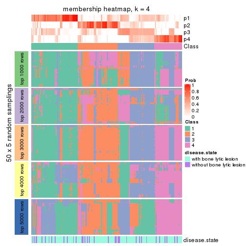</p>

</div>
<div id='tab-ATC-pam-membership-heatmap-4'>
<pre><code class="r">membership_heatmap(res, k = 5)
</code></pre>

<p></p>

</div>
<div id='tab-ATC-pam-membership-heatmap-5'>
<pre><code class="r">membership_heatmap(res, k = 6)
</code></pre>

<p></p>

</div>
</div>

As soon as we have had the classes for columns, we can look for signatures
which are significantly different between classes which can be candidate marks
for certain classes. Following are the heatmaps for signatures.


Signature heatmaps where rows are scaled:


<script>
$( function() {
	$( '#tabs-ATC-pam-get-signatures' ).tabs();
} );
</script>
<div id='tabs-ATC-pam-get-signatures'>
<ul>
<li><a href='#tab-ATC-pam-get-signatures-1'>k = 2</a></li>
<li><a href='#tab-ATC-pam-get-signatures-2'>k = 3</a></li>
<li><a href='#tab-ATC-pam-get-signatures-3'>k = 4</a></li>
<li><a href='#tab-ATC-pam-get-signatures-4'>k = 5</a></li>
<li><a href='#tab-ATC-pam-get-signatures-5'>k = 6</a></li>
</ul>
<div id='tab-ATC-pam-get-signatures-1'>
<pre><code class="r">get_signatures(res, k = 2)
</code></pre>

<p></p>

</div>
<div id='tab-ATC-pam-get-signatures-2'>
<pre><code class="r">get_signatures(res, k = 3)
</code></pre>

<p></p>

</div>
<div id='tab-ATC-pam-get-signatures-3'>
<pre><code class="r">get_signatures(res, k = 4)
</code></pre>

<p></p>

</div>
<div id='tab-ATC-pam-get-signatures-4'>
<pre><code class="r">get_signatures(res, k = 5)
</code></pre>

<p>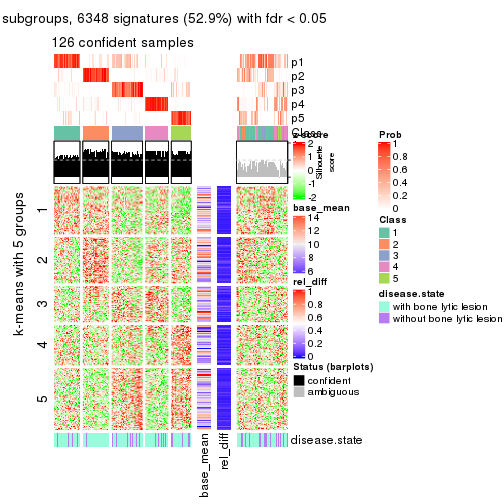</p>

</div>
<div id='tab-ATC-pam-get-signatures-5'>
<pre><code class="r">get_signatures(res, k = 6)
</code></pre>

<p></p>

</div>
</div>


Signature heatmaps where rows are not scaled:


<script>
$( function() {
	$( '#tabs-ATC-pam-get-signatures-no-scale' ).tabs();
} );
</script>
<div id='tabs-ATC-pam-get-signatures-no-scale'>
<ul>
<li><a href='#tab-ATC-pam-get-signatures-no-scale-1'>k = 2</a></li>
<li><a href='#tab-ATC-pam-get-signatures-no-scale-2'>k = 3</a></li>
<li><a href='#tab-ATC-pam-get-signatures-no-scale-3'>k = 4</a></li>
<li><a href='#tab-ATC-pam-get-signatures-no-scale-4'>k = 5</a></li>
<li><a href='#tab-ATC-pam-get-signatures-no-scale-5'>k = 6</a></li>
</ul>
<div id='tab-ATC-pam-get-signatures-no-scale-1'>
<pre><code class="r">get_signatures(res, k = 2, scale_rows = FALSE)
</code></pre>

<p></p>

</div>
<div id='tab-ATC-pam-get-signatures-no-scale-2'>
<pre><code class="r">get_signatures(res, k = 3, scale_rows = FALSE)
</code></pre>

<p></p>

</div>
<div id='tab-ATC-pam-get-signatures-no-scale-3'>
<pre><code class="r">get_signatures(res, k = 4, scale_rows = FALSE)
</code></pre>

<p></p>

</div>
<div id='tab-ATC-pam-get-signatures-no-scale-4'>
<pre><code class="r">get_signatures(res, k = 5, scale_rows = FALSE)
</code></pre>

<p></p>

</div>
<div id='tab-ATC-pam-get-signatures-no-scale-5'>
<pre><code class="r">get_signatures(res, k = 6, scale_rows = FALSE)
</code></pre>

<p></p>

</div>
</div>


Compare the overlap of signatures from different k:

```r
compare_signatures(res)
```


`get_signature()` returns a data frame invisibly. TO get the list of signatures, the function
call should be assigned to a variable explicitly. In following code, if `plot` argument is set
to `FALSE`, no heatmap is plotted while only the differential analysis is performed.

```r
# code only for demonstration
tb = get_signature(res, k = ..., plot = FALSE)
```

An example of the output of `tb` is:

```
#>   which_row         fdr    mean_1    mean_2 scaled_mean_1 scaled_mean_2 km
#> 1        38 0.042760348  8.373488  9.131774    -0.5533452     0.5164555  1
#> 2        40 0.018707592  7.106213  8.469186    -0.6173731     0.5762149  1
#> 3        55 0.019134737 10.221463 11.207825    -0.6159697     0.5749050  1
#> 4        59 0.006059896  5.921854  7.869574    -0.6899429     0.6439467  1
#> 5        60 0.018055526  8.928898 10.211722    -0.6204761     0.5791110  1
#> 6        98 0.009384629 15.714769 14.887706     0.6635654    -0.6193277  2
...
```

The columns in `tb` are:

1. `which_row`: row indices corresponding to the input matrix.
2. `fdr`: FDR for the differential test. 
3. `mean_x`: The mean value in group x.
4. `scaled_mean_x`: The mean value in group x after rows are scaled.
5. `km`: Row groups if k-means clustering is applied to rows.


UMAP plot which shows how samples are separated.


<script>
$( function() {
	$( '#tabs-ATC-pam-dimension-reduction' ).tabs();
} );
</script>
<div id='tabs-ATC-pam-dimension-reduction'>
<ul>
<li><a href='#tab-ATC-pam-dimension-reduction-1'>k = 2</a></li>
<li><a href='#tab-ATC-pam-dimension-reduction-2'>k = 3</a></li>
<li><a href='#tab-ATC-pam-dimension-reduction-3'>k = 4</a></li>
<li><a href='#tab-ATC-pam-dimension-reduction-4'>k = 5</a></li>
<li><a href='#tab-ATC-pam-dimension-reduction-5'>k = 6</a></li>
</ul>
<div id='tab-ATC-pam-dimension-reduction-1'>
<pre><code class="r">dimension_reduction(res, k = 2, method = &quot;UMAP&quot;)
</code></pre>

<p></p>

</div>
<div id='tab-ATC-pam-dimension-reduction-2'>
<pre><code class="r">dimension_reduction(res, k = 3, method = &quot;UMAP&quot;)
</code></pre>

<p></p>

</div>
<div id='tab-ATC-pam-dimension-reduction-3'>
<pre><code class="r">dimension_reduction(res, k = 4, method = &quot;UMAP&quot;)
</code></pre>

<p></p>

</div>
<div id='tab-ATC-pam-dimension-reduction-4'>
<pre><code class="r">dimension_reduction(res, k = 5, method = &quot;UMAP&quot;)
</code></pre>

<p></p>

</div>
<div id='tab-ATC-pam-dimension-reduction-5'>
<pre><code class="r">dimension_reduction(res, k = 6, method = &quot;UMAP&quot;)
</code></pre>

<p></p>

</div>
</div>


Following heatmap shows how subgroups are split when increasing `k`:

```r
collect_classes(res)
```


Test correlation between subgroups and known annotations. If the known
annotation is numeric, one-way ANOVA test is applied, and if the known
annotation is discrete, chi-squared contingency table test is applied.

```r
test_to_known_factors(res)
```

```
#>           n disease.state(p) k
#> ATC:pam 114           0.0733 2
#> ATC:pam 119           0.2231 3
#> ATC:pam  83           0.2753 4
#> ATC:pam 126           0.2805 5
#> ATC:pam 133           0.2775 6
```


If matrix rows can be associated to genes, consider to use `GO_Enrichment(res,
...)` to perform function enrichment for the signature genes.


 

---------------------------------------------------


### ATC:mclust


The object with results only for a single top-value method and a single partition method 
can be extracted as:

```r
res = res_list["ATC", "mclust"]
# you can also extract it by
# res = res_list["ATC:mclust"]
```

A summary of `res` and all the functions that can be applied to it:

```r
res
```

```
#> A 'ConsensusPartition' object with k = 2, 3, 4, 5, 6.
#>   On a matrix with 11993 rows and 173 columns.
#>   Top rows (1000, 2000, 3000, 4000, 5000) are extracted by 'ATC' method.
#>   Subgroups are detected by 'mclust' method.
#>   Performed in total 1250 partitions by row resampling.
#>   Best k for subgroups seems to be 2.
#> 
#> Following methods can be applied to this 'ConsensusPartition' object:
#>  [1] "cola_report"             "collect_classes"         "collect_plots"          
#>  [4] "collect_stats"           "colnames"                "compare_signatures"     
#>  [7] "consensus_heatmap"       "dimension_reduction"     "functional_enrichment"  
#> [10] "get_anno_col"            "get_anno"                "get_classes"            
#> [13] "get_consensus"           "get_matrix"              "get_membership"         
#> [16] "get_param"               "get_signatures"          "get_stats"              
#> [19] "is_best_k"               "is_stable_k"             "membership_heatmap"     
#> [22] "ncol"                    "nrow"                    "plot_ecdf"              
#> [25] "rownames"                "select_partition_number" "show"                   
#> [28] "suggest_best_k"          "test_to_known_factors"
```

`collect_plots()` function collects all the plots made from `res` for all `k` (number of partitions)
into one single page to provide an easy and fast comparison between different `k`.

```r
collect_plots(res)
```


The plots are:

- The first row: a plot of the ECDF (Empirical cumulative distribution
  function) curves of the consensus matrix for each `k` and the heatmap of
  predicted classes for each `k`.
- The second row: heatmaps of the consensus matrix for each `k`.
- The third row: heatmaps of the membership matrix for each `k`.
- The fouth row: heatmaps of the signatures for each `k`.

All the plots in panels can be made by individual functions and they are
plotted later in this section.

`select_partition_number()` produces several plots showing different
statistics for choosing "optimized" `k`. There are following statistics:

- ECDF curves of the consensus matrix for each `k`;
- 1-PAC. [The PAC
  score](https://en.wikipedia.org/wiki/Consensus_clustering#Over-interpretation_potential_of_consensus_clustering)
  measures the proportion of the ambiguous subgrouping.
- Mean silhouette score.
- Concordance. The mean probability of fiting the consensus class ids in all
  partitions.
- Area increased. Denote $A_k$ as the area under the ECDF curve for current
  `k`, the area increased is defined as $A_k - A_{k-1}$.
- Rand index. The percent of pairs of samples that are both in a same cluster
  or both are not in a same cluster in the partition of k and k-1.
- Jaccard index. The ratio of pairs of samples are both in a same cluster in
  the partition of k and k-1 and the pairs of samples are both in a same
  cluster in the partition k or k-1.

The detailed explanations of these statistics can be found in [the cola
vignette](http://bioconductor.org/packages/devel/bioc/vignettes/cola/inst/doc/cola.html#toc_13).

Generally speaking, lower PAC score, higher mean silhouette score or higher
concordance corresponds to better partition. Rand index and Jaccard index
measure how similar the current partition is compared to partition with `k-1`.
If they are too similar, we won't accept `k` is better than `k-1`.

```r
select_partition_number(res)
```


The numeric values for all these statistics can be obtained by `get_stats()`.

```r
get_stats(res)
```

```
#>   k 1-PAC mean_silhouette concordance area_increased  Rand Jaccard
#> 2 2 0.756           0.916       0.955         0.4634 0.541   0.541
#> 3 3 0.794           0.864       0.937         0.3491 0.771   0.601
#> 4 4 0.636           0.714       0.820         0.1370 0.918   0.790
#> 5 5 0.647           0.616       0.775         0.0908 0.867   0.601
#> 6 6 0.707           0.508       0.735         0.0597 0.824   0.367
```

`suggest_best_k()` suggests the best $k$ based on these statistics. The rules are as follows:

- All $k$ with Jaccard index larger than 0.95 are removed because the increase of
  the partition number does not provides enough extra information. If all $k$ are removed,
  the best $k$ is assigned by `NA`.
- For $k$ with 1-PAC larger than 0.9, the maximal $k$ is taken as the "best k". Other $k$ is called "optional k".
- If it does not fit the second rule. The $k$ with the highest vote of highest
  1-PAC, mean silhouette and concordance is taken as the "best k".

```r
suggest_best_k(res)
```

```
#> [1] 2
```


Following shows the table of the partitions (You need to click the **show/hide
code output** link to see it). The membership matrix (columns with name `p*`)
is inferred by
[`clue::cl_consensus()`](https://www.rdocumentation.org/link/cl_consensus?package=clue)
function with the `SE` method. Basically the value in the membership matrix
represents the probability to belong to a certain group. The finall class
label for an item is determined with the group with highest probability it
belongs to.

In `get_classes()` function, the entropy is calculated from the membership
matrix and the silhouette score is calculated from the consensus matrix.


<script>
$( function() {
	$( '#tabs-ATC-mclust-get-classes' ).tabs();
} );
</script>
<div id='tabs-ATC-mclust-get-classes'>
<ul>
<li><a href='#tab-ATC-mclust-get-classes-1'>k = 2</a></li>
<li><a href='#tab-ATC-mclust-get-classes-2'>k = 3</a></li>
<li><a href='#tab-ATC-mclust-get-classes-3'>k = 4</a></li>
<li><a href='#tab-ATC-mclust-get-classes-4'>k = 5</a></li>
<li><a href='#tab-ATC-mclust-get-classes-5'>k = 6</a></li>
</ul>

<div id='tab-ATC-mclust-get-classes-1'>
<p><a id='tab-ATC-mclust-get-classes-1-a' style='color:#0366d6' href='#'>show/hide code output</a></p>
<pre><code class="r">cbind(get_classes(res, k = 2), get_membership(res, k = 2))
</code></pre>

<pre><code>#&gt;          class entropy silhouette    p1    p2
#&gt; GSM11437     1  0.6887     0.8196 0.816 0.184
#&gt; GSM11438     2  0.0938     0.9554 0.012 0.988
#&gt; GSM11439     1  0.6712     0.8285 0.824 0.176
#&gt; GSM11440     1  0.0000     0.9536 1.000 0.000
#&gt; GSM11441     1  0.0672     0.9540 0.992 0.008
#&gt; GSM11442     1  0.6623     0.8211 0.828 0.172
#&gt; GSM11443     2  0.0000     0.9521 0.000 1.000
#&gt; GSM11444     1  0.1633     0.9511 0.976 0.024
#&gt; GSM11445     1  0.6623     0.8252 0.828 0.172
#&gt; GSM11446     1  0.0938     0.9512 0.988 0.012
#&gt; GSM11447     1  0.7299     0.7972 0.796 0.204
#&gt; GSM11448     1  0.1633     0.9511 0.976 0.024
#&gt; GSM11449     1  0.0376     0.9532 0.996 0.004
#&gt; GSM11450     1  0.1184     0.9519 0.984 0.016
#&gt; GSM11451     2  0.0938     0.9554 0.012 0.988
#&gt; GSM11452     2  0.0938     0.9554 0.012 0.988
#&gt; GSM11453     1  0.0000     0.9536 1.000 0.000
#&gt; GSM11454     1  0.1633     0.9511 0.976 0.024
#&gt; GSM11455     2  0.5737     0.8381 0.136 0.864
#&gt; GSM11456     2  0.0938     0.9554 0.012 0.988
#&gt; GSM11457     2  0.0938     0.9554 0.012 0.988
#&gt; GSM11458     1  0.0938     0.9512 0.988 0.012
#&gt; GSM11459     1  0.0938     0.9512 0.988 0.012
#&gt; GSM11460     1  0.1633     0.9511 0.976 0.024
#&gt; GSM11461     1  0.1633     0.9511 0.976 0.024
#&gt; GSM11462     1  0.0938     0.9512 0.988 0.012
#&gt; GSM11463     2  0.0000     0.9521 0.000 1.000
#&gt; GSM11464     1  0.0000     0.9536 1.000 0.000
#&gt; GSM11465     2  1.0000     0.0783 0.500 0.500
#&gt; GSM11466     1  0.0376     0.9536 0.996 0.004
#&gt; GSM11467     1  0.0000     0.9536 1.000 0.000
#&gt; GSM11468     1  0.0000     0.9536 1.000 0.000
#&gt; GSM11469     1  0.0000     0.9536 1.000 0.000
#&gt; GSM11470     1  0.0000     0.9536 1.000 0.000
#&gt; GSM11471     1  0.0000     0.9536 1.000 0.000
#&gt; GSM11472     1  0.0000     0.9536 1.000 0.000
#&gt; GSM11473     2  0.0000     0.9521 0.000 1.000
#&gt; GSM11474     2  0.0672     0.9544 0.008 0.992
#&gt; GSM11475     1  0.1414     0.9518 0.980 0.020
#&gt; GSM11476     1  0.6887     0.8079 0.816 0.184
#&gt; GSM11477     2  0.0938     0.9554 0.012 0.988
#&gt; GSM11478     2  0.0938     0.9554 0.012 0.988
#&gt; GSM11479     2  0.6343     0.7921 0.160 0.840
#&gt; GSM11480     2  0.0938     0.9554 0.012 0.988
#&gt; GSM11481     1  0.0000     0.9536 1.000 0.000
#&gt; GSM11482     1  0.6623     0.8211 0.828 0.172
#&gt; GSM11483     2  0.0938     0.9554 0.012 0.988
#&gt; GSM11484     1  0.0938     0.9520 0.988 0.012
#&gt; GSM11485     1  0.6623     0.8211 0.828 0.172
#&gt; GSM11486     2  0.0000     0.9521 0.000 1.000
#&gt; GSM11487     1  0.0672     0.9530 0.992 0.008
#&gt; GSM11488     1  0.6623     0.8211 0.828 0.172
#&gt; GSM11489     2  0.0938     0.9554 0.012 0.988
#&gt; GSM11490     1  0.1633     0.9511 0.976 0.024
#&gt; GSM11491     1  0.0000     0.9536 1.000 0.000
#&gt; GSM11492     1  0.1184     0.9524 0.984 0.016
#&gt; GSM11493     1  0.3274     0.9219 0.940 0.060
#&gt; GSM11494     1  0.6887     0.8196 0.816 0.184
#&gt; GSM11495     1  0.6623     0.8211 0.828 0.172
#&gt; GSM11496     2  0.0672     0.9495 0.008 0.992
#&gt; GSM11497     2  0.0000     0.9521 0.000 1.000
#&gt; GSM11498     1  0.9460     0.5156 0.636 0.364
#&gt; GSM11499     1  0.6623     0.8211 0.828 0.172
#&gt; GSM11500     2  0.0000     0.9521 0.000 1.000
#&gt; GSM11501     1  0.6531     0.8254 0.832 0.168
#&gt; GSM11502     2  0.0938     0.9554 0.012 0.988
#&gt; GSM11503     2  0.0000     0.9521 0.000 1.000
#&gt; GSM11504     1  0.2603     0.9367 0.956 0.044
#&gt; GSM11505     2  0.0000     0.9521 0.000 1.000
#&gt; GSM11506     2  0.0000     0.9521 0.000 1.000
#&gt; GSM11507     2  0.0938     0.9554 0.012 0.988
#&gt; GSM11508     1  0.1633     0.9511 0.976 0.024
#&gt; GSM11509     1  0.1633     0.9511 0.976 0.024
#&gt; GSM11510     1  0.0938     0.9520 0.988 0.012
#&gt; GSM11511     1  0.6438     0.8407 0.836 0.164
#&gt; GSM11512     1  0.0938     0.9520 0.988 0.012
#&gt; GSM11513     1  0.0938     0.9512 0.988 0.012
#&gt; GSM11514     1  0.0938     0.9520 0.988 0.012
#&gt; GSM11515     1  0.6887     0.8196 0.816 0.184
#&gt; GSM11516     2  0.0938     0.9554 0.012 0.988
#&gt; GSM11517     1  0.0938     0.9520 0.988 0.012
#&gt; GSM11518     1  0.1414     0.9518 0.980 0.020
#&gt; GSM11519     1  0.0672     0.9530 0.992 0.008
#&gt; GSM11520     1  0.0938     0.9512 0.988 0.012
#&gt; GSM11521     1  0.6801     0.8124 0.820 0.180
#&gt; GSM11522     1  0.0938     0.9512 0.988 0.012
#&gt; GSM11523     1  0.0938     0.9512 0.988 0.012
#&gt; GSM11524     1  0.0000     0.9536 1.000 0.000
#&gt; GSM11525     2  0.0938     0.9554 0.012 0.988
#&gt; GSM11526     1  0.6801     0.8205 0.820 0.180
#&gt; GSM11527     2  0.0938     0.9554 0.012 0.988
#&gt; GSM11528     2  0.1414     0.9512 0.020 0.980
#&gt; GSM11529     2  0.0938     0.9554 0.012 0.988
#&gt; GSM11530     1  0.0672     0.9530 0.992 0.008
#&gt; GSM11531     2  0.0000     0.9521 0.000 1.000
#&gt; GSM11532     1  0.0672     0.9530 0.992 0.008
#&gt; GSM11533     2  0.0000     0.9521 0.000 1.000
#&gt; GSM11534     1  0.6973     0.8032 0.812 0.188
#&gt; GSM11535     2  0.0000     0.9521 0.000 1.000
#&gt; GSM11536     1  0.0938     0.9520 0.988 0.012
#&gt; GSM11537     2  0.0938     0.9554 0.012 0.988
#&gt; GSM11538     1  0.0938     0.9520 0.988 0.012
#&gt; GSM11539     2  0.0000     0.9521 0.000 1.000
#&gt; GSM11540     2  0.0938     0.9554 0.012 0.988
#&gt; GSM11541     1  0.0938     0.9520 0.988 0.012
#&gt; GSM11542     2  0.8386     0.6299 0.268 0.732
#&gt; GSM11543     1  0.0938     0.9520 0.988 0.012
#&gt; GSM11544     1  0.0938     0.9512 0.988 0.012
#&gt; GSM11545     1  0.0000     0.9536 1.000 0.000
#&gt; GSM11546     2  0.0000     0.9521 0.000 1.000
#&gt; GSM11547     2  0.0000     0.9521 0.000 1.000
#&gt; GSM11548     1  0.1184     0.9519 0.984 0.016
#&gt; GSM11549     1  0.3733     0.9212 0.928 0.072
#&gt; GSM11550     1  0.0672     0.9525 0.992 0.008
#&gt; GSM11551     1  0.1633     0.9511 0.976 0.024
#&gt; GSM11552     1  0.0938     0.9512 0.988 0.012
#&gt; GSM11553     2  0.0938     0.9554 0.012 0.988
#&gt; GSM11554     2  0.0938     0.9554 0.012 0.988
#&gt; GSM11555     1  0.0938     0.9520 0.988 0.012
#&gt; GSM11556     1  0.0672     0.9525 0.992 0.008
#&gt; GSM11557     2  0.0000     0.9521 0.000 1.000
#&gt; GSM11558     2  0.0938     0.9554 0.012 0.988
#&gt; GSM11559     1  0.9552     0.3579 0.624 0.376
#&gt; GSM11560     1  0.0938     0.9512 0.988 0.012
#&gt; GSM11561     2  0.0938     0.9554 0.012 0.988
#&gt; GSM11562     2  0.0938     0.9554 0.012 0.988
#&gt; GSM11563     1  0.1184     0.9507 0.984 0.016
#&gt; GSM11564     1  0.0000     0.9536 1.000 0.000
#&gt; GSM11565     1  0.0000     0.9536 1.000 0.000
#&gt; GSM11566     2  0.0938     0.9554 0.012 0.988
#&gt; GSM11567     1  0.0938     0.9520 0.988 0.012
#&gt; GSM11568     2  0.0938     0.9554 0.012 0.988
#&gt; GSM11569     2  0.0938     0.9554 0.012 0.988
#&gt; GSM11570     1  0.0000     0.9536 1.000 0.000
#&gt; GSM11571     2  0.4815     0.8737 0.104 0.896
#&gt; GSM11572     1  0.0938     0.9520 0.988 0.012
#&gt; GSM11573     1  0.0000     0.9536 1.000 0.000
#&gt; GSM11574     2  0.6623     0.8097 0.172 0.828
#&gt; GSM11575     2  0.6048     0.8238 0.148 0.852
#&gt; GSM11576     1  0.0938     0.9512 0.988 0.012
#&gt; GSM11577     2  0.6801     0.8021 0.180 0.820
#&gt; GSM11578     2  0.6623     0.8097 0.172 0.828
#&gt; GSM11579     2  0.0938     0.9554 0.012 0.988
#&gt; GSM11580     2  0.0938     0.9554 0.012 0.988
#&gt; GSM11581     1  0.0000     0.9536 1.000 0.000
#&gt; GSM11582     1  0.0000     0.9536 1.000 0.000
#&gt; GSM11583     1  0.1184     0.9519 0.984 0.016
#&gt; GSM11584     1  0.0938     0.9520 0.988 0.012
#&gt; GSM11585     2  0.0938     0.9554 0.012 0.988
#&gt; GSM11586     1  0.0000     0.9536 1.000 0.000
#&gt; GSM11587     1  0.0938     0.9512 0.988 0.012
#&gt; GSM11588     1  0.0000     0.9536 1.000 0.000
#&gt; GSM11589     2  0.9286     0.5344 0.344 0.656
#&gt; GSM11590     1  0.0000     0.9536 1.000 0.000
#&gt; GSM11591     2  0.6623     0.8097 0.172 0.828
#&gt; GSM11592     1  0.0376     0.9536 0.996 0.004
#&gt; GSM11593     1  0.0000     0.9536 1.000 0.000
#&gt; GSM11594     1  0.0000     0.9536 1.000 0.000
#&gt; GSM11595     1  0.0000     0.9536 1.000 0.000
#&gt; GSM11596     1  0.6623     0.7879 0.828 0.172
#&gt; GSM11597     1  0.0376     0.9532 0.996 0.004
#&gt; GSM11598     1  0.0000     0.9536 1.000 0.000
#&gt; GSM11599     1  0.0000     0.9536 1.000 0.000
#&gt; GSM11600     1  0.0000     0.9536 1.000 0.000
#&gt; GSM11601     2  0.1184     0.9537 0.016 0.984
#&gt; GSM11602     1  0.0938     0.9512 0.988 0.012
#&gt; GSM11603     1  0.0938     0.9512 0.988 0.012
#&gt; GSM11604     1  0.0376     0.9536 0.996 0.004
#&gt; GSM11605     1  0.0000     0.9536 1.000 0.000
#&gt; GSM11606     2  0.1414     0.9514 0.020 0.980
#&gt; GSM11607     1  0.0000     0.9536 1.000 0.000
#&gt; GSM11608     1  0.0938     0.9512 0.988 0.012
#&gt; GSM11609     1  0.0000     0.9536 1.000 0.000
</code></pre>

<script>
$('#tab-ATC-mclust-get-classes-1-a').parent().next().next().hide();
$('#tab-ATC-mclust-get-classes-1-a').click(function(){
  $('#tab-ATC-mclust-get-classes-1-a').parent().next().next().toggle();
  return(false);
});
</script>
</div>

<div id='tab-ATC-mclust-get-classes-2'>
<p><a id='tab-ATC-mclust-get-classes-2-a' style='color:#0366d6' href='#'>show/hide code output</a></p>
<pre><code class="r">cbind(get_classes(res, k = 3), get_membership(res, k = 3))
</code></pre>

<pre><code>#&gt;          class entropy silhouette    p1    p2    p3
#&gt; GSM11437     3  0.5719     0.7723 0.156 0.052 0.792
#&gt; GSM11438     2  0.0000     0.9358 0.000 1.000 0.000
#&gt; GSM11439     3  0.8817     0.4556 0.160 0.272 0.568
#&gt; GSM11440     1  0.2356     0.8926 0.928 0.000 0.072
#&gt; GSM11441     1  0.0424     0.9312 0.992 0.000 0.008
#&gt; GSM11442     3  0.1289     0.8860 0.000 0.032 0.968
#&gt; GSM11443     2  0.0000     0.9358 0.000 1.000 0.000
#&gt; GSM11444     1  0.2537     0.8878 0.920 0.000 0.080
#&gt; GSM11445     3  0.0000     0.9019 0.000 0.000 1.000
#&gt; GSM11446     1  0.0000     0.9346 1.000 0.000 0.000
#&gt; GSM11447     2  0.8720     0.0886 0.108 0.480 0.412
#&gt; GSM11448     1  0.2537     0.8863 0.920 0.000 0.080
#&gt; GSM11449     1  0.0000     0.9346 1.000 0.000 0.000
#&gt; GSM11450     1  0.0000     0.9346 1.000 0.000 0.000
#&gt; GSM11451     2  0.0000     0.9358 0.000 1.000 0.000
#&gt; GSM11452     2  0.0000     0.9358 0.000 1.000 0.000
#&gt; GSM11453     1  0.0000     0.9346 1.000 0.000 0.000
#&gt; GSM11454     1  0.1529     0.9126 0.960 0.000 0.040
#&gt; GSM11455     2  0.3482     0.8268 0.000 0.872 0.128
#&gt; GSM11456     2  0.0000     0.9358 0.000 1.000 0.000
#&gt; GSM11457     2  0.0000     0.9358 0.000 1.000 0.000
#&gt; GSM11458     1  0.0000     0.9346 1.000 0.000 0.000
#&gt; GSM11459     1  0.0000     0.9346 1.000 0.000 0.000
#&gt; GSM11460     1  0.5905     0.4242 0.648 0.000 0.352
#&gt; GSM11461     1  0.2356     0.8921 0.928 0.000 0.072
#&gt; GSM11462     1  0.0000     0.9346 1.000 0.000 0.000
#&gt; GSM11463     2  0.0000     0.9358 0.000 1.000 0.000
#&gt; GSM11464     1  0.0000     0.9346 1.000 0.000 0.000
#&gt; GSM11465     1  0.8546     0.3363 0.544 0.348 0.108
#&gt; GSM11466     1  0.3340     0.8510 0.880 0.000 0.120
#&gt; GSM11467     1  0.0000     0.9346 1.000 0.000 0.000
#&gt; GSM11468     1  0.2711     0.8801 0.912 0.000 0.088
#&gt; GSM11469     1  0.0424     0.9312 0.992 0.000 0.008
#&gt; GSM11470     1  0.0000     0.9346 1.000 0.000 0.000
#&gt; GSM11471     1  0.0000     0.9346 1.000 0.000 0.000
#&gt; GSM11472     1  0.0000     0.9346 1.000 0.000 0.000
#&gt; GSM11473     2  0.0000     0.9358 0.000 1.000 0.000
#&gt; GSM11474     2  0.0000     0.9358 0.000 1.000 0.000
#&gt; GSM11475     1  0.0000     0.9346 1.000 0.000 0.000
#&gt; GSM11476     3  0.2878     0.8393 0.000 0.096 0.904
#&gt; GSM11477     2  0.0000     0.9358 0.000 1.000 0.000
#&gt; GSM11478     2  0.0000     0.9358 0.000 1.000 0.000
#&gt; GSM11479     2  0.3038     0.8553 0.000 0.896 0.104
#&gt; GSM11480     2  0.0000     0.9358 0.000 1.000 0.000
#&gt; GSM11481     1  0.3879     0.8169 0.848 0.000 0.152
#&gt; GSM11482     3  0.0000     0.9019 0.000 0.000 1.000
#&gt; GSM11483     2  0.1753     0.9038 0.000 0.952 0.048
#&gt; GSM11484     3  0.1289     0.8994 0.032 0.000 0.968
#&gt; GSM11485     3  0.0000     0.9019 0.000 0.000 1.000
#&gt; GSM11486     2  0.0000     0.9358 0.000 1.000 0.000
#&gt; GSM11487     1  0.0000     0.9346 1.000 0.000 0.000
#&gt; GSM11488     3  0.0000     0.9019 0.000 0.000 1.000
#&gt; GSM11489     2  0.0000     0.9358 0.000 1.000 0.000
#&gt; GSM11490     1  0.3551     0.8405 0.868 0.000 0.132
#&gt; GSM11491     1  0.0000     0.9346 1.000 0.000 0.000
#&gt; GSM11492     3  0.1289     0.8994 0.032 0.000 0.968
#&gt; GSM11493     3  0.0000     0.9019 0.000 0.000 1.000
#&gt; GSM11494     3  0.0000     0.9019 0.000 0.000 1.000
#&gt; GSM11495     3  0.0000     0.9019 0.000 0.000 1.000
#&gt; GSM11496     2  0.1031     0.9216 0.000 0.976 0.024
#&gt; GSM11497     2  0.0000     0.9358 0.000 1.000 0.000
#&gt; GSM11498     2  0.6994     0.2743 0.020 0.556 0.424
#&gt; GSM11499     3  0.0000     0.9019 0.000 0.000 1.000
#&gt; GSM11500     2  0.0000     0.9358 0.000 1.000 0.000
#&gt; GSM11501     3  0.0000     0.9019 0.000 0.000 1.000
#&gt; GSM11502     2  0.0237     0.9337 0.000 0.996 0.004
#&gt; GSM11503     2  0.1860     0.8985 0.000 0.948 0.052
#&gt; GSM11504     3  0.1289     0.8994 0.032 0.000 0.968
#&gt; GSM11505     2  0.0000     0.9358 0.000 1.000 0.000
#&gt; GSM11506     2  0.0000     0.9358 0.000 1.000 0.000
#&gt; GSM11507     2  0.0000     0.9358 0.000 1.000 0.000
#&gt; GSM11508     3  0.1411     0.8983 0.036 0.000 0.964
#&gt; GSM11509     1  0.1964     0.9060 0.944 0.000 0.056
#&gt; GSM11510     3  0.2356     0.8815 0.072 0.000 0.928
#&gt; GSM11511     1  0.5637     0.7550 0.788 0.040 0.172
#&gt; GSM11512     3  0.1411     0.8988 0.036 0.000 0.964
#&gt; GSM11513     1  0.0000     0.9346 1.000 0.000 0.000
#&gt; GSM11514     1  0.3551     0.8541 0.868 0.000 0.132
#&gt; GSM11515     3  0.0000     0.9019 0.000 0.000 1.000
#&gt; GSM11516     2  0.0000     0.9358 0.000 1.000 0.000
#&gt; GSM11517     1  0.4702     0.7414 0.788 0.000 0.212
#&gt; GSM11518     1  0.0000     0.9346 1.000 0.000 0.000
#&gt; GSM11519     1  0.0000     0.9346 1.000 0.000 0.000
#&gt; GSM11520     1  0.0000     0.9346 1.000 0.000 0.000
#&gt; GSM11521     3  0.0747     0.8969 0.000 0.016 0.984
#&gt; GSM11522     1  0.0000     0.9346 1.000 0.000 0.000
#&gt; GSM11523     1  0.0000     0.9346 1.000 0.000 0.000
#&gt; GSM11524     1  0.3038     0.8664 0.896 0.000 0.104
#&gt; GSM11525     2  0.0000     0.9358 0.000 1.000 0.000
#&gt; GSM11526     3  0.1399     0.8957 0.028 0.004 0.968
#&gt; GSM11527     2  0.0000     0.9358 0.000 1.000 0.000
#&gt; GSM11528     2  0.1289     0.9142 0.000 0.968 0.032
#&gt; GSM11529     2  0.1860     0.8985 0.000 0.948 0.052
#&gt; GSM11530     1  0.0237     0.9329 0.996 0.000 0.004
#&gt; GSM11531     2  0.0000     0.9358 0.000 1.000 0.000
#&gt; GSM11532     1  0.2537     0.8903 0.920 0.000 0.080
#&gt; GSM11533     2  0.0000     0.9358 0.000 1.000 0.000
#&gt; GSM11534     3  0.3619     0.7977 0.000 0.136 0.864
#&gt; GSM11535     2  0.0000     0.9358 0.000 1.000 0.000
#&gt; GSM11536     3  0.1289     0.8984 0.032 0.000 0.968
#&gt; GSM11537     2  0.0000     0.9358 0.000 1.000 0.000
#&gt; GSM11538     3  0.4002     0.7960 0.160 0.000 0.840
#&gt; GSM11539     2  0.0000     0.9358 0.000 1.000 0.000
#&gt; GSM11540     2  0.0000     0.9358 0.000 1.000 0.000
#&gt; GSM11541     3  0.2711     0.8723 0.088 0.000 0.912
#&gt; GSM11542     2  0.5948     0.4607 0.000 0.640 0.360
#&gt; GSM11543     1  0.1031     0.9240 0.976 0.000 0.024
#&gt; GSM11544     1  0.0000     0.9346 1.000 0.000 0.000
#&gt; GSM11545     1  0.0000     0.9346 1.000 0.000 0.000
#&gt; GSM11546     2  0.0237     0.9336 0.000 0.996 0.004
#&gt; GSM11547     2  0.0000     0.9358 0.000 1.000 0.000
#&gt; GSM11548     1  0.0000     0.9346 1.000 0.000 0.000
#&gt; GSM11549     1  0.5012     0.7370 0.788 0.008 0.204
#&gt; GSM11550     1  0.0000     0.9346 1.000 0.000 0.000
#&gt; GSM11551     3  0.6252     0.2254 0.444 0.000 0.556
#&gt; GSM11552     1  0.0000     0.9346 1.000 0.000 0.000
#&gt; GSM11553     2  0.0237     0.9336 0.000 0.996 0.004
#&gt; GSM11554     2  0.0000     0.9358 0.000 1.000 0.000
#&gt; GSM11555     3  0.6062     0.3550 0.384 0.000 0.616
#&gt; GSM11556     1  0.0000     0.9346 1.000 0.000 0.000
#&gt; GSM11557     2  0.0000     0.9358 0.000 1.000 0.000
#&gt; GSM11558     2  0.0000     0.9358 0.000 1.000 0.000
#&gt; GSM11559     1  0.5004     0.8202 0.840 0.088 0.072
#&gt; GSM11560     1  0.0000     0.9346 1.000 0.000 0.000
#&gt; GSM11561     2  0.0000     0.9358 0.000 1.000 0.000
#&gt; GSM11562     2  0.0000     0.9358 0.000 1.000 0.000
#&gt; GSM11563     1  0.3112     0.8722 0.900 0.004 0.096
#&gt; GSM11564     1  0.0000     0.9346 1.000 0.000 0.000
#&gt; GSM11565     1  0.0000     0.9346 1.000 0.000 0.000
#&gt; GSM11566     2  0.0000     0.9358 0.000 1.000 0.000
#&gt; GSM11567     3  0.2165     0.8822 0.064 0.000 0.936
#&gt; GSM11568     2  0.0000     0.9358 0.000 1.000 0.000
#&gt; GSM11569     2  0.0000     0.9358 0.000 1.000 0.000
#&gt; GSM11570     1  0.0000     0.9346 1.000 0.000 0.000
#&gt; GSM11571     2  0.7620     0.3695 0.348 0.596 0.056
#&gt; GSM11572     1  0.2866     0.8908 0.916 0.008 0.076
#&gt; GSM11573     1  0.0000     0.9346 1.000 0.000 0.000
#&gt; GSM11574     1  0.7777     0.2348 0.532 0.416 0.052
#&gt; GSM11575     1  0.7339     0.6129 0.688 0.224 0.088
#&gt; GSM11576     1  0.0000     0.9346 1.000 0.000 0.000
#&gt; GSM11577     2  0.7531     0.5349 0.236 0.672 0.092
#&gt; GSM11578     1  0.5115     0.7401 0.796 0.188 0.016
#&gt; GSM11579     2  0.0000     0.9358 0.000 1.000 0.000
#&gt; GSM11580     2  0.1529     0.9085 0.000 0.960 0.040
#&gt; GSM11581     1  0.3879     0.8169 0.848 0.000 0.152
#&gt; GSM11582     1  0.3038     0.8664 0.896 0.000 0.104
#&gt; GSM11583     1  0.0000     0.9346 1.000 0.000 0.000
#&gt; GSM11584     3  0.3879     0.8066 0.152 0.000 0.848
#&gt; GSM11585     2  0.1411     0.9117 0.000 0.964 0.036
#&gt; GSM11586     1  0.0424     0.9312 0.992 0.000 0.008
#&gt; GSM11587     1  0.0000     0.9346 1.000 0.000 0.000
#&gt; GSM11588     1  0.0000     0.9346 1.000 0.000 0.000
#&gt; GSM11589     2  0.8683     0.0480 0.428 0.468 0.104
#&gt; GSM11590     1  0.0000     0.9346 1.000 0.000 0.000
#&gt; GSM11591     1  0.6348     0.6801 0.740 0.212 0.048
#&gt; GSM11592     1  0.0000     0.9346 1.000 0.000 0.000
#&gt; GSM11593     1  0.0000     0.9346 1.000 0.000 0.000
#&gt; GSM11594     1  0.0000     0.9346 1.000 0.000 0.000
#&gt; GSM11595     1  0.0000     0.9346 1.000 0.000 0.000
#&gt; GSM11596     1  0.4007     0.8605 0.880 0.036 0.084
#&gt; GSM11597     1  0.0000     0.9346 1.000 0.000 0.000
#&gt; GSM11598     1  0.0000     0.9346 1.000 0.000 0.000
#&gt; GSM11599     1  0.1031     0.9232 0.976 0.000 0.024
#&gt; GSM11600     1  0.0000     0.9346 1.000 0.000 0.000
#&gt; GSM11601     2  0.4316     0.8281 0.044 0.868 0.088
#&gt; GSM11602     1  0.0000     0.9346 1.000 0.000 0.000
#&gt; GSM11603     1  0.0000     0.9346 1.000 0.000 0.000
#&gt; GSM11604     1  0.0000     0.9346 1.000 0.000 0.000
#&gt; GSM11605     1  0.3816     0.8214 0.852 0.000 0.148
#&gt; GSM11606     2  0.1860     0.8985 0.000 0.948 0.052
#&gt; GSM11607     1  0.0000     0.9346 1.000 0.000 0.000
#&gt; GSM11608     1  0.0000     0.9346 1.000 0.000 0.000
#&gt; GSM11609     1  0.4002     0.8080 0.840 0.000 0.160
</code></pre>

<script>
$('#tab-ATC-mclust-get-classes-2-a').parent().next().next().hide();
$('#tab-ATC-mclust-get-classes-2-a').click(function(){
  $('#tab-ATC-mclust-get-classes-2-a').parent().next().next().toggle();
  return(false);
});
</script>
</div>

<div id='tab-ATC-mclust-get-classes-3'>
<p><a id='tab-ATC-mclust-get-classes-3-a' style='color:#0366d6' href='#'>show/hide code output</a></p>
<pre><code class="r">cbind(get_classes(res, k = 4), get_membership(res, k = 4))
</code></pre>

<pre><code>#&gt;          class entropy silhouette    p1    p2    p3    p4
#&gt; GSM11437     4  0.2256     0.7727 0.020 0.056 0.000 0.924
#&gt; GSM11438     2  0.0000     0.8924 0.000 1.000 0.000 0.000
#&gt; GSM11439     4  0.2949     0.7375 0.024 0.088 0.000 0.888
#&gt; GSM11440     1  0.5040     0.7264 0.628 0.000 0.364 0.008
#&gt; GSM11441     1  0.4679     0.7334 0.648 0.000 0.352 0.000
#&gt; GSM11442     4  0.0000     0.7968 0.000 0.000 0.000 1.000
#&gt; GSM11443     2  0.0000     0.8924 0.000 1.000 0.000 0.000
#&gt; GSM11444     1  0.6928     0.4034 0.556 0.000 0.136 0.308
#&gt; GSM11445     4  0.0000     0.7968 0.000 0.000 0.000 1.000
#&gt; GSM11446     1  0.2149     0.8116 0.912 0.000 0.088 0.000
#&gt; GSM11447     4  0.5112     0.2527 0.008 0.384 0.000 0.608
#&gt; GSM11448     1  0.2563     0.7844 0.908 0.000 0.020 0.072
#&gt; GSM11449     1  0.0592     0.7992 0.984 0.000 0.016 0.000
#&gt; GSM11450     1  0.2216     0.8124 0.908 0.000 0.092 0.000
#&gt; GSM11451     2  0.0000     0.8924 0.000 1.000 0.000 0.000
#&gt; GSM11452     2  0.5000    -0.4622 0.000 0.504 0.496 0.000
#&gt; GSM11453     1  0.3074     0.8054 0.848 0.000 0.152 0.000
#&gt; GSM11454     1  0.1398     0.8082 0.956 0.000 0.040 0.004
#&gt; GSM11455     4  0.4661     0.3534 0.000 0.348 0.000 0.652
#&gt; GSM11456     2  0.0000     0.8924 0.000 1.000 0.000 0.000
#&gt; GSM11457     2  0.0000     0.8924 0.000 1.000 0.000 0.000
#&gt; GSM11458     1  0.1118     0.7936 0.964 0.000 0.036 0.000
#&gt; GSM11459     1  0.3801     0.7769 0.780 0.000 0.220 0.000
#&gt; GSM11460     1  0.6495     0.0397 0.492 0.000 0.072 0.436
#&gt; GSM11461     1  0.1767     0.7915 0.944 0.000 0.044 0.012
#&gt; GSM11462     1  0.3172     0.7821 0.840 0.000 0.160 0.000
#&gt; GSM11463     2  0.0000     0.8924 0.000 1.000 0.000 0.000
#&gt; GSM11464     1  0.4356     0.7693 0.708 0.000 0.292 0.000
#&gt; GSM11465     3  0.6877     0.4464 0.048 0.088 0.664 0.200
#&gt; GSM11466     1  0.5007     0.7267 0.636 0.000 0.356 0.008
#&gt; GSM11467     1  0.1211     0.7999 0.960 0.000 0.040 0.000
#&gt; GSM11468     1  0.5007     0.7267 0.636 0.000 0.356 0.008
#&gt; GSM11469     1  0.4713     0.7351 0.640 0.000 0.360 0.000
#&gt; GSM11470     1  0.2530     0.7571 0.888 0.000 0.112 0.000
#&gt; GSM11471     1  0.2216     0.7684 0.908 0.000 0.092 0.000
#&gt; GSM11472     1  0.3726     0.7919 0.788 0.000 0.212 0.000
#&gt; GSM11473     2  0.0000     0.8924 0.000 1.000 0.000 0.000
#&gt; GSM11474     2  0.0000     0.8924 0.000 1.000 0.000 0.000
#&gt; GSM11475     1  0.4986     0.7830 0.740 0.000 0.216 0.044
#&gt; GSM11476     4  0.0817     0.7932 0.000 0.024 0.000 0.976
#&gt; GSM11477     2  0.0000     0.8924 0.000 1.000 0.000 0.000
#&gt; GSM11478     2  0.0000     0.8924 0.000 1.000 0.000 0.000
#&gt; GSM11479     2  0.4746     0.2361 0.000 0.632 0.000 0.368
#&gt; GSM11480     2  0.0000     0.8924 0.000 1.000 0.000 0.000
#&gt; GSM11481     1  0.5007     0.7267 0.636 0.000 0.356 0.008
#&gt; GSM11482     4  0.0712     0.7985 0.004 0.004 0.008 0.984
#&gt; GSM11483     2  0.3400     0.6182 0.000 0.820 0.000 0.180
#&gt; GSM11484     4  0.4018     0.7285 0.004 0.000 0.224 0.772
#&gt; GSM11485     4  0.0000     0.7968 0.000 0.000 0.000 1.000
#&gt; GSM11486     2  0.0000     0.8924 0.000 1.000 0.000 0.000
#&gt; GSM11487     1  0.3528     0.7957 0.808 0.000 0.192 0.000
#&gt; GSM11488     4  0.2281     0.7820 0.000 0.000 0.096 0.904
#&gt; GSM11489     2  0.0592     0.8734 0.000 0.984 0.000 0.016
#&gt; GSM11490     1  0.5906     0.5576 0.644 0.000 0.064 0.292
#&gt; GSM11491     1  0.0592     0.8014 0.984 0.000 0.016 0.000
#&gt; GSM11492     4  0.3539     0.7418 0.004 0.000 0.176 0.820
#&gt; GSM11493     4  0.2973     0.7615 0.000 0.000 0.144 0.856
#&gt; GSM11494     4  0.0000     0.7968 0.000 0.000 0.000 1.000
#&gt; GSM11495     4  0.0000     0.7968 0.000 0.000 0.000 1.000
#&gt; GSM11496     2  0.3764     0.5678 0.000 0.784 0.000 0.216
#&gt; GSM11497     2  0.0000     0.8924 0.000 1.000 0.000 0.000
#&gt; GSM11498     4  0.3074     0.6728 0.000 0.152 0.000 0.848
#&gt; GSM11499     4  0.0000     0.7968 0.000 0.000 0.000 1.000
#&gt; GSM11500     2  0.0188     0.8878 0.000 0.996 0.000 0.004
#&gt; GSM11501     4  0.1930     0.7935 0.004 0.004 0.056 0.936
#&gt; GSM11502     2  0.0000     0.8924 0.000 1.000 0.000 0.000
#&gt; GSM11503     2  0.0469     0.8800 0.000 0.988 0.012 0.000
#&gt; GSM11504     4  0.3626     0.7378 0.004 0.000 0.184 0.812
#&gt; GSM11505     2  0.0000     0.8924 0.000 1.000 0.000 0.000
#&gt; GSM11506     2  0.0000     0.8924 0.000 1.000 0.000 0.000
#&gt; GSM11507     2  0.0000     0.8924 0.000 1.000 0.000 0.000
#&gt; GSM11508     4  0.3626     0.7378 0.004 0.000 0.184 0.812
#&gt; GSM11509     1  0.3625     0.8006 0.828 0.000 0.160 0.012
#&gt; GSM11510     4  0.3999     0.7355 0.036 0.000 0.140 0.824
#&gt; GSM11511     1  0.6750     0.5461 0.652 0.136 0.016 0.196
#&gt; GSM11512     4  0.5075     0.6528 0.012 0.000 0.344 0.644
#&gt; GSM11513     1  0.2921     0.8071 0.860 0.000 0.140 0.000
#&gt; GSM11514     1  0.6548     0.6881 0.636 0.000 0.188 0.176
#&gt; GSM11515     4  0.0000     0.7968 0.000 0.000 0.000 1.000
#&gt; GSM11516     2  0.5000    -0.4718 0.000 0.500 0.500 0.000
#&gt; GSM11517     1  0.7179     0.2643 0.456 0.000 0.136 0.408
#&gt; GSM11518     1  0.0817     0.8076 0.976 0.000 0.024 0.000
#&gt; GSM11519     1  0.0817     0.8043 0.976 0.000 0.024 0.000
#&gt; GSM11520     1  0.0336     0.7997 0.992 0.000 0.008 0.000
#&gt; GSM11521     4  0.0921     0.7920 0.000 0.028 0.000 0.972
#&gt; GSM11522     1  0.1022     0.8092 0.968 0.000 0.032 0.000
#&gt; GSM11523     1  0.1118     0.7936 0.964 0.000 0.036 0.000
#&gt; GSM11524     1  0.5024     0.7265 0.632 0.000 0.360 0.008
#&gt; GSM11525     2  0.0000     0.8924 0.000 1.000 0.000 0.000
#&gt; GSM11526     4  0.0188     0.7967 0.000 0.004 0.000 0.996
#&gt; GSM11527     2  0.0000     0.8924 0.000 1.000 0.000 0.000
#&gt; GSM11528     2  0.4585     0.3038 0.000 0.668 0.000 0.332
#&gt; GSM11529     2  0.3907     0.4889 0.000 0.768 0.232 0.000
#&gt; GSM11530     1  0.2345     0.8110 0.900 0.000 0.100 0.000
#&gt; GSM11531     2  0.0000     0.8924 0.000 1.000 0.000 0.000
#&gt; GSM11532     1  0.4990     0.7291 0.640 0.000 0.352 0.008
#&gt; GSM11533     2  0.0000     0.8924 0.000 1.000 0.000 0.000
#&gt; GSM11534     4  0.4034     0.6255 0.004 0.192 0.008 0.796
#&gt; GSM11535     2  0.0000     0.8924 0.000 1.000 0.000 0.000
#&gt; GSM11536     4  0.5289     0.6459 0.020 0.000 0.344 0.636
#&gt; GSM11537     2  0.0000     0.8924 0.000 1.000 0.000 0.000
#&gt; GSM11538     4  0.4579     0.7114 0.032 0.000 0.200 0.768
#&gt; GSM11539     2  0.0000     0.8924 0.000 1.000 0.000 0.000
#&gt; GSM11540     2  0.0000     0.8924 0.000 1.000 0.000 0.000
#&gt; GSM11541     4  0.5213     0.6580 0.020 0.000 0.328 0.652
#&gt; GSM11542     4  0.4746     0.4296 0.000 0.304 0.008 0.688
#&gt; GSM11543     1  0.3266     0.7977 0.832 0.000 0.168 0.000
#&gt; GSM11544     1  0.1792     0.7822 0.932 0.000 0.068 0.000
#&gt; GSM11545     1  0.2149     0.7709 0.912 0.000 0.088 0.000
#&gt; GSM11546     2  0.0000     0.8924 0.000 1.000 0.000 0.000
#&gt; GSM11547     2  0.0000     0.8924 0.000 1.000 0.000 0.000
#&gt; GSM11548     1  0.0921     0.8066 0.972 0.000 0.028 0.000
#&gt; GSM11549     1  0.6349     0.5634 0.672 0.068 0.024 0.236
#&gt; GSM11550     1  0.1022     0.8090 0.968 0.000 0.032 0.000
#&gt; GSM11551     4  0.4595     0.6799 0.176 0.000 0.044 0.780
#&gt; GSM11552     1  0.2081     0.8019 0.916 0.000 0.084 0.000
#&gt; GSM11553     3  0.5000     0.4284 0.000 0.496 0.504 0.000
#&gt; GSM11554     2  0.0000     0.8924 0.000 1.000 0.000 0.000
#&gt; GSM11555     4  0.5594     0.6394 0.100 0.000 0.180 0.720
#&gt; GSM11556     1  0.3356     0.8062 0.824 0.000 0.176 0.000
#&gt; GSM11557     2  0.0000     0.8924 0.000 1.000 0.000 0.000
#&gt; GSM11558     2  0.0000     0.8924 0.000 1.000 0.000 0.000
#&gt; GSM11559     3  0.7826     0.2759 0.316 0.016 0.492 0.176
#&gt; GSM11560     1  0.0817     0.7959 0.976 0.000 0.024 0.000
#&gt; GSM11561     2  0.0000     0.8924 0.000 1.000 0.000 0.000
#&gt; GSM11562     2  0.5000    -0.4718 0.000 0.500 0.500 0.000
#&gt; GSM11563     1  0.7924     0.5527 0.540 0.032 0.244 0.184
#&gt; GSM11564     1  0.2345     0.8118 0.900 0.000 0.100 0.000
#&gt; GSM11565     1  0.2469     0.7630 0.892 0.000 0.108 0.000
#&gt; GSM11566     2  0.0000     0.8924 0.000 1.000 0.000 0.000
#&gt; GSM11567     4  0.4121     0.7215 0.020 0.000 0.184 0.796
#&gt; GSM11568     3  0.5000     0.4186 0.000 0.500 0.500 0.000
#&gt; GSM11569     2  0.0000     0.8924 0.000 1.000 0.000 0.000
#&gt; GSM11570     1  0.3498     0.7779 0.832 0.000 0.160 0.008
#&gt; GSM11571     3  0.6147     0.5974 0.056 0.380 0.564 0.000
#&gt; GSM11572     1  0.7042     0.6576 0.592 0.004 0.224 0.180
#&gt; GSM11573     1  0.4730     0.7438 0.636 0.000 0.364 0.000
#&gt; GSM11574     3  0.6544     0.6488 0.112 0.284 0.604 0.000
#&gt; GSM11575     3  0.8516     0.6678 0.164 0.212 0.532 0.092
#&gt; GSM11576     1  0.2345     0.7657 0.900 0.000 0.100 0.000
#&gt; GSM11577     3  0.6772     0.5628 0.020 0.156 0.660 0.164
#&gt; GSM11578     3  0.6790     0.6333 0.196 0.196 0.608 0.000
#&gt; GSM11579     2  0.0188     0.8877 0.000 0.996 0.000 0.004
#&gt; GSM11580     2  0.4008     0.4490 0.000 0.756 0.244 0.000
#&gt; GSM11581     1  0.5007     0.7267 0.636 0.000 0.356 0.008
#&gt; GSM11582     1  0.5007     0.7267 0.636 0.000 0.356 0.008
#&gt; GSM11583     1  0.1022     0.7945 0.968 0.000 0.032 0.000
#&gt; GSM11584     4  0.5404     0.6488 0.028 0.000 0.328 0.644
#&gt; GSM11585     3  0.4999     0.4371 0.000 0.492 0.508 0.000
#&gt; GSM11586     1  0.4730     0.7333 0.636 0.000 0.364 0.000
#&gt; GSM11587     1  0.2530     0.7571 0.888 0.000 0.112 0.000
#&gt; GSM11588     1  0.3942     0.7885 0.764 0.000 0.236 0.000
#&gt; GSM11589     3  0.7704     0.5883 0.044 0.180 0.592 0.184
#&gt; GSM11590     1  0.3726     0.7986 0.788 0.000 0.212 0.000
#&gt; GSM11591     3  0.6816     0.6405 0.184 0.212 0.604 0.000
#&gt; GSM11592     1  0.3400     0.7986 0.820 0.000 0.180 0.000
#&gt; GSM11593     1  0.2408     0.7651 0.896 0.000 0.104 0.000
#&gt; GSM11594     1  0.1302     0.7958 0.956 0.000 0.044 0.000
#&gt; GSM11595     1  0.3400     0.8066 0.820 0.000 0.180 0.000
#&gt; GSM11596     1  0.7843    -0.1413 0.444 0.012 0.368 0.176
#&gt; GSM11597     1  0.1389     0.8106 0.952 0.000 0.048 0.000
#&gt; GSM11598     1  0.1389     0.7907 0.952 0.000 0.048 0.000
#&gt; GSM11599     1  0.4889     0.7275 0.636 0.000 0.360 0.004
#&gt; GSM11600     1  0.4543     0.7475 0.676 0.000 0.324 0.000
#&gt; GSM11601     3  0.7181     0.5747 0.000 0.336 0.512 0.152
#&gt; GSM11602     1  0.0336     0.7995 0.992 0.000 0.008 0.000
#&gt; GSM11603     1  0.1118     0.7936 0.964 0.000 0.036 0.000
#&gt; GSM11604     1  0.4624     0.7450 0.660 0.000 0.340 0.000
#&gt; GSM11605     1  0.5007     0.7267 0.636 0.000 0.356 0.008
#&gt; GSM11606     3  0.4933     0.5329 0.000 0.432 0.568 0.000
#&gt; GSM11607     1  0.2408     0.7618 0.896 0.000 0.104 0.000
#&gt; GSM11608     1  0.0921     0.8028 0.972 0.000 0.028 0.000
#&gt; GSM11609     1  0.5040     0.7264 0.628 0.000 0.364 0.008
</code></pre>

<script>
$('#tab-ATC-mclust-get-classes-3-a').parent().next().next().hide();
$('#tab-ATC-mclust-get-classes-3-a').click(function(){
  $('#tab-ATC-mclust-get-classes-3-a').parent().next().next().toggle();
  return(false);
});
</script>
</div>

<div id='tab-ATC-mclust-get-classes-4'>
<p><a id='tab-ATC-mclust-get-classes-4-a' style='color:#0366d6' href='#'>show/hide code output</a></p>
<pre><code class="r">cbind(get_classes(res, k = 5), get_membership(res, k = 5))
</code></pre>

<pre><code>#&gt;          class entropy silhouette    p1    p2    p3    p4    p5
#&gt; GSM11437     4  0.2795     0.7666 0.000 0.056 0.000 0.880 0.064
#&gt; GSM11438     2  0.0162     0.9294 0.000 0.996 0.000 0.000 0.004
#&gt; GSM11439     4  0.1822     0.7756 0.004 0.024 0.000 0.936 0.036
#&gt; GSM11440     1  0.4235     0.4495 0.576 0.000 0.424 0.000 0.000
#&gt; GSM11441     1  0.4126     0.5095 0.620 0.000 0.380 0.000 0.000
#&gt; GSM11442     4  0.0000     0.7808 0.000 0.000 0.000 1.000 0.000
#&gt; GSM11443     2  0.0000     0.9290 0.000 1.000 0.000 0.000 0.000
#&gt; GSM11444     3  0.6931     0.5087 0.272 0.000 0.540 0.132 0.056
#&gt; GSM11445     4  0.0794     0.7807 0.000 0.000 0.000 0.972 0.028
#&gt; GSM11446     1  0.5350    -0.2518 0.488 0.000 0.460 0.000 0.052
#&gt; GSM11447     4  0.4000     0.6061 0.000 0.228 0.000 0.748 0.024
#&gt; GSM11448     3  0.5723     0.4255 0.388 0.000 0.532 0.004 0.076
#&gt; GSM11449     1  0.1270     0.6549 0.948 0.000 0.052 0.000 0.000
#&gt; GSM11450     1  0.2920     0.6396 0.852 0.000 0.132 0.000 0.016
#&gt; GSM11451     2  0.2280     0.9080 0.000 0.880 0.000 0.000 0.120
#&gt; GSM11452     5  0.3039     0.7817 0.000 0.192 0.000 0.000 0.808
#&gt; GSM11453     1  0.3837     0.5614 0.692 0.000 0.308 0.000 0.000
#&gt; GSM11454     3  0.5469     0.4153 0.392 0.000 0.548 0.004 0.056
#&gt; GSM11455     4  0.4981     0.5819 0.000 0.172 0.000 0.708 0.120
#&gt; GSM11456     2  0.2179     0.9114 0.000 0.888 0.000 0.000 0.112
#&gt; GSM11457     2  0.1341     0.9262 0.000 0.944 0.000 0.000 0.056
#&gt; GSM11458     1  0.3724     0.5107 0.788 0.000 0.184 0.000 0.028
#&gt; GSM11459     1  0.3182     0.6490 0.844 0.000 0.124 0.000 0.032
#&gt; GSM11460     3  0.7736     0.2176 0.172 0.000 0.396 0.348 0.084
#&gt; GSM11461     3  0.5560     0.4080 0.412 0.000 0.524 0.004 0.060
#&gt; GSM11462     1  0.1732     0.6584 0.920 0.000 0.080 0.000 0.000
#&gt; GSM11463     2  0.0000     0.9290 0.000 1.000 0.000 0.000 0.000
#&gt; GSM11464     1  0.3774     0.5693 0.704 0.000 0.296 0.000 0.000
#&gt; GSM11465     5  0.4088     0.6647 0.000 0.000 0.168 0.056 0.776
#&gt; GSM11466     3  0.3395     0.3548 0.236 0.000 0.764 0.000 0.000
#&gt; GSM11467     1  0.3143     0.6148 0.796 0.000 0.204 0.000 0.000
#&gt; GSM11468     1  0.4302     0.3761 0.520 0.000 0.480 0.000 0.000
#&gt; GSM11469     1  0.3983     0.5324 0.660 0.000 0.340 0.000 0.000
#&gt; GSM11470     1  0.1956     0.6279 0.916 0.000 0.076 0.000 0.008
#&gt; GSM11471     1  0.1956     0.6279 0.916 0.000 0.076 0.000 0.008
#&gt; GSM11472     1  0.4126     0.4179 0.620 0.000 0.380 0.000 0.000
#&gt; GSM11473     2  0.0000     0.9290 0.000 1.000 0.000 0.000 0.000
#&gt; GSM11474     2  0.0290     0.9296 0.000 0.992 0.000 0.000 0.008
#&gt; GSM11475     3  0.6072     0.5115 0.288 0.000 0.600 0.080 0.032
#&gt; GSM11476     4  0.0794     0.7805 0.000 0.028 0.000 0.972 0.000
#&gt; GSM11477     2  0.2280     0.9080 0.000 0.880 0.000 0.000 0.120
#&gt; GSM11478     2  0.2280     0.9080 0.000 0.880 0.000 0.000 0.120
#&gt; GSM11479     4  0.5171     0.1675 0.000 0.456 0.000 0.504 0.040
#&gt; GSM11480     2  0.2280     0.9080 0.000 0.880 0.000 0.000 0.120
#&gt; GSM11481     3  0.3305     0.3397 0.224 0.000 0.776 0.000 0.000
#&gt; GSM11482     4  0.2650     0.7627 0.000 0.004 0.036 0.892 0.068
#&gt; GSM11483     2  0.2732     0.8036 0.000 0.840 0.000 0.160 0.000
#&gt; GSM11484     4  0.4299     0.4058 0.004 0.000 0.388 0.608 0.000
#&gt; GSM11485     4  0.0000     0.7808 0.000 0.000 0.000 1.000 0.000
#&gt; GSM11486     2  0.0000     0.9290 0.000 1.000 0.000 0.000 0.000
#&gt; GSM11487     3  0.4268     0.1105 0.444 0.000 0.556 0.000 0.000
#&gt; GSM11488     4  0.0290     0.7798 0.000 0.000 0.008 0.992 0.000
#&gt; GSM11489     2  0.2130     0.9190 0.000 0.908 0.000 0.012 0.080
#&gt; GSM11490     3  0.6927     0.5175 0.224 0.000 0.556 0.168 0.052
#&gt; GSM11491     1  0.4047     0.2014 0.676 0.000 0.320 0.000 0.004
#&gt; GSM11492     4  0.3395     0.6269 0.000 0.000 0.236 0.764 0.000
#&gt; GSM11493     4  0.0290     0.7798 0.000 0.000 0.008 0.992 0.000
#&gt; GSM11494     4  0.0000     0.7808 0.000 0.000 0.000 1.000 0.000
#&gt; GSM11495     4  0.0162     0.7809 0.000 0.000 0.000 0.996 0.004
#&gt; GSM11496     2  0.2017     0.8568 0.000 0.912 0.000 0.080 0.008
#&gt; GSM11497     2  0.0000     0.9290 0.000 1.000 0.000 0.000 0.000
#&gt; GSM11498     4  0.2378     0.7685 0.000 0.048 0.000 0.904 0.048
#&gt; GSM11499     4  0.0000     0.7808 0.000 0.000 0.000 1.000 0.000
#&gt; GSM11500     2  0.0000     0.9290 0.000 1.000 0.000 0.000 0.000
#&gt; GSM11501     4  0.3197     0.7503 0.000 0.008 0.052 0.864 0.076
#&gt; GSM11502     2  0.2424     0.8989 0.000 0.868 0.000 0.000 0.132
#&gt; GSM11503     2  0.1628     0.8895 0.000 0.936 0.000 0.008 0.056
#&gt; GSM11504     4  0.0794     0.7774 0.000 0.000 0.028 0.972 0.000
#&gt; GSM11505     2  0.0000     0.9290 0.000 1.000 0.000 0.000 0.000
#&gt; GSM11506     2  0.0162     0.9265 0.000 0.996 0.000 0.004 0.000
#&gt; GSM11507     2  0.2280     0.9080 0.000 0.880 0.000 0.000 0.120
#&gt; GSM11508     4  0.3837     0.5442 0.000 0.000 0.308 0.692 0.000
#&gt; GSM11509     3  0.5565     0.4578 0.344 0.000 0.592 0.040 0.024
#&gt; GSM11510     4  0.2423     0.7544 0.000 0.000 0.080 0.896 0.024
#&gt; GSM11511     3  0.8085     0.5079 0.236 0.048 0.508 0.108 0.100
#&gt; GSM11512     3  0.4410    -0.1460 0.004 0.000 0.556 0.440 0.000
#&gt; GSM11513     1  0.5142     0.0779 0.564 0.000 0.392 0.000 0.044
#&gt; GSM11514     3  0.5422     0.4068 0.268 0.000 0.656 0.052 0.024
#&gt; GSM11515     4  0.0162     0.7809 0.000 0.000 0.000 0.996 0.004
#&gt; GSM11516     5  0.2605     0.8235 0.000 0.148 0.000 0.000 0.852
#&gt; GSM11517     3  0.7240     0.3305 0.148 0.000 0.468 0.328 0.056
#&gt; GSM11518     1  0.4835     0.0846 0.592 0.000 0.380 0.000 0.028
#&gt; GSM11519     1  0.4235     0.1758 0.656 0.000 0.336 0.000 0.008
#&gt; GSM11520     1  0.1952     0.6408 0.912 0.000 0.084 0.000 0.004
#&gt; GSM11521     4  0.2293     0.7551 0.000 0.016 0.000 0.900 0.084
#&gt; GSM11522     1  0.3280     0.5945 0.812 0.000 0.176 0.000 0.012
#&gt; GSM11523     1  0.3449     0.5233 0.812 0.000 0.164 0.000 0.024
#&gt; GSM11524     1  0.4235     0.4438 0.576 0.000 0.424 0.000 0.000
#&gt; GSM11525     2  0.1121     0.9277 0.000 0.956 0.000 0.000 0.044
#&gt; GSM11526     4  0.1444     0.7800 0.000 0.012 0.000 0.948 0.040
#&gt; GSM11527     2  0.0000     0.9290 0.000 1.000 0.000 0.000 0.000
#&gt; GSM11528     4  0.6160     0.0359 0.000 0.420 0.000 0.448 0.132
#&gt; GSM11529     5  0.3837     0.5885 0.000 0.308 0.000 0.000 0.692
#&gt; GSM11530     3  0.4481     0.3881 0.416 0.000 0.576 0.000 0.008
#&gt; GSM11531     2  0.0000     0.9290 0.000 1.000 0.000 0.000 0.000
#&gt; GSM11532     3  0.3745     0.4601 0.196 0.000 0.780 0.024 0.000
#&gt; GSM11533     2  0.0609     0.9278 0.000 0.980 0.000 0.000 0.020
#&gt; GSM11534     4  0.3911     0.6944 0.000 0.060 0.000 0.796 0.144
#&gt; GSM11535     2  0.0000     0.9290 0.000 1.000 0.000 0.000 0.000
#&gt; GSM11536     4  0.4410     0.3742 0.000 0.000 0.440 0.556 0.004
#&gt; GSM11537     2  0.2280     0.9080 0.000 0.880 0.000 0.000 0.120
#&gt; GSM11538     4  0.4803     0.3456 0.000 0.000 0.444 0.536 0.020
#&gt; GSM11539     2  0.0000     0.9290 0.000 1.000 0.000 0.000 0.000
#&gt; GSM11540     2  0.2280     0.9080 0.000 0.880 0.000 0.000 0.120
#&gt; GSM11541     4  0.4305     0.2765 0.000 0.000 0.488 0.512 0.000
#&gt; GSM11542     4  0.4297     0.6607 0.000 0.072 0.000 0.764 0.164
#&gt; GSM11543     3  0.4268     0.3847 0.344 0.000 0.648 0.008 0.000
#&gt; GSM11544     1  0.1965     0.6240 0.904 0.000 0.096 0.000 0.000
#&gt; GSM11545     1  0.1251     0.6586 0.956 0.000 0.036 0.000 0.008
#&gt; GSM11546     2  0.0162     0.9271 0.000 0.996 0.000 0.000 0.004
#&gt; GSM11547     2  0.0000     0.9290 0.000 1.000 0.000 0.000 0.000
#&gt; GSM11548     1  0.5010     0.0245 0.572 0.000 0.392 0.000 0.036
#&gt; GSM11549     3  0.8033     0.4908 0.236 0.008 0.452 0.204 0.100
#&gt; GSM11550     1  0.2583     0.6477 0.864 0.000 0.132 0.000 0.004
#&gt; GSM11551     4  0.6418     0.2554 0.052 0.000 0.352 0.532 0.064
#&gt; GSM11552     1  0.2329     0.6308 0.876 0.000 0.124 0.000 0.000
#&gt; GSM11553     5  0.2516     0.8282 0.000 0.140 0.000 0.000 0.860
#&gt; GSM11554     2  0.2280     0.9080 0.000 0.880 0.000 0.000 0.120
#&gt; GSM11555     3  0.5631    -0.1859 0.020 0.000 0.484 0.460 0.036
#&gt; GSM11556     1  0.2891     0.6449 0.824 0.000 0.176 0.000 0.000
#&gt; GSM11557     2  0.0000     0.9290 0.000 1.000 0.000 0.000 0.000
#&gt; GSM11558     2  0.2280     0.9080 0.000 0.880 0.000 0.000 0.120
#&gt; GSM11559     5  0.4514     0.6585 0.068 0.000 0.164 0.008 0.760
#&gt; GSM11560     1  0.1908     0.6142 0.908 0.000 0.092 0.000 0.000
#&gt; GSM11561     2  0.2280     0.9080 0.000 0.880 0.000 0.000 0.120
#&gt; GSM11562     5  0.2516     0.8282 0.000 0.140 0.000 0.000 0.860
#&gt; GSM11563     3  0.7241     0.3387 0.152 0.016 0.464 0.024 0.344
#&gt; GSM11564     1  0.2732     0.6496 0.840 0.000 0.160 0.000 0.000
#&gt; GSM11565     1  0.1956     0.6279 0.916 0.000 0.076 0.000 0.008
#&gt; GSM11566     2  0.2179     0.9111 0.000 0.888 0.000 0.000 0.112
#&gt; GSM11567     4  0.3885     0.6131 0.000 0.000 0.268 0.724 0.008
#&gt; GSM11568     5  0.2605     0.8235 0.000 0.148 0.000 0.000 0.852
#&gt; GSM11569     2  0.2280     0.9080 0.000 0.880 0.000 0.000 0.120
#&gt; GSM11570     1  0.3109     0.6108 0.800 0.000 0.200 0.000 0.000
#&gt; GSM11571     5  0.3116     0.8205 0.064 0.076 0.000 0.000 0.860
#&gt; GSM11572     3  0.6715     0.3911 0.196 0.000 0.532 0.020 0.252
#&gt; GSM11573     1  0.4030     0.5267 0.648 0.000 0.352 0.000 0.000
#&gt; GSM11574     5  0.2153     0.8280 0.044 0.040 0.000 0.000 0.916
#&gt; GSM11575     5  0.3984     0.7210 0.144 0.024 0.020 0.004 0.808
#&gt; GSM11576     1  0.1851     0.6203 0.912 0.000 0.088 0.000 0.000
#&gt; GSM11577     5  0.2577     0.7861 0.000 0.016 0.084 0.008 0.892
#&gt; GSM11578     5  0.3340     0.7349 0.156 0.016 0.004 0.000 0.824
#&gt; GSM11579     2  0.2074     0.9137 0.000 0.896 0.000 0.000 0.104
#&gt; GSM11580     5  0.4126     0.4149 0.000 0.380 0.000 0.000 0.620
#&gt; GSM11581     3  0.3774     0.1882 0.296 0.000 0.704 0.000 0.000
#&gt; GSM11582     3  0.4273    -0.2431 0.448 0.000 0.552 0.000 0.000
#&gt; GSM11583     3  0.4738     0.3575 0.464 0.000 0.520 0.000 0.016
#&gt; GSM11584     4  0.4375     0.4081 0.000 0.000 0.420 0.576 0.004
#&gt; GSM11585     5  0.2516     0.8285 0.000 0.140 0.000 0.000 0.860
#&gt; GSM11586     1  0.4126     0.5015 0.620 0.000 0.380 0.000 0.000
#&gt; GSM11587     1  0.2439     0.5964 0.876 0.000 0.120 0.000 0.004
#&gt; GSM11588     1  0.4127     0.5587 0.680 0.000 0.312 0.000 0.008
#&gt; GSM11589     5  0.2158     0.8280 0.000 0.052 0.020 0.008 0.920
#&gt; GSM11590     1  0.3707     0.5717 0.716 0.000 0.284 0.000 0.000
#&gt; GSM11591     5  0.2669     0.7912 0.104 0.020 0.000 0.000 0.876
#&gt; GSM11592     1  0.4114     0.4274 0.624 0.000 0.376 0.000 0.000
#&gt; GSM11593     1  0.3171     0.6086 0.816 0.000 0.176 0.000 0.008
#&gt; GSM11594     1  0.2561     0.6318 0.856 0.000 0.144 0.000 0.000
#&gt; GSM11595     1  0.3730     0.5741 0.712 0.000 0.288 0.000 0.000
#&gt; GSM11596     5  0.5476     0.5318 0.216 0.004 0.096 0.008 0.676
#&gt; GSM11597     1  0.2389     0.6528 0.880 0.000 0.116 0.000 0.004
#&gt; GSM11598     1  0.1043     0.6444 0.960 0.000 0.040 0.000 0.000
#&gt; GSM11599     1  0.4138     0.4939 0.616 0.000 0.384 0.000 0.000
#&gt; GSM11600     1  0.4114     0.5127 0.624 0.000 0.376 0.000 0.000
#&gt; GSM11601     5  0.1830     0.8304 0.000 0.068 0.000 0.008 0.924
#&gt; GSM11602     3  0.4968     0.3443 0.456 0.000 0.516 0.000 0.028
#&gt; GSM11603     1  0.3343     0.5299 0.812 0.000 0.172 0.000 0.016
#&gt; GSM11604     1  0.4088     0.5155 0.632 0.000 0.368 0.000 0.000
#&gt; GSM11605     3  0.4273    -0.2547 0.448 0.000 0.552 0.000 0.000
#&gt; GSM11606     5  0.1851     0.8360 0.000 0.088 0.000 0.000 0.912
#&gt; GSM11607     1  0.1830     0.6277 0.924 0.000 0.068 0.000 0.008
#&gt; GSM11608     1  0.1608     0.6473 0.928 0.000 0.072 0.000 0.000
#&gt; GSM11609     3  0.4291    -0.2791 0.464 0.000 0.536 0.000 0.000
</code></pre>

<script>
$('#tab-ATC-mclust-get-classes-4-a').parent().next().next().hide();
$('#tab-ATC-mclust-get-classes-4-a').click(function(){
  $('#tab-ATC-mclust-get-classes-4-a').parent().next().next().toggle();
  return(false);
});
</script>
</div>

<div id='tab-ATC-mclust-get-classes-5'>
<p><a id='tab-ATC-mclust-get-classes-5-a' style='color:#0366d6' href='#'>show/hide code output</a></p>
<pre><code class="r">cbind(get_classes(res, k = 6), get_membership(res, k = 6))
</code></pre>

<pre><code>#&gt;          class entropy silhouette    p1    p2    p3    p4    p5    p6
#&gt; GSM11437     4  0.5854     0.4088 0.000 0.000 0.212 0.468 0.320 0.000
#&gt; GSM11438     5  0.1341     0.8182 0.000 0.024 0.000 0.000 0.948 0.028
#&gt; GSM11439     4  0.5706     0.3527 0.000 0.000 0.348 0.480 0.172 0.000
#&gt; GSM11440     6  0.2257     0.6050 0.116 0.000 0.008 0.000 0.000 0.876
#&gt; GSM11441     6  0.5680    -0.0327 0.136 0.000 0.404 0.004 0.000 0.456
#&gt; GSM11442     4  0.0000     0.8179 0.000 0.000 0.000 1.000 0.000 0.000
#&gt; GSM11443     5  0.0146     0.8446 0.000 0.004 0.000 0.000 0.996 0.000
#&gt; GSM11444     3  0.0972     0.7207 0.008 0.000 0.964 0.028 0.000 0.000
#&gt; GSM11445     4  0.1387     0.7989 0.000 0.000 0.068 0.932 0.000 0.000
#&gt; GSM11446     3  0.0909     0.7311 0.012 0.000 0.968 0.000 0.000 0.020
#&gt; GSM11447     5  0.4787     0.2584 0.000 0.000 0.068 0.336 0.596 0.000
#&gt; GSM11448     3  0.1285     0.7308 0.052 0.000 0.944 0.004 0.000 0.000
#&gt; GSM11449     1  0.3370     0.6237 0.804 0.000 0.148 0.000 0.000 0.048
#&gt; GSM11450     1  0.4648     0.0979 0.496 0.000 0.464 0.000 0.000 0.040
#&gt; GSM11451     2  0.4690     0.3730 0.000 0.552 0.000 0.000 0.400 0.048
#&gt; GSM11452     2  0.1049     0.6186 0.000 0.960 0.000 0.000 0.032 0.008
#&gt; GSM11453     1  0.5187     0.1800 0.472 0.000 0.088 0.000 0.000 0.440
#&gt; GSM11454     3  0.0405     0.7268 0.008 0.000 0.988 0.004 0.000 0.000
#&gt; GSM11455     2  0.5509     0.0879 0.000 0.496 0.008 0.416 0.068 0.012
#&gt; GSM11456     2  0.4852     0.3320 0.000 0.528 0.004 0.000 0.420 0.048
#&gt; GSM11457     5  0.4666     0.0798 0.000 0.388 0.000 0.000 0.564 0.048
#&gt; GSM11458     3  0.1714     0.7230 0.092 0.000 0.908 0.000 0.000 0.000
#&gt; GSM11459     3  0.4895     0.5003 0.108 0.000 0.636 0.000 0.000 0.256
#&gt; GSM11460     3  0.2706     0.6304 0.008 0.000 0.832 0.160 0.000 0.000
#&gt; GSM11461     3  0.1152     0.7316 0.044 0.000 0.952 0.004 0.000 0.000
#&gt; GSM11462     1  0.5202     0.4757 0.616 0.000 0.196 0.000 0.000 0.188
#&gt; GSM11463     5  0.0146     0.8446 0.000 0.004 0.000 0.000 0.996 0.000
#&gt; GSM11464     1  0.4561     0.2573 0.536 0.000 0.036 0.000 0.000 0.428
#&gt; GSM11465     2  0.4061     0.4512 0.016 0.760 0.028 0.008 0.000 0.188
#&gt; GSM11466     6  0.1686     0.6314 0.064 0.000 0.012 0.000 0.000 0.924
#&gt; GSM11467     1  0.2482     0.6011 0.848 0.000 0.004 0.000 0.000 0.148
#&gt; GSM11468     6  0.1806     0.6269 0.088 0.000 0.004 0.000 0.000 0.908
#&gt; GSM11469     6  0.4080    -0.0755 0.456 0.000 0.008 0.000 0.000 0.536
#&gt; GSM11470     1  0.0547     0.6583 0.980 0.000 0.020 0.000 0.000 0.000
#&gt; GSM11471     1  0.0547     0.6583 0.980 0.000 0.020 0.000 0.000 0.000
#&gt; GSM11472     6  0.6095    -0.1432 0.292 0.000 0.324 0.000 0.000 0.384
#&gt; GSM11473     5  0.0000     0.8445 0.000 0.000 0.000 0.000 1.000 0.000
#&gt; GSM11474     5  0.1865     0.7963 0.000 0.040 0.000 0.000 0.920 0.040
#&gt; GSM11475     3  0.1401     0.7344 0.028 0.000 0.948 0.004 0.000 0.020
#&gt; GSM11476     4  0.1074     0.8022 0.000 0.028 0.000 0.960 0.012 0.000
#&gt; GSM11477     2  0.4697     0.3655 0.000 0.548 0.000 0.000 0.404 0.048
#&gt; GSM11478     2  0.4690     0.3730 0.000 0.552 0.000 0.000 0.400 0.048
#&gt; GSM11479     5  0.3539     0.5761 0.000 0.000 0.024 0.220 0.756 0.000
#&gt; GSM11480     2  0.4690     0.3730 0.000 0.552 0.000 0.000 0.400 0.048
#&gt; GSM11481     6  0.1411     0.6312 0.060 0.000 0.004 0.000 0.000 0.936
#&gt; GSM11482     4  0.3479     0.7399 0.008 0.096 0.012 0.832 0.000 0.052
#&gt; GSM11483     5  0.3513     0.7118 0.000 0.024 0.000 0.152 0.804 0.020
#&gt; GSM11484     4  0.4006     0.3409 0.004 0.000 0.004 0.600 0.000 0.392
#&gt; GSM11485     4  0.0000     0.8179 0.000 0.000 0.000 1.000 0.000 0.000
#&gt; GSM11486     5  0.0000     0.8445 0.000 0.000 0.000 0.000 1.000 0.000
#&gt; GSM11487     3  0.6018    -0.0441 0.252 0.000 0.416 0.000 0.000 0.332
#&gt; GSM11488     4  0.0000     0.8179 0.000 0.000 0.000 1.000 0.000 0.000
#&gt; GSM11489     5  0.5396     0.1588 0.000 0.356 0.008 0.028 0.564 0.044
#&gt; GSM11490     3  0.1049     0.7197 0.008 0.000 0.960 0.032 0.000 0.000
#&gt; GSM11491     1  0.4453     0.2622 0.568 0.000 0.400 0.000 0.000 0.032
#&gt; GSM11492     4  0.0146     0.8164 0.000 0.000 0.000 0.996 0.000 0.004
#&gt; GSM11493     4  0.0000     0.8179 0.000 0.000 0.000 1.000 0.000 0.000
#&gt; GSM11494     4  0.0000     0.8179 0.000 0.000 0.000 1.000 0.000 0.000
#&gt; GSM11495     4  0.0000     0.8179 0.000 0.000 0.000 1.000 0.000 0.000
#&gt; GSM11496     5  0.0146     0.8432 0.000 0.000 0.000 0.004 0.996 0.000
#&gt; GSM11497     5  0.0000     0.8445 0.000 0.000 0.000 0.000 1.000 0.000
#&gt; GSM11498     4  0.4974     0.4846 0.000 0.000 0.088 0.588 0.324 0.000
#&gt; GSM11499     4  0.0000     0.8179 0.000 0.000 0.000 1.000 0.000 0.000
#&gt; GSM11500     5  0.0000     0.8445 0.000 0.000 0.000 0.000 1.000 0.000
#&gt; GSM11501     4  0.5233     0.5450 0.008 0.080 0.016 0.644 0.000 0.252
#&gt; GSM11502     2  0.4728     0.3804 0.000 0.556 0.000 0.000 0.392 0.052
#&gt; GSM11503     5  0.1766     0.8075 0.000 0.016 0.016 0.028 0.936 0.004
#&gt; GSM11504     4  0.0146     0.8164 0.000 0.000 0.000 0.996 0.000 0.004
#&gt; GSM11505     5  0.0146     0.8446 0.000 0.004 0.000 0.000 0.996 0.000
#&gt; GSM11506     5  0.0000     0.8445 0.000 0.000 0.000 0.000 1.000 0.000
#&gt; GSM11507     2  0.4690     0.3730 0.000 0.552 0.000 0.000 0.400 0.048
#&gt; GSM11508     4  0.0820     0.8130 0.000 0.000 0.016 0.972 0.000 0.012
#&gt; GSM11509     3  0.1434     0.7273 0.012 0.000 0.948 0.028 0.000 0.012
#&gt; GSM11510     4  0.2798     0.7283 0.000 0.000 0.036 0.852 0.000 0.112
#&gt; GSM11511     3  0.0972     0.7144 0.000 0.000 0.964 0.028 0.008 0.000
#&gt; GSM11512     6  0.4256     0.1249 0.012 0.000 0.004 0.420 0.000 0.564
#&gt; GSM11513     3  0.0909     0.7311 0.012 0.000 0.968 0.000 0.000 0.020
#&gt; GSM11514     6  0.3612     0.5834 0.092 0.000 0.100 0.004 0.000 0.804
#&gt; GSM11515     4  0.0363     0.8161 0.000 0.000 0.012 0.988 0.000 0.000
#&gt; GSM11516     2  0.0692     0.6194 0.000 0.976 0.000 0.000 0.020 0.004
#&gt; GSM11517     3  0.3172     0.6596 0.048 0.000 0.824 0.128 0.000 0.000
#&gt; GSM11518     3  0.2039     0.7243 0.076 0.000 0.904 0.000 0.000 0.020
#&gt; GSM11519     1  0.4815     0.2991 0.556 0.000 0.384 0.000 0.000 0.060
#&gt; GSM11520     3  0.4705     0.0421 0.472 0.000 0.484 0.000 0.000 0.044
#&gt; GSM11521     4  0.2300     0.7380 0.000 0.144 0.000 0.856 0.000 0.000
#&gt; GSM11522     3  0.3803     0.6181 0.184 0.000 0.760 0.000 0.000 0.056
#&gt; GSM11523     3  0.2003     0.7138 0.116 0.000 0.884 0.000 0.000 0.000
#&gt; GSM11524     6  0.1958     0.6181 0.100 0.000 0.004 0.000 0.000 0.896
#&gt; GSM11525     5  0.4709    -0.0026 0.000 0.412 0.000 0.000 0.540 0.048
#&gt; GSM11526     4  0.1471     0.8009 0.000 0.000 0.064 0.932 0.004 0.000
#&gt; GSM11527     5  0.0291     0.8432 0.000 0.004 0.000 0.000 0.992 0.004
#&gt; GSM11528     4  0.6343    -0.1335 0.000 0.392 0.008 0.404 0.184 0.012
#&gt; GSM11529     2  0.3164     0.6040 0.012 0.856 0.012 0.000 0.084 0.036
#&gt; GSM11530     3  0.4099     0.5347 0.244 0.000 0.708 0.000 0.000 0.048
#&gt; GSM11531     5  0.0146     0.8437 0.000 0.000 0.000 0.000 0.996 0.004
#&gt; GSM11532     6  0.4141     0.5366 0.092 0.000 0.140 0.008 0.000 0.760
#&gt; GSM11533     5  0.4453     0.2329 0.000 0.332 0.000 0.000 0.624 0.044
#&gt; GSM11534     4  0.3947     0.6796 0.008 0.188 0.032 0.764 0.000 0.008
#&gt; GSM11535     5  0.0146     0.8446 0.000 0.004 0.000 0.000 0.996 0.000
#&gt; GSM11536     6  0.4629     0.1524 0.016 0.000 0.020 0.388 0.000 0.576
#&gt; GSM11537     2  0.4690     0.3730 0.000 0.552 0.000 0.000 0.400 0.048
#&gt; GSM11538     6  0.4370     0.0731 0.008 0.000 0.012 0.428 0.000 0.552
#&gt; GSM11539     5  0.0146     0.8446 0.000 0.004 0.000 0.000 0.996 0.000
#&gt; GSM11540     2  0.4697     0.3655 0.000 0.548 0.000 0.000 0.404 0.048
#&gt; GSM11541     4  0.3163     0.6113 0.000 0.000 0.004 0.764 0.000 0.232
#&gt; GSM11542     2  0.5356     0.0710 0.008 0.524 0.028 0.412 0.020 0.008
#&gt; GSM11543     3  0.5625     0.3126 0.216 0.000 0.588 0.012 0.000 0.184
#&gt; GSM11544     1  0.3911     0.3058 0.624 0.000 0.368 0.000 0.000 0.008
#&gt; GSM11545     1  0.0935     0.6588 0.964 0.000 0.032 0.000 0.000 0.004
#&gt; GSM11546     5  0.0000     0.8445 0.000 0.000 0.000 0.000 1.000 0.000
#&gt; GSM11547     5  0.0000     0.8445 0.000 0.000 0.000 0.000 1.000 0.000
#&gt; GSM11548     3  0.1549     0.7311 0.044 0.000 0.936 0.000 0.000 0.020
#&gt; GSM11549     3  0.1615     0.7019 0.004 0.000 0.928 0.064 0.004 0.000
#&gt; GSM11550     3  0.5826     0.0451 0.376 0.000 0.436 0.000 0.000 0.188
#&gt; GSM11551     3  0.3221     0.4842 0.000 0.000 0.736 0.264 0.000 0.000
#&gt; GSM11552     3  0.6053     0.0677 0.336 0.000 0.400 0.000 0.000 0.264
#&gt; GSM11553     2  0.0405     0.6187 0.000 0.988 0.000 0.000 0.008 0.004
#&gt; GSM11554     2  0.4690     0.3730 0.000 0.552 0.000 0.000 0.400 0.048
#&gt; GSM11555     6  0.5250     0.1294 0.016 0.004 0.052 0.384 0.000 0.544
#&gt; GSM11556     3  0.6017     0.1014 0.304 0.000 0.428 0.000 0.000 0.268
#&gt; GSM11557     5  0.0146     0.8446 0.000 0.004 0.000 0.000 0.996 0.000
#&gt; GSM11558     2  0.4690     0.3730 0.000 0.552 0.000 0.000 0.400 0.048
#&gt; GSM11559     2  0.6154    -0.1882 0.364 0.468 0.020 0.004 0.000 0.144
#&gt; GSM11560     3  0.3869     0.1690 0.500 0.000 0.500 0.000 0.000 0.000
#&gt; GSM11561     2  0.4690     0.3730 0.000 0.552 0.000 0.000 0.400 0.048
#&gt; GSM11562     2  0.0777     0.6194 0.000 0.972 0.000 0.000 0.024 0.004
#&gt; GSM11563     2  0.7533    -0.1885 0.268 0.376 0.148 0.004 0.000 0.204
#&gt; GSM11564     1  0.4537     0.5172 0.664 0.000 0.072 0.000 0.000 0.264
#&gt; GSM11565     1  0.0547     0.6583 0.980 0.000 0.020 0.000 0.000 0.000
#&gt; GSM11566     2  0.4703     0.3570 0.000 0.544 0.000 0.000 0.408 0.048
#&gt; GSM11567     6  0.4561    -0.0537 0.008 0.000 0.020 0.464 0.000 0.508
#&gt; GSM11568     2  0.0972     0.6191 0.000 0.964 0.000 0.000 0.028 0.008
#&gt; GSM11569     2  0.4690     0.3730 0.000 0.552 0.000 0.000 0.400 0.048
#&gt; GSM11570     6  0.4747     0.1177 0.376 0.000 0.056 0.000 0.000 0.568
#&gt; GSM11571     2  0.2306     0.5816 0.092 0.888 0.004 0.000 0.000 0.016
#&gt; GSM11572     2  0.6513    -0.2871 0.284 0.364 0.012 0.004 0.000 0.336
#&gt; GSM11573     1  0.2883     0.5298 0.788 0.000 0.000 0.000 0.000 0.212
#&gt; GSM11574     2  0.1461     0.6061 0.044 0.940 0.000 0.000 0.000 0.016
#&gt; GSM11575     3  0.5420     0.2855 0.080 0.432 0.476 0.000 0.000 0.012
#&gt; GSM11576     1  0.1910     0.6264 0.892 0.000 0.108 0.000 0.000 0.000
#&gt; GSM11577     2  0.2020     0.6061 0.020 0.920 0.020 0.000 0.000 0.040
#&gt; GSM11578     2  0.4168     0.0498 0.400 0.584 0.000 0.000 0.000 0.016
#&gt; GSM11579     5  0.5365     0.4625 0.000 0.216 0.000 0.088 0.652 0.044
#&gt; GSM11580     2  0.3167     0.5878 0.012 0.836 0.000 0.000 0.120 0.032
#&gt; GSM11581     6  0.1411     0.6312 0.060 0.000 0.004 0.000 0.000 0.936
#&gt; GSM11582     6  0.1812     0.6294 0.080 0.000 0.008 0.000 0.000 0.912
#&gt; GSM11583     3  0.1918     0.7228 0.088 0.000 0.904 0.000 0.000 0.008
#&gt; GSM11584     6  0.3982     0.0171 0.004 0.000 0.000 0.460 0.000 0.536
#&gt; GSM11585     2  0.0984     0.6161 0.012 0.968 0.000 0.000 0.008 0.012
#&gt; GSM11586     6  0.3615     0.3639 0.292 0.000 0.008 0.000 0.000 0.700
#&gt; GSM11587     1  0.3862    -0.1632 0.524 0.000 0.476 0.000 0.000 0.000
#&gt; GSM11588     1  0.2994     0.5422 0.788 0.000 0.004 0.000 0.000 0.208
#&gt; GSM11589     2  0.1766     0.6116 0.016 0.936 0.028 0.004 0.000 0.016
#&gt; GSM11590     1  0.3426     0.4967 0.720 0.000 0.004 0.000 0.000 0.276
#&gt; GSM11591     2  0.3003     0.5058 0.172 0.812 0.000 0.000 0.000 0.016
#&gt; GSM11592     1  0.5841     0.2230 0.436 0.000 0.192 0.000 0.000 0.372
#&gt; GSM11593     1  0.0717     0.6547 0.976 0.000 0.008 0.000 0.000 0.016
#&gt; GSM11594     1  0.0725     0.6563 0.976 0.000 0.012 0.000 0.000 0.012
#&gt; GSM11595     1  0.3927     0.4040 0.644 0.000 0.012 0.000 0.000 0.344
#&gt; GSM11596     1  0.5691     0.2983 0.480 0.412 0.088 0.004 0.000 0.016
#&gt; GSM11597     1  0.5586     0.1435 0.472 0.000 0.384 0.000 0.000 0.144
#&gt; GSM11598     1  0.1141     0.6585 0.948 0.000 0.052 0.000 0.000 0.000
#&gt; GSM11599     6  0.3012     0.5179 0.196 0.000 0.008 0.000 0.000 0.796
#&gt; GSM11600     6  0.3729     0.3461 0.296 0.000 0.012 0.000 0.000 0.692
#&gt; GSM11601     2  0.1622     0.6127 0.016 0.940 0.028 0.000 0.000 0.016
#&gt; GSM11602     3  0.2122     0.7237 0.076 0.000 0.900 0.000 0.000 0.024
#&gt; GSM11603     3  0.2135     0.7068 0.128 0.000 0.872 0.000 0.000 0.000
#&gt; GSM11604     1  0.3221     0.5071 0.736 0.000 0.000 0.000 0.000 0.264
#&gt; GSM11605     6  0.1411     0.6312 0.060 0.000 0.004 0.000 0.000 0.936
#&gt; GSM11606     2  0.1003     0.6124 0.020 0.964 0.000 0.000 0.000 0.016
#&gt; GSM11607     1  0.0790     0.6572 0.968 0.000 0.032 0.000 0.000 0.000
#&gt; GSM11608     3  0.5701     0.1460 0.376 0.000 0.460 0.000 0.000 0.164
#&gt; GSM11609     6  0.1471     0.6308 0.064 0.000 0.004 0.000 0.000 0.932
</code></pre>

<script>
$('#tab-ATC-mclust-get-classes-5-a').parent().next().next().hide();
$('#tab-ATC-mclust-get-classes-5-a').click(function(){
  $('#tab-ATC-mclust-get-classes-5-a').parent().next().next().toggle();
  return(false);
});
</script>
</div>
</div>

Heatmaps for the consensus matrix. It visualizes the probability of two
samples to be in a same group.


<script>
$( function() {
	$( '#tabs-ATC-mclust-consensus-heatmap' ).tabs();
} );
</script>
<div id='tabs-ATC-mclust-consensus-heatmap'>
<ul>
<li><a href='#tab-ATC-mclust-consensus-heatmap-1'>k = 2</a></li>
<li><a href='#tab-ATC-mclust-consensus-heatmap-2'>k = 3</a></li>
<li><a href='#tab-ATC-mclust-consensus-heatmap-3'>k = 4</a></li>
<li><a href='#tab-ATC-mclust-consensus-heatmap-4'>k = 5</a></li>
<li><a href='#tab-ATC-mclust-consensus-heatmap-5'>k = 6</a></li>
</ul>
<div id='tab-ATC-mclust-consensus-heatmap-1'>
<pre><code class="r">consensus_heatmap(res, k = 2)
</code></pre>

<p></p>

</div>
<div id='tab-ATC-mclust-consensus-heatmap-2'>
<pre><code class="r">consensus_heatmap(res, k = 3)
</code></pre>

<p></p>

</div>
<div id='tab-ATC-mclust-consensus-heatmap-3'>
<pre><code class="r">consensus_heatmap(res, k = 4)
</code></pre>

<p></p>

</div>
<div id='tab-ATC-mclust-consensus-heatmap-4'>
<pre><code class="r">consensus_heatmap(res, k = 5)
</code></pre>

<p></p>

</div>
<div id='tab-ATC-mclust-consensus-heatmap-5'>
<pre><code class="r">consensus_heatmap(res, k = 6)
</code></pre>

<p></p>

</div>
</div>

Heatmaps for the membership of samples in all partitions to see how consistent they are:


<script>
$( function() {
	$( '#tabs-ATC-mclust-membership-heatmap' ).tabs();
} );
</script>
<div id='tabs-ATC-mclust-membership-heatmap'>
<ul>
<li><a href='#tab-ATC-mclust-membership-heatmap-1'>k = 2</a></li>
<li><a href='#tab-ATC-mclust-membership-heatmap-2'>k = 3</a></li>
<li><a href='#tab-ATC-mclust-membership-heatmap-3'>k = 4</a></li>
<li><a href='#tab-ATC-mclust-membership-heatmap-4'>k = 5</a></li>
<li><a href='#tab-ATC-mclust-membership-heatmap-5'>k = 6</a></li>
</ul>
<div id='tab-ATC-mclust-membership-heatmap-1'>
<pre><code class="r">membership_heatmap(res, k = 2)
</code></pre>

<p></p>

</div>
<div id='tab-ATC-mclust-membership-heatmap-2'>
<pre><code class="r">membership_heatmap(res, k = 3)
</code></pre>

<p></p>

</div>
<div id='tab-ATC-mclust-membership-heatmap-3'>
<pre><code class="r">membership_heatmap(res, k = 4)
</code></pre>

<p></p>

</div>
<div id='tab-ATC-mclust-membership-heatmap-4'>
<pre><code class="r">membership_heatmap(res, k = 5)
</code></pre>

<p></p>

</div>
<div id='tab-ATC-mclust-membership-heatmap-5'>
<pre><code class="r">membership_heatmap(res, k = 6)
</code></pre>

<p></p>

</div>
</div>

As soon as we have had the classes for columns, we can look for signatures
which are significantly different between classes which can be candidate marks
for certain classes. Following are the heatmaps for signatures.


Signature heatmaps where rows are scaled:


<script>
$( function() {
	$( '#tabs-ATC-mclust-get-signatures' ).tabs();
} );
</script>
<div id='tabs-ATC-mclust-get-signatures'>
<ul>
<li><a href='#tab-ATC-mclust-get-signatures-1'>k = 2</a></li>
<li><a href='#tab-ATC-mclust-get-signatures-2'>k = 3</a></li>
<li><a href='#tab-ATC-mclust-get-signatures-3'>k = 4</a></li>
<li><a href='#tab-ATC-mclust-get-signatures-4'>k = 5</a></li>
<li><a href='#tab-ATC-mclust-get-signatures-5'>k = 6</a></li>
</ul>
<div id='tab-ATC-mclust-get-signatures-1'>
<pre><code class="r">get_signatures(res, k = 2)
</code></pre>

<p></p>

</div>
<div id='tab-ATC-mclust-get-signatures-2'>
<pre><code class="r">get_signatures(res, k = 3)
</code></pre>

<p></p>

</div>
<div id='tab-ATC-mclust-get-signatures-3'>
<pre><code class="r">get_signatures(res, k = 4)
</code></pre>

<p></p>

</div>
<div id='tab-ATC-mclust-get-signatures-4'>
<pre><code class="r">get_signatures(res, k = 5)
</code></pre>

<p></p>

</div>
<div id='tab-ATC-mclust-get-signatures-5'>
<pre><code class="r">get_signatures(res, k = 6)
</code></pre>

<p></p>

</div>
</div>


Signature heatmaps where rows are not scaled:


<script>
$( function() {
	$( '#tabs-ATC-mclust-get-signatures-no-scale' ).tabs();
} );
</script>
<div id='tabs-ATC-mclust-get-signatures-no-scale'>
<ul>
<li><a href='#tab-ATC-mclust-get-signatures-no-scale-1'>k = 2</a></li>
<li><a href='#tab-ATC-mclust-get-signatures-no-scale-2'>k = 3</a></li>
<li><a href='#tab-ATC-mclust-get-signatures-no-scale-3'>k = 4</a></li>
<li><a href='#tab-ATC-mclust-get-signatures-no-scale-4'>k = 5</a></li>
<li><a href='#tab-ATC-mclust-get-signatures-no-scale-5'>k = 6</a></li>
</ul>
<div id='tab-ATC-mclust-get-signatures-no-scale-1'>
<pre><code class="r">get_signatures(res, k = 2, scale_rows = FALSE)
</code></pre>

<p></p>

</div>
<div id='tab-ATC-mclust-get-signatures-no-scale-2'>
<pre><code class="r">get_signatures(res, k = 3, scale_rows = FALSE)
</code></pre>

<p></p>

</div>
<div id='tab-ATC-mclust-get-signatures-no-scale-3'>
<pre><code class="r">get_signatures(res, k = 4, scale_rows = FALSE)
</code></pre>

<p></p>

</div>
<div id='tab-ATC-mclust-get-signatures-no-scale-4'>
<pre><code class="r">get_signatures(res, k = 5, scale_rows = FALSE)
</code></pre>

<p></p>

</div>
<div id='tab-ATC-mclust-get-signatures-no-scale-5'>
<pre><code class="r">get_signatures(res, k = 6, scale_rows = FALSE)
</code></pre>

<p></p>

</div>
</div>


Compare the overlap of signatures from different k:

```r
compare_signatures(res)
```


`get_signature()` returns a data frame invisibly. TO get the list of signatures, the function
call should be assigned to a variable explicitly. In following code, if `plot` argument is set
to `FALSE`, no heatmap is plotted while only the differential analysis is performed.

```r
# code only for demonstration
tb = get_signature(res, k = ..., plot = FALSE)
```

An example of the output of `tb` is:

```
#>   which_row         fdr    mean_1    mean_2 scaled_mean_1 scaled_mean_2 km
#> 1        38 0.042760348  8.373488  9.131774    -0.5533452     0.5164555  1
#> 2        40 0.018707592  7.106213  8.469186    -0.6173731     0.5762149  1
#> 3        55 0.019134737 10.221463 11.207825    -0.6159697     0.5749050  1
#> 4        59 0.006059896  5.921854  7.869574    -0.6899429     0.6439467  1
#> 5        60 0.018055526  8.928898 10.211722    -0.6204761     0.5791110  1
#> 6        98 0.009384629 15.714769 14.887706     0.6635654    -0.6193277  2
...
```

The columns in `tb` are:

1. `which_row`: row indices corresponding to the input matrix.
2. `fdr`: FDR for the differential test. 
3. `mean_x`: The mean value in group x.
4. `scaled_mean_x`: The mean value in group x after rows are scaled.
5. `km`: Row groups if k-means clustering is applied to rows.


UMAP plot which shows how samples are separated.


<script>
$( function() {
	$( '#tabs-ATC-mclust-dimension-reduction' ).tabs();
} );
</script>
<div id='tabs-ATC-mclust-dimension-reduction'>
<ul>
<li><a href='#tab-ATC-mclust-dimension-reduction-1'>k = 2</a></li>
<li><a href='#tab-ATC-mclust-dimension-reduction-2'>k = 3</a></li>
<li><a href='#tab-ATC-mclust-dimension-reduction-3'>k = 4</a></li>
<li><a href='#tab-ATC-mclust-dimension-reduction-4'>k = 5</a></li>
<li><a href='#tab-ATC-mclust-dimension-reduction-5'>k = 6</a></li>
</ul>
<div id='tab-ATC-mclust-dimension-reduction-1'>
<pre><code class="r">dimension_reduction(res, k = 2, method = &quot;UMAP&quot;)
</code></pre>

<p></p>

</div>
<div id='tab-ATC-mclust-dimension-reduction-2'>
<pre><code class="r">dimension_reduction(res, k = 3, method = &quot;UMAP&quot;)
</code></pre>

<p></p>

</div>
<div id='tab-ATC-mclust-dimension-reduction-3'>
<pre><code class="r">dimension_reduction(res, k = 4, method = &quot;UMAP&quot;)
</code></pre>

<p></p>

</div>
<div id='tab-ATC-mclust-dimension-reduction-4'>
<pre><code class="r">dimension_reduction(res, k = 5, method = &quot;UMAP&quot;)
</code></pre>

<p></p>

</div>
<div id='tab-ATC-mclust-dimension-reduction-5'>
<pre><code class="r">dimension_reduction(res, k = 6, method = &quot;UMAP&quot;)
</code></pre>

<p></p>

</div>
</div>


Following heatmap shows how subgroups are split when increasing `k`:

```r
collect_classes(res)
```


Test correlation between subgroups and known annotations. If the known
annotation is numeric, one-way ANOVA test is applied, and if the known
annotation is discrete, chi-squared contingency table test is applied.

```r
test_to_known_factors(res)
```

```
#>              n disease.state(p) k
#> ATC:mclust 171            0.133 2
#> ATC:mclust 162            0.152 3
#> ATC:mclust 154            0.116 4
#> ATC:mclust 128            0.400 5
#> ATC:mclust 106            0.211 6
```


If matrix rows can be associated to genes, consider to use `GO_Enrichment(res,
...)` to perform function enrichment for the signature genes.


 

---------------------------------------------------


### ATC:NMF


The object with results only for a single top-value method and a single partition method 
can be extracted as:

```r
res = res_list["ATC", "NMF"]
# you can also extract it by
# res = res_list["ATC:NMF"]
```

A summary of `res` and all the functions that can be applied to it:

```r
res
```

```
#> A 'ConsensusPartition' object with k = 2, 3, 4, 5, 6.
#>   On a matrix with 11993 rows and 173 columns.
#>   Top rows (1000, 2000, 3000, 4000, 5000) are extracted by 'ATC' method.
#>   Subgroups are detected by 'NMF' method.
#>   Performed in total 1250 partitions by row resampling.
#>   Best k for subgroups seems to be 2.
#> 
#> Following methods can be applied to this 'ConsensusPartition' object:
#>  [1] "cola_report"             "collect_classes"         "collect_plots"          
#>  [4] "collect_stats"           "colnames"                "compare_signatures"     
#>  [7] "consensus_heatmap"       "dimension_reduction"     "functional_enrichment"  
#> [10] "get_anno_col"            "get_anno"                "get_classes"            
#> [13] "get_consensus"           "get_matrix"              "get_membership"         
#> [16] "get_param"               "get_signatures"          "get_stats"              
#> [19] "is_best_k"               "is_stable_k"             "membership_heatmap"     
#> [22] "ncol"                    "nrow"                    "plot_ecdf"              
#> [25] "rownames"                "select_partition_number" "show"                   
#> [28] "suggest_best_k"          "test_to_known_factors"
```

`collect_plots()` function collects all the plots made from `res` for all `k` (number of partitions)
into one single page to provide an easy and fast comparison between different `k`.

```r
collect_plots(res)
```


The plots are:

- The first row: a plot of the ECDF (Empirical cumulative distribution
  function) curves of the consensus matrix for each `k` and the heatmap of
  predicted classes for each `k`.
- The second row: heatmaps of the consensus matrix for each `k`.
- The third row: heatmaps of the membership matrix for each `k`.
- The fouth row: heatmaps of the signatures for each `k`.

All the plots in panels can be made by individual functions and they are
plotted later in this section.

`select_partition_number()` produces several plots showing different
statistics for choosing "optimized" `k`. There are following statistics:

- ECDF curves of the consensus matrix for each `k`;
- 1-PAC. [The PAC
  score](https://en.wikipedia.org/wiki/Consensus_clustering#Over-interpretation_potential_of_consensus_clustering)
  measures the proportion of the ambiguous subgrouping.
- Mean silhouette score.
- Concordance. The mean probability of fiting the consensus class ids in all
  partitions.
- Area increased. Denote $A_k$ as the area under the ECDF curve for current
  `k`, the area increased is defined as $A_k - A_{k-1}$.
- Rand index. The percent of pairs of samples that are both in a same cluster
  or both are not in a same cluster in the partition of k and k-1.
- Jaccard index. The ratio of pairs of samples are both in a same cluster in
  the partition of k and k-1 and the pairs of samples are both in a same
  cluster in the partition k or k-1.

The detailed explanations of these statistics can be found in [the cola
vignette](http://bioconductor.org/packages/devel/bioc/vignettes/cola/inst/doc/cola.html#toc_13).

Generally speaking, lower PAC score, higher mean silhouette score or higher
concordance corresponds to better partition. Rand index and Jaccard index
measure how similar the current partition is compared to partition with `k-1`.
If they are too similar, we won't accept `k` is better than `k-1`.

```r
select_partition_number(res)
```


The numeric values for all these statistics can be obtained by `get_stats()`.

```r
get_stats(res)
```

```
#>   k 1-PAC mean_silhouette concordance area_increased  Rand Jaccard
#> 2 2 0.894           0.924       0.969         0.4949 0.506   0.506
#> 3 3 0.614           0.759       0.881         0.3414 0.658   0.421
#> 4 4 0.569           0.659       0.809         0.1280 0.790   0.469
#> 5 5 0.613           0.646       0.792         0.0631 0.875   0.569
#> 6 6 0.620           0.519       0.718         0.0419 0.928   0.688
```

`suggest_best_k()` suggests the best $k$ based on these statistics. The rules are as follows:

- All $k$ with Jaccard index larger than 0.95 are removed because the increase of
  the partition number does not provides enough extra information. If all $k$ are removed,
  the best $k$ is assigned by `NA`.
- For $k$ with 1-PAC larger than 0.9, the maximal $k$ is taken as the "best k". Other $k$ is called "optional k".
- If it does not fit the second rule. The $k$ with the highest vote of highest
  1-PAC, mean silhouette and concordance is taken as the "best k".

```r
suggest_best_k(res)
```

```
#> [1] 2
```


Following shows the table of the partitions (You need to click the **show/hide
code output** link to see it). The membership matrix (columns with name `p*`)
is inferred by
[`clue::cl_consensus()`](https://www.rdocumentation.org/link/cl_consensus?package=clue)
function with the `SE` method. Basically the value in the membership matrix
represents the probability to belong to a certain group. The finall class
label for an item is determined with the group with highest probability it
belongs to.

In `get_classes()` function, the entropy is calculated from the membership
matrix and the silhouette score is calculated from the consensus matrix.


<script>
$( function() {
	$( '#tabs-ATC-NMF-get-classes' ).tabs();
} );
</script>
<div id='tabs-ATC-NMF-get-classes'>
<ul>
<li><a href='#tab-ATC-NMF-get-classes-1'>k = 2</a></li>
<li><a href='#tab-ATC-NMF-get-classes-2'>k = 3</a></li>
<li><a href='#tab-ATC-NMF-get-classes-3'>k = 4</a></li>
<li><a href='#tab-ATC-NMF-get-classes-4'>k = 5</a></li>
<li><a href='#tab-ATC-NMF-get-classes-5'>k = 6</a></li>
</ul>

<div id='tab-ATC-NMF-get-classes-1'>
<p><a id='tab-ATC-NMF-get-classes-1-a' style='color:#0366d6' href='#'>show/hide code output</a></p>
<pre><code class="r">cbind(get_classes(res, k = 2), get_membership(res, k = 2))
</code></pre>

<pre><code>#&gt;          class entropy silhouette    p1    p2
#&gt; GSM11437     1  0.0000     0.9767 1.000 0.000
#&gt; GSM11438     2  1.0000     0.0432 0.500 0.500
#&gt; GSM11439     1  0.0000     0.9767 1.000 0.000
#&gt; GSM11440     2  0.0000     0.9593 0.000 1.000
#&gt; GSM11441     1  0.0000     0.9767 1.000 0.000
#&gt; GSM11442     2  0.0000     0.9593 0.000 1.000
#&gt; GSM11443     1  0.0000     0.9767 1.000 0.000
#&gt; GSM11444     1  0.0000     0.9767 1.000 0.000
#&gt; GSM11445     1  0.0376     0.9733 0.996 0.004
#&gt; GSM11446     1  0.0000     0.9767 1.000 0.000
#&gt; GSM11447     1  0.0000     0.9767 1.000 0.000
#&gt; GSM11448     1  0.0000     0.9767 1.000 0.000
#&gt; GSM11449     1  0.0000     0.9767 1.000 0.000
#&gt; GSM11450     1  0.0000     0.9767 1.000 0.000
#&gt; GSM11451     2  0.0000     0.9593 0.000 1.000
#&gt; GSM11452     2  0.0000     0.9593 0.000 1.000
#&gt; GSM11453     2  0.0000     0.9593 0.000 1.000
#&gt; GSM11454     1  0.0000     0.9767 1.000 0.000
#&gt; GSM11455     2  0.0000     0.9593 0.000 1.000
#&gt; GSM11456     2  0.1843     0.9386 0.028 0.972
#&gt; GSM11457     2  0.9881     0.2663 0.436 0.564
#&gt; GSM11458     1  0.0000     0.9767 1.000 0.000
#&gt; GSM11459     1  0.0000     0.9767 1.000 0.000
#&gt; GSM11460     1  0.0000     0.9767 1.000 0.000
#&gt; GSM11461     1  0.0000     0.9767 1.000 0.000
#&gt; GSM11462     1  0.0000     0.9767 1.000 0.000
#&gt; GSM11463     1  0.0000     0.9767 1.000 0.000
#&gt; GSM11464     2  0.0000     0.9593 0.000 1.000
#&gt; GSM11465     2  0.0000     0.9593 0.000 1.000
#&gt; GSM11466     2  0.0000     0.9593 0.000 1.000
#&gt; GSM11467     2  0.0000     0.9593 0.000 1.000
#&gt; GSM11468     2  0.0000     0.9593 0.000 1.000
#&gt; GSM11469     2  0.0000     0.9593 0.000 1.000
#&gt; GSM11470     1  0.6801     0.7701 0.820 0.180
#&gt; GSM11471     2  0.4690     0.8744 0.100 0.900
#&gt; GSM11472     2  0.6801     0.7832 0.180 0.820
#&gt; GSM11473     1  0.0000     0.9767 1.000 0.000
#&gt; GSM11474     1  0.1633     0.9551 0.976 0.024
#&gt; GSM11475     1  0.0000     0.9767 1.000 0.000
#&gt; GSM11476     2  0.0000     0.9593 0.000 1.000
#&gt; GSM11477     2  0.0000     0.9593 0.000 1.000
#&gt; GSM11478     2  0.0000     0.9593 0.000 1.000
#&gt; GSM11479     1  0.0000     0.9767 1.000 0.000
#&gt; GSM11480     2  0.0000     0.9593 0.000 1.000
#&gt; GSM11481     2  0.0000     0.9593 0.000 1.000
#&gt; GSM11482     2  0.0000     0.9593 0.000 1.000
#&gt; GSM11483     2  0.0000     0.9593 0.000 1.000
#&gt; GSM11484     2  0.0000     0.9593 0.000 1.000
#&gt; GSM11485     2  0.0000     0.9593 0.000 1.000
#&gt; GSM11486     1  0.0000     0.9767 1.000 0.000
#&gt; GSM11487     2  0.8207     0.6719 0.256 0.744
#&gt; GSM11488     2  0.0000     0.9593 0.000 1.000
#&gt; GSM11489     2  0.4161     0.8899 0.084 0.916
#&gt; GSM11490     1  0.0000     0.9767 1.000 0.000
#&gt; GSM11491     2  0.9635     0.4001 0.388 0.612
#&gt; GSM11492     1  0.0000     0.9767 1.000 0.000
#&gt; GSM11493     2  0.0000     0.9593 0.000 1.000
#&gt; GSM11494     1  0.0000     0.9767 1.000 0.000
#&gt; GSM11495     2  0.7602     0.7286 0.220 0.780
#&gt; GSM11496     1  0.0000     0.9767 1.000 0.000
#&gt; GSM11497     1  0.0000     0.9767 1.000 0.000
#&gt; GSM11498     1  0.0000     0.9767 1.000 0.000
#&gt; GSM11499     2  0.0000     0.9593 0.000 1.000
#&gt; GSM11500     1  0.0000     0.9767 1.000 0.000
#&gt; GSM11501     2  0.0000     0.9593 0.000 1.000
#&gt; GSM11502     2  0.0000     0.9593 0.000 1.000
#&gt; GSM11503     1  0.0000     0.9767 1.000 0.000
#&gt; GSM11504     1  0.0000     0.9767 1.000 0.000
#&gt; GSM11505     1  0.0000     0.9767 1.000 0.000
#&gt; GSM11506     1  0.0000     0.9767 1.000 0.000
#&gt; GSM11507     2  0.0000     0.9593 0.000 1.000
#&gt; GSM11508     1  0.0000     0.9767 1.000 0.000
#&gt; GSM11509     1  0.0000     0.9767 1.000 0.000
#&gt; GSM11510     2  0.0000     0.9593 0.000 1.000
#&gt; GSM11511     1  0.0000     0.9767 1.000 0.000
#&gt; GSM11512     2  0.0000     0.9593 0.000 1.000
#&gt; GSM11513     1  0.0000     0.9767 1.000 0.000
#&gt; GSM11514     2  0.0000     0.9593 0.000 1.000
#&gt; GSM11515     1  0.0000     0.9767 1.000 0.000
#&gt; GSM11516     2  0.0000     0.9593 0.000 1.000
#&gt; GSM11517     1  0.4939     0.8647 0.892 0.108
#&gt; GSM11518     1  0.0000     0.9767 1.000 0.000
#&gt; GSM11519     2  0.1184     0.9479 0.016 0.984
#&gt; GSM11520     1  0.0000     0.9767 1.000 0.000
#&gt; GSM11521     2  0.0000     0.9593 0.000 1.000
#&gt; GSM11522     1  0.0000     0.9767 1.000 0.000
#&gt; GSM11523     1  0.0000     0.9767 1.000 0.000
#&gt; GSM11524     2  0.0000     0.9593 0.000 1.000
#&gt; GSM11525     2  0.9996     0.0885 0.488 0.512
#&gt; GSM11526     1  0.0000     0.9767 1.000 0.000
#&gt; GSM11527     1  0.7950     0.6740 0.760 0.240
#&gt; GSM11528     2  0.0000     0.9593 0.000 1.000
#&gt; GSM11529     2  0.0000     0.9593 0.000 1.000
#&gt; GSM11530     1  0.7815     0.6876 0.768 0.232
#&gt; GSM11531     1  0.0000     0.9767 1.000 0.000
#&gt; GSM11532     2  0.3114     0.9154 0.056 0.944
#&gt; GSM11533     1  0.0000     0.9767 1.000 0.000
#&gt; GSM11534     2  0.0000     0.9593 0.000 1.000
#&gt; GSM11535     1  0.0000     0.9767 1.000 0.000
#&gt; GSM11536     2  0.0000     0.9593 0.000 1.000
#&gt; GSM11537     2  0.0000     0.9593 0.000 1.000
#&gt; GSM11538     2  0.0000     0.9593 0.000 1.000
#&gt; GSM11539     1  0.0000     0.9767 1.000 0.000
#&gt; GSM11540     2  0.0000     0.9593 0.000 1.000
#&gt; GSM11541     2  0.0000     0.9593 0.000 1.000
#&gt; GSM11542     2  0.0000     0.9593 0.000 1.000
#&gt; GSM11543     1  0.8861     0.5477 0.696 0.304
#&gt; GSM11544     1  0.0000     0.9767 1.000 0.000
#&gt; GSM11545     2  0.9044     0.5542 0.320 0.680
#&gt; GSM11546     1  0.0000     0.9767 1.000 0.000
#&gt; GSM11547     1  0.0000     0.9767 1.000 0.000
#&gt; GSM11548     1  0.0000     0.9767 1.000 0.000
#&gt; GSM11549     1  0.0000     0.9767 1.000 0.000
#&gt; GSM11550     1  0.0000     0.9767 1.000 0.000
#&gt; GSM11551     1  0.0000     0.9767 1.000 0.000
#&gt; GSM11552     1  0.0000     0.9767 1.000 0.000
#&gt; GSM11553     2  0.0000     0.9593 0.000 1.000
#&gt; GSM11554     2  0.0000     0.9593 0.000 1.000
#&gt; GSM11555     2  0.0000     0.9593 0.000 1.000
#&gt; GSM11556     1  0.0000     0.9767 1.000 0.000
#&gt; GSM11557     1  0.0000     0.9767 1.000 0.000
#&gt; GSM11558     2  0.0000     0.9593 0.000 1.000
#&gt; GSM11559     2  0.0000     0.9593 0.000 1.000
#&gt; GSM11560     1  0.0000     0.9767 1.000 0.000
#&gt; GSM11561     2  0.0000     0.9593 0.000 1.000
#&gt; GSM11562     2  0.0000     0.9593 0.000 1.000
#&gt; GSM11563     2  0.0000     0.9593 0.000 1.000
#&gt; GSM11564     2  0.4431     0.8823 0.092 0.908
#&gt; GSM11565     2  0.1184     0.9479 0.016 0.984
#&gt; GSM11566     2  0.0000     0.9593 0.000 1.000
#&gt; GSM11567     2  0.0000     0.9593 0.000 1.000
#&gt; GSM11568     2  0.7056     0.7682 0.192 0.808
#&gt; GSM11569     2  0.0000     0.9593 0.000 1.000
#&gt; GSM11570     2  0.2778     0.9223 0.048 0.952
#&gt; GSM11571     1  0.0376     0.9733 0.996 0.004
#&gt; GSM11572     2  0.0000     0.9593 0.000 1.000
#&gt; GSM11573     2  0.0000     0.9593 0.000 1.000
#&gt; GSM11574     2  0.0000     0.9593 0.000 1.000
#&gt; GSM11575     1  0.0000     0.9767 1.000 0.000
#&gt; GSM11576     1  0.0000     0.9767 1.000 0.000
#&gt; GSM11577     2  0.0000     0.9593 0.000 1.000
#&gt; GSM11578     2  0.0000     0.9593 0.000 1.000
#&gt; GSM11579     2  0.0000     0.9593 0.000 1.000
#&gt; GSM11580     2  0.0000     0.9593 0.000 1.000
#&gt; GSM11581     2  0.0000     0.9593 0.000 1.000
#&gt; GSM11582     2  0.0000     0.9593 0.000 1.000
#&gt; GSM11583     1  0.0000     0.9767 1.000 0.000
#&gt; GSM11584     2  0.0000     0.9593 0.000 1.000
#&gt; GSM11585     2  0.0000     0.9593 0.000 1.000
#&gt; GSM11586     2  0.0000     0.9593 0.000 1.000
#&gt; GSM11587     1  0.0000     0.9767 1.000 0.000
#&gt; GSM11588     2  0.0000     0.9593 0.000 1.000
#&gt; GSM11589     2  0.0000     0.9593 0.000 1.000
#&gt; GSM11590     2  0.0000     0.9593 0.000 1.000
#&gt; GSM11591     2  0.0000     0.9593 0.000 1.000
#&gt; GSM11592     2  0.0000     0.9593 0.000 1.000
#&gt; GSM11593     2  0.0000     0.9593 0.000 1.000
#&gt; GSM11594     2  0.0000     0.9593 0.000 1.000
#&gt; GSM11595     2  0.0000     0.9593 0.000 1.000
#&gt; GSM11596     2  0.5737     0.8357 0.136 0.864
#&gt; GSM11597     1  0.0000     0.9767 1.000 0.000
#&gt; GSM11598     1  0.2423     0.9395 0.960 0.040
#&gt; GSM11599     2  0.0000     0.9593 0.000 1.000
#&gt; GSM11600     2  0.0000     0.9593 0.000 1.000
#&gt; GSM11601     1  0.9988     0.0212 0.520 0.480
#&gt; GSM11602     1  0.0000     0.9767 1.000 0.000
#&gt; GSM11603     1  0.0000     0.9767 1.000 0.000
#&gt; GSM11604     2  0.0000     0.9593 0.000 1.000
#&gt; GSM11605     2  0.0000     0.9593 0.000 1.000
#&gt; GSM11606     2  0.0000     0.9593 0.000 1.000
#&gt; GSM11607     2  0.8267     0.6657 0.260 0.740
#&gt; GSM11608     1  0.0000     0.9767 1.000 0.000
#&gt; GSM11609     2  0.0000     0.9593 0.000 1.000
</code></pre>

<script>
$('#tab-ATC-NMF-get-classes-1-a').parent().next().next().hide();
$('#tab-ATC-NMF-get-classes-1-a').click(function(){
  $('#tab-ATC-NMF-get-classes-1-a').parent().next().next().toggle();
  return(false);
});
</script>
</div>

<div id='tab-ATC-NMF-get-classes-2'>
<p><a id='tab-ATC-NMF-get-classes-2-a' style='color:#0366d6' href='#'>show/hide code output</a></p>
<pre><code class="r">cbind(get_classes(res, k = 3), get_membership(res, k = 3))
</code></pre>

<pre><code>#&gt;          class entropy silhouette    p1    p2    p3
#&gt; GSM11437     3  0.1753    0.85286 0.000 0.048 0.952
#&gt; GSM11438     2  0.1529    0.85282 0.000 0.960 0.040
#&gt; GSM11439     3  0.1289    0.86069 0.000 0.032 0.968
#&gt; GSM11440     1  0.1289    0.85727 0.968 0.032 0.000
#&gt; GSM11441     1  0.5835    0.47102 0.660 0.000 0.340
#&gt; GSM11442     2  0.0237    0.86569 0.000 0.996 0.004
#&gt; GSM11443     3  0.6026    0.39715 0.000 0.376 0.624
#&gt; GSM11444     3  0.0237    0.87206 0.004 0.000 0.996
#&gt; GSM11445     3  0.2796    0.82783 0.000 0.092 0.908
#&gt; GSM11446     3  0.1411    0.87117 0.036 0.000 0.964
#&gt; GSM11447     3  0.1964    0.84829 0.000 0.056 0.944
#&gt; GSM11448     3  0.0892    0.87265 0.020 0.000 0.980
#&gt; GSM11449     1  0.5138    0.64349 0.748 0.000 0.252
#&gt; GSM11450     3  0.6180    0.30781 0.416 0.000 0.584
#&gt; GSM11451     2  0.0747    0.86605 0.016 0.984 0.000
#&gt; GSM11452     2  0.0000    0.86631 0.000 1.000 0.000
#&gt; GSM11453     1  0.0983    0.86010 0.980 0.016 0.004
#&gt; GSM11454     3  0.0000    0.87135 0.000 0.000 1.000
#&gt; GSM11455     2  0.3267    0.81940 0.116 0.884 0.000
#&gt; GSM11456     2  0.0424    0.86504 0.000 0.992 0.008
#&gt; GSM11457     2  0.1529    0.85282 0.000 0.960 0.040
#&gt; GSM11458     3  0.1163    0.87220 0.028 0.000 0.972
#&gt; GSM11459     3  0.4750    0.71306 0.216 0.000 0.784
#&gt; GSM11460     3  0.1411    0.87144 0.036 0.000 0.964
#&gt; GSM11461     3  0.0000    0.87135 0.000 0.000 1.000
#&gt; GSM11462     1  0.4504    0.72377 0.804 0.000 0.196
#&gt; GSM11463     3  0.6309    0.01770 0.000 0.496 0.504
#&gt; GSM11464     1  0.1643    0.84734 0.956 0.000 0.044
#&gt; GSM11465     1  0.6079    0.35301 0.612 0.388 0.000
#&gt; GSM11466     1  0.1643    0.85372 0.956 0.044 0.000
#&gt; GSM11467     1  0.0592    0.85964 0.988 0.012 0.000
#&gt; GSM11468     1  0.0592    0.85964 0.988 0.012 0.000
#&gt; GSM11469     1  0.0592    0.85645 0.988 0.000 0.012
#&gt; GSM11470     1  0.2796    0.82108 0.908 0.000 0.092
#&gt; GSM11471     1  0.2165    0.83812 0.936 0.000 0.064
#&gt; GSM11472     1  0.1964    0.84198 0.944 0.000 0.056
#&gt; GSM11473     3  0.2959    0.81724 0.000 0.100 0.900
#&gt; GSM11474     2  0.1860    0.84658 0.000 0.948 0.052
#&gt; GSM11475     3  0.3482    0.81482 0.128 0.000 0.872
#&gt; GSM11476     2  0.0237    0.86648 0.004 0.996 0.000
#&gt; GSM11477     2  0.0000    0.86631 0.000 1.000 0.000
#&gt; GSM11478     2  0.1529    0.86169 0.040 0.960 0.000
#&gt; GSM11479     2  0.6225    0.21939 0.000 0.568 0.432
#&gt; GSM11480     2  0.1411    0.86280 0.036 0.964 0.000
#&gt; GSM11481     1  0.1529    0.85526 0.960 0.040 0.000
#&gt; GSM11482     2  0.5363    0.62679 0.276 0.724 0.000
#&gt; GSM11483     2  0.1163    0.85803 0.000 0.972 0.028
#&gt; GSM11484     1  0.1753    0.85290 0.952 0.048 0.000
#&gt; GSM11485     2  0.2261    0.85207 0.068 0.932 0.000
#&gt; GSM11486     2  0.2448    0.83157 0.000 0.924 0.076
#&gt; GSM11487     1  0.2448    0.83173 0.924 0.000 0.076
#&gt; GSM11488     2  0.3116    0.82538 0.108 0.892 0.000
#&gt; GSM11489     2  0.0747    0.86267 0.000 0.984 0.016
#&gt; GSM11490     3  0.1163    0.87256 0.028 0.000 0.972
#&gt; GSM11491     1  0.3412    0.79808 0.876 0.000 0.124
#&gt; GSM11492     3  0.3412    0.81966 0.124 0.000 0.876
#&gt; GSM11493     2  0.5760    0.53542 0.328 0.672 0.000
#&gt; GSM11494     3  0.1411    0.85913 0.000 0.036 0.964
#&gt; GSM11495     2  0.1411    0.85746 0.000 0.964 0.036
#&gt; GSM11496     3  0.4399    0.72863 0.000 0.188 0.812
#&gt; GSM11497     2  0.6280    0.11748 0.000 0.540 0.460
#&gt; GSM11498     3  0.5291    0.61750 0.000 0.268 0.732
#&gt; GSM11499     2  0.0475    0.86667 0.004 0.992 0.004
#&gt; GSM11500     3  0.4555    0.71369 0.000 0.200 0.800
#&gt; GSM11501     1  0.6260    0.18799 0.552 0.448 0.000
#&gt; GSM11502     2  0.0747    0.86267 0.000 0.984 0.016
#&gt; GSM11503     3  0.5968    0.42593 0.000 0.364 0.636
#&gt; GSM11504     3  0.1774    0.87050 0.016 0.024 0.960
#&gt; GSM11505     2  0.4346    0.71968 0.000 0.816 0.184
#&gt; GSM11506     2  0.3482    0.78507 0.000 0.872 0.128
#&gt; GSM11507     2  0.0747    0.86605 0.016 0.984 0.000
#&gt; GSM11508     3  0.1753    0.86817 0.048 0.000 0.952
#&gt; GSM11509     3  0.1411    0.87117 0.036 0.000 0.964
#&gt; GSM11510     2  0.6260    0.22134 0.448 0.552 0.000
#&gt; GSM11511     3  0.0237    0.87035 0.000 0.004 0.996
#&gt; GSM11512     1  0.1753    0.85207 0.952 0.048 0.000
#&gt; GSM11513     3  0.1753    0.86758 0.048 0.000 0.952
#&gt; GSM11514     1  0.3267    0.80919 0.884 0.116 0.000
#&gt; GSM11515     3  0.1643    0.85569 0.000 0.044 0.956
#&gt; GSM11516     2  0.2066    0.85509 0.060 0.940 0.000
#&gt; GSM11517     3  0.6111    0.35438 0.396 0.000 0.604
#&gt; GSM11518     3  0.3340    0.82097 0.120 0.000 0.880
#&gt; GSM11519     1  0.1015    0.85942 0.980 0.012 0.008
#&gt; GSM11520     3  0.6274    0.18271 0.456 0.000 0.544
#&gt; GSM11521     2  0.4346    0.75077 0.184 0.816 0.000
#&gt; GSM11522     3  0.5733    0.53121 0.324 0.000 0.676
#&gt; GSM11523     3  0.1529    0.87020 0.040 0.000 0.960
#&gt; GSM11524     1  0.0592    0.85964 0.988 0.012 0.000
#&gt; GSM11525     2  0.1529    0.85282 0.000 0.960 0.040
#&gt; GSM11526     2  0.6235    0.20474 0.000 0.564 0.436
#&gt; GSM11527     2  0.1643    0.85076 0.000 0.956 0.044
#&gt; GSM11528     2  0.1289    0.86400 0.032 0.968 0.000
#&gt; GSM11529     2  0.0237    0.86569 0.000 0.996 0.004
#&gt; GSM11530     1  0.4346    0.74135 0.816 0.000 0.184
#&gt; GSM11531     2  0.5733    0.48844 0.000 0.676 0.324
#&gt; GSM11532     1  0.1411    0.85061 0.964 0.000 0.036
#&gt; GSM11533     2  0.2796    0.81866 0.000 0.908 0.092
#&gt; GSM11534     2  0.4796    0.70207 0.220 0.780 0.000
#&gt; GSM11535     2  0.2959    0.81154 0.000 0.900 0.100
#&gt; GSM11536     1  0.4654    0.71683 0.792 0.208 0.000
#&gt; GSM11537     2  0.3038    0.82853 0.104 0.896 0.000
#&gt; GSM11538     1  0.4605    0.71874 0.796 0.204 0.000
#&gt; GSM11539     2  0.2448    0.83145 0.000 0.924 0.076
#&gt; GSM11540     2  0.0000    0.86631 0.000 1.000 0.000
#&gt; GSM11541     1  0.0592    0.85964 0.988 0.012 0.000
#&gt; GSM11542     2  0.3619    0.80242 0.136 0.864 0.000
#&gt; GSM11543     1  0.4452    0.73151 0.808 0.000 0.192
#&gt; GSM11544     3  0.4002    0.78241 0.160 0.000 0.840
#&gt; GSM11545     1  0.2878    0.81958 0.904 0.000 0.096
#&gt; GSM11546     3  0.2261    0.84055 0.000 0.068 0.932
#&gt; GSM11547     3  0.2261    0.84055 0.000 0.068 0.932
#&gt; GSM11548     3  0.1860    0.86606 0.052 0.000 0.948
#&gt; GSM11549     3  0.0829    0.87310 0.012 0.004 0.984
#&gt; GSM11550     1  0.4452    0.72922 0.808 0.000 0.192
#&gt; GSM11551     3  0.0000    0.87135 0.000 0.000 1.000
#&gt; GSM11552     1  0.5529    0.56388 0.704 0.000 0.296
#&gt; GSM11553     2  0.3686    0.79837 0.140 0.860 0.000
#&gt; GSM11554     2  0.2066    0.85494 0.060 0.940 0.000
#&gt; GSM11555     1  0.5016    0.67332 0.760 0.240 0.000
#&gt; GSM11556     1  0.5016    0.66215 0.760 0.000 0.240
#&gt; GSM11557     2  0.2625    0.82525 0.000 0.916 0.084
#&gt; GSM11558     2  0.1964    0.85661 0.056 0.944 0.000
#&gt; GSM11559     1  0.3752    0.78512 0.856 0.144 0.000
#&gt; GSM11560     3  0.1860    0.86586 0.052 0.000 0.948
#&gt; GSM11561     2  0.2537    0.84435 0.080 0.920 0.000
#&gt; GSM11562     2  0.3619    0.80198 0.136 0.864 0.000
#&gt; GSM11563     1  0.4504    0.73749 0.804 0.196 0.000
#&gt; GSM11564     1  0.1860    0.84405 0.948 0.000 0.052
#&gt; GSM11565     1  0.1753    0.84576 0.952 0.000 0.048
#&gt; GSM11566     2  0.0000    0.86631 0.000 1.000 0.000
#&gt; GSM11567     1  0.4750    0.70320 0.784 0.216 0.000
#&gt; GSM11568     2  0.1031    0.85974 0.000 0.976 0.024
#&gt; GSM11569     2  0.1031    0.86517 0.024 0.976 0.000
#&gt; GSM11570     1  0.1411    0.85025 0.964 0.000 0.036
#&gt; GSM11571     3  0.3038    0.82016 0.000 0.104 0.896
#&gt; GSM11572     1  0.3752    0.78496 0.856 0.144 0.000
#&gt; GSM11573     1  0.1753    0.85189 0.952 0.048 0.000
#&gt; GSM11574     1  0.6154    0.30648 0.592 0.408 0.000
#&gt; GSM11575     3  0.0424    0.86926 0.000 0.008 0.992
#&gt; GSM11576     3  0.3816    0.79492 0.148 0.000 0.852
#&gt; GSM11577     2  0.6280    0.17102 0.460 0.540 0.000
#&gt; GSM11578     1  0.4121    0.76123 0.832 0.168 0.000
#&gt; GSM11579     2  0.0000    0.86631 0.000 1.000 0.000
#&gt; GSM11580     2  0.0592    0.86636 0.012 0.988 0.000
#&gt; GSM11581     1  0.0829    0.85956 0.984 0.012 0.004
#&gt; GSM11582     1  0.1163    0.85810 0.972 0.028 0.000
#&gt; GSM11583     3  0.1411    0.87117 0.036 0.000 0.964
#&gt; GSM11584     1  0.3619    0.79204 0.864 0.136 0.000
#&gt; GSM11585     2  0.1163    0.86459 0.028 0.972 0.000
#&gt; GSM11586     1  0.1643    0.85392 0.956 0.044 0.000
#&gt; GSM11587     3  0.1753    0.86758 0.048 0.000 0.952
#&gt; GSM11588     1  0.1643    0.85387 0.956 0.044 0.000
#&gt; GSM11589     2  0.6295    0.12592 0.472 0.528 0.000
#&gt; GSM11590     1  0.0747    0.85946 0.984 0.016 0.000
#&gt; GSM11591     1  0.5760    0.50176 0.672 0.328 0.000
#&gt; GSM11592     1  0.0892    0.85928 0.980 0.020 0.000
#&gt; GSM11593     1  0.0747    0.85571 0.984 0.000 0.016
#&gt; GSM11594     1  0.1163    0.85271 0.972 0.000 0.028
#&gt; GSM11595     1  0.1289    0.85727 0.968 0.032 0.000
#&gt; GSM11596     1  0.7595    0.69309 0.688 0.136 0.176
#&gt; GSM11597     1  0.4555    0.72001 0.800 0.000 0.200
#&gt; GSM11598     1  0.4062    0.76021 0.836 0.000 0.164
#&gt; GSM11599     1  0.0424    0.85716 0.992 0.000 0.008
#&gt; GSM11600     1  0.0747    0.85571 0.984 0.000 0.016
#&gt; GSM11601     2  0.5792    0.70207 0.036 0.772 0.192
#&gt; GSM11602     3  0.2066    0.86170 0.060 0.000 0.940
#&gt; GSM11603     3  0.1753    0.86758 0.048 0.000 0.952
#&gt; GSM11604     1  0.1753    0.84576 0.952 0.000 0.048
#&gt; GSM11605     1  0.1031    0.85867 0.976 0.024 0.000
#&gt; GSM11606     2  0.5363    0.62445 0.276 0.724 0.000
#&gt; GSM11607     1  0.2625    0.82674 0.916 0.000 0.084
#&gt; GSM11608     1  0.6307   -0.00049 0.512 0.000 0.488
#&gt; GSM11609     1  0.2537    0.83435 0.920 0.080 0.000
</code></pre>

<script>
$('#tab-ATC-NMF-get-classes-2-a').parent().next().next().hide();
$('#tab-ATC-NMF-get-classes-2-a').click(function(){
  $('#tab-ATC-NMF-get-classes-2-a').parent().next().next().toggle();
  return(false);
});
</script>
</div>

<div id='tab-ATC-NMF-get-classes-3'>
<p><a id='tab-ATC-NMF-get-classes-3-a' style='color:#0366d6' href='#'>show/hide code output</a></p>
<pre><code class="r">cbind(get_classes(res, k = 4), get_membership(res, k = 4))
</code></pre>

<pre><code>#&gt;          class entropy silhouette    p1    p2    p3    p4
#&gt; GSM11437     3  0.2926    0.84465 0.000 0.056 0.896 0.048
#&gt; GSM11438     2  0.3143    0.80274 0.000 0.876 0.024 0.100
#&gt; GSM11439     3  0.2300    0.85690 0.000 0.048 0.924 0.028
#&gt; GSM11440     1  0.4741    0.29952 0.668 0.004 0.000 0.328
#&gt; GSM11441     4  0.6860    0.50334 0.164 0.000 0.244 0.592
#&gt; GSM11442     4  0.1975    0.72138 0.000 0.048 0.016 0.936
#&gt; GSM11443     2  0.5500    0.17906 0.000 0.520 0.464 0.016
#&gt; GSM11444     3  0.0895    0.87389 0.000 0.004 0.976 0.020
#&gt; GSM11445     4  0.3547    0.68766 0.000 0.016 0.144 0.840
#&gt; GSM11446     3  0.1510    0.87317 0.016 0.000 0.956 0.028
#&gt; GSM11447     3  0.3168    0.83991 0.000 0.060 0.884 0.056
#&gt; GSM11448     3  0.2363    0.85976 0.056 0.024 0.920 0.000
#&gt; GSM11449     1  0.4053    0.63854 0.768 0.000 0.228 0.004
#&gt; GSM11450     1  0.4998    0.08134 0.512 0.000 0.488 0.000
#&gt; GSM11451     2  0.1798    0.81811 0.040 0.944 0.000 0.016
#&gt; GSM11452     2  0.2976    0.77430 0.120 0.872 0.008 0.000
#&gt; GSM11453     1  0.1639    0.71885 0.952 0.008 0.004 0.036
#&gt; GSM11454     3  0.0844    0.87418 0.004 0.004 0.980 0.012
#&gt; GSM11455     2  0.4877    0.52619 0.008 0.664 0.000 0.328
#&gt; GSM11456     2  0.1902    0.81989 0.000 0.932 0.004 0.064
#&gt; GSM11457     2  0.0779    0.82469 0.004 0.980 0.016 0.000
#&gt; GSM11458     3  0.1004    0.87150 0.024 0.000 0.972 0.004
#&gt; GSM11459     3  0.3392    0.83355 0.056 0.000 0.872 0.072
#&gt; GSM11460     3  0.3157    0.79896 0.004 0.000 0.852 0.144
#&gt; GSM11461     3  0.1510    0.86979 0.028 0.016 0.956 0.000
#&gt; GSM11462     1  0.6402    0.52363 0.624 0.000 0.268 0.108
#&gt; GSM11463     2  0.5070    0.43735 0.008 0.620 0.372 0.000
#&gt; GSM11464     1  0.3071    0.68969 0.888 0.000 0.044 0.068
#&gt; GSM11465     1  0.4955    0.42464 0.648 0.344 0.000 0.008
#&gt; GSM11466     4  0.4936    0.57779 0.340 0.000 0.008 0.652
#&gt; GSM11467     1  0.1174    0.72375 0.968 0.012 0.000 0.020
#&gt; GSM11468     4  0.5269    0.54160 0.364 0.000 0.016 0.620
#&gt; GSM11469     1  0.4199    0.60539 0.804 0.000 0.032 0.164
#&gt; GSM11470     1  0.2546    0.73048 0.912 0.028 0.060 0.000
#&gt; GSM11471     1  0.2002    0.73160 0.936 0.020 0.044 0.000
#&gt; GSM11472     1  0.6013    0.34493 0.624 0.000 0.064 0.312
#&gt; GSM11473     3  0.2730    0.83454 0.000 0.088 0.896 0.016
#&gt; GSM11474     2  0.1388    0.82410 0.000 0.960 0.028 0.012
#&gt; GSM11475     4  0.5905    0.29724 0.040 0.000 0.396 0.564
#&gt; GSM11476     4  0.2413    0.71533 0.000 0.064 0.020 0.916
#&gt; GSM11477     2  0.1004    0.82167 0.024 0.972 0.000 0.004
#&gt; GSM11478     2  0.2522    0.81838 0.016 0.908 0.000 0.076
#&gt; GSM11479     3  0.7299    0.29702 0.000 0.312 0.512 0.176
#&gt; GSM11480     2  0.2861    0.81032 0.016 0.888 0.000 0.096
#&gt; GSM11481     4  0.4164    0.66389 0.264 0.000 0.000 0.736
#&gt; GSM11482     4  0.3051    0.72330 0.028 0.088 0.000 0.884
#&gt; GSM11483     2  0.5161    0.62701 0.000 0.676 0.024 0.300
#&gt; GSM11484     4  0.2198    0.73836 0.072 0.000 0.008 0.920
#&gt; GSM11485     4  0.1635    0.72604 0.000 0.044 0.008 0.948
#&gt; GSM11486     2  0.3308    0.79983 0.000 0.872 0.036 0.092
#&gt; GSM11487     1  0.6214    0.26806 0.576 0.000 0.064 0.360
#&gt; GSM11488     4  0.1191    0.73367 0.004 0.024 0.004 0.968
#&gt; GSM11489     2  0.3219    0.79949 0.000 0.868 0.020 0.112
#&gt; GSM11490     3  0.1722    0.86512 0.008 0.000 0.944 0.048
#&gt; GSM11491     1  0.3447    0.71003 0.852 0.020 0.128 0.000
#&gt; GSM11492     4  0.2174    0.73462 0.020 0.000 0.052 0.928
#&gt; GSM11493     4  0.0844    0.73542 0.004 0.012 0.004 0.980
#&gt; GSM11494     4  0.4019    0.63908 0.000 0.012 0.196 0.792
#&gt; GSM11495     4  0.2596    0.71067 0.000 0.068 0.024 0.908
#&gt; GSM11496     3  0.5332    0.73472 0.000 0.128 0.748 0.124
#&gt; GSM11497     2  0.5498    0.33241 0.000 0.576 0.404 0.020
#&gt; GSM11498     3  0.5569    0.70453 0.000 0.172 0.724 0.104
#&gt; GSM11499     4  0.2775    0.70327 0.000 0.084 0.020 0.896
#&gt; GSM11500     3  0.4907    0.72419 0.000 0.176 0.764 0.060
#&gt; GSM11501     4  0.3601    0.73297 0.084 0.056 0.000 0.860
#&gt; GSM11502     2  0.1022    0.81928 0.032 0.968 0.000 0.000
#&gt; GSM11503     2  0.5457    0.12736 0.004 0.516 0.472 0.008
#&gt; GSM11504     4  0.1452    0.73276 0.000 0.008 0.036 0.956
#&gt; GSM11505     2  0.4286    0.75824 0.000 0.812 0.136 0.052
#&gt; GSM11506     2  0.5674    0.70025 0.000 0.720 0.132 0.148
#&gt; GSM11507     2  0.1820    0.82383 0.020 0.944 0.000 0.036
#&gt; GSM11508     4  0.3852    0.67459 0.012 0.000 0.180 0.808
#&gt; GSM11509     3  0.2513    0.87536 0.036 0.016 0.924 0.024
#&gt; GSM11510     4  0.4635    0.69448 0.080 0.124 0.000 0.796
#&gt; GSM11511     3  0.1362    0.87143 0.012 0.020 0.964 0.004
#&gt; GSM11512     4  0.2125    0.73864 0.076 0.000 0.004 0.920
#&gt; GSM11513     3  0.1936    0.87045 0.032 0.000 0.940 0.028
#&gt; GSM11514     1  0.4274    0.62414 0.808 0.044 0.000 0.148
#&gt; GSM11515     4  0.5756    0.20871 0.000 0.032 0.400 0.568
#&gt; GSM11516     2  0.3123    0.74565 0.156 0.844 0.000 0.000
#&gt; GSM11517     3  0.5788    0.59215 0.084 0.000 0.688 0.228
#&gt; GSM11518     3  0.2412    0.84387 0.084 0.000 0.908 0.008
#&gt; GSM11519     1  0.1913    0.73223 0.940 0.020 0.040 0.000
#&gt; GSM11520     1  0.5285    0.14366 0.524 0.000 0.468 0.008
#&gt; GSM11521     4  0.2988    0.71107 0.012 0.112 0.000 0.876
#&gt; GSM11522     3  0.4227    0.77527 0.120 0.000 0.820 0.060
#&gt; GSM11523     3  0.1209    0.86949 0.032 0.004 0.964 0.000
#&gt; GSM11524     4  0.4814    0.60098 0.316 0.000 0.008 0.676
#&gt; GSM11525     2  0.0927    0.82499 0.000 0.976 0.016 0.008
#&gt; GSM11526     4  0.7431   -0.00566 0.000 0.172 0.380 0.448
#&gt; GSM11527     2  0.3367    0.79721 0.000 0.864 0.028 0.108
#&gt; GSM11528     2  0.4535    0.62109 0.000 0.704 0.004 0.292
#&gt; GSM11529     2  0.1557    0.81259 0.056 0.944 0.000 0.000
#&gt; GSM11530     1  0.6745    0.18051 0.480 0.000 0.428 0.092
#&gt; GSM11531     2  0.4401    0.61072 0.004 0.724 0.272 0.000
#&gt; GSM11532     4  0.4323    0.70446 0.184 0.000 0.028 0.788
#&gt; GSM11533     2  0.2670    0.80970 0.024 0.904 0.072 0.000
#&gt; GSM11534     4  0.5131    0.53533 0.028 0.280 0.000 0.692
#&gt; GSM11535     2  0.2021    0.81855 0.000 0.932 0.056 0.012
#&gt; GSM11536     4  0.5055    0.66294 0.256 0.032 0.000 0.712
#&gt; GSM11537     2  0.2973    0.79570 0.096 0.884 0.000 0.020
#&gt; GSM11538     4  0.4797    0.66527 0.260 0.020 0.000 0.720
#&gt; GSM11539     2  0.2500    0.81570 0.000 0.916 0.040 0.044
#&gt; GSM11540     2  0.1211    0.82484 0.000 0.960 0.000 0.040
#&gt; GSM11541     4  0.2021    0.73883 0.056 0.000 0.012 0.932
#&gt; GSM11542     2  0.4707    0.71618 0.036 0.760 0.000 0.204
#&gt; GSM11543     1  0.6860    0.46253 0.592 0.000 0.164 0.244
#&gt; GSM11544     3  0.5487    0.25081 0.400 0.020 0.580 0.000
#&gt; GSM11545     1  0.3266    0.71755 0.868 0.024 0.108 0.000
#&gt; GSM11546     3  0.1716    0.85335 0.000 0.064 0.936 0.000
#&gt; GSM11547     3  0.1716    0.85335 0.000 0.064 0.936 0.000
#&gt; GSM11548     3  0.1706    0.86857 0.036 0.000 0.948 0.016
#&gt; GSM11549     3  0.1262    0.87446 0.008 0.008 0.968 0.016
#&gt; GSM11550     1  0.6516    0.45701 0.592 0.000 0.308 0.100
#&gt; GSM11551     3  0.2384    0.85300 0.008 0.004 0.916 0.072
#&gt; GSM11552     4  0.7426    0.26468 0.172 0.000 0.376 0.452
#&gt; GSM11553     2  0.3498    0.74043 0.160 0.832 0.000 0.008
#&gt; GSM11554     2  0.2412    0.80137 0.084 0.908 0.000 0.008
#&gt; GSM11555     4  0.5790    0.55593 0.340 0.044 0.000 0.616
#&gt; GSM11556     1  0.7081    0.23433 0.484 0.000 0.388 0.128
#&gt; GSM11557     2  0.2844    0.81132 0.000 0.900 0.048 0.052
#&gt; GSM11558     2  0.2949    0.81272 0.024 0.888 0.000 0.088
#&gt; GSM11559     1  0.3123    0.67827 0.844 0.156 0.000 0.000
#&gt; GSM11560     3  0.1716    0.85614 0.064 0.000 0.936 0.000
#&gt; GSM11561     2  0.2919    0.81612 0.044 0.896 0.000 0.060
#&gt; GSM11562     2  0.3498    0.74072 0.160 0.832 0.000 0.008
#&gt; GSM11563     1  0.3910    0.68216 0.820 0.156 0.000 0.024
#&gt; GSM11564     1  0.2131    0.71294 0.932 0.000 0.036 0.032
#&gt; GSM11565     1  0.2111    0.73185 0.932 0.024 0.044 0.000
#&gt; GSM11566     2  0.1557    0.82231 0.000 0.944 0.000 0.056
#&gt; GSM11567     4  0.4059    0.70531 0.200 0.012 0.000 0.788
#&gt; GSM11568     2  0.2522    0.80071 0.076 0.908 0.016 0.000
#&gt; GSM11569     2  0.2125    0.80437 0.076 0.920 0.000 0.004
#&gt; GSM11570     4  0.5860    0.49645 0.380 0.000 0.040 0.580
#&gt; GSM11571     2  0.7795    0.14509 0.296 0.424 0.280 0.000
#&gt; GSM11572     1  0.3215    0.70362 0.876 0.092 0.000 0.032
#&gt; GSM11573     1  0.1733    0.71862 0.948 0.024 0.000 0.028
#&gt; GSM11574     1  0.4585    0.45808 0.668 0.332 0.000 0.000
#&gt; GSM11575     3  0.3071    0.84940 0.044 0.068 0.888 0.000
#&gt; GSM11576     3  0.4722    0.51806 0.300 0.008 0.692 0.000
#&gt; GSM11577     1  0.4972    0.12008 0.544 0.456 0.000 0.000
#&gt; GSM11578     1  0.4136    0.64514 0.788 0.196 0.016 0.000
#&gt; GSM11579     2  0.4576    0.68890 0.000 0.748 0.020 0.232
#&gt; GSM11580     2  0.1661    0.81388 0.052 0.944 0.004 0.000
#&gt; GSM11581     4  0.4012    0.70722 0.184 0.000 0.016 0.800
#&gt; GSM11582     4  0.5355    0.46711 0.408 0.004 0.008 0.580
#&gt; GSM11583     3  0.1004    0.87212 0.024 0.000 0.972 0.004
#&gt; GSM11584     4  0.3681    0.71625 0.176 0.008 0.000 0.816
#&gt; GSM11585     2  0.2773    0.77980 0.116 0.880 0.004 0.000
#&gt; GSM11586     1  0.3351    0.64038 0.844 0.008 0.000 0.148
#&gt; GSM11587     3  0.2329    0.85158 0.072 0.012 0.916 0.000
#&gt; GSM11588     1  0.2060    0.71959 0.932 0.052 0.000 0.016
#&gt; GSM11589     2  0.5295    0.02550 0.488 0.504 0.000 0.008
#&gt; GSM11590     1  0.1151    0.72179 0.968 0.008 0.000 0.024
#&gt; GSM11591     1  0.4934    0.56508 0.720 0.252 0.028 0.000
#&gt; GSM11592     1  0.1585    0.71690 0.952 0.004 0.004 0.040
#&gt; GSM11593     1  0.1396    0.72827 0.960 0.032 0.004 0.004
#&gt; GSM11594     1  0.1229    0.72569 0.968 0.004 0.020 0.008
#&gt; GSM11595     1  0.1833    0.71831 0.944 0.024 0.000 0.032
#&gt; GSM11596     1  0.6245    0.58751 0.668 0.164 0.168 0.000
#&gt; GSM11597     1  0.4707    0.64118 0.760 0.000 0.204 0.036
#&gt; GSM11598     1  0.3024    0.69982 0.852 0.000 0.148 0.000
#&gt; GSM11599     4  0.5453    0.48804 0.388 0.000 0.020 0.592
#&gt; GSM11600     1  0.5906   -0.13494 0.528 0.000 0.036 0.436
#&gt; GSM11601     2  0.6119    0.61215 0.152 0.680 0.168 0.000
#&gt; GSM11602     3  0.2224    0.86130 0.032 0.000 0.928 0.040
#&gt; GSM11603     3  0.1209    0.86977 0.032 0.000 0.964 0.004
#&gt; GSM11604     1  0.3144    0.68820 0.884 0.000 0.044 0.072
#&gt; GSM11605     4  0.4770    0.63823 0.288 0.000 0.012 0.700
#&gt; GSM11606     1  0.5163    0.06005 0.516 0.480 0.004 0.000
#&gt; GSM11607     1  0.3840    0.71078 0.844 0.052 0.104 0.000
#&gt; GSM11608     3  0.6084    0.57409 0.204 0.000 0.676 0.120
#&gt; GSM11609     4  0.5590    0.34456 0.456 0.020 0.000 0.524
</code></pre>

<script>
$('#tab-ATC-NMF-get-classes-3-a').parent().next().next().hide();
$('#tab-ATC-NMF-get-classes-3-a').click(function(){
  $('#tab-ATC-NMF-get-classes-3-a').parent().next().next().toggle();
  return(false);
});
</script>
</div>

<div id='tab-ATC-NMF-get-classes-4'>
<p><a id='tab-ATC-NMF-get-classes-4-a' style='color:#0366d6' href='#'>show/hide code output</a></p>
<pre><code class="r">cbind(get_classes(res, k = 5), get_membership(res, k = 5))
</code></pre>

<pre><code>#&gt;          class entropy silhouette    p1    p2    p3    p4    p5
#&gt; GSM11437     3  0.2727    0.78192 0.000 0.016 0.868 0.000 0.116
#&gt; GSM11438     2  0.3385    0.76415 0.000 0.856 0.016 0.084 0.044
#&gt; GSM11439     5  0.2463    0.72720 0.004 0.008 0.100 0.000 0.888
#&gt; GSM11440     1  0.2616    0.77967 0.888 0.000 0.000 0.076 0.036
#&gt; GSM11441     5  0.4569    0.63721 0.132 0.000 0.016 0.080 0.772
#&gt; GSM11442     5  0.3554    0.60835 0.004 0.004 0.000 0.216 0.776
#&gt; GSM11443     2  0.6546    0.12105 0.000 0.440 0.172 0.004 0.384
#&gt; GSM11444     5  0.3023    0.70636 0.004 0.008 0.132 0.004 0.852
#&gt; GSM11445     4  0.6132   -0.00888 0.004 0.004 0.096 0.476 0.420
#&gt; GSM11446     5  0.4047    0.46270 0.000 0.004 0.320 0.000 0.676
#&gt; GSM11447     5  0.2561    0.72926 0.000 0.020 0.096 0.000 0.884
#&gt; GSM11448     3  0.4826    0.73014 0.044 0.028 0.752 0.004 0.172
#&gt; GSM11449     1  0.4240    0.56207 0.684 0.000 0.304 0.004 0.008
#&gt; GSM11450     1  0.5309    0.60416 0.684 0.004 0.216 0.004 0.092
#&gt; GSM11451     2  0.1948    0.77881 0.024 0.932 0.000 0.036 0.008
#&gt; GSM11452     2  0.2829    0.75843 0.080 0.884 0.004 0.004 0.028
#&gt; GSM11453     1  0.0579    0.80630 0.984 0.000 0.000 0.008 0.008
#&gt; GSM11454     3  0.2536    0.78242 0.000 0.004 0.868 0.000 0.128
#&gt; GSM11455     4  0.4546    0.06637 0.000 0.460 0.000 0.532 0.008
#&gt; GSM11456     2  0.2792    0.77151 0.000 0.884 0.004 0.072 0.040
#&gt; GSM11457     2  0.1306    0.78070 0.000 0.960 0.008 0.016 0.016
#&gt; GSM11458     3  0.0703    0.81892 0.000 0.000 0.976 0.000 0.024
#&gt; GSM11459     3  0.4280    0.75100 0.040 0.000 0.792 0.028 0.140
#&gt; GSM11460     3  0.2597    0.76377 0.004 0.000 0.872 0.120 0.004
#&gt; GSM11461     3  0.0727    0.81755 0.000 0.004 0.980 0.004 0.012
#&gt; GSM11462     3  0.4316    0.70019 0.108 0.000 0.772 0.120 0.000
#&gt; GSM11463     2  0.5204    0.30603 0.000 0.560 0.392 0.000 0.048
#&gt; GSM11464     1  0.1981    0.79495 0.924 0.000 0.000 0.028 0.048
#&gt; GSM11465     1  0.2921    0.75760 0.844 0.148 0.000 0.004 0.004
#&gt; GSM11466     1  0.5508    0.51448 0.636 0.000 0.000 0.244 0.120
#&gt; GSM11467     1  0.3705    0.79516 0.856 0.024 0.052 0.052 0.016
#&gt; GSM11468     4  0.3264    0.71760 0.140 0.000 0.020 0.836 0.004
#&gt; GSM11469     1  0.3277    0.74224 0.832 0.000 0.012 0.148 0.008
#&gt; GSM11470     1  0.2611    0.80229 0.904 0.028 0.052 0.004 0.012
#&gt; GSM11471     1  0.2011    0.80946 0.936 0.012 0.016 0.012 0.024
#&gt; GSM11472     1  0.4350    0.73517 0.792 0.000 0.020 0.120 0.068
#&gt; GSM11473     5  0.5958    0.25704 0.000 0.100 0.372 0.004 0.524
#&gt; GSM11474     2  0.2548    0.75679 0.000 0.876 0.004 0.004 0.116
#&gt; GSM11475     4  0.4869    0.45566 0.016 0.000 0.308 0.656 0.020
#&gt; GSM11476     4  0.2438    0.72716 0.000 0.060 0.000 0.900 0.040
#&gt; GSM11477     2  0.1153    0.77915 0.008 0.964 0.000 0.024 0.004
#&gt; GSM11478     2  0.3080    0.77832 0.008 0.872 0.000 0.060 0.060
#&gt; GSM11479     5  0.3981    0.71036 0.000 0.096 0.084 0.008 0.812
#&gt; GSM11480     2  0.3183    0.73435 0.000 0.828 0.000 0.156 0.016
#&gt; GSM11481     1  0.6363    0.23348 0.504 0.000 0.000 0.304 0.192
#&gt; GSM11482     4  0.2196    0.73758 0.004 0.056 0.000 0.916 0.024
#&gt; GSM11483     5  0.4461    0.56517 0.000 0.220 0.000 0.052 0.728
#&gt; GSM11484     4  0.4840    0.55046 0.064 0.000 0.000 0.688 0.248
#&gt; GSM11485     4  0.4276    0.34740 0.000 0.004 0.000 0.616 0.380
#&gt; GSM11486     2  0.4809    0.26921 0.000 0.516 0.008 0.008 0.468
#&gt; GSM11487     1  0.5359    0.27426 0.532 0.000 0.000 0.056 0.412
#&gt; GSM11488     4  0.2233    0.72031 0.000 0.004 0.000 0.892 0.104
#&gt; GSM11489     2  0.4552    0.25251 0.000 0.524 0.000 0.008 0.468
#&gt; GSM11490     5  0.3053    0.71168 0.008 0.000 0.128 0.012 0.852
#&gt; GSM11491     1  0.3319    0.79986 0.872 0.052 0.040 0.004 0.032
#&gt; GSM11492     5  0.3878    0.66058 0.036 0.000 0.012 0.144 0.808
#&gt; GSM11493     4  0.3548    0.66017 0.012 0.004 0.000 0.796 0.188
#&gt; GSM11494     5  0.3875    0.67800 0.000 0.000 0.048 0.160 0.792
#&gt; GSM11495     5  0.3058    0.69807 0.020 0.008 0.004 0.100 0.868
#&gt; GSM11496     5  0.2300    0.73496 0.000 0.040 0.052 0.000 0.908
#&gt; GSM11497     2  0.5962    0.44658 0.000 0.584 0.248 0.000 0.168
#&gt; GSM11498     5  0.3056    0.72333 0.000 0.068 0.068 0.000 0.864
#&gt; GSM11499     5  0.3752    0.62221 0.004 0.016 0.000 0.200 0.780
#&gt; GSM11500     5  0.4219    0.68363 0.000 0.104 0.116 0.000 0.780
#&gt; GSM11501     4  0.1862    0.74331 0.004 0.048 0.000 0.932 0.016
#&gt; GSM11502     2  0.3803    0.73639 0.032 0.816 0.004 0.008 0.140
#&gt; GSM11503     2  0.6530    0.37677 0.004 0.532 0.196 0.004 0.264
#&gt; GSM11504     4  0.2612    0.70748 0.000 0.000 0.008 0.868 0.124
#&gt; GSM11505     2  0.4938    0.55743 0.000 0.648 0.040 0.004 0.308
#&gt; GSM11506     5  0.5584   -0.15839 0.000 0.456 0.044 0.012 0.488
#&gt; GSM11507     2  0.2708    0.77608 0.020 0.892 0.000 0.016 0.072
#&gt; GSM11508     5  0.5695    0.34626 0.004 0.000 0.080 0.356 0.560
#&gt; GSM11509     5  0.3078    0.71916 0.080 0.008 0.028 0.008 0.876
#&gt; GSM11510     5  0.3120    0.69762 0.064 0.012 0.000 0.052 0.872
#&gt; GSM11511     3  0.2796    0.79546 0.008 0.008 0.868 0.000 0.116
#&gt; GSM11512     4  0.3736    0.69190 0.052 0.000 0.000 0.808 0.140
#&gt; GSM11513     3  0.4553    0.37367 0.008 0.000 0.604 0.004 0.384
#&gt; GSM11514     1  0.4191    0.73173 0.780 0.060 0.000 0.156 0.004
#&gt; GSM11515     5  0.6733    0.41452 0.000 0.012 0.204 0.288 0.496
#&gt; GSM11516     2  0.2899    0.75174 0.100 0.872 0.000 0.008 0.020
#&gt; GSM11517     5  0.8087    0.18567 0.084 0.008 0.312 0.204 0.392
#&gt; GSM11518     3  0.4946    0.72288 0.100 0.004 0.732 0.004 0.160
#&gt; GSM11519     1  0.3396    0.79675 0.864 0.036 0.076 0.016 0.008
#&gt; GSM11520     1  0.4785    0.68144 0.744 0.008 0.184 0.008 0.056
#&gt; GSM11521     4  0.2505    0.72097 0.000 0.092 0.000 0.888 0.020
#&gt; GSM11522     3  0.4663    0.77660 0.080 0.004 0.784 0.028 0.104
#&gt; GSM11523     3  0.2520    0.80781 0.012 0.004 0.888 0.000 0.096
#&gt; GSM11524     1  0.5342    0.44652 0.612 0.000 0.000 0.312 0.076
#&gt; GSM11525     2  0.3477    0.72951 0.012 0.816 0.004 0.004 0.164
#&gt; GSM11526     5  0.7129    0.44443 0.000 0.052 0.160 0.280 0.508
#&gt; GSM11527     2  0.3646    0.73627 0.000 0.820 0.008 0.140 0.032
#&gt; GSM11528     2  0.5048    0.07249 0.000 0.492 0.000 0.476 0.032
#&gt; GSM11529     2  0.5456    0.59849 0.076 0.660 0.004 0.008 0.252
#&gt; GSM11530     1  0.5622    0.71672 0.720 0.004 0.132 0.072 0.072
#&gt; GSM11531     2  0.5566    0.53713 0.012 0.632 0.052 0.008 0.296
#&gt; GSM11532     4  0.2990    0.73854 0.080 0.000 0.032 0.876 0.012
#&gt; GSM11533     2  0.2648    0.76426 0.008 0.900 0.020 0.008 0.064
#&gt; GSM11534     4  0.4508    0.57414 0.004 0.256 0.000 0.708 0.032
#&gt; GSM11535     2  0.2087    0.77848 0.000 0.928 0.020 0.020 0.032
#&gt; GSM11536     4  0.2544    0.75553 0.064 0.028 0.000 0.900 0.008
#&gt; GSM11537     2  0.2674    0.77279 0.032 0.896 0.000 0.060 0.012
#&gt; GSM11538     4  0.2704    0.73887 0.028 0.064 0.004 0.896 0.008
#&gt; GSM11539     2  0.2987    0.77158 0.000 0.884 0.028 0.032 0.056
#&gt; GSM11540     2  0.1710    0.77736 0.004 0.940 0.000 0.040 0.016
#&gt; GSM11541     4  0.1306    0.74617 0.008 0.000 0.016 0.960 0.016
#&gt; GSM11542     2  0.4285    0.67608 0.008 0.752 0.000 0.208 0.032
#&gt; GSM11543     1  0.6027    0.29937 0.528 0.000 0.036 0.048 0.388
#&gt; GSM11544     3  0.3826    0.72671 0.172 0.012 0.796 0.000 0.020
#&gt; GSM11545     1  0.3967    0.75908 0.808 0.040 0.136 0.000 0.016
#&gt; GSM11546     3  0.2079    0.80765 0.000 0.020 0.916 0.000 0.064
#&gt; GSM11547     3  0.2325    0.80466 0.000 0.028 0.904 0.000 0.068
#&gt; GSM11548     3  0.3055    0.78378 0.016 0.000 0.840 0.000 0.144
#&gt; GSM11549     3  0.1168    0.81996 0.000 0.000 0.960 0.008 0.032
#&gt; GSM11550     3  0.5144    0.60709 0.244 0.000 0.680 0.068 0.008
#&gt; GSM11551     3  0.2935    0.78792 0.000 0.004 0.860 0.016 0.120
#&gt; GSM11552     3  0.5357    0.11846 0.028 0.004 0.520 0.440 0.008
#&gt; GSM11553     2  0.2627    0.77100 0.044 0.900 0.000 0.044 0.012
#&gt; GSM11554     2  0.1739    0.77754 0.024 0.940 0.000 0.032 0.004
#&gt; GSM11555     4  0.2922    0.74534 0.072 0.056 0.000 0.872 0.000
#&gt; GSM11556     1  0.6095    0.57032 0.640 0.000 0.072 0.060 0.228
#&gt; GSM11557     2  0.3111    0.74241 0.000 0.840 0.012 0.004 0.144
#&gt; GSM11558     2  0.3141    0.73696 0.000 0.832 0.000 0.152 0.016
#&gt; GSM11559     1  0.2957    0.77132 0.860 0.120 0.000 0.008 0.012
#&gt; GSM11560     3  0.0994    0.81455 0.016 0.004 0.972 0.004 0.004
#&gt; GSM11561     2  0.4023    0.72968 0.016 0.792 0.000 0.164 0.028
#&gt; GSM11562     2  0.2766    0.76133 0.084 0.884 0.000 0.024 0.008
#&gt; GSM11563     1  0.3684    0.72342 0.788 0.192 0.000 0.016 0.004
#&gt; GSM11564     1  0.0854    0.80469 0.976 0.000 0.008 0.012 0.004
#&gt; GSM11565     1  0.1743    0.80862 0.940 0.028 0.028 0.004 0.000
#&gt; GSM11566     2  0.3059    0.75496 0.000 0.856 0.008 0.120 0.016
#&gt; GSM11567     4  0.2086    0.75582 0.048 0.020 0.000 0.924 0.008
#&gt; GSM11568     2  0.2187    0.77058 0.056 0.920 0.008 0.004 0.012
#&gt; GSM11569     2  0.1978    0.77561 0.024 0.932 0.000 0.032 0.012
#&gt; GSM11570     4  0.4555    0.62467 0.052 0.000 0.212 0.732 0.004
#&gt; GSM11571     3  0.4629    0.64100 0.028 0.188 0.756 0.012 0.016
#&gt; GSM11572     1  0.2917    0.78066 0.868 0.108 0.000 0.012 0.012
#&gt; GSM11573     1  0.1554    0.80533 0.952 0.024 0.004 0.008 0.012
#&gt; GSM11574     1  0.4775    0.48232 0.640 0.332 0.000 0.008 0.020
#&gt; GSM11575     3  0.3100    0.80891 0.020 0.032 0.880 0.004 0.064
#&gt; GSM11576     3  0.1651    0.81225 0.036 0.008 0.944 0.000 0.012
#&gt; GSM11577     2  0.5086    0.24991 0.408 0.560 0.000 0.008 0.024
#&gt; GSM11578     1  0.4209    0.65932 0.740 0.236 0.004 0.008 0.012
#&gt; GSM11579     4  0.4836    0.17955 0.000 0.412 0.012 0.568 0.008
#&gt; GSM11580     2  0.2115    0.77711 0.032 0.928 0.008 0.004 0.028
#&gt; GSM11581     4  0.6665    0.16004 0.240 0.000 0.000 0.424 0.336
#&gt; GSM11582     4  0.3768    0.71231 0.144 0.000 0.036 0.812 0.008
#&gt; GSM11583     3  0.0451    0.81677 0.000 0.000 0.988 0.008 0.004
#&gt; GSM11584     4  0.1877    0.75240 0.064 0.000 0.000 0.924 0.012
#&gt; GSM11585     2  0.3896    0.73469 0.116 0.820 0.004 0.008 0.052
#&gt; GSM11586     1  0.1717    0.79921 0.936 0.004 0.000 0.052 0.008
#&gt; GSM11587     3  0.2075    0.82019 0.032 0.004 0.924 0.000 0.040
#&gt; GSM11588     1  0.1205    0.80362 0.956 0.040 0.000 0.000 0.004
#&gt; GSM11589     2  0.6332    0.30234 0.064 0.540 0.012 0.360 0.024
#&gt; GSM11590     1  0.0404    0.80597 0.988 0.012 0.000 0.000 0.000
#&gt; GSM11591     1  0.4715    0.55143 0.668 0.300 0.000 0.008 0.024
#&gt; GSM11592     1  0.1200    0.80638 0.964 0.008 0.000 0.016 0.012
#&gt; GSM11593     1  0.1560    0.80572 0.948 0.028 0.020 0.000 0.004
#&gt; GSM11594     1  0.0486    0.80641 0.988 0.004 0.004 0.000 0.004
#&gt; GSM11595     1  0.0727    0.80655 0.980 0.012 0.000 0.004 0.004
#&gt; GSM11596     3  0.7205    0.12875 0.328 0.208 0.440 0.012 0.012
#&gt; GSM11597     1  0.3067    0.76964 0.856 0.000 0.012 0.012 0.120
#&gt; GSM11598     1  0.4360    0.60908 0.704 0.008 0.276 0.008 0.004
#&gt; GSM11599     1  0.4707    0.61011 0.708 0.000 0.000 0.228 0.064
#&gt; GSM11600     4  0.5086    0.48524 0.304 0.000 0.060 0.636 0.000
#&gt; GSM11601     2  0.5741    0.61777 0.180 0.676 0.012 0.008 0.124
#&gt; GSM11602     3  0.1364    0.81050 0.012 0.000 0.952 0.036 0.000
#&gt; GSM11603     3  0.0566    0.81866 0.004 0.000 0.984 0.000 0.012
#&gt; GSM11604     1  0.1992    0.79432 0.924 0.000 0.000 0.032 0.044
#&gt; GSM11605     4  0.2482    0.74330 0.084 0.000 0.024 0.892 0.000
#&gt; GSM11606     2  0.4704   -0.01931 0.480 0.508 0.000 0.004 0.008
#&gt; GSM11607     1  0.4875    0.63896 0.700 0.052 0.240 0.000 0.008
#&gt; GSM11608     3  0.3678    0.73563 0.040 0.004 0.816 0.140 0.000
#&gt; GSM11609     4  0.3607    0.64092 0.244 0.000 0.000 0.752 0.004
</code></pre>

<script>
$('#tab-ATC-NMF-get-classes-4-a').parent().next().next().hide();
$('#tab-ATC-NMF-get-classes-4-a').click(function(){
  $('#tab-ATC-NMF-get-classes-4-a').parent().next().next().toggle();
  return(false);
});
</script>
</div>

<div id='tab-ATC-NMF-get-classes-5'>
<p><a id='tab-ATC-NMF-get-classes-5-a' style='color:#0366d6' href='#'>show/hide code output</a></p>
<pre><code class="r">cbind(get_classes(res, k = 6), get_membership(res, k = 6))
</code></pre>

<pre><code>#&gt;          class entropy silhouette    p1    p2    p3    p4    p5    p6
#&gt; GSM11437     3  0.4348   0.585880 0.000 0.004 0.736 0.016 0.196 0.048
#&gt; GSM11438     2  0.2697   0.711143 0.000 0.888 0.004 0.040 0.044 0.024
#&gt; GSM11439     5  0.1297   0.669445 0.000 0.000 0.012 0.000 0.948 0.040
#&gt; GSM11440     1  0.3752   0.655094 0.796 0.000 0.000 0.080 0.008 0.116
#&gt; GSM11441     5  0.5959   0.339995 0.080 0.000 0.016 0.036 0.572 0.296
#&gt; GSM11442     5  0.3799   0.615639 0.004 0.004 0.000 0.104 0.796 0.092
#&gt; GSM11443     5  0.6778   0.171546 0.000 0.324 0.112 0.000 0.452 0.112
#&gt; GSM11444     5  0.2942   0.648007 0.000 0.000 0.032 0.000 0.836 0.132
#&gt; GSM11445     4  0.6112   0.092277 0.004 0.000 0.040 0.444 0.420 0.092
#&gt; GSM11446     5  0.4079   0.571249 0.000 0.000 0.172 0.000 0.744 0.084
#&gt; GSM11447     5  0.1138   0.670882 0.000 0.004 0.024 0.000 0.960 0.012
#&gt; GSM11448     6  0.6048   0.401930 0.080 0.024 0.280 0.000 0.036 0.580
#&gt; GSM11449     6  0.6020   0.256593 0.372 0.000 0.204 0.000 0.004 0.420
#&gt; GSM11450     6  0.5588   0.389791 0.300 0.000 0.088 0.000 0.032 0.580
#&gt; GSM11451     2  0.1973   0.707173 0.028 0.924 0.000 0.008 0.004 0.036
#&gt; GSM11452     2  0.3601   0.684793 0.072 0.824 0.004 0.000 0.016 0.084
#&gt; GSM11453     1  0.1377   0.690431 0.952 0.004 0.000 0.024 0.004 0.016
#&gt; GSM11454     3  0.2680   0.711496 0.000 0.000 0.860 0.000 0.108 0.032
#&gt; GSM11455     2  0.5248   0.336507 0.000 0.572 0.000 0.304 0.000 0.124
#&gt; GSM11456     2  0.5221   0.248812 0.000 0.524 0.008 0.052 0.008 0.408
#&gt; GSM11457     2  0.2643   0.686809 0.000 0.856 0.008 0.000 0.008 0.128
#&gt; GSM11458     3  0.1155   0.744439 0.000 0.000 0.956 0.004 0.004 0.036
#&gt; GSM11459     3  0.5674   0.446283 0.016 0.000 0.612 0.012 0.120 0.240
#&gt; GSM11460     3  0.3268   0.671897 0.000 0.000 0.812 0.144 0.000 0.044
#&gt; GSM11461     3  0.1873   0.736318 0.000 0.000 0.924 0.008 0.020 0.048
#&gt; GSM11462     3  0.4129   0.640452 0.088 0.000 0.784 0.096 0.000 0.032
#&gt; GSM11463     2  0.5812   0.202458 0.000 0.476 0.388 0.000 0.016 0.120
#&gt; GSM11464     1  0.3044   0.672237 0.864 0.000 0.000 0.052 0.048 0.036
#&gt; GSM11465     1  0.4632   0.566824 0.712 0.128 0.000 0.000 0.008 0.152
#&gt; GSM11466     1  0.6104   0.337932 0.552 0.000 0.000 0.280 0.108 0.060
#&gt; GSM11467     1  0.3606   0.659703 0.832 0.020 0.012 0.084 0.000 0.052
#&gt; GSM11468     4  0.3908   0.655917 0.100 0.000 0.000 0.768 0.000 0.132
#&gt; GSM11469     1  0.5409   0.223907 0.524 0.000 0.000 0.128 0.000 0.348
#&gt; GSM11470     1  0.1780   0.687087 0.932 0.012 0.028 0.000 0.000 0.028
#&gt; GSM11471     1  0.3850   0.442141 0.652 0.004 0.000 0.000 0.004 0.340
#&gt; GSM11472     1  0.6771   0.432608 0.584 0.000 0.064 0.072 0.092 0.188
#&gt; GSM11473     5  0.6054   0.437049 0.000 0.052 0.244 0.000 0.572 0.132
#&gt; GSM11474     2  0.3610   0.680026 0.000 0.804 0.004 0.000 0.088 0.104
#&gt; GSM11475     4  0.4639   0.538442 0.024 0.000 0.224 0.704 0.004 0.044
#&gt; GSM11476     4  0.4261   0.585941 0.000 0.112 0.000 0.732 0.000 0.156
#&gt; GSM11477     2  0.1124   0.711715 0.000 0.956 0.000 0.000 0.008 0.036
#&gt; GSM11478     2  0.2781   0.705495 0.020 0.888 0.000 0.016 0.040 0.036
#&gt; GSM11479     5  0.4919   0.602028 0.000 0.080 0.052 0.000 0.716 0.152
#&gt; GSM11480     2  0.2384   0.696449 0.000 0.884 0.000 0.084 0.000 0.032
#&gt; GSM11481     4  0.6720   0.206931 0.340 0.000 0.000 0.420 0.184 0.056
#&gt; GSM11482     4  0.3125   0.670491 0.012 0.092 0.000 0.852 0.004 0.040
#&gt; GSM11483     5  0.3016   0.643384 0.000 0.136 0.000 0.012 0.836 0.016
#&gt; GSM11484     4  0.5747   0.477648 0.032 0.000 0.000 0.564 0.104 0.300
#&gt; GSM11485     4  0.6152   0.348110 0.004 0.008 0.000 0.480 0.296 0.212
#&gt; GSM11486     5  0.4330   0.445882 0.000 0.272 0.000 0.004 0.680 0.044
#&gt; GSM11487     5  0.5133   0.131394 0.392 0.000 0.000 0.052 0.540 0.016
#&gt; GSM11488     4  0.3782   0.661186 0.004 0.004 0.000 0.796 0.080 0.116
#&gt; GSM11489     6  0.5992  -0.065597 0.000 0.384 0.000 0.040 0.096 0.480
#&gt; GSM11490     5  0.3644   0.614635 0.004 0.000 0.020 0.012 0.784 0.180
#&gt; GSM11491     1  0.5714   0.580459 0.700 0.028 0.052 0.068 0.016 0.136
#&gt; GSM11492     5  0.3674   0.620685 0.012 0.000 0.004 0.060 0.812 0.112
#&gt; GSM11493     4  0.3448   0.548168 0.004 0.000 0.000 0.716 0.280 0.000
#&gt; GSM11494     5  0.3990   0.619269 0.000 0.004 0.012 0.080 0.788 0.116
#&gt; GSM11495     5  0.2848   0.641939 0.004 0.000 0.000 0.036 0.856 0.104
#&gt; GSM11496     5  0.2039   0.667256 0.000 0.020 0.012 0.000 0.916 0.052
#&gt; GSM11497     2  0.7076   0.223370 0.000 0.436 0.280 0.000 0.116 0.168
#&gt; GSM11498     5  0.4005   0.631239 0.000 0.044 0.024 0.008 0.792 0.132
#&gt; GSM11499     5  0.3590   0.623752 0.000 0.032 0.000 0.136 0.808 0.024
#&gt; GSM11500     5  0.3357   0.665499 0.000 0.040 0.064 0.000 0.844 0.052
#&gt; GSM11501     4  0.5196   0.494209 0.004 0.128 0.000 0.616 0.000 0.252
#&gt; GSM11502     2  0.5915   0.346953 0.040 0.556 0.004 0.004 0.320 0.076
#&gt; GSM11503     5  0.7315   0.113744 0.016 0.328 0.148 0.000 0.408 0.100
#&gt; GSM11504     4  0.3562   0.655852 0.000 0.004 0.020 0.800 0.160 0.016
#&gt; GSM11505     2  0.5682   0.098632 0.000 0.468 0.032 0.000 0.428 0.072
#&gt; GSM11506     5  0.5373   0.375133 0.000 0.304 0.020 0.016 0.608 0.052
#&gt; GSM11507     2  0.5223   0.608249 0.052 0.716 0.000 0.020 0.140 0.072
#&gt; GSM11508     5  0.6826   0.203131 0.000 0.000 0.060 0.244 0.440 0.256
#&gt; GSM11509     5  0.2575   0.648798 0.024 0.000 0.004 0.000 0.872 0.100
#&gt; GSM11510     5  0.3697   0.655887 0.016 0.028 0.000 0.052 0.832 0.072
#&gt; GSM11511     3  0.4294   0.516893 0.000 0.000 0.672 0.000 0.048 0.280
#&gt; GSM11512     4  0.4533   0.607704 0.052 0.000 0.000 0.720 0.200 0.028
#&gt; GSM11513     3  0.6095   0.066649 0.000 0.000 0.392 0.004 0.380 0.224
#&gt; GSM11514     1  0.5947   0.331840 0.560 0.024 0.000 0.188 0.000 0.228
#&gt; GSM11515     5  0.7580   0.021168 0.000 0.004 0.152 0.196 0.324 0.324
#&gt; GSM11516     2  0.3297   0.671115 0.068 0.820 0.000 0.000 0.000 0.112
#&gt; GSM11517     6  0.5695   0.488374 0.044 0.032 0.072 0.076 0.052 0.724
#&gt; GSM11518     6  0.6299   0.388785 0.092 0.000 0.276 0.004 0.080 0.548
#&gt; GSM11519     1  0.4510   0.597474 0.728 0.000 0.064 0.024 0.000 0.184
#&gt; GSM11520     1  0.5450   0.550572 0.700 0.000 0.108 0.012 0.088 0.092
#&gt; GSM11521     4  0.5351   0.441342 0.000 0.200 0.000 0.592 0.000 0.208
#&gt; GSM11522     6  0.6302   0.408798 0.072 0.000 0.292 0.052 0.028 0.556
#&gt; GSM11523     3  0.2985   0.711125 0.000 0.000 0.844 0.000 0.056 0.100
#&gt; GSM11524     1  0.6343   0.346298 0.516 0.000 0.000 0.288 0.056 0.140
#&gt; GSM11525     2  0.4054   0.508604 0.000 0.688 0.004 0.000 0.284 0.024
#&gt; GSM11526     5  0.7594   0.371935 0.012 0.060 0.140 0.212 0.504 0.072
#&gt; GSM11527     2  0.3209   0.676244 0.000 0.840 0.000 0.088 0.008 0.064
#&gt; GSM11528     2  0.6182   0.000935 0.000 0.380 0.004 0.260 0.000 0.356
#&gt; GSM11529     5  0.5881   0.013128 0.068 0.424 0.004 0.000 0.464 0.040
#&gt; GSM11530     1  0.7295   0.362352 0.520 0.000 0.068 0.180 0.168 0.064
#&gt; GSM11531     2  0.6416   0.096804 0.000 0.428 0.040 0.000 0.376 0.156
#&gt; GSM11532     4  0.4819   0.451631 0.032 0.004 0.012 0.592 0.000 0.360
#&gt; GSM11533     2  0.3739   0.685903 0.004 0.812 0.028 0.000 0.040 0.116
#&gt; GSM11534     6  0.6062   0.126160 0.004 0.256 0.004 0.244 0.000 0.492
#&gt; GSM11535     2  0.4163   0.620046 0.000 0.748 0.052 0.004 0.008 0.188
#&gt; GSM11536     4  0.3559   0.677888 0.036 0.052 0.000 0.828 0.000 0.084
#&gt; GSM11537     2  0.1773   0.711311 0.016 0.932 0.000 0.016 0.000 0.036
#&gt; GSM11538     4  0.3625   0.675645 0.052 0.048 0.016 0.840 0.000 0.044
#&gt; GSM11539     2  0.4343   0.680417 0.000 0.788 0.040 0.016 0.092 0.064
#&gt; GSM11540     2  0.1059   0.713634 0.000 0.964 0.000 0.016 0.004 0.016
#&gt; GSM11541     4  0.2101   0.685719 0.008 0.000 0.008 0.908 0.004 0.072
#&gt; GSM11542     2  0.6577   0.093373 0.008 0.424 0.004 0.224 0.012 0.328
#&gt; GSM11543     6  0.6495   0.366270 0.248 0.000 0.020 0.024 0.184 0.524
#&gt; GSM11544     3  0.4213   0.596981 0.108 0.000 0.748 0.000 0.004 0.140
#&gt; GSM11545     1  0.3536   0.639470 0.820 0.012 0.116 0.004 0.000 0.048
#&gt; GSM11546     3  0.1528   0.745145 0.000 0.000 0.936 0.000 0.016 0.048
#&gt; GSM11547     3  0.1908   0.740393 0.000 0.000 0.916 0.000 0.028 0.056
#&gt; GSM11548     3  0.4478   0.625587 0.008 0.000 0.724 0.000 0.100 0.168
#&gt; GSM11549     3  0.3933   0.530261 0.000 0.000 0.676 0.008 0.008 0.308
#&gt; GSM11550     6  0.6292   0.174895 0.100 0.000 0.408 0.060 0.000 0.432
#&gt; GSM11551     3  0.4416   0.605466 0.000 0.000 0.708 0.004 0.076 0.212
#&gt; GSM11552     3  0.5406   0.224403 0.036 0.000 0.532 0.384 0.000 0.048
#&gt; GSM11553     2  0.1708   0.708216 0.040 0.932 0.000 0.004 0.000 0.024
#&gt; GSM11554     2  0.0891   0.710940 0.008 0.968 0.000 0.000 0.000 0.024
#&gt; GSM11555     4  0.3382   0.686246 0.080 0.040 0.000 0.840 0.000 0.040
#&gt; GSM11556     1  0.7208   0.376116 0.532 0.000 0.088 0.100 0.212 0.068
#&gt; GSM11557     2  0.4960   0.562066 0.000 0.680 0.024 0.000 0.212 0.084
#&gt; GSM11558     2  0.2277   0.696705 0.000 0.892 0.000 0.076 0.000 0.032
#&gt; GSM11559     1  0.3728   0.630643 0.788 0.068 0.000 0.000 0.004 0.140
#&gt; GSM11560     3  0.0972   0.738967 0.000 0.000 0.964 0.008 0.000 0.028
#&gt; GSM11561     2  0.4913   0.631473 0.056 0.736 0.000 0.124 0.008 0.076
#&gt; GSM11562     2  0.2660   0.686116 0.048 0.868 0.000 0.000 0.000 0.084
#&gt; GSM11563     6  0.6599   0.112688 0.376 0.172 0.000 0.048 0.000 0.404
#&gt; GSM11564     1  0.1109   0.690824 0.964 0.004 0.004 0.012 0.000 0.016
#&gt; GSM11565     1  0.3368   0.581640 0.756 0.000 0.012 0.000 0.000 0.232
#&gt; GSM11566     2  0.1845   0.709287 0.000 0.920 0.000 0.052 0.000 0.028
#&gt; GSM11567     4  0.3427   0.685149 0.044 0.056 0.000 0.840 0.000 0.060
#&gt; GSM11568     2  0.2058   0.707197 0.024 0.916 0.012 0.000 0.000 0.048
#&gt; GSM11569     2  0.1401   0.711255 0.020 0.948 0.000 0.004 0.000 0.028
#&gt; GSM11570     4  0.5445   0.495199 0.088 0.004 0.252 0.628 0.000 0.028
#&gt; GSM11571     3  0.4436   0.541932 0.024 0.168 0.740 0.000 0.000 0.068
#&gt; GSM11572     1  0.3149   0.667535 0.852 0.076 0.000 0.020 0.000 0.052
#&gt; GSM11573     1  0.1138   0.689481 0.960 0.012 0.000 0.024 0.000 0.004
#&gt; GSM11574     1  0.4332   0.478244 0.664 0.288 0.000 0.000 0.000 0.048
#&gt; GSM11575     3  0.2971   0.707152 0.000 0.012 0.848 0.000 0.024 0.116
#&gt; GSM11576     3  0.2278   0.719900 0.044 0.000 0.900 0.004 0.000 0.052
#&gt; GSM11577     1  0.5877   0.281776 0.520 0.352 0.000 0.044 0.000 0.084
#&gt; GSM11578     1  0.3523   0.600143 0.780 0.180 0.000 0.000 0.000 0.040
#&gt; GSM11579     2  0.5597   0.094448 0.000 0.484 0.020 0.412 0.000 0.084
#&gt; GSM11580     2  0.5382   0.644357 0.068 0.728 0.032 0.016 0.036 0.120
#&gt; GSM11581     4  0.6853   0.326867 0.112 0.000 0.000 0.448 0.316 0.124
#&gt; GSM11582     4  0.5282   0.571287 0.220 0.012 0.036 0.676 0.004 0.052
#&gt; GSM11583     3  0.0806   0.743211 0.000 0.000 0.972 0.008 0.000 0.020
#&gt; GSM11584     4  0.2659   0.694292 0.064 0.020 0.000 0.888 0.008 0.020
#&gt; GSM11585     2  0.5316   0.597852 0.144 0.688 0.000 0.000 0.084 0.084
#&gt; GSM11586     1  0.2492   0.677550 0.876 0.004 0.000 0.020 0.000 0.100
#&gt; GSM11587     3  0.2393   0.738277 0.004 0.000 0.892 0.000 0.040 0.064
#&gt; GSM11588     1  0.1563   0.685574 0.932 0.012 0.000 0.000 0.000 0.056
#&gt; GSM11589     2  0.7358   0.172936 0.164 0.440 0.016 0.272 0.000 0.108
#&gt; GSM11590     1  0.1728   0.683048 0.924 0.008 0.000 0.004 0.000 0.064
#&gt; GSM11591     1  0.4191   0.529144 0.704 0.240 0.000 0.000 0.000 0.056
#&gt; GSM11592     1  0.3373   0.654722 0.808 0.008 0.000 0.020 0.004 0.160
#&gt; GSM11593     1  0.1010   0.685965 0.960 0.000 0.004 0.000 0.000 0.036
#&gt; GSM11594     1  0.1148   0.690076 0.960 0.020 0.000 0.004 0.000 0.016
#&gt; GSM11595     1  0.2958   0.647527 0.824 0.008 0.000 0.008 0.000 0.160
#&gt; GSM11596     3  0.7366  -0.039944 0.308 0.240 0.352 0.000 0.004 0.096
#&gt; GSM11597     1  0.5807   0.489684 0.640 0.000 0.040 0.012 0.176 0.132
#&gt; GSM11598     1  0.5692   0.069403 0.500 0.000 0.180 0.000 0.000 0.320
#&gt; GSM11599     1  0.5559   0.536623 0.656 0.000 0.000 0.144 0.056 0.144
#&gt; GSM11600     4  0.4944   0.586991 0.220 0.000 0.036 0.688 0.004 0.052
#&gt; GSM11601     2  0.6922   0.031290 0.152 0.416 0.008 0.000 0.068 0.356
#&gt; GSM11602     3  0.1401   0.743241 0.004 0.000 0.948 0.020 0.000 0.028
#&gt; GSM11603     3  0.1219   0.741995 0.000 0.000 0.948 0.000 0.004 0.048
#&gt; GSM11604     1  0.3343   0.664012 0.824 0.000 0.000 0.016 0.032 0.128
#&gt; GSM11605     4  0.3700   0.667093 0.112 0.004 0.036 0.816 0.000 0.032
#&gt; GSM11606     1  0.5034   0.255485 0.520 0.404 0.000 0.000 0.000 0.076
#&gt; GSM11607     1  0.4944   0.494247 0.672 0.016 0.220 0.000 0.000 0.092
#&gt; GSM11608     3  0.2839   0.703703 0.008 0.000 0.860 0.100 0.000 0.032
#&gt; GSM11609     4  0.4120   0.598287 0.228 0.008 0.000 0.724 0.000 0.040
</code></pre>

<script>
$('#tab-ATC-NMF-get-classes-5-a').parent().next().next().hide();
$('#tab-ATC-NMF-get-classes-5-a').click(function(){
  $('#tab-ATC-NMF-get-classes-5-a').parent().next().next().toggle();
  return(false);
});
</script>
</div>
</div>

Heatmaps for the consensus matrix. It visualizes the probability of two
samples to be in a same group.


<script>
$( function() {
	$( '#tabs-ATC-NMF-consensus-heatmap' ).tabs();
} );
</script>
<div id='tabs-ATC-NMF-consensus-heatmap'>
<ul>
<li><a href='#tab-ATC-NMF-consensus-heatmap-1'>k = 2</a></li>
<li><a href='#tab-ATC-NMF-consensus-heatmap-2'>k = 3</a></li>
<li><a href='#tab-ATC-NMF-consensus-heatmap-3'>k = 4</a></li>
<li><a href='#tab-ATC-NMF-consensus-heatmap-4'>k = 5</a></li>
<li><a href='#tab-ATC-NMF-consensus-heatmap-5'>k = 6</a></li>
</ul>
<div id='tab-ATC-NMF-consensus-heatmap-1'>
<pre><code class="r">consensus_heatmap(res, k = 2)
</code></pre>

<p></p>

</div>
<div id='tab-ATC-NMF-consensus-heatmap-2'>
<pre><code class="r">consensus_heatmap(res, k = 3)
</code></pre>

<p></p>

</div>
<div id='tab-ATC-NMF-consensus-heatmap-3'>
<pre><code class="r">consensus_heatmap(res, k = 4)
</code></pre>

<p></p>

</div>
<div id='tab-ATC-NMF-consensus-heatmap-4'>
<pre><code class="r">consensus_heatmap(res, k = 5)
</code></pre>

<p></p>

</div>
<div id='tab-ATC-NMF-consensus-heatmap-5'>
<pre><code class="r">consensus_heatmap(res, k = 6)
</code></pre>

<p></p>

</div>
</div>

Heatmaps for the membership of samples in all partitions to see how consistent they are:


<script>
$( function() {
	$( '#tabs-ATC-NMF-membership-heatmap' ).tabs();
} );
</script>
<div id='tabs-ATC-NMF-membership-heatmap'>
<ul>
<li><a href='#tab-ATC-NMF-membership-heatmap-1'>k = 2</a></li>
<li><a href='#tab-ATC-NMF-membership-heatmap-2'>k = 3</a></li>
<li><a href='#tab-ATC-NMF-membership-heatmap-3'>k = 4</a></li>
<li><a href='#tab-ATC-NMF-membership-heatmap-4'>k = 5</a></li>
<li><a href='#tab-ATC-NMF-membership-heatmap-5'>k = 6</a></li>
</ul>
<div id='tab-ATC-NMF-membership-heatmap-1'>
<pre><code class="r">membership_heatmap(res, k = 2)
</code></pre>

<p></p>

</div>
<div id='tab-ATC-NMF-membership-heatmap-2'>
<pre><code class="r">membership_heatmap(res, k = 3)
</code></pre>

<p></p>

</div>
<div id='tab-ATC-NMF-membership-heatmap-3'>
<pre><code class="r">membership_heatmap(res, k = 4)
</code></pre>

<p></p>

</div>
<div id='tab-ATC-NMF-membership-heatmap-4'>
<pre><code class="r">membership_heatmap(res, k = 5)
</code></pre>

<p></p>

</div>
<div id='tab-ATC-NMF-membership-heatmap-5'>
<pre><code class="r">membership_heatmap(res, k = 6)
</code></pre>

<p></p>

</div>
</div>

As soon as we have had the classes for columns, we can look for signatures
which are significantly different between classes which can be candidate marks
for certain classes. Following are the heatmaps for signatures.


Signature heatmaps where rows are scaled:


<script>
$( function() {
	$( '#tabs-ATC-NMF-get-signatures' ).tabs();
} );
</script>
<div id='tabs-ATC-NMF-get-signatures'>
<ul>
<li><a href='#tab-ATC-NMF-get-signatures-1'>k = 2</a></li>
<li><a href='#tab-ATC-NMF-get-signatures-2'>k = 3</a></li>
<li><a href='#tab-ATC-NMF-get-signatures-3'>k = 4</a></li>
<li><a href='#tab-ATC-NMF-get-signatures-4'>k = 5</a></li>
<li><a href='#tab-ATC-NMF-get-signatures-5'>k = 6</a></li>
</ul>
<div id='tab-ATC-NMF-get-signatures-1'>
<pre><code class="r">get_signatures(res, k = 2)
</code></pre>

<p></p>

</div>
<div id='tab-ATC-NMF-get-signatures-2'>
<pre><code class="r">get_signatures(res, k = 3)
</code></pre>

<p></p>

</div>
<div id='tab-ATC-NMF-get-signatures-3'>
<pre><code class="r">get_signatures(res, k = 4)
</code></pre>

<p></p>

</div>
<div id='tab-ATC-NMF-get-signatures-4'>
<pre><code class="r">get_signatures(res, k = 5)
</code></pre>

<p></p>

</div>
<div id='tab-ATC-NMF-get-signatures-5'>
<pre><code class="r">get_signatures(res, k = 6)
</code></pre>

<p></p>

</div>
</div>


Signature heatmaps where rows are not scaled:


<script>
$( function() {
	$( '#tabs-ATC-NMF-get-signatures-no-scale' ).tabs();
} );
</script>
<div id='tabs-ATC-NMF-get-signatures-no-scale'>
<ul>
<li><a href='#tab-ATC-NMF-get-signatures-no-scale-1'>k = 2</a></li>
<li><a href='#tab-ATC-NMF-get-signatures-no-scale-2'>k = 3</a></li>
<li><a href='#tab-ATC-NMF-get-signatures-no-scale-3'>k = 4</a></li>
<li><a href='#tab-ATC-NMF-get-signatures-no-scale-4'>k = 5</a></li>
<li><a href='#tab-ATC-NMF-get-signatures-no-scale-5'>k = 6</a></li>
</ul>
<div id='tab-ATC-NMF-get-signatures-no-scale-1'>
<pre><code class="r">get_signatures(res, k = 2, scale_rows = FALSE)
</code></pre>

<p></p>

</div>
<div id='tab-ATC-NMF-get-signatures-no-scale-2'>
<pre><code class="r">get_signatures(res, k = 3, scale_rows = FALSE)
</code></pre>

<p></p>

</div>
<div id='tab-ATC-NMF-get-signatures-no-scale-3'>
<pre><code class="r">get_signatures(res, k = 4, scale_rows = FALSE)
</code></pre>

<p></p>

</div>
<div id='tab-ATC-NMF-get-signatures-no-scale-4'>
<pre><code class="r">get_signatures(res, k = 5, scale_rows = FALSE)
</code></pre>

<p></p>

</div>
<div id='tab-ATC-NMF-get-signatures-no-scale-5'>
<pre><code class="r">get_signatures(res, k = 6, scale_rows = FALSE)
</code></pre>

<p></p>

</div>
</div>


Compare the overlap of signatures from different k:

```r
compare_signatures(res)
```


`get_signature()` returns a data frame invisibly. TO get the list of signatures, the function
call should be assigned to a variable explicitly. In following code, if `plot` argument is set
to `FALSE`, no heatmap is plotted while only the differential analysis is performed.

```r
# code only for demonstration
tb = get_signature(res, k = ..., plot = FALSE)
```

An example of the output of `tb` is:

```
#>   which_row         fdr    mean_1    mean_2 scaled_mean_1 scaled_mean_2 km
#> 1        38 0.042760348  8.373488  9.131774    -0.5533452     0.5164555  1
#> 2        40 0.018707592  7.106213  8.469186    -0.6173731     0.5762149  1
#> 3        55 0.019134737 10.221463 11.207825    -0.6159697     0.5749050  1
#> 4        59 0.006059896  5.921854  7.869574    -0.6899429     0.6439467  1
#> 5        60 0.018055526  8.928898 10.211722    -0.6204761     0.5791110  1
#> 6        98 0.009384629 15.714769 14.887706     0.6635654    -0.6193277  2
...
```

The columns in `tb` are:

1. `which_row`: row indices corresponding to the input matrix.
2. `fdr`: FDR for the differential test. 
3. `mean_x`: The mean value in group x.
4. `scaled_mean_x`: The mean value in group x after rows are scaled.
5. `km`: Row groups if k-means clustering is applied to rows.


UMAP plot which shows how samples are separated.


<script>
$( function() {
	$( '#tabs-ATC-NMF-dimension-reduction' ).tabs();
} );
</script>
<div id='tabs-ATC-NMF-dimension-reduction'>
<ul>
<li><a href='#tab-ATC-NMF-dimension-reduction-1'>k = 2</a></li>
<li><a href='#tab-ATC-NMF-dimension-reduction-2'>k = 3</a></li>
<li><a href='#tab-ATC-NMF-dimension-reduction-3'>k = 4</a></li>
<li><a href='#tab-ATC-NMF-dimension-reduction-4'>k = 5</a></li>
<li><a href='#tab-ATC-NMF-dimension-reduction-5'>k = 6</a></li>
</ul>
<div id='tab-ATC-NMF-dimension-reduction-1'>
<pre><code class="r">dimension_reduction(res, k = 2, method = &quot;UMAP&quot;)
</code></pre>

<p></p>

</div>
<div id='tab-ATC-NMF-dimension-reduction-2'>
<pre><code class="r">dimension_reduction(res, k = 3, method = &quot;UMAP&quot;)
</code></pre>

<p></p>

</div>
<div id='tab-ATC-NMF-dimension-reduction-3'>
<pre><code class="r">dimension_reduction(res, k = 4, method = &quot;UMAP&quot;)
</code></pre>

<p></p>

</div>
<div id='tab-ATC-NMF-dimension-reduction-4'>
<pre><code class="r">dimension_reduction(res, k = 5, method = &quot;UMAP&quot;)
</code></pre>

<p></p>

</div>
<div id='tab-ATC-NMF-dimension-reduction-5'>
<pre><code class="r">dimension_reduction(res, k = 6, method = &quot;UMAP&quot;)
</code></pre>

<p></p>

</div>
</div>


Following heatmap shows how subgroups are split when increasing `k`:

```r
collect_classes(res)
```


Test correlation between subgroups and known annotations. If the known
annotation is numeric, one-way ANOVA test is applied, and if the known
annotation is discrete, chi-squared contingency table test is applied.

```r
test_to_known_factors(res)
```

```
#>           n disease.state(p) k
#> ATC:NMF 168           0.1729 2
#> ATC:NMF 155           0.2155 3
#> ATC:NMF 143           0.2493 4
#> ATC:NMF 141           0.0873 5
#> ATC:NMF 112           0.3309 6
```


If matrix rows can be associated to genes, consider to use `GO_Enrichment(res,
...)` to perform function enrichment for the signature genes.


 

## Session info


```r
sessionInfo()
```

```
#> R version 3.6.0 (2019-04-26)
#> Platform: x86_64-pc-linux-gnu (64-bit)
#> Running under: CentOS Linux 7 (Core)
#> 
#> Matrix products: default
#> BLAS:   /usr/lib64/libblas.so.3.4.2
#> LAPACK: /usr/lib64/liblapack.so.3.4.2
#> 
#> locale:
#>  [1] LC_CTYPE=en_GB.UTF-8       LC_NUMERIC=C               LC_TIME=en_GB.UTF-8       
#>  [4] LC_COLLATE=en_GB.UTF-8     LC_MONETARY=en_GB.UTF-8    LC_MESSAGES=en_GB.UTF-8   
#>  [7] LC_PAPER=en_GB.UTF-8       LC_NAME=C                  LC_ADDRESS=C              
#> [10] LC_TELEPHONE=C             LC_MEASUREMENT=en_GB.UTF-8 LC_IDENTIFICATION=C       
#> 
#> attached base packages:
#> [1] grid      parallel  stats     graphics  grDevices utils     datasets  methods   base     
#> 
#> other attached packages:
#>  [1] genefilter_1.66.0     ComplexHeatmap_2.1.1  markdown_1.1          knitr_1.26           
#>  [5] preprocessCore_1.46.0 cola_1.3.2            GEOquery_2.52.0       Biobase_2.44.0       
#>  [9] BiocGenerics_0.30.0   GetoptLong_0.1.7     
#> 
#> loaded via a namespace (and not attached):
#>  [1] bitops_1.0-6         matrixStats_0.55.0   bit64_0.9-7          doParallel_1.0.15   
#>  [5] RColorBrewer_1.1-2   httr_1.4.1           tools_3.6.0          backports_1.1.5     
#>  [9] R6_2.4.1             DBI_1.0.0            lazyeval_0.2.2       colorspace_1.4-1    
#> [13] withr_2.1.2          tidyselect_0.2.5     gridExtra_2.3        bit_1.1-14          
#> [17] compiler_3.6.0       xml2_1.2.2           microbenchmark_1.4-7 pkgmaker_0.28       
#> [21] slam_0.1-46          scales_1.1.0         readr_1.3.1          NMF_0.23.6          
#> [25] stringr_1.4.0        digest_0.6.23        pkgconfig_2.0.3      bibtex_0.4.2        
#> [29] highr_0.8            limma_3.40.6         rlang_0.4.2          GlobalOptions_0.1.1 
#> [33] RSQLite_2.1.2        impute_1.58.0        shape_1.4.4          mclust_5.4.5        
#> [37] dendextend_1.12.0    dplyr_0.8.3          RCurl_1.95-4.12      magrittr_1.5        
#> [41] Matrix_1.2-17        Rcpp_1.0.3           munsell_0.5.0        S4Vectors_0.22.1    
#> [45] viridis_0.5.1        lifecycle_0.1.0      stringi_1.4.3        plyr_1.8.4          
#> [49] blob_1.2.0           crayon_1.3.4         lattice_0.20-38      splines_3.6.0       
#> [53] annotate_1.62.0      circlize_0.4.9       hms_0.5.2            zeallot_0.1.0       
#> [57] pillar_1.4.2         rjson_0.2.20         rngtools_1.4         reshape2_1.4.3      
#> [61] codetools_0.2-16     stats4_3.6.0         XML_3.98-1.20        glue_1.3.1          
#> [65] evaluate_0.14        png_0.1-7            vctrs_0.2.0          foreach_1.4.7       
#> [69] polyclip_1.10-0      gtable_0.3.0         purrr_0.3.3          tidyr_1.0.0         
#> [73] clue_0.3-57          assertthat_0.2.1     ggplot2_3.2.1        xfun_0.11           
#> [77] gridBase_0.4-7       eulerr_6.0.0         xtable_1.8-4         skmeans_0.2-11      
#> [81] survival_2.44-1.1    viridisLite_0.3.0    tibble_2.1.3         iterators_1.0.12    
#> [85] AnnotationDbi_1.46.1 registry_0.5-1       memoise_1.1.0        IRanges_2.18.3      
#> [89] cluster_2.1.0        brew_1.0-6
```


